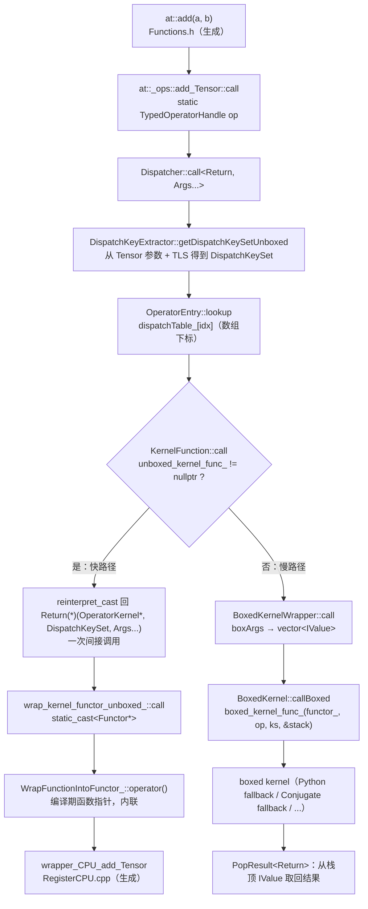

在 Python 里写 `torch.add(a, b)`，如果 `a` 在 CPU 上就跑 CPU kernel，在 GPU 上就跑 CUDA kernel。这个"按参数选实现"的动作在 C++ 层叫 dispatch，做这件事的类叫 `c10::Dispatcher`。它的核心调用路径在 `aten/src/ATen/core/dispatch/Dispatcher.h` 里（本文引用的 PyTorch 源码以 v2.10.0 为准），删掉调试和 profiler 分支后只剩这几行：

```cpp
template <class Return, class... Args>
C10_ALWAYS_INLINE_UNLESS_MOBILE Return Dispatcher::call(
    const TypedOperatorHandle<Return(Args...)>& op,
    Args... args) const {
  auto dispatchKeySet =
      op.operatorDef_->op.dispatchKeyExtractor()
          .template getDispatchKeySetUnboxed<Args...>(args...);
  // ...
  const KernelFunction& kernel = op.operatorDef_->op.lookup(dispatchKeySet);
  // ...
  return kernel.template call<Return, Args...>(
      op, dispatchKeySet, std::forward<Args>(args)...);
}
```

`lookup` 返回的 `KernelFunction` 定义在 `aten/src/ATen/core/boxing/KernelFunction.h`，它的数据成员是：

```cpp
class TORCH_API KernelFunction final {
  // ...
 private:
  BoxedKernel boxed_kernel_func_;
  void* unboxed_kernel_func_;
  void* sym_unboxed_kernel_func_;
  // ...
};
```

而 `BoxedKernel`（`aten/src/ATen/core/boxing/BoxedKernel.h`）里面是：

```cpp
class TORCH_API BoxedKernel final {
  // ...
  using InternalBoxedKernelFunction =
      void(OperatorKernel*, const OperatorHandle&, DispatchKeySet, Stack*);
  // ...
  c10::intrusive_ptr<OperatorKernel> functor_;
  InternalBoxedKernelFunction* boxed_kernel_func_;
};
```

一个 Java 工程师看到这里会有一连串疑问。一个"kernel"为什么被存成 `void*`？`void*` 怎么调用？`OperatorKernel` 是一个只有虚析构函数的空结构体，它存在的意义是什么？同一个 kernel 为什么既有 `boxed_kernel_func_` 又有 `unboxed_kernel_func_`，`Stack*` 又是什么？如果这是 Java，"按运行时类型选实现"只有一种做法——接口加虚方法，`Dispatcher` 大概会是一个 `Map<DispatchKey, Kernel>`，`Kernel` 是一个接口。PyTorch 没有这么写，它把 kernel 的类型信息**擦掉**，存成两个函数指针和一个基类指针。

原因是 C++ 有不止一种多态。虚函数只是其中一种，代价是每次调用一次间接跳转、每个对象一个 vtable 指针、编译器无法内联。函数指针、函数对象、模板、CRTP、类型擦除、`std::variant`——每一种都在"灵活性"和"零开销"之间取不同的点，AI-Infra 项目会按场景混用。读懂 `KernelFunction`，就是读懂这些机制怎么组合。本文的核心问题是：

> **Dispatcher 拿到一个 `OperatorHandle` 和一组参数后，用什么 C++ 机制调到 CPU kernel？为什么既有 boxed 又有 unboxed？**

全文提纲：

1. 虚函数与 vtable：C++ 里"默认不虚"的多态
2. 函数指针：最古老的运行期分派
3. `std::function`、`c10::function_ref`、函数对象与 lambda
4. CRTP：编译期多态
5. 类型擦除：`c10::KernelFunction` 的 boxed 与 unboxed 两条路径
6. `c10::IValue`：手工实现的带类型标签的联合体
7. 异常：`TORCH_CHECK` 抛出的是什么，如何跨越 C++/Python 边界
8. 回到源码：从 `at::add` 到 CPU kernel 的完整链路
9. mini-c10：`DispatchKey`、`KernelFunction`、`OperatorEntry`、`Dispatcher`
10. 工程实践建议与常见错误
11. 总结


## 一、虚函数与 vtable：C++ 里"默认不虚"的多态

### 1.1 `virtual`、`override`、`final`、纯虚函数与抽象类

Java 的实例方法默认就是虚的——只要不是 `final`、`static` 或 `private`，子类就能覆盖，调用点在运行期按对象的实际类型选实现。C++ 反过来：成员函数默认**不虚**，只有显式标 `virtual` 的才参与运行期分派。

一个最小例子：

```cpp
struct Shape {                       // 抽象类：有纯虚函数，不能直接实例化
  virtual ~Shape() = default;        // 虚析构（1.3 节解释为什么必须有）
  virtual double area() const = 0;   // 纯虚函数：= 0 表示没有默认实现
  virtual const char* name() const { return "Shape"; }
};
struct Circle final : Shape {        // final：Circle 不能再被继承
  double r;
  explicit Circle(double r) : r(r) {}
  double area() const override { return 3.14159 * r * r; }
  const char* name() const override { return "Circle"; }
};
struct Square : Shape {
  double s;
  explicit Square(double s) : s(s) {}
  double area() const override { return s * s; }
  // 没有覆盖 name()：继承基类版本
};
```

几个关键字的含义：

- `virtual`：声明这个函数参与运行期分派。派生类里覆盖它时可以不重写 `virtual`（继承下来的虚性不会丢），但习惯上写 `override`。
- `override`（C++11）：告诉编译器"我要覆盖基类的一个虚函数"。如果基类里没有签名一致的虚函数，编译报错。它相当于 Java 的 `@Override`，但不是注解而是关键字——写错签名（比如漏了 `const`）在 Java 里是静默地新建了一个方法，在 C++ 里加 `override` 后会直接报错。PyTorch 的 clang-tidy 规则要求所有覆盖都写 `override`。
- `final`：用在类上表示不能被继承，用在虚函数上表示不能再被覆盖。它对编译器有实际意义：调用一个 `final` 类的虚函数时，编译器知道实际类型就是这个类，可以去掉虚调用（devirtualization）。`c10::KernelFunction`、`c10::BoxedKernel`、`c10::IValue`、`OperatorEntry` 都标了 `final`——不是为了防止别人继承，而是明确"这是值类型 / 实体类型，不是接口"。
- `= 0`：纯虚函数。有至少一个纯虚函数的类是抽象类，不能实例化，只能作为基类。Java 的 `interface` 和 `abstract class` 都对应到这里；C++ 没有单独的 `interface` 关键字，"全是纯虚函数、没有数据成员的抽象类"就是接口。

真实源码里的同一模式，`c10/core/Allocator.h` 的 `Allocator` 接口（第二篇读过它的所有权部分）：

```cpp
struct C10_API Allocator {
  virtual ~Allocator() = default;

  virtual DataPtr allocate(size_t n) = 0;
  // ...
  virtual DeleterFnPtr raw_deleter() const {
    return nullptr;
  }
  // ...
  virtual void copy_data(void* dest, const void* src, std::size_t count)
      const = 0;
  // ...
};
```

以及 `aten/src/ATen/EmptyTensor.cpp` 里给 Meta 设备用的实现——它什么都不分配，只返回一个空的 `DataPtr`：

```cpp
struct MetaAllocator final : public at::Allocator {
  MetaAllocator() = default;
  ~MetaAllocator() override = default;
  static void deleter(void* const pointer) {
    TORCH_INTERNAL_ASSERT(!pointer);
  }
  DataPtr allocate(const size_t nbytes [[maybe_unused]]) override {
    return {nullptr, nullptr, &deleter, at::Device(DeviceType::Meta)};
  }
  DeleterFnPtr raw_deleter() const override {
    return deleter;
  }
  void copy_data(void* dest, const void* src, std::size_t count) const final {}
};
```

三个关键字全在这段代码里：类标 `final`，`allocate` 和 `raw_deleter` 标 `override`，`copy_data` 标 `final`（既是 override 也禁止再覆盖）。`at::empty` 在 Meta 设备上创建 tensor 时拿到的是一个 `Allocator*`，调 `allocate` 时才决定跑到 `MetaAllocator::allocate`——这就是虚调用。本篇 mini-c10 的 Meta 后端会用同一个思路。

### 1.2 vtable：虚调用在机器层面做了什么

Java 工程师对"虚调用"的直觉是 JVM 的 `invokevirtual`，具体实现藏在 JIT 里。C++ 的实现是公开的、可预测的，而且会直接影响对象大小和 ABI：

- 每个**有虚函数的类**有一张只读的表（vtable），每个虚函数一个槽位，存函数地址。派生类的 vtable 是基类 vtable 的"副本 + 覆盖"，槽位顺序一致。
- 每个**有虚函数的类的对象**开头多一个隐藏指针（vptr），指向所属类的 vtable。所以 `sizeof(Square)` 是 16（vptr 8 字节 + `double` 8 字节），而没有虚函数的 `struct NoVirtual { double x; }` 是 8。
- 通过基类指针/引用调 `s->area()`，编译成：读 `s` 的 vptr → 取第 N 个槽位 → 间接跳转。三步，每次调用都做。
- 编译器看到的是"一个指针 + 一个槽位号"，不知道会跳到哪里，所以**不能内联**。这一点和 Java 不同：HotSpot 会做类层次分析和内联缓存，绝大多数单态调用点最终被内联成直接调用。C++ 的 AOT 编译器只有在能证明实际类型时（局部变量、`final` 类、LTO 下整个程序只有一个实现）才能 devirtualize。跨 `.so` 边界（`libtorch_cpu.so` 调 `libtorch_cuda.so` 里的实现）永远做不到。

这就是 PyTorch 在**热路径**上尽量不用虚函数的原因。`Dispatcher::call` 每秒被调用几百万次，如果 `KernelFunction` 是接口，每个算子调用多一次不可内联的虚跳转。后面会看到它用函数指针 + 模板做到了"运行期选择、但调到具体 kernel 时是直接调用"。

用上面的例子验证一下（`clang++ -std=c++17`，macOS）：

```cpp
std::vector<std::unique_ptr<Shape>> shapes;
shapes.push_back(std::make_unique<Circle>(1.0));
shapes.push_back(std::make_unique<Square>(2.0));
for (const auto& s : shapes)        // 通过基类指针调用：运行期查 vtable
  std::printf("%s area=%.2f\n", s->name(), s->area());
std::printf("sizeof(NoVirtual)=%zu sizeof(Square)=%zu\n", sizeof(NoVirtual), sizeof(Square));
```

输出：

```text
Circle area=3.14
Shape area=4.00
sizeof(NoVirtual)=8 sizeof(Square)=16
```

`Square` 没覆盖 `name()`，所以打印 `Shape`；`sizeof` 差的 8 字节就是 vptr。

### 1.3 虚析构：通过基类指针 `delete` 派生类对象

Java 没有这个问题：GC 知道每个对象的真实类型。C++ 里 `delete p` 调用的是 `p` **静态类型**的析构函数——如果 `p` 是 `Shape*` 而实际对象是 `Circle`，且 `~Shape()` 不是虚的，那么只有 `~Shape()` 被执行，`Circle` 的成员不会析构，内存大小也可能算错。这是未定义行为，不是"少释放一点"。

规则很简单：**只要一个类打算被当作基类通过指针删除，析构函数就必须是 `virtual`**。反过来，有了虚析构，`delete base_ptr` 会先跳到派生类析构，再依次执行基类析构。

第二篇 mini-c10 的 `intrusive_ptr_target` 把析构写成 `protected` + `virtual`，真实的 `c10/util/intrusive_ptr.h` 也是：

```cpp
class C10_API intrusive_ptr_target {
  // ...
 protected:
  // protected destructor. We never want to destruct intrusive_ptr_target*
  // directly.
  virtual ~intrusive_ptr_target() {
    // ...
  }
```

`intrusive_ptr<T>` 减计数归零时执行的是 `delete target_`，`target_` 的类型是 `T*`（比如 `TensorImpl*`），但 `T` 本身还可能有派生类（`NestedTensorImpl`、`SparseTensorImpl`、`UndefinedTensorImpl`）。没有这个 `virtual`，通过 `intrusive_ptr<TensorImpl>` 释放一个 `NestedTensorImpl` 就是 UB。

同样，本篇会读到的 `c10::OperatorKernel`（`aten/src/ATen/core/boxing/OperatorKernel.h`）整个定义就是一个虚析构：

```cpp
struct TORCH_API OperatorKernel : public c10::intrusive_ptr_target {
  ~OperatorKernel() override = default;
};
```

它没有任何虚方法，唯一的职责是让 `intrusive_ptr<OperatorKernel>` 能正确释放任何派生类。这是"只为析构而存在的基类"——Java 里不需要这种东西。

### 1.4 为什么 `TensorImpl` 有虚函数而 `Tensor` 没有

第二篇讲了 `Tensor` 是句柄、`TensorImpl` 是实体。从多态的角度再看一遍这个分工。

`at::TensorBase`（`aten/src/ATen/core/TensorBase.h`）和 `at::Tensor`（生成于 `aten/src/ATen/templates/TensorBody.h`）**没有任何虚函数**，析构是 `~TensorBase() noexcept = default;`。原因有三个：

1. 它是按值传递、按值返回、放进 `std::vector` 和 `IValue` 的类型。多一个 vptr 就从 8 字节变成 16 字节，每次拷贝多拷 8 字节，`IValue` 的布局也要跟着变。
2. 它的行为不需要变——所有"不同种类 tensor 的差异"都在 `TensorImpl` 一侧。
3. 没有虚函数、没有非平凡成员（只有一个 `intrusive_ptr`）的类，在 ABI 上更稳定，pybind11 和 C API 更容易处理。

`c10::TensorImpl`（`c10/core/TensorImpl.h`）则有一组精心设计的虚函数。它是 `struct C10_API TensorImpl : public c10::intrusive_ptr_target`，析构 `~TensorImpl() override;`。但它没有把 `sizes()`、`strides()` 直接做成虚函数——那样每次读 shape 都要一次虚调用。它的做法是**"快路径 + 虚定制点"**：

```cpp
  IntArrayRef sizes() const {
    if (C10_UNLIKELY(matches_policy(SizesStridesPolicy::CustomSizes))) {
      return sizes_custom();
    }
    return sizes_and_strides_.sizes_arrayref();
  }
```

`matches_policy` 只是比较一个 `uint8_t` 字段：

```cpp
  enum class SizesStridesPolicy : uint8_t {
    // Default behavior, e.g., dense tensor.
    //
    // Can override: nothing
    Default = 0,
    // Customizable strides behavior, e.g., sparse tensor,
    // mkldnn tensor.
    //
    // Can override: strides(), is_contiguous()
    CustomStrides = 1,
    // Customizable sizes behavior, e.g., nested tensor
    //
    // Can override: strides(), is_contiguous(), sizes(), dim(), numel()
    CustomSizes = 2
  };

 protected:
  inline bool matches_policy(SizesStridesPolicy policy) const {
    return sizes_strides_policy_ >= static_cast<uint8_t>(policy);
  }
```

真正的虚函数是一组 `*_custom`，普通稠密 tensor 永远不会调到它们：

```cpp
  virtual IntArrayRef sizes_custom() const;
  virtual IntArrayRef strides_custom() const;
  virtual int64_t numel_custom() const;
  virtual int64_t storage_offset_custom() const;
  virtual int64_t dim_custom() const;
  virtual Device device_custom() const;
  virtual Layout layout_custom() const;

  virtual c10::SymIntArrayRef sym_sizes_custom() const;
  virtual c10::SymIntArrayRef sym_strides_custom() const;
  virtual c10::SymInt sym_numel_custom() const;
  virtual c10::SymInt sym_storage_offset_custom() const;
```

谁覆盖它们？`aten/src/ATen/NestedTensorImpl.h` 里的 `NestedTensorImpl`（嵌套 tensor 没有规则的 shape）：

```cpp
struct TORCH_API NestedTensorImpl : public c10::TensorImpl {
  // ...
  int64_t numel_custom() const override;
  c10::SymInt sym_numel_custom() const override;
  // ...
  IntArrayRef sizes_custom() const override;
  c10::SymIntArrayRef sym_sizes_custom() const override;
  IntArrayRef strides_custom() const override;
  c10::SymIntArrayRef sym_strides_custom() const override;
```

以及 `c10/core/UndefinedTensorImpl.h` 里的 `UndefinedTensorImpl final`（第二篇的 Null Object），它覆盖 `strides_custom`、`sym_is_contiguous_custom`、`has_storage` 等，让"未定义 tensor"调 shape 方法时给出明确报错而不是崩溃。

另一组重要的虚函数是浅拷贝：

```cpp
  virtual c10::intrusive_ptr<TensorImpl> shallow_copy_and_detach(
      const c10::VariableVersion& version_counter,
      bool allow_tensor_metadata_change) const;
  // ...
  virtual void shallow_copy_from(const c10::intrusive_ptr<TensorImpl>& impl) {
    copy_tensor_metadata(
        /*src_impl=*/impl.get(),
        /*dest_impl=*/this,
        /*version_counter=*/version_counter(),
        /*allow_tensor_metadata_change=*/allow_tensor_metadata_change());
  }
```

`x.detach()` 最终调 `shallow_copy_and_detach`。它必须是虚的：对一个 `SparseTensorImpl` 做 detach，新建的对象也必须是 `SparseTensorImpl`，而不是裁成 `TensorImpl`。这是经典的"虚拷贝构造"（virtual clone）模式——C++ 构造函数不能是虚的，所以用一个返回智能指针的虚函数代替。Java 里对应的是覆盖 `clone()`。

总结这个分工：

| | `Tensor` | `TensorImpl` |
|---|---|---|
| 角色 | 值类型句柄 | 堆上实体 |
| 大小 | 8 字节（一个指针） | 数百字节 |
| 虚函数 | 没有 | 虚析构 + `*_custom` 定制点 + `shallow_copy_and_detach` |
| 多态发生在哪 | 不发生 | 通过 `intrusive_ptr<TensorImpl>` 调虚函数 |
| 热路径保护 | — | 先查 `sizes_strides_policy_` 字节，默认不进虚调用 |

Java 对照：Java 里所有对象都是"实体 + 引用"，`Tensor`/`TensorImpl` 的拆分没有对应物。Java 引用本身不能有方法，所以只能把所有行为放在对象上、全部走虚调用。C++ 把"轻量、可拷贝、无多态"的句柄和"重量、不可拷贝、有多态"的实体拆开，两边各取所需。

### 1.5 手工 vtable：`PyInterpreterVTable`

编译器生成的 vtable 有一个限制：它属于类，不能在运行期换。`c10/core/impl/PyInterpreter.h` 展示了一个**手工 vtable** 的用法，理由写在文件头的长注释里，摘录关键部分：

```cpp
// WARNING: This class has to be written very carefully, because it may be
// possible for a Tensor to have a reference an interpreter corresponding to
// a shared library that has ALREADY BEEN UNLOADED.  This makes blindly calling
// virtual methods very dangerous, because the vtable may be garbage at that
// point (on a good day, you might get "pure virtual method called").
//
// The idea to solve this problem is we always leak PyInterpreters (so they
// always stay live even after dlclose), and make sure we can disarm their
// virtual methods by indirecting through a separate PyInterpreterVTable
// object.  This can be replaced with a no-op vtable from libc10.so, which
// is guaranteed to stick around until the bitter end.
```

背景是：`TensorImpl` 上存了一个 `PyObject*` 和一个指向"哪个 Python 解释器"的标签。`libtorch_python.so` 可能先于某些长寿命 tensor 被卸载，卸载后 vtable 所在的内存段已经不存在，调虚函数会跳到垃圾地址。解决办法是把"vtable"做成一个普通对象，用指针指向它，需要时把指针换成一个全部 no-op 的实现：

```cpp
struct C10_API PyInterpreterVTable {
  virtual ~PyInterpreterVTable() = default;

  // Report the name of this interpreter
  virtual std::string name() const = 0;

  // Run Py_INCREF on a PyObject.
  virtual void incref(PyObject* pyobj) const = 0;
  // Run Py_DECREF on a PyObject.  We DO NOT assume the GIL is held on call.
  virtual void decref(PyObject* pyobj) const = 0;
  // ...
  // Invoke the Python boxed fallback dispatch to go back into Python
  virtual void dispatch(const c10::OperatorHandle& op, torch::jit::Stack* stack)
      const = 0;
  // ...
  virtual c10::IntArrayRef sizes(const TensorImpl* self) const = 0;
  // ...
};

struct C10_API PyInterpreter {
  const PyInterpreterVTable* vtable_;

  PyInterpreter(const PyInterpreterVTable* vtable) : vtable_(vtable) {}

  const PyInterpreterVTable& operator*() const noexcept {
    return *vtable_;
  }
  const PyInterpreterVTable* operator->() const noexcept {
    return vtable_;
  }

  // Disarm this PyInterpreter, making all of its methods noops.
  // ...
  void disarm() noexcept;
};
```

`PyInterpreterVTable` 本身是一个普通的抽象类（用了编译器的 vtable），`PyInterpreter` 只是一个指向它的指针包装。`disarm()` 把 `vtable_` 换成 `libc10.so` 里一个所有方法都为空的实现。这里有两层间接：编译器 vtable 负责"哪个方法"，手工的 `vtable_` 指针负责"哪套实现、能不能换"。注意 `dispatch(op, stack)` 这个方法——它就是 C++ 回到 Python 执行算子的入口，参数是 `Stack*`，也就是 boxed 调用约定，第五节会解释为什么这里只能是 boxed。

Java 对照：JVM 里一个类的方法表在类加载后固定，但类可以被卸载（class loader 被回收）；Java 用 GC 保证"还有引用就不会卸载"。C++ 的 `dlclose` 不看有没有人还持有指针，所以需要这种防御性设计。


## 二、函数指针：最古老的运行期分派

### 2.1 语法、类型别名与函数类型

虚函数之前，C 语言就有运行期分派：函数指针。语法一直是 C++ 最难读的部分之一，AI-Infra 代码里一律用类型别名：

```cpp
using DeleterFnPtr = void (*)(void*);                 // 指向 "接受 void*、返回 void" 的函数的指针
using BoxedKernelFunction = void(const OperatorHandle&, Stack*);   // 注意：这是函数类型，不是指针
BoxedKernelFunction* fn = &my_boxed_kernel;           // 加 * 才是指针
```

`c10/core/Allocator.h` 的 `DeleterFnPtr` 第二篇已经见过。`BoxedKernel.h` 里的三个别名都定义成**函数类型**而不是指针类型：

```cpp
  using InternalBoxedKernelFunction =
      void(OperatorKernel*, const OperatorHandle&, DispatchKeySet, Stack*);
  // This is the public API for how boxed kernels are defined
  using BoxedKernelFunction = void(const OperatorHandle&, Stack*);
  using BoxedKernelFunction_withDispatchKeys =
      void(const OperatorHandle&, DispatchKeySet, Stack*);
```

然后在需要指针的地方写 `InternalBoxedKernelFunction* boxed_kernel_func_;`，在模板参数里写 `template <BoxedKernelFunction* func>`。这样写的好处是函数类型可以直接作为模板参数做特化（第五节的 `BoxedKernelWrapper<Result(Args...)>`）。

Java 没有函数指针。最接近的是方法引用 `Foo::bar` 和函数式接口，但那是在堆上创建一个实现了接口的对象，调用仍是虚调用。C++ 的函数指针就是一个代码地址，8 字节，调用是一次间接跳转（`call *%rax`），没有对象、没有分配、没有 vtable 查找。

### 2.2 运行期函数指针与编译期函数指针

函数指针作为参数传进去，编译器只知道"这是某个函数的地址"，不能内联。但如果函数指针作为**非类型模板参数**传进去，编译器在实例化时就知道它指向谁，可以直接调用甚至内联。这是 `KernelFunction` 区分 `makeFromUnboxedFunction` 和 `makeFromUnboxedRuntimeFunction` 的原因，`KernelFunction.h` 的注释写得很直接：

```cpp
  /**
   * Create a KernelFunction from an unboxed function.
   * This is usually better than KernelFunction::makeFromUnboxedRuntimeFunction
   * because knowing the function pointer as a template argument (i.e. at
   * compile time) allows the compiler to inline the function into its
   * unboxing wrapper and yields better performance when calling the function.
   *
   * Example:
   *
   * > Tensor unboxed_func(Tensor a, Tensor b) {...}
   * > KernelFunction func =
   * KernelFunction::makeFromUnboxedFunction<decltype(unboxed_func),
   * &unboxed_func>();
   */
  template <class FuncPtr, bool AllowLegacyTypes = false>
  static KernelFunction makeFromUnboxedFunction(FuncPtr /*func_ptr*/);
```

"编译期函数指针"怎么表示成一个类型？`c10/core/CompileTimeFunctionPointer.h`：

```cpp
template <class FuncType_, FuncType_* func_ptr_>
struct CompileTimeFunctionPointer final {
  static_assert(
      guts::is_function_type<FuncType_>::value,
      "TORCH_FN can only wrap function types.");
  using FuncType = FuncType_;

  static constexpr FuncType* func_ptr() {
    return func_ptr_;
  }
};
// ...
#define TORCH_FN_TYPE(func)                                           \
  ::c10::CompileTimeFunctionPointer<                                  \
      std::remove_pointer_t<std::remove_reference_t<decltype(func)>>, \
      func>
#define TORCH_FN(func) TORCH_FN_TYPE(func)()
```

`TORCH_FN(add_cpu)` 展开成 `CompileTimeFunctionPointer<Tensor(const Tensor&, const Tensor&), &add_cpu>()`——一个**空对象**，它的类型里编码了函数地址。`func_ptr()` 是 `constexpr`，调用它不产生任何运行期代码。torchgen 生成的所有注册代码都用这个形式（`torchgen/dest/register_dispatch_key.py`）：

```python
                    payload = f"TORCH_FN({name})"
                    return f'm.impl("{f.func.name}",\n{payload});\n'
```

而 vLLM 的 CPU 绑定（`csrc/cpu/torch_bindings.cpp`）传的是普通函数指针：

```cpp
  ops.impl("silu_and_mul", torch::kCPU, &silu_and_mul);
```

这条路走的是 `makeFromUnboxedRuntimeFunction`，多一次间接调用。对于一个要跑几毫秒的 kernel，这点开销无关紧要；对 `aten::view`、`aten::t` 这类几乎不做计算、每次调用只有几十纳秒的算子就有关系，所以 ATen 内部统一用 `TORCH_FN`。

### 2.3 用 `void*` 存函数指针

回到开头的 `void* unboxed_kernel_func_`。为什么不存一个类型正确的函数指针？因为 `KernelFunction` 是一个**非模板类**，要能放进 `std::array<KernelFunction, N>` 里统一管理，而每个算子的 kernel 签名都不一样（`Tensor(const Tensor&, const Tensor&)`、`Tensor(const Tensor&, IntArrayRef, bool)`……）。签名是类型的一部分，要放进同一个数组，就必须把签名擦掉。

擦掉的方式是 `reinterpret_cast<void*>`，用的时候再 cast 回**完全相同**的签名。`KernelFunction_impl.h`：

```cpp
template <class Return, class... Args>
inline Return callUnboxedKernelFunction(
    void* unboxed_kernel_func,
    OperatorKernel* functor,
    DispatchKeySet dispatchKeySet,
    Args&&... args) {
  using ActualSignature = Return(OperatorKernel*, DispatchKeySet, Args...);
  ActualSignature* func =
      reinterpret_cast<ActualSignature*>(unboxed_kernel_func);
  return (*func)(functor, dispatchKeySet, std::forward<Args>(args)...);
}
```

两点需要知道：

1. 函数指针和 `void*` 互转在标准里是"条件支持"（conditionally-supported），POSIX 要求支持（`dlsym` 返回 `void*` 就依赖它），所有主流平台都可以。
2. **cast 回去的签名必须和存进去时一字不差**。`Return(OperatorKernel*, DispatchKeySet, const Tensor&, const Tensor&)` 和 `Return(OperatorKernel*, DispatchKeySet, Tensor, Tensor)` 是不同类型，用错了就是 UB——不是编译错误，而是参数按错误的方式压栈，运行时出错或悄悄算错。这就是为什么 `KernelFunction::call<Return, Args...>` 要求调用方**显式写出模板参数**，以及 `OperatorEntry` 要记 `cpp_signature_` 在注册时校验签名（第八节）。

这里的取舍是：用一点 UB 风险（由注册时的签名检查兜住）换取"一个非模板的 `KernelFunction` 能装任意签名的 kernel，调用时零额外开销"。Java 里没有对应物——JVM 的类型系统不允许擦掉方法签名后再 cast 回来，只能走接口。


## 三、`std::function`、`c10::function_ref`、函数对象与 lambda

函数指针只能指向"函数"，不能带状态。要传一个"带数据的可调用对象"，C++ 有三个层次的工具，代价依次递减：`std::function`（拥有、类型擦除）、`c10::function_ref`（不拥有、类型擦除）、模板参数（不擦除、零开销）。

### 3.1 `std::function`：拥有型的类型擦除，以及它的代价

`std::function<R(Args...)>` 能装任何签名兼容的可调用对象——函数指针、lambda、带 `operator()` 的类、`std::bind` 的结果——并按值拥有它。它是 Java 函数式接口（`Runnable`、`Function<T,R>`）最直接的对应物。

代价有三项：

1. **大小**：本机 libc++ 下 `sizeof(std::function<void()>)` 是 32 字节，libstdc++ 也是 32（函数指针是 8）。
2. **堆分配**：被装进去的对象超过内部小缓冲区（通常 16 字节）就要 `new`。一个捕获了两个 `Tensor` 的 lambda 就会触发。
3. **间接调用**：调用时经一层内部的函数指针或虚函数跳转，不能内联。

PyTorch 在**不介意这些代价的地方**用它，比如线程池的任务队列（`c10/core/thread_pool.h`）：

```cpp
class C10_API TaskThreadPoolBase {
 public:
  virtual void run(std::function<void()> func) = 0;
  // ...
};

class C10_API ThreadPool : public c10::TaskThreadPoolBase {
 protected:
  struct task_element_t {
    bool run_with_id;
    // ...
    const std::function<void()> no_id;
    // ...
    const std::function<void(std::size_t)> with_id;
    // ...
  };

  std::queue<task_element_t> tasks_;
```

一个任务提交要跨线程、要排队、要拥有闭包，`std::function` 正合适；比起线程切换的开销，它的堆分配可以忽略。

而在**介意的地方**，PyTorch 会明确标出来。`c10/core/Allocator.h` 里有一个类型叫 `InefficientStdFunctionContext`——名字本身就是警告：

```cpp
// This context is inefficient because we have to do a dynamic
// allocation InefficientStdFunctionContext, on top of the dynamic
// allocation which is implied by std::function itself.
struct C10_API InefficientStdFunctionContext {
  void* ptr_{nullptr};
  std::function<void(void*)> deleter_;
  // ...
  ~InefficientStdFunctionContext() {
    if (deleter_) {
      deleter_(ptr_);
    }
  }
  static DataPtr makeDataPtr(
      void* ptr,
      std::function<void(void*)> deleter,
      Device device);
};
```

第二篇讲过 `DataPtr` 的删除器是裸函数指针 `DeleterFnPtr`，因为每个 tensor 都有一个 `DataPtr`，不能为它多做一次堆分配。只有 `torch.from_blob` 这类用户传任意闭包做删除器的接口，才退回到 `std::function`，并且把它包进一个显式命名为 "Inefficient" 的上下文对象里。

Java 对照：Java 里每个 lambda 都是堆对象（除非 JIT 逃逸分析消除了它），每次调用都是接口调用；`std::function` 大致就是这个模型在 C++ 里的复现，所以它的代价对 Java 工程师来说"很正常"。不正常的是 C++ 有比它便宜得多的选项，热路径上用 `std::function` 会被 reviewer 打回。

### 3.2 `c10::function_ref`：非拥有的类型擦除

很多时候被调用方**不需要拥有**闭包，只是在自己返回前调它几次。这种场景下 `std::function` 的拷贝和堆分配纯属浪费。`c10/util/FunctionRef.h`（从 LLVM 的 `llvm::function_ref` 移植）就是为此设计的，整个实现只有二十几行：

```cpp
/// An efficient, type-erasing, non-owning reference to a callable. This is
/// intended for use as the type of a function parameter that is not used
/// after the function in question returns.
///
/// This class does not own the callable, so it is not in general safe to store
/// a function_ref.
template <typename Fn>
class function_ref;

template <typename Ret, typename... Params>
class function_ref<Ret(Params...)> {
  Ret (*callback)(intptr_t callable, Params... params) = nullptr;
  intptr_t callable{};

  template <typename Callable>
  static Ret callback_fn(intptr_t callable, Params... params) {
    return (*reinterpret_cast<Callable*>(callable))(
        std::forward<Params>(params)...);
  }

 public:
  // ...
  template <typename Callable>
  function_ref(
      Callable&& callable,
      // ... 两个 enable_if，略
      )
      : callback(callback_fn<std::remove_reference_t<Callable>>),
        callable(reinterpret_cast<intptr_t>(&callable)) {}

  Ret operator()(Params... params) const {
    return callback(callable, std::forward<Params>(params)...);
  }
  // ...
};
```

这是理解**类型擦除**最好的入门例子，因为它把技巧压缩到了最小：

- 两个字段：一个函数指针 `callback`，一个 `intptr_t callable`（其实就是 `void*`）。共 16 字节，没有堆分配。
- 构造时，模板构造函数知道 `Callable` 的具体类型，于是实例化一个静态函数 `callback_fn<Callable>`——它知道怎么把 `intptr_t` cast 回 `Callable*` 并调用 `operator()`。把这个静态函数的地址存进 `callback`，把闭包的地址存进 `callable`。
- 从此 `function_ref` 本身不再知道 `Callable` 是什么，但 `callback_fn<Callable>` 知道。类型信息被"擦掉"，然后藏在了一个函数指针指向的代码里。

`callback_fn<Callable>` 这种"知道具体类型的静态包装函数"是所有类型擦除的核心，第五节 `KernelFunction` 的 `wrap_kernel_functor_unboxed_::call` 和 `make_boxed_from_unboxed_functor::call` 是同一个东西的放大版。

它在 PyTorch 里的典型用途是 `TensorIterator` 的循环回调（`aten/src/ATen/TensorIterator.h`）：

```cpp
  using loop2d_t = c10::function_ref<
      void(char** data, const int64_t* strides, int64_t size0, int64_t size1)>;
  // ...
  void for_each(loop2d_t loop, int64_t grain_size = at::internal::GRAIN_SIZE);
```

`for_each` 是在 `.cpp` 里实现的非模板函数（否则每个 kernel 都要实例化一份复杂的迭代逻辑），它需要一个"能调的东西"但不需要拥有它，所以用 `function_ref`。调用方传 lambda 时不会有任何分配。

代价是它**不安全存储**：`callable` 指向调用方栈上的闭包，函数返回后就悬垂了。注释第一句就在强调这一点。

### 3.3 函数对象与 lambda 作为模板参数：零开销的策略

第三种方式不擦除类型：把可调用对象的类型作为模板参数传进去。被调用方为每种可调用类型实例化一份代码，调用点直接调 `op(...)`，编译器完全知道 `op` 是什么，可以内联、可以向量化。

`aten/src/ATen/native/cpu/Loops.h` 的 `cpu_kernel` 是这个模式的代表：

```cpp
template <typename func_t>
void cpu_kernel(TensorIteratorBase& iter, func_t&& op, int64_t grain_size = at::internal::GRAIN_SIZE) {
  using traits = function_traits<func_t>;
  // this could be extended to work with void return types
  TORCH_INTERNAL_ASSERT(iter.ninputs() == traits::arity);
  TORCH_INTERNAL_ASSERT(iter.noutputs() == 1);
  // ...
  iter.for_each([&](char** data, const int64_t* strides, int64_t n) {
    // basic loop can handle 1d slices with arbitrary strides, and 1d slices is all that
    // iter.for_each is ever sending to the loop lambda
      basic_loop(data, strides, 0, n, op);
  }, grain_size);
  iter.cast_outputs();
}
```

`func_t` 是从 `op` 推导出来的 lambda 类型（每个 lambda 表达式都是一个独一无二的匿名类型，第三篇讲过）。`basic_loop` 同样是 `template <typename func_t>`，最里层的 `execute_op`：

```cpp
template <typename func_t>
inline void
execute_op(char* C10_RESTRICT data[], const int64_t* strides, int64_t i, int64_t n, func_t&& op) {
  using traits = function_traits<func_t>;
  for (; i < n; i++) {
    std::apply(op, dereference<traits>(
        &data[0],
        &strides[0],
        i));
  }
}
```

`std::apply(op, ...)` 就是 `op(a, b)`。编译器看到的是一个具体 lambda 类型的 `operator()`，会把它内联进 `for` 循环体，然后整个循环可以被自动向量化。这也是 `function_traits<func_t>` 能在编译期知道 `arity`（参数个数）的原因——类型没有被擦掉。

调用方长什么样，`aten/src/ATen/native/cpu/BinaryOpsKernel.cpp`：

```cpp
void add_clamp_kernel(
    TensorIterator& iter,
    const Scalar& alpha_scalar,
    const Scalar& min_val,
    const Scalar& max_val) {
  AT_DISPATCH_ALL_TYPES(iter.dtype(), "add_clamp_cpu", [&]() {
    auto alpha = alpha_scalar.to<scalar_t>();
    // ...
    cpu_kernel_vec(
        iter,
        [=](scalar_t a, scalar_t b) __ubsan_ignore_undefined__ -> scalar_t {
          return std::min(
              max_scalar,
              std::max(min_scalar, static_cast<scalar_t>(a + alpha * b)));
        },
        [=](Vectorized<scalar_t> a, Vectorized<scalar_t> b)
            __ubsan_ignore_undefined__ {
              // ...
            });
  });
}
```

这里的两层 lambda 用了不同的捕获方式，正好说明选择规则：外层 `AT_DISPATCH` 的 lambda 用 `[&]`（引用捕获），因为它立刻在同一个栈帧内被调用完就结束；内层传给 `cpu_kernel_vec` 的 lambda 用 `[=]`（值捕获），因为它会被层层转发进 `basic_loop`/`vectorized_loop` 这些内部模板、在 `parallel_for` 的工作线程上执行，值捕获让闭包自带一切所需状态，不必推理外层变量的生命周期（第三篇的规则，第六篇讲线程）。`[=]` 捕获的 `alpha`、`min_scalar` 是 `scalar_t` 标量，拷贝很便宜，而且成了闭包对象的成员——闭包就是一个"带状态的函数对象"，`cpu_kernel_vec` 把它当成模板参数接住，没有任何擦除。

在 CUDA 代码里这个模式更普遍：`gpu_kernel(iter, []GPU_LAMBDA(scalar_t a, scalar_t b) -> scalar_t { return a + b; })`。kernel 函数是模板，lambda 类型是模板参数，编译出来的 PTX 里 lambda 体就是 kernel 体本身。

Java 对照：Java 的策略模式（`Comparator<T>`、`Function<T,R>`）在语言层面永远是接口调用，能否内联取决于 JIT 在运行期观察到的调用点是否单态。C++ 模板在编译期就把策略"焊死"在调用点上——代价是每种策略一份代码（二进制体积），和无法在运行期换策略。

### 3.4 四种可调用抽象的对比

| | 函数指针 | `std::function` | `c10::function_ref` | 模板参数 |
|---|---|---|---|---|
| 大小 | 8 | 32 | 16 | 0（内联进调用方） |
| 能带状态 | 否 | 是（拥有） | 是（借用） | 是（拥有或借用，看怎么传） |
| 堆分配 | 无 | 闭包大时有 | 无 | 无 |
| 调用开销 | 一次间接跳转 | 一次间接跳转 + 可能的空检查 | 一次间接跳转 | 直接调用，可内联 |
| 能存起来 | 是 | 是 | **否**（悬垂） | 只能存在同为模板的容器里 |
| 能放进非模板类 / 数组 | 是 | 是 | 是（短期） | 否 |
| PyTorch 用例 | `DeleterFnPtr`、`boxed_kernel_func_` | 线程池任务、`from_blob` 删除器 | `TensorIterator::for_each` | `cpu_kernel`、`gpu_kernel`、`AT_DISPATCH` |

`KernelFunction` 需要"能放进非模板类的数组里"（`OperatorEntry::dispatchTable_`），排除了模板参数；需要"每次算子调用零额外开销"，排除了 `std::function`；需要"能带状态"（kernel functor 可以有成员），排除了裸函数指针。于是它自己实现了一个介于 `function_ref` 和 `std::function` 之间的东西：`functor_`（拥有状态，`intrusive_ptr`）+ 两个函数指针。这就是第五节。


## 四、CRTP：编译期多态

### 4.1 模式本身

虚函数解决的问题是"基类的代码调用派生类的实现"。如果基类在编译期就知道派生类是谁，就不需要 vtable。CRTP（Curiously Recurring Template Pattern，奇异递归模板模式）就是让基类以派生类为模板参数：

```cpp
template <typename Derived>
struct ModelBase {
  void run() {
    std::printf("prepare\n");
    static_cast<Derived*>(this)->run_impl();   // 编译期已知 Derived：直接调用，可内联
    std::printf("finish\n");
  }
};
struct MyModel : ModelBase<MyModel> {          // 把自己传给基类
  void run_impl() { std::printf("MyModel::run_impl\n"); }
};
```

`ModelBase<MyModel>::run` 里的 `static_cast<Derived*>(this)` 是安全的，因为 `this` 确实指向一个 `MyModel`（只有 `MyModel` 会以 `ModelBase<MyModel>` 为基类）。`run_impl` 不是虚函数，`sizeof(ModelBase<MyModel>)` 是 1（空类），没有 vptr。

代价是：`ModelBase<A>` 和 `ModelBase<B>` 是两个无关的类型，不能放进同一个 `std::vector<ModelBase*>`。所以 CRTP 适合"实现复用 + 编译期定制"，不适合"运行期多态容器"。

### 4.2 源码里的真实用例

**用例一：AOTInductor 生成的模型类。** `torch/csrc/inductor/aoti_runtime/model_base.h`，注释直接说明了动机：

```cpp
// Defines the base class for AOTInductorModel, which is generated by the
// AOTInductor cpp codegen. Since we do not need dynamic dispatch, we rely
// on curiously recurring template pattern (CRTP) to save some runtime
// v-table overhead. The generated AOTInductorModel is specialized with
// methods such as run_impl.
template <typename Model>
class AOTInductorModelBase {
 public:
  // ...
  void run(
      AtenTensorHandle* input_handles,
      // ...
      DeviceStreamType stream,
      AOTIProxyExecutorHandle proxy_executor) {
    // ... 创建 / 等待 CUDA event
    auto* model = static_cast<Model*>(this);
    model->run_impl(input_handles, output_handles, stream, proxy_executor);
    // ... 记录 CUDA event
  }
```

派生类在 `torch/csrc/inductor/aoti_runtime/model.h`：

```cpp
class AOTInductorModel : public AOTInductorModelBase<AOTInductorModel> {
 public:
  // ...
  void run_impl(
      AtenTensorHandle* input_handles,
      // ...
      DeviceStreamType stream,
      AOTIProxyExecutorHandle proxy_executor);
```

`run_impl` 的函数体由 `torch._inductor` 的 C++ codegen 为每个被编译的模型生成。一个 `model.so` 里只有一个模型类，永远不需要"多个模型放同一个容器"，所以用 CRTP 把 event 管理等公共逻辑放进基类、把模型主体放进派生类，没有 vtable。

**用例二：`torch::nn::Cloneable`。** `torch/csrc/api/include/torch/nn/cloneable.h`，这是 CRTP 和虚函数**混用**的例子：

```cpp
/// The `clone()` method in the base `Module` class does not have knowledge of
/// the concrete runtime type of its subclasses. Therefore, `clone()` must
/// either be called from within the subclass, or from a base class that has
/// knowledge of the concrete type. `Cloneable` uses the CRTP to gain
/// knowledge of the subclass' static type and provide an implementation of the
/// `clone()` method. We do not want to use this pattern in the base class,
/// because then storing a module would always require templatizing it.
template <typename Derived>
class Cloneable : public Module {
 public:
  using Module::Module;

  /// `reset()` must perform initialization of all members with reference
  /// semantics, most importantly parameters, buffers and submodules.
  virtual void reset() = 0;

  /// Performs a recursive "deep copy" of the `Module`, ...
  std::shared_ptr<Module> clone(
      const std::optional<Device>& device = std::nullopt) const override {
    NoGradGuard no_grad;

    const auto& self = static_cast<const Derived&>(*this);
    auto copy = std::make_shared<Derived>(self);
    // ...
    copy->reset();
    // ...
    return copy;
  }
```

问题是 1.4 节提过的"虚拷贝构造"：`Module::clone()` 是虚函数，但基类不知道要 `make_shared<哪个类型>`。传统做法是每个子类手写一遍 `clone()`。这里用 CRTP 中间层 `Cloneable<Derived>` 自动生成：它知道 `Derived`，所以能写 `std::make_shared<Derived>(self)`，然后以 `override` 的方式把这个实现挂到 `Module` 的虚函数上。用户写 `struct Linear : Cloneable<Linear>`，就同时得到了运行期多态（`shared_ptr<Module>` 容器）和自动生成的 `clone`。注释最后一句解释了为什么不在 `Module` 本身用 CRTP——那样所有存 `Module` 的地方都得变成模板。

### 4.3 Java 对照

Java 里形式上最像的是自引用泛型 `class Foo implements Comparable<Foo>`，但它解决的是类型安全（`compareTo(Foo)` 而不是 `compareTo(Object)`），不是分派——`compareTo` 仍然是虚方法。Java 泛型在编译后被擦除，`Base<T>` 里没有办法 `(T) this` 拿到静态类型然后直接调用 `T` 的非虚方法（`T` 的方法本来也都是虚的）。所以 CRTP 在 Java 里没有对应物：Java 不需要它（JIT 会内联单态虚调用），也做不到它（没有编译期实例化）。

读 PyTorch 源码时，看到 `class X : public Base<X>` 就是 CRTP。看到 `static_cast<Derived*>(this)` 就是它在"向下转型"——这个 cast 在 CRTP 之外是危险的，在 CRTP 里是惯用法。


## 五、类型擦除：`c10::KernelFunction` 的 boxed 与 unboxed 两条路径

### 5.1 什么是类型擦除

前面已经见过三个类型擦除的例子：`std::function`、`c10::function_ref`、`void* unboxed_kernel_func_`。它们的共同结构是：

1. 有一个**非模板**的外壳类型，接口固定；
2. 有一个**模板**构造函数/工厂，它知道被装进去的东西的具体类型 `T`；
3. 构造时实例化一组"知道 `T`"的静态函数（或一个派生类），把它们的地址存进外壳；
4. 之后外壳只通过这些地址操作被装的东西，再也不提 `T`。

Java 里不需要这个技巧，因为所有对象都有统一基类 `Object` 和运行期类型信息，`List<Object>` 天然能装任何东西。C++ 没有统一基类，也没有默认的运行期类型信息，"把不同类型的东西装进同一个容器"必须手工做——要么加一个公共虚基类（侵入式，需要被装的类型配合），要么类型擦除（非侵入式，任何类型都行）。`std::shared_ptr` 的删除器、`std::any`、`std::function` 都是标准库里的类型擦除。

`KernelFunction` 要擦的是 kernel 的**签名**。下面把它拆开看。

### 5.2 三个字段

`KernelFunction.h` 的类注释：

```cpp
/**
 * KernelFunction is similar to std::function but stores a kernel function.
 * You can create a KernelFunction from a boxed or unboxed
 * function/functor/lambda and call it in a boxed or unboxed way. If the way it
 * was created doesn't match the way it was called, it will do boxing or
 * unboxing as necessary.
 */
```

先定义两个词：

- **unboxed**：用普通 C++ 签名调用，`Tensor add(const Tensor& a, const Tensor& b)`。参数在寄存器/栈上，类型在编译期确定。
- **boxed**：所有参数装进一个 `std::vector<IValue>`（叫 `Stack`），签名统一为 `void(const OperatorHandle&, Stack*)`。kernel 从栈上取参数、把结果压回栈。类型在运行期由 `IValue` 的 tag 确定。

数据成员（开头引过）：

```cpp
  BoxedKernel boxed_kernel_func_;
  void* unboxed_kernel_func_;
  void* sym_unboxed_kernel_func_;
```

`BoxedKernel` 里面是 `functor_` 和 `boxed_kernel_func_`（`BoxedKernel.h`）：

```cpp
  c10::intrusive_ptr<OperatorKernel> functor_;
  InternalBoxedKernelFunction* boxed_kernel_func_;
```

（版本变化：早期版本（如 1.5）`functor_` 直接是 `KernelFunction` 的成员，且类型是 `std::shared_ptr<OperatorKernel>`；现在拆出了 `BoxedKernel` 类，`functor_` 改为 `intrusive_ptr`，`KernelFunction` 组合一个 `BoxedKernel`。另外多了 `sym_unboxed_kernel_func_` 用于带 `SymInt` 参数的 kernel，本文不展开。）

所以一个 `KernelFunction` 逻辑上是三样东西：

| 字段 | 类型 | 作用 |
|---|---|---|
| `functor_` | `intrusive_ptr<OperatorKernel>` | 拥有 kernel 对象（可能有状态）；对纯函数指针可以为空 |
| `boxed_kernel_func_` | `void(*)(OperatorKernel*, const OperatorHandle&, DispatchKeySet, Stack*)` | boxed 入口，**永远有效** |
| `unboxed_kernel_func_` | `void*`，实际是 `Return(*)(OperatorKernel*, DispatchKeySet, Args...)` | unboxed 快路径，**可能为空** |

`OperatorKernel*` 出现在两个函数指针的第一个参数位置上，它就是 `function_ref` 里那个 `intptr_t callable`——"被装进去的东西"的地址。区别是 `KernelFunction` 拥有它（`intrusive_ptr`），而且它有一个公共基类 `OperatorKernel`（只为虚析构存在，1.3 节）。

### 5.3 unboxed 路径：从 functor 到 `void*`，再回来

创建一个 `KernelFunction` 的所有工厂函数最终都汇到 `makeFromUnboxedFunctor`（`KernelFunction_impl.h`）：

```cpp
template <bool AllowLegacyTypes, class KernelFunctor>
inline KernelFunction KernelFunction::makeFromUnboxedFunctor(
    std::unique_ptr<OperatorKernel> kernelFunctor) {
  // ...
  static_assert(
      std::is_base_of_v<OperatorKernel, KernelFunctor>,
      "Tried to call KernelFunction::makeFromUnboxedFunctor<KernelFunctor>, but the functor doesn't inherit from c10::OperatorKernel. Please have the functor inherit from it.");

  auto* unboxed_fn = &impl::wrap_kernel_functor_unboxed<KernelFunctor>::call;
  void* void_unboxed_fn = reinterpret_cast<void*>(unboxed_fn);
  bool is_symint = fn_has_symint<decltype(unboxed_fn)>::value;
  return KernelFunction(
      std::move(kernelFunctor),
      &impl::make_boxed_from_unboxed_functor<KernelFunctor, AllowLegacyTypes>::
          call,
      is_symint ? nullptr : void_unboxed_fn,
      is_symint ? void_unboxed_fn : nullptr);
}
```

三个参数对应三个字段：functor 对象、boxed 包装函数的地址、unboxed 包装函数的地址（cast 成 `void*`）。两个包装函数都是**以 `KernelFunctor` 为模板参数的静态函数**——这就是类型擦除第 3 步"实例化一组知道 `T` 的静态函数"。

unboxed 包装在 `aten/src/ATen/core/boxing/impl/make_boxed_from_unboxed_functor.h`：

```cpp
template <class KernelFunctor, class ReturnType, class... ParameterTypes>
struct wrap_kernel_functor_unboxed_<
    KernelFunctor,
    ReturnType(ParameterTypes...)>
    final {
  // ...
  static ReturnType call(
      OperatorKernel* functor,
      DispatchKeySet /*unused*/,
      ParameterTypes... args) {
    KernelFunctor* functor_ = static_cast<KernelFunctor*>(functor);
    // ...
    return (*functor_)(std::forward<ParameterTypes>(args)...);
  }
};
```

它做的事和 `function_ref::callback_fn` 一模一样：把 `OperatorKernel*` `static_cast` 回真实类型 `KernelFunctor*`，然后调 `operator()`。`static_cast` 而不是 `dynamic_cast`——注册时就确定了类型，不需要运行期检查，也就没有 RTTI 开销。`DispatchKeySet` 参数在这个特化里被丢弃；另一个特化（签名第一个参数是 `DispatchKeySet` 的 kernel）会把它转发进去，这是 dispatcher 内部的调用约定，注释 `Note [Plumbing Keys Through The Dispatcher]` 有解释，本文不展开。

`KernelFunctor` 从哪来？如果用户注册的是函数指针，`impl/WrapFunctionIntoFunctor.h` 把它包成一个 functor 类：

```cpp
template <class FuncPtr, class ReturnType, class... Parameters>
class WrapFunctionIntoFunctor_<
    FuncPtr,
    ReturnType,
    guts::typelist::typelist<Parameters...>>
    final : public c10::OperatorKernel {
 public:
  C10_ALWAYS_INLINE decltype(auto) operator()(Parameters... args) {
    return (*FuncPtr::func_ptr())(std::forward<Parameters>(args)...);
  }
};
```

`FuncPtr` 是 2.2 节的 `CompileTimeFunctionPointer`，`func_ptr()` 是 `constexpr`，所以 `(*FuncPtr::func_ptr())(...)` 是对一个编译期已知函数的直接调用，`C10_ALWAYS_INLINE` 再保证它被内联进 `wrap_kernel_functor_unboxed_::call`。最终效果：`unboxed_kernel_func_` 指向的那个函数体**就是 kernel 本身**加一个被丢弃的参数，中间没有任何间接层。这个 functor 类没有数据成员，`functor_` 指向的是一个空对象。

如果用户注册的是 lambda 或运行期函数指针，用的是 `impl/WrapFunctionIntoRuntimeFunctor.h`：

```cpp
template <class FuncType, class ReturnType, class... Parameters>
class WrapFunctionIntoRuntimeFunctor_<
    FuncType,
    ReturnType,
    guts::typelist::typelist<Parameters...>>
    final : public c10::OperatorKernel {
 public:
  template <class FuncType_>
  explicit WrapFunctionIntoRuntimeFunctor_(FuncType_&& kernel_func)
      : kernel_func_(std::forward<FuncType_>(kernel_func)) {}

  decltype(auto) operator()(Parameters... args) {
    return kernel_func_(std::forward<Parameters>(args)...);
  }

 private:
  FuncType kernel_func_;
};
```

这个 functor 有一个成员 `kernel_func_`（lambda 对象或函数指针），这就是 `functor_` 必须"拥有状态"的原因。对 lambda，`kernel_func_(...)` 仍然是直接调用（lambda 类型已知）；对运行期函数指针，是一次间接跳转。

调用侧，`KernelFunction::call`（`KernelFunction_impl.h`，去掉 SymInt 分支）：

```cpp
template <class Return, class... Args>
C10_ALWAYS_INLINE Return KernelFunction::call(
    const OperatorHandle& opHandle,
    DispatchKeySet dispatchKeySet,
    Args... args) const {
  // note: Args above is intentionally not Args&&. We don't want perfect
  // forwarding, which would require Args to be deduced, but instead we
  // want callers to explicitly specify the Args.
  // ...
    if (C10_LIKELY(unboxed_kernel_func_ != nullptr)) {
      auto* functor = boxed_kernel_func_.getFunctor();
      return callUnboxedKernelFunction<Return, Args...>(
          unboxed_kernel_func_,
          functor,
          dispatchKeySet,
          std::forward<Args>(args)...);
    }
  // ...
  return impl::BoxedKernelWrapper<Return(Args...)>::call(
      boxed_kernel_func_,
      opHandle,
      dispatchKeySet,
      std::forward<Args>(args)...);
}
```

快路径：`unboxed_kernel_func_` 非空 → `callUnboxedKernelFunction`（2.3 节）把 `void*` cast 回 `Return(OperatorKernel*, DispatchKeySet, Args...)` 直接调。慢路径：kernel 只有 boxed 版本 → `BoxedKernelWrapper` 把参数装箱后走 boxed 调用（5.4 节）。

注释里 "Args is intentionally not Args&&" 值得多说一句。`make_boxed_from_unboxed_functor.h` 开头有一段长注释 `[Note: Argument forwarding in the dispatcher]`，核心意思是：完美转发 `template <class T> void f(T&& t)` 会**从实参推导** `T`，而这里的参数类型必须**由 kernel 的签名决定**——因为 cast 回来的签名必须和存进去的一字不差（2.3 节）。所以 dispatcher 里到处是 `template <class T> func(T t) { func2<T>(std::forward<T>(t)); }` 这种"看起来忘了写 `&&`"的写法，它是故意的：`T` 由调用方显式指定，`std::forward<T>` 按指定的 `T` 决定是拷贝、左值引用还是右值引用。

### 5.4 boxed 路径：`IValue` 栈与装箱/拆箱

boxed 包装函数 `make_boxed_from_unboxed_functor::call`（同一文件末尾）：

```cpp
template <class KernelFunctor, bool AllowDeprecatedTypes>
struct make_boxed_from_unboxed_functor final {
  // ...
  static void call(
      OperatorKernel* functor,
      const OperatorHandle& /*unused*/,
      DispatchKeySet dispatchKeySet,
      Stack* stack) {
    using ReturnType =
        typename guts::infer_function_traits_t<KernelFunctor>::return_type;
    // ...
    using ArgTypes = typename c10::remove_DispatchKeySet_arg_from_func<
        KernelFunctor>::parameter_types;
    constexpr bool has_outputs = !std::is_same_v<void, ReturnType>;
    constexpr size_t num_inputs = guts::typelist::size<ArgTypes>::value;
    if constexpr (has_outputs) {
      // ...
      using ReturnType_ = ::std::decay_t<ReturnType>;
      ReturnType_ output = call_functor_with_args_from_stack<
          KernelFunctor,
          AllowDeprecatedTypes>(functor, dispatchKeySet, stack);
      torch::jit::drop(*stack, num_inputs);
      // ...
      push_outputs<ReturnType_, AllowDeprecatedTypes>::call(
          ::std::move(output), stack);
    } else {
      call_functor_with_args_from_stack<KernelFunctor, AllowDeprecatedTypes>(
          functor, dispatchKeySet, stack);
      torch::jit::drop(*stack, num_inputs);
    }
  }
};
```

流程：从 kernel 签名（编译期）算出参数个数 `num_inputs` → 从栈顶取 `num_inputs` 个 `IValue`，逐个拆箱成 C++ 类型，调 functor → 弹掉输入 → 把返回值装箱压回栈。这就是 boxed 调用约定：**输入在栈顶，调用后被输出替换**。

拆箱的核心 `call_functor_with_args_from_stack_`：

```cpp
  return wrap_kernel_functor_unboxed<Functor>::call(
      functor,
      dispatchKeySet,
      ivalue_to_arg<
          typename decay_if_not_tensor<ArgTypes>::type,
          AllowDeprecatedTypes>::
          call(torch::jit::peek(
              *stack, ivalue_arg_indices, sizeof...(ivalue_arg_indices)))...);
```

参数包展开 `...` 对每个参数位置生成一个 `ivalue_to_arg<T>::call(peek(stack, i, N))`——第三篇讲的变参模板在这里派上用场。注意它最终还是调 `wrap_kernel_functor_unboxed<Functor>::call`，也就是说 boxed 路径是在 unboxed 路径**外面**包了一层装箱/拆箱，两条路径共用同一个 functor。

`ivalue_to_arg` 对 `Tensor` 有专门的特化，避免拷贝：

```cpp
template <bool AllowDeprecatedTypes>
struct ivalue_to_arg<const at::Tensor&, AllowDeprecatedTypes> final {
  // We should not use the default implementation if they asked for
  // a `const at::Tensor&` because it moves from the IValue and they
  // didn't ask for that.
  static const at::Tensor& call(IValue& v) {
    // const Tensor& is valid, don't bother asserting
    return v.toTensor();
  }
};
```

`IValue::toTensor() &` 返回的是栈上那个 `IValue` 内部 `Tensor` 的引用，kernel 的 `const Tensor&` 形参直接绑定到它，没有引用计数变化。第六节讲 `IValue` 时会看到 `toTensor` 的三个重载。

反方向——调用方是 unboxed、kernel 只有 boxed（比如 Python 实现的算子、TorchScript 解释器、各种 fallback），`impl/boxing.h` 的 `BoxedKernelWrapper`：

```cpp
template <class Result, class... Args>
struct BoxedKernelWrapper<
    Result(Args...),
    std::enable_if_t<
        can_box_all<Args...>::value && can_unbox<Result>::value &&
            !is_tuple_of_mutable_tensor_refs<Result>::value,
        void>> {
  static Result call(
      const BoxedKernel& boxed_kernel_func,
      const OperatorHandle& opHandle,
      DispatchKeySet dispatchKeySet,
      Args... args) {
    torch::jit::Stack stack = boxArgs<Args...>(std::forward<Args>(args)...);
    boxed_kernel_func.callBoxed(opHandle, dispatchKeySet, &stack);

    if constexpr (!std::is_same_v<void, Result>) {
      // op has pushed one or more values onto the stack.
      return PopResult<Result>::call(stack);
    } else {
      // ...
    }
  }
};
```

`boxArgs` 建一个 `std::vector<IValue>`（一次堆分配）、把每个参数构造成 `IValue` 压进去；调完后 `PopResult` 把栈顶 `IValue` 转回 `Result`。这条路径每次调用至少一次 `vector` 分配和 N 次 `IValue` 构造/析构，是"慢路径"。文件里还有针对 `Tensor&(Tensor&, ...)`（in-place 算子）和 `out=` 算子的其他特化，它们的共同点是返回值就是某个输入引用，不需要从栈上 pop。

### 5.5 三种来源，一个入口：`torch/library.h`

用户侧的注册 API 把这些工厂函数包在 `torch::CppFunction` 里（`torch/library.h`），它有三个构造函数，用 `enable_if` 区分参数是什么：

```cpp
class TORCH_API CppFunction final {
  // ...
 public:
  /// This overload accepts function pointers, e.g., `CppFunction(&add_impl)`
  template <typename Func>
  explicit CppFunction(
      Func* f,
      std::enable_if_t<
          c10::guts::is_function_type<Func>::value,
          std::nullptr_t>  /*unused*/= nullptr)
      : func_(c10::KernelFunction::makeFromUnboxedRuntimeFunction(f)),
        cpp_signature_(c10::impl::CppSignature::make<Func>()),
        schema_(
            c10::detail::inferFunctionSchemaFromFunctor<std::decay_t<Func>>())
        {}

  /// This overload accepts compile time function pointers, e.g.,
  /// `CppFunction(TORCH_FN(add_impl))`
  template <typename FuncPtr>
  explicit CppFunction(
      FuncPtr f,
      std::enable_if_t<
          c10::is_compile_time_function_pointer<FuncPtr>::value,
          std::nullptr_t>  /*unused*/= nullptr)
      : func_(c10::KernelFunction::makeFromUnboxedFunction(f)),
        // ...
        {}

  /// This overload accepts lambdas, e.g., `CppFunction([](const Tensor& self) {
  /// ... })`
  template <typename Lambda>
  explicit CppFunction(
      Lambda&& f,
      std::enable_if_t<
          c10::guts::is_functor<std::decay_t<Lambda>>::value,
          std::nullptr_t>  /*unused*/= nullptr)
      : func_(c10::KernelFunction::makeFromUnboxedLambda(
            std::forward<Lambda>(f))),
        // ...
        {}
```

`m.impl("add.Tensor", TORCH_FN(wrapper_CPU_add_Tensor))` 走第二个，`ops.impl("silu_and_mul", torch::kCPU, &silu_and_mul)`（vLLM）走第一个，`m.impl("foo", [](const Tensor& x) { ... })` 走第三个。另外还有静态工厂 `CppFunction::makeFromBoxedFunction<&fn>()` 用来注册纯 boxed kernel。除了 `KernelFunction`，`CppFunction` 还记下 `cpp_signature_`（第八节校验签名用）和从签名推导出的 `schema_`。

一个纯 boxed kernel 的真实例子，`aten/src/ATen/ConjugateFallback.cpp`：

```cpp
struct ConjFallback : MathOpFallback {
  ConjFallback() : MathOpFallback(DispatchKey::Conjugate, "conjugate") {}
  bool is_bit_set(const Tensor& tensor) override {
    return tensor.is_conj();
  }
};

static void conjugateFallback(const c10::OperatorHandle& op, DispatchKeySet dispatch_keys, torch::jit::Stack* stack) {
  ConjFallback object;
  object.fallback_impl(op, dispatch_keys, stack);
}

TORCH_LIBRARY_IMPL(_, Conjugate, m) {
  m.fallback(torch::CppFunction::makeFromBoxedFunction<&conjugateFallback>());
}
```

`conjugateFallback` 对**所有算子**生效（`_` 表示任意命名空间，`fallback` 表示这个 DispatchKey 下没有专门 kernel 的算子都走它）。它不可能知道每个算子的签名，所以只能是 boxed：从栈上看有哪些 `Tensor`、把共轭位物化、再把调用重新分发下去。同一文件里 `is_bit_set` 又是一个普通的虚函数覆盖——`MathOpFallback` 用虚函数区分 Conjugate 和 Negative 两个 fallback 的差异，因为这里不在热路径上。

（顺带一提 PyTorch 2.9 之后提供的 stable ABI 层 `torch/csrc/stable/library.h`：它的 `STABLE_TORCH_LIBRARY_IMPL` 只接受 boxed kernel，配套的 `TORCH_BOX(func)` 宏用和本节完全相同的技巧——`boxer<FuncT, func>::boxed_fn` 静态函数从 `StableIValue*` 栈上 `unbox_to_tuple`、`std::apply(func, args)`、再 `from<ReturnType>` 装箱——把一个 unboxed 函数包成 boxed 函数指针。走稳定 ABI 时只有 boxed 一条路，因为 `.so` 之间只能约定 C 风格的统一签名，不能约定每个算子各自的 C++ 签名。vLLM v0.15.0 尚未使用这一层：`csrc/torch_bindings.cpp` 里的 CUDA 算子仍用 `TORCH_LIBRARY_EXPAND(TORCH_EXTENSION_NAME, ops)` 经典方式注册，形式是 `ops.impl("rms_norm", torch::kCUDA, &rms_norm);`，CPU 后端 `csrc/cpu/torch_bindings.cpp` 同样是 `ops.impl(name, torch::kCPU, &fn)`——都是本节的 unboxed 运行期函数指针路径。）

### 5.6 为什么既有 boxed 又有 unboxed

现在可以回答核心问题的后半句。

**unboxed 是为了快。** `at::add(a, b)` 这样的 C++ 调用，参数类型编译期已知，不应该为了分发而把两个 `Tensor` 装进 `vector<IValue>` 再拆出来。unboxed 路径的总开销是：算 DispatchKeySet（几次位运算）、一次数组下标、一次通过 `void*` 的间接调用。对 `TORCH_FN` 注册的 kernel，间接调用的目标函数体内直接就是 kernel 代码。

**boxed 是为了通用。** 有几类代码在写的时候不知道、也不可能知道算子的具体签名：

- TorchScript 解释器和 `torch.fx` 之类图执行器：算子是运行期数据。
- 各种 backend fallback（`Conjugate`、`Negative`、`ZeroTensor`、`Functionalize`、`Batched`……）：一段代码服务所有算子。
- Python 侧的 `__torch_dispatch__` / `torch.library` 用 Python 实现的 kernel：1.5 节 `PyInterpreterVTable::dispatch(op, stack)` 的签名就是 boxed 的，C++ 到 Python 只能传一个 `IValue` 列表。
- profiler / RecordFunction 需要拿到参数：`Dispatcher::callWithDispatchKeySlowPath` 会把 unboxed 参数临时装箱交给回调（第八节）。
- 跨 ABI 边界（`torch/csrc/stable`）：只能约定统一签名。

**两条路径必须能互转。** 一个 kernel 不管以哪种方式注册，都可能被以另一种方式调用：Python 实现的算子（boxed）被 C++ 代码 `at::foo(x)` 调（unboxed）；C++ 实现的 CPU kernel（unboxed）被 TorchScript（boxed）调。所以 `KernelFunction` 保证 `boxed_kernel_func_` 永远有效——unboxed 注册的 kernel 自动生成一个 boxed 包装（`make_boxed_from_unboxed_functor`）；而 boxed 注册的 kernel 的 `unboxed_kernel_func_` 为空，unboxed 调用时走 `BoxedKernelWrapper` 装箱。

`OperatorEntry::lookup` 的注释总结了这个不对称：

```cpp
    // A valid kernel *always* has a boxed kernel and *may* have an
    // unboxed kernel. However, we typically do unboxed calls in at::
    // APIs, where the kernel 1) will very likely be valid and 2)
    // should have an unboxed kernel. Checking the unboxed kernel
    // first will allow us to avoid touching the boxed kernel at all
    // in the common case.
```

Java 对照：JVM 里所有方法调用本质上都是"boxed"的——参数类型信息在运行期一直存在，反射调用 `Method.invoke(Object... args)` 就是 boxed 调用约定，普通调用是 JIT 在此基础上特化出的快路径。C++ 没有默认的运行期类型信息，所以 PyTorch 必须**手工**维护两套调用约定，并手工写它们之间的转换。`IValue` 就是这套手工体系里的 `Object`。


## 六、`c10::IValue`：手工实现的带类型标签的联合体

### 6.1 tag + payload

boxed 调用约定需要一个"能装下任何算子参数"的类型。Java 有 `Object`。C++ 没有统一基类，`IValue`（`aten/src/ATen/core/ivalue.h`）是手工造的：一个 tag 说明"现在装的是什么"，一个 union 存实际的值。文件里的类注释：

```cpp
/// IValue (Interpreter Value) is a tagged union over the types
/// supported by the TorchScript interpreter. IValues contain their
/// values as an `IValue::Payload`, which holds primitive types
/// (`int64_t`, `bool`, `double`, `Device`) and `Tensor` as values,
/// and all other types as a `c10::intrusive_ptr`. In order to
/// optimize performance of the destructor and related operations by
/// making the `Tensor` and `c10::intrusive_ptr` paths generate the
/// same code, we represent a null `c10::intrusive_ptr` as
/// `UndefinedTensorImpl::singleton()`, *not* `nullptr`.
```

tag 的集合用一个 X-macro 列出（第五篇讲这种宏），全部类型一目了然：

```cpp
#define TORCH_FORALL_TAGS(_) \
  _(None)                    \
  _(Tensor)                  \
  _(Storage)                 \
  _(Double)                  \
  _(ComplexDouble)           \
  _(Int)                     \
  _(UInt)                    \
  _(SymInt)                  \
  _(SymFloat)                \
  _(SymBool)                 \
  _(Bool)                    \
  _(Tuple)                   \
  _(String)                  \
  _(Blob)                    \
  _(GenericList)             \
  _(GenericDict)             \
  _(Future)                  \
  _(Await)                   \
  _(Device)                  \
  _(Stream)                  \
  _(Object)                  \
  _(PyObject)                \
  _(Uninitialized)           \
  _(Capsule)                 \
  _(RRef)                    \
  _(Quantizer)               \
  _(Generator)               \
  _(Enum)
// ...
  enum class Tag : uint32_t {
#define DEFINE_TAG(x) x,
    TORCH_FORALL_TAGS(DEFINE_TAG)
#undef DEFINE_TAG
  };
```

payload 是一个嵌套 union（类定义末尾）：

```cpp
  union Payload {
    // [TriviallyCopyablePayload]
    // We use a nested union here so that we can make the copy easy
    // and efficient in the non-tensor (i.e., trivially copyable)
    // case. Specifically, we do not have to do a switch-on-tag to
    // figure out which union member to assign; we can just use
    // TriviallyCopyablePayload::operator=.
    union TriviallyCopyablePayload {
      TriviallyCopyablePayload() : as_int(0) {}
      int64_t as_int;
      // See Note [Meaning of HAS_u]
      uint64_t as_uint;
      double as_double;
      bool as_bool;
      // Invariant: never nullptr; null state is represented as
      // c10::UndefinedTensorImpl::singleton() for consistency of
      // representation with Tensor.
      c10::intrusive_ptr_target* as_intrusive_ptr;
      struct {
        c10::DeviceType type;
        DeviceIndex index;
      } as_device;
    } u;
    static_assert(std::is_trivially_copyable_v<TriviallyCopyablePayload>);
    at::Tensor as_tensor;
    Payload() : u() {}
    Payload(const Payload&) = delete;
    Payload(Payload&&) = delete;
    Payload& operator=(const Payload&) = delete;
    Payload& operator=(Payload&&) = delete;
    // NOLINTNEXTLINE(modernize-use-equals-default)
    ~Payload() {}
  };
  // ...
  Payload payload;
  Tag tag{IValue::Tag::None};
```

几个 C++ 知识点：

- union 的所有成员共享同一块内存，同一时刻只有一个"活着"。哪个活着由 union 自己不知道——这就是 `tag` 存在的理由。
- C++11 之后 union 可以有**非平凡成员**（这里的 `at::Tensor`，它有析构函数），代价是编译器不再自动生成 union 的构造、拷贝、析构，全部要手写。`~Payload() {}` 故意为空，因为它不知道该不该调 `~Tensor()`；这个决定由 `IValue::destroy()` 按 tag 做。
- 内层 `TriviallyCopyablePayload` 全是平凡类型，可以按位拷贝。外层只多一个 `as_tensor`。这样"非 Tensor 的拷贝"不用 switch tag，直接 `payload.u = rhs.payload.u`。
- 所有引用计数类型（`String`、`Tuple`、`GenericList`……）都存成 `intrusive_ptr_target*` 裸指针，用第二篇的 `release()`/`reclaim()` 手工管理计数。`Tensor` 单独作为一个成员，是因为它内部就是一个 `intrusive_ptr<TensorImpl, UndefinedTensorImpl>`，和 `as_intrusive_ptr` 布局相同——注释说的 "generate the same code" 就是这个意思。

一个 `IValue` 是 16 字节：8 字节 payload、4 字节 tag、4 字节对齐填充。没有堆分配（除非装的类型本身在堆上）。

### 6.2 `isTensor` / `toTensor`：先问再拆

对每种类型，`IValue` 提供 `isX()` 和 `toX()`。`toX()` 不做转换，tag 不对就抛异常：

```cpp
  IValue(at::TensorBase t) : tag(Tag::Tensor) {
    new (&payload.as_tensor) at::Tensor(std::move(t));
  }
  bool isTensor() const {
    return Tag::Tensor == tag;
  }

 private:
  // Outlined error path so that toTensor() can be inlined.
  [[noreturn]] void reportToTensorTypeError() const;

 public:
  at::Tensor toTensor() &&;
  at::Tensor& toTensor() &;
  const at::Tensor& toTensor() const&;
```

构造函数里的 `new (&payload.as_tensor) at::Tensor(std::move(t))` 是 placement new：在 union 成员的地址上原地构造一个 `Tensor`，不分配内存。这是"手工管理 union 成员生命周期"的标准写法。

`toTensor` 有三个重载，区别在函数后面的 **ref-qualifier**（`&&`、`&`、`const&`），它们按 `this` 是左值还是右值选择：

```cpp
inline at::Tensor IValue::toTensor() && {
  if (C10_UNLIKELY(!isTensor())) {
    reportToTensorTypeError();
  }
  auto result = std::move(payload.as_tensor);
  // ...
  clearToNone();
  return result;
}
inline at::Tensor& IValue::toTensor() & {
  if (C10_UNLIKELY(!isTensor())) {
    reportToTensorTypeError();
  }
  return payload.as_tensor;
}
```

（`aten/src/ATen/core/ivalue_inl.h`。）`std::move(ivalue).toTensor()` 把 `Tensor` **搬出来**，`IValue` 变成 `None`——用于"这个 `IValue` 我不再需要了"，零拷贝零计数变化。`ivalue.toTensor()` 返回**引用**，`IValue` 仍然拥有它——用于 5.4 节 `ivalue_to_arg<const Tensor&>` 那种"借一下"的场景。两者都不会触发引用计数的原子操作。Java 里没有 ref-qualifier 这种东西，因为 Java 没有"这个对象是临时的、可以被掏空"的概念。

`reportToTensorTypeError` 被声明为 `[[noreturn]]` 并放到 `.cpp` 里，注释说明了理由："Outlined error path so that toTensor() can be inlined"——把冷路径（抛异常，需要格式化字符串）挪出去，热路径就只剩一个比较和一个返回，可以被内联。这是 PyTorch 源码里反复出现的手法，`OperatorEntry::reportError` 也是。

析构则用了一个小技巧：

```cpp
  void destroy() {
    // We carefully construct this call to both 1) avoid UB by using
    // the "wrong" one of as_tensor and as_intrusive_ptr and 2) enable
    // the compiler to generate the same code for each case. It is
    // surprisingly difficult to get this right.
    if (isTensor() || isIntrusivePtr()) {
      c10::intrusive_ptr_target* p = isTensor()
          ? payload.as_tensor.unsafeGetTensorImpl()
          : payload.u.as_intrusive_ptr;
      c10::intrusive_ptr<intrusive_ptr_target, c10::UndefinedTensorImpl>::
          reclaim(p);
      // No need to make this destructor call!
      // payload.as_tensor.~Tensor();
    }
  }
```

不管装的是 `Tensor` 还是其他 `intrusive_ptr` 类型，都取出裸指针、`reclaim` 成一个临时 `intrusive_ptr`、让临时对象析构去减计数。这就是第二篇讲 `reclaim` 时说的"接回所有权"。`isIntrusivePtr()` 是从 tag 查一个编译期算好的位图。

### 6.3 与 Java `Object` 的异同

| | Java `Object` | `c10::IValue` |
|---|---|---|
| 统一方式 | 所有类的公共基类 | 手工枚举的封闭类型集合（`TORCH_FORALL_TAGS`） |
| 类型信息在哪 | 对象头里的类指针，每个对象都有 | `IValue` 自己的 4 字节 tag |
| 存原始类型 | 装箱成 `Integer`/`Double` 对象，堆分配 | 直接放进 union，无分配 |
| 大小 | 引用 4/8 字节 + 对象头 12/16 字节 + 数据 | 固定 16 字节 |
| 类型判断 | `instanceof`，走类层次 | `isX()`，比较一个整数 |
| 取值 | 向下转型，失败抛 `ClassCastException` | `toX()`，失败抛 `c10::Error` |
| 加新类型 | 任意类天然可用 | 必须改 `TORCH_FORALL_TAGS` 和一堆 `isX/toX`；用户自定义类走 `Object`/`Capsule` 这两个通用 tag |
| 值语义 | 没有，永远是引用 | 有：拷贝 `IValue` 拷贝值（对引用类型是计数 +1） |

类比成立的地方：都是"能装任何东西的盒子"，boxed 调用约定和 Java 反射的 `Object[] args` 在概念上完全对应。类比会误导的地方：`IValue` 不是基类，`Tensor` 不"是一个" `IValue`，把 `Tensor` 装进 `IValue` 是构造一个新对象；`IValue` 的类型集合是**封闭的**，这是 PyTorch 的 schema 类型系统只有固定几十种类型的根本原因。

### 6.4 `std::variant` 与 `std::visit`：标准库版本的 tagged union

C++17 标准库提供了 `IValue` 这种东西的通用版本：`std::variant<T1, T2, ...>` 是一个类型安全的 tagged union，自动管理成员的构造/析构，`std::visit` 按当前类型分派到一个可调用对象。

`aten/src/ATen/native/LinearAlgebra.cpp` 里的一个例子——`linalg.cond` 的 `ord` 参数可以是数字也可以是字符串（`"fro"`、`"nuc"`）：

```cpp
static Tensor _linalg_cond_helper(const Tensor& self, std::variant<Scalar, std::string_view> ord_variant) {
  Tensor inverse, info;
  std::tie(inverse, info) = at::linalg_inv_ex(self);
  // ...
  return std::visit([&](auto&& ord) {
    Tensor norm_self = at::linalg_matrix_norm(self, ord);
    Tensor norm_inverse = at::linalg_matrix_norm(inverse, ord);
    Tensor result = norm_self * norm_inverse;
    // ...
    return result;
  }, ord_variant);
}
```

`std::visit` 接一个泛型 lambda（`auto&& ord`），为 `Scalar` 和 `std::string_view` 各实例化一次 lambda 体——两次实例化里 `at::linalg_matrix_norm(self, ord)` 解析到不同的重载。运行期只有一次按 index 的跳转，没有虚函数。

另一个例子是返回值用 `variant` 表达"两种结果之一"，`c10/core/impl/COWDeleter.h`：

```cpp
  // This will be returned by decrement_refcount when it is the last
  // reference remaining and after any pending copies have completed.
  using LastReference = std::unique_ptr<void, DeleterFnPtr>;

  // Decrements the refcount, returning a handle indicating what to
  // do with it.
  std::variant<NotLastReference, LastReference> decrement_refcount();
```

调用方必须处理两种情况，类型系统强制了这一点——比返回 `nullptr` 表示"不是最后一个"更清楚。

为什么 `IValue` 不直接用 `std::variant`？三个原因：`IValue` 的设计早于 C++17 成为 PyTorch 的基线；`variant` 的 index 是它自己管的，做不到"`Tensor` 和 `intrusive_ptr` 共享析构代码"、"用 `UndefinedTensorImpl::singleton()` 表示空"这类布局级优化；`IValue` 需要跨 `.so` 稳定的布局和一大套 `isX/toX` API。对新代码，两三种类型的"或"关系用 `std::variant`；要做一个完整的动态类型系统才需要 `IValue` 这种手工实现。

Java 对照：Java 直到 sealed interfaces + pattern matching switch（Java 17/21）才有接近 `variant` + `visit` 的表达能力，之前只能靠 `instanceof` 链或访问者模式。C++ 的 `variant` 是值类型，不在堆上；Java 的 sealed 实现仍是对象。

### 6.5 `enum class`

`IValue::Tag`、`DispatchKey`、`ScalarType` 都是 `enum class`（scoped enum，C++11）：

```cpp
enum class DispatchKey : uint16_t {      // c10/core/DispatchKey.h
  Undefined = 0,
  // ...
};
enum class ScalarType : int8_t {          // torch/headeronly/core/ScalarType.h
#define DEFINE_ST_ENUM_VAL_(_1, n) n,
  AT_FORALL_SCALAR_TYPES_WITH_COMPLEX_AND_QINTS(DEFINE_ST_ENUM_VAL_)
#undef DEFINE_ENUM_ST_ENUM_VAL_
      Undefined,
  NumOptions
};
```

（PyTorch 2.x 中的变化：`ScalarType` 的定义从 `c10/core/ScalarType.h` 移到了 `torch/headeronly/core/ScalarType.h`，前者 `#include` 后者；这是为了让不依赖 libtorch 的头文件也能用这些枚举。）

与 C 风格 `enum` 的区别：枚举名不泄漏到外层作用域（必须写 `DispatchKey::CPU`），不隐式转成整数（`int x = key;` 编译错误，要 `static_cast<int>`），可以指定底层类型（`: uint16_t`）从而控制大小。`ScalarType : int8_t` 让它在 `TensorImpl` 里只占一个字节；`DispatchKey : uint16_t` 因为它的值超过 255。

Java 对照：Java 的 `enum` 是完整的类——每个枚举值是一个单例对象，可以有字段、方法、构造函数。C++ 的 `enum class` 只是"有名字、有作用域、不隐式转换的整数"，没有方法。`toString(DispatchKey)`、`elementSize(ScalarType)` 这些都是自由函数，通常配一个 `switch`。这也是为什么 `TORCH_FORALL_TAGS` 这类 X-macro 在 C++ 里那么常见：Java 用 `values()` 遍历枚举，C++ 得靠宏生成 `switch` 的每个 `case`。


## 七、异常：`TORCH_CHECK` 抛出的是什么，如何跨越 C++/Python 边界

### 7.1 `c10::Error`

`c10/util/Exception.h`：

```cpp
/// The primary ATen error class.
/// Provides a complete error message with source location information via
/// `what()`, and a more concise message via `what_without_backtrace()`.
/// Don't throw this directly; use TORCH_CHECK/TORCH_INTERNAL_ASSERT instead.
///
/// NB: c10::Error is handled specially by the default torch to suppress the
/// backtrace, see torch/csrc/Exceptions.h
class C10_API Error : public std::exception {
 private:
  // The actual error message.
  std::string msg_;

  // Context for the message (in order of decreasing specificity).  ...
  std::vector<std::string> context_;

  // The C++ backtrace at the point when this exception was raised.  ...
  Backtrace backtrace_;
  // ...
 public:
  // PyTorch-style Error constructor.  NB: the implementation of this
  // is actually in Logging.cpp
  Error(SourceLocation source_location, std::string msg);
  // ...
  void add_context(std::string msg);
  // ...
  const char* what() const noexcept override;
  // ...
  virtual const char* what_without_backtrace() const noexcept {
    return what_without_backtrace_.c_str();
  }
```

它继承 `std::exception` 并覆盖虚函数 `what()`——这是本篇讲的虚函数在异常体系里的用法：`catch (const std::exception& e)` 能接住任何派生类，`e.what()` 是虚调用，拿到的是派生类的消息。和 Java 的 `Throwable.getMessage()` 一样。

同一文件往下是一组子类，注释直接说明了它们的用途——决定跨到 Python 后变成哪种异常：

```cpp
// Used in ATen for out-of-bound indices that can reasonably only be detected
// lazily inside a kernel (See: advanced indexing).  These turn into
// IndexError when they cross to Python.
class C10_API IndexError : public Error {
  using Error::Error;
};

// Used in ATen for invalid values.  These turn into
// ValueError when they cross to Python.
class C10_API ValueError : public Error {
  // ...
};

// Used in ATen for invalid types.  These turn into
// TypeError when they cross to Python.
class C10_API TypeError : public Error {
  // ...
};

// Used in ATen for functionality that is not implemented.  These turn into
// NotImplementedError when they cross to Python.
class C10_API NotImplementedError : public Error {
  // ...
};
```

`using Error::Error;` 是继承构造函数——子类不重复写一遍基类的构造函数签名。

### 7.2 `TORCH_CHECK` 展开成什么

`TORCH_CHECK(cond, "msg", x, ...)` 是宏（为什么是宏而不是函数、`__FILE__`/`__LINE__`/`##__VA_ARGS__` 怎么工作，是第五篇的内容），这里只看它最终抛什么。非精简、非 `STANDALONE_TORCH_HEADER` 模式下的定义：

```cpp
#define TORCH_CHECK(cond, ...)                     \
  if (C10_UNLIKELY_OR_CONST(!(cond))) {            \
    ::c10::detail::torchCheckFail(                 \
        __func__,                                  \
        __FILE__,                                  \
        static_cast<uint32_t>(__LINE__),           \
        TORCH_CHECK_MSG(cond, "", ##__VA_ARGS__)); \
  }
```

`torchCheckFail` 在 `c10/util/Exception.cpp`：

```cpp
void torchCheckFail(
    const char* func,
    const char* file,
    uint32_t line,
    const std::string& msg) {
  throw ::c10::Error({func, file, line}, msg);
}
```

所以答案是：**`TORCH_CHECK` 失败时抛一个 `c10::Error`**，带函数名、文件、行号和拼好的消息。`TORCH_CHECK_INDEX`、`TORCH_CHECK_VALUE`、`TORCH_CHECK_TYPE`、`TORCH_CHECK_NOT_IMPLEMENTED` 抛对应的子类（通过 `TORCH_CHECK_WITH_MSG(error_t, ...)`）。`TORCH_INTERNAL_ASSERT` 也抛 `c10::Error`，只是消息模板不同、语义上表示"这是 PyTorch 自己的 bug 而不是用户错误"。

和 `TORCH_CHECK` 放在一起理解的是 `[[noreturn]]`（`torchCheckFail`、`reportToTensorTypeError`、`OperatorEntry::reportError` 都有）：告诉编译器这个函数不会返回，于是调用它之后的代码可以按"不可达"优化，也不会报"函数没有返回值"的警告。

### 7.3 C++ 异常的几条规则

Java 工程师需要校正的几点：

1. **没有 checked exception**。函数签名不声明会抛什么，编译器不检查。`noexcept` 是唯一的标注，意思是"保证不抛"——如果抛了，程序直接 `std::terminate`。析构函数默认是 `noexcept`（第二篇讲过 `~TensorBase() noexcept`），所以析构里不要做会抛的事。
2. **按 `const&` 捕获**。`catch (const c10::Error& e)`，不要按值（会切片，丢掉派生类信息）。
3. **异常与 RAII 配合是 C++ 错误处理的全部**。没有 `finally`；栈展开时所有局部对象按逆序析构，锁释放、引用计数递减、设备守卫恢复全在析构里发生（第二篇 5.4 节、第六篇的守卫）。
4. **异常不能穿过 C 边界**。通过函数指针回调进 C 代码（比如 CUDA runtime、Python C API）的 C++ 函数，如果向外抛异常，行为是未定义的。这是 7.4 节那些宏存在的原因。
5. **异常穿过 `.so` 边界需要 ABI 一致**。`libtorch_cpu.so` 抛的 `c10::Error` 要被扩展 `.so` 里的 `catch (const c10::Error&)` 接住，两边对 `c10::Error` 的布局、RTTI、异常处理表的理解必须一致——编译器版本或 `_GLIBCXX_USE_CXX11_ABI` 不同就可能接不住。第七篇讲 ABI 时会回到这里。

### 7.4 跨越 C++/Python 边界

Python C API 的函数不能抛 C++ 异常——CPython 是 C 代码。所以 `torch/csrc/` 里每个暴露给 Python 的 C++ 函数都包在一对宏里（第六篇开头的 `set_grad_enabled` 就是）：

```cpp
static PyObject* set_grad_enabled(PyObject* _unused, PyObject* args, PyObject* kwargs) {
  HANDLE_TH_ERRORS
  // ...
  END_HANDLE_TH_ERRORS
}
```

`torch/csrc/Exceptions.h` 里它们的定义（删节）：

```cpp
#define HANDLE_TH_ERRORS                              \
  try {                                               \
    torch::PyWarningHandler __enforce_warning_buffer; \
    try {
#define _CATCH_GENERIC_ERROR(ErrorType, PythonErrorType, retstmnt) \
  catch (const c10::ErrorType& e) {                                \
    auto msg = torch::get_cpp_stacktraces_enabled()                \
        ? e.what()                                                 \
        : e.what_without_backtrace();                              \
    PyErr_SetString(PythonErrorType, torch::processErrorMsg(msg)); \
    retstmnt;                                                      \
  }

// Only catch torch-specific exceptions
#define CATCH_CORE_ERRORS(retstmnt)                                           \
  catch (python_error & e) {                                                  \
    e.restore();                                                              \
    retstmnt;                                                                 \
  }                                                                           \
  // ...
  _CATCH_GENERIC_ERROR(IndexError, PyExc_IndexError, retstmnt)                \
  _CATCH_GENERIC_ERROR(ValueError, PyExc_ValueError, retstmnt)                \
  _CATCH_GENERIC_ERROR(TypeError, PyExc_TypeError, retstmnt)                  \
  _CATCH_GENERIC_ERROR(                                                       \
      NotImplementedError, PyExc_NotImplementedError, retstmnt)               \
  // ...
  _CATCH_GENERIC_ERROR(Error, PyExc_RuntimeError, retstmnt)                   \
  // ...

#define END_HANDLE_TH_ERRORS_RET(retval)                            \
  }                                                                 \
  catch (...) {                                                     \
    __enforce_warning_buffer.set_in_exception();                    \
    throw;                                                          \
  }                                                                 \
  }                                                                 \
  catch (const std::exception&) {                                   \
    torch::translate_exception_to_python(std::current_exception()); \
    return retval;                                                  \
  }

#define END_HANDLE_TH_ERRORS END_HANDLE_TH_ERRORS_RET(nullptr)
```

机制只有三步：`try` 包住整个函数体；按类型 `catch` C++ 异常（顺序重要——子类在前，`c10::Error` 兜底在后，否则 `IndexError` 会被 `Error` 的 catch 先接住）；每个 catch 分支用 `PyErr_SetString(某个 Python 异常类型, 消息)` 设置 Python 的错误状态，然后 `return nullptr`——这是 Python C API 表示"出错了"的约定。Python 解释器看到返回 `NULL` 且错误状态已设置，就在 Python 侧 raise 对应的异常。

对照 7.1 节那些子类的注释，映射表就是：

| C++ 异常 | Python 异常 |
|---|---|
| `c10::IndexError` | `IndexError` |
| `c10::ValueError` | `ValueError` |
| `c10::TypeError` | `TypeError` |
| `c10::NotImplementedError` | `NotImplementedError` |
| `c10::OutOfMemoryError` | `torch.OutOfMemoryError` |
| `c10::Error`（其他） | `RuntimeError` |
| 其他 `std::exception` | `RuntimeError` |

这就是为什么 Python 侧一个越界索引看到的是 `IndexError`，而大多数 `TORCH_CHECK` 失败看到的是 `RuntimeError`。`what_without_backtrace()` 是 7.1 节那个虚函数——默认不显示 C++ 栈，设了 `TORCH_SHOW_CPP_STACKTRACES=1` 才用 `what()`。

pybind11 绑定的函数不用这对宏，而是用 pybind11 自己的异常翻译器（`py::register_exception_translator`）做同样的事。C++ 异常怎样"变成"Python 异常、Python 异常（`python_error`）又怎样在 C++ 里传播、GIL 在这个过程中的状态，是第七篇的内容；本篇只需要知道：**C++ 异常在边界上被 catch 住、翻译成 Python 错误状态，永远不会穿过 C 代码**。

Java 对照：JNI 有同样的边界。JNI 函数不能让 C++ 异常逃逸（会直接崩溃），要 catch 后调 `env->ThrowNew(cls, msg)` 设置 Java 侧的 pending exception，然后正常返回——和 `PyErr_SetString` + `return nullptr` 一一对应。


## 八、回到源码：从 `at::add` 到 CPU kernel 的完整链路

前面把零件拆完了，这一节按调用顺序把它们装回去。目标是回答核心问题的前半句：**Dispatcher 拿到 `OperatorHandle` 和参数后，用什么 C++ 机制调到 CPU kernel。** DispatchKeySet 怎么算不展开，只把它当成"从参数得到一个整数下标"。

### 8.1 入口：torchgen 生成的 `at::_ops::add_Tensor::call`

`at::add(a, b)` 是 `aten/src/ATen/Functions.h`（生成文件）里的内联函数，转调 `at::_ops::add_Tensor::call(a, b, alpha)`。后者的定义由 `torchgen/gen.py` 生成，模板是：


```python
            defns = f"""
// aten::{f.func}
static C10_NOINLINE c10::TypedOperatorHandle<{name}::schema> create_{name}_typed_handle() {{
  return c10::Dispatcher::singleton()
      .findSchemaOrThrow({name}::name, {name}::overload_name)
      .typed<{name}::schema>();
}}
"""
            # ...
                fn_body = f"""
    static auto op = create_{name}_typed_handle();
    return op.{dispatcher_call}({dispatcher_exprs_str});"""
```


对 `add.Tensor` 展开后大致是：

```cpp
static C10_NOINLINE c10::TypedOperatorHandle<add_Tensor::schema> create_add_Tensor_typed_handle() {
  return c10::Dispatcher::singleton()
      .findSchemaOrThrow(add_Tensor::name, add_Tensor::overload_name)
      .typed<add_Tensor::schema>();
}
at::Tensor add_Tensor::call(const at::Tensor & self, const at::Tensor & other, const at::Scalar & alpha) {
    static auto op = create_add_Tensor_typed_handle();
    return op.call(self, other, alpha);
}
```

两个 C++ 细节：

- `static auto op = ...`：函数局部静态变量，第一次调用时初始化一次（按名字查表，慢），之后直接用（快）。C++11 保证这个初始化是线程安全的。
- `add_Tensor::schema` 是 `at::Tensor(const at::Tensor&, const at::Tensor&, const at::Scalar&)` 这个**函数类型**。`typed<schema>()` 返回 `TypedOperatorHandle<schema>`，把签名带进类型里，从此 `op.call(...)` 的参数类型在编译期固定。

`OperatorHandle::typed`（`Dispatcher.h`）在这里做了第一道签名检查：

```cpp
  template <class FuncType>
  TypedOperatorHandle<FuncType> typed() const {
    // ...
#if !defined C10_MOBILE
    operatorDef_->op.assertSignatureIsCorrect<FuncType>();
    // ...
#endif
    return TypedOperatorHandle<FuncType>(operatorIterator_);
  }
```

`assertSignatureIsCorrect` 把 `FuncType` 和注册 kernel 时记下的 `cpp_signature_` 比较（`OperatorEntry.cpp`）。这就是 2.3 节说的"由注册时的签名检查兜住 `void*` cast 的风险"：只要 `typed<>` 用的签名和 `m.impl` 注册的 kernel 签名一致，后面的 `reinterpret_cast` 就是安全的。

`TypedOperatorHandle::call` 只是转调单例：

```cpp
template <class Return, class... Args>
class TypedOperatorHandle<Return(Args...)> final : public OperatorHandle {
 public:
  // ...
  C10_ALWAYS_INLINE Return call(Args... args) const {
    return c10::Dispatcher::singleton().call<Return, Args...>(
        *this, std::forward<Args>(args)...);
  }
```

注意 `TypedOperatorHandle<Return(Args...)>` 是对函数类型的偏特化，从 `Return(Args...)` 里拆出 `Return` 和 `Args...`——2.1 节说"函数类型可以作为模板参数做特化"就是指这个用法。

### 8.2 `Dispatcher::call`

开头引过，这里看完整版（去掉 `FBCODE_CAFFE2` 分支）：

```cpp
template <class Return, class... Args>
C10_ALWAYS_INLINE_UNLESS_MOBILE Return Dispatcher::call(
    const TypedOperatorHandle<Return(Args...)>& op,
    Args... args) const {
  auto dispatchKeySet =
      op.operatorDef_->op.dispatchKeyExtractor()
          .template getDispatchKeySetUnboxed<Args...>(args...);
#if defined(HAS_TORCH_SHOW_DISPATCH_TRACE) || !defined(NDEBUG)
  DispatchTraceNestingGuard debug_guard;
  if (show_dispatch_trace()) {
    detail::_print_dispatch_trace(
        "[call]", toString(op.operator_name()), dispatchKeySet);
  }
#endif
  const KernelFunction& kernel = op.operatorDef_->op.lookup(dispatchKeySet);
#ifndef PYTORCH_DISABLE_PER_OP_PROFILING
  auto step_callbacks =
      at::getStepCallbacksUnlessEmpty(at::RecordScope::FUNCTION);
  if (C10_UNLIKELY(
          step_callbacks.has_value() && op.operatorDef_->op.isObserved())) {
    return callWithDispatchKeySlowPath<Return, Args...>(
        op,
        *step_callbacks,
        dispatchKeySet,
        kernel,
        std::forward<Args>(args)...);
  }
#endif // PYTORCH_DISABLE_PER_OP_PROFILING
  // ...
  return kernel.template call<Return, Args...>(
      op, dispatchKeySet, std::forward<Args>(args)...);
}
```

三步：

1. **算 key**：`getDispatchKeySetUnboxed<Args...>(args...)` 是一个变参模板，在编译期知道哪些参数位置是 `Tensor`，运行期只看那些参数的 key set，再合并线程局部的 include/exclude 集合（第六篇）。结果是一个 64 位的 `DispatchKeySet`。
2. **查表**：`lookup(dispatchKeySet)`，下一小节。
3. **调用**：`kernel.template call<Return, Args...>(...)`——5.3 节的 `KernelFunction::call`。`template` 关键字是因为 `kernel` 的类型依赖于模板参数，编译器需要提示 `call` 是一个成员模板（第三篇讲过这个消歧义规则）。

`C10_ALWAYS_INLINE_UNLESS_MOBILE` 让整个 `Dispatcher::call` 内联进 `add_Tensor::call`，这样从 `at::add` 到 `KernelFunction::call` 之间没有任何函数调用边界，编译器可以把 `Return`、`Args...` 全部当作常量传播。

profiler 分支 `callWithDispatchKeySlowPath` 值得看一眼，它展示了"unboxed 调用临时装箱"：

```cpp
  constexpr auto num_boxed_args = impl::boxed_size<Args...>();
  if constexpr (num_boxed_args != 0) {
    if (guard.needsInputs()) {
      // If we used std::array<IValue, num_boxed_args> here, we would
      // have to spend time default constructing the IValues in
      // boxedArgs. aligned_storage has no such requirement.
      // NOLINTNEXTLINE(*array*)
      alignas(IValue) std::byte boxedArgs[num_boxed_args * sizeof(IValue)];
      // ...
      IValue* boxedArgsPtr = reinterpret_cast<IValue*>(boxedArgs);
      impl::boxArgsToStack(boxedArgsPtr, args...);
      // ...
      runRecordFunction(
          guard,
          schema_ref,
          dispatchKey,
          dispatchKeySet,
          c10::ArrayRef<const c10::IValue>(
              reinterpret_cast<IValue*>(boxedArgs), num_boxed_args));
      boxedArgsPtr = reinterpret_cast<IValue*>(boxedArgs);
      for (size_t ii = 0; ii < num_boxed_args; ++ii) {
        (boxedArgsPtr + ii)->~IValue();
      }
    }
    // ...
  }
```

profiler 回调的接口是 boxed 的（它对所有算子通用），所以要把参数装成 `IValue`。这里连 `std::vector` 的堆分配都省了：在栈上开一块对齐的字节数组，用 placement new 原地构造 `IValue`，用完手工调析构。这段代码把第六节讲的 `IValue` 手工生命周期管理用到了极致——也说明装箱有多"贵"，值得为它写这么多代码去省一次分配。

### 8.3 `OperatorEntry::lookup` 与两张表

`aten/src/ATen/core/dispatch/OperatorEntry.h`：

```cpp
  const KernelFunction& lookup(DispatchKeySet ks) const {
    const auto idx = ks.getDispatchTableIndexForDispatchKeySet();
    if (C10_UNLIKELY(idx == -1)) {
      reportError(ks.highestPriorityTypeId());
    }
    const auto& kernel = dispatchTable_[idx];
    // A valid kernel *always* has a boxed kernel and *may* have an
    // unboxed kernel. However, we typically do unboxed calls in at::
    // APIs, where the kernel 1) will very likely be valid and 2)
    // should have an unboxed kernel. Checking the unboxed kernel
    // first will allow us to avoid touching the boxed kernel at all
    // in the common case.
    if (C10_UNLIKELY(!kernel.isValidUnboxed())) {
      if (!kernel.isValid()) {
        reportError(ks.highestPriorityTypeId());
      }
    }
    return kernel;
  }
```

热路径就是 `dispatchTable_[idx]`——一次数组下标。`dispatchTable_` 的类型：

```cpp
  std::array<KernelFunction, c10::num_runtime_entries> dispatchTable_;
```

`num_runtime_entries` 是 `c10/core/DispatchKey.h` 里的 `constexpr`，由 functionality key 数和 backend 数算出。这个数组**内嵌**在 `OperatorEntry` 里，每个算子一份；`KernelFunction` 是值类型（三个指针大小），所以整张表是连续内存，cache 友好。这正是 3.4 节说的"`KernelFunction` 必须能放进非模板类的数组"的原因——如果 kernel 是虚基类指针，表里存的是指针，多一次间接访问；如果是 `std::function`，每项 32 字节且可能各自指向堆上的闭包。

第二张表 `kernels_`：

```cpp
  // kernels_ stores all registered kernels for the corresponding dispatch key
  // and catchAllKernels_ stores the catch-all kernels.
  // If an operator library gets loaded that overwrites an already existing
  // kernel, both kernels will be in that list but only the newer one will be in
  // dispatchTable. If any of the kernels go away (say the library gets
  // unloaded), we remove the kernel from this list and update the
  // dispatchTable if necessary.
  // Kernels in the list are ordered by registration time descendingly,
  // newer registrations are before older registrations.
  // We do not combine dispatchTable and kernels into one hash map because
  // kernels is a larger data structure and accessed quite infrequently
  // while dispatchTable is accessed often and should be kept small to fit
  // into CPU caches.
  // Invariants:
  //  - dispatchTable[dispatch_key] == kernels_[dispatch_key].front()
  //  - dispatchTable[dispatch_key] does not exist if and only if
  //    kernels_[dispatch_key] does not exist
  //  - If kernels_[dispatch_key] exists, then it has elements.
  //    It is never an empty list.
  // ...
  ska::flat_hash_map<
      DispatchKey,
#ifdef C10_DISPATCHER_ONE_KERNEL_PER_DISPATCH_KEY
      // On mobile, we needn't worry about Jupyter notebooks.
      std::array<AnnotatedKernel, 1>
#else
      std::list<AnnotatedKernel>
#endif
      >
      kernels_;
```

`kernels_` 是"注册记录"，带调试信息（`AnnotatedKernel` 多了 `debug` 字符串和推断出的 schema），支持同一个 key 注册多次（Jupyter 里重复执行一个 cell）和注销；`dispatchTable_` 是从它**计算**出来的只读缓存，每次注册/注销后重算受影响的槽位。注释把这个分离的理由说得很清楚：一个大而慢、访问少，一个小而快、访问多，不合并。

注册入口 `OperatorEntry::registerKernel`（`OperatorEntry.cpp`，删节）把两张表串起来：

```cpp
OperatorEntry::AnnotatedKernelContainerIterator OperatorEntry::registerKernel(
  const c10::Dispatcher& dispatcher,
  std::optional<DispatchKey> dispatch_key,
  KernelFunction kernel,
  std::optional<CppSignature> cpp_signature,
  std::unique_ptr<FunctionSchema> inferred_function_schema,
  std::string debug
) {
  if (cpp_signature.has_value()) {
    auto& local_cpp_signature = kernel.isValidSymUnboxed() ? sym_cpp_signature_ : cpp_signature_;
    if (local_cpp_signature.has_value()) {
      TORCH_CHECK(*cpp_signature == local_cpp_signature->signature,
        "\nMismatch in kernel C++ signatures\n",
        // ...
      );
    } else {
      local_cpp_signature = CppSignatureWithDebug { *cpp_signature, debug, dispatch_key };
    }
  }
  // ...
  auto& k = dispatch_key.has_value() ? kernels_[*dispatch_key] : kernels_[DispatchKey::CompositeImplicitAutograd];
  // ...
  k.emplace_front(std::move(kernel), std::move(inferred_function_schema), std::move(debug));
  // ...
  AnnotatedKernelContainerIterator inserted = k.begin();
  if (dispatch_key.has_value()) {
    updateDispatchTable_(dispatcher, *dispatch_key);
  } else {
    updateDispatchTableFull_(dispatcher);
  }
  return inserted;
}
```

开头那段 `TORCH_CHECK(*cpp_signature == ...)` 是第二道签名检查：同一算子在不同 key 下注册的 unboxed kernel 必须签名一致（CPU kernel 和 CUDA kernel 的 C++ 签名不能一个用 `const Tensor&` 一个用 `Tensor`）。`emplace_front` 到 `kernels_`，然后 `updateDispatchTable_` 重算 `dispatchTable_` 对应槽位。`Dispatcher` 是这些操作的唯一入口，它持有一把全局 `std::mutex` 保护所有注册/注销；`lookup` 这条读路径不加锁——`Dispatcher::callBoxed` 上的注释 "this doesn't need the mutex because write operations on the list keep iterators intact" 说明了设计前提：`OperatorEntry` 存在 `std::list` 里，注册新算子不会让已有的句柄失效。

### 8.4 从 `KernelFunction::call` 到 kernel 函数体

CPU kernel 是怎么注册进去的？torchgen 生成的 `build/aten/src/ATen/RegisterCPU.cpp`（生成文件，模板在 `torchgen/dest/register_dispatch_key.py`）里，每个算子有一个包装函数和一行注册：

```cpp
namespace {

at::Tensor wrapper_CPU_add_Tensor(const at::Tensor & self, const at::Tensor & other, const at::Scalar & alpha) {
  // ... 结构化 kernel 的 out 分配、TensorIterator 构建
  return at::native::add(self, other, alpha);   // 概念上如此；结构化算子的实际展开更复杂
}

} // anonymous namespace

TORCH_LIBRARY_IMPL(aten, CPU, m) {
  m.impl("add.Tensor", TORCH_FN(wrapper_CPU_add_Tensor));
}
```

（上面是按生成模板整理的示意，本机没有构建目录，无法给出精确生成结果；`m.impl("...", TORCH_FN(...))` 这一行的形式来自 `register_dispatch_key.py` 第 568 行的模板。）

顺着 5.5 节的 `CppFunction` 构造函数、5.3 节的 `makeFromUnboxedFunctor`，这一行注册产生的 `KernelFunction` 是：

- `functor_` → 一个空的 `WrapFunctionIntoFunctor_<TORCH_FN_TYPE(wrapper_CPU_add_Tensor), ...>` 对象
- `boxed_kernel_func_` → `&make_boxed_from_unboxed_functor<那个 functor 类型>::call`
- `unboxed_kernel_func_` → `(void*)&wrap_kernel_functor_unboxed_<那个 functor 类型, Tensor(const Tensor&, const Tensor&, const Scalar&)>::call`

调用时，`KernelFunction::call<Tensor, const Tensor&, const Tensor&, const Scalar&>` → `callUnboxedKernelFunction` 把 `void*` cast 成 `Tensor(*)(OperatorKernel*, DispatchKeySet, const Tensor&, const Tensor&, const Scalar&)` 并调用 → 进入 `wrap_kernel_functor_unboxed_::call` → `static_cast<Functor*>(functor)->operator()(args...)` → `(*TORCH_FN_TYPE(wrapper_CPU_add_Tensor)::func_ptr())(args...)` → `wrapper_CPU_add_Tensor(args...)`。

最后三步全是编译期确定的直接调用，`C10_ALWAYS_INLINE` 让它们折叠成一个函数体。所以从 `Dispatcher` 的角度看，"运行期选择实现"只发生了一次：`dispatchTable_[idx]` 之后那一次通过 `void*` 的间接调用。

### 8.5 全景图



用本篇的词汇回答核心问题：

> **用什么机制？** 一张按 `DispatchKey` 下标的 `std::array<KernelFunction, N>`，每项是一个类型擦除的 kernel：一个 `intrusive_ptr<OperatorKernel>`（拥有 kernel 对象，基类只为虚析构存在）加两个函数指针。unboxed 指针被擦成 `void*` 以便所有签名的 kernel 放进同一个数组；调用时按 `TypedOperatorHandle<Return(Args...)>` 携带的签名 cast 回去。签名的正确性由注册时和 `typed<>()` 时的两道 `CppSignature` 检查保证。全程没有虚函数调用，唯一的运行期间接跳转是那一次函数指针调用，指针目标里 kernel 已被内联。
>
> **为什么两条路径？** unboxed 给 C++ 调用方零装箱开销；boxed 给不知道具体签名的通用代码（解释器、fallback、Python、profiler、稳定 ABI）一个统一约定。每个 `KernelFunction` 都保证有 boxed 入口、可能有 unboxed 入口，两者之间的转换（`make_boxed_from_unboxed_functor`、`BoxedKernelWrapper`）由模板在注册时自动生成。


## 九、mini-c10：`DispatchKey`、`KernelFunction`、`OperatorEntry`、`Dispatcher`

按系列约定，本篇实现 `minic10/core/DispatchKey.h`、`minic10/dispatch/KernelFunction.h`、`minic10/dispatch/OperatorEntry.h`、`minic10/dispatch/Dispatcher.h`，给 `add`/`mul` 加 Meta 后端，并把算子入口改成走 Dispatcher。boxed 路径需要一个 `IValue`，本篇额外加一个 `minic10/dispatch/IValue.h`（对应真实源码的 `ivalue.h`，布局表里没有列它，是本篇新增的最小文件）；算子的公开声明放在 `minic10/ops/ops.h`。第二篇的 `intrusive_ptr.h`、`Allocator.h`、`StorageImpl.h`、`TensorImpl.h`、`Tensor.h` 原样复用，第三篇的 `MINI_DISPATCH_FLOATING_TYPES` 按约定用一个最小版本。所有代码用 `clang++ -std=c++17 -Wall -Wextra` 编译验证过，并在 `-fsanitize=address,undefined` 下运行无报告。

注册暂时由 `main` 手工调用 `register_add_kernels()` / `register_mul_kernels()` 完成，第五篇改成静态自注册。

### 9.1 `core/DispatchKey.h`

```cpp
// minic10/core/DispatchKey.h
#pragma once
#include <cstdint>

namespace minic10 {

// 与真实的 c10::DispatchKey（enum class DispatchKey : uint16_t）一样是 scoped enum：
// 不会隐式转成整数，也不会把枚举名泄漏到 minic10 命名空间里。
// 枚举值的顺序就是优先级：后面的键优先级更高（Autograd > Meta > CPU）。
enum class DispatchKey : uint8_t { CPU, Meta, Autograd, NumKeys };

constexpr uint8_t num_dispatch_keys = static_cast<uint8_t>(DispatchKey::NumKeys);

inline const char* toString(DispatchKey k) {
  switch (k) {
    case DispatchKey::CPU: return "CPU";
    case DispatchKey::Meta: return "Meta";
    case DispatchKey::Autograd: return "Autograd";
    case DispatchKey::NumKeys: break;
  }
  return "Unknown";
}

}  // namespace minic10
```

`enum class` 加显式底层类型，和 `c10::DispatchKey : uint16_t` 同一形式。枚举值顺序即优先级，`computeDispatchKey` 取最大值。

### 9.2 `dispatch/IValue.h`

```cpp
// minic10/dispatch/IValue.h
#pragma once
#include <cstdint>
#include <new>
#include <stdexcept>
#include <string>
#include <type_traits>
#include <utility>
#include <vector>

#include "minic10/core/Tensor.h"

namespace minic10 {

// IValue：一个"能装下任何算子参数"的盒子。对照 aten/src/ATen/core/ivalue.h：
// tag 说明 payload 里现在放的是什么，payload 是一个 union。
// 只支持 boxed 调用路径需要的四种类型：Tensor、double、int64_t、bool。
class IValue final {
 public:
  enum class Tag : uint8_t { None, Tensor, Double, Int, Bool };

  IValue() noexcept = default;
  /* implicit */ IValue(Tensor t) : tag_(Tag::Tensor) {
    new (&payload_.as_tensor) Tensor(std::move(t));   // placement new：手工在 union 里构造
  }
  /* implicit */ IValue(double d) : tag_(Tag::Double) { payload_.as_double = d; }
  /* implicit */ IValue(int64_t i) : tag_(Tag::Int) { payload_.as_int = i; }
  /* implicit */ IValue(bool b) : tag_(Tag::Bool) { payload_.as_bool = b; }

  // 拷贝/移动/析构必须自己写：union 不知道现在活着的是哪个成员，只有 tag 知道。
  IValue(const IValue& rhs) : tag_(rhs.tag_) {
    if (rhs.isTensor()) {
      new (&payload_.as_tensor) Tensor(rhs.payload_.as_tensor);   // 引用计数 +1
    } else {
      payload_.as_int = rhs.payload_.as_int;   // 非 Tensor 成员都是平凡可拷贝的，按位拷
    }
  }
  IValue(IValue&& rhs) noexcept { moveFrom(std::move(rhs)); }
  // 与 ivalue.h 里的写法相同：移动赋值 = 先销毁自己，再从 rhs 搬过来；拷贝赋值复用移动赋值。
  IValue& operator=(IValue&& rhs) noexcept {
    if (this != &rhs) {
      destroy();
      moveFrom(std::move(rhs));
    }
    return *this;
  }
  IValue& operator=(const IValue& rhs) {
    *this = IValue(rhs);
    return *this;
  }
  ~IValue() { destroy(); }

  Tag tag() const noexcept { return tag_; }
  bool isNone() const noexcept { return tag_ == Tag::None; }
  bool isTensor() const noexcept { return tag_ == Tag::Tensor; }
  bool isDouble() const noexcept { return tag_ == Tag::Double; }
  bool isInt() const noexcept { return tag_ == Tag::Int; }
  bool isBool() const noexcept { return tag_ == Tag::Bool; }

  // 和真实 IValue 一样：toX() 不做任何转换，只是"打开盒子"；tag 不对就抛异常。
  // 三个 ref-qualifier 重载：左值返回引用（不拷贝），右值把 Tensor 移出来。
  const Tensor& toTensor() const& { checkTag(Tag::Tensor, "Tensor"); return payload_.as_tensor; }
  Tensor& toTensor() & { checkTag(Tag::Tensor, "Tensor"); return payload_.as_tensor; }
  Tensor toTensor() && {
    checkTag(Tag::Tensor, "Tensor");
    Tensor result = std::move(payload_.as_tensor);
    payload_.as_tensor.~Tensor();
    tag_ = Tag::None;
    return result;
  }
  double toDouble() const { checkTag(Tag::Double, "Double"); return payload_.as_double; }
  int64_t toInt() const { checkTag(Tag::Int, "Int"); return payload_.as_int; }
  bool toBool() const { checkTag(Tag::Bool, "Bool"); return payload_.as_bool; }

  // 泛型出口：unboxing 时按 C++ 类型取值。if constexpr 让不匹配的分支根本不参与编译。
  template <class T>
  T to() && {
    if constexpr (std::is_same_v<T, Tensor>) {
      return std::move(*this).toTensor();
    } else if constexpr (std::is_same_v<T, double>) {
      return toDouble();
    } else if constexpr (std::is_same_v<T, int64_t>) {
      return toInt();
    } else if constexpr (std::is_same_v<T, bool>) {
      return toBool();
    } else {
      static_assert(sizeof(T) == 0, "IValue::to<T>: unsupported type");
    }
  }

  const char* tagKind() const noexcept {
    switch (tag_) {
      case Tag::None: return "None";
      case Tag::Tensor: return "Tensor";
      case Tag::Double: return "Double";
      case Tag::Int: return "Int";
      case Tag::Bool: return "Bool";
    }
    return "?";
  }

 private:
  void checkTag(Tag expected, const char* name) const {
    if (tag_ != expected) {
      throw std::runtime_error(std::string("Expected ") + name + " but got " + tagKind());
    }
  }
  void destroy() noexcept {
    if (isTensor()) payload_.as_tensor.~Tensor();   // 只有 Tensor 成员有析构函数需要手工调
    tag_ = Tag::None;
  }
  void moveFrom(IValue&& rhs) noexcept {
    tag_ = rhs.tag_;
    if (rhs.isTensor()) {
      new (&payload_.as_tensor) Tensor(std::move(rhs.payload_.as_tensor));
      rhs.payload_.as_tensor.~Tensor();
    } else {
      payload_.as_int = rhs.payload_.as_int;
    }
    rhs.tag_ = Tag::None;
  }

  // 有非平凡成员（Tensor）的 union：编译器不再生成构造/析构，必须自己管。
  union Payload {
    int64_t as_int;
    double as_double;
    bool as_bool;
    Tensor as_tensor;
    Payload() : as_int(0) {}
    ~Payload() {}   // 故意为空：由 IValue 按 tag 决定要不要调 ~Tensor
  } payload_;
  Tag tag_ = Tag::None;
};

// boxed 调用约定用的"栈"：参数按顺序压入，kernel 弹出参数、压入返回值。
using Stack = std::vector<IValue>;

}  // namespace minic10
```

对照 6.1、6.2 节：`Tag` + `Payload` union；`Tensor` 是 union 里唯一的非平凡成员，所以 `~Payload()` 为空、由 `destroy()` 按 tag 决定是否调 `~Tensor()`；`toTensor()` 三个 ref-qualifier 重载；`to<T>()` 用 `if constexpr` 做编译期分支。省掉了真实 `IValue` 的 `TriviallyCopyablePayload` 嵌套和 `UndefinedTensorImpl::singleton()` 空值技巧。

### 9.3 `dispatch/KernelFunction.h`

```cpp
// minic10/dispatch/KernelFunction.h
#pragma once
#include <cstddef>
#include <type_traits>
#include <utility>

#include "minic10/dispatch/IValue.h"
#include "minic10/util/intrusive_ptr.h"

namespace minic10 {

class OperatorHandle;   // 定义在 Dispatcher.h；这里只需要"有这么个类型"

// ---------------------------------------------------------------------------
// 1. 函数签名萃取：从函数指针 / 函数对象 / lambda 拿到返回类型和参数类型
//    对照 c10/util/Metaprogramming.h 里的 guts::infer_function_traits
// ---------------------------------------------------------------------------
template <class... Ts>
struct typelist {};

template <class T>
struct function_traits;

template <class R, class... Args>
struct function_traits<R(Args...)> {
  using return_type = R;
  using parameter_types = typelist<Args...>;
  using func_type = R(Args...);
  static constexpr size_t arity = sizeof...(Args);
};
template <class R, class... Args>
struct function_traits<R (*)(Args...)> : function_traits<R(Args...)> {};
// 成员函数指针（函数对象和 lambda 的 operator()），const / 非 const 两种
template <class C, class R, class... Args>
struct function_traits<R (C::*)(Args...)> : function_traits<R(Args...)> {};
template <class C, class R, class... Args>
struct function_traits<R (C::*)(Args...) const> : function_traits<R(Args...)> {};

// 函数对象：看它的 operator()
template <class Functor>
struct infer_function_traits : function_traits<decltype(&Functor::operator())> {};
template <class R, class... Args>
struct infer_function_traits<R (*)(Args...)> : function_traits<R(Args...)> {};
template <class R, class... Args>
struct infer_function_traits<R(Args...)> : function_traits<R(Args...)> {};

// ---------------------------------------------------------------------------
// 2. OperatorKernel：所有被类型擦除的 kernel 对象的公共基类
//    对照 aten/src/ATen/core/boxing/OperatorKernel.h
//    它只有一个虚析构：KernelFunction 通过 intrusive_ptr<OperatorKernel> 持有派生类对象，
//    释放时必须调到派生类的析构函数。除此之外没有任何虚函数——调用不走 vtable。
// ---------------------------------------------------------------------------
struct OperatorKernel : intrusive_ptr_target {
  ~OperatorKernel() override = default;
};

namespace impl {

// 把一个编译期已知的函数指针包成函数对象（对照 WrapFunctionIntoFunctor.h）。
// Func 是非类型模板参数：编译器知道它指向哪个函数，可以把调用直接内联。
template <auto Func, class Sig>
struct WrapFunctionIntoFunctor_;
template <auto Func, class R, class... Params>
struct WrapFunctionIntoFunctor_<Func, R(Params...)> final : OperatorKernel {
  R operator()(Params... args) { return (*Func)(std::forward<Params>(args)...); }
};
template <auto Func>
using WrapFunctionIntoFunctor =
    WrapFunctionIntoFunctor_<Func, typename infer_function_traits<decltype(Func)>::func_type>;

// 把运行期的函数对象 / lambda 包成 OperatorKernel（对照 WrapFunctionIntoRuntimeFunctor.h）
template <class FuncType, class Sig>
struct WrapFunctionIntoRuntimeFunctor_;
template <class FuncType, class R, class... Params>
struct WrapFunctionIntoRuntimeFunctor_<FuncType, R(Params...)> final : OperatorKernel {
  explicit WrapFunctionIntoRuntimeFunctor_(FuncType f) : kernel_func_(std::move(f)) {}
  R operator()(Params... args) { return kernel_func_(std::forward<Params>(args)...); }
 private:
  FuncType kernel_func_;
};
template <class FuncType>
using WrapFunctionIntoRuntimeFunctor =
    WrapFunctionIntoRuntimeFunctor_<FuncType, typename infer_function_traits<FuncType>::func_type>;

// unboxed 包装：一个签名为 R(OperatorKernel*, Params...) 的静态函数。
// 它的地址会被存成 void*，调用时再按同一签名 cast 回来。
// 对照 make_boxed_from_unboxed_functor.h 里的 wrap_kernel_functor_unboxed_
template <class KernelFunctor, class Sig>
struct wrap_kernel_functor_unboxed_;
template <class KernelFunctor, class R, class... Params>
struct wrap_kernel_functor_unboxed_<KernelFunctor, R(Params...)> final {
  static R call(OperatorKernel* functor, Params... args) {
    // static_cast 而不是 dynamic_cast：注册时就知道 functor 的真实类型，不需要运行期检查
    KernelFunctor* f = static_cast<KernelFunctor*>(functor);
    return (*f)(std::forward<Params>(args)...);
  }
};
template <class KernelFunctor>
using wrap_kernel_functor_unboxed =
    wrap_kernel_functor_unboxed_<KernelFunctor, typename infer_function_traits<KernelFunctor>::func_type>;

// unboxing：从栈上的一个 IValue 取出 kernel 参数需要的 C++ 类型。
// Tensor 参数返回引用（不拷贝、不移动），其余类型按值取出。对照 ivalue_to_arg。
template <class T>
decltype(auto) ivalue_to_arg(IValue& v) {
  if constexpr (std::is_same_v<std::decay_t<T>, Tensor>) {
    return v.toTensor();   // Tensor&，可以绑定到 const Tensor& 形参
  } else {
    return std::move(v).to<std::decay_t<T>>();
  }
}

// boxed 包装：从 Stack 上取参数 → 调 unboxed functor → 把返回值压回栈。
// 对照 make_boxed_from_unboxed_functor
template <class KernelFunctor>
struct make_boxed_from_unboxed_functor final {
  static void call(OperatorKernel* functor, const OperatorHandle& /*op*/, Stack* stack) {
    using traits = infer_function_traits<KernelFunctor>;
    call_(functor, stack, std::make_index_sequence<traits::arity>{},
          static_cast<typename traits::parameter_types*>(nullptr));
  }

 private:
  template <size_t... I, class... Params>
  static void call_(OperatorKernel* functor, Stack* stack, std::index_sequence<I...>,
                    typelist<Params...>*) {
    using R = typename infer_function_traits<KernelFunctor>::return_type;
    constexpr size_t N = sizeof...(Params);
    const size_t base = stack->size() - N;   // 参数是栈顶的 N 个元素
    if constexpr (std::is_void_v<R>) {
      wrap_kernel_functor_unboxed<KernelFunctor>::call(
          functor, ivalue_to_arg<Params>((*stack)[base + I])...);
      stack->erase(stack->end() - N, stack->end());
    } else {
      R output = wrap_kernel_functor_unboxed<KernelFunctor>::call(
          functor, ivalue_to_arg<Params>((*stack)[base + I])...);
      stack->erase(stack->end() - N, stack->end());   // 先弹参数
      stack->emplace_back(std::move(output));         // 再压返回值
    }
  }
};

}  // namespace impl

// ---------------------------------------------------------------------------
// 3. KernelFunction：类型擦除的 kernel。对照 aten/src/ATen/core/boxing/KernelFunction.h
//    三个字段：
//      functor_             拥有 kernel 对象（可能为空，例如 boxed 函数指针）
//      boxed_kernel_func_   永远有效的 boxed 入口
//      unboxed_kernel_func_ 快路径；类型被擦成 void*，调用时按 Return(OperatorKernel*, Args...) cast 回来
// ---------------------------------------------------------------------------
class KernelFunction final {
 public:
  // 用户写 boxed kernel 时的签名（对照 BoxedKernel::BoxedKernelFunction）
  using BoxedKernelFunction = void(const OperatorHandle&, Stack*);
  // 内部统一存储的 boxed 签名，多一个 OperatorKernel* 用来传 functor
  using InternalBoxedKernelFunction = void(OperatorKernel*, const OperatorHandle&, Stack*);

  KernelFunction() = default;

  bool isValid() const noexcept { return boxed_kernel_func_ != nullptr; }
  bool isValidUnboxed() const noexcept { return unboxed_kernel_func_ != nullptr; }

  void callBoxed(const OperatorHandle& op, Stack* stack) const {
    if (!boxed_kernel_func_) throw std::runtime_error("callBoxed on an uninitialized KernelFunction");
    (*boxed_kernel_func_)(functor_.get(), op, stack);
  }

  // 注意 Args 不是 Args&&：调用方必须显式写出 <Return, Args...>，
  // 因为 unboxed_kernel_func_ 只有按注册时的精确签名 cast 才是合法的。
  // 对照 KernelFunction_impl.h 的 KernelFunction::call 与 [Note: Argument forwarding in the dispatcher]
  template <class Return, class... Args>
  Return call(const OperatorHandle& op, Args... args) const {
    if (unboxed_kernel_func_ != nullptr) {
      using ActualSignature = Return(OperatorKernel*, Args...);
      auto* func = reinterpret_cast<ActualSignature*>(unboxed_kernel_func_);
      return (*func)(functor_.get(), std::forward<Args>(args)...);
    }
    // 慢路径：kernel 只有 boxed 版本，把参数装箱后走 boxed 调用（对照 impl::BoxedKernelWrapper）
    Stack stack;
    stack.reserve(sizeof...(Args));
    (stack.emplace_back(std::forward<Args>(args)), ...);   // C++17 折叠表达式
    callBoxed(op, &stack);
    if constexpr (!std::is_void_v<Return>) {
      if (stack.size() != 1) throw std::runtime_error("boxed kernel must push exactly one return value");
      return std::move(stack[0]).to<Return>();
    }
  }

  // ---- 工厂函数：三种来源 ----

  // (a) 编译期函数指针：unboxed 与 boxed 两个入口都有；kernel 调用可被内联
  template <auto Func>
  static KernelFunction makeFromUnboxedFunction() {
    return makeFromUnboxedFunctor<impl::WrapFunctionIntoFunctor<Func>>(
        make_intrusive<impl::WrapFunctionIntoFunctor<Func>>());
  }

  // (b) 运行期函数对象 / lambda：同样两个入口都有，但多一次间接调用
  template <class Lambda>
  static KernelFunction makeFromUnboxedLambda(Lambda&& lambda) {
    using Functor = impl::WrapFunctionIntoRuntimeFunctor<std::decay_t<Lambda>>;
    return makeFromUnboxedFunctor<Functor>(make_intrusive<Functor>(std::forward<Lambda>(lambda)));
  }

  // (c) boxed 函数：只有 boxed 入口，unboxed_kernel_func_ 为空
  template <BoxedKernelFunction* Func>
  static KernelFunction makeFromBoxedFunction() {
    KernelFunction k;
    k.boxed_kernel_func_ = &make_boxed_function<Func>;
    return k;
  }

 private:
  template <class KernelFunctor>
  static KernelFunction makeFromUnboxedFunctor(intrusive_ptr<KernelFunctor> functor) {
    static_assert(std::is_base_of_v<OperatorKernel, KernelFunctor>,
                  "kernel functor must inherit from OperatorKernel");
    KernelFunction k;
    k.functor_ = intrusive_ptr<OperatorKernel>::reclaim(functor.release());   // 派生类指针转基类指针
    k.boxed_kernel_func_ = &impl::make_boxed_from_unboxed_functor<KernelFunctor>::call;
    k.unboxed_kernel_func_ =
        reinterpret_cast<void*>(&impl::wrap_kernel_functor_unboxed<KernelFunctor>::call);
    return k;
  }

  // 把用户的 boxed 函数适配到内部签名（多出的 OperatorKernel* 被丢弃）
  template <BoxedKernelFunction* Func>
  static void make_boxed_function(OperatorKernel* /*unused*/, const OperatorHandle& op, Stack* stack) {
    (*Func)(op, stack);
  }

  intrusive_ptr<OperatorKernel> functor_;
  InternalBoxedKernelFunction* boxed_kernel_func_ = nullptr;
  void* unboxed_kernel_func_ = nullptr;
};

}  // namespace minic10
```

和真实实现逐一对应：

| mini-c10 | PyTorch |
|---|---|
| `function_traits` / `infer_function_traits` | `c10::guts::function_traits` / `infer_function_traits`（`c10/util/Metaprogramming.h`） |
| `OperatorKernel : intrusive_ptr_target` | `c10::OperatorKernel` |
| `WrapFunctionIntoFunctor_<Func, R(Params...)>` | `impl::WrapFunctionIntoFunctor_`（用 `template <auto Func>` 代替 `CompileTimeFunctionPointer`） |
| `WrapFunctionIntoRuntimeFunctor_` | `impl::WrapFunctionIntoRuntimeFunctor_` |
| `wrap_kernel_functor_unboxed_::call` | 同名 |
| `make_boxed_from_unboxed_functor::call` | 同名（省掉 `DispatchKeySet` 参数和 tuple 返回值） |
| `KernelFunction::call` 里的折叠表达式装箱 | `impl::BoxedKernelWrapper` + `boxArgs` |
| `functor_` / `boxed_kernel_func_` / `unboxed_kernel_func_` | `BoxedKernel::functor_` / `BoxedKernel::boxed_kernel_func_` / `KernelFunction::unboxed_kernel_func_` |

几处值得注意的 C++：`template <auto Func>` 是 C++17 的"自动推导类型的非类型模板参数"，`makeFromUnboxedFunction<&add_cpu>()` 里 `Func` 的类型是 `Tensor(*)(const Tensor&, const Tensor&)`，值是函数地址——比 `TORCH_FN` 少一层宏，但要求 C++17。`intrusive_ptr<OperatorKernel>::reclaim(functor.release())` 把派生类 `intrusive_ptr` 转成基类 `intrusive_ptr`（第二篇的 `intrusive_ptr` 没有转换构造函数，真实的 `c10::intrusive_ptr` 有）。`(stack.emplace_back(std::forward<Args>(args)), ...)` 是 C++17 折叠表达式，对参数包里每个参数执行一次逗号左边的表达式。

### 9.4 `dispatch/OperatorEntry.h`

```cpp
// minic10/dispatch/OperatorEntry.h
#pragma once
#include <array>
#include <list>
#include <stdexcept>
#include <string>
#include <unordered_map>
#include <utility>

#include "minic10/core/DispatchKey.h"
#include "minic10/dispatch/KernelFunction.h"

namespace minic10 {

// 一个算子的全部注册信息。对照 aten/src/ATen/core/dispatch/OperatorEntry.h。
// 两张表：
//   kernels_        每个 DispatchKey 下所有注册过的 kernel（新的在前），只在注册/注销时访问
//   dispatchTable_  每个 DispatchKey 一个槽位，热路径只查它；不变式 dispatchTable_[k] == kernels_[k].front()
class OperatorEntry final {
 public:
  explicit OperatorEntry(std::string name) : name_(std::move(name)) {}

  // 实体类型：不许拷贝、不许移动（Dispatcher 用 unique_ptr 持有，OperatorHandle 存裸指针）
  OperatorEntry(const OperatorEntry&) = delete;
  OperatorEntry& operator=(const OperatorEntry&) = delete;

  const std::string& name() const noexcept { return name_; }

  void registerKernel(DispatchKey key, KernelFunction kernel) {
    auto& list = kernels_[key];
    if (!list.empty()) {
      std::fprintf(stderr, "[minic10] warning: overriding kernel for %s at %s\n",
                   name_.c_str(), toString(key));
    }
    list.push_front(std::move(kernel));
    updateDispatchTableEntry_(key);
  }

  bool hasKernelForDispatchKey(DispatchKey key) const {
    auto it = kernels_.find(key);
    return it != kernels_.end() && !it->second.empty();
  }

  // 热路径：一次数组下标。对照 OperatorEntry::lookup
  const KernelFunction& lookup(DispatchKey key) const {
    const KernelFunction& kernel = dispatchTable_[index(key)];
    if (!kernel.isValid()) reportError(key);
    return kernel;
  }

  [[noreturn]] void reportError(DispatchKey key) const {
    throw std::runtime_error("Could not run '" + name_ + "' with arguments from the '" +
                             toString(key) + "' backend. Registered keys: " + listAllDispatchKeys());
  }

  std::string listAllDispatchKeys() const {
    std::string s;
    for (uint8_t i = 0; i < num_dispatch_keys; ++i) {
      if (dispatchTable_[i].isValid()) {
        if (!s.empty()) s += ", ";
        s += toString(static_cast<DispatchKey>(i));
      }
    }
    return s.empty() ? "(none)" : s;
  }

 private:
  static size_t index(DispatchKey key) noexcept { return static_cast<size_t>(key); }

  void updateDispatchTableEntry_(DispatchKey key) {
    auto it = kernels_.find(key);
    dispatchTable_[index(key)] =
        (it != kernels_.end() && !it->second.empty()) ? it->second.front() : KernelFunction();
  }

  std::string name_;
  std::array<KernelFunction, num_dispatch_keys> dispatchTable_;
  // enum class 可以直接做 unordered_map 的键：标准库为所有枚举类型提供了 std::hash（C++14 起）
  std::unordered_map<DispatchKey, std::list<KernelFunction>> kernels_;
};

}  // namespace minic10
```

`dispatchTable_` 是内嵌的 `std::array`，`kernels_` 是 `unordered_map<DispatchKey, list<KernelFunction>>`，不变式 `dispatchTable_[k] == kernels_[k].front()` 由 `updateDispatchTableEntry_` 维护——8.3 节两张表的最小版本。`reportError` 标 `[[noreturn]]`，错误消息格式模仿真实的 "Could not run ... with arguments from the ... backend"。

### 9.5 `dispatch/Dispatcher.h`

```cpp
// minic10/dispatch/Dispatcher.h
#pragma once
#include <memory>
#include <optional>
#include <stdexcept>
#include <string>
#include <unordered_map>
#include <utility>

#include "minic10/core/DispatchKey.h"
#include "minic10/core/Tensor.h"
#include "minic10/dispatch/KernelFunction.h"
#include "minic10/dispatch/OperatorEntry.h"

namespace minic10 {

// 算子句柄：一个非拥有的 OperatorEntry*，按值传递。对照 c10::OperatorHandle。
// OperatorEntry 由 Dispatcher 用 unique_ptr 持有且从不移动，所以裸指针一直有效。
class OperatorHandle {
 public:
  const std::string& name() const noexcept { return entry_->name(); }
  bool hasKernelForDispatchKey(DispatchKey k) const { return entry_->hasKernelForDispatchKey(k); }
  std::string listAllDispatchKeys() const { return entry_->listAllDispatchKeys(); }

 private:
  friend class Dispatcher;
  explicit OperatorHandle(OperatorEntry* entry) : entry_(entry) {}
  OperatorEntry* entry_;
};

namespace detail {
// 从参数里算 DispatchKey：所有 Tensor 参数的 key 取最高优先级。
// 真实的 DispatchKeyExtractor 算的是一个 64 位的 DispatchKeySet，还要合并 TLS 里的 include/exclude 集合；
// 这里只保留"看 Tensor 参数"这一步。
inline void collectKey(std::optional<DispatchKey>& acc, const Tensor& t) {
  DispatchKey k = t.unsafeGetTensorImpl()->key();
  if (!acc || k > *acc) acc = k;
}
template <class T>
inline void collectKey(std::optional<DispatchKey>&, const T&) {}   // 非 Tensor 参数：忽略

template <class... Args>
DispatchKey computeDispatchKey(const Args&... args) {
  std::optional<DispatchKey> key;
  (collectKey(key, args), ...);
  if (!key) throw std::runtime_error("computeDispatchKey: no Tensor argument");
  return *key;
}
}  // namespace detail

// 单例 Dispatcher。对照 aten/src/ATen/core/dispatch/Dispatcher.h
class Dispatcher final {
 public:
  static Dispatcher& singleton() {
    static Dispatcher instance;   // 函数局部静态：首次调用时构造，线程安全（C++11 起）
    return instance;
  }

  // 注册算子名（幂等）：对照 Dispatcher::registerDef / findOrRegisterName_
  OperatorHandle registerOp(const std::string& name) {
    auto it = operators_.find(name);
    if (it == operators_.end()) {
      it = operators_.emplace(name, std::make_unique<OperatorEntry>(name)).first;
    }
    return OperatorHandle(it->second.get());
  }

  // 给算子在某个 DispatchKey 下登记一个 kernel：对照 Dispatcher::registerImpl
  void registerKernel(const OperatorHandle& op, DispatchKey key, KernelFunction kernel) {
    op.entry_->registerKernel(key, std::move(kernel));
  }

  std::optional<OperatorHandle> findOp(const std::string& name) {
    auto it = operators_.find(name);
    if (it == operators_.end()) return std::nullopt;
    return OperatorHandle(it->second.get());
  }
  OperatorHandle findOpOrThrow(const std::string& name) {
    auto op = findOp(name);
    if (!op) throw std::runtime_error("operator '" + name + "' is not registered");
    return *op;
  }

  // unboxed 调用：算 key → 查表 → KernelFunction::call。对照 Dispatcher::call
  template <class Return, class... Args>
  Return call(const OperatorHandle& op, Args... args) const {
    DispatchKey key = detail::computeDispatchKey(args...);
    const KernelFunction& kernel = op.entry_->lookup(key);
    return kernel.call<Return, Args...>(op, std::forward<Args>(args)...);
  }

  // boxed 调用：参数已经在栈上。对照 Dispatcher::callBoxed
  void callBoxed(const OperatorHandle& op, Stack* stack) const {
    std::optional<DispatchKey> key;
    for (const IValue& v : *stack) {
      if (v.isTensor()) detail::collectKey(key, v.toTensor());
    }
    if (!key) throw std::runtime_error("callBoxed: no Tensor argument on the stack");
    const KernelFunction& kernel = op.entry_->lookup(*key);
    kernel.callBoxed(op, stack);
  }

 private:
  Dispatcher() = default;
  // 值是 unique_ptr 而不是 OperatorEntry：rehash 时节点搬家，但 OperatorEntry 对象地址不变，
  // OperatorHandle 里的裸指针才安全。（真实实现用 std::list<OperatorDef>，出于同样的理由。）
  std::unordered_map<std::string, std::unique_ptr<OperatorEntry>> operators_;
};

}  // namespace minic10
```

`OperatorHandle` 是一个非拥有的 `OperatorEntry*`，按值传递，和真实实现里 `Dispatcher::OperatorDef*` 一样；为了让裸指针一直有效，`operators_` 的值类型是 `unique_ptr<OperatorEntry>`（真实实现用 `std::list<OperatorDef>` 达到同样目的）。`call<Return, Args...>` 三步：算 key、`lookup`、`kernel.call`。`computeDispatchKey` 用折叠表达式对每个参数调 `collectKey`，非 `Tensor` 参数匹配到空的模板重载——这是"在编译期知道哪些参数位置是 Tensor"的最简版本，真实的 `DispatchKeyExtractor` 用位掩码做同一件事。

真实 `Dispatcher` 还有一把全局 `std::mutex` 保护注册路径和一套 `RegistrationHandleRAII` 做注销；本篇省略，第五篇静态注册时再加。

### 9.6 `ops/ops.h`、`ops/add.cpp`、`ops/mul.cpp`

```cpp
// minic10/ops/ops.h
#pragma once
#include <vector>
#include "minic10/core/Tensor.h"

namespace minic10 {

// 公开的算子入口：内部走 Dispatcher（第五篇之后由 MINI_LIBRARY 自动注册）
Tensor add(const Tensor& a, const Tensor& b);
Tensor mul(const Tensor& a, const Tensor& b);

// 第四篇的临时手工注册入口；第五篇改成静态自注册后删除
void register_add_kernels();
void register_mul_kernels();

// Meta tensor：只有元数据，没有 StorageImpl。对照 aten/src/ATen/EmptyTensor.cpp 的 MetaAllocator
inline Tensor empty_meta(std::vector<int64_t> sizes, ScalarType dtype) {
  return Tensor(make_intrusive<TensorImpl>(intrusive_ptr<StorageImpl>(), std::move(sizes), dtype,
                                           DispatchKey::Meta));
}

}  // namespace minic10
```

```cpp
// minic10/ops/add.cpp
#include <cstdio>
#include <stdexcept>

#include "minic10/core/Dispatch.h"
#include "minic10/dispatch/Dispatcher.h"
#include "minic10/ops/ops.h"

namespace minic10 {
namespace {

void check_same_shape_and_dtype(const Tensor& a, const Tensor& b, const char* name) {
  if (a.sizes() != b.sizes()) throw std::runtime_error(std::string(name) + ": shape mismatch");
  if (a.dtype() != b.dtype()) throw std::runtime_error(std::string(name) + ": dtype mismatch");
}

// CPU kernel：普通函数，签名就是 schema 的 C++ 形式。第三篇的 MINI_DISPATCH_FLOATING_TYPES 负责 dtype。
Tensor add_cpu(const Tensor& a, const Tensor& b) {
  check_same_shape_and_dtype(a, b, "add_cpu");
  std::printf("  [add_cpu] unboxed kernel running\n");
  Tensor out = empty(a.sizes(), a.dtype());
  MINI_DISPATCH_FLOATING_TYPES(a.dtype(), "add_cpu", [&] {
    const scalar_t* pa = a.data_ptr<scalar_t>();
    const scalar_t* pb = b.data_ptr<scalar_t>();
    scalar_t* po = out.data_ptr<scalar_t>();
    for (int64_t i = 0; i < out.numel(); ++i) po[i] = pa[i] + pb[i];
  });
  return out;
}

// Meta kernel：只算形状，不碰数据。它是 boxed 的——参数从 Stack 上取，结果压回 Stack。
// 同一个函数能服务 add 和 mul：这正是 boxed 调用约定存在的理由之一。
void binary_meta_boxed(const OperatorHandle& op, Stack* stack) {
  std::printf("  [binary_meta_boxed] boxed kernel running for %s, stack size=%zu\n",
              op.name().c_str(), stack->size());
  const Tensor& a = (*stack)[stack->size() - 2].toTensor();
  const Tensor& b = (*stack)[stack->size() - 1].toTensor();
  check_same_shape_and_dtype(a, b, op.name().c_str());
  Tensor out = empty_meta(a.sizes(), a.dtype());
  stack->erase(stack->end() - 2, stack->end());   // 弹出两个输入
  stack->emplace_back(std::move(out));            // 压入一个输出
}

}  // namespace

Tensor add(const Tensor& a, const Tensor& b) {
  // 对照 torchgen 生成的 at::_ops::add_Tensor::call：查一次句柄，缓存为 static
  static OperatorHandle op = Dispatcher::singleton().findOpOrThrow("minic10::add");
  return Dispatcher::singleton().call<Tensor, const Tensor&, const Tensor&>(op, a, b);
}

void register_add_kernels() {
  auto& d = Dispatcher::singleton();
  OperatorHandle op = d.registerOp("minic10::add");
  d.registerKernel(op, DispatchKey::CPU, KernelFunction::makeFromUnboxedFunction<&add_cpu>());
  d.registerKernel(op, DispatchKey::Meta, KernelFunction::makeFromBoxedFunction<&binary_meta_boxed>());
}

}  // namespace minic10
```

```cpp
// minic10/ops/mul.cpp
#include <cstdio>
#include <stdexcept>

#include "minic10/core/Dispatch.h"
#include "minic10/dispatch/Dispatcher.h"
#include "minic10/ops/ops.h"

namespace minic10 {
namespace {

Tensor mul_cpu(const Tensor& a, const Tensor& b) {
  if (a.sizes() != b.sizes() || a.dtype() != b.dtype()) throw std::runtime_error("mul_cpu: mismatch");
  std::printf("  [mul_cpu] unboxed kernel running\n");
  Tensor out = empty(a.sizes(), a.dtype());
  MINI_DISPATCH_FLOATING_TYPES(a.dtype(), "mul_cpu", [&] {
    const scalar_t* pa = a.data_ptr<scalar_t>();
    const scalar_t* pb = b.data_ptr<scalar_t>();
    scalar_t* po = out.data_ptr<scalar_t>();
    for (int64_t i = 0; i < out.numel(); ++i) po[i] = pa[i] * pb[i];
  });
  return out;
}

// mul 的 Meta 版本用 lambda 注册：演示 makeFromUnboxedLambda 这条来源
auto mul_meta = [](const Tensor& a, const Tensor& b) -> Tensor {
  std::printf("  [mul_meta lambda] unboxed kernel running\n");
  if (a.sizes() != b.sizes()) throw std::runtime_error("mul_meta: shape mismatch");
  return empty_meta(a.sizes(), a.dtype());
};

}  // namespace

Tensor mul(const Tensor& a, const Tensor& b) {
  static OperatorHandle op = Dispatcher::singleton().findOpOrThrow("minic10::mul");
  return Dispatcher::singleton().call<Tensor, const Tensor&, const Tensor&>(op, a, b);
}

void register_mul_kernels() {
  auto& d = Dispatcher::singleton();
  OperatorHandle op = d.registerOp("minic10::mul");
  d.registerKernel(op, DispatchKey::CPU, KernelFunction::makeFromUnboxedFunction<&mul_cpu>());
  d.registerKernel(op, DispatchKey::Meta, KernelFunction::makeFromUnboxedLambda(mul_meta));
}

}  // namespace minic10
```

三种注册来源都出现了：`add_cpu`/`mul_cpu` 是编译期函数指针（`makeFromUnboxedFunction<&fn>`，两个入口都有、可内联）；`binary_meta_boxed` 是纯 boxed 函数（`makeFromBoxedFunction<&fn>`，只有 boxed 入口）；`mul_meta` 是 lambda（`makeFromUnboxedLambda`，两个入口都有、多一层成员调用）。

`binary_meta_boxed` 演示了 boxed kernel 为什么有价值：它不知道也不关心自己在服务哪个算子，从 `op.name()` 能看到，但代码只依赖"栈顶两个 `Tensor`、压回一个 `Tensor`"这个约定。同一个函数注册给 `add` 和 `mul` 都可以。注意它在 `erase` 之前就构造好了 `out`——`a`、`b` 是指向栈内 `IValue` 的引用，`erase` 之后就悬垂了。

`empty_meta` 对应 1.1 节 `MetaAllocator` 的效果：`TensorImpl` 的 `storage_` 是空的 `intrusive_ptr`，`data()` 返回 `nullptr`，`sizes()`/`strides()`/`numel()` 照常工作。

`minic10::add` 的实现方式照抄 8.1 节 torchgen 的模板：一个函数局部 `static OperatorHandle` 缓存查表结果，然后 `Dispatcher::singleton().call<Tensor, const Tensor&, const Tensor&>(op, a, b)`——模板参数必须显式写、必须和注册的 kernel 签名一致（`const Tensor&` 而不是 `Tensor`），原因是 2.3 节的 `void*` cast。

### 9.7 验证

```cpp
// main.cpp
#include <cstdio>
#include <exception>

#include "minic10/dispatch/Dispatcher.h"
#include "minic10/ops/ops.h"

using namespace minic10;

static Tensor arange(std::vector<int64_t> sizes) {
  Tensor t = empty(std::move(sizes), ScalarType::Float);
  float* p = t.data_ptr<float>();
  for (int64_t i = 0; i < t.numel(); ++i) p[i] = static_cast<float>(i);
  return t;
}

static void print_tensor(const char* tag, const Tensor& t) {
  std::printf("%s: key=%s dtype=%s sizes=[", tag, toString(t.unsafeGetTensorImpl()->key()),
              toString(t.dtype()));
  for (size_t i = 0; i < t.sizes().size(); ++i)
    std::printf("%s%lld", i ? "," : "", (long long)t.sizes()[i]);
  std::printf("] data=%s", t.data_ptr<float>() ? "" : "(none)");
  if (t.data_ptr<float>())
    for (int64_t i = 0; i < t.numel(); ++i) std::printf("%s%g", i ? " " : "", t.data_ptr<float>()[i]);
  std::printf("\n");
}

int main() {
  // 第 5 篇之前：手工注册
  register_add_kernels();
  register_mul_kernels();

  std::printf("== 1. CPU tensors -> unboxed fast path ==\n");
  Tensor a = arange({2, 3}), b = arange({2, 3});
  print_tensor("add(a,b)", add(a, b));
  print_tensor("mul(a,b)", mul(a, b));

  std::printf("== 2. Meta tensors -> add: boxed-only kernel, args get boxed ==\n");
  Tensor ma = empty_meta({4, 5}, ScalarType::Double), mb = empty_meta({4, 5}, ScalarType::Double);
  print_tensor("add(ma,mb)", add(ma, mb));
  std::printf("== 3. Meta tensors -> mul: lambda kernel, unboxed path ==\n");
  print_tensor("mul(ma,mb)", mul(ma, mb));

  std::printf("== 4. callBoxed on the CPU kernel: unboxed kernel called through its boxed wrapper ==\n");
  auto& d = Dispatcher::singleton();
  OperatorHandle op = d.findOpOrThrow("minic10::add");
  Stack stack;
  stack.emplace_back(a);
  stack.emplace_back(b);
  d.callBoxed(op, &stack);
  std::printf("stack size after call=%zu, top is %s\n", stack.size(), stack[0].tagKind());
  print_tensor("result", stack[0].toTensor());

  std::printf("== 5. errors ==\n");
  try {
    d.registerOp("minic10::sub");   // 只有名字，没有 kernel
    d.call<Tensor, const Tensor&, const Tensor&>(d.findOpOrThrow("minic10::sub"), a, b);
  } catch (const std::exception& e) {
    std::printf("caught: %s\n", e.what());
  }
  try {
    IValue v(3.0);
    (void)v.toTensor();
  } catch (const std::exception& e) {
    std::printf("caught: %s\n", e.what());
  }
  std::printf("registered keys for add: %s\n", op.listAllDispatchKeys().c_str());
  return 0;
}
```

编译运行（为了输出简洁，把第二篇 `Allocator.h`/`StorageImpl.h`/`TensorImpl.h` 里的调试 `printf` 注释掉了）：

```bash
clang++ -std=c++17 -Wall -Wextra -I. main.cpp minic10/ops/add.cpp minic10/ops/mul.cpp -o demo && ./demo
```

输出：

```text
== 1. CPU tensors -> unboxed fast path ==
  [add_cpu] unboxed kernel running
add(a,b): key=CPU dtype=Float sizes=[2,3] data=0 2 4 6 8 10
  [mul_cpu] unboxed kernel running
mul(a,b): key=CPU dtype=Float sizes=[2,3] data=0 1 4 9 16 25
== 2. Meta tensors -> add: boxed-only kernel, args get boxed ==
  [binary_meta_boxed] boxed kernel running for minic10::add, stack size=2
add(ma,mb): key=Meta dtype=Double sizes=[4,5] data=(none)
== 3. Meta tensors -> mul: lambda kernel, unboxed path ==
  [mul_meta lambda] unboxed kernel running
mul(ma,mb): key=Meta dtype=Double sizes=[4,5] data=(none)
== 4. callBoxed on the CPU kernel: unboxed kernel called through its boxed wrapper ==
  [add_cpu] unboxed kernel running
stack size after call=1, top is Tensor
result: key=CPU dtype=Float sizes=[2,3] data=0 2 4 6 8 10
== 5. errors ==
caught: Could not run 'minic10::sub' with arguments from the 'CPU' backend. Registered keys: (none)
caught: Expected Tensor but got Double
registered keys for add: CPU, Meta
```

逐段对照：

- 步骤 1：CPU tensor 进来，`computeDispatchKey` 得到 `CPU`，`lookup` 拿到用 `makeFromUnboxedFunction` 注册的 kernel，`unboxed_kernel_func_` 非空，走快路径。`add_cpu` 的形参 `const Tensor&` 直接绑定到 `main` 里的 `a`、`b`，全程没有 `IValue`。
- 步骤 2：Meta tensor 进来，key 是 `Meta`，`add` 在这个 key 下注册的是 boxed 函数，`unboxed_kernel_func_` 为空 → `KernelFunction::call` 把 `a`、`b` 装进 `Stack`（两次 `IValue(Tensor)` 构造，引用计数各 +1），调 `binary_meta_boxed`，它压回一个 Meta tensor，`std::move(stack[0]).to<Tensor>()` 把结果搬出来。打印的 `stack size=2` 就是装箱后的栈。
- 步骤 3：`mul` 的 Meta kernel 是 lambda，有 unboxed 入口，所以虽然也是 Meta 后端，走的是快路径——boxed/unboxed 是 **kernel 的属性**，不是后端的属性。
- 步骤 4：反过来，用 `callBoxed` 调一个 unboxed 注册的 CPU kernel：`make_boxed_from_unboxed_functor::call` 从栈上 `ivalue_to_arg<const Tensor&>` 取出两个引用、调 `add_cpu`、弹两个压一个。栈里剩下的那个 `IValue` 的 tag 是 `Tensor`。
- 步骤 5：两种运行期错误。`minic10::sub` 只有名字没有 kernel，`lookup` 发现槽位无效 → `reportError` 抛异常，消息列出已注册的 key（这里是 `(none)`）。`IValue(3.0).toTensor()` tag 不匹配 → 抛 "Expected Tensor but got Double"，和真实 `IValue::reportToTensorTypeError` 的消息格式一致。

第五篇会把 `register_*_kernels()` 换成 `MINI_LIBRARY_IMPL(minic10, CPU, m) { m.impl("add", &add_cpu); }` 形式的静态注册，`main` 里那两行手工调用消失。


## 十、工程实践建议与常见错误

**虚函数**

1. 打算被当作基类通过指针删除的类，析构必须 `virtual`。反过来，值类型（`Tensor`、`IValue`、`KernelFunction`、`DispatchKeySet`）不要有虚函数——多一个 vptr 会改变大小和拷贝成本，也会让它不再是 trivially copyable。
2. 覆盖虚函数一律写 `override`。少写一个 `const` 在 Java 里是新建方法，在 C++ 里加了 `override` 才会报错。
3. 叶子类标 `final`，让编译器有机会去虚化。PyTorch 里大量 `final` 不是为了禁止继承，而是声明"这是具体类型"。
4. 不要在构造函数/析构函数里调虚函数期望调到派生类版本——那时对象的动态类型就是当前正在构造/析构的类。
5. 热路径上避免虚调用。`TensorImpl::sizes()` 用一个字节的 policy 做快路径判断、只在需要时进 `sizes_custom()`，是"既要可扩展又要快"的范本。

**函数指针与类型擦除**

6. 把函数指针存成 `void*` 后，cast 回来的签名必须和存进去时**完全一致**，包括每个参数的 `const&`/值。这不是编译错误而是 UB。PyTorch 用 `CppSignature` 在注册和 `typed<>()` 时双重校验，自己写类似结构时也要有校验。
7. 不要用 `Args&&` 完美转发替代 dispatcher 里那些 `Args...`——那里的 `Args` 是被显式指定的，改成推导就绕过了签名一致性。看到 `template <class T> f(T t) { g<T>(std::forward<T>(t)); }` 不要"修"它。
8. 注册 kernel 优先用 `TORCH_FN(fn)`（编译期函数指针，可内联），`&fn` 是运行期函数指针，多一次间接调用；lambda 只在需要捕获状态时用，并保证捕获的东西活得够久（它会被存进 `functor_`，生命周期和整个进程一样长）。
9. 把 unboxed kernel 声明成 schema 要求的 C++ 类型：`int64_t` 不是 `int`，`double` 不是 `float`，`std::string_view` 不是 `const char*`——`make_boxed_from_unboxed_functor.h` 里一排 `static_assert` 会在注册时报错，错误信息里直接写了该改成什么。

**可调用对象的选择**

10. 参数只在函数返回前用一下 → `c10::function_ref` 或模板参数；要存起来 → `std::function` 或自己做类型擦除；热路径、要内联 → 模板参数。`std::function` 出现在每-元素或每-算子级别的代码里，review 时应该被质疑。
11. 不要存 `function_ref`。它借用的闭包在调用方返回后就悬垂了。
12. 传给 `parallel_for`、`cpu_kernel`、`gpu_kernel` 的 lambda 用 `[=]` 捕获标量，用 `[&]` 捕获只在当前栈帧内立刻调用的东西（`AT_DISPATCH` 的 lambda）。

**`IValue` 与 `variant`**

13. 先 `isX()` 再 `toX()`，或者接受 `toX()` 抛 `c10::Error`。`toX()` 不做转换：`IValue(1).toDouble()` 会抛，不会得到 `1.0`。
14. 从栈上取 `Tensor` 时，只是"看一眼"用 `ivalue.toTensor()`（返回引用），要拿走用 `std::move(ivalue).toTensor()`（搬出、`IValue` 变 `None`），不要 `Tensor t = ivalue.toTensor();`（多一次拷贝、多两次原子操作）。
15. boxed kernel 必须严格遵守约定：弹掉全部 `num_inputs` 个输入，压入 schema 声明数量的输出。少弹或多压，调用方 `PopResult` 的断言会失败，或者悄悄取错值。
16. 自己的代码里两三种类型的"或"关系用 `std::variant`，配 `std::visit` + 泛型 lambda，不要写 `void*` + `int kind`。
17. 新枚举一律 `enum class`，需要控制大小时指定底层类型；给它配一个 `toString` 自由函数和一个覆盖全部值的 `switch`（不写 `default`，让编译器在漏 case 时警告）。

**异常**

18. 用 `TORCH_CHECK` 系列宏，不要手写 `throw c10::Error(...)`（`Exception.h` 注释原话："Don't throw this directly"）。用户输入错误用 `TORCH_CHECK`，内部不变量用 `TORCH_INTERNAL_ASSERT`，两者在 Python 侧都是 `RuntimeError`，但消息措辞不同。
19. 需要 Python 侧是 `IndexError`/`ValueError`/`TypeError`/`NotImplementedError` 时，用对应的 `TORCH_CHECK_INDEX`/`TORCH_CHECK_VALUE`/`TORCH_CHECK_TYPE`/`TORCH_CHECK_NOT_IMPLEMENTED`。
20. 析构函数、`noexcept` 函数、通过 C 回调被调用的函数里不要让异常逃逸。暴露给 Python C API 的函数用 `HANDLE_TH_ERRORS`/`END_HANDLE_TH_ERRORS` 包住。
21. `catch (const c10::Error& e)` 按 `const&` 捕获；打印用 `e.what_without_backtrace()` 给用户、`e.what()` 给自己调试。

**与 Java 直觉冲突的几处总结**

22. C++ 方法默认不虚，Java 默认虚。看到 PyTorch 某个类"没法覆盖某个方法"，多半是设计意图（值类型），不是疏忽。
23. C++ 里"运行期选实现"有五种以上的做法，虚函数只是其中开销最大、最灵活的一种；Java 只有一种。读源码时先判断"这里为什么不用虚函数"，通常能读出性能或 ABI 上的考量。
24. C++ 没有 `Object`，`IValue` 是手工造的、封闭的；没有反射，函数签名要用 `function_traits` 这类模板在编译期萃取。
25. C++ 异常没有 checked/unchecked 之分，也不能穿过 C 边界；Java 的 `finally` 由 RAII 替代。


## 十一、总结

本文围绕"运行时如何选择实现"，把 C++ 的几种多态机制和 PyTorch Dispatcher 的实现对了一遍。要点：

**虚函数与 vtable**：C++ 默认不虚；`virtual`/`override`/`final`/`= 0` 各有明确职责；每个有虚函数的对象多一个 vptr，每次虚调用一次不可内联的间接跳转。通过基类指针删除必须有虚析构——`intrusive_ptr_target`、`OperatorKernel` 的存在理由。`TensorImpl` 用"policy 字节快路径 + `*_custom` 虚定制点"兼顾速度与扩展；`Tensor` 作为 8 字节值句柄没有任何虚函数。`PyInterpreterVTable` 展示了为应对 `dlclose` 而手工做的可替换 vtable。

**函数指针**：8 字节、一次间接跳转、不能带状态。作为非类型模板参数（`TORCH_FN`/`CompileTimeFunctionPointer`）传入时编译期已知、可内联。存成 `void*` 可以擦掉签名，代价是 cast 回来的签名必须一字不差。

**三种可调用抽象**：`std::function` 拥有、32 字节、可能堆分配、间接调用，用在线程池任务这类不在乎的地方；`c10::function_ref` 借用、16 字节、无分配，用作只在函数内使用的回调参数（`TensorIterator::for_each`）；模板参数零开销、可内联、可向量化（`cpu_kernel`、`gpu_kernel`），代价是代码膨胀和不能放进非模板容器。

**CRTP**：`Base<Derived>` + `static_cast<Derived*>(this)`，编译期多态，无 vptr。`AOTInductorModelBase<Model>` 用它省 vtable，`torch::nn::Cloneable<Derived>` 用它自动生成虚 `clone()`。Java 没有对应物。

**类型擦除与 `KernelFunction`**：非模板外壳 + 模板工厂 + "知道 `T`"的静态包装函数。`KernelFunction` = `intrusive_ptr<OperatorKernel> functor_` + `boxed_kernel_func_`（永远有效）+ `void* unboxed_kernel_func_`（可能为空）。unboxed 路径 `wrap_kernel_functor_unboxed_::call` 把 `OperatorKernel*` `static_cast` 回真实 functor 直接调用；boxed 路径 `make_boxed_from_unboxed_functor::call` 从 `Stack` 拆箱、调同一个 functor、装箱压回；反向 `BoxedKernelWrapper` 给只有 boxed 的 kernel 提供 unboxed 调用。unboxed 为了快，boxed 为了通用（解释器、fallback、Python、profiler、稳定 ABI），两者可互转。

**`IValue`**：4 字节 tag + 8 字节 union payload，16 字节值类型，无堆分配；`Tensor` 是 union 里唯一的非平凡成员，构造用 placement new、析构按 tag 手工调；`toTensor()` 三个 ref-qualifier 重载区分"借"和"搬"。它是 Java `Object` 的手工替代品，但不是基类、类型集合封闭。`std::variant`/`std::visit` 是标准库的通用 tagged union，适合两三种类型的"或"。`enum class` 是带作用域、不隐式转换、可指定大小的整数，没有方法。

**异常**：`TORCH_CHECK` 失败抛 `c10::Error : std::exception`，子类 `IndexError`/`ValueError`/`TypeError`/`NotImplementedError` 决定跨到 Python 后的异常类型；`HANDLE_TH_ERRORS`/`END_HANDLE_TH_ERRORS` 在 C API 边界按类型 catch、`PyErr_SetString`、`return nullptr`。没有 checked exception，`noexcept` 是唯一标注，析构不抛，异常不穿 C 边界。

**核心问题**：`Dispatcher::call` 算 `DispatchKeySet` → `OperatorEntry::lookup` 一次数组下标拿到 `KernelFunction` → `KernelFunction::call<Return, Args...>` 把 `void*` cast 回精确签名做一次间接调用 → 内联的包装链直达 kernel 函数体。全程无虚调用。签名一致性由注册时和 `typed<>()` 时的 `CppSignature` 检查保证。

最后把 Java 对照集中列一次：

| 概念 | Java | C++ | 类比失效的地方 |
|---|---|---|---|
| 方法分派 | 默认虚 | 默认非虚，`virtual` 才虚 | Java 无法表达"不可覆盖但可继承"以外的非虚方法 |
| `@Override` | 注解，可省略 | `override` 关键字 | 语义相同，C++ 里省略不报错但会漏掉签名错误 |
| 接口 | `interface` | 全纯虚的抽象类 | C++ 接口可以有数据成员和非虚方法 |
| `clone()` | 覆盖 `Object.clone()` | 虚函数返回智能指针（`shallow_copy_and_detach`）或 CRTP 生成 | Java 无 CRTP |
| 函数式接口 / lambda | 堆对象，接口调用 | 函数指针 / `std::function` / `function_ref` / 模板参数 | Java 只有一种代价模型 |
| 策略模式 | 接口调用，JIT 可能内联 | 模板参数，编译期内联 | Java 不能保证内联；C++ 不能运行期换策略 |
| `Object` | 统一基类 | `IValue`（手工 tagged union） | `IValue` 不是基类，类型集合封闭 |
| `instanceof` / 向下转型 | 走类层次 | `isX()` / `toX()`、`std::holds_alternative` / `std::get` | — |
| sealed interface + switch | Java 17/21 | `std::variant` + `std::visit` | `variant` 是值类型 |
| `enum` | 完整的类 | `enum class`：带作用域的整数 | C++ 枚举没有方法和字段 |
| 反射 `Method.invoke(Object...)` | 内建 | boxed 调用约定（`Stack*`） | C++ 的是手工维护的第二套约定 |
| 异常 | checked/unchecked，`finally` | 只有 unchecked，`noexcept`，RAII | 异常不能穿过 C 边界和不兼容的 ABI 边界 |
| JNI `ThrowNew` | 设置 pending exception 后返回 | `PyErr_SetString` + `return nullptr` | 概念直接对应 |

下一篇进入宏和静态注册：`TORCH_LIBRARY_IMPL(aten, CPU, m)` 这一行怎么在 `main` 之前跑起来、把本篇的 `KernelFunction` 塞进 `OperatorEntry`，`TORCH_CHECK` 为什么必须是宏，以及 torchgen 生成的那些文件长什么样。mini-c10 的 `register_add_kernels()` 会被 `MINI_LIBRARY_IMPL` 取代。


## 下一篇

[宏、静态注册与代码生成](/cpp-macros-static-registration-and-codegen.html)
