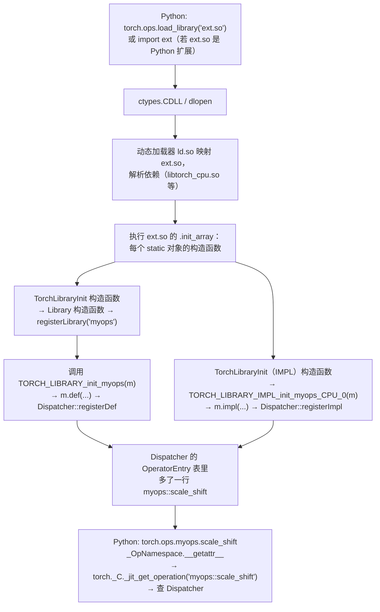
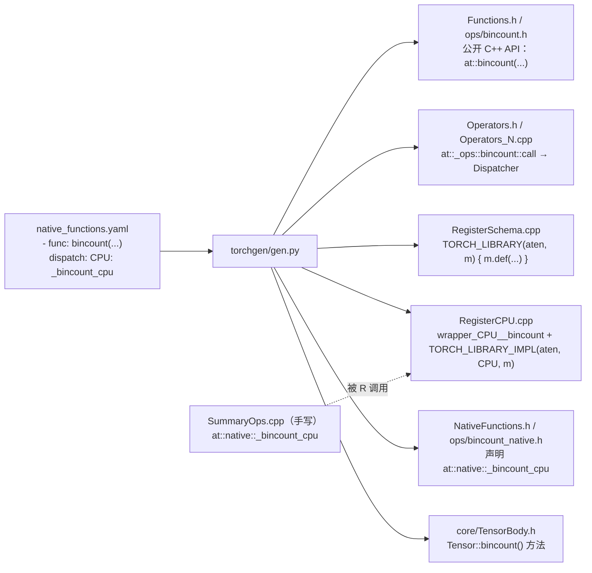

vLLM 的 CPU 后端把所有自定义算子登记到 PyTorch 的代码在 `csrc/cpu/torch_bindings.cpp` 里，形状是这样的：

```cpp
#include "cache.h"
#include "ops.h"
#include "core/registration.h"

#include <torch/library.h>

// ...

TORCH_LIBRARY_EXPAND(TORCH_EXTENSION_NAME, ops) {
  // vLLM custom ops
  // ...

  // Activation ops

  // Activation function used in SwiGLU.
  ops.def("silu_and_mul(Tensor! out, Tensor input) -> ()");
  ops.impl("silu_and_mul", torch::kCPU, &silu_and_mul);

  // Activation function used in GeGLU with `none` approximation.
  ops.def("gelu_and_mul(Tensor! out, Tensor input) -> ()");
  ops.impl("gelu_and_mul", torch::kCPU, &gelu_and_mul);
  // ...
}

// ...

REGISTER_EXTENSION(TORCH_EXTENSION_NAME)
```

这个文件编成 `vllm/_C.*.so`。Python 侧 `import vllm._C` 之后，`torch.ops._C.silu_and_mul(out, x)` 就能用了。但翻遍这个文件，找不到任何一处"调用"：没有 `main`，没有 `init()`，`TORCH_LIBRARY_EXPAND(...) { ... }` 长得像一个函数定义，可是谁调用它？`ops` 这个变量从哪里来？`TORCH_EXTENSION_NAME` 又是什么，整个文件里找不到它的定义，为什么不直接写 `TORCH_LIBRARY(_C, ops)`？`REGISTER_EXTENSION(TORCH_EXTENSION_NAME)` 后面连分号都没有。

再往 PyTorch 自己的源码里看，几乎每个算子文件都是同一种风格：`TORCH_CHECK(...)` 检查参数、`AT_DISPATCH_FLOATING_TYPES(...)` 展开 kernel、文件末尾一排 `REGISTER_DISPATCH(...)`、类声明前面挂着 `C10_API`/`TORCH_API`、热路径上有 `C10_LIKELY(...)`。Java 里没有预处理器，这些全大写的东西读起来像另一种语言嵌在 C++ 里。

这些都是**宏**，而宏在这里做的事情不只是"文本替换"。它们承担了三种职责：按平台裁掉代码（条件编译）、替人写重复代码（生成）、在调用点抓取源码位置（`__FILE__`/`__LINE__`）。其中最重要的一个用法——`TORCH_LIBRARY`——把一个宏、一个静态对象的构造函数和动态加载器的行为串在一起，实现了 Java 里靠 `ServiceLoader` 或 Spring 反射扫描才能做到的"代码在启动时自己登记进系统"。而这个机制有一个 Java 里完全不存在的失效条件：链接方式。

本文要回答的核心问题是：

> **一个 `.so` 被 `import` 后，里面的算子怎么就出现在 `torch.ops.myops` 下了？没有任何函数被显式调用。**

全文按下面的顺序展开：

1. 预处理器：`#define`、`#include`、`#ifdef`、`#` 与 `##`、`__VA_ARGS__`；
2. 宏的三种用途：条件编译、生成重复代码、在调用点捕获信息；
3. `TORCH_CHECK` 与 `TORCH_INTERNAL_ASSERT`：把一个宏完整展开一遍，看它为什么不能是函数；
4. 静态初始化与静态注册模式：`static` 对象的构造函数在 `main` 之前运行；
5. `TORCH_LIBRARY(myops, m)` 展开成什么；`TORCH_LIBRARY_IMPL` 如何按 DispatchKey 注册；回答核心问题；
6. 静态初始化顺序问题（static initialization order fiasco）与 PyTorch 的规避方式；
7. 符号可见性：`-fvisibility=hidden`、`C10_API`/`TORCH_API`；为什么静态注册的算子会在某些链接方式下"消失"；
8. 平台与编译器宏：`__CUDACC__`、`__CUDA_ARCH__`、`_WIN32`、`__GNUC__`；
9. 代码生成：`torchgen` 从 `native_functions.yaml` 生成什么、为什么要生成而不是手写；
10. 回到源码：`aten/src/ATen/core/library.cpp`、vLLM 的 CPU 与 CUDA 两个 `torch_bindings.cpp`、`torch/headeronly/macros/Macros.h` 的整体结构；
11. mini-c10：`MINI_CHECK`、`MINI_API`、`MINI_LIBRARY`/`MINI_LIBRARY_IMPL`，让 `add.cpp`、`mul.cpp` 自注册，并复现"静态库里注册消失"；
12. 工程实践建议与常见错误；
13. 总结。

Java 仍是参照系。Java 没有预处理器，条件编译靠运行期 `if` 和 JIT 消除死代码；Java 有反射和 `ServiceLoader`，C++ 没有反射，用静态初始化实现同一目标；Java 的 `.jar` 不管怎么打包，类都在那里，C++ 的静态库会把没人引用的目标文件整个扔掉。这三个差别是本篇的主线。


## 一、预处理器：文本层面的另一种语言

### 1.1 预处理发生在编译之前

第一篇讲过 C++ 的四个阶段，预处理是第一步。它的输入是源文件，输出是翻译单元，中间只做**文本变换**，完全不理解 C++ 语法——它不知道什么是类型、什么是作用域，只认识以 `#` 开头的行和已经定义的宏名。

所有预处理指令：

| 指令 | 作用 |
|---|---|
| `#include <x>` / `#include "x"` | 把文件 `x` 的内容原地粘贴进来 |
| `#define NAME 替换文本` | 定义对象宏：之后每个 `NAME` 被替换 |
| `#define NAME(a, b) 替换文本` | 定义函数宏：`NAME(x, y)` 被替换，`a`/`b` 换成实参文本 |
| `#undef NAME` | 取消定义 |
| `#if 表达式` / `#ifdef NAME` / `#ifndef NAME` / `#elif` / `#else` / `#endif` | 条件保留或删除一段文本 |
| `#pragma once` 等 | 编译器扩展 |
| `#error 消息` | 让编译失败并打印消息 |

用 `-E` 可以只跑预处理、看到编译器真正看到的东西。这是读懂任何宏的第一个工具，本文会反复用它。

### 1.2 函数宏的三个运算符

函数宏的替换文本里有三样东西是普通 C++ 没有的：

**`#` 字符串化（stringize）**：把参数的文本变成字符串字面量。

```cpp
#define SHOW(expr) std::cout << #expr " = " << (expr) << '\n'
SHOW(x + 1);   // 展开为：std::cout << "x + 1" " = " << (x + 1) << '\n';
```

相邻的字符串字面量会被编译器拼接，所以 `"x + 1" " = "` 就是 `"x + 1 = "`。`TORCH_CHECK(cond, ...)` 失败时的默认消息 `Expected x > 0 to be true, but got false.` 里那段 `x > 0` 就是这么来的。

**`##` 拼接（token pasting）**：把两个标记粘成一个标识符。

```cpp
#define DECLARE_INIT(ns) static void TORCH_LIBRARY_init_##ns(torch::Library&);
DECLARE_INIT(myops)   // 展开为：static void TORCH_LIBRARY_init_myops(torch::Library&);
```

**`__VA_ARGS__` 变参**：参数列表里的 `...` 接收任意多个实参，在替换文本里用 `__VA_ARGS__` 引用。

```cpp
#define LOG(fmt, ...) std::printf(fmt, __VA_ARGS__)
```

标准 C++ 的 `__VA_ARGS__` 有一个著名的缺陷：如果变参为空，`LOG("hi")` 展开成 `std::printf("hi", )`，多出一个逗号。GCC/Clang/MSVC 都支持一个扩展写法 `, ##__VA_ARGS__`——当变参为空时把前面的逗号一并吞掉。`c10/util/Exception.h` 里 `TORCH_CHECK_MSG` 的定义就用了它：

```cpp
#define TORCH_CHECK_MSG(cond, type, ...)                   \
  (::c10::detail::torchCheckMsgImpl(                       \
      "Expected " #cond                                    \
      " to be true, but got false.  "                      \
      "(Could this error message be improved?  If so, "    \
      "please report an enhancement request to PyTorch.)", \
      ##__VA_ARGS__))
```

`TORCH_CHECK(x > 0)` 不带消息时，`##__VA_ARGS__` 让它展开成 `torchCheckMsgImpl("Expected x > 0 ...")` 而不是 `torchCheckMsgImpl("...", )`。C++20 加入了标准写法 `__VA_OPT__(,) __VA_ARGS__`，PyTorch 因为要兼容多种编译器版本，目前仍用 `##__VA_ARGS__`。

### 1.3 两层间接：为什么 `C10_STRINGIZE` 要写两遍

`torch/headeronly/macros/Macros.h`（`c10/macros/Macros.h` 现在只是一行 `#include <torch/headeronly/macros/Macros.h>`——PyTorch 2.x 中的变化：2.8 前后引入 `torch/headeronly/` 目录，把不依赖 libtorch 的头文件搬了过去）里有这样四行：

```cpp
#define C10_CONCATENATE_IMPL(s1, s2) s1##s2
#define C10_CONCATENATE(s1, s2) C10_CONCATENATE_IMPL(s1, s2)

#define C10_STRINGIZE_IMPL(x) #x
#define C10_STRINGIZE(x) C10_STRINGIZE_IMPL(x)
```

为什么不直接 `#define C10_STRINGIZE(x) #x`？因为预处理器的替换规则是：**函数宏的实参在代入替换文本之前会先被完全展开，除非它紧挨着 `#` 或 `##`**。于是：

```cpp
#define STR1(x) #x
#define STR2(x) STR1(x)
STR1(__LINE__)   // "__LINE__"   ← 实参紧挨 #，不展开
STR2(__LINE__)   // "42"         ← 实参先展开成 42，再传给 STR1
```

`C10_CONCATENATE(TORCH_LIBRARY_IMPL_init_myops_CPU_, __COUNTER__)` 需要的是拼上 `__COUNTER__` 的**值**而不是字面 `__COUNTER__` 五个字，所以必须经过一层不带 `##` 的外层宏让参数先展开。这是所有大型 C++ 项目都会有的一对宏，Java 工程师第一次看到通常觉得多余，其实是预处理器规则逼出来的。

紧接着的 `C10_UID` 和 `C10_ANONYMOUS_VARIABLE`：

```cpp
#ifdef __COUNTER__
#define C10_UID __COUNTER__
#define C10_ANONYMOUS_VARIABLE(str) C10_CONCATENATE(str, __COUNTER__)
#else
#define C10_UID __LINE__
#define C10_ANONYMOUS_VARIABLE(str) C10_CONCATENATE(str, __LINE__)
#endif
```

`__COUNTER__` 是编译器扩展，每次展开得到一个递增的整数，用来在同一个翻译单元里制造不重名的标识符。第五节会看到它在 `TORCH_LIBRARY_IMPL` 里的作用。

### 1.4 预定义宏

编译器预先定义了一批宏，本文会用到这些：

| 宏 | 含义 | 定义者 |
|---|---|---|
| `__FILE__` | 当前源文件名（字符串） | 标准 |
| `__LINE__` | 当前行号（整数） | 标准 |
| `__func__` | 当前函数名（其实是一个隐含的局部变量，不是宏，但用法一样） | 标准（C++11） |
| `__COUNTER__` | 每次展开递增 | GCC/Clang/MSVC 扩展 |
| `__cplusplus` | C++ 标准版本号，如 `201703L` | 标准 |
| `__GNUC__` | GCC 或兼容 GCC 的编译器（Clang 也定义它） | GCC/Clang |
| `__clang__` | Clang | Clang |
| `_MSC_VER` | MSVC 版本 | MSVC |
| `_WIN32` | Windows 目标（64 位也定义） | Windows 编译器 |
| `__APPLE__`、`__linux__`、`__ANDROID__` | 目标操作系统 | 各平台 |
| `__CUDACC__` | 正在用 nvcc 编译 | nvcc |
| `__CUDA_ARCH__` | 正在编译 device 代码，值为目标架构如 `800` | nvcc（只在 device 编译阶段定义） |
| `__HIPCC__` | 正在用 hipcc 编译 | hipcc |
| `NDEBUG` | Release 构建，标准库的 `assert` 靠它关闭 | 构建系统 |

另一类是构建系统传进来的：CMake `target_compile_definitions(... PRIVATE -DC10_BUILD_MAIN_LIB)` 等价于在每个源文件最前面写 `#define C10_BUILD_MAIN_LIB`。开头那段 vLLM 代码里的 `TORCH_EXTENSION_NAME` 就是这样定义的，`cmake/utils.cmake` 的 `define_extension_target` 函数里：

```cmake
  target_compile_definitions(${MOD_NAME} PRIVATE
    "-DTORCH_EXTENSION_NAME=${MOD_NAME}")
```

vLLM 有四个 `torch_bindings.cpp`（`csrc/`、`csrc/cpu/`、`csrc/moe/`、`csrc/rocm/`），分别编成 `_C`（CUDA 后端和 CPU 后端各有一个同名的 `_C`）、`_moe_C`、`_rocm_C` 几个模块，模块名由构建系统注入，源码里统一用宏引用。

### 1.5 Java 对照

Java 语言规范没有预处理器，这是刻意的设计决定。Java 用别的手段覆盖了宏的部分用途：

| 宏的用途 | Java 的替代 | 差别 |
|---|---|---|
| 常量 `#define N 10` | `static final int N = 10` | Java 版本有类型、有作用域；C++ 也早就推荐 `constexpr` 而非 `#define` |
| 条件编译 `#ifdef _WIN32` | `if (os.equals("Windows"))`；`static final boolean` 常量 + JIT 死代码消除 | Java 两个分支的字节码都在 `.class` 里；C++ 另一个分支在预处理后就不存在 |
| 生成重复代码 | 注解处理器（Lombok、AutoValue）、反射 | 注解处理器在编译期生成新的 `.java`，是"结构化的代码生成"，比文本替换安全，也重得多 |
| 捕获调用点 `__FILE__`/`__LINE__` | `Thread.currentThread().getStackTrace()`、`StackWalker` | Java 在运行期从栈帧取，有成本；C++ 在编译期就写死成字符串常量，零成本 |
| 静态注册（第四、五节） | `ServiceLoader` + `META-INF/services`、Spring 组件扫描 | 见第五节 |

要建立的直觉：**Java 里"代码有没有"是运行期的事，C++ 里经过预处理，"代码有没有"在编译前就决定了**。看一个 PyTorch 源文件时，`#ifdef` 包住的两个分支只有一个会进入你正在读的那个二进制；想知道是哪一个，要看构建配置，不是看代码。


## 二、宏的三种用途

大型 C++ 项目里宏的用法看起来五花八门，归类只有三种。分清用途，读的时候就知道该往哪个方向理解。

### 2.1 用途一：条件编译

按平台、编译器、构建选项裁掉代码。`torch/headeronly/macros/Export.h` 的开头是最典型的例子：

```cpp
#ifdef _WIN32
#define C10_HIDDEN
#if defined(C10_BUILD_SHARED_LIBS)
#define C10_EXPORT __declspec(dllexport)
#define C10_IMPORT __declspec(dllimport)
#else
#define C10_EXPORT
#define C10_IMPORT
#endif
#else // _WIN32
#if defined(__GNUC__)
#define C10_EXPORT __attribute__((__visibility__("default")))
#define C10_HIDDEN __attribute__((__visibility__("hidden")))
#else // defined(__GNUC__)
#define C10_EXPORT
#define C10_HIDDEN
#endif // defined(__GNUC__)
#define C10_IMPORT C10_EXPORT
#endif // _WIN32
```

同一个 `C10_EXPORT` 在 Windows 上是 `__declspec(dllexport)`，在 Linux/macOS 上是 `__attribute__((__visibility__("default")))`，在不认识的编译器上是空。写 `struct C10_API Device` 的人不需要知道这些差别。这类宏的替换文本通常是**属性**（attribute）或者空，它们不改变程序逻辑，只改变编译器如何处理这段代码。第七节专门讲这一组。

另一种条件编译是**功能开关**：`c10/util/Exception.h` 里的 `STRIP_ERROR_MESSAGES`（移动端构建定义它，把所有错误消息字符串从二进制里去掉以减小体积）、`C10_MOBILE`、`USE_CUDA`、`USE_ROCM`。读 PyTorch 源码时看到 `#ifdef C10_MOBILE` 包住的分支，服务器端可以直接跳过。

### 2.2 用途二：生成重复代码

C++ 模板能在类型维度上消除重复，但有些重复模板做不到：枚举值和它的名字字符串、枚举值和对应的 C++ 类型、同一件事对一组名字各做一遍。这时用宏。

最经典的形式叫 **X-macro**：先定义一个"列表宏"，它接受另一个宏作为参数，对列表里每一项调用一次：

```cpp
// torch/headeronly/core/ScalarType.h
#define AT_FORALL_SCALAR_TYPES(_) \
  _(uint8_t, Byte)                \
  _(int8_t, Char)                 \
  _(int16_t, Short)               \
  _(int, Int)                     \
  _(int64_t, Long)                \
  _(float, Float)                 \
  _(double, Double)
```

然后在需要的地方传入一个"每项做什么"的宏。定义枚举：

```cpp
enum class ScalarType : int8_t {
#define DEFINE_ST_ENUM_VAL_(_1, n) n,
  AT_FORALL_SCALAR_TYPES_WITH_COMPLEX_AND_QINTS(DEFINE_ST_ENUM_VAL_)
#undef DEFINE_ENUM_ST_ENUM_VAL_
      Undefined,
  NumOptions
};
```

枚举转字符串：

```cpp
inline const char* toString(ScalarType t) {
#define DEFINE_CASE(_, name) \
  case ScalarType::name:     \
    return #name;

  switch (t) {
    AT_FORALL_SCALAR_TYPES_WITH_COMPLEX_AND_QINTS(DEFINE_CASE)
    default:
      return "UNKNOWN_SCALAR";
  }
#undef DEFINE_CASE
}
```

`DEFINE_CASE(_, name)` 忽略第一个参数（C++ 类型），把第二个参数同时用作枚举名（`ScalarType::name`）和字符串（`#name`）。加一个新 dtype 只需在列表宏里加一行，所有 `switch` 自动多一个 `case`——这就是 X-macro 的价值：**单一事实来源**。

第三篇讲过的 `AT_DISPATCH_FLOATING_TYPES` 是同一思路的另一个应用：宏把运行期的 `ScalarType` 值变成一组 `case`，每个 `case` 里用 `using scalar_t = float;` 之类的别名实例化一次 lambda。第一篇看过的 `c10/core/ScalarType.h` 里的 `elementSize` 也是。

Java 里 `enum` 自带 `name()`、`values()`，这类重复根本不需要写。C++ 到 C++17 为止都没有枚举反射，X-macro 是最常见的替代。看到 `AT_FORALL_*`、`FOR_EACH_*`、`*_LIST(_)` 这类名字，就知道它是一张表，找到表就找到了所有派生代码的源头。

### 2.3 用途三：在调用点捕获信息

函数被调用时，它自己不知道是从哪一行被调用的。`__FILE__`、`__LINE__`、`__func__` 在预处理阶段被替换成**当前位置**的值，所以只有写在调用点的代码——也就是宏——能拿到它们。

```cpp
// c10/util/Exception.h
#define C10_THROW_ERROR(err_type, msg) \
  throw ::c10::err_type(               \
      {__func__, __FILE__, static_cast<uint32_t>(__LINE__)}, msg)
```

`C10_THROW_ERROR` 写在 `Device.cpp` 第 60 行，展开出来的 `__FILE__` 就是 `"c10/core/Device.cpp"`、`__LINE__` 就是 `60`。如果 `C10_THROW_ERROR` 是一个函数，`__FILE__` 就永远是 `Exception.h`。

这条用途还有一个更细的变体：**惰性求值**。函数的实参在调用前一定会全部求值；宏的参数只是文本，放在什么位置就什么时候求值。`TORCH_CHECK(cond, "x = ", x)` 把消息参数放进 `if (!cond) { ... }` 的花括号里，`cond` 为真时那些参数一个字节都不会被计算。这是 `TORCH_CHECK` 必须是宏的第二个原因。下一节把它完整展开。

### 2.4 用途的边界：什么时候不该用宏

PyTorch 的代码风格对宏的态度是"能不用就不用"。判断标准就是上面三条：不是为了条件编译、不是为了消除模板做不到的重复、不需要调用点信息或惰性求值，就应该是函数、`constexpr` 变量或模板。`c10/util/Exception.h` 里的 `C10_BUILD_ERROR` 是宏（要位置），`c10::str()` 是函数模板（不要位置）；`C10_LIKELY` 是宏（替换文本是编译器内建，要包一层参数），`c10::guts::if_constexpr` 是模板。读源码时看到一个全大写名字，先问"它属于三种用途的哪一种"，答案通常一眼可见。


## 三、`TORCH_CHECK`：把一个宏完整展开一遍

`TORCH_CHECK` 是 PyTorch 源码里出现频率最高的宏，也是总纲开篇那段 `scale_shift_cpu` 代码的第二行。这一节把它从外到内拆开，顺带看 `C10_UNLIKELY`、`c10::str`、`TORCH_INTERNAL_ASSERT` 和 `STRIP_ERROR_MESSAGES`。

### 3.1 定义

`c10/util/Exception.h` 里有四个版本的 `TORCH_CHECK`，由两个开关选择：`STANDALONE_TORCH_HEADER`（让 `TORCH_CHECK` 抛 `std::runtime_error` 而不是 `c10::Error`，供 AOTInductor 生成的独立代码用）和 `STRIP_ERROR_MESSAGES`（移动端去掉消息）。服务器端普通构建两者都不定义，走的是这一个：

```cpp
#define TORCH_CHECK(cond, ...)                     \
  if (C10_UNLIKELY_OR_CONST(!(cond))) {            \
    ::c10::detail::torchCheckFail(                 \
        __func__,                                  \
        __FILE__,                                  \
        static_cast<uint32_t>(__LINE__),           \
        TORCH_CHECK_MSG(cond, "", ##__VA_ARGS__)); \
  }
```

三个观察：

1. 它展开成一个 `if` 语句，**不是表达式**，也没有用 `do { } while (0)` 包起来。所以 `TORCH_CHECK` 不能出现在需要表达式的地方，并且 `if (a) TORCH_CHECK(x); else ...` 会因为悬垂 `else` 出问题。PyTorch 代码里 `TORCH_CHECK` 总是独立成句，就是这个原因。
2. `!(cond)` 给 `cond` 加了括号——防止 `TORCH_CHECK(a || b)` 展开成 `!a || b`。这是写函数宏的基本纪律：**每个参数出现时都加括号**。
3. `__VA_ARGS__` 出现在 `if` 的花括号内部，只在条件为假时求值。

### 3.2 `C10_UNLIKELY`：分支预测提示

`torch/headeronly/macros/Macros.h`：

```cpp
#if defined(__GNUC__) || defined(__ICL) || defined(__clang__)
#define C10_LIKELY(expr) (__builtin_expect(static_cast<bool>(expr), 1))
#define C10_UNLIKELY(expr) (__builtin_expect(static_cast<bool>(expr), 0))
#else
#define C10_LIKELY(expr) (expr)
#define C10_UNLIKELY(expr) (expr)
#endif
```

`__builtin_expect(e, 0)` 告诉编译器"`e` 几乎总是 0"，编译器据此安排代码布局：把 `if` 体（抛异常的那一坨）放到函数末尾或单独的冷代码段，热路径上只剩一条几乎不会跳的条件跳转。对一个每次 `add` 都要跑几次的检查来说，这点差别在 microbenchmark 里能看出来。

`static_cast<bool>` 那句注释解释了为什么要转：`__builtin_expect` 的参数是 `long`，如果直接传一个指针或者 `int64_t`，会先转成 `long` 再和 `1` 比较，语义就错了。

`TORCH_CHECK` 用的其实是 `C10_UNLIKELY_OR_CONST`，定义在 `torch/headeronly/util/Exception.h`：

```cpp
#if defined(__CUDACC__)
#define C10_UNLIKELY_OR_CONST(e) e
#else
#define C10_UNLIKELY_OR_CONST(e) C10_UNLIKELY(e)
#endif
```

注释说明了原因：nvcc 遇到 `__builtin_expect(常量)` 时，"函数缺少 return 语句"的分析会失效，所以在 nvcc 下退化成裸表达式。这是第八节"编译器宏"的一个实例——同一个宏在不同编译器下有不同定义，为的是绕过某个编译器的问题。

C++20 有了标准属性 `[[likely]]`/`[[unlikely]]`，PyTorch 因为要支持的编译器范围，仍用宏。Java 没有对应物：JIT 会根据运行时 profile 自己判断分支概率，程序员不用也不能提示。

### 3.3 `TORCH_CHECK_MSG` 与 `torchCheckMsgImpl`：惰性拼接消息

```cpp
namespace c10::detail {
template <typename... Args>
auto torchCheckMsgImpl(const char* /*msg*/, const Args&... args) {
  return ::c10::str(args...);
}
inline C10_API const char* torchCheckMsgImpl(const char* msg) {
  return msg;
}
// If there is just 1 user-provided C-string argument, use it.
inline C10_API const char* torchCheckMsgImpl(
    const char* /*msg*/,
    const char* args) {
  return args;
}
} // namespace c10::detail

#define TORCH_CHECK_MSG(cond, type, ...)                   \
  (::c10::detail::torchCheckMsgImpl(                       \
      "Expected " #cond                                    \
      " to be true, but got false.  "                      \
      "(Could this error message be improved?  If so, "    \
      "please report an enhancement request to PyTorch.)", \
      ##__VA_ARGS__))
```

三个重载覆盖三种调用形式：

| 调用 | 选中的重载 | 返回 | 成本 |
|---|---|---|---|
| `TORCH_CHECK(x > 0)` | `torchCheckMsgImpl(const char*)` | 默认消息（字符串字面量） | 零 |
| `TORCH_CHECK(x > 0, "x must be positive")` | `torchCheckMsgImpl(const char*, const char*)` | 用户的字面量 | 零 |
| `TORCH_CHECK(x > 0, "x = ", x, ", y = ", y)` | 变参模板 | `c10::str(...)` 拼出的 `std::string` | 一个 `ostringstream` |

关键在于第三种只有在检查失败时才会走到——因为整个 `TORCH_CHECK_MSG(...)` 在 `if` 里面。如果 `TORCH_CHECK` 是一个函数 `void check(bool cond, const std::string& msg)`，那么 `check(x > 0, str("x = ", x))` 每次调用都会先拼字符串再判断条件，热路径上多一次堆分配。

`c10::str` 在 `c10/util/StringUtil.h`：

```cpp
template <typename... Args>
inline auto str(const Args&... args) {
  return detail::_str_wrapper<
      typename detail::CanonicalizeStrTypes<Args>::type...>::call(args...);
}
```

它把参数逐个 `<<` 进 `std::ostringstream`——这就是为什么 `TORCH_CHECK` 的消息参数可以是任何定义了 `operator<<` 的类型（`Tensor`、`Device`、`IntArrayRef` 都可以直接塞进去）。`_str_wrapper` 对零参数、单个 `const char*`、单个 `std::string` 做了特化，避免不必要的 `ostringstream`；`CompileTimeEmptyString` 是零参数时的返回类型，一个能隐式转成 `const char*` 和 `const std::string&` 的空结构体，注释里说得很直白："we don't want to pay the binary size for constructing and destructing a stringstream or even constructing a string"。

### 3.4 `torchCheckFail`：真正抛异常的地方

```cpp
// c10/util/Exception.cpp
void torchCheckFail(
    const char* func,
    const char* file,
    uint32_t line,
    const std::string& msg) {
  throw ::c10::Error({func, file, line}, msg);
}
```

它被声明为 `[[noreturn]] C10_API`，定义在 `libc10.so` 里。为什么不直接在宏里 `throw`？两个原因：一是 `throw` 语句展开出来的代码不小（构造异常对象、`__cxa_throw` 调用、清理路径），几千个 `TORCH_CHECK` 各自内联一份会显著增大二进制，集中到一个函数里只需一条 `call`；二是 `[[noreturn]]` 让编译器知道 `if` 体不会返回，后面的代码可以照常做"所有路径都有 return"的分析。

`c10::Error` 的构造函数接收 `SourceLocation{func, file, line}` 和消息，`what()` 会把两者拼成用户在 Python 里看到的那种报错：

```text
RuntimeError: expected floating point tensor
Exception raised from scale_shift_cpu at /path/to/ext.cpp:12 (most recent call first):
```

这一行 `Exception raised from ... at ...:12` 就是 `__func__`、`__FILE__`、`__LINE__` 的去处。

### 3.5 `TORCH_INTERNAL_ASSERT`：给开发者的版本

```cpp
#define TORCH_INTERNAL_ASSERT(cond, ...)                                         \
  if (C10_UNLIKELY_OR_CONST(!(cond))) {                                          \
    ::c10::detail::torchInternalAssertFail(                                      \
        __func__,                                                                \
        __FILE__,                                                                \
        static_cast<uint32_t>(__LINE__),                                         \
        #cond                                                                    \
        " INTERNAL ASSERT FAILED at " C10_STRINGIZE(__FILE__) ":" C10_STRINGIZE( \
            __LINE__) ", please report a bug to PyTorch. ",                      \
        c10::str(__VA_ARGS__));                                                  \
  }
#endif
```

与 `TORCH_CHECK` 结构相同，差别在语义和消息：头文件的注释写得很清楚——`TORCH_INTERNAL_ASSERT` 检查的是 PyTorch 自己的不变量（"Assuming no bugs in PyTorch, the conditions tested by this macro should always be true"），失败说明是 PyTorch 的 bug，所以消息里有 "please report a bug to PyTorch"；`TORCH_CHECK` 检查用户输入，失败是用户的问题。两者都**不会**像 C 的 `assert()` 那样直接终止进程，而是抛异常，Python 侧能捕获。

注意这里 `C10_STRINGIZE(__LINE__)` 的用法——1.3 节讲的两层间接就是为了这一行：把行号变成字符串字面量拼进消息，而 `#__LINE__` 只会得到 `"__LINE__"`。

`TORCH_INTERNAL_ASSERT_DEBUG_ONLY` 在 Release 构建（`NDEBUG`）下展开成空，用于热路径上代价太高的断言。

### 3.6 `STRIP_ERROR_MESSAGES` 版本

```cpp
#ifdef STRIP_ERROR_MESSAGES
#define TORCH_CHECK_MSG(cond, type, ...) \
  (#cond #type " CHECK FAILED at " C10_STRINGIZE(__FILE__))
```

移动端构建定义这个宏后，所有用户写的消息参数在预处理阶段就被丢弃（`__VA_ARGS__` 根本没出现在替换文本里），二进制里只剩条件文本和文件名。这是"条件编译"和"调用点捕获"两种用途叠加的例子。

### 3.7 宏族

`Exception.h` 后半部分是一组按异常类型区分的变体，全部由 `TORCH_CHECK_WITH_MSG` 派生：

```cpp
#define TORCH_CHECK_LINALG(cond, ...) \
  TORCH_CHECK_WITH_MSG(LinAlgError, cond, "LINALG", __VA_ARGS__)
#define TORCH_CHECK_INDEX(cond, ...) \
  TORCH_CHECK_WITH_MSG(IndexError, cond, "INDEX", __VA_ARGS__)
#define TORCH_CHECK_VALUE(cond, ...) \
  TORCH_CHECK_WITH_MSG(ValueError, cond, "VALUE", __VA_ARGS__)
#define TORCH_CHECK_TYPE(cond, ...) \
  TORCH_CHECK_WITH_MSG(TypeError, cond, "TYPE", __VA_ARGS__)
#define TORCH_CHECK_NOT_IMPLEMENTED(cond, ...) \
  TORCH_CHECK_WITH_MSG(NotImplementedError, cond, "TYPE", __VA_ARGS__)
```

`c10::IndexError`、`c10::ValueError` 等都是 `c10::Error` 的子类，第七篇会讲它们如何被翻译成对应的 Python 异常类型。`TORCH_CHECK_EQ/NE/LT/...` 是另一组，失败时自动把两个操作数的值打进消息。`TORCH_WARN` 是不抛异常的版本，走 `c10::Warning` 处理器。

### 3.8 小结：为什么 `TORCH_CHECK` 必须是宏

回答总纲里的那个问题：

1. 要把 `cond` 的**源码文本**放进消息（`#cond`）；
2. 要拿到**调用点**的 `__func__`/`__FILE__`/`__LINE__`；
3. 消息参数要**惰性求值**，检查通过时零成本；
4. 要让编译器知道这条分支**不太可能**走到（`C10_UNLIKELY`）。

前三条函数都做不到（C++20 的 `std::source_location` 能解决第二条，但 PyTorch 基线是 C++17，且解决不了另外两条）。Java 的 `Objects.requireNonNull(x, "msg")` 对应的是第一种调用形式；`Preconditions.checkArgument(cond, "x = %s", x)` 之所以用格式串而不是拼接，就是为了避开"参数总是先求值"的问题，但它仍然要装箱 `x`。C++ 用宏把这几件事全部推到编译期解决。


## 四、静态初始化与静态注册模式

### 4.1 三种存储期

C++ 对象按生命周期分三类（第六篇加上 `thread_local` 是四类）：

| 存储期 | 例子 | 构造时机 | 析构时机 |
|---|---|---|---|
| 自动（栈） | 函数里的局部变量 | 执行到声明处 | 离开作用域 |
| 动态（堆） | `new`、`make_intrusive` | `new` 时 | `delete` 时 |
| 静态 | 全局变量、`static` 成员、`static` 局部变量、命名空间作用域变量 | 见下 | `main` 返回后（`exit` 时）逆序 |

第二篇讲的都是前两种。本篇的主角是第三种：**静态存储期对象在程序（或它所在的动态库）开始执行用户代码之前就已经构造好了**，而构造函数里可以跑任意代码。

具体来说，静态存储期变量的初始化分两步：

1. **静态初始化**：常量初始化（`constexpr` 或字面量），编译期算好，直接写进二进制的数据段，没有运行时代码；
2. **动态初始化**：需要运行构造函数或调用函数才能得到初值的，编译器为每个这样的变量生成一段初始化代码，收集进一张表（ELF 的 `.init_array`、Mach-O 的 `__mod_init_func`），由运行时在 `main` 之前——对动态库来说是 `dlopen` 返回之前——逐个执行。

用 mini-c10 的一个目标文件验证第二点（本机 macOS）：

```text
$ nm -C add.o | grep -E "_static_init|global_var_init"
000000000000b9f8 b minic10::MINI_LIBRARY_IMPL_static_init_minic10_CPU_0
000000000000ba30 b minic10::MINI_LIBRARY_IMPL_static_init_minic10_Meta_1
0000000000007d18 s ___cxx_global_var_init
0000000000007d98 s ___cxx_global_var_init.2

$ otool -l add.o | grep -A2 mod_init_func
  sectname __mod_init_func
   segname __DATA
      size 0x0000000000000008
```

两个 `static const` 对象本身放在 `b`（bss，未初始化数据）段；编译器为它们各生成了一个 `__cxx_global_var_init` 函数，`__mod_init_func` 段里放着这些函数的地址。动态加载器加载这个库时，遍历这张表，逐个调用。这就是"没有任何函数被显式调用"的答案的一半：**调用它们的是加载器**。

### 4.2 静态注册模式

把两件事拼起来——"静态对象的构造函数会在加载时自动运行"和"构造函数里可以做任何事"——就得到了静态注册模式（static registration，也叫 self-registration）：

```cpp
// 注册表：全局单例
struct Registry {
  static Registry& get() { static Registry r; return r; }
  std::map<std::string, Factory> table;
};

// 注册器：构造函数把一个条目写进注册表
struct Registrar {
  Registrar(const char* name, Factory f) { Registry::get().table[name] = f; }
};

// 使用：在每个实现文件里定义一个 static Registrar 对象
static Registrar reg_foo("foo", &make_foo);   // 加载时自动执行
```

`make_foo` 所在的文件不需要被任何人 `#include`，也不需要有人调用它——只要这个文件被链接进来，`reg_foo` 的构造函数就会在加载时跑，`"foo"` 就出现在表里。

PyTorch 至少有四套这样的注册表，形态各异但骨架相同：

| 注册表 | 注册宏 | 注册器类型 | 登记到哪 |
|---|---|---|---|
| 算子（Dispatcher） | `TORCH_LIBRARY`、`TORCH_LIBRARY_IMPL` | `torch::detail::TorchLibraryInit` | `c10::Dispatcher::singleton()` |
| CPU kernel 按指令集分发 | `REGISTER_DISPATCH`（`ATen/native/DispatchStub.h`） | 模板静态成员特化 / `RegisterCUDADispatch` | `DispatchStub<...>::DEFAULT/AVX2/AVX512` 等静态成员 |
| 设备守卫实现 | `C10_REGISTER_GUARD_IMPL`（`c10/core/impl/DeviceGuardImplInterface.h`） | `DeviceGuardImplRegistrar` | 按 `DeviceType` 索引的原子指针数组 |
| 通用字符串键工厂 | `C10_REGISTER_CLASS`（`c10/util/Registry.h`） | `c10::Registerer` | `c10::Registry` 的 `unordered_map` |

先看最通用的 `c10/util/Registry.h`，它把上面那个最小模式一模一样地写成了模板：

```cpp
template <class SrcType, class ObjectPtrType, class... Args>
class Registry {
 public:
  typedef std::function<ObjectPtrType(Args...)> Creator;

  void Register(
      const SrcType& key,
      Creator creator,
      const RegistryPriority priority = REGISTRY_DEFAULT) {
    std::lock_guard<std::mutex> lock(register_mutex_);
    // ...
    registry_[key] = creator;
    priority_[key] = priority;
  }

  ObjectPtrType Create(const SrcType& key, Args... args) {
    auto it = registry_.find(key);
    if (it == registry_.end()) {
      // Returns nullptr if the key is not registered.
      return nullptr;
    }
    return it->second(args...);
  }
  // ...
 private:
  std::unordered_map<SrcType, Creator> registry_;
  std::unordered_map<SrcType, RegistryPriority> priority_;
  // ...
  std::mutex register_mutex_;
};

template <class SrcType, class ObjectPtrType, class... Args>
class Registerer {
 public:
  explicit Registerer(
      const SrcType& key,
      Registry<SrcType, ObjectPtrType, Args...>* registry,
      typename Registry<SrcType, ObjectPtrType, Args...>::Creator creator,
      const std::string& help_msg = "") {
    registry->Register(key, creator, help_msg);
  }
  // ...
};
```

再看它的注册宏：

```cpp
#define C10_REGISTER_TYPED_CLASS(RegistryName, key, ...)                    \
  static Registerer##RegistryName C10_ANONYMOUS_VARIABLE(g_##RegistryName)( \
      key,                                                                  \
      RegistryName(),                                                       \
      Registerer##RegistryName::DefaultCreator<__VA_ARGS__>,                \
      ::c10::demangle_type<__VA_ARGS__>());
```

一行 `C10_REGISTER_CLASS(MyRegistry, foo, FooImpl)` 展开成 `static RegistererMyRegistry g_MyRegistry42(#key, MyRegistry(), DefaultCreator<FooImpl>, "FooImpl");`——一个名字由 `C10_ANONYMOUS_VARIABLE` 保证不重复的静态对象。`Register` 方法里那段注释也值得看："since registration is carried out at static initialization time, we do not want to have an explicit dependency on glog's initialization function"——静态初始化阶段能依赖的东西很有限，这是第六节的主题。

`DeviceGuardImplInterface.h` 的 `C10_REGISTER_GUARD_IMPL` 是同一模式的定制版：

```cpp
#define C10_REGISTER_GUARD_IMPL(DevType, DeviceGuardImpl)              \
  static ::c10::impl::DeviceGuardImplRegistrar C10_ANONYMOUS_VARIABLE( \
      g_##DeviceType)(::c10::DeviceType::DevType, new DeviceGuardImpl());
```

`c10/cuda/impl/CUDAGuardImpl.cpp` 末尾一行 `C10_REGISTER_GUARD_IMPL(CUDA, CUDAGuardImpl)`，`libc10_cuda.so` 一被加载，`DeviceType::CUDA` 那个槽位就填上了。第六篇会读这个注册表为什么用原子指针数组而不是 `Registry` 的哈希表。

### 4.3 `REGISTER_DISPATCH`：注册到模板静态成员

第一篇末尾看过 `aten/src/ATen/native/cpu/BinaryOpsKernel.cpp` 文件底部那排 `REGISTER_DISPATCH(add_clamp_stub, &add_clamp_kernel)`。它在 `aten/src/ATen/native/DispatchStub.h` 里的定义是这一节里最不像"注册"的一种：

```cpp
#define REGISTER_ARCH_DISPATCH(name, arch, fn) \
  template <> name##_DECLARE_DISPATCH_type::FnPtr TORCH_API DispatchStub<name##_DECLARE_DISPATCH_type::FnPtr, struct name##_DECLARE_DISPATCH_type>::arch = fn;
```

它不是定义一个注册器对象，而是**显式特化一个类模板的静态数据成员**：`DispatchStub<..., add_clamp_stub_type>::AVX2 = &add_clamp_kernel;`。因为 `fn` 是一个函数地址——编译期常量——这是**静态初始化**（4.1 节的第一种），不需要运行任何代码，函数指针直接被写进数据段。运行时 `add_clamp_stub(...)` 检测 CPU 能力，读对应的静态成员，调用。

而它的 CUDA 版本用的是第二种：

```cpp
#define REGISTER_CUDA_DISPATCH(name, fn) \
  static RegisterCUDADispatch<struct name##_DECLARE_DISPATCH_type> name ## __register(name, fn);
```

一个 `static` 对象，构造函数里 `stub.set_cuda_dispatch_ptr(fn)`。选哪个由编译器宏决定：

```cpp
#if defined(__CUDACC__)
#define REGISTER_DISPATCH(name, fn) REGISTER_CUDA_DISPATCH(name, fn)
#elif defined(__HIPCC__)
#define REGISTER_DISPATCH(name, fn) REGISTER_CUDA_DISPATCH(name, fn)
#elif defined(__OBJC__) && defined(USE_MPS)
#define REGISTER_DISPATCH(name, fn) REGISTER_MPS_DISPATCH(name, fn)
#elif defined(CPU_CAPABILITY)
// ...
#define REGISTER_DISPATCH(name, fn) REGISTER_ARCH_DISPATCH(name, CPU_CAPABILITY, fn)
#endif
```

同一个 `.cpp`（如 `BinaryOpsKernel.cpp`）会被 CMake（`cmake/Codegen.cmake`）用 `-DCPU_CAPABILITY=DEFAULT`、`-DCPU_CAPABILITY=AVX2`、`-DCPU_CAPABILITY=AVX512` 分别编译三遍（这就是第一篇 AVX 链接顺序注释的背景），每遍 `REGISTER_DISPATCH` 特化出不同的静态成员。这个宏同时体现了三种用途：条件编译选实现、`##` 拼名字、替人写重复的特化。

### 4.4 Java 对照：`ServiceLoader` 与 Spring 扫描

Java 实现"实现类自己登记进系统"有两条路：

- **`ServiceLoader`**：实现方在 `META-INF/services/com.example.Plugin` 文件里写下实现类的全限定名；使用方 `ServiceLoader.load(Plugin.class)` 时，JVM 扫描 classpath 上所有 jar 的这个文件，用反射 `Class.forName` 实例化。
- **Spring 组件扫描**：`@Component` 标注实现类，容器启动时扫描指定包下所有 `.class` 文件，读注解，反射实例化。

两者的共同点是**发现在运行时、靠元数据**（文件或注解），前提是 JVM 能枚举 classpath、能按名字加载类、能反射构造。C++ 一条都没有：没有 classpath 可以枚举、没有按名字加载类的能力、没有反射。所以 C++ 把"发现"这件事移到了**构建时**——链接器把哪些 `.o` 放进来，就有哪些注册器对象存在——把"执行注册"移到了**加载时**——加载器跑 `.init_array`。

类比成立的地方：目的相同（解耦实现和使用方，加一个实现不需要改调用方），效果相同（`import` 之后东西就在了）。

类比误导的地方：

1. **Java 的注册失败是运行时可见的**（`ServiceLoader` 找不到实现返回空迭代器，Spring 抛 `NoSuchBeanDefinitionException`），**C++ 的注册失败静默**——`.o` 没被链接进来，注册器对象根本不存在，没有任何错误，只有用的时候发现表里没有。第七节专门讲这个。
2. **Java 的实现类什么时候被实例化由使用方决定**（`ServiceLoader` 是惰性的），**C++ 的注册器在加载时一定执行**，无论用不用；它的构造函数依赖的所有东西（注册表单例、字符串、`Dispatcher`）都必须在那个时刻可用——第六节。
3. Java 的元数据（`META-INF/services`）和代码是分开的两份东西，可能不同步；C++ 的注册就在实现文件里，天然同步。

一句话：**Java 用运行时反射换来了灵活和可诊断；C++ 用编译期/加载期确定性换来了零运行时成本，代价是失败模式更隐蔽。**


## 五、`TORCH_LIBRARY(myops, m)` 展开成什么

现在可以正面回答核心问题了。`torch/library.h` 是 PyTorch 算子注册的公开 API 头文件，1100 行，三个宏在文件末尾。

### 5.1 `TORCH_LIBRARY`

```cpp
#define TORCH_LIBRARY(ns, m)                                                   \
  static void TORCH_LIBRARY_init_##ns(torch::Library&);                        \
  static const torch::detail::TorchLibraryInit TORCH_LIBRARY_static_init_##ns( \
      torch::Library::DEF,                                                     \
      &TORCH_LIBRARY_init_##ns,                                                \
      #ns,                                                                     \
      std::nullopt,                                                            \
      __FILE__,                                                                \
      __LINE__);                                                               \
  void TORCH_LIBRARY_init_##ns(torch::Library& m)
```

用户写：

```cpp
TORCH_LIBRARY(myops, m) {
  m.def("scale_shift(Tensor x, float alpha, float beta) -> Tensor");
}
```

预处理后是（把 `__FILE__`/`__LINE__` 代入）：

```cpp
static void TORCH_LIBRARY_init_myops(torch::Library&);
static const torch::detail::TorchLibraryInit TORCH_LIBRARY_static_init_myops(
    torch::Library::DEF,
    &TORCH_LIBRARY_init_myops,
    "myops",
    std::nullopt,
    "ext.cpp",
    7);
void TORCH_LIBRARY_init_myops(torch::Library& m) {
  m.def("scale_shift(Tensor x, float alpha, float beta) -> Tensor");
}
```

三句话：

1. **前向声明**一个 `static` 函数 `TORCH_LIBRARY_init_myops`。`static` 让它内部链接，不同扩展里同名不冲突。
2. **定义一个 `static const` 对象** `TORCH_LIBRARY_static_init_myops`，类型是 `torch::detail::TorchLibraryInit`，构造参数里有第 1 步那个函数的地址、命名空间字符串（`#ns` 把标识符 `myops` 字符串化成 `"myops"`）、以及这一行的文件和行号。这就是 4.2 节的"注册器对象"。
3. **给出第 1 步函数的定义头** `void TORCH_LIBRARY_init_myops(torch::Library& m)`——注意宏到这里就结束了，没有函数体，也没有分号。用户写在宏后面的 `{ ... }` 被编译器读成这个函数的函数体。`m` 就是宏的第二个参数，用户可以随意命名（vLLM 用 `ops`）。

所以 `TORCH_LIBRARY(myops, m) { ... }` 的语法其实是：**宏展开成一个函数定义的头部，用户补上函数体**。pybind11 的 `PYBIND11_MODULE(name, m) { ... }` 是同一技巧，`torch/library.h` 开头的注释也说明这个 API 是照着 pybind11 设计的。

### 5.2 `TorchLibraryInit`：注册器

```cpp
namespace torch::detail {
class TorchLibraryInit final {
 private:
  using InitFn = void(Library&);
  Library lib_;

 public:
  TorchLibraryInit(
      Library::Kind kind,
      InitFn* fn,
      const char* ns,
      std::optional<c10::DispatchKey> k,
      const char* file,
      uint32_t line)
      : lib_(kind, ns, k, file, line) {
    fn(lib_);
  }
};
} // namespace torch::detail
```

（以上省略了 `TORCH_LIBRARY_THREAD_UNSAFE_LAZY_INIT && C10_MOBILE` 下的另一个版本，它把初始化推迟到显式调用 `initialize_torch_libraries()`——移动端的优化，服务器端不涉及。）

构造函数做两件事：用 `kind`、`ns`、`k`、`file`、`line` 构造一个成员 `torch::Library lib_`，然后**调用用户写的函数** `fn(lib_)`——就是 `TORCH_LIBRARY_init_myops(m)`，`m` 绑定到 `lib_`。用户在函数体里调的 `m.def(...)`、`m.impl(...)` 全部作用在这个 `Library` 对象上。

而 `torch::Library` 的构造函数（`aten/src/ATen/core/library.cpp`）：

```cpp
Library::Library(Kind kind, std::string ns, std::optional<c10::DispatchKey> k, const char* file, uint32_t line)
  : kind_(kind)
  , ns_(ns == "_" ? std::nullopt : std::make_optional(std::move(ns)))
  , dispatch_key_(k.value_or(CatchAll) == CatchAll ? std::optional<c10::DispatchKey>() : k)
  , file_(file)
  , line_(line)
  {
    switch (kind_) {
      case DEF:
        // Only DEFs require library uniqueness; fragments
        // don't register a library
        registrars_.emplace_back(
          c10::Dispatcher::singleton().registerLibrary(
            // NOLINTNEXTLINE(bugprone-unchecked-optional-access)
            ns_.value(), debugString(file_, line_)
          )
        );
        [[fallthrough]];
      case FRAGMENT:
        TORCH_CHECK(
          ns_.has_value(),
          toString(kind_), ": cannot define ", toString(kind_), " with the wildcard namespace _ "
          "(every ", toString(kind_), " defines operators for a distinct namespace!) "
          "Did you mean to use TORCH_LIBRARY_IMPL instead?  "
          ERROR_CONTEXT
        );
        TORCH_INTERNAL_ASSERT(!dispatch_key_.has_value(), ERROR_CONTEXT);
        break;
      case IMPL:
        // Nothing to do, everything is OK
        break;
    }
  }
```

`DEF` 类型（来自 `TORCH_LIBRARY`）会先调 `c10::Dispatcher::singleton().registerLibrary(ns, ...)`——向 Dispatcher 声明"命名空间 `myops` 归我"，同一个命名空间第二次 `TORCH_LIBRARY` 会报错，这就是头文件注释说的 "There may only be one TORCH_LIBRARY() for any given namespace"。`debugString(file_, line_)` 生成 `"registered at ext.cpp:7"`，之后所有相关报错都会带上它——这是 `__FILE__`/`__LINE__` 穿过两层对象最终的去处。

`ERROR_CONTEXT` 是这个 `.cpp` 私有的宏：

```cpp
#define ERROR_CONTEXT "(Error occurred while processing ", toString(kind_), " block at ", file_, ":", line_, ")"
```

它展开成一串逗号分隔的参数，直接塞进 `TORCH_CHECK` 的变参列表——宏可以展开成"半截参数列表"，函数不能。

### 5.3 `m.def` 与 `m.impl`：最后落到 Dispatcher

`Library::def(const char* raw_schema)` 解析 schema 字符串，调 `_def`；`_def` 的核心：

```cpp
      registrars_.emplace_back(
        c10::Dispatcher::singleton().registerDef(
          std::move(schema),
          debugString(file_, line_),
          tags
        )
      );
```

`Library::impl(name, fn)` 把 `fn` 包成 `CppFunction`（第四篇讲的类型擦除：任意签名的函数指针或 lambda 变成统一的 `KernelFunction`，同时推导出它的 schema），调 `_impl`：

```cpp
Library& Library::_impl(const char* name_str, CppFunction&& f, _RegisterOrVerify rv) & {
  at::OperatorName name = _parseNameForLib(name_str);
  // ...
  auto dispatch_key = f.dispatch_key_.has_value() ? f.dispatch_key_ : dispatch_key_;
  switch (rv) {
    case _RegisterOrVerify::REGISTER:
      registrars_.emplace_back(
        c10::Dispatcher::singleton().registerImpl(
          std::move(name),
          dispatch_key,
          std::move(f.func_),
          f.cpp_signature_,
          std::move(f.schema_),
          debugString(std::move(f.debug_), file_, line_)
        )
      );
      break;
    // ...
  }
  return *this;
}
```

`dispatch_key` 的来源有两个：`f.dispatch_key_`（用户写 `m.impl("x", torch::kCPU, &fn)` 或 `torch::dispatch(kCPU, fn)` 时带在函数上）或 `dispatch_key_`（整个 `TORCH_LIBRARY_IMPL` 块的 key）。`registerImpl` 把 `KernelFunction` 填进这个算子的 `OperatorEntry` 里对应 key 的槽位——第四篇读过的那张表。

`registrars_` 是一个 `std::vector<c10::RegistrationHandleRAII>`：每次注册返回一个 RAII 句柄，`Library` 析构时全部析构，注册被撤销。这是第二篇 RAII 的又一个应用：`TorchLibraryInit` 是静态对象，进程退出时析构，算子随之注销——顺序正确地清理，而不是泄漏。

### 5.4 `TORCH_LIBRARY_IMPL`：按 DispatchKey 注册

```cpp
#define TORCH_LIBRARY_IMPL(ns, k, m) _TORCH_LIBRARY_IMPL(ns, k, m, C10_UID)

#define _TORCH_LIBRARY_IMPL(ns, k, m, uid)                                \
  static void C10_CONCATENATE(                                            \
      TORCH_LIBRARY_IMPL_init_##ns##_##k##_, uid)(torch::Library&);       \
  static const torch::detail::TorchLibraryInit C10_CONCATENATE(           \
      TORCH_LIBRARY_IMPL_static_init_##ns##_##k##_, uid)(                 \
      torch::Library::IMPL,                                               \
      &C10_CONCATENATE(TORCH_LIBRARY_IMPL_init_##ns##_##k##_, uid),       \
      #ns,                                                                \
      std::make_optional(c10::DispatchKey::k),                            \
      __FILE__,                                                           \
      __LINE__);                                                          \
  void C10_CONCATENATE(                                                   \
      TORCH_LIBRARY_IMPL_init_##ns##_##k##_, uid)(torch::Library & m)
```

与 `TORCH_LIBRARY` 的三处差别：

1. `Library::IMPL` 代替 `DEF`：不注册命名空间所有权，允许多个。
2. `std::make_optional(c10::DispatchKey::k)`：`k` 直接拼进 `c10::DispatchKey::` 后面，所以 `TORCH_LIBRARY_IMPL(myops, CPU, m)` 里的 `CPU` 必须是 `DispatchKey` 枚举的成员名，**不加引号、不加命名空间**。这个块里所有 `m.impl(...)` 都注册到这个 key。
3. 名字里多了一个 `uid`——`C10_UID` 即 `__COUNTER__`。因为同一个文件里可以对同一个 `(ns, k)` 写多个 `TORCH_LIBRARY_IMPL` 块（torchgen 生成的 `RegisterCPU.cpp` 就是这样），没有 `uid` 会重名。这就是 1.3 节两层 `C10_CONCATENATE` 的用武之地：`_TORCH_LIBRARY_IMPL` 这一层把 `C10_UID` 作为参数接收进来，参数在代入时已经被展开成具体数字，再由 `C10_CONCATENATE` 拼上去。

展开 `TORCH_LIBRARY_IMPL(myops, CPU, m) { m.impl("scale_shift", &scale_shift_cpu); }`：

```cpp
static void TORCH_LIBRARY_IMPL_init_myops_CPU_0(torch::Library&);
static const torch::detail::TorchLibraryInit TORCH_LIBRARY_IMPL_static_init_myops_CPU_0(
    torch::Library::IMPL,
    &TORCH_LIBRARY_IMPL_init_myops_CPU_0,
    "myops",
    std::make_optional(c10::DispatchKey::CPU),
    "ext.cpp",
    23);
void TORCH_LIBRARY_IMPL_init_myops_CPU_0(torch::Library& m) {
  m.impl("scale_shift", &scale_shift_cpu);
}
```

`TORCH_LIBRARY_FRAGMENT(ns, m)` 是第三个宏：结构与 `TORCH_LIBRARY_IMPL` 相同（有 `uid`），`Kind` 是 `FRAGMENT`，不注册命名空间所有权但允许 `def`。它用于把同一命名空间的 `def` 分散到多个文件——`aten` 命名空间的 schema 主体由 torchgen 生成在 `RegisterSchema.cpp` 的 `TORCH_LIBRARY(aten, m)` 里，而 `aten/src/ATen/native/RNN.cpp` 末尾手写的几个 `quantized_lstm` schema 就放在一个 `TORCH_LIBRARY_FRAGMENT(aten, m)` 块里；`torch/csrc/inductor/` 下的 `inductor` 命名空间也是好几个文件各自一个 `TORCH_LIBRARY_FRAGMENT(inductor, m)`。

头文件里还有一句针对静态分析工具的注释值得注意：

```cpp
// NB: The EXACT NAMING of the initializer functions (e.g.,
// TORCH_LIBRARY_init_aten) matters for the code analyzer;
// see the regexes at tools/code_analyzer/run_analyzer.sh
```

移动端的选择性构建工具靠正则匹配这些函数名找出所有注册点。这是宏生成的名字有"约定"意义的一个例子。

### 5.5 回答核心问题：从 `import` 到 `torch.ops.myops.scale_shift`

把整条链串起来：



Python 侧的两端都可以在源码里找到。`torch/_ops.py` 的 `_Ops.load_library`：

```python
        path = _utils_internal.resolve_library_path(path)
        with dl_open_guard():
            # Import the shared library into the process, thus running its
            # static (global) initialization code in order to register custom
            # operators with the JIT.
            try:
                ctypes.CDLL(path)
            except Exception as e:
                raise OSError(f"Could not load this library: {path}") from e
        self.loaded_libraries.add(path)
```

注释写得直白："running its static (global) initialization code in order to register custom operators"。`ctypes.CDLL` 就是 `dlopen`。`dl_open_guard` 临时把 `RTLD_GLOBAL` 加进 `dlopen` 的 flags（第一篇讨论过 `RTLD_LOCAL`/`RTLD_GLOBAL`），让扩展的符号对之后加载的库可见。

另一端，`torch.ops.myops` 是一个 `_OpNamespace` 对象，访问它的属性时：

```python
class _OpNamespace(types.ModuleType):
    def __getattr__(self, op_name: str) -> OpOverloadPacket:
        # ...
        namespace_name = self.name
        qualified_op_name = f"{namespace_name}::{op_name}"
        module_name = self.__module__ + "." + namespace_name

        try:
            op, overload_names = _get_packet(qualified_op_name, module_name)
            if op is None:
                raise AttributeError(
                    f"'_OpNamespace' '{self.name}' object has no attribute '{op_name}'"
                )
        # ...

def _get_packet(qualname, op_module):
    op, overload_names = torch._C._jit_get_operation(qualname)
    # ...
```

`torch._C._jit_get_operation("myops::scale_shift")` 到 C++ 里查 Dispatcher 的表。表里有，就包成 Python 可调用对象返回；没有，`AttributeError`。**`torch.ops` 下的命名空间和算子不是 `import` 时"注册"到 Python 对象上的，而是每次属性访问时查表。**所以 `torch.ops.myops` 在 `load_library` 之前也能写出来（它只是一个空命名空间对象），只是 `.scale_shift` 会报 `AttributeError`。

回到开头的 vLLM 文件：`REGISTER_EXTENSION(TORCH_EXTENSION_NAME)`（第十节读它的定义）展开成一个 `PyInit__C` 函数，让 `_C.so` 可以被 `import vllm._C` 当作 Python 扩展模块加载。`import` 就是 `dlopen`，`dlopen` 触发 `.init_array`，`TORCH_LIBRARY_EXPAND` 展开出来的 `TorchLibraryInit` 对象在这时构造，把几十个算子登记进 Dispatcher。`PyInit__C` 本身几乎什么都不做——它只是让 `import` 语句合法。

### 5.6 Java 对照：`static {}` 块

Java 里最接近"静态对象构造函数在加载时运行"的是类的静态初始化块：

```java
class ScaleShiftCpu {
    static { Registry.register("scale_shift", ScaleShiftCpu::new); }
}
```

但有一个决定性差别：**Java 的类只在第一次被主动使用时才初始化**（JLS 12.4.1），如果没有任何代码引用 `ScaleShiftCpu`，这个 `static {}` 永远不会跑——所以 Java 才需要 `ServiceLoader` 或扫描来"主动使用"它。C++ 的静态存储期对象在库加载时**无条件**初始化，不需要有人引用它。这正是 `TORCH_LIBRARY` 能工作的原因，也是下一节和第七节两类问题的根源：无条件初始化意味着初始化顺序不受控（第六节），"库加载时"意味着如果整个目标文件没被放进库，就什么都不会发生（第七节）。


## 六、静态初始化顺序问题及其规避

### 6.1 问题

C++ 标准对静态存储期对象的动态初始化顺序只保证一件事：**同一个翻译单元内按定义顺序**。不同翻译单元之间的顺序是未指定的（unspecified）；不同动态库之间的顺序由加载器决定（被依赖的库先初始化，同层次的库之间由链接顺序决定）。

于是这段代码有未定义行为：

```cpp
// registry.cpp
std::map<std::string, Factory> g_registry;          // 动态初始化：要跑 std::map 的构造函数

// foo.cpp
static Registrar reg_foo("foo", &make_foo);        // 构造函数里写 g_registry
```

如果 `foo.cpp` 的初始化先于 `registry.cpp`，`reg_foo` 的构造函数往一个还没构造的 `std::map` 里写东西——通常是段错误，而且只在某种链接顺序下出现。这就是 "static initialization order fiasco"。

Java 没有这个问题：类初始化按需触发，JVM 保证在第一次使用 `Registry` 之前先初始化它，还处理了循环依赖。C++ 把"按需"这件事留给了程序员。

### 6.2 规避一：函数内静态（construct on first use）

最常用的手段是把全局对象藏进函数：

```cpp
std::map<std::string, Factory>& registry() {
  static std::map<std::string, Factory> r;   // 第一次调用时构造
  return r;
}
```

函数内 `static` 局部变量在**控制流第一次经过其声明时**初始化，C++11 起保证这个初始化是线程安全的（编译器生成一个 guard 变量和 `__cxa_guard_acquire`/`__cxa_guard_release` 调用）。无论哪个翻译单元先初始化，第一个调 `registry()` 的人会触发构造，之后的人拿到已构造好的对象。

`c10/util/Registry.h` 的 `C10_DEFINE_TYPED_REGISTRY` 正是这样：

```cpp
#define C10_DEFINE_TYPED_REGISTRY(                                         \
    RegistryName, SrcType, ObjectType, PtrType, ...)                       \
  C10_EXPORT ::c10::Registry<SrcType, PtrType<ObjectType>, ##__VA_ARGS__>* \
  RegistryName() {                                                         \
    static ::c10::Registry<SrcType, PtrType<ObjectType>, ##__VA_ARGS__>*   \
        registry = new ::c10::                                             \
            Registry<SrcType, PtrType<ObjectType>, ##__VA_ARGS__>();       \
    return registry;                                                       \
  }
```

注册表是一个**函数** `RegistryName()`，不是变量；4.2 节的 `C10_REGISTER_TYPED_CLASS` 里传的是 `RegistryName()`——函数调用。注意它还用了 `new` 且永不 `delete`：故意让注册表在进程退出时不析构，避免退出阶段其他静态对象的析构函数还要访问一个已经析构的注册表（析构顺序问题是初始化顺序问题的镜像）。

### 6.3 规避二：`Dispatcher::singleton()` 的两层结构

`aten/src/ATen/core/dispatch/Dispatcher.h`：

```cpp
  static Dispatcher& realSingleton();

  C10_ALWAYS_INLINE static Dispatcher& singleton() {
#if !defined C10_MOBILE
    // Implemented inline so that steady-state code needn't incur
    // function-call overhead. We can't just inline `realSingleton`
    // because the function-local static would get duplicated across
    // all DSOs that include & use this header, leading to multiple
    // singleton instances.
    static Dispatcher& s = realSingleton();
    return s;
#else
    // ...
    return realSingleton();
#endif
  }
```

```cpp
// aten/src/ATen/core/dispatch/Dispatcher.cpp
C10_EXPORT Dispatcher& Dispatcher::realSingleton() {
  static Dispatcher _singleton;
  return _singleton;
}
```

两层都是函数内静态，但目的不同：

- `realSingleton()` 里的 `static Dispatcher _singleton` 是**真正的单例**，定义在 `.cpp` 里，编进 `libtorch_cpu.so`，全进程只有一份。它解决初始化顺序问题：不管哪个扩展的 `TorchLibraryInit` 先跑，第一次调 `realSingleton()` 时才构造 `Dispatcher`。
- `singleton()` 里的 `static Dispatcher& s` 是一个**引用的缓存**。它是内联函数，每个包含这个头文件的 `.so` 里都会有一份自己的 `s`，但 `s` 只是引用，指向的都是同一个 `_singleton`。注释解释了为什么不能把 `realSingleton` 直接内联：如果 `static Dispatcher _singleton` 出现在头文件里，每个 `.so` 就会各有一个 Dispatcher——这是第一篇 ODR 讨论的"inline 函数里的静态变量在多个 DSO 之间可能不合并"的问题在实践中的体现。

`C10_EXPORT` 修饰 `realSingleton` 保证它从 `libtorch_cpu.so` 导出，扩展才能链接到它。这是第七节的主题。

### 6.4 规避三：让注册表容忍任意顺序

`TORCH_LIBRARY`（def）和 `TORCH_LIBRARY_IMPL`（impl）通常在不同文件、甚至不同 `.so` 里：schema 在 PyTorch 自己的 `RegisterSchema.cpp`，而某个后端的 impl 可能在第三方库里。哪个先初始化没有保证，所以 Dispatcher 的 `registerImpl` 必须能处理"这个算子还没有 schema"的情况——它会先创建一个只有名字的 `OperatorEntry`，schema 到达时再补上。第四篇读过的 `OperatorEntry` 有一个 `std::optional<AnnotatedSchema> schema_` 而不是必填的 `FunctionSchema`，原因就在这里。mini-c10 那一节会实现同样的容忍。

### 6.5 静态初始化阶段的纪律

从 PyTorch 的做法可以归纳出静态注册代码的三条纪律：

1. **注册器的构造函数只做登记，不做计算**。不要在这里初始化 CUDA、读文件、起线程——这些东西在加载阶段可能还不可用（CUDA runtime 甚至可能还没被加载），出错也没法给用户像样的报错。
2. **注册器依赖的一切都通过函数访问**（`Dispatcher::singleton()`、`RegistryName()`），永远不直接引用另一个翻译单元的全局变量。
3. **注册表不在退出时析构**（`new` 不 `delete`，或者用 `c10::Registry` 那种模式），或者用 RAII 句柄保证析构顺序正确（`Library::registrars_`）。

`Registry.h` 的 `Register` 方法里那句注释——不用 `TORCH_CHECK_EQ` 因为它依赖 glog，而 glog 在静态初始化阶段不一定初始化了——就是第 1 条的一个具体案例。


## 七、符号可见性：注册为什么会"消失"

静态注册依赖两个前提：注册器对象所在的目标文件被放进了最终的二进制；注册器调用的 `Dispatcher::singleton()` 能链接到唯一的那个 Dispatcher。两个前提分别对应两个链接层面的机制：静态库的裁剪规则和动态库的符号可见性。第一篇已经介绍了它们，本节讲它们与静态注册的交互。

### 7.1 `-fvisibility=hidden` 与 `C10_API` 一族

第一篇看过 `cmake/public/utils.cmake` 里 PyTorch 给每个库目标加 `-fvisibility=hidden`。默认变成"全部不导出"之后，需要导出的符号要逐个用 `__attribute__((visibility("default")))` 标出。`torch/headeronly/macros/Export.h` 把这个属性封装成了一组按库区分的宏：

```cpp
// This one is being used by libc10.so
#ifdef C10_BUILD_MAIN_LIB
#define C10_API C10_EXPORT
#else
#define C10_API C10_IMPORT
#endif

// This one is being used by libtorch.so
#ifdef CAFFE2_BUILD_MAIN_LIB
#define TORCH_API C10_EXPORT
#else
#define TORCH_API C10_IMPORT
#endif

// libtorch_cuda.so (where torch_cuda_cu and torch_cuda_cpp are a part of the
// same api)
#ifdef TORCH_CUDA_BUILD_MAIN_LIB
#define TORCH_CUDA_CPP_API C10_EXPORT
#define TORCH_CUDA_CU_API C10_EXPORT
#else
#define TORCH_CUDA_CPP_API C10_IMPORT
#define TORCH_CUDA_CU_API C10_IMPORT
#endif
```

每个库一个 `XXX_API` 宏，每个宏由一个 `XXX_BUILD_MAIN_LIB` 开关决定当前是在"编这个库本身"（`EXPORT`）还是"在用这个库"（`IMPORT`）。在 Linux/macOS 上 `C10_IMPORT` 就是 `C10_EXPORT`，两者没有区别；这套 EXPORT/IMPORT 的区分是为 Windows 准备的——MSVC 要求 DLL 的使用方用 `__declspec(dllimport)` 声明，提供方用 `__declspec(dllexport)`。头文件里那段注释给出了给新库加 API 宏的完整步骤，`torch/csrc/Export.h` 里的 `TORCH_PYTHON_API`（开关 `THP_BUILD_MAIN_LIB`）就是照着做的。

`Export.h` 开头的注释还说了一件事："when the library is built as a static lib, then EXPORT and IMPORT basically have no effect"，并且警告不要混用 c10 的静态和动态构建。可见性是动态库的概念，静态库没有"导出"，所有外部链接符号都对链接它的人可见。

### 7.2 可见性影响什么

用 `-fvisibility=hidden` 编译一个 `.so` 后：

| 符号 | 在 `.so` 内部 | 从 `.so` 外部 |
|---|---|---|
| `hidden`（默认） | 正常使用 | 链接时 undefined reference / 加载时 undefined symbol；`nm -D` 看不到 |
| `default`（有 `C10_API` 等） | 正常使用 | 可链接、可 `dlsym` |

对静态注册来说，可见性在三处起作用：

**第一，注册器要能找到注册表。** `Dispatcher::realSingleton()` 定义在 `libtorch_cpu.so`，必须 `C10_EXPORT`，否则扩展 `.so` 里的 `TorchLibraryInit` 构造函数链接不到它。`class TORCH_API Library`、`class TORCH_API CppFunction` 同理——扩展调用它们的成员函数。

**第二，注册器本身不需要可见。** `TORCH_LIBRARY` 展开出来的 `static void TORCH_LIBRARY_init_myops` 和 `static const TorchLibraryInit TORCH_LIBRARY_static_init_myops` 都是 `static`（内部链接），既不需要也不应该导出。它们工作的方式不是"被别人找到"，而是"加载器跑 `.init_array`"。所以 `-fvisibility=hidden` **不影响**静态注册本身，一个用 `hidden` 编译的扩展 `.so`，它的算子照样出现在 `torch.ops` 下。

**第三，异常类型要可见。** 这一点容易漏。`c10/util/Exception.h` 里 `class C10_API Error`，`C10_API` 不只导出成员函数，还让 `Error` 的 vtable 和 typeinfo 具有默认可见性。C++ 的 `catch (const c10::Error&)` 靠 typeinfo 匹配；如果 `Error` 是 hidden 的，抛异常的 `.so` 和捕获异常的 `.so` 各有一份 typeinfo，在按地址比较 typeinfo 的运行时上就匹配不上，异常穿过 `catch` 直接 `terminate`。本篇 mini-c10 那一节在 macOS 上实际复现了这个现象（Linux 上 libstdc++ 默认按类型名字符串比较 typeinfo，所以这个问题通常不暴露；Windows 上 `dllexport` 是必需的）。**跨库边界的类型——异常、多态基类——必须导出**，这是给 `Error` 加 `C10_API` 的原因。

### 7.3 静态库：没被引用的目标文件会被丢掉

第一篇 4.3 节留下的问题现在可以正面讨论了。链接器处理静态库 `.a` 的规则是：**只从归档里取出那些能解析当前未定义符号的目标文件**。一个 `.o` 如果没有任何符号被别人引用，链接器认为它没用，不会把它放进最终产物。

而一个典型的算子实现文件——比如 torchgen 生成的 `RegisterCPU.cpp`，或者用户写的 `my_kernels.cpp`——的全部内容是：一堆匿名命名空间里的 kernel 函数（内部链接）、几个 `TORCH_LIBRARY_IMPL` 块（展开出来全是 `static`）。**这个文件没有任何外部链接的符号**，没有人引用它，也没法引用它。把它打进 `.a`，链接时链接器看一眼："没有人需要这个 `.o`"，丢掉。注册器对象不存在，`.init_array` 里没有它，`torch.ops.myops.xxx` 报 `AttributeError`。没有任何编译或链接错误。

这就是"算子在某些链接方式下消失"的机制。它不是 bug，是静态库的设计——静态库本来就是"按需取用"的目标文件集合。问题在于静态注册的 `.o` 的"被需要"方式（加载器跑初始化）不是链接器识别的方式（符号引用）。

解决办法是告诉链接器"这个库的所有目标文件都要"：

| 平台 | 链接器选项 |
|---|---|
| Linux（GNU ld / gold / lld） | `-Wl,--whole-archive libfoo.a -Wl,--no-whole-archive` |
| macOS（ld64） | `-Wl,-force_load,libfoo.a` |
| Windows（MSVC link） | `/WHOLEARCHIVE:foo.lib` |

`cmake/TorchConfig.cmake.in` 为静态构建的 libtorch 用户准备了这个：

```cmake
macro(append_wholearchive_lib_if_found)
  foreach (_arg ${ARGN})
    find_library(${_arg}_LIBRARY ${_arg} PATHS "${TORCH_INSTALL_PREFIX}/lib")
    if(${_arg}_LIBRARY)
      if(APPLE)
        list(APPEND TORCH_LIBRARIES "-Wl,-force_load,${${_arg}_LIBRARY}")
      elseif(MSVC)
        list(APPEND TORCH_LIBRARIES "-WHOLEARCHIVE:${${_arg}_LIBRARY}")
      else()
        # Linux
        list(APPEND TORCH_LIBRARIES "-Wl,--whole-archive ${${_arg}_LIBRARY} -Wl,--no-whole-archive")
      endif()
    else()
      message(WARNING "static library ${${_arg}_LIBRARY} not found.")
    endif()
  endforeach()
endmacro()
```

```cmake
else()
  add_library(torch STATIC IMPORTED) # set imported_location at the bottom
  #library need whole archive
  append_wholearchive_lib_if_found(torch torch_cpu)
  if(@USE_CUDA@)
    append_wholearchive_lib_if_found(torch_cuda c10_cuda)
  endif()
```

注意只对 `torch_cpu`、`torch_cuda` 用 whole-archive，`c10` 不用——因为 `c10` 里几乎没有静态注册（它是被引用的底层库），而 `torch_cpu` 里有几千个 `TORCH_LIBRARY_IMPL` 块。

动态库没有这个问题：`.so` 是链接器把所有 `.o` 合成的一个整体，加载时整个映射进来，`.init_array` 里的每一项都会被执行。PyTorch 默认 `BUILD_SHARED_LIBS=ON`，pip 装的 wheel 里全是 `.so`，vLLM 等下游链接的也是 `.so`，所以日常使用中碰不到这个问题；只有自己做静态构建（嵌入式、单二进制部署）时会遇到。

还有一个变体也会导致"消失"：**链接器的 `--gc-sections`**（配合 `-ffunction-sections -fdata-sections`）会丢掉没被引用的代码段和数据段。`.init_array` 里的条目默认被视为根（GNU ld 有 `KEEP(*(.init_array))`），所以静态注册通常能幸免，但如果链接脚本或某些嵌入式工具链没有这条规则，注册器也会被 gc 掉。`torch/headeronly/macros/Macros.h` 里的 `C10_USED`（展开成 `__attribute__((__used__))`）就是用来防止编译器把"看起来没人用"的静态对象优化掉的。

### 7.4 vLLM 的注册方式

vLLM 的算子库是给 Python `import` 的扩展模块，走的是动态库路径，不需要 whole-archive。它在 `csrc/core/registration.h` 里包了三个宏：

```cpp
#pragma once

#include <Python.h>

#define _CONCAT(A, B) A##B
#define CONCAT(A, B) _CONCAT(A, B)

#define _STRINGIFY(A) #A
#define STRINGIFY(A) _STRINGIFY(A)

// A version of the TORCH_LIBRARY macro that expands the NAME, i.e. so NAME
// could be a macro instead of a literal token.
#define TORCH_LIBRARY_EXPAND(NAME, MODULE) TORCH_LIBRARY(NAME, MODULE)

// A version of the TORCH_LIBRARY_IMPL macro that expands the NAME, i.e. so NAME
// could be a macro instead of a literal token.
#define TORCH_LIBRARY_IMPL_EXPAND(NAME, DEVICE, MODULE) \
  TORCH_LIBRARY_IMPL(NAME, DEVICE, MODULE)

// REGISTER_EXTENSION allows the shared library to be loaded and initialized
// via python's import statement.
#define REGISTER_EXTENSION(NAME)                                               \
  PyMODINIT_FUNC CONCAT(PyInit_, NAME)() {                                     \
    static struct PyModuleDef module = {PyModuleDef_HEAD_INIT,                 \
                                        STRINGIFY(NAME), nullptr, 0, nullptr}; \
    return PyModule_Create(&module);                                           \
  }
```

`TORCH_LIBRARY_EXPAND` 的存在理由就是 1.3 节的规则：`TORCH_LIBRARY(ns, m)` 内部对 `ns` 做了 `##` 和 `#`，所以直接写 `TORCH_LIBRARY(TORCH_EXTENSION_NAME, ops)` 会得到 `TORCH_LIBRARY_init_TORCH_EXTENSION_NAME` 和 `"TORCH_EXTENSION_NAME"`——宏名本身，而不是它的值 `_C`。多套一层不含 `#`/`##` 的宏，`NAME` 在传给 `TORCH_LIBRARY` 之前先被展开成 `_C`。这个头文件自己的 `CONCAT`/`STRINGIFY` 也是同样的两层写法，和 c10 的 `C10_CONCATENATE`/`C10_STRINGIZE` 一模一样。

`REGISTER_EXTENSION(_C)` 展开成一个 `PyInit__C` 函数（`PyMODINIT_FUNC` 展开出 `extern "C"` 和默认可见性，第一篇讨论过 `stub.c` 里同样的入口），创建一个**空的** Python 模块——没有任何方法。它的唯一目的是让 `import vllm._C` 不报错；真正的注册工作在 `import` 触发的 `dlopen` 阶段就已经由 `TORCH_LIBRARY` 的静态对象做完了。这是 `torch/library.h` 和 pybind11 的一个关键区别：pybind11 在 `PyInit_*` 里显式注册函数，`TORCH_LIBRARY` 在此之前的静态初始化阶段就注册进了 Dispatcher，`PyInit_*` 反而成了摆设。第七篇会比较两种方式。

CUDA 后端的 `csrc/torch_bindings.cpp` 用的是同一套宏，只是把算子按用途分进了几个命名空间：

```cpp
// csrc/torch_bindings.cpp
TORCH_LIBRARY_EXPAND(TORCH_EXTENSION_NAME, ops) {
  // ...
  ops.def("permute_cols(Tensor A, Tensor perm) -> Tensor");
  ops.impl("permute_cols", torch::kCUDA, &permute_cols);
  // ...
}

TORCH_LIBRARY_EXPAND(CONCAT(TORCH_EXTENSION_NAME, _cache_ops), cache_ops) {
  // Cache ops
  // Swap in (out) the cache blocks from src to dst.
  cache_ops.def(
      "swap_blocks(Tensor src, Tensor! dst,"
      "            int block_size_in_bytes, Tensor block_mapping) -> ()");
  cache_ops.impl("swap_blocks", torch::kCUDA, &swap_blocks);
  // ...
}

TORCH_LIBRARY_EXPAND(CONCAT(TORCH_EXTENSION_NAME, _cuda_utils), cuda_utils) {
  // ...
}

TORCH_LIBRARY_EXPAND(CONCAT(TORCH_EXTENSION_NAME, _custom_ar), custom_ar) {
  // ...
}

REGISTER_EXTENSION(TORCH_EXTENSION_NAME)
```

`CONCAT(TORCH_EXTENSION_NAME, _cache_ops)` 先把 `TORCH_EXTENSION_NAME` 展开成 `_C`，再拼成 `_C_cache_ops`，于是同一个 `.so` 里注册出 `torch.ops._C`、`torch.ops._C_cache_ops`、`torch.ops._C_cuda_utils`、`torch.ops._C_custom_ar` 四个命名空间——每个 `TORCH_LIBRARY_EXPAND` 块是一个独立的 `TorchLibraryInit` 静态对象，四个对象在同一次 `dlopen` 里依次构造。

PyTorch 2.10 的 `torch/csrc/stable/library.h` 里还有另一套注册宏 `STABLE_TORCH_LIBRARY`/`STABLE_TORCH_LIBRARY_IMPL`/`STABLE_TORCH_LIBRARY_FRAGMENT`（vLLM 0.15 尚未使用）。`_STABLE_TORCH_LIBRARY_IMPL` 的定义与 `_TORCH_LIBRARY_IMPL` 结构完全相同（`static void STABLE_CONCATENATE(STABLE_TORCH_LIBRARY_IMPL_init_##ns##_##k##_, uid)(...)`、一个 `static const StableTorchLibraryInit` 对象、函数定义头），差别是它不依赖 libtorch 的 C++ ABI，只通过 C 接口与 Dispatcher 通信——这是第七篇 ABI 一节的主题。就本篇而言，它证明了静态注册这个**模式**与 Dispatcher 的具体实现无关：任何"加载时要把自己登记到别处"的需求，都是这三行宏。

### 7.5 用 `nm` 检查

碰到"算子不见了"时，用第一篇的工具箱做两步检查：

```bash
# 1. 注册代码到底在不在二进制里？
nm -C my_ext.so | grep TORCH_LIBRARY
#   有输出（小写 t/b，内部链接）→ 注册代码在，往下查
#   没输出 → .o 被丢了，检查是否是静态库、是否需要 --whole-archive

# 2. 注册器能不能链接到 Dispatcher？
nm -C my_ext.so | grep " U .*Dispatcher::realSingleton"
#   应该是 U（未定义，等加载时从 libtorch_cpu.so 解析）
ldd my_ext.so | grep torch_cpu
#   确认它依赖的 libtorch_cpu.so 能找到、版本对
```

第一步的输出预期形如（macOS，mini-c10 那一节的实际结果）：

```text
000000000000bc6c t minic10::MINI_LIBRARY_IMPL_init_minic10_CPU_0(minic10::Library&)
00000000000180b0 b minic10::MINI_LIBRARY_IMPL_static_init_minic10_CPU_0
```

小写 `t` 和 `b`：内部链接的函数和数据。它们不导出，但在。


## 八、平台与编译器宏

这一节把散落在前面各节的"条件编译"用途集中起来，看 PyTorch/vLLM 靠哪几个宏判断"我现在在哪个平台、被哪个编译器编、编的是哪段代码"。

### 8.1 编译器：`__GNUC__`、`__clang__`、`_MSC_VER`

三大编译器各有标识宏。`__GNUC__` 有个容易误解的地方：**Clang 也定义 `__GNUC__`**（它声称兼容 GCC 的扩展），所以 `#if defined(__GNUC__)` 的意思是"GCC 或 Clang"，不是"只有 GCC"。`Export.h` 里 `#if defined(__GNUC__)` 选择 `__attribute__((visibility))` 就是这么用的。要区分两者用 `__clang__`。

`torch/headeronly/macros/Macros.h` 里按编译器分支的典型例子：

```cpp
/// C10_NOINLINE - Functions whose declaration is annotated with this will not
/// be inlined.
#ifdef __GNUC__
#define C10_NOINLINE __attribute__((noinline))
#elif _MSC_VER
#define C10_NOINLINE __declspec(noinline)
#else
#define C10_NOINLINE
#endif

#if defined(_MSC_VER)
#define C10_ALWAYS_INLINE __forceinline
#elif __has_attribute(always_inline) || defined(__GNUC__)
#define C10_ALWAYS_INLINE __attribute__((__always_inline__)) inline
#else
#define C10_ALWAYS_INLINE inline
#endif
```

模式是固定的：GCC/Clang 用 `__attribute__((...))`，MSVC 用 `__declspec(...)`，其他编译器降级为空。`__has_attribute(x)` 是 Clang 引入、GCC 后来支持的特性检测宏，比按编译器版本判断更可靠；`Macros.h` 开头为不支持它的编译器补了个定义为 0 的版本。

Java 对照：Java 没有"编译器差异"这个概念——`javac` 只有一个，字节码只有一种。C++ 的编译器差异不只是扩展语法，还包括警告集合、优化行为、对标准的实现进度，这是第八篇工具链版本矩阵的背景。

### 8.2 操作系统：`_WIN32`、`__APPLE__`、`__linux__`

`_WIN32` 在 32 位和 64 位 Windows 上都定义（`_WIN64` 只在 64 位）。`Export.h` 用它切换 `dllexport`/`visibility`；`Macros.h` 用 `__APPLE__`、`__ANDROID__` 等判断是否支持某些运行时特性：

```cpp
#ifndef HAS_DEMANGLE
#if defined(__ANDROID__) || defined(_WIN32) || defined(__EMSCRIPTEN__)
#define HAS_DEMANGLE 0
#elif defined(__APPLE__) && \
    (TARGET_IPHONE_SIMULATOR || TARGET_OS_SIMULATOR || TARGET_OS_IPHONE)
#define HAS_DEMANGLE 0
#else
#define HAS_DEMANGLE 1
#endif
#endif // HAS_DEMANGLE
```

第一篇的 `torch/csrc/stub.c` 里 `#ifndef _WIN32` 是另一个例子。

### 8.3 CUDA：`__CUDACC__` 与 `__CUDA_ARCH__`

CUDA 是 C++ 的方言，nvcc 编译 `.cu` 文件时会把同一个文件编两遍以上：一遍给 host（CPU），一遍或多遍给 device（每个目标 GPU 架构一遍）。两个宏区分这些阶段：

- `__CUDACC__`：**正在用 nvcc 编译**（无论 host 还是 device 阶段）。用它判断 `__host__`、`__device__` 这些 CUDA 关键字是否可用。
- `__CUDA_ARCH__`：**正在编译 device 代码**，值是目标架构编号（`800` 是 Ampere A100，`900` 是 Hopper）。host 阶段它不定义。

`Macros.h` 用 `__CUDACC__` 定义 `C10_HOST_DEVICE`：

```cpp
#if defined(__CUDACC__) || defined(__HIPCC__)
// Designates functions callable from the host (CPU) and the device (GPU)
#define C10_HOST_DEVICE __host__ __device__
#define C10_DEVICE __device__
#define C10_HOST __host__
// ...
#else
#define C10_HOST_DEVICE
#define C10_HOST
#define C10_DEVICE
#endif
```

`c10::Half`、`c10::BFloat16`、`c10::complex` 这些既要在 CPU kernel 里用、又要在 CUDA kernel 里用的类型，成员函数全部标 `C10_HOST_DEVICE`。用普通 `g++` 编译时它是空，用 nvcc 编译时它是 `__host__ __device__`，同一个头文件两边都能用。这是"条件编译"用途最漂亮的例子：一份源码，两种编译器，靠一个宏适配。

同一段里紧接着的是按 `__CUDA_ARCH__` 选择常量：

```cpp
#if __CUDA_ARCH__ == 750
constexpr uint32_t CUDA_MAX_THREADS_PER_SM = 1024;
#elif __CUDA_ARCH__ == 860 || __CUDA_ARCH__ == 870 || __CUDA_ARCH__ == 890 || \
    __CUDA_ARCH__ == 1200
constexpr uint32_t CUDA_MAX_THREADS_PER_SM = 1536;
#else
constexpr uint32_t CUDA_MAX_THREADS_PER_SM = 2048;
#endif
```

每个架构的硬件参数不同，device 编译阶段按 `__CUDA_ARCH__` 选值，host 阶段（`__CUDA_ARCH__` 未定义，`#if` 里当 0 处理）落到 `#else`。

vLLM 的 `csrc/attention/dtype_bfloat16.cuh` 展示了另一种典型用法——某些指令只在新架构上存在：

```cpp
inline __device__ float2 bf1622float2(const __nv_bfloat162 val) {
#if defined(__CUDA_ARCH__) && __CUDA_ARCH__ < 800
  assert(false);
#else
  return __bfloat1622float2(val);
#endif
  __builtin_unreachable();  // Suppress missing return statement warning
}
```

bfloat16 的硬件转换指令从 Ampere（800）开始才有；给更老的架构编译时，函数体退化成 `assert(false)`。

3.2 节的 `C10_UNLIKELY_OR_CONST` 和 4.3 节的 `REGISTER_DISPATCH` 也都靠 `__CUDACC__` 分支。读 `.cuh`/`.cu` 文件时碰到看不懂的 `#if`，先看它检查的是 `__CUDACC__`（在问"这是 nvcc 吗"）还是 `__CUDA_ARCH__`（在问"这是 device 代码吗，哪一代 GPU"）。

`__HIPCC__` 和 `USE_ROCM` 是 AMD 的对应物；PyTorch 的 HIP 构建通过 "hipify" 脚本把 CUDA 源码文本替换成 HIP 源码，`Macros.h` 里那段关于 `at::cuda` 命名空间 `using namespace c10::hip` 的 "GIANT HACK" 注释就是这个流程的副作用。

### 8.4 构建配置：`NDEBUG`、`C10_MOBILE`、`STRIP_ERROR_MESSAGES`、`*_BUILD_MAIN_LIB`

最后一类不是编译器或平台预定义的，而是构建系统通过 `-D` 传入的：

| 宏 | 谁定义 | 影响 |
|---|---|---|
| `NDEBUG` | CMake Release/RelWithDebInfo 构建 | `assert()` 变空；`TORCH_INTERNAL_ASSERT_DEBUG_ONLY` 变空 |
| `C10_MOBILE` | 移动端构建 | 关掉 schema 推导、改变 `Dispatcher::singleton()` 的实现（6.3 节） |
| `STRIP_ERROR_MESSAGES` | 移动端构建 | `TORCH_CHECK` 消息被丢弃（3.6 节） |
| `C10_BUILD_MAIN_LIB` 等 | `c10/CMakeLists.txt` 等，编对应库时 | `C10_API` 是 EXPORT 还是 IMPORT（7.1 节） |
| `TORCH_EXTENSION_NAME` | vLLM `cmake/utils.cmake`；`torch.utils.cpp_extension` | 模块名 |
| `CPU_CAPABILITY` | `cmake/Codegen.cmake`，同一 kernel 文件按 DEFAULT/AVX2/AVX512 编多遍 | `REGISTER_DISPATCH` 特化哪个静态成员（4.3 节） |
| `USE_CUDA`、`USE_ROCM`、`USE_MPS` | CMake 顶层选项 | 整块后端代码的开关 |

排查"我的机器上这段代码为什么没生效"时，第一步是确认这些宏在那次构建里的值。`ninja -v` 或 `compile_commands.json`（第八篇）能看到完整的 `-D` 列表。

### 8.5 Java 对照：一份字节码 vs 多份二进制

Java 的口号是 "write once, run anywhere"：一份 `.class`，任何平台的 JVM 都能跑，平台差异藏在 JVM 里。C++ 的现实是：同一份源码，在每个（编译器 × 操作系统 × CPU 架构 × GPU 架构 × 构建选项）组合下都是一个不同的二进制，差异由预处理器在编译前就切开了。所以 PyTorch 的 wheel 有 `cu126`/`cu128`/`cpu`/`rocm` 好几个变体，vLLM 的 CI 矩阵有几十个格子——不是没有能力统一，是这些差异在语言层面就没有被抽象掉。宏是这种现实的直接反映，读源码时它们提醒你："你看到的这段代码，只在某个组合下存在。"


## 九、代码生成：`torchgen` 与 `native_functions.yaml`

宏是 C++ 内置的代码生成器，但它只能做文本替换，不能读一个外部数据文件、不能做条件判断和循环。PyTorch 有 2600 多个算子，每个算子要生成十几处代码（C++ 函数、`Tensor` 方法、Dispatcher 注册、Autograd 包装、Python 绑定……），这已经超出了宏的能力范围。PyTorch 用一个 Python 程序 `torchgen` 在构建时生成这些 C++ 文件。

### 9.1 单一事实来源：`native_functions.yaml`

`aten/src/ATen/native/native_functions.yaml` 是一个 16000 多行的 YAML 文件，`grep -c "^- func:"` 得到 2666 个条目（PyTorch 2.10.0）。每个条目描述一个算子。挑一个简单的：

```yaml
- func: bincount(Tensor self, Tensor? weights=None, SymInt minlength=0) -> Tensor
  variants: function, method
  dispatch:
    CPU: _bincount_cpu
    CUDA: _bincount_cuda
    MPS: _bincount_mps
  tags: dynamic_output_shape
  autogen: bincount.out
```

字段含义：

| 字段 | 含义 |
|---|---|
| `func` | schema：算子名、参数（类型、默认值）、返回值。与 `TORCH_LIBRARY` 里 `m.def(...)` 的字符串是同一种语法 |
| `variants` | 生成 `at::bincount(x)`（function）还是 `x.bincount()`（method），或两者 |
| `dispatch` | 每个 DispatchKey 下的实现函数名。这些函数由人手写在 `aten/src/ATen/native/` 下，比如 `_bincount_cpu` 在 `aten/src/ATen/native/SummaryOps.cpp` |
| `tags` | 元数据，供编译器/Dynamo 等使用 |
| `autogen` | 让 torchgen 自动生成一个 `out=` 变体 |

手写的部分只有 kernel 本体：

```cpp
// aten/src/ATen/native/SummaryOps.cpp
Tensor
_bincount_cpu(const Tensor& self, const std::optional<Tensor>& weights_opt, int64_t minlength) {
  // See [Note: hacky wrapper removal for optional tensor]
  c10::MaybeOwned<Tensor> weights_maybe_owned = at::borrow_from_optional_tensor(weights_opt);
  const Tensor& weights = *weights_maybe_owned;

  return AT_DISPATCH_INTEGRAL_TYPES(self.scalar_type(), "bincount_cpu", [&] {
    // ...
  });
}
```

它是一个普通的 C++ 函数，没有任何宏或注册代码。把它接进系统的所有胶水都是生成的。

对比开头的 vLLM：vLLM 的算子少（百来个），胶水手写——`torch_bindings.cpp` 里每个算子一行 `def`、一行 `impl`。PyTorch 的算子多二十倍，且每个算子的胶水不只是 `def`/`impl`，还有 C++ API、方法、Autograd、多后端，手写不可能维护。

### 9.2 入口：`torchgen/gen.py`

`torchgen/gen.py` 的 `main()` 是命令行入口（`cmake/Codegen.cmake` 里用 `python -m torchgen.gen --source-path aten/src/ATen --install_dir build/aten/src/ATen --per-operator-headers ...` 调用它）。骨架：

```python
def main() -> None:
    parser = argparse.ArgumentParser(description="Generate ATen source files")
    parser.add_argument("-s", "--source-path", help="path to source directory for ATen",
                        default="aten/src/ATen")
    parser.add_argument("-d", "--install-dir", "--install_dir", help="output directory",
                        default="build/aten/src/ATen")
    parser.add_argument("--per-operator-headers", action="store_true",
                        help="generate separate headers per operator in ATen/ops")
    # ... --rocm、--mps、--xpu、--backend-whitelist、--static-dispatch-backend 等
    options = parser.parse_args()

    native_yaml_path = os.path.join(options.source_path, "native/native_functions.yaml")
    tags_yaml_path = os.path.join(options.source_path, "native/tags.yaml")
    # ...
    parsed_yaml = parse_native_yaml(native_yaml_path, tags_yaml_path, ignore_keys)
    native_functions, backend_indices = (
        parsed_yaml.native_functions,
        parsed_yaml.backend_indices,
    )

    grouped_native_functions = get_grouped_native_functions(native_functions)
    # ...
    if "sources" in options.generate:
        gen_source_files(native_functions=native_functions, ..., cpu_fm=cpu_fm, ...)

    if "headers" in options.generate:
        gen_headers(native_functions=native_functions, ..., ops_fm=ops_fm, ...)
```

三步：解析 YAML 成 `NativeFunction` 对象列表（`torchgen/model.py` 定义数据模型）、按算子分组（functional/inplace/out 三个变体归为一组）、把每个 `NativeFunction` 喂给一组"生成器"对象，每个生成器负责一种输出文件。`FileManager`（`cpu_fm`、`core_fm`、`ops_fm`）负责把结果套进 `aten/src/ATen/templates/` 下的模板文件写出去。

### 9.3 模板 + 生成器 = 输出文件

`aten/src/ATen/templates/` 有四十多个模板，用 `${placeholder}` 标记要填的洞。以 `RegisterSchema.cpp` 为例：

```cpp
// ${generated_comment}
#define TORCH_ASSERT_ONLY_METHOD_OPERATORS
#include <torch/library.h>

namespace at {
TORCH_LIBRARY(aten, m) {
  ${aten_schema_registrations};
  // Distributed Ops
  // Implementations located in torch/csrc/jit/runtime/register_distributed_ops.cpp
  m.def("get_gradients(int context_id) -> Dict(Tensor, Tensor)");
}
${schema_registrations}
}  // namespace at
```

这个模板就是第五节讲的 `TORCH_LIBRARY(aten, m) { ... }`——**`aten` 命名空间的两千多个 schema 也是用同一个宏注册的**，和用户扩展没有区别。填洞的是 `gen.py` 里的 `RegisterSchema` 类：


```python
@dataclass(frozen=True)
class RegisterSchema:
    selector: SelectiveBuilder
    known_tags: dict[str, int] = field(default_factory=dict)

    @method_with_native_function
    def __call__(self, f: NativeFunction) -> str | None:
        if not self.selector.is_native_function_selected(f):
            return None
        tags = "{" + ", ".join(f"at::Tag::{tag}" for tag in sorted(f.tags)) + "}"
        if tags == "{}":
            return f"m.def({cpp_string(str(f.func))}, {{}});\n"
        maybe_tags = ""
        if tags not in self.known_tags:
            idx = len(self.known_tags)
            self.known_tags[tags] = idx
            maybe_tags = f"const std::vector<at::Tag> tags_{idx} = {tags};\n"
        return f"{maybe_tags}m.def({cpp_string(str(f.func))}, tags_{self.known_tags[tags]});\n"
```


对 `bincount` 这个条目，它产出一行（`tags_N` 的编号取决于 `dynamic_output_shape` 这个 tag 集合第几次出现）：

```cpp
m.def("bincount(Tensor self, Tensor? weights=None, SymInt minlength=0) -> Tensor", tags_N);
```

### 9.4 一个 yaml 条目生成了什么

本机没有 build 目录，下面以模板和生成器代码为依据说明 `bincount` 条目在 `build/aten/src/ATen/` 下会出现在哪些文件里、长什么样。文件名和结构是确定的；具体的空白、注释可能与实际生成物略有差别。



**`Functions.h`**（以及 `--per-operator-headers` 下的 `ops/bincount.h`）：用户调用的 `at::bincount`。由 `ComputeFunction` 生成：


```python
            if Variant.function in f.variants:
                result += f"""
// aten::{f.func}
inline {sig.decl()} {{
    return at::_ops::{f.func.name.unambiguous_name()}::call({exprs_str});
}}"""
```


产物形如：

```cpp
// aten::bincount(Tensor self, Tensor? weights=None, SymInt minlength=0) -> Tensor
inline at::Tensor bincount(const at::Tensor & self, const ::std::optional<at::Tensor> & weights={}, int64_t minlength=0) {
    return at::_ops::bincount::call(self, weights, minlength);
}
// 以及一个 bincount_symint(..., c10::SymInt minlength=0) 重载
```

它是 `inline`，什么都不做，转手调 `at::_ops::bincount::call`。这一层存在的意义是给用户提供带默认参数、类型友好的签名（`int64_t` 而不是 `c10::SymInt`）。

**`Operators.h` / `Operators_N.cpp`**（`Operators.cpp` 被分成 5 个分片编译）：Dispatcher 的入口。由 `ComputeOperators` 生成，声明部分：

```cpp
struct TORCH_API bincount {
  using schema = at::Tensor (const at::Tensor &, const ::std::optional<at::Tensor> &, c10::SymInt);
  using ptr_schema = schema*;
  // See Note [static constexpr char* members for windows NVCC]
  static constexpr const char* name = "aten::bincount";
  static constexpr const char* overload_name = "";
  static constexpr const char* schema_str = "bincount(Tensor self, Tensor? weights=None, SymInt minlength=0) -> Tensor";
  static at::Tensor call(const at::Tensor & self, const ::std::optional<at::Tensor> & weights, c10::SymInt minlength);
  static at::Tensor redispatch(c10::DispatchKeySet dispatchKeySet, const at::Tensor & self, const ::std::optional<at::Tensor> & weights, c10::SymInt minlength);
};
```

定义部分：

```cpp
// aten::bincount(Tensor self, Tensor? weights=None, SymInt minlength=0) -> Tensor
static C10_NOINLINE c10::TypedOperatorHandle<bincount::schema> create_bincount_typed_handle() {
  return c10::Dispatcher::singleton()
      .findSchemaOrThrow(bincount::name, bincount::overload_name)
      .typed<bincount::schema>();
}

// aten::bincount(Tensor self, Tensor? weights=None, SymInt minlength=0) -> Tensor
at::Tensor bincount::call(const at::Tensor & self, const ::std::optional<at::Tensor> & weights, c10::SymInt minlength) {

    static auto op = create_bincount_typed_handle();
    return op.call(self, weights, minlength);
}
```

`static auto op = create_bincount_typed_handle();`——又一个函数内静态：第一次调 `at::bincount` 时到 Dispatcher 查一次表拿到句柄，之后直接用。`C10_NOINLINE` 让查表的冷代码不内联进热路径。这两行是第四篇 `OperatorHandle`/`TypedOperatorHandle` 的使用现场。

**`RegisterCPU.cpp`**（CPU 版分 4 个分片）：kernel 的注册。由 `torchgen/dest/register_dispatch_key.py` 的 `RegisterDispatchKey.gen_unstructured` 生成。它先在匿名命名空间里生成一个包装函数：


```python
                return f"""\
namespace {{

{returns_type} {name}({args_str}) {{
  {device_check}

  {device_guard}
  return {impl_name}({args_exprs_str});
}}

}} // anonymous namespace
"""
```


对 `bincount` 的 CPU 版本，`name` 是 `wrapper_CPU__bincount`（前缀 `wrapper_{dispatch_key}_{overload_name}_`，overload 名为空所以是两个下划线），CPU 后端不需要设备守卫，`impl_name` 是 `at::native::_bincount_cpu`：

```cpp
namespace {

at::Tensor wrapper_CPU__bincount(const at::Tensor & self, const ::std::optional<at::Tensor> & weights, c10::SymInt minlength) {
    // No device check

  // DeviceGuard omitted
  return at::native::_bincount_cpu(self, weights, minlength.guard_int(__FILE__, __LINE__));
}

} // anonymous namespace
```

（`minlength.guard_int(__FILE__, __LINE__)` 是 schema 的 `SymInt` 到 kernel 的 `int64_t` 的转换，由 `torchgen/api/translate.py` 生成——注意它也把 `__FILE__`/`__LINE__` 传了进去，用途三又出现了。）

然后是注册：

```python
            elif self.target is Target.REGISTRATION:
                # ...
                    payload = f"TORCH_FN({name})"
                    return f'm.impl("{f.func.name}",\n{payload});\n'
```

所有 CPU kernel 的 `m.impl(...)` 被 `gen.py` 的 `get_native_function_definitions` 收进一个 `TORCH_LIBRARY_IMPL` 块：


```python
            registration_body += f"""
TORCH_LIBRARY_IMPL({namespace}, {dispatch_key}, m) {{
    {newline.join(registrations[kernel_namespace][namespace])}
}}"""
```


产物形如：

```cpp
TORCH_LIBRARY_IMPL(aten, CPU, m) {
    m.impl("bincount",
TORCH_FN(wrapper_CPU__bincount));
    // ... 同一分片里其他几百个 CPU kernel
}
```

`TORCH_FN(f)` 定义在 `c10/core/CompileTimeFunctionPointer.h`：

```cpp
#define TORCH_FN_TYPE(func)                                           \
  ::c10::CompileTimeFunctionPointer<                                  \
      std::remove_pointer_t<std::remove_reference_t<decltype(func)>>, \
      func>
#define TORCH_FN(func) TORCH_FN_TYPE(func)()
```

它把函数指针**编码成一个类型**（函数地址作为非类型模板参数），让 `KernelFunction` 在编译期就知道要调哪个函数，可以内联——第三篇的非类型模板参数、第四篇的类型擦除在这里合流。手写扩展里 `m.impl("x", &fn)` 传的是运行期函数指针，多一次间接调用；torchgen 生成的代码用 `TORCH_FN` 省掉它。

模板 `RegisterDispatchKey.cpp` 的骨架和它包含的头文件（`ATen/DeviceGuard.h`、`ATen/core/op_registration/adaption.h`、`torch/library.h` 等）以及 `RegisterDispatchDefinitions.ini` 里那句注释也值得看：

```cpp
// NB: TORCH_LIBRARY_IMPL must be in an anonymous namespace to avoid
// ambiguity with conflicting identifiers that may have been defined in
// at namespace already.
namespace {

${dispatch_anonymous_definitions}

${static_init_dispatch_registrations}

} // anonymous namespace
```

**`NativeFunctions.h` / `ops/bincount_native.h`**：声明手写函数，让 `RegisterCPU.cpp` 能调用它，也让手写 `SummaryOps.cpp` 第一行 `#include` 它来检查签名一致：

```cpp
TORCH_API at::Tensor _bincount_cpu(const at::Tensor & self, const ::std::optional<at::Tensor> & weights={}, int64_t minlength=0);
```

如果 yaml 里的 `dispatch: CPU: _bincount_cpu` 写了，但 `SummaryOps.cpp` 里没有定义这个函数，链接 `libtorch_cpu.so` 时 undefined reference——这是加算子时最常见的错误之一，报错位置在生成的 `RegisterCPU.cpp`。

**`core/TensorBody.h`**：`variants: method` 让它生成 `Tensor::bincount(...)` 成员函数，同样转发到 `at::_ops::bincount::call`。

此外 `autogen: bincount.out` 让 torchgen 额外生成一个 `bincount.out` 重载和它的 `CompositeExplicitAutograd` 实现；Autograd 相关的生成物（`torch/csrc/autograd/generated/`）由另一个入口 `tools/autograd/gen_autograd.py` 从同一个 yaml 加 `derivatives.yaml` 生成，本篇不展开。

### 9.5 CMake 如何驱动生成

`cmake/Codegen.cmake`：

```cmake
  set(GEN_COMMAND
      "${Python_EXECUTABLE}" -m torchgen.gen
      --source-path ${CMAKE_CURRENT_LIST_DIR}/../aten/src/ATen
      --install_dir ${CMAKE_BINARY_DIR}/aten/src/ATen
      ${GEN_PER_OPERATOR_FLAG}
      ${GEN_ROCM_FLAG}
      ${GEN_MPS_FLAG}
      ${GEN_XPU_FLAG}
      ${CUSTOM_BUILD_FLAGS}
  )
```

```cmake
    # Dry run to bootstrap the output variables
    execute_process(
        COMMAND ${GEN_COMMAND_${gen_type}} --dry-run
        RESULT_VARIABLE RETURN_VALUE
        WORKING_DIRECTORY ${CMAKE_CURRENT_LIST_DIR}/..
    )
```

CMake 配置阶段先 `--dry-run` 一次拿到"会生成哪些文件"的列表（写进 `generated_sources.cmake` 之类的文件再 `include` 进来），把它们加为 `libtorch_cpu` 的源文件；构建阶段 `add_custom_command` 声明这些文件依赖 `native_functions.yaml`、`tags.yaml`、所有模板和 `torchgen/*.py`，任何一个变了就重跑生成。这就是第一篇提到的"`ATen/Functions.h`、`ATen/ops/*.h` 在源码树里找不到"的原因——它们只在 `build/` 里。

### 9.6 为什么生成而不是手写

把上面的清单数一下：一个 `bincount` 条目，至少产出 `Functions.h`、`ops/bincount.h`、`Operators.h`、`Operators_N.cpp`、`ops/bincount_ops.h`、`RegisterSchema.cpp`、`RegisterCPU.cpp`、`RegisterCUDA.cpp`、`RegisterMPS.cpp`、`NativeFunctions.h`、`ops/bincount_native.h`、`TensorBody.h`、`ops/bincount_cpu_dispatch.h` 十几处代码，全部是机械的、彼此必须一致的样板。手写的问题不是工作量，是**一致性**：改一个参数的类型要同步改十几处，漏一处就是编译错误或者更糟的静默不一致。生成保证了它们来自同一个源。

宏做不到这件事的原因也清楚了：宏不能读 yaml、不能按 `dispatch:` 字段的内容决定往哪个文件写、不能推导"`SymInt` 到 `int64_t` 需要 `guard_int`"这种类型转换规则。宏适合"同一处的重复"（X-macro），生成器适合"跨文件的重复"。

Java 对照：注解处理器（APT）是同一位置的技术——编译期读元数据（注解），生成新源码，一起编译。Lombok 的 `@Data`、Dagger 的依赖注入代码、gRPC 的 protobuf stub 都是这条路。差别在于 Java 的元数据写在源码的注解里，由 `javac` 统一驱动；PyTorch 的元数据在一个独立的 yaml 里，由 CMake 驱动一个 Python 程序。PyTorch 选 yaml 而不是把 schema 写成 C++ 注解式的东西，一个原因是同一份 yaml 还要被 Python 层（`torch/_ops.py` 的类型信息、文档、Dynamo）读——它不只是 C++ 的元数据。

### 9.7 读生成代码的技巧

- **不要在源码树里找生成的文件**。看到 `#include <ATen/ops/xxx.h>`、`#include <ATen/Functions.h>`、`at::_ops::xxx::call`，直接去 `aten/src/ATen/templates/` 找对应模板，或者去一个 build 目录（pip 安装的 torch 包里 `torch/include/ATen/` 下有生成好的头文件，可以直接读）。
- **从 yaml 出发找 kernel**：`at::foo` → yaml 里 `- func: foo` → `dispatch: CPU: bar` → `grep -rn "bar(" aten/src/ATen/native/`。
- **`structured: True` 的条目走另一条路**：它们的 kernel 分成 `meta`（算形状）和 `impl`（算数据）两个函数，由 `gen_structured` 生成不同形态的包装类。`add.Tensor` 就是 structured，还带 `ufunc_inner_loop`，比 `bincount` 复杂得多；读懂 unstructured 之后再看它。
- **生成代码里的 `__FILE__`/`__LINE__`** 指向生成文件（`RegisterCPU.cpp:1234`），报错时按这个位置读生成文件就能找到对应的 yaml 条目。


## 十、回到源码

前面几节已经读了 `c10/util/Exception.h`、`torch/headeronly/macros/Macros.h`、`torch/headeronly/macros/Export.h`、`torch/library.h`、`c10/util/Registry.h`。这一节再读三处，把它们放到"一个扩展从加载到可用"这条线上。

### 10.1 `aten/src/ATen/core/library.cpp`：`Library::_def` 的一次注册

第五节看了 `Library` 构造函数和 `_impl`。补上 `_def` 里处理命名空间的那段，它解释了 vLLM 那种"schema 字符串里不写命名空间"的写法为什么可行：

```cpp
Library& Library::_def(c10::FunctionSchema&& schema, c10::OperatorName* out_name, const std::vector<at::Tag>& tags, _RegisterOrVerify rv) & {
  TORCH_CHECK(kind_ == DEF || kind_ == FRAGMENT,
    DEF_PRELUDE,
    "Cannot define an operator inside of a ", toString(kind_), " block.  "
    "All def()s should be placed in the (unique) TORCH_LIBRARY block for their namespace.  ",
    ERROR_CONTEXT
  );
  TORCH_INTERNAL_ASSERT(ns_.has_value(), ERROR_CONTEXT);
  TORCH_INTERNAL_ASSERT(!dispatch_key_.has_value(), ERROR_CONTEXT);
  auto ns_opt = schema.getNamespace();
  if (ns_opt.has_value()) {
    // Note [Redundancy in registration code is OK]
    // ~~~~~~~~~~~~~~~~~~~~~~~~~~~~~~~~~~~~~~~~~~~~
    // In an earlier version of this code, I made it an error to explicitly
    // specify the namespace, even when the namespaces match.  I've decided
    // to relax this constraint because sometimes we code generate registrations
    // and you cannot conveniently tell what the enclosing context will be;
    // ...
    TORCH_CHECK(*ns_opt == *ns_,
      "Explicitly provided namespace (", *ns_opt, ") in schema string "
      "does not match namespace of enclosing ", toString(kind_), " block (", *ns_, ").  "
      "Move this definition to the (unique) TORCH_LIBRARY block corresponding to this namespace "
      "(and consider deleting the namespace from your schema string.)  ",
      ERROR_CONTEXT
    );
  } else {
    bool b = schema.setNamespaceIfNotSet(ns_->c_str());
    TORCH_INTERNAL_ASSERT(b, ERROR_CONTEXT);
  }
  // ...
      registrars_.emplace_back(
        c10::Dispatcher::singleton().registerDef(
          std::move(schema),
          debugString(file_, line_),
          tags
        )
      );
  // ...
  return *this;
}
```

逐段看：

- 三个检查全是本篇第三节的宏：`TORCH_CHECK` 检查用户能犯的错（在 `IMPL` 块里 `def`、命名空间不匹配），`TORCH_INTERNAL_ASSERT` 检查构造函数已经保证过的不变量。每条消息末尾的 `ERROR_CONTEXT` 展开成 `"(Error occurred while processing ", toString(kind_), " block at ", file_, ":", line_, ")"`——用户看到的报错会精确指向哪个 `TORCH_LIBRARY` 块的哪一行。
- `schema.setNamespaceIfNotSet(ns_->c_str())`：用户写 `ops.def("silu_and_mul(...)")` 不带命名空间，这里补上 `_C::`。
- `Dispatcher::singleton().registerDef(...)` 返回 `RegistrationHandleRAII`，存进 `registrars_`。

再看 `DEF_PRELUDE`：

```cpp
#define DEF_PRELUDE "def(\"", schema.operator_name(), "\"): "
```

它引用了一个**局部变量** `schema`——宏在展开处才有意义，脱离 `_def` 函数体它什么都不是。这类"函数内私有宏"在 PyTorch 源码里不少（`#define ... #undef ...` 成对出现），读的时候把它当成一段被命名的文本片段即可。

### 10.2 vLLM 的两个绑定文件

开头那段 `csrc/cpu/torch_bindings.cpp` 现在可以完整读懂了：

```cpp
TORCH_LIBRARY_EXPAND(TORCH_EXTENSION_NAME, ops) {
```

`TORCH_EXTENSION_NAME` 在这个文件里没有定义，它来自 CMake：`cmake/cpu_extension.cmake` 里 `define_extension_target(_C ...)` 把目标命名为 `_C`，`define_extension_target` 再用 `-DTORCH_EXTENSION_NAME=${MOD_NAME}` 把这个名字传给编译器（1.4 节）。`TORCH_LIBRARY_EXPAND` 让 `TORCH_EXTENSION_NAME` 先展开成 `_C`，再进 `TORCH_LIBRARY`；展开结果是一个 `static const TorchLibraryInit TORCH_LIBRARY_static_init__C(...)` 对象和一个 `TORCH_LIBRARY_init__C(torch::Library& ops)` 函数。

```cpp
  ops.def("silu_and_mul(Tensor! out, Tensor input) -> ()");
  ops.impl("silu_and_mul", torch::kCPU, &silu_and_mul);
```

在同一个 `DEF` 块里既 `def` 又 `impl`，`impl` 的第二个参数 `torch::kCPU` 走的是 `Library::impl(Name, Dispatch&&, Func&&)` 重载——把 key 挂在函数上（5.3 节的 `f.dispatch_key_`）。CPU 后端没有用 `TORCH_LIBRARY_IMPL` 分块，因为每个算子只有一个后端实现。

```cpp
REGISTER_EXTENSION(TORCH_EXTENSION_NAME)
```

展开成 `PyMODINIT_FUNC PyInit__C() { ... }`。`PyMODINIT_FUNC` 本身展开成 `extern "C" __attribute__((visibility("default"))) PyObject*`，这就是为什么它不需要 vLLM 自己加可见性属性。宏后面没有分号，因为展开的最后一个字符是函数定义的 `}`。

CUDA 后端的 `csrc/torch_bindings.cpp`（7.4 节看过）是同一个骨架的放大版：800 多行，一个 `TORCH_LIBRARY_EXPAND(TORCH_EXTENSION_NAME, ops)` 主块加 `_cache_ops`、`_cuda_utils`、`_custom_ar` 三个用 `CONCAT` 拼名字的副块，块内同样是 `def` 紧跟 `impl`，`impl` 的 key 多数是 `torch::kCUDA`，个别是 `torch::kCPU`（如 `get_cuda_view_from_cpu_tensor`、`open_mem_handle`）；ROCm 专有的算子用 `#ifdef USE_ROCM` 包住，只在 HIP 构建里存在（8.3 节）；有些算子只写了 `ops.def(...)`，注释说 "conditionally compiled so impl registration is in source file"——`impl` 挪到了各自的 `.cu` 里，用 `TORCH_LIBRARY_IMPL_EXPAND(TORCH_EXTENSION_NAME, CUDA, m)` 单独注册（`csrc/quantization/marlin/marlin.cu` 等），因为那个 `.cu` 可能根本没被编进来。文件末尾同样是 `REGISTER_EXTENSION(TORCH_EXTENSION_NAME)`。两个文件放在一起读，能看清什么是不变的（三行宏、静态对象、`PyInit_`），什么是可变的（命名空间的拆分、`def` 与 `impl` 是否同处一块）。

### 10.3 `torch/headeronly/macros/Macros.h` 的整体结构

这个 694 行的头文件是 c10 所有基础宏的集散地，按本篇的三种用途归一下类，读的时候就有地图了：

| 行号范围（约） | 内容 | 用途 |
|---|---|---|
| 27–30 | `#include cmake_macros.h`、`Export.h` | 引入构建配置和可见性宏 |
| 32–92 | `__ubsan_ignore_*`、`C10_ASAN_ENABLED`、`C10_UBSAN_ENABLED` | 条件编译：按 sanitizer 开关 |
| 96–118 | `C10_DISABLE_COPY_AND_ASSIGN`、`C10_CONCATENATE`、`C10_STRINGIZE`、`C10_UID`、`C10_ANONYMOUS_VARIABLE` | 生成代码：预处理器工具 |
| 120–146 | `C10_HAS_CPP_ATTRIBUTE`、`C10_NODISCARD`、`C10_UNUSED`、`C10_USED`、`C10_RESTRICT` | 条件编译：属性适配 |
| 148–186 | `namespace caffe2 { using namespace c10; }`、`namespace at { using namespace c10; }` | 不是宏；第一篇讲的命名空间桥接 |
| 188–246 | `C10_LIKELY`/`C10_UNLIKELY`、`C10_NOINLINE`、`C10_ALWAYS_INLINE`、`C10_ATTR_VISIBILITY_HIDDEN`、`C10_ERASE` | 条件编译：编译器提示 |
| 248–320 | `C10_HOST_DEVICE`、`CUDA_MAX_THREADS_PER_SM`、`C10_LAUNCH_BOUNDS_*` | 条件编译：CUDA/HIP |
| 322–363 | `C10_WARP_SIZE` 及 ROCm 的复杂处理 | 条件编译：CUDA/HIP |
| 365–546 | `CUDA_KERNEL_ASSERT`、`SYCL_KERNEL_ASSERT` | 调用点捕获（device 侧的 assert） |
| 548–694 | `C10_MOBILE`、`HAS_DEMANGLE`、`C10_CLANG_DIAGNOSTIC_PUSH/POP/IGNORE`、`HIDDEN_NAMESPACE_BEGIN/END` | 条件编译 |

`C10_ERASE`（`C10_ALWAYS_INLINE C10_ATTR_VISIBILITY_HIDDEN`）是个有意思的组合：标在一个函数上表示"总是内联，且不导出"——保证它不会作为独立符号出现在 `.so` 里，第一篇 ODR 讨论的"inline 函数在多个 DSO 之间的版本不一致"问题对它就不存在了。

`HIDDEN_NAMESPACE_BEGIN(torch, stable, detail)` 是 7.4 节看到 `torch/csrc/stable/library.h` 用的：把整个命名空间声明为 hidden 可见性（`namespace torch __attribute__((visibility("hidden"))) { ... }`），让稳定 ABI 层的实现细节不会从任何 `.so` 泄漏出去。


## 十一、mini-c10：让算子文件自己注册

按系列约定，本篇实现 `minic10/macros/Macros.h` 和 `minic10/library.h`，把 `minic10/ops/add.cpp`、`minic10/ops/mul.cpp` 改成自注册，并复现"静态库里注册消失"。所有片段在本机用 `clang++ -std=c++17 -Wall -Wextra` 编译验证过，无警告。

本篇依赖第二篇的 `Tensor`/`TensorImpl`/`StorageImpl`/`intrusive_ptr`、第三篇的 `ScalarType`/`MINI_DISPATCH_FLOATING_TYPES`、第四篇的 `DispatchKey`/`KernelFunction`/`OperatorEntry`/`Dispatcher`。第四篇的 `Dispatcher` 已有 `singleton()`、`registerOp`/`registerKernel`、`findOp`/`findOpOrThrow`、`call<Return, Args...>(op, args...)`；本篇在它上面加三个带"注册位置"信息的入口 `registerLibrary`/`registerDef`/`registerImpl`（与真实 `c10::Dispatcher` 同名，`registerDef` 相当于 `registerOp` 加 debug 字串，`registerImpl` 相当于 `registerKernel` 加 debug 字串并容忍 impl 先于 def）和一个 `registeredOps()`，其余不变。`Tensor` 沿用第四篇的 `key()` 访问器和 `empty_meta()`。

### 11.1 `macros/Macros.h`

```cpp
// minic10/macros/Macros.h
#pragma once

#include <cstdint>
#include <exception>
#include <sstream>
#include <string>

// ---------------------------------------------------------------------------
// 1. 可见性：对照 torch/headeronly/macros/Export.h 的 C10_EXPORT / C10_API
// ---------------------------------------------------------------------------
#ifdef _WIN32
#define MINI_EXPORT __declspec(dllexport)
#define MINI_IMPORT __declspec(dllimport)
#define MINI_HIDDEN
#else
#if defined(__GNUC__)  // gcc 和 clang 都定义 __GNUC__
#define MINI_EXPORT __attribute__((__visibility__("default")))
#define MINI_HIDDEN __attribute__((__visibility__("hidden")))
#else
#define MINI_EXPORT
#define MINI_HIDDEN
#endif
#define MINI_IMPORT MINI_EXPORT
#endif

// 编译 libminic10 本体时由构建系统定义 MINIC10_BUILD_MAIN_LIB（对应 C10_BUILD_MAIN_LIB）
#ifdef MINIC10_BUILD_MAIN_LIB
#define MINI_API MINI_EXPORT
#else
#define MINI_API MINI_IMPORT
#endif

// ---------------------------------------------------------------------------
// 2. 预处理器工具：字符串化、拼接、唯一标识符（对照 C10_STRINGIZE / C10_CONCATENATE / C10_UID）
// ---------------------------------------------------------------------------
#define MINI_STRINGIZE_IMPL(x) #x
#define MINI_STRINGIZE(x) MINI_STRINGIZE_IMPL(x)

#define MINI_CONCATENATE_IMPL(a, b) a##b
#define MINI_CONCATENATE(a, b) MINI_CONCATENATE_IMPL(a, b)

#ifdef __COUNTER__
#define MINI_UID __COUNTER__
#else
#define MINI_UID __LINE__
#endif
#define MINI_ANONYMOUS_VARIABLE(str) MINI_CONCATENATE(str, MINI_UID)

// ---------------------------------------------------------------------------
// 3. 分支预测提示（对照 C10_LIKELY / C10_UNLIKELY）
// ---------------------------------------------------------------------------
#if defined(__GNUC__) || defined(__clang__)
#define MINI_LIKELY(expr) (__builtin_expect(static_cast<bool>(expr), 1))
#define MINI_UNLIKELY(expr) (__builtin_expect(static_cast<bool>(expr), 0))
#else
#define MINI_LIKELY(expr) (expr)
#define MINI_UNLIKELY(expr) (expr)
#endif

// ---------------------------------------------------------------------------
// 4. MINI_CHECK：对照 c10/util/Exception.h 的 TORCH_CHECK
// ---------------------------------------------------------------------------
namespace minic10 {

struct SourceLocation {
  const char* function;
  const char* file;
  uint32_t line;
};

// MINI_API 不只导出函数：也让 typeinfo/vtable 具有默认可见性，
// 否则跨 .so 边界 catch (const Error&) 会失败（RTTI 按类型信息地址比较）。
class MINI_API Error : public std::exception {
  std::string msg_;

 public:
  Error(SourceLocation loc, const std::string& msg) {
    std::ostringstream ss;
    ss << msg << "\nException raised from " << loc.function << " at " << loc.file << ":"
       << loc.line;
    msg_ = ss.str();
  }
  const char* what() const noexcept override { return msg_.c_str(); }
};

namespace detail {

// 把任意多个可以 << 的参数拼成一个 std::string（对照 c10::str）
template <typename... Args>
inline std::string str(const Args&... args) {
  std::ostringstream ss;
  (ss << ... << args);  // C++17 折叠表达式
  return ss.str();
}

// 三个重载，对照 c10::detail::torchCheckMsgImpl：
//   没有用户消息       -> 用默认消息（const char*，零开销）
//   只有一个字符串字面量 -> 直接用它（不构造 ostringstream）
//   其他               -> 拼接
inline const char* checkMsg(const char* default_msg) { return default_msg; }
inline const char* checkMsg(const char* /*default_msg*/, const char* user_msg) { return user_msg; }
template <typename... Args>
inline std::string checkMsg(const char* /*default_msg*/, const Args&... args) {
  return str(args...);
}

[[noreturn]] inline void checkFail(const char* func, const char* file, uint32_t line,
                                   const std::string& msg) {
  throw Error({func, file, line}, msg);
}
[[noreturn]] inline void checkFail(const char* func, const char* file, uint32_t line,
                                   const char* msg) {
  throw Error({func, file, line}, std::string(msg));
}

}  // namespace detail
}  // namespace minic10

// 用法：MINI_CHECK(cond);  MINI_CHECK(cond, "expected ", x, " got ", y);
// 消息参数只在 cond 为假时才求值 —— 因为它们在 if 的花括号里。
#define MINI_CHECK(cond, ...)                                                           \
  if (MINI_UNLIKELY(!(cond))) {                                                         \
    ::minic10::detail::checkFail(                                                       \
        __func__, __FILE__, static_cast<uint32_t>(__LINE__),                            \
        ::minic10::detail::checkMsg("Expected " #cond " to be true, but got false.",    \
                                    ##__VA_ARGS__));                                    \
  }

#define MINI_INTERNAL_ASSERT(cond, ...)                                                 \
  if (MINI_UNLIKELY(!(cond))) {                                                         \
    ::minic10::detail::checkFail(                                                       \
        __func__, __FILE__, static_cast<uint32_t>(__LINE__),                            \
        ::minic10::detail::str(#cond " INTERNAL ASSERT FAILED at " __FILE__ ":"         \
                               MINI_STRINGIZE(__LINE__) ". ", ##__VA_ARGS__));          \
  }
```

与 `c10` 的对应关系逐条标在注释里了。两处简化：`checkFail` 是 `inline` 而不是放进 `.cpp`（c10 放进 `libc10.so` 是为了二进制体积，mini-c10 不在乎）；`Error` 不带 backtrace 和 context 栈。

验证 `MINI_CHECK` 的三种形式和惰性求值：

```cpp
// check_demo.cpp
#include <cstdio>
#include "minic10/macros/Macros.h"
int calls = 0;
int expensive() { ++calls; return 42; }
void f(int x) {
  MINI_CHECK(x > 0, "x must be positive, got ", x, " (expensive=", expensive(), ")");
  MINI_CHECK(x < 100, "single literal message");
  MINI_CHECK(x != 7);
}
int main() {
  f(1); std::printf("ok, expensive() called %d times\n", calls);
  for (int v : {-3, 200, 7}) {
    try { f(v); } catch (const minic10::Error& e) { std::printf("--\n%s\n", e.what()); }
  }
  std::printf("expensive() called %d times\n", calls);
}
```

```bash
clang++ -std=c++17 -Wall -Wextra -I. check_demo.cpp -o check_demo && ./check_demo
```

本机输出：

```text
ok, expensive() called 0 times
--
x must be positive, got -3 (expensive=42)
Exception raised from f at check_demo.cpp:6
--
single literal message
Exception raised from f at check_demo.cpp:7
--
Expected x != 7 to be true, but got false.
Exception raised from f at check_demo.cpp:8
expensive() called 1 times
```

`f(1)` 三个检查全通过，`expensive()` 一次都没调——惰性求值；`f(-3)` 失败时才调了一次。三种消息形式分别走了三个 `checkMsg` 重载。`Exception raised from f at check_demo.cpp:6` 是 `__func__`/`__FILE__`/`__LINE__` 的去处。

用 `-E` 看 `f` 的第一行展开成什么（本机实际输出，手工换行）：

```cpp
if ((__builtin_expect(static_cast<bool>(!(x > 0)), 0))) {
  ::minic10::detail::checkFail(
      __func__, "check_demo.cpp", static_cast<uint32_t>(6),
      ::minic10::detail::checkMsg("Expected " "x > 0" " to be true, but got false.",
                                  "x must be positive, got ", x, " (expensive=", expensive(), ")"));
};
```

`"Expected " "x > 0" " to be true, but got false."` 三段相邻字面量由编译器拼成一个；`__func__` 保留着——它不是宏，是编译器在函数体内隐含定义的变量，预处理器不认识它。

### 11.2 `dispatch/Dispatcher.h` 与 `Dispatcher.cpp`：注册表

第四篇的 Dispatcher 在本篇需要三处能力：注册命名空间（查重）、注册 schema、注册 kernel——每处都要接收"在哪个文件哪一行注册的"以便报错。类声明（只列本篇相关部分）：

```cpp
// minic10/dispatch/Dispatcher.h（节选）
class MINI_API Dispatcher final {
 public:
  // 对照 c10::Dispatcher::realSingleton / singleton：
  // 真正的 static 对象在 Dispatcher.cpp 里，只有一份；
  // 头文件里的 singleton() 只缓存一个引用，避免函数调用开销。
  static Dispatcher& realSingleton();
  static Dispatcher& singleton() {
    static Dispatcher& s = realSingleton();
    return s;
  }

  void registerLibrary(const std::string& ns, std::string debug);
  OperatorEntry& registerDef(const std::string& qualname, std::string debug);
  void registerImpl(const std::string& qualname, DispatchKey key, KernelFunction fn, std::string debug);

  OperatorHandle findOpOrThrow(const std::string& qualname) const;
  std::vector<std::string> registeredOps() const;

 private:
  Dispatcher() = default;
  OperatorEntry& findOrRegisterName_(const std::string& qualname);

  // unique_ptr 保证 OperatorEntry 地址稳定，OperatorHandle 可以长期持有指针
  std::unordered_map<std::string, std::unique_ptr<OperatorEntry>> operators_;
  std::unordered_map<std::string, std::string> libraries_;   // ns -> debug
};
```

`class MINI_API Dispatcher`：整个类导出。它的成员函数定义在 `.cpp` 里、编进 `libminic10.so`，扩展要能链接到它们。实现：

```cpp
// minic10/dispatch/Dispatcher.cpp
#include "minic10/dispatch/Dispatcher.h"

namespace minic10 {

// 函数内静态对象：第一次调用时构造，与翻译单元的静态初始化顺序无关。
Dispatcher& Dispatcher::realSingleton() {
  static Dispatcher _singleton;
  return _singleton;
}

void Dispatcher::registerLibrary(const std::string& ns, std::string debug) {
  auto found = libraries_.find(ns);
  MINI_CHECK(found == libraries_.end(),
             "Only a single MINI_LIBRARY can be used to register the namespace ", ns,
             "; please put all of your definitions in a single MINI_LIBRARY block. "
             "If you were trying to specify implementations, consider using MINI_LIBRARY_IMPL "
             "(which allows for multiple definitions). "
             "Previous registration: ", found->second, "; latest registration: ", debug);
  libraries_.emplace(ns, std::move(debug));
}

OperatorEntry& Dispatcher::findOrRegisterName_(const std::string& qualname) {
  auto it = operators_.find(qualname);
  if (it == operators_.end()) {
    auto entry = std::make_unique<OperatorEntry>();
    entry->name = qualname;
    it = operators_.emplace(qualname, std::move(entry)).first;
  }
  return *it->second;
}

OperatorEntry& Dispatcher::registerDef(const std::string& qualname, std::string debug) {
  OperatorEntry& op = findOrRegisterName_(qualname);
  MINI_CHECK(!op.has_schema, "Tried to register an operator (", qualname,
             ") with the same name and overload name multiple times. ",
             "Previous: ", op.def_debug, "; latest: ", debug);
  op.has_schema = true;
  op.def_debug = std::move(debug);
  return op;
}

void Dispatcher::registerImpl(const std::string& qualname, DispatchKey key, KernelFunction fn,
                              std::string debug) {
  // 注意：impl 可以先于 def 到达（静态初始化顺序不确定），所以这里也 find-or-register
  OperatorEntry& op = findOrRegisterName_(qualname);
  auto idx = static_cast<size_t>(key);
  MINI_CHECK(!op.kernels[idx].isValid(), "Overriding a previously registered kernel for ", qualname,
             " at DispatchKey ", toString(key), ". Previous: ", op.kernel_debug[idx],
             "; latest: ", debug);
  op.kernels[idx] = fn;
  op.kernel_debug[idx] = std::move(debug);
}

OperatorHandle Dispatcher::findOpOrThrow(const std::string& qualname) const {
  auto it = operators_.find(qualname);
  MINI_CHECK(it != operators_.end() && it->second->has_schema,
             "Could not find schema for ", qualname,
             ". Is the library that registers it linked in (and not dropped as an unreferenced "
             "object file of a static library)?");
  return OperatorHandle(it->second.get());
}

// ...

}  // namespace minic10
```

三处对应第六节的三条规避：`realSingleton()` 是函数内静态；`registerImpl` 用 `findOrRegisterName_` 容忍 impl 先于 def；`OperatorEntry` 有 `has_schema` 标志而不是假定 schema 一定在。

`registerLibrary` 里有一个值得注意的细节：`MINI_CHECK` 的消息参数里引用了 `found->second`，而 `found` 在检查通过时等于 `end()`——解引用它是未定义行为。这段代码之所以正确，恰恰是因为消息参数惰性求值：只有 `found != end()` 时才会走到消息拼接。这是 3.3 节那条性质的一个实际依赖，如果 `MINI_CHECK` 是函数，这里就是 bug。

`OperatorEntry`（第四篇）本篇加了两个调试字段：

```cpp
struct OperatorEntry {
  std::string name;           // "minic10::add"
  bool has_schema = false;    // def() 过了没有；impl 可能先于 def 到达
  std::string def_debug;      // "registered at add.cpp:12"
  std::array<KernelFunction, static_cast<size_t>(DispatchKey::NumKeys)> kernels{};
  std::array<std::string, static_cast<size_t>(DispatchKey::NumKeys)> kernel_debug{};

  const KernelFunction& lookup(DispatchKey k) const { return kernels[static_cast<size_t>(k)]; }
};
```

### 11.3 `library.h`：`MINI_LIBRARY` 与 `MINI_LIBRARY_IMPL`

```cpp
// minic10/library.h：对照 torch/library.h
#pragma once
#include <cstdint>
#include <optional>
#include <string>
#include "minic10/core/DispatchKey.h"
#include "minic10/dispatch/Dispatcher.h"
#include "minic10/macros/Macros.h"

namespace minic10 {

// 对照 torch::Library：一个宏块对应一个 Library 对象，
// 它知道自己的命名空间、DispatchKey（IMPL 才有）和出生地（文件、行号）。
class Library final {
 public:
  enum Kind { DEF, IMPL, FRAGMENT };

  Library(Kind kind, std::string ns, std::optional<DispatchKey> key, const char* file, uint32_t line)
      : kind_(kind), ns_(std::move(ns)), key_(key), file_(file), line_(line) {
    if (kind_ == DEF) {
      Dispatcher::singleton().registerLibrary(ns_, debugString());
    }
    MINI_CHECK(kind_ == IMPL || !key_.has_value(), "MINI_LIBRARY blocks cannot have a DispatchKey ",
               errorContext());
  }
  Library(const Library&) = delete;
  Library& operator=(const Library&) = delete;

  // def("add")：登记 schema "ns::add"。mini-c10 没有 schema 解析器，只记名字。
  Library& def(const char* name) {
    MINI_CHECK(kind_ == DEF || kind_ == FRAGMENT, "def(\"", name,
               "\"): Cannot define an operator inside of a MINI_LIBRARY_IMPL block. ", errorContext());
    Dispatcher::singleton().registerDef(qualify(name), debugString());
    return *this;
  }

  // impl("add", &add_cpu)：把函数指针登记到本块的 DispatchKey 下
  template <class Return, class... Args>
  Library& impl(const char* name, Return (*fn)(Args...)) {
    MINI_CHECK(kind_ == IMPL && key_.has_value(), "impl(\"", name,
               "\"): must be used inside a MINI_LIBRARY_IMPL block with a DispatchKey. ", errorContext());
    Dispatcher::singleton().registerImpl(qualify(name), *key_, KernelFunction::makeFromUnboxed(fn),
                                         debugString());
    return *this;
  }

 private:
  std::string qualify(const char* name) const { return ns_ + "::" + name; }
  std::string debugString() const { return detail::str("registered at ", file_, ":", line_); }
  std::string errorContext() const {
    return detail::str("(Error occurred while processing ", kindName(), " block at ", file_, ":", line_, ")");
  }
  const char* kindName() const {
    switch (kind_) {
      case DEF: return "MINI_LIBRARY";
      case IMPL: return "MINI_LIBRARY_IMPL";
      case FRAGMENT: return "MINI_LIBRARY_FRAGMENT";
    }
    return "(unknown)";
  }

  Kind kind_;
  std::string ns_;
  std::optional<DispatchKey> key_;
  const char* file_;
  uint32_t line_;
};

namespace detail {
// 对照 torch::detail::TorchLibraryInit：一个静态对象，构造函数里
// 先构造 Library，再调用用户写的函数体。它的唯一作用就是"在加载时被构造"。
class LibraryInit final {
  using InitFn = void(Library&);
  Library lib_;
 public:
  LibraryInit(Library::Kind kind, InitFn* fn, const char* ns, std::optional<DispatchKey> key,
              const char* file, uint32_t line)
      : lib_(kind, ns, key, file, line) {
    fn(lib_);
  }
};
}  // namespace detail

}  // namespace minic10

// MINI_LIBRARY(minic10, m) { m.def("add"); }
// 展开为：一个 static 函数的声明、一个 static const LibraryInit 对象、以及该函数的定义头。
// 用户写的 { ... } 就是函数体。
#define MINI_LIBRARY(ns, m)                                                       \
  static void MINI_LIBRARY_init_##ns(::minic10::Library&);                        \
  static const ::minic10::detail::LibraryInit MINI_LIBRARY_static_init_##ns(      \
      ::minic10::Library::DEF, &MINI_LIBRARY_init_##ns, MINI_STRINGIZE(ns),       \
      std::nullopt, __FILE__, __LINE__);                                          \
  void MINI_LIBRARY_init_##ns(::minic10::Library& m)

// 同一命名空间可以有多个 FRAGMENT，所以名字里要拼一个唯一 id（__COUNTER__）
#define MINI_LIBRARY_FRAGMENT(ns, m) _MINI_LIBRARY_FRAGMENT(ns, m, MINI_UID)
#define _MINI_LIBRARY_FRAGMENT(ns, m, uid)                                                    \
  static void MINI_CONCATENATE(MINI_LIBRARY_FRAGMENT_init_##ns##_, uid)(::minic10::Library&); \
  static const ::minic10::detail::LibraryInit MINI_CONCATENATE(                               \
      MINI_LIBRARY_FRAGMENT_static_init_##ns##_, uid)(                                        \
      ::minic10::Library::FRAGMENT,                                                           \
      &MINI_CONCATENATE(MINI_LIBRARY_FRAGMENT_init_##ns##_, uid), MINI_STRINGIZE(ns),         \
      std::nullopt, __FILE__, __LINE__);                                                      \
  void MINI_CONCATENATE(MINI_LIBRARY_FRAGMENT_init_##ns##_, uid)(::minic10::Library& m)

// MINI_LIBRARY_IMPL(minic10, CPU, m) { m.impl("add", &add_cpu); }
#define MINI_LIBRARY_IMPL(ns, k, m) _MINI_LIBRARY_IMPL(ns, k, m, MINI_UID)
#define _MINI_LIBRARY_IMPL(ns, k, m, uid)                                                       \
  static void MINI_CONCATENATE(MINI_LIBRARY_IMPL_init_##ns##_##k##_, uid)(::minic10::Library&); \
  static const ::minic10::detail::LibraryInit MINI_CONCATENATE(                                 \
      MINI_LIBRARY_IMPL_static_init_##ns##_##k##_, uid)(                                        \
      ::minic10::Library::IMPL,                                                                 \
      &MINI_CONCATENATE(MINI_LIBRARY_IMPL_init_##ns##_##k##_, uid), MINI_STRINGIZE(ns),         \
      std::make_optional(::minic10::DispatchKey::k), __FILE__, __LINE__);                       \
  void MINI_CONCATENATE(MINI_LIBRARY_IMPL_init_##ns##_##k##_, uid)(::minic10::Library& m)
```

三个宏与 `torch/library.h` 的 `TORCH_LIBRARY`/`TORCH_LIBRARY_FRAGMENT`/`TORCH_LIBRARY_IMPL` 逐行对应。`Library::impl` 用了一个函数指针模板参数 `Return (*fn)(Args...)` 让编译器推导签名，再交给 `KernelFunction::makeFromUnboxed` 做类型擦除（第四篇），省掉了 `CppFunction` 那一层。

### 11.4 `ops/RegisterSchema.cpp`、`ops/add.cpp`、`ops/mul.cpp`

schema 集中在一个文件里（对照 torchgen 生成的 `RegisterSchema.cpp`）：

```cpp
// minic10/ops/RegisterSchema.cpp：对照 torchgen 生成的 RegisterSchema.cpp
// 一个命名空间只能有一个 MINI_LIBRARY 块，所有 def 放在这里。
#include "minic10/library.h"

MINI_LIBRARY(minic10, m) {
  m.def("add");
  m.def("mul");
}
```

`-E` 看它展开成什么（本机实际输出，手工换行）：

```cpp
static void MINI_LIBRARY_init_minic10(::minic10::Library&);
static const ::minic10::detail::LibraryInit MINI_LIBRARY_static_init_minic10(
    ::minic10::Library::DEF, &MINI_LIBRARY_init_minic10, "minic10",
    std::nullopt, "minic10/ops/RegisterSchema.cpp", 5);
void MINI_LIBRARY_init_minic10(::minic10::Library& m) {
  m.def("add");
  m.def("mul");
}
```

算子文件。第三篇的 CPU kernel 和第四篇的 Meta kernel 本体不变，去掉所有被外部引用的符号，加上两个 `MINI_LIBRARY_IMPL` 块：

```cpp
// minic10/ops/add.cpp：第 3 篇的 CPU kernel、第 4 篇的 Meta kernel，本篇改成自注册。
// 这个文件里没有任何符号被别的翻译单元引用。
#include "minic10/core/Dispatch.h"
#include "minic10/core/Tensor.h"
#include "minic10/library.h"
#include "minic10/macros/Macros.h"

#include <string>

namespace minic10 {
namespace {   // 内部链接：kernel 函数不导出（对照 RegisterCPU.cpp 的匿名命名空间）

std::string shapeStr(const Tensor& t) {
  std::string s = "[";
  for (size_t i = 0; i < t.sizes().size(); ++i) s += (i ? ", " : "") + std::to_string(t.sizes()[i]);
  return s + "]";
}

Tensor add_cpu(const Tensor& a, const Tensor& b) {
  MINI_CHECK(a.sizes() == b.sizes(), "add: shape mismatch, ", shapeStr(a), " vs ", shapeStr(b));
  MINI_CHECK(a.dtype() == b.dtype(), "add: dtype mismatch, ", toString(a.dtype()), " vs ", toString(b.dtype()));
  Tensor out = empty(a.sizes(), a.dtype());
  MINI_DISPATCH_FLOATING_TYPES(a.dtype(), "add_cpu", [&] {
    const scalar_t* pa = a.data_ptr<scalar_t>();
    const scalar_t* pb = b.data_ptr<scalar_t>();
    scalar_t* po = out.data_ptr<scalar_t>();
    for (int64_t i = 0; i < a.numel(); ++i) po[i] = pa[i] + pb[i];
  });
  return out;
}

Tensor add_meta(const Tensor& a, const Tensor& b) {
  MINI_CHECK(a.sizes() == b.sizes(), "add: shape mismatch");
  return empty_meta(a.sizes(), a.dtype());   // 只算形状，不碰数据
}

}  // namespace

// 静态注册：两个 static 对象在 libminic10 加载时构造，把函数指针写进 Dispatcher 的表
MINI_LIBRARY_IMPL(minic10, CPU, m) {
  m.impl("add", &add_cpu);
}

MINI_LIBRARY_IMPL(minic10, Meta, m) {
  m.impl("add", &add_meta);
}

}  // namespace minic10
```

`mul.cpp` 把 `add` 换成 `mul`、`+` 换成 `*`，其余相同。`-E` 看第一个 `MINI_LIBRARY_IMPL` 展开成什么：

```cpp
static void MINI_LIBRARY_IMPL_init_minic10_CPU_0(::minic10::Library&);
static const ::minic10::detail::LibraryInit MINI_LIBRARY_IMPL_static_init_minic10_CPU_0(
    ::minic10::Library::IMPL, &MINI_LIBRARY_IMPL_init_minic10_CPU_0, "minic10",
    std::make_optional(::minic10::DispatchKey::CPU), "minic10/ops/add.cpp", 40);
void MINI_LIBRARY_IMPL_init_minic10_CPU_0(::minic10::Library& m) {
  m.impl("add", &add_cpu);
}
```

`__COUNTER__` 给了它 `_0`，第二个块（Meta）是 `_1`。

公开的 C++ API 放在头文件里，走 Dispatcher（对照生成的 `Functions.h` + `Operators_N.cpp`）：

```cpp
// minic10/ops/ops.h：公开的 C++ API。对照生成的 ATen/Functions.h：
// 这里不直接调用 kernel，而是经 Dispatcher 查表 —— 所以 ops/add.cpp 不需要被任何人引用。
#pragma once
#include "minic10/core/Tensor.h"
#include "minic10/dispatch/Dispatcher.h"

namespace minic10 {

inline Tensor add(const Tensor& a, const Tensor& b) {
  // 对照 Operators_*.cpp 里的 static auto op = create_add_Tensor_typed_handle();
  static const OperatorHandle op = Dispatcher::singleton().findOpOrThrow("minic10::add");
  return Dispatcher::singleton().call<Tensor, const Tensor&, const Tensor&>(op, a, b);
}

inline Tensor mul(const Tensor& a, const Tensor& b) {
  static const OperatorHandle op = Dispatcher::singleton().findOpOrThrow("minic10::mul");
  return Dispatcher::singleton().call<Tensor, const Tensor&, const Tensor&>(op, a, b);
}

}  // namespace minic10
```

这一步是"自注册"成立的另一半：**调用方不再引用 `add_cpu`**。第三、四篇里 `minic10::add` 可能直接调 `add_cpu`，那样 `add.o` 会因为被引用而一定被链进来，也就看不到本篇要演示的现象。改成查表之后，`add.cpp` 与使用者之间只剩一个字符串 `"minic10::add"`，链接器看不见这种依赖。

### 11.5 验证：四种链接方式

测试程序：

```cpp
// examples/main.cpp
#include <cstdio>
#include "minic10/core/Tensor.h"
#include "minic10/dispatch/Dispatcher.h"
#include "minic10/ops/ops.h"

using namespace minic10;

int main() {
  std::printf("registered ops:");
  for (const auto& n : Dispatcher::singleton().registeredOps()) std::printf(" %s", n.c_str());
  std::printf("\n");

  Tensor a = empty({2, 3}, ScalarType::Float);
  Tensor b = empty({2, 3}, ScalarType::Float);
  for (int64_t i = 0; i < a.numel(); ++i) { a.data_ptr<float>()[i] = float(i); b.data_ptr<float>()[i] = 10.f; }

  try {
    Tensor c = add(a, b);
    Tensor d = mul(a, b);
    std::printf("add[5]=%g mul[5]=%g\n", c.data_ptr<float>()[5], d.data_ptr<float>()[5]);

    Tensor am = empty_meta({4, 4}, ScalarType::Float);
    Tensor cm = add(am, am);
    std::printf("meta add: key=%s numel=%lld data=%p\n", toString(cm.key()), (long long)cm.numel(), cm.data_ptr<float>());

    Tensor bad = empty({3, 2}, ScalarType::Float);
    add(a, bad);
  } catch (const Error& e) {
    std::printf("caught minic10::Error:\n%s\n", e.what());
  }
  return 0;
}
```

先把库的四个翻译单元和 `main.cpp` 编成 `.o`。库的部分加 `-fvisibility=hidden -DMINIC10_BUILD_MAIN_LIB`（对照 PyTorch 的 `torch_compile_options` 和 `-DC10_BUILD_MAIN_LIB`）：

```bash
FLAGS="-std=c++17 -Wall -Wextra -I."
LIBFLAGS="$FLAGS -fvisibility=hidden -DMINIC10_BUILD_MAIN_LIB -fPIC"
clang++ $LIBFLAGS -c minic10/dispatch/Dispatcher.cpp -o Dispatcher.o
clang++ $LIBFLAGS -c minic10/ops/RegisterSchema.cpp -o RegisterSchema.o
clang++ $LIBFLAGS -c minic10/ops/add.cpp -o add.o
clang++ $LIBFLAGS -c minic10/ops/mul.cpp -o mul.o
clang++ $FLAGS -c examples/main.cpp -o main.o
```

**A. 直接链接目标文件**：

```bash
clang++ -std=c++17 main.o Dispatcher.o RegisterSchema.o add.o mul.o -o demo_objs && ./demo_objs
```

```text
registered ops: minic10::mul minic10::add
add[5]=15 mul[5]=50
meta add: key=Meta numel=16 data=0x0
caught minic10::Error:
add: shape mismatch, [2, 3] vs [3, 2]
Exception raised from add_cpu at minic10/ops/add.cpp:20
```

一切正常：两个算子都在表里，CPU 和 Meta 两个 kernel 都能分发到，`MINI_CHECK` 的错误带着 kernel 文件的位置。

**B. 打成静态库再链接**：

```bash
ar rcs libminic10.a Dispatcher.o RegisterSchema.o add.o mul.o
clang++ -std=c++17 main.o -L. -lminic10 -o demo_static && ./demo_static
```

```text
registered ops:
caught minic10::Error:
Could not find schema for minic10::add. Is the library that registers it linked in (and not dropped as an unreferenced object file of a static library)?
Exception raised from findOpOrThrow at minic10/dispatch/Dispatcher.cpp:61
```

**没有编译错误，没有链接错误，注册表是空的。**`main.o` 引用了 `Dispatcher::realSingleton`、`registeredOps`、`findOpOrThrow`，链接器从 `libminic10.a` 里取出了 `Dispatcher.o`；`RegisterSchema.o`、`add.o`、`mul.o` 没有任何符号被引用，被丢弃。这就是 7.3 节的现象。

**C. 静态库 + 强制全部链入**：

```bash
# macOS（ld64）
clang++ -std=c++17 main.o -Wl,-force_load,libminic10.a -o demo_whole && ./demo_whole
# Linux（GNU ld / lld）
clang++ -std=c++17 main.o -Wl,--whole-archive -L. -lminic10 -Wl,--no-whole-archive -o demo_whole && ./demo_whole
```

本机（macOS）输出与 A 完全相同。这对应 `cmake/TorchConfig.cmake.in` 里 `append_wholearchive_lib_if_found(torch torch_cpu)` 做的事。

**D. 动态库**：

```bash
clang++ -std=c++17 -shared -fvisibility=hidden -o libminic10.dylib Dispatcher.o RegisterSchema.o add.o mul.o   # Linux 用 .so
clang++ -std=c++17 main.o -L. -lminic10 -o demo_shared
DYLD_LIBRARY_PATH=. ./demo_shared    # Linux: LD_LIBRARY_PATH=. 或加 -Wl,-rpath,'$ORIGIN'
```

输出与 A 相同。动态库是一个整体，加载时四个翻译单元的 `.init_array`（Mach-O 里叫 `__mod_init_func`）条目全部执行。看看这个库导出了什么：

```text
$ nm -gC libminic10.dylib | grep -v " U "
... T minic10::Dispatcher::realSingleton()
... T minic10::Dispatcher::registerLibrary(...)
... T minic10::Dispatcher::registerDef(...)
... T minic10::Dispatcher::registerImpl(...)
... T minic10::Dispatcher::findOpOrThrow(...) const
... T minic10::Dispatcher::registeredOps() const
... T minic10::Dispatcher::singleton()
... D minic10::Dispatcher::singleton()::s
... D guard variable for minic10::Dispatcher::singleton()::s
```

只有 `class MINI_API Dispatcher` 的成员被导出。注册相关的东西一个都没有——它们都是内部链接：

```text
$ nm -C libminic10.dylib | grep -E "add_cpu|MINI_LIBRARY"
... t minic10::(anonymous namespace)::add_cpu(minic10::Tensor const&, minic10::Tensor const&)
... t MINI_LIBRARY_init_minic10(minic10::Library&)
... b MINI_LIBRARY_static_init_minic10
... t minic10::MINI_LIBRARY_IMPL_init_minic10_CPU_0(minic10::Library&)
... b minic10::MINI_LIBRARY_IMPL_static_init_minic10_CPU_0
... t minic10::MINI_LIBRARY_IMPL_init_minic10_Meta_1(minic10::Library&)
... b minic10::MINI_LIBRARY_IMPL_static_init_minic10_Meta_1
```

小写 `t`/`b`：在库里，但不导出。它们不需要被任何人找到，加载器会执行它们。

### 11.6 两个附带的实验

**去掉 `Dispatcher` 上的 `MINI_API`**，重编 D：

```text
Undefined symbols for architecture arm64:
  "minic10::Dispatcher::realSingleton()", referenced from:
      minic10::Dispatcher::singleton() in main.o
  "minic10::Dispatcher::registeredOps() const", referenced from:
      _main in main.o
  "minic10::Dispatcher::findOpOrThrow(...) const", referenced from:
      minic10::add(minic10::Tensor const&, minic10::Tensor const&) in main.o
      minic10::mul(minic10::Tensor const&, minic10::Tensor const&) in main.o
```

（Linux GNU ld 的措辞是 `undefined reference to 'minic10::Dispatcher::realSingleton()'`。）`-fvisibility=hidden` 让 `realSingleton` 不再导出，`main.o` 链接不到它。这是第一篇末尾说的"给 PyTorch 加新 API 时最常见的遗漏"在 mini-c10 里的复现。

**去掉 `Error` 上的 `MINI_API`**，重编 D 并运行（本机 macOS，Apple clang 21，arm64）：

```text
registered ops: minic10::mul minic10::add
add[5]=15 mul[5]=50
meta add: key=Meta numel=16 data=0x0
libc++abi: terminating due to uncaught exception of type minic10::Error: add: shape mismatch, [2, 3] vs [3, 2]
Exception raised from add_cpu at minic10/ops/add.cpp:20
Abort trap: 6
```

前三行正常，最后一步 `catch (const Error& e)` 没有接住从 `.dylib` 里抛出来的 `Error`，进程被 `terminate`。原因：`Error` 的所有成员都是 inline，`main.o` 和 `libminic10.dylib` 各有一份它的 typeinfo；`-fvisibility=hidden` 下 clang 认为这个类型不会跨库共享，生成的 typeinfo 让运行时按**地址**比较，两份地址不同，匹配失败。加上 `MINI_API`（默认可见性）后，clang 给 typeinfo 名字加上"可能不唯一"的标记，libc++abi 退化为按名字字符串比较，匹配成功。这个行为是 Apple clang + libc++abi 的实现细节；Linux 上 libstdc++ 默认按名字比较，同样的代码不会崩。但 `c10::Error` 声明为 `class C10_API Error` 是无条件的，因为 Windows 的 `dllexport` 必须有它——**跨库边界的异常类型要导出**，这条规则在三个平台上都成立，只是不导出的后果在不同平台上不同。

### 11.7 CMake 对应

第一篇的 `CMakeLists.txt` 里预留了本篇的位置，现在补上：

```cmake
set(MINIC10_SRCS
    minic10/core/Version.cpp
    minic10/dispatch/Dispatcher.cpp        # 第 4 篇
    minic10/ops/RegisterSchema.cpp         # 本篇
    minic10/ops/add.cpp                    # 第 3 篇起；本篇改为自注册
    minic10/ops/mul.cpp
)

# 对照 torch_compile_options 的 -fvisibility=hidden 和 c10 的 -DC10_BUILD_MAIN_LIB
target_compile_options(minic10 PRIVATE -Wall -Wextra
    $<$<COMPILE_LANGUAGE:CXX>:-fvisibility=hidden>)
target_compile_definitions(minic10 PRIVATE MINIC10_BUILD_MAIN_LIB)

# 如果 BUILD_SHARED_LIBS=OFF，使用方需要 whole-archive，否则 ops/*.cpp 的注册会被丢弃。
# 对照 cmake/TorchConfig.cmake.in 的 append_wholearchive_lib_if_found
if(NOT BUILD_SHARED_LIBS)
  if(APPLE)
    target_link_options(minic10 INTERFACE "-Wl,-force_load,$<TARGET_FILE:minic10>")
  elseif(NOT MSVC)
    target_link_options(minic10 INTERFACE
        "-Wl,--whole-archive" "$<TARGET_FILE:minic10>" "-Wl,--no-whole-archive")
  endif()
endif()
```

（本机没有 CMake，这段未实际运行；命令行版本已在 11.5 节验证。第八篇补齐构建系统时会一起跑。）

### 11.8 与 PyTorch 的对照

| mini-c10 | PyTorch | 说明 |
|---|---|---|
| `MINI_CHECK` / `MINI_INTERNAL_ASSERT` | `TORCH_CHECK` / `TORCH_INTERNAL_ASSERT` | 同样的 `if (UNLIKELY(!(cond))) { fail(__func__, __FILE__, __LINE__, msg(...)); }` 结构 |
| `minic10::detail::checkMsg` 三重载 | `c10::detail::torchCheckMsgImpl` 三重载 | 零参数、单字面量、变参 |
| `minic10::detail::str` | `c10::str` | 折叠表达式 vs 递归 `_str` |
| `MINI_API` / `MINIC10_BUILD_MAIN_LIB` | `C10_API` / `C10_BUILD_MAIN_LIB` | 每个库一对 |
| `MINI_LIKELY` / `MINI_UNLIKELY` | `C10_LIKELY` / `C10_UNLIKELY` | 同一 `__builtin_expect` |
| `MINI_STRINGIZE` / `MINI_CONCATENATE` / `MINI_UID` | `C10_STRINGIZE` / `C10_CONCATENATE` / `C10_UID` | 两层间接 |
| `MINI_LIBRARY` / `MINI_LIBRARY_FRAGMENT` / `MINI_LIBRARY_IMPL` | `TORCH_LIBRARY` / `TORCH_LIBRARY_FRAGMENT` / `TORCH_LIBRARY_IMPL` | 逐行对应 |
| `minic10::detail::LibraryInit` | `torch::detail::TorchLibraryInit` | 构造 `Library`，调用用户函数 |
| `minic10::Library` | `torch::Library` | `def`/`impl`；`DEF` 注册命名空间所有权 |
| `Dispatcher::realSingleton` / `singleton` | 同名 | 函数内静态 + 引用缓存 |
| `ops/RegisterSchema.cpp` | 生成的 `RegisterSchema.cpp` | 一个 `LIBRARY(ns, m) { m.def(...) }` |
| `ops/add.cpp` 的两个 `MINI_LIBRARY_IMPL` | 生成的 `RegisterCPU.cpp`、`RegisterMeta.cpp` | 匿名命名空间 kernel + `IMPL` 块 |
| `ops/ops.h` 的 `inline add` + `static const OperatorHandle op` | 生成的 `Functions.h` + `Operators_N.cpp` | 查一次表，缓存句柄 |

本篇的注册表没有加锁：静态初始化阶段由加载器串行执行，`registerOps` 之类的读操作也只在 `main` 里单线程调用。真实的 `c10::Dispatcher` 用一把 `std::mutex` 保护注册路径（`torch.library` 允许运行时从任意线程注册），`c10::Registry::Register` 也是（4.2 节的 `std::lock_guard<std::mutex> lock(register_mutex_)`）。第六篇讲 `std::mutex`、原子和 `thread_local`，会把 mini-c10 的 `refcount_` 改成原子；本篇用到的"函数内静态的初始化是线程安全的"也属于那一篇的内容。


## 十二、工程实践建议与常见错误

### 12.1 写宏

1. **每个参数出现处都加括号，整个替换文本也加括号**（对象宏和表达式宏）。`#define SQ(x) x*x` 遇到 `SQ(a+1)` 就是错的。`TORCH_CHECK` 里的 `!(cond)` 是范例。
2. **语句宏用 `do { ... } while (0)` 包起来**，让它在 `if (...) MACRO(); else ...` 里表现得像一条语句。`TORCH_CHECK` 没有这样做（它展开成裸 `if`），这是历史包袱，PyTorch 代码里靠"总是独立成句"的习惯规避。自己写新宏时应该包。
3. **需要把参数"先展开再拼接/字符串化"时写两层**（`X_IMPL` + `X`）。看到 `C10_CONCATENATE`/`C10_STRINGIZE` 就用它们，不要自己写 `##`。
4. **生成多个同类静态对象时用 `C10_ANONYMOUS_VARIABLE` 或 `C10_UID`** 避免重名。`TORCH_LIBRARY_IMPL` 有 `uid`、`TORCH_LIBRARY` 没有，是因为后者本来就要求唯一。
5. **宏名全大写、带项目前缀**（`C10_`、`TORCH_`、`AT_`、`MINI_`），因为宏没有命名空间，重名会静默替换。vLLM 的 `CONCAT`/`STRINGIFY` 不带前缀，在只有自己头文件的小项目里可以，在会被别人包含的头文件里不行。
6. **能用别的手段就不用宏**：常量用 `constexpr`，类型相关的重复用模板，小函数用 `inline`。判断标准是第二节的三种用途。

### 12.2 静态注册

7. **注册器的构造函数只做登记**。不初始化 CUDA、不读配置、不打日志（日志系统可能还没初始化——`c10/util/Registry.h` 那句注释）。
8. **注册表通过函数访问**（`Dispatcher::singleton()`），不要直接引用另一个翻译单元的全局变量。自己写单例用函数内静态，真正的对象放 `.cpp`，头文件里只放引用缓存（`Dispatcher::singleton()` 的两层结构）。
9. **注册表容忍任意到达顺序**：`impl` 可能先于 `def`，不同库的注册顺序不受控。
10. **注册和使用之间不要有"必须先 `#include` 某个头文件"的隐含依赖**——那等于回到了显式引用。`torch.ops.myops.x` 只依赖字符串 `"myops::x"`。

### 12.3 链接与可见性

11. **静态注册 + 静态库 = 必须 whole-archive**。用 CMake 时把 `-Wl,--whole-archive`（Linux）/`-Wl,-force_load`（macOS）/`/WHOLEARCHIVE`（MSVC）加在 `INTERFACE` 链接选项上，或者干脆用动态库。
12. **跨库使用的类型必须导出**：不只是函数，还有异常类（`class C10_API Error`）、多态基类（vtable/typeinfo）、模板的显式实例化。`-fvisibility=hidden` 下漏掉一个，Linux 上可能是链接错误，macOS 上可能是 `catch` 失效，Windows 上一定是链接错误。
13. **扩展的 `.so` 要能链接到 libtorch 里的注册接口**：`Dispatcher::realSingleton`、`torch::Library`、`torch::CppFunction` 都是 `TORCH_API`/`C10_EXPORT` 的。如果你 fork 了 PyTorch 做静态构建并且去掉了这些导出，扩展就注册不上。
14. **`import` 顺序有意义**：扩展的 `.so` 依赖 `libtorch_cpu.so`，必须先 `import torch` 再 `load_library`；反过来会在加载扩展时报 undefined symbol。

### 12.4 常见错误速查

| 现象 | 原因 | 排查 |
|---|---|---|
| `torch.ops.myops.foo` 报 `AttributeError`，编译链接都没报错 | 注册所在 `.o` 被静态库裁掉；或 `.so` 根本没被加载 | `nm -C ext.so \| grep TORCH_LIBRARY`；`torch.ops.loaded_libraries`；`LD_DEBUG=libs` |
| 同上，但 `nm` 能看到注册代码 | `.so` 加载了但注册时抛了异常被吞掉；或注册到了另一个 Dispatcher（静态链接了第二份 libtorch） | 用 `TORCH_SHOW_CPP_STACKTRACES=1`；`ldd ext.so` 看 libtorch 是否唯一 |
| `Only a single TORCH_LIBRARY can be used to register the namespace xxx` | 两个 `TORCH_LIBRARY(xxx, m)`；或同一个 `.so` 被加载了两次（两个不同路径） | 改用 `TORCH_LIBRARY_FRAGMENT`；检查 `sys.modules` 和 `loaded_libraries` |
| `Cannot define an operator inside of a TORCH_LIBRARY_IMPL block` | 在 `IMPL` 块里调了 `m.def` | `def` 放 `TORCH_LIBRARY`/`FRAGMENT` 块 |
| 报错里的位置是 `RegisterCPU.cpp:12345` | 这是 torchgen 生成文件 | 去 build 目录打开该文件，找到对应 yaml 条目 |
| `undefined reference to 'at::native::foo_cpu'` | yaml 里 `dispatch: CPU: foo_cpu` 写了，函数没定义或签名不匹配 | 对照 `build/aten/src/ATen/ops/foo_native.h` 的声明 |
| `error: use of undeclared identifier 'TORCH_LIBRARY_init_TORCH_EXTENSION_NAME'` 之类 | 把宏名直接传给了带 `#`/`##` 的宏 | 套一层 `TORCH_LIBRARY_EXPAND` 式的转发宏 |
| `catch (const c10::Error&)` 接不住扩展里抛的异常 | 异常类型没导出（自定义异常类忘了 `XXX_API`） | `nm -C ext.so \| grep "typeinfo for"`；给类加导出宏 |
| 段错误发生在 `main` 之前 / `import` 时 | 静态初始化顺序问题；注册器构造函数依赖了未初始化的全局对象 | `gdb -ex run --args python -c 'import ext'`，看栈里的 `__cxx_global_var_init` / `_GLOBAL__sub_I_` |
| `-fvisibility=hidden` 后 `import` 报 `dynamic module does not define module export function` | `PyInit_*` 没有默认可见性 | 用 `PyMODINIT_FUNC`（自带可见性）或 `PYBIND11_MODULE` |

### 12.5 读源码时的定位技巧

- 全大写标识符：先判断是三种用途中的哪一种。`*_API`/`*_EXPORT`/`C10_LIKELY`/`C10_NOINLINE`/`C10_HOST_DEVICE` 是属性适配，读代码时可以当空气；`AT_FORALL_*`/`AT_DISPATCH_*` 是生成，找到列表宏就找到了源头；`TORCH_CHECK`/`TORCH_LIBRARY*`/`REGISTER_*` 是调用点捕获和注册。
- 看不懂的宏用 `-E`：`clang++ -E -I... file.cpp | grep -A20 关键字`，或者在 IDE 里对宏展开（clangd 支持 "Expand macro"）。
- `#ifdef` 分支：确认自己关心的构建里哪个分支生效——服务器端 Linux 构建通常是 `!_WIN32 && __GNUC__ && !C10_MOBILE && !STRIP_ERROR_MESSAGES`；`.cu` 文件要分 host/device 两遍看。
- 找注册点：`grep -rn "TORCH_LIBRARY_IMPL(aten, CUDA" build/aten/src/ATen/` 找生成的；`grep -rn "TORCH_LIBRARY" torch/csrc/ aten/src/ATen/native/` 找手写的。
- 找生成物：源码树里没有的 `ATen/ops/*.h`、`ATen/Functions.h`、`RegisterCPU.cpp`，去 `aten/src/ATen/templates/` 看模板，去 pip 安装的 `torch/include/ATen/` 看生成好的头文件。


## 十三、总结

回到开头的问题。

**一个 `.so` 被 `import` 后，里面的算子怎么就出现在 `torch.ops.myops` 下了？**

`import` 是 `dlopen`。`dlopen` 在返回之前执行这个 `.so` 的 `.init_array`，也就是它所有静态存储期对象的构造函数。`TORCH_LIBRARY(myops, m) { ... }` 被预处理器展开成一个 `static const torch::detail::TorchLibraryInit` 对象加一个函数定义；这个对象的构造函数构造一个 `torch::Library`（向 `Dispatcher::singleton()` 登记命名空间 `myops`），再调用用户写的那个函数体，函数体里的 `m.def(...)`/`m.impl(...)` 最终落到 `Dispatcher::registerDef`/`registerImpl`，往算子表里写一行。之后 Python 访问 `torch.ops.myops.foo`，`_OpNamespace.__getattr__` 用字符串 `"myops::foo"` 查这张表。"没有任何函数被显式调用"是对的——调用者是动态加载器，不是用户代码。

支撑这个答案的机制：

| 机制 | 一句话 | 在 PyTorch 里的体现 |
|---|---|---|
| 预处理器 | 编译前的文本变换；`#` 字符串化、`##` 拼接、`__VA_ARGS__` 变参、`##__VA_ARGS__` 吞逗号 | `TORCH_CHECK_MSG`、`C10_CONCATENATE`、`C10_STRINGIZE` |
| 两层间接 | 参数紧挨 `#`/`##` 时不展开，要多套一层 | `C10_STRINGIZE(__LINE__)`、vLLM `TORCH_LIBRARY_EXPAND` |
| 条件编译 | 按平台/编译器/构建选项在预处理阶段裁掉代码 | `Export.h`、`C10_HOST_DEVICE`、`C10_UNLIKELY_OR_CONST`、`REGISTER_DISPATCH` |
| X-macro | 一张列表宏，多处派生代码 | `AT_FORALL_SCALAR_TYPES`、`toString(ScalarType)` |
| 调用点捕获 + 惰性求值 | 只有写在调用点的宏能拿到 `__FILE__`/`__LINE__`，且能让参数不求值 | `TORCH_CHECK`、`TORCH_INTERNAL_ASSERT`、`C10_THROW_ERROR` |
| 静态初始化 | 静态存储期对象的构造函数在 `main` 前 / 库加载时由加载器执行 | `TorchLibraryInit`、`Registerer`、`DeviceGuardImplRegistrar`、`RegisterCUDADispatch` |
| 静态注册 | 用上一条把自己登记进全局表，实现文件无需被引用 | `TORCH_LIBRARY`/`TORCH_LIBRARY_IMPL`/`TORCH_LIBRARY_FRAGMENT` |
| 函数内静态 | 第一次使用时构造，规避初始化顺序问题 | `Dispatcher::realSingleton()`、`RegistryName()`、`create_xxx_typed_handle()` 的 `static auto op` |
| 容忍任意顺序的注册表 | impl 可以先于 def | `findOrRegisterName_`、`OperatorEntry::schema_` 是 `optional` |
| 符号可见性 | `-fvisibility=hidden` + 逐库的 `XXX_API`；跨库的函数和类型都要导出 | `C10_API`/`TORCH_API`/`TORCH_CUDA_CU_API`/`TORCH_PYTHON_API`；`class C10_API Error` |
| 静态库裁剪 | 没被引用的 `.o` 不进最终产物，静态注册随之消失 | `append_wholearchive_lib_if_found(torch torch_cpu)` |
| 代码生成 | 跨文件的重复交给外部生成器，yaml 是单一事实来源 | `torchgen/gen.py` + `native_functions.yaml` + `aten/src/ATen/templates/` → `Functions.h`、`Operators_N.cpp`、`RegisterSchema.cpp`、`RegisterCPU.cpp` |
| 平台/编译器宏 | 同一份源码在每个（编译器 × OS × GPU 架构）组合下是不同的二进制 | `__GNUC__`、`_MSC_VER`、`_WIN32`、`__CUDACC__`、`__CUDA_ARCH__`、`C10_MOBILE` |

Java 工程师需要建立的三个新直觉：**"代码有没有"在编译前就决定了**（预处理和条件编译，看到的分支未必在你的二进制里）；**"登记"不需要有人调用**（静态对象构造函数由加载器执行，这是 `ServiceLoader` 做不到的无条件初始化）；**"登记"可能被链接器静默取消**（静态库丢弃未引用的目标文件，Java 里没有任何对应物）。第一个直觉让你读得懂 `#ifdef`，第二个让你读得懂 `TORCH_LIBRARY`，第三个让你在算子"消失"时知道去看链接命令而不是代码。

第六篇进入并发：`with torch.no_grad():` 在 C++ 层做了什么，为什么它对其他线程不生效——`thread_local`、原子、守卫对象，以及本篇反复出现的"函数内静态是线程安全的"背后的机制。


## 下一篇

[并发、内存模型、TLS 与守卫](/cpp-concurrency-memory-model-tls-and-guards.html)
