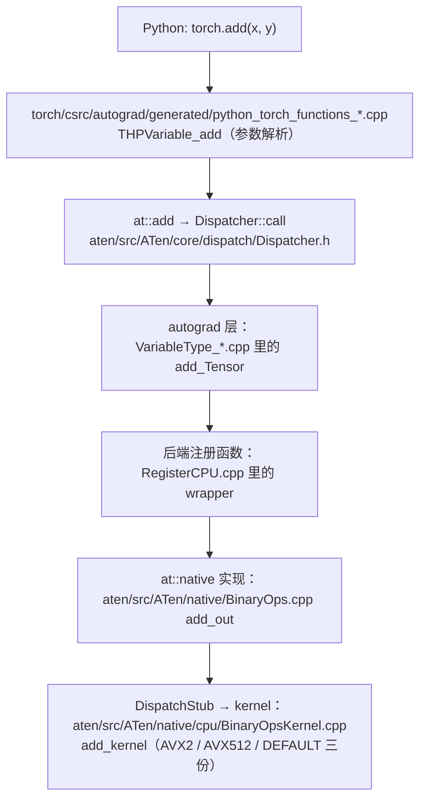
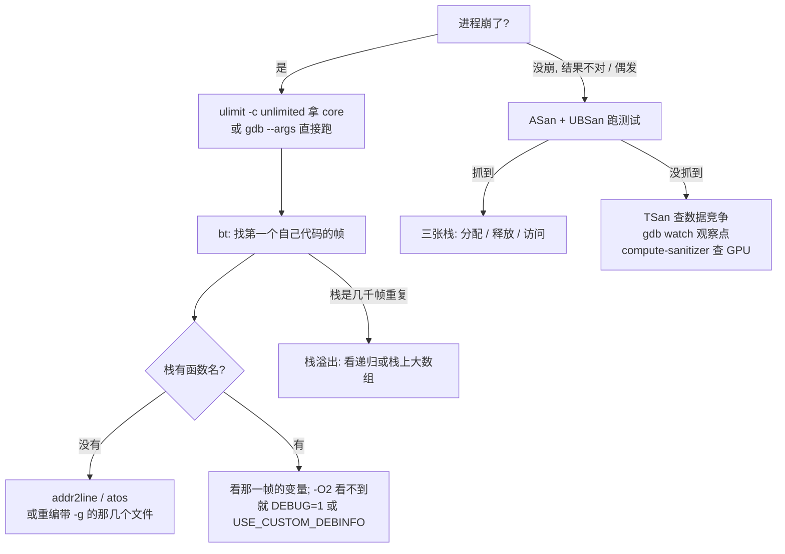

PyTorch 的 CI 测试脚本 `.ci/pytorch/test.sh` 里有一段很奇怪的代码。在 ASan 构建下，它先设置一堆环境变量，然后**故意让 Python 进程崩溃四次**：

```bash
if [[ "$BUILD_ENVIRONMENT" == *asan* ]]; then
    export ASAN_OPTIONS=detect_leaks=0:symbolize=1:detect_stack_use_after_return=true:strict_init_order=true:detect_odr_violation=1:detect_container_overflow=0:check_initialization_order=true:debug=true
    # ...
    export UBSAN_OPTIONS=print_stacktrace=1:suppressions=$PWD/ubsan.supp
    export TORCH_USE_RTLD_GLOBAL=1
    # ...
    LD_PRELOAD=$(clang --print-file-name=libclang_rt.asan-x86_64.so)
    export LD_PRELOAD

    echo "The next four invocations are expected to crash; if they don't that means ASAN/UBSAN is misconfigured"
    (cd test && ! get_exit_code python -c "import torch; torch._C._crash_if_csrc_asan(3)")
    #(cd test && ! get_exit_code python -c "import torch; torch._C._crash_if_csrc_ubsan(0)")
    (cd test && ! get_exit_code python -c "import torch; torch._C._crash_if_vptr_ubsan()")
    (cd test && ! get_exit_code python -c "import torch; torch._C._crash_if_aten_asan(3)")
fi
```

被调用的 `_crash_if_csrc_asan` 在 `torch/csrc/Module.cpp` 里，实现只有几行：声明一个 3 字节的栈数组，然后写第 `arg` 个元素——传 3 就是越界写一个字节：

```cpp
static PyObject* THPModule_crashIfCsrcASAN(PyObject* module, PyObject* arg) {
  HANDLE_TH_ERRORS
  TORCH_CHECK(
      THPUtils_checkLong(arg),
      "crash_if_csrc_asan expects an int, but got ",
      THPUtils_typename(arg));
  // NOLINTNEXTLINE(cppcoreguidelines-avoid-c-arrays, modernize-avoid-c-arrays)
  volatile char x[3];
  x[THPUtils_unpackInt(arg)] = 0;
  // NOLINTNEXTLINE(clang-analyzer-core.CallAndMessage)
  return THPUtils_packInt32(x[0]);
  END_HANDLE_TH_ERRORS
}
```

对一个 Java 工程师来说，这段脚本里几乎每一行都需要解释：

- 为什么要 `LD_PRELOAD` 一个 `libclang_rt.asan-x86_64.so`？为什么是 `clang --print-file-name` 算出来的路径？
- `ASAN_OPTIONS` 里 `detect_leaks=0` 是什么意思，为什么 PyTorch 要关掉泄漏检测？
- `TORCH_USE_RTLD_GLOBAL=1` 和 UBSan 有什么关系？（脚本注释解释了：不这样做会有多份 `libtorch` 的类型信息，UBSan 的 vptr 检查会误报。）
- 越界写一个字节，为什么在普通构建下**不会崩**，非要 ASan 才能抓到？为什么 CI 要先确认"确实会崩"再跑测试？
- `NOLINTNEXTLINE(...)` 注释是给谁看的？`cppcoreguidelines-avoid-c-arrays` 是什么？

在 Java 里，越界写会抛 `ArrayIndexOutOfBoundsException`，这是 JVM 保证的；用不用 IDE 调试、开不开优化都不影响程序语义；构建、依赖、测试由 Maven 或 Gradle 一站式管。C++ 没有这些保证：越界写是未定义行为，默认什么都不会发生（直到别的地方莫名其妙地坏了）；`-O2` 编译出来的程序在调试器里看不到局部变量；构建系统（CMake）、编译器（gcc/clang/nvcc）、测试框架（gtest）、格式化和静态检查（clang-format/clang-tidy）、动态检查（sanitizers）是五套独立的工具，每套都要单独学。

前七篇讲的是语言机制。这一篇讲**工程闭环**：怎么把代码可靠地编出来、出问题时怎么看进去、怎么防止它再坏。核心问题是：

> **一个 C++ 改动，从写完到确认正确、没有内存错误、不会在别的编译器上炸，需要跑哪些东西？**

全文按下面的顺序展开：

1. CMake 的目标模型：`add_library`、`target_link_libraries`、`PUBLIC/PRIVATE/INTERFACE`，以及 `find_package(Torch)` 到底找到了什么；
2. 构建速度：Ninja、ccache/sccache；PyTorch 全量构建为什么慢，增量怎么控制在分钟级；
3. 编译选项：`-O0/-O2/-O3`、`-g`、`-fno-omit-frame-pointer`、`-Wall -Werror`、`-march`；Debug 与 Release；PyTorch 实际用的 flags；
4. `compile_commands.json` 与 clangd：让 IDE 理解百万行项目；
5. gdb/lldb：从 Python 进程 attach，在 kernel 前打断点，看 `at::Tensor` 的内容；`-O2` 下变量为什么消失；
6. 段错误、栈溢出、use-after-free 的排查路径；
7. Sanitizers：ASan/UBSan/TSan 能抓什么、抓不到什么，PyTorch CI 怎么配；
8. gtest：`c10/test/`、`aten/src/ATen/test/`、`test/cpp/` 的组织方式；C++ 测试与 Python 测试的分工；
9. clang-format、clang-tidy 与 PyTorch 的 lint 规则；
10. 工具链版本矩阵：gcc/clang、CUDA、C++ 标准；
11. 回到源码：`c10/test/util/intrusive_ptr_test.cpp`、`tools/gdb/pytorch-gdb.py`、`.clang-tidy`；
12. mini-c10：补齐 CMake 工程、gtest、ASan 选项、lldb 会话、`.clang-format`；
13. 工程实践建议与常见错误；
14. 总结；然后是全系列的总结。

Java 依然是参照系。Maven/Gradle 把依赖、编译、测试三件事一体化，C++ 里由 CMake、编译器、测试框架分别负责，而且依赖管理没有标准答案；JVM 的调试器不关心优化级别，C++ 在 `-O2` 下变量会被优化掉、栈帧会被内联，Debug 构建是必需的；JVM 用运行时检查兜底内存安全，C++ 要靠 sanitizers 在测试阶段主动抓。这三个差别是全文的主线。


## 一、CMake 的目标模型

### 1.1 CMake 不是构建工具，是构建工具的生成器

第一篇讲过 C++ 的四阶段：预处理、编译、汇编、链接。这些都由编译器驱动（`clang++ a.cpp b.cpp -o prog`）。但一个项目有几千个 `.cpp`，哪些文件编进哪个库、库之间怎么链接、头文件路径是什么、每个文件用什么选项，需要有人描述。描述这些的语言是 CMake，描述文件是 `CMakeLists.txt`。

CMake 自己不编译任何东西。它读 `CMakeLists.txt`，生成另一个构建系统的输入文件——Makefile、`build.ninja` 或 Visual Studio 工程——然后由 `make`/`ninja` 去调用编译器。所以流程是两步：

```bash
cmake -S . -B build -G Ninja -DCMAKE_BUILD_TYPE=Release   # 配置：生成 build/build.ninja
cmake --build build                                        # 构建：等价于 (cd build && ninja)
```

Java 工程师习惯的 Maven/Gradle 把"描述项目"和"执行构建"合成一步，还顺带管理依赖（从中央仓库下载 jar）。CMake 只做第一件事的一半：它描述项目，但不下载依赖（C++ 没有中央仓库；依赖要么系统安装，要么 git submodule 进 `third_party/`，要么用 `FetchContent`/vcpkg/conan 之类没有统一标准的方案）；执行构建交给 Ninja。这就是总纲说的"三件事由 CMake、编译器和测试框架分别负责"。

### 1.2 目标：库、可执行文件，以及它们的属性

现代 CMake（3.x 之后）的核心概念是**目标（target）**：一个库或一个可执行文件。每个目标有一组属性——源文件、头文件搜索路径、编译选项、宏定义、链接的其他目标。四个最常用的命令：

```cmake
add_library(c10 ${C10_SRCS} ${C10_HEADERS})          # 创建一个库目标（静态还是动态由 BUILD_SHARED_LIBS 决定）
add_executable(c10_intrusive_ptr_test intrusive_ptr_test.cpp)   # 创建一个可执行文件目标

target_include_directories(c10 PUBLIC <dir>)          # 头文件搜索路径 → 编译时的 -I<dir>
target_compile_options(c10 PRIVATE -fvisibility=hidden)   # 编译选项
target_compile_definitions(c10 PRIVATE C10_BUILD_MAIN_LIB) # 宏定义 → -DC10_BUILD_MAIN_LIB
target_link_libraries(c10_intrusive_ptr_test c10 gtest gtest_main)  # 链接依赖
```

这些都能在 `c10/CMakeLists.txt` 里找到原样。库目标部分（删节）：

```cmake
# c10/CMakeLists.txt
file(GLOB C10_SRCS CONFIGURE_DEPENDS
        *.cpp
        core/*.cpp
        core/impl/*.cpp
        mobile/*.cpp
        macros/*.cpp
        util/*.cpp
      )
# ...
if(NOT BUILD_LIBTORCHLESS)
  add_library(c10 ${C10_SRCS} ${C10_HEADERS})
  torch_compile_options(c10)
  # ...
  # If building shared library, set dllimport/dllexport proper.
  target_compile_options(c10 PRIVATE "-DC10_BUILD_MAIN_LIB")
  # Enable hidden visibility if compiler supports it.
  if(${COMPILER_SUPPORTS_HIDDEN_VISIBILITY})
    target_compile_options(c10 PRIVATE "-fvisibility=hidden")
  endif()
  # ...
  target_link_libraries(c10 PUBLIC headeronly)
  target_link_libraries(c10 PRIVATE fmt::fmt-header-only)
  target_link_libraries(c10 PRIVATE nlohmann)
  target_link_libraries(c10 PRIVATE moodycamel)
  # ...
  target_include_directories(
      c10 PUBLIC
      $<BUILD_INTERFACE:${CMAKE_CURRENT_SOURCE_DIR}/../>
      $<BUILD_INTERFACE:${CMAKE_BINARY_DIR}>
      $<INSTALL_INTERFACE:include>)
endif()

add_subdirectory(test)
add_subdirectory(benchmark)
```

第一篇的 mini-c10 骨架就是照它写的。这里有三处值得停下来。

**`file(GLOB ... CONFIGURE_DEPENDS)`**：用通配符收集源文件。CMake 官方一直不推荐 glob（新增文件后必须重新运行 cmake），`CONFIGURE_DEPENDS` 让构建系统在每次构建前重新检查通配结果，缓解这个问题。c10 用 glob；上层的 `caffe2/CMakeLists.txt` 则从 `build_variables.bzl` 读显式的文件列表（第一篇提过，那是"哪个 `.cpp` 进哪个库"的权威清单）。

**`torch_compile_options(c10)`**：一个 CMake 函数，定义在 `cmake/public/utils.cmake`，把整个项目共用的警告选项、`-fvisibility=hidden`、`-Werror` 策略一次加到目标上。第三节读它。

**`$<BUILD_INTERFACE:...>` / `$<INSTALL_INTERFACE:...>`**：生成器表达式。头文件路径在"从源码树构建"和"安装后被别的项目用"两种场景下不同：构建时是 `c10/../`（即仓库根，这样 `#include <c10/core/Device.h>` 能解析），安装后是 `<prefix>/include`。

### 1.3 `PUBLIC` / `PRIVATE` / `INTERFACE`：属性的传递性

上面每个 `target_*` 命令都带一个关键字。它决定属性**传不传给链接到这个目标的下游**：

| 关键字 | 对自己生效 | 传给下游 | 典型用法 |
|---|---|---|---|
| `PRIVATE` | 是 | 否 | 实现细节：`-fvisibility=hidden`、`-DC10_BUILD_MAIN_LIB`、只在 `.cpp` 里用的第三方库（`fmt`、`nlohmann`） |
| `PUBLIC` | 是 | 是 | 接口的一部分：头文件目录（下游要 include 你的头）、头文件里 `#include` 了的库（`headeronly`、`glog`） |
| `INTERFACE` | 否 | 是 | 纯头文件库（自己没有 `.cpp` 可编译），或者"只是为了把一组属性打包"的假目标 |

判断标准只有一个：**这个属性是否出现在我的头文件里**。`c10` 的头文件 `#include <torch/headeronly/...>`，所以 `headeronly` 是 `PUBLIC`——任何 include 了 c10 头文件的下游都需要它的路径。`fmt` 只在 `c10/util/*.cpp` 里用，所以 `PRIVATE`——下游不需要知道 fmt 存在。`-fvisibility=hidden` 是 c10 自己怎么编的问题，`PRIVATE`——如果写成 `PUBLIC`，所有链接 c10 的目标都会变成 hidden 可见性，扩展模块的 `PyInit_*` 会消失。

传递是链式的：`torch_cpu` 链接 `c10`（`PUBLIC`），`torch_python` 链接 `torch_cpu`，于是 `torch_python` 自动拿到 c10 的头文件路径和 `headeronly`。这也是为什么 `find_package(Torch)` 之后只需要 `target_link_libraries(my_ext torch)` 一行——所有传递属性自动带过来。

Java 对照：Maven 的 `compile` 与 `runtime`/`provided` scope 有类似的传递性概念（`compile` 依赖传给下游，`provided` 不传），但 Maven 传递的是"jar 文件"这一种东西；CMake 传递的是头文件路径、宏定义、编译选项、链接选项四类属性，粒度更细，而且传错会导致编译期或链接期的失败，而不是运行期的 `ClassNotFoundException`。

### 1.4 `find_package(Torch)` 找到了什么

写一个链接 libtorch 的项目，CMake 文件的第一行通常是：

```cmake
find_package(Torch REQUIRED)
target_link_libraries(my_ext torch)
```

`find_package(Torch)` 做的事是：在 `CMAKE_PREFIX_PATH` 里找一个叫 `TorchConfig.cmake` 的文件并执行它。这个文件由 PyTorch 构建时从模板 `cmake/TorchConfig.cmake.in` 生成（`caffe2/CMakeLists.txt` 末尾的 `configure_file(... TorchConfig.cmake.in ...)`），安装到 `<prefix>/share/cmake/Torch/`；pip 装的 wheel 里，`<prefix>` 就是 `site-packages/torch/`。

模板开头说明了它输出什么：

```cmake
# cmake/TorchConfig.cmake.in
# FindTorch
# -------
#
# Finds the Torch library
#
# This will define the following variables:
#
#   TORCH_FOUND        -- True if the system has the Torch library
#   TORCH_INCLUDE_DIRS -- The include directories for torch
#   TORCH_LIBRARIES    -- Libraries to link against
#   TORCH_CXX_FLAGS    -- Additional (required) compiler flags
#
# and the following imported targets:
#
#   torch
```

主体部分（删节）：

```cmake
if(DEFINED ENV{TORCH_INSTALL_PREFIX})
  set(TORCH_INSTALL_PREFIX $ENV{TORCH_INSTALL_PREFIX})
else()
  # Assume we are in <install-prefix>/share/cmake/Torch/TorchConfig.cmake
  get_filename_component(CMAKE_CURRENT_LIST_DIR "${CMAKE_CURRENT_LIST_FILE}" PATH)
  get_filename_component(TORCH_INSTALL_PREFIX "${CMAKE_CURRENT_LIST_DIR}/../../../" ABSOLUTE)
endif()

# Include directories.
set(TORCH_INCLUDE_DIRS
  ${TORCH_INSTALL_PREFIX}/include
  ${TORCH_INSTALL_PREFIX}/include/torch/csrc/api/include)

# Library dependencies.
if(@BUILD_SHARED_LIBS@)
  find_package(Caffe2 REQUIRED PATHS ${CMAKE_CURRENT_LIST_DIR}/../Caffe2)
  set(TORCH_LIBRARIES torch ${Caffe2_MAIN_LIBS})
  append_torchlib_if_found(c10)
else()
  add_library(torch STATIC IMPORTED) # set imported_location at the bottom
  #library need whole archive
  append_wholearchive_lib_if_found(torch torch_cpu)
  if(@USE_CUDA@)
    append_wholearchive_lib_if_found(torch_cuda c10_cuda)
  endif()
  # ...
endif()

if(@USE_CUDA@)
  # ...
  if(@BUILD_SHARED_LIBS@)
    find_library(C10_CUDA_LIBRARY c10_cuda PATHS "${TORCH_INSTALL_PREFIX}/lib")
    list(APPEND TORCH_CUDA_LIBRARIES ${C10_CUDA_LIBRARY} ${Caffe2_PUBLIC_CUDA_DEPENDENCY_LIBS})
  endif()
  list(APPEND TORCH_LIBRARIES ${TORCH_CUDA_LIBRARIES})
endif()

find_library(TORCH_LIBRARY torch PATHS "${TORCH_INSTALL_PREFIX}/lib")
# ...
set_target_properties(torch PROPERTIES
    INTERFACE_INCLUDE_DIRECTORIES "${TORCH_INCLUDE_DIRS}"
    CXX_STANDARD 20
)
if(TORCH_CXX_FLAGS)
  set_property(TARGET torch PROPERTY INTERFACE_COMPILE_OPTIONS "${TORCH_CXX_FLAGS}")
endif()

find_package_handle_standard_args(Torch DEFAULT_MSG TORCH_LIBRARY TORCH_INCLUDE_DIRS)
```

逐段读：

1. **定位安装前缀**：从自己所在的路径向上三级（`share/cmake/Torch/` → `<prefix>`）。所以 `find_package(Torch)` 之前必须让 CMake 找到这个目录——要么 `-DCMAKE_PREFIX_PATH=$(python -c 'import torch;print(torch.utils.cmake_prefix_path)')`，要么 `-DTorch_DIR=...`。

2. **头文件路径**：两个目录。第一篇手写 `g++` 命令时发现 `torch/torch.h` 需要额外的 `include/torch/csrc/api/include`，这里就是原因。

3. **动态库分支**（pip wheel 都是这个分支）：`find_package(Caffe2)` 加载同目录的 `Caffe2Config.cmake` 和 `Caffe2Targets.cmake`。后者是 PyTorch 构建时 `install(EXPORT Caffe2Targets ...)` 导出的文件（顶层 `CMakeLists.txt`），里面是一组 **IMPORTED 目标**——`c10`、`torch_cpu`、`torch_cuda`、`torch` 等——每个都记录了 `.so` 的绝对路径和它们之间的 `PUBLIC` 依赖关系。`Caffe2Config.cmake.in` 里 `set(Caffe2_MAIN_LIBS torch_library)`。于是 `TORCH_LIBRARIES` 是 `torch;torch_library;<c10 的路径>`。

4. **静态库分支**：没有 `Caffe2Targets.cmake` 可用（顶层 `CMakeLists.txt` 明确说 "Generated cmake files are only available when building shared libs"），只能手工 `find_library` 每一个 `.a`，而且 `torch`/`torch_cpu` 要用 `--whole-archive`——第一篇和第五篇讲过原因：静态注册的算子所在的 `.o` 没有被任何符号引用，链接器会丢掉它们。这里对三个平台各写了一遍：Linux 的 `-Wl,--whole-archive`、macOS 的 `-Wl,-force_load`、MSVC 的 `-WHOLEARCHIVE:`。

5. **给 `torch` 目标设属性**：`INTERFACE_INCLUDE_DIRECTORIES` 就是 1.3 节的 `INTERFACE` 传递——链接 `torch` 的目标自动拿到头文件路径；`CXX_STANDARD 20` 声明 PyTorch 2.13 的头文件需要 C++20。`TORCH_CXX_FLAGS` 在模板里只是"如果有就设上"——在 v2.13.0 的源码树里，这个模板文件本身并没有 `set(TORCH_CXX_FLAGS ...)`，也没有任何 `_GLIBCXX_USE_CXX11_ABI` 的字样。（PyTorch 2.x 中的变化：早期版本的 `TorchConfig.cmake.in` 会写 `set(TORCH_CXX_FLAGS "-D_GLIBCXX_USE_CXX11_ABI=@GLIBCXX_USE_CXX11_ABI@")`，让下游自动继承 ABI 设置；2.6/2.7 Linux wheel 统一切到 CXX11 ABI 后，2.8 起这一行从 CMake 模板里删除（同时 `cpp_extension.py` 也不再传 `-D_GLIBCXX_USE_CXX11_ABI`）——v2.13.0 的 `cmake/` 目录下已经找不到它。老教程里 `set(CMAKE_CXX_FLAGS "${CMAKE_CXX_FLAGS} ${TORCH_CXX_FLAGS}")` 这一行在 2.13 上是无害的空操作。）

一句话总结 `find_package(Torch)` 找到了什么：**一组 IMPORTED 目标（`torch`、`torch_cpu`、`c10`……），每个目标知道自己的 `.so` 在哪里、头文件在哪里、需要什么 C++ 标准、依赖哪些其他目标**。你链接 `torch`，链接器命令行上出现的是 `libtorch.so libtorch_cpu.so libc10.so ...` 的绝对路径。

### 1.5 vLLM 是怎么用它的

vLLM 是一个"链接 libtorch 的外部项目"的完整样本。它的 `CMakeLists.txt` 开头：

```cmake
cmake_minimum_required(VERSION 3.26)
# ...
project(vllm_extensions LANGUAGES CXX)

set(CMAKE_CXX_STANDARD 20)
set(CMAKE_CXX_STANDARD_REQUIRED ON)
set(CMAKE_CUDA_STANDARD 20)
set(CMAKE_CUDA_STANDARD_REQUIRED ON)
# ...
# PyTorch headers require C++20; GCC < 11.3 has incomplete C++20 support.
if(CMAKE_CXX_COMPILER_ID STREQUAL "GNU" AND CMAKE_CXX_COMPILER_VERSION VERSION_LESS "11.3")
  message(FATAL_ERROR
    "GCC >= 11.3 is required to build vLLM (found ${CMAKE_CXX_COMPILER_VERSION}). "
    "PyTorch's C++20 headers require a compiler with full C++20 support. "
    "See: https://github.com/pytorch/pytorch/pull/167929")
endif()
# ...
include(${CMAKE_CURRENT_LIST_DIR}/cmake/utils.cmake)
# ...
set(TORCH_SUPPORTED_VERSION_CUDA "2.13.0")
set(TORCH_SUPPORTED_VERSION_ROCM "2.13.0")
# ...
if (VLLM_PYTHON_EXECUTABLE)
  find_python_from_executable(${VLLM_PYTHON_EXECUTABLE} "${PYTHON_SUPPORTED_VERSIONS}")
else()
  message(FATAL_ERROR
    "Please set VLLM_PYTHON_EXECUTABLE to the path of the desired python version"
    " before running cmake configure.")
endif()

#
# Update cmake's `CMAKE_PREFIX_PATH` with torch location.
#
append_cmake_prefix_path("torch" "torch.utils.cmake_prefix_path")
# ...
find_package(Torch REQUIRED)
```

`append_cmake_prefix_path` 定义在 `cmake/utils.cmake`，就是"问 Python 要路径"：

```cmake
# vllm/cmake/utils.cmake
function (run_python OUT EXPR ERR_MSG)
  execute_process(
    COMMAND
    "${Python_EXECUTABLE}" "-c" "${EXPR}"
    OUTPUT_VARIABLE PYTHON_OUT
    RESULT_VARIABLE PYTHON_ERROR_CODE
    ERROR_VARIABLE PYTHON_STDERR
    OUTPUT_STRIP_TRAILING_WHITESPACE)

  if(NOT PYTHON_ERROR_CODE EQUAL 0)
    message(FATAL_ERROR "${ERR_MSG}: ${PYTHON_STDERR}")
  endif()
  set(${OUT} ${PYTHON_OUT} PARENT_SCOPE)
endfunction()

# Run `EXPR` in python after importing `PKG`. Use the result of this to extend
# `CMAKE_PREFIX_PATH` so the torch cmake configuration can be imported.
macro (append_cmake_prefix_path PKG EXPR)
  run_python(_PREFIX_PATH
    "import ${PKG}; print(${EXPR})" "Failed to locate ${PKG} path")
  list(APPEND CMAKE_PREFIX_PATH ${_PREFIX_PATH})
endmacro()
```

这解决了 C++ 世界"依赖管理没有标准答案"的一个具体实例：vLLM 的依赖 libtorch 不是系统包，而是**当前 Python 环境里 pip 装的那一份**。所以让 CMake 去问那个 Python：`torch.utils.cmake_prefix_path` 返回 `site-packages/torch/share/cmake`，追加到 `CMAKE_PREFIX_PATH`，`find_package(Torch)` 就能找到 `TorchConfig.cmake`。同一个文件里的 `get_torch_gpu_compiler_flags` 用同样的手法向 `torch.utils.cpp_extension.COMMON_NVCC_FLAGS` 要 nvcc 的默认选项——保证扩展用的 CUDA 编译选项和 PyTorch 自己一致。

最后创建扩展目标的函数 `define_extension_target`（同一文件末尾，删节）：

```cmake
function (define_extension_target MOD_NAME)
  cmake_parse_arguments(PARSE_ARGV 1
    ARG
    "WITH_SOABI"
    "DESTINATION;LANGUAGE;USE_SABI"
    "SOURCES;ARCHITECTURES;COMPILE_FLAGS;INCLUDE_DIRECTORIES;LIBRARIES")
  # ...
  if (ARG_USE_SABI AND NOT IS_FREETHREADED_PYTHON)
    Python_add_library(${MOD_NAME} MODULE USE_SABI ${ARG_USE_SABI} ${SOABI_KEYWORD} "${ARG_SOURCES}")
  else()
    Python_add_library(${MOD_NAME} MODULE ${SOABI_KEYWORD} "${ARG_SOURCES}")
  endif()
  # ...
  target_compile_options(${MOD_NAME} PRIVATE
    $<$<COMPILE_LANGUAGE:${ARG_LANGUAGE}>:${ARG_COMPILE_FLAGS}>)

  target_compile_definitions(${MOD_NAME} PRIVATE
    "-DTORCH_EXTENSION_NAME=${MOD_NAME}")

  target_link_libraries(${MOD_NAME} PRIVATE torch ${ARG_LIBRARIES})

  # Don't use `TORCH_LIBRARIES` for CUDA since it pulls in a bunch of
  # dependencies that are not necessary and may not be installed.
  if (ARG_LANGUAGE STREQUAL "CUDA")
    target_link_libraries(${MOD_NAME} PRIVATE torch CUDA::cudart CUDA::cuda_driver ${ARG_LIBRARIES})
  else()
    target_link_libraries(${MOD_NAME} PRIVATE torch ${TORCH_LIBRARIES} ${ARG_LIBRARIES})
  endif()

  install(TARGETS ${MOD_NAME} LIBRARY DESTINATION ${ARG_DESTINATION} COMPONENT ${MOD_NAME})
endfunction()
```

注意两点。第一，`Python_add_library(... MODULE ...)`：Python 扩展模块用 `MODULE` 而不是 `SHARED`——它是被 `dlopen` 的，不会被别人 `-l` 链接，CMake 对两者的处理略有不同（`MODULE` 不生成 `.dylib`/import lib，只生成能加载的 `.so`）。`USE_SABI 3` 是 Python 稳定 ABI（第七篇讲过 vLLM 为什么用 `TORCH_LIBRARY` 而不是 pybind11——正是为了能用稳定 ABI，一个 `.so` 服务多个 Python 版本）。第二，`target_link_libraries(${MOD_NAME} PRIVATE torch ...)`：只链 `torch`，不链 `torch_python`——第一篇末尾的结论。CUDA 分支特意不用 `TORCH_LIBRARIES`，因为它会把 cuDNN、NCCL 等一堆依赖拉进来。

vLLM 的 `setup.py` 只是这些 CMake 的驱动器：它计算并发数、选 ccache/sccache、设置 `CMAKE_BUILD_TYPE`，然后调用 `cmake`。下一节看它。

### 1.6 Java 对照小结

| | Maven / Gradle | CMake + Ninja |
|---|---|---|
| 描述项目 | `pom.xml` / `build.gradle` | `CMakeLists.txt` |
| 执行构建 | 自己执行 | 生成 `build.ninja`，交给 Ninja |
| 依赖管理 | 中央仓库，按坐标下载 | 无标准；`third_party/` submodule、系统包、`find_package` 找已安装的、`FetchContent` 下载源码 |
| 传递依赖 | scope（compile/runtime/provided） | `PUBLIC`/`PRIVATE`/`INTERFACE`，传递四类属性 |
| 产物 | jar（平台无关） | `.so`/`.a`/可执行文件（平台、编译器、ABI 相关） |
| 依赖找不到 | 运行时 `ClassNotFoundException` 或构建时下载失败 | 配置期 `find_package` 失败、编译期头文件找不到、链接期 undefined reference、加载期 `.so` 找不到——四个阶段之一 |

最容易误导的类比是"`find_package(Torch)` = 声明一个 Maven 依赖"。Maven 依赖是一个坐标，Maven 负责让它出现；`find_package` 只是**找**，找的是别人已经装好的东西，装在哪里、版本对不对、ABI 是否匹配，全部是你的责任。vLLM 用"问 Python"的手法把这个责任转嫁给了 pip。


## 二、构建速度：Ninja、ccache/sccache 与增量构建

### 2.1 为什么 PyTorch 全量构建要一小时

PyTorch 的一次干净构建在几十核的机器上也要几十分钟到一小时以上，原因可以拆成四层：

1. **翻译单元数量**。`build_variables.bzl` 里列出的 `.cpp` 有几千个，加上 torchgen 生成的（第五篇：`VariableType_0.cpp` 到 `VariableType_9.cpp`、`RegisterCPU.cpp`、`RegisterCUDA.cpp` 等等）。每个都是一次独立的编译器进程。

2. **每个翻译单元很大**。第一篇讲过头文件是文本拼接：一个 `#include <ATen/ATen.h>` 展开后是几十万行。几千个翻译单元各自展开一遍同样的头文件，这是 C++ 编译模型固有的重复劳动——Java 的 `javac` 读一次 `.class` 就能复用，C++ 没有模块化的头文件（C++20 的 modules 在这些项目里还没有用起来）。

3. **模板实例化**。第三篇讲过模板为每组参数生成一份代码。`AT_DISPATCH_ALL_TYPES` 之类的宏让一个 kernel 实例化十几次；`aten/src/ATen/native/cpu/*.cpp` 还要为 DEFAULT/AVX2/AVX512 三种 CPU 能力**各编一遍**（`cmake/Codegen.cmake` 里 `CPU_CAPABILITY_NAMES` 和 `CPU_CAPABILITY_FLAGS` 两个列表，同一个 `.cpp` 用不同的 `-mavx2 -mfma` / `-mavx512f ...` 选项编成多个 `.o`）。

4. **CUDA**。`nvcc` 对每个 `.cu` 要为 `TORCH_CUDA_ARCH_LIST` 里的每个架构各生成一份 SASS，再加 PTX；一个 `.cu` 的编译时间常常是 `.cpp` 的十倍。这是 `USE_CUDA=0` 能把构建时间砍掉一大半的原因。

### 2.2 Ninja：让并行度和依赖跟踪不成为瓶颈

CMake 默认生成 Makefile。`make` 的问题是递归调用、依赖检查慢、并行度要手工指定 `-j`。Ninja 是为"被生成器生成"而设计的构建工具：单一的 `build.ninja` 文件、启动时间毫秒级、自动用满所有核、no-op 构建（没有改动时重新运行）几乎瞬间完成。

PyTorch 的 `tools/setup_helpers/cmake.py` 在 PATH 上有 `ninja` 时自动使用它：

```python
# tools/setup_helpers/cmake.py
# Ninja
# Use ninja if it is on the PATH. Previous version of PyTorch required the
# ninja python package, but we no longer use it, so we do not have to import it
USE_NINJA = bool(not check_negative_env_flag("USE_NINJA") and shutil.which("ninja"))
if "CMAKE_GENERATOR" in os.environ:
    USE_NINJA = os.environ["CMAKE_GENERATOR"].lower() == "ninja"
```

并发数的决策在 `build()` 方法里：

```python
    def build(self, my_env: dict[str, str]) -> None:
        """Runs cmake to build binaries."""

        from .env import build_type

        build_args = [
            "--build",
            ".",
            "--target",
            "install",
            "--config",
            build_type.build_type_string,
        ]

        # Determine the parallelism according to the following
        # priorities:
        # 1) MAX_JOBS environment variable
        # 2) If using the Ninja build system, delegate decision to it.
        # 3) Otherwise, fall back to the number of processors.
        # ...
        max_jobs = os.getenv("MAX_JOBS")

        if max_jobs is not None or not USE_NINJA:
            # ...
            max_jobs = max_jobs or str(multiprocessing.cpu_count())

            # CMake 3.12 provides a '-j' option.
            build_args += ["-j", max_jobs]
        self.run(build_args, my_env)
```

`MAX_JOBS` 是每个 PyTorch 开发者都会用到的变量：默认 Ninja 用满所有核，但编 CUDA 时每个 `nvcc` 进程可能吃几 GB 内存，机器内存不够就会 OOM，此时需要 `MAX_JOBS=8` 之类手工限制。vLLM 的 `setup.py` 做了更细的处理——`compute_num_jobs` 用 `os.sched_getaffinity(0)` 取真正可用的核数，还根据 `NVCC_THREADS`（让单个 nvcc 内部多线程）相应减少并发数，并通过 `-DCMAKE_JOB_POOL_COMPILE`/`-DCMAKE_JOB_POOLS` 把并发限制传给 Ninja 的 job pool。

### 2.3 ccache / sccache：跨构建目录复用编译结果

Ninja 解决的是"改一个文件只重编受影响的文件"。但有些场景 Ninja 也帮不上：切换 git 分支再切回来（文件时间戳变了）、删掉 `build/` 重来、在两个 worktree 之间切换。ccache 解决这个问题：它在编译器前面拦一层，用预处理后的源码内容和编译选项算哈希，命中就直接给出上次的 `.o`。

PyTorch 顶层 `CMakeLists.txt` 默认开启：

```cmake
cmake_dependent_option(
  USE_CCACHE "Attempt using [S]CCache to wrap the compilation" ON "UNIX" OFF)
# ...
if(USE_CCACHE)
  find_program(CCACHE_PROGRAM ccache)
  find_program(SCCACHE_EXECUTABLE sccache)
  if(CCACHE_PROGRAM)
    foreach(LANG CXX C CUDA)
      set(CMAKE_${LANG}_COMPILER_LAUNCHER
          "${CCACHE_PROGRAM}"
          CACHE STRING "${LANG} compiler launcher")
    endforeach()
  elseif(SCCACHE_EXECUTABLE)
    foreach(LANG CXX C CUDA)
      set(CMAKE_${LANG}_COMPILER_LAUNCHER
          "${SCCACHE_EXECUTABLE}"
          CACHE STRING "${LANG} compiler launcher")
    endforeach()
  else()
    message(
      STATUS
        "Could not find neither ccache nor sccache. Consider installing ccache to speed up compilation."
    )
  endif()
endif()
```

`CMAKE_<LANG>_COMPILER_LAUNCHER` 是 CMake 的标准机制：编译命令从 `g++ -c foo.cpp` 变成 `ccache g++ -c foo.cpp`。注意它对 `CUDA` 也生效——`nvcc` 的结果同样可以缓存。sccache 是 Mozilla 的 ccache 替代品，区别是缓存可以放在 S3/GCS 等远程存储，CI 集群共享；PyTorch 和 vLLM 的 CI 都用 sccache（vLLM 的 `setup.py` 优先选 sccache，其次 ccache，前面已经看到）。`cmake/Dependencies.cmake` 里还有一处针对 sccache 的特殊处理：CUDA 编译默认用 response file 传参数，但 sccache 遇到 response file 会拒绝缓存，所以 `CMAKE_CUDA_USE_RESPONSE_FILE_FOR_*` 被关掉了。

`CONTRIBUTING.md` 给了检验 ccache 生效的办法：做两次干净构建，第二次应该快得多；或者看 `build/CMakeCache.txt` 里 `CMAKE_CXX_COMPILER_LAUNCHER:STRING=/usr/bin/ccache`。

Java 对照：Gradle 的 build cache 是同一个思路（按输入哈希缓存任务输出，可以远程共享），而且是 Gradle 内建的。C++ 这边 ccache 是编译器无关的外挂，与 CMake、Ninja 都是独立的项目，要分别安装和配置——又一次"三件事由三个工具做"。

### 2.4 增量构建怎么控制在分钟级

一小时是干净构建。日常开发的目标是：改一个 `.cpp` 后，几十秒到几分钟内能跑测试。从 PyTorch 自己的文档和源码里能提炼出六个手段。

**第一，用 develop 模式安装，不重复打包。** `setup.py` 开头的注释和末尾的提示都指向同一条命令：

```python
# setup.py
build_update_message = """
It is no longer necessary to use the 'build' or 'rebuild' targets

To install:
  $ python -m pip install --no-build-isolation -v .
To develop locally:
  $ python -m pip install --no-build-isolation -v -e .
To force cmake to re-generate native build files (off by default):
  $ CMAKE_FRESH=1 python -m pip install --no-build-isolation -v -e .
""".strip()
```

`-e`（editable，即老的 `setup.py develop`——源码里还保留着把 `develop` 重定向到 `pip install -e` 的兼容逻辑）让 `import torch` 直接指向源码树里的 `torch/`，编出来的 `.so` 通过 `install` 目标拷到 `torch/lib/`。改 Python 文件不需要任何构建；改 C++ 文件重跑同一条命令，`tools/setup_helpers/cmake.py` 的 `generate()` 检测到 `build/CMakeCache.txt` 和 `build/build.ninja` 都在就跳过配置，直接 `ninja install`：

```python
        if cmake_cache_file_available and (
            not USE_NINJA or os.path.exists(self._ninja_build_file)
        ):
            # Everything's in place. Do not rerun.
            return
```

**第二，`USE_*` 开关关掉用不到的部分。** `setup.py` 开头几百行注释是一份开关清单：`USE_CUDA=0`、`USE_DISTRIBUTED=0`、`USE_MKLDNN=0`、`USE_FBGEMM=0`、`USE_NNPACK=0`、`USE_XNNPACK=0`、`USE_FLASH_ATTENTION=0`、`USE_MEM_EFF_ATTENTION=0`、`BUILD_TEST=0`……这些环境变量由 `cmake/EnvVarForwarding.cmake` 转成同名的 CMake 变量（"passes all `BUILD_*`, `USE_*`, and `CMAKE_*` environment variables as `-D` flags"）。`CONTRIBUTING.md` 给的开发配置是：

```bash
DEBUG=1 USE_DISTRIBUTED=0 USE_MKLDNN=0 USE_CUDA=0 BUILD_TEST=0 \
    USE_FBGEMM=0 USE_NNPACK=0 USE_QNNPACK=0 USE_XNNPACK=0 \
    python -m pip install --no-build-isolation -v -e .
```

`BUILD_TEST=0` 值得单独说：它关掉的是几百个 gtest 可执行文件的构建（第八节），只在改测试时才需要打开。这些开关**只在第一次配置时生效**——`CMakeCache.txt` 生成后就固化了，之后要改用 `ccmake build/` 或直接编辑 cache，或者 `CMAKE_FRESH=1` 重来。

**第三，只构建需要的目标。** `CONTRIBUTING.md`："Working on a test binary? Run `(cd build && ninja bin/test_binary_name)` to rebuild only that test binary (without rerunning cmake)"。绕开 `setup.py`，直接对 Ninja 说要什么。

**第四，选对构建类型。** `tools/setup_helpers/env.py` 把三个环境变量映射到 `CMAKE_BUILD_TYPE`：

```python
# tools/setup_helpers/env.py
# hotpatch environment variable 'CMAKE_BUILD_TYPE'. 'CMAKE_BUILD_TYPE' always prevails over DEBUG or REL_WITH_DEB_INFO.
if "CMAKE_BUILD_TYPE" not in os.environ:
    if check_env_flag("DEBUG"):
        os.environ["CMAKE_BUILD_TYPE"] = "Debug"
    elif check_env_flag("REL_WITH_DEB_INFO"):
        os.environ["CMAKE_BUILD_TYPE"] = "RelWithDebInfo"
    else:
        os.environ["CMAKE_BUILD_TYPE"] = "Release"
```

`DEBUG=1` 编得快（`-O0` 不做优化）、能调试，但跑得慢；`REL_WITH_DEB_INFO=1` 有优化也有符号，跑得快，调试时变量可能看不到（第五节）。第三节详细比较。

**第五，只给几个文件加调试信息。** 一个常见困境：手头是 Release 构建，想调试某个函数，但不想花一小时重编 Debug 版。`setup.py` 注释里的 `USE_CUSTOM_DEBINFO="path/to/file1.cpp;path/to/file2.cpp"`——"build with debug info only for specified files"。顶层 `CMakeLists.txt` 的实现是给指定源文件单独加 `-g`：

```cmake
# Parse custom debug info
if(DEFINED USE_CUSTOM_DEBINFO)
  string(REPLACE ";" " " SOURCE_FILES "${USE_CUSTOM_DEBINFO}")
  message(STATUS "Source files with custom debug infos: ${SOURCE_FILES}")

  string(REGEX REPLACE " +" ";" SOURCE_FILES_LIST "${SOURCE_FILES}")

  # Set the COMPILE_FLAGS property for each source file
  foreach(SOURCE_FILE ${SOURCE_FILES_LIST})
    # ...
      set(ALL_PT_TARGETS "torch_python;c10;torch_cpu;torch")
    # ...
    set_source_files_properties(
      ${SOURCE_FILE} DIRECTORY "caffe2/" TARGET_DIRECTORY ${ALL_PT_TARGETS}
      PROPERTIES COMPILE_FLAGS "-g")
  endforeach()

  # Link everything with debug info when any file is in debug mode
  set(CMAKE_EXE_LINKER_FLAGS "${CMAKE_EXE_LINKER_FLAGS} -g")
```

还有更轻的 `tools/build_with_debinfo.py`，`CONTRIBUTING.md` 的 "Rebuild few files with debug information" 一节演示了它：先在 lldb 里断到 `applySelect`，只看到汇编；跑 `./tools/build_with_debinfo.py torch/csrc/autograd/python_variable_indexing.cpp`（只重编一个 `.o` 加重新链接 `libtorch_python`，两步），再断进去就能看到源码行和参数值。第五节引用那段输出。

**第六，预编译头与更快的链接器。** `USE_PRECOMPILED_HEADERS=1` 让编译器把 `<ATen/ATen.h>` 的 AST 存成文件复用；`CMAKE_LINKER_TYPE=MOLD`（CMake 3.29+）换用 mold 或 lld 链接器——改一个文件时链接 `libtorch_cpu.so` 常常比编译那个文件更耗时，GNU ld 尤其慢。都在 `CONTRIBUTING.md` 的 "Make no-op build fast" 一节。

把这些合起来：一台 32 核机器上，`USE_CUDA=0 BUILD_TEST=0 USE_DISTRIBUTED=0` 加 ccache 的 CPU-only Debug 构建，干净构建二三十分钟，之后改一个 `.cpp` 到 `import torch` 能用，一般在一两分钟以内——瓶颈是链接。改一个被广泛 include 的头文件（比如 `c10/core/TensorImpl.h`）则回到十几分钟，因为第一篇说过的原因：所有 include 它的翻译单元都要重编。这是 C++ 工程里"改头文件要三思"的真实成本。

Java 对照：`javac` 的增量编译粒度是类，改一个类的实现（不改签名）只重编这个类；Gradle 还能做到 ABI 感知的增量（改了方法体但没改签名，下游不重编）。C++ 的粒度是翻译单元，而且没有 ABI 感知——头文件里改一个注释，所有 include 它的 `.cpp` 全部重编（ccache 会在预处理后发现内容没变而命中，这是它最有价值的场景之一）。


## 三、编译选项：优化级别、调试信息、警告与目标架构

### 3.1 优化级别与调试信息

编译器最重要的两组开关是优化级别和调试信息，它们是正交的：

| 选项 | 含义 | 编译速度 | 运行速度 | 可调试性 |
|---|---|---|---|---|
| `-O0` | 不优化，每个变量都在栈上，每条语句按顺序生成代码 | 最快 | 慢（比 `-O2` 慢 3–10 倍是常态） | 最好：变量、行号一一对应 |
| `-O1` | 基本优化，不做激进内联 | 快 | 中 | 尚可 |
| `-O2` | 大多数优化：内联、循环变换、向量化、寄存器分配、死代码消除 | 慢 | 快 | 差：变量被优化掉、函数被内联、语句重排 |
| `-O3` | 在 `-O2` 上更激进的内联和向量化，代码体积变大 | 更慢 | 快（不一定比 `-O2` 快） | 差 |
| `-Og` | 为调试优化：做不影响调试体验的优化 | 快 | 中 | 好 |
| `-g` | 生成 DWARF 调试信息（变量名、类型、行号表） | 稍慢，`.o` 变大数倍 | **无影响** | 前提条件 |

`-g` 不影响生成的机器码，只是附加一张"地址 ↔ 源码"的表；所以 `-O2 -g` 是完全合法的组合，这就是 CMake 的 `RelWithDebInfo`。它的问题不是"不能调试"，而是调试时看到的东西和源码对不上：一个局部变量整个生命周期都在寄存器里、中途被复用，调试器只能显示 `<optimized out>`；一个小函数被内联进调用者，栈回溯里没有它自己的帧（DWARF 能记录内联信息，好的调试器会显示 `[inlined]`，但你不能在它的"帧"里 `finish`）。第五节用 mini-c10 实际演示。

CMake 的四种构建类型对应的默认选项（GCC/Clang）：

| `CMAKE_BUILD_TYPE` | `CMAKE_CXX_FLAGS_<TYPE>` 默认值 | 用途 |
|---|---|---|
| `Debug` | `-g` | 开发、调试 |
| `Release` | `-O3 -DNDEBUG` | 发布 |
| `RelWithDebInfo` | `-O2 -g -DNDEBUG` | 有符号的发布版；性能分析、线上 core dump 分析 |
| `MinSizeRel` | `-Os -DNDEBUG` | 嵌入式 |

`-DNDEBUG` 是 C 标准的约定：定义了它，`assert()` 变成空。PyTorch 用它控制 `TORCH_INTERNAL_ASSERT_DEBUG_ONLY`——`c10/util/Exception.h` 里这个宏在 `#ifdef NDEBUG` 分支下"generates no code"，否则等于 `TORCH_INTERNAL_ASSERT`。注释说明了用途："appropriate to use in situations where you want to add an assert to a hotpath, but it is too expensive to run this assert on production builds"。第一篇 mini-c10 的 `build_flavor()` 用的也是 `NDEBUG`。

### 3.2 PyTorch 实际的编译选项

PyTorch 的选项分三层：顶层 `CMakeLists.txt` 里追加到全局 `CMAKE_CXX_FLAGS` 的、`torch_compile_options()` 函数按目标加的、各子目录自己加的。

顶层（非 MSVC 分支，删节）：

```cmake
# CMakeLists.txt
if(NOT MSVC)
  string(APPEND CMAKE_CXX_FLAGS " -O2 -fPIC")

  # This prevents use of `c10::optional`, `c10::nullopt` etc within the codebase
  string(APPEND CMAKE_CXX_FLAGS " -DC10_NODEPRECATED")
  # ...
  string(APPEND CMAKE_CXX_FLAGS " -Wall")
  string(APPEND CMAKE_CXX_FLAGS " -Wextra")
  append_cxx_flag_if_supported("-Werror=return-type" CMAKE_CXX_FLAGS)
  append_cxx_flag_if_supported("-Werror=non-virtual-dtor" CMAKE_CXX_FLAGS)
  append_cxx_flag_if_supported("-Werror=braced-scalar-init" CMAKE_CXX_FLAGS)
  append_cxx_flag_if_supported("-Werror=range-loop-construct" CMAKE_CXX_FLAGS)
  append_cxx_flag_if_supported("-Werror=bool-operation" CMAKE_CXX_FLAGS)
  append_cxx_flag_if_supported("-Wnarrowing" CMAKE_CXX_FLAGS)
  append_cxx_flag_if_supported("-Wno-missing-field-initializers"
                               CMAKE_CXX_FLAGS)
  append_cxx_flag_if_supported("-Wno-unknown-pragmas" CMAKE_CXX_FLAGS)
  append_cxx_flag_if_supported("-Wno-unused-parameter" CMAKE_CXX_FLAGS)
  # ...
  append_cxx_flag_if_supported("-Wsuggest-override" CMAKE_CXX_FLAGS)
  append_cxx_flag_if_supported("-Wnewline-eof" CMAKE_CXX_FLAGS)
  append_cxx_flag_if_supported("-Winconsistent-missing-override"
                               CMAKE_CXX_FLAGS)
  append_cxx_flag_if_supported("-Winconsistent-missing-destructor-override"
                               CMAKE_CXX_FLAGS)
  # ...
  if(WERROR)
    append_cxx_flag_if_supported("-Werror" CMAKE_CXX_FLAGS)
    if(NOT COMPILER_SUPPORT_WERROR)
      set(WERROR FALSE)
    endif()
  endif()
  append_cxx_flag_if_supported("-Wno-maybe-uninitialized" CMAKE_CXX_FLAGS)
  append_cxx_flag_if_supported("-fstandalone-debug" CMAKE_CXX_FLAGS_DEBUG)
  if(CMAKE_SYSTEM_PROCESSOR MATCHES "aarch64" AND CMAKE_CXX_COMPILER_ID MATCHES "GNU")
    # ...
    string(APPEND CMAKE_CXX_FLAGS_DEBUG " -fno-omit-frame-pointer -Og")
    string(APPEND CMAKE_LINKER_FLAGS_DEBUG " -fno-omit-frame-pointer -Og")
  else()
    string(APPEND CMAKE_CXX_FLAGS_DEBUG " -fno-omit-frame-pointer -O0")
    string(APPEND CMAKE_LINKER_FLAGS_DEBUG " -fno-omit-frame-pointer -O0")
  endif()
  # aarch64 C++ stack unwinding uses frame-pointer chain walking, so frame
  # pointers must be present in all build types.  The cost is negligible on
  # aarch64 (31 GPRs vs x86-64's 16, so dedicating x29 rarely spills).
  if(CMAKE_SYSTEM_PROCESSOR MATCHES "aarch64")
    append_cxx_flag_if_supported("-fno-omit-frame-pointer" CMAKE_CXX_FLAGS)
  endif()
  append_cxx_flag_if_supported("-fno-math-errno" CMAKE_CXX_FLAGS)
  append_cxx_flag_if_supported("-fno-trapping-math" CMAKE_CXX_FLAGS)
  append_cxx_flag_if_supported("-Werror=format" CMAKE_CXX_FLAGS)
  # ...
  # needed for compat with newer versions of clang that use C++20 mangling rules
  if(CMAKE_CXX_COMPILER_ID MATCHES "Clang" AND CMAKE_CXX_COMPILER_VERSION VERSION_GREATER_EQUAL 18)
    append_cxx_flag_if_supported("-fclang-abi-compat=17" CMAKE_CXX_FLAGS)
  endif()
```

几个值得注意的决策：

- **`-O2 -fPIC` 写进全局 `CMAKE_CXX_FLAGS`**：`-fPIC`（位置无关代码）是动态库的硬要求。`-O2` 放在全局 flags 里，而 CMake 把 `CMAKE_CXX_FLAGS` 排在 `CMAKE_CXX_FLAGS_<TYPE>` 前面，所以 Release 构建的命令行是 `... -O2 ... -O3 -DNDEBUG`，后出现的 `-O3` 胜出；Debug 构建是 `... -O2 ... -g -fno-omit-frame-pointer -O0`，`-O0` 胜出。`cmake/Dependencies.cmake` 末尾还对 `NDEBUG` 做了一次显式的加/删，保证 Release 有、其他没有。
- **`-Wall -Wextra` 加一组 `-Werror=<specific>`**：不是全局 `-Werror`，而是把少数几类**几乎一定是 bug** 的警告升级为错误——函数没有返回值（`return-type`）、有虚函数但析构不虚（`non-virtual-dtor`，第四篇讲过后果）、printf 格式串与参数不匹配（`format`）。其他警告保留为警告。
- **`-Wno-*` 关掉一批噪音**：`unused-parameter`（接口实现里未用的参数太常见）、`missing-field-initializers`、`unknown-pragmas`（`#pragma omp` 在没有 OpenMP 时会警告）、`maybe-uninitialized`（GCC 的这个警告误报多）。
- **`WERROR` 是一个 option，默认 OFF**（`option(WERROR "Build with -Werror supported by the compiler" OFF)`），CI 打开。原因是编译器版本不同警告集合不同：在 gcc 11 上干净的代码，gcc 13 可能多出几个新警告，如果默认 `-Werror`，用户用新编译器从源码构建就会失败。这就是核心问题里"不会在别的编译器上炸"的一个方面——**警告是编译器相关的，`-Werror` 让编译器升级变成构建失败**。
- **`-fno-omit-frame-pointer`**：Debug 构建必开；aarch64 上所有构建类型都开，注释解释了原因：aarch64 的栈回溯靠帧指针链，而保留帧指针在 31 个通用寄存器的架构上几乎没有代价。第六节讲它和 backtrace 的关系。
- **`-fclang-abi-compat=17`**：第七篇讲的 ABI 问题的一个实例——clang 18 改了 C++20 的 name mangling 规则，PyTorch 用这个选项钉住 clang 17 的规则，保证不同 clang 版本编出来的库能互相链接。

按目标加的部分在 `cmake/public/utils.cmake` 的 `torch_compile_options()`（删节）：

```cmake
function(torch_compile_options libname)
  set_property(TARGET ${libname} PROPERTY CXX_STANDARD 20)
  # ...
  else()
    set(private_compile_options
      -Wall
      -Wextra
      -Wdeprecated
      -Wunused
      -Wno-unused-parameter
      -Wno-missing-field-initializers
      -Wno-array-bounds
      -Wno-unknown-pragmas
      -Wno-strict-overflow
      -Wno-strict-aliasing
      )
    # ...
    if(CMAKE_CXX_COMPILER_ID MATCHES "Clang")
      # ...
      list(APPEND private_compile_options -Wmove)
    else()
      list(APPEND private_compile_options
        # Considered to be flaky.  See the discussion at
        # https://github.com/pytorch/pytorch/pull/9608
        -Wno-maybe-uninitialized)
    endif()

    if(WERROR)
      list(APPEND private_compile_options
        -Werror
        -Werror=ignored-attributes
        -Werror=inconsistent-missing-override
        -Werror=inconsistent-missing-destructor-override
        -Werror=pedantic
        -Werror=unused
        -Wno-error=unused-parameter
      )
      # ...
    endif()
  endif()

  target_compile_options(${libname} PRIVATE
      $<$<COMPILE_LANGUAGE:CXX>:${private_compile_options}>)
  # ...
  if(NOT WIN32 AND NOT USE_ASAN)
    # Enable hidden visibility by default to make it easier to debug issues with
    # TORCH_API annotations. Hidden visibility with selective default visibility
    # behaves close enough to Windows' dllimport/dllexport.
    #
    # Unfortunately, hidden visibility messes up some ubsan warnings because
    # templated classes crossing library boundary get duplicated (but identical)
    # definitions. It's easier to just disable it.
    target_compile_options(${libname} PRIVATE
        $<$<COMPILE_LANGUAGE:CXX>: -fvisibility=hidden>)
  endif()
```

两处要点：

- **`PRIVATE`**：这些是"PyTorch 自己怎么编"，不传给下游。扩展作者不会因为链接 `torch` 而被迫接受 `-Werror`。
- **`-fvisibility=hidden` 且 `NOT USE_ASAN`**：第五篇讲过这个选项让所有没标 `C10_API`/`TORCH_API` 的符号不导出。注释给了两个理由：一是模拟 Windows 的 dllexport 语义，让 Linux 上就能发现漏标 `TORCH_API` 的问题；二是 UBSan 下要关掉——跨库的模板实例会各有一份定义，隐藏可见性让它们无法合并，UBSan 的 vptr 检查会认为是不同类型（开头 `test.sh` 那段注释说的正是同一件事）。

`c10/CMakeLists.txt` 在 `WERROR` 下还追加 `-Werror=sign-compare` 和 `-Werror=shadow`——c10 是最底层、最被广泛 include 的库，对它要求更严。

### 3.3 `-march`：目标 CPU 架构

`-march=native` 让编译器使用当前机器支持的全部指令集（AVX2、AVX-512 等）。对自己用的程序这是免费的性能，但对要分发的二进制是灾难：在支持 AVX-512 的机器上编出的 wheel 在只有 AVX2 的机器上会以 `Illegal instruction` 崩溃。

PyTorch 的解决方案是**运行时分派**（第六篇 11.3 节提过 `inline namespace CPU_CAPABILITY`）：kernel 文件编多份，各自用不同的 `-m*` 选项，运行时检测 CPU 再选。`cmake/Codegen.cmake` 的实现（删节）：

```cmake
  # Handle source files that need to be compiled multiple times for
  # different vectorization options
  file(GLOB cpu_kernel_cpp_in "${PROJECT_SOURCE_DIR}/aten/src/ATen/native/cpu/*.cpp" "${PROJECT_SOURCE_DIR}/aten/src/ATen/native/quantized/cpu/kernels/*.cpp")

  list(APPEND CPU_CAPABILITY_NAMES "DEFAULT")
  list(APPEND CPU_CAPABILITY_FLAGS "${OPT_FLAG}")

  if(CXX_AVX512_FOUND)
    set(CMAKE_CXX_FLAGS "${CMAKE_CXX_FLAGS} -DHAVE_AVX512_CPU_DEFINITION")
    # ...
    list(APPEND CPU_CAPABILITY_NAMES "AVX512")
    # ...
      list(APPEND CPU_CAPABILITY_FLAGS "${OPT_FLAG} -mavx512f -mavx512bw -mavx512vl -mavx512dq -mfma")
    # ...
  endif(CXX_AVX512_FOUND)

  if(CXX_AVX2_FOUND)
    set(CMAKE_CXX_FLAGS "${CMAKE_CXX_FLAGS} -DHAVE_AVX2_CPU_DEFINITION")
    # ...
    list(APPEND CPU_CAPABILITY_NAMES "AVX2")
    # ...
        list(APPEND CPU_CAPABILITY_FLAGS "${OPT_FLAG} -mavx2 -mfma -mf16c ${CPU_NO_AVX256_SPLIT_FLAGS}")
    # ...
  endif(CXX_AVX2_FOUND)
```

`-march=native` 只在 `USE_NATIVE_ARCH=ON`（默认 OFF，顶层 `option(USE_NATIVE_ARCH "Use -march=native" OFF)`）时才启用。CUDA 侧的对应物是 `TORCH_CUDA_ARCH_LIST`——为哪些 GPU 架构生成代码，同样是"编多份、运行时选"。

### 3.4 Java 对照

JVM 的字节码只有一种，JIT 在运行时针对当前 CPU 生成机器码——`-march` 的问题在 Java 里根本不存在；`-O` 级别的选择也不存在，JIT 自己决定优化什么；调试器在任何优化级别下都能看到所有局部变量，因为 JVM 保留了完整的元数据并能在断点处去优化（deoptimization）。C++ 把这三个决策全部前移到编译期，代价就是：**你必须在"跑得快"和"看得清"之间选一个，而且选完了才编，编完就改不了**。Debug 构建不是可选项，是调试 C++ 的必需品——除非你愿意读汇编。


## 四、`compile_commands.json` 与 clangd

### 4.1 IDE 为什么读不懂 C++ 项目

Java IDE 打开一个 Maven 项目，读 `pom.xml` 就知道 classpath，之后所有的跳转、补全、错误提示都准确。C++ IDE 打开 PyTorch，什么都不知道：`#include <c10/core/Device.h>` 的 `c10/` 在哪个目录？`C10_API` 展开成什么（取决于 `-DC10_BUILD_MAIN_LIB` 有没有定义）？`#ifdef USE_CUDA` 走哪个分支？这些信息只在编译命令行里——每个 `.cpp` 的 `-I`、`-D`、`-std=` 都可能不同。

`compile_commands.json` 就是把这些命令行导出来的标准格式（Clang 定义的 "JSON Compilation Database"）。CMake 原生支持：`set(CMAKE_EXPORT_COMPILE_COMMANDS ON)` 或命令行 `-DCMAKE_EXPORT_COMPILE_COMMANDS=ON`，配置后 `build/compile_commands.json` 就有了。PyTorch 顶层 `CMakeLists.txt` 和 `c10/CMakeLists.txt` 都写了这一行。文件内容是一个数组，每个元素对应一个翻译单元：

```json
[
  {
    "directory": "/path/to/pytorch/build",
    "command": "/usr/bin/ccache /usr/bin/c++ -DC10_BUILD_MAIN_LIB -DC10_NODEPRECATED -DFMT_HEADER_ONLY=1 ... -I/path/to/pytorch/build/aten/src -I/path/to/pytorch/aten/src -I/path/to/pytorch/build -I/path/to/pytorch ... -O2 -fPIC -Wall -Wextra ... -fvisibility=hidden -std=gnu++20 -o c10/CMakeFiles/c10.dir/core/TensorImpl.cpp.o -c /path/to/pytorch/c10/core/TensorImpl.cpp",
    "file": "/path/to/pytorch/c10/core/TensorImpl.cpp",
    "output": "c10/CMakeFiles/c10.dir/core/TensorImpl.cpp.o"
  },
  ...
]
```

（上面是格式示意，具体路径和选项以本机构建为准；关键是每个文件带着完整的 `-D`/`-I`/`-std`。）

### 4.2 clangd

clangd 是 LLVM 的语言服务器（LSP）。VS Code、Neovim、Emacs、CLion 都能作为它的客户端。它在项目根目录（或上级）找 `compile_commands.json`，按里面的命令行对当前打开的文件做完整的语法和语义分析，于是：

- 跳转到定义能穿过宏和模板：点 `TORCH_CHECK`，跳到 `c10/util/Exception.h` 里的定义；点 `at::add`，跳到 build 目录里生成的 `ATen/ops/add.h`（第五篇讲过它是 torchgen 生成的）；
- 悬停显示推导出的类型：`auto out = at::empty_like(x_c)` 上悬停显示 `at::Tensor`；`AT_DISPATCH` lambda 里的 `scalar_t` 显示当前实例化的类型（第三篇的问题）；
- 实时显示编译错误和 clang-tidy 警告（clangd 内置了 clang-tidy，读同一个 `.clang-tidy` 文件，第九节）；
- 补全知道哪些成员函数是 `const`、哪些参数是 `const Tensor&`。

PyTorch 的 `CONTRIBUTING.md` 有一节 "Code completion and IDE support" 专门说这件事，并提醒 `torch/csrc` 下的文件需要用 Ninja 生成器才能进 `compile_commands.json`（Makefile 生成器对某些目标导出不全）。

实际操作只有三步：确保 `build/compile_commands.json` 存在；在仓库根 `ln -s build/compile_commands.json .`（clangd 默认在源文件所在目录向上找）；编辑器装 clangd 插件。一个百万行的 C++ 项目就"被 IDE 理解"了。第一次打开某个文件时 clangd 要把它预处理、解析一遍（`ATen.h` 展开后几十万行，要几秒到十几秒），之后靠索引。

两个常见坑：**头文件没有对应的编译命令**——`.h` 不是翻译单元，clangd 会猜一个 include 它的 `.cpp` 的命令来用，有时猜错（表现为一堆假的 "file not found"）；**生成的头文件**——`ATen/ops/*.h`、`ATen/core/TensorBody.h` 只在 build 目录里，没构建过就没有，clangd 也就找不到。

### 4.3 与 lint 的关系

`compile_commands.json` 不只是给 IDE 用。clang-tidy 需要它才能分析代码（第九节，`.lintrunner.toml` 里 clang-tidy 的命令带 `--build_dir=./build`，就是去那里找编译数据库）；include-what-you-use、clang 的静态分析器、各种代码索引工具（Sourcegraph、Kythe）都以它为输入。它是 C++ 生态里"让工具理解项目"的通用接口——Java 世界里这个角色由 `pom.xml` 兼任，C++ 世界里它是 CMake 的一个副产品。


## 五、gdb / lldb：从 Python 进程断到 C++ kernel

### 5.1 两个调试器，一套概念

Linux 上是 gdb，macOS 上是 lldb（Xcode 自带）；Linux 上也能用 lldb。命令不同但概念相同：

| 概念 | gdb | lldb |
|---|---|---|
| 启动并运行 | `gdb --args python script.py` → `run` | `lldb -- python script.py` → `process launch`（或 `run`） |
| attach 到已有进程 | `gdb -p <pid>` | `lldb -p <pid>` |
| 按函数名断点 | `break at::native::add` / `b at::native::add` | `breakpoint set --name at::native::add` / `b at::native::add` |
| 按文件行号断点 | `break BinaryOps.cpp:123` | `breakpoint set --file BinaryOps.cpp --line 123` |
| 条件断点 | `break foo if x > 3` | `breakpoint set --name foo --condition 'x > 3'` |
| 回溯 | `bt` | `bt` |
| 切换帧 | `frame 3` / `up` / `down` | `frame select 3` / `up` / `down` |
| 看局部变量 | `info locals` | `frame variable` |
| 求值 | `print expr` / `p expr` | `print expr` / `p expr`（`expression` 的别名） |
| 单步 | `next` / `step` / `finish` | `next` / `step` / `finish` |
| 加载 Python 脚本 | `source file.py` | `command script import file.py` |

Java 工程师熟悉的 IDE 调试器（JDWP 协议）是这些命令的图形前端；VS Code 的 C++ 调试其实就是在后台跑 gdb 或 lldb。差别在于两点：一是 JDWP 由 JVM 实现，调试器看到的是 JVM 维护的完整元数据；gdb/lldb 依赖编译器写进二进制的 DWARF 调试信息，没有 `-g` 就只剩符号名，`-O2` 之后信息不完整。二是 Java 调试一个进程就是调试所有代码；C++ 调试 PyTorch 时，Python 解释器本身通常没有调试信息，你看到的 Python 帧只是 `_PyEval_EvalFrameDefault` 之类的 C 函数，要看 Python 调用栈需要额外工具（CPython 自带的 `python-gdb.py` 或 `py-bt` 命令），本文不展开。

### 5.2 从 Python 进程进入 C++

三种进入方式：

**方式一：用调试器启动 Python。** 最简单，适合可复现的问题：

```bash
gdb --args python -c "import torch; x = torch.rand(5); print(x[3])"
(gdb) break at::indexing::impl::applySelect
Function "at::indexing::impl::applySelect" not defined.
Make breakpoint pending on future shared library load? (y or [n]) y
(gdb) run
```

断点在 `libtorch_python.so` 加载前就设了，gdb 问"要不要挂起等库加载"——回答 y。这是第一篇讲的动态加载在调试器里的体现：`import torch` 之前，进程里根本没有 `at::` 的任何符号。

`CONTRIBUTING.md` 用 lldb 演示了完全相同的流程，其中 `-o` 让 lldb 启动时依次执行命令：

```text
% lldb -o "b applySelect" -o "process launch" -- python3 -c "import torch;print(torch.rand(5)[3])"
(lldb) target create "python"
Current executable set to '/usr/bin/python3' (arm64).
(lldb) settings set -- target.run-args  "-c" "import torch;print(torch.rand(5)[3])"
(lldb) b applySelect
Breakpoint 1: no locations (pending).
WARNING:  Unable to resolve breakpoint to any actual locations.
(lldb) process launch
2 locations added to breakpoint 1
Process 87729 stopped
* thread #1, queue = 'com.apple.main-thread', stop reason = breakpoint 1.1
    frame #0: 0x00000001023d55a8 libtorch_python.dylib`at::indexing::impl::applySelect(at::Tensor const&, long long, c10::SymInt, long long, c10::Device const&, std::__1::optional<c10::ArrayRef<c10::SymInt>> const&)
libtorch_python.dylib`at::indexing::impl::applySelect:
->  0x1023d55a8 <+0>:  sub    sp, sp, #0xd0
    0x1023d55ac <+4>:  stp    x24, x23, [sp, #0x90]
```

这是 Release 构建：断点命中了，但只有汇编。同一份文档接着用 `tools/build_with_debinfo.py` 只重编 `python_variable_indexing.cpp`（2.4 节）之后：

```text
    frame #0: 0x00000001024e2628 libtorch_python.dylib`at::indexing::impl::applySelect(self=0x00000001004ee8a8, dim=0, index=(data_ = 3), real_dim=0, (null)=0x000000016fdfe535, self_sizes= Has Value=true ) at TensorIndexing.h:239:7
   236         const at::Device& /*self_device*/,
   237         const std::optional<SymIntArrayRef>& self_sizes) {
   238       // See NOTE [nested tensor size for indexing]
-> 239       if (self_sizes.has_value()) {
   240         auto maybe_index = index.maybe_as_int();
```

参数名、参数值（`index=(data_ = 3)`——正是 Python 里的 `[3]`）、源码行全都有了。两次输出之间唯一的差别是那个 `.o` 有没有 `-g`。

**方式二：attach 到运行中的进程。** 适合服务进程（vLLM 的 engine 进程）或已经卡住的进程：

```bash
# 在 Python 里打印 pid 然后等待
python -c "import os, torch; print(os.getpid()); input('attach me, then press enter')"
# 另一个终端
gdb -p <pid>
(gdb) break at::native::add_out     # 库已加载，符号直接可见
(gdb) continue
```

Linux 上 attach 可能被 `ptrace_scope` 拦住（`/proc/sys/kernel/yama/ptrace_scope` 为 1 时只能 attach 子进程），需要 `sudo` 或改设置；macOS 上第一次会弹出授权对话框。容器里需要 `--cap-add=SYS_PTRACE`。

**方式三：等它崩。** `gdb --args python test.py` 然后 `run`，段错误发生时 gdb 自动停在出错指令，`bt` 看栈。或者让进程生成 core dump 事后分析（第六节）。

### 5.3 在 kernel launch 前打断点

CPU kernel 的断点位置有三个层次，从 Python 到最底层：



在哪一层断取决于想看什么：

- 想看"Python 传进来的参数是什么"，断 `THPVariable_add`（第七篇的 `THPVariable_*` 系列）；
- 想看"分发到了哪个 key"，断 `c10::Dispatcher::call` 的模板实例——名字很长，用 `rbreak`（gdb 正则断点）或 `breakpoint set -r 'Dispatcher.*call.*add'`；更实用的是编译时带 `-DHAS_TORCH_SHOW_DISPATCH_TRACE`（`setup.py` 注释提到的 `CFLAGS`），运行时 `TORCH_SHOW_DISPATCH_TRACE=1` 打印每一次分发；
- 想看"kernel 拿到的是什么数据"，断 `at::native::add_out` 或更底层的 kernel。注意 kernel 有三份（`CPU_CAPABILITY` 三个命名空间），函数名是 `at::native::AVX2::add_kernel` 之类，按 `-r` 正则断能一次全命中。

CUDA kernel 的"launch 前"是 host 侧最后一个 C++ 函数——kernel 名后面的 `<<<grid, block>>>` 语法展开成 `cudaLaunchKernel`。在 `cudaLaunchKernel` 上断点能拦住所有 kernel 启动，然后 `bt` 看是谁启动的；要进 kernel 内部就得用 `cuda-gdb`，`CONTRIBUTING.md` 的 "CUDA development tips" 一节提到它，本系列不展开。

### 5.4 看 `at::Tensor` 的内容：`pytorch-gdb.py`

在 gdb 里断到一个拿着 `const at::Tensor& self` 的函数，`p self` 看到的是：

```text
(gdb) p self
$1 = (const at::Tensor &) @0x7ffb118a9c88: {impl_ = {target_ = 0x55629b5cd330}}
```

第二篇讲过原因——`Tensor` 是句柄，唯一的成员是 `intrusive_ptr<TensorImpl>`；数据在 `TensorImpl` → `StorageImpl` → `DataPtr` 三层之外。要手工看，得 `p *self.impl_.target_`，再 `p *(float*)self.impl_.target_->storage_.storage_impl_.target_->data_ptr_.ptr_.data_`，还要自己算 stride。PyTorch 的解决方案是 `tools/gdb/pytorch-gdb.py`：一个 gdb Python 扩展，添加三条命令。`CONTRIBUTING.md` 的示例：

```text
(gdb) # the default repr of 'this' is not very useful
(gdb) p this
$1 = (const at::Tensor * const) 0x7ffb118a9c88
(gdb) p *this
$2 = {impl_ = {target_ = 0x55629b5cd330}}
(gdb) torch-tensor-repr *this
Python-level repr of *this:
tensor([1., 2., 3., 4.], dtype=torch.float64)
```

它的实现原理很巧妙，第十一节逐段读脚本本身；这里先说结论：脚本不自己解析内存布局，而是在被调试进程里**调用一个 C++ 函数** `torch::gdb::tensor_repr(tensor)`（`torch/csrc/utils.cpp`），那个函数把 Tensor 包成 Python 对象、调 Python 的 `repr()`、把结果字符串拷到 `malloc` 的缓冲区返回。所以你看到的就是 Python 里 `print(t)` 会打印的东西——包括 dtype、device、requires_grad。三条命令：

| 命令 | 参数类型 | 背后的 C++ 函数 |
|---|---|---|
| `torch-tensor-repr EXP` | `at::Tensor` | `torch::gdb::tensor_repr` |
| `torch-int-array-ref-repr EXP` | `c10::IntArrayRef`（第三篇的 `ArrayRef`，只有一个指针和长度，gdb 默认不展开） | `torch::gdb::int_array_ref_string` |
| `torch-dispatch-keyset-repr EXP` | `c10::DispatchKeySet`（一个 64 位位集，直接看是个数字） | `torch::gdb::dispatch_keyset_string` |

加载方式：仓库根目录有 `.gdbinit`，内容是 `source tools/gdb/pytorch-gdb.py`；gdb 出于安全默认不自动加载项目目录下的 `.gdbinit`，需要在 `~/.gdbinit` 里加 `add-auto-load-safe-path /path/to/pytorch/.gdbinit`，或者在会话里手工 `source`。lldb 版本是 `tools/lldb/pytorch_lldb.py`，做的是同一件事，但用的是 lldb 的"类型摘要"机制（`Tensor_summary`、`IntArrayRef_summary`、`DispatchKeyset_summary`）——注册之后直接 `p self` 就显示 repr，不需要单独的命令。

一个前提：这些函数在被调试进程里执行 Python 代码，所以进程必须是活的（不能用于 core dump），而且 `libtorch_python.so` 必须已加载。

### 5.5 `-O2` 下变量为什么消失：mini-c10 实测

3.1 节说 `-O2 -g` 能调试但看不清。用 mini-c10 的 `add_cpu` kernel（第十二节的代码）实际对比。本机 macOS 只有 lldb，且 lldb 的 `process launch` 在这个沙箱环境里被系统的调试授权拦住了（`task_for_pid` 无法完成），所以下面**只用不需要运行进程的静态命令**——它们对回答"调试信息里有什么"已经足够。

先用 Debug 选项编译，看符号表：

```bash
$ clang++ -std=c++17 -g -O0 -fno-omit-frame-pointer -I. minic10/ops/add.cpp minic10/ops/mul.cpp main.cpp -o demo_dbg
$ nm -C demo_dbg | grep -E "add_cpu|minic10::add\("
000000010000190c t minic10::(anonymous namespace)::add_cpu(minic10::Tensor const&, minic10::Tensor const&)
00000001000006c0 T minic10::add(minic10::Tensor const&, minic10::Tensor const&)
0000000100005534 t minic10::(anonymous namespace)::add_cpu(minic10::Tensor const&, minic10::Tensor const&)::$_0::operator()() const
0000000100009ef4 t minic10::(anonymous namespace)::add_cpu(minic10::Tensor const&, minic10::Tensor const&)::$_0::operator()() const::'lambda0'()::operator()() const
0000000100009e3c t minic10::(anonymous namespace)::add_cpu(minic10::Tensor const&, minic10::Tensor const&)::$_0::operator()() const::'lambda'()::operator()() const
```

`-O0` 下 `MINI_DISPATCH_FLOATING_TYPES` 展开出的外层 lambda（`$_0`）和两个 dtype 分支的内层 lambda（`'lambda'`、`'lambda0'`——按宏里 case 的顺序分别是 `double` 和 `float` 的实例化，第三篇的"lambda 被编译了几次"在这里有了答案：两次）都是独立的函数，各有自己的栈帧。lldb 的断点能精确落到源码行：

```text
$ lldb --batch -o 'breakpoint set --name add_cpu' ./demo_dbg
(lldb) breakpoint set --name add_cpu
Breakpoint 1: where = demo_dbg`minic10::(anonymous namespace)::add_cpu(minic10::Tensor const&, minic10::Tensor const&) + 32 at add.cpp:11:3, address = 0x000000010000192c
```

再用 `-O2 -g` 编译：

```bash
$ clang++ -std=c++17 -g -O2 -I. minic10/ops/add.cpp minic10/ops/mul.cpp main.cpp -o demo_o2
$ nm -C demo_o2 | grep -E "add_cpu|minic10::add\("
0000000100000b8c t minic10::(anonymous namespace)::add_cpu(minic10::Tensor const&, minic10::Tensor const&)
00000001000006c0 T minic10::add(minic10::Tensor const&, minic10::Tensor const&)
0000000100003fc4 t minic10::add(minic10::Tensor const&, minic10::Tensor const&) (.cold.1)
```

三个 lambda 全部消失——被内联进了 `add_cpu`。`(.cold.1)` 是编译器把 `MINI_CHECK` 失败时的抛异常路径拆到了单独的"冷"代码段。此时 lldb 的同一条断点命令：

```text
$ lldb --batch -o 'breakpoint set --name add_cpu' -o 'image lookup -v -n add_cpu' ./demo_o2
(lldb) breakpoint set --name add_cpu
Breakpoint 1: where = demo_o2`minic10::(anonymous namespace)::add_cpu(minic10::Tensor const&, minic10::Tensor const&) + 40 [inlined] minic10::intrusive_ptr<minic10::TensorImpl>::operator->() const at intrusive_ptr.h:55:43, address = 0x0000000100000bb4
(lldb) image lookup -v -n add_cpu
1 match found in /tmp/minic10-verify/demo_o2:
        Address: demo_o2[0x0000000100000b8c] (demo_o2.__TEXT.__text + 1228)
        Summary: demo_o2`minic10::(anonymous namespace)::add_cpu(minic10::Tensor const&, minic10::Tensor const&) at add.cpp:10
        ...
       Variable: id = {0x000014f7}, name = "a", type = "const minic10::Tensor &", valid ranges = <block>, location = [0x0000000100000b8c, 0x0000000100000bd8) -> DW_OP_reg0 W0, decl = add.cpp:10
       Variable: id = {0x00001504}, name = "b", type = "const minic10::Tensor &", valid ranges = <block>, location = [0x0000000100000b8c, 0x0000000100000bb0) -> DW_OP_reg1 W1, decl = add.cpp:10
       Variable: id = {0x00001511}, name = "out", type = "Tensor", valid ranges = <block>, location = <empty>, decl = add.cpp:13
```

三个观察，每个都是 `-O2` 调试的典型症状：

1. **断点落在了内联函数里**：`+ 40 [inlined] intrusive_ptr<TensorImpl>::operator->() const at intrusive_ptr.h:55`。函数入口后的第一条"有源码行"的指令属于被内联进来的 `operator->`，而不是 `add_cpu` 自己的语句。回溯里会显示 `[inlined]` 帧，但你不能在它里面 `finish`。
2. **参数只在很短的地址范围内可见**：`a` 的位置是寄存器 `W0`，有效范围 `[0xb8c, 0xbd8)`——76 个字节的指令之后，寄存器被复用，`a` 就变成 `<optimized out>`。`b` 更短。
3. **局部变量 `out` 没有位置**：`location = <empty>`。编译器把 `out` 直接构造在返回值的位置上（第二篇的 RVO），没有一个"叫 out 的栈槽"，调试器无从显示。

同一份源码，同一个调试器，唯一的差别是 `-O0` 还是 `-O2`。这就是总纲那句"JVM 的调试器无需关心优化级别，C++ 在 `-O2` 下变量可能被优化掉、栈帧可能被内联，Debug 构建是必需的"的具体含义。折中方案是 `-Og`（PyTorch 在 aarch64 GCC 的 Debug 构建里用它，为了绕开一个编译器内部错误）或者 2.4 节的"只给几个文件加 `-g` 并去掉优化"。


## 六、段错误、栈溢出、use-after-free 的排查路径

### 6.1 三种崩溃在 Java 里是什么

| C++ 现象 | Java 对应 | 差别 |
|---|---|---|
| 段错误（`SIGSEGV`）：访问了不该访问的地址 | `NullPointerException` / `ArrayIndexOutOfBoundsException` | Java 是精确、可捕获的异常，带栈；C++ 是信号，默认直接杀进程，栈要自己拿 |
| 栈溢出（也是 `SIGSEGV`，地址在栈的保护页） | `StackOverflowError` | 同上；C++ 还多一种：栈上放了太大的局部数组（`float buf[1<<20]`），一进函数就炸 |
| use-after-free：读写已经 `free` 的内存 | 不存在（GC 保证对象活着） | C++ 里它**通常不崩**，而是读到垃圾或悄悄写坏别人的数据，症状出现在很远的地方 |
| 越界读写 | `ArrayIndexOutOfBoundsException` | 同上，通常不崩 |
| 未初始化的变量 | 编译器拒绝（definite assignment） | C++ 读到栈上的残留值，每次运行可能不同 |

关键区别是最后三行：Java 把所有内存错误都变成了确定的、立即的异常；C++ 里只有"访问了未映射的页"才会立即崩，其他情况是未定义行为，表现为随机。所以 C++ 的排查分两条路：**崩了**——拿到崩溃点的栈；**没崩但结果不对**——用 sanitizer（第七节）把不确定的错误变成确定的报告。

### 6.2 崩了：拿到栈

**第一步：让崩溃留下 core dump。** 默认 `ulimit -c` 是 0，进程崩了什么都不留。

```bash
ulimit -c unlimited                  # 当前 shell 允许无限大的 core 文件
cat /proc/sys/kernel/core_pattern    # core 文件写到哪里；systemd 系统通常是 |/usr/lib/systemd/systemd-coredump，用 coredumpctl 取
python test.py                       # 崩
gdb python core                      # 或 coredumpctl gdb
(gdb) bt
```

core dump 是崩溃时的内存快照。gdb 加载它之后可以 `bt`、切帧、看变量，就像断点停在那里一样——除了不能继续执行、不能调用函数（所以 5.4 节的 `torch-tensor-repr` 用不了）。对于线上偶发的崩溃，这是唯一的事后分析手段。

**第二步：读栈。** 一个 PyTorch 段错误的栈典型长这样（示意）：

```text
#0  0x00007f... in at::native::(anonymous namespace)::add_kernel(...) at aten/src/ATen/native/cpu/BinaryOpsKernel.cpp:...
#1  0x00007f... in at::native::add_out(...) at aten/src/ATen/native/BinaryOps.cpp:...
#2  0x00007f... in at::(anonymous namespace)::wrapper_CPU_add_out_out(...) at build/aten/src/ATen/RegisterCPU.cpp:...
#3  0x00007f... in c10::impl::wrap_kernel_functor_unboxed_<...>::call(...) at aten/src/ATen/core/boxing/impl/make_boxed_from_unboxed_functor.h:...
#4  0x00007f... in c10::Dispatcher::call<...>(...) at aten/src/ATen/core/dispatch/Dispatcher.h:...
...
#12 0x00007f... in THPVariable_add(...) at torch/csrc/autograd/generated/python_torch_functions_2.cpp:...
#13 0x00005555... in cfunction_call () from libpython3.11.so
#14 0x00005555... in _PyEval_EvalFrameDefault () from libpython3.11.so
```

读法：从 `#0` 往下找**第一个属于你的代码的帧**。中间的 `wrap_kernel_functor_unboxed_`、`Dispatcher::call` 是第四篇讲的类型擦除和分发机制，`RegisterCPU.cpp` 的 wrapper 是第五篇的生成代码，`THPVariable_add` 是第七篇的 Python 绑定——读过前面几篇，这个栈里的每一层都是熟悉的。

**如果栈里只有地址没有函数名**（`#0 0x00007f8a3c2b1e40 in ?? ()`），有两种可能：那个库没有符号（strip 过），或者栈被破坏了。前者用 `addr2line`：

```bash
# 先算出地址在库内的偏移：地址 - 库的加载基址（gdb 里 info sharedlibrary 能看到）
addr2line -e /path/to/libtorch_cpu.so -f -C -i 0x1a2b3c4
# -f 打印函数名，-C demangle，-i 展开内联
```

前提是那个 `.so` 至少保留了符号表（pip wheel 里的 `libtorch_cpu.so` 通常有函数符号但没有行号信息，`addr2line` 能给函数名给不了行号）。macOS 上对应的工具是 `atos`。

**`-fno-omit-frame-pointer` 的作用在这里。** 栈回溯有两种做法：沿着帧指针链（每个栈帧开头保存上一帧的帧指针，形成链表）一路走上去，快而简单；或者读 `.eh_frame`/DWARF 的 unwind 信息，慢但不需要帧指针。`-O2` 默认省掉帧指针（多一个可用寄存器），这时快速回溯不可用，调试器和 profiler 只能走慢路径，某些场景（信号处理函数里、栈被部分破坏时、perf 采样时）走不通，栈就断了。PyTorch 在 Debug 构建和所有 aarch64 构建上都加 `-fno-omit-frame-pointer`（3.2 节），ASan 也要求它（`FindSanitizer.cmake` 里 `-fsanitize=<x>;-fno-omit-frame-pointer` 总是成对出现）——sanitizer 报告里的"这块内存是在哪里分配、哪里释放的"栈就是靠帧指针快速采集的。

**不用调试器也能拿到 C++ 栈。** PyTorch 的 `TORCH_CHECK` 抛出的 `c10::Error` 可以携带 C++ 栈：设置 `TORCH_SHOW_CPP_STACKTRACES=1`，Python 侧看到的 `RuntimeError` 消息后面会附上 C++ 的回溯。实现在 `torch/csrc/utils/cpp_stacktraces.cpp`：

```cpp
bool compute_cpp_stack_traces_enabled() {
  return c10::utils::check_env("TORCH_SHOW_CPP_STACKTRACES") == true;
}
// ...
static torch::unwind::Mode compute_symbolize_mode() {
  auto envar_c = c10::utils::get_env("TORCH_SYMBOLIZE_MODE");
  if (envar_c.has_value()) {
    if (envar_c == "dladdr") {
      return unwind::Mode::dladdr;
    } else if (envar_c == "addr2line") {
      return unwind::Mode::addr2line;
    } else if (envar_c == "fast") {
      return unwind::Mode::fast;
    }
    // ...
  } else {
    return compute_disable_addr2line() ? unwind::Mode::dladdr
                                       : unwind::Mode::addr2line;
  }
}
```

三种符号化模式正好对应上面讲的工具：`dladdr` 只查动态符号表（快、只有函数名）；`addr2line` 调外部的 `addr2line` 拿行号（慢、最详细）；`fast` 是 PyTorch 自己实现的 unwinder。这对排查 `TORCH_CHECK` 失败特别有用——Python 栈告诉你哪一行 `torch.xxx()` 出错，C++ 栈告诉你是哪个 kernel 的哪个检查。

### 6.3 栈溢出

两种起因：无限递归（Java 也有），以及**栈上的大对象**（Java 没有——Java 的数组永远在堆上）。第二种在 kernel 代码里容易出现：

```cpp
void kernel(...) {
  float buffer[1 << 20];   // 4 MB 局部数组；默认线程栈只有 8 MB（主线程）或更小（工作线程常常是 2 MB 甚至 512 KB）
  // ...
}
```

症状是"一进函数就段错误"，`bt` 显示 `#0` 在函数开头（分配栈帧的指令），地址靠近栈底。`ulimit -s` 看主线程栈大小；工作线程的栈在创建时决定（`pthread_attr_setstacksize`，OpenMP 用 `OMP_STACKSIZE` 环境变量）。修法是把大数组换成 `std::vector` 或 `c10::SmallVector`（第三篇；栈上放小的，大了自动转堆）。

一个 PyTorch 特有的栈溢出源：第四篇的 boxed 调用路径和 autograd 的递归结构，在极深的计算图或 `torch.compile` 生成的巨大函数上可能耗尽栈。调试时的第一条线索是 `bt` 输出几千帧重复的模式。

### 6.4 没崩但不对：use-after-free 与越界

这是最难的一类，因为**症状与原因不在同一处**。典型场景（第二篇反复强调的）：

```cpp
const float* p = t.data_ptr<float>();   // 借了裸指针
t = at::empty({0});                     // 原来的 Storage 引用计数归零，内存 free
use(p[0]);                              // 读已释放的内存：可能读到旧值、可能读到别人的新数据、可能崩
```

或者跨线程：一个线程还在用 `Tensor` 的数据，另一个线程释放了最后一个句柄。或者 Python 侧：C++ 函数拿了 `PyObject*` 的 borrowed reference，Python 对象被回收了（第七篇）。

排查路径：

1. **先用 ASan 跑一遍**（第七节）。它把 use-after-free 和越界变成立即、确定的报告，附带分配栈、释放栈、访问栈三张栈。绝大多数这类问题到这一步就结束。
2. ASan 抓不到（比如问题只在特定硬件或特定并发时序下出现），用 gdb 的**观察点**：`watch *(float*)0x7f...` 在那块内存被写时停下。
3. 用 `MALLOC_CHECK_`（glibc）、`MALLOC_PERTURB_`（让 `free` 后的内存被填成固定模式，读到 `0xdeadbeef` 之类的值就说明读了已释放内存）等更轻量的手段。
4. 对 CUDA 内存，`compute-sanitizer`（原 `cuda-memcheck`）是 ASan 的 GPU 对应物。

把这些合起来，排查流程是：




## 七、Sanitizers：让未定义行为变成确定的报告

### 7.1 原理：编译期插桩

Sanitizer 是编译器（clang 和 gcc 都支持）的一组选项，让编译器在生成代码时**在每次内存访问、每次算术运算、每次原子操作前后插入检查代码**，并链接一个运行时库来维护检查所需的元数据。程序变慢 2–10 倍、内存翻几倍，但换来的是：原本"未定义、随机"的行为在第一次发生时就被抓住，并打印出精确的位置和来历。

Java 对照：JVM 在运行时**永远**做这些检查（数组边界、空指针、类型转换），代价已经付在每一次执行里；C++ 默认一个都不做，sanitizer 让你**在测试时**付这个代价，发布的二进制还是零开销的。这是 C++"不为没用的东西付费"哲学的一个直接后果：安全检查是可选的、要主动开的。

三个最常用的 sanitizer，能抓什么、抓不到什么：

| Sanitizer | 选项 | 能抓 | 抓不到 | 开销 |
|---|---|---|---|---|
| **ASan**（AddressSanitizer） | `-fsanitize=address` | 堆/栈/全局变量越界；use-after-free；use-after-return（需要 `detect_stack_use_after_return=1`）；double free；内存泄漏（LeakSanitizer，Linux 默认随 ASan 开启） | 未初始化读；越界但落在另一个合法对象上的访问（"跳过 redzone"）；通过 `mmap` 或自定义分配器分配的内存（除非分配器手工标注）；数据竞争 | 约 2× 时间，2–3× 内存 |
| **UBSan**（UndefinedBehaviorSanitizer） | `-fsanitize=undefined` | 有符号整数溢出；除零；空指针解引用；未对齐访问；`shift` 超范围；数组下标为负或越界（仅静态已知大小的数组）；`vptr` 检查（通过错误类型的指针调虚函数）；`bool`/`enum` 装入非法值 | 内存错误（那是 ASan 的事）；无符号"溢出"（那是定义好的回绕，不是 UB） | 很小，可以和 ASan 同时开 |
| **TSan**（ThreadSanitizer） | `-fsanitize=thread` | 数据竞争（两个线程无同步地访问同一内存且至少一个是写，第六篇的核心话题）；某些死锁模式 | 内存错误；与 ASan **互斥**（不能同时开）；对通过非 pthread 机制（比如 OpenMP 运行时内部、CUDA 回调）同步的代码可能误报或漏报 | 5–15× 时间，5–10× 内存 |

另外还有 MSan（`-fsanitize=memory`，抓未初始化读，要求所有依赖库都用 MSan 编译，实际很难用于 PyTorch 这样的大项目）和 LSan（`-fsanitize=leak`，可以单独用）。

一个关键限制适用于所有 sanitizer：**只检查插了桩的代码**。没重编的第三方库（MKL、cuDNN、Python 解释器本身）里的内存错误抓不到；由它们分配、由你的代码越界访问的内存——ASan 通过拦截 `malloc`/`free` 还是能抓到，因为它替换了整个进程的分配器。

### 7.2 一次真实的 ASan 报告

用 mini-c10 复现 6.4 节的 use-after-free（`uaf.cpp`）：

```cpp
#include <cstdio>
#include "minic10/core/Tensor.h"
using namespace minic10;

int main() {
  Tensor t = empty({4}, ScalarType::Float);
  t.data_ptr<float>()[0] = 1.0f;
  float* p = t.data_ptr<float>();   // 借了一个裸指针，但没有持有 Tensor
  t = Tensor();                     // 最后一个句柄消失：TensorImpl -> StorageImpl -> free
  std::printf("%g\n", p[0]);        // use-after-free
  return 0;
}
```

不开 sanitizer，`clang++ -std=c++17 -O1 -I. uaf.cpp -o uaf_plain && ./uaf_plain` 在本机输出 `0`，退出码 0——读到了已释放内存里的残留值，**没有任何报错**。这就是 6.1 节说的"通常不崩"。开 ASan：

```bash
clang++ -std=c++17 -g -O1 -fsanitize=address -fno-omit-frame-pointer -I. uaf.cpp -o uaf && ./uaf
```

本机（macOS，Apple clang 21）的实际输出（去掉了末尾的 shadow bytes 图例）：

```text
=================================================================
==19753==ERROR: AddressSanitizer: heap-use-after-free on address 0x602000000110 at pc 0x000102f78d10 bp 0x00016ce86c50 sp 0x00016ce86c48
READ of size 4 at 0x602000000110 thread T0
    #0 0x000102f78d0c in main uaf.cpp:12
    #1 0x00018b0584e0 in start+0x1b4c (dyld:arm64e+0x204e0)

0x602000000110 is located 0 bytes inside of 16-byte region [0x602000000110,0x602000000120)
freed by thread T0 here:
    #0 0x000103771258 in free+0x7c (libclang_rt.asan_osx_dynamic.dylib:arm64e+0x41258)
    #1 0x000102f797c0 in minic10::StorageImpl::~StorageImpl() StorageImpl.h:11
    #2 0x000102f79f40 in minic10::TensorImpl::~TensorImpl() TensorImpl.h:22
    #3 0x000102f78b80 in main uaf.cpp:11
    #4 0x00018b0584e0 in start+0x1b4c (dyld:arm64e+0x204e0)

previously allocated by thread T0 here:
    #0 0x000103771164 in malloc+0x78 (libclang_rt.asan_osx_dynamic.dylib:arm64e+0x41164)
    #1 0x000102f79844 in minic10::CPUAllocator::allocate(unsigned long) Allocator.h:34
    #2 0x000102f78fdc in minic10::empty(std::__1::vector<long long, std::__1::allocator<long long>>, minic10::ScalarType, minic10::DispatchKey) Tensor.h:37
    #3 0x000102f78ad4 in main uaf.cpp:8
    #4 0x00018b0584e0 in start+0x1b4c (dyld:arm64e+0x204e0)

SUMMARY: AddressSanitizer: heap-use-after-free uaf.cpp:12 in main
```

三张栈，正好是排查 use-after-free 需要的全部信息：**在哪里访问的**（`main uaf.cpp:12`）、**谁释放的**（`~TensorImpl` → `~StorageImpl` → `free`，第二篇讲的 RAII 析构链一层不差地出现在栈里）、**谁分配的**（`empty` → `CPUAllocator::allocate` → `malloc`）。把 mini-c10 换成真实的 PyTorch，这三张栈就变成 `at::empty` → `c10::alloc_cpu` 和 `~TensorImpl` → `~StorageImpl` → `c10::free_cpu`，读法完全一样。

UBSan 的报告更简短。一个 `numel` 计算里的有符号溢出：

```cpp
int64_t numel(const int64_t* sizes, int n) {
  int64_t r = 1;
  for (int i = 0; i < n; ++i) r *= sizes[i];   // 有符号溢出是 UB
  return r;
}
```

用两个 2^40 的 size 调它，`-fsanitize=undefined` 构建输出：

```text
ub.cpp:5:33: runtime error: signed integer overflow: 1099511627776 * 1099511627776 cannot be represented in type 'int64_t' (aka 'long long')
SUMMARY: UndefinedBehaviorSanitizer: undefined-behavior ub.cpp:5:33
0
```

不开 UBSan，同一程序静静地输出 `0`。真实的 PyTorch 里对应的防御是 `c10::safe_multiplies_u64` 和 `TORCH_CHECK` 溢出检查（`at::empty` 计算 `numel` 时用它）；UBSan 是检验"有没有漏掉一处"的手段。

### 7.3 PyTorch 怎么把 sanitizer 接进 CMake

顶层 `CMakeLists.txt` 提供开关：

```cmake
option(USE_ASAN "Use Address+Undefined Sanitizers" OFF)
option(USE_LSAN "Use Leak Sanitizer" OFF)
option(USE_TSAN "Use Thread Sanitizer" OFF)
# ...
cmake_dependent_option(USE_CUDA "Use CUDA" ON "NOT USE_TSAN" OFF)
```

注意 `USE_ASAN` 的描述是 "Address+Undefined"——PyTorch 把 ASan 和 UBSan 绑在一起开；`USE_TSAN` 会强制关掉 CUDA（TSan 和 CUDA 运行时不兼容）。实现在 `cmake/Dependencies.cmake`：

```cmake
if(USE_ASAN OR USE_LSAN OR USE_TSAN)
  find_package(Sanitizer REQUIRED)
  if(USE_ASAN)
    if(TARGET Sanitizer::address)
      list(APPEND Caffe2_DEPENDENCY_LIBS Sanitizer::address)
      # ...
    else()
      message(WARNING "ASAN not found. Suppress this warning with -DUSE_ASAN=OFF.")
      caffe2_update_option(USE_ASAN OFF)
    endif()
    # UBSan (-fsanitize=undefined) combined with ASAN on ROCm Clang
    # causes ASAN global metadata to reference unaligned original
    # globals instead of aligned __sanitized_padded_global copies,
    # triggering an unconditional alignment check abort in the ASAN
    # runtime. Skip UBSan under USE_ROCM until that interaction is fixed.
    if(TARGET Sanitizer::undefined AND NOT USE_ROCM)
      list(APPEND Caffe2_DEPENDENCY_LIBS Sanitizer::undefined)
    endif()
  endif()
  # ...
  if(USE_TSAN)
    if(TARGET Sanitizer::thread)
      # Use global flags so that all targets (including executables like
      # torch_shm_manager that don't link torch_cpu) get TSan instrumentation.
      add_compile_options(-fsanitize=thread)
      add_link_options(-fsanitize=thread)
    else()
      # ...
    endif()
  endif()
endif()
```

`find_package(Sanitizer)` 找的是 PyTorch 自己的模块 `cmake/Modules/FindSanitizer.cmake`。它对 `address`、`thread`、`undefined`、`leak`、`memory` 五种 sanitizer 各做一次 `check_cxx_source_runs`——用 `-fsanitize=<name> -fno-omit-frame-pointer` 编一个 hello world 并**运行**，能跑通就创建一个 `Sanitizer::<name>` 的 `INTERFACE IMPORTED` 目标，把编译和链接选项挂在它的 `INTERFACE_*` 属性上：

```cmake
# cmake/Modules/FindSanitizer.cmake
foreach(sanitizer_name IN ITEMS address thread undefined leak memory)
  # ...
  set(CMAKE_REQUIRED_FLAGS
      "-fsanitize=${sanitizer_name};-fno-omit-frame-pointer")
  # ...
  if(sanitizer_name STREQUAL "address")
    if(CMAKE_CXX_COMPILER_ID STREQUAL "Clang" OR CMAKE_C_COMPILER_ID STREQUAL
                                                 "Clang")
      list(APPEND CMAKE_REQUIRED_FLAGS "-shared-libasan")
    endif()
  endif()
  if(sanitizer_name STREQUAL "undefined" AND UBSAN_FLAGS)
    list(APPEND CMAKE_REQUIRED_FLAGS "${UBSAN_FLAGS}")
  endif()
  # ...
  if(_run_res)
    add_library(Sanitizer::${sanitizer_name} INTERFACE IMPORTED GLOBAL)
    target_compile_options(
      Sanitizer::${sanitizer_name}
      INTERFACE
        $<$<AND:$<COMPILE_LANGUAGE:CXX>,$<BOOL:$__CXX_${sanitizer_name}_res>>:${CMAKE_REQUIRED_FLAGS}>
        # ...
    )
    # ...
      target_link_options(
        Sanitizer::${sanitizer_name}
        INTERFACE
        $<$<AND:$<COMPILE_LANGUAGE:CXX>,$<BOOL:$__CXX_${sanitizer_name}_res>>:${CMAKE_REQUIRED_FLAGS}>
        # ...
      )
```

这是 1.3 节 `INTERFACE` 的教科书用法：`Sanitizer::address` 自己没有任何源文件，它只是一组选项的载体；谁 `target_link_libraries(... Sanitizer::address)`，谁就得到 `-fsanitize=address -fno-omit-frame-pointer -shared-libasan` 的编译和链接选项。`Caffe2_DEPENDENCY_LIBS` 最终链接进 `torch_cpu` 等所有主库，选项就传播到了整个项目。TSan 用的是另一条路——`add_compile_options` 全局加，注释说明了原因：像 `torch_shm_manager` 这样不链接 `torch_cpu` 的可执行文件也需要插桩，否则 TSan 运行时会因为部分代码没插桩而误报。

`-shared-libasan` 是理解 CI 脚本里 `LD_PRELOAD` 的关键。ASan 运行时默认静态链接进**可执行文件**；但 PyTorch 是被 Python 解释器 `dlopen` 的 `.so`，可执行文件是没有插桩的 `python`。解决办法是用共享版的 ASan 运行时（`-shared-libasan`），并用 `LD_PRELOAD` 让它在 `python` 启动时就被加载——这样 `malloc`/`free` 从进程一开始就被 ASan 接管。`CONTRIBUTING.md` 的 "Building PyTorch with ASAN" 一节解释得很清楚："PyTorch is distributed as a shared library that is loaded by a third-party executable (Python). It's too much of a hassle to recompile all of Python every time we want to use ASAN."

### 7.4 PyTorch CI 的 ASan 配置

构建侧在 `.ci/pytorch/build.sh`：

```bash
if [[ "$BUILD_ENVIRONMENT" == *-clang*-asan* ]]; then
  if [[ "$BUILD_ENVIRONMENT" == *cuda* ]]; then
    export USE_CUDA=1
  fi
  export USE_ASAN=1
  export REL_WITH_DEB_INFO=1
  export UBSAN_FLAGS="-fno-sanitize-recover=all"
fi

if [[ "$BUILD_ENVIRONMENT" == *-tsan* ]]; then
  export USE_TSAN=1
  export USE_CUDA=0
  export USE_XNNPACK=0
  export USE_FBGEMM=0
  export USE_DISTRIBUTED=0
```

三个选择：用 clang（ASan 是 LLVM 项目，clang 的支持最完整；CI 的 job 名是 `linux-jammy-py3.10-clang18-asan`）；`REL_WITH_DEB_INFO=1`（有优化——ASan 构建本来就慢，`-O0` 会慢到跑不完测试；有符号——报告里才有文件行号）；`UBSAN_FLAGS="-fno-sanitize-recover=all"`（UBSan 默认报告后继续执行，这个选项让它在第一个 UB 处就终止，保证 CI 失败而不是只留一行日志）。`UBSAN_FLAGS` 通过 `cmake/EnvVarForwarding.cmake` 的 `_ENV_PASSTHROUGH` 列表传给 CMake，再由 `FindSanitizer.cmake` 追加到 `undefined` 的选项里（上面的代码里看得到）。

测试侧就是开头那段 `.ci/pytorch/test.sh`。现在可以逐行解释了：

- `ASAN_OPTIONS=detect_leaks=0:...`：**关掉泄漏检测**。`CONTRIBUTING.md` 直说："Python leaks a lot of memory. Possibly we could configure a suppression file, but we haven't gotten around to it." Python 解释器退出时故意不释放很多东西，LSan 会报几千条假泄漏。`detect_stack_use_after_return=true` 开启栈上 use-after-return 检测（默认关，有额外开销）；`strict_init_order=true` 和 `check_initialization_order=true` 抓第五篇讲的静态初始化顺序问题；`detect_odr_violation=1` 抓 ODR 违反（第一篇）——同一个符号在两个 `.so` 里有不同定义；`detect_container_overflow=0` 关掉 libstdc++ 容器的额外标注检查（误报多）。
- `UBSAN_OPTIONS=print_stacktrace=1:suppressions=$PWD/ubsan.supp`：UBSan 报告带栈；抑制文件 `ubsan.supp` 在仓库根，只有一行 `vptr:pybind11::detail::translate_exception`——pybind11 的异常翻译里有一处已知的 vptr 误报。
- `TORCH_USE_RTLD_GLOBAL=1` 和那一大段注释：第一篇讲过 `_C.so` 默认用 `RTLD_LOCAL` 加载。C++ 扩展测试会加载多个依赖 libtorch 的 `.so`，`RTLD_LOCAL` 下每个 `.so` 看到的 `std::_Sp_counted_base` 类型信息是不同的拷贝，UBSan 的 vptr 检查按地址比较 `type_info`，就报"member call on address which does not point to an object of type ..."。用 `RTLD_GLOBAL` 让所有库共享同一份符号就解决了。注释还诚实地说 "UBSAN is kind of right here: if we relied on RTTI across C++ extension modules they would indeed do the wrong thing"。
- `LD_PRELOAD=$(clang --print-file-name=libclang_rt.asan-x86_64.so)`：7.3 节解释过。`clang --print-file-name` 让 clang 报告它自带的运行时库的路径，比硬编码版本号可靠。
- 最后四行故意崩溃：`_crash_if_csrc_asan(3)` 在 `libtorch_python.so` 里越界写栈数组，`_crash_if_aten_asan(3)` 在 `libtorch_cpu.so` 里做同样的事（`aten/src/ATen/Utils.cpp` 的 `_crash_if_asan`），`_crash_if_vptr_ubsan()` 触发一次 vptr 违规。**如果这三次没有崩，说明 ASan/UBSan 没有真正生效**——可能是 `LD_PRELOAD` 路径错了，可能是某个库没重编——那么后面所有"测试通过"都是假的。这是一种对检测工具本身的自检，值得在任何引入 sanitizer 的项目里照做。

### 7.5 什么时候跑哪个

回到核心问题。一个 C++ 改动应该经过：

| 阶段 | 工具 | 抓什么 | 成本 |
|---|---|---|---|
| 写代码时 | clangd（内置 clang-tidy） | 类型错误、明显的误用 | 零 |
| 提交前 | Debug 构建 + gtest/pytest | 逻辑错误 | 分钟级 |
| 提交前（改了内存/生命周期相关代码时） | ASan + UBSan 构建跑相关测试 | 内存错误、UB | 构建一次几十分钟，跑测试 2–3× 慢 |
| 改了并发代码时 | TSan 构建跑相关测试 | 数据竞争 | 更慢；PyTorch 有单独的 tsan CI job |
| CI | 上面全部 + 多编译器矩阵（第十节） | 编译器相关的警告和 ABI 问题 | 由 CI 承担 |

ASan 不是"有空再跑"的东西。第二篇到第七篇讲的每一个所有权、生命周期、引用计数、GIL 边界的问题，最终都以 ASan 报告的形式被发现——如果你跑了的话。


## 八、gtest：C++ 测试的组织方式

### 8.1 gtest 的形状

Google Test 是 C++ 世界的 JUnit。一个测试文件：

```cpp
#include <c10/util/intrusive_ptr.h>
#include <gtest/gtest.h>

TEST(IntrusivePtrTest, givenNewPtr_thenHasUseCount1) {   // 测试套件名, 测试名
  intrusive_ptr<SomeClass> obj = make_intrusive<SomeClass>();
  EXPECT_EQ(1, obj.use_count());                          // 失败继续执行
}

TEST(IntrusivePtrTest, givenPtr_whenDestructed_thenDestructsObject) {
  bool wasDestructed = false;
  {
    auto obj = make_intrusive<DestructableMock>(&resourcesReleased, &wasDestructed);
    EXPECT_FALSE(wasDestructed);
  }
  EXPECT_TRUE(wasDestructed);                             // ASSERT_* 版本失败则立即返回
}
```

对照 JUnit：`TEST(Suite, Name)` ≈ 一个 `@Test` 方法，套件名 ≈ 测试类名；`EXPECT_EQ`/`ASSERT_EQ` ≈ `assertEquals`（区别是 `EXPECT_*` 失败后继续，`ASSERT_*` 失败后 `return`——所以 `ASSERT_*` 只能在返回 `void` 的函数里用）；`TEST_F(Fixture, Name)` ≈ 带 `@BeforeEach`/`@AfterEach` 的测试类（fixture 是一个类，`SetUp()`/`TearDown()` 是虚函数）；`TEST_P` ≈ `@ParameterizedTest`；`EXPECT_THROW(stmt, ExceptionType)` ≈ `assertThrows`。

三处 Java 没有的东西：

1. **测试是编成可执行文件的。** 没有"测试运行器扫描 classpath 找 `@Test`"这回事。每个测试文件（或一组文件）链接 `gtest_main` 编成一个二进制，运行它就跑测试。`TEST` 宏靠第五篇讲的**静态注册**把测试函数登记到全局列表——`TEST(A, B)` 展开成一个类和一个静态对象，静态对象的构造函数把测试注册进 gtest 的注册表；`gtest_main` 提供的 `main()` 遍历注册表。这也是为什么测试文件可以放在一个静态库里却"消失"——第五篇的 `--whole-archive` 问题对测试同样成立。
2. **过滤靠命令行。** `./test_binary --gtest_filter='IntrusivePtrTest.*'` 只跑一个套件；`--gtest_filter='-*Slow*'` 排除；`--gtest_repeat=100` 重复跑（抓偶发问题）；`--gtest_output=xml:report.xml` 输出 CI 能读的报告。
3. **宏的副作用。** `EXPECT_EQ(a, b)` 是宏，参数里的逗号会被当成参数分隔符：`EXPECT_EQ(42, k.call<int, int>(21))` 编译失败，要写成 `EXPECT_EQ(42, (k.call<int, int>(21)))`。第十二节写 mini-c10 的测试时实际踩到了这个坑。

### 8.2 三个测试目录

PyTorch 的 C++ 测试按被测库的层次分在三处：

| 目录 | 测哪一层 | 编成什么 | 组织方式 |
|---|---|---|---|
| `c10/test/` | `libc10`：`intrusive_ptr`、`ArrayRef`、`SmallVector`、`Half`、`DispatchKeySet`、`Exception`…… | 每个 `*_test.cpp` 一个可执行文件 `c10_<name>` | `c10/test/CMakeLists.txt`：glob + foreach |
| `aten/src/ATen/test/` | ATen：Tensor 基本操作、`TensorIterator`、`Dispatcher`、`IValue`、allocator、CUDA 的 stream/event/allocator…… | 每个文件一个可执行文件 | `aten/src/ATen/test/CMakeLists.txt` 列出文件到 `ATen_CPU_TEST_SRCS`/`ATen_CUDA_TEST_SRCS`，由 `caffe2/CMakeLists.txt` 生成目标 |
| `test/cpp/` | `torch/csrc/`：C++ 前端 API（`test/cpp/api`）、JIT（`test/cpp/jit`）、`c10d`、profiler、`lazy`、AOTInductor…… | 每个子目录一个大二进制（`test_api`、`test_jit`……） | 各子目录自己的 `CMakeLists.txt` |

`c10/test/CMakeLists.txt` 全文只有三十行，是 gtest 接进 CMake 的最小完整样本：

```cmake
# ---[ Test binaries.

file(GLOB_RECURSE C10_ALL_TEST_FILES CONFIGURE_DEPENDS *_test.cpp)
if(BUILD_TEST)
  foreach(test_src ${C10_ALL_TEST_FILES})
    get_filename_component(test_file_name ${test_src} NAME_WE)
    set(test_name "c10_${test_file_name}")
    add_executable(${test_name} "${test_src}")
    if(NOT MSVC)
      target_compile_options(${test_name} PRIVATE -Wno-unused-variable)
    endif()
    target_link_libraries(${test_name} ${C10_LIB} gmock gtest gtest_main)
    add_test(NAME ${test_name} COMMAND $<TARGET_FILE:${test_name}>)
    if(INSTALL_TEST)
      set_target_properties(${test_name} PROPERTIES INSTALL_RPATH "${CMAKE_INSTALL_RPATH}:${_rpath_portable_origin}/../lib")
      install(TARGETS ${test_name} DESTINATION test)
    endif()
  endforeach()
endif()

# ---[ C++17/20 header compilation test
if(BUILD_TEST)
  add_executable(c10_cpp17_header_build_test util/cpp17_header_build_check.cpp)
  target_link_libraries(c10_cpp17_header_build_test ${C10_LIB} gmock gtest gtest_main)
  set_target_properties(c10_cpp17_header_build_test PROPERTIES
    CXX_STANDARD 20
    CXX_STANDARD_REQUIRED ON
  )
  add_test(NAME c10_cpp17_header_build_test COMMAND $<TARGET_FILE:c10_cpp17_header_build_test>)
endif()
```

逐行：`GLOB_RECURSE *_test.cpp` 用文件名约定发现测试；`NAME_WE`（name without extension）取出 `intrusive_ptr_test`，加前缀成 `c10_intrusive_ptr_test`；`add_executable` 一个文件一个二进制（好处：某个测试挂了不影响其他的，可以单独重跑；坏处：几十个二进制各自链接 gtest，构建慢——所以 `BUILD_TEST=0` 能省不少时间）；`target_link_libraries(... ${C10_LIB} gmock gtest gtest_main)`——链接被测库和 gtest；`add_test` 把它注册给 CTest（CMake 自带的测试驱动，`ctest -R c10_intrusive` 能按名字跑）；`INSTALL_RPATH` 让安装到 `test/` 目录的二进制能找到 `../lib/libc10.so`（第一篇的 RPATH）。

第二个块是一种特殊的测试："头文件能不能在某个 C++ 标准下编过"。`cpp17_header_build_check.cpp` 只是 include 一堆 c10 头文件，编译成功就是通过。这类测试防的是"某个头文件用了只有 C++23 才有的特性，导致下游用 C++20 的扩展编不过"。

gtest 本身来自 `third_party/googletest` submodule，`cmake/Dependencies.cmake` 把它当子目录加进来并强制静态链接（"We will build gtest as static libs and embed it directly into the binary"）——这是 1.1 节说的"依赖没有标准答案"里最常见的一种答案：vendoring。

`aten/src/ATen/test/` 的做法不同：不 glob，而是在 `CMakeLists.txt` 里显式列出文件并追加到父目录的变量：

```cmake
list(APPEND ATen_CPU_TEST_SRCS
  ${CMAKE_CURRENT_SOURCE_DIR}/Dict_test.cpp
  ${CMAKE_CURRENT_SOURCE_DIR}/MaybeOwned_test.cpp
  # ...
  ${CMAKE_CURRENT_SOURCE_DIR}/tensor_iterator_test.cpp
  ${CMAKE_CURRENT_SOURCE_DIR}/test_parallel.cpp
  # ...
  )

list(APPEND ATen_CUDA_TEST_SRCS
  ${CMAKE_CURRENT_SOURCE_DIR}/cuda_allocator_test.cpp
  ${CMAKE_CURRENT_SOURCE_DIR}/cuda_apply_test.cpp
  ${CMAKE_CURRENT_SOURCE_DIR}/cuda_atomic_ops_test.cu
  # ...
```

然后 `caffe2/CMakeLists.txt` 统一生成目标：

```cmake
  foreach(test_src ${Caffe2_CPU_TEST_SRCS})
    get_filename_component(test_name ${test_src} NAME_WE)
    add_executable(${test_name} "${test_src}")
    target_link_libraries(${test_name} torch_library gtest_main gtest gmock)
    # ...
    add_test(NAME ${test_name} COMMAND $<TARGET_FILE:${test_name}>)
```

区别是链接 `torch_library` 而不是 `c10`——ATen 的测试要用到 `at::Tensor` 和算子，需要整个 `libtorch_cpu.so`。分 CPU 和 CUDA 两个列表是因为 `.cu` 文件要 nvcc 编、要链 `torch_cuda`，只在 `USE_CUDA` 下构建。

运行方式：构建后二进制在 `build/bin/`，`./build/bin/c10_intrusive_ptr_test`、`./build/bin/test_api --gtest_filter=ContainerAliasingTest.MayContainAlias`（`CONTRIBUTING.md` 的例子）。CI 里 `.ci/pytorch/test.sh` 的 `test_libtorch` 函数把 `libc10*`、`libtorch*` 软链到 `build/bin/` 旁边（RPATH 的另一种解决办法），然后要么直接跑二进制并加 `--gtest_output=xml:...`，要么通过 `python test/run_test.py --cpp -i cpp/test_api` 让 Python 的测试驱动去调 C++ 二进制（`run_test.py` 读 `CPP_TESTS_DIR` 找它们）。

### 8.3 C++ 测试与 Python 测试的分工

PyTorch 的测试绝大部分是 Python（`test/` 下几百个 `test_*.py`，用 `torch.testing._internal.common_utils.TestCase`）。C++ 测试只覆盖一小部分。分工的逻辑：

**用 C++ 测的：**

- **没有 Python 接口的东西。** `intrusive_ptr`、`SmallVector`、`ArrayRef`、`DispatchKeySet`、`c10::Error`、allocator、`TensorIterator` 的内部——这些类型 Python 看不到。
- **只在 C++ 层才能触发的行为。** 移动语义（第二篇：`std::move` 之后原对象是否 `undefined`）、异常安全、`const` 正确性、模板实例化能不能编过——这些是 C++ 语言层面的契约，Python 测试无法表达。`c10/test/util/intrusive_ptr_test.cpp` 里三百多个测试几乎全是这类（第十一节读它）。
- **C++ 前端 API 本身。** `test/cpp/api` 测 `torch::nn::Linear` 之类的 C++ API——它们的用户就是 C++ 程序。
- **编译期断言。** `static_assert(std::is_same_v<SomeClass, intrusive_ptr<SomeClass>::element_type>)`——测试文件里的 `static_assert` 在编译时检查，运行时什么都不做，但编不过就是测试失败。

**用 Python 测的：**

- **算子的数值正确性。** `torch.add` 的结果对不对、梯度对不对、在各种 dtype/device/shape 组合下行为是否一致。Python 有 `OpInfo` 数据库、`gradcheck`、和 NumPy/参考实现对比的基础设施，写一个覆盖几十种组合的参数化测试是几行的事；用 C++ 写同样的测试要几百行。
- **端到端行为。** 序列化、多进程、分布式、`torch.compile`——涉及的组件太多，只有在 Python 层才能便宜地组装起来。
- **绝大多数回归测试。** 一个 bug 通常是从 Python 报告的，最短的复现就是 Python 代码，回归测试也就写在 Python 里。

一个实用的判断标准：**如果这个行为能从 Python 观察到，用 Python 测；否则用 C++ 测**。写一个新算子时，C++ 层的 kernel 函数不需要 gtest——Python 侧对 `torch.ops.myops.scale_shift` 的测试已经覆盖了它；但如果你改了 `c10::SmallVector` 的增长策略，只有 C++ 测试能验证。

Java 对照：JUnit 一统天下，没有"两层测试用两种语言"的问题。C++ 项目的两层测试对应的是 C++ 内核 + Python 外壳这个架构本身——测试跟着接口走，接口在哪一层，测试就在哪一层。

### 8.4 一个测试从写完到被 CI 跑

以给 `c10/test/util/` 加一个 `foo_test.cpp` 为例：

1. 文件名以 `_test.cpp` 结尾，`GLOB_RECURSE` 自动发现；
2. 因为用了 glob，要**重新运行 cmake**（`CONFIGURE_DEPENDS` 让 Ninja 在下次构建前自动检查，但更稳妥的是手动 `cmake build/` 或 `CMAKE_FRESH=1`）；
3. `BUILD_TEST=1`（默认 ON，但很多开发者的日常配置是 OFF）；
4. `(cd build && ninja bin/c10_foo_test && ./bin/c10_foo_test)`；
5. 用 ASan 构建再跑一遍（如果改动涉及内存）；
6. CI 的 `test_libtorch` 会跑所有 `build/bin/` 下的测试二进制。

Python 测试的路径短得多：写 `test/test_foo.py`，`python test/test_foo.py -k test_name`，完。两条路径的成本差异是 8.3 节那条判断标准的经济学基础。


## 九、clang-format、clang-tidy 与 PyTorch 的 lint 规则

### 9.1 三类工具

Java 项目有 Checkstyle（格式）、SpotBugs/ErrorProne（静态分析）、以及 IDE 内置的 inspection。C++ 对应的是：

| 工具 | 做什么 | 需要什么输入 | 速度 |
|---|---|---|---|
| **clang-format** | 只管格式：缩进、换行、空格、include 排序。不理解语义，不改变代码含义 | 源文件 + `.clang-format` | 毫秒级，可以做保存时自动格式化 |
| **clang-tidy** | 静态分析：几百条检查，从"用 `nullptr` 不用 `NULL`"到"这个 `std::move` 之后又用了变量"到 Clang Static Analyzer 的路径敏感分析 | 源文件 + `.clang-tidy` + **`compile_commands.json`**（它要真的编译代码） | 秒到分钟级，每个文件 |
| **lintrunner** | PyTorch 自己的 lint 驱动：读 `.lintrunner.toml`，对改动的文件并行调用几十个 linter（上面两个加 flake8、mypy、以及一堆 grep 规则） | `.lintrunner.toml` | 取决于 linter |

### 9.2 `.clang-format`

PyTorch 的 `.clang-format` 在仓库根，约一百行 YAML。关键条目：

```yaml
---
AccessModifierOffset: -1
AlignAfterOpenBracket: AlwaysBreak
AllowShortFunctionsOnASingleLine: Empty
AllowShortIfStatementsOnASingleLine: false
AlwaysBreakTemplateDeclarations: true
BinPackArguments: false
BinPackParameters: false
BreakBeforeBraces: Attach
ColumnLimit:     80
ConstructorInitializerAllOnOneLineOrOnePerLine: true
ConstructorInitializerIndentWidth: 4
ContinuationIndentWidth: 4
Cpp11BracedListStyle: true
DerivePointerAlignment: false
IncludeCategories:
  - Regex:           '^<.*\.h(pp)?>'
    Priority:        1
  - Regex:           '^<.*'
    Priority:        2
  - Regex:           '.*'
    Priority:        3
IndentCaseLabels: true
IndentWidth:     2
NamespaceIndentation: None
PointerAlignment: Left
SortIncludes:    true
SpaceBeforeParens: ControlStatements
Standard:        c++17
StatementMacros:
  - C10_DEFINE_bool
  - C10_DEFINE_int
  # ...
  - TORCH_DECLARE_bool
TabWidth:        8
UseTab:          Never
```

读过前面几篇源码的读者对这些规则应该有直觉：两空格缩进（`IndentWidth: 2`）、80 列、大括号不换行（`Attach`）、`T* p` 而不是 `T *p`（`PointerAlignment: Left`）、`public:` 比类体缩进少一格（`AccessModifierOffset: -1`，这就是源码里 ` public:` 前面那一个空格）、参数一行放不下就**每个参数一行**（`BinPackParameters: false`，所以 `KernelFunction.h` 里的长签名都是竖排的）、`template <...>` 单独一行（`AlwaysBreakTemplateDeclarations`）、include 按"带 `.h` 的尖括号 → 不带 `.h` 的尖括号（标准库） → 其他"三组排序。`StatementMacros` 告诉 clang-format 哪些宏像语句一样以分号结束，否则它会把 `C10_DEFINE_bool(...)` 后面的代码格式弄乱——这是宏（第五篇）给工具链带来的麻烦之一。`Standard: c++17` 只影响格式化器对语法的理解（例如 `>>` 是不是模板闭合），与实际编译用的 C++20 无关。

vLLM 的 `.clang-format` 更短，`BasedOnStyle: Google` 打底，只覆盖几项（也是两空格、80 列、`PointerAlignment: Left`），并关掉了 include 排序（`SortIncludes: false`，注释说排序会引入错误——CUDA 头文件的包含顺序有时是有意义的）。

用法：`clang-format -i file.cpp` 就地格式化；PyTorch 里通过 `lintrunner -a` 自动应用。编辑器插件可以保存时格式化。格式问题在 review 里不应该出现——机器做。

### 9.3 `.clang-tidy`

```yaml
---
InheritParentConfig: true
Checks: '
bugprone-*,
-bugprone-easily-swappable-parameters,
-bugprone-forward-declaration-namespace,
-bugprone-macro-parentheses,
-bugprone-lambda-function-name,
-bugprone-reserved-identifier,
-bugprone-return-const-ref-from-parameter,
-bugprone-swapped-arguments,
clang-analyzer-core.*,
clang-analyzer-cplusplus.*,
clang-analyzer-nullability.*,
clang-analyzer-deadcode.*,
clang-diagnostic-missing-prototypes,
cppcoreguidelines-*,
-cppcoreguidelines-avoid-do-while,
-cppcoreguidelines-avoid-magic-numbers,
-cppcoreguidelines-avoid-non-const-global-variables,
-cppcoreguidelines-interfaces-global-init,
-cppcoreguidelines-macro-usage,
-cppcoreguidelines-macro-to-enum,
-cppcoreguidelines-owning-memory,
-cppcoreguidelines-pro-bounds-array-to-pointer-decay,
-cppcoreguidelines-pro-bounds-constant-array-index,
-cppcoreguidelines-pro-bounds-pointer-arithmetic,
-cppcoreguidelines-pro-type-cstyle-cast,
-cppcoreguidelines-pro-type-reinterpret-cast,
-cppcoreguidelines-pro-type-static-cast-downcast,
-cppcoreguidelines-pro-type-union-access,
-cppcoreguidelines-pro-type-vararg,
-cppcoreguidelines-non-private-member-variables-in-classes,
-facebook-hte-RelativeInclude,
hicpp-exception-baseclass,
hicpp-avoid-goto,
misc-*,
-misc-confusable-identifiers,
-misc-const-correctness,
-misc-include-cleaner,
-misc-use-anonymous-namespace,
-misc-unused-parameters,
-misc-no-recursion,
-misc-non-private-member-variables-in-classes,
-misc-unused-using-decls,
modernize-*,
-modernize-macro-to-enum,
-modernize-return-braced-init-list,
-modernize-use-auto,
-modernize-use-using,
-modernize-use-trailing-return-type,
-modernize-use-nodiscard,
performance-*,
-performance-enum-size,
readability-container-contains,
readability-container-size-empty,
readability-delete-null-pointer,
readability-duplicate-include,
readability-named-parameter,
readability-misplaced-array-index,
readability-redundant*,
readability-simplify-subscript-expr,
readability-static-definition-in-anonymous-namespace
readability-string-compare,
-readability-redundant-access-specifiers,
-readability-redundant-control-flow,
-readability-redundant-inline-specifier,
'
HeaderFilterRegex: '^(aten/|c10/|torch/).*$'
WarningsAsErrors: '*'
CheckOptions:
  cppcoreguidelines-special-member-functions.AllowSoleDefaultDtor: true
  cppcoreguidelines-special-member-functions.AllowImplicitlyDeletedCopyOrMove: true
  misc-header-include-cycle.IgnoredFilesList: 'format.h;ivalue.h;custom_class.h;Dict.h;List.h;IListRef.h'
  performance-inefficient-vector-operation.VectorLikeClasses: '::std::vector;::c10::SmallVector'
...
```

`Checks` 的写法是"开一整组，再关掉不适用的"。每一组对应本系列的一些主题：

- **`bugprone-*`**：真正的 bug 模式。`bugprone-use-after-move`（第二篇：`std::move` 之后不能再用）、`bugprone-dangling-handle`（第三篇：`ArrayRef`/`string_view` 指向了临时对象）、`bugprone-unchecked-optional-access`（文件头注释专门提到它，"can cause clang-tidy to hang randomly"）。关掉的 `bugprone-macro-parentheses`（宏参数要加括号——PyTorch 的宏太多，很多故意不加）、`bugprone-easily-swappable-parameters`（相邻同类型参数容易传反——`add(a, b)` 这类算子签名到处都是）。
- **`cppcoreguidelines-*`**：C++ Core Guidelines。关掉的一长串 `pro-type-*`/`pro-bounds-*` 是"禁止裸指针算术、禁止 `reinterpret_cast`、禁止 C 风格数组"——对写 kernel 的代码库不现实（`data_ptr<scalar_t>()[i]` 就是指针算术）。保留的 `cppcoreguidelines-special-member-functions`（第二篇的 Rule of Five：定义了析构就该考虑拷贝/移动）加了两个宽松选项：只有析构函数（`AllowSoleDefaultDtor`）或拷贝/移动被隐式删除（`AllowImplicitlyDeletedCopyOrMove`）时不报。
- **`modernize-*`**：用 C++11/14/17 的写法替代老写法：`nullptr`、`override`、`using` 别名、`emplace_back`、`= default`。关掉 `modernize-use-auto` 和 `modernize-use-trailing-return-type`（风格选择，PyTorch 不强制 `auto`）。
- **`performance-*`**：不必要的拷贝（`performance-unnecessary-value-param`：按值传了一个大对象但没有移动它——第二篇的传参规则）、循环里的隐式拷贝（`performance-for-range-copy`：`for (auto x : vec)` 应该是 `const auto&`）、`performance-inefficient-vector-operation`（循环 `push_back` 前没 `reserve`；选项里把 `c10::SmallVector` 也加进了"vector-like"列表）。
- **`readability-*`**：只开了少数几条，不用整组——可读性规则最主观。
- **`clang-analyzer-*`**：Clang Static Analyzer 的路径敏感分析——空指针解引用、用后释放、死存储。开头 `Module.cpp` 那段代码里的 `NOLINTNEXTLINE(clang-analyzer-core.CallAndMessage)` 就是在压制这一组的一条：分析器认为 `x[0]` 读的是未初始化的栈数组（确实是，那是故意的）。

`HeaderFilterRegex: '^(aten/|c10/|torch/).*$'` 让 clang-tidy 也报告头文件里的问题，但只报 PyTorch 自己的头文件，不报 `third_party/`。`WarningsAsErrors: '*'` 让所有开启的检查都是错误——lint 不通过就不能合并。

`NOLINT` 注释族是逃生口：`// NOLINTNEXTLINE(check-name)` 压制下一行的指定检查，`// NOLINT` 压制本行所有检查，`// NOLINTBEGIN(...)`/`// NOLINTEND(...)` 压制一段（`intrusive_ptr_test.cpp` 开头有 `// NOLINTBEGIN(clang-analyzer-cplusplus*)`——测试里故意做 self-move、use-after-move 之类的事）。每一个 `NOLINT` 都应该带检查名，说明"我知道这条规则，我有理由违反它"。

### 9.4 `.lintrunner.toml`

`lintrunner` 是 PyTorch 的 lint 总入口（`pip install lintrunner && lintrunner init && lintrunner -a`）。配置文件 `.lintrunner.toml` 是一个 `[[linter]]` 列表，每个有 `code`、`include_patterns`、`exclude_patterns`、`command`。与 C++ 相关的条目：

**`CLANGFORMAT`**：


```toml
[[linter]]
code = 'CLANGFORMAT'
include_patterns = [
    'aten/src/ATen/*.h',
    'aten/src/ATen/cpu/vec/**/*.h',
    # ...
    'aten/src/ATen/core/boxing/**/*.h',
    'aten/src/ATen/core/dispatch/**/*.h',
    # ...
    'c10/**/*.h',
    'c10/**/*.cpp',
    'torch/csrc/**/*.h',
    'torch/csrc/**/*.hpp',
    'torch/csrc/**/*.cpp',
    # ...
    'test/cpp/**/*.h',
    'test/cpp/**/*.cpp',
]
exclude_patterns = [
    'aten/src/ATen/native/vulkan/api/vk_mem_alloc.h',
    # ...
    'torch/csrc/utils/pythoncapi_compat.h',
    'aten/src/ATen/dlpack.h',
]
init_command = [
    'python3',
    'tools/linter/adapters/s3_init.py',
    '--config-json=tools/linter/adapters/s3_init_config.json',
    '--linter=clang-format',
    '--dry-run={{DRYRUN}}',
    '--output-dir=.lintbin',
    '--output-name=clang-format',
]
command = [
    'python3',
    'tools/linter/adapters/clangformat_linter.py',
    '--binary=.lintbin/clang-format',
    '--',
    '@{{PATHSFILE}}'
]
is_formatter = true
```


值得注意的是 `include_patterns` **不是**整个 `aten/`——`aten/src/ATen/native/` 下大部分目录不在列表里。这是历史包袱：老代码没有统一格式化过，一次性格式化会制造巨大的 diff 干扰 `git blame`，所以逐目录推进。`init_command` 从 S3 下载固定版本的 clang-format 二进制到 `.lintbin/`——**版本钉死**，因为不同版本的 clang-format 对同一份 `.clang-format` 的输出可能不同。`exclude_patterns` 里的 `vk_mem_alloc.h`、`dlpack.h`、`pythoncapi_compat.h` 是 vendored 的第三方单头文件，保持原样方便对照上游更新。

**`CLANGTIDY`**：


```toml
[[linter]]
code = 'CLANGTIDY'
include_patterns = [
    # Enable coverage of headers in aten/src/ATen
    # and excluding most sub-directories for now.
    'aten/src/ATen/*.h',
    'aten/src/ATen/*.cpp',
    # ...
    'c10/**/*.cpp',
    'c10/**/*.h',
    'torch/*.h',
    # ...
    'torch/csrc/**/*.h',
    'torch/csrc/**/*.cpp',
    # ...
    'torch/headeronly/**/*.h',
]
# ...
command = [
    'python3',
    'tools/linter/adapters/clangtidy_linter.py',
    '--binary=.lintbin/clang-tidy',
    '--build_dir=./build',
    '--',
    '@{{PATHSFILE}}'
]
```


`--build_dir=./build`——去那里找 `compile_commands.json`（第四节）。所以**跑 clang-tidy 之前必须先构建过**（至少配置过，让 CMake 生成编译数据库；实际上还需要 torchgen 生成的头文件存在，否则很多文件解析失败）。

**一批 grep 规则**。`.lintrunner.toml` 里有十几个 linter 只是正则表达式，用 `tools/linter/adapters/grep_linter.py` 实现，各自编码一条项目规范：

| code | 模式 | 规则 |
|---|---|---|
| `RAWTHROW` | `\bthrow\b` | 不要裸 `throw`，用 `TORCH_CHECK`/`TORCH_CHECK_WITH`/`C10_THROW_ERROR`（第四篇讲的异常统一为 `c10::Error`，第五篇讲的宏在调用点捕获信息）。exclude 列表很长——"Pre-existing violations; burn down over time" |
| `INCLUDE` | `#include "` | 不用引号 include，一律 `#include <...>`（第一篇的头文件约定；有 `--replace-pattern` 能自动修） |
| `PYBIND11_INCLUDE` | `#include <pybind11/...>` | 不直接 include pybind11，用 `<torch/csrc/utils/pybind.h>`（第七篇：那里有 `at::Tensor` 等类型的 caster 和 GIL 处理） |
| `C10_UNUSED` / `C10_NODISCARD` | 宏名 | 这两个宏已废弃，用 C++17 的 `[[maybe_unused]]` / `[[nodiscard]]` |
| `RAWCUDA` / `RAWCUDADEVICE` | `cudaStreamSynchronize` 等 | 不直接调 CUDA 运行时 API，用 c10 的封装（第六篇：`c10::cuda::` 的守卫和 stream 抽象） |
| `CMAKE` | — | cmakelint 检查 `CMakeLists.txt` 本身 |
| `TEST_HAS_MAIN` | — | Python 测试文件末尾必须有 `if __name__ == "__main__": run_tests()` |

这些规则把本系列讲过的多条约定变成了机器检查。读 `.lintrunner.toml` 是了解一个 C++ 项目"哪些事不许做"最快的办法。

Java 对照：Checkstyle 的 XML 配置对应 `.clang-format` + grep 规则；ErrorProne/SpotBugs 对应 clang-tidy。差别是集成度：Java 的这些工具挂在 Maven/Gradle 的生命周期里，`mvn verify` 一并跑；C++ 这边 lintrunner 是 PyTorch 自己写的胶水，vLLM 用的是 pre-commit（`.pre-commit-config.yaml` 里挂 `mirrors-clang-format`），每个项目各有各的。


## 十、工具链版本矩阵

### 10.1 三个版本轴

一个 C++ 项目的"构建环境"由三个几乎独立的版本决定，每个都有兼容约束：

| 轴 | PyTorch 2.13 的要求 | 查证位置 |
|---|---|---|
| **C++ 标准** | C++20（`set(CMAKE_CXX_STANDARD 20 ...)`）；顶层 `CMakeLists.txt` 检测到环境变量里有 `-std=c++` 会警告 "PyTorch requires -std=c++20" | `CMakeLists.txt`、`c10/CMakeLists.txt`、`torch_compile_options` 里的 `CXX_STANDARD 20`、`TorchConfig.cmake.in` 里给 `torch` 目标设的 `CXX_STANDARD 20`、`cpp_extension.py` 里的 `-std=c++20` |
| **主机编译器** | GCC ≥ 11.3（"GCC-11.3 or newer is required"）；Clang ≥ 16（"Older clangs (e.g. clang-14) fail to compile C++20 ranges adaptors..."）；AppleClang 不检查版本 | `CMakeLists.txt` 开头 |
| **CUDA** | ≥ 12.1（`cmake/public/cuda.cmake`："PyTorch requires CUDA 12.1 or above"）；nvcc 版本必须与 CUDA 头文件版本一致（同文件有一个 `detect_cuda_version.cc` 的运行时检查，不一致就 FATAL_ERROR，注释说这常发生在 ccache 包装的 nvcc 与 `CUDA_HOME` 不一致时） | `cmake/public/cuda.cmake` |

（PyTorch 2.x 中的变化：总纲成稿时的基线是 C++17，这也是本系列各篇 mini-c10 用 `-std=c++17` 的原因；v2.13.0 源码树里已经全面切到 C++20，`vLLM` 的 `CMakeLists.txt` 也同步要求 `CMAKE_CXX_STANDARD 20` 并检查 GCC ≥ 11.3——注释直接说 "PyTorch headers require C++20"。读者在自己的版本上应以 `CMakeLists.txt` 里的 `CMAKE_CXX_STANDARD` 为准。）

三个轴之间还有交叉约束。最重要的是 **CUDA 版本限制了主机编译器版本**：nvcc 把 host 代码交给 gcc/clang 编译，但每个 CUDA 版本只认证了一个 gcc 版本范围。`torch/utils/cpp_extension.py` 把这张表写成了代码：

```python
MINIMUM_GCC_VERSION = (5, 0, 0)
# ...
CUDA_GCC_VERSIONS: VersionMap = {
    '11.0': (MINIMUM_GCC_VERSION, (10, 0)),
    '11.1': (MINIMUM_GCC_VERSION, (11, 0)),
    # ...
    '12.0': ((6, 0, 0), (13, 0)),
    '12.1': ((6, 0, 0), (13, 0)),
    '12.2': ((6, 0, 0), (13, 0)),
    '12.3': ((6, 0, 0), (14, 0)),
    '12.4': ((6, 0, 0), (14, 0)),
    '12.5': ((6, 0, 0), (14, 0)),
    '12.6': ((6, 0, 0), (14, 0)),
    '12.7': ((6, 0, 0), (14, 0)),
    '12.8': ((6, 0, 0), (15, 0)),
    '12.9': ((6, 0, 0), (15, 0)),
    '13.0': ((6, 0, 0), (16, 0)),
}

MINIMUM_CLANG_VERSION = (3, 3, 0)
CUDA_CLANG_VERSIONS: VersionMap = {
    '11.1': (MINIMUM_CLANG_VERSION, (11, 0)),
    # ...
    '11.7': (MINIMUM_CLANG_VERSION, (14, 0)),
}
```

含义：CUDA 12.4 支持 gcc 6 到 gcc 13（上界 14 不含）。用 gcc 14 配 CUDA 12.4 编扩展，`_check_cuda_version` 会报错。`cpp_extension.py` 里还有 `check_compiler_ok_for_platform`（Linux 上必须是 gcc/g++ 系，因为 PyTorch 的 Linux wheel 是 gcc 编的）和 `get_compiler_abi_compatibility_and_version`（第七篇讲的 ABI 契约：扩展的编译器大版本要和编译 PyTorch 的一致，否则打印 `ABI_INCOMPATIBILITY_WARNING`；`TORCH_DONT_CHECK_COMPILER_ABI=1` 可以跳过）。

### 10.2 PyTorch CI 的矩阵

`.github/workflows/pull.yml` 里的 job 名直接编码了矩阵的一个切片：

```text
linux-jammy-py3.10-gcc11
linux-jammy-py3.10-clang18
linux-jammy-py3.10-clang18-asan
linux-jammy-py3.13-clang18
linux-jammy-py3.14-clang18
linux-jammy-py3.14t-clang18          # t = free-threaded Python
linux-jammy-aarch64-py3.10-gcc11
linux-jammy-aarch64-py3.10-gcc13
linux-jammy-cuda13.0-cudnn9-py3.10-clang18
```

每个 job 名是 `<OS>-<Python>-<编译器>[-<变体>]`。PyTorch 同时用 gcc 和 clang 两个编译器家族构建、在 x86_64 和 aarch64 两个架构上构建、用 clang 跑 ASan——这就是"不会在别的编译器上炸"的保障方式：**不靠推理，靠矩阵**。一个改动在 gcc 11 上编过了，clang 18 可能报一个 gcc 不报的警告（`-Werror` 下就是失败）；在 x86 上跑过了，aarch64 上可能因为 `char` 的符号性或未对齐访问而挂。

### 10.3 版本不匹配的典型症状

| 症状 | 原因 | 查法 |
|---|---|---|
| 编译 PyTorch 头文件时大量报错，涉及 `std::ranges`、`concept`、`requires` | 编译器太老，不完整支持 C++20 | `g++ --version`；对照 `CMakeLists.txt` 的最低版本 |
| `nvcc fatal: Unsupported gpu architecture 'compute_120'` | CUDA 太老，不认识新 GPU | `nvcc --version`；`TORCH_CUDA_ARCH_LIST` 去掉新架构 |
| `#error -- unsupported GNU version! gcc versions later than 13 are not supported!` | gcc 比 CUDA 支持的新 | 上面的 `CUDA_GCC_VERSIONS` 表；装旧 gcc 或用 `-allow-unsupported-compiler`（自担风险） |
| `import` 扩展时 `undefined symbol: ..._ZNSt7__cxx11...` 或 `...[abi:cxx11]` | 扩展和 PyTorch 的 libstdc++ ABI 不一致（第七篇） | `nm -DC` 看符号里有没有 `[abi:cxx11]`；确认 `_GLIBCXX_USE_CXX11_ABI` |
| `GLIBCXX_3.4.30 not found` | 运行机器的 libstdc++ 比编译机器旧 | `strings /usr/lib/.../libstdc++.so.6 \| grep GLIBCXX`；用更老的编译机器或静态链接 libstdc++ |
| 编 PyTorch 时 "FindCUDA says CUDA version is X but the CUDA headers say the version is Y" | PATH 上的 nvcc 和 `CUDA_HOME` 指向不同的 CUDA | `which nvcc`、`echo $CUDA_HOME` |

Java 对照：Java 的版本轴只有一个——JDK 版本，而且 `javac --release 17` 能在新 JDK 上精确产出老版本字节码，`.class` 文件在任何 JVM 上语义一致。C++ 的三个轴（标准、编译器、CUDA）加上第七篇的第四个轴（标准库 ABI），每个都影响二进制的兼容性，而且没有 `--release` 这样的开关能屏蔽差异。这是"在我机器上能跑"在 C++ 里格外不成立的根本原因，也是 Docker 镜像在 AI-Infra 项目里如此普遍的原因——vLLM 的 `docker/Dockerfile` 就是把这整个矩阵钉死的方式。


## 十一、回到源码

### 11.1 `c10/test/util/intrusive_ptr_test.cpp`：一个 C++ 测试文件的解剖

这个文件 3500 多行、325 个 `TEST`，测的是第二篇的主角 `c10::intrusive_ptr`。它是学习"C++ 测试该测什么"的最好样本，因为被测对象没有任何业务逻辑——全部是语言层面的契约。

**文件头**：

```cpp
#include <c10/util/intrusive_ptr.h>

#include <gtest/gtest.h>
#include <map>
#include <set>
#include <unordered_map>
#include <unordered_set>

using c10::intrusive_ptr;
using c10::intrusive_ptr_target;
using c10::make_intrusive;
using c10::weak_intrusive_ptr;

#ifndef _MSC_VER
#pragma GCC diagnostic ignored "-Wpragmas"
#pragma GCC diagnostic ignored "-Wunknown-warning-option"
#pragma GCC diagnostic ignored "-Wself-move"
#pragma GCC diagnostic ignored "-Wfree-nonheap-object"
#endif

#ifdef __clang__
#pragma clang diagnostic ignored "-Wself-assign-overloaded"
#endif
// NOLINTBEGIN(clang-analyzer-cplusplus*)
```

第一行 include 被测头文件，**在 gtest 之前**——第一篇讲的"头文件自包含"检查：如果 `intrusive_ptr.h` 漏了某个 include，靠 gtest 的头文件碰巧带进来会掩盖问题。接下来是一组关掉警告的 `#pragma`：测试要故意做 `a = std::move(a)`（self-move）、`a = a`（self-assign）这类正常代码不该写、编译器会警告的事——因为 `intrusive_ptr` 的赋值运算符**必须**在这些情况下正确（第二篇 copy-and-swap 的理由）。`-Wpragmas`/`-Wunknown-warning-option` 是为了"关掉一个可能不存在的警告"本身不产生警告——gcc 和 clang 的警告名不完全一样。最后 `NOLINTBEGIN` 关掉 clang-tidy 的静态分析器：它会对 use-after-move 之类的测试报错。这一段是 3.2 节 `-Werror` 策略和 9.3 节 `NOLINT` 机制在一个文件里的交汇。

**测试夹具：几个最小的类**：

```cpp
namespace {
class SomeClass0Parameters : public intrusive_ptr_target {};
class SomeClass1Parameter : public intrusive_ptr_target {
 public:
  SomeClass1Parameter(int param_) : param(param_) {}
  int param;
};
// ...
using SomeClass = SomeClass0Parameters;
struct SomeBaseClass : public intrusive_ptr_target {
  SomeBaseClass(int v_) : v(v_) {}
  int v;
};
struct SomeChildClass : SomeBaseClass {
  SomeChildClass(int v) : SomeBaseClass(v) {}
};

// NOLINTNEXTLINE(cppcoreguidelines-special-member-functions)
class DestructableMock : public intrusive_ptr_target {
 public:
  DestructableMock(bool* resourcesReleased, bool* wasDestructed)
      : resourcesReleased_(resourcesReleased), wasDestructed_(wasDestructed) {}

  ~DestructableMock() override {
    *resourcesReleased_ = true;
    *wasDestructed_ = true;
  }

  void release_resources() override {
    *resourcesReleased_ = true;
  }

 private:
  bool* resourcesReleased_;
  bool* wasDestructed_;
};
// ...
} // namespace
```

匿名命名空间（第一篇：内部链接，不污染别的测试文件）。`DestructableMock` 是这个文件最重要的工具：它通过两个 `bool*` 把"析构发生了没有"写回测试函数的栈变量——C++ 没有 GC，析构时机是确定的，所以可以精确断言"这一行之前没析构，这一行之后析构了"。Java 的测试写不出这种断言（`finalize` 的时机不确定，弱引用加 `System.gc()` 只是尽力）。`release_resources()` 是 `intrusive_ptr_target` 的虚函数，第二篇讲过 `weak_intrusive_ptr` 场景下强引用归零但对象还不能 `delete` 时用它提前释放资源。

**编译期测试**：

```cpp
static_assert(
    std::is_same_v<SomeClass, intrusive_ptr<SomeClass>::element_type>,
    "intrusive_ptr<T>::element_type is wrong");
```

不在任何 `TEST` 里，编译时检查。第三篇的 type traits 在测试里的用法。

**测试的命名与粒度**：

```cpp
TEST(IntrusivePtrTest, givenValidPtr_whenMoveAssigning_thenPointsToSameObject) {
  intrusive_ptr<SomeClass> obj1 = make_intrusive<SomeClass>();
  intrusive_ptr<SomeClass> obj2 = make_intrusive<SomeClass>();
  SomeClass* obj1ptr = obj1.get();
  obj2 = std::move(obj1);
  EXPECT_EQ(obj1ptr, obj2.get());
}

TEST(IntrusivePtrTest, givenValidPtr_whenMoveAssigning_thenOldInstanceInvalid) {
  intrusive_ptr<SomeClass> obj1 = make_intrusive<SomeClass>();
  intrusive_ptr<SomeClass> obj2 = make_intrusive<SomeClass>();
  obj2 = std::move(obj1);
  // NOLINTNEXTLINE(clang-analyzer-cplusplus.Move,bugprone-use-after-move)
  EXPECT_FALSE(obj1.defined());
}

TEST(
    IntrusivePtrTest,
    givenValidPtr_whenMoveAssigningToSelf_thenPointsToSameObject) {
  intrusive_ptr<SomeClass> obj1 = make_intrusive<SomeClass>();
  SomeClass* obj1ptr = obj1.get();
  obj1 = std::move(obj1);
  // NOLINTNEXTLINE(bugprone-use-after-move)
  EXPECT_EQ(obj1ptr, obj1.get());
}
```

`given_when_then` 命名，**每个测试一条断言**——"移动赋值后新指针指向原对象"和"移动赋值后旧指针失效"是两个测试。粒度细到这种程度的好处是失败时测试名就是 bug 描述。注意第三个：`obj1 = std::move(obj1)` 自我移动赋值——标准库对此不做保证，但 `intrusive_ptr` 保证了（因为 copy-and-swap），这个测试锁定了这个保证。`NOLINTNEXTLINE(bugprone-use-after-move)` 精确地压制了 9.3 节那条检查。

**引用计数与析构时序**（第二篇 9.6 节 mini-c10 手工打印的那些事，这里变成了断言）：

```cpp
TEST(IntrusivePtrTest, givenNewPtr_thenHasUseCount1) {
  intrusive_ptr<SomeClass> obj = make_intrusive<SomeClass>();
  EXPECT_EQ(1, obj.use_count());
}

TEST(IntrusivePtrTest, givenPtr_whenDestructed_thenDestructsObject) {
  bool resourcesReleased = false;
  bool wasDestructed = false;
  {
    auto obj =
        make_intrusive<DestructableMock>(&resourcesReleased, &wasDestructed);
    EXPECT_FALSE(resourcesReleased);
    EXPECT_FALSE(wasDestructed);
  }
  EXPECT_TRUE(resourcesReleased);
  EXPECT_TRUE(wasDestructed);
}
```

**`release`/`reclaim` 的所有权转移**（第二篇 7.6 节；第七篇 Python 绑定依赖它）：

```cpp
TEST(
    IntrusivePtrTest,
    givenPtr_whenReleasedAndReclaimed_thenIsDestructedAtEnd) {
  bool resourcesReleased = false;
  bool wasDestructed = false;
  {
    intrusive_ptr<DestructableMock> outer;
    {
      intrusive_ptr<DestructableMock> inner =
          make_intrusive<DestructableMock>(&resourcesReleased, &wasDestructed);
      DestructableMock* ptr = inner.release();
      EXPECT_FALSE(resourcesReleased);
      EXPECT_FALSE(wasDestructed);
      outer = intrusive_ptr<DestructableMock>::reclaim(ptr);
    }
    // inner is destructed
    EXPECT_FALSE(resourcesReleased);
    EXPECT_FALSE(wasDestructed);
  }
  // outer is destructed
  EXPECT_TRUE(resourcesReleased);
  EXPECT_TRUE(wasDestructed);
}
```

`inner.release()` 交出所有权变成裸指针（计数不变），`reclaim` 接回，`inner` 析构不触发释放（它已经不拥有了），`outer` 析构才释放。这就是 Python 侧 `THPVariable_Wrap` 把 `Tensor` 交给 `PyObject` 再拿回来时发生的事，用四个布尔断言锁定。

**一个被注释掉的测试**：

```cpp
/*
TEST(IntrusivePtrTest, givenStackObject_whenReclaimed_thenCrashes) {
  // This would cause very weird bugs on destruction.
  // Better to crash early on creation.
  SomeClass obj;
  intrusive_ptr<SomeClass> ptr;
#ifdef NDEBUG
  EXPECT_NO_THROW(ptr = intrusive_ptr<SomeClass>::reclaim(&obj));
#else
  EXPECT_ANY_THROW(ptr = intrusive_ptr<SomeClass>::reclaim(&obj));
#endif
}*/
```

它展示了 3.1 节 `NDEBUG` 在测试里的意义：`reclaim` 一个栈对象在 Debug 构建下应该被 `TORCH_INTERNAL_ASSERT_DEBUG_ONLY` 拦住并抛异常，Release 下这个检查不存在——**同一份测试在两种构建类型下期待相反的结果**。它被注释掉了，但 `WeakIntrusivePtrTest` 里的对应版本还活着。这类"Debug 有检查、Release 没有"的行为在 PyTorch 里很多，写测试时要意识到测试二进制是哪种构建。

这个文件还有一半（81 个测试）是 `WeakIntrusivePtrTest`，测第二篇末尾提过的 `weak_intrusive_ptr`：`lock()` 在对象活着/死了时的行为、弱引用不阻止析构、弱引用计数和强引用计数的独立性。结构与上面完全平行。

### 11.2 `tools/gdb/pytorch-gdb.py`：调试器扩展是怎么写的

全文 108 行，实现了 5.4 节的三条命令。它值得读的原因是：它演示了"调试器可以在被调试进程里执行代码"这一在 Java 调试里很少用到的能力（JDWP 也支持在目标 JVM 里调方法，IDE 的表达式求值就是这样实现的，但 gdb 把它暴露得更直接）。

**第一部分：一个上下文管理器**：

```python
import textwrap
from typing import Any

import gdb  # type: ignore[import]


class DisableBreakpoints:
    """
    Context-manager to temporarily disable all gdb breakpoints, useful if
    there is a risk to hit one during the evaluation of one of our custom
    commands
    """

    def __enter__(self) -> None:
        self.disabled_breakpoints = []
        for b in gdb.breakpoints():
            if b.enabled:
                b.enabled = False
                self.disabled_breakpoints.append(b)

    def __exit__(self, etype: Any, evalue: Any, tb: Any) -> None:
        for b in self.disabled_breakpoints:
            b.enabled = True
```

`import gdb` 只在 gdb 内嵌的 Python 解释器里存在——这个文件不能用普通 `python` 运行。`DisableBreakpoints` 解决一个实际问题：接下来要在被调试进程里调用 `torch::gdb::tensor_repr`，它内部会调 Python 的 `repr()`，进而调 `Tensor.__repr__`，进而调一堆 ATen 算子（格式化时要算 `abs().max()` 之类）。如果用户恰好在 `at::Tensor::neg` 上设了断点，`repr` 过程中就会命中它，调试器状态就乱了。所以先关掉所有断点，算完再恢复。

**第二部分：主命令**：

```python
class TensorRepr(gdb.Command):  # type: ignore[misc, no-any-unimported]
    """
    Print a human readable representation of the given at::Tensor.
    Usage: torch-tensor-repr EXP

    at::Tensor instances do not have a C++ implementation of a repr method: in
    pytorch, this is done by pure-Python code. As such, torch-tensor-repr
    internally creates a Python wrapper for the given tensor and call repr()
    on it.
    """

    # pyrefly: ignore [bad-argument-type]
    __doc__ = textwrap.dedent(__doc__).strip()

    def __init__(self) -> None:
        gdb.Command.__init__(
            self, "torch-tensor-repr", gdb.COMMAND_USER, gdb.COMPLETE_EXPRESSION
        )

    def invoke(self, args: str, from_tty: bool) -> None:
        args = gdb.string_to_argv(args)
        if len(args) != 1:
            print("Usage: torch-tensor-repr EXP")
            return
        name = args[0]
        with DisableBreakpoints():
            res = gdb.parse_and_eval(f"torch::gdb::tensor_repr({name})")
            print(f"Python-level repr of {name}:")
            print(res.string())
            # torch::gdb::tensor_repr returns a malloc()ed buffer, let's free it
            gdb.parse_and_eval(f"(void)free({int(res)})")
```

`gdb.Command` 子类的构造函数注册命令名 `torch-tensor-repr`，`gdb.COMPLETE_EXPRESSION` 让 Tab 补全把参数当 C++ 表达式补全。`invoke` 是命令体。核心是 `gdb.parse_and_eval(f"torch::gdb::tensor_repr({name})")`：让 gdb 在被调试进程里**调用**一个 C++ 函数——gdb 会在目标进程里构造一次函数调用（压参数、跳转、等返回），把返回值作为 `gdb.Value` 拿回来。`name` 是用户给的表达式，比如 `*this` 或 `self`，原样拼进去。

返回值是 `char*`，`res.string()` 让 gdb 从目标进程读出 C 字符串。然后第二次 `parse_and_eval` 调 `free()` 释放那块内存——因为字符串是在目标进程的堆上 `malloc` 的，gdb 自己没法释放。`(void)` 强转是为了让 gdb 不去打印 `free` 的返回值。

对应的 C++ 端 `torch/csrc/utils.cpp`：

```cpp
// Return an human-readable representation of the given Tensor. The resulting
// string is stored into a malloc()ed buffer. The caller is responsible to
// free() it. We use malloc() instead of new[] because it's much easier to
// call free than delete[] from within gdb.
// Currently the code for computing the repr of a tensor is written in Python,
// so we need to wrap the Tensor into a Python object first.
char* tensor_repr(const at::Tensor& tensor) {
  PyGILState_STATE gil = PyGILState_Ensure();
  PyObject* pytensor = nullptr;
  PyObject* repr = nullptr;
  Py_ssize_t bufsize = 0;
  const char* buf = nullptr;
  char* result = nullptr;

  // NB: It's important not to move the tensor into THPVariable_Wrap,
  // because this function is only called from our gdb macros, and
  // we want to avoid accidentally moving out the tensor.  In principle,
  // the Tensor signature above should induce a copy, but we've
  // observed that sometimes gdb passes the outer Tensor address exactly as is
  // into this function.
  // See https://github.com/pytorch/pytorch/issues/134762
  pytensor = THPVariable_Wrap(tensor);
  if (!pytensor)
    // NOLINTNEXTLINE(cppcoreguidelines-avoid-goto,hicpp-avoid-goto)
    goto error;
  repr = PyObject_Repr(pytensor);
  if (!repr)
    // NOLINTNEXTLINE(cppcoreguidelines-avoid-goto,hicpp-avoid-goto)
    goto error;
  buf = PyUnicode_AsUTF8AndSize(repr, &bufsize);
  if (!buf)
    // NOLINTNEXTLINE(cppcoreguidelines-avoid-goto,hicpp-avoid-goto)
    goto error;
  // account for the trailing \0
  // NOLINTNEXTLINE(cppcoreguidelines-no-malloc)
  result = static_cast<char*>(malloc(bufsize + 1));
  // ...
  std::strncpy(result, buf, bufsize);
  result[bufsize] = '\0';
  Py_XDECREF(pytensor);
  Py_XDECREF(repr);
  PyGILState_Release(gil);
  return result;

error:
  // ...
}
```

这个函数是第七篇内容的一次集中复习：`PyGILState_Ensure()`（调试器随时可能停在任何线程上，不一定持有 GIL，所以要先拿）；`THPVariable_Wrap` 把 `at::Tensor` 包成 Python 对象（第七篇：`THPVariable` 不是 pybind11 而是手写的 Python C API）；`PyObject_Repr` 就是 Python 的 `repr()`；`Py_XDECREF` 释放引用；最后 `PyGILState_Release`。用 `malloc` 而不是 `new[]` 的理由写在注释里——从 gdb 里调 `free` 比调 `delete[]` 容易（`delete[]` 不是一个可以按名字调用的函数）。`goto error` 加 `NOLINTNEXTLINE(cppcoreguidelines-avoid-goto,hicpp-avoid-goto)` 是 9.3 节 `.clang-tidy` 里 `hicpp-avoid-goto` 检查的一次显式压制——Python C API 风格的错误处理用 goto 是惯例。

那段 `NB` 注释记录了一个真实的 bug：函数签名是 `const at::Tensor&`，理论上 gdb 传的是引用；但 gdb 有时会把用户表达式的地址原样传进来，如果函数内部 `std::move` 了这个 Tensor，用户正在调试的那个变量就被掏空了——调试器改变了程序状态。所以不能 move。第二篇讲的"移动之后原对象处于有效但未指定状态"在调试工具里也是要小心的事。

**第三部分：另外两条命令与注册**：

```python
class IntArrayRefRepr(gdb.Command):  # type: ignore[misc, no-any-unimported]
    """
    Print human readable representation of c10::IntArrayRef
    """

    def __init__(self) -> None:
        gdb.Command.__init__(
            self, "torch-int-array-ref-repr", gdb.COMMAND_USER, gdb.COMPLETE_EXPRESSION
        )

    def invoke(self, args: str, from_tty: bool) -> None:
        # ...
        with DisableBreakpoints():
            res = gdb.parse_and_eval(f"torch::gdb::int_array_ref_string({name})")
            res = str(res)
            print(res[res.find('"') + 1 : -1])
# ... DispatchKeysetRepr 同构 ...

TensorRepr()
IntArrayRefRepr()
DispatchKeysetRepr()
```

`int_array_ref_string` 和 `dispatch_keyset_string` 返回 `std::string`（不是 `char*`），gdb 打印 `std::string` 的结果形如 `"[2, 3, 4]"` 带引号，所以用字符串切片去掉引号。文件末尾三个构造函数调用就是注册——和第五篇的静态注册是同一个思路，只是在 Python 里。

lldb 版 `tools/lldb/pytorch_lldb.py` 用的是 lldb 的"类型摘要提供器"（summary provider）：给 `at::Tensor`、`c10::IntArrayRef`、`c10::DispatchKeySet` 三个类型各注册一个 Python 函数，lldb 在打印这些类型的值时自动调用它——同样是 `target.EvaluateExpression(f"torch::gdb::tensor_repr({tensor})")` 在目标进程里调那三个 C++ 函数。两个脚本共用同一组 C++ 端函数，这是把"调试辅助"的逻辑放在 C++ 里而不是调试器脚本里的好处。

### 11.3 `.clang-tidy`：怎么读一条检查的名字

9.3 节已经逐组讲了这个文件。这里补一个读法：clang-tidy 的检查名是 `<模块>-<检查>`，模块名告诉你这条规则的**来源和性质**：

| 模块 | 来源 | 性质 |
|---|---|---|
| `bugprone-` | LLVM 社区总结的常见 bug 模式 | 几乎总是真问题 |
| `cppcoreguidelines-` | Stroustrup/Sutter 的 C++ Core Guidelines | 规范性，项目会选择性关掉 |
| `modernize-` | C++11 起的新写法替代老写法 | 风格，通常可自动修复（`clang-tidy --fix`） |
| `performance-` | 不必要的拷贝、低效的容器用法 | 通常是真问题 |
| `readability-` | 可读性 | 最主观 |
| `misc-` | 杂项 | 各种 |
| `clang-analyzer-` | Clang Static Analyzer（路径敏感） | 慢但能发现深层问题；也有误报 |
| `hicpp-` | High Integrity C++ 标准 | 安全关键领域的规范 |
| `clang-diagnostic-` | 编译器警告本身（clang-tidy 可以把 `-W` 警告也当检查报） | 等同于编译器警告 |

遇到一条不认识的检查，`clang-tidy --list-checks -checks='*' \| grep <name>` 确认它存在，然后到 LLVM 文档（`clang.llvm.org/extra/clang-tidy/checks/`）读它的说明——每条都有"为什么这是问题"和"怎么修"的示例。与 Java 的 ErrorProne 文档是同一种东西。

这三个文件合在一起回答了一个问题：**PyTorch 用什么手段保证几百万行 C++ 的质量？** 答案是三层：`intrusive_ptr_test.cpp` 这样的单元测试锁定语言层面的契约；`pytorch-gdb.py` 这样的工具让人能在出问题时看进去；`.clang-tidy` 这样的静态规则在代码进仓库前拦住已知的模式。第七节的 sanitizer 是第四层——运行时的动态检查。


## 十二、mini-c10：补齐工程

按系列约定，本篇给 mini-c10 补上：完整的 `CMakeLists.txt`（库、算子、Python 模块、gtest、ASan 选项、`compile_commands.json`）、`test/intrusive_ptr_test.cpp`、`test/dispatcher_test.cpp`、`.clang-format`，以及一个 lldb 会话。

**关于验证的说明。** 本机没有安装 CMake、Ninja、gtest 和 clang-format（`which cmake ninja clang-format` 均为空），只有 Apple clang 21 和 lldb。因此：所有 C++ 文件（第二、三、四、五、六篇约定的头文件的最小版本 + 本篇的两个测试文件）都用 `clang++ -std=c++17 -Wall -Wextra` 实际编译并运行过；gtest 用一个 40 行的桩头文件（只提供 `TEST`/`EXPECT_*`/`ASSERT_*`/`EXPECT_THROW` 宏和一个最简 `main`）代替，以验证测试文件的语法和逻辑，两个测试文件共 21 个测试全部通过；`CMakeLists.txt` **未经 cmake 实际配置**，它只用了本文第一节和第八节从 `c10/CMakeLists.txt`、`c10/test/CMakeLists.txt` 里读到的命令，逐条对照过；`.clang-format` 内容取自 PyTorch 的同名文件的子集。lldb 部分的限制在 5.5 节说明过。

在整合前面几篇的头文件时发现了一处需要主编协调的不一致：第六篇的 `intrusive_ptr.h`（原子计数版）去掉了第二篇版本里的 `explicit operator bool()`，而第二篇的 `TensorImpl::data()` 写的是 `storage_ ? storage_->data() : nullptr`，需要这个转换。本篇验证时在第六篇的版本上补回了这一行；建议第六篇也补上。

### 12.1 `CMakeLists.txt`

```cmake
# mini-c10/CMakeLists.txt
cmake_minimum_required(VERSION 3.18)
project(minic10 CXX)

set(CMAKE_CXX_STANDARD 17)
set(CMAKE_CXX_STANDARD_REQUIRED ON)
set(CMAKE_CXX_EXTENSIONS OFF)

# 第四节：给 clangd / clang-tidy 用；PyTorch 顶层 CMakeLists.txt 同一行
set(CMAKE_EXPORT_COMPILE_COMMANDS ON)

# 没指定就用 Release，与 PyTorch 顶层 CMakeLists.txt 的默认一致
if(NOT CMAKE_BUILD_TYPE)
  set(CMAKE_BUILD_TYPE Release CACHE STRING "Debug Release RelWithDebInfo" FORCE)
endif()

option(BUILD_SHARED_LIBS "Build minic10 as a shared library" ON)
option(BUILD_TEST "Build gtest binaries" ON)              # 对应 PyTorch 的 BUILD_TEST
option(BUILD_PYTHON "Build the pybind11 module" OFF)      # 第七篇的模块；需要 pybind11
option(USE_ASAN "Build with AddressSanitizer + UBSan" OFF) # 对应 PyTorch 的 USE_ASAN
option(WERROR "Treat warnings as errors" OFF)             # 对应 PyTorch 的 WERROR，CI 打开

# ---- 与 PyTorch 顶层同一套"全局"编译选项（第三节）--------------------------
# Debug 构建保留帧指针，方便 backtrace 和 ASan
string(APPEND CMAKE_CXX_FLAGS_DEBUG " -fno-omit-frame-pointer")

# ---- Sanitizer：仿 cmake/Modules/FindSanitizer.cmake，用一个 INTERFACE 目标承载选项 ----
add_library(minic10_sanitizer INTERFACE)
if(USE_ASAN)
  target_compile_options(minic10_sanitizer INTERFACE
      -fsanitize=address -fsanitize=undefined -fno-omit-frame-pointer)
  target_link_options(minic10_sanitizer INTERFACE
      -fsanitize=address -fsanitize=undefined)
endif()

# ---- 库：libminic10 ----------------------------------------------------------
set(MINIC10_SRCS
    minic10/core/Version.cpp        # 第 1 篇
    minic10/ops/add.cpp             # 第 3 篇起；第 5 篇改为 MINI_LIBRARY_IMPL 自注册
    minic10/ops/mul.cpp
)
file(GLOB_RECURSE MINIC10_HEADERS CONFIGURE_DEPENDS minic10/*.h)   # 与 c10 一样只是给 IDE 看

add_library(minic10 ${MINIC10_SRCS} ${MINIC10_HEADERS})

target_include_directories(minic10 PUBLIC
    $<BUILD_INTERFACE:${CMAKE_CURRENT_SOURCE_DIR}>
    $<INSTALL_INTERFACE:include>)

# 第 5 篇：隐藏可见性 + 导出宏；与 c10 的 -DC10_BUILD_MAIN_LIB / -fvisibility=hidden 对应
target_compile_definitions(minic10 PRIVATE MINIC10_BUILD_MAIN_LIB)
if(NOT WIN32 AND NOT USE_ASAN)   # torch_compile_options 里同样在 USE_ASAN 时不开 hidden
  target_compile_options(minic10 PRIVATE -fvisibility=hidden)
endif()

# 警告：与 torch_compile_options 的 private_compile_options 同一起点
target_compile_options(minic10 PRIVATE
    -Wall -Wextra -Wno-unused-parameter
    -Werror=return-type -Werror=non-virtual-dtor)    # PyTorch 顶层无条件升级为错误的两条
if(WERROR)
  target_compile_options(minic10 PRIVATE -Werror)
endif()

target_link_libraries(minic10 PUBLIC minic10_sanitizer)   # PUBLIC：测试和 Python 模块也要插桩

find_package(Threads REQUIRED)                            # 第 6 篇 Parallel.h 用 std::thread
target_link_libraries(minic10 PUBLIC Threads::Threads)

# ---- 示例可执行文件（第 1 篇）------------------------------------------------
add_executable(hello examples/hello.cpp)
target_link_libraries(hello PRIVATE minic10)
set_target_properties(hello PROPERTIES BUILD_RPATH "${CMAKE_CURRENT_BINARY_DIR}")

# ---- Python 模块（第 7 篇）---------------------------------------------------
if(BUILD_PYTHON)
  find_package(Python COMPONENTS Interpreter Development.Module REQUIRED)
  find_package(pybind11 CONFIG REQUIRED)     # pip install pybind11; -Dpybind11_DIR=$(python -m pybind11 --cmakedir)
  pybind11_add_module(_minic10 python/minic10_python.cpp)   # MODULE 库，与 vLLM 的 Python_add_library(... MODULE) 同类
  target_link_libraries(_minic10 PRIVATE minic10)
  set_target_properties(_minic10 PROPERTIES BUILD_RPATH "${CMAKE_CURRENT_BINARY_DIR}")
endif()

# ---- 测试（第 8 篇）：照 c10/test/CMakeLists.txt ---------------------------------
if(BUILD_TEST)
  include(FetchContent)
  FetchContent_Declare(googletest
      GIT_REPOSITORY https://github.com/google/googletest.git
      GIT_TAG        v1.14.0)
  set(INSTALL_GTEST OFF CACHE BOOL "" FORCE)   # 与 cmake/Dependencies.cmake 一致：gtest 只嵌进测试二进制
  FetchContent_MakeAvailable(googletest)      # 未在本机验证（无网络/无 cmake）；PyTorch 用 third_party/ submodule

  enable_testing()
  file(GLOB MINIC10_TEST_FILES CONFIGURE_DEPENDS test/*_test.cpp)
  foreach(test_src ${MINIC10_TEST_FILES})
    get_filename_component(test_file_name ${test_src} NAME_WE)
    set(test_name "minic10_${test_file_name}")
    add_executable(${test_name} ${test_src})
    target_link_libraries(${test_name} PRIVATE minic10 gtest gtest_main)
    set_target_properties(${test_name} PROPERTIES BUILD_RPATH "${CMAKE_CURRENT_BINARY_DIR}")
    add_test(NAME ${test_name} COMMAND $<TARGET_FILE:${test_name}>)
  endforeach()
endif()

# ---- 安装 -------------------------------------------------------------------
install(TARGETS minic10 EXPORT minic10Targets DESTINATION lib)
install(DIRECTORY minic10/ DESTINATION include/minic10 FILES_MATCHING PATTERN "*.h")
install(EXPORT minic10Targets NAMESPACE minic10:: DESTINATION share/cmake/minic10)  # 让别人能 find_package(minic10)
```

与第一篇骨架相比新增的每一块都对应本文一节：`CMAKE_BUILD_TYPE` 默认值（3.1）；`minic10_sanitizer` INTERFACE 目标（7.3——比直接往 `CMAKE_CXX_FLAGS` 里塞 `-fsanitize` 好，因为选项跟着目标走、可以 `PUBLIC` 传递给测试和 Python 模块）；`USE_ASAN` 时不开 `-fvisibility=hidden`（3.2，同 `torch_compile_options`）；`-Werror=return-type -Werror=non-virtual-dtor` 无条件、`-Werror` 可选（3.2）；gtest 的 glob + foreach（8.2，与 `c10/test/CMakeLists.txt` 逐行对应）；`install(EXPORT ...)` 生成 `minic10Targets.cmake`，就是 1.4 节 `Caffe2Targets.cmake` 的小版本。

用法：

```bash
# 日常：Debug + 测试
cmake -S . -B build -G Ninja -DCMAKE_BUILD_TYPE=Debug
cmake --build build
ctest --test-dir build --output-on-failure          # 或 ./build/minic10_dispatcher_test --gtest_filter='DispatcherTest.*'

# 提交前：ASan + UBSan 再跑一遍
cmake -S . -B build-asan -G Ninja -DCMAKE_BUILD_TYPE=RelWithDebInfo -DUSE_ASAN=ON
cmake --build build-asan && ctest --test-dir build-asan

# clangd
ln -sf build/compile_commands.json .
```

### 12.2 `test/intrusive_ptr_test.cpp`

照 `c10/test/util/intrusive_ptr_test.cpp` 的结构，取其中与 mini-c10 版本（第二篇的接口、第六篇的原子计数）相关的子集，加一个多线程测试：

```cpp
// test/intrusive_ptr_test.cpp
#include "minic10/util/intrusive_ptr.h"

#include <gtest/gtest.h>

#include <thread>
#include <utility>
#include <vector>

using minic10::intrusive_ptr;
using minic10::intrusive_ptr_target;
using minic10::make_intrusive;

namespace {

class SomeClass0Parameters : public intrusive_ptr_target {};
class SomeClass1Parameter : public intrusive_ptr_target {
 public:
  explicit SomeClass1Parameter(int param_) : param(param_) {}
  int param;
};
using SomeClass = SomeClass0Parameters;

struct SomeBaseClass : public intrusive_ptr_target {
  explicit SomeBaseClass(int v_) : v(v_) {}
  int v;
};
struct SomeChildClass : SomeBaseClass {
  explicit SomeChildClass(int v) : SomeBaseClass(v) {}
};

// 通过指针把"析构是否发生"写回测试栈上的变量，与 c10 的 DestructableMock 相同
class DestructableMock : public intrusive_ptr_target {
 public:
  explicit DestructableMock(bool* wasDestructed) : wasDestructed_(wasDestructed) {}
  ~DestructableMock() override { *wasDestructed_ = true; }

 private:
  bool* wasDestructed_;
};

}  // namespace

TEST(MakeIntrusiveTest, ClassWith0Parameters) {
  intrusive_ptr<SomeClass0Parameters> var = make_intrusive<SomeClass0Parameters>();
  EXPECT_NE(nullptr, var.get());
}

TEST(MakeIntrusiveTest, ClassWith1Parameter) {
  intrusive_ptr<SomeClass1Parameter> var = make_intrusive<SomeClass1Parameter>(5);
  EXPECT_EQ(5, var->param);
}

TEST(IntrusivePtrTest, givenInvalidPtr_whenCallingGet_thenReturnsNullptr) {
  intrusive_ptr<SomeClass1Parameter> obj;
  EXPECT_EQ(nullptr, obj.get());
  EXPECT_FALSE(obj.defined());
}

TEST(IntrusivePtrTest, givenNewPtr_thenHasUseCount1) {
  intrusive_ptr<SomeClass> obj = make_intrusive<SomeClass>();
  EXPECT_EQ(1u, obj.use_count());
}

TEST(IntrusivePtrTest, givenEmptyPtr_thenHasUseCount0) {
  intrusive_ptr<SomeClass> obj;
  EXPECT_EQ(0u, obj.use_count());
}

TEST(IntrusivePtrTest, givenPtr_whenCopyConstructing_thenUseCountIs2) {
  intrusive_ptr<SomeClass> obj1 = make_intrusive<SomeClass>();
  intrusive_ptr<SomeClass> obj2 = obj1;
  EXPECT_EQ(2u, obj1.use_count());
  EXPECT_EQ(obj1.get(), obj2.get());
}

TEST(IntrusivePtrTest, givenValidPtr_whenMoveConstructing_thenOldInstanceInvalid) {
  intrusive_ptr<SomeClass> obj1 = make_intrusive<SomeClass>();
  SomeClass* raw = obj1.get();
  intrusive_ptr<SomeClass> obj2 = std::move(obj1);
  // NOLINTNEXTLINE(bugprone-use-after-move)
  EXPECT_FALSE(obj1.defined());
  EXPECT_EQ(raw, obj2.get());
  EXPECT_EQ(1u, obj2.use_count());
}

TEST(IntrusivePtrTest, givenValidPtr_whenCopyAssigningToSelf_thenStaysValid) {
  intrusive_ptr<SomeClass> obj = make_intrusive<SomeClass>();
  SomeClass* raw = obj.get();
  intrusive_ptr<SomeClass>& alias = obj;   // 绕开编译器的 self-assign 警告
  obj = alias;
  EXPECT_EQ(raw, obj.get());
  EXPECT_EQ(1u, obj.use_count());
}

TEST(IntrusivePtrTest, givenPtr_whenDestructed_thenDestructsObject) {
  bool wasDestructed = false;
  {
    auto obj = make_intrusive<DestructableMock>(&wasDestructed);
    EXPECT_FALSE(wasDestructed);
  }
  EXPECT_TRUE(wasDestructed);
}

TEST(IntrusivePtrTest, givenTwoPtrs_whenOneDestructed_thenObjectStaysAlive) {
  bool wasDestructed = false;
  auto obj1 = make_intrusive<DestructableMock>(&wasDestructed);
  {
    auto obj2 = obj1;
    EXPECT_EQ(2u, obj1.use_count());
  }
  EXPECT_FALSE(wasDestructed);
  EXPECT_EQ(1u, obj1.use_count());
  obj1.reset();
  EXPECT_TRUE(wasDestructed);
}

TEST(IntrusivePtrTest, givenChildObject_whenHeldByBasePtr_thenVirtualDtorRuns) {
  bool wasDestructed = false;
  {
    // 通过基类指针持有派生类对象；intrusive_ptr_target 的析构是 virtual 的
    intrusive_ptr<DestructableMock> p = make_intrusive<DestructableMock>(&wasDestructed);
  }
  EXPECT_TRUE(wasDestructed);
}

TEST(IntrusivePtrTest, givenChildClass_whenMakeIntrusive_thenAccessibleViaChildPtr) {
  intrusive_ptr<SomeChildClass> var = make_intrusive<SomeChildClass>(3);
  EXPECT_EQ(3, var->v);
}

// 第六篇的论点：relaxed 增、acq_rel 减在多线程下计数正确
TEST(IntrusivePtrTest, givenSharedPtr_whenCopiedFromManyThreads_thenUseCountReturnsTo1) {
  bool wasDestructed = false;
  {
    auto p = make_intrusive<DestructableMock>(&wasDestructed);
    std::vector<std::thread> ts;
    for (int i = 0; i < 8; ++i) {
      ts.emplace_back([p] {
        for (int k = 0; k < 10000; ++k) {
          intrusive_ptr<DestructableMock> q = p;
          (void)q;
        }
      });
    }
    for (auto& t : ts) t.join();
    EXPECT_EQ(1u, p.use_count());
    EXPECT_FALSE(wasDestructed);
  }
  EXPECT_TRUE(wasDestructed);
}
```

与 c10 版本的三处差异：`use_count()` 在第六篇返回 `size_t`，所以断言写 `1u` 而不是 `1`（否则 gtest 的 `EXPECT_EQ` 会报有符号/无符号比较警告——`c10/test/CMakeLists.txt` 给测试加 `-Wno-unused-variable` 就是为了应付这类噪音）；`DestructableMock` 只有一个布尔（mini-c10 没有 `release_resources`）；自赋值测试用一个引用别名绕开 clang 的 `-Wself-assign-overloaded`（c10 用 `#pragma clang diagnostic ignored` 整体关掉）。最后一个测试是第六篇 12.4 节演示的断言化：8 线程各拷贝一万次，计数回到 1，析构恰好一次——把 `refcount_` 改回非原子的 `size_t`，这个测试会间歇性失败或 double free，用 `-fsanitize=thread` 则每次都报。

### 12.3 `test/dispatcher_test.cpp`

测第四、五篇的 Dispatcher 和静态注册。这个文件依赖第四篇的 `Dispatcher::singleton()`、`registerOp`/`registerKernel`、`findOp`/`findOpOrThrow`、`call<Return, Args...>(op, args...)`，`OperatorHandle::hasKernelForDispatchKey`，`KernelFunction::makeFromUnboxedFunction<&fn>()`/`isValid`/`call<Return, Args...>(op, args...)`，以及 `minic10/ops/ops.h` 里声明的 `add`/`mul`（第五篇的自注册算子）。

```cpp
// test/dispatcher_test.cpp
#include "minic10/dispatch/Dispatcher.h"

#include <gtest/gtest.h>

#include "minic10/core/Tensor.h"
#include "minic10/macros/Macros.h"
#include "minic10/ops/ops.h"

using minic10::Dispatcher;
using minic10::DispatchKey;
using minic10::KernelFunction;
using minic10::ScalarType;
using minic10::Tensor;

namespace {

Tensor fill(std::vector<int64_t> sizes, float v) {
  Tensor t = minic10::empty(sizes, ScalarType::Float);
  float* p = t.data_ptr<float>();
  for (int64_t i = 0; i < t.numel(); ++i) p[i] = v;
  return t;
}

bool hasKernel(const char* name, DispatchKey key) {
  auto op = Dispatcher::singleton().findOp(name);
  return op && op->hasKernelForDispatchKey(key);
}

}  // namespace

// ---- 静态注册是否生效：add.cpp / mul.cpp 没有被任何测试代码显式引用 ----

TEST(DispatcherTest, OpsAreRegisteredByStaticInit) {
  EXPECT_TRUE(hasKernel("minic10::add", DispatchKey::CPU));
  EXPECT_TRUE(hasKernel("minic10::add", DispatchKey::Meta));
  EXPECT_TRUE(hasKernel("minic10::mul", DispatchKey::CPU));
  EXPECT_TRUE(hasKernel("minic10::mul", DispatchKey::Meta));
  EXPECT_FALSE(hasKernel("minic10::add", DispatchKey::Autograd));
}

// ---- 分发到 CPU kernel ----

TEST(DispatcherTest, AddDispatchesToCPUKernel) {
  Tensor a = fill({2, 3}, 1.5f);
  Tensor b = fill({2, 3}, 2.0f);
  Tensor c = minic10::add(a, b);
  EXPECT_EQ(DispatchKey::CPU, c.key());
  EXPECT_EQ(a.sizes(), c.sizes());
  for (int64_t i = 0; i < c.numel(); ++i) {
    EXPECT_FLOAT_EQ(3.5f, c.data_ptr<float>()[i]);
  }
}

TEST(DispatcherTest, MulDispatchesToCPUKernel) {
  Tensor a = fill({4}, 3.0f);
  Tensor b = fill({4}, 2.0f);
  Tensor c = minic10::mul(a, b);
  EXPECT_FLOAT_EQ(6.0f, c.data_ptr<float>()[3]);
}

// ---- 分发到 Meta kernel：只算形状，不碰数据 ----

TEST(DispatcherTest, MetaTensorDispatchesToMetaKernel) {
  Tensor a = minic10::empty_meta({8, 16}, ScalarType::Float);
  Tensor b = minic10::empty_meta({8, 16}, ScalarType::Float);
  Tensor c = minic10::add(a, b);
  EXPECT_EQ(DispatchKey::Meta, c.key());
  EXPECT_EQ(a.sizes(), c.sizes());
  EXPECT_EQ(128, c.numel());
  EXPECT_EQ(nullptr, c.data_ptr<float>());
}

// ---- 错误路径：MINI_CHECK 抛出 minic10::Error ----

TEST(DispatcherTest, SizeMismatchThrows) {
  Tensor a = fill({2}, 1.0f);
  Tensor b = fill({3}, 1.0f);
  EXPECT_THROW(minic10::add(a, b), minic10::Error);
}

TEST(DispatcherTest, MissingKernelThrows) {
  Tensor a = fill({2}, 1.0f);
  auto& d = Dispatcher::singleton();
  d.registerOp("minic10::sub");   // 只有名字，没有任何 kernel
  EXPECT_THROW(
      (d.call<Tensor, const Tensor&, const Tensor&>(d.findOpOrThrow("minic10::sub"), a, a)),
      minic10::Error);
  EXPECT_THROW(d.findOpOrThrow("minic10::no_such_op"), minic10::Error);
}

// ---- 直接操作 KernelFunction：类型擦除再还原 ----

namespace {
int twice(int x) { return 2 * x; }
}  // namespace

TEST(KernelFunctionTest, UnboxedRoundTrip) {
  KernelFunction k = KernelFunction::makeFromUnboxedFunction<&twice>();
  EXPECT_TRUE(k.isValid());
  auto op = Dispatcher::singleton().registerOp("minic10::twice");   // call 需要一个 OperatorHandle
  EXPECT_EQ(42, (k.call<int, int>(op, 21)));   // 模板参数里的逗号要用括号保护，否则宏会把它当参数分隔符
  KernelFunction empty;
  EXPECT_FALSE(empty.isValid());
}

// ---- 输入没有被修改；结果是新的 TensorImpl ----

TEST(DispatcherTest, OutputIsFreshTensor) {
  Tensor a = fill({2}, 1.0f);
  Tensor b = fill({2}, 1.0f);
  Tensor c = minic10::add(a, b);
  EXPECT_FALSE(c.is_same(a));
  EXPECT_FALSE(c.is_same(b));
  EXPECT_EQ(1u, c.use_count());
  EXPECT_FLOAT_EQ(1.0f, a.data_ptr<float>()[0]);
}
```

第一个测试是这个文件的重点：**测试代码没有 include `add.cpp`、没有调用任何注册函数**，`add.cpp` 和 `mul.cpp` 只是被链进了 `libminic10.so`；如果 `hasKernel`（`findOp` + `hasKernelForDispatchKey`）为真，说明第五篇的 `MINI_LIBRARY_IMPL` 静态初始化在 `main` 之前跑了。这个测试在 `BUILD_SHARED_LIBS=OFF` 时会揭示第五篇讨论的 `--whole-archive` 问题：静态库里 `add.o` 没有被任何符号引用，链接器丢掉它，测试失败——这正是 `TorchConfig.cmake.in` 静态分支里那些 `-Wl,--whole-archive` 存在的原因，用一个测试把它复现出来。

`MissingKernelThrows` 里的 `(Dispatcher::singleton().call<...>(...))` 外层括号和 `UnboxedRoundTrip` 里的同理：`EXPECT_THROW`、`EXPECT_EQ` 是宏，`call<Tensor, const Tensor&, const Tensor&>` 里的逗号会被预处理器当成宏参数分隔符，报 "too many arguments provided to function-like macro invocation"。本篇验证时先写的是不带括号的版本，clang 报了这个错——第五篇讲宏的局限时提过这一点，这是它在测试代码里最常见的表现。

在本机用桩 gtest 头文件跑的结果：

```text
[ RUN      ] DispatcherTest.OpsAreRegisteredByStaticInit
[ RUN      ] DispatcherTest.AddDispatchesToCPUKernel
[ RUN      ] DispatcherTest.MulDispatchesToCPUKernel
[ RUN      ] DispatcherTest.MetaTensorDispatchesToMetaKernel
[ RUN      ] DispatcherTest.SizeMismatchThrows
[ RUN      ] DispatcherTest.MissingKernelThrows
[ RUN      ] KernelFunctionTest.UnboxedRoundTrip
[ RUN      ] DispatcherTest.OutputIsFreshTensor
[==========] 8 tests ran, 0 failures
```

真实 gtest 的输出格式多一行 `[       OK ]` 和末尾的统计，结构相同。

### 12.4 lldb 会话：从入口断到 kernel

目标是重现 5.2 节 `CONTRIBUTING.md` 的流程，但在 mini-c10 上。用 Debug 选项编一个调用 `minic10::add` 的程序（12.1 的 `CMakeLists.txt` 下就是 `cmake -DCMAKE_BUILD_TYPE=Debug` 再 `ninja hello`；这里为了不依赖 CMake 直接用 `clang++`）：

```bash
clang++ -std=c++17 -g -O0 -fno-omit-frame-pointer -I. \
    minic10/ops/add.cpp minic10/ops/mul.cpp examples/hello.cpp -o build/hello
```

验证用的 `minic10/ops/add.cpp` 是第三、四、五篇约定接口的最小版本，kernel 部分（文件第 10–21 行，下面的行号以它为准）：

```cpp
Tensor add_cpu(const Tensor& a, const Tensor& b) {                        // 10
  MINI_CHECK(a.sizes() == b.sizes(), "add: size mismatch");               // 11
  MINI_CHECK(a.dtype() == b.dtype(), "add: dtype mismatch");
  Tensor out = empty(a.sizes(), a.dtype(), DispatchKey::CPU);
  MINI_DISPATCH_FLOATING_TYPES(a.dtype(), "add_cpu", [&] {
    const scalar_t* pa = a.data_ptr<scalar_t>();
    const scalar_t* pb = b.data_ptr<scalar_t>();
    scalar_t* po = out.data_ptr<scalar_t>();
    for (int64_t i = 0; i < out.numel(); ++i) po[i] = pa[i] + pb[i];       // 18
  });
  return out;
}
// ...
Tensor add(const Tensor& a, const Tensor& b) {
  static const OperatorHandle op = Dispatcher::singleton().findOpOrThrow("minic10::add");   // 30
  return Dispatcher::singleton().call<Tensor, const Tensor&, const Tensor&>(op, a, b);        // 31
}
// ...
MINI_LIBRARY_IMPL(minic10, CPU, m) { m.impl("add", minic10::add_cpu); }
MINI_LIBRARY_IMPL(minic10, Meta, m) { m.impl("add", minic10::add_meta); }
```

会话（`$` 是 shell，`(lldb)` 是调试器）。**断点设置这一步在本机实际执行过**（5.5 节的输出）；`process launch` 之后的部分因为本机的调试授权限制没有实际运行，是根据 Debug 构建的调试信息和源码给出的预期输出：

```text
$ lldb ./build/hello
(lldb) breakpoint set --name add_cpu
Breakpoint 1: where = hello`minic10::(anonymous namespace)::add_cpu(minic10::Tensor const&, minic10::Tensor const&) + 32 at add.cpp:11:3, address = 0x000000010000192c
(lldb) process launch
Process 12345 stopped
* thread #1, queue = 'com.apple.main-thread', stop reason = breakpoint 1.1
    frame #0: 0x000000010000192c hello`minic10::(anonymous namespace)::add_cpu(a=0x000000016fdff2a8, b=0x000000016fdff2a0) at add.cpp:11:3
   10   Tensor add_cpu(const Tensor& a, const Tensor& b) {
-> 11     MINI_CHECK(a.sizes() == b.sizes(), "add: size mismatch");
   12     MINI_CHECK(a.dtype() == b.dtype(), "add: dtype mismatch");
   13     Tensor out = empty(a.sizes(), a.dtype(), DispatchKey::CPU);
(lldb) bt
* thread #1, queue = 'com.apple.main-thread', stop reason = breakpoint 1.1
  * frame #0: hello`minic10::(anonymous namespace)::add_cpu(a=..., b=...) at add.cpp:11:3
    frame #1: hello`minic10::KernelFunction::call<minic10::Tensor, minic10::Tensor const&, minic10::Tensor const&>(this=..., args=..., args=...) const at KernelFunction.h:26:12
    frame #2: hello`minic10::Dispatcher::call<minic10::Tensor, minic10::Tensor const&, minic10::Tensor const&>(this=..., name="add", key=CPU, args=..., args=...) const at Dispatcher.h:42:12
    frame #3: hello`minic10::add(a=..., b=...) at add.cpp:31:37
    frame #4: hello`main at hello.cpp:9:14
    frame #5: dyld`start + 1234
(lldb) frame variable
(const minic10::Tensor &) a = 0x000000016fdff2a8: {
  impl_ = {
    target_ = 0x0000600000008000
  }
}
(const minic10::Tensor &) b = 0x000000016fdff2a0: { ... }
(lldb) p a.sizes()
(const std::vector<long long> &) $0 = size=1 { [0] = 4 }
(lldb) p a.use_count()
(size_t) $1 = 1
(lldb) p a.data_ptr<float>()[1]
(float) $2 = 1
(lldb) breakpoint set --file add.cpp --line 18
Breakpoint 2: where = hello`...add_cpu(...)::$_0::operator()() const::'lambda'()::operator()() const + ... at add.cpp:18:...
(lldb) continue
Process 12345 stopped ... stop reason = breakpoint 2.1
    frame #0: ... at add.cpp:18
-> 18     for (int64_t i = 0; i < out.numel(); ++i) po[i] = pa[i] + pb[i];
(lldb) frame variable
(const float *) pa = 0x0000600000008040
(const float *) pb = 0x0000600000008060
(float *) po = 0x0000600000008080
(lldb) finish
(lldb) p out.data_ptr<float>()[3]
(float) $3 = 13
```

对照 5.3 节的 PyTorch 栈：`frame #3 minic10::add` 对应 `at::add`，`frame #2 Dispatcher::call` 对应 `c10::Dispatcher::call`，`frame #1 KernelFunction::call` 对应 `c10::impl::wrap_kernel_functor_unboxed_::call`，`frame #0 add_cpu` 对应 `at::native::add_out`。第二个断点停在 `MINI_DISPATCH_FLOATING_TYPES` 展开出的 lambda 里——`-O0` 下它是一个独立的函数，有自己的帧和局部变量 `pa`/`pb`/`po`。换成 `-O2 -g`，5.5 节已经看到这些 lambda 消失、`out` 没有位置——同样的会话里 `frame variable` 会显示 `<optimized out>` 或者干脆找不到变量。

从 Python 端进入的版本（第七篇的 `_minic10` 模块）只多一步：`lldb -- python -c "import _minic10; ..."`，先 `breakpoint set --name add_cpu`（此时 pending），`process launch` 后模块被 `import` 时断点被解析，命中后 `bt` 的顶部多出 `pybind11::cpp_function::dispatcher` 和 CPython 的 `cfunction_call`/`_PyEval_EvalFrameDefault` 帧——和 PyTorch 的 `THPVariable_add` 位置对应。

### 12.5 `.clang-format`

取 PyTorch 同名文件里对 mini-c10 有意义的子集：

```yaml
# mini-c10/.clang-format
---
BasedOnStyle: Google
AccessModifierOffset: -1
AlignAfterOpenBracket: AlwaysBreak
AllowShortFunctionsOnASingleLine: Empty
AllowShortIfStatementsOnASingleLine: false
AlwaysBreakTemplateDeclarations: true
BinPackArguments: false
BinPackParameters: false
BreakBeforeBraces: Attach
ColumnLimit: 80
ConstructorInitializerAllOnOneLineOrOnePerLine: true
ConstructorInitializerIndentWidth: 4
ContinuationIndentWidth: 4
DerivePointerAlignment: false
IncludeCategories:
  - Regex:           '^<.*\.h(pp)?>'
    Priority:        1
  - Regex:           '^<.*'
    Priority:        2
  - Regex:           '.*'
    Priority:        3
IndentCaseLabels: true
IndentWidth: 2
NamespaceIndentation: None
PointerAlignment: Left
SortIncludes: true
SpaceBeforeParens: ControlStatements
Standard: c++17
StatementMacros:
  - MINI_LIBRARY_IMPL
TabWidth: 8
UseTab: Never
...
```

`StatementMacros` 里放 `MINI_LIBRARY_IMPL`，对应 PyTorch 的 `C10_DEFINE_bool` 等——否则 clang-format 会把 `MINI_LIBRARY_IMPL(minic10, CPU, m) { ... }` 当成一个普通函数调用后面跟了个花括号块，格式化成奇怪的样子。用法 `clang-format -i minic10/**/*.h minic10/**/*.cpp test/*.cpp`；如果用 pre-commit，照 vLLM 的 `.pre-commit-config.yaml` 挂 `mirrors-clang-format`。

到这里 mini-c10 有了完整的工程闭环：`cmake` 配置，`ninja` 构建，`ctest` 跑测试，`-DUSE_ASAN=ON` 跑内存检查，`compile_commands.json` 给 clangd，`.clang-format` 管格式，lldb 能断到 kernel。它和 PyTorch 的差距只是规模——每一个环节都对应着 PyTorch 源码树里的一个文件。


## 十三、工程实践建议与常见错误

### 13.1 一个 C++ 改动的检查清单

回答核心问题。一个改动从写完到可以提 PR，按成本从低到高：

```text
1. clangd 没有红线                         零成本，写的时候就看到
2. clang-format 过了                       lintrunner -a / clang-format -i
3. Debug 构建编过，-Wall -Wextra 无新警告   本地日常构建
4. 相关 gtest / pytest 过了                ninja bin/<test> && ./bin/<test>；python test/test_x.py -k ...
5. clang-tidy 无新报告                     lintrunner（需要 build/compile_commands.json）
6. 改了内存/生命周期相关代码：ASan+UBSan 过  单独的 build-asan 目录，跑相关测试
7. 改了并发代码：TSan 过                    单独的 build-tsan 目录
8. 交给 CI：gcc 11 + clang 18 + aarch64 + CUDA 矩阵    自己不用做，但要看结果
```

1–4 是每次都做的；5 在提交前做；6、7 按改动性质；8 由 CI 承担。跳过 6 是最常见、后果最重的省略——ASan 报告里的三张栈是内存问题唯一可靠的线索，等到线上偶发段错误再查，成本高一个数量级。

### 13.2 构建

- **永远用单独的构建目录**，Debug 一个、Release 一个、ASan 一个（`build/`、`build-rel/`、`build-asan/`）。切换构建类型不要在同一个目录里 `-DCMAKE_BUILD_TYPE=` 反复改——CMake 缓存会让你搞不清当前是什么状态。PyTorch 的 `setup.py` 固定用 `build/`，所以多配置要靠 `CONTRIBUTING.md` 说的 "Managing multiple build trees"（多个 git worktree）。
- **`USE_*` 开关只在第一次配置时生效。** 改了环境变量但 `CMakeCache.txt` 还在，等于没改。用 `CMAKE_FRESH=1` 或删 `build/CMakeCache.txt`。
- **看完整的编译命令。** `ninja -v` 或 `cmake --build build -- -v`。90% 的"为什么这个宏没定义 / 这个头文件找不到"看一眼真实命令行就明白了。
- **依赖第三方库时优先 `find_package` + IMPORTED 目标**，不要手工拼 `-I`/`-L`/`-l`。`target_link_libraries(x torch)` 一行比 `TORCH_INCLUDE_DIRS`/`TORCH_LIBRARIES` 变量可靠，因为传递属性（`PUBLIC`）会自动带过来。
- **头文件路径用 `PUBLIC`，编译选项用 `PRIVATE`**，除非你确定下游也需要。`-fvisibility=hidden`、`-Werror`、`-DXXX_BUILD_MAIN_LIB` 传给下游几乎总是错的。

### 13.3 调试

- **先 `DEBUG=1`（或 `USE_CUSTOM_DEBINFO`）再打断点。** 在 Release 构建里调试是在读汇编。看到 `<optimized out>` 不要怀疑调试器。
- **调试 Python 里的 C++，断点要在库加载后才能解析。** gdb 问 "Make breakpoint pending on future shared library load?" 答 y；lldb 自动 pending。
- **`torch-tensor-repr` 需要活的进程和 `libtorch_python.so`。** core dump 里用不了，纯 libtorch 程序（没有 Python）里也用不了。
- **`TORCH_SHOW_CPP_STACKTRACES=1` 是最便宜的诊断。** 不需要调试器，`TORCH_CHECK` 失败时直接给 C++ 栈。
- **段错误先看 `#0` 到第一个自己代码的帧，再看那一帧的参数是不是空指针/悬垂指针。** 绝大多数段错误是这两种。

### 13.4 Sanitizer

- **ASan 的报告要从 SUMMARY 行和三张栈读，不要读 shadow bytes。** 后者只在怀疑 ASan 误报时有用。
- **`detect_leaks=0`** 在任何嵌入 Python 的场景都要设，否则退出时几千条假泄漏淹没真问题。
- **ASan 和 TSan 不能同时开。** 两个构建目录。
- **sanitizer 构建里 `-fvisibility=hidden` 要关**（PyTorch 在 `USE_ASAN` 时不加它），否则 UBSan 的 vptr 检查会因为跨库的重复类型信息误报。
- **在 CI 里加一个"故意崩"的自检**（`_crash_if_csrc_asan`），否则 sanitizer 配置悄悄失效时你不会知道。

### 13.5 测试

- **能从 Python 观察的用 Python 测，否则用 C++ 测。** 不要为一个 kernel 写 gtest——Python 侧的 `OpInfo` 参数化测试覆盖更广、更便宜。
- **析构时序用布尔指针断言**（`DestructableMock` 模式），不要用打印。
- **gtest 宏参数里有逗号（模板参数、初始化列表）要加括号。**
- **测试文件第一行 include 被测头文件**，保证它自包含。
- **`EXPECT_*` 用于一个测试里的多条独立断言，`ASSERT_*` 用于后续断言依赖它的前置条件**（比如先 `ASSERT_NE(nullptr, p)` 再 `EXPECT_EQ(5, p->x)`）。

### 13.6 与 Java 直觉冲突的几处总结

| Java 直觉 | C++ 现实 |
|---|---|
| 构建工具管依赖 | CMake 只找依赖，不装依赖；依赖来源没有标准 |
| 调试器随时能看所有变量 | 只有 `-O0 -g` 才能；`-O2` 下变量和帧都可能不存在 |
| 越界/空指针立即抛异常 | 未定义行为，默认什么都不发生；要靠 ASan 在测试时抓 |
| 一份 jar 到处跑 | 编译器版本、C++ 标准、CUDA 版本、libstdc++ ABI 四个轴都影响二进制兼容 |
| 警告是编译器输出的噪音 | `-Werror` 下警告是构建失败，而且不同编译器版本的警告集不同 |
| JUnit 一种测试框架 | C++ 层 gtest，Python 层 pytest，测试跟着接口所在的层走 |
| Checkstyle/ErrorProne 挂在构建生命周期里 | clang-format/clang-tidy 是独立工具，每个项目自己写胶水（lintrunner、pre-commit） |


## 十四、总结

回到核心问题：**一个 C++ 改动，从写完到确认正确、没有内存错误、不会在别的编译器上炸，需要跑哪些东西？**

"确认正确"靠 Debug 构建加 gtest/pytest——Debug 构建让你在出错时能用 gdb/lldb 看到真实的变量，gtest 测语言层面的契约（`intrusive_ptr_test.cpp` 的 325 个测试），pytest 测能从 Python 观察到的行为。"没有内存错误"靠 ASan+UBSan 构建再跑一遍测试——C++ 不会像 JVM 那样在运行时替你检查，越界和 use-after-free 默认什么都不发生，只有插桩的构建能把它们变成带三张栈的确定报告；改了并发代码再加 TSan。"不会在别的编译器上炸"靠 CI 矩阵——gcc 和 clang 各编一遍、x86 和 aarch64 各跑一遍，因为警告集、UB 的表现、ABI 细节都是编译器相关的，没有推理能替代实际编译。

支撑这些的工具链：

| 工具 | 职责 | 在 PyTorch 里的体现 |
|---|---|---|
| CMake | 描述目标和它们的属性；`find_package` 找已安装的依赖 | `c10/CMakeLists.txt`、`TorchConfig.cmake.in`、`Caffe2Targets.cmake` |
| Ninja + ccache/sccache | 并行执行、增量构建、跨目录缓存 | `tools/setup_helpers/cmake.py`、`CMAKE_<LANG>_COMPILER_LAUNCHER` |
| 编译选项 | `-O`/`-g` 的取舍、警告策略、可见性、目标架构 | 顶层 `CMakeLists.txt` 第 1095 行起、`torch_compile_options()`、`cmake/Codegen.cmake` 的 CPU_CAPABILITY |
| `compile_commands.json` + clangd | 让 IDE 和静态分析工具理解项目 | `CMAKE_EXPORT_COMPILE_COMMANDS ON` |
| gdb/lldb + 扩展脚本 | 看进运行中的进程 | `tools/gdb/pytorch-gdb.py`、`torch::gdb::tensor_repr` |
| core dump、addr2line、`TORCH_SHOW_CPP_STACKTRACES` | 崩溃后拿到栈 | `torch/csrc/utils/cpp_stacktraces.cpp` |
| ASan/UBSan/TSan | 把未定义行为变成确定报告 | `USE_ASAN`、`FindSanitizer.cmake`、`.ci/pytorch/test.sh` 的 ASAN_OPTIONS |
| gtest | C++ 层的单元测试 | `c10/test/`、`aten/src/ATen/test/`、`test/cpp/` |
| clang-format/clang-tidy/lintrunner | 格式和静态规则 | `.clang-format`、`.clang-tidy`、`.lintrunner.toml` |
| 版本矩阵 | 编译器、CUDA、C++ 标准、ABI 的兼容约束 | `CMakeLists.txt` 的版本检查、`cpp_extension.py` 的 `CUDA_GCC_VERSIONS` |

Java 工程师需要接受的是：这些不是一个工具的十个功能，而是十个独立演化、各有配置文件、需要分别学的工具。PyTorch 的 `CONTRIBUTING.md`、`setup.py` 开头的注释、`.lintrunner.toml` 是把它们粘起来的胶水，也是读懂一个大型 C++ 项目"怎么工作"的最好入口。


## 系列总结

八篇之后，回到总纲开篇那段代码。它是 PyTorch C++ 扩展教程里最普通的一段，但对没写过 C++ 的读者，每一行都藏着一个机制：

```cpp
at::Tensor scale_shift_cpu(const at::Tensor& x, double alpha, double beta) {
  TORCH_CHECK(x.is_floating_point(), "expected floating point tensor");
  auto x_c = x.contiguous();
  auto out = at::empty_like(x_c);
  AT_DISPATCH_FLOATING_TYPES(x_c.scalar_type(), "scale_shift_cpu", [&] {
    const scalar_t* in = x_c.data_ptr<scalar_t>();
    scalar_t* o = out.data_ptr<scalar_t>();
    at::parallel_for(0, x_c.numel(), 4096, [&](int64_t begin, int64_t end) {
      for (int64_t i = begin; i < end; ++i)
        o[i] = static_cast<scalar_t>(alpha) * in[i] + static_cast<scalar_t>(beta);
    });
  });
  return out;
}
```

**`const at::Tensor& x` 为什么这样传？**（第二篇）C++ 的变量默认是值，传 `at::Tensor` 按值会拷贝一个句柄——拷贝一个 `intrusive_ptr<TensorImpl>`，引用计数原子加一再减一，不拷数据但也不是免费的。`const T&` 是"借来看看"：没有拷贝、不能修改、调用方保证在函数返回前对象活着。`double alpha` 按值传是因为它就是 8 个字节，传引用反而多一次间接寻址。这是 C++ 传参的三条规则之一，Java 里没有这个选择——所有对象都是引用，所有基本类型都是值。

**`TORCH_CHECK` 为什么是宏？**（第五篇）函数拿不到调用点的 `__FILE__`、`__LINE__` 和条件表达式的文本；宏可以把 `x.is_floating_point()` 这几个字原样塞进错误消息，让 Python 侧看到的 `RuntimeError` 里有 "Expected x.is_floating_point() to be true"。它抛的 `c10::Error` 经过第四篇讲的异常翻译变成 Python 异常；本篇讲的 `TORCH_SHOW_CPP_STACKTRACES=1` 能让它附上 C++ 栈；`.lintrunner.toml` 的 `RAWTHROW` 规则禁止绕过它直接 `throw`。

**`x.contiguous()` 返回的对象要拷贝数据吗？**（第二篇）如果 `x` 已经连续，返回的是 `x` 自己的另一个句柄——引用计数加一，数据零拷贝；如果不连续，才分配新内存并搬数据。返回值是 `at::Tensor` 按值返回，靠移动语义或 RVO，同样不涉及数据拷贝。`auto x_c` 推导出的是 `at::Tensor`，一个 8 字节的句柄。第二篇 mini-c10 的打印实验证明了这条链上每一步的引用计数变化。

**`at::empty_like(x_c)` 做了什么？**（第二篇、第五篇）它是 torchgen 从 `native_functions.yaml` 生成的入口，经 Dispatcher 分到 CPU 实现，最终是 `make_intrusive<StorageImpl>`（此时 `malloc`，通过 `Allocator`）→ `make_intrusive<TensorImpl>` → 包成 `Tensor` 返回。`out` 析构时这条链反向执行，最后一步由 `DataPtr` 的删除器决定是 `free` 还是 `cudaFree` 还是放回缓存池。本篇 7.2 节 ASan 报告里"分配栈"和"释放栈"显示的正是这条链。

**`AT_DISPATCH_FLOATING_TYPES` 如何把运行期 dtype 变成编译期类型？**（第三篇）它展开成一个 `switch (x_c.scalar_type())`，每个 `case` 里 `using scalar_t = float;`（或 `double`）然后调用那个 lambda。lambda 是泛型的——`scalar_t` 在它体内是个类型别名，`switch` 的每个分支给它不同的定义，于是 lambda 被**实例化两次**，编成两份机器码。本篇 5.5 节 `nm` 的输出里 `'lambda'()` 和 `'lambda0'()` 两个符号就是这两份。运行期只有一个 `switch` 的开销，之后的循环体是针对具体类型优化过的代码。Java 的泛型做不到这一点——`List<Float>` 和 `List<Double>` 是同一份字节码。

**`[&]` 捕获了什么，安全吗？**（第三篇）按引用捕获外层所有被用到的变量：`x_c`、`out`、`alpha`、`beta`。安全的前提是 lambda 在这些变量的生命周期内被调用完——`AT_DISPATCH` 立即调用它，`parallel_for` 也在返回前 join 所有线程，所以 `[&]` 是对的。如果这个 lambda 被存起来异步执行（比如扔进线程池后函数返回），`[&]` 就是悬垂引用，要改成 `[=]` 或显式按值捕获句柄（拷贝 `Tensor` 句柄很便宜，正是第二篇讲的设计意图）。这是 C++ 没有 GC 兜底的又一处：Java 的 lambda 捕获的是引用，对象活多久由 GC 管。

**`data_ptr<scalar_t>()` 的 `<>` 是泛型吗？**（第三篇）是函数模板的显式实例化：`data_ptr<float>()` 和 `data_ptr<double>()` 是两个不同的函数，各自 `static_cast` 到对应的指针类型。Java 泛型不能 `T[] arr = (T[]) ptr`，因为运行时没有 `T`；C++ 模板在编译期就知道 `T`，所以可以。返回的裸指针是"借用"——它不持有 `Storage`，`x_c` 析构后它就悬垂了。本篇 7.2 节的 use-after-free 就是这个模式出错时的样子。

**`at::parallel_for` 的线程从哪里来？**（第六篇）默认构建下来自 OpenMP 的线程池，`#pragma omp parallel` 让调用线程也当一个 worker；`4096` 是 grain size，元素数不够就不并行。工作线程不继承调用线程的 `thread_local` 状态（`GradMode`、`InferenceMode`、当前设备），这是第六篇用两个线程演示的"TLS 不传播"。`[&](int64_t begin, int64_t end)` 这个内层 lambda 同样按引用捕获，同样安全，因为 `parallel_for` 返回前所有 worker 都完成了。

**这个函数怎么变成 `torch.ops` 下的算子？**（第五篇）`TORCH_LIBRARY(myops, m) { m.def("scale_shift(Tensor x, float alpha, float beta) -> Tensor"); }` 和 `TORCH_LIBRARY_IMPL(myops, CPU, m) { m.impl("scale_shift", scale_shift_cpu); }` 各展开成一个静态对象，它们的构造函数在 `.so` 被 `dlopen` 时运行，把 schema 和函数指针（经过第四篇讲的 `KernelFunction` 类型擦除）登记进全局的 Dispatcher。没有任何代码显式调用它们——这是 C++ 版的 `ServiceLoader`，代价是链接方式会影响它是否生效（静态库要 `--whole-archive`），本篇 12.3 节的第一个测试就是验证这一点的。

**Python 调用它时经过了什么？**（第七篇）`torch.ops.myops.scale_shift(t, 2.0, 1.0)` → Python 侧的 `OpOverload.__call__` → C++ 侧的 `torch::jit` 参数解析，把 `PyObject*` 转成 `at::Tensor`（`THPVariable_Unpack`：从 Python 对象里取出它持有的 C++ `Tensor` 句柄，引用计数加一）、`float` 转成 `double` → Dispatcher 按 `t` 的 DispatchKeySet 选到 CPU 实现 → 调用 `scale_shift_cpu` → 返回的 `at::Tensor` 被 `THPVariable_Wrap` 包成新的 Python 对象。全程持有 GIL——除非实现里显式 `py::gil_scoped_release`。本篇 11.2 节 `torch::gdb::tensor_repr` 里的 `PyGILState_Ensure` + `THPVariable_Wrap` + `PyObject_Repr` 是同一组 API 的另一次使用。

**它编译成哪个 `.so`，链接到哪些库？**（第一篇、第八篇）作为扩展，它编成一个独立的 `myops.so`（Python 模块），链接 `libtorch.so`（进而 `libtorch_cpu.so`、`libc10.so`）——`TorchConfig.cmake` 提供的 `torch` 目标一行搞定，或者 `torch.utils.cpp_extension` 替你拼命令行。编译选项必须和 PyTorch 一致：`-std=c++20`（2.13）、同一个 gcc 大版本、同一个 libstdc++ ABI（第七篇），否则 `import` 时 undefined symbol。`-fvisibility=hidden` 下要保证 `PyInit_myops` 是可见的。构建完，Debug 版本能在 gdb 里断到 `scale_shift_cpu`，ASan 版本能验证 `in`/`o` 两个裸指针没有越界，`-Wall -Wextra` 没有新警告，clang-tidy 没有报告，CI 在 gcc 和 clang 上都编过——这个改动才算完成。

十行代码，八篇文章。把它们串起来看，每一篇讨论的都是同一件事的不同侧面：**C++ 把 Java 交给运行时的决定——对象放在哪里、活多久、类型是什么、调哪个实现、线程状态怎么传、怎么与另一个运行时对话、编成什么——全部前移到了编译期和链接期，由程序员显式做出。** 这带来了性能和确定性，也带来了本系列讨论的全部复杂性。

回到总纲承诺的三种能力：

**阅读能力。** 打开 `c10/core/TensorImpl.h`，你知道 `intrusive_ptr_target` 基类意味着什么（第二篇）、`C10_API` 在做什么（第五篇）、`virtual ~TensorImpl()` 为什么必须虚（第四篇）、`std::atomic<size_t> combined_refcount_` 用什么内存序（第六篇）。打开 `aten/src/ATen/core/dispatch/Dispatcher.h`，你能认出 `KernelFunction` 的类型擦除（第四篇）、`call<Return, Args...>` 的变参模板（第三篇）、`TORCH_LIBRARY` 把东西登记进来的路径（第五篇）。打开 `torch/csrc/autograd/python_variable.cpp`，你知道 `THPVariable` 为什么不用 pybind11、`Py_INCREF` 和 `intrusive_ptr` 的引用计数怎么交织（第七篇）。打开 vLLM 的 `csrc/torch_bindings.cpp`，你能读懂 `TORCH_LIBRARY_FRAGMENT(CONCAT(TORCH_EXTENSION_NAME, _custom_ar), custom_ar)` 里的宏拼接（第五篇）、`csrc/core/registration.h` 里 `REGISTER_EXTENSION` 手写 `PyInit_*` 而不用 pybind11 与 Python 稳定 ABI 的关系（第七篇）、它的 `CMakeLists.txt` 怎么找到 libtorch（第八篇）。识别模式、理解意图——这是阅读能力。

**修改能力。** 写一个新算子时，你会用 `const Tensor&` 传参、按值返回（第二篇）；用 `AT_DISPATCH` 而不是手写 `switch`（第三篇）；用 `TORCH_CHECK` 而不是 `throw`、用 `TORCH_LIBRARY_IMPL` 注册（第五篇）；在 `parallel_for` 的 lambda 里不碰 TLS 状态（第六篇）；释放 GIL 前不碰任何 `PyObject`（第七篇）；然后跑 gtest、ASan、clang-tidy，确认在 gcc 和 clang 上都干净（第八篇）。写出符合项目风格、通过 review、不引入内存错误和 ABI 问题的代码——这是修改能力。

**排障能力。** 编译错误：看是预处理、编译还是链接阶段（第一篇），模板错误从最内层的 `note:` 读（第三篇）。链接错误：`nm -DC` 看符号在不在、是否导出、修饰名是否一致（第一篇、第五篇）。段错误：`ulimit -c`、`bt`、找第一个自己代码的帧，`-O2` 看不到变量就 `DEBUG=1`（第八篇）。结果不对但不崩：ASan、UBSan、TSan（第八篇）。`import` 时 undefined symbol：ABI、编译器版本、CXX11 ABI 开关（第七篇）。算子注册了但找不到：`--whole-archive`、可见性（第五篇）。知道用什么工具、看哪里——这是排障能力。

这三种能力合起来，就是从 Python 层走向 AI-Infra 执行平面所需要的那一段路。mini-c10 走到这里也完整了：一两千行 C++，`add` 和 `mul` 两个算子的 CPU 和 Meta 实现，能从 Python 调用，能被 lldb 调试，有测试，有 ASan 配置——再打开真实的 `c10/` 和 `aten/`，看到的应该是熟悉的结构。
