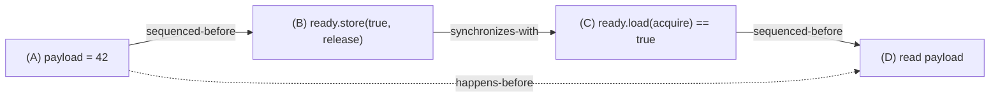
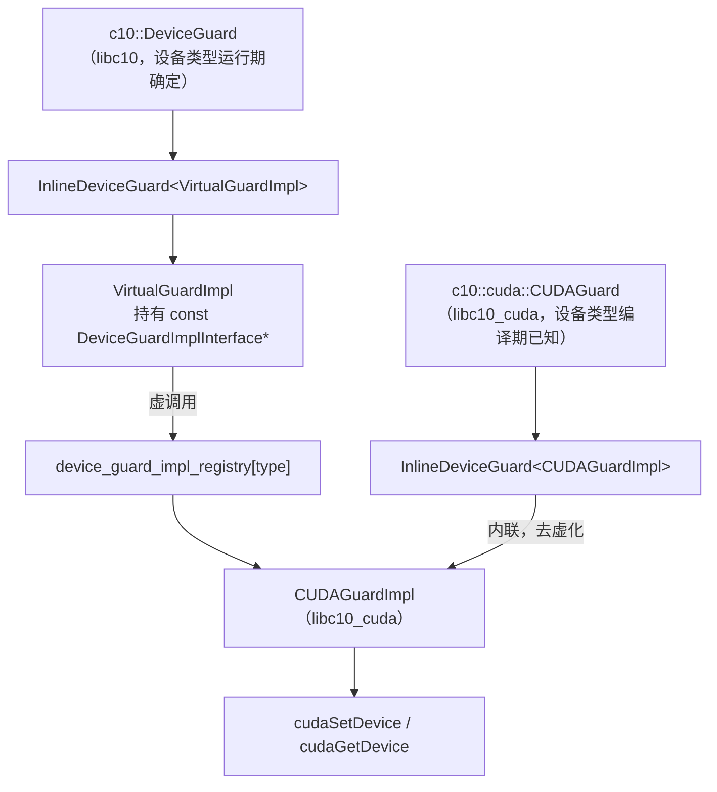
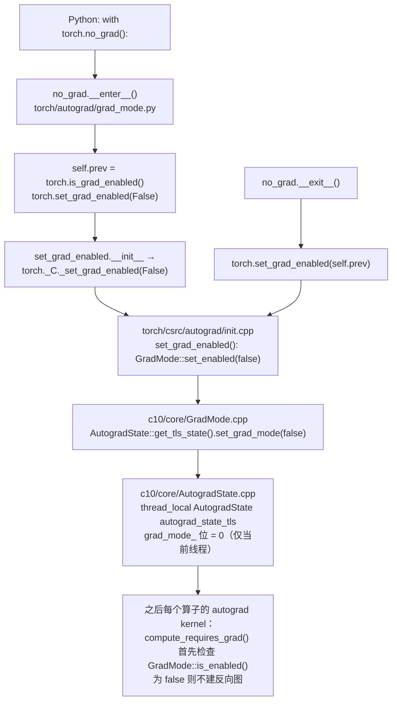
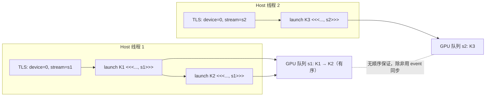

`with torch.no_grad():` 大概是 PyTorch 用户最早学会的几个写法之一。它在 Python 侧是一个上下文管理器，`__enter__` 调 `torch.set_grad_enabled(False)`，`__exit__` 把旧值设回去。顺着 `torch._C._set_grad_enabled` 往下追，会落到 `torch/csrc/autograd/init.cpp` 里的这段 C++：

```cpp
static PyObject* set_grad_enabled(
    PyObject* _unused,
    PyObject* args,
    PyObject* kwargs) {
  HANDLE_TH_ERRORS
  static PythonArgParser parser({
      "set_grad_enabled(bool enabled)",
  });
  // ...
  auto grad_enabled = r.toBool(0);
  GradMode::set_enabled(grad_enabled);
  Py_RETURN_NONE;
  END_HANDLE_TH_ERRORS
}
```

`GradMode::set_enabled` 定义在 `c10/core/GradMode.cpp`，只有一行：`AutogradState::get_tls_state().set_grad_mode(enabled);`。而 `AutogradState::get_tls_state()` 返回的是 `c10/core/AutogradState.cpp` 里这样一个变量的引用：

```cpp
thread_local AutogradState autograd_state_tls = AutogradState(
    /* grad_mode */ true,
    /* inference_mode */ false,
    /* fw_grad_mode */ true,
    /* multithreading_enabled */ true);
```

同一个头文件 `c10/core/GradMode.h` 里还有另一种写法：

```cpp
// A RAII, thread local (!) guard that enables or disables grad mode upon
// construction, and sets it back to the original value upon destruction.
struct C10_API AutoGradMode {
  AutoGradMode(bool enabled) : prev_mode(GradMode::is_enabled()) {
    GradMode::set_enabled(enabled);
  }
  // ...
  ~AutoGradMode() {
    GradMode::set_enabled(prev_mode);
  }
  bool prev_mode;
};

struct C10_API NoGradGuard : public AutoGradMode {
  NoGradGuard() : AutoGradMode(/*enabled=*/false) {}
};
```

对一个 Java 工程师来说，这几段代码里有好几处"看得懂每个词，但不知道为什么这么写"的地方：

- `thread_local` 是什么存储类别？它和 Java 的 `ThreadLocal<T>` 是一回事吗？为什么一个全局开关要做成线程局部的？
- 注释里特意写了 "thread local (!)"，感叹号在提醒什么？
- `NoGradGuard` 只有构造函数和析构函数，没有任何"业务方法"，它存在的意义是什么？为什么它删掉了拷贝和移动？
- 同一个 `c10/` 目录里，`intrusive_ptr` 的引用计数用 `std::atomic<uint64_t>`，增加时用 `memory_order_relaxed`，减少时用 `memory_order_acq_rel`——这两个词是什么意思？为什么不一样？
- `at::parallel_for` 的线程从哪里来？它的注释说 "does NOT copy thread local states"，这和 `no_grad` 有什么关系？
- CUDA kernel 的 launch 代码里看不到任何锁，多线程同时 launch 为什么是安全的？

这些问题的共同背景是 C++ 的并发模型：线程、内存序、线程局部存储，以及 PyTorch 在它们之上搭出的"守卫"（guard）模式。本文的核心问题是：

> **`with torch.no_grad():` 在 C++ 层做了什么？为什么它对其他线程不生效？**

全文提纲：

1. 线程、锁与条件变量：从 `c10::ThreadPool` 读起
2. C++ 内存模型：`std::atomic`、六种 memory order 与 happens-before
3. 为什么 `intrusive_ptr` 的引用计数 relaxed 增、acq_rel 减
4. `thread_local`：语言机制，以及 c10 里有哪些线程局部状态
5. 守卫模式：RAII 管理的不只是资源，还有"上下文"
6. 回到源码：`c10/core/impl/LocalDispatchKeySet.h`
7. 回到源码：`c10::DeviceGuard` 的两层设计
8. 回答核心问题：`torch.no_grad()` 的完整链路与 `ThreadLocalState`
9. `at::parallel_for`：OpenMP、grain size 与线程数
10. 为什么 CUDA kernel launch 不用锁
11. SIMD 简介：`at::vec::Vectorized<T>`
12. mini-c10：原子引用计数、`GradMode.h`、`Parallel.h`
13. 工程实践建议与常见错误
14. 总结


## 一、线程、锁与条件变量：从 `c10::ThreadPool` 读起

C++11 之后，标准库提供了一套和 Java `java.util.concurrent` 大致对应的基础设施：`std::thread`、`std::mutex`、`std::condition_variable`、`std::atomic`。概念层面 Java 工程师都熟悉，差别集中在两点：**锁的持有由对象生命周期管理**，以及**内存序是显式的**。本节先讲前者，用 `c10/core/thread_pool.h` 与 `.cpp` 里一个真实的线程池做例子；下一节讲后者。

### 1.1 `std::thread`：必须 join 或 detach

`c10::ThreadPool` 的构造函数（`c10/core/thread_pool.cpp`）：

```cpp
ThreadPool::ThreadPool(
    int pool_size,
    int numa_node_id,
    const std::function<void()>& init_thread)
    : threads_(pool_size < 0 ? defaultNumThreads() : pool_size),
      running_(true),
      complete_(true),
      available_(threads_.size()),
      total_(threads_.size()),
      numa_node_id_(numa_node_id) {
  for (std::size_t i = 0; i < threads_.size(); ++i) {
    threads_[i] = std::thread([this, i, init_thread]() {
      c10::setThreadName("pt_thread_pool");
      if (init_thread) {
        init_thread();
      }
      this->main_loop(i);
    });
  }
}

ThreadPool::~ThreadPool() {
  // Set running flag to false then notify all threads.
  {
    std::unique_lock<std::mutex> lock(mutex_);
    running_ = false;
    condition_.notify_all();
  }

  for (auto& t : threads_) {
    try {
      t.join();
      // NOLINTNEXTLINE(bugprone-empty-catch)
    } catch (const std::exception&) {
    }
  }
}
```

`std::thread` 的构造函数接受任意可调用对象（这里是一个 lambda）并**立刻启动**线程——没有 Java `Thread.start()` 那一步。另一个 Java 没有的规则：一个 `std::thread` 对象在析构时如果仍然 joinable（既没 `join()` 也没 `detach()`），程序会直接 `std::terminate()`。所以析构函数里那个 `join()` 循环不是"礼貌"，而是必需的。C++20 的 `std::jthread` 会在析构时自动 join，但 PyTorch 以 C++17 为基线，源码里都是手写 join。

lambda 的捕获列表 `[this, i, init_thread]` 决定了线程体能访问什么。`this` 是裸指针，意味着 `ThreadPool` 对象必须活得比所有工作线程久——析构函数先 join 再返回，正是在维护这个不变量。第三篇讨论过 lambda 捕获与生命周期的关系，这里是多线程场景下同一个问题：**被捕获的引用/指针指向的对象，在线程运行期间不能死**。

### 1.2 `std::mutex` 与两种锁守卫

`ThreadPool` 有三个同步原语作为成员（`c10/core/thread_pool.h`）：

```cpp
  std::queue<task_element_t> tasks_;
  std::vector<std::thread> threads_;
  mutable std::mutex mutex_;
  std::condition_variable condition_;
  std::condition_variable completed_;
  std::atomic_bool running_;
  bool complete_;
  std::size_t available_;
```

`mutable std::mutex mutex_`：`mutable` 让 `const` 成员函数（如 `numAvailable() const`）也能加锁。锁本身的状态变化不算"对象逻辑状态"的变化，这是 `mutable` 最常见的合理用途。

C++ 几乎不会直接写 `mutex_.lock()` / `mutex_.unlock()`，而是用两种 RAII 守卫：

| 守卫 | 特点 | Java 对照 |
|---|---|---|
| `std::lock_guard<std::mutex>` | 构造时 lock，析构时 unlock，中间不能解锁；最轻 | `synchronized (obj) { ... }` |
| `std::unique_lock<std::mutex>` | 同上，但可以中途 `unlock()` / `lock()`，可以移动，可以配合 `condition_variable::wait` | `ReentrantLock` + `try/finally` |

`ThreadPool::run` 用 `unique_lock`（这里其实 `lock_guard` 也够）：

```cpp
void ThreadPool::run(std::function<void()> func) {
  TORCH_CHECK(!threads_.empty(), "No threads to run a task");
  std::unique_lock<std::mutex> lock(mutex_);

  // Set task and signal condition variable so that a worker thread will
  // wake up and use the task.
  tasks_.emplace(std::move(func));
  complete_ = false;
  condition_.notify_one();
}
```

`lock` 是一个局部变量，函数返回（包括 `TORCH_CHECK` 抛异常）时自动析构、自动解锁。Java 需要 `try { lock.lock(); ... } finally { lock.unlock(); }`，C++ 用第二篇讲过的 RAII 把 `finally` 消灭了。注意 `std::mutex` **不可重入**，同一线程二次 `lock()` 是未定义行为；需要重入用 `std::recursive_mutex`。`c10/cuda/CUDACachingAllocator.cpp` 的设备分配器就用了 `mutable std::recursive_mutex mutex;`，因为它的内部路径会互相调用。Java 的 `synchronized` 和 `ReentrantLock` 都是可重入的，这是一个容易踩的直觉差异。

### 1.3 `std::condition_variable`：wait 必须配谓词

工作线程的主循环（`c10/core/thread_pool.cpp`）：

```cpp
void ThreadPool::main_loop(std::size_t index) {
  std::unique_lock<std::mutex> lock(mutex_);
  while (running_) {
    // Wait on condition variable while the task is empty and
    // the pool is still running.
    condition_.wait(lock, [&]() { return !tasks_.empty() || !running_; });
    // If pool is no longer running, break out of loop.
    if (!running_) {
      break;
    }

    // Copy task locally and remove from the queue.  This is
    // done within its own scope so that the task object is
    // destructed immediately after running the task.  ...
    {
      task_element_t tasks = std::move(tasks_.front());
      tasks_.pop();
      // Decrement count, indicating thread is no longer available.
      --available_;

      lock.unlock();

      // Run the task.
      try {
        if (tasks.run_with_id) {
          tasks.with_id(index);
        } else {
          tasks.no_id();
        }
      } catch (const std::exception& e) {
        LOG(ERROR) << "Exception in thread pool task: " << e.what();
      } catch (...) {
        LOG(ERROR) << "Exception in thread pool task: unknown";
      }
      // ...
    }

    // Update status of empty, maybe
    // Need to recover the lock first
    lock.lock();

    // Increment count, indicating thread is available.
    ++available_;
    if (tasks_.empty() && available_ == total_) {
      complete_ = true;
      completed_.notify_one();
    }
    // ...
  } // while running_
}
```

这段代码是 C++ 条件变量的标准用法，几处细节值得对照 Java 理解：

- `condition_.wait(lock, pred)` 要求传入 **`unique_lock`**（不能是 `lock_guard`），因为 wait 内部要先解锁、被唤醒后再加锁——这就是为什么 `unique_lock` 必须存在。Java 的 `Condition.await()` 隐含了同样的解锁-重锁过程，只是锁对象由 `Condition` 自己记住。
- 带谓词的 `wait(lock, pred)` 等价于 `while (!pred()) wait(lock);`，自动处理**虚假唤醒**（spurious wakeup）。Java 里也要求把 `await()` 放在 `while` 循环里，道理一样。
- 取出任务后先 `lock.unlock()` 再执行任务，执行完再 `lock.lock()`。任务是用户提供的 `std::function`，可能重入线程池，持锁执行会死锁。`unique_lock` 允许这种"中途解锁"，`lock_guard` 不允许。
- `running_` 是 `std::atomic_bool`，因为析构函数在持锁时写它，而 `while (running_)` 的读也在锁内——其实这里用普通 `bool` 也正确，原子只是防御性的。

在 Java 里，这个线程池会用 `BlockingQueue` + `ExecutorService` 一行搞定；C++ 标准库没有这种高层封装，所以 c10、ATen、autograd 引擎各自有自己的小线程池。读 PyTorch 并发代码时，会反复看到 `mutex + condition_variable + queue` 这个三件套，本节的模式就是模板。

### 1.4 一个可编译的最小版本

把上面的模式抽成 40 行，用 `clang++ -std=c++17 -pthread` 可以直接编译：

```cpp
#include <condition_variable>
#include <functional>
#include <mutex>
#include <queue>

class Queue {
  std::queue<std::function<void()>> tasks_;
  std::mutex mutex_;
  std::condition_variable cv_;
  bool stop_ = false;
 public:
  void push(std::function<void()> f) {
    {
      std::lock_guard<std::mutex> lk(mutex_);   // 作用域结束自动 unlock
      tasks_.push(std::move(f));
    }
    cv_.notify_one();                           // 通知放在锁外，减少争用
  }
  void stop() {
    { std::lock_guard<std::mutex> lk(mutex_); stop_ = true; }
    cv_.notify_all();
  }
  void run() {
    std::unique_lock<std::mutex> lk(mutex_);    // 可以中途 unlock/lock
    while (true) {
      cv_.wait(lk, [&] { return !tasks_.empty() || stop_; });
      if (tasks_.empty() && stop_) return;
      auto task = std::move(tasks_.front());
      tasks_.pop();
      lk.unlock();
      task();
      lk.lock();
    }
  }
};
```

它与 `c10::ThreadPool::main_loop` 是同一个骨架。


## 二、C++ 内存模型：`std::atomic`、六种 memory order 与 happens-before

锁解决的是"互斥"，但 PyTorch 里大量热路径（引用计数、`running_` 标志、全局注册表的读）不用锁而用原子操作。理解原子操作需要理解 C++ 内存模型，而这恰好是 Java 工程师最有优势的地方：**JMM 和 C++11 内存模型出自同一批人（Hans Boehm、Doug Lea 等）的同一套思想，happens-before、synchronizes-with 这些词在两边含义一致**。差别在于 C++ 把 Java 只有一档的 `volatile` 拆成了六档，让程序员可以选择比 `volatile` 更弱、更便宜的语义。

### 2.1 为什么需要内存模型

没有同步的多线程读写同一个非原子变量，在 C++ 里是**数据竞争（data race），未定义行为**——不是"可能读到旧值"，而是编译器可以假定它不发生并据此做任意优化。Java 的立场温和一些：数据竞争是允许的，只是读到的值"不确定"。这个差别决定了 C++ 里凡是跨线程共享且会被修改的变量，要么在锁的保护下，要么必须是 `std::atomic<T>`。

`std::atomic<T>` 保证两件事：**每次读写是不可分割的**（不会读到半个 64 位值），以及**可以指定与其他内存操作的顺序关系**（memory order）。后者才是难点。

### 2.2 六种 memory order

`<atomic>` 里定义的六个枚举值，按"强度"排列：

| memory order | 含义 | 典型用途 |
|---|---|---|
| `memory_order_relaxed` | 只保证原子性，不保证与其他操作的顺序 | 计数器、统计、引用计数 +1 |
| `memory_order_consume` | 弱化的 acquire，只约束数据依赖的后续读；编译器实际都当 acquire 处理，标准正在废弃 | 几乎不用 |
| `memory_order_acquire` | 用于读：本操作之后的读写不能被重排到它之前 | 锁的 lock、读"就绪"标志 |
| `memory_order_release` | 用于写：本操作之前的读写不能被重排到它之后 | 锁的 unlock、写"就绪"标志 |
| `memory_order_acq_rel` | 读-改-写操作同时具备 acquire 和 release | 引用计数 -1、CAS 循环 |
| `memory_order_seq_cst` | 默认值；acq_rel 之外，还保证所有 seq_cst 操作有一个全局一致的顺序 | 不确定用哪个时的安全选择 |

`std::atomic<T>` 的所有成员函数（`load`、`store`、`fetch_add`、`compare_exchange_*`）都接受一个 memory order 参数，**默认是 `seq_cst`**。也就是说不写 order 参数永远是正确的，只是可能比必要的慢。

### 2.3 release/acquire 配对建立 happens-before

内存模型的核心规则只有一条：**一个 release 写与一个读到该写入值的 acquire 读之间建立 synchronizes-with 关系，进而 release 之前的所有写对 acquire 之后的所有读可见**。用一段最小代码：

```cpp
int payload = 0;                     // 普通变量
std::atomic<bool> ready{false};

void producer() {
  payload = 42;                                   // (A) 普通写
  ready.store(true, std::memory_order_release);   // (B) release：A 不会被重排到 B 之后
}
void consumer() {
  while (!ready.load(std::memory_order_acquire)) {}  // (C) acquire：读到 true 时与 B 同步
  assert(payload == 42);                              // (D) 因此能看到 A
}
```

用 Mermaid 画出这几条边：



如果 (B) 和 (C) 都改成 `relaxed`，synchronizes-with 那条边消失，(D) 读到 0 是合法的——即使在 x86 这种强序硬件上实际很难复现，但编译器有权把 (A) 挪到 (B) 之后。

Java 对照：`volatile` 写 ≈ release 写 + seq_cst 全序，`volatile` 读 ≈ acquire 读 + seq_cst 全序。也就是说 Java 的 `volatile` 大致等于 C++ 的 `seq_cst`，是六档里最强的一档。Java 9 的 `VarHandle` 补上了 `setRelease`/`getAcquire`（对应 release/acquire）和 `setOpaque`/`getOpaque`（接近 relaxed），但日常 Java 代码几乎不用它们。所以"C++ 的内存序显式且可以比 `volatile` 更弱"这句话，指的就是 C++ 让 relaxed 和 acquire/release 成为日常选项。

另一个必须划清的边界：**C++ 的 `volatile` 与线程无关**。它只是告诉编译器"这个变量可能被硬件或信号处理函数修改，别优化掉读写"，不提供任何原子性或顺序保证。用 C++ `volatile` 做线程同步是经典错误。

### 2.4 一个真实的例子：vLLM CPU 后端的共享内存握手

vLLM 的 CPU 后端用共享内存在多个进程之间做 all-reduce，`csrc/cpu/shm.cpp` 的 `ThreadSHMContext` 用两个"戳"（stamp）做生产者/消费者握手，它的写法恰好把"平台差异"和"内存序"都摆在了一起：

```cpp
struct ThreadSHMContext {
#if defined(__aarch64__) || defined(__powerpc64__)
  // memory model is weaker on AArch64, so we use atomic variables for
  // consumer (load-acquire) and producer (store-release) to make sure
  // that a stamp cannot be ready before the corresponding data is ready.
  std::atomic<char> _curr_thread_stamp[2];
  std::atomic<char> _ready_thread_stamp[2];
  static_assert(std::atomic<char>::is_always_lock_free);
#else
  volatile char _curr_thread_stamp[2];
  volatile char _ready_thread_stamp[2];
#endif  // __aarch64__
  // ...
  char get_ready_stamp(int idx) const {
#if defined(__aarch64__) || defined(__powerpc64__)
    return _ready_thread_stamp[idx].load(std::memory_order_acquire);
#else
    return _ready_thread_stamp[idx];
#endif
  }

  void commit_ready_stamp() {
#if defined(__aarch64__) || defined(__powerpc64__)
    _ready_thread_stamp[local_stamp_buffer_idx].store(
        _curr_thread_stamp[local_stamp_buffer_idx].load(
            std::memory_order_relaxed),
        std::memory_order_release);
#else
    _mm_mfence();
    _ready_thread_stamp[local_stamp_buffer_idx] =
        _curr_thread_stamp[local_stamp_buffer_idx];
#endif
  }
  // ...
};
```

生产者写完数据后 `commit_ready_stamp()` 用 **release** 写戳，消费者 `get_ready_stamp()` 用 **acquire** 读戳——正是 2.3 节的模式：戳可见时，戳之前写入的数据也一定可见。x86 分支用 `volatile` 加显式 `_mm_mfence()`，是把硬件强序当作前提的老写法；AArch64 分支则依赖 C++ 内存模型。这个对照说明了为什么标准化的 memory order 值得学：它让同一段代码在不同硬件上有同样的正确性保证，而不需要为每个平台手写 fence。

`static_assert(std::atomic<char>::is_always_lock_free)` 也值得注意：`std::atomic<T>` 对某些 `T` 可能用内部锁实现（比如没有对应宽度原子指令的平台），这行断言在编译期排除这种情况。`c10/util/intrusive_ptr.h` 里对 `std::atomic<uint64_t>` 也有类似的 `static_assert(sizeof(std::atomic<uint64_t>) == 8)`，同一个目的。


## 三、为什么 `intrusive_ptr` 的引用计数 relaxed 增、acq_rel 减

有了 release/acquire 的概念，可以回答本文开头的那个问题了。这是全文第一处"回到源码"：`c10/util/intrusive_ptr.h`。

### 3.1 PyTorch 2.10 的引用计数布局

先说一个版本敏感的细节。早期的 `intrusive_ptr_target` 有两个独立的原子字段 `refcount_` 和 `weakcount_`，对应两组函数 `atomic_refcount_increment`/`atomic_refcount_decrement` 和 `atomic_weakcount_increment`/`atomic_weakcount_decrement`。在 v2.10.0 的源码里，两个计数已经合并成一个 64 位字段，函数名也随之变成 `atomic_combined_refcount_increment`/`atomic_combined_refcount_decrement`（PyTorch 2.x 中的变化：合并成一个字段是为了能用一条原子指令同时操作强、弱两个计数；最高位 `kHasPyObject` 还被拿来标记"是否有 Python 包装对象"）：

```cpp
namespace detail {
constexpr uint64_t kImpracticallyHugeReferenceCount = 0x0FFFFFFF;
constexpr uint64_t kImpracticallyHugeWeakReferenceCount =
    (kImpracticallyHugeReferenceCount << 32);
constexpr uint64_t kReferenceCountOne = 1;
constexpr uint64_t kWeakReferenceCountOne = (kReferenceCountOne << 32);
constexpr uint64_t kUniqueRef = (kReferenceCountOne | kWeakReferenceCountOne);
// Indicates whether the object has a PyObject wrapper.
constexpr uint64_t kHasPyObject = (uint64_t(1) << 63);
// ...
inline uint32_t refcount(uint64_t combined_refcount) {
  return static_cast<uint32_t>(combined_refcount);
}

inline uint32_t weakcount(uint64_t combined_refcount) {
  return static_cast<uint32_t>((combined_refcount & ~kHasPyObject) >> 32);
}
```

低 32 位是强引用计数，高 31 位是弱引用计数，第 63 位是 PyObject 标记。`intrusive_ptr_target` 类里对应的成员是：

```cpp
  mutable std::atomic<uint64_t> combined_refcount_;
  static_assert(sizeof(std::atomic<uint64_t>) == 8);
  static_assert(alignof(std::atomic<uint64_t>) == 8);
```

这不影响本节要讨论的内存序问题——无论一个字段还是两个字段，增和减的 memory order 选择是一样的。

### 3.2 增：relaxed 就够

`c10/util/intrusive_ptr.h` 中 `detail` 命名空间里的增函数，连注释一起引用：

```cpp
// The only requirement for refcount increment is that it happens-before
// decrement, so no additional memory ordering is needed.
inline uint64_t atomic_combined_refcount_increment(
    std::atomic<uint64_t>& combined_refcount,
    uint64_t inc) {
  return combined_refcount.fetch_add(inc, std::memory_order_relaxed) + inc;
}
```

为什么增加可以用 relaxed？想一想什么时候会执行 +1：**你手里已经有一个有效的 `intrusive_ptr`**，正在拷贝它。这意味着对象此刻至少有一个强引用，不可能被释放。+1 本身不"发布"任何数据给别的线程，也不需要"看到"别的线程发布的数据；它唯一要保证的是原子性（两个线程同时 +1 结果是 +2 而不是 +1），而这正是 relaxed 提供的全部。注释说的 "happens-before decrement" 由程序逻辑保证：你是先拷贝（+1）、再在某个时刻销毁（-1），同一个线程内顺序天然成立。

### 3.3 减：所有减必须 synchronize-with 最后一次减

减函数的注释更长，把推理过程完整写了出来：

```cpp
// The requirement is that all modifications to the managed object happen-before
// invocation of the managed object destructor, and that allocation of the
// managed object storage happens-before deallocation of the storage.
//
// To get this ordering, all non-final decrements must synchronize-with the
// final decrement. So all non-final decrements have to store-release while the
// final decrement has to load-acquire, either directly or with the help of
// fences. But it's easiest just to have all decrements be acq-rel. And it turns
// out, on modern architectures and chips, it's also fastest.
inline uint64_t atomic_combined_refcount_decrement(
    std::atomic<uint64_t>& combined_refcount,
    uint64_t dec) {
  return combined_refcount.fetch_sub(dec, std::memory_order_acq_rel) - dec;
}
```

场景是这样的：线程 T1 和 T2 各持有一个指向同一 `TensorImpl` 的 `intrusive_ptr`。T1 修改了对象的某个字段（比如 `sizes_`），然后销毁自己的指针（-1，计数 2→1）。T2 随后销毁自己的指针（-1，计数 1→0），并执行 `delete`，析构函数会读对象的字段、释放 `Storage`。

要保证 T2 的析构函数看到 T1 之前写入的所有内容（否则可能释放一个"半新半旧"的对象，或者漏掉 T1 挂上去的资源），需要：**T1 的 -1 是 release，T2 的 -1 是 acquire**，两者之间建立 synchronizes-with，从而 T1 之前的所有写 happens-before T2 的析构。

问题是执行 -1 的时候不知道自己是不是"最后一个"——只有拿到 `fetch_sub` 的返回值之后才知道。所以每次减都得同时准备好两种角色：既是 release（万一自己不是最后一个），又是 acquire（万一自己是）。这就是 `acq_rel`。注释说的另一种写法是全部用 release，然后只在返回值为 0 时补一个 `std::atomic_thread_fence(memory_order_acquire)`；这在某些平台上略省，但代码更绕，而且在现代 x86/ARM 上 `acq_rel` 的读-改-写指令本身就是一条指令，没有额外代价。

### 3.4 在 `intrusive_ptr` 内部它们是怎么用的

顺着看 `intrusive_ptr<TTarget, NullType>` 的 `retain_()` 与 `reset_not_null_()`（`c10/util/intrusive_ptr.h`，类定义中部）：

```cpp
  void retain_() noexcept {
    if (target_ != NullType::singleton()) {
      uint64_t combined = detail::atomic_combined_refcount_increment(
          target_->combined_refcount_, detail::kReferenceCountOne);
      uint32_t new_refcount = detail::refcount(combined);
      TORCH_INTERNAL_ASSERT_DEBUG_ONLY(
          new_refcount != 1,
          "intrusive_ptr: Cannot increase refcount after it reached zero.");
      // ... PyObject 相关分支省略
    }
  }

  // C10_NOINLINE to keep binary size a bit smaller. We pass TTarget* here
  // to avoid an extra pointer dereference in the call from reset_().
  C10_NOINLINE static void reset_not_null_(TTarget* target) noexcept {
    if (detail::is_uniquely_owned(
            target->combined_refcount_.load(std::memory_order_acquire))) {
      // Both counts are 1, so there are no weak references and
      // we are releasing the last strong reference. No other
      // threads can observe the effects of this target deletion
      // call (e.g. calling use_count()) without a data race.
      target->combined_refcount_.store(0, std::memory_order_relaxed);
      delete target;
      return;
    }

    auto combined_refcount = detail::atomic_combined_refcount_decrement(
        target->combined_refcount_, detail::kReferenceCountOne);
    uint32_t new_refcount = detail::refcount(combined_refcount);
    bool has_pyobject = detail::has_pyobject(combined_refcount);
    if (new_refcount == 0) {
      if (detail::weakcount(combined_refcount) == 1) {
        delete target;
        return;
      }
      // See comment above about weakcount. As long as refcount>0,
      // weakcount is one larger than the actual number of weak references.
      // So we need to decrement it here.
      release_resources_and_decrement_weakrefs_(target);
    } else if constexpr (detail::TargetTraits<TTarget>::can_have_pyobject) {
      // ...
    }
    // ...
  }
```

`reset_not_null_` 开头那个快速路径值得多看一眼：先用 acquire **读**一次，如果强、弱计数都是 1（`is_uniquely_owned`），说明当前线程是唯一持有者，直接 `store(0, relaxed)` 然后 `delete`，省掉一条带 lock 前缀的读-改-写指令。这是安全的，因为既然只有自己持有，就不可能有另一个线程并发地 +1（要 +1 必须先持有一个拷贝）。acquire 读是为了和之前其他线程的 release 减（它们把计数降到 1）同步——和 3.3 节的推理一致。

`use_count()` 用 relaxed 读：

```cpp
  uint32_t use_count() const noexcept {
    if (target_ == NullType::singleton()) {
      return 0;
    }
    return target_->refcount(std::memory_order_relaxed);
  }
```

这个值只用于诊断和调试，读到一个瞬间即过时的数字是可以接受的，不需要任何顺序保证。

### 3.5 和 `std::shared_ptr`、Java 的对照

`std::shared_ptr` 的控制块做的是同样的事情（libstdc++ 和 libc++ 的实现里，+1 用 relaxed，-1 用 acq_rel），只是它把计数放在独立分配的控制块里，`intrusive_ptr` 放在对象内部——第二篇讨论过这个取舍。

Java 没有引用计数（GC 负责），但 `AtomicInteger.incrementAndGet()` 是 seq_cst 语义，比 relaxed 强得多。如果用 Java 的直觉去写 C++ 引用计数，会写成 `fetch_add(1)`（默认 seq_cst），功能正确但每次拷贝 `Tensor` 都多付一次全序同步的代价。PyTorch 的 `Tensor` 按值传递极其频繁，这个差异累积起来是可测量的。

还有一个细节在 `intrusive_ptr` 的原始指针构造函数里（类定义中部）：

```cpp
  explicit intrusive_ptr(TTarget* target)
      : intrusive_ptr(target, raw::DontIncreaseRefcount{}) {
    if (target_ != NullType::singleton()) {
      // We just created result.target_, so we know no other thread has
      // access to it, so we know we needn't care about memory ordering.
      // (On x86_64, a store with memory_order_relaxed generates a plain old
      // `mov`, whereas an atomic increment does a lock-prefixed `add`, which is
      // much more expensive: https://godbolt.org/z/eKPzj8.)
      // ...
      target_->combined_refcount_.store(
          detail::kUniqueRef, std::memory_order_relaxed);
    }
  }
```

刚 `new` 出来的对象没有任何其他线程能看到，所以初始化计数用 relaxed `store` 即可——在 x86 上就是一条普通 `mov`。注释里连汇编差异都写清楚了，这种"每条原子指令都要有理由"的态度，是读 c10 代码时应该带着的。


## 四、`thread_local`：语言机制，以及 c10 里有哪些线程局部状态

### 4.1 `thread_local` 是存储类别，不是类型

C++11 把 `thread_local` 加为一个**存储类别说明符**（storage class specifier），与 `static`、`extern` 同级。一个 `thread_local` 变量在每个线程里有一份独立的实例，线程启动时（或首次使用时）初始化，线程退出时析构：

```cpp
thread_local int counter = 0;      // 命名空间作用域
void f() {
  thread_local std::string buf;    // 函数内的 static thread_local
  static thread_local int x = 0;   // 显式写 static 也可以，含义一样
}
class C {
  static thread_local int y;       // 类的静态成员也可以是 thread_local
};
```

这和 Java `ThreadLocal<T>` 的差别是根本性的：

| | Java `ThreadLocal<T>` | C++ `thread_local T` |
|---|---|---|
| 是什么 | 一个库类型，本质是 `Thread` 对象内的一张 map | 语言级的存储类别，编译器/链接器/加载器协作实现 |
| 访问方式 | `tl.get()` / `tl.set(v)`，返回 `T` 的引用 | 直接当普通变量用：`x = 1;`、`&x` |
| 存储位置 | 堆上，`Thread.threadLocals` 里 | 线程的 TLS 段（Linux 上通过 `%fs` 段寄存器 + 偏移寻址） |
| 访问成本 | 一次 hash 查找 | 通常一条带段前缀的访存；跨动态库访问时走 `__tls_get_addr` 函数调用 |
| 生命周期 | 线程死亡时 map 一起回收；忘记 `remove()` 在线程池中会泄漏 | 线程退出时自动调用析构函数 |
| 初始值 | `initialValue()` 回调 | 静态初始化必须是常量表达式或零初始化，动态初始化在首次使用时 |

"跨动态库访问时走 `__tls_get_addr`"这一条在 PyTorch 源码里留下了直接痕迹。`c10/core/impl/LocalDispatchKeySet.h` 的守卫类里有：

```cpp
 private:
  // A little micro-optimization to save us from tls_get_addr call
  // on destruction
  PODLocalDispatchKeySet* tls_;
  DispatchKeySet include_;
```

构造时取一次 TLS 变量的地址存起来，析构时直接用这个指针写回，省掉第二次 `__tls_get_addr`。Java 里没有这种优化空间，因为 `ThreadLocal.get()` 的成本是固定的。

另一个痕迹是 Windows 的限制。同一头文件里：

```cpp
// thread_local variables cannot be C10_API on Windows.
// Inlining this seems to break AutoDispatchBelowAutograd on Android.
#if defined(_MSC_VER) || defined(C10_ANDROID) || defined(C10_IPHONE)
C10_API LocalDispatchKeySet tls_local_dispatch_key_set();
#else // defined(_MSC_VER) || defined(C10_ANDROID) || defined(C10_IPHONE)
extern C10_API thread_local PODLocalDispatchKeySet raw_local_dispatch_key_set;

inline C10_API LocalDispatchKeySet tls_local_dispatch_key_set() {
  // Don't let people fiddle with the thread_local directly just
  // because they include this header.
  return raw_local_dispatch_key_set;
}
#endif
```

MSVC 不允许从 DLL 导出 `thread_local` 变量，所以 Windows 上只能导出一个访问函数；Linux/macOS 上可以直接 `extern thread_local` 然后内联读取。第一篇讲过的"C++ 没有统一 ABI"在这里又出现了一次。还有 `c10/util/ThreadLocal.h` 里针对老版 Android NDK 的 `c10::ThreadLocal<T>` 包装类（基于 `pthread_key_create`），以及 `C10_DEFINE_TLS_static` 宏——`torch/csrc/autograd/engine.cpp` 里的 `C10_DEFINE_TLS_static(std::shared_ptr<GraphTask>, tls_current_graph_task);` 用的就是它。

### 4.2 为什么 PyTorch 把这些状态做成线程局部的

一个自然的疑问：`no_grad` 为什么不是全局开关？答案是"上下文"和"线程"天然绑定。一个进程里可能同时有：主线程在做推理（`no_grad`），DataLoader 的工作线程在做数据增广（需要 autograd 关闭吗？不一定），autograd 引擎的设备线程在跑 backward（必须以 forward 时的 grad mode 为准）。如果 `no_grad` 是全局的，任何一个线程进入它都会影响其他所有线程，结果是不可预测的。**线程局部是让"作用域内生效"这个语义在多线程下成立的唯一办法**——Python 的 `with` 块是一个线程的执行流上的一段，它只应该影响这个线程。

PyTorch 2.10 的 C++ 层里以 `thread_local` 存储的主要状态：

| TLS 变量 | 文件 | 类型 | 控制什么 |
|---|---|---|---|
| `autograd_state_tls` | `c10/core/AutogradState.cpp` | `AutogradState`（几个位域 + 一个 `optional`） | grad mode、inference mode、forward-grad mode、autograd 多线程开关等 |
| `raw_local_dispatch_key_set` | `c10/core/impl/LocalDispatchKeySet.cpp` | `PODLocalDispatchKeySet`（两个 `uint64_t`） | Dispatcher 计算 dispatch key 时额外包含/排除哪些 key |
| `current_streams` | `c10/cuda/CUDAStream.cpp` | `std::unique_ptr<StreamId[]>` | 每个 CUDA 设备上"当前 stream"是哪条 |
| `targetDeviceIndex` | `c10/cuda/CUDAFunctions.cpp` | `DeviceIndex` | CUDA 12 下延迟 `cudaSetDevice` 的目标设备 |
| `in_at_parallel` | `c10/util/ParallelGuard.cpp` | `bool` | 当前是否在 `at::parallel_for` 的循环体内 |
| `this_thread_id` / `thread_num_` | `aten/src/ATen/ParallelOpenMP.cpp` / `ParallelNative.cpp` | `int` | 当前并行区域内的线程编号 |
| `worker_device`、`current_depth` 等 | `torch/csrc/autograd/engine.cpp` | `int` | autograd 引擎工作线程的设备与重入深度 |

看几个定义。`AutogradState` 的存储（`c10/core/AutogradState.cpp`）：

```cpp
namespace {
// By default, grad mode and multithreading are enabled, inference mode is
// disabled,
thread_local AutogradState autograd_state_tls = AutogradState(
    /* grad_mode */ true,
    /* inference_mode */ false,
    /* fw_grad_mode */ true,
    /* multithreading_enabled */ true);
} // namespace

AutogradState& AutogradState::get_tls_state() {
  return autograd_state_tls;
}

void AutogradState::set_tls_state(AutogradState state) {
  autograd_state_tls = state;
}
```

`AutogradState` 本身（`c10/core/AutogradState.h`）用位域把几个 bool 压进一个字节：

```cpp
 private:
  std::optional<SafePyObject> graph_exec_group_;
  bool grad_mode_ : 1;
  bool inference_mode_ : 1;
  bool fw_grad_mode_ : 1;
  bool multithreading_enabled_ : 1;
  // NOLINTNEXTLINE(cppcoreguidelines-use-default-member-init)
  bool view_replay_enabled_ : 1;
```

CUDA 当前 stream 的存储（`c10/cuda/CUDAStream.cpp`）：

```cpp
// Thread-local current streams
// NOLINTNEXTLINE(*-arrays)
thread_local std::unique_ptr<StreamId[]> current_streams = nullptr;
// ...
CUDAStream getCurrentCUDAStream(DeviceIndex device_index) {
  initCUDAStreamsOnce();
  if (device_index == -1) {
    device_index = current_device();
    c10::cuda::SetTargetDevice();
  }
  check_gpu(device_index);
  return CUDAStreamForId(device_index, current_streams[device_index]);
}

void setCurrentCUDAStream(CUDAStream stream) {
  initCUDAStreamsOnce();
  current_streams[stream.device_index()] = stream.id();
}
```

`current_streams` 是一个 `thread_local` 的智能指针，指向一个"每设备一个 StreamId"的数组，每个线程第一次调用时由 `initCUDAStreamsOnce()` 分配并全部填成默认 stream。头文件 `c10/cuda/CUDAStream.h` 顶部的注释把这个设计说得很清楚：

```cpp
 * Note: although the notion of "current stream for device" is thread local
 * (every OS thread has a separate current stream, as one might expect),
 * the stream pool is global across all threads; stream 0 is always stream 0
 * no matter which thread you use it on.  Multiple threads can synchronize
 * on the same stream.  Although the CUDA documentation is not very clear
 * on the matter, streams are thread safe; e.g., it is safe to enqueue
 * a kernel on the same stream from two different threads.
```

"stream 池是全局的，当前 stream 是线程局部的"——这一句在第十节讨论 kernel launch 为什么不用锁时还会用到。

还有一个静态初始化的细节。`c10/core/impl/LocalDispatchKeySet.cpp` 开头：

```cpp
// NB: POD, must be zero initialized!
// Note [TLS Initialization]
// We wanted raw_local_dispatch_key_set to be initialized with non-zero state
// e.g. BackendSelect and ADInplaceOrView in included set.  But certain Windows
// compiler (e.g the one used in ARVR tests) only allow TLS to be
// zero-initialized. To preserve the invariant that raw TLS storage of the
// default state is zero, we obtain the actual include keyset by XORing
// raw_local_dispatch_key_set.included_ with c10::default_included_set.  This
// logic is encapsulated in struct PODLocalDispatchKeySet.
thread_local PODLocalDispatchKeySet raw_local_dispatch_key_set;
```

TLS 变量如果需要动态初始化（调构造函数），编译器要在每次访问处插入"是否已初始化"的检查；零初始化的 POD 则可以直接放在 TLS 段里，访问就是一条访存。为了让"默认包含 `BackendSelect` 和 `ADInplaceOrView`"这个非零默认值仍然能以零初始化存储，PyTorch 用了一个 XOR 技巧：存储的是"与默认值的差异"。第六节回到源码时会看到 `included()` 和 `set_included()` 如何实现这个 XOR。


## 五、守卫模式：RAII 管理的不只是资源，还有"上下文"

第二篇讲 RAII 时，管理的对象是内存、文件句柄、锁——"资源"。本篇要把这个概念推广一步：**任何"进入时设置、退出时恢复"的成对操作，都可以用 RAII 对象的构造/析构来承载**。PyTorch 把这类对象统一叫 guard（守卫）。它们管理的不是资源，而是**线程局部的上下文状态**。

### 5.1 最简单的守卫：`AutoGradMode` / `NoGradGuard`

回到开头的 `c10/core/GradMode.h`：

```cpp
struct C10_API AutoGradMode {
  AutoGradMode(bool enabled) : prev_mode(GradMode::is_enabled()) {
    GradMode::set_enabled(enabled);
  }
  AutoGradMode(const AutoGradMode&) = delete;
  AutoGradMode(AutoGradMode&&) = delete;
  AutoGradMode& operator=(const AutoGradMode&) = delete;
  AutoGradMode& operator=(AutoGradMode&&) = delete;
  ~AutoGradMode() {
    GradMode::set_enabled(prev_mode);
  }
  bool prev_mode;
};
```

结构只有三步：构造函数**先保存旧值**（`prev_mode(GradMode::is_enabled())`，在成员初始化列表里，早于构造函数体），**再设新值**；析构函数**恢复旧值**。这个顺序保证守卫可以嵌套：内层守卫恢复的是外层设定的值，外层恢复的是最初的值，像栈一样对称。

四个 `= delete` 是守卫类的标配。原因：如果允许拷贝，两个守卫对象会在析构时各恢复一次，第二次恢复的值可能是错的；如果允许移动，被移走的那个"空壳"析构时还会恢复一次。第二篇讲过"六大特殊成员函数"，守卫类就是"全部删掉、只留构造和析构"的典型。`c10/core/DeviceGuard.h` 的注释解释了移动为什么也不行：

```cpp
  /// Move is disallowed, as DeviceGuard does not have an uninitialized state,
  /// which is required for moves on types with nontrivial destructors.
```

一个可移动的守卫必须有"已被移走、析构时什么都不做"的状态，这会给每次析构加一个分支，而且让"这个守卫到底还在不在生效"变得不直观。PyTorch 选择：需要"可能不生效"的语义时，用单独的 `Optional*Guard` 类型（第七节会看到）。

C++ 用法与 Python 的对照：

```cpp
{
  torch::NoGradGuard no_grad;     // 等价于 Python 的 with torch.no_grad():
  auto y = x * 2;                 //   y = x * 2
}                                 // 作用域结束，析构函数恢复
```

`torch::NoGradGuard` 是 `torch/csrc/api/include/torch/utils.h` 里的 `using NoGradGuard = at::NoGradGuard;`，而 `at::NoGradGuard` 又是 `aten/src/ATen/core/grad_mode.h` 里的 `using NoGradGuard = c10::NoGradGuard;`。三个命名空间，一个类型。第一篇讲过 `c10::`/`at::`/`torch::` 的分层，这里是分层通过 `using` 声明"向上转发"的具体例子。

Java 对照：`ThreadLocal` 没有配套的作用域机制，写法只能是：

```java
Boolean prev = GRAD_MODE.get();
GRAD_MODE.set(false);
try {
    // ...
} finally {
    GRAD_MODE.set(prev);
}
```

C++ 守卫把 `prev`、`set`、`try/finally` 三件事压进一个局部变量的声明。忘记 `finally` 在 Java 里是常见 bug；C++ 里只要守卫对象存在，析构就一定会执行，包括异常展开时。

### 5.2 复合守卫：`InferenceMode`

`c10/core/InferenceMode.h` 的守卫同时修改两份 TLS：

```cpp
struct C10_API InferenceMode {
  // ...
  InferenceMode(bool enabled = true)
      : prev_mode(AutogradState::get_tls_state()),
        prev_keyset(c10::impl::tls_local_dispatch_key_set()) {
    // Enabling inference mode means disabling grad modes
    // And disabling inference mode means enabling grad modes
    AutogradState::set_tls_state(AutogradState(
        /* grad_mode */ !enabled,
        /* inference_mode */ enabled,
        /* fw_grad_mode */ !enabled,
        /* multithreading_enabled*/ !enabled));
    DispatchKeySet included = enabled
        ? prev_keyset.included_.remove(c10::DispatchKey::ADInplaceOrView)
        : prev_keyset.included_.add(c10::DispatchKey::ADInplaceOrView);
    DispatchKeySet excluded = enabled
        ? (prev_keyset.excluded_ | c10::autograd_dispatch_keyset)
        : (prev_keyset.excluded_ - c10::autograd_dispatch_keyset);
    c10::impl::PODLocalDispatchKeySet cur_keyset{};
    cur_keyset.set_included(included);
    cur_keyset.set_excluded(excluded);
    c10::impl::_force_tls_local_dispatch_key_set(cur_keyset);
  }

  InferenceMode(const InferenceMode&) = delete;
  InferenceMode(InferenceMode&&) = delete;
  InferenceMode& operator=(const InferenceMode&) = delete;
  InferenceMode& operator=(InferenceMode&&) = delete;

  ~InferenceMode() {
    AutogradState::set_tls_state(prev_mode);
    c10::impl::_force_tls_local_dispatch_key_set(prev_keyset);
  }
  static bool is_enabled();

 private:
  AutogradState prev_mode;
  c10::impl::LocalDispatchKeySet prev_keyset;
};
```

模式完全相同——保存、设置、恢复——只是保存的是两个快照。头文件里那段 "Note [Expected TLS state in InferenceMode]" 把"进入推理模式意味着 TLS 变成什么样"写成了不变量：`ADInplaceOrView` 从 included 集合移出，Autograd 一族 key 加入 excluded 集合，`GradMode` 关闭。读懂这段不需要理解 autograd 的原理，只需要知道：**Dispatcher 在决定调哪个 kernel 时，会把 tensor 自带的 key 集合与这两个 TLS 集合做并、差运算**（`aten/src/ATen/core/dispatch/DispatchKeyExtractor.h` 里的 `computeDispatchKeySet`：`(((ks | local.included_) - local.excluded_) & key_mask)`）。把 Autograd 加进 excluded，Dispatcher 就跳过 autograd 那一层，直接到后端 kernel。这是本文需要用到的关于 Dispatcher 的全部知识。

### 5.3 守卫之上的守卫：`AutoDispatchBelowADInplaceOrView`

`aten/src/ATen/core/LegacyTypeDispatch.h` 里的几个守卫，本身不写任何 TLS，而是**把另一个守卫作为成员**：

```cpp
struct TORCH_API AutoDispatchBelowAutograd {
  AutoDispatchBelowAutograd() :
    autograd_guard_(c10::autograd_dispatch_keyset) {
  }

  // disable all autograd dispatch keys
  c10::impl::ExcludeDispatchKeyGuard autograd_guard_;
};
// ...
struct TORCH_API AutoDispatchBelowADInplaceOrView {
  AutoDispatchBelowADInplaceOrView() :
    dispatch_key_guard_(c10::autograd_dispatch_keyset_with_ADInplaceOrView) {
  }
  // disable Autograd & ADInplaceOrView dispatch keys
  c10::impl::ExcludeDispatchKeyGuard dispatch_key_guard_;
};
```

它们没有析构函数——不需要。成员 `dispatch_key_guard_` 的析构会在外层对象析构时自动执行，恢复 TLS。这是 RAII 的组合性：**守卫可以作为成员嵌进另一个类，生命周期自动跟随**。Java 的 `try-with-resources` 做不到这一点，因为它只能管理块作用域内的局部变量。

这两个守卫用在什么地方？在 autograd 自动生成的 kernel 里。`tools/autograd/gen_variable_type.py` 生成 `VariableType_*.cpp` 时会插入：

```python
        if get_view_info(f) is not None or modifies_arguments(f):
            guard = "at::AutoDispatchBelowAutograd guard;"
        else:
            guard = "at::AutoDispatchBelowADInplaceOrView guard;"
```

每个算子的 autograd kernel 在"记录完反向图信息、准备调真正的计算"之前，声明一个这样的守卫，让接下来的 redispatch 跳过 autograd 层，避免无穷递归。`LegacyTypeDispatch.h` 里 "Note [AutoDispatchBelowADInplaceOrView]" 把这个不变量写成一句话：

```text
Once you are in VariableType/ADInplaceOrView kernel for an op,
you never go back to a kernel on same dispatch key until
you finish the current op.
```

第五篇讨论过代码生成；这是生成代码依赖运行时守卫来维持正确性的一个例子。

### 5.4 守卫的分类

把本篇涉及的守卫按"管什么"分一下类：

| 守卫 | 管理的状态 | 存储位置 | 定义文件 |
|---|---|---|---|
| `c10::AutoGradMode` / `NoGradGuard` | grad mode | TLS `autograd_state_tls` | `c10/core/GradMode.h` |
| `c10::AutoFwGradMode` | forward-mode AD 开关 | 同上 | `c10/core/GradMode.h` |
| `c10::InferenceMode` | grad mode + dispatch key set | 两份 TLS | `c10/core/InferenceMode.h` |
| `c10::impl::IncludeDispatchKeyGuard` / `ExcludeDispatchKeyGuard` | dispatch key 的 included/excluded 集合 | TLS `raw_local_dispatch_key_set` | `c10/core/impl/LocalDispatchKeySet.h` |
| `c10::impl::ForceDispatchKeyGuard` | 整份 dispatch key set 快照 | 同上 | 同上 |
| `at::AutoDispatchBelowAutograd` / `AutoDispatchBelowADInplaceOrView` | 组合上面的 Exclude 守卫 | 同上 | `aten/src/ATen/core/LegacyTypeDispatch.h` |
| `c10::DeviceGuard` / `OptionalDeviceGuard` | 当前设备 | CUDA runtime 的线程局部状态 | `c10/core/DeviceGuard.h` |
| `c10::cuda::CUDAGuard` / `CUDAStreamGuard` | 当前 CUDA 设备 / stream | CUDA runtime + TLS `current_streams` | `c10/cuda/CUDAGuard.h` |
| `c10::ParallelGuard` | 是否在 `parallel_for` 内 | TLS `in_at_parallel` | `c10/util/ParallelGuard.h` |
| `at::ThreadLocalStateGuard` | 上面绝大部分 TLS 的一份完整快照 | 多份 TLS | `aten/src/ATen/ThreadLocalState.h` |
| `at::internal::ThreadIdGuard` | 并行区域内的线程编号 | TLS `this_thread_id` | `aten/src/ATen/Parallel.h` |

它们的共同骨架就是 5.1 节那三步。读 PyTorch 源码时看到任何以 `Guard` 结尾、没有业务方法、删掉了拷贝移动的类型，都可以按这个模板理解。


## 六、回到源码：`c10/core/impl/LocalDispatchKeySet.h`

这个文件是 PyTorch 里最典型的"TLS + 守卫"组合，也是 `InferenceMode`、`AutoDispatchBelow*`、`ThreadLocalState` 的公共基础。逐段读一遍。

### 6.1 文件头注释：两个集合

```cpp
// TLS management for DispatchKeySet (the "local" DispatchKeySet(s))
//
// This manages two thread-local DispatchKeySets:
//
//  - The included type set, which adds a tensor type for consideration
//    in dispatch.  (For example, you might add Profiling to
//    the included type set to turn on profiling on all tensor operations.)
//
//  - The excluded type set, which disqualifies a tensor type from dispatch.
//    (For example, after redispatching on variable, we disqualify
//    Autograd so we don't attempt to handle variable again.)
//    (Exclusion wins over inclusion.)
//
// NB: Originally, I implemented the excluded type set as storing the inverted
// set, but TLS is defined to be zero-initialized, so this doesn't actually work
// (if it's inverted, you want the set to be -1 initialized).
```

included 集合"额外加入"某些 key，excluded 集合"强制去掉"某些 key，excluded 优先。最后一段 NB 是 4.2 节说的"TLS 必须零初始化"约束的第一次出现。

### 6.2 `PODLocalDispatchKeySet`：零初始化 + XOR

```cpp
struct C10_API PODLocalDispatchKeySet {
  uint64_t included_;
  uint64_t excluded_;

  // See Note [TLS Initialization]
  DispatchKeySet included() const {
    return DispatchKeySet(DispatchKeySet::RAW, included_) ^
        c10::default_included_set;
  }
  DispatchKeySet excluded() const {
    return DispatchKeySet(DispatchKeySet::RAW, excluded_) ^
        c10::default_excluded_set;
  }

  void set_included(DispatchKeySet x) {
    included_ = (x ^ c10::default_included_set).raw_repr();
  }
  void set_excluded(DispatchKeySet x) {
    excluded_ = (x ^ c10::default_excluded_set).raw_repr();
  }
};
static_assert(
    std::is_trivial_v<PODLocalDispatchKeySet>,
    "PODLocalDispatchKeySet must be a POD type.");
```

两个 `uint64_t`，没有构造函数，没有虚函数——`static_assert(std::is_trivial_v<...>)` 在编译期保证这一点，这样它就能被放进零初始化的 TLS 段。存储的值是"实际集合 XOR 默认集合"：存 0 时 `included()` 返回 `default_included_set`（`c10/core/DispatchKeySet.h` 里定义为 `{BackendSelect, ADInplaceOrView}`），`set_included(x)` 存的是 `x ^ default`，读回来再 XOR 一次就还原。XOR 两次等于没做，这是这个技巧的全部数学。

`LocalDispatchKeySet` 是它的"解码后"版本，两个真正的 `DispatchKeySet` 成员，从 POD 隐式构造：

```cpp
struct C10_API LocalDispatchKeySet {
  /* implicit */ LocalDispatchKeySet(PODLocalDispatchKeySet x)
      : included_(x.included()), excluded_(x.excluded()) {}
  DispatchKeySet included_;
  DispatchKeySet excluded_;
};
```

### 6.3 TLS 变量与访问函数

4.1 节已经引用过这段：非 Windows 上 `extern C10_API thread_local PODLocalDispatchKeySet raw_local_dispatch_key_set;` 加一个内联的 `tls_local_dispatch_key_set()`。注释 "Don't let people fiddle with the thread_local directly just because they include this header" 说明了为什么要包一层函数：返回的是**按值拷贝**的 `LocalDispatchKeySet`，调用者拿不到 TLS 的引用，改不了。要改必须走守卫或 `_force_tls_local_dispatch_key_set`。

### 6.4 两个 RAII 守卫

```cpp
class C10_API IncludeDispatchKeyGuard {
 public:
  IncludeDispatchKeyGuard(DispatchKeySet /*include*/);
  IncludeDispatchKeyGuard(DispatchKey k)
      : IncludeDispatchKeyGuard(DispatchKeySet(k)) {}
  IncludeDispatchKeyGuard(const IncludeDispatchKeyGuard&) = delete;
  IncludeDispatchKeyGuard operator=(const IncludeDispatchKeyGuard&) = delete;
  IncludeDispatchKeyGuard(IncludeDispatchKeyGuard&&) = delete;
  IncludeDispatchKeyGuard operator=(IncludeDispatchKeyGuard&&) = delete;
  ~IncludeDispatchKeyGuard();

 private:
  // A little micro-optimization to save us from tls_get_addr call
  // on destruction
  PODLocalDispatchKeySet* tls_;
  DispatchKeySet include_;
};
```

`ExcludeDispatchKeyGuard` 结构完全一样（成员名换成 `exclude_`）。实现在 `c10/core/impl/LocalDispatchKeySet.cpp`：

```cpp
IncludeDispatchKeyGuard::IncludeDispatchKeyGuard(DispatchKeySet include)
    : tls_(&raw_local_dispatch_key_set), include_(include - tls_->included()) {
  if (!include_.empty()) {
    tls_->set_included(tls_->included() | include_);
  }
}

IncludeDispatchKeyGuard::~IncludeDispatchKeyGuard() {
  if (!include_.empty()) {
    tls_->set_included(tls_->included() - include_);
  }
}

ExcludeDispatchKeyGuard::ExcludeDispatchKeyGuard(DispatchKeySet exclude)
    : tls_(&raw_local_dispatch_key_set), exclude_(exclude - tls_->excluded()) {
  if (!exclude_.empty()) {
    tls_->set_excluded(tls_->excluded() | exclude_);
  }
}

ExcludeDispatchKeyGuard::~ExcludeDispatchKeyGuard() {
  if (!exclude_.empty()) {
    tls_->set_excluded(tls_->excluded() - exclude_);
  }
}
```

三步骨架再次出现，只是"保存"的不是旧集合本身，而是**增量**：`include_` 记下"这次真正新加进去的 key"（`include - tls_->included()`，已经在集合里的不算），构造函数体把增量并进 TLS，析构时再把同一份增量减掉。效果等价于恢复旧值，但如果要加的 key 本来就在集合里，`include_` 为空，构造和析构都不碰 TLS。`tls_` 缓存 TLS 地址是 4.1 节说的省一次 `__tls_get_addr` 的优化——注意这个地址**只在同一个线程内有效**，而守卫对象本来就不能跨线程移动，所以是安全的。

注意守卫只改动和恢复**自己那个集合**（included 或 excluded），不碰另一个。`.cpp` 里一大段注释讨论了"整份快照 vs 只快照自己那一半"的取舍：如果守卫快照整份状态，而中间有人用非 RAII API 改了另一半，守卫析构时会把那个修改也一并抹掉。PyTorch 选择了只恢复自己的部分。`ForceDispatchKeyGuard` 是相反的选择——它快照整份 `LocalDispatchKeySet`，析构时整体恢复，`InferenceMode` 和 `ThreadLocalStateGuard` 用的是这条路径（通过 `_force_tls_local_dispatch_key_set`）。

### 6.5 非 RAII API：为什么也需要

```cpp
// Non-RAII API for manipulating the thread-local dispatch state.
// Please prefer the RAII API.  The non-RAII API may be useful when
// the included/excluded state of a given DispatchKey must span
// many calls from the Python to the C++, so you cannot conveniently
// use an RAII guard.
//
// Example use case:  a Python context manager that includes a certain
// DispatchKey, to ensure ops running under the context manager dispatch
// through that DispatchKey's registered overrides.
//
// The non-RAII API is less efficient than the RAII guards because both the
// getter and setter will do a tls_getaddr lookup (the RAII struct only needs
// one!)

C10_API bool tls_is_dispatch_key_excluded(DispatchKey x);
C10_API void tls_set_dispatch_key_excluded(DispatchKey x, bool desired_state);
C10_API bool tls_is_dispatch_key_included(DispatchKey x);
C10_API void tls_set_dispatch_key_included(DispatchKey x, bool desired_state);
```

这段注释回答了一个实际问题：Python 的 `with` 块的 `__enter__` 和 `__exit__` 是两次独立的 C++ 调用，中间 C++ 栈已经完全展开，没有任何 C++ 局部变量能活到 `__exit__`。所以 **Python 上下文管理器在 C++ 侧只能用非 RAII 的 set/get 函数**，由 Python 侧的 `__exit__` 负责恢复。这也正是 `torch.no_grad()` 走的路：`torch._C._set_grad_enabled` 是一个非 RAII 的 setter，`prev` 值保存在 Python 对象的 `self.prev` 里。C++ 内部代码则用 `NoGradGuard`。两条路修改的是同一个 TLS。


## 七、回到源码：`c10::DeviceGuard` 的两层设计

设备守卫管理的上下文不在 PyTorch 自己的 TLS 里，而在 CUDA runtime 里——`cudaSetDevice` 设置的"当前设备"本身就是 CUDA runtime 维护的线程局部状态。这带来一个额外的设计约束：`c10/` 是不依赖 CUDA 的基础库，`libc10.so` 里不能出现 `cudaSetDevice` 的调用，但 `c10::DeviceGuard` 又必须能切换 CUDA 设备。PyTorch 用"虚接口 + 内联模板"两层结构解决这个矛盾，第四篇讨论的两种多态（虚函数与模板）在这里同时出场。

### 7.1 第一层：`DeviceGuardImplInterface`——虚接口

`c10/core/impl/DeviceGuardImplInterface.h`：

```cpp
/**
 * DeviceGuardImplInterface represents the virtual interface which provides
 * functionality to provide an RAII class for device and stream switching,
 * via DeviceGuard.  Every distinct device type, e.g., CUDA and HIP, is
 * expected to implement and register an implementation of this interface.
 * All classes which inherit from DeviceGuardImplInterface should be declared
 * 'final'.
 *
 * This class exists because we provide a unified interface for performing
 * device guards via DeviceGuard, but we cannot assume that we have actually
 * compiled against the, e.g., CUDA library, which actually implements
 * this guard functionality.  In this case, a dynamic dispatch is required
 * to cross the library boundary.
 *
 * If possible, you should directly use implementations of this interface;
 * those uses will be devirtualized.
 */
struct C10_API DeviceGuardImplInterface {
  // ...
  virtual DeviceType type() const = 0;
  virtual Device exchangeDevice(Device) const = 0;
  virtual Device getDevice() const = 0;
  virtual void setDevice(Device) const = 0;
  virtual void uncheckedSetDevice(Device) const noexcept = 0;
  virtual Stream getStream(Device) const = 0;
  // ...
};
```

这是一个纯虚接口，与 Java 的 `interface` 对应。它定义了"一个设备后端需要提供的原语"：读当前设备、设当前设备、交换设备、读当前 stream 等。注意 `uncheckedSetDevice` 是 `noexcept` 的——它专门给析构函数用，因为析构函数里不能抛异常。

各后端的实现注册进一个全局表（同一文件末尾）：

```cpp
extern C10_API std::array<
    std::atomic<const DeviceGuardImplInterface*>,
    static_cast<size_t>(DeviceType::COMPILE_TIME_MAX_DEVICE_TYPES)>
    device_guard_impl_registry;
// ...
#define C10_REGISTER_GUARD_IMPL(DevType, DeviceGuardImpl)              \
  static ::c10::impl::DeviceGuardImplRegistrar C10_ANONYMOUS_VARIABLE( \
      g_##DeviceType)(::c10::DeviceType::DevType, new DeviceGuardImpl());

inline const DeviceGuardImplInterface* getDeviceGuardImpl(DeviceType type) {
  // ...
  auto p = device_guard_impl_registry[static_cast<size_t>(type) & 0xFF].load();

  // This seems to be the first place where you make use of a device
  // when you pass devices to factory functions.  Give a nicer error
  // message in this case.
  TORCH_CHECK(p, "PyTorch is not linked with support for ", type, " devices");
  return p;
}
```

注册表是一个按 `DeviceType` 索引的定长数组，元素是 `std::atomic<const DeviceGuardImplInterface*>`——本篇讲的原子在这里的用途是"让注册（写）和查询（读）在任意交错下都没有数据竞争"。上面那段注释也解释了为什么不用 `c10/util/Registry.h` 的通用注册表（要做 `unordered_map` 查找，而 `DeviceGuard` 构造是热路径）。`C10_REGISTER_GUARD_IMPL` 是第五篇讲的静态注册宏：一个静态对象的构造函数在库加载时把实现指针写进数组。

CUDA 的实现在 `c10/cuda/impl/CUDAGuardImpl.h`，编进 `libc10_cuda.so`：

```cpp
struct CUDAGuardImpl final : public c10::impl::DeviceGuardImplInterface {
  static constexpr DeviceType static_type = DeviceType::CUDA;
  // ...
  Device exchangeDevice(Device d) const override {
    TORCH_CHECK(d.is_cuda(), "Expected a CUDA device, but got ", d);
    auto old_device_index = c10::cuda::ExchangeDevice(d.index());
    return Device(DeviceType::CUDA, old_device_index);
  }
  Device getDevice() const override {
    DeviceIndex device = 0;
    C10_CUDA_CHECK(c10::cuda::GetDevice(&device));
    return Device(DeviceType::CUDA, device);
  }
  // ...
  void setDevice(Device d) const override {
    TORCH_CHECK(d.is_cuda(), "Expected a CUDA device, but got ", d);
    C10_CUDA_CHECK(c10::cuda::SetDevice(d.index()));
  }
  void uncheckedSetDevice(Device d) const noexcept override {
    C10_CUDA_CHECK_WARN(c10::cuda::MaybeSetDevice(d.index()));
  }
  Stream getStream(Device d) const override {
    return getCurrentCUDAStream(d.index()).unwrap();
  }
  // ...
  // NB: These do NOT set the current device
  Stream exchangeStream(Stream s) const override {
    CUDAStream cs(s);
    auto old_stream = getCurrentCUDAStream(s.device().index());
    setCurrentCUDAStream(cs);
    return old_stream.unwrap();
  }
  // ...
};
```

`c10/cuda/impl/CUDAGuardImpl.cpp` 只有一行有效代码：`C10_REGISTER_GUARD_IMPL(CUDA, CUDAGuardImpl)`。`final` 关键字让编译器在**已知具体类型**时可以去虚化（devirtualize）——这就是第二层要利用的。

### 7.2 第二层：`InlineDeviceGuard<T>`——内联模板

`c10/core/impl/InlineDeviceGuard.h`：

```cpp
/**
 * InlineDeviceGuard is a helper class for implementing DeviceGuards.
 * It is templated over a DeviceGuardImpl (anything that implements
 * DeviceGuardImplInterface).  There are two primary ways to instantiate
 * InlineDeviceGuard:
 *
 *  - With a concrete implementation of DeviceGuardImpl, e.g., CUDAGuardImpl.
 *    This is the best way to use InlineDeviceGuard, as all calls are
 *    devirtualized, giving you code as efficient as straight line
 *    calls to cudaGetDevice/cudaSetDevice.
 *
 *  - With VirtualGuardImpl, which does a virtual dispatch to a DeviceGuardImpl
 *    retrieved from a DeviceType registry.  We have explicitly instantiated
 *    InlineDeviceGuard this way as c10::DeviceGuard.
 * ...
 */
template <typename T>
class InlineDeviceGuard {
 public:
  // Note [Omitted default constructor from RAII]
  // ...
  explicit InlineDeviceGuard() = delete;

  /// Set the current device to the passed Device.
  explicit InlineDeviceGuard(Device device)
      : impl_(device.type()),
        original_device_(
            device.index() == -1 ? impl_.getDevice()
                                 : impl_.exchangeDevice(device)),
        current_device_(device.index() == -1 ? original_device_ : device) {}
  // ...
  ~InlineDeviceGuard() {
    impl_.uncheckedSetDevice(original_device_);
  }
  // ...
 protected:
  T impl_;

 private:
  Device original_device_;
  Device current_device_;
};
```

守卫的三步骨架仍然清晰可见：构造时 `exchangeDevice` 返回旧设备存进 `original_device_`，析构时 `uncheckedSetDevice(original_device_)`。关键是 `impl_` 的类型 `T` 是模板参数：

- `T = CUDAGuardImpl`：`impl_.exchangeDevice(...)` 调的是 `final` 类的成员，编译器直接内联，最终就是 `cudaGetDevice`/`cudaSetDevice` 的直接调用，零虚函数开销。`c10/cuda/CUDAGuard.h` 里的 `CUDAGuard` 就是 `c10::impl::InlineDeviceGuard<impl::CUDAGuardImpl> guard_;`。
- `T = VirtualGuardImpl`：`c10/core/impl/VirtualGuardImpl.h` 里这个类持有一个 `const DeviceGuardImplInterface* impl_`，每个方法转发一次虚调用。`c10::DeviceGuard` 用的是它。

`VirtualGuardImpl` 的构造函数从注册表取实现：

```cpp
class VirtualGuardImpl final : public DeviceGuardImplInterface {
 public:
  VirtualGuardImpl(DeviceType device_type)
      : impl_(getDeviceGuardImpl(device_type)) {}
  // ...
  Device exchangeDevice(Device d) const override {
    return impl_->exchangeDevice(d);
  }
  // ...
};
```

两层结构用 Mermaid 表示：



一句话总结：**通用代码走虚接口跨越库边界，后端专用代码走模板把虚调用消掉**。写 CUDA kernel 的 host 代码时应该用 `c10::cuda::CUDAGuard`（或 `at::cuda::CUDAGuard`），不要用 `c10::DeviceGuard`，就是为了走快的那条路。

### 7.3 为什么要包一层：`c10::DeviceGuard` 的样板代码

`c10/core/DeviceGuard.h` 里的 `DeviceGuard` 只是把 `InlineDeviceGuard<VirtualGuardImpl>` 的每个方法转发一遍：

```cpp
class DeviceGuard {
 public:
  /// No default constructor; see Note [Omitted default constructor from RAII]
  explicit DeviceGuard() = delete;

  /// Set the current device to the passed Device.
  explicit DeviceGuard(Device device) : guard_(device) {}
  // ...
  /// Copy is disallowed
  DeviceGuard(const DeviceGuard&) = delete;
  DeviceGuard& operator=(const DeviceGuard&) = delete;

  /// Move is disallowed, as DeviceGuard does not have an uninitialized state,
  /// which is required for moves on types with nontrivial destructors.
  DeviceGuard(DeviceGuard&& other) = delete;
  DeviceGuard& operator=(DeviceGuard&& other) = delete;
  // ...
 private:
  impl::InlineDeviceGuard<impl::VirtualGuardImpl> guard_;
};
```

文件末尾解释了为什么不直接 `using DeviceGuard = impl::InlineDeviceGuard<impl::VirtualGuardImpl>;`：

```cpp
// Note [Whither the DeviceGuard boilerplate]
// ~~~~~~~~~~~~~~~~~~~~~~~~~~~~~~~~~~~~~~~~~~
// Design note: in principle, we could avoid these wrappers using:
//
// using DeviceGuard = impl::InlineDeviceGuard<impl::VirtualGuardImpl>;
// using OptionalDeviceGuard =
// impl::InlineOptionalDeviceGuard<impl::VirtualGuardImpl>;
//
// But the error messages are worse, and our users can't just look at the
// header file to find out what's going on.  Furthermore, for specializations
// like CUDAStreamGuard, it can be profitable to replace some interfaces with
// refined types (e.g., return CUDAStream instead of Stream).  So, we eat
// the boilerplate and write out the API explicitly.
```

第三篇讨论过模板错误信息的问题；这是一个项目为了可读性主动付出样板代码代价的例子。

另一个设计点是 "Note [Omitted default constructor from RAII]"：`DeviceGuard` 没有默认构造函数。想要"可能不切换设备"的语义，用 `OptionalDeviceGuard`：

```cpp
 * Besides its obvious use (optionally applying a DeviceGuard),
 * OptionalDeviceGuard is often also used for the following idiom:
 *
 *    OptionalDeviceGuard g;
 *    for (const auto& t : tensors) {
 *      g.set_device(t.device());
 *      do_something_with(t);
 *    }
 *
 * This usage is marginally more efficient than constructing a DeviceGuard every
 * iteration of the for loop, as it avoids an unnecessary device reset.
```

vLLM 的 `csrc/custom_quickreduce.cu` 里就是这种用法：

```cpp
void qr_all_reduce(quickreduce::fptr_t _fa, torch::Tensor& inp,
                   torch::Tensor& out, int64_t quant_level, bool cast_bf2half) {
  auto fa = reinterpret_cast<quickreduce::DeviceComms*>(_fa);
  const at::cuda::OptionalCUDAGuard device_guard(device_of(inp));
  auto stream = at::cuda::getCurrentHIPStreamMasqueradingAsCUDA();
  // ...
}
```

`device_of(inp)` 返回 `std::optional<Device>`，tensor 在 CPU 上时是 `nullopt`，守卫就什么都不做。这个例子里"当前设备"和"当前 stream"两个上下文各由一行代码确定，然后所有 kernel 都在这个上下文里 launch。

### 7.4 `CUDAStreamGuard`：设备 + stream 一起切

`c10/cuda/CUDAGuard.h` 的 `CUDAStreamGuard` 持有 `c10::impl::InlineStreamGuard<impl::CUDAGuardImpl> guard_;`。`c10/core/impl/InlineStreamGuard.h` 里 `InlineStreamGuard` **私有继承** `InlineDeviceGuard`：

```cpp
template <typename T>
class InlineStreamGuard : private InlineDeviceGuard<T> {
 public:
  // ...
  /// Set the current device to the device associated with the passed stream,
  /// and set the current stream on that device to the passed stream.
  explicit InlineStreamGuard(Stream stream)
      : InlineDeviceGuard<T>(stream.device()),
        original_stream_of_original_device_(
            this->impl_.getStream(original_device())),
        original_stream_of_current_device_(this->impl_.exchangeStream(stream)),
        current_stream_(stream) {}
  // ...
  ~InlineStreamGuard() {
    this->impl_.exchangeStream(original_stream_of_current_device_);
  }
```

构造顺序是：先切设备（基类构造），再记录旧 stream，再切 stream。析构顺序自动相反：派生类析构先恢复 stream，然后基类析构恢复设备。C++ 保证基类在派生类之前构造、之后析构，守卫的嵌套对称性由语言直接提供。私有继承在这里表达的是"用基类实现自己，但不对外暴露基类接口"——Java 没有私有继承，最接近的是组合。


## 八、回答核心问题：`torch.no_grad()` 的完整链路与 `ThreadLocalState`

### 8.1 从 Python 到 TLS

把前几节串起来，`with torch.no_grad():` 在 C++ 层做的事情是：



Python 侧（`torch/autograd/grad_mode.py`）：

```python
class no_grad(_NoParamDecoratorContextManager):
    # ...
    def __enter__(self) -> None:
        self.prev = torch.is_grad_enabled()
        torch.set_grad_enabled(False)

    def __exit__(self, exc_type: Any, exc_value: Any, traceback: Any) -> None:
        torch.set_grad_enabled(self.prev)
```

`torch.set_grad_enabled` 是同文件里的类 `set_grad_enabled`，它的 `__init__` 直接调 `torch._C._set_grad_enabled(mode)`。`torch._C._set_grad_enabled` 注册在 `torch/csrc/autograd/init.cpp` 的方法表里，指向本文开头引用的 `set_grad_enabled` C 函数，最终落到 `GradMode::set_enabled` → `AutogradState::get_tls_state().set_grad_mode(enabled)` → `thread_local autograd_state_tls`。

读的一侧：autograd 生成的 kernel 通过 `torch/csrc/autograd/functions/utils.h` 的 `compute_requires_grad` 检查：

```cpp
template <typename... Args>
inline bool compute_requires_grad(Args&&... args) {
  if (!GradMode::is_enabled()) {
    return false;
  }
  return ComputeRequiresGrad().apply(std::forward<Args>(args)...).out;
}
```

`GradMode::is_enabled()` 返回 false，就不建反向图，输出 tensor 的 `requires_grad` 为 false。这就是 `no_grad` 的效果。

### 8.2 为什么对其他线程不生效

答案现在是显然的：`autograd_state_tls` 是 `thread_local`，**每个 OS 线程有一份独立实例**。`torch._C._set_grad_enabled(False)` 修改的是调用它的那个线程（通常是 Python 主线程）的实例。另一个线程——无论是 Python 的 `threading.Thread`（CPython 线程就是 OS 线程，只是共享 GIL）、DataLoader 的 worker 线程、还是 C++ 的 `at::launch` 线程——读到的是自己那份，初始值 `grad_mode = true`。

`torch/autograd/grad_mode.py` 的 docstring 明确写着 "This context manager is thread local; it will not affect computation in other threads."；`torch/csrc/api/include/torch/utils.h` 里对 `torch::NoGradGuard` 的注释说的是同一句话。`c10/core/GradMode.h` 里那个 "thread local (!)" 的感叹号，就是在提醒 C++ 用户这个容易被忽略的事实。

Java 对照：Java 的 `ThreadLocal` 有一个子类 `InheritableThreadLocal`，子线程创建时会拷贝父线程的值。C++ 的 `thread_local` **没有**这个机制，新线程的 TLS 一律从初始值开始。PyTorch 需要"继承"语义的地方，必须显式地把状态打包、传过去、在新线程上解包。这就是 `ThreadLocalState` 的作用。

### 8.3 `ThreadLocalState`：显式传播 TLS

`aten/src/ATen/ThreadLocalState.h`：

```cpp
// Thread local state contains values that are preserved across
// thread boundaries (e.g. at::launch/JIT fork, autograd).
// Note at::parallel_for doesn't preserve TLS across thread boundaries.
class TORCH_API ThreadLocalState {
 public:
  // Saves the thread local variables' values and
  // returns them as a ThreadLocalState
  ThreadLocalState();

  // set_grad_mode - force the value of the grad mode TLS in
  //  the current state object. This is used for example in the
  //  autograd engine.
  void set_grad_mode(bool enabled);
  // ...
  // Sets thread local variables in the current thread,
  // according to the thread boundary specified
  static void setThreadLocalState(const ThreadLocalState& state);

 private:
  c10::impl::LocalDispatchKeySet dispatch_key_;
  // ...
  // TLS for AutogradModes
  AutogradState autograd_tls_;
  // TLS for enable_torch_dispatch_mode
  c10::impl::TorchDispatchModeTLS torch_dispatch_mode_state_;
  // ...
  friend class ThreadLocalStateGuard;
};

// Guard to set and reset the thread local state
class TORCH_API ThreadLocalStateGuard {
 public:
  explicit ThreadLocalStateGuard(const ThreadLocalState& state)
      : prev_state_(ThreadLocalState()) {
    // set the given state across the thread boundary
    ThreadLocalState::setThreadLocalState(state);
  }
  // ... 拷贝移动全部 delete
  ~ThreadLocalStateGuard() {
    // restore previously set variables
    ThreadLocalState::setThreadLocalState(prev_state_);
  }

 private:
  const ThreadLocalState prev_state_;
};
```

`ThreadLocalState` 是一个**值类型**：默认构造函数把当前线程的十几份 TLS 全部拷贝进成员（`aten/src/ATen/ThreadLocalState.cpp` 的构造函数初始化列表里一行一个 `xxx::get_tls_state()`），`setThreadLocalState` 反过来把成员写回当前线程的 TLS。`ThreadLocalStateGuard` 又是一个三步骨架的守卫：保存当前、设为给定、析构恢复。

使用它的典型模式在 `aten/src/ATen/ParallelThreadPoolNative.cpp` 的 `at::launch`：

```cpp
void launch(std::function<void()> func) {
  // NOLINTNEXTLINE(modernize-avoid-bind)
  internal::launch_no_thread_state(std::bind([](
    const std::function<void()>& f, const ThreadLocalState& thread_locals) {
      ThreadLocalStateGuard guard(thread_locals);
      f();
    },
    std::move(func),
    ThreadLocalState()
  ));
}
```

在**调用方线程**上构造 `ThreadLocalState()` 快照（按值绑定进闭包），任务在**工作线程**上运行时，先用 `ThreadLocalStateGuard` 把快照装上，再执行 `f()`，结束后守卫析构恢复工作线程原来的状态。同一个头文件还提供了一个更通用的包装器：

```cpp
template <typename T>
auto wrapPropagateTLSState(T callback) {
  return [tls_state = ThreadLocalState(),
          callback = std::move(callback)](auto&&... args) {
    ThreadLocalStateGuard g(tls_state);
    // Propagate value returned by callback().
    return callback(std::forward<decltype(args)>(args)...);
  };
}
```

autograd 引擎也是这样。`torch/csrc/autograd/engine.cpp` 里工作线程执行每个反向节点前：

```cpp
      if (task.fn_ && !local_graph_task->has_error_.load()) {
        // Set the ThreadLocalState before calling the function.
        // NB: The ThreadLocalStateGuard doesn't set the grad_mode because
        // GraphTask always saves ThreadLocalState without grad_mode.
        at::ThreadLocalStateGuard tls_guard(local_graph_task->thread_locals_);
        // ...
```

`GraphTask` 在 `backward()` 被调用的线程上保存一份 `ThreadLocalState`，设备工作线程执行节点时装上它——这样 backward 里的算子看到的 dispatch key 集合、Python 模式等，与调用 `backward()` 时一致。注释里说 grad mode 是例外，因为 backward 是否要建二阶图由 `create_graph` 参数决定，`GraphTask` 构造时会显式 `thread_locals_.set_grad_mode(grad_mode)`。

所以对"为什么对其他线程不生效"的完整回答是：**默认不生效，因为 `thread_local` 不会继承；但 PyTorch 在自己创建线程边界的地方（`at::launch`、autograd 引擎、JIT fork）用 `ThreadLocalState` 显式传播；而 `at::parallel_for` 特意不传播**——下一节解释为什么。


## 九、`at::parallel_for`：OpenMP、grain size 与线程数

总纲开篇那段 `scale_shift_cpu` 里有 `at::parallel_for(0, x_c.numel(), 4096, [&](int64_t begin, int64_t end) { ... })`。它的线程从哪里来？

### 9.1 接口层：`aten/src/ATen/Parallel.h`

```cpp
/*
parallel_for

begin: index at which to start applying user function

end: index at which to stop applying user function

grain_size: number of elements per chunk. impacts the degree of parallelization

f: user function applied in parallel to the chunks, signature:
  void f(int64_t begin, int64_t end)

Warning: parallel_for does NOT copy thread local
states from the current thread to the worker threads.
This means for example that Tensor operations CANNOT be used in the
body of your function, only data pointers.
*/
template <class F>
inline void parallel_for(
    const int64_t begin,
    const int64_t end,
    const int64_t grain_size,
    const F& f);
```

三个约定：闭区间起点 `begin`、开区间终点 `end`、每块至少 `grain_size` 个元素。`f` 是模板参数 `F`，lambda 按 `const F&` 传入——第三篇讲过，这意味着每个调用点的 lambda 类型都不同，`parallel_for` 会为每个调用点实例化一份，lambda 体可以被完全内联进循环。

那段 Warning 是第八节的续篇：`parallel_for` **不**传播 TLS，所以循环体里不能调 tensor 算子（算子会读 TLS 决定分发路径），只能操作裸指针。这是刻意的性能取舍：`parallel_for` 是最内层的热循环，每次调用都拷贝十几份 TLS 的开销不可接受；而循环体本来就应该只做算术。

文件末尾按编译选项选择后端：

```cpp
#if AT_PARALLEL_OPENMP
#include <ATen/ParallelOpenMP.h> // IWYU pragma: keep
#elif AT_PARALLEL_NATIVE
#include <ATen/ParallelNative.h> // IWYU pragma: keep
#endif

#include <ATen/Parallel-inl.h> // IWYU pragma: keep
```

两个后端提供同一个函数 `at::internal::invoke_parallel`，`Parallel-inl.h` 在其上实现 `parallel_for`。

### 9.2 决策层：`aten/src/ATen/Parallel-inl.h`

```cpp
template <class F>
inline void parallel_for(
    const int64_t begin,
    const int64_t end,
    const int64_t grain_size,
    const F& f) {
  TORCH_INTERNAL_ASSERT_DEBUG_ONLY(grain_size >= 0);
  if (begin >= end) {
    return;
  }

#ifdef INTRA_OP_PARALLEL
  at::internal::lazy_init_num_threads();
  const auto numiter = end - begin;
  const bool use_parallel =
      (numiter > grain_size && numiter > 1 && !at::in_parallel_region() &&
       at::get_num_threads() > 1);
  if (!use_parallel) {
    internal::ThreadIdGuard tid_guard(0);
    c10::ParallelGuard guard(true);
    f(begin, end);
    return;
  }

  internal::invoke_parallel(
      begin, end, grain_size, [&](int64_t begin, int64_t end) {
        c10::ParallelGuard guard(true);
        f(begin, end);
      });
#else
  internal::ThreadIdGuard tid_guard(0);
  c10::ParallelGuard guard(true);
  f(begin, end);
#endif
}
```

`use_parallel` 的四个条件回答了 grain size 的作用：**元素总数必须超过 `grain_size`** 才并行。`grain_size` 不是"每块多少个"的硬性规定，而是"少于这么多就不值得起线程"的阈值，同时也参与决定分几块（见下）。`at::internal::GRAIN_SIZE` 在 ATen 里定义为 32768，多数算子用它；`scale_shift_cpu` 传 4096 是自己选的。

`!at::in_parallel_region()` 防止嵌套并行：如果已经在一个 `parallel_for` 的循环体里，内层的 `parallel_for` 直接串行执行。`c10::ParallelGuard guard(true)` 是 `c10/util/ParallelGuard.h` 里那个 TLS bool 的守卫，每个块执行前置为 true。

### 9.3 执行层 A：OpenMP（`aten/src/ATen/ParallelOpenMP.h`）

```cpp
#ifdef _OPENMP
namespace at::internal {
template <typename F>
inline void invoke_parallel(
    int64_t begin,
    int64_t end,
    int64_t grain_size,
    const F& f) {
  std::atomic_flag err_flag = ATOMIC_FLAG_INIT;
  std::exception_ptr eptr;

#pragma omp parallel
  {
    // choose number of tasks based on grain size and number of threads
    // can't use num_threads clause due to bugs in GOMP's thread pool (See
    // #32008)
    int64_t num_threads = omp_get_num_threads();
    if (grain_size > 0) {
      num_threads = std::min(num_threads, divup((end - begin), grain_size));
    }

    int64_t tid = omp_get_thread_num();
    int64_t chunk_size = divup((end - begin), num_threads);
    int64_t begin_tid = begin + tid * chunk_size;
    if (begin_tid < end) {
      try {
        internal::ThreadIdGuard tid_guard(tid);
        f(begin_tid, std::min(end, chunk_size + begin_tid));
      } catch (...) {
        if (!err_flag.test_and_set()) {
          eptr = std::current_exception();
        }
      }
    }
  }
  if (eptr) {
    std::rethrow_exception(eptr);
  }
}
} // namespace at::internal
#endif // _OPENMP
```

`#pragma omp parallel` 是 OpenMP 的编译器指令：花括号内的代码块由 OpenMP 运行时维护的线程池中的所有线程**各执行一遍**。每个线程通过 `omp_get_thread_num()` 拿到自己的编号，自己算出负责的区间 `[begin_tid, begin_tid + chunk_size)`。线程数上限是 `omp_get_num_threads()`，再被 `divup(总数, grain_size)` 截断——这就是 grain size 参与"分几块"的地方：1000 个元素、grain 300、8 个线程，只用 4 个线程各 250 个。

异常处理值得注意：OpenMP 并行区域**不允许异常逃逸**（会 `terminate`），所以每个线程用 `try/catch(...)` 捕获，用 `std::atomic_flag::test_and_set()` 保证只有第一个异常被存进 `std::exception_ptr`，并行区域结束后在主线程 `rethrow_exception`。`std::atomic_flag` 是最小的原子类型，`test_and_set` 是原子的"置 1 并返回旧值"，这里用它当"只让一个线程进来"的门闩。这是本文第二节的原子操作的又一个实际用途。

Java 对照：`#pragma omp parallel` 最接近的是 `IntStream.range(0, n).parallel().forEach(...)`，都是把区间切块交给一个共享的线程池（ForkJoinPool.commonPool 对应 OpenMP 的线程组）。但 OpenMP 是编译器扩展而不是库：`#pragma` 在预处理后由编译器生成 fork/join 代码，没开 `-fopenmp` 时 `#pragma omp` 被忽略、代码退化为单线程。

### 9.4 执行层 B：原生线程池（`aten/src/ATen/ParallelNative.h/.cpp`）

不用 OpenMP 时（`AT_PARALLEL_NATIVE`），`invoke_parallel` 不是模板而是普通函数，接受 `std::function`（第四篇讨论过的类型擦除）：

```cpp
TORCH_API void invoke_parallel(
    const int64_t begin,
    const int64_t end,
    const int64_t grain_size,
    const std::function<void(int64_t, int64_t)>& f);
```

实现在 `aten/src/ATen/ParallelNative.cpp`，把第一节的三件套和第二节的原子操作全用上了：

```cpp
void invoke_parallel(
  const int64_t begin,
  const int64_t end,
  const int64_t grain_size,
  const std::function<void(int64_t, int64_t)>& f) {
  at::internal::lazy_init_num_threads();

  size_t num_tasks = 0, chunk_size = 0;
  std::tie(num_tasks, chunk_size) =
      internal::calc_num_tasks_and_chunk_size(begin, end, grain_size);

  struct {
    std::atomic_flag err_flag = ATOMIC_FLAG_INIT;
    std::exception_ptr eptr;
    std::mutex mutex;
    std::atomic_size_t remaining{0};
    std::condition_variable cv;
  } state;

  auto task = [f, &state, begin, end, chunk_size]
      (size_t task_id) {
    int64_t local_start = static_cast<int64_t>(begin + task_id * chunk_size);
    if (local_start < end) {
      int64_t local_end = std::min(end, static_cast<int64_t>(chunk_size + local_start));
      try {
        ParallelRegionGuard guard(static_cast<int>(task_id));
        f(local_start, local_end);
      } catch (...) {
        if (!state.err_flag.test_and_set()) {
          state.eptr = std::current_exception();
        }
      }
    }
    {
      std::unique_lock<std::mutex> lk(state.mutex);
      if (--state.remaining == 0) {
        state.cv.notify_one();
      }
    }
  };
  state.remaining = num_tasks;
  _run_with_pool(std::move(task), num_tasks);

  // Wait for all tasks to finish.
  {
    std::unique_lock<std::mutex> lk(state.mutex);
    if (state.remaining != 0) {
      state.cv.wait(lk);
    }
  }
  if (state.eptr) {
    std::rethrow_exception(state.eptr);
  }
}
```

`state` 是一个匿名结构体的局部变量，被 lambda **按引用**捕获（`&state`），所有任务共享它。`remaining` 计数每个任务完成时减一，最后一个减到 0 的任务 `notify_one()` 唤醒在 `cv.wait` 上阻塞的主线程。这个"等所有任务完成"的模式，Java 里对应 `CountDownLatch`。`_run_with_pool` 把任务提交到 `_get_intraop_pool()`——一个进程级单例的 `c10::TaskThreadPoolBase`，就是第一节读的 `c10::ThreadPool` 的接口。

两个后端的差别：

| | OpenMP 后端 | 原生后端 |
|---|---|---|
| 线程来源 | OpenMP 运行时的线程组（libgomp / libomp） | ATen 自己的 `TaskThreadPool` 单例 |
| `f` 的传递 | 模板参数，可内联 | `std::function`，一次间接调用 |
| 线程数 | `omp_get_num_threads()` | `num_intraop_threads`（默认 CPU 核数） |
| 与 MKL 的关系 | 共用同一个 OpenMP 线程组，避免两套池互相抖动 | 无关 |
| 默认构建 | Linux x86 官方 wheel | macOS 与部分移动端构建 |

### 9.5 线程数从哪里来

`at::get_num_threads()` 在 OpenMP 后端（`aten/src/ATen/ParallelOpenMP.cpp`）：

```cpp
namespace {
// Number of threads set by the user
std::atomic<int> num_threads{-1};
thread_local int this_thread_id{0};
} // namespace

void init_num_threads() {
  auto nthreads = num_threads.load();
  if (nthreads > 0) {
    set_num_threads(nthreads);
  } else {
#if defined(_OPENMP) && AT_MKL_ENABLED() && !AT_MKL_SEQUENTIAL()
    // If we are using MKL an OpenMP make sure the number of threads match.
    // ...
    omp_set_num_threads(mkl_get_max_threads());
#elif defined(_OPENMP)
    omp_set_num_threads(intraop_default_num_threads());
#endif
  }
}
// ...
int get_num_threads() {
#ifdef _OPENMP
  at::internal::lazy_init_num_threads();
  return omp_get_max_threads();
#else
  return 1;
#endif
}
```

用户通过 `torch.set_num_threads(n)` 设的值存在进程级的 `std::atomic<int> num_threads`（跨线程共享，所以是原子）。但 OpenMP 的"最大线程数"是**每个线程各自的设置**（`omp_set_num_threads` 只影响调用线程），所以每个新线程第一次调 `parallel_for` 时要 `lazy_init_num_threads()`——`Parallel.h` 里用一个 `thread_local bool init` 保证每线程只做一次：

```cpp
// Initialise num_threads lazily at first parallel call
inline void lazy_init_num_threads() {
  thread_local bool init = false;
  if (C10_UNLIKELY(!init)) {
    at::init_num_threads();
    init = true;
  }
}
```

没有用户设置时，默认值来自 `aten/src/ATen/ParallelCommon.cpp` 的 `intraop_default_num_threads()`：

```cpp
int intraop_default_num_threads() {
#ifdef C10_MOBILE
  // ...
#else
  size_t nthreads = get_env_num_threads("OMP_NUM_THREADS", 0);
  nthreads = get_env_num_threads("MKL_NUM_THREADS", nthreads);
  if (nthreads == 0) {
#if defined(FBCODE_CAFFE2) && defined(__aarch64__)
    nthreads = 1;
#else
#if defined(__aarch64__) && defined(__APPLE__)
    // On Apple Silicon there are efficient and performance core
    // Restrict parallel algorithms to performance cores by default
    // ...
#endif
    nthreads = TaskThreadPoolBase::defaultNumThreads();
#endif
  }
  return static_cast<int>(nthreads);
#endif /* !defined(C10_MOBILE) */
}
```

优先级：`torch.set_num_threads()` > `OMP_NUM_THREADS` > `MKL_NUM_THREADS` > 物理核数（Apple Silicon 上只算性能核）。这就是为什么在多进程数据并行训练时通常要设 `OMP_NUM_THREADS=1`：每个进程默认会开满核数的线程，几个进程加起来严重超订。

### 9.6 `parallel_for` 与 `no_grad` 的关系

回到第八节留下的问题。`parallel_for` 的工作线程（无论是 OpenMP 线程组还是原生线程池）都是长期存活的线程，它们的 TLS 保持各自的初始值：grad mode 为 true，dispatch key 集合为默认。如果在 `no_grad` 块里调一个 CPU 算子，算子内部的 `parallel_for` 循环体在工作线程上执行——**工作线程的 `GradMode::is_enabled()` 是 true**。这没有关系，因为循环体只做算术，不读 TLS；autograd 的判断在调用 `parallel_for` 之前就在主线程上做完了。但如果有人在循环体里调 `at::add`（违反了那条 Warning），行为就会和主线程不一致。第十二节的 mini-c10 会把这个现象直接演示出来。


## 十、为什么 CUDA kernel launch 不用锁

一个典型的 CUDA kernel launch 站点（`aten/src/ATen/native/cuda/Embedding.cu`，`embedding_dense_backward_cuda` 的一部分）：

```cpp
  cudaStream_t stream = at::cuda::getCurrentCUDAStream();
  // ...
    AT_DISPATCH_FLOATING_TYPES_AND2(
      at::ScalarType::Half, at::ScalarType::BFloat16,
      grad.scalar_type(),
       "embedding_backward",
       [&]
       {
          using accscalar_t = acc_type<scalar_t, true>;
          AT_DISPATCH_INDEX_TYPES(indices.scalar_type(), "embedding_dense_backward_cuda", [&] () {
          embedding_backward_feature_kernel<scalar_t, accscalar_t, index_t>
            <<<grid,
                block,
                sizeof(accscalar_t)*warp_size*BLOCKDIMY + sizeof(int)*warp_size*BLOCKDIMY,
                stream>>>
            (indices_contig.const_data_ptr<index_t>(),
              grad.const_data_ptr<scalar_t>(),
              grad_weight.mutable_data_ptr<scalar_t>(),
              static_cast<int>(num_indices),
              static_cast<int64_t>(stride),
              static_cast<int>(padding_idx));
          C10_CUDA_KERNEL_LAUNCH_CHECK();
          });
       });
```

`<<<grid, block, shared_mem, stream>>>` 是 CUDA 的 kernel 启动语法（nvcc 扩展），第四个参数指定 stream。整段代码没有锁。两个 host 线程同时执行这段代码为什么不会出问题？

### 10.1 stream 的顺序语义

CUDA 的执行模型是：host 线程把工作（kernel、memcpy）**异步地**入队到一条 stream，GPU 按**入队顺序**执行同一条 stream 上的工作，不同 stream 之间没有顺序保证。kernel launch 本身只是"把一个任务描述放进队列"，几微秒就返回，不等 GPU 执行。

所以 host 侧的"多线程安全"问题被 CUDA runtime 接管了：CUDA runtime API 是线程安全的，两个线程同时向同一条 stream 入队，runtime 内部保证入队的原子性，两个 kernel 在 GPU 上按某个先后顺序串行执行。`c10/cuda/CUDAStream.h` 那段注释说的 "it is safe to enqueue a kernel on the same stream from two different threads" 就是这个意思。

数据依赖的正确性由 stream 顺序保证：同一线程先 launch kernel A 写 tensor X，再 launch kernel B 读 X，只要在同一条 stream，B 一定看到 A 的结果——不需要 host 侧任何同步。这相当于把"happens-before"的责任从 host 内存模型转移到了 GPU 的 stream 语义上。

### 10.2 host 线程模型：当前设备与当前 stream 都是线程局部的

上面代码里 `at::cuda::getCurrentCUDAStream()` 读的是第四节讲的 `thread_local current_streams`；kernel 在哪个设备上 launch，由 CUDA runtime 线程局部的"当前设备"决定（`cudaSetDevice` 只影响调用线程，`c10/cuda/CUDAFunctions.cpp` 里 CUDA 12 路径还叠了一层 `thread_local static DeviceIndex targetDeviceIndex` 来延迟真正的 `cudaSetDevice` 调用）。

这两个"当前"都是 TLS，两个线程各自设置、各自读取，不会互相干扰，也就不需要锁。PyTorch 的默认用法是**每个 host 线程一条自己的 stream**（默认 stream，或用 `torch.cuda.Stream` + `CUDAStreamGuard` 切到另一条），线程之间通过 CUDA event 或 `stream.wait_stream` 建立依赖，而不是通过 host 侧的锁。



### 10.3 哪里还是有锁的

不是 CUDA 路径上完全没有锁。`c10/cuda/CUDACachingAllocator.cpp` 的设备内存分配器是进程级共享的：

```cpp
  mutable std::recursive_mutex mutex;
  // ...
  Block* malloc(size_t orig_size, cudaStream_t stream) {
    // done outside the lock because we don't know what locks the recorder needs
    // ...
    std::unique_lock<std::recursive_mutex> lock(mutex);
    // ...
```

`at::empty(..., kCUDA)` 会走到这里。分配器维护的空闲块列表、按 stream 归属的块记录等是所有线程共享的数据结构，必须加锁。所以准确的说法是：**kernel launch 本身不用锁，因为 CUDA runtime 已经做了；但 launch 之前的显存分配、以及 PyTorch 侧任何共享数据结构的修改，还是锁保护的**。读 CUDA 算子代码时可以用这条线把"需要担心并发的部分"和"不需要的部分"分开。

Java 对照：这个模型和 Java 里"每个线程自己的 `ExecutorService` 队列，任务之间用 `CompletableFuture` 链接依赖"类似，只是队列在 GPU 上，"当前队列"存在 TLS 里。


## 十一、SIMD 简介：`at::vec::Vectorized<T>`

多线程是"多个核同时跑"，SIMD 是"一个核一条指令同时算多个数"。CPU kernel 的性能两者都要。ATen 用 `at::vec::Vectorized<T>` 把不同 ISA（AVX2、AVX512、NEON、SVE、VSX、zarch）的向量指令包成统一的 C++ 类型。本节只讲读懂这层封装需要的最小集。

### 11.1 通用回退：`aten/src/ATen/cpu/vec/vec_base.h`

```cpp
#ifdef CPU_CAPABILITY_AVX512
// ...
#define VECTOR_WIDTH 64
#elif defined(__aarch64__) && !defined(CPU_CAPABILITY_SVE) && ...
// ...
#define VECTOR_WIDTH 16
#else
// ...
#define VECTOR_WIDTH 32
#endif

namespace at::vec {
// See Note [CPU_CAPABILITY namespace]
inline namespace CPU_CAPABILITY {
// ...
template <class T>
struct Vectorized {
 private:
  __at_align__ T values[VECTOR_WIDTH / sizeof(T)];

 public:
  using value_type = T;
  using size_type = int;

  static constexpr size_type kSize = VECTOR_WIDTH / sizeof(T);
  static constexpr size_type size() {
    return kSize;
  }
  Vectorized() : values{static_cast<T>(0)} {}
  Vectorized(T val) {
    for (int i = 0; i != size(); i++) {
      values[i] = val;
    }
  }
  // ...
  static Vectorized<T> loadu(const void* ptr) {
    Vectorized vector;
    std::memcpy(vector.values, ptr, VECTOR_WIDTH);
    return vector;
  }
  // ...
  void store(void* ptr, int count = size()) const {
    std::memcpy(ptr, values, count * sizeof(T));
  }
  // ...
};

template <class T>
Vectorized<T> inline operator+(const Vectorized<T>& a, const Vectorized<T>& b) {
  Vectorized<T> c;
  for (int i = 0; i != Vectorized<T>::size(); i++) {
    c[i] = a[i] + b[i];
  }
  return c;
}
```

通用版本就是一个对齐的定长数组加逐元素循环。`VECTOR_WIDTH` 按编译目标决定（AVX2 为 32 字节，`Vectorized<float>::size()` 就是 8）。`loadu`/`store` 是"从内存装入一个向量 / 写回"，`u` 表示 unaligned，不要求地址对齐。

### 11.2 具体 ISA：`aten/src/ATen/cpu/vec/vec256/vec256_float.h`

AVX2 下 `Vectorized<float>` 被**全特化**（第三篇的概念）成一个包着 `__m256` 的类：

```cpp
namespace at::vec {
// See Note [CPU_CAPABILITY namespace]
inline namespace CPU_CAPABILITY {

#if defined(CPU_CAPABILITY_AVX2)

template <>
struct is_vec_specialized_for<float> : std::bool_constant<true> {};

template <>
class Vectorized<float> {
 private:
  __m256 values;

 public:
  using value_type = float;
  using size_type = int;
  static constexpr size_type size() {
    return 8;
  }
  Vectorized() {
    values = _mm256_setzero_ps();
  }
  Vectorized(__m256 v) : values(v) {}
  Vectorized(float val) {
    values = _mm256_set1_ps(val);
  }
  // ...
  static Vectorized<float> loadu(const void* ptr, int64_t count = size()) {
    if (count == size())
      return _mm256_loadu_ps(reinterpret_cast<const float*>(ptr));
    __at_align__ float tmp_values[size()];
    // ... 先把 tmp_values 清零，再 memcpy 前 count 个元素
    std::memcpy(
        tmp_values, reinterpret_cast<const float*>(ptr), count * sizeof(float));
    return _mm256_loadu_ps(tmp_values);
  }
  void store(void* ptr, int64_t count = size()) const {
    if (count == size()) {
      _mm256_storeu_ps(reinterpret_cast<float*>(ptr), values);
    } else if (count > 0) {
      float tmp_values[size()];
      _mm256_storeu_ps(reinterpret_cast<float*>(tmp_values), values);
      std::memcpy(ptr, tmp_values, count * sizeof(float));
    }
  }
  // ...
};

template <>
Vectorized<float> inline operator+(
    const Vectorized<float>& a,
    const Vectorized<float>& b) {
  return _mm256_add_ps(a, b);
}
// ...
template <>
Vectorized<float> inline fmadd(
    const Vectorized<float>& a,
    const Vectorized<float>& b,
    const Vectorized<float>& c) {
  return _mm256_fmadd_ps(a, b, c);
}
```

`__m256` 是编译器提供的 256 位向量类型，`_mm256_*_ps` 是 Intel intrinsics——形式上是函数，编译后是单条 AVX2 指令。`operator+` 一条 `vaddps` 同时加 8 个 float；`fmadd` 一条指令算 `a * b + c`。

### 11.3 为什么用 `inline namespace CPU_CAPABILITY`

`aten/src/ATen/cpu/vec/vec256/vec256.h` 里的注释：

```cpp
// Note [CPU_CAPABILITY namespace]
// ~~~~~~~~~~~~~~~~~~~~~~~~~~~~~~~~~~~~~~~~~~~~~~~~~~~~~~
// This header, and all of its subheaders, will be compiled with
// different architecture flags for each supported set of vector
// intrinsics. So we need to make sure they aren't inadvertently
// linked together. We do this by declaring objects in an `inline
// namespace` which changes the name mangling, but can still be
// accessed as `at::vec`.
inline namespace CPU_CAPABILITY {
```

同一个 kernel 源文件（如 `aten/src/ATen/native/cpu/BinaryOpsKernel.cpp`）会被编译多次，每次用不同的 `-mavx2`/`-mavx512f` 标志和不同的 `CPU_CAPABILITY` 宏值（`DEFAULT`、`AVX2`、`AVX512`……）。如果两份编译结果里的 `at::vec::Vectorized<float>` 名字相同，链接器会认为它们是同一个符号（第一篇讲的 ODR），随机选一个——可能在不支持 AVX512 的机器上执行 AVX512 指令。`inline namespace AVX2 { ... }` 让符号变成 `at::vec::AVX2::Vectorized<float>`，各版本互不冲突，同时 `inline` 让用户写 `at::vec::Vectorized<float>` 就能访问。运行时由 `DispatchStub` 根据 CPU 检测结果选一份——这是第四、五篇讲的运行时分发在 ISA 维度上的应用。

### 11.4 在 kernel 里怎么用

`aten/src/ATen/native/cpu/BinaryOpsKernel.cpp` 的 `add_clamp_kernel`：

```cpp
void add_clamp_kernel(
    TensorIterator& iter,
    const Scalar& alpha_scalar,
    const Scalar& min_val,
    const Scalar& max_val) {
  AT_DISPATCH_ALL_TYPES(iter.dtype(), "add_clamp_cpu", [&]() {
    auto alpha = alpha_scalar.to<scalar_t>();
    auto alpha_vec = Vectorized<scalar_t>(alpha);
    auto min_scalar = min_val.to<scalar_t>();
    auto min_vec = Vectorized<scalar_t>(min_scalar);
    auto max_scalar = max_val.to<scalar_t>();
    auto max_vec = Vectorized<scalar_t>(max_scalar);
    cpu_kernel_vec(
        iter,
        [=](scalar_t a, scalar_t b) __ubsan_ignore_undefined__ -> scalar_t {
          return std::min(
              max_scalar,
              std::max(min_scalar, static_cast<scalar_t>(a + alpha * b)));
        },
        [=](Vectorized<scalar_t> a, Vectorized<scalar_t> b)
            __ubsan_ignore_undefined__ {
              auto add_clamp_res = vec::fmadd(b, alpha_vec, a);
              add_clamp_res = vec::clamp_min(add_clamp_res, min_vec);
              add_clamp_res = vec::clamp_max(add_clamp_res, max_vec);
              return add_clamp_res;
            });
  });
}
```

`cpu_kernel_vec` 接受两个 lambda：标量版处理向量宽度对不齐的尾部，向量版处理主体。写 kernel 的人只描述"一个元素怎么算"和"一个向量怎么算"，切块、并行（内部调 `at::parallel_for`）、尾部处理都由 `aten/src/ATen/native/cpu/Loops.h` 完成。这一层把本篇讲的多线程（`parallel_for`）和 SIMD（`Vectorized`）叠在了一起：外层多线程分块，内层每个线程用向量指令处理自己的块。


## 十二、mini-c10：原子引用计数、`GradMode.h`、`Parallel.h`

本篇给 mini-c10 加三样东西：把第二篇的 `intrusive_ptr` 引用计数改成原子的；`core/GradMode.h`；`Parallel.h`。然后用两个线程演示 TLS 隔离。以下代码全部用 `clang++ -std=c++17 -Wall -Wextra -pthread` 编译并运行过，也用 `-fsanitize=thread` 跑过一遍无报告。

### 12.1 `minic10/util/intrusive_ptr.h`：`refcount_` 改为 `std::atomic<size_t>`

```cpp
#pragma once
#include <atomic>
#include <cstddef>
#include <cstdint>
#include <utility>

namespace minic10 {

class intrusive_ptr_target {
  // 第 2 篇里这里是 size_t refcount_; 本篇改为原子计数。
  // mutable：const 对象也可以被 intrusive_ptr 持有和释放。
  mutable std::atomic<size_t> refcount_{0};

  template <class T>
  friend class intrusive_ptr;

 protected:
  intrusive_ptr_target() = default;
  virtual ~intrusive_ptr_target() = default;
  // 拷贝/移动不搬运引用计数：计数是"这块内存"的属性，不是值的属性
  intrusive_ptr_target(const intrusive_ptr_target&) noexcept : refcount_(0) {}
  intrusive_ptr_target& operator=(const intrusive_ptr_target&) noexcept { return *this; }
};

namespace detail {
// 与 c10 相同：增加只需 happens-before 于减少，relaxed 即可
inline size_t atomic_refcount_increment(std::atomic<size_t>& refcount) {
  return refcount.fetch_add(1, std::memory_order_relaxed) + 1;
}
// 与 c10 相同：所有非最后一次的减少必须 synchronize-with 最后一次减少，
// 统一用 acq_rel 最简单，也最快
inline size_t atomic_refcount_decrement(std::atomic<size_t>& refcount) {
  return refcount.fetch_sub(1, std::memory_order_acq_rel) - 1;
}
} // namespace detail

template <class T>
class intrusive_ptr final {
  T* target_ = nullptr;

  void retain_() noexcept {
    if (target_) detail::atomic_refcount_increment(target_->refcount_);
  }
  void reset_() noexcept {
    if (target_ && detail::atomic_refcount_decrement(target_->refcount_) == 0) {
      delete target_;
    }
    target_ = nullptr;
  }

  struct DontIncreaseRefcount {};
  intrusive_ptr(T* target, DontIncreaseRefcount) noexcept : target_(target) {}

 public:
  using element_type = T;

  intrusive_ptr() noexcept = default;
  /* implicit */ intrusive_ptr(std::nullptr_t) noexcept {}

  intrusive_ptr(const intrusive_ptr& rhs) noexcept : target_(rhs.target_) { retain_(); }
  intrusive_ptr(intrusive_ptr&& rhs) noexcept : target_(rhs.target_) { rhs.target_ = nullptr; }
  intrusive_ptr& operator=(const intrusive_ptr& rhs) noexcept {
    intrusive_ptr tmp(rhs);
    swap(tmp);
    return *this;
  }
  intrusive_ptr& operator=(intrusive_ptr&& rhs) noexcept {
    intrusive_ptr tmp(std::move(rhs));
    swap(tmp);
    return *this;
  }
  ~intrusive_ptr() noexcept { reset_(); }

  T* get() const noexcept { return target_; }
  T& operator*() const noexcept { return *target_; }
  T* operator->() const noexcept { return target_; }
  explicit operator bool() const noexcept { return target_ != nullptr; }
  bool defined() const noexcept { return target_ != nullptr; }
  size_t use_count() const noexcept {
    return target_ ? target_->refcount_.load(std::memory_order_relaxed) : 0;
  }
  void reset() noexcept { reset_(); }
  void swap(intrusive_ptr& rhs) noexcept { std::swap(target_, rhs.target_); }

  T* release() noexcept {
    T* r = target_;
    target_ = nullptr;
    return r;
  }
  static intrusive_ptr reclaim(T* owning_ptr) noexcept {
    return intrusive_ptr(owning_ptr, DontIncreaseRefcount{});
  }

  template <class... Args>
  static intrusive_ptr make(Args&&... args) {
    intrusive_ptr p(new T(std::forward<Args>(args)...), DontIncreaseRefcount{});
    // 新对象还没有被任何其他线程看到，relaxed store 即可（c10 的 make_intrusive 同样如此）
    p.target_->refcount_.store(1, std::memory_order_relaxed);
    return p;
  }
};

template <class T, class... Args>
inline intrusive_ptr<T> make_intrusive(Args&&... args) {
  return intrusive_ptr<T>::make(std::forward<Args>(args)...);
}

template <class T>
inline bool operator==(const intrusive_ptr<T>& a, const intrusive_ptr<T>& b) noexcept {
  return a.get() == b.get();
}

} // namespace minic10
```

与第二篇版本的差异只有四处：字段类型 `size_t` → `std::atomic<size_t>`；`++refcount_` → `fetch_add(1, relaxed)`；`--refcount_ == 0` → `fetch_sub(1, acq_rel) - 1 == 0`；`make()` 里给新对象写初值改为 relaxed store。`use_count()` 用 relaxed load，和 c10 一致。其余接口（`release`/`reclaim`、`operator bool`、`swap` 等）原样保留，前面几篇建立在它们之上的 `TensorImpl`、`Tensor` 和 `KernelFunction` 不需要改动。没有做 c10 的弱引用、合并计数和 `is_uniquely_owned` 快速路径——mini-c10 只要求"多线程下计数正确、最后一个持有者释放对象时能看到所有修改"。

注意 `mutable`：`intrusive_ptr<const T>` 也要能 +1/-1，所以计数字段必须能在 `const` 对象上修改。c10 里 `combined_refcount_` 同样是 `mutable`。

### 12.2 `minic10/core/GradMode.h`

```cpp
#pragma once

namespace minic10 {

struct GradMode {
  static bool is_enabled() { return tls_enabled(); }
  static void set_enabled(bool enabled) { tls_enabled() = enabled; }

 private:
  // 每个线程一份，默认 true。放在函数里是为了让头文件里也能有定义（inline 的 TLS）
  static bool& tls_enabled() {
    thread_local bool enabled = true;
    return enabled;
  }
};

// RAII、线程局部（!）的守卫：构造时设置，析构时恢复
struct AutoGradMode {
  explicit AutoGradMode(bool enabled) : prev_mode(GradMode::is_enabled()) {
    GradMode::set_enabled(enabled);
  }
  ~AutoGradMode() { GradMode::set_enabled(prev_mode); }
  AutoGradMode(const AutoGradMode&) = delete;
  AutoGradMode& operator=(const AutoGradMode&) = delete;
  AutoGradMode(AutoGradMode&&) = delete;
  AutoGradMode& operator=(AutoGradMode&&) = delete;
  bool prev_mode;
};

struct NoGradGuard : AutoGradMode {
  NoGradGuard() : AutoGradMode(/*enabled=*/false) {}
};

} // namespace minic10
```

与 `c10/core/GradMode.h` 的结构一一对应。唯一的实现差异：c10 把 `thread_local` 变量放在 `.cpp` 里（因为它要导出成 `C10_API` 并且要处理 Windows 的限制），mini-c10 为了 header-only 把它放进一个静态成员函数的函数体里——函数内的 `thread_local` 变量在每个线程首次经过该语句时初始化，各翻译单元共享同一个实例（因为 inline 函数满足 ODR）。

### 12.3 `minic10/Parallel.h`：用 `std::thread` 实现

```cpp
#pragma once
#include <algorithm>
#include <cstdint>
#include <exception>
#include <mutex>
#include <thread>
#include <vector>

namespace minic10 {

inline int64_t divup(int64_t x, int64_t y) { return (x + y - 1) / y; }

inline int get_num_threads() {
  static const int n = [] {
    unsigned hc = std::thread::hardware_concurrency();
    return hc == 0 ? 1 : static_cast<int>(hc);
  }();
  return n;
}

// 定义放在函数里的 thread_local：header-only 也能保证每个线程一份
inline bool& in_parallel_region_flag() {
  thread_local bool flag = false;
  return flag;
}

inline bool in_parallel_region() { return in_parallel_region_flag(); }

struct ParallelRegionGuard {
  ParallelRegionGuard() { in_parallel_region_flag() = true; }
  ~ParallelRegionGuard() { in_parallel_region_flag() = false; }
};

// 与 at::parallel_for 相同的签名与判定逻辑；不同点是每次调用都 std::thread 起线程。
// OpenMP 版复用线程池、且线程数由 omp_get_num_threads() 给出。
template <class F>
void parallel_for(int64_t begin, int64_t end, int64_t grain_size, const F& f) {
  if (begin >= end) return;
  const int64_t numiter = end - begin;
  const bool use_parallel = numiter > grain_size && numiter > 1 &&
      !in_parallel_region() && get_num_threads() > 1;
  if (!use_parallel) {
    ParallelRegionGuard guard;
    f(begin, end);
    return;
  }

  int64_t num_threads = get_num_threads();
  if (grain_size > 0) {
    num_threads = std::min<int64_t>(num_threads, divup(numiter, grain_size));
  }
  const int64_t chunk = divup(numiter, num_threads);

  std::mutex err_mutex;
  std::exception_ptr eptr;

  std::vector<std::thread> workers;
  workers.reserve(static_cast<size_t>(num_threads));
  for (int64_t tid = 0; tid < num_threads; ++tid) {
    const int64_t b = begin + tid * chunk;
    if (b >= end) break;
    const int64_t e = std::min(end, b + chunk);
    workers.emplace_back([&, b, e] {
      try {
        ParallelRegionGuard guard;
        f(b, e);
      } catch (...) {
        std::lock_guard<std::mutex> lk(err_mutex);
        if (!eptr) eptr = std::current_exception();
      }
    });
  }
  for (auto& t : workers) t.join();
  if (eptr) std::rethrow_exception(eptr);
}

} // namespace minic10
```

对照 `Parallel-inl.h` 和 `ParallelOpenMP.h`：

- `use_parallel` 四个条件、`num_threads = min(线程数, divup(numiter, grain_size))`、`chunk = divup(numiter, num_threads)` 的分块算法完全照搬。
- 异常处理用 `mutex + exception_ptr` 代替 `atomic_flag + exception_ptr`，效果相同，前者更直白。
- **最大的差别**：每次调用都 `std::thread` 创建线程并 `join`。创建一个 OS 线程的成本在几十微秒量级，对一个只处理几万个元素的 kernel 来说可能比计算本身还贵。OpenMP 和 ATen 原生后端都复用长期存活的线程池，这是它们比这个玩具版快得多的原因。另一个差别是 OpenMP 的 `#pragma omp parallel` 让调用线程自己也当一个工作线程（tid 0），这里调用线程只负责等待。

### 12.4 演示：两个线程的 TLS 隔离

```cpp
#include <cstdio>
#include <numeric>
#include <thread>
#include <vector>
#include "minic10/util/intrusive_ptr.h"
#include "minic10/core/GradMode.h"
#include "minic10/Parallel.h"

using namespace minic10;

struct Impl : intrusive_ptr_target {
  int payload = 42;
  ~Impl() override { std::printf("~Impl\n"); }
};

int main() {
  // 1. TLS 隔离：主线程进入 NoGradGuard，另一个线程不受影响
  {
    NoGradGuard no_grad;
    std::printf("main: grad enabled = %d\n", GradMode::is_enabled());
    std::thread t([] {
      std::printf("worker: grad enabled = %d\n", GradMode::is_enabled());
    });
    t.join();
  }
  std::printf("main after guard: grad enabled = %d\n", GradMode::is_enabled());

  // 2. 原子引用计数：多个线程同时拷贝/丢弃同一个 intrusive_ptr
  {
    auto p = make_intrusive<Impl>();
    std::vector<std::thread> ts;
    for (int i = 0; i < 8; ++i) {
      ts.emplace_back([p] {            // 按值捕获：每个线程 +1
        for (int k = 0; k < 100000; ++k) {
          intrusive_ptr<Impl> q = p;   // +1
        }                              // -1
      });
    }
    for (auto& t : ts) t.join();
    std::printf("use_count after threads = %zu\n", p.use_count());  // 1
  }                                    // p 析构 → ~Impl

  // 3. parallel_for：把 TLS 的"不传播"也演示出来
  std::vector<int64_t> v(1 << 20);
  std::iota(v.begin(), v.end(), 0);
  std::vector<int64_t> out(v.size());
  {
    NoGradGuard no_grad;
    parallel_for(0, (int64_t)v.size(), 4096, [&](int64_t b, int64_t e) {
      for (int64_t i = b; i < e; ++i) out[i] = v[i] * 2;
      if (b == 0) std::printf("in parallel_for: grad enabled = %d\n",
                              GradMode::is_enabled());
    });
  }
  std::printf("out[12345] = %lld\n", (long long)out[12345]);
  return 0;
}
```

```bash
clang++ -std=c++17 -Wall -Wextra -pthread demo.cpp -o demo && ./demo
```

在本机（macOS，Apple clang）的输出：

```text
main: grad enabled = 0
worker: grad enabled = 1
main after guard: grad enabled = 1
use_count after threads = 1
~Impl
in parallel_for: grad enabled = 1
out[12345] = 24690
```

三段各对应本文一个论点：

1. 主线程在 `NoGradGuard` 作用域内读到 0，同一时刻新线程读到 1——`thread_local` 不继承。作用域结束后主线程恢复为 1——守卫析构生效。
2. 八个线程各做十万次拷贝和销毁，最终 `use_count()` 回到 1，且 `~Impl` 恰好打印一次——relaxed 增、acq_rel 减在多线程下正确。如果把 `refcount_` 改回普通 `size_t`，`-fsanitize=thread` 会立刻报数据竞争，最终计数也大概率不为 1（多次运行可能触发 double free）。
3. `parallel_for` 的工作线程读到 `grad enabled = 1`，尽管调用方在 `NoGradGuard` 里——这就是 `at::parallel_for` 那条 Warning 描述的现象。如果第二段用 ATen 的原生线程池，工作线程会长期存活，第二次进入 `parallel_for` 时它们的 TLS 还是上一次留下的值；这也是为什么 `ParallelRegionGuard` 要在每个任务前后设置和清除标志，而不是只设一次。

如果要把 8.3 节的 `ThreadLocalState` 模式也搬进 mini-c10，只需要在 `parallel_for` 里给每个 worker 的 lambda 加上：先在调用线程上 `const bool grad = GradMode::is_enabled();`，在 worker 里 `AutoGradMode g(grad);`。ATen 没有这么做，是出于第九节说的性能考虑。


## 十三、工程实践建议与常见错误

### 13.1 关于内存序

- **不确定就用默认的 `seq_cst`**，正确性优先。只在 profile 显示原子操作是热点时，才按 c10 的模式降级：纯计数用 relaxed，"发布/获取"配对用 release/acquire，读-改-写且要同步用 acq_rel。
- **每次用非默认 memory order 都写一行注释说明理由**，像 `intrusive_ptr.h` 那样。三个月后的你和 reviewer 都需要它。
- **不要用 C++ `volatile` 做线程同步**。它在 C++ 里的语义与 Java 完全不同。vLLM `shm.cpp` 的 x86 分支是配合显式 `_mm_mfence()` 的老写法，不要模仿。
- **`std::atomic<T>` 的 `T` 尽量用平台原生宽度**（`int`、`int64_t`、指针），并在关键位置 `static_assert(std::atomic<T>::is_always_lock_free)`。`std::atomic<SomeStruct>` 大概率会退化成锁。

### 13.2 关于锁

- **锁一律用 RAII 守卫持有**，永远不手写 `lock()/unlock()`。中途需要解锁用 `unique_lock`，否则用更轻的 `lock_guard`（C++17 还有 `std::scoped_lock`，可以一次锁多个 mutex 且避免死锁）。
- **`std::mutex` 不可重入**。如果一个持锁函数会调到另一个也要锁同一个 mutex 的函数，要么重构，要么用 `recursive_mutex`（并意识到这通常是设计有问题的信号）。
- **不在持锁时调用用户回调**——`c10::ThreadPool::main_loop` 先 `unlock()` 再执行任务就是这个原因。回调可能重入线程池导致死锁。
- **`condition_variable::wait` 一律带谓词**，处理虚假唤醒。

### 13.3 关于 TLS 与守卫

- **守卫对象必须是有名字的局部变量**。`c10::InferenceMode();`（临时对象）会在这条语句结束时立刻析构，守卫等于没生效；正确写法是 `c10::InferenceMode guard;`。编译器通常会对未使用的临时对象给警告，但不是所有守卫类型都标了 `[[nodiscard]]`。
- **守卫不能跨线程**。`IncludeDispatchKeyGuard` 缓存了 TLS 地址，`DeviceGuard` 记录的是构造线程的当前设备；把守卫对象（哪怕通过 `std::unique_ptr`）传给另一个线程去析构，恢复的是错误线程的状态。PyTorch 通过删除移动构造函数从根本上杜绝了这条路。
- **新线程的 TLS 是初始值，不是父线程的值**。需要继承时用 `at::ThreadLocalState` + `ThreadLocalStateGuard`，或者在任务闭包里显式捕获需要的状态。`at::parallel_for` 的循环体里不要调 tensor 算子。
- **Python 上下文管理器在 C++ 侧只能用非 RAII API**（`tls_set_dispatch_key_included` 这一类），因为 `__enter__` 和 `__exit__` 之间 C++ 栈已经展开。恢复的责任在 Python 侧。
- **CUDA 算子的 host 代码用 `c10::cuda::CUDAGuard`/`OptionalCUDAGuard`**，不要用 `c10::DeviceGuard`。前者是模板实例化，去虚化；后者多一次虚调用和一次注册表查找。多 tensor 输入时用 `OptionalCUDAGuard device_guard(device_of(x));` 一次，不要每个 tensor 一个守卫。
- **kernel launch 后紧跟 `C10_CUDA_KERNEL_LAUNCH_CHECK()`**。launch 是异步的，配置错误（如 block 太大）只能在这里捕获。

### 13.4 关于并行

- **`grain_size` 不要太小**。它是"少于多少元素就不并行"的阈值，设成 1 会让小 tensor 也去起线程，反而变慢。多数 ATen 算子用 `at::internal::GRAIN_SIZE`（32768）。
- **`parallel_for` 不能嵌套并行**，内层会串行执行。把并行放在最外层。
- **多进程训练设 `OMP_NUM_THREADS`**，否则每个进程默认开满核数的 intra-op 线程，总线程数远超核数。
- **写 CPU kernel 时把标量版和向量版一起交给 `cpu_kernel_vec`**，不要手写 `Vectorized` 循环和尾部处理。

### 13.5 与 Java 直觉冲突的几处总结

| Java 直觉 | C++ 事实 |
|---|---|
| 数据竞争只是读到旧值 | 数据竞争是未定义行为，编译器可以据此做任意优化 |
| `volatile` 提供可见性和顺序 | C++ `volatile` 与线程无关；用 `std::atomic` |
| `synchronized`/`ReentrantLock` 可重入 | `std::mutex` 不可重入；重入是 UB |
| `ThreadLocal` 是个 map，访问有 hash 成本 | `thread_local` 是存储类别，访问通常一条指令；但跨 `.so` 访问有 `__tls_get_addr` 开销 |
| `InheritableThreadLocal` 让子线程继承 | 没有对应机制，必须显式传播（`ThreadLocalState`） |
| `Thread` 对象可以随意丢弃 | `std::thread` 析构前必须 join 或 detach，否则 `terminate` |
| `AtomicInteger` 的操作都是最强语义 | `std::atomic` 默认 seq_cst，但可以显式选 relaxed/acquire/release |
| 忘记 `finally` 里的 `remove()`/`unlock()` 是常见 bug | RAII 守卫让"退出时恢复"由析构函数保证，包括异常路径 |


## 十四、总结

本篇从 `with torch.no_grad():` 出发，把 C++ 并发模型的几个部件和 PyTorch 在其上搭出的模式串了一遍：

- **线程、锁、条件变量**：与 Java 概念对应，但锁由 RAII 守卫持有，`std::mutex` 不可重入，`condition_variable::wait` 需要 `unique_lock` 和谓词。`c10::ThreadPool` 是这一套的标准样板。
- **内存模型**：与 JMM 同源，但把 `volatile` 一档拆成六档。release 写与 acquire 读配对建立 happens-before；relaxed 只保证原子性。`intrusive_ptr` 的引用计数 +1 用 relaxed（不需要看到或发布任何数据），-1 用 acq_rel（每次减都可能是最后一次，必须同时扮演 release 和 acquire）。PyTorch 2.10 把强、弱计数合并进一个 64 位原子字段，但这个选择不变。
- **`thread_local`**：语言级存储类别，每线程一份，不继承。c10 用它存 grad mode、dispatch key 集合、当前 CUDA stream 和设备、并行区域标志等所有"上下文"状态。零初始化的 POD 才能做成最快的 TLS，`LocalDispatchKeySet` 为此用了 XOR 编码。
- **守卫**：RAII 从"管资源"推广到"管上下文"。三步骨架——保存旧值、设新值、析构恢复；删掉拷贝和移动；可作为成员组合。`NoGradGuard`、`InferenceMode`、`ExcludeDispatchKeyGuard`、`AutoDispatchBelowADInplaceOrView`、`DeviceGuard`、`CUDAStreamGuard`、`ThreadLocalStateGuard` 全是同一个模板。`DeviceGuard` 额外用"虚接口 + 内联模板"两层结构在不依赖 CUDA 的 `libc10` 里实现对 CUDA 设备的切换。
- **核心问题的答案**：`torch.no_grad()` 通过 `torch._C._set_grad_enabled` → `c10::GradMode::set_enabled` 修改 `thread_local AutogradState autograd_state_tls` 的一个位；每个 autograd kernel 用 `GradMode::is_enabled()` 决定是否建图。它对其他线程不生效，因为 `thread_local` 每线程一份且不继承。PyTorch 在自己创建线程边界的地方（`at::launch`、autograd 引擎）用 `ThreadLocalState` 显式传播；`at::parallel_for` 出于性能刻意不传播，所以循环体里只能操作裸指针。
- **`parallel_for`**：`Parallel.h` 定义接口，`Parallel-inl.h` 决定是否并行（元素数超过 `grain_size`、不在并行区域内、线程数大于 1），`ParallelOpenMP.h`/`ParallelNative.cpp` 提供 OpenMP 线程组或自有线程池两种执行层。线程数的优先级是 `torch.set_num_threads()` > `OMP_NUM_THREADS` > `MKL_NUM_THREADS` > 核数。
- **CUDA launch 不用锁**：CUDA runtime 线程安全，同一 stream 上的工作按入队顺序执行；"当前设备"和"当前 stream"都是 TLS。锁只出现在进程级共享的数据结构上，如 caching allocator。
- **SIMD**：`Vectorized<T>` 用模板全特化把各 ISA 的 intrinsics 包成统一类型，`inline namespace CPU_CAPABILITY` 让同一源码的多次编译产物不冲突，`cpu_kernel_vec` 把多线程分块和向量化叠在一起。

mini-c10 这一篇把 `refcount_` 改成了 `std::atomic<size_t>`（与 c10 相同的 memory order），加了 `core/GradMode.h` 和 `std::thread` 版的 `Parallel.h`，并用两个线程演示了 `thread_local` 的隔离与 `parallel_for` 不传播 TLS 的事实。

下一篇进入 C++ 与 Python 的边界：`PyObject`、GIL、pybind11 的类型转换，以及为什么 `py::gil_scoped_release` 是本篇讲的守卫模式在另一个运行时上的直接应用。


## 下一篇

[与 Python 之间：pybind11、Python C API 与 ABI](/cpp-pybind11-python-c-api-and-abi.html)
