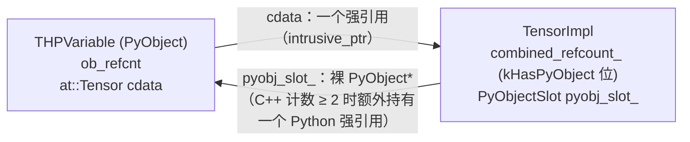
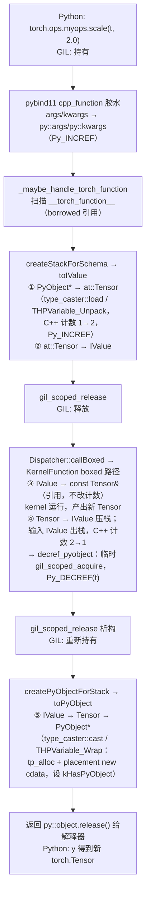

`torch.Tensor` 在 Python 里是一个再普通不过的对象：能 `isinstance`、能子类化、能 `t.foo = 1` 挂属性、能被 `gc` 收集。但它在 C++ 里的定义，在 `torch/csrc/autograd/python_variable.h` 开头：

```cpp
// Python object that backs torch.autograd.Variable
struct THPVariable {
  PyObject_HEAD
  // Payload
  at::Tensor cdata;
  // Hooks to be run on backwards pass (corresponds to Python attr
  // '_backwards_hooks', set by 'register_hook')
  PyObject* backward_hooks = nullptr;
  // ...
};

TORCH_PYTHON_API PyObject* THPVariable_Wrap(at::TensorBase&& var);
TORCH_PYTHON_API PyObject* THPVariable_Wrap(const at::TensorBase& var);

inline const at::Tensor& THPVariable_Unpack(PyObject* obj) {
  return THPVariable_Unpack(reinterpret_cast<THPVariable*>(obj));
}
```

再看一个 `torch.Tensor` 方法的实现。`tools/autograd/templates/python_variable_methods.cpp` 里 `contiguous()` 是这样写的：

```cpp
static Tensor dispatch_contiguous(const Tensor & self, at::MemoryFormat memory_format) {
  pybind11::gil_scoped_release no_gil;
  OptionalDeviceGuard device_guard(device_of(self));
  return self.contiguous(memory_format);
}

static PyObject * THPVariable_contiguous(PyObject* self, PyObject* args, PyObject* kwargs)
{
  HANDLE_TH_ERRORS
  static PythonArgParser parser({
    "contiguous(*, MemoryFormat memory_format=contiguous_format)",
  });
  ParsedArgs<1> parsed_args;
  auto r = parser.parse(self, args, kwargs, parsed_args);
  // ...
  auto& self_ = THPVariable_Unpack(self);
  auto memory_format = r.memoryformat(0);
  // ...
  return THPVariable_Wrap(dispatch_contiguous(self_, memory_format));
  END_HANDLE_TH_ERRORS
}
```

对一个 Java 工程师来说，这两段代码里陌生的不是 C++ 语法，而是两个运行时之间的边界规则：

- `PyObject_HEAD` 是什么？一个 C++ 对象 `at::Tensor` 怎么"嵌"进了一个 Python 对象里？
- `THPVariable_Wrap` 返回裸的 `PyObject*`，谁负责释放它？`THPVariable_Unpack` 返回 `const at::Tensor&`，这个引用能活多久？
- `pybind11::gil_scoped_release` 放掉了 GIL，之后 `self.contiguous()` 还在用 `self`——那不是一个 Python 对象里的东西吗，为什么可以碰？
- 同一个文件里，既有 `pybind11::` 又有裸的 `PyObject*`、`Py_INCREF`。PyTorch 到底用 pybind11 还是用 Python C API？为什么 `Tensor` 不像其他类型那样用 `py::class_` 绑定？
- `HANDLE_TH_ERRORS` / `END_HANDLE_TH_ERRORS` 把函数体包起来，C++ 的异常怎么变成 Python 的异常？
- 写了一个自定义算子的 `.so`，`import` 时报 `undefined symbol: _ZN3c105ErrorC2E...__cxx11...`——符号明明在 `libc10.so` 里，为什么找不到？

这些问题都发生在 Python 和 C++ 两个运行时的交界处。本文的核心问题是总纲里的这一句：

> **一个 `at::Tensor` 从 Python 传到 C++ 又返回 Python，经过了几次类型转换、几次引用计数变化？中间 GIL 状态是什么？**

全文提纲：

1. Python C API 基础：`PyObject`、引用计数、GIL、`PyObject_Call`
2. pybind11 的工作方式：`type_caster`、`py::object` 与异常翻译
3. GIL 的释放与获取：`gil_scoped_release` / `gil_scoped_acquire`
4. PyTorch 如何绑定 `Tensor`：`THPVariable` 直接用 Python C API，为什么
5. Python 对象与 C++ 对象的双向持有：`pyobj_slot`、`kHasPyObject` 与循环引用
6. 回到源码：`torch/csrc/utils/pybind.h` 里的 caster
7. 回答核心问题：一次 `torch.ops.myops.op(t)` 的完整路径
8. `TORCH_LIBRARY` 还是 pybind11：vLLM 的选择，以及 libtorch stable ABI 的现状
9. ABI：name mangling、`_GLIBCXX_USE_CXX11_ABI`、`GLIBCXX_3.4.x` 与 manylinux
10. 扩展与 PyTorch 之间的 ABI 契约：`torch.utils.cpp_extension` 检查了什么
11. mini-c10：`python/minic10_python.cpp` 与一次 ABI 事故复现
12. 工程实践建议与常见错误
13. 总结


## 一、Python C API 基础：`PyObject`、引用计数、GIL、`PyObject_Call`

pybind11 是建在 Python C API 之上的一层 C++ 模板。PyTorch 的 Python 绑定两层都用，而且在最关键的 `Tensor` 上用的是底层那层。所以先把 C API 的四个概念讲到"读懂 `python_variable.cpp` 所需"的程度。

### 1.1 `PyObject` 与 `PyObject_HEAD`：C 语言的"继承"

CPython 里每个 Python 对象在内存里都以同一个头部开始：引用计数 `ob_refcnt` 和类型指针 `ob_type`。`PyObject_HEAD` 宏展开成这两个字段。任何"派生"对象就是在这个头部后面追加自己的字段：

```cpp
struct THPVariable {
  PyObject_HEAD          // Py_ssize_t ob_refcnt; PyTypeObject* ob_type;
  at::Tensor cdata;      // 自己的字段
  PyObject* backward_hooks = nullptr;
  PyObject* post_accumulate_grad_hooks = nullptr;
};
```

因为头部布局一致，一个 `THPVariable*` 可以 `reinterpret_cast` 成 `PyObject*` 交给解释器，解释器只看头部；反过来，拿到一个 `PyObject*`、确认它的 `ob_type` 是 `torch.Tensor` 之后，就可以 cast 回 `THPVariable*` 去读 `cdata`。这就是 `THPVariable_Unpack` 的全部内容：

```cpp
inline const at::Tensor& THPVariable_Unpack(THPVariable* var) {
  return var->cdata;
}
inline const at::Tensor& THPVariable_Unpack(PyObject* obj) {
  return THPVariable_Unpack(reinterpret_cast<THPVariable*>(obj));
}
```

这是 C 风格的"结构体前缀继承"，没有 vtable、没有 RTTI，完全靠约定。Java 对照：JNI 里的 `jobject` 是一个不透明句柄，你**永远不能**看到 Java 对象的内存布局，只能通过 `JNIEnv` 的函数去读字段；CPython 则把布局公开，C 代码直接解引用。这也是 CPython 扩展在解释器升级时容易碎的原因之一（后面 ABI 一节的 `abi3` 就是为解决这个问题）。

`cdata` 是一个 `at::Tensor`，第二篇讲过它是一个 8 字节的句柄（`intrusive_ptr<TensorImpl>`）。所以一个 `torch.Tensor` Python 对象对 `TensorImpl` 贡献**一个**强引用。`cdata` 什么时候构造、什么时候析构，是第四节的内容。

### 1.2 引用计数：owned/new reference 与 borrowed reference

Python 的内存管理是引用计数（外加一个处理环的 GC）。C API 的每个返回 `PyObject*` 的函数都在文档里标了返回的是哪一种引用：

- **new reference（owned）**：调用方拿到了一个计数，用完必须 `Py_DECREF`。`PyLong_FromLong`、`PyTuple_New`、`PyObject_GetAttrString`、`PyObject_Call` 都是。
- **borrowed reference**：调用方没拿到计数，不能 `Py_DECREF`，而且只有在"出借方"还活着的时候才能用。`PyTuple_GetItem`、`PyList_GET_ITEM`、`PyDict_GetItem` 都是。

还有第三种约定——**stealing**：某些函数接收一个 `PyObject*` 并把调用方的计数"偷"走。`PyList_SET_ITEM`、`PyTuple_SET_ITEM` 是。`python_variable.h` 里的 `THPVariable_WrapList` 把两种约定拼在一起：

```cpp
inline PyObject* THPVariable_WrapList(
    const torch::autograd::variable_list& inputs) {
  PyObject* pyinput = PyList_New(static_cast<Py_ssize_t>(inputs.size()));
  for (const auto i : c10::irange(inputs.size())) {
    PyList_SET_ITEM(pyinput, i, THPVariable_Wrap(inputs[i]));
  }
  return pyinput;
}
```

`THPVariable_Wrap` 返回 new reference，`PyList_SET_ITEM` 把它偷走存进列表，两边计数正好抵平，中间没有任何 `Py_INCREF/DECREF`。反过来 `THPVariable_UnpackList` 用 `PyList_GET_ITEM` 拿 borrowed reference，因为它只是读一下再拷贝出 `at::Tensor`（`emplace_back(THPVariable_Unpack(item))` 会拷贝句柄，C++ 计数 +1，Python 计数不变）。

`torch/csrc/jit/python/pybind_utils.cpp` 里 `_maybe_handle_torch_function` 有一段注释直接点出了两种引用的性能差别：

```cpp
    // Because pybind object indexing is implemented generically for
    // all objects, operator[] returns py::object instead of
    // py::handle, so args[i].ptr() would cause a reference count
    // round trip. This has enough overhead that I noticed it while
    // profiling and came here to fix it. In contrast,
    // PyTuple_GetItem returns a borrowed reference, so no counting
    // overhead.
    // ...
    auto* const args_i_ptr = PyTuple_GetItem(args_ptr, i);
```

在算子调用这种每秒几十万次的路径上，一对多余的 `Py_INCREF/Py_DECREF` 是能在 profile 里看出来的。

裸 `PyObject*` 加手工 `Py_DECREF` 和裸 `new/delete` 一样容易漏。PyTorch 在 C API 层的 RAII 包装是 `torch/csrc/utils/object_ptr.h` 的 `THPPointer<T>`（别名 `THPObjectPtr`）：

```cpp
template <class T>
class TORCH_PYTHON_API THPPointer {
 public:
  THPPointer() : ptr(nullptr) {}
  explicit THPPointer(T* ptr) noexcept : ptr(ptr) {}
  THPPointer(THPPointer&& p) noexcept : ptr(std::exchange(p.ptr, nullptr)) {}
  THPPointer(const THPPointer& p) = delete;
  THPPointer& operator=(const THPPointer&) = delete;

  ~THPPointer() {
    free();          // 对 PyObject 的特化就是 Py_XDECREF(ptr)
  }
  // ...
  T* release() {
    T* tmp = ptr;
    ptr = nullptr;
    return tmp;
  }
  // ...
};
```

它和 `std::unique_ptr` 的形状一模一样：只能移动、析构时释放、`release()` 交出所有权。`python_variable.cpp` 里 `THPVariable_get_names` 的 `THPObjectPtr tuple(PyTuple_New(size)); ... return tuple.release();` 就是"函数内用 RAII 保证异常安全（中途 `throw python_error()` 时自动 `Py_DECREF`），出口处把 new reference 交还给 C API 调用方"的标准写法——和第二篇 `intrusive_ptr::release()` 的纪律完全一致。

Java 对照：JNI 的 local reference 由 JVM 在 native 方法返回时自动释放，相当于一个"函数作用域的 borrowed reference"；global reference 需要显式 `NewGlobalRef/DeleteGlobalRef`，相当于 owned。区别在于 JNI 的 local ref 表有容量上限（默认 16 个，超出要 `EnsureLocalCapacity`），而 Python 的引用计数没有这种表。

### 1.3 GIL：解释器的全局锁，也是"持有 PyObject 的许可证"

CPython 的 GIL（Global Interpreter Lock）保证同一时刻只有一个线程在执行字节码、操作 Python 对象。对 C++ 扩展来说它意味着两条规则：

1. **任何触碰 `PyObject` 的操作（包括 `Py_INCREF`）都必须在持有 GIL 时进行。**
2. 一个从 Python 进入 C++ 的调用，在进入时**已经持有** GIL；如果 C++ 代码要长时间计算或阻塞，应当主动释放，让其他 Python 线程运行，做完再拿回来。

C API 的原语是 `PyEval_SaveThread()`（释放，返回当前线程状态）和 `PyEval_RestoreThread(tstate)`（重新获取）。Python 自己的 `Py_BEGIN_ALLOW_THREADS / Py_END_ALLOW_THREADS` 宏就是这两个调用。对于一个"不知道自己有没有 GIL"的 C++ 线程（比如 autograd 引擎的工作线程）要回调 Python，用 `PyGILState_Ensure()/PyGILState_Release()`。第三节会看到 pybind11 把它们包成了两个 RAII 守卫。

一个常被忽略的点：`gil_scoped_release` 之后**不能析构任何 `py::object`**，因为析构会 `Py_DECREF`。这条规则和 PyTorch 的一个设计直接相关——`TensorImpl` 析构时可能要 `Py_DECREF` 它的 Python 包装对象，而析构可能发生在任何线程、任何 GIL 状态下。第四节会看到 PyTorch 怎么处理。

Java 对照：JVM 没有 GIL，`JNIEnv*` 是线程私有的、任何时候都可以用（只要这个线程 attach 到了 JVM）。但 JNI 有一个相似的概念：`GetPrimitiveArrayCritical` 期间不能调用任何其他 JNI 函数、不能阻塞，因为它可能暂停了 GC。GIL 的"释放后不能碰 Python 对象"和这个约束方向相反但性质相同——都是"某个状态下有一类操作被禁止"。

### 1.4 `PyObject_Call`：从 C++ 调回 Python

C++ 调用 Python 可调用对象的原语是 `PyObject_Call(callable, args_tuple, kwargs_dict)`，返回 new reference，失败返回 `nullptr` 并设置 Python 的错误状态（`PyErr_Occurred()` 为真）。PyTorch 大量使用这条反向路径：`__torch_function__`/`__torch_dispatch__`、Python 端注册的 autograd hook、`torch.library` 里用 Python 写的 kernel 都要从 C++ 调回 Python。

C API 的错误约定和 C++ 异常是两套机制：C API 用"返回 `nullptr`/`-1` + 全局错误指示器"，C++ 用 `throw`。PyTorch 用 `python_error` 这个异常类型把前者转成后者（`torch/csrc/Exceptions.h`）：

```cpp
// Throwing this exception means that the python error flags have been already
// set and control should be immediately returned to the interpreter.
struct python_error : public std::exception {
  // ...
  python_error(const python_error& other)
      : type(other.type), value(other.value), traceback(other.traceback),
        message(other.message) {
    pybind11::gil_scoped_acquire gil;
    Py_XINCREF(type);
    Py_XINCREF(value);
    Py_XINCREF(traceback);
  }
  // ...
  ~python_error() override {
    if (type || value || traceback) {
      pybind11::gil_scoped_acquire gil;
      Py_XDECREF(type);
      Py_XDECREF(value);
      Py_XDECREF(traceback);
    }
  }
  // ...
};
```

注意拷贝构造和析构里都先 `gil_scoped_acquire`——因为一个 C++ 异常对象可能在栈展开过程中穿过一段"已释放 GIL"的区域，而它持有的三个 `PyObject*` 必须在有 GIL 时才能改计数。这是 1.3 节规则的一个具体后果。

`python_variable.h` 里 `THPVariable_Check` 展示了"C API 返回 -1 → throw python_error"的转换点：

```cpp
inline bool THPVariable_Check(PyObject* obj) {
  if (!THPVariableClass)
    return false;
  // Fast path
  if (THPVariable_CheckExact(obj)) {
    return true;
  }
  const auto result = PyObject_IsInstance(obj, THPVariableClass);
  if (result == -1)
    throw python_error();
  return result;
}
```

### 1.5 类型对象：`PyTypeObject` 与函数表

Python 的一个类，在 C API 层是一个 `PyTypeObject` 结构体，里面是一张函数指针表：怎么分配（`tp_alloc`）、怎么释放（`tp_dealloc`）、怎么被 GC 遍历（`tp_traverse`/`tp_clear`）、有哪些方法（`tp_methods`）、有哪些属性（`tp_getset`）。`torch.Tensor` 的基类 `torch._C.TensorBase` 就是 `python_variable.cpp` 末尾这张表（删节）：

```cpp
static PyTypeObject THPVariableType = {
    PyVarObject_HEAD_INIT(&THPVariableMetaType, 0)
    "torch._C.TensorBase", /* tp_name */
    sizeof(THPVariable), /* tp_basicsize */
    0, /* tp_itemsize */
    THPVariable_dealloc, /* tp_dealloc */
    // ...
    &THPVariable_as_mapping, /* tp_as_mapping */
    // ...
    Py_TPFLAGS_DEFAULT | Py_TPFLAGS_BASETYPE |
        Py_TPFLAGS_HAVE_GC, /* tp_flags */
    nullptr, /* tp_doc */
    (traverseproc)THPVariable_traverse, /* tp_traverse */
    (inquiry)THPVariable_clear, /* tp_clear */
    // ...
    THPVariable_properties, /* tp_getset */
    // ...
    THPVariable_pynew, /* tp_new */
};
```

`tp_basicsize = sizeof(THPVariable)` 告诉解释器每个实例要分配多大内存——这就是 `at::Tensor cdata` 能"嵌"进去的原因。`Py_TPFLAGS_BASETYPE` 允许 Python 子类化，`Py_TPFLAGS_HAVE_GC` 声明这个类型参与循环 GC（第五节）。

属性表里的每一项是一个 C 函数：

```cpp
static PyObject* THPVariable_is_cuda(THPVariable* self, void* unused) {
  HANDLE_TH_ERRORS
  if (check_has_torch_function((PyObject*)self)) {
    return handle_torch_function_getter(self, "is_cuda");
  }
  auto& self_ = THPVariable_Unpack(self);
  return torch::autograd::utils::wrap(self_.is_cuda());
  END_HANDLE_TH_ERRORS
}

static struct PyGetSetDef THPVariable_properties[] = {
    // ...
    {"shape", (getter)THPVariable_get_shape, nullptr, nullptr, nullptr},
    // ...
    {"device", (getter)THPVariable_device, nullptr, nullptr, nullptr},
    // ...
};
```

这是 C API 绑定一个属性的全部代价：一个 C 函数 + 表里一行。pybind11 的 `def_property_readonly` 最终生成的也是同样的东西，只是由模板代劳。

Java 对照：JNI 没有"在 C 里定义 Java 类"这回事——类只能在 Java 侧定义，native 方法只是实现。CPython 允许扩展在 C 里从零定义一个类型，这给了 PyTorch 完全控制 `torch.Tensor` 内存布局和生命周期的能力，也是第四节"为什么不用 pybind11"的前提。


## 二、pybind11 的工作方式：模板生成胶水代码

pybind11 是一个 header-only 的 C++ 库，它做的事情可以一句话概括：**用模板在编译期为每个被绑定的函数生成一段 C API 胶水代码**——解析 `args` 元组、把每个 `PyObject*` 转成对应的 C++ 类型、调用函数、把返回值转回 `PyObject*`、把 C++ 异常翻译成 Python 异常。第三篇讲过模板是"按类型生成代码"，pybind11 是这一能力最重的应用之一。

PyTorch v2.10.0 源码树把 pybind11 作为 `third_party/pybind11` 子模块（钉在 pybind11 3.0.1）；`torch/csrc/utils/pybind.h` 里有 `#define IS_PYBIND_2_13_PLUS PYBIND11_VERSION_HEX >= 0x020D0000`，说明代码需要兼容 pybind11 2.13 之前和之后的版本。本文引用的 pybind11 头文件片段来自本机安装的 pybind11 3.1.0，涉及的接口（`gil_scoped_release`、`type_caster`、`py::object`）在 2.x 与 3.x 之间语义一致。

### 2.1 `PYBIND11_MODULE`：`PyInit_xxx` 入口

第一篇讲过 `import torch._C` 最终是 `dlopen` 一个 `.so` 再 `dlsym` 一个名字精确为 `PyInit__C` 的 C 符号。`PYBIND11_MODULE(name, m)` 宏就是生成这个入口。它大致展开为：

```cpp
// 示意：pybind11 detail/common.h 中 PYBIND11_MODULE 的骨架（省略了错误处理与多阶段初始化细节）
extern "C" PyObject* PyInit__minic10();          // extern "C"：名字不能被 mangle
static void pybind11_init__minic10(pybind11::module_&);
extern "C" PyObject* PyInit__minic10() {
  // ... 创建 module 对象，设置 PyModuleDef ...
  // ... 在合适的时机调用 pybind11_init__minic10(m) ...
}
void pybind11_init__minic10(pybind11::module_& m)   // 宏后面跟的 { ... } 就是这个函数的函数体
```

（pybind11 3.x 改用了 CPython 的多阶段初始化，`PyInit_` 返回 `PyModuleDef_Init(&def)`，真正的 `pybind11_init_` 在 `Py_mod_exec` 槽里被调用；2.x 是单阶段的。对读者来说只需记住：`PYBIND11_MODULE` 后面那对花括号里的代码，在 `import` 时运行一次。）

一个有意思的对照是 vLLM 的 `csrc/core/registration.h`：

```cpp
// REGISTER_EXTENSION allows the shared library to be loaded and initialized
// via python's import statement.
#define REGISTER_EXTENSION(NAME)                                               \
  PyMODINIT_FUNC CONCAT(PyInit_, NAME)() {                                     \
    static struct PyModuleDef module = {PyModuleDef_HEAD_INIT,                 \
                                        STRINGIFY(NAME), nullptr, 0, nullptr}; \
    return PyModule_Create(&module);                                           \
  }
```

它用 C API 创建了一个**空模块**——没有任何函数、任何类。vLLM 的算子并不通过这个模块暴露，而是靠 `.so` 加载时的静态初始化（第五篇）把自己注册进 `torch.ops._C`。`REGISTER_EXTENSION` 存在的唯一目的是让 `import vllm._C` 这条 Python 语句合法。第八节会展开这个选择。

### 2.2 `py::handle` 与 `py::object`：borrowed 与 owned 的 C++ 化

pybind11 把 1.2 节的两种引用做成了两个类型：

- `py::handle`：包一个 `PyObject*`，**不管**引用计数——对应 borrowed reference。
- `py::object`：继承 `handle`，构造时（拷贝）`Py_INCREF`、析构时 `Py_DECREF`——对应 owned reference，RAII 管理。

`pybind11/pytypes.h` 里 `object` 的核心就是四个特殊成员函数：

```cpp
class object : public handle {
public:
    object() = default;
    /// Copy constructor; always increases the reference count
    object(const object &o) : handle(o) { inc_ref(); }
    /// Move constructor; steals the object from ``other`` and preserves its reference count
    object(object &&other) noexcept : handle(other) { other.m_ptr = nullptr; }
    /// Destructor; automatically calls `handle::dec_ref()`
    ~object() { dec_ref(); }

    handle release() {
        PyObject *tmp = m_ptr;
        m_ptr = nullptr;
        return handle(tmp);
    }
    // ...
};
```

这和第二篇的 `intrusive_ptr`、1.2 节的 `THPPointer` 是同一个模式。从裸 `PyObject*` 构造 `py::object` 时必须说明拿到的是哪种引用：

```cpp
py::object a = py::reinterpret_borrow<py::object>(p);   // p 是 borrowed：我要 +1
py::object b = py::reinterpret_steal<py::object>(p);    // p 是 new reference：我接管，不 +1
```

`python_variable.cpp` 里 `THPVariableMetaType_init` 就是这样把 C API 的返回值接进 pybind11 世界的：

```cpp
  py::tuple mro =
      py::reinterpret_borrow<py::tuple>(((PyTypeObject*)cls)->tp_mro);   // tp_mro 字段：borrowed
  // ...
  py::object torch_dispatch_impl = py::reinterpret_steal<py::object>(
      PyObject_GetAttrString(cls, "__torch_dispatch__"));                // GetAttr：new reference
```

选错会导致两种后果：把 new reference 当 borrowed → 泄漏；把 borrowed 当 new → 多 `DECREF` 一次，use-after-free 或段错误。这是写 Python 绑定时最常见的 bug 类型，和 JNI 里忘记 `DeleteGlobalRef`（泄漏）或者把 local ref 存到静态变量里（悬垂）完全对应。

`py::tuple`、`py::dict`、`py::list`、`py::str`、`py::args`（就是 `tuple`）、`py::kwargs`（就是 `dict`）都是 `py::object` 的子类，只是多了类型检查和对应的方法。

### 2.3 `type_caster<T>`：每种类型一份转换代码

pybind11 的核心抽象是 `pybind11::detail::type_caster<T>`：一个模板类，对每个 C++ 类型 `T` 提供两个方向的转换：

- `bool load(handle src, bool convert)`：Python → C++，成功把结果放进成员 `value` 并返回 `true`；返回 `false` 表示"这个 Python 对象不是 `T`"，让 pybind11 去试下一个重载。
- `static handle cast(const T& src, return_value_policy, handle parent)`：C++ → Python，返回一个 **new reference**。

`pybind11/cast.h` 里 `PYBIND11_TYPE_CASTER` 宏给出了一个 caster 的样板：

```cpp
#define PYBIND11_TYPE_CASTER(type, py_name)                                                       \
protected:                                                                                        \
    type value;                                                                                   \
                                                                                                  \
public:                                                                                           \
    static constexpr auto name = py_name;                                                         \
    /* ... 指针版 cast、到 type& / type&& 的转换运算符 ... */                                        \
    operator type &() { return value; }                                                           \
    operator type &&() && { return std::move(value); }                                            \
    template <typename T_>                                                                        \
    using cast_op_type = ::pybind11::detail::movable_cast_op_type<T_>
```

`value` 就是转换出来的 C++ 对象，`operator type&()` 让 pybind11 能把 caster 当作参数直接传给被绑定的函数。`name` 是出错时打印的类型名（`_("torch.Tensor")` 之类）。

内建类型的 caster 是偏特化。整数/浮点走 `type_caster<T, enable_if_t<std::is_arithmetic<T>::value ...>>`，它的 `load` 用 `PyLong_AsLong`/`PyFloat_AsDouble`，并用 `convert` 参数控制"是否允许 `1` 转成 `double`"。当一个名字有多个重载时，pybind11 解析一次调用会跑**两轮**：第一轮对所有重载用 `convert=false`（精确匹配），全部失败再来一轮 `convert=true`（允许隐式转换）。这就是为什么绑定了 `f(int)` 和 `f(double)` 两个重载时，`f(1)` 会精确命中 `int` 版本而不是"注册顺序里第一个能转的"。只有一个重载时直接用 `convert=true`。

用户类型（`py::class_<T>` 绑定的）走 `type_caster_base<T>`：`load` 检查 Python 对象是不是这个 `class_` 创建的实例，然后从实例里取出 C++ 对象的指针；`cast` 分配一个新的 Python 实例，把 C++ 对象（拷贝、移动，或按 `return_value_policy` 只存指针）放进去。

PyTorch 在 `torch/csrc/utils/pybind.h` 里为 `at::Tensor`、`at::Device`、`at::ScalarType`、`at::IntArrayRef` 等全特化了 `type_caster`，因为这些类型的 Python 侧对象**不是** pybind11 创建的，而是 C API 定义的（第六节）。

模板在这里的作用是：`m.def("add", &dispatch_add)` 一行，编译器从 `dispatch_add` 的签名 `Tensor(const Tensor&, const Tensor&)` 推导出参数类型包，为每个参数实例化一个 `type_caster<Tensor>`，为返回值实例化 `type_caster<Tensor>::cast`，再生成一个 C API 签名的 `PyObject* (*)(PyObject* self, PyObject* args, PyObject* kwargs)` 函数把它们串起来。第三篇说过"模板错误信息长得离谱"——pybind11 的编译错误正是典型：一个缺少 caster 的类型会得到几百行 `type_caster<Foo>` 实例化失败的输出。

### 2.4 函数绑定：`m.def`、默认参数、关键字参数、`py::arg`

```cpp
m.def("empty", &minic10::empty,
      py::arg("sizes"), py::arg("dtype") = ScalarType::Float,
      py::arg("key") = DispatchKey::CPU,
      "Allocate an uninitialized tensor");
```

`py::arg("dtype") = ScalarType::Float` 做了两件事：给参数起名（Python 端可以 `empty(sizes=[2,3], dtype=...)` 用关键字传），以及提供默认值——默认值在**绑定时**就被转成 Python 对象存起来，所以它必须是一个已有 caster 的类型（这里 `ScalarType` 已经用 `py::enum_` 绑定过）。C++ 函数签名里的默认参数 pybind11 看不到（默认参数不是函数类型的一部分），所以必须用 `py::arg` 重新声明一遍。

`py::args`/`py::kwargs` 让一个绑定接收任意参数，PyTorch 把 `torch.ops` 的调用入口就绑成这样（`torch/csrc/jit/python/init.cpp`）：

```cpp
          auto func = py::cpp_function(
              [sortedOps, symbol, allow_numbers_as_tensors](
                  const py::args& args, const py::kwargs& kwargs) {
                ToIValueAllowNumbersAsTensors g(allow_numbers_as_tensors);
                return _get_operation_for_overload_or_packet(
                    sortedOps, symbol, args, kwargs, false);
              },
              py::name(symbol.toUnqualString()),
              py::doc(docstring.str().c_str()));
```

`py::cpp_function` 是 `m.def` 底下的东西：把一个 C++ 可调用对象包成一个 Python 函数对象。这里参数是 `py::args`（原样的元组）和 `py::kwargs`（原样的字典），因为算子的签名是运行期从 schema 读出来的，编译期不知道，所以类型转换不能交给 pybind11，要自己按 schema 做（第七节）。

重载：对同一个名字多次 `m.def`，pybind11 按注册顺序逐个尝试 caster，全部失败时抛 `TypeError`，错误信息列出所有候选签名。本文 mini-c10 一节有一个真实输出。

### 2.5 类绑定：`py::class_` 与 holder

```cpp
py::class_<Tensor>(m, "Tensor")
    .def(py::init<>())
    .def_property_readonly("shape", &Tensor::sizes)
    .def("numel", &Tensor::numel)
    .def("__repr__", &repr);
```

`py::class_<T>` 创建一个新的 Python 类型对象（1.5 节那种 `PyTypeObject`，只是由 pybind11 动态构造），每个实例内部持有一个 **holder**——默认是 `std::unique_ptr<T>`——指向堆上的 C++ 对象。也就是说 pybind11 绑定的类，Python 实例和 C++ 对象是**两块内存**，Python 实例通过 holder 指向 C++ 对象；对比 `THPVariable`，`at::Tensor` 是直接嵌在 Python 对象内存里的。

holder 可以换成 `std::shared_ptr<T>`，也可以换成自定义智能指针。第二篇已经看到过 `torch/csrc/utils/pybind.h` 的这一行：

```cpp
PYBIND11_DECLARE_HOLDER_TYPE(T, c10::intrusive_ptr<T>, true)
```

有了它，`py::class_<c10d::ProcessGroup, c10::intrusive_ptr<c10d::ProcessGroup>>` 这样的绑定就能让 Python 实例直接持有一个 `intrusive_ptr`。第三个参数 `true` 表示"这个智能指针总是可以从裸指针安全地重新构造"（intrusive 计数就住在对象里，所以是安全的；`shared_ptr` 就不行），这也是 `c10/util/intrusive_ptr.h` 开头把 `pybind11::class_` 声明为 `friend` 的原因——它要访问私有的裸指针构造函数。

Java 对照：pybind11 的 holder 模型接近 JNI 里常见的"Java 对象存一个 `long nativeHandle` 字段指向 C++ 对象"的手工模式，只是 pybind11 把这层做进了类型系统，并且用 holder 的析构保证 C++ 对象跟着 Python 对象一起释放——Java 里这一步要靠 `Cleaner`/finalizer，时机不确定。

### 2.6 异常翻译：C++ `throw` 如何变成 Python `raise`

pybind11 生成的胶水函数用 `try/catch` 包住整个调用。默认翻译规则：`std::exception` 派生类按类型映射（`std::invalid_argument → ValueError`、`std::out_of_range → IndexError`、其他 `std::exception → RuntimeError`），`py::error_already_set`（表示 Python 错误指示器已经设好）直接返回 `nullptr`。翻译的方式就是 `PyErr_SetString(PyExc_XXX, e.what())` 再返回 `nullptr`——1.4 节那套 C API 约定。

PyTorch 的异常是 `c10::Error` 及其子类（`c10::IndexError`、`c10::ValueError`、`c10::NotImplementedError`、`c10::OutOfMemoryError`……），默认规则只会把它们全变成 `RuntimeError`。所以 `torch/csrc/Module.cpp` 的 `initModule` 里注册了自己的翻译器：

```cpp
  // Automatically translate errors thrown from pybind11 functions
  py::register_exception_translator([](std::exception_ptr e) {
    try {
      if (e) {
        std::rethrow_exception(e);
      }
    }
    CATCH_TH_ERRORS()
  });
```

`CATCH_TH_ERRORS` 展开为 `torch/csrc/Exceptions.h` 里那一长串 `catch`：

```cpp
#define _CATCH_GENERIC_ERROR(ErrorType, PythonErrorType, retstmnt) \
  catch (const c10::ErrorType& e) {                                \
    auto msg = torch::get_cpp_stacktraces_enabled()                \
        ? e.what()                                                 \
        : e.what_without_backtrace();                              \
    PyErr_SetString(PythonErrorType, torch::processErrorMsg(msg)); \
    retstmnt;                                                      \
  }

// Only catch torch-specific exceptions
#define CATCH_CORE_ERRORS(retstmnt)                                           \
  catch (python_error & e) {                                                  \
    e.restore();                                                              \
    retstmnt;                                                                 \
  }                                                                           \
  catch (py::error_already_set & e) {                                         \
    e.restore();                                                              \
    retstmnt;                                                                 \
  }                                                                           \
  _CATCH_GENERIC_ERROR(IndexError, PyExc_IndexError, retstmnt)                \
  _CATCH_GENERIC_ERROR(ValueError, PyExc_ValueError, retstmnt)                \
  _CATCH_GENERIC_ERROR(TypeError, PyExc_TypeError, retstmnt)                  \
  _CATCH_GENERIC_ERROR(                                                       \
      NotImplementedError, PyExc_NotImplementedError, retstmnt)               \
  /* ... LinAlgError、OutOfMemoryError、DistBackendError ... */                \
  _CATCH_GENERIC_ERROR(Error, PyExc_RuntimeError, retstmnt)                   \
  catch (torch::PyTorchError & e) {                                           \
    auto msg = torch::processErrorMsg(e.what());                              \
    PyErr_SetString(e.python_type(), msg);                                    \
    retstmnt;                                                                 \
  }
```

`catch` 子句的顺序很重要：C++ 按顺序匹配第一个能接住的 `catch`，所以子类（`c10::IndexError`）必须排在基类（`c10::Error`）前面，否则全部被基类接走变成 `RuntimeError`。`python_error` 和 `py::error_already_set` 的处理是 `e.restore()`——把异常对象里暂存的 Python 错误三元组放回解释器的错误指示器。

同一套 `catch` 也被 C API 风格的函数用，就是开头看到的 `HANDLE_TH_ERRORS` / `END_HANDLE_TH_ERRORS`：

```cpp
#define HANDLE_TH_ERRORS                              \
  try {                                               \
    torch::PyWarningHandler __enforce_warning_buffer; \
    try {
// ...
#define END_HANDLE_TH_ERRORS_RET(retval)                            \
  }                                                                 \
  catch (...) {                                                     \
    __enforce_warning_buffer.set_in_exception();                    \
    throw;                                                          \
  }                                                                 \
  }                                                                 \
  catch (const std::exception&) {                                   \
    torch::translate_exception_to_python(std::current_exception()); \
    return retval;                                                  \
  }

#define END_HANDLE_TH_ERRORS END_HANDLE_TH_ERRORS_RET(nullptr)
```

双层 `try`：内层负责在异常路径上标记 warning 缓冲区（C++ 层 `TORCH_WARN` 出来的警告要在返回 Python 前统一变成 Python `warnings`），外层把任何 `std::exception` 翻译成 Python 异常并 `return nullptr`。所以每个 C API 风格的 `THPVariable_xxx` 函数第一行和最后一行都是这对宏——第五篇说的"宏用来生成重复代码"在这里非常直观。

Java 对照：JNI 里 C++ 异常**不能**穿过 native 边界（穿过就是未定义行为，通常直接 crash），必须手工 `catch` 后调用 `env->ThrowNew(cls, msg)`，然后正常返回；Java 异常也不会自动传到 C++，要用 `ExceptionCheck/ExceptionOccurred` 轮询。pybind11 和 PyTorch 在两个方向上都做了自动化：C++ → Python 靠翻译器，Python → C++ 靠 `python_error`/`error_already_set`。


## 三、GIL 的释放与获取：`gil_scoped_release` / `gil_scoped_acquire`

### 3.1 两个守卫的实现

pybind11 把 1.3 节的 C API 原语包成两个 RAII 守卫。`pybind11/gil.h`：

```cpp
class gil_scoped_release {
public:
    // PRECONDITION: The GIL must be held when this constructor is called.
    explicit gil_scoped_release(bool disassoc = false) : disassoc(disassoc) {
        assert(PyGILState_Check());
        // ...
        tstate = PyEval_SaveThread();
        // ...
    }
    gil_scoped_release(const gil_scoped_release &) = delete;
    gil_scoped_release &operator=(const gil_scoped_release &) = delete;
    // ...
    ~gil_scoped_release() {
        if (!tstate) {
            return;
        }
        if (active) {
            PyEval_RestoreThread(tstate);
        }
        // ...
    }
private:
    PyThreadState *tstate;
    bool disassoc;
    bool active = true;
};
```

构造 = `PyEval_SaveThread()`（释放 GIL，记住线程状态），析构 = `PyEval_RestoreThread()`（拿回 GIL）。删除拷贝。这和第六篇的 `NoGradGuard`、`DeviceGuard` 是同一个"守卫"模式：管理的不是资源，是一段"上下文"，靠析构保证配对，异常路径也不会漏。

`gil_scoped_acquire` 相反：构造时如果当前线程没有 GIL 就获取（必要时为这个线程创建 `PyThreadState`），析构时释放。它是可重入的——已经持有 GIL 的线程再构造一个 `gil_scoped_acquire` 只是计数 +1，所以 1.4 节 `python_error` 的析构里可以无条件写 `gil_scoped_acquire`。

### 3.2 什么时候必须释放

从 Python 进来的调用默认持有 GIL。如果 C++ 代码要做以下任何一件事，就应当释放：

1. **耗时计算**：一个 matmul 可能跑几十毫秒，期间持有 GIL 意味着 DataLoader 的工作线程、监控线程全部停摆。开头的 `dispatch_contiguous` 就是典型：

```cpp
static Tensor dispatch_contiguous(const Tensor & self, at::MemoryFormat memory_format) {
  pybind11::gil_scoped_release no_gil;
  OptionalDeviceGuard device_guard(device_of(self));
  return self.contiguous(memory_format);
}
```

代码生成器为**每个** `torch.Tensor` 方法生成一个这样的 `dispatch_xxx`：参数已经全部转成 C++ 类型，进入 ATen 前放掉 GIL。两个守卫并排放着，`no_gil` 先构造后析构，所以 `device_guard` 的整个生命周期都在无 GIL 区间内。

2. **算子调用**：`torch.ops.xxx` 的路径在 `torch/csrc/jit/python/pybind_utils.cpp`：

```cpp
py::object invokeOperatorFromPython(
    c10::ArrayRef<std::shared_ptr<Operator>> operations,
    const py::args& args,
    const py::kwargs& kwargs,
    std::optional<c10::DispatchKey> dk) {
  auto [found_op, stack] = getOpWithStack(operations, args, kwargs);
  {
    pybind11::gil_scoped_release no_gil_guard;
    if (dk) {
      found_op->getOperationForDispatchKey (*dk)(stack);
    } else {
      found_op->getOperation()(stack);
    }
  }

  return createPyObjectForStack(std::move(stack));
}
```

三段式：**持 GIL 把 Python 参数转成 C++（`getOpWithStack`）→ 放掉 GIL 跑算子 → 拿回 GIL 把结果转回 Python**。第七节会沿这条路走一遍。`torch.library` 的 Python 绑定（`torch/csrc/utils/python_dispatch.cpp`）里 `ophandle_call_boxed` 和 `_DispatchOperatorHandle.redispatch_boxed` 是同一形状：`createStackForSchema` → `{ gil_scoped_release; handle.callBoxed(stack); }` → `createPyObjectForStack`。

3. **可能阻塞的操作**：等待 CUDA 事件、集合通信、文件 IO、等条件变量。持 GIL 阻塞是死锁的常见来源——如果被等的那一方需要 GIL 才能推进。

4. **释放大对象**：`python_variable.cpp` 的 `THPVariable_clear`：

```cpp
  {
    // MapAllocator can take significant time to release large tensors;
    // release the GIL here to avoid impacting main thread perf.
    pybind11::gil_scoped_release no_gil;
    self->cdata = Variable();
  }
```

`self->cdata = Variable()` 触发第二篇那条析构链（`TensorImpl → StorageImpl → DataPtr → 删除器`），对 mmap 分配的大 tensor 可能是毫秒级的 `munmap`，所以放掉 GIL 再做。

pybind11 还提供了声明式写法 `py::call_guard<py::gil_scoped_release>()`：加在 `m.def` 的参数列表里，整个函数体在无 GIL 下运行。`torch/csrc/jit/python/init.cpp` 里多处使用。注意它是在**参数转换完成之后**才释放 GIL——参数转换必须持 GIL。

### 3.3 释放后不能碰什么

释放 GIL 后，这个线程**不能做任何涉及 Python 对象的操作**：

- 不能 `Py_INCREF/Py_DECREF`——所以不能拷贝、也不能**析构**任何 `py::object`。一个常见的坑是在 `gil_scoped_release` 的作用域里声明了 `py::object` 局部变量，它在作用域结束时析构，而此时 GIL 还没拿回来（守卫按声明的逆序析构：后声明的 `py::object` 先析构，此时 `gil_scoped_release` 还活着）。
- 不能读 Python 对象的字段（`PyTuple_GET_ITEM` 之类），因为另一个线程可能正在改它。
- 不能抛出 `py::error_already_set` 或调用任何 C API。

那 `dispatch_contiguous` 里 `self` 是一个 `const Tensor&`，引用的是 `THPVariable::cdata`，那块内存**在 Python 对象里面**，为什么放掉 GIL 还能用？因为 `cdata` 是一个 C++ 对象，`self.contiguous()` 只读 `intrusive_ptr` 指向的 `TensorImpl`，完全不碰 `PyObject` 头部的引用计数。而且调用方（Python 帧）持有这个 `torch.Tensor` 的引用，只要调用没返回，Python 对象就不会被释放，`cdata` 就有效。这是**借用**：C++ 借了 Python 对象里的一个 C++ 子对象，借用期间不改 Python 计数。

但有一个微妙的地方。第五节会讲，`TensorImpl` 的 C++ 引用计数从 1 变 2 或从 2 变 1 时，会 `Py_INCREF/Py_DECREF` 它的 Python 包装对象。这可能发生在无 GIL 的算子执行中——kernel 拷贝了一份 `Tensor`，或者 `IValue` 栈被清空。PyTorch 的处理是让这两个操作自己去拿 GIL（`torch/csrc/PyInterpreter.cpp`）：

```cpp
void ConcretePyInterpreterVTable::decref(PyObject* pyobj) const {
  // Leak the pyobj if not initialized.  This can happen if we are running
  // exit handlers that are destructing tensors with residual (owned)
  // PyObjects stored in them.
  if (!Py_IsInitialized())
    return;
  pybind11::gil_scoped_acquire gil;
  Py_DECREF(pyobj);
}

void ConcretePyInterpreterVTable::incref(PyObject* pyobj) const {
  if (!Py_IsInitialized())
    return;
  pybind11::gil_scoped_acquire gil;
  Py_INCREF(pyobj);
}
```

所以规则更准确的表述是：**释放 GIL 后，你自己的代码不能碰 Python 对象；库内部需要碰的地方，它会自己临时拿 GIL。** `Py_IsInitialized()` 检查处理解释器已经关闭的情况——进程退出时 C++ 静态对象析构可能晚于解释器销毁，这时候宁可泄漏也不能 `Py_DECREF` 一个已经不存在的解释器里的对象。

`torch/csrc/utils/pybind.h` 末尾的 `destroy_without_gil` 是另一个方向的工具：一个 C++ 对象既可能从 Python 侧也可能从 C++ 侧被最后一次释放，析构又可能很慢，就把它包进 `shared_ptr<T>(new T(), destroy_without_gil<T>)`，删除器里判断"如果当前持有 GIL 就先放掉再 `delete`"。注释里说得很清楚：`shared_ptr` 的所有权是弥散的，你没法预知最后一个引用在哪个线程、哪种 GIL 状态下消失。

### 3.4 `gil_scoped_acquire`：C++ 线程回调 Python

反方向：一个纯 C++ 线程（autograd 引擎的工作线程、`at::parallel_for` 的 OpenMP 线程、NCCL watchdog）需要调 Python（用户注册的 hook、`__torch_dispatch__`）。它必须先 `gil_scoped_acquire`。`torch/csrc/PyInterpreter.cpp` 的 `CONCRETE_GPU_TRACE` 宏是一个完整的例子：

```cpp
#define CONCRETE_GPU_TRACE(device_type, func_name, ...)                       \
  at::impl::MaybeSetTLSOnEntryGuard guard;                                    \
  if (Py_IsInitialized()) {                                                   \
    pybind11::gil_scoped_acquire gil;                                         \
    try {                                                                     \
      /* ... */                                                               \
      std::string module_name = "torch." + DeviceTypeName(device_type, true); \
      py::module mod = py::module::import(module_name.c_str());               \
      py::object hook =                                                       \
          mod.attr("_gpu_trace").attr(func_name).attr("fire_callbacks");      \
      hook(__VA_ARGS__);                                                      \
    } catch (const std::exception& e) {                                       \
      LOG(ERROR) << device_type                                               \
                 << " trace hook execution failed: " << e.what();             \
    }                                                                         \
  }
```

先 `Py_IsInitialized()`，再 `gil_scoped_acquire`，然后所有 `py::object` 都在这个作用域内创建和销毁，异常在离开 GIL 作用域前接住。`hook(__VA_ARGS__)` 是 `py::object::operator()`，底下是 `PyObject_Call`。

### 3.5 死锁模式

最经典的一种：线程 A 持有一个 C++ `std::mutex` 然后去 `gil_scoped_acquire`；线程 B 持有 GIL 然后去锁同一个 `mutex`。两把锁的获取顺序不一致就是死锁。通用的解法和任何多锁问题一样：固定顺序。对 Python 扩展来说自然的顺序是把 GIL 当作最外层的锁——需要同时持有 GIL 和某个 C++ 锁时先拿 GIL；已经持有 C++ 锁却需要回 Python 时，先放锁再拿 GIL。`c10/core/impl/PyInterpreter.h` 开头的 Note 提到了正是这个风险："acquiring the GIL could lead to deadlocks if someone is blocking on you while holding the GIL"——`TensorImpl` 的析构可能在任何线程、持有任何锁的情况下发生，而它要 `Py_DECREF`，这就是为什么 3.3 节的 `decref` 要格外小心。

Java 对照：JVM 没有 GIL，但 JNI 有 `MonitorEnter/MonitorExit`，与 `synchronized` 是同一把锁；C++ 侧持有 `std::mutex` 再 `MonitorEnter` 一个被 Java 线程持有的监视器，死锁模式完全相同。区别在于 Python 里这个问题更常见，因为 GIL 是**所有** Python 操作共用的一把锁，任何 `py::object` 析构都可能要它。


## 四、PyTorch 如何绑定 `Tensor`：`THPVariable` 直接用 C API，为什么

### 4.1 两条绑定路线并存

`torch/csrc/` 里同时存在两种风格：

| 风格 | 代表 | 特点 |
|---|---|---|
| Python C API | `THPVariable`（`Tensor`）、`THPDevice`、`THPDtype`、`THPGenerator`、`THPStorage`、`THPSize`、`torch.autograd.Function` 的 `THPFunction` | 手写 `PyTypeObject`、`tp_*` 函数、`PyMethodDef`/`PyGetSetDef` 表；参数解析用 `PythonArgParser` |
| pybind11 | `torch._C._DispatchModule`（`torch.library`）、`c10d::ProcessGroup`、JIT 的 `Graph`/`Node`、`torch._C._jit_*`、大部分 `torch._C._xxx` 工具函数 | `py::class_`、`m.def`，类型转换靠 `type_caster` |

`torch/csrc/Module.cpp` 的 `initModule` 是两者混用的地方：它先用 C API 创建模块、调用 `THPVariable_initModule` 等一系列 `xxx_initModule` 把 C API 类型加进模块，然后：

```cpp
  auto py_module = py::reinterpret_borrow<py::module>(module);
  py_module.def("_initCrashHandler", &_initCrashHandler);
  py_module.def("_demangle", &c10::demangle);
  // ...
```

把同一个模块对象借给 pybind11，用 `m.def` 继续添加函数。两套机制操作的是同一个 `PyObject*`，只是 API 风格不同。

### 4.2 为什么 `Tensor` 不用 pybind11

`torch.Tensor` 是 PyTorch 最核心、被调用最频繁、也是语义最复杂的 Python 类型。用 pybind11 绑定它会碰到几个 pybind11 的模型不支持或支持得很别扭的需求：

1. **Python 端子类化必须"透明"。** `torch.nn.Parameter`、`torch.Tensor` 的用户子类（`__torch_function__`/`__torch_dispatch__` 子类）要能被 C++ 侧无差别地当成 `Tensor` 用。pybind11 支持 Python 子类化绑定类，但 C++ 从 Python 子类实例取 C++ 对象时有 trampoline、多重继承等一系列限制。C API 下，`THPVariable_Check` 一个 `PyObject_IsInstance` 就解决了，`THPVariable_Unpack` 对子类实例同样有效（布局前缀相同）。

2. **需要自定义元类。** `torch._C._TensorMeta` 是 `torch.Tensor` 的元类（`THPVariableMetaType`，1.5 节表里 `PyVarObject_HEAD_INIT(&THPVariableMetaType, 0)` 那一行），它的 `tp_init` 在每次创建 `Tensor` 子类时运行，检查子类是否定义了 `__torch_dispatch__`，如果定义了就把 `__torch_function__` 换成禁用版本。pybind11 没有自定义元类的接口。

3. **Python 对象和 C++ 对象要双向关联，且 Python 对象必须可复活。** 同一个 `TensorImpl` 无论从 C++ 返回多少次，Python 侧都必须是**同一个** `torch.Tensor` 对象（`id(t)` 不变、`t.my_attr` 不丢）。这要求 `TensorImpl` 记住它的 `PyObject*`（`pyobj_slot_`），并且当 Python 端暂时没人引用但 C++ 端还有引用时，Python 对象不能被释放。pybind11 的 holder 模型是"Python 对象拥有 C++ 对象"的单向关系，做不到这一点。第五节展开。

4. **GC 集成。** `THPVariable` 有 `backward_hooks` 等指向其他 Python 对象的字段，还通过 `grad_fn` 间接持有 Python 对象，可能形成环。要让 CPython 的循环 GC 能收集，必须实现 `tp_traverse`/`tp_clear`，而且遍历逻辑依赖 C++ 侧的引用计数（第五节）。pybind11 的 `py::class_` 默认不参与 GC（有 `py::dynamic_attr()` 时才有一个简单的 `tp_traverse`）。

5. **性能。** 每个 `torch.Tensor` 方法调用都要经过参数解析。`PythonArgParser` 是为 PyTorch 的 schema 定制的：一次解析同时处理重载选择、`Tensor`/`Scalar` 的二义性、`__torch_function__` 检查，并且大量使用 borrowed reference 和 `THPVariable_CheckExact` 快速路径。`torch/csrc/utils/python_arg_parser.h`：

```cpp
inline at::Tensor PythonArgs::tensor(int i) {
  if (args[i] && THPVariable_CheckExact(args[i])) {
    return THPVariable_Unpack(args[i]);
  }
  return tensor_slow(i);
}
```

精确类型匹配时只是一次指针比较加一次 `intrusive_ptr` 拷贝。pybind11 的泛化机制（两轮 caster 尝试、`py::object` 中间对象）在这个热路径上开销明显。

6. **历史。** `THP` 前缀是 "TorcH Python" 的缩写，这套 C API 绑定早于 pybind11 进入 PyTorch。

`python_arg_parser.h` 文件头的注释描述了它的用法：

```cpp
// Parse arguments to Python functions implemented in C++
// This is similar to PyArg_ParseTupleAndKeywords(), but specifically handles
// the types relevant to PyTorch and distinguishes between overloaded function
// signatures.
//
// Example:
//
//   static PythonArgParser parser({
//     "norm(Scalar p, int64_t dim, bool keepdim=False)",
//     "norm(Scalar p=2)",
//   });
//   ParsedArgs<3> parsed_args;
//   auto r = parser.parse(args, kwargs, parsed_args);
//   if (r.idx == 0) {
//     norm(r.scalar(0), r.int64(1), r.bool(0));
//   } else {
//     norm(r.scalar(0));
//   }
//
// We auto-generate most uses of PythonArgParser; the generated files
// are torch/csrc/autograd/generated/python_*.cpp
```

签名字符串在第一次调用时解析一次（`static` 局部变量），之后每次调用只做匹配。这些 `python_*.cpp` 由第五篇讲的 `torchgen` 从 `native_functions.yaml` 生成，所以每个 `torch.xxx` 函数的 Python 绑定都是"一个 `PythonArgParser` + 一个 `dispatch_xxx` + `THPVariable_Wrap`"这个三件套。

### 4.3 `THPVariable_Wrap`：C++ → Python

`python_variable.cpp` 里三个 `THPVariable_Wrap` 重载都转到一个模板：

```cpp
// Generic for const Tensor& or Tensor&&
template <typename T>
static PyObject* THPVariable_WrapWithType(
    T&& var,
    std::optional<PyTypeObject*> desired_type) {
  if (!var.defined()) {
    Py_RETURN_NONE;
  }

  c10::TensorImpl* tensor_impl = var.unsafeGetTensorImpl();
  c10::impl::PyObjectSlot* pyobj_slot = tensor_impl->pyobj_slot();

  PyObject* obj = pyobj_slot->load_pyobj();
  if (obj) {
    if (desired_type) {
      check_tensor_subclass(obj, *desired_type);
    }
    return Py_NewRef(obj);
  }

  PyTypeObject* type = reinterpret_cast<PyTypeObject*>(THPVariableClass);
  if (desired_type) {
    type = *desired_type;
  } else if (C10_UNLIKELY(var.device().type() == c10::kXLA)) {
    if (auto clazz = getPythonTensorClass(var.device())) {
      type = reinterpret_cast<PyTypeObject*>(clazz);
    }
  }

  obj = type->tp_alloc(type, 0);
  TORCH_CHECK(obj, "Failed to allocate a ", type->tp_name, " object");

  // Ensure that PyUnstable_TryIncref calls don't fail spuriously in
  // free-threaded Python.
  PyUnstable_EnableTryIncRef(obj);

  auto v = reinterpret_cast<THPVariable*>(obj);
  new (&v->cdata) Tensor(std::forward<T>(var));

  if (THPVariable_Unpack(obj).is_uniquely_owned()) {
    // We can use a faster non-atomic code path if we have the only reference to
    // a fresh Tensor.
    PyObjectPreservation::init_fresh_nonatomic(tensor_impl, pyobj_slot, obj);
    return obj;
  }

  PyObject* wrapper =
      PyObjectPreservation::init_once(tensor_impl, pyobj_slot, obj);
  if (wrapper != obj) {
    // Another thread beat us to it
    Py_DECREF(obj);
    if (desired_type) {
      check_tensor_subclass(wrapper, *desired_type);
    }
    return Py_NewRef(wrapper);
  }
  return obj;
}
```

逐行看：

- `T&&` 加 `std::forward<T>`：第二篇的转发引用。传 `const Tensor&` 进来就拷贝句柄（C++ 计数 +1），传 `Tensor&&` 进来就移动（计数不变）。
- undefined tensor 变成 `None`——`Py_RETURN_NONE` 是 `Py_INCREF(Py_None); return Py_None;`。
- 先查 `pyobj_slot->load_pyobj()`：**如果这个 `TensorImpl` 已经有 Python 对象，直接 `Py_NewRef` 返回它**。`Py_NewRef(obj)` 等价于 `Py_INCREF(obj); return obj;`——把 slot 里的 borrowed 变成返给调用方的 new reference。这就是"同一个 `TensorImpl` 永远对应同一个 Python 对象"的实现点。
- 没有就创建：`type->tp_alloc(type, 0)` 让 CPython 分配 `sizeof(THPVariable)` 字节并初始化 `PyObject_HEAD`（计数 = 1），然后 **placement new** 在 `cdata` 那块未初始化的内存上构造一个 `Tensor`。CPython 分配的内存不会调用 C++ 构造函数，必须手工构造。
- 最后把新对象登记进 `TensorImpl`：如果 `cdata` 是唯一持有者（`is_uniquely_owned()`，刚从算子返回的临时 tensor 走右值重载时正是如此），别的线程不可能看到这个 `TensorImpl`，走非原子的 `init_fresh_nonatomic`；否则走 `init_once` 做 CAS，如果另一个线程抢先登记了自己的包装对象，就 `Py_DECREF` 掉刚分配的这一个、返回对方的。

两个登记函数在 `torch/csrc/utils/pyobject_preservation.cpp`：

```cpp
void PyObjectPreservation::init_fresh_nonatomic(
    intrusive_ptr_target* target,
    PyObjectSlot* slot,
    PyObject* pyobj) {
  TORCH_INTERNAL_ASSERT(slot->load_pyobj() == nullptr);
  TORCH_INTERNAL_ASSERT(
      target->combined_refcount_.load(std::memory_order_relaxed) ==
      c10::detail::kUniqueRef);

  slot->pyobj_.store(pyobj, std::memory_order_relaxed);
  slot->pyobj_interpreter_.store(
      c10::impl::getGlobalPyInterpreter(), std::memory_order_relaxed);
  target->combined_refcount_.store(
      c10::detail::kHasPyObject | c10::detail::kUniqueRef,
      std::memory_order_relaxed);
}

PyObject* PyObjectPreservation::init_once(
    intrusive_ptr_target* target,
    PyObjectSlot* slot,
    PyObject* pyobj) {
  PyObject* expected = nullptr;
  if (!slot->pyobj_.compare_exchange_strong(
          expected, pyobj, std::memory_order_acq_rel)) {
    TORCH_INTERNAL_ASSERT(expected != nullptr);
    return expected;
  }

  slot->pyobj_interpreter_.store(
      c10::impl::getGlobalPyInterpreter(), std::memory_order_release);

  bool increfed = false;
  auto combined = target->combined_refcount_.load(std::memory_order_relaxed);
  do {
    TORCH_INTERNAL_ASSERT(!c10::detail::has_pyobject(combined));
    if (c10::detail::refcount(combined) > 1 && !increfed) {
      // We need to incref the object to preserve the invariant that
      // if refcount > 1, the c10 object holds a reference to the PyObject.
      // This must happen before we set the kHasPyObject bit.
      Py_INCREF(pyobj);
      increfed = true;
    }
  } while (!target->combined_refcount_.compare_exchange_weak(
      combined,
      combined | c10::detail::kHasPyObject,
      std::memory_order_acq_rel,
      std::memory_order_relaxed));
  // ...
  return pyobj;
}
```

两者都做三件事：把 `PyObject*` 存进 slot、把全局解释器指针存进 slot、在 `combined_refcount_` 上设置 `kHasPyObject` 位。第五节讲这个位的含义；`init_once` 里"计数 > 1 时先 `Py_INCREF`"那一步，是为了在这个位生效前把第五节的不变量先做平。

### 4.4 `THPVariable_Unpack` 与释放：Python → C++，以及 `tp_dealloc`

Python → C++ 方向已经在 1.1 节看过：`THPVariable_Unpack` 返回 `const at::Tensor&`，指向 Python 对象内部的 `cdata`。**它不改任何计数**；调用方如果要"留住"这个 tensor，就拷贝一份句柄（C++ 计数 +1），如果只是在本次调用里用，就借用。

Python 对象释放时走 `tp_dealloc`：

```cpp
static void THPVariable_dealloc(PyObject* self) {
  PyObject_GC_UnTrack(self);
  THPVariable_clear((THPVariable*)self);
  ((THPVariable*)self)->cdata.~Variable();
  Py_TYPE(self)->tp_free(self);
}
```

四步：从 GC 的跟踪列表里摘掉；`THPVariable_clear` 断开所有引用（`Py_CLEAR` 两个 hook 字段、清空 `pyobj_slot`、在无 GIL 下把 `cdata` 赋成空 tensor）；**显式调用析构函数** `cdata.~Variable()`（对应 4.3 节的 placement new；`Variable` 是 `at::Tensor` 的别名）；最后 `tp_free` 归还内存。C++ 对象嵌在 C 运行时管理的内存里时，构造和析构都必须手工配对——这在 C++ 里叫"手动对象生命周期管理"，除了这种跨运行时的场景几乎不该出现。

`THPVariable_clear` 中有一个断言值得注意：

```cpp
    if (pyobj_slot->load_pyobj() == (PyObject*)self) {
      // A Tensor's Python object should only be destroyed when the Tensor has
      // no other references too.
      TORCH_INTERNAL_ASSERT(self->cdata.use_count() == 1);
      // Clear the pyobj_slot so that a try_incref() call from
      // weak_intrusive_ptr::lock() won't see a freed pointer.
      pyobj_slot->clear();
    }
```

"Python 对象被销毁时，`TensorImpl` 的 C++ 引用计数必须恰好是 1（只剩 `cdata` 这一个）"。这是第五节双向持有机制保证的不变量：只要 C++ 侧还有别的引用，Python 对象就不可能走到 `tp_dealloc`。

### 4.5 分层：c10 不知道 Python

一个结构性的问题：`TensorImpl` 在 `libc10.so` 里，`libc10.so` 不链接 Python，甚至不 `#include <Python.h>`。它怎么持有一个 `PyObject*`、怎么 `Py_DECREF`？

第一步，`c10/util/python_stub.h` 只声明不定义：

```cpp
#pragma once

struct _object;
using PyObject = _object;
```

有了这个前向声明，`c10` 可以存 `PyObject*`（指针不需要完整类型），但不能对它做任何事。

第二步，`c10/core/impl/PyInterpreter.h` 定义一个纯虚接口 `PyInterpreterVTable`：

```cpp
struct C10_API PyInterpreterVTable {
  virtual ~PyInterpreterVTable() = default;

  // Report the name of this interpreter
  virtual std::string name() const = 0;

  // Run Py_INCREF on a PyObject.
  virtual void incref(PyObject* pyobj) const = 0;
  // Run Py_DECREF on a PyObject.  We DO NOT assume the GIL is held on call.
  virtual void decref(PyObject* pyobj) const = 0;
  // Run PyUnstable_TryIncRef on a PyObject if it's not NULL.
  virtual bool try_incref(const c10::impl::PyObjectSlot& pyobj_slot) const = 0;
  // Run Py_REFCNT on a PyObject.
  virtual size_t refcnt(PyObject* pyobj) const = 0;
  // ...
  // Invoke the Python boxed fallback dispatch to go back into Python
  virtual void dispatch(const c10::OperatorHandle& op, torch::jit::Stack* stack)
      const = 0;
  // ...
};
```

第三步，`libtorch_python.so` 里 `torch/csrc/PyInterpreter.cpp` 的 `ConcretePyInterpreterVTable` 实现它（3.3 节看过 `incref/decref` 的实现），并在加载时注册为全局解释器（`c10::impl::getGlobalPyInterpreter()`）。`TensorImpl` 里存指针的地方是 `c10/core/impl/PyObjectSlot.h`，它只是两个原子指针：

```cpp
struct C10_API PyObjectSlot {
 public:
  PyObjectSlot() : pyobj_interpreter_(nullptr), pyobj_(nullptr) {}

  // Query the PyObject interpreter.  This may return null if there is no
  // interpreter.
  PyInterpreter* pyobj_interpreter() const {
    return pyobj_interpreter_.load(std::memory_order_acquire);
  }
  // ...
  PyObject* load_pyobj() const {
    return pyobj_.load(std::memory_order_acquire);
  }
  // ...
  void clear() {
    pyobj_.store(nullptr, std::memory_order_relaxed);
    pyobj_interpreter_.store(nullptr, std::memory_order_relaxed);
  }

 private:
  // This is now always the global interpreter if the PyObject is set.
  // Maybe we can remove this field some day...
  std::atomic<PyInterpreter*> pyobj_interpreter_;

  // The PyObject representing this Tensor or nullptr. Ownership is managed
  // by intrusive_ptr. By the time the PyObjectSlot is destroyed, this
  // reference is already dead.
  std::atomic<PyObject*> pyobj_;

  friend class torch::utils::PyObjectPreservation;
};
```

真正调 `incref/decref` 的是 `TensorImpl` 覆写的三个虚函数（`c10/core/TensorImpl.cpp`，`StorageImpl` 有一份一模一样的）：

```cpp
void TensorImpl::incref_pyobject() const noexcept {
  // Because intrusive_ptr incref uses relaxed memory order, we need to
  // do an acquire fence to ensure that the kHasPyObject bit was
  // observed before the load of the PyObject* below.
  // NB: This is a no-op on x86/x86-64
  std::atomic_thread_fence(std::memory_order_acquire);

  PyObject* obj = pyobj_slot_.load_pyobj();
  (*pyobj_slot_.pyobj_interpreter())->incref(obj);
}

void TensorImpl::decref_pyobject() const noexcept {
  PyObject* obj = pyobj_slot_.load_pyobj();
  (*pyobj_slot_.pyobj_interpreter())->decref(obj);
}

bool TensorImpl::try_incref_pyobject() const noexcept {
  c10::impl::PyInterpreter* interp = pyobj_slot_.pyobj_interpreter();
  if (C10_UNLIKELY(!interp)) {
    return false;
  }
  return (*interp)->try_incref(pyobj_slot_);
}
```

这是第四篇讲的"用虚接口做依赖倒置"：底层库定义接口，上层库提供实现，底层通过接口回调上层，编译期依赖方向不变（`libtorch_python → libc10`），运行期调用方向可以反过来。`PyInterpreter.h` 开头那段 Note [Python interpreter tag] 解释了为什么用一个 vtable 对象而不是直接函数指针：`.so` 可能被 `dlclose`，需要能把 vtable 换成一个"全部空操作"的版本（`disarm()`）来避免调用已卸载代码。

`std::atomic_thread_fence(std::memory_order_acquire)` 是第六篇的内容：`intrusive_ptr` 加计数用 `relaxed`，要确保另一个线程设置的 `kHasPyObject` 位和 `pyobj_` 指针都被看到，需要一个 acquire 栅栏。

PyTorch 2.x 中的变化：早期 2.x 版本里 `PyObjectSlot` 的 `PyInterpreter*` 标签是为 torchdeploy 的多解释器准备的，还有一个 `owns_pyobj` 位藏在指针的最低位里；v2.10.0 的 `pyobj_interpreter_` 字段还在，但正如注释所说"now always the global interpreter"，只剩一个解释器；`owns_pyobj` 位已经没有了，"谁拥有谁"的信息移到了 `intrusive_ptr_target` 的 `combined_refcount_` 里（第五节）。


## 五、Python 对象与 C++ 对象的双向持有：`pyobj_slot`、`kHasPyObject` 与循环引用

### 5.1 问题：两个引用计数，谁持有谁

一个 `torch.Tensor` 涉及两个独立的引用计数：

- Python 对象 `THPVariable` 的 `ob_refcnt`，由解释器管理；
- C++ 对象 `TensorImpl` 的 `combined_refcount_`，由 `intrusive_ptr` 管理。

它们之间的关系：



`cdata` 方向简单：Python 对象活着，就贡献一个 C++ 强引用。难的是反方向。考虑这段 Python：

```python
t = torch.ones(3)
t.my_tag = "hello"
saved = some_cpp_module.keep(t)   # C++ 侧把 at::Tensor 存进了一个 std::vector
del t                             # Python 端没人引用了
u = some_cpp_module.get()         # C++ 把同一个 Tensor 还回 Python
u.my_tag                          # 期望还是 "hello"
```

如果 `del t` 时 Python 对象被释放了，`my_tag` 就丢了，`u` 会是一个全新的 Python 对象，`id(u) != id(t)`。用户对 `torch.Tensor` 的直觉是"它就是一个对象"，这种行为不可接受。所以规则必须是：**只要 C++ 侧还有其他强引用，Python 包装对象就必须活着。**

### 5.2 v2.10.0 的机制：计数在 1 和 2 之间变化时联动

`c10/util/intrusive_ptr.h` 里 `intrusive_ptr_target` 的成员注释把规则写得很清楚：

```cpp
  // Note [PyObject preservation for Tensor and Storages]
  // ~~~~~~~~~~~~~~~~~~~~~~~~~~~~~~~~~~~~~~~~~~~~~~~~~~~~~~~~
  // intrusive_ptr has special support for preserving PyObject wrappers
  // for TensorImpl and StorageImpl. The most significant bit (kHasPyObject) of
  // the combined_refcount_ is used to indicate whether the object has a
  // PyObject wrapper.
  //
  //   - The PyObject, if it exists, holds a strong reference to the
  //     intrusive_ptr_target.
  //
  //   - When the refcount goes from 1 to 2, we incref the PyObject.
  //
  //   - When the refcount goes from 2 to 1, we decref the PyObject.
  //
  // In other words, the intrusive_ptr keeps the PyObject alive as long as there
  // are other C++ references to the intrusive_ptr_target.

  mutable std::atomic<uint64_t> combined_refcount_;
```

`combined_refcount_` 是第二篇和第六篇讲过的合并计数：低 32 位强计数，高 31 位弱计数，最高位 `kHasPyObject`：

```cpp
// Indicates whether the object has a PyObject wrapper.
constexpr uint64_t kHasPyObject = (uint64_t(1) << 63);
```

对应的钩子在 `intrusive_ptr` 的 `retain_` 和 `reset_` 里（第二篇引过，这里只看和 PyObject 有关的分支）：

```cpp
      // retain_ 中：
      if constexpr (detail::TargetTraits<TTarget>::can_have_pyobject) {
        // If the refcount transitioned from 1 to 2, we need to incref the
        // PyObject. In other words, we need to ensure that the PyObject stays
        // alive now that we have a C++ reference to this object in addition to
        // the PyObject itself.
        if (detail::has_pyobject(combined) && detail::refcount(combined) == 2) {
          target_->incref_pyobject();
        }
      }
      // ...
      // reset_ 中：
    } else if constexpr (detail::TargetTraits<TTarget>::can_have_pyobject) {
      // If the refcount transitioned from 2 to 1, we need to decref the
      // PyObject. In other words, we don't want to keep the PyObject alive if
      // there are no C++ references to this object other than the PyObject
      // itself.
      if (has_pyobject && new_refcount == 1) {
        target->decref_pyobject();
      }
    }
```

`incref_pyobject/decref_pyobject` 是 `intrusive_ptr_target` 上的虚函数，默认空实现，`TensorImpl` 和 `StorageImpl` 覆盖为"从 `pyobj_slot_` 读出 `PyObject*`，经 `pyobj_interpreter()` 调 `incref/decref`"（4.5 节），最终经 `PyInterpreterVTable` 落到 `Py_INCREF/Py_DECREF`（3.3 节看到它们会自己拿 GIL）。`if constexpr` 加 `TargetTraits<TTarget>::can_have_pyobject`（第三篇）保证只有 `TensorImpl`/`StorageImpl` 及其基类的 `intrusive_ptr` 实例化里才编进这段代码，`intrusive_ptr<Node>` 之类零开销。

把 5.1 节的例子走一遍：

| 步骤 | C++ 强计数 | Python 计数 | 说明 |
|---|---|---|---|
| `t = torch.ones(3)` | 1（`cdata`） | 1（变量 `t`） | `THPVariable_Wrap` 创建 Python 对象，设 `kHasPyObject` |
| `keep(t)` 拷贝进 `vector` | 2 | **2** | 1 → 2，`incref_pyobject`：C++ 侧替 Python 对象加了一个引用 |
| `del t` | 2 | 1 | Python 对象**没有**被释放，`my_tag` 保住 |
| `get()` 返回 | 2 | 2 | `THPVariable_Wrap` 发现 `pyobj_slot` 非空，`Py_NewRef` 返回同一个对象 |
| `vector` 清空 | 1 | 1 | 2 → 1，`decref_pyobject`；现在只有 `u` 持有 |
| `del u` | 0 | 0 | Python 计数归零 → `tp_dealloc` → `cdata.~Variable()` → C++ 计数归零 → `TensorImpl` 析构 |

关键的不变量正是 4.4 节 `THPVariable_clear` 里断言的：Python 对象走到 `tp_dealloc` 时 C++ 计数一定是 1——因为计数 ≥ 2 时 C++ 侧一直替 Python 对象持着一个引用，Python 计数不可能归零。

PyTorch 2.x 中的变化：早期 2.x 版本（如 2.4）用的是另一套叫 "resurrection" 的机制——`PyObjectSlot` 里有一个 `owns_pyobj` 标志表示所有权方向，Python 计数归零进 `tp_dealloc` 时先检查 C++ 计数，如果 > 1 就把 Python 对象"复活"（`THPVariable_tryResurrect`：`Py_INCREF` 回来并翻转所有权到 C++ 侧），C++ 计数最终归零时再由 `TensorImpl` 析构去释放 Python 对象。v2.10.0 改成上面这种在 1↔2 转换点联动的方案，`THPVariable_tryResurrect` 和 `owns_pyobj` 都不存在了，`weak_intrusive_ptr::lock()` 相应地要在计数为 1 且有 PyObject 时先 `try_incref_pyobject()`（`intrusive_ptr.h` 的 `lock()` 里有对应分支）。两种方案的目标相同，读旧版源码时注意名字不同。

### 5.3 循环引用：`tp_traverse` 与 C++ 侧的所有权

Python 的引用计数处理不了环。`torch.Tensor` 能形成环：`t.backward_hooks` 是一个 Python dict，dict 里的闭包可能捕获了 `t`；`t.grad_fn` 是一个 C++ `Node`，`Node` 的 Python 包装对象可能被存进 `t` 的某个属性。为了让 CPython 的循环 GC 能发现这些环，`THPVariableType` 设置了 `Py_TPFLAGS_HAVE_GC` 并实现了 `tp_traverse`：

```cpp
static int THPVariable_traverse(PyObject* self, visitproc visit, void* arg) {
  THPVariable* var = reinterpret_cast<THPVariable*>(self);
  Py_VISIT(var->backward_hooks);
  Py_VISIT(var->post_accumulate_grad_hooks);
  const auto& tensor = THPVariable_Unpack(var);
  if (tensor.defined()) {
    // WARNING: The grad_fn traversal logic is very subtle, if you change
    // this, be very careful not to re-introduce this bug:
    // https://gist.github.com/zou3519/7ac92b84dd7d206dcc6eae55fee8372c

    // We ensure that we follow NOTE [ PyObject Traversal ] he by checking
    // that this python object is the sole owner of the underlying Tensor and
    // that this Tensor is the sole owner of its grad_fn. In this case, the
    // only way to get a new reference to the grad_fn is by using this python
    // object, which requires the GIL to be accessed. ...
    auto autograd_meta = torch::autograd::impl::get_autograd_meta(tensor);
    if (tensor.use_count() == 1) {
      if (autograd_meta) {
        // Do NOT call grad_fn() here as that might trigger a recompute
        const auto& grad_fn = autograd_meta->grad_fn_;
        if (grad_fn && grad_fn.use_count() == 1) {
          // All Node can have a pyobj (stored in "pyobj_")
          Py_VISIT(grad_fn->pyobj());
          // PyNode are special as they also have an "obj" field
          if (auto py_node_fn = dynamic_cast<PyNode*>(grad_fn.get())) {
            Py_VISIT(py_node_fn->obj);
          }
        }
      }
    }
    // ...（autograd_meta 里的 Python hook 字典同样 Py_VISIT）
  }
  return 0;
}
```

`tp_traverse` 的契约是"报告我持有的所有 Python 强引用"。前两个 `Py_VISIT` 是直接字段，没有疑问。`grad_fn` 那段是难点：`grad_fn` 是 C++ 对象（`Node`，它自己有一个 `pyobj_` 字段指向它的 Python 包装），它的 Python 包装是否算"被这个 `THPVariable` 持有"，取决于 C++ 侧的所有权——只有当这个 Python 对象是 `TensorImpl` 的唯一持有者（`tensor.use_count() == 1`），且 `TensorImpl` 是 `grad_fn` 的唯一持有者（`grad_fn.use_count() == 1`），才能说"这条链上的 Python 对象是我独占的，可以报告给 GC"。报告一个并非独占的引用，GC 可能错误地清掉别人正在用的对象——注释里那个 gist 就是这样一个 bug。

函数上方的 `NOTE [ PyObject Traversal ]` 把这个规则一般化了：

```cpp
/// A more mechanical algorithm to know what to traverse/clear is as follows:
///   - Any field on this PyObject that contains a strong reference to another
///   PyObject
///     must be visited and cleared. An example of that is the "backward_hooks"
///     field of the THPVariable.
///   - Any field that contains a C++ object that is uniquely owned by this
///   PyObject (either
///     a unique_ptr or a shared_ptr with use_count==1) should have all the
///     PyObject it owns visited and cleared. An example would be here the
///     tensor hooks.
///   - If that uniquely owned C++ object also uniquely owns other C++ objects,
///   these should be
///     visited and cleared as well if they contain any PyObject.
```

以及一个诚实的告诫：为了性能不会遍历整个 autograd 图，所以"用户可以制造出无法回收的环"（issue 7343）。这类环的表现是显存不释放，第二篇 8.9 节排查清单里"autograd 保存"那一项的深层原因之一就在这里。

Java 对照：JVM 的 GC 是全局可达性分析，跨 JNI 的引用只要注册成 global ref 就是根，不存在"C++ 对象持有 Java 对象导致的不可收集环"——代价是 C++ 侧持有 Java 对象**永远**阻止它被回收，需要显式删除。CPython 的引用计数 + 环检测则要求 C++ 侧配合报告；报告得对就能回收环，报告错就出 bug。两边的取舍不同，但"C++ 持有的托管对象要专门处理"这一点相同。


## 六、回到源码：`torch/csrc/utils/pybind.h` 里的 caster

有了前五节，这个文件可以一段一段读了。它的作用是：**让 pybind11 绑定的函数能直接用 `at::Tensor`、`at::Device`、`at::ScalarType`、`at::IntArrayRef` 等作为参数和返回值，转换落到 C API 定义的那些 `THPxxx` 类型上。**

### 6.1 `at::Tensor`：转发到 `THPVariable_Wrap/Unpack`

```cpp
namespace pybind11::detail {

// torch.Tensor <-> at::Tensor conversions (without unwrapping)
template <>
struct TORCH_PYTHON_API type_caster<at::Tensor> {
 public:
  PYBIND11_TYPE_CASTER(at::Tensor, _("torch.Tensor"));

  bool load(handle src, bool /*unused*/);

  static handle cast(
      const at::Tensor& src,
      return_value_policy /* policy */,
      handle /* parent */);
};
```

声明在头文件，定义在 `torch/csrc/utils.cpp`：

```cpp
bool type_caster<at::Tensor>::load(handle src, bool /*unused*/) {
  PyObject* obj = src.ptr();
  if (THPVariable_Check(obj)) {
    value = THPVariable_Unpack(obj);
    return true;
  }
  return false;
}

handle type_caster<at::Tensor>::cast(
    const at::Tensor& src,
    return_value_policy /* policy */,
    handle /* parent */) {
  return handle(THPVariable_Wrap(src));
}
```

三点值得注意：

1. `load` 里 `value = THPVariable_Unpack(obj)` 是一次 `at::Tensor` 的**拷贝赋值**——`intrusive_ptr` 拷贝，C++ 计数 +1（可能触发 5.2 节的 1 → 2 钩子，进而 `Py_INCREF`）。caster 对象活到被绑定函数返回，`value` 随之析构，计数 -1。这就是核心问题里"从 Python 传到 C++"那一步的引用计数变化。
2. `cast` 返回 `handle(THPVariable_Wrap(src))`：`THPVariable_Wrap` 返回 new reference，`handle` 不管计数，正好符合 caster `cast` "返回 new reference" 的契约。pybind11 拿到后把它作为函数返回值交给解释器。
3. `convert` 参数被忽略：`torch.Tensor` 不接受隐式转换（不会把 Python `float` 自动变成 tensor）。`toIValue` 里那个 `allow_numbers_as_tensors` 的宽松逻辑是 JIT/`torch.ops` 路径自己做的，不在这个 caster 里。
4. 为什么是"without unwrapping"：注释指的是不处理 `__torch_function__` 子类——caster 只认 `THPVariable_Check`，子类实例照样按基类取 `cdata`。

`TORCH_PYTHON_API` 是第五篇的可见性宏：这个特化的成员函数定义在 `libtorch_python.so` 里，其他 `.so`（扩展）用它时要能链接到。

### 6.2 `at::Device`、`at::ScalarType`：值类型的直接读取

```cpp
template <>
struct type_caster<at::Device> {
 public:
  PYBIND11_TYPE_CASTER(at::Device, _("torch.device"));

  // PYBIND11_TYPE_CASTER defines a member field called value. Since at::Device
  // cannot be default-initialized, we provide this constructor to explicitly
  // initialize that field. The value doesn't matter as it will be overwritten
  // after a successful call to load.
  type_caster() : value(c10::kCPU) {}

  bool load(handle src, bool /*unused*/) {
    PyObject* obj = src.ptr();
    if (THPDevice_Check(obj)) {
      value = reinterpret_cast<THPDevice*>(obj)->device;
      return true;
    }
    return false;
  }

  static handle cast(
      const at::Device& src,
      return_value_policy /* policy */,
      handle /* parent */) {
    return handle(THPDevice_New(src));
  }
};
```

`torch.device` 的 C 结构 `THPDevice` 和 `THPVariable` 同一个模式——`PyObject_HEAD` 加一个 `at::Device device` 字段。`load` 就是 1.1 节的前缀 cast 加字段读取。`type_caster()` 构造函数那段注释是一个 C++ 细节：`PYBIND11_TYPE_CASTER` 展开出一个 `at::Device value;` 成员，而 `at::Device` 没有默认构造函数（第二篇：`= delete` 或根本没提供），所以 caster 自己的默认构造函数必须在初始化列表里给它一个值。`at::ScalarType` 的 caster 同理，`value(at::kFloat)`。

`cast` 用 `THPDevice_New` 每次新建一个 Python 对象；`at::ScalarType` 的 `cast` 则是 `Py_NewRef(torch::getTHPDtype(src))`——`torch.float32` 这些 dtype 对象是全局单例，返回时只需加一个引用。

### 6.3 `at::IntArrayRef`：视图类型的 caster 要自带存储

```cpp
template <>
struct TORCH_PYTHON_API type_caster<at::IntArrayRef> {
 public:
  PYBIND11_TYPE_CASTER(at::IntArrayRef, _("Tuple[int, ...]"));

  bool load(handle src, bool /*unused*/);
  static handle cast(
      at::IntArrayRef src,
      return_value_policy /* policy */,
      handle /* parent */);

 private:
  std::vector<int64_t> v_value;
};
```

第三篇讲过 `IntArrayRef` 是一个不拥有数据的视图（指针 + 长度）。从 Python 的 list/tuple 转过来时，数据必须放在**某个地方**，caster 于是多了一个 `std::vector<int64_t> v_value` 成员，`load` 把元素读进 `v_value`，再让 `value = v_value`（`IntArrayRef` 指向 vector 的存储）：

```cpp
bool type_caster<at::IntArrayRef>::load(handle src, bool /*unused*/) {
  PyObject* source = src.ptr();
  auto tuple = PyTuple_Check(source);
  if (tuple || PyList_Check(source)) {
    const auto size =
        tuple ? PyTuple_GET_SIZE(source) : PyList_GET_SIZE(source);
    v_value.resize(size);
    for (const auto idx : c10::irange(size)) {
      PyObject* obj =
          tuple ? PyTuple_GET_ITEM(source, idx) : PyList_GET_ITEM(source, idx);
      if (THPVariable_Check(obj)) {
        v_value[idx] = THPVariable_Unpack(obj).item<int64_t>();
      } else if (PyLong_Check(obj)) {
        v_value[idx] = THPUtils_unpackLong(obj);
      } else {
        return false;
      }
    }
    value = v_value;
    return true;
  }
  return false;
}
```

`PyTuple_GET_ITEM`/`PyList_GET_ITEM` 是 borrowed（1.2 节），这里不需要加计数，因为 `source` 在整个调用期间由调用方持有。视图的生命周期绑定在 caster 对象上，而 caster 活到被绑定函数返回——所以被绑定函数**不能**把这个 `IntArrayRef` 存下来，第三篇讲的视图类型规则在这里同样适用。

### 6.4 `c10::DispatchKey`：在 `type_caster_base` 上加一个宽松路径

```cpp
template <>
struct type_caster<c10::DispatchKey>
    : public type_caster_base<c10::DispatchKey> {
  using base = type_caster_base<c10::DispatchKey>;
  c10::DispatchKey tmp{};

 public:
  bool load(handle src, bool convert) {
    if (base::load(src, convert)) {
      return true;
    } else if (py::isinstance(
                   src, py::module_::import("builtins").attr("str"))) {
      tmp = c10::parseDispatchKey(py::cast<std::string>(src));
      value = &tmp;
      return true;
    }
    return false;
  }

  static handle cast(
      c10::DispatchKey src,
      return_value_policy policy,
      handle parent) {
    return base::cast(src, policy, parent);
  }
};
```

`c10::DispatchKey` 用 `py::enum_` 绑定过（`torch._C.DispatchKey`），所以默认的 `type_caster_base` 能处理枚举实例。这个特化在它之上加了"也接受字符串"：`base::load` 失败就把 `str` 解析成枚举值存进 `tmp`，`value = &tmp`（`type_caster_base` 的 `value` 是 `void*`，指向 C++ 对象）。这是一个"继承默认行为再扩展"的 caster 写法，本文 mini-c10 一节会照着它写一个 `Tensor` 的 caster。

`c10::Scalar`、`c10::SymInt` 等的 caster 也在这个文件里，模式相同，只是 `load` 里要区分 Python 的 `int`/`float`/`bool`/`complex` 和 `torch.SymInt`。


## 七、回答核心问题：一次 `torch.ops.myops.op(t)` 的完整路径

现在把前面的零件装起来，沿一条真实路径走一遍：用户在 Python 里调用一个自定义算子 `torch.ops.myops.scale(t, 2.0)`，它由 `TORCH_LIBRARY(myops, m) { m.def("scale(Tensor x, float alpha) -> Tensor"); }` 定义、`TORCH_LIBRARY_IMPL(myops, CPU, m)` 注册（第五篇）。

### 7.1 Python 侧：`torch.ops.myops.scale` 是什么

`torch/_ops.py`：`torch.ops.myops` 是一个 `_OpNamespace`，第一次访问 `.scale` 走 `__getattr__`：

```python
    def __getattr__(self, op_name: str) -> OpOverloadPacket:
        # ...
        namespace_name = self.name
        qualified_op_name = f"{namespace_name}::{op_name}"
        module_name = self.__module__ + "." + namespace_name

        try:
            op, overload_names = _get_packet(qualified_op_name, module_name)
            # ...
        opoverloadpacket = OpOverloadPacket(
            qualified_op_name, op_name, op, overload_names
        )
        # cache the opoverloadpacket to ensure that each op corresponds to
        # a unique OpOverloadPacket object
        setattr(self, op_name, opoverloadpacket)
        # ...
        return opoverloadpacket


def _get_packet(qualname, op_module):
    op, overload_names = torch._C._jit_get_operation(qualname)
    # ...
    return op, overload_names
```

`torch._C._jit_get_operation` 是 2.4 节看过的那个 pybind11 绑定（`torch/csrc/jit/python/init.cpp`）：查 `"myops::scale"` 的所有重载，返回一个 `py::cpp_function` 对象——一个包着 C++ lambda 的 Python 函数。`OpOverloadPacket.__call__` 最终就是 `return self._op(*args, **kwargs)`。

### 7.2 进入 C++：pybind11 胶水层（持 GIL）

调用 `self._op(t, 2.0)` 时，CPython 调用 `py::cpp_function` 生成的 C API 函数。这个函数的参数签名是 `(const py::args& args, const py::kwargs& kwargs)`，所以 pybind11 做的类型转换只是把 `args` 元组和 `kwargs` 字典包成 `py::args`/`py::kwargs`（`py::object` 子类，各 `Py_INCREF` 一次）。**此时持有 GIL**。lambda 体：

```cpp
                ToIValueAllowNumbersAsTensors g(allow_numbers_as_tensors);
                return _get_operation_for_overload_or_packet(
                    sortedOps, symbol, args, kwargs, false);
```

`_get_operation_for_overload_or_packet`（`pybind_utils.cpp`）先看要不要走 `__torch_function__`：

```cpp
  std::string ns = symbol.ns().toUnqualString();
  std::string method_name = symbol.toUnqualString();
  std::string overload_name = operations[0]->schema().overload_name();
  auto res = _maybe_handle_torch_function(
      ns, method_name, overload_name, is_overload, args, kwargs);
  auto torch_function_called = res.has_value();
  return torch_function_called
      ? *res
      : invokeOperatorFromPython(operations, args, kwargs, dk);
```

`_maybe_handle_torch_function` 用 1.2 节看过的 `PyTuple_GetItem`（borrowed）扫一遍参数，看有没有定义了 `__torch_function__` 的 Tensor 子类。`t` 是普通 tensor，没有，进入 `invokeOperatorFromPython`。

### 7.3 Python 对象 → `IValue`（持 GIL，第一次和第二次类型转换）

`invokeOperatorFromPython` → `getOpWithStack` → `createStackForSchema(op->schema(), args, kwargs, std::nullopt)`。这个函数（`pybind_utils.h`）按 schema 逐个参数转换：

```cpp
  // First push all positional args.
  for (const auto& arg : args) {
    // ...
    // Use the type information from the schema to convert the PyObject.
    push(stack, argumentToIValue(schema, stack.size(), arg));
    arg_idx++;
  }
  // Now for every remaining non-positional argument in the schema, look for it
  // in the kwargs dict and push it if found, or use its default value if it
  // has one.
  // ...
```

`argumentToIValue` → `toIValue(obj, argument.real_type(), ...)`，对 `Tensor` 类型的参数（`pybind_utils.cpp`）：

```cpp
IValue toIValue(py::handle obj, const TypePtr& type, std::optional<int32_t> N) {
  switch (type->kind()) {
    case TypeKind::TensorType: {
      if (obj.ptr() == Py_None) {
        // None gets converted to undefined Tensors
        return autograd::Variable();
      }
      if (THPVariable_Check(obj.ptr())) {
        auto var = py::cast<autograd::Variable>(obj);
        guardAgainstNamedTensor<autograd::Variable>(var);
        return var;
      } else {
        // ...（allow_numbers_as_tensors 时把 Python 数字包成 0 维 tensor）
```

`py::cast<autograd::Variable>(obj)` 走 6.1 节的 `type_caster<at::Tensor>::load` → `THPVariable_Unpack`，得到局部变量 `var`（**第一次类型转换：`PyObject*` → `at::Tensor`**，C++ 计数 +1）。`return var;` 把 `at::Tensor` 隐式转成 `IValue`（**第二次类型转换**）：`aten/src/ATen/core/ivalue.h`

```cpp
  IValue(at::TensorBase t) : tag(Tag::Tensor) {
    new (&payload.as_tensor) at::Tensor(std::move(t));
  }
```

按值接收再 `std::move` 进 payload（第二篇的 sink 参数模式）。`return var;` 里 `var` 是局部变量：C++20 起（P1825，主流编译器也把它当作缺陷修复回溯应用）返回语句会对它做隐式移动，直接搬进 `IValue`；若按 C++17 的旧规则则是拷贝一次（+1）再析构 `var`（-1）。两种情况的净效果相同：这一步结束时 `TensorImpl` 的 C++ 计数从 1 变成 2——**触发 5.2 节的 1 → 2 钩子，`Py_INCREF(t)`**。`alpha` 那个 `2.0` 走 `toIValue` 的 `FloatType` 分支变成 `IValue(double)`。

现在 `stack` 是 `std::vector<IValue>{Tensor, 2.0}`。

### 7.4 释放 GIL，进 Dispatcher（第三次类型转换）

```cpp
  {
    pybind11::gil_scoped_release no_gil_guard;
    if (dk) {
      found_op->getOperationForDispatchKey (*dk)(stack);
    } else {
      found_op->getOperation()(stack);
    }
  }
```

`getOperation()` 返回的是 JIT `Operator` 的 boxed 调用函数，内部走 `Dispatcher::callBoxed` → 按 `t` 的 dispatch key 找到 CPU kernel → `KernelFunction` 的 boxed 路径（第四篇）把 `IValue` **解包**成 `const at::Tensor&` 和 `double`（**第三次类型转换：`IValue` → `const Tensor&`**，这里是引用，不改计数），调用用户写的 `at::Tensor scale_cpu(const at::Tensor& x, double alpha)`。kernel 返回一个新 `at::Tensor`（计数 1，没有 Python 对象），boxed 路径把它包成 `IValue` 推回 `stack`（**第四次类型转换**），同时把输入参数从 `stack` 里弹掉。

输入 `IValue` 析构时 `TensorImpl` 的 C++ 计数从 2 回到 1——**触发 2 → 1 钩子，`decref_pyobject`**。注意此刻 GIL 已经释放，所以 3.3 节 `ConcretePyInterpreterVTable::decref` 里那个 `gil_scoped_acquire` 在这里真的会执行：短暂拿回 GIL、`Py_DECREF(t)`、放掉。这就是"释放后不能碰 PyObject"和"计数钩子要碰 PyObject"之间的调和方式，也是一个真实的性能考量点——如果 kernel 内部反复拷贝/销毁输入 tensor 的句柄使计数在 1 和 2 之间来回跳，每次都要争一次 GIL。实践中 kernel 拿到的是 `const Tensor&`，通常不会这样。

### 7.5 拿回 GIL，`IValue` → Python 对象（第五次类型转换）

`no_gil_guard` 析构，`PyEval_RestoreThread`。然后：

```cpp
  return createPyObjectForStack(std::move(stack));
```

→ `toPyObject(std::move(stack[0]))`（`pybind_utils.cpp`）：

```cpp
py::object toPyObject(IValue ivalue) {
  if (ivalue.isNone()) {
    return py::none();
  } else if (ivalue.isTensor()) {
    auto tensor = std::move(ivalue).toTensor();
    if (tensor.unsafeGetTensorImpl()->is_wrapped_number()) {
      // ...（把"从 Python 数字包出来的 0 维 tensor"还原成 Python 数字）
    } else {
      return py::cast(std::move(tensor));
    }
  }
  // ...
```

`std::move(ivalue).toTensor()` 用右值重载把 `Tensor` 从 `IValue` 里搬出来（计数不变，仍是 1）。`py::cast(std::move(tensor))` → `type_caster<at::Tensor>::cast`——注意它的签名是 `cast(const at::Tensor& src, ...)`，所以这里的 `std::move` 并不会真的移动——→ `THPVariable_Wrap(src)` → `THPVariable_WrapWithType`。接下来的计数变化值得逐步看：

1. `pyobj_slot->load_pyobj()` 为空（新 tensor 没有 Python 对象），`tp_alloc` 一个 `THPVariable`（Python 计数 1），placement new **拷贝**构造 `cdata`：C++ 计数 1 → 2。此时 `pyobj_slot_` 还是空、`kHasPyObject` 还没设，所以**不**触发 1 → 2 钩子。
2. `is_uniquely_owned()` 为假（计数是 2），走 `init_once`：CAS 把新对象存进 slot；然后在设置 `kHasPyObject` 位的循环里发现 `refcount(combined) > 1`，先 `Py_INCREF(obj)`（Python 计数 1 → 2）——这一步是为了在"计数 ≥ 2 时 C++ 侧持有一个 Python 引用"这个不变量生效前把账做平。
3. `THPVariable_WrapWithType` 返回 `obj`（new reference），`py::cast` 把它包成 `py::object`。
4. `toPyObject` 返回时局部变量 `tensor` 析构：C++ 计数 2 → 1，此时 `kHasPyObject` 已设，触发 2 → 1 钩子，`Py_DECREF`（Python 计数 2 → 1）。

最终：C++ 计数 1（只有 `cdata`），Python 计数 1（只有即将交给解释器的那个 new reference），`kHasPyObject` 已设。如果调用的是 `THPVariable_Wrap(at::TensorBase&&)` 那个右值重载（`wrap_outputs.h` 里对临时 tensor 就是这样），`cdata` 由移动构造，C++ 计数保持 1，`is_uniquely_owned()` 为真，走非原子的 `init_fresh_nonatomic`，上面第 2、4 步都不会发生——结果相同，少两次原子操作和一对 `Py_INCREF/DECREF`。）

最后 pybind11 从 lambda 拿到 `py::object`，`release()` 出 `PyObject*` 交给解释器，Python 端的 `y = torch.ops.myops.scale(t, 2.0)` 得到一个全新的 `torch.Tensor`。

### 7.6 汇总



回答核心问题：

| 问题 | 答案 |
|---|---|
| 几次类型转换 | 输入 `t`：3 次（`PyObject*` → `at::Tensor` → `IValue` → `const at::Tensor&`）；输出：2 次（`at::Tensor` → `IValue` → `PyObject*`）。全部是句柄级操作，没有任何数据拷贝。 |
| 输入 `t` 的 `TensorImpl` C++ 计数 | 1 → 2（进栈）→ 1（出栈）。`toIValue` 里按编译器是否隐式移动，可能多一次瞬时的 +1/-1。 |
| 输入 `t` 的 Python 计数 | 用户可见的不变；由 1 → 2 / 2 → 1 钩子引起一次 `Py_INCREF` 和一次 `Py_DECREF`（后者发生在无 GIL 区间，内部临时拿 GIL）。`py::args` 元组本身也被 `Py_INCREF/DECREF` 一次。 |
| 输出的 C++ 计数 | kernel 返回时 1；进 `IValue`、出 `IValue` 靠移动不变；`THPVariable_Wrap` 拷进 `cdata` 后瞬时 2，局部变量析构后回到 1。 |
| GIL 状态 | 参数解析持有；kernel 执行期间释放；输出转换持有。钩子需要时临时获取。 |

这条路径和 `torch.add(t, 1)` 这类原生算子的路径（`PythonArgParser` → `dispatch_add` → `THPVariable_Wrap`）在结构上完全一样，只是原生算子不经过 `IValue`，用 `PythonArgs::tensor(i)` 直接把 `PyObject*` 变成 `at::Tensor` 再走 unboxed 调用——少两次转换，这是 4.2 节说的性能理由之一。

Java 对照：一次 JNI 调用 `nativeScale(tensorObj, 2.0)`：`jobject` 进来是 local ref（borrowed 性质，方法返回自动失效）；要在 C++ 里存下来得 `NewGlobalRef`；C++ 对象要还回 Java 得 `NewObject` 或者往一个 `long` 字段里写指针。没有 GIL，但如果 C++ 侧要长时间运行，也要注意不要在持有 Java 监视器时阻塞。转换次数类似，只是 JNI 里每一步都是显式函数调用，pybind11 把它们藏进了模板。


## 八、`TORCH_LIBRARY` 还是 pybind11：vLLM 的选择，以及 libtorch stable ABI 的现状

写一个自定义算子的 `.so`，有两种方式把它暴露给 Python：

- **pybind11**：`PYBIND11_MODULE(my_ext, m) { m.def("scale", &scale_cpu); }`，Python 侧 `import my_ext; my_ext.scale(t, 2.0)`。
- **`TORCH_LIBRARY`**：`TORCH_LIBRARY(myops, m) { m.def("scale(Tensor x, float alpha) -> Tensor"); }` + `TORCH_LIBRARY_IMPL`，Python 侧 `torch.ops.myops.scale(t, 2.0)`。

前者是"我写了一个 Python 函数，恰好用 C++ 实现"；后者是"我向 PyTorch 的算子表登记了一个算子"。第七节走的是后者的调用路径。vLLM 全部使用后者，`csrc/torch_bindings.cpp` 是它的主注册文件（`csrc/moe/torch_bindings.cpp`、`csrc/cpu/torch_bindings.cpp` 等是同一写法的分册）。

### 8.1 vLLM `csrc/torch_bindings.cpp`：只注册，不定义 Python 函数

v0.15.0 的 `csrc/torch_bindings.cpp` 有八百多行，全部是 `def`/`impl` 对，没有一个 Python 类型（删节）：

```cpp
#include "cache.h"
#include "cuda_utils.h"
#include "ops.h"
#include "core/registration.h"

#include <torch/library.h>
#include <torch/version.h>

// Note on op signatures:
// The X_meta signatures are for the meta functions corresponding to op X.
// They must be kept in sync with the signature for X. Generally, only
// functions that return Tensors require a meta function.
// ...

TORCH_LIBRARY_EXPAND(TORCH_EXTENSION_NAME, ops) {
  // vLLM custom ops
  // ...
  // Activation ops
  // Activation function used in SwiGLU.
  ops.def("silu_and_mul(Tensor! result, Tensor input) -> ()");
  ops.impl("silu_and_mul", torch::kCUDA, &silu_and_mul);
  // ...
  // Layernorm
  // Apply Root Mean Square (RMS) Normalization to the input tensor.
  ops.def(
      "rms_norm(Tensor! result, Tensor input, Tensor weight, float epsilon) -> "
      "()");
  ops.impl("rms_norm", torch::kCUDA, &rms_norm);
  // ...
}

TORCH_LIBRARY_EXPAND(CONCAT(TORCH_EXTENSION_NAME, _cache_ops), cache_ops) {
  // ...
}

TORCH_LIBRARY_EXPAND(CONCAT(TORCH_EXTENSION_NAME, _cuda_utils), cuda_utils) {
  // ...
}

TORCH_LIBRARY_EXPAND(CONCAT(TORCH_EXTENSION_NAME, _custom_ar), custom_ar) {
  // ...
#ifdef USE_ROCM
  // Quick Reduce all-reduce kernels
  custom_ar.def(
      "qr_all_reduce(int fa, Tensor inp, Tensor out, int quant_level, bool "
      "cast_bf2half) -> ()");
  custom_ar.impl("qr_all_reduce", torch::kCUDA, &qr_all_reduce);
  // ...
#endif
}

REGISTER_EXTENSION(TORCH_EXTENSION_NAME)
```

`TORCH_LIBRARY_EXPAND` 是 `csrc/core/registration.h` 里对 `TORCH_LIBRARY` 的一层薄包装——`#define TORCH_LIBRARY_EXPAND(NAME, MODULE) TORCH_LIBRARY(NAME, MODULE)`——存在的唯一目的是让 `NAME` 可以是一个宏（`TORCH_EXTENSION_NAME`，由构建系统 `-D` 进来，10.1 节）而不必是字面 token：宏参数在传给下一层宏之前会先展开。`CONCAT(TORCH_EXTENSION_NAME, _cache_ops)` 同理，拼出 `_C_cache_ops` 这样的命名空间。

`csrc/ops.h` 是这些函数的 C++ 声明，全是普通签名，没有任何 Python 类型：

```cpp
void rms_norm(torch::Tensor& out, torch::Tensor& input, torch::Tensor& weight,
              double epsilon);

void silu_and_mul(torch::Tensor& out, torch::Tensor& input);
// ...
```

Python 侧 `vllm/_custom_ops.py` 通过 `torch.ops._C` 调用：

```python
current_platform.import_kernels()   # import vllm._C、vllm._moe_C，只为触发静态注册

# layer norm ops
def rms_norm(
    out: torch.Tensor, input: torch.Tensor, weight: torch.Tensor, epsilon: float
) -> None:
    torch.ops._C.rms_norm(out, input, weight, epsilon)
```

`import vllm._C` 这一步只做一件事：`dlopen` 那个 `.so`，让 `TORCH_LIBRARY` 宏生成的静态对象（第五篇）在加载时把 schema 和 kernel 登记进 Dispatcher。`REGISTER_EXTENSION` 提供的空模块（2.1 节）从来没有被访问过任何属性。

### 8.2 为什么 vLLM 选 `TORCH_LIBRARY`

| 维度 | pybind11 直接绑定 | `TORCH_LIBRARY` |
|---|---|---|
| 调用路径 | Python → 胶水 → C++ 函数 | Python → `torch.ops` → Dispatcher → kernel |
| `torch.compile` / FX 图 | 图里是一个不透明的 Python 调用，无法被 trace，会导致 graph break | 图里是一个有 schema 的算子节点，可以 trace、可以注册 `register_fake` 给 Meta/Fake 推断 |
| Autograd | 需要自己写 `torch.autograd.Function` 包一层 | 可以 `TORCH_LIBRARY_IMPL(ns, Autograd, m)` 注册反向 |
| 多后端 | 一个函数自己 `if (x.is_cuda())` | 按 DispatchKey 分别注册 CPU/CUDA/Meta，Dispatcher 选 |
| 别名/可变性 | 无声明 | schema 里 `Tensor!`、`Tensor(a!)` 告诉编译器和 autograd 谁被修改 |
| 类型转换 | pybind11 `type_caster`（`torch/csrc/utils/pybind.h`） | schema 驱动的 `toIValue`/`toPyObject`，用同一套 `THPVariable_Wrap/Unpack` |
| 无 Python 环境 | 不可用（依赖 `libtorch_python.so`） | 可用（TorchScript、AOTInductor、纯 C++ 部署都能调 `torch.ops` 里的算子） |
| 绑定代码量 | 每个函数一行 `m.def` | 每个函数一行 `def` + 一行 `impl`，外加 schema 字符串 |

对 vLLM 这种要被 `torch.compile` 整图编译、要做 CUDA graph 捕获、要给融合 pass（`vllm/compilation/activation_quant_fusion.py` 里 `SILU_MUL_OP = torch.ops._C.silu_and_mul.default` 就是直接按算子匹配图节点）的推理引擎，第二列的每一项都是必需的。pybind11 直接绑定更适合"不进计算图的工具函数"——查询设备属性、初始化通信、管理句柄之类。

反过来，`TORCH_LIBRARY` 的成本是**每个算子都必须能用 schema 类型表达**（第七节看到的 `Tensor`、`int`、`float`、`Tensor?`、`int[]`……），自定义 C++ 结构体传不过去。vLLM 用 `int64_t` 的 `fptr_t` 传裸指针句柄（`ops.h` 里 `using fptr_t = int64_t;`）、把自定义的 `ScalarType`（`csrc/core/scalar_type.hpp`，能表示 4 bit 带 bias 的量化类型）编码成一个 `int64_t` 的 id 在 schema 里以 `int b_type` 传递，Python 侧 `vllm/scalar_type.py` 维护一份并行实现（注释写着 "should be kept in sync until the inductor fully supports custom C++ classes"）来绕开这个限制。

### 8.3 libtorch stable ABI：PyTorch `torch/csrc/stable/` 的现状（vLLM 0.15 尚未使用）

第九、十节会讲，用 `TORCH_LIBRARY` 或 pybind11 写的扩展都直接链接 `libtorch_cpu.so`/`libc10.so` 的 C++ 符号，因此**必须和运行时的 PyTorch 是同一版本、同一编译器、同一 C++ ABI**编出来的。对 vLLM 这种每个版本要钉死一个 PyTorch 版本（v0.15.0 的 `CMakeLists.txt` 里 `set(TORCH_SUPPORTED_VERSION_CUDA "2.9.1")`，版本不等就 `message(WARNING ...)`）、还要为多个 CUDA 版本各发一个 wheel 的项目，这是一个真实的发布成本。

PyTorch 2.9 之后开始提供一层 **libtorch stable ABI**，v2.10.0 源码树里在 `torch/csrc/stable/`：

```text
torch/csrc/stable/
├── library.h                 # STABLE_TORCH_LIBRARY / _IMPL / _FRAGMENT、TORCH_BOX
├── tensor.h, tensor_struct.h, tensor_inl.h   # torch::stable::Tensor
├── device.h, device_struct.h, device_inl.h   # torch::stable::Device
├── accelerator.h             # torch::stable::accelerator::DeviceGuard、getCurrentStream
├── ops.h                     # torch::stable::empty_like、from_blob 等少量算子
├── stableivalue_conversions.h# StableIValue（uint64_t）<-> C++ 类型
├── macros.h
├── version.h                 # TORCH_TARGET_VERSION / TORCH_FEATURE_VERSION
└── c/shim.h                  # 新增的 C 接口（老的在 torch/csrc/inductor/aoti_torch/c/shim.h）
torch/headeronly/             # 完全不依赖 libtorch 的 header-only 部分：ScalarType、Half、BFloat16、STD_TORCH_CHECK……
```

它的原理在 `torch/csrc/inductor/aoti_torch/c/shim.h` 文件头写得很清楚：

```cpp
// This header defines a stable C API for certain ATen functionality in
// libtorch. The AOTInductor compiled model.so will only refer to this header
// instead of other headers from aten/c10, which means it will NOT be able to
// directly use any data structures or call functions from libtorch.
//
// What problems are we trying to solve here?  Direct use of aten/c10 APIs
// means use of C++ APIs on a library that doesn't have any ABI compatibility
// guarantees.  However, we want model.so to remain usable across updates
// to the PyTorch C++ libraries, which requires a stable ABI.  By introducing
// a C shim layer, we can minimize the surface that will cause breakage.
// ...
// The general guidelines for the C API:
//
//  - No exceptions, return an explicit error code to be checked at call site
//  - Only pointers (AtenTensorHandle counts), integers and floats in headers
```

思路是经典的：**C++ ABI 不稳定，C ABI 稳定，所以在两者之间放一层 `extern "C"` 的函数（`aoti_torch_*`），扩展只调这层 C 函数，PyTorch 升级时只要保证这些 C 函数的签名不变就行。** `torch::stable::Tensor` 是这层 C 接口上的一个 header-only C++ 包装（`torch/csrc/stable/tensor_struct.h`）：

```cpp
class Tensor {
 private:
  std::shared_ptr<AtenTensorOpaque> ath_;

 public:
  // ...
  explicit Tensor(AtenTensorHandle ath)
      : ath_(ath, [](AtenTensorHandle ath) {
          TORCH_ERROR_CODE_CHECK(aoti_torch_delete_tensor_object(ath));
        }) {}
  // ...
};
```

它不再是 `intrusive_ptr<TensorImpl>`——因为 `TensorImpl` 的布局属于不稳定的 C++ ABI——而是一个 `shared_ptr` 包着不透明句柄 `AtenTensorHandle`，删除器调 C 函数 `aoti_torch_delete_tensor_object`。取 `sizes()`、`data_ptr()`、`device()` 都变成一次 C 函数调用。这是第二篇 RAII 的又一次应用：用 `shared_ptr` 的自定义删除器把一个 C 句柄变成值语义的 C++ 对象。

注册宏 `STABLE_TORCH_LIBRARY` 的展开和第五篇的 `TORCH_LIBRARY` 同构——一个静态对象的构造函数在加载时运行——只是构造函数体里调的是 C 函数 `aoti_torch_library_init_def`（`torch/csrc/stable/library.h`）：

```cpp
class StableLibrary final {
 private:
  TorchLibraryHandle lib_;
 public:
  StableLibrary(Kind kind, const char* ns, const char* k, const char* file, uint32_t line) {
    if (kind == Kind::IMPL) {
      aoti_torch_library_init_impl(ns, k, file, line, &lib_);
    } else if (kind == Kind::DEF) {
      aoti_torch_library_init_def(ns, file, line, &lib_);
    } else { // kind == FRAGMENT
      aoti_torch_library_init_fragment(ns, file, line, &lib_);
    }
  }
  // ...
  StableLibrary& impl(
      const char* name,
      void (*fn)(StableIValue*, uint64_t, uint64_t)) {
    // ...
  }
};
```

`impl` 接收的 kernel 签名是固定的 `void(StableIValue*, uint64_t, uint64_t)`——一个"boxed"函数：参数是一个 `uint64_t` 数组（`using StableIValue = uint64_t;`），每个 8 字节要么直接放 `int64_t`/`double`/`bool`，要么放一个句柄。用户写的是普通 C++ 签名的函数，`TORCH_BOX(&fn)` 宏用第三篇的模板元编程（`infer_function_traits_t` 推出参数类型包，`unbox_to_tuple` 逐个转换，`std::apply` 调用）自动生成这个 boxed 包装。第四篇讲的 boxed/unboxed 双路径，在 stable ABI 里只剩 boxed 一条。

PyTorch 源码树里自带一个用这套写的示例扩展 `test/cpp_extensions/libtorch_agnostic_2_9_extension/`，它的 `csrc/kernel.cpp` 是 8.1 节 vLLM 写法的 stable 版本：

```cpp
STABLE_TORCH_LIBRARY(libtorch_agnostic_2_9, m) {
  m.def("sgd_out_of_place(Tensor param, Tensor grad, float weight_decay, float lr, bool maximize) -> Tensor");
}

STABLE_TORCH_LIBRARY_IMPL(libtorch_agnostic_2_9, CPU, m) {
  m.impl("sgd_out_of_place", &boxed_sgd_out_of_place);   // 手写的 boxed 函数
}

Tensor identity(Tensor t) {
  return t;
}

STABLE_TORCH_LIBRARY_FRAGMENT(libtorch_agnostic_2_9, m) {
  m.def("identity(Tensor t) -> Tensor");
}

STABLE_TORCH_LIBRARY_IMPL(libtorch_agnostic_2_9, CUDA, m) {
  m.impl("identity", TORCH_BOX(&identity));              // 由 TORCH_BOX 生成 boxed 包装
}
```

这里的 `Tensor` 是 `torch::stable::Tensor`，不是 `at::Tensor`；同一个文件里切设备、取 stream 用的是 `torch::stable::accelerator::DeviceGuard guard(device_index);` 和 `torch::stable::accelerator::getCurrentStream(device_index)`——第六篇的 `c10::cuda::CUDAGuard` 在这里变成了同样 RAII 形状、底下是 C 函数 `aoti_torch_create_device_guard` 的版本。

它的 `setup.py` 说明了想达到的效果：

```python
    extra_compile_args = {
        "cxx": [
            "-fdiagnostics-color=always",
            "-DTORCH_STABLE_ONLY",
            "-DTORCH_TARGET_VERSION=0x0209000000000000",
        ],
    }
    # ...
        extension(
            "libtorch_agnostic_2_9._C",
            sources=sorted(str(s) for s in sources),
            py_limited_api=True,
            extra_compile_args=extra_compile_args,
```

`TORCH_TARGET_VERSION`（`torch/csrc/stable/version.h`）让头文件在编译期只暴露"2.9 时已经存在的 C 函数"，这样编出来的 `.so` 理论上能在 PyTorch ≥ 2.9 的任何版本上加载。

**v2.10.0 时点的现状，要如实说明：**

1. 这一层还很年轻，主要用户还是 PyTorch 自己的测试和 AOTInductor。vLLM v0.15.0 **没有**用它：`csrc/` 下全部是 `TORCH_LIBRARY_EXPAND` + `torch::Tensor&` 的经典写法，`CMakeLists.txt` 里没有 `TORCH_TARGET_VERSION`，wheel 仍然钉死一个 PyTorch 版本（`TORCH_SUPPORTED_VERSION_CUDA "2.9.1"`）。
2. 覆盖面有限。`torch/csrc/stable/ops.h` 里只有二十几个算子（`empty`、`empty_like`、`from_blob`、`copy_`、`fill_`、`matmul`、`sum`、`transpose`、`view`、`parallel_for` 等）；`torch::stable::Tensor` 只有元数据访问（`sizes`、`strides`、`scalar_type`、`device`……）和 `data_ptr`/`mutable_data_ptr`，kernel 主要还是拿裸指针自己算。这对 vLLM 这种"全部是自己写的 CUDA kernel"的项目原则上够用，对需要在 C++ 里大量调用 ATen 算子的扩展还不够。
3. 有一个编译期开关 `TORCH_STABLE_ONLY`：定义了它之后，`include` 任何非 stable 头文件会直接报错（`aten/src/ATen/core/TensorBase.h` 开头 `#ifdef TORCH_STABLE_ONLY #error ...`；`setup.py` 的 `build_ext._wrap_headers_with_macro` 在打包时给所有非 stable 头文件包上 `#if !defined(TORCH_STABLE_ONLY) && !defined(TORCH_TARGET_VERSION)` 守卫，`torch/headeronly/`、`torch/csrc/stable/` 和 shim 头除外）。这是给扩展作者的"编译期 lint"：保证你没有偷用不稳定的东西。上面的示例扩展两个宏都定义了。
4. 它和 Python 的 stable ABI（`abi3`，9.5 节）是两个独立的东西。上面的示例扩展两者都用（`py_limited_api=True`）；vLLM 只用了后者：`define_extension_target(... USE_SABI 3 ...)` 让 `.so` 只用 CPython 的 limited API，产物叫 `vllm/_C.abi3.so`。前者解决"换 PyTorch 版本不用重编"，后者解决"换 Python 小版本不用重编"。

PyTorch 2.x 中的变化：`torch/csrc/stable/` 和 `torch/headeronly/` 是 2.9 前后才出现的目录，`STABLE_TORCH_LIBRARY`、`TORCH_BOX`、`TORCH_TARGET_VERSION` 在更早的 2.x 版本里都不存在。读 2.9 之前的扩展代码只会看到 `TORCH_LIBRARY` 这一条路。


## 九、ABI：name mangling、`_GLIBCXX_USE_CXX11_ABI`、`GLIBCXX_3.4.x` 与 manylinux

前面所有内容都建立在一个前提上：扩展 `.so` 里对 `THPVariable_Wrap`、`c10::Error::Error`、`at::empty` 的调用，在加载时能找到 `libtorch_python.so`/`libc10.so`/`libtorch_cpu.so` 里对应的符号，而且**双方对这些符号背后的类型布局、调用约定的理解一致**。这就是 ABI（Application Binary Interface）。Java 工程师习惯了 JVM 提供的统一字节码——一个 `.class` 在任何 JVM 上都能加载。C++ 没有这种东西：ABI 由编译器、标准库、编译选项三者共同决定，任何一个不一致都可能导致加载失败或更糟的静默错误。

### 9.1 Name mangling：类型信息编进符号名

第一篇 4.2 节讲过基本规则。这里关注它和 ABI 的关系：**C++ 把参数类型编进符号名，所以同一个函数如果参数类型的"名字"变了，符号就变了，链接就对不上。** 用本机的 `c++filt` 看两个 PyTorch 里真实会出现的符号：

```bash
$ echo _ZN3c105ErrorC1ENS_14SourceLocationESs | c++filt
c10::Error::Error(c10::SourceLocation, std::string)

$ echo _ZN3c105ErrorC1ENS_14SourceLocationENSt7__cxx1112basic_stringIcSt11char_traitsIcESaIcEEE | c++filt
c10::Error::Error(c10::SourceLocation, std::__cxx11::basic_string<char, std::char_traits<char>, std::allocator<char>>)
```

这是 `c10/util/Exception.h` 里同一个构造函数 `Error(SourceLocation source_location, std::string msg);` 在 libstdc++ 两种 ABI 下的两个符号名。`Ss` 是 Itanium ABI 给 `std::string` 的缩写；`NSt7__cxx1112basic_string...E` 是完整拼出来的 `std::__cxx11::basic_string<char, ...>`。多出来的 `__cxx11` 就是下一小节的主题。

### 9.2 `_GLIBCXX_USE_CXX11_ABI`：libstdc++ 的双 ABI

GCC 5 为了让 `std::string` 和 `std::list` 符合 C++11 标准（`std::string` 不再允许写时复制 COW、`std::list::size()` 必须 O(1)），改变了这两个类的内存布局。为了不一夜之间破坏所有已编译的二进制，libstdc++ 引入了**双 ABI**：新布局的类放进一个 **inline namespace** `std::__cxx11` 里，旧布局的保留在 `std::`。宏 `_GLIBCXX_USE_CXX11_ABI` 控制用哪一套：

```cpp
// libstdc++ 的做法（示意）
namespace std {
#if _GLIBCXX_USE_CXX11_ABI
inline namespace __cxx11 {
#endif
  template <...> class basic_string { /* SSO 布局，3 个指针大小 */ };
#if _GLIBCXX_USE_CXX11_ABI
}
#endif
}
```

`inline namespace` 是 C++11 的特性：`std::__cxx11::basic_string` 可以直接写成 `std::basic_string`，源码层面透明；但**符号名里带着 `__cxx11`**。于是：

- 用 `-D_GLIBCXX_USE_CXX11_ABI=1`（GCC 5 以后的默认值）编译的代码，所有含 `std::string` 参数的函数符号都带 `__cxx11`；
- 用 `-D_GLIBCXX_USE_CXX11_ABI=0` 编译的代码，符号里是 `Ss`。

两边各自内部一致，互相之间**任何一个跨 `.so` 边界、参数含 `std::string` 的函数都对不上**。表现就是加载时：

```text
ImportError: .../my_ext.so: undefined symbol: _ZN3c105ErrorC2ENS_14SourceLocationENSt7__cxx1112basic_stringIcSt11char_traitsIcESaIcEEE
```

用 `c++filt` 一看，符号里有 `__cxx11`：扩展是新 ABI 编的，而它加载的 `libc10.so` 是旧 ABI 编的（导出的是 `Ss` 版本）。反过来 `undefined symbol: _ZN3c105ErrorC2ENS_14SourceLocationESs` 是扩展旧、库新。

**这是 PyTorch 扩展开发历史上最常见的 ABI 事故**，因为 PyTorch 的 Linux wheel 多年来一直用 `_GLIBCXX_USE_CXX11_ABI=0` 编译（为了兼容老的 manylinux 平台），而用户本机的 g++ 默认是 `=1`。

PyTorch 2.x 中的变化（版本敏感，按官方发布说明和 v2.10.0 源码）：

- **≤ 2.5**：Linux pip wheel 全部 `_GLIBCXX_USE_CXX11_ABI=0`，libtorch 另有 pre-cxx11 和 cxx11 两个下载包。
- **2.6**：CUDA 12.6、aarch64、ROCm、XPU 的 wheel 切到 `=1`（同时切到 manylinux 2.28 构建平台），CPU 和 CUDA 11.8/12.4 wheel 仍是 `=0`；发布说明要求扩展作者"update these builds to use CXX_ABI=1 as well"。
- **2.7 起**：所有 Linux wheel 和 libtorch 都是 `=1`。
- **v2.10.0 源码树**：这个开关**已经不存在了**。`grep -rn GLIBCXX_USE_CXX11_ABI` 在排除 `third_party` 后只剩三处：`torch/csrc/Module.cpp` 里 `set_module_attr("_GLIBCXX_USE_CXX11_ABI", Py_True)`（硬编码为 `True`），`torch/__init__.py` 里 `compiled_with_cxx11_abi()` 直接 `return True`，以及 `torch/_C/__init__.pyi.in` 里的类型声明。`torch/utils/cpp_extension.py` 里也已经**没有**任何传 `-D_GLIBCXX_USE_CXX11_ABI` 的代码——2.7 及之前的 `cpp_extension.py` 会读 `torch._C._GLIBCXX_USE_CXX11_ABI` 并把 `-D_GLIBCXX_USE_CXX11_ABI=0/1` 加进每个扩展的编译命令，保证扩展和 PyTorch 一致（2.8 起连同 `TorchConfig.cmake` 里的 `TORCH_CXX_FLAGS` 一并删除）；现在 PyTorch 只有一种 ABI，就是编译器的默认值，这行代码没有存在的必要了。

所以在 v2.10.0 上，`__cxx11` 类的 `undefined symbol` 只会在一种情况下出现：你自己（或者你用的某个第三方库、某个 conda 编译器配置）显式加了 `-D_GLIBCXX_USE_CXX11_ABI=0`。在 2.6 之前的版本上则是反过来：忘了加 `=0` 就会撞上。

本机是 macOS，用的是 libc++ 而不是 libstdc++，**没有** `_GLIBCXX_USE_CXX11_ABI` 这个宏，无法直接复现上述错误。但 libc++ 用了同样的 inline namespace 技巧——它的所有类型都在 `std::__1` 里，所以在 macOS 上编译一个接受 `std::string` 的函数：

```bash
$ printf '#include <string>\nvoid f(const std::string&) {}\n' > s.cpp
$ clang++ -std=c++17 -c s.cpp -o s.o && nm s.o | grep " T "
0000000000000000 T __Z1fRKNSt3__112basic_stringIcNS_11char_traitsIcEENS_9allocatorIcEEEE
$ nm s.o | grep " T " | c++filt
0000000000000000 T f(std::__1::basic_string<char, std::__1::char_traits<char>, std::__1::allocator<char>> const&)
```

`__1` 之于 libc++，正如 `__cxx11` 之于 libstdc++——都是"用 inline namespace 给 ABI 版本打标签"。这也顺带说明：**libc++ 编的 `.so` 和 libstdc++ 编的 `.so` 之间不能互传任何标准库类型**，Linux 上用 clang 编扩展时要确保它用的是 libstdc++（默认如此）而不是 `-stdlib=libc++`。第十一节会在本机用一个人造的 inline namespace 复现完整的"编译通过、链接失败、`c++filt` 定位"过程。

### 9.3 `GLIBCXX_3.4.x`：libstdc++ 的符号版本

即使 ABI 开关一致，还有第二层：**运行时加载的 `libstdc++.so.6` 版本够不够新**。libstdc++ 用 ELF 符号版本（symbol versioning）标记每个符号是哪个版本引入的，版本号形如 `GLIBCXX_3.4.29`（GCC 11）、`GLIBCXX_3.4.30`（GCC 12）、`GLIBCXX_3.4.31`/`GLIBCXX_3.4.32`（GCC 13.1/13.2）。一个用 GCC 12 编译、用到了 GCC 12 新增符号的 `.so`，在只有 GCC 9 的 `libstdc++.so.6` 的机器上加载时：

```text
ImportError: /lib/x86_64-linux-gnu/libstdc++.so.6: version `GLIBCXX_3.4.30' not found (required by .../my_ext.so)
```

排查命令：

```bash
strings /lib/x86_64-linux-gnu/libstdc++.so.6 | grep GLIBCXX_3.4    # 系统的 libstdc++ 支持到哪个版本
objdump -T my_ext.so | grep GLIBCXX | sort -u                       # 扩展需要哪些版本
```

典型场景是 conda 环境自带一个新 libstdc++（`$CONDA_PREFIX/lib/libstdc++.so.6`）而系统的旧，或者反过来；`LD_LIBRARY_PATH` 的顺序（第一篇 5.2 节）决定加载哪一个。Java 没有这个问题，因为 JVM 自己带全部运行时；C++ 的标准库是系统共享的，版本由部署环境决定。

### 9.4 manylinux：wheel 能假设的最低系统

Python 的 wheel 标签 `manylinux2014_x86_64`、`manylinux_2_28_x86_64` 是 PyPA 对"这个 `.so` 依赖的系统库最低版本"的约定（PEP 599、PEP 600）：

| 标签 | 基线 | glibc | 典型编译器 |
|---|---|---|---|
| `manylinux2014` | CentOS 7 | 2.17 | devtoolset GCC（新编译器 + 旧 glibc，静态链接 libstdc++ 的新部分） |
| `manylinux_2_28` | AlmaLinux 8 | 2.28 | GCC 11+ |

wheel 里的 `.so` 只能依赖这个基线上有的系统库版本，`auditwheel` 工具负责检查并把其他依赖打包进 wheel。PyTorch 2.6/2.7 从 manylinux2014 切到 manylinux_2_28，就是 9.2 节 ABI 切换的直接原因——manylinux2014 的 CentOS 7 太老，`=1` 的 ABI 在那个平台上有兼容问题，所以之前一直用 `=0`；换到 2.28 之后没有这个顾虑了，就切到编译器默认的 `=1`。代价是 glibc 2.28 以下的系统（CentOS 7、Amazon Linux 2）从此装不了新 PyTorch。

对扩展作者的含义：你的 wheel 的 manylinux 标签不能比它链接的 PyTorch wheel 更"新"（否则用户能装 PyTorch 却装不了你的扩展），编译用的 glibc/libstdc++ 也不能比目标平台新。

### 9.5 CPython 的 ABI：`cp312` 与 `abi3`

还有第三层 ABI：扩展 `.so` 和 CPython 解释器之间的。1.1 节说过 CPython 把 `PyObject` 布局公开，扩展直接解引用——所以 `PyObject` 或 `PyTypeObject` 的布局一变，扩展就要重编。CPython 每个小版本（3.11 → 3.12）都可能变，因此普通扩展的文件名带解释器标签（`_C.cpython-312-x86_64-linux-gnu.so`），一个 Python 版本一个 wheel。

CPython 提供了一个受限的 **limited API**（定义 `Py_LIMITED_API` 宏后只暴露不依赖布局的函数），用它编的扩展叫 `abi3`，一个 `.so` 可以在 3.x 的多个版本上加载。vLLM 的 `.so` 全是 `abi3`（`CMakeLists.txt` 里 `USE_SABI 3`，产物 `vllm/_C.abi3.so`）——因为 vLLM 完全不用 `libtorch_python.so`（8.2 节：`TORCH_LIBRARY` 不需要 Python），它对 CPython 的依赖只剩 `REGISTER_EXTENSION` 里那个 `PyModule_Create`。`torch.utils.cpp_extension` 也支持这个选项，`CppExtension(..., py_limited_api=True)` 时 `BuildExtension` 会加 `-DPy_LIMITED_API=<最低支持的 CPython 版本>`，同时 `CppExtension` **不再把 `torch_python` 加进链接库列表**（`cpp_extension.py` 里 `if not kwargs.get('py_limited_api', False): libraries.append('torch_python')`，旁边注释 "torch_python uses more than the python limited api"），文档字符串说得很直接：

```python
        The PyTorch python API (as provided in libtorch_python) cannot be built
        with the flag ``py_limited_api=True``.  When this flag is passed, it is
        the user's responsibility in their library to not use APIs from
        libtorch_python (in particular pytorch/python bindings) and to only use
        APIs from libtorch (aten objects, operators and the dispatcher). For
        example, to give access to custom ops from python, the library should
        register the ops through the dispatcher.
```

也就是说：**用 pybind11 + `torch/csrc/utils/pybind.h` 的 caster（它们在 `libtorch_python.so` 里）就不能是 `abi3`；用 `TORCH_LIBRARY` 才可以。** 这是 8.2 节表格里"无 Python 环境"那一行的另一面。

三层 ABI 叠起来：

```text
扩展 .so 必须同时匹配
├── CPython ABI      cp312 / abi3                  ← 由 Python 版本决定
├── C++ 标准库 ABI    _GLIBCXX_USE_CXX11_ABI、GLIBCXX_3.4.x、libstdc++ vs libc++
└── PyTorch C++ ABI   torch 版本、编译器大版本、CUDA 版本  ← 下一节
```

Java 对照：这三层在 JVM 世界分别对应"class 文件版本号"（`major version 61` = Java 17，一个数字解决）、"没有对应物"（JVM 自带运行时）、"没有对应物"（Java 库之间只有源码级/字节码级兼容问题，没有二进制布局问题）。JNI 库倒是有同样的三层问题，但绝大多数 Java 项目从不写 JNI。

### 9.6 MSVC 与 Windows

Windows 上 MSVC 用另一套 name mangling（`?Error@c10@@QEAA@...`），libstdc++ 的双 ABI 问题不存在，但有自己的对应物：不同 Visual Studio 大版本的 C++ 运行库（`msvcp140.dll` 系列）和 Debug/Release 运行库（`/MD` vs `/MDd`）之间不能混用。`cpp_extension.py` 里 `MINIMUM_MSVC_VERSION = (19, 0, 24215)` 就是这个约束的体现。本系列不以 Windows 为目标平台，只提到这里。


## 十、扩展与 PyTorch 之间的 ABI 契约：`torch.utils.cpp_extension` 检查了什么

`torch.utils.cpp_extension` 是 PyTorch 官方的扩展构建工具（`CppExtension`/`CUDAExtension` + `BuildExtension`，或者 JIT 的 `load`/`load_inline`）。它承担了"让扩展和当前安装的 PyTorch 二进制兼容"这个职责的一部分——**能自动做的它做了，做不了的它检查并警告**。读一遍 `torch/utils/cpp_extension.py` 的相关函数，就是一份 ABI 契约清单。

### 10.1 自动加上的编译/链接选项

头文件路径（`include_paths`）：`<torch>/include`、`<torch>/include/torch/csrc/api/include`，CUDA 扩展再加 `$CUDA_HOME/include`。链接（`_prepare_ldflags`，Linux 分支）：

```python
    else:
        extra_ldflags.append(f'-L{TORCH_LIB_PATH}')
        extra_ldflags.append('-lc10')
        if with_cuda:
            extra_ldflags.append('-lc10_hip' if IS_HIP_EXTENSION else '-lc10_cuda')
        # ...
        extra_ldflags.append('-ltorch_cpu')
        if with_cuda:
            extra_ldflags.append('-ltorch_hip' if IS_HIP_EXTENSION else '-ltorch_cuda')
        # ...
        extra_ldflags.append('-ltorch')
        if not is_standalone:
            extra_ldflags.append('-ltorch_python')
```

这就是第一篇讲的 PyTorch 库分层在链接命令里的样子：`c10 → torch_cpu/torch_cuda → torch → torch_python`。`-ltorch_python` 只在非 standalone（要 `import` 进 Python）时加。

编译选项里有两个宏和一个标准版本：

```python
            self._add_compile_flag(extension, '-DTORCH_API_INCLUDE_EXTENSION_H')
# ...
        define = f'-DTORCH_EXTENSION_NAME={name}'
# ...
    common_cflags += ['-std=c++17', '-fPIC']
```

`TORCH_EXTENSION_NAME` 就是 vLLM `torch_bindings.cpp` 里 `TORCH_LIBRARY_EXPAND(TORCH_EXTENSION_NAME, ops)` 和 `REGISTER_EXTENSION(TORCH_EXTENSION_NAME)` 用到的那个——模块名由构建系统传进来，代码里不写死。`TORCH_API_INCLUDE_EXTENSION_H` 告诉 `torch/extension.h` 它是被扩展 include 的。

**C++ 标准**：v2.10.0 的 `cpp_extension.py` 传的是 `-std=c++17`（多处：`BuildExtension` 的 `cpp_flag_prefix + 'c++17'`、nvcc 的 `-std=c++17`、`load_inline` 的 `common_cflags`），PyTorch 自身的 `CMakeLists.txt` 也是 `set(CMAKE_CXX_STANDARD 17 ...)` 并在检测到环境里有 `-std=c++` 时警告 "PyTorch requires -std=c++17"。vLLM v0.15.0 的 `CMakeLists.txt` 同样 `set(CMAKE_CXX_STANDARD 17)`。也就是说 PyTorch 2.10 与 vLLM 0.15 都以 C++17 编译，与本系列的基线一致。写扩展时可以传更高的标准（`cpp_extension.py` 的文档字符串里 `SyclExtension` 的例子就传了 `-std=c++20`），但不要传更低的（`-std=c++14`），头文件编不过。

### 10.2 编译器检查：`check_compiler_ok_for_platform` 与 `get_compiler_abi_compatibility_and_version`

```python
def _accepted_compilers_for_platform() -> list[str]:
    # gnu-c++ and gnu-cc are the conda gcc compilers
    return ['clang++', 'clang'] if IS_MACOS else ['g++', 'gcc', 'gnu-c++', 'gnu-cc', 'clang++', 'clang']
```

```python
def get_compiler_abi_compatibility_and_version(compiler) -> tuple[bool, TorchVersion]:
    if not _is_binary_build():
        return (True, TorchVersion('0.0.0'))
    if os.environ.get('TORCH_DONT_CHECK_COMPILER_ABI') in ['ON', '1', 'YES', 'TRUE', 'Y']:
        return (True, TorchVersion('0.0.0'))

    # First check if the compiler is one of the expected ones for the particular platform.
    if not check_compiler_ok_for_platform(compiler):
        logger.warning(WRONG_COMPILER_WARNING, compiler, _accepted_compilers_for_platform()[0], sys.platform, _accepted_compilers_for_platform()[0])
        return (False, TorchVersion('0.0.0'))

    if IS_MACOS:
        # There is no particular minimum version we need for clang, so we're good here.
        return (True, TorchVersion('0.0.0'))
    try:
        if IS_LINUX:
            minimum_required_version = MINIMUM_GCC_VERSION
            compiler_info = subprocess.check_output([compiler, '-dumpfullversion', '-dumpversion'])
        else:
            minimum_required_version = MINIMUM_MSVC_VERSION
            compiler_info = subprocess.check_output(compiler, stderr=subprocess.STDOUT)
        match = re.search(r'(\d+)\.(\d+)\.(\d+)', compiler_info.decode(*SUBPROCESS_DECODE_ARGS).strip())
        version = ['0', '0', '0'] if match is None else list(match.groups())
    except Exception:
        _, error, _ = sys.exc_info()
        logger.warning('Error checking compiler version for %s: %s', compiler, error)
        return (False, TorchVersion('0.0.0'))
    # ...
    if tuple(map(int, numeric_version)) >= minimum_required_version:
        return (True, TorchVersion('.'.join(numeric_version)))

    compiler = f'{compiler} {".".join(numeric_version)}'
    logger.warning(ABI_INCOMPATIBILITY_WARNING, compiler)

    return (False, TorchVersion('.'.join(numeric_version)))
```

它检查的是：

1. **只对二进制安装的 PyTorch 检查**（`_is_binary_build`）。从源码编的 PyTorch，编译器就是你自己的，没什么可比。
2. **编译器种类**要在平台白名单里（Linux: gcc/clang，macOS: Apple clang），`check_compiler_ok_for_platform` 会 `realpath` 解析 `c++ → g++` 的符号链接，还会对 `ccache`/`sccache` 包装器调 `-v` 看 `COLLECT_GCC=`。
3. **GCC 最低版本** `MINIMUM_GCC_VERSION = (5, 0, 0)`——恰好是 9.2 节双 ABI 出现的版本。`ABI_INCOMPATIBILITY_WARNING` 的原文是 "Your compiler (%s) may be ABI-incompatible with PyTorch! Please use a compiler that is ABI-compatible with GCC 5.0 and above."
4. **只警告不阻止**（返回 `False` 但不抛异常），环境变量 `TORCH_DONT_CHECK_COMPILER_ABI=1` 可以关掉。

注意它**没有**检查"扩展用的 GCC 大版本 == 编译 PyTorch wheel 的 GCC 大版本"。总纲里说"扩展要用编译 PyTorch 的同一编译器大版本"，准确的表述是：GCC 5 以后 libstdc++ 的 ABI 是向后兼容的（新 GCC 编的代码能链接旧 GCC 编的库，反之不保证），所以扩展用**不低于** PyTorch wheel 所用版本的 GCC 就可以；用更老的 GCC 会在 9.3 节的 `GLIBCXX_3.4.x` 上出问题。PyTorch 的 wheel 用哪个 GCC，在 manylinux_2_28 时代是 GCC 11 起（9.4 节引用的 RFC 里有 "upgrade to gcc11 for manylinux2_28 images"），这个信息 `cpp_extension.py` 拿不到，所以没法检查。

### 10.3 CUDA 检查：`_check_cuda_version`

```python
def _check_cuda_version(compiler_name: str, compiler_version: TorchVersion) -> None:
    if not CUDA_HOME:
        raise RuntimeError(CUDA_NOT_FOUND_MESSAGE)

    nvcc = os.path.join(CUDA_HOME, 'bin', 'nvcc.exe' if IS_WINDOWS else 'nvcc')
    # ...
    cuda_version_str = subprocess.check_output([nvcc, '--version']).strip().decode(*SUBPROCESS_DECODE_ARGS)
    cuda_version = re.search(r'release (\d+[.]\d+)', cuda_version_str)
    # ...
    torch_cuda_version = Version(torch.version.cuda)
    if cuda_ver != torch_cuda_version:
        # ...
        if cuda_ver.major != torch_cuda_version.major:
            raise RuntimeError(CUDA_MISMATCH_MESSAGE, cuda_str_version, torch.version.cuda)
        logger.warning(CUDA_MISMATCH_WARN, cuda_str_version, torch.version.cuda)

    if not (sys.platform.startswith('linux') and
            os.environ.get('TORCH_DONT_CHECK_COMPILER_ABI') not in ['ON', '1', 'YES', 'TRUE', 'Y'] and
            _is_binary_build()):
        return

    cuda_compiler_bounds: VersionMap = CUDA_CLANG_VERSIONS if compiler_name.startswith('clang') else CUDA_GCC_VERSIONS

    if cuda_str_version not in cuda_compiler_bounds:
        logger.warning('There are no %s version bounds defined for CUDA version %s', compiler_name, cuda_str_version)
    else:
        min_compiler_version, max_excl_compiler_version = cuda_compiler_bounds[cuda_str_version]
        # ...
        if compiler_version < TorchVersion(min_compiler_version_str):
            raise RuntimeError(...)
        if compiler_version >= TorchVersion(max_excl_compiler_version_str):
            raise RuntimeError(...)
```

两条硬规则（`raise`）和一条软规则（`warning`）：

- `nvcc` 的 CUDA **大版本**必须等于 `torch.version.cuda` 的大版本（12.x 对 12.x），否则报错。小版本不同只警告——CUDA 运行时在大版本内向后兼容。
- 每个 CUDA 版本对 host 编译器有版本区间（文件开头的 `CUDA_GCC_VERSIONS`/`CUDA_CLANG_VERSIONS` 表，例如 `'11.7': (MINIMUM_CLANG_VERSION, (14, 0))`），超出区间报错——`nvcc` 会拒绝它不认识的 host 编译器版本，这里提前失败并给出明确信息。

`BuildExtension.build_extensions` 里只在检测到 `.cu` 源文件时调用它（`if cuda_ext and not IS_HIP_EXTENSION: _check_cuda_version(...)`）。

### 10.4 契约清单

把 9、10 两节合起来，一个 PyTorch C++ 扩展要在目标机器上成功 `import`，需要满足：

| 项 | 谁保证 | 不满足时的现象 |
|---|---|---|
| 链接到正确的 `libc10/libtorch_cpu/libtorch_python` | `cpp_extension` 自动加 `-L/-l` | `undefined symbol: _ZN2at5emptyE...`（符号根本没被链接） |
| 同一个 PyTorch 版本 | 你自己；在构建脚本里钉死（vLLM 的 `TORCH_SUPPORTED_VERSION_CUDA "2.9.1"`），wheel 本地版本号里带上 CUDA 版本（`vllm-x.y.z+cu129`） | `undefined symbol`（函数签名在版本间变了），或更糟——签名没变但类型布局变了，运行时静默错误/段错误 |
| 同一个 C++ 标准库 ABI（`_GLIBCXX_USE_CXX11_ABI`） | v2.10.0 已无此开关；≤ 2.7 由 `cpp_extension` 传 `-D` | `undefined symbol: ..._cxx11...`（9.2 节） |
| libstdc++ 运行时够新 | 部署环境 | `version 'GLIBCXX_3.4.30' not found`（9.3 节） |
| GCC ≥ 5 且不低于 wheel 所用版本 | `cpp_extension` 只检查 ≥ 5 并警告 | 同上 |
| CUDA 大版本一致、host 编译器在区间内 | `_check_cuda_version` 报错 | `RuntimeError: The detected CUDA version (...) mismatches ...` |
| CPython 版本一致或 `abi3` | wheel 标签 | `ImportError: ... undefined symbol: _PyXXX` 或 pip 直接拒绝安装 |
| `-std=c++17`（或更高） | `cpp_extension` 自动加 | 头文件编译错误 |

其中"同一个 PyTorch 版本"是最容易被忽视、后果也最隐蔽的一条。8.3 节的 stable ABI 正是为了把这一条从"必须"变成"≥ 某个最低版本即可"。


## 十一、mini-c10：`python/minic10_python.cpp` 与一次 ABI 事故复现

按系列约定，本篇给 mini-c10 加 `python/minic10_python.cpp`：用 pybind11 把第二篇的 `Tensor`、第三篇的 `add`/`mul`、第六篇的 `GradMode` 暴露给 Python，并照 `torch/csrc/utils/pybind.h` 的写法给 `Tensor` 写一个自定义 caster。假设前面各篇的头文件已存在：`minic10/core/Tensor.h`（`Tensor`、`empty(sizes, dtype, key)`）、`minic10/core/GradMode.h`、`minic10/ops/ops.h`（声明 `Tensor add(const Tensor&, const Tensor&)` 和 `mul`，实现在 `ops/add.cpp`、`ops/mul.cpp`）。

本机有 macOS `clang++` 和一个临时 venv 里安装的 pybind11 3.1.0（`python3 -c "import pybind11"` 在系统 Python 里失败，于是 `python3 -m venv` 后 `pip install pybind11`），以下模块**实际编译并运行通过**。

### 11.1 `python/minic10_python.cpp`

```cpp
// python/minic10_python.cpp
// PYBIND11_MODULE(_minic10, m): 把 minic10::Tensor 与 add/mul 暴露给 Python。
#include <pybind11/pybind11.h>
#include <pybind11/stl.h>   // std::vector<int64_t> <-> list/tuple 的 caster

#include <string>
#include <thread>
#include <vector>

#include "minic10/core/GradMode.h"
#include "minic10/core/Tensor.h"
#include "minic10/ops/ops.h"

namespace py = pybind11;
using minic10::DispatchKey;
using minic10::ScalarType;
using minic10::Tensor;

// ---------------------------------------------------------------------------
// 1. 自定义 caster：对照 torch/csrc/utils/pybind.h 里 type_caster<c10::DispatchKey>
//    的写法——继承 type_caster_base<T>，先让 pybind11 按 py::class_<Tensor> 的方式
//    识别 _minic10.Tensor 实例；识别失败再接受 Python list[float]，就地建一个 Tensor。
//    这模仿 toIValue 里 "allow_numbers_as_tensors" 的宽松转换。
// ---------------------------------------------------------------------------
namespace pybind11::detail {
template <>
struct type_caster<Tensor> : public type_caster_base<Tensor> {
  using base = type_caster_base<Tensor>;
  Tensor tmp;   // 与 DispatchKey caster 的 `c10::DispatchKey tmp{}` 同一角色

  bool load(handle src, bool convert) {
    if (base::load(src, convert)) {
      return true;   // 已经是 _minic10.Tensor：value 指向 Python 对象里的 C++ Tensor
    }
    if (!py::isinstance<py::list>(src)) {
      return false;  // 让 pybind11 去试下一个重载，或抛 TypeError
    }
    auto lst = py::reinterpret_borrow<py::list>(src);
    tmp = minic10::empty({static_cast<int64_t>(lst.size())}, ScalarType::Float);
    float* p = tmp.data_ptr<float>();
    for (size_t i = 0; i < lst.size(); ++i) {
      p[i] = lst[i].cast<float>();   // 逐元素再走一次 type_caster<float>
    }
    value = &tmp;   // type_caster_base 的 value 是 void*
    return true;
  }

  // 返回方向不改：交给 type_caster_base（按 py::class_<Tensor> 包装成 Python 对象）
  static handle cast(const Tensor& src, return_value_policy policy, handle parent) {
    return base::cast(src, policy, parent);
  }
  static handle cast(Tensor&& src, return_value_policy policy, handle parent) {
    return base::cast(std::move(src), policy, parent);
  }
};
}  // namespace pybind11::detail

namespace {

// 与 python_variable_methods.cpp 里 dispatch_xxx 的形状一致：
// 参数都已经是 C++ 类型，进 kernel 前放掉 GIL。
Tensor dispatch_add(const Tensor& a, const Tensor& b) {
  py::gil_scoped_release no_gil;
  return minic10::add(a, b);
}
Tensor dispatch_mul(const Tensor& a, const Tensor& b) {
  py::gil_scoped_release no_gil;
  return minic10::mul(a, b);
}

std::string repr(const Tensor& t) {
  if (!t.defined()) return "Tensor(undefined)";
  std::string s = "Tensor(sizes=[";
  for (size_t i = 0; i < t.sizes().size(); ++i) {
    if (i) s += ", ";
    s += std::to_string(t.sizes()[i]);
  }
  s += "], dtype=";
  s += minic10::toString(t.dtype());
  s += t.key() == DispatchKey::Meta ? ", meta)" : ")";
  return s;
}

// 只支持 Float 的读出，够测试用
std::vector<float> tolist(const Tensor& t) {
  if (t.dtype() != ScalarType::Float || t.key() == DispatchKey::Meta) {
    throw py::value_error("tolist: only CPU float tensors");
  }
  const float* p = t.data_ptr<float>();
  return std::vector<float>(p, p + t.numel());
}

}  // namespace

PYBIND11_MODULE(_minic10, m) {
  m.doc() = "mini-c10 Python bindings";

  // 2. 枚举绑定：对应 torch.dtype / torch._C.DispatchKey
  py::enum_<ScalarType>(m, "ScalarType")
      .value("Float", ScalarType::Float)
      .value("Double", ScalarType::Double)
      .value("Long", ScalarType::Long);
  py::enum_<DispatchKey>(m, "DispatchKey")
      .value("CPU", DispatchKey::CPU)
      .value("Meta", DispatchKey::Meta);

  // 3. 类绑定：Tensor 是 8 字节的值类型句柄，pybind11 默认用 unique_ptr<Tensor> 作 holder，
  //    Python 对象里嵌的是一个 Tensor（即一个 intrusive_ptr<TensorImpl>）。
  py::class_<Tensor>(m, "Tensor")
      .def(py::init<>())
      .def_property_readonly("shape", &Tensor::sizes)    // vector<int64_t> -> list
      .def_property_readonly("dtype", &Tensor::dtype)
      .def("numel", &Tensor::numel)
      .def("defined", &Tensor::defined)
      .def("use_count", &Tensor::use_count)
      .def("is_same", &Tensor::is_same, py::arg("other"))
      .def("tolist", &tolist)
      .def("__repr__", &repr);

  // 4. 函数绑定：默认参数、关键字参数、py::arg
  m.def("empty", &minic10::empty,
        py::arg("sizes"), py::arg("dtype") = ScalarType::Float,
        py::arg("key") = DispatchKey::CPU,
        "Allocate an uninitialized tensor");
  m.def("add", &dispatch_add, py::arg("a"), py::arg("b"));
  m.def("mul", &dispatch_mul, py::arg("a"), py::arg("b"));

  // 5. 演示 gil_scoped_release：在 C++ 里"忙"一段时间，Python 的另一个线程应当能继续跑
  m.def("busy_wait_ms", [](int ms) {
    py::gil_scoped_release no_gil;
    std::this_thread::sleep_for(std::chrono::milliseconds(ms));
  }, py::arg("ms"));

  // 6. TLS 守卫（第六篇）暴露成上下文管理器
  struct PyNoGrad { bool prev = true; };
  py::class_<PyNoGrad>(m, "no_grad")
      .def(py::init<>())
      .def("__enter__", [](PyNoGrad& self) {
        self.prev = minic10::GradMode::is_enabled();
        minic10::GradMode::set_enabled(false);
      })
      .def("__exit__", [](PyNoGrad& self, py::object, py::object, py::object) {
        minic10::GradMode::set_enabled(self.prev);
      });
  m.def("is_grad_enabled", &minic10::GradMode::is_enabled);
}
```

几个和正文对应的点：

- **caster 里 `tmp` 的生命周期**：`type_caster<Tensor>` 对象由 pybind11 在胶水函数的栈上创建，活到被绑定函数返回。`value = &tmp` 指向它自己的成员，所以被绑定函数拿到的 `const Tensor&` 在调用期间有效——和 6.3 节 `IntArrayRef` caster 的 `v_value` 是同一个道理。被绑定函数如果想留住这个 tensor，必须拷贝句柄（计数 +1），不能存引用。
- **`dispatch_add` 释放 GIL 之后只碰 C++ 对象**：`a`、`b` 是 `const Tensor&`，指向 Python 对象内部（holder 里）的 `Tensor`，`minic10::add` 只读 `TensorImpl`，不碰任何 `PyObject`。返回值 `Tensor` 在 GIL 重新获取之后才被 `type_caster<Tensor>::cast` 包成 Python 对象。
- **`no_grad` 的实现方式**：不能直接把 C++ 的 `NoGradGuard` 绑成 Python 类——`NoGradGuard` 删除了拷贝和移动（第六篇），pybind11 的 holder 需要能在堆上构造它，而且 Python 对象的析构时机（引用计数归零）与 `with` 块的退出时机不一定重合。所以这里用一个普通的 `PyNoGrad` 结构体，在 `__enter__`/`__exit__` 里手工做守卫构造/析构做的事。真实的 `torch.no_grad` 也是这样：Python 侧的 `__enter__` 调 `torch._C._set_grad_enabled(False)`，`__exit__` 恢复（第六篇开头那段 `set_grad_enabled` 就是它调到的 C++ 函数）。
- **`tolist` 抛 `py::value_error`**：pybind11 自带的异常类型，翻译成 Python `ValueError`。`minic10::add` 里的 `std::runtime_error` 则由默认翻译器变成 `RuntimeError`。

### 11.2 编译与运行

```bash
# 在 mini-c10 根目录；INC 由 python -m pybind11 --includes 给出，EXT 由 sysconfig 给出
clang++ -std=c++17 -Wall -Wextra -O2 -fPIC -shared -undefined dynamic_lookup \
    $(python -m pybind11 --includes) -I. \
    python/minic10_python.cpp minic10/ops/add.cpp minic10/ops/mul.cpp \
    -o python/_minic10$(python -c "import sysconfig;print(sysconfig.get_config_var('EXT_SUFFIX'))")
```

`-undefined dynamic_lookup` 是 macOS 上 Python 扩展的标准链接选项：`.so` 里对 `Py_*`/`PyObject_*` 的引用在链接时不解析，留到被 `python` 进程 `dlopen` 时从解释器可执行文件里找（第一篇 5.1 节的加载期解析）。Linux 上 `-shared` 默认就允许未定义符号，不需要这个选项。产物名类似 `_minic10.cpython-39-darwin.so`——文件名里的 `cpython-39` 就是 9.5 节讲的 CPython ABI 标签。

测试脚本：

```python
import threading, time
import _minic10 as mc

a = mc.empty([4])                       # 默认 dtype=Float, key=CPU
print(a, "use_count =", a.use_count())

# list -> Tensor 由自定义 caster 完成
c = mc.add([1.0, 2.0, 3.0, 4.0], [10.0, 20.0, 30.0, 40.0])
print("add:", c.tolist())
print("mul:", mc.mul(c, [2.0, 2.0, 2.0, 2.0]).tolist())

# 关键字参数与默认参数
m = mc.empty(sizes=[2, 3], key=mc.DispatchKey.Meta)
print(m, m.numel(), mc.add(m, m))

# 同一个 Python 对象再传回 C++ 时 use_count 不变：C++ 只是借用
d = c
print("is_same:", c.is_same(d), "use_count:", c.use_count())

# 类型错误：由 pybind11 生成 TypeError，列出所有重载签名
try:
    mc.add(c, "not a tensor")
except TypeError as e:
    print("TypeError:", e)

# C++ 异常 -> Python RuntimeError
try:
    mc.add(mc.empty([3]), mc.empty([4]))
except RuntimeError as e:
    print("RuntimeError:", e)

# gil_scoped_release：C++ 忙等 300ms 期间 Python 线程仍能推进
ticks, stop = [], False
def ticker():
    while not stop:
        ticks.append(time.time()); time.sleep(0.01)
t = threading.Thread(target=ticker); t.start()
mc.busy_wait_ms(300)
stop = True; t.join()
print("ticks during busy_wait_ms(300):", len(ticks))

# TLS 守卫
print("grad enabled:", mc.is_grad_enabled())
with mc.no_grad():
    print("inside no_grad:", mc.is_grad_enabled())
print("after:", mc.is_grad_enabled())
```

本机实际输出：

```text
Tensor(sizes=[4], dtype=Float) use_count = 1
add: [11.0, 22.0, 33.0, 44.0]
mul: [22.0, 44.0, 66.0, 88.0]
Tensor(sizes=[2, 3], dtype=Float, meta) 6 Tensor(sizes=[2, 3], dtype=Float, meta)
is_same: True use_count: 1
TypeError: add(): incompatible function arguments. The following argument types are supported:
    1. (a: _minic10.Tensor, b: _minic10.Tensor) -> _minic10.Tensor

Invoked with: Tensor(sizes=[1], dtype=Float), 'not a tensor'
RuntimeError: add: shape/dtype mismatch
ticks during busy_wait_ms(300): 26
grad enabled: True
inside no_grad: False
after: True
```

逐条对照：

- `use_count = 1`：Python 对象的 holder 里那一个 `Tensor` 是 `TensorImpl` 的唯一持有者。`d = c` 是 Python 层的别名，不新建 `Tensor`，计数不变——这和 `torch.Tensor` 一样：Python 侧多一个变量名，C++ 计数不变。
- `mc.add([...], [...])` 成功：两个 list 参数走了 caster 的第二条路径。`TypeError` 那条里 `'not a tensor'` 是 `str`，两条路径都失败，pybind11 报错并打印它从 `type_caster<Tensor>::name` 拿到的类型名 `_minic10.Tensor`。
- Meta tensor 的 `add` 返回 Meta tensor，不碰数据——第四篇的 Meta 后端。
- `ticks ... 26`：300ms 里另一个 Python 线程跑了 26 次循环（每次 sleep 10ms），证明 `busy_wait_ms` 确实放掉了 GIL。把 `gil_scoped_release` 那行注释掉重编再跑，本机实测 `ticks` 是 2——只有线程刚启动时和 `busy_wait_ms` 返回后各一次，300ms 的 sleep 期间 `ticker` 一次都没拿到 GIL。
- `no_grad` 三行：TLS 状态在 `with` 内外正确切换。

用 `nm` 看这个 `.so` 导出了什么（第一篇的工具）：

```bash
$ nm -g python/_minic10.cpython-39-darwin.so | grep -i "PyInit\|minic103add\|minic103mul"
00000000000007e0 T _PyInit__minic10
000000000002e0fc T __ZN7minic103addERKNS_6TensorES2_
000000000002e730 T __ZN7minic103mulERKNS_6TensorES2_
$ echo __ZN7minic103addERKNS_6TensorES2_ | c++filt
minic10::add(minic10::Tensor const&, minic10::Tensor const&)
```

`_PyInit__minic10` 没有被 mangle（`PYBIND11_MODULE` 里的 `extern "C"`），解释器靠这个名字找入口；`minic10::add` 被 mangle 了，参数类型 `RKNS_6TensorE`（`const minic10::Tensor&`）编在名字里。下一小节就利用这一点制造事故。

### 11.3 复现一次 ABI 不匹配

目标：复现 9.2 节那种"编译全部通过、链接/加载时 `undefined symbol`、符号里多了一个 `__cxx11`"的事故，并演示用 `c++filt` 定位。

本机是 macOS + libc++，没有 `_GLIBCXX_USE_CXX11_ABI`，不能直接用 `std::string` 复现。但 libstdc++ 双 ABI 的**机制**只是一个 inline namespace，可以用三个小文件把机制本身复现出来，然后说明它在 Linux 上对应的真实现象。

`mystring.h` 模仿 libstdc++ 的 `<string>`：

```cpp
// mystring.h —— 模仿 libstdc++ 的双 ABI：同一个类名，放在不同的 inline namespace 里
#pragma once
#include <cstddef>
namespace mylib {
#if MYLIB_NEW_ABI
inline namespace __cxx11 {
#endif
struct string {           // 两个版本布局不同：这正是 libstdc++ 引入 std::__cxx11 的原因
#if MYLIB_NEW_ABI
  const char* data; std::size_t size; char sso[16];   // SSO 版本
#else
  const char* data;                                    // COW 版本，只有一个指针
#endif
};
#if MYLIB_NEW_ABI
}  // inline namespace __cxx11
#endif
}  // namespace mylib
```

`lib.cpp` 扮演 `libc10.so`，导出一个形状像 `c10::Error` 构造函数的符号：

```cpp
#include "mystring.h"
namespace c10 {
struct Error {
  Error(const char* file, const mylib::string& msg);   // 类似 c10::Error 构造函数的形状
};
Error::Error(const char*, const mylib::string&) {}
}  // namespace c10
```

`ext.cpp` 扮演扩展：

```cpp
#include "mystring.h"
namespace c10 {
struct Error {
  Error(const char* file, const mylib::string& msg);
};
}
int main() {
  mylib::string s{};
  c10::Error e("ext.cpp", s);   // 扩展调用 "libtorch" 里的构造函数
  return 0;
}
```

库用新 ABI 编，扩展用旧 ABI 编：

```bash
$ clang++ -std=c++17 -Wall -DMYLIB_NEW_ABI=1 -fPIC -shared lib.cpp -o libfake_torch.dylib
$ nm -g libfake_torch.dylib | grep Error
000000000000032c T __ZN3c105ErrorC1EPKcRKN5mylib7__cxx116stringE
0000000000000310 T __ZN3c105ErrorC2EPKcRKN5mylib7__cxx116stringE

$ clang++ -std=c++17 -Wall -DMYLIB_NEW_ABI=0 -c ext.cpp -o ext.o     # 编译通过，没有任何警告
$ nm ext.o | grep Error
                 U __ZN3c105ErrorC1EPKcRKN5mylib6stringE

$ clang++ ext.o -L. -lfake_torch -o ext
Undefined symbols for architecture arm64:
  "c10::Error::Error(char const*, mylib::string const&)", referenced from:
      _main in ext.o
ld: symbol(s) not found for architecture arm64
```

两边各自编译都成功——编译器只看头文件，头文件在各自的宏定义下都是自洽的。到链接才发现：库导出的是 `...N5mylib7__cxx116stringE`（`mylib::__cxx11::string`），扩展要的是 `...N5mylib6stringE`（`mylib::string`）。`c++filt` 一对比就清楚了：

```bash
$ echo __ZN3c105ErrorC1EPKcRKN5mylib7__cxx116stringE | c++filt
c10::Error::Error(char const*, mylib::__cxx11::string const&)
$ echo __ZN3c105ErrorC1EPKcRKN5mylib6stringE | c++filt
c10::Error::Error(char const*, mylib::string const&)
```

两边都用 `-DMYLIB_NEW_ABI=1` 重编 `ext.cpp`，链接通过。

**在 Linux + libstdc++ 上对应的真实现象**（本机无法运行，按机制推断并与 9.2 节引用的真实错误信息一致）：

- 把 `mylib::string` 换成 `std::string`、把 `MYLIB_NEW_ABI` 换成 `_GLIBCXX_USE_CXX11_ABI`，就是真实情形。`libc10.so` 里导出的是 `_ZN3c105ErrorC1ENS_14SourceLocationENSt7__cxx1112basic_string...`，用 `-D_GLIBCXX_USE_CXX11_ABI=0` 编的扩展要的是 `_ZN3c105ErrorC1ENS_14SourceLocationESs`。
- 区别在于**失败发生在加载期而不是链接期**：Linux 上 `-shared` 默认允许 `.so` 有未定义符号（要留给运行时解析），所以扩展 `.so` 能链接成功，`import` 时 `dlopen` 才报 `ImportError: ... undefined symbol: _ZN3c105ErrorC1ENS_14SourceLocationESs`。如果链接时加 `-Wl,--no-undefined`，就能像上面 macOS 演示那样提前到链接期。
- 定位方法相同：`c++filt` 反修饰报错里的符号，看参数类型里有没有 `__cxx11`；再用 `nm -D libc10.so | grep <函数名> | c++filt` 看库导出的是哪一种；`python -c "import torch; print(torch._C._GLIBCXX_USE_CXX11_ABI)"` 看 PyTorch 是哪一种（v2.10.0 上恒为 `True`）。
- 更隐蔽的变种：如果不匹配的类型**不出现在任何函数签名里**（比如只是某个结构体的成员），符号完全一致，链接和加载都成功，但两边对同一块内存的布局理解不同——运行时读到垃圾或段错误。这种情况没有任何工具会报错，只能靠"三个 ABI 全部一致"这条纪律预防。上面 `mystring.h` 里两个版本的 `struct string` 大小不同，就是在模拟这一点。


## 十二、工程实践建议与常见错误

**引用计数**

1. 从 C API 拿到 `PyObject*`，先查文档确认是 new 还是 borrowed，然后**立刻**包进 `py::reinterpret_steal`/`py::reinterpret_borrow`（或 `THPObjectPtr`），不要让裸指针活过一条语句。
2. `py::object` 的拷贝是 `Py_INCREF`。热路径上用 `py::handle` 或 `PyTuple_GET_ITEM` 借用（1.2 节 `_maybe_handle_torch_function` 的注释）；但借用只在出借方活着的时候有效——`py::handle` 存进成员变量几乎总是 bug。
3. 从 `THPVariable_Unpack` 得到的 `const at::Tensor&` 是借用；要留住就拷贝一份 `at::Tensor`（C++ 计数 +1），这会正确触发 5.2 节的钩子让 Python 对象也活着。存 `PyObject*` 而不 `Py_INCREF` 是错的。

**GIL**

4. 进 kernel 前 `py::gil_scoped_release`，参数转换必须在它之前完成——照 `dispatch_xxx` 的形状写：参数全是 C++ 类型的函数，第一行释放 GIL。
5. `gil_scoped_release` 作用域内不能声明 `py::object` 局部变量（析构要 `Py_DECREF`），不能调用任何 C API，不能抛 `py::error_already_set`。
6. C++ 线程回调 Python 先 `Py_IsInitialized()` 再 `py::gil_scoped_acquire`，所有 `py::object` 在 `acquire` 的作用域内创建和销毁，异常在离开作用域前接住（3.4 节 `CONCRETE_GPU_TRACE`）。
7. 持有 C++ `mutex` 时不要 `gil_scoped_acquire`；已经持有 GIL 时不要阻塞等待一个可能需要 GIL 才能推进的事件。
8. 析构可能很慢的对象（大 tensor、mmap 存储）在 Python 侧释放时先放 GIL（3.2 节 `THPVariable_clear`）。

**pybind11 vs C API vs `TORCH_LIBRARY`**

9. 进计算图的算子用 `TORCH_LIBRARY` 注册，让它可以被 `torch.compile` trace、注册 Meta/Autograd、按 DispatchKey 分发；工具函数用 pybind11 `m.def`。不要用 pybind11 直接绑一个算子然后自己 `if (is_cuda)`。
10. 用 pybind11 时 `#include <torch/extension.h>`（它拉进 `torch/csrc/utils/pybind.h` 的所有 caster），函数签名直接用 `at::Tensor`、`c10::Device`、`at::IntArrayRef`。`IntArrayRef` 参数不能存下来（6.3 节）。
11. 不要给 `at::Tensor` 写 `py::class_`——它已经有 caster，而且 `torch.Tensor` 的 Python 类型是 C API 定义的，两者会冲突。
12. `py::arg` 的默认值在绑定时就被转成 Python 对象；默认值的类型必须先有 caster（枚举先 `py::enum_`）。
13. 需要 `abi3`（一个 wheel 支持多个 Python 版本）就不能用 `libtorch_python.so`——也就不能用 pybind11 里的 PyTorch caster——只能走 `TORCH_LIBRARY`（9.5 节）。

**ABI**

14. 报 `undefined symbol`，第一步 `c++filt`，看三件事：符号在不在目标库里（`nm -D lib.so | grep`）、参数类型里有没有 `__cxx11`（C++ ABI 不一致）、函数是不是在这个 PyTorch 版本里存在（版本不一致）。
15. 报 `version 'GLIBCXX_3.4.x' not found`，是运行时 `libstdc++.so.6` 太旧或者 `LD_LIBRARY_PATH` 里排前面的那个太旧；`strings ... | grep GLIBCXX` 对比。
16. 扩展的构建脚本里钉死 PyTorch 版本、wheel 版本号里带上 CUDA 版本（vLLM 的做法：`TORCH_SUPPORTED_VERSION_CUDA` + `+cu129`），不要假设一个 wheel 能跨 PyTorch 小版本用——除非它是 8.3 节的 stable ABI 构建。
17. 不要自己传比 `cpp_extension` 的 `-std=c++17`（v2.10.0）更低的标准去覆盖它，不要自己传 `-D_GLIBCXX_USE_CXX11_ABI`（v2.10.0 已无此开关；在 ≤ 2.7 上要传就传和 `torch._C._GLIBCXX_USE_CXX11_ABI` 一致的值）。
18. 用 clang 编 Linux 扩展时不要 `-stdlib=libc++`；PyTorch 用 libstdc++。
19. `TORCH_DONT_CHECK_COMPILER_ABI=1` 是关掉警告，不是修复问题。

**生命周期交叉**

20. 一个 C++ 对象如果同时被 Python 和 C++ 持有、且析构很慢或需要 GIL，用 `torch::impl::destroy_without_gil` 做 `shared_ptr` 删除器，或者按 `PyInterpreterVTable::decref` 的方式在析构里自己判断并获取 GIL。
21. 自定义的 `PyTypeObject`（或 `py::class_` 加 `py::dynamic_attr()`）如果持有其他 Python 对象，要实现 `tp_traverse`/`tp_clear`，并且只报告自己**独占**的引用（5.3 节 NOTE [PyObject Traversal]）。

**与 Java 直觉冲突的几处**

22. `PyObject*` 不是 `jobject` 那种不透明句柄，可以直接解引用——所以 CPython 版本一变扩展就要重编（`abi3` 除外）。
23. 没有"native 方法返回时自动释放 local ref"这种事，每个 new reference 都要有人 `DECREF`。
24. C++ 异常可以在 pybind11 边界上自动翻译，但**不能**穿过 C API 风格的函数（`THPVariable_xxx`）——那些函数要用 `HANDLE_TH_ERRORS` 包住；也不能穿过 `extern "C"` 回调、析构函数、`noexcept` 函数。
25. Java 只有一个 ABI（字节码版本号）；C++ 扩展有三个（CPython、标准库、PyTorch），每个都能让 `import` 失败。


## 十三、总结

本文围绕 Python 与 C++ 两个运行时的边界，把 PyTorch 把 `Tensor` 暴露给 Python 的机制拆开了一遍。要点：

**Python C API**：`PyObject_HEAD` 前缀继承让 C++ 对象可以嵌进 Python 对象（`THPVariable::cdata`）；引用分 new/borrowed/stolen 三种约定，`THPPointer` 和 `py::object` 是它的 RAII 化；GIL 是操作任何 `PyObject` 的前提，从 Python 进来的调用默认持有；`PyTypeObject` 是一张函数表，`tp_dealloc`/`tp_traverse`/`tp_clear` 决定生命周期和 GC 行为。

**pybind11**：`PYBIND11_MODULE` 生成 `extern "C"` 的 `PyInit_` 入口；`type_caster<T>` 用模板为每个类型生成 `load`/`cast`，`m.def` 一行触发一整套实例化；`py::handle`/`py::object` 对应 borrowed/owned；异常翻译器把 `c10::Error` 族映射到对应的 Python 异常类，C API 风格函数用 `HANDLE_TH_ERRORS` 做同样的事。

**GIL 守卫**：`gil_scoped_release` 是 `PyEval_SaveThread/RestoreThread` 的 RAII；进 kernel 前释放、参数转换必须在此之前；释放后不能碰任何 `PyObject`——包括析构 `py::object`；库内部需要碰的地方（`PyInterpreterVTable::decref`）自己临时获取。

**`THPVariable`**：`Tensor` 用 C API 而不用 pybind11，因为需要透明子类化、自定义元类、双向持有与同一性、GC 集成、`PythonArgParser` 的性能。`THPVariable_Wrap` = 查 `pyobj_slot` + `tp_alloc` + placement new + `PyObjectPreservation::init_*`；`THPVariable_Unpack` = 前缀 cast + 借用；`THPVariable_dealloc` = 显式析构 + `tp_free`。`libc10` 通过 `python_stub.h` 的前向声明和 `PyInterpreterVTable` 的虚接口，在不链接 Python 的情况下持有并操作 `PyObject*`。

**双向持有**：`kHasPyObject` 位 + "C++ 计数 1 → 2 时 `Py_INCREF`、2 → 1 时 `Py_DECREF`"保证只要 C++ 侧还有别的引用，Python 包装对象就活着且唯一；Python 对象走到 `tp_dealloc` 时 C++ 计数必为 1。环靠 `tp_traverse` 报告给 CPython GC，只能报告独占的引用。（PyTorch 2.x 中的变化：旧版 `owns_pyobj` + resurrection 方案已被替换。）

**核心问题的答案**：`torch.ops.myops.op(t)` 一次往返，输入 3 次类型转换（`PyObject*` → `Tensor` → `IValue` → `const Tensor&`），输出 2 次（`Tensor` → `IValue` → `PyObject*`）；输入的 C++ 计数 1 → 2 → 1，Python 计数经钩子 +1/-1；GIL 在参数转换和结果转换时持有、kernel 执行时释放、钩子需要时临时获取。没有一步拷贝数据。

**`TORCH_LIBRARY` vs pybind11**：进计算图的算子必须走 `TORCH_LIBRARY`——可 trace、可注册 Meta/Autograd、可按 DispatchKey 分发、不依赖 `libtorch_python`。vLLM 全部如此，`REGISTER_EXTENSION` 只造一个空模块触发静态注册。v2.10.0 的 `torch/csrc/stable/` 在此之上再加一层 C shim（`STABLE_TORCH_LIBRARY`、`TORCH_BOX`、`torch::stable::Tensor`），目标是一个 `.so` 跨 PyTorch 版本；这层还年轻，覆盖面有限，vLLM 0.15 尚未使用，仍走 `TORCH_LIBRARY` 并钉死 PyTorch 版本。

**ABI**：三层——CPython（`cp312`/`abi3`）、C++ 标准库（`_GLIBCXX_USE_CXX11_ABI` 的 `__cxx11` inline namespace、`GLIBCXX_3.4.x` 符号版本、libstdc++ vs libc++）、PyTorch 自身（版本、编译器、CUDA）。`c++filt` 是第一诊断工具。PyTorch 2.6/2.7 随 manylinux_2_28 切到 CXX11 ABI，v2.10.0 已经删掉了这个开关（`torch._C._GLIBCXX_USE_CXX11_ABI` 恒 `True`，`cpp_extension.py` 不再传 `-D`）。`cpp_extension.py` 自动处理头文件、链接库、`-std=c++17`、`TORCH_EXTENSION_NAME`，检查编译器种类、GCC ≥ 5、CUDA 大版本和 host 编译器区间；不检查也检查不了"PyTorch 版本一致"。

Java 对照集中列一次：

| 概念 | Java / JNI | Python / C++ | 类比失效的地方 |
|---|---|---|---|
| 托管对象句柄 | `jobject`，不透明 | `PyObject*`，布局公开可解引用 | CPython 扩展对解释器版本敏感 |
| 引用生命周期 | local ref 自动释放、global ref 手工 | borrowed 不管、owned 手工 `DECREF`（RAII 化为 `py::object`） | Python 没有自动释放的 local ref |
| 执行许可 | `JNIEnv*` 线程私有，随时可用 | GIL，全局一把，可显式释放 | Java 没有"放锁去跑 C++"这个动作 |
| 长时间 native 计算 | 无特殊处理 | `gil_scoped_release` | — |
| 异常跨边界 | 不能穿过，手工 `ThrowNew`/`ExceptionCheck` | pybind11 自动翻译；C API 风格用 `HANDLE_TH_ERRORS` | — |
| 在 native 里定义类 | 不可能 | `PyTypeObject`/`py::class_` | Java 类只能在 Java 侧定义 |
| C++ 持有托管对象 | global ref 是 GC 根，永不回收直到删除 | `tp_traverse` 报告给环 GC | Python 需要 C++ 侧配合才能收环 |
| 二进制兼容 | class 文件版本号 | CPython ABI + 标准库 ABI + 库 ABI | JVM 统一了运行时，C++ 没有 |
| 稳定 C 层 | JNI 本身就是稳定 C 接口 | `torch/csrc/stable/c/shim.h`、CPython limited API | C++ 需要额外造一层才有 |

下一篇是工程闭环：这些 `.so` 怎么用 CMake 可靠地编出来、`import` 崩了怎么用 gdb/lldb 从 Python 进程一路断到 C++ kernel、怎么用 sanitizer 抓本篇提到的那些 use-after-free 和引用计数错误、怎么给 mini-c10 补上 gtest。


## 下一篇

[构建、调试与测试工具链](/cpp-build-debug-and-test-toolchain.html)
