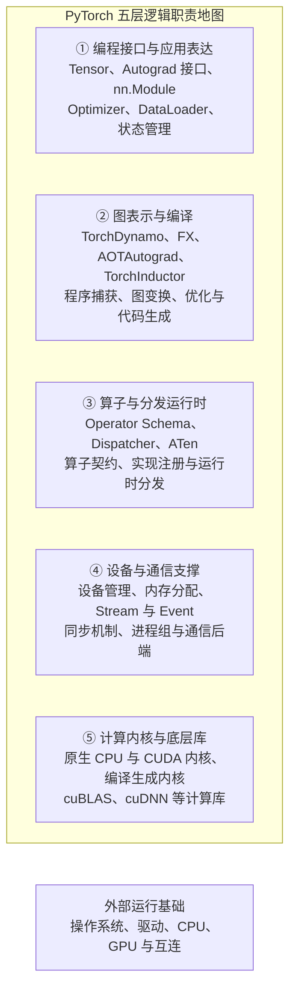
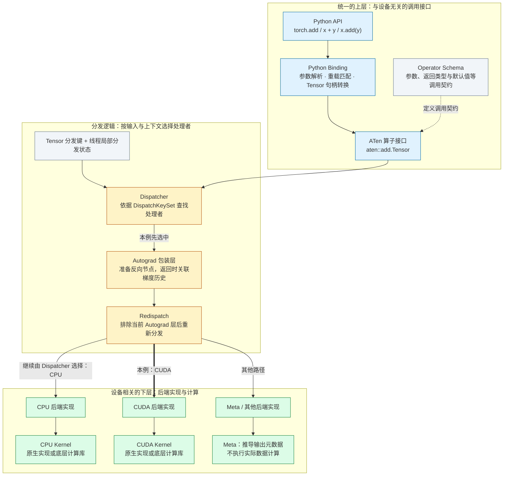
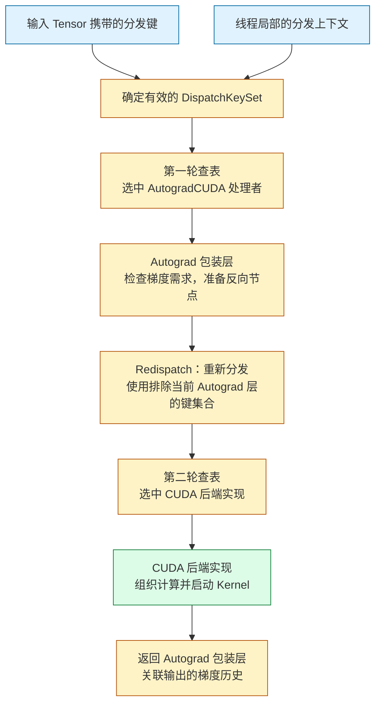
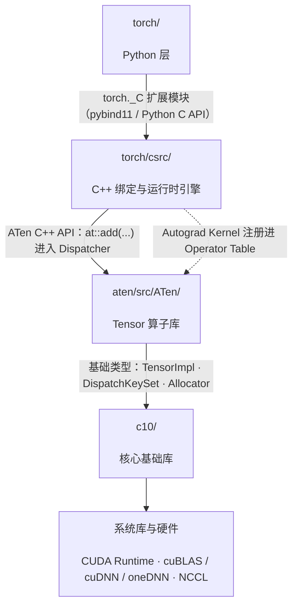
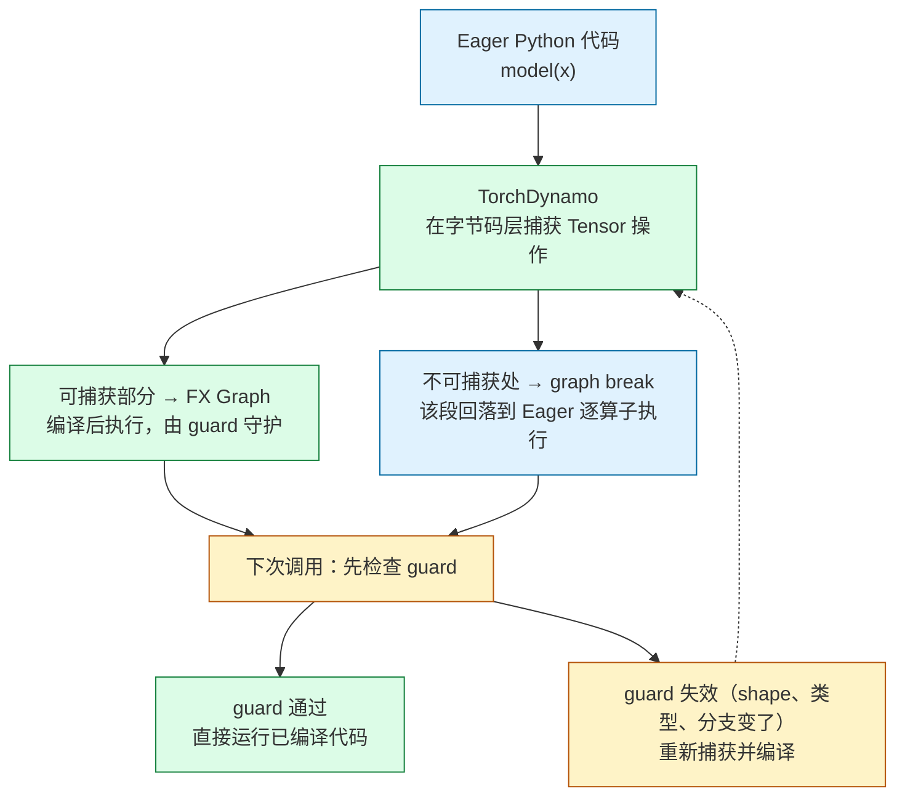

PyTorch 经常被介绍成一个“深度学习框架”，也经常被使用成一个 Python 库：导入 `torch`，创建 Tensor，定义 `nn.Module`，然后训练模型。

这种理解对于开始使用 PyTorch 已经足够，但对于训练平台、推理引擎、算子开发和 AI-Infra 来说还不够。真正需要理解的是：

> **PyTorch 如何把 Python 中表达的张量计算，转化为可以自动求导、跨设备执行、编译优化和分布式协作的运行时系统？[^q0]**

一行看起来很普通的代码：

```python
z = torch.add(x, y)
```

背后可能涉及：

```text
Python API
    ↓
Python Binding
    ↓
Operator Schema
    ↓
Dispatcher
    ↓
ATen Operator
    ↓
CPU / CUDA / Meta Kernel
    ↓
底层数学库与硬件
```

如果这条链路只停留在“PyTorch 会自动处理”，那么遇到下面的问题时就只能依赖试错：

- 为什么同一个算子既能运行在 CPU，也能运行在 CUDA 上？[^q1]
- 为什么某些 Tensor 操作会产生拷贝，另一些操作只是创建 view？[^q2]
- 为什么 `model(x)` 不等于简单调用 `model.forward(x)`？[^q3]
- 为什么模型在 eager mode 下运行正常，`torch.compile()` 后却出现 graph break？[^q4]
- 为什么 GPU 利用率很低，却找不到明显的 Python 瓶颈？[^q5]
- 为什么增加 GPU 数量后，训练速度没有线性提升？[^q6]
- 为什么一个看似简单的 C++ 扩展会遇到 ABI、stride、dtype 或生命周期问题？[^q7]

## 一、总览：一张全局地图

### 1. 本文的定位

本文是《PyTorch 深度实践：从 Tensor 到深度学习运行时》的第一篇。它只负责建立全局地图，不深入某一个模块的全部实现：先回答 PyTorch 是什么、不是什么，把它与其他框架放在一起比较，并按架构演进梳理它为什么长成今天的样子；然后用三张地图组织全文的主体；最后给出 PyTorch 工程中最重要的四个边界。后续文章会沿着这张地图，逐步展开 Tensor、Autograd、Module、Dispatcher、编译器、性能和分布式运行时。

### 2. 三张地图

本文的主体是三张地图，从三个视角组织：第一张按**职责**说明系统由哪些层组成，第二张说明一次算子调用如何**动态**穿过这些层，第三张按**源码**说明这些东西在仓库里住在哪个目录、哪个库。前两张是本系列后续篇章的推进顺序，第三张是读源码时的坐标。

### 3. 本文的章节安排

| 章 | 主题 | 内容 |
|---|---|---|
| 二 | PyTorch 到底是什么？ | 是什么、不是什么，几组需要分开的概念 |
| 三 | PyTorch 与其他深度学习框架 | Eager-first、Compiler-ready 的取舍与代价 |
| 四 | PyTorch 的架构演进 | 从动态图到编译执行的五个阶段 |
| 五 | 第一张地图：静态视角 | 六个职责层各负责什么 |
| 六 | 第二张地图：动态视角 | 一次 `torch.add` 如何穿过六个步骤 |
| 七 | 第三张地图：代码视角 | 源码目录与库的四层分层、与系列篇章的对照 |
| 八 | PyTorch 工程中最重要的几个边界 | Python/C++、通用/后端、灵活/可分析、可移植/特化 |
| 九 | 本文小结 |  |
| 十 | 自测 | 5 道题 |

Table: 本文的章节安排

## 二、PyTorch 到底是什么？

### 1. PyTorch 是什么？

PyTorch 是一个面向 Tensor 计算和深度学习的开源计算框架。

从用户角度看，它提供了表达模型、执行张量运算、自动计算梯度和更新参数的编程接口；从实现角度看，它包含 Python 层逻辑、C++ 运行时、算子库、自动求导系统、算子分发机制以及不同设备的后端支持。

因此，PyTorch 既不是只有 Python API 的工具包，也不是单独的 GPU 算子集合，而是一套连接用户模型代码、Tensor 运算与底层设备执行的计算框架。

从使用者角度看，PyTorch 的主要入口是 Python API：

```python
import torch
from torch import nn

device = torch.device("cuda" if torch.cuda.is_available() else "cpu")

x = torch.randn(32, 128, device=device)
layer = nn.Linear(128, 256, device=device)
y = layer(x)
```

这段代码表达了几个关键动作：

- 创建一个形状为 `(32, 128)` 的 Tensor；
- 创建一个输入维度为 128、输出维度为 256 的线性层；
- 将输入和模型参数放到同一个设备上；
- 执行前向计算，得到形状为 `(32, 256)` 的输出。

用户不需要直接管理底层计算库或编写设备 Kernel，但这些工作仍然会由 PyTorch 及其依赖的后端完成。

需要注意，**Python API 是 PyTorch 最主要的用户入口，但 Python 层并不只是简单的包装层**。模型组织、训练流程以及部分编译逻辑都可能由 Python 代码承担；C++ 运行时、算子实现和设备后端则承担 Tensor 管理、算子分发与具体执行等关键职责。

### 2. PyTorch 的基本组成

理解 PyTorch 时，可以按职责把它划分为几个部分：

| 职责范围 | 代表组件 | 主要解决的问题 |
| :--- | :--- | :--- |
| 数据与模型表达 | Tensor、`nn.Module` | 如何表示数据、组织模型、管理参数和状态 |
| 自动求导与参数更新 | Autograd、Optimizer | 如何计算梯度，以及如何根据梯度更新参数 |
| 算子接口与运行时 | Operator Schema、Dispatcher、ATen | 如何定义算子、提供运算接口并选择实现 |
| 设备执行 | 设备后端、底层计算库、Kernel | 如何在具体设备上完成计算 |
| 编译优化 | `torch.compile` 及相关编译组件 | 如何捕获、变换和优化计算 |
| 分布式协作 | `torch.distributed` 及相关组件 | 如何让多个进程和设备协同工作 |
| 自定义扩展 | 自定义算子、C++/CUDA 扩展、后端接入机制 | 如何扩展算子与硬件支持 |

这里的划分是为了帮助理解职责，**不是一张严格的源码目录图，也不是所有程序都会依次经过的调用链**。同一个组件可能参与多个阶段，不同执行模式也可能采用不同路径。

#### 用户编程模型

用户主要通过 Tensor、`nn.Module`、Autograd 和 Optimizer 表达计算与训练过程。

- **Tensor** 表示多维数据及其形状、类型、布局、设备等属性。
- **`nn.Module`** 组织模型层次，并管理参数、缓冲区和子模块。
- **Autograd** 在满足梯度记录条件时建立求导关系，并支持反向计算梯度。
- **Optimizer** 根据参数的梯度和自身维护的状态更新参数。

例如，在前面的代码后继续执行：

```python
optimizer = torch.optim.SGD(layer.parameters(), lr=0.01)

optimizer.zero_grad()
loss = y.square().mean()
loss.backward()
optimizer.step()
```

这里，`loss.backward()` 计算梯度，`optimizer.step()` 更新参数。两者职责不同，反向传播本身并不负责更新模型参数。

虽然输入 `x` 没有设置 `requires_grad=True`，线性层的参数默认需要梯度，因此仍然可以计算参数梯度。只有需要对输入本身求导时，才需要为输入开启梯度记录。

这些训练能力并不是所有 Tensor 运算的必经步骤。单纯的数值计算或不记录梯度的推理过程，可以不构建反向传播图，也不使用 Optimizer。

#### 算子接口与运行时

Tensor 运算背后涉及几个需要区分的概念：

- **Operator Schema** 描述算子的签名，包括参数、返回值以及相关别名和修改信息等约定。
- **Dispatcher** 根据 Tensor 的设备、布局以及当前生效的分发状态等信息，选择相应处理或实现。
- **ATen** 是 PyTorch 的 C++ Tensor 与算子基础库，提供运算接口，并承载大量算子实现。

它们不是三个完全独立、顺序串联的执行阶段。例如，Schema 主要用于定义和注册算子，并不是每次计算都要经过的一层数值处理。

Dispatcher 的职责也不只是判断“走 CPU 还是 CUDA”。自动求导、函数变换等机制同样可能参与分发过程。

#### 设备执行

具体计算最终由设备后端的实现完成。这些实现可能：

- 执行 PyTorch 自身提供的 Kernel；
- 调用 cuBLAS、cuDNN 等底层计算库；
- 组合调用其他算子；
- 在编译模式下执行生成的代码。

因此，**一次 Python 调用、一个 Operator 和一次设备 Kernel 执行之间，并不总是一一对应**。

一个算子可能触发多个 Kernel；多个算子也可能在编译优化后融合为一个 Kernel。

以常见的 eager 执行为例，可以把整体关系概括为：

    用户模型与 Tensor 运算
        ↓
    算子调用与运行时处理
    （按需涉及自动求导等机制）
        ↓
    分发到相应实现
        ↓
    后端实现、底层计算库或其他算子
        ↓
    具体设备上的计算

这是一张理解执行关系的示意图，不代表所有算子的精确调用栈。

#### 编译、分布式与扩展

编译优化、分布式协作和自定义扩展不是设备执行之后的三个固定步骤，而是作用于不同环节的能力。

例如：

- `torch.compile` 可以捕获并优化部分计算区域，通过后端生成或调用更高效的实现；
- 分布式训练可以在模型组织、梯度同步、参数切分和设备通信等环节介入；
- 自定义算子和后端扩展可以接入算子注册、分发、自动求导及设备执行等机制。

因此，理解 PyTorch 时，应同时区分两个问题：

> PyTorch 包含哪些能力？  
> 一次具体计算实际经过了哪些路径？

前者是组成关系，后者是执行关系，两者不能直接画等号。

### 3. PyTorch 不是什么？

#### PyTorch 不只是 Python API

考虑下面的代码：

```python
import torch

x = torch.randn(2, 3, device="cuda")
y = torch.randn(2, 3, device="cuda")
z = x + y
```

`x + y` 看起来只是一次 Python 加法，但对普通 CUDA Tensor 而言，它会进入 PyTorch 的算子调用与分发机制，由相应实现提交设备计算。

CUDA 操作通常相对于 CPU 异步执行：Python 调用返回，不一定意味着 GPU 已经完成计算。同步行为及其对性能测量的影响，需要在分析具体执行路径时进一步讨论。

因此：

- 阅读源码时，不能只关注 Python API 的实现；
- 排查性能问题时，不能只检查 Python 函数是否高效；
- 测量 GPU 执行时间时，不能简单把未经同步处理的 Python 调用耗时当作设备计算耗时。

同时，也不应反过来忽略 Python 层。Python 调度、循环、对象管理和模型组织方式，同样可能影响整体性能。

#### PyTorch 不等于 CUDA

CUDA 是 NVIDIA GPU 的编程平台和软件生态，PyTorch 则是可以使用 CUDA 等平台完成计算的框架。

从硬件支持角度看，PyTorch 可以使用：

- CPU；
- 基于 CUDA 的 NVIDIA GPU；
- 基于 ROCm 的 AMD GPU；
- MPS、XPU 等其他设备后端。

这里的“CUDA 后端”“ROCm 后端”是面向硬件平台的概括，并不意味着它们与 PyTorch 的设备类型名称严格一一对应。例如，ROCm 版本的 PyTorch 通常也使用 `torch.cuda` 接口和 `"cuda"` 设备标识。

此外，PyTorch 还提供 **Meta 设备**。Meta Tensor 不存储实际数据，主要用于在算子支持的范围内推导输出形状、类型等元信息，以及模型构建和程序分析。它不是执行真实数值计算的硬件后端。

即使使用 CUDA，模型组织、自动求导、算子分发和训练流程仍然属于 PyTorch 的职责范围。CUDA 及其相关库提供的是其中一部分底层执行能力，而不是整个框架。

#### PyTorch 不只是神经网络层的集合

`nn.Linear`、`nn.Conv2d` 和 Transformer 相关模块是 PyTorch 的重要组成部分，但 PyTorch 的基础仍然是 Tensor 计算及其相关机制。

`nn.Module` 主要负责组织模型和状态，它本身不是一段固定的设备代码。

一个 Module 可以包含：

- 多个 Tensor 运算；
- 子模块调用；
- Python 控制流；
- 参数、缓冲区和其他状态。

在 eager 模式下，这些运算通常随程序执行逐步发起；在编译模式下，部分计算可以被捕获、重写和融合。因此，同一个 Module 并不必然对应固定数量或固定组合的 Kernel。

### 4. 几组容易混淆的概念

| 概念 | 它是什么 | 它不是什么 |
| :--- | :--- | :--- |
| Tensor | 表示多维数据及其形状、类型、布局、设备等属性的对象；某些特殊 Tensor 不持有实际数据存储 | 不是模型，也不是 Kernel |
| `nn.Module` | 组织模型层次、参数、缓冲区和计算逻辑的对象 | 不是固定的 GPU 指令序列 |
| Autograd Graph | 在常见 eager 反向模式下，由需要记录梯度的前向运算建立、用于反向传播的依赖结构 | 不等于完整的模型程序图，也不等于最终设备执行图 |
| FX Graph | 表示被捕获计算的节点及其依赖关系、用于分析和变换的中间表示 | 不自动包含任意 Python 程序的全部行为，也不等于最终 Kernel |
| Operator | 具有 Schema 和约定语义的操作，可以具有不同实现 | 不等于某个后端上的具体实现 |
| Kernel | 需要结合语境理解：可指注册到分发系统的算子实现，也可指设备上的具体计算程序 | 不一定与一个 Operator 一一对应 |
| CUDA | NVIDIA GPU 的编程平台和软件生态 | 不等于 PyTorch 本身 |

其中，**Kernel 的含义尤其需要结合上下文判断**。

在 Dispatcher 语境中，注册的 Kernel 可以是一个 C++ 函数，这个函数可能继续调用其他算子或底层库；在 GPU 执行语境中，CUDA Kernel 通常指在 GPU 上启动执行的设备程序。

因此，“Dispatcher 选择了一个 Kernel”不一定意味着“GPU 恰好执行了一次 Kernel”。

同样，Autograd Graph 和 FX Graph 也不能混为一谈：

- Autograd Graph 主要服务于梯度计算；
- FX Graph 主要服务于被捕获计算的表示、分析与变换；
- 编译流程可能利用自动求导相关机制生成前向图和反向图，并以 FX 等形式表示，但这些图仍不等同于最终的设备执行计划。

建立这些边界之后，再阅读源码或分析性能，就可以更明确地判断：当前讨论的是用户编程接口、模型组织、算子语义、分发机制、图表示，还是设备上的实际计算。

后续的静态分层图和动态执行路径，将在这些概念边界的基础上进一步展开。

## 三、PyTorch 与其他深度学习框架

框架比较不能简单归结为“谁更好”。更有意义的比较是：它们如何表达计算、如何执行程序，以及如何将计算交给编译器和硬件。

同时，Eager 执行、图表示和编译优化并不是互斥选项。现代框架通常同时具备其中多种能力，差别主要体现在默认体验、程序约束和工具链设计上。

| 框架 | 主要编程抽象 | 典型执行方式 | 理解时的关键区别 |
| :--- | :--- | :--- | :--- |
| PyTorch | Tensor、`nn.Module` 与 Python 程序 | 默认 Eager，可通过 `torch.compile` 编译选定计算区域 | 保留直接的 Python 编程体验，并将编译能力接入现有模型代码 |
| TensorFlow | Tensor、`tf.keras` 层与模型、`tf.function` | Eager 与函数图执行并存，也可结合 XLA 编译 | 通过 `tf.function` 等机制连接直接执行与图执行 |
| JAX | 数组运算、函数与程序变换 | 支持直接执行，通过 `jit` 等变换组织编译执行 | 强调可组合的程序变换，变换中的状态和副作用需要遵循相应约束 |
| MXNet（历史参照） | 符号图与 Gluon 命令式接口 | 支持命令式执行及混合化图执行 | 展示了连接动态图编程体验与符号图执行的一种设计路线 |
| OneFlow | Tensor、模块与全局 Tensor 等分布式抽象 | 支持 Eager 与图执行 | 强调分布式数据表示以及计算和通信的协同 |

Table: 主流深度学习框架的编程模型与执行方式

这张表只概括设计取向，不代表性能或生态排名。实际选型还需要结合模型类型、硬件环境、部署目标和团队经验。

### 1. PyTorch 的取舍：默认 Eager，按需编译

PyTorch 的一个重要特点，是默认采用 Eager 执行：Tensor 运算随 Python 程序运行逐步发起，不要求用户预先构建完整计算图。

这里的“逐步执行”不意味着每次 Python 调用返回时，设备都已经完成计算。GPU 操作通常仍然是异步提交和执行的。

在这一编程体验之上，PyTorch 提供了编译能力。用户可以通过 `torch.compile` 对模型或函数中的计算区域进行捕获和优化，而不必一开始就把整个程序写成显式的静态图。

需要区分三个相互关联、但并不等价的概念：

- **Eager 执行**：描述运算如何随程序运行被发起。
- **Autograd**：在满足梯度记录条件时记录求导依赖，并计算梯度。
- **编执行**：捕获和变换计算，通过后端生成或调用优化后的实现。

它们不是“先 Eager、再 Autograd、最后 Compiler”的固定流水线。自动求导可以与 Eager 或编译执行结合，编译也可以用于不需要梯度的推理计算。

### 2. 这种设计带来的优势与成本

默认 Eager 的编程体验具有几个直接优势：

- Python 控制流可以直接参与计算；
- 在 Eager 模式下，可以使用熟悉的 Python 调试工具检查中间状态；
- 模型结构与训练逻辑便于快速修改；
- 同一套模型表达可以作为进一步编译优化的起点；
- 性能优化可以逐步开展，必要时再引入自定义算子和设备实现。

但这些优势并不意味着任意 Python 程序都能无修改地获得编译收益。

相应的成本和约束包括：

- 对细粒度运算，Python 调度与算子分发开销可能比较明显；
- 大量短小的 GPU Kernel 可能受到启动开销影响，频繁同步还会进一步增加成本；
- 数据相关控制流、外部副作用或编译器不支持的操作，可能导致图中断或限制优化范围；
- 输入形状、类型等条件变化，可能触发新的编译，具体取决于编译配置与动态形状支持；
- 编译本身需要时间，短任务或变化频繁的工作负载不一定能摊销这部分成本。

这些问题并非 PyTorch 独有，但它们是理解其执行机制和性能表现时需要重点关注的因素。

### 3. Eager 与编译执行不是二选一

PyTorch 的方向不是简单地从“动态图”切换到“静态图”，而是让直接执行与编译优化在同一套编程模型中协作。

| 执行方式 | 主要价值 | 需要关注的问题 |
| :--- | :--- | :--- |
| Eager 执行 | 行为直观，便于探索、调试和动态控制 | Python 调度、算子分发与细粒度执行开销 |
| 编译执行 | 为融合、减少中间结果和降低调度开销提供机会 | 捕获范围、编译成本、图中断和重新编译 |

同一个程序可以只编译其中一部分，其余部分继续采用 Eager 执行。编译后的区域也不一定要求所有形状固定不变，具体能力和约束取决于编译后端及程序行为。

因此，理解 PyTorch 与其他框架的差异，重点不是给它贴上“动态图框架”的标签，而是观察它如何连接 **Python 程序、Tensor 运算、自动求导、编译优化和设备执行**。

## 四、PyTorch 的架构演进

这里的“阶段”是为了帮助理解架构演进而做的归纳，不是 PyTorch 官方发布的固定分期。版本号和日期采用公开发布节点作为参照；不同能力往往跨越多个版本逐步成熟，不能简单归因于某一个版本。

整体来看，PyTorch 的架构演进，是在保持**动态编程体验**的同时，逐步增强**生产部署、底层运行时和编译优化能力**的过程。这并不是后一种架构替代前一种架构，而是在 Eager-first 的基础上不断叠加新的执行路径。

| 阶段 | 代表版本与时间 | 主要变化 | 对今天架构的影响 |
| :--- | :--- | :--- | :--- |
| 动态图与研究友好 | 0.1.x，2016 年 9 月起公开 alpha，2017 年初持续迭代 | 以 Python 为中心的 Tensor、动态图和自动求导体验 | 奠定 Eager-first 的编程模型 |
| API 稳定与生产化 | 0.4，2018 年；1.0，2018 年 12 月 | Tensor/Variable 接口整合，API 逐步稳定，TorchScript 和生产能力逐步引入 | 从研究工具走向通用深度学习平台 |
| C++ 运行时与分布式成熟 | 1.x，2019—2022 年 | ATen、C++ Tensor API、Dispatcher、分布式训练和自定义扩展持续完善 | 持续完善 Python API 之下的运行时与算子系统 |
| 图表示与编译基础设施 | 1.8—1.13，2021—2022 年 | FX、functorch，以及 TorchDynamo、AOTAutograd、TorchInductor 等相关项目逐步发展 | 为 Eager 程序提供图捕获、变换和优化路径 |
| 编译执行与大模型运行时 | 2.0，2023 年 3 月 15 日及之后 | `torch.compile` 成为主要编译入口，动态 Shape、分布式和 Transformer 优化持续增强 | 保留 Eager 开发方式，同时提供编译优化能力 |

Table：PyTorch 架构演进的阶段

### 1. 阶段一：动态图与研究友好

PyTorch 0.1.x 于 2016 年 9 月起以 alpha 版本公开发布，并在 2017 年初持续迭代。早期 PyTorch 的核心体验是：**直接用 Python 描述计算，并在执行过程中构建自动求导图。**

用今天的 API 写法，可以概括为：

```python
x = torch.randn(10, requires_grad=True)
y = x * 2
z = y.relu()
loss = z.sum()
loss.backward()
```

在 Eager Mode 下，代码执行到对应操作时，就会触发相应计算，而不需要先构建完整计算图再统一执行。Python 的 `if`、`for` 和函数调用可以直接参与模型逻辑，调试方式也更接近普通 Python 程序。

这个 **Eager-first** 的设计，成为 PyTorch 后续架构一直保留的用户体验基础。后来的图执行和编译能力，主要是在这一基础上增加优化路径，而不是要求所有用户改用另一套模型编程方式。

### 2. 阶段二：API 稳定与生产化

PyTorch 0.4 在 2018 年带来了重要的 Tensor/Variable 接口整合，使 Tensor 本身就能承载自动求导所需的信息。随后 PyTorch 1.0 于 2018 年 12 月发布，API 稳定性、生产使用和图执行能力成为重要方向。

这一阶段的关键不是“动态图被静态图取代”，而是开始提供从 Eager 模型走向更受约束执行环境的路径，例如 TorchScript。PyTorch 由此同时面对两类需求：

    研究与开发 → 灵活、即时、容易调试
    生产与部署 → 可保存、可分析、可优化

TorchScript 通过脚本化或追踪，将模型转换为可序列化的程序表示，并支持在不依赖 Python 解释器的环境中执行。

这让 PyTorch 开始连接研究与部署，但也带来了新的约束：脚本化需要遵守受支持的语言规则，追踪则难以完整表达依赖输入数据的动态控制流。**如何降低部署与优化对原有编程方式的影响**，也成为后续架构继续探索的问题。

### 3. 阶段三：C++ 运行时、算子系统与分布式成熟

在 1.x 系列中，PyTorch 持续强化：

- ATen：提供底层 Tensor 运算及相关基础设施；
- C++ Tensor API：支持在 C++ 中直接操作 Tensor；
- Dispatcher：根据设备、自动求导等调度信息选择算子实现；
- CPU/CUDA Kernel：承载具体计算；
- C++ 前端：支持在 C++ 中构建和运行模型；
- 分布式通信：支持多进程、多 GPU 和多机协同；
- 自定义算子和扩展机制：允许接入新的计算实现。

这些能力并非都在 1.x 才出现，而是在这一时期持续完善，共同带来了一个重要变化：

> PyTorch 不再只是一个 Python 深度学习库，而是逐渐成为具有完整运行时和算子系统的深度学习平台。

Python 仍然是主要入口，但大量真正影响性能和设备行为的逻辑，由 C++、CUDA 和底层库承担。

这种分层让用户接口、算子调度和设备实现能够分别演进，也为自动求导、混合精度、自定义算子及不同硬件后端的组合提供了基础。

### 4. 阶段四：从动态图走向编译执行

Eager Mode 灵活，但也存在明显成本：

- Python 逐算子调用和调度会产生开销；
- 大量细粒度操作可能产生很多 Kernel Launch；
- 逐算子执行难以直接利用跨算子的融合与整体优化；
- 动态控制流和数据依赖会增加图捕获与优化的难度。

因此，在 1.8—1.13 对应的时期，PyTorch 及相关项目逐步发展出多种图表示和编译基础设施：

- **FX**：提供图捕获、图表示和图变换工具；
- **functorch**：探索可组合的自动微分、向量化等函数变换；
- **TorchDynamo**：通过 Python 字节码层面的机制捕获可编译计算区域；
- **AOTAutograd**：为编译流程生成前向与反向计算图；
- **TorchInductor**：对计算图进行优化并生成后端代码；
- **Triton**：为 GPU Kernel 编写与代码生成提供支持，是 TorchInductor 在 GPU 上的重要技术基础。

这些组件的来源、成熟时间和集成进度并不完全一致，也不是在上述版本中一次性正式交付。它们共同形成了后来 PyTorch 2.0 编译路径的重要基础。

这一阶段的变化，可以概括为：

> **不只优化单个算子的实现，还要让编译器看到一段计算，从而进行跨算子的整体优化。**

### 5. 阶段五：编译执行与大模型运行时

PyTorch 2.0 于 2023 年 3 月 15 日发布，其主要方向是在保持 Eager Mode 开发体验的同时，通过 `torch.compile` 捕获可编译的计算区域，并交给编译器优化。

在默认的典型训练编译路径中，TorchDynamo 负责图捕获，AOTAutograd 参与前向与反向图的生成，TorchInductor 则负责后续优化与代码生成。

这里的“编译执行”不意味着整个 Python 程序都必须被转换成一张静态图。在默认允许图中断的模式下，编译区域可以与 Eager 执行交替存在；当输入形状或其他运行条件发生变化时，也可能触发重新编译。

因此，`torch.compile` 提供的是一条**与 Eager 协同的优化路径**，而不是对 Eager 的全面替代。实际收益仍取决于模型结构、图中断情况、输入变化和硬件环境。

与此同时，现代 PyTorch 还需要继续处理：

- 多 GPU 训练；
- 参数、梯度和优化器状态分片；
- 混合精度；
- 动态 Shape；
- Meta Tensor 和 Fake Tensor；
- CPU、CUDA、ROCm 及其他后端；
- 大模型检查点；
- 量化和推理优化。

这些能力并不都属于编译器本身，但需要与算子系统、自动求导、设备后端和编译路径协同工作。它们看起来分散，实际都在回答同一个问题：

> **如何让同一套模型和算子抽象，在不同设备、不同规模和不同执行模式下保持可组合？**

回顾这一过程，PyTorch 始终保留以 Python 和 Eager 为中心的开发入口，同时逐步完善底层运行时，并在其上增加图捕获与编译优化能力。它的架构演进，本质上是让灵活的模型表达与高效的计算执行能够在同一套框架中协同发展。

## 五、第一张地图：静态视角——PyTorch 的逻辑分层

这一章我们先从**静态视角**出发，看看“PyTorch 由哪些职责层组成、每一层负责什么”。

从上到下，可以把 PyTorch 粗略分为以下五层。

- 这里的“层”用于组织**系统组成与主要职责**，不表示一次调用必须依次经过这些层次，也不与源码目录或动态链接库一一对应。同一子系统可能跨越多个层次，各层之间也可以存在交叉协作。
- 不绘制调用箭头，以避免将逻辑分层误解为执行流水线。



从逻辑职责的角度，可以将 PyTorch 的主要组成归纳为五个层次：

| 层 | 核心组件 | 回答的问题 |
| :--- | :--- | :--- |
| ① 编程接口与应用表达 | Tensor、Autograd 接口、`nn.Module` / Parameter / Buffer、Optimizer、Dataset / DataLoader、`state_dict`；用户基于这些抽象组织模型、训练与推理逻辑 | 用户用什么抽象表达计算、管理状态并组织任务 |
| ② 图表示与编译 | TorchDynamo、FX Graph、AOTAutograd、TorchInductor、Guard / Graph Break / 编译缓存 | 程序中的计算区域如何被捕获、表示、变换并编译优化 |
| ③ 算子与分发运行时 | Operator Schema、Dispatcher / DispatchKeySet、ATen 算子体系、后端实现注册、Autograd 包装与 Composite / Meta 实现 | 算子的接口契约是什么，在当前上下文中如何选择处理者 |
| ④ 设备与通信支撑 | 设备运行时、内存分配器、Stream / Event / 同步、H2D / D2H 数据迁移、进程组与通信后端（NCCL / Gloo） | 设备资源和数据如何管理，计算如何同步，多设备如何协同 |
| ⑤ 计算内核与底层库 | 原生 CPU / CUDA Kernel、编译生成的内核（如 Triton Kernel）、cuBLAS / cuDNN 等计算库 | 具体的数值计算由哪些内核或计算库完成 |

Table：PyTorch 的逻辑分层

这些层次表示**主要职责区域，而非固定的调用顺序或严格的依赖关系**，同一子系统可能涉及多个层次。用户代码是框架接口的使用方，不属于框架内部实现；外部计算库为 PyTorch 提供计算支撑，而操作系统、驱动与硬件则是这些软件组件运行所依托的基础。

图中同时标出了两个边界：

- 用户模型与训练代码用于展示框架接口如何被使用，并不属于 PyTorch 框架内部实现。
- 底层计算库可以由外部提供；操作系统、驱动与硬件则是框架运行所依托的基础。

### 1. 第一层：编程接口与应用表达

这一层包含 PyTorch 面向用户提供的主要编程抽象，以及用户利用这些抽象组织任务的方式。

它回答的是：

> 用户通过哪些接口表达数据、模型、求导、参数更新和数据加载？

#### 框架提供的编程抽象

- **Tensor 与运算接口**：表示数据及其形状、步幅、数据类型、设备等属性，并提供张量操作。
- **Autograd 接口**：通过 `requires_grad`、`backward()`、`torch.autograd.grad()` 等表达自动求导需求。
- **`nn.Module`**：组织模型结构、参数、缓冲区与子模块。
- **Optimizer**：定义参数更新规则，并管理优化器状态。
- **Dataset 与 DataLoader**：组织数据访问、批处理与加载。
- **状态与序列化接口**：通过 `state_dict()`、`torch.save()`、`torch.load()` 等管理状态保存与恢复。

#### 用户基于这些抽象表达任务

模型定义与训练循环并不是框架之外另一套完全独立的概念，而是上述抽象的具体使用方式。例如：

```python
import torch
from torch import nn

model = nn.Linear(8, 1)
optimizer = torch.optim.SGD(model.parameters(), lr=0.01)

x = torch.randn(16, 8)
target = torch.randn(16, 1)

optimizer.zero_grad()
prediction = model(x)
loss = nn.functional.mse_loss(prediction, target)
loss.backward()
optimizer.step()
```

这段代码表达了模型结构、前向计算、损失目标、反向传播与参数更新。用户主要围绕任务编程，而不必直接处理算子注册、设备内核或内存分配。

将框架接口与应用表达放在同一层讨论，是为了说明二者之间的关系，而不是把用户代码视为框架组件。

同时，本层归纳的是这些功能的**用户接口与编程抽象**，不是它们的全部内部实现。例如，Autograd 的求导引擎、反向节点与分发包装机制属于框架内部的运行时设施，不能仅因其用户接口位于第一层，就将整个 Autograd 子系统限定在这一层。

### 2. 第二层：图表示与编译

这一层包含将程序中的计算表示为图，并对其进行分析、变换和优化的基础设施。

它回答的是：

> 框架通过哪些组件理解和优化一段计算，而不只是逐个处理算子？

PyTorch 2.x 中的典型组件包括：

| 组件 | 主要职责 |
| :--- | :--- |
| TorchDynamo | 分析 Python 字节码，在可捕获区域中提取计算图，并建立相关守卫条件 |
| FX | 提供图表示与图操作设施，支持程序分析、变换和重写 |
| AOTAutograd | 在相应编译路径中捕获、组织前向与反向计算，为后续优化提供基础 |
| TorchInductor | 对计算进行进一步优化，生成或组织面向目标后端的执行代码 |

这些组件共同提供了超出单个算子范围的优化能力，例如算子融合、减少中间结果读写和生成专用计算内核。

但它们不是所有调用都必须依次经过的四个阶段：

- FX 可以独立用于图分析与变换。
- `torch.compile` 可以选择不同的编译后端。
- 不同程序、配置和后端会形成不同的编译路径。
- 未被编译的程序仍可以使用 Eager 执行。

编译也不意味着完全脱离 PyTorch 运行时。编译产物既可能使用生成的内核，也可能调用现有算子实现或底层计算库，并继续依赖内存分配、设备管理与同步设施。

因此，**图表示与编译是系统中的一组能力，而不是全部计算的必经入口。**

### 3. 第三层：算子与分发运行时

这一层包含算子定义、实现注册和运行时分发所需的核心机制。

它回答的是：

> 算子如何形成统一的接口契约，又如何关联到适合当前输入与上下文的处理者？

主要组成包括：

| 组成部分 | 主要职责 |
| :--- | :--- |
| Operator Schema | 定义算子名称、重载、参数、返回值，以及适用的别名与修改标注 |
| Dispatcher | 根据有效的分发键集合与相关上下文选择已注册的处理者 |
| ATen 算子体系 | 提供核心 Tensor 运算的统一接口与实现组织 |
| 注册与包装机制 | 将后端实现、自动求导包装、组合实现及扩展实现等纳入算子系统 |

以 `torch.add` 为例，本层关注的是它在算子系统中的组成要素：加法算子的接口如何定义、重载与变体如何区分、有哪些实现，以及这些实现通过什么机制被注册和选择。

这里需要区分三个概念：

- **Schema 是接口契约**，不是独立的执行中转站。
- **Dispatcher 是实现选择机制**，不是具体的数值计算代码。
- **ATen 是核心 Tensor 与算子体系**，并非单纯位于 Dispatcher 之后的某一个执行步骤。

本层也包含不执行真实数据计算的算子处理能力。例如，Meta Tensor 使用 Meta 设备，不持有真实数据；相应的 Meta 实现主要推导输出的形状、步幅和数据类型等元信息。它应当在算子与分发体系中理解，而不应被当作真实硬件计算设备。

此外，ATen 同时涉及算子接口和原生实现。本层强调其算子体系与运行时组织职责，其中承担实际计算的代码则与第五层对应。这也说明，逻辑分层并不要求一个子系统只能出现在一个责任领域中。

### 4. 第四层：设备与通信支撑

这一层包含计算所需的资源管理、执行协调和通信设施。

它回答的是：

> Tensor 存储、设备任务和跨进程通信，依靠哪些基础设施得到管理？

主要职责包括：

- **设备管理**：维护设备上下文，提供设备查询、切换与相关运行时能力。
- **内存管理**：为 Tensor 存储和计算临时空间提供分配、缓存与释放机制。
- **Stream 与 Event**：在支持这些机制的后端中组织任务顺序，并表达执行依赖。
- **同步机制**：协调主机与设备、不同执行流之间的必要等待。
- **进程组与通信后端**：通过 NCCL、Gloo 等设施支持集合通信和点对点通信。

这些设施不是算子调用结束前才进入的“最后一站”，而是贯穿计算过程的支撑条件。Tensor 存储依赖内存管理，设备计算依赖执行与同步设施，分布式任务依赖通信基础设施。

第三层与第四层的区别在于：

> 算子与分发运行时侧重“算子如何定义、实现如何组织与选择”；设备与通信支撑侧重“计算所需的资源与执行环境如何管理”。

同样，分布式能力也跨越多个职责区域：用户使用的训练封装属于上层编程抽象，进程组与通信后端属于本层，而具体通信实现还可能依赖外部库、驱动和互连硬件。

### 5. 第五层：计算内核与底层库

这一层包含真正承担数值计算的实现。

它回答的是：

> 张量运算最终由哪些计算代码完成？

主要组成包括：

- PyTorch 原生的 CPU、CUDA 等后端计算内核；
- 编译系统生成的计算内核，例如基于 Triton 生成的内核；
- cuBLAS、cuDNN 等外部计算库；
- 其他设备后端或扩展提供的计算实现。

不同运算可以采用不同的实现方式：

| 运算类型 | 可能采用的实现 |
| :--- | :--- |
| 逐元素加法 | 原生逐元素内核，或包含该运算的编译融合内核 |
| 矩阵乘法 | cuBLAS、cuBLASLt 或其他适用实现 |
| 卷积 | cuDNN 或其他原生、专用实现 |
| 多个算子的融合计算 | 编译系统生成的融合内核 |

这些对应关系不是固定的一一映射。实际选择还取决于设备、数据类型、形状、布局、编译设置及框架版本等因素。

这里还需要区分**计算软件**与**运行基础**：

- Kernel 和计算库是执行运算的软件实现。
- CPU、GPU、驱动与互连是这些实现运行所依托的硬件和系统基础。

因此，底层库可以作为 PyTorch 计算体系所使用的组成部分来讨论，但不意味着这些库都由 PyTorch 自身实现或维护。

### 6. 小结：先识别组成，再理解协作

这张静态逻辑地图回答了“PyTorch 由什么组成，以及各部分负责什么”：

| 逻辑层次 | 核心关注点 |
| :--- | :--- |
| 编程接口与应用表达 | 用户通过哪些抽象表达任务 |
| 图表示与编译 | 程序如何被表示、分析和优化 |
| 算子与分发运行时 | 算子契约与实现如何组织 |
| 设备与通信支撑 | 资源、执行环境与通信如何管理 |
| 计算内核与底层库 | 数值计算由哪些实现承担 |

使用这张地图时，需要记住：**逻辑分层不等于执行顺序，也不等于源码分层。** 一个功能可以跨越多个责任领域，一个源码模块也可能承担多种职责。

在此基础上，下一章将切换到动态视角，以一次 `torch.add(x, y)` 调用为例，说明这些部分如何在执行过程中协作；第七章则进一步介绍它们在源码中的组织方式。

## 六、第二张地图：动态视角——一次算子调用发生了什么？

上面的静态地图回答了“系统由什么组成，各部分负责什么”，但还没有回答“代码如何在系统中流动”。下面我们切换到**动态视角**，以一次 `torch.add(x, y)` 为例，观察这些组成部分如何协作完成计算。

本章选取一条典型主线：**在 Eager 模式和梯度模式开启的情况下，对两个 `requires_grad=True` 的普通浮点 CUDA Tensor 执行加法。**

整个过程可以概括为六步：

**发起调用 → 跨越语言边界 → 进入算子接口 → 分发与梯度处理 → 后端计算 → 返回结果。**



这张图保留了算子调用的三个区域：上层提供统一的调用接口，中间由 Dispatcher 根据输入与上下文选择处理者，下层由具体后端组织计算或推导元数据。粗箭头标出了本章的 CUDA 主线；CPU、Meta 等分支用于展示不同后端的去向。计算提交后，调用沿调用链返回，Autograd 包装层关联输出的梯度历史，最终在 Python 层得到结果 Tensor。对于 CUDA，调用返回通常不意味着 GPU 计算已经完成。

### 1. 第一步：Python API

用户通过 Python 接口表达计算意图：

```python
z = torch.add(x, y)
```

相同的加法也可以写成运算符或 Tensor 方法：

```python
z = x + y
z = x.add(y)
```

对于本例中的普通 Tensor，这些写法最终会进入对应的 ATen 加法算子。

这一层负责提供易于使用的编程接口，让用户表达“要做什么”，而不必直接处理后端选择、输出分配或设备内核启动。

### 2. 第二步：Python Binding

调用随后跨越 Python 与 C++ 的边界。绑定层主要完成三项工作：

- **参数解析**：提取输入对象，处理关键字参数和默认参数。
- **重载匹配**：根据参数类型匹配相应的算子重载，例如区分 Tensor 相加与 Tensor 加标量。
- **对象转换**：从 Python Tensor 对象中取得 C++ 侧可操作的 Tensor 句柄。

可以将这一过程理解为：

```text
Python 调用与参数
        ↓
参数解析和重载匹配
        ↓
C++ Tensor 句柄与其他参数
```

这里通常不涉及 Tensor 数据复制。绑定层取得的是关联底层 Tensor 的句柄，不需要将 GPU 数据搬到 CPU 后再继续计算。

### 3. 第三步：ATen 算子接口与 Schema

参数完成解析后，调用进入 ATen 算子接口。本例对应的是 `aten::add.Tensor`，其 Schema 可以表示为：

```text
aten::add.Tensor(Tensor self, Tensor other, *, Scalar alpha=1) -> Tensor
```

这个契约规定：

- 接受两个 Tensor 参数；
- `alpha` 是仅限关键字传入的标量参数，默认值为 1；
- 返回一个 Tensor。

对应的计算语义是：

```text
结果 = self + alpha × other
```

**ATen 算子接口提供统一入口，Schema 描述入口的调用契约。** 广播、类型提升等计算规则由算子的语义和实现落实，并不是全部编码在 Schema 签名中。

因此，这一步中的执行入口是算子接口，Schema 是接口遵循的规则，而一个独立的执行站点。接口随后通过 Dispatcher 寻找当前上下文中的处理者。

### 4. 第四步：Dispatcher 与 Autograd

Dispatcher 不直接完成加法，而是依据 Tensor 携带的分发键和线程局部的分发上下文，为当前算子选择已注册的处理者。

在本章选定的主线上，可以用**两轮查表**理解 Autograd 包装与 CUDA 后端之间的协作。



**第一轮查表：选中 Autograd 处理者。**

Dispatcher 根据有效的 `DispatchKeySet`，按照分发键优先级查找 `aten::add.Tensor` 的分发表。在这条主线上，先选中 `AutogradCUDA` 对应的 Autograd 包装层。

包装层检查本次操作是否需要记录梯度。本例开启了梯度模式，且输入需要梯度，因此它会准备加法对应的反向节点，并建立与输入梯度历史之间的连接关系。

**第二轮查表：重新分发到 CUDA 实现。**

Autograd 包装层随后发起 **Redispatch（重新分发）**，使用排除了当前 Autograd 层的分发键集合，继续寻找前向计算的实现。

这次查表选中 CUDA 后端实现，进入具体的计算准备和内核启动过程。后端调用返回后，Autograd 包装层再将输出与反向节点关联起来。

两轮查表的作用可以概括为：

- **第一轮选中功能包装层**：处理自动求导相关职责。
- **第二轮选中计算后端**：将前向计算交给 CUDA 实现。

### 5. 第五步：后端实现与 Kernel

进入 CUDA 后端实现后，框架开始组织具体计算：

- 检查输入是否满足算子要求；
- 根据广播和类型提升规则确定输出的形状、数据类型；
- 准备输出存储；
- 组织输入、输出的访问方式；
- 选择并启动执行加法的 CUDA Kernel。

对于本例中的逐元素加法，可以把后端实现理解为**计算的组织者**，把设备 Kernel 理解为**执行数值计算的代码**。

```text
CUDA 后端实现
        ↓
准备输出与数据访问方式
        ↓
向当前 CUDA Stream 提交 Kernel
        ↓
GPU 执行逐元素加法
```

不同算子会采用不同的计算实现。例如，矩阵乘法可能调用 cuBLAS，卷积可能调用 cuDNN，而本例的加法通常由原生逐元素 CUDA Kernel 完成。

### 6. 第六步：结果返回

后端调用完成主机侧的提交工作后，结果沿调用链返回：

1. Autograd 包装层将输出与反向节点关联；
2. 调用经过 C++ 接口和 Python 绑定层返回；
3. 用户获得结果 Tensor `z`。

此时，`z` 已包含相应的形状、数据类型、设备和存储信息，也关联了后续求导所需的 `grad_fn`。

但需要区分两件事：

**Python 调用返回，不等于 GPU 计算已经完成。**

CUDA 计算通常是异步提交的。Python 得到 `z` 时，加法 Kernel 可能仍在排队或执行。同一 Stream 中后续提交的计算会按顺序执行，因此程序可以继续提交依赖 `z` 的设备操作，而不必在每次算子调用后等待 GPU。

当主机需要读取计算结果，或程序显式要求同步时，才需要等待相关设备工作完成。例如，对 CUDA 标量 Tensor 调用 `.item()`，或调用 `torch.cuda.synchronize()`。

### 7. 这是一条概念路径

以上六步展示的是本章选定场景中的典型协作过程，不是所有算子都必须遵循的固定调用栈。

其中，**“两轮查表”概括的是本例中 Autograd 包装与 CUDA 后端之间的分发关系**，并不意味着每次算子调用都恰好查表两次。其他功能包装、Tensor 类型或算子实现可能增加处理环节，改变具体路径。

常见的变化包括：

- **梯度模式不同**：`no_grad()` 不记录新的反向图，但不一定绕过 Autograd 包装层；`inference_mode()` 还会进一步改变相关分发和运行时行为。
- **设备或 Tensor 类型不同**：CPU Tensor 进入 CPU 实现；Meta Tensor 只进行元数据推导，不执行实际数据计算。
- **算子实现不同**：Composite 实现可能通过调用其他算子完成计算，产生新的分发过程。
- **扩展机制介入**：Tensor 子类、自定义分发模式或后端可能拦截调用，进入其他处理分支。
- **编译模式不同**：编译器可能捕获并融合多个算子，减少逐算子的 Python 调用和运行时分发。
- **跨 Stream 使用结果**：不同 Stream 之间的数据依赖需要适当的同步，不能仅依靠 Python 代码的先后顺序。

此外，ATen 是一个算子体系，而不是 Dispatcher 之后的单一中转层。它既提供第三步中的算子接口，也包含第五步中的大量后端实现。因此，本章按照调用中的职责展开，而不把“ATen Operator”另外列为后端计算之前的一站。

理解本章时，首先记住主线即可：**用户发起调用，绑定层连接语言边界，算子接口提供契约，Dispatcher 选择处理者，后端组织计算，结果携带必要的状态返回。**

这些接口、注册机制和实现代码在源码中如何组织，正是第七章要介绍的第三张地图。

## 七、第三张地图：代码视角——源码目录与库的分层

前两张地图按职责划分，不对应源码目录。真正打开 `pytorch/` 仓库，看到的是另一种分层——按**库**划分，自上而下四层，每一层只依赖它下面的层：



| 层 | 源码位置 | 核心组件 | 向上提供 |
|---|---|---|---|
| Python 层 | `torch/` | `nn`、`optim`、`utils.data`、`distributed`（Python 侧）、`fx`、`_dynamo`、`_functorch`、`_inductor`、`torch.library`、`torch.testing` | 用户 API |
| C++ 绑定与运行时引擎 | `torch/csrc/` | Python 绑定、Autograd 引擎（`autograd/`）、c10d（`distributed/`）、Profiler、TorchScript（`jit/`，维护模式）、Dynamo 帧求值 hook、AOTInductor 运行时 | `torch._C` 扩展模块 |
| Tensor 算子库 | `aten/src/ATen/` | Dispatcher 与 Operator Table（`core/dispatch/`）、`native_functions.yaml`、CPU / CUDA Kernel（`native/`）、TensorIterator；粘合代码由 `torchgen/` 生成 | `at::Tensor` 与 ATen C++ API |
| 核心基础库 | `c10/` | TensorImpl、StorageImpl、Device / DeviceGuard / Stream、Allocator / CUDACachingAllocator、DispatchKey / DispatchKeySet、ScalarType / Layout | 所有层共用的基础类型 |
| 系统库与硬件 | — | CUDA Runtime、cuBLAS / cuDNN / CUTLASS（被 ATen Kernel 调用）、oneDNN / OpenMP、NCCL / Gloo（被 c10d 调用）、Triton（编译器生成的 Kernel） | 设备能力 |

Table: PyTorch 源码目录与库的分层

实线是一次算子调用自上而下的依赖方向，箭头上是层与层之间的接口。虚线是一条反向关系：Autograd 引擎位于 `torch/csrc`，却把自己的 Kernel 注册进 ATen 的 Operator Table，所以 §5 的调用路径会在这两层之间往返一次。厂商库和 NCCL 分别被 ATen 的 Kernel 和 c10d 直接调用，编译栈则绕过 ATen 的 Kernel 自己生成 Triton 代码（第七篇）。

编译之后，这四层对应几个动态库：`libc10`（c10）、`libtorch_cpu` 与 `libtorch_cuda`（ATen 和 `torch/csrc` 中与 Python 无关的部分：Autograd 引擎、c10d 等）、`libtorch_python`（Python 绑定）。`import torch` 时它们被依次加载；第六篇的 C++ 扩展链接的正是这些库，ABI 问题也由此而来。

下面自上而下逐层说明每一层放什么、向上提供什么。

### 1. `torch/`：Python 层

用户直接接触的一切都在这里：`torch.nn`、`torch.optim`、`torch.utils.data`、`torch.distributed` 的 Python 侧，以及 `torch.Tensor` 的大部分 Python 方法。值得注意的是**编译栈的主体也在这一层**：Dynamo（`torch/_dynamo`）、AOTAutograd（`torch/_functorch`）、Inductor（`torch/_inductor`）和 FX（`torch/fx`）都是 Python 代码——编译器分析的是 Python 程序，产出的是 Triton / C++ 源码，它自己不必是 C++。

这一层不做 Tensor 计算。所有真正的计算都通过 `torch._C` 这个扩展模块进入下一层。

### 2. `torch/csrc/`：C++ 绑定与运行时引擎

`csrc` 是 "C source" 的缩写，这里是 Python 与 C++ 的边界，也是几个大型运行时引擎的所在：

- **Python 绑定**：把 C++ 的 Tensor 和函数暴露成 Python 对象。`torch.add` 在 Python 侧是一个由 Codegen 生成的绑定函数，负责解析参数、把 Python 对象转成 `at::Tensor`，再调用 ATen；
- **Autograd 引擎**（`autograd/`）：反向传播的执行器，以及为每个算子生成的反向节点（第三篇）；
- **c10d**（`distributed/`）：进程组、NCCL / Gloo 后端、DDP 的 Reducer（第九篇）；
- **Profiler**（`profiler/`）：与 Kineto 集成，采集 CPU 和 CUDA 时间线（第八篇）；
- **TorchScript**（`jit/`）：上一代编译路径，C++ 实现，2.x 已进入维护模式，本系列不讨论；
- **Dynamo 与 Inductor 的少量 C++ 部分**：帧求值 hook（`dynamo/`）和 AOTInductor 运行时（`inductor/`）。

这一层向下依赖 ATen 的 C++ API：一切 Tensor 运算都写成 `at::add(x, y)` 之类的调用。**Dispatcher 不在这一层**——它在 ATen。

### 3. `aten/src/ATen/`：Tensor 算子库

ATen（"A Tensor library"）是算子的家，包括两部分：

- **分发**（`core/dispatch/`）：Dispatcher 与 Operator Table。每个算子在这里有一个条目，条目里按 DispatchKey 挂着它的各个实现——CPU、CUDA、Autograd、Meta……`at::add(x, y)` 被调用时，Dispatcher 根据输入 Tensor 的 DispatchKeySet 选一个实现（第五篇）；
- **实现**（`native/`）：`native_functions.yaml` 声明每个算子的 Schema 和它在各后端的实现函数名；`native/cpu/` 和 `native/cuda/` 是 Kernel 本身。Kernel 处理 stride 和广播靠 `TensorIterator`，处理矩阵乘、卷积则调用 cuBLAS / cuDNN / oneDNN 等厂商库。

Autograd 的实现也是挂在 Operator Table 上的一个 Key：Autograd Kernel 位于 `torch/csrc/autograd/generated/`，但它被注册进 ATen 的表里，由 Dispatcher 先于设备 Kernel 调用。所以 §2 与 §3 之间是双向的：`torch/csrc` 调用 ATen 的 API，同时把 Autograd 实现注册进 ATen 的表。

### 4. `c10/`：核心基础库

c10（读作 "C-ten"，名字是 Caffe2 与 ATen 的双关）是所有层共同依赖的基础类型，自身不依赖任何上层，也不包含任何算子：

- `TensorImpl`、`StorageImpl`：Tensor 的元数据（sizes、strides、storage_offset、dtype、device）和底层存储——**第二篇讨论的全部内容，源码上住在这里**；
- `Device`、`DeviceGuard`、`Stream`、`Event`：设备抽象，CUDA 的具体实现在 `c10/cuda/`；
- `Allocator` 与 `CUDACachingAllocator`：内存分配器，第八篇显存分析的对象；
- `DispatchKey`、`DispatchKeySet`：Dispatcher 用来选实现的键，键的定义在这里，查表的逻辑在 ATen；
- `ScalarType`、`Scalar`、`Layout`：类型系统。

一个常见的误解是 c10 只是"设备抽象和分配器"。实际上它是 Tensor 的定义所在：用户最先接触的抽象，恰恰是源码里最底层的东西。这也是本系列把 Tensor 放在第二篇、而不是按源码自下而上从 c10 讲起的原因——它是一切的依赖，但理解它不需要先理解其他任何层。

### 5. 用 `torch.add` 把四层串一遍

第六章的动态路径可以精确落到目录上：

```text
torch/               Python 调用 torch.add(x, y)，进入 torch._C 中生成的绑定函数
        ↓
torch/csrc/          绑定函数解析参数，调用 at::add(x, y)
        ↓
aten/src/ATen/       Dispatcher 查 aten::add 的条目，按 x、y 的 DispatchKeySet 选 Key
        ↓
torch/csrc/          Autograd Key 命中：记录 AddBackward0 节点（torch/csrc/autograd/generated/），再次分发
        ↓
aten/src/ATen/       CPU 或 CUDA Key 命中：native/ 下的 add 实现，用 TensorIterator 遍历元素
        ↓
c10/                 结果 Tensor 的 TensorImpl 与 StorageImpl 在此构造，内存由 Allocator 分配
```

路径在 `torch/csrc` 与 ATen 之间往返一次，正是因为 Autograd 作为一个 Key 挂在 ATen 的表上。第五篇会把这条路径的每一步展开。

### 6. 组件、源码位置与系列篇章的对照

| 组件 | 源码位置 | 职责层 | 展开篇 |
|---|---|---|---|
| TensorImpl、StorageImpl、stride、dtype、device | `c10/core/` | 编程模型 | 第二篇 |
| Autograd 引擎、`grad_fn`、saved tensors | `torch/csrc/autograd/` | 编程模型 | 第三篇 |
| `nn.Module`、Optimizer、DataLoader、序列化 | `torch/nn/` `torch/optim/` `torch/utils/data/` | 用户代码与编程模型 | 第四篇 |
| Operator Schema、Dispatcher、native 算子、Codegen | `aten/src/ATen/` `torchgen/` | 算子运行时 | 第五篇 |
| pybind11 绑定、`TORCH_LIBRARY`、C++/CUDA 扩展 | `torch/csrc/` `torch/utils/cpp_extension.py` | Python 与 C++ 边界 | 第六篇 |
| Dynamo、AOTAutograd、Inductor、FX | `torch/_dynamo/` `torch/_functorch/` `torch/_inductor/` `torch/fx/` | 图与编译 | 第七篇 |
| Profiler、Caching Allocator、Stream、CUDA Graphs | `torch/profiler/` `c10/cuda/` `torch/cuda/` | 设备与通信 | 第八篇 |
| c10d、ProcessGroup、DDP、FSDP、DTensor | `torch/csrc/distributed/` `torch/distributed/` | 设备与通信 | 第九篇 |
| 测试基础设施、构建、CI、发布 | `test/` `torch/testing/` `tools/` `.github/` | 横切 | 第十篇 |

Table: 组件、源码位置与系列篇章的对照

**本系列有意不覆盖的部分**：TorchScript / `torch.jit`（维护模式）；量化、稀疏 Tensor、复数等专门的 Tensor 子系统；`torch.func`（`vmap`、函数式变换）；MPS、XPU 等非 CUDA 后端的实现细节；`torch.export` 与 AOTInductor 只在第七篇作为编译栈的另一个出口简要提及。模型 Serving、请求调度和 KV Cache 属于推理系统层，不在本系列范围。

## 八、PyTorch 工程中最重要的几个边界

前面三张地图描述的是"系统由什么组成、代码怎么流动、东西在哪"。读源码和做取舍时，更常遇到的是四个反复出现的边界。先用一张表汇总，再逐个展开：

| 边界 | 一侧 | 另一侧 | 工程取舍 | 典型例子 | 展开篇 |
|---|---|---|---|---|---|
| Python 与 C++ | Python：表达模型结构、组织训练流程、配置与实验逻辑 | C++ / CUDA：运行时、高性能数据结构、设备后端、低层算子 | 不是"Python 慢、C++ 快"，而是按职责分层；性能敏感路径逐步下沉 | `torch._C` 绑定与参数解析；C++ 扩展遇到的 ABI、stride、dtype、生命周期问题 | 第五、六篇 |
| 通用抽象与后端实现 | 统一的 Tensor API 与算子 Schema | CPU / CUDA / Meta 等后端各自的 Kernel 与能力差异 | 在统一语义之下允许后端保留必要的实现差异 | 同一个 `add` 在 CPU、CUDA、Meta 上分别有实现；某些算子只在部分后端支持、dtype 能力不同 | 第五篇 |
| 灵活性与可分析性 | Eager Mode：动态 Python、控制流直接参与计算 | Compiler：需要稳定、可推断的程序 | 更多动态性换表达力，更多静态性换优化机会；`torch.compile()` 在两者间搭桥 | graph break、guard、动态 shape、编译缓存 | 第七篇 |
| 可移植性与性能特化 | 通用实现：跨设备、易维护 | 设备特化：专用 Kernel、特定 shape 的优化 | 判断哪些逻辑留在通用层、哪些路径值得写专用 Kernel、哪些差异交给 Dispatcher 隔离 | TensorIterator 的通用逐元素 Kernel vs 调用 cuBLAS / cuDNN 或手写 CUDA Kernel | 第六、八篇 |

Table: PyTorch 工程中的四个边界

### 1. Python 与 C++ 的边界

Python 适合：

- 表达模型结构；
- 组织训练流程；
- 处理配置和生命周期；
- 编写实验逻辑。

C++ 更适合：

- 实现运行时；
- 管理高性能数据结构；
- 连接设备后端；
- 实现低层算子；
- 处理对性能敏感的路径。

这不是“Python 慢、C++ 快”这么简单，而是不同层次的职责不同：

```text
Python：表达和组织
C++：运行时和抽象
CUDA：设备执行
```

### 2. 通用抽象与后端实现的边界

PyTorch 希望用户使用统一 Tensor API，但不同设备不可能完全没有差异：

- 某些算子只在部分后端支持；
- 不同设备的 dtype 能力不同；
- Kernel 的性能特征不同；
- 内存和通信模型不同；
- 编译器后端能力不同。

因此，真正健康的抽象不是假装所有设备完全相同，而是：

> 在统一语义之下，允许后端保留必要的实现差异。

### 3. 灵活性与可分析性的边界

Eager Mode 鼓励动态 Python，但编译器更喜欢稳定、可推断的程序。

```text
更多动态性 → 更好的表达能力
更多静态性 → 更好的分析和优化机会
```

`torch.compile()` 的工程价值就在于尝试在两者之间建立桥梁。但这座桥不是无条件成立的，graph break、动态 shape 和运行时 guard 都是需要理解的边界。下图是这座桥的骨架：



灵活性保留在 graph break 这条分支上：捕获不了的地方退回 Eager，程序仍然正确；可分析性来自 FX Graph 这条分支：能捕获的部分成为图并被优化，代价是每次调用都要付一次 guard 检查、且 guard 失效会触发重编译。第七篇会用一个带 shape 分支的函数把这四条路径各走一遍。

### 4. 可移植性与性能特化的边界

统一代码可以跨设备运行，但高性能通常需要特化：

```text
通用实现 → 易移植、易维护
设备特化 → 更高性能、更高维护成本
```

一个 AI-Infra 工程师需要能够判断：

- 哪些逻辑应该留在通用层；
- 哪些路径值得写专用 Kernel；
- 哪些优化只适合特定 shape；
- 哪些设备差异应该通过 Dispatcher 隔离。

## 九、本文小结

### 1. 一个定位

PyTorch 不是一个单纯的 Python 库，而是连接模型代码、Tensor 编程模型、算子运行时、设备后端、Kernel 和硬件的一套计算平台。Python 是它的表达层和控制层，C++ 是运行时和抽象层，CUDA 是设备执行层。

### 2. 三张地图

职责地图回答"谁负责什么"：

```text
用户模型与训练代码
    ↓
编程模型：Tensor / Autograd / nn.Module / Optimizer
    ↓
图与编译：FX / Dynamo / AOTAutograd / Inductor
    ↓
算子运行时：Operator Schema / Dispatcher / ATen
    ↓
设备与通信：CPU / CUDA / Meta 后端 · 内存分配 · stream · NCCL / Gloo
    ↓
Kernel 与硬件
```

动态地图回答"一次调用怎么走"：

```text
Python API → Python Binding → Operator Schema → Dispatcher → ATen Operator → Kernel → Hardware
```

代码地图回答"东西在哪个目录、哪个库"：

```text
torch/（Python）→ torch/csrc/（绑定、Autograd 引擎、c10d）→ aten/src/ATen/（Dispatcher、算子）→ c10/（TensorImpl、Device、Allocator）
```

本系列按前两张地图的顺序推进；第七章 §6 的对照表标出了每一篇在代码地图上的位置。后续每一篇都是这些地图上某一格的放大：第二篇放大 Tensor，第三篇放大 Autograd，第四篇放大 Module 与训练系统，第五、六篇放大算子运行时，第七篇放大图与编译，第八篇沿动态地图测量时间去了哪里，第九篇放大设备与通信层，第十篇讨论整张图如何被持续维护。

### 3. 四个边界

- Python 与 C++：表达和组织 vs 运行时和抽象；
- 通用抽象与后端实现：统一语义之下允许必要的实现差异；
- 灵活性与可分析性：动态 Python 与编译器之间的桥不是无条件成立的；
- 可移植性与性能特化：通用实现易维护，设备特化更快但更贵。

读后面各篇时遇到的大多数设计取舍，都可以归到这四个边界之一。

## 十、自测

1. PyTorch 的源码目录 `torch/`、`torch/csrc/`、`aten/`、`c10/` 各放什么？依赖方向如何？

   <details markdown="1"><summary>答案</summary>

   `c10`：最底层，Tensor 元数据、Device、Allocator、DispatchKey/KeySet 的定义；`aten`：算子与 kernel 实现（`ATen/native`），Dispatcher 本体也在这里（`ATen/core/dispatch/`）；`torch/csrc`：Autograd 引擎、Python 绑定、分布式 C++ 部分；`torch/`：Python API。依赖自下而上：`c10` ← `aten` ← `torch/csrc` ← `torch/`，反向不允许。

   </details>

2. “Autograd 是一个 DispatchKey”这句话意味着什么？

   <details markdown="1"><summary>答案</summary>

   自动求导的**前向接入点**不是一层特殊通道，而是注册在 Autograd key 上的包装 kernel：Dispatcher 先调它（记录 `grad_fn`、保存反向需要的 Tensor），它再重新分发到后端 key 执行真实计算；autocast、Functionalize、Python 子类的拦截都用同一机制叠加。Autograd 作为子系统还有另外两半——图的数据结构（`Node`/`SavedVariable`）和执行反向的 engine（`torch/csrc/autograd/engine.cpp`）——它们不是 Key，这句话只说前向那一半。

   </details>

3. Eager 与 `torch.compile` 执行同一段模型代码，执行路径差在哪一步？编程模型变了吗？

   <details markdown="1"><summary>答案</summary>

   Eager：每个算子调用各自走一遍 Python → Dispatcher → kernel；compile：Dynamo 在字节码层捕获一段程序成图，Inductor 生成融合 kernel，运行时一次调用替代几百次分发。编程模型不变——还是同一份 Python 代码，只是执行方式从逐算子切换到整图。

   </details>

4. 一个新硬件厂商要让 `x.to("npu")` 工作，需要在 PyTorch 的哪几层接入？

   <details markdown="1"><summary>答案</summary>

   注册一个设备类型（PrivateUse1 或树内 key）与 `DeviceGuardImpl`；实现 Allocator；在该 DispatchKey 上注册算子 kernel（可用 fallback 兜底）；提供 `torch.npu` 模块与 stream / event 等运行时 API。算子抽象与 Autograd 不用改——这是“通用抽象 vs 后端实现”那组张力的设计结果。

   </details>

5. “动态 Python 与编译器之间的桥不是无条件成立的”，什么情况下桥会断？

   <details markdown="1"><summary>答案</summary>

   依赖 Tensor **值**的控制流（`if x.sum() > 0`）、不支持的 Python 特性、副作用（打印、全局状态）会触发 graph break；依赖元数据（shape、dtype）的分支可以特化并记 guard。桥成立的条件是程序对编译器可分析。

   </details>

## 下一篇

[Tensor 与内存布局](/pytorch-tensor-and-memory-layout.html)

[^q0]: 靠一条分层的运行时链路，每层各解决一件事：Python 里的 `y = model(x)` 先落到 **Tensor**（数据 + 形状 + 布局 + dtype + 设备 + 生命周期，Python 对象只是 C++ `TensorImpl` 的句柄）；每个算子调用进入 **Dispatcher**，按 Tensor 的 DispatchKeySet 选实现路径——Autograd key 上的包装先记录 `grad_fn` 建图（自动求导），再落到 CPU / CUDA / 第三方后端的 kernel（跨设备）；**编译**是把这条逐算子分发的路径整体换掉（Dynamo 捕获整图、AOTAutograd 拆前后向、Inductor 生成融合 kernel）；**分布式**对五类状态各做复制或分片的决定，用集合通信在 stream 上与计算重叠。四种能力能叠加，是因为都建立在同一个算子系统之上。详见[第五章](#五第一张地图静态视角pytorch-的逻辑分层)、[第六章](#六第二张地图动态视角一次算子调用发生了什么)；本系列第二至九篇逐层展开。
[^q1]: 因为算子的「定义」与「实现」是分开的：`native_functions.yaml` 定义一个抽象算子，CPU 与 CUDA 各注册一份 kernel 到不同的 DispatchKey；调用时 Dispatcher 从输入 Tensor 的 device 算出 key、查表选实现。新硬件通过 PrivateUse1 与 device plugin 接入同一张表。详见[第五章](#五第一张地图静态视角pytorch-的逻辑分层)、[第六章](#六第二张地图动态视角一次算子调用发生了什么)，展开在第五篇。
[^q2]: Tensor 是「元数据 + 共享的 Storage」：`view` / `transpose` / 切片只创建新的 `TensorImpl`（改 sizes / strides / offset），与原 Tensor 共用 Storage；`contiguous()`、`.to()` 跨设备或改 dtype、`clone()` 才分配新 Storage 并复制。详见[第五章](#五第一张地图静态视角pytorch-的逻辑分层)，展开在第二篇。
[^q3]: `model(x)` 调的是 `nn.Module.__call__`，它在 `forward` 前后执行 forward pre-hooks / forward hooks、处理 backward hooks 的注册，并做一些状态检查；直接调 `forward` 绕过了这一层，hooks 不触发。详见[第五章](#五第一张地图静态视角pytorch-的逻辑分层)，展开在第四篇。
[^q4]: Dynamo 在字节码层符号求值，只能把「能用 Tensor 元数据决定」的代码编进图；依赖 Tensor 具体值的分支（`if x.sum() > 0`）、不支持的 Python 特性、`.item()` 这类强制同步的调用都会切开图（graph break），前后各编一段、中间回到 eager。eager 下这些代码毫无问题，所以只有编译时才暴露。详见[第六章](#六第二张地图动态视角一次算子调用发生了什么)、[第八章](#八pytorch-工程中最重要的几个边界)，展开在第七篇。
[^q5]: GPU 是异步执行的：CPU 只负责发 kernel，如果每个 kernel 很小、发得又慢（launch-bound）或 CPU 在等 `.item()` / `nonzero` 这类同步点（sync-bound），GPU 大部分时间在空等——但 Python profiler 看到的每个函数都不慢。要用 `torch.profiler` 看时间线上 CPU 与 GPU 两侧谁在空闲。详见[第六章](#六第二张地图动态视角一次算子调用发生了什么)，展开在第八篇。
[^q6]: 多卡多了通信：DDP 每步 all-reduce 梯度、FSDP 每层 all-gather 参数与 reduce-scatter 梯度，这些通信只有与计算重叠才不占额外时间；再加上数据加载、每卡 batch 变小导致 GEMM 效率下降、慢卡拖住 collective，加速比自然低于卡数。详见[第八章](#八pytorch-工程中最重要的几个边界)，展开在第九篇。
[^q7]: 因为扩展跨过了[第八章](#八pytorch-工程中最重要的几个边界)说的几条边界：Python / C++ 之间的 ABI 与引用计数、Tensor 的逻辑形状与物理布局（stride）、dtype 的类型提升、以及谁持有内存多久（生命周期）。原生算子由 Codegen 与 Dispatcher 统一处理这些，自定义算子要自己补齐。展开在第六篇。
