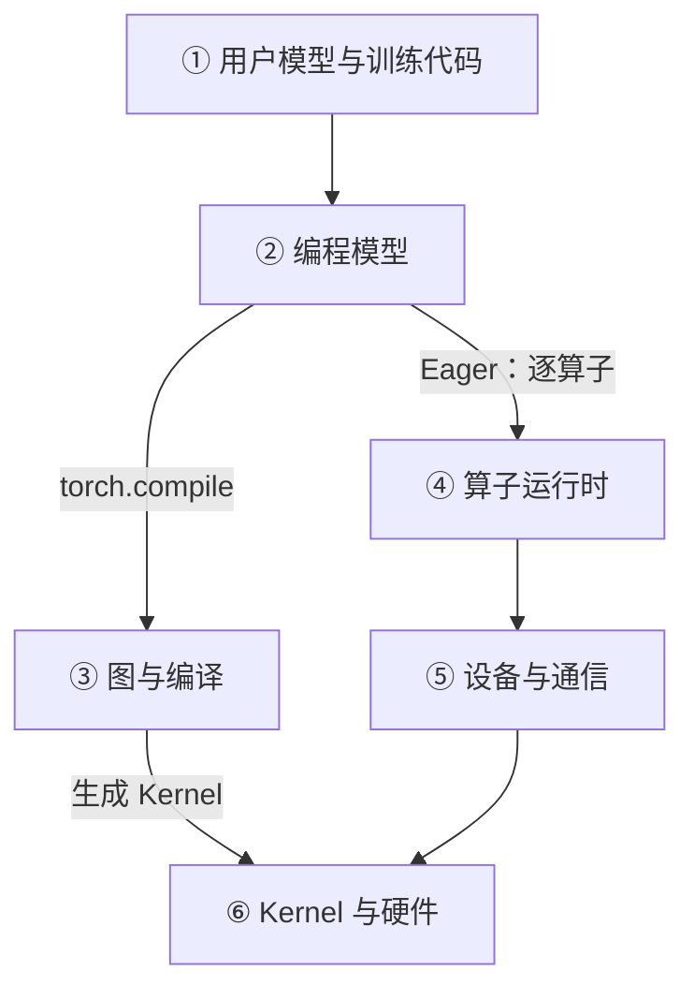
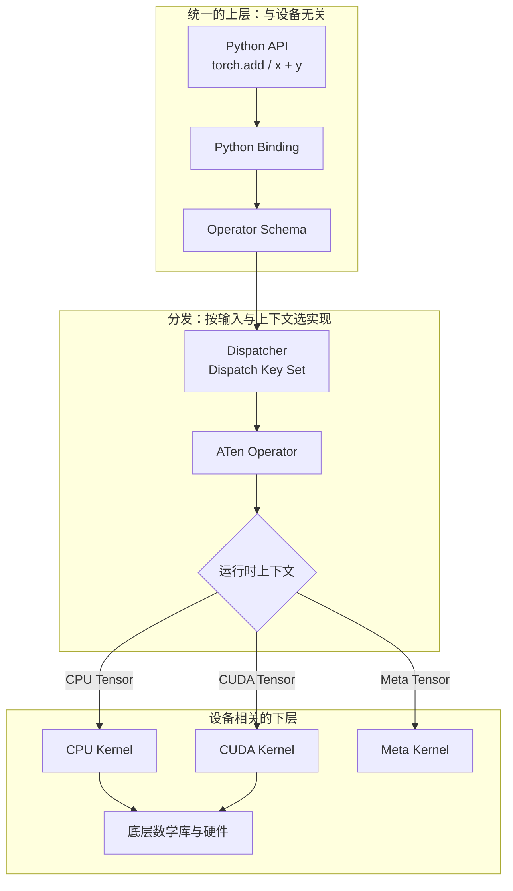
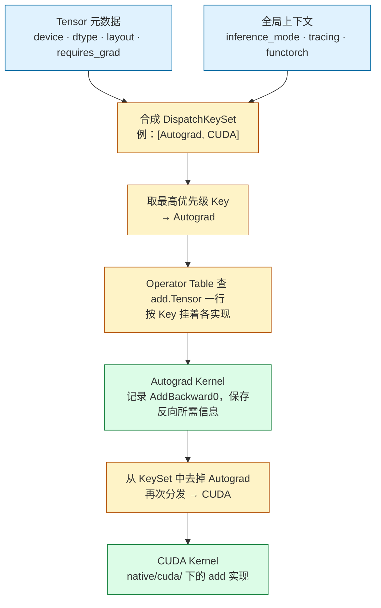
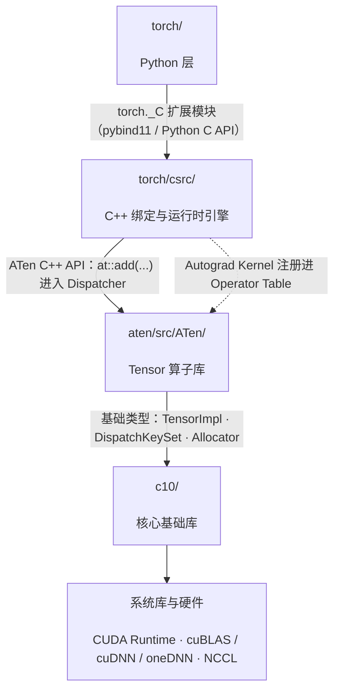
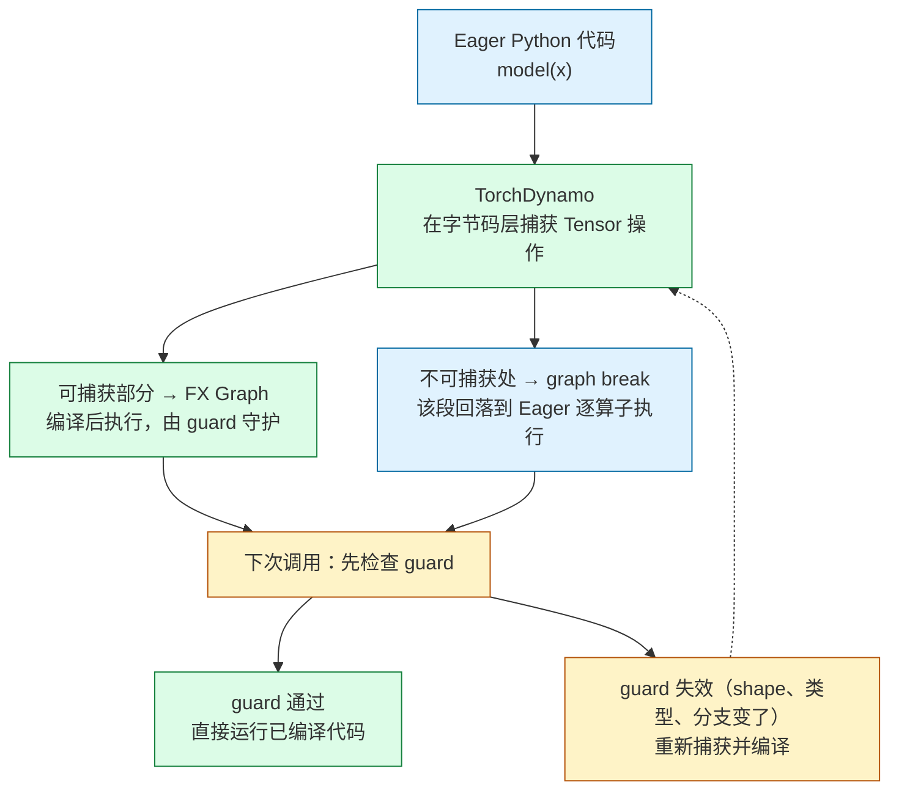

PyTorch 经常被介绍成一个“深度学习框架”，也经常被使用成一个 Python 库：导入 `torch`，创建 Tensor，定义 `nn.Module`，然后训练模型。

这种理解对于开始使用 PyTorch 已经足够，但对于训练平台、推理引擎、算子开发和 AI-Infra 来说还不够。真正需要理解的是：

> **PyTorch 如何把 Python 中表达的张量计算，转化为可以自动求导、跨设备执行、编译优化和分布式协作的运行时系统？[^q0]**

一行看起来很普通的代码：

```python
z = torch.add(x, y)
```

背后可能涉及：

```text
Python API
    ↓
Python Binding
    ↓
Operator Schema
    ↓
Dispatcher
    ↓
ATen Operator
    ↓
CPU / CUDA / Meta Kernel
    ↓
底层数学库与硬件
```

如果这条链路只停留在“PyTorch 会自动处理”，那么遇到下面的问题时就只能依赖试错：

- 为什么同一个算子既能运行在 CPU，也能运行在 CUDA 上？[^q1]
- 为什么某些 Tensor 操作会产生拷贝，另一些操作只是创建 view？[^q2]
- 为什么 `model(x)` 不等于简单调用 `model.forward(x)`？[^q3]
- 为什么模型在 eager mode 下运行正常，`torch.compile()` 后却出现 graph break？[^q4]
- 为什么 GPU 利用率很低，却找不到明显的 Python 瓶颈？[^q5]
- 为什么增加 GPU 数量后，训练速度没有线性提升？[^q6]
- 为什么一个看似简单的 C++ 扩展会遇到 ABI、stride、dtype 或生命周期问题？[^q7]

## 一、总览：一张全局地图

### 1. 本文的定位

本文是《PyTorch 深度实践：从 Tensor 到深度学习运行时》的第一篇。它只负责建立全局地图，不深入某一个模块的全部实现：先回答 PyTorch 是什么、不是什么，把它与其他框架放在一起比较，并按架构演进梳理它为什么长成今天的样子；然后用三张地图组织全文的主体；最后给出 PyTorch 工程中最重要的四个边界。后续文章会沿着这张地图，逐步展开 Tensor、Autograd、Module、Dispatcher、编译器、性能和分布式运行时。

### 2. 三张地图

本文的主体是三张地图，从三个视角组织：第一张按**职责**说明系统由哪些层组成，第二张说明一次算子调用如何**动态**穿过这些层，第三张按**源码**说明这些东西在仓库里住在哪个目录、哪个库。前两张是本系列后续篇章的推进顺序，第三张是读源码时的坐标。

### 3. 本文的章节安排

| 章 | 主题 | 内容 |
|---|---|---|
| 二 | PyTorch 到底是什么？ | 是什么、不是什么，几组需要分开的概念 |
| 三 | PyTorch 与其他深度学习框架 | Eager-first、Compiler-ready 的取舍与代价 |
| 四 | PyTorch 的架构演进 | 从动态图到编译执行的五个阶段 |
| 五 | 第一张地图：静态视角 | 六个职责层各负责什么 |
| 六 | 第二张地图：动态视角 | 一次 `torch.add` 如何穿过六个步骤 |
| 七 | 第三张地图：代码视角 | 源码目录与库的四层分层、与系列篇章的对照 |
| 八 | PyTorch 工程中最重要的几个边界 | Python/C++、通用/后端、灵活/可分析、可移植/特化 |
| 九 | 本文小结 |  |
| 十 | 自测 | 5 道题 |

Table: 本文的章节安排

## 二、PyTorch 到底是什么？

### 1. PyTorch 是什么？

PyTorch 是一个面向 Tensor 计算和深度学习的开源计算框架。

从用户角度看，它提供了表达模型、执行张量运算、自动计算梯度和更新参数的编程接口；从实现角度看，它包含 Python 层逻辑、C++ 运行时、算子库、自动求导系统、算子分发机制以及不同设备的后端支持。

因此，PyTorch 既不是只有 Python API 的工具包，也不是单独的 GPU 算子集合，而是一套连接用户模型代码、Tensor 运算与底层设备执行的计算框架。

从使用者角度看，PyTorch 的主要入口是 Python API：

```python
import torch
from torch import nn

device = torch.device("cuda" if torch.cuda.is_available() else "cpu")

x = torch.randn(32, 128, device=device)
layer = nn.Linear(128, 256, device=device)
y = layer(x)
```

这段代码表达了几个关键动作：

- 创建一个形状为 `(32, 128)` 的 Tensor；
- 创建一个输入维度为 128、输出维度为 256 的线性层；
- 将输入和模型参数放到同一个设备上；
- 执行前向计算，得到形状为 `(32, 256)` 的输出。

用户不需要直接管理底层计算库或编写设备 Kernel，但这些工作仍然会由 PyTorch 及其依赖的后端完成。

需要注意，**Python API 是 PyTorch 最主要的用户入口，但 Python 层并不只是简单的包装层**。模型组织、训练流程以及部分编译逻辑都可能由 Python 代码承担；C++ 运行时、算子实现和设备后端则承担 Tensor 管理、算子分发与具体执行等关键职责。

### 2. PyTorch 的基本组成

理解 PyTorch 时，可以按职责把它划分为几个部分：

| 职责范围 | 代表组件 | 主要解决的问题 |
| :--- | :--- | :--- |
| 数据与模型表达 | Tensor、`nn.Module` | 如何表示数据、组织模型、管理参数和状态 |
| 自动求导与参数更新 | Autograd、Optimizer | 如何计算梯度，以及如何根据梯度更新参数 |
| 算子接口与运行时 | Operator Schema、Dispatcher、ATen | 如何定义算子、提供运算接口并选择实现 |
| 设备执行 | 设备后端、底层计算库、Kernel | 如何在具体设备上完成计算 |
| 编译优化 | `torch.compile` 及相关编译组件 | 如何捕获、变换和优化计算 |
| 分布式协作 | `torch.distributed` 及相关组件 | 如何让多个进程和设备协同工作 |
| 自定义扩展 | 自定义算子、C++/CUDA 扩展、后端接入机制 | 如何扩展算子与硬件支持 |

这里的划分是为了帮助理解职责，**不是一张严格的源码目录图，也不是所有程序都会依次经过的调用链**。同一个组件可能参与多个阶段，不同执行模式也可能采用不同路径。

#### 用户编程模型

用户主要通过 Tensor、`nn.Module`、Autograd 和 Optimizer 表达计算与训练过程。

- **Tensor** 表示多维数据及其形状、类型、布局、设备等属性。
- **`nn.Module`** 组织模型层次，并管理参数、缓冲区和子模块。
- **Autograd** 在满足梯度记录条件时建立求导关系，并支持反向计算梯度。
- **Optimizer** 根据参数的梯度和自身维护的状态更新参数。

例如，在前面的代码后继续执行：

```python
optimizer = torch.optim.SGD(layer.parameters(), lr=0.01)

optimizer.zero_grad()
loss = y.square().mean()
loss.backward()
optimizer.step()
```

这里，`loss.backward()` 计算梯度，`optimizer.step()` 更新参数。两者职责不同，反向传播本身并不负责更新模型参数。

虽然输入 `x` 没有设置 `requires_grad=True`，线性层的参数默认需要梯度，因此仍然可以计算参数梯度。只有需要对输入本身求导时，才需要为输入开启梯度记录。

这些训练能力并不是所有 Tensor 运算的必经步骤。单纯的数值计算或不记录梯度的推理过程，可以不构建反向传播图，也不使用 Optimizer。

#### 算子接口与运行时

Tensor 运算背后涉及几个需要区分的概念：

- **Operator Schema** 描述算子的签名，包括参数、返回值以及相关别名和修改信息等约定。
- **Dispatcher** 根据 Tensor 的设备、布局以及当前生效的分发状态等信息，选择相应处理或实现。
- **ATen** 是 PyTorch 的 C++ Tensor 与算子基础库，提供运算接口，并承载大量算子实现。

它们不是三个完全独立、顺序串联的执行阶段。例如，Schema 主要用于定义和注册算子，并不是每次计算都要经过的一层数值处理。

Dispatcher 的职责也不只是判断“走 CPU 还是 CUDA”。自动求导、函数变换等机制同样可能参与分发过程。

#### 设备执行

具体计算最终由设备后端的实现完成。这些实现可能：

- 执行 PyTorch 自身提供的 Kernel；
- 调用 cuBLAS、cuDNN 等底层计算库；
- 组合调用其他算子；
- 在编译模式下执行生成的代码。

因此，**一次 Python 调用、一个 Operator 和一次设备 Kernel 执行之间，并不总是一一对应**。

一个算子可能触发多个 Kernel；多个算子也可能在编译优化后融合为一个 Kernel。

以常见的 eager 执行为例，可以把整体关系概括为：

    用户模型与 Tensor 运算
        ↓
    算子调用与运行时处理
    （按需涉及自动求导等机制）
        ↓
    分发到相应实现
        ↓
    后端实现、底层计算库或其他算子
        ↓
    具体设备上的计算

这是一张理解执行关系的示意图，不代表所有算子的精确调用栈。

#### 编译、分布式与扩展

编译优化、分布式协作和自定义扩展不是设备执行之后的三个固定步骤，而是作用于不同环节的能力。

例如：

- `torch.compile` 可以捕获并优化部分计算区域，通过后端生成或调用更高效的实现；
- 分布式训练可以在模型组织、梯度同步、参数切分和设备通信等环节介入；
- 自定义算子和后端扩展可以接入算子注册、分发、自动求导及设备执行等机制。

因此，理解 PyTorch 时，应同时区分两个问题：

> PyTorch 包含哪些能力？  
> 一次具体计算实际经过了哪些路径？

前者是组成关系，后者是执行关系，两者不能直接画等号。

### 3. PyTorch 不是什么？

#### PyTorch 不只是 Python API

考虑下面的代码：

```python
import torch

x = torch.randn(2, 3, device="cuda")
y = torch.randn(2, 3, device="cuda")
z = x + y
```

`x + y` 看起来只是一次 Python 加法，但对普通 CUDA Tensor 而言，它会进入 PyTorch 的算子调用与分发机制，由相应实现提交设备计算。

CUDA 操作通常相对于 CPU 异步执行：Python 调用返回，不一定意味着 GPU 已经完成计算。同步行为及其对性能测量的影响，需要在分析具体执行路径时进一步讨论。

因此：

- 阅读源码时，不能只关注 Python API 的实现；
- 排查性能问题时，不能只检查 Python 函数是否高效；
- 测量 GPU 执行时间时，不能简单把未经同步处理的 Python 调用耗时当作设备计算耗时。

同时，也不应反过来忽略 Python 层。Python 调度、循环、对象管理和模型组织方式，同样可能影响整体性能。

#### PyTorch 不等于 CUDA

CUDA 是 NVIDIA GPU 的编程平台和软件生态，PyTorch 则是可以使用 CUDA 等平台完成计算的框架。

从硬件支持角度看，PyTorch 可以使用：

- CPU；
- 基于 CUDA 的 NVIDIA GPU；
- 基于 ROCm 的 AMD GPU；
- MPS、XPU 等其他设备后端。

这里的“CUDA 后端”“ROCm 后端”是面向硬件平台的概括，并不意味着它们与 PyTorch 的设备类型名称严格一一对应。例如，ROCm 版本的 PyTorch 通常也使用 `torch.cuda` 接口和 `"cuda"` 设备标识。

此外，PyTorch 还提供 **Meta 设备**。Meta Tensor 不存储实际数据，主要用于在算子支持的范围内推导输出形状、类型等元信息，以及模型构建和程序分析。它不是执行真实数值计算的硬件后端。

即使使用 CUDA，模型组织、自动求导、算子分发和训练流程仍然属于 PyTorch 的职责范围。CUDA 及其相关库提供的是其中一部分底层执行能力，而不是整个框架。

#### PyTorch 不只是神经网络层的集合

`nn.Linear`、`nn.Conv2d` 和 Transformer 相关模块是 PyTorch 的重要组成部分，但 PyTorch 的基础仍然是 Tensor 计算及其相关机制。

`nn.Module` 主要负责组织模型和状态，它本身不是一段固定的设备代码。

一个 Module 可以包含：

- 多个 Tensor 运算；
- 子模块调用；
- Python 控制流；
- 参数、缓冲区和其他状态。

在 eager 模式下，这些运算通常随程序执行逐步发起；在编译模式下，部分计算可以被捕获、重写和融合。因此，同一个 Module 并不必然对应固定数量或固定组合的 Kernel。

### 4. 几组容易混淆的概念

| 概念 | 它是什么 | 它不是什么 |
| :--- | :--- | :--- |
| Tensor | 表示多维数据及其形状、类型、布局、设备等属性的对象；某些特殊 Tensor 不持有实际数据存储 | 不是模型，也不是 Kernel |
| `nn.Module` | 组织模型层次、参数、缓冲区和计算逻辑的对象 | 不是固定的 GPU 指令序列 |
| Autograd Graph | 在常见 eager 反向模式下，由需要记录梯度的前向运算建立、用于反向传播的依赖结构 | 不等于完整的模型程序图，也不等于最终设备执行图 |
| FX Graph | 表示被捕获计算的节点及其依赖关系、用于分析和变换的中间表示 | 不自动包含任意 Python 程序的全部行为，也不等于最终 Kernel |
| Operator | 具有 Schema 和约定语义的操作，可以具有不同实现 | 不等于某个后端上的具体实现 |
| Kernel | 需要结合语境理解：可指注册到分发系统的算子实现，也可指设备上的具体计算程序 | 不一定与一个 Operator 一一对应 |
| CUDA | NVIDIA GPU 的编程平台和软件生态 | 不等于 PyTorch 本身 |

其中，**Kernel 的含义尤其需要结合上下文判断**。

在 Dispatcher 语境中，注册的 Kernel 可以是一个 C++ 函数，这个函数可能继续调用其他算子或底层库；在 GPU 执行语境中，CUDA Kernel 通常指在 GPU 上启动执行的设备程序。

因此，“Dispatcher 选择了一个 Kernel”不一定意味着“GPU 恰好执行了一次 Kernel”。

同样，Autograd Graph 和 FX Graph 也不能混为一谈：

- Autograd Graph 主要服务于梯度计算；
- FX Graph 主要服务于被捕获计算的表示、分析与变换；
- 编译流程可能利用自动求导相关机制生成前向图和反向图，并以 FX 等形式表示，但这些图仍不等同于最终的设备执行计划。

建立这些边界之后，再阅读源码或分析性能，就可以更明确地判断：当前讨论的是用户编程接口、模型组织、算子语义、分发机制、图表示，还是设备上的实际计算。

后续的静态分层图和动态执行路径，将在这些概念边界的基础上进一步展开。


## 三、PyTorch 与其他深度学习框架

框架比较不能简单归结为“谁更好”。更有意义的比较是：它们如何表达计算、如何执行程序，以及如何将计算交给编译器和硬件。

同时，Eager 执行、图表示和编译优化并不是互斥选项。现代框架通常同时具备其中多种能力，差别主要体现在默认体验、程序约束和工具链设计上。

| 框架 | 主要编程抽象 | 典型执行方式 | 理解时的关键区别 |
| :--- | :--- | :--- | :--- |
| PyTorch | Tensor、`nn.Module` 与 Python 程序 | 默认 Eager，可通过 `torch.compile` 编译选定计算区域 | 保留直接的 Python 编程体验，并将编译能力接入现有模型代码 |
| TensorFlow | Tensor、`tf.keras` 层与模型、`tf.function` | Eager 与函数图执行并存，也可结合 XLA 编译 | 通过 `tf.function` 等机制连接直接执行与图执行 |
| JAX | 数组运算、函数与程序变换 | 支持直接执行，通过 `jit` 等变换组织编译执行 | 强调可组合的程序变换，变换中的状态和副作用需要遵循相应约束 |
| MXNet（历史参照） | 符号图与 Gluon 命令式接口 | 支持命令式执行及混合化图执行 | 展示了连接动态图编程体验与符号图执行的一种设计路线 |
| OneFlow | Tensor、模块与全局 Tensor 等分布式抽象 | 支持 Eager 与图执行 | 强调分布式数据表示以及计算和通信的协同 |

Table: 主流深度学习框架的编程模型与执行方式

这张表只概括设计取向，不代表性能或生态排名。实际选型还需要结合模型类型、硬件环境、部署目标和团队经验。

### 1. PyTorch 的取舍：默认 Eager，按需编译

PyTorch 的一个重要特点，是默认采用 Eager 执行：Tensor 运算随 Python 程序运行逐步发起，不要求用户预先构建完整计算图。

这里的“逐步执行”不意味着每次 Python 调用返回时，设备都已经完成计算。GPU 操作通常仍然是异步提交和执行的。

在这一编程体验之上，PyTorch 提供了编译能力。用户可以通过 `torch.compile` 对模型或函数中的计算区域进行捕获和优化，而不必一开始就把整个程序写成显式的静态图。

需要区分三个相互关联、但并不等价的概念：

- **Eager 执行**：描述运算如何随程序运行被发起。
- **Autograd**：在满足梯度记录条件时记录求导依赖，并计算梯度。
- **编执行**：捕获和变换计算，通过后端生成或调用优化后的实现。

它们不是“先 Eager、再 Autograd、最后 Compiler”的固定流水线。自动求导可以与 Eager 或编译执行结合，编译也可以用于不需要梯度的推理计算。

### 2. 这种设计带来的优势与成本

默认 Eager 的编程体验具有几个直接优势：

- Python 控制流可以直接参与计算；
- 在 Eager 模式下，可以使用熟悉的 Python 调试工具检查中间状态；
- 模型结构与训练逻辑便于快速修改；
- 同一套模型表达可以作为进一步编译优化的起点；
- 性能优化可以逐步开展，必要时再引入自定义算子和设备实现。

但这些优势并不意味着任意 Python 程序都能无修改地获得编译收益。

相应的成本和约束包括：

- 对细粒度运算，Python 调度与算子分发开销可能比较明显；
- 大量短小的 GPU Kernel 可能受到启动开销影响，频繁同步还会进一步增加成本；
- 数据相关控制流、外部副作用或编译器不支持的操作，可能导致图中断或限制优化范围；
- 输入形状、类型等条件变化，可能触发新的编译，具体取决于编译配置与动态形状支持；
- 编译本身需要时间，短任务或变化频繁的工作负载不一定能摊销这部分成本。

这些问题并非 PyTorch 独有，但它们是理解其执行机制和性能表现时需要重点关注的因素。

### 3. Eager 与编译执行不是二选一

PyTorch 的方向不是简单地从“动态图”切换到“静态图”，而是让直接执行与编译优化在同一套编程模型中协作。

| 执行方式 | 主要价值 | 需要关注的问题 |
| :--- | :--- | :--- |
| Eager 执行 | 行为直观，便于探索、调试和动态控制 | Python 调度、算子分发与细粒度执行开销 |
| 编译执行 | 为融合、减少中间结果和降低调度开销提供机会 | 捕获范围、编译成本、图中断和重新编译 |

同一个程序可以只编译其中一部分，其余部分继续采用 Eager 执行。编译后的区域也不一定要求所有形状固定不变，具体能力和约束取决于编译后端及程序行为。

因此，理解 PyTorch 与其他框架的差异，重点不是给它贴上“动态图框架”的标签，而是观察它如何连接 **Python 程序、Tensor 运算、自动求导、编译优化和设备执行**。

## 四、PyTorch 的架构演进

这里的“阶段”是为了帮助理解架构演进而做的归纳，不是 PyTorch 官方发布的固定分期。版本号和日期采用官方发布节点作为参照；不同能力往往跨越多个版本逐步成熟，不能简单归因于某一个版本。

| 阶段 | 代表版本与时间 | 主要变化 | 对今天架构的影响 |
|---|---|---|---|
| 动态图与研究友好 | 0.1.x，2016 年 9 月起公开 alpha，2017 年初持续迭代 | 以 Python 为中心的 Tensor、动态图和自动求导体验 | 奠定 Eager-first 的编程模型 |
| API 稳定与生产化 | 0.4，2018 年；1.0，2018 年 12 月 | Tensor/Variable 接口整合，API 稳定，TorchScript 和生产能力逐步引入 | 从研究工具走向通用深度学习平台 |
| C++ 运行时与分布式成熟 | 1.x，2019—2022 年 | ATen、C++ Tensor API、Dispatcher、分布式训练和自定义扩展持续完善 | Python API 之下形成完整运行时 |
| 图表示与编译基础设施 | 1.8—1.13，2021—2022 年 | FX、functorch、TorchDynamo、AOTAutograd、TorchInductor 等组件逐步发展 | 为 Eager 程序提供图捕获和优化路径 |
| 编译执行与大模型运行时 | 2.0，2023 年 3 月 15 日及之后 | `torch.compile` 成为主要编译入口，动态 Shape、分布式和 Transformer 优化持续增强 | 保留 Eager 体验，同时获得编译优化能力 |

Table: PyTorch 架构演进的阶段

### 1. 阶段一：动态图与研究友好

PyTorch 0.1.x 于 2016 年 9 月起以 alpha 版本公开发布，并在 2017 年初持续迭代。早期 PyTorch 的核心体验可以概括为：

```python
x = torch.randn(10, requires_grad=True)
y = x * 2
z = y.relu()
loss = z.sum()
loss.backward()
```

代码执行到哪一行，计算就发生到哪一行；Python 的 `if`、`for` 和函数调用可以直接参与模型逻辑。这个 Eager-first 的设计，成为 PyTorch 后续架构一直保留的用户体验基础。

### 2. 阶段二：API 稳定与生产化

PyTorch 0.4 在 2018 年带来了重要的 Tensor/Variable 接口整合。随后 PyTorch 1.0 于 2018 年 12 月发布，API 稳定性、生产使用和图执行能力成为重要方向。

这一阶段的关键不是“动态图被静态图取代”，而是开始提供从 Eager 模型走向更受约束执行环境的路径，例如 TorchScript。PyTorch 由此同时面对两类需求：

```text
研究与开发 → 灵活、即时、容易调试
生产与部署 → 可保存、可分析、可优化
```

### 3. 阶段三：C++ 运行时、算子系统与分布式成熟

在 1.x 系列中，PyTorch 持续强化：

- ATen；
- C++ Tensor API；
- Dispatcher；
- CPU/CUDA Kernel；
- C++ 前端；
- 分布式通信；
- 自定义算子和扩展机制。

这带来了一个重要变化：

> PyTorch 不再只是一个 Python 深度学习库，而是逐渐成为具有完整运行时和算子系统的深度学习平台。

Python 仍然是主要入口，但大量真正影响性能和设备行为的逻辑已经进入 C++、CUDA 和底层库。

### 4. 阶段四：从动态图走向编译执行

Eager Mode 灵活，但也存在明显成本：

- Python 代码需要参与调度；
- 大量细粒度操作会产生很多 Kernel Launch；
- 编译器难以看到跨算子的全局关系；
- 动态控制流和数据依赖会限制静态优化。

因此，1.8—1.13 期间逐步形成了多种图表示和编译基础设施：

- FX；
- functorch；
- TorchDynamo；
- AOTAutograd；
- TorchInductor；
- Triton。

### 5. 阶段五：编译执行与大模型运行时

PyTorch 2.0 于 2023 年 3 月 15 日发布，其主要方向是在保持 Eager Mode 开发体验的同时，通过 `torch.compile` 将稳定的计算部分交给编译器。

现代 PyTorch 还需要继续处理：

- 多 GPU 训练；
- 参数、梯度和优化器状态分片；
- 混合精度；
- 动态 Shape；
- Meta Tensor 和 Fake Tensor；
- CPU、CUDA、ROCm 及其他后端；
- 大模型检查点；
- 量化和推理优化。

这些能力看起来分散，实际都在回答同一个问题：

> **如何让同一套模型和算子抽象，在不同设备、不同规模和不同执行模式下保持可组合？**

## 五、第一张地图：静态视角——PyTorch 的逻辑分层

这一章我们先从**静态视角**出发，看看“PyTorch 由哪些职责层组成、每一层负责什么”。

从上到下，可以把 PyTorch 粗略分为以下六层：



| 层 | 核心组件 | 回答的问题 |
|---|---|---|
| ① 用户模型与训练代码 | `nn.Module` 子类、损失函数、训练循环、评估与推理逻辑 | 模型长什么样、怎么训练 |
| ② 编程模型 | Tensor、Autograd、`nn.Module` / Parameter / Buffer、Optimizer、Dataset / DataLoader、`state_dict` | 用户用什么抽象表达计算和状态 |
| ③ 图与编译 | TorchDynamo、FX Graph、AOTAutograd、TorchInductor、Guard / Graph Break / 编译缓存 | 动态 Python 程序如何变成可优化的图 |
| ④ 算子运行时 | Operator Schema、Dispatcher / DispatchKey、ATen 算子实现（CPU / CUDA / Composite / Meta）、TensorIterator | 一个算子在当前上下文该调用哪个实现 |
| ⑤ 设备与通信 | CUDA Runtime（Stream / Event / 同步）、Caching Allocator、H2D / D2H 数据迁移、进程组与集合通信（NCCL / Gloo） | 计算和数据如何到达设备、多设备如何协同 |
| ⑥ Kernel 与硬件 | C++ CPU Kernel、CUDA Kernel、cuBLAS / cuDNN 等厂商库、Triton Kernel、CPU / GPU / 显存 / 互连 | 计算最终消耗多少算力、带宽和时间 |

Table: PyTorch 的逻辑分层

Eager 模式下每个算子从编程模型直接进入算子运行时；`torch.compile` 则先经过图与编译层，生成的 Kernel 直接落到最底层。这不是 PyTorch 源码目录的直接映射（源码分层见第七章），而是一张用于分析问题的逻辑地图。

### 1. 第一层：用户模型与训练代码

这是最接近业务和算法的部分：

```python
class Classifier(nn.Module):
    def __init__(self, input_dim: int, num_classes: int) -> None:
        super().__init__()
        self.layers = nn.Sequential(
            nn.Linear(input_dim, 128),
            nn.ReLU(),
            nn.Linear(128, num_classes),
        )

    def forward(self, x: torch.Tensor) -> torch.Tensor:
        return self.layers(x)
```

用户在这一层表达：

- 模型结构；
- 前向计算；
- 损失函数；
- 优化器；
- 训练循环；
- 推理逻辑。

这一层主要使用 Python，但它产生的每个 Tensor 操作最终都需要进入下面的运行时。

### 2. 第二层：编程模型

这一层包括：

- Tensor；
- Autograd；
- `nn.Module`；
- Dataset 和 DataLoader；
- Optimizer；
- Checkpoint。

它提供的是深度学习开发者使用的抽象。例如：

```python
output = model(inputs)
loss = criterion(output, targets)
loss.backward()
optimizer.step()
```

这段代码隐藏了大量细节，但隐藏不等于不存在：

- `inputs` 和 `targets` 有 dtype、shape、device；
- `model` 可能是一个带参数和 Buffer 的模块树；
- forward 可能动态构建 Autograd 图；
- `backward()` 会沿图传播梯度；
- `optimizer.step()` 会读取参数和梯度状态。

第二篇到第四篇会集中讨论这一层。

### 3. 第三层：图与编译

这一层负责把 Python 程序或 Tensor 操作转换为可以分析的图表示：

```text
Python Model
    ↓
TorchDynamo
    ↓
FX Graph
    ↓
AOTAutograd
    ↓
TorchInductor
    ↓
Triton / C++ / Vendor Library
```

这里需要区分几种概念：

- Eager 计算图：为了 Autograd 记录的运行时图；
- FX Graph：用于程序分析和重写的 Python 层图表示；
- 编译器中间表示：面向代码生成和优化的内部表示；
- Kernel：最终在 CPU 或 GPU 上执行的实现。

第七篇会详细讨论这几个概念的关系。

### 4. 第四层：算子运行时

这一层负责回答：

> 这个算子是什么？在当前运行时上下文中，应该调用哪个实现？

它包括：

- Operator Schema；
- Dispatcher；
- Dispatch Key；
- ATen；
- TensorIterator；
- Native Functions；
- Composite Kernel；
- Meta Kernel。

例如，同样是加法操作：

```python
z = x + y
```

如果 `x` 和 `y` 是 CPU Tensor，就需要 CPU 实现；如果它们是 CUDA Tensor，就需要 CUDA 实现；如果当前操作正在构建 Meta Tensor 的形状推断，又需要 Meta 实现。

第五篇会以 `add`、`add_` 和 `add.out` 为例展开这一层。

### 5. 第五层：设备与通信

这一层连接 PyTorch 运行时和具体设备或进程：

- CPU；
- CUDA；
- ROCm；
- Meta；
- NCCL；
- Gloo；
- 其他硬件后端。

它处理的不只是“把代码放到 GPU 上”，还包括：

- 内存分配；
- 数据迁移；
- Kernel Launch；
- stream；
- event；
- 进程间通信；
- 集合通信；
- 设备同步。

第八篇和第九篇会分别讨论性能执行与分布式通信。

### 6. 第六层：Kernel 与硬件

最底层是实际完成计算的代码和硬件：

- C++ CPU Kernel；
- CUDA Kernel；
- Triton Kernel；
- cuBLAS；
- cuDNN；
- 设备厂商库；
- CPU 指令集；
- GPU Streaming Multiprocessor。

这一层决定了计算最终消耗多少：

- 算力；
- 显存带宽；
- Kernel Launch；
- 寄存器和共享内存；
- 线程块调度；
- 设备间通信。

但性能问题不一定发生在最底层。上层的 Python 调度、Tensor 布局、数据搬运和同步，都可能成为瓶颈。

## 六、第二张地图：动态视角——一次算子调用发生了什么？

上面的静态地图回答了“系统由什么组成”，但还没有回答“代码如何在系统中流动”。下面我们切换到**动态视角**：以一次 `torch.add(x, y)` 为例，追踪一个算子从 Python 入口经过绑定、Schema、Dispatcher 和 ATen，最终进入具体设备 Kernel 的过程。

以简单的加法为例：

```python
z = torch.add(x, y)
```

可以沿着下面的路径理解：



这张图表达的是典型执行路径：统一的算子契约和 Dispatcher 位于上层，具体设备 Kernel 位于下层。实际路径会因算子实现、Autograd、编译模式和 PyTorch 版本而有所变化。

### 1. 第一步：Python API

用户调用的是 Python 暴露出来的函数：

```python
torch.add(x, y)
```

也可以使用运算符形式：

```python
z = x + y
```

或者 Tensor method：

```python
z = x.add(y)
```

这几个入口在用户层语义相近，但可能对应不同的生成绑定和调用形式。不要只根据 Python 表面语法判断内部实现路径。

### 2. 第二步：Python Binding

PyTorch 需要把 Python 对象转换为 C++ 运行时能够理解的对象：

```text
Python Tensor object
    ↓
C++ Tensor handle
    ↓
算子参数检查与转换
```

这一层涉及 Python/C++ 边界、引用管理和参数解析。

它不是把所有 Tensor 数据复制到 C++，而通常是让 C++ 侧获得对 Tensor 对象和底层存储的可管理引用。

### 3. 第三步：Operator Schema

算子需要有明确的签名和语义。例如可以抽象表示为：

```text
add(Tensor self, Tensor other, Scalar alpha=1) -> Tensor
```

Schema 描述：

- 参数类型；
- 返回类型；
- 默认参数；
- mutable 参数；
- aliasing 和 out variant 等语义。

Schema 是算子系统的重要契约。它让不同语言绑定、后端实现、Autograd 和编译器能够围绕同一个算子定义协作。

### 4. 第四步：Dispatcher

Dispatcher 根据运行时信息选择实现。影响选择的因素可能包括：

- Tensor 的 device；
- dtype；
- 是否需要 Autograd；
- 是否处于 tracing 或 compiling；
- 是否是 Meta Tensor；
- 是否有自定义后端；
- 是否使用特殊布局。

可以简化成：

```text
算子名 + Tensor 元数据 + 运行时上下文
                    ↓
             Dispatch Key Set
                    ↓
              具体 Kernel
```

把这三行再展开一步——以两个 `requires_grad=True` 的 CUDA Tensor 相加为例——分发实际上会经过两轮查表：



Autograd 在这里只是表里优先级更高的一个 Key：它先被命中、做完记录后把自己从 KeySet 中去掉再分发，才轮到设备 Kernel。如果是 CPU Tensor，最后一步命中的就是 CPU Kernel；如果处于 `no_grad()`，Autograd Key 仍会被命中，只是包装层读到 GradMode 关闭就不记录 `grad_fn`；`inference_mode()` 才会在合成 KeySet 时把它排除。第五篇会展开这张表的每一格。

这不是 Java 方法重载的简单等价物。Java 重载通常依据编译期静态类型选择方法，而 PyTorch 的分发还会受到设备、Autograd、Tracing 和运行时上下文影响。

### 5. 第五步：ATen Operator

ATen 是 PyTorch 的核心 Tensor 和算子库，提供跨设备的统一抽象。

从用户角度看：

```python
z = x + y
```

从运行时角度看，它需要保证：

- shape 规则一致；
- 广播规则一致；
- dtype 规则一致；
- 错误行为一致；
- 不同后端具有相同的算子语义。

ATen 并不意味着所有计算都由一份代码完成。它提供统一接口，具体执行仍可能落到不同后端。

### 6. 第六步：CPU、CUDA 或其他 Kernel

最终，Dispatcher 会让操作进入某个具体实现：

```text
CPU Tensor  → CPU Kernel
CUDA Tensor → CUDA Kernel
Meta Tensor → Meta Kernel
```

某些算子会调用底层库：

```text
矩阵乘法 → cuBLAS / cuBLASLt
卷积     → cuDNN 或专用 Kernel
通用逐元素操作 → Native CUDA Kernel
```

返回的结果仍然要重新包装成 PyTorch Tensor，并保留正确的：

- shape；
- stride；
- dtype；
- device；
- Autograd 信息；
- storage 生命周期。

### 7. 这是一条概念路径

上面的流程适合建立架构认知，但不是所有算子在所有 PyTorch 版本中的固定源码调用栈。

实际路径可能因为以下因素而变化：

- Python function、Tensor method 或运算符入口不同；
- 算子是否有 Composite 实现；
- 是否正在进行 Autograd；
- 是否处于编译或 Fake Tensor 模式；
- 后端是否覆盖了特定 Dispatch Key；
- PyTorch 版本的代码生成和绑定方式变化。

这些层次是稳定的职责边界；具体函数调用栈则可能随版本和算子实现变化。

## 七、第三张地图：代码视角——源码目录与库的分层

前两张地图按职责划分，不对应源码目录。真正打开 `pytorch/` 仓库，看到的是另一种分层——按**库**划分，自上而下四层，每一层只依赖它下面的层：



| 层 | 源码位置 | 核心组件 | 向上提供 |
|---|---|---|---|
| Python 层 | `torch/` | `nn`、`optim`、`utils.data`、`distributed`（Python 侧）、`fx`、`_dynamo`、`_functorch`、`_inductor`、`torch.library`、`torch.testing` | 用户 API |
| C++ 绑定与运行时引擎 | `torch/csrc/` | Python 绑定、Autograd 引擎（`autograd/`）、c10d（`distributed/`）、Profiler、TorchScript（`jit/`，维护模式）、Dynamo 帧求值 hook、AOTInductor 运行时 | `torch._C` 扩展模块 |
| Tensor 算子库 | `aten/src/ATen/` | Dispatcher 与 Operator Table（`core/dispatch/`）、`native_functions.yaml`、CPU / CUDA Kernel（`native/`）、TensorIterator；粘合代码由 `torchgen/` 生成 | `at::Tensor` 与 ATen C++ API |
| 核心基础库 | `c10/` | TensorImpl、StorageImpl、Device / DeviceGuard / Stream、Allocator / CUDACachingAllocator、DispatchKey / DispatchKeySet、ScalarType / Layout | 所有层共用的基础类型 |
| 系统库与硬件 | — | CUDA Runtime、cuBLAS / cuDNN / CUTLASS（被 ATen Kernel 调用）、oneDNN / OpenMP、NCCL / Gloo（被 c10d 调用）、Triton（编译器生成的 Kernel） | 设备能力 |

Table: PyTorch 源码目录与库的分层

实线是一次算子调用自上而下的依赖方向，箭头上是层与层之间的接口。虚线是一条反向关系：Autograd 引擎位于 `torch/csrc`，却把自己的 Kernel 注册进 ATen 的 Operator Table，所以 §5 的调用路径会在这两层之间往返一次。厂商库和 NCCL 分别被 ATen 的 Kernel 和 c10d 直接调用，编译栈则绕过 ATen 的 Kernel 自己生成 Triton 代码（第七篇）。

编译之后，这四层对应几个动态库：`libc10`（c10）、`libtorch_cpu` 与 `libtorch_cuda`（ATen 和 `torch/csrc` 中与 Python 无关的部分：Autograd 引擎、c10d 等）、`libtorch_python`（Python 绑定）。`import torch` 时它们被依次加载；第六篇的 C++ 扩展链接的正是这些库，ABI 问题也由此而来。

下面自上而下逐层说明每一层放什么、向上提供什么。

### 1. `torch/`：Python 层

用户直接接触的一切都在这里：`torch.nn`、`torch.optim`、`torch.utils.data`、`torch.distributed` 的 Python 侧，以及 `torch.Tensor` 的大部分 Python 方法。值得注意的是**编译栈的主体也在这一层**：Dynamo（`torch/_dynamo`）、AOTAutograd（`torch/_functorch`）、Inductor（`torch/_inductor`）和 FX（`torch/fx`）都是 Python 代码——编译器分析的是 Python 程序，产出的是 Triton / C++ 源码，它自己不必是 C++。

这一层不做 Tensor 计算。所有真正的计算都通过 `torch._C` 这个扩展模块进入下一层。

### 2. `torch/csrc/`：C++ 绑定与运行时引擎

`csrc` 是 "C source" 的缩写，这里是 Python 与 C++ 的边界，也是几个大型运行时引擎的所在：

- **Python 绑定**：把 C++ 的 Tensor 和函数暴露成 Python 对象。`torch.add` 在 Python 侧是一个由 Codegen 生成的绑定函数，负责解析参数、把 Python 对象转成 `at::Tensor`，再调用 ATen；
- **Autograd 引擎**（`autograd/`）：反向传播的执行器，以及为每个算子生成的反向节点（第三篇）；
- **c10d**（`distributed/`）：进程组、NCCL / Gloo 后端、DDP 的 Reducer（第九篇）；
- **Profiler**（`profiler/`）：与 Kineto 集成，采集 CPU 和 CUDA 时间线（第八篇）；
- **TorchScript**（`jit/`）：上一代编译路径，C++ 实现，2.x 已进入维护模式，本系列不讨论；
- **Dynamo 与 Inductor 的少量 C++ 部分**：帧求值 hook（`dynamo/`）和 AOTInductor 运行时（`inductor/`）。

这一层向下依赖 ATen 的 C++ API：一切 Tensor 运算都写成 `at::add(x, y)` 之类的调用。**Dispatcher 不在这一层**——它在 ATen。

### 3. `aten/src/ATen/`：Tensor 算子库

ATen（"A Tensor library"）是算子的家，包括两部分：

- **分发**（`core/dispatch/`）：Dispatcher 与 Operator Table。每个算子在这里有一个条目，条目里按 DispatchKey 挂着它的各个实现——CPU、CUDA、Autograd、Meta……`at::add(x, y)` 被调用时，Dispatcher 根据输入 Tensor 的 DispatchKeySet 选一个实现（第五篇）；
- **实现**（`native/`）：`native_functions.yaml` 声明每个算子的 Schema 和它在各后端的实现函数名；`native/cpu/` 和 `native/cuda/` 是 Kernel 本身。Kernel 处理 stride 和广播靠 `TensorIterator`，处理矩阵乘、卷积则调用 cuBLAS / cuDNN / oneDNN 等厂商库。

Autograd 的实现也是挂在 Operator Table 上的一个 Key：Autograd Kernel 位于 `torch/csrc/autograd/generated/`，但它被注册进 ATen 的表里，由 Dispatcher 先于设备 Kernel 调用。所以 §2 与 §3 之间是双向的：`torch/csrc` 调用 ATen 的 API，同时把 Autograd 实现注册进 ATen 的表。

### 4. `c10/`：核心基础库

c10（读作 "C-ten"，名字是 Caffe2 与 ATen 的双关）是所有层共同依赖的基础类型，自身不依赖任何上层，也不包含任何算子：

- `TensorImpl`、`StorageImpl`：Tensor 的元数据（sizes、strides、storage_offset、dtype、device）和底层存储——**第二篇讨论的全部内容，源码上住在这里**；
- `Device`、`DeviceGuard`、`Stream`、`Event`：设备抽象，CUDA 的具体实现在 `c10/cuda/`；
- `Allocator` 与 `CUDACachingAllocator`：内存分配器，第八篇显存分析的对象；
- `DispatchKey`、`DispatchKeySet`：Dispatcher 用来选实现的键，键的定义在这里，查表的逻辑在 ATen；
- `ScalarType`、`Scalar`、`Layout`：类型系统。

一个常见的误解是 c10 只是"设备抽象和分配器"。实际上它是 Tensor 的定义所在：用户最先接触的抽象，恰恰是源码里最底层的东西。这也是本系列把 Tensor 放在第二篇、而不是按源码自下而上从 c10 讲起的原因——它是一切的依赖，但理解它不需要先理解其他任何层。

### 5. 用 `torch.add` 把四层串一遍

第六章的动态路径可以精确落到目录上：

```text
torch/               Python 调用 torch.add(x, y)，进入 torch._C 中生成的绑定函数
        ↓
torch/csrc/          绑定函数解析参数，调用 at::add(x, y)
        ↓
aten/src/ATen/       Dispatcher 查 aten::add 的条目，按 x、y 的 DispatchKeySet 选 Key
        ↓
torch/csrc/          Autograd Key 命中：记录 AddBackward0 节点（torch/csrc/autograd/generated/），再次分发
        ↓
aten/src/ATen/       CPU 或 CUDA Key 命中：native/ 下的 add 实现，用 TensorIterator 遍历元素
        ↓
c10/                 结果 Tensor 的 TensorImpl 与 StorageImpl 在此构造，内存由 Allocator 分配
```

路径在 `torch/csrc` 与 ATen 之间往返一次，正是因为 Autograd 作为一个 Key 挂在 ATen 的表上。第五篇会把这条路径的每一步展开。

### 6. 组件、源码位置与系列篇章的对照

| 组件 | 源码位置 | 职责层 | 展开篇 |
|---|---|---|---|
| TensorImpl、StorageImpl、stride、dtype、device | `c10/core/` | 编程模型 | 第二篇 |
| Autograd 引擎、`grad_fn`、saved tensors | `torch/csrc/autograd/` | 编程模型 | 第三篇 |
| `nn.Module`、Optimizer、DataLoader、序列化 | `torch/nn/` `torch/optim/` `torch/utils/data/` | 用户代码与编程模型 | 第四篇 |
| Operator Schema、Dispatcher、native 算子、Codegen | `aten/src/ATen/` `torchgen/` | 算子运行时 | 第五篇 |
| pybind11 绑定、`TORCH_LIBRARY`、C++/CUDA 扩展 | `torch/csrc/` `torch/utils/cpp_extension.py` | Python 与 C++ 边界 | 第六篇 |
| Dynamo、AOTAutograd、Inductor、FX | `torch/_dynamo/` `torch/_functorch/` `torch/_inductor/` `torch/fx/` | 图与编译 | 第七篇 |
| Profiler、Caching Allocator、Stream、CUDA Graphs | `torch/profiler/` `c10/cuda/` `torch/cuda/` | 设备与通信 | 第八篇 |
| c10d、ProcessGroup、DDP、FSDP、DTensor | `torch/csrc/distributed/` `torch/distributed/` | 设备与通信 | 第九篇 |
| 测试基础设施、构建、CI、发布 | `test/` `torch/testing/` `tools/` `.github/` | 横切 | 第十篇 |

Table: 组件、源码位置与系列篇章的对照

**本系列有意不覆盖的部分**：TorchScript / `torch.jit`（维护模式）；量化、稀疏 Tensor、复数等专门的 Tensor 子系统；`torch.func`（`vmap`、函数式变换）；MPS、XPU 等非 CUDA 后端的实现细节；`torch.export` 与 AOTInductor 只在第七篇作为编译栈的另一个出口简要提及。模型 Serving、请求调度和 KV Cache 属于推理系统层，不在本系列范围。

## 八、PyTorch 工程中最重要的几个边界

前面三张地图描述的是"系统由什么组成、代码怎么流动、东西在哪"。读源码和做取舍时，更常遇到的是四个反复出现的边界。先用一张表汇总，再逐个展开：

| 边界 | 一侧 | 另一侧 | 工程取舍 | 典型例子 | 展开篇 |
|---|---|---|---|---|---|
| Python 与 C++ | Python：表达模型结构、组织训练流程、配置与实验逻辑 | C++ / CUDA：运行时、高性能数据结构、设备后端、低层算子 | 不是"Python 慢、C++ 快"，而是按职责分层；性能敏感路径逐步下沉 | `torch._C` 绑定与参数解析；C++ 扩展遇到的 ABI、stride、dtype、生命周期问题 | 第五、六篇 |
| 通用抽象与后端实现 | 统一的 Tensor API 与算子 Schema | CPU / CUDA / Meta 等后端各自的 Kernel 与能力差异 | 在统一语义之下允许后端保留必要的实现差异 | 同一个 `add` 在 CPU、CUDA、Meta 上分别有实现；某些算子只在部分后端支持、dtype 能力不同 | 第五篇 |
| 灵活性与可分析性 | Eager Mode：动态 Python、控制流直接参与计算 | Compiler：需要稳定、可推断的程序 | 更多动态性换表达力，更多静态性换优化机会；`torch.compile()` 在两者间搭桥 | graph break、guard、动态 shape、编译缓存 | 第七篇 |
| 可移植性与性能特化 | 通用实现：跨设备、易维护 | 设备特化：专用 Kernel、特定 shape 的优化 | 判断哪些逻辑留在通用层、哪些路径值得写专用 Kernel、哪些差异交给 Dispatcher 隔离 | TensorIterator 的通用逐元素 Kernel vs 调用 cuBLAS / cuDNN 或手写 CUDA Kernel | 第六、八篇 |

Table: PyTorch 工程中的四个边界

### 1. Python 与 C++ 的边界

Python 适合：

- 表达模型结构；
- 组织训练流程；
- 处理配置和生命周期；
- 编写实验逻辑。

C++ 更适合：

- 实现运行时；
- 管理高性能数据结构；
- 连接设备后端；
- 实现低层算子；
- 处理对性能敏感的路径。

这不是“Python 慢、C++ 快”这么简单，而是不同层次的职责不同：

```text
Python：表达和组织
C++：运行时和抽象
CUDA：设备执行
```

### 2. 通用抽象与后端实现的边界

PyTorch 希望用户使用统一 Tensor API，但不同设备不可能完全没有差异：

- 某些算子只在部分后端支持；
- 不同设备的 dtype 能力不同；
- Kernel 的性能特征不同；
- 内存和通信模型不同；
- 编译器后端能力不同。

因此，真正健康的抽象不是假装所有设备完全相同，而是：

> 在统一语义之下，允许后端保留必要的实现差异。

### 3. 灵活性与可分析性的边界

Eager Mode 鼓励动态 Python，但编译器更喜欢稳定、可推断的程序。

```text
更多动态性 → 更好的表达能力
更多静态性 → 更好的分析和优化机会
```

`torch.compile()` 的工程价值就在于尝试在两者之间建立桥梁。但这座桥不是无条件成立的，graph break、动态 shape 和运行时 guard 都是需要理解的边界。下图是这座桥的骨架：



灵活性保留在 graph break 这条分支上：捕获不了的地方退回 Eager，程序仍然正确；可分析性来自 FX Graph 这条分支：能捕获的部分成为图并被优化，代价是每次调用都要付一次 guard 检查、且 guard 失效会触发重编译。第七篇会用一个带 shape 分支的函数把这四条路径各走一遍。

### 4. 可移植性与性能特化的边界

统一代码可以跨设备运行，但高性能通常需要特化：

```text
通用实现 → 易移植、易维护
设备特化 → 更高性能、更高维护成本
```

一个 AI-Infra 工程师需要能够判断：

- 哪些逻辑应该留在通用层；
- 哪些路径值得写专用 Kernel；
- 哪些优化只适合特定 shape；
- 哪些设备差异应该通过 Dispatcher 隔离。

## 九、本文小结

### 1. 一个定位

PyTorch 不是一个单纯的 Python 库，而是连接模型代码、Tensor 编程模型、算子运行时、设备后端、Kernel 和硬件的一套计算平台。Python 是它的表达层和控制层，C++ 是运行时和抽象层，CUDA 是设备执行层。

### 2. 三张地图

职责地图回答"谁负责什么"：

```text
用户模型与训练代码
    ↓
编程模型：Tensor / Autograd / nn.Module / Optimizer
    ↓
图与编译：FX / Dynamo / AOTAutograd / Inductor
    ↓
算子运行时：Operator Schema / Dispatcher / ATen
    ↓
设备与通信：CPU / CUDA / Meta 后端 · 内存分配 · stream · NCCL / Gloo
    ↓
Kernel 与硬件
```

动态地图回答"一次调用怎么走"：

```text
Python API → Python Binding → Operator Schema → Dispatcher → ATen Operator → Kernel → Hardware
```

代码地图回答"东西在哪个目录、哪个库"：

```text
torch/（Python）→ torch/csrc/（绑定、Autograd 引擎、c10d）→ aten/src/ATen/（Dispatcher、算子）→ c10/（TensorImpl、Device、Allocator）
```

本系列按前两张地图的顺序推进；第七章 §6 的对照表标出了每一篇在代码地图上的位置。后续每一篇都是这些地图上某一格的放大：第二篇放大 Tensor，第三篇放大 Autograd，第四篇放大 Module 与训练系统，第五、六篇放大算子运行时，第七篇放大图与编译，第八篇沿动态地图测量时间去了哪里，第九篇放大设备与通信层，第十篇讨论整张图如何被持续维护。

### 3. 四个边界

- Python 与 C++：表达和组织 vs 运行时和抽象；
- 通用抽象与后端实现：统一语义之下允许必要的实现差异；
- 灵活性与可分析性：动态 Python 与编译器之间的桥不是无条件成立的；
- 可移植性与性能特化：通用实现易维护，设备特化更快但更贵。

读后面各篇时遇到的大多数设计取舍，都可以归到这四个边界之一。

## 十、自测

1. PyTorch 的源码目录 `torch/`、`torch/csrc/`、`aten/`、`c10/` 各放什么？依赖方向如何？

   <details markdown="1"><summary>答案</summary>

   `c10`：最底层，Tensor 元数据、Device、Allocator、DispatchKey/KeySet 的定义；`aten`：算子与 kernel 实现（`ATen/native`），Dispatcher 本体也在这里（`ATen/core/dispatch/`）；`torch/csrc`：Autograd 引擎、Python 绑定、分布式 C++ 部分；`torch/`：Python API。依赖自下而上：`c10` ← `aten` ← `torch/csrc` ← `torch/`，反向不允许。

   </details>

2. “Autograd 是一个 DispatchKey”这句话意味着什么？

   <details markdown="1"><summary>答案</summary>

   自动求导的**前向接入点**不是一层特殊通道，而是注册在 Autograd key 上的包装 kernel：Dispatcher 先调它（记录 `grad_fn`、保存反向需要的 Tensor），它再重新分发到后端 key 执行真实计算；autocast、Functionalize、Python 子类的拦截都用同一机制叠加。Autograd 作为子系统还有另外两半——图的数据结构（`Node`/`SavedVariable`）和执行反向的 engine（`torch/csrc/autograd/engine.cpp`）——它们不是 Key，这句话只说前向那一半。

   </details>

3. Eager 与 `torch.compile` 执行同一段模型代码，执行路径差在哪一步？编程模型变了吗？

   <details markdown="1"><summary>答案</summary>

   Eager：每个算子调用各自走一遍 Python → Dispatcher → kernel；compile：Dynamo 在字节码层捕获一段程序成图，Inductor 生成融合 kernel，运行时一次调用替代几百次分发。编程模型不变——还是同一份 Python 代码，只是执行方式从逐算子切换到整图。

   </details>

4. 一个新硬件厂商要让 `x.to("npu")` 工作，需要在 PyTorch 的哪几层接入？

   <details markdown="1"><summary>答案</summary>

   注册一个设备类型（PrivateUse1 或树内 key）与 `DeviceGuardImpl`；实现 Allocator；在该 DispatchKey 上注册算子 kernel（可用 fallback 兜底）；提供 `torch.npu` 模块与 stream / event 等运行时 API。算子抽象与 Autograd 不用改——这是“通用抽象 vs 后端实现”那组张力的设计结果。

   </details>

5. “动态 Python 与编译器之间的桥不是无条件成立的”，什么情况下桥会断？

   <details markdown="1"><summary>答案</summary>

   依赖 Tensor **值**的控制流（`if x.sum() > 0`）、不支持的 Python 特性、副作用（打印、全局状态）会触发 graph break；依赖元数据（shape、dtype）的分支可以特化并记 guard。桥成立的条件是程序对编译器可分析。

   </details>

## 下一篇

[Tensor 与内存布局](/pytorch-tensor-and-memory-layout.html)

[^q0]: 靠一条分层的运行时链路，每层各解决一件事：Python 里的 `y = model(x)` 先落到 **Tensor**（数据 + 形状 + 布局 + dtype + 设备 + 生命周期，Python 对象只是 C++ `TensorImpl` 的句柄）；每个算子调用进入 **Dispatcher**，按 Tensor 的 DispatchKeySet 选实现路径——Autograd key 上的包装先记录 `grad_fn` 建图（自动求导），再落到 CPU / CUDA / 第三方后端的 kernel（跨设备）；**编译**是把这条逐算子分发的路径整体换掉（Dynamo 捕获整图、AOTAutograd 拆前后向、Inductor 生成融合 kernel）；**分布式**对五类状态各做复制或分片的决定，用集合通信在 stream 上与计算重叠。四种能力能叠加，是因为都建立在同一个算子系统之上。详见[第五章](#五第一张地图静态视角pytorch-的逻辑分层)、[第六章](#六第二张地图动态视角一次算子调用发生了什么)；本系列第二至九篇逐层展开。
[^q1]: 因为算子的「定义」与「实现」是分开的：`native_functions.yaml` 定义一个抽象算子，CPU 与 CUDA 各注册一份 kernel 到不同的 DispatchKey；调用时 Dispatcher 从输入 Tensor 的 device 算出 key、查表选实现。新硬件通过 PrivateUse1 与 device plugin 接入同一张表。详见[第五章](#五第一张地图静态视角pytorch-的逻辑分层)、[第六章](#六第二张地图动态视角一次算子调用发生了什么)，展开在第五篇。
[^q2]: Tensor 是「元数据 + 共享的 Storage」：`view` / `transpose` / 切片只创建新的 `TensorImpl`（改 sizes / strides / offset），与原 Tensor 共用 Storage；`contiguous()`、`.to()` 跨设备或改 dtype、`clone()` 才分配新 Storage 并复制。详见[第五章](#五第一张地图静态视角pytorch-的逻辑分层)，展开在第二篇。
[^q3]: `model(x)` 调的是 `nn.Module.__call__`，它在 `forward` 前后执行 forward pre-hooks / forward hooks、处理 backward hooks 的注册，并做一些状态检查；直接调 `forward` 绕过了这一层，hooks 不触发。详见[第五章](#五第一张地图静态视角pytorch-的逻辑分层)，展开在第四篇。
[^q4]: Dynamo 在字节码层符号求值，只能把「能用 Tensor 元数据决定」的代码编进图；依赖 Tensor 具体值的分支（`if x.sum() > 0`）、不支持的 Python 特性、`.item()` 这类强制同步的调用都会切开图（graph break），前后各编一段、中间回到 eager。eager 下这些代码毫无问题，所以只有编译时才暴露。详见[第六章](#六第二张地图动态视角一次算子调用发生了什么)、[第八章](#八pytorch-工程中最重要的几个边界)，展开在第七篇。
[^q5]: GPU 是异步执行的：CPU 只负责发 kernel，如果每个 kernel 很小、发得又慢（launch-bound）或 CPU 在等 `.item()` / `nonzero` 这类同步点（sync-bound），GPU 大部分时间在空等——但 Python profiler 看到的每个函数都不慢。要用 `torch.profiler` 看时间线上 CPU 与 GPU 两侧谁在空闲。详见[第六章](#六第二张地图动态视角一次算子调用发生了什么)，展开在第八篇。
[^q6]: 多卡多了通信：DDP 每步 all-reduce 梯度、FSDP 每层 all-gather 参数与 reduce-scatter 梯度，这些通信只有与计算重叠才不占额外时间；再加上数据加载、每卡 batch 变小导致 GEMM 效率下降、慢卡拖住 collective，加速比自然低于卡数。详见[第八章](#八pytorch-工程中最重要的几个边界)，展开在第九篇。
[^q7]: 因为扩展跨过了[第八章](#八pytorch-工程中最重要的几个边界)说的几条边界：Python / C++ 之间的 ABI 与引用计数、Tensor 的逻辑形状与物理布局（stride）、dtype 的类型提升、以及谁持有内存多久（生命周期）。原生算子由 Codegen 与 Dispatcher 统一处理这些，自定义算子要自己补齐。展开在第六篇。
