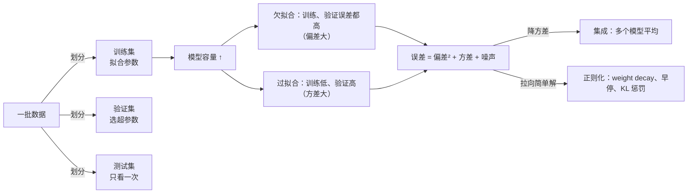

"机器学习"三个字里最重要的是"学习"，而学习的定义只有一句话：**从有限的样本推断没见过的样本**。一个模型把训练数据全背下来不叫学习，能在没见过的数据上表现好才叫——这个能力叫**泛化**。这一篇用一个能画出来的例子（30 个点拟合一条正弦曲线）建立整个算法地图最基础的四个概念：数据怎么划分、什么是过拟合与欠拟合、误差从哪来（偏差-方差）、什么是正则化。然后把它们对到 LLM 上：benchmark 污染是测试集泄漏，reward hacking 是在一个过拟合的评估器上做优化。

全篇的核心问题是：

> **benchmark 涨了 5 个点，怎么知道不是测试题泄漏？[^q0] 奖励模型的准确率 80%，为什么 RL 还会钻空子？[^q1]**

## 一、总览

### 1. 四个概念一张图

本文按"一次实验的时间顺序"组织：先有数据（怎么切），再拟合模型（拟合得太少还是太多），再看误差从哪里来（偏差还是方差），最后看怎么修（正则化）。四个概念之间的关系是：



### 2. 本文的章节安排

| 章 | 主题 | 内容 |
|---|---|---|
| 二 | 学习与泛化 | 定义；训练误差 vs 泛化误差；`fit` 到底在做什么（5 行手写版） |
| 三 | 划分 | 训练 / 验证 / 测试各干什么；随机切、分层切、按时间切、按组切——切错了分数虚高多少 |
| 四 | 过拟合与欠拟合 | 30 个点拟合正弦：三张拟合图、一条"先降后升"曲线；不可约误差；学习曲线——数据多了过拟合就消失 |
| 五 | 测试集泄漏 | 在测试集上选超参数偏乐观多少（200 次重复的直方图）；benchmark 污染的两种形态；n-gram 检测的 10 行代码 |
| 六 | 偏差-方差 | 三个数的手算例子；分解公式逐项解释；100 个模型的预测带；集成只降方差；LLM 上的三种集成 |
| 七 | 正则化 | 任何把模型拉向简单解的项；KL 惩罚、LoRA 也是 |
| 八 | reward hacking | 在过拟合的评估器上做优化；经典解法逐条对应 |
| 九 | 本文小结 | |
| 十 | 自测 | 七道题 |

## 二、学习与泛化

### 1. 定义

有一批数据 $$(x_i, y_i)$$：$$x$$ 是输入（一段文本、一张图、一行表格），$$y$$ 是想预测的东西（类别、数值、下一个 token）。**监督学习**是找一个函数 $$f$$ 使 $$f(x) \approx y$$——但不是在这批数据上，而是在**同一来源的、没见过的**数据上。

一个最小的例子贯穿全篇：真实规律是 $$y = \sin 2\pi x$$，但我们看不到它，只拿到 30 个点，每个点的 $$y$$ 还加了标准差 0.3 的随机噪声（测量误差）。任务是从这 30 个点猜出那条曲线，让它在**新的** $$x$$ 上也预测得准。

先说清"误差"怎么量。**损失**（loss）是一个数，衡量一次预测错了多少。本文用的损失是**均方误差**（MSE，mean squared error）：每个样本"预测值减真值"的平方，再对所有样本取平均。三个点的预测分别差 0.1、−0.2、0.3，MSE 就是 $$(0.01 + 0.04 + 0.09) / 3 = 0.047$$。平方有两个作用：去掉正负号（差 −0.2 与差 0.2 一样糟），以及让大错误的代价不成比例地大（差 0.3 的代价是差 0.1 的 9 倍）。

两个误差：**训练误差**是 $$f$$ 在训练数据上的平均损失；**泛化误差**是它在"全部可能遇到的数据"上的[期望](# "tip: 期望（expectation，记作 E[·]）就是按概率加权的平均值：把每个可能结果乘上它出现的概率再加起来。对一批等可能的样本，它就是普通的算术平均。「期望损失」= 在无穷多个新样本上的平均损失")损失——想象把将来所有会遇到的样本都拿来算一遍 MSE 的平均。我们能算前者、关心后者。两者的差距叫**泛化差距**——它是本篇一切讨论的对象。

噪声的量级用**标准差**描述：30 个点的 $$y$$ 在真实曲线上下随机偏移，偏移量的"典型大小"是 0.3——大约三分之二的点偏移不超过 0.3。标准差的平方叫**方差**：$$0.3^2 = 0.09$$。它与 MSE 是同一种量（都是"差的平方的平均"），所以噪声标准差 0.3 对应的 MSE 是 0.09——这个数字后面会反复出现，它是任何模型在这批数据上都无法突破的下限。

### 2. scikit-learn 的三个方法

本系列的代码用 scikit-learn，它的所有模型只有三个方法：

```python
model.fit(X_train, y_train)      # 学：在训练数据上找参数
model.predict(X_new)             # 用：对新输入给预测
model.score(X_test, y_test)      # 评：在一批数据上算一个分数（分类是准确率，回归是 R²）
```

`X` 是 `[样本数, 特征数]` 的二维数组——每一行一个样本、每一列一个特征（如 30 个点、1 个特征就是 `[30, 1]`）；`y` 是 `[样本数]`，每个样本一个答案。[R²](# "tip: 决定系数：1 减去「模型的 MSE / 直接用均值预测的 MSE」。1 是完美，0 是与猜均值一样差，可以为负")是回归任务的默认分数。整个系列不需要更多接口。

### 3. `fit` 到底在做什么

本文的模型是**多项式**：$$f(x) = w_0 + w_1 x + w_2 x^2 + \cdots + w_d x^d$$，次数 $$d$$ 越高、能画出的形状越复杂。"拟合"就是找一组系数 $$w$$，让 30 个点上的 MSE 最小。它只有三行：

```python
def fit_poly(x, y, degree):
    A = np.vander(x, degree + 1, increasing=True)      # ① 设计矩阵 [n, d+1]：每行 1, x, x², …, x^d
    w, *_ = np.linalg.lstsq(A, y, rcond=None)          # ② 最小二乘：让 ||A w − y||² 最小的 w
    return w

def predict_poly(w, x):
    return np.vander(x, len(w), increasing=True) @ w   # ③ 预测：同样的特征乘系数
```

1. ① 把每个 $$x$$ 展开成一行 $$[1, x, x^2, \ldots, x^d]$$——例如 $$x = 0.5$$、3 次多项式，这一行是 $$[1, 0.5, 0.25, 0.125]$$；30 个点就是一个 30 行、$$d + 1$$ 列的表格，叫**设计矩阵** $$A$$；
2. ② 这一行的每个数乘上对应的系数再相加，$$1 \cdot w_0 + 0.5 w_1 + 0.25 w_2 + 0.125 w_3$$，就是 $$f(0.5)$$。`lstsq` 求一组 $$w$$，让 30 个这样的预测与 30 个 $$y$$ 之差的平方和最小——这就是**最小二乘**（least squares），第二篇会用 3 个点手算它并推导为什么有闭式解；
3. ③ 预测新点时用同样的展开乘上 $$w$$（`@` 是矩阵乘法：每行与 $$w$$ 对应相乘再相加）。

scikit-learn 里对应的写法是 `make_pipeline(PolynomialFeatures(d), LinearRegression())`，两者在 1000 个新点上的预测最大相差 $$1.3 \times 10^{-14}$$——同一个算法。之后的实验都用 scikit-learn 的写法，但每次看到 `fit`，它做的就是上面这三行。

## 三、划分

### 1. 三份数据

经典机器学习的第一课是把数据分成三份：

| 份 | 用来 | 能看几次 |
|---|---|---|
| 训练集 | 拟合参数（`fit`） | 随便 |
| 验证集 | 选超参数（模型复杂度、学习率、正则强度）、早停 | 每试一个配置看一次 |
| 测试集 | 报告最终的泛化性能 | **一次** |

为什么要三份而不是两份：验证集参与了决策（选了哪个配置），它上面的分数就带了"选择偏差"——你挑的是在它上面最好的那个，那个分数偏乐观。测试集是唯一没有参与任何决策的数据，它报出的数字才是泛化误差的无偏估计。**测试集一旦参与了任何决策，它就变成了验证集**。

### 2. 一次划分

300 个点，先切出 60% 训练，剩下的对半分成验证与测试：

```python
Xtr, Xtmp, ytr, ytmp = train_test_split(X, y, test_size=0.4, random_state=0)
Xva, Xte, yva, yte = train_test_split(Xtmp, ytmp, test_size=0.5, random_state=0)
for d in range(1, 16):                                   # 在验证集上从 1 次试到 15 次
    m = poly_model(d).fit(Xtr, ytr)
    va = mse(m, Xva, yva)
    ...                                                  # 记下验证 MSE 最小的 d
```

```text
训练 180 / 验证 60 / 测试 60
用验证集选出次数 6（验证 MSE 0.085）；测试集只在最后看一次：测试 MSE 0.084
```

在验证集上把多项式次数从 1 试到 15、选出 6，然后测试集只看一次——0.084 与验证的 0.085 接近，说明验证集上的选择没有过度乐观。

### 3. 怎么切：四种划分

`train_test_split` 是**随机切**，它默认一个前提：样本之间彼此独立。这个前提经常不成立，于是有另外三种切法：

| 切法 | 什么时候用 | scikit-learn |
|---|---|---|
| 随机切 | 样本独立同分布 | `train_test_split`、`KFold` |
| 分层切（stratified） | 分类任务、类别不平衡：保证每份里各类的比例相同，否则小类可能全落在一边 | `train_test_split(stratify=y)`、`StratifiedKFold` |
| 按时间切 | 数据有时间顺序（日志、行情、用户行为）：只能用过去预测未来，随机切会让模型"偷看未来" | `TimeSeriesSplit` |
| 按组切（group） | 多个样本来自同一个源（同一篇文档切出的多段、同一个用户的多条记录、同一张图的多个裁剪）：同一组必须在同一侧 | `GroupKFold`、`GroupShuffleSplit` |

切错了分数虚高多少？下面的实验：60 个"源"点，每个源复制 5 份、加上极小的抖动，模拟"同一篇文档切成 5 段"——300 个样本里每个都有 4 个近似的兄弟。用随机 5 折[交叉验证](# "tip: cross-validation，CV：把数据切成 5 份，轮流拿 1 份当验证、其余 4 份训练，5 次验证误差取平均。比只切一次更稳，第十篇详细讲")与按组 5 折交叉验证各估一次误差，再用 2000 个全新的点算真实误差：

| 次数 | 随机 5 折 CV | 按组 5 折 CV | 全新数据 |
|---:|---:|---:|---:|
| 3 | 0.060 | 0.066 | 0.101 |
| 9 | 0.061 | 0.088 | 0.098 |
| 15 | 0.060 | 0.088 | 0.102 |

随机切时，每个验证样本的 4 个兄弟都在训练集里，模型只要记住它们就能"预测"验证样本，三个次数的 CV 分数都是 0.060，比真实的 0.10 乐观 40%，而且完全分不出 3 次与 15 次谁更好。按组切的分数虽然也偏乐观（复制品共享噪声，组内 60 个源点本身就少），但至少排出了正确的顺序。**LLM 的数据集里到处是"组"**：同一个网页去重后的多个版本、同一道题的多种改写、同一个对话的多轮——按样本随机切，验证分数就是虚的。

## 四、过拟合与欠拟合

### 1. 一个能画出来的例子

用 30 个带噪声的点（$$y = \sin 2\pi x + \varepsilon$$，噪声标准差 0.3）拟合多项式。先看三种容量画出来是什么样：


- **次数 1**：一条直线，怎么放都离正弦很远——训练误差 0.272、验证误差 0.308 **都高**。模型太简单，这叫**欠拟合**。
- **次数 4**：曲线贴着真实函数走，训练 0.077、验证 0.098。
- **次数 15**：曲线拼命穿过每一个训练点——包括那些被噪声推偏的点——于是在点与点之间、尤其右端没有点的地方甩了出去。训练误差 0.049 更低了，验证误差 0.138 却更高。它在**拟合噪声**，这叫**过拟合**。

把次数从 1 扫到 25，每个次数记下训练 MSE 与验证 MSE（验证用另外 1000 个新点）：

| 次数 | 训练 MSE | 验证 MSE | 判断 |
|---:|---:|---:|---|
| 1 | 0.272 | 0.308 | 欠拟合（两个都高） |
| 3 | 0.082 | 0.094 | 合适 |
| 5 | 0.056 | 0.114 | 合适 |
| 9 | 0.051 | 0.105 | 合适 |
| 15 | 0.049 | 0.138 | 过拟合（训练低、验证高） |
| 25 | 0.040 | 0.313 | 过拟合（训练低、验证高） |

画成曲线，就是每本教材都有的那张图——训练误差一路向下，验证误差先下后上：


三段：

1. **欠拟合**（次数 1–2）：训练与验证误差都高——模型太简单，连训练数据都描述不了。
2. **合适**（3–10）：训练误差降下来，验证误差接近下限 0.09。
3. **过拟合**（11 以上）：训练误差继续降（0.040——比噪声方差还低，说明它在拟合噪声），验证误差飙升（0.313，比直线还差）。模型容量大到能把 30 个点连同它们的随机噪声一起背下来，在没见过的点上乱跳。

这张图就是**模型容量 vs 泛化**的全部关系：训练误差随容量单调下降，验证误差先降后升，最低点就是合适的容量。（17 次以后两条曲线都走平，是因为 30 个点在 $$[0,1]$$ 上的高次幂彼此几乎相同，求解器把多出来的方向当成零丢掉了——第二篇讲"共线"时会再遇到它。）

### 2. 不可约误差

验证 MSE 最好也只有 0.094，降不到 0——因为数据本身有噪声方差 0.09。这部分叫**不可约误差**（irreducible error）：不管模型多好，数据里的随机性不可能预测。语言模型也有同一个下限：下一个 token 本来就有多种合理可能（"今天天气"后面可以是"很好"也可以是"不错"），这种内在的不确定性叫[熵](# "tip: 信息论里衡量「有多不确定」的量。一个分布越平均、越难猜，熵越大。语言的熵是它的不可约误差——再好的模型也不能把 loss 压到它以下")，训练 loss 再低也降不到它以下；Chinchilla 论文的拟合公式里那一项常数 $$E = 1.69$$，就是他们估出的这个下限。

### 3. 学习曲线：数据多了，过拟合就消失

上面固定了 30 个点、改变容量。反过来固定容量、改变数据量，得到的是**学习曲线**：


| 训练样本数 | 4 次：训练 / 验证 | 15 次：训练 / 验证 |
|---:|---|---|
| 15 | 0.057 / 0.156 | 0.026 / 20.9 |
| 30 | 0.073 / 0.111 | 0.053 / 0.169 |
| 100 | 0.096 / 0.102 | 0.088 / 0.102 |
| 1000 | 0.092 / 0.097 | 0.088 / 0.093 |

两个规律：

1. **验证误差随数据量下降、训练误差随数据量上升**，两者最终都收敛到噪声方差 0.09 附近——数据多到模型背不下来的时候，它只能学规律。
2. 15 次多项式在 15 个点上是灾难（验证 MSE 20.9），在 100 个点上就与 4 次一样好。**过拟合是"容量相对于数据太大"，不是容量本身的罪**。这就是为什么 LLM 几千亿参数却不怎么过拟合：15T token 的数据相对于参数量仍然是"数据多"的一侧——而它一到几千条 SFT 数据上训三个 epoch，就立刻回到左边那个 15 个点的世界。

### 4. 什么时候最容易过拟合

**模型容量大、数据少**。参数比样本多的时候，模型总有办法把训练数据背下来。经典的处理：更多数据（学习曲线往右走）、限制容量、正则化（第七章）、早停（验证误差开始升就停）。第八章会看到这四条在 LLM 上各是什么。

## 五、测试集泄漏

### 1. 在测试集上选模型，分数就不算数

如果偷懒不分验证集、直接在测试集上试次数 1 到 12 挑最好的，报出来的分数偏乐观多少？重复 200 次（每次一批新的 40 个点、20 训练 20 测试），每次记下"在测试集上挑出的最好 MSE"与"同一个模型在 2000 个全新点上的真实 MSE"之差：


```text
200 次重复：'在测试集上选出的最好分数' 比 '同一模型在全新数据上的真实分数' 平均乐观 0.255（MSE），68% 的情况下真实更差；中位数 0.015
```

中位数 0.015 看起来不大，平均值 0.255 却很大——直方图右边那条长尾：有几次 20 个测试点恰好让一个 10 次多项式"看起来"最好，选了它，在新数据上就是灾难。在 20 个测试点上"挑最好的"本身就是一种拟合——挑出来的那个配置恰好在这 20 个点上运气好。**测试集泄漏**（test set leakage）说的就是这个：测试数据以任何形式参与了训练或选择，它报出的数字就不再是泛化性能。

### 2. LLM 上的两种形态

规模大得多，但概念相同：

1. **污染**（contamination）：预训练语料是从互联网抓的，GSM8K、MMLU 的题目与答案早就在网上，一个 15T token 的语料几乎一定包含它们的某种变体。模型"见过"测试题，分数就是记忆而不是能力。
2. **过度调参**：在同一个 benchmark 上反复调 prompt、调配方、选 checkpoint。即使题目没泄漏，benchmark 也变成了验证集——上面那个实验里的 0.255 就是它的缩小版。

### 3. 怎么查：n-gram 重叠

污染最常用的检测是 **n-gram 重叠**：把测试题切成连续 $$n$$ 个词的片段，到训练语料里查有多大比例出现过。代码只有几行：

```python
def ngrams(tokens, n):
    return {tuple(tokens[i:i + n]) for i in range(len(tokens) - n + 1)}   # ① 所有连续 n 个词的片段

def contamination_rate(test_text, corpus_ngrams, n=8):
    grams = ngrams(test_text.lower().split(), n)
    return len(grams & corpus_ngrams) / max(1, len(grams))               # ② 测试题的片段有多少出现在语料里

corpus_grams = set().union(*(ngrams(doc.lower().split(), 8) for doc in corpus))  # ③ 语料的全部 8-gram
```

用一个三句话的"语料"（其中一句是被抓进去的 GSM8K 风格原题）试三道题：

| 测试题 | 8-gram 重叠率 |
|---|---:|
| 原题（被抓进语料） | 0.77 |
| 改写（数字换了） | 0.05 |
| 无关题 | 0.00 |

原题的重叠率 0.77（没到 1 是因为题目末尾的问句不在语料里）；只把数字换掉，重叠率就掉到 0.05——**n-gram 检测抓得住原文，抓不住改写**。GPT-4 技术报告用 50 个字符的子串匹配，Llama 3 用 8-gram 的 token 重叠并报告了每个 benchmark 的"污染后 / 净"分数差。更强的办法：**困惑度对比**（模型在测试题原文上的 loss 异常低，说明背过）、留出**私有测试集**、**动态 benchmark**（题目定期更换或从线上新产生）。L4 数据工程与 L5 评测都会碰到它，但概念在这一层：**没有干净的测试集，评测数字就没有含义**。

## 六、偏差-方差

### 1. 先看一个能手算的例子

第四章说过拟合"在没见过的点上乱跳"，欠拟合"怎么放都离正弦很远"。这两种错误性质不同：一种是**随机的**——换一批训练数据，跳的方向就不一样；一种是**系统性的**——换多少批数据，直线还是直线，永远贴不上正弦。偏差-方差分解把误差拆成这两块。

先用几个数体会。真实值是 2.0，用三批不同的训练数据训出三个模型，它们在同一个 $$x$$ 上的预测分别是 1.0、1.2、1.4：

| | 计算 | 结果 |
|---|---|---:|
| 平均预测 | $$(1.0 + 1.2 + 1.4) / 3$$ | 1.2 |
| 偏差² | $$(1.2 - 2.0)^2$$——平均预测离真值多远 | 0.64 |
| 方差 | $$[(1.0 - 1.2)^2 + 0 + (1.4 - 1.2)^2] / 3$$——三个预测围着平均值抖多大 | 0.027 |
| 三个模型的平均误差 | $$[(1.0 - 2)^2 + (1.2 - 2)^2 + (1.4 - 2)^2] / 3 = (1 + 0.64 + 0.36) / 3$$ | 0.667 |

$$0.64 + 0.027 = 0.667$$——**平均误差恰好等于偏差² 加方差**（这里没有噪声）。这三个模型的问题主要是偏差：它们互相很接近（方差小），但一起偏低。如果三个预测是 0.5、2.0、3.5，平均仍是 2.0、偏差² 是 0，方差却是 1.5——每个模型都错得不少，但错的方向随机，平均起来反而对。第一种像欠拟合的直线，第二种像过拟合的 15 次多项式。

### 2. 分解公式

一般地，一个模型的期望误差可以拆成三项：

$$
\underbrace{\mathbb{E}\big[(f(x) - y)^2\big]}_{\text{期望误差}} = \underbrace{\big(\mathbb{E}[f(x)] - f^*(x)\big)^2}_{\text{偏差}^2} + \underbrace{\mathbb{E}\big[(f(x) - \mathbb{E}[f(x)])^2\big]}_{\text{方差}} + \underbrace{\sigma^2}_{\text{噪声}}
$$

每个符号的意思：

- $$f^*(x)$$：真实函数（这里是 $$\sin 2\pi x$$）；
- $$f(x)$$：用**某一批**训练数据训出来的模型的预测。换一批训练数据，它就变——所以它是随机的；
- $$\mathbb{E}[f(x)]$$：对"所有可能的训练批次"取平均——用很多批数据各训一个模型，把它们的预测平均起来；
- **偏差**：这个平均预测离真实函数多远。模型太简单，不管拿哪批数据训，平均起来还是错的——**系统性地错**；
- **方差**：单个模型的预测围着平均值抖多大。模型太敏感，换一批数据结果就完全不同——**随机地错**；
- $$\sigma^2$$：数据噪声的方差，0.09，不可约。

这个等式为什么成立？把 $$f(x) - y$$ 拆成三段之和：$$[f(x) - \mathbb{E}f(x)] + [\mathbb{E}f(x) - f^*(x)] + [f^*(x) - y]$$——"单个预测离平均预测"、"平均预测离真值"、"真值离观测值（噪声）"。平方展开后三个平方项就是方差、偏差²、噪声；三个交叉项的期望都是零（第一段围着自己的均值抖、平均为零；第三段是与模型无关的噪声、平均为零），所以消掉了。上面的小例子就是这个等式在三个数上的验算。

### 3. 看得见的偏差与方差

用 100 批不同的 30 个点各训一个模型，把它们的预测曲线都画出来：


算出来的数字（对 200 个 $$x$$ 取平均）：

```python
preds = np.array([poly_model(d).fit(*make_data(30, seed=s)).predict(xs) for s in range(100)])  # ① [100 个模型, 200 个 x]
bias2 = np.mean((preds.mean(0) - truth(xs[:, 0])) ** 2)   # ② 平均预测与真值的差的平方
var = np.mean(preds.var(0))                                # ③ 100 个预测在每个 x 上的方差
```

| 次数 | 偏差² | 方差 | 20 个模型平均后的方差 | 平均后的偏差² |
|---:|---:|---:|---:|---:|
| 1 | 0.158 | 0.025 | 0.001 | 0.152 |
| 4 | 0.003 | 0.014 | 0.001 | 0.003 |
| 15 | 0.008 | 0.662 | 0.341 | 0.001 |

低次偏差大、高次方差大——这就是第四章那条"先降后升"曲线的分解：容量增加降偏差、升方差，合适的容量是两者之和最小的地方。

### 4. 集成只降方差

表的后两列：把 20 个（各用不同数据训的）模型的预测**平均**，1 次与 4 次的方差降到原来的几十分之一，偏差**不变**（1 次的 0.158 → 0.152）。这叫**集成**（ensemble）；用重采样的数据训多个模型再平均叫 **bagging**，随机森林（第六篇）就是它。原理是"独立量的平均，方差除以 $$n$$"：掷一个骰子，结果在 1 到 6 之间乱跳；掷 20 个取平均，结果就稳稳地落在 3.5 附近——单个的随机波动在平均里互相抵消了。模型的方差是"随机地错"，平均掉的正是它；偏差是"一起朝同一个方向错"，平均多少个也抵消不了。15 次多项式的方差只降了一半而不是 20 倍，是因为 20 个模型用的数据有重叠、误差不独立。

集成在 LLM 上以三种形态出现：

1. **self-consistency**：同一个问题采样多次、多数投票，把解码的随机性平均掉，数学题上常有几个点的提升；代价是推理成本乘以采样次数；
2. **judge 集成**：多个 judge 模型或多次打分取平均，降低单个 judge 的随机性——但**不能降低它们共同的系统偏差**（比如都偏好长回答，第十篇）；
3. **模型融合**：把同一个基座的多个微调版本的权重平均（model soup），在多任务上常优于任何单个版本，前提是它们在同一个 loss 盆地里。

### 5. 为什么多 seed 的结果差异那么大

小模型、小数据上的实验**方差很高**，两个配方的差异可能小于 seed 之间的差异——L1 第六篇里 20 步训练换个 seed 差 0.14 就是这个。这是"多 seed 报均值与方差"的理论依据：你看到的单个数字里有一大块是方差。

## 七、正则化

**正则化**（regularization）是给模型加一个"不要太相信训练数据"的先验——任何把模型拉向某个简单解的项。回到多项式的例子：15 次多项式之所以乱跳，是因为它的高次系数可以很大；如果在 loss 里加一项 $$\lambda \sum_j w_j^2$$ 惩罚大系数，它就被迫画一条平滑的曲线——这是 **Ridge 回归**，第二篇会画出系数随 $$\lambda$$ 缩小的路径。经典形态还有：

1. **weight decay**（$$\frac{\lambda}{2}\lVert W \rVert^2$$，就是上面的 Ridge）：拉向零；
2. **dropout**：训练时随机关掉一部分神经元，逼模型不依赖任何单个特征（L3 第四篇）；
3. **早停**：验证误差开始升就停，不让模型有时间背；
4. **数据增强**：人为制造更多样本——学习曲线上往右走。

L3 会讲它们在深度网络里的具体形态；这里要建立的是概念：**看到一个新方法里的约束项，先问它在把模型拉向什么**。RLHF 的 KL 惩罚是正则化（先验是参考模型，L0 第六篇），LoRA 的低秩约束是正则化（先验是"改动很小"，L0 第三篇），few-shot 示例数量的限制也可以看成正则化。

## 八、reward hacking

### 1. 奖励模型是过拟合的典型

**奖励模型**（第三篇会讲它就是逻辑回归）：一个 8B 参数的特征提取器加一个线性头，偏好数据通常只有几万到几十万对。**参数与样本的比例是经典机器学习里不敢想的**——第四章"容量大、数据少"的极端情形，学习曲线最左端。结果是它学到的不是"什么是好回答"，而是训练集里好回答的**表面特征**：更长、更多列表、更客气的语气。在训练集上准确率一路上涨，在留出集上到 70–80% 就停——那就是它的验证误差开始升的地方。

### 2. 在过拟合的评估器上做优化

RL 阶段，策略模型专门优化这个奖励——它会找到奖励模型给高分但人类不认可的输出：把表面特征推到极端，回答越来越长、越来越多列表、越来越空洞。奖励一路上涨、真实质量下降。这就是 **reward hacking**，本质是**在一个过拟合的评估器上做优化**：评估器在训练分布之外的判断是随机的（第四章 15 次多项式在没有训练点的右端乱甩），优化器专门去那里找漏洞。

### 3. 经典解法逐条对应

| 经典解法 | 在 RLHF 里的形态 |
|---|---|
| 更多、更多样的数据 | 更多偏好对、覆盖更多类型的回答 |
| 正则化 | **KL 惩罚**：把策略拉在参考模型附近，不让它跑到奖励模型没见过的分布去 |
| 早停 | 限制 RL 的步数；监控真实质量而不只是奖励 |
| 集成（降方差） | 多个奖励模型取最小或均值 |
| 重新标注 | 定期用当前策略的输出收集新偏好、重训奖励模型（让评估器的训练分布跟上策略） |

SFT 也有同一个问题的温和版：几千条指令数据训三个 epoch 之后，模型开始逐字复述训练集的回答——这是第四章表里次数 25 那一行。

## 九、本文小结

- **学习 = 从有限样本推断没见过的样本**；训练误差能算、泛化误差是目标；`fit` 就是"找让训练误差最小的参数"（多项式的情形是三行最小二乘）。
- **三份数据**：训练集拟合、验证集选超参数、测试集**只看一次**——参与了任何决策的数据都不再是测试集。**怎么切**要看样本是否独立：有类别不平衡用分层切，有时间顺序按时间切，有"同源"样本按组切——随机切近重复数据，CV 分数 0.060 vs 真实 0.10。
- **过拟合与欠拟合**：容量增加，训练误差单调降、验证误差先降后升；30 个点拟合正弦，次数 25 的训练 MSE 0.040 低于噪声方差 0.09（在拟合噪声）、验证 MSE 0.313 比直线还差。**不可约误差**是下限。**学习曲线**：数据到 100 个点，15 次多项式与 4 次一样好——过拟合是容量相对于数据太大。
- **测试集泄漏**：在 20 个测试点上挑最好的配置，中位数乐观 0.015、平均 0.255（长尾）。LLM 上两种形态：**污染**（测试题在预训练语料里，n-gram 重叠查原文、查不了改写）与**过度调参**（benchmark 变成验证集）。没有干净的测试集，评测数字就没有含义。
- **偏差-方差**：误差 = 偏差² + 方差 + 噪声；偏差是"平均预测离真值多远"（系统性错），方差是"单个预测抖多大"（随机错）；低次偏差大、高次方差大；**集成只降方差**——self-consistency、judge 平均、model soup 都是集成，消不掉系统偏差。
- **正则化**是任何把模型拉向简单解的项：weight decay、dropout、早停、KL 惩罚、LoRA 的低秩。
- **reward hacking** = 在一个过拟合的评估器上做优化；经典解法（更多数据、KL 正则、早停、集成、重新标注）逐条对应。

配套代码：本文全部数字与图由 [`classical-ml/01_learning_and_generalization.py`](https://github.com/arganzheng/ai-learning-labs/blob/main/classical-ml/01_learning_and_generalization.py) 产生（`fit` / `learncurve` / `split` / `groups` / `contamination` / `leak` / `biasvar` 七个子实验），CPU 上一分钟跑完。

## 十、自测

1. 训练误差 0.05、验证误差 0.30，是欠拟合还是过拟合？该往哪个方向调？

   <details markdown="1"><summary>答案</summary>

   过拟合；减容量、加正则、加数据、早停。

   </details>

2. 为什么在验证集上选出的配置，验证集分数偏乐观，而测试集分数不偏？

   <details markdown="1"><summary>答案</summary>

   验证集参与了"挑最好"的决策，挑出的是在它上面运气好的配置；测试集没参与任何决策。

   </details>

3. 一个数据集里每个用户有 20 条记录，要预测新用户的行为。随机切 8:2 会怎样？该怎么切？

   <details markdown="1"><summary>答案</summary>

   每个验证用户的其他记录都在训练集里，模型记住用户就能"预测"，分数虚高（第三章实验里 0.060 vs 0.10）；按用户分组切（`GroupKFold`），验证集里的用户在训练集里一条都没有。

   </details>

4. 一个模型在 benchmark A 上从 60 涨到 65，团队在 A 上调了三个月的 prompt。这 5 个点可信吗？为什么？

   <details markdown="1"><summary>答案</summary>

   不可信，A 已经变成验证集（过度调参 = 泄漏的一种形态）；要看一个没调过的私有测试集。

   </details>

5. 用 8-gram 重叠检测污染，一道被改写过（数字换了、句式换了）的题会被查出来吗？

   <details markdown="1"><summary>答案</summary>

   查不出来：改写后重叠率从 0.77 掉到 0.05。n-gram 只抓原文，改写要靠困惑度对比或私有测试集。

   </details>

6. self-consistency 采样 10 次投票能不能修正模型"系统性地把某类题算错"？为什么？

   <details markdown="1"><summary>答案</summary>

   不能：集成只降方差（随机错），不降偏差（系统性错）。

   </details>

7. 把 RLHF 的 KL 系数 $$\beta$$ 调大，从偏差-方差 / 正则化的角度看在做什么？

   <details markdown="1"><summary>答案</summary>

   加强正则化：把策略拉向参考模型这个"先验"，减少它在奖励模型不可靠区域的探索。

   </details>

## 下一篇

下一篇讲最简单的模型——线性回归：本文 `fit_poly` 里那一行 `lstsq` 到底解了什么方程，为什么它有闭式解，梯度下降怎么走到同一个答案，以及给系数加惩罚（Ridge / Lasso）之后曲线怎么变平滑。

[^q0]: 先问测试集是不是还是测试集。它一旦参与过任何决策（挑配置、挑 checkpoint）就变成了验证集，分数带选择偏差——20 个测试点上挑最好的配置平均乐观 0.255；LLM 上另一种形态是污染——测试题在预训练语料里，8-gram 重叠能查出原文（重叠率 0.77）、查不出改写（0.05）。检查的办法是换一份没参与过决策、确认不在语料里的题重测。详见[第三章](#三划分)、[第五章](#五测试集泄漏)。
[^q1]: RM 是在有限偏好数据上拟合的分类器，它在数据分布外的判断不受约束——就像 15 次多项式在没有训练点的右端乱甩；RL 在它上面做优化就是专门去找它判断错的地方——在一个过拟合的评估器上做优化，经典机器学习叫「在验证集上选模型」，这里叫 reward hacking。80% 是分布内的准确率，说不了分布外的事。详见[第四章](#四过拟合与欠拟合)、[第八章](#八reward-hacking)。
