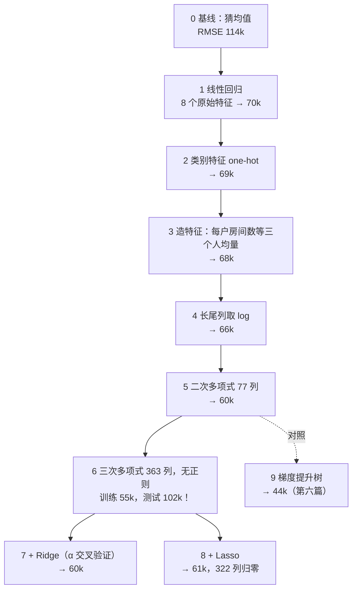

**线性回归**是最简单的模型：用一条直线（高维时是一个平面）预测一个数。它简单到有闭式解——写出公式就能算出最优参数——但它同时是后面一切的原型：每一个神经网络的最后一层都是它（或它的分类版本），weight decay 就是它的 Ridge 正则，梯度下降、学习率、特征缩放、共线这些深度学习里天天遇到的问题，都可以在它身上用两个参数画出来看清楚。这一篇从 20 个点拟合一条直线开始，把这些概念一个一个建立起来。

全篇的核心问题是：

> **`lstsq` 那一行到底解了什么方程，为什么它一步就能算出答案？[^q0] 梯度下降为什么有时候要几百步、有时候直接发散？[^q1] LLM 训练配置里的 `weight_decay=0.1` 和一百年前的 Ridge 回归是什么关系？[^q2]**

## 一、总览

### 1. 一条直线、一个碗形的损失面、一个惩罚项

本文按"从一个模型到一个训练过程"的顺序组织，全文只有三样东西：**一条直线**（模型：$$\hat y = w^T x + b$$）、**一个碗形的损失面**（把"直线离数据有多远"记成残差平方和，它随参数变化的曲面是一个碗，碗底就是最优参数——第四章会把这个碗画出来，"让碗变圆""碗与沟"说的都是它）、**一个惩罚项**（Ridge / Lasso 往损失里加的那一项）。顺序是：先定义模型与损失，再看两种求解方式（闭式解一步到位、梯度下降一步一步走到碗底），再看梯度下降在什么地形上难走（碗太扁——特征量纲、共线），最后给损失加惩罚项并证明它就是 weight decay。

| 概念 | 一句话 | 本文里的数字 |
|---|---|---|
| 模型 | $$\hat y = w^T x + b$$，特征的加权和 | 20 个点：$$w = 1.525, b = 1.997$$ |
| 损失 | 残差的平方和（MSE） | 最小二乘 38.7 vs 随手猜的直线 98 |
| 闭式解 | $$(X^T X) w = X^T y$$，解一个线性方程组 | 与梯度下降差 $$5 \times 10^{-10}$$ |
| 梯度下降 | 沿损失下降最快的方向走 | 学习率上限 = 2 / 最大特征值 = 0.027 |
| 特征缩放 | 让损失面这个碗变圆，梯度下降不再在窄沟里打转 | 条件数 540 万 → 1 |
| Ridge / Lasso | 惩罚大系数：$$L_2$$ 压小、$$L_1$$ 压到零 | 50 个特征，Lasso 归零 45 个 |
| weight decay | 每步把 $$w$$ 乘 $$(1 - 2\eta\lambda)$$ | 与 Ridge 闭式解差 $$10^{-13}$$ |

Table: 线性回归的概念与本文里的数字

### 2. 本文的章节安排

| 章 | 主题 | 内容 |
|---|---|---|
| 二 | 模型与损失 | 一条直线、20 个点<br/>残差<br/>为什么用平方<br/>多个特征就是矩阵乘 |
| 三 | 闭式解 | 一个参数时求导令为零<br/>两个参数时是两个方程<br/>写成矩阵就是正规方程<br/>投影的几何<br/>为什么实现不显式求逆：条件数、inv / solve / lstsq 三种求解器 |
| 四 | 梯度下降 | 一个参数时用导数当指南针、手算四步<br/>两个参数的碗与沟<br/>学习率上限从一个数推到矩阵<br/>GD vs SGD 到同一个答案<br/>矩阵形状与一步手算：3 个点上把 GD 的一步拆开 |
| 五 | 地形不好走的两种情形 | 特征量纲不同（沟太窄）；两个特征共线（沟没有底） |
| 六 | Ridge 与 Lasso | 加惩罚项<br/>系数路径<br/>菱形与圆的几何<br/>Lasso 做特征选择<br/>一维软阈值与坐标下降：稀疏从哪来<br/>α 乘在什么上：求和 / 平均两种写法的换算，手算、NumPy、sklearn 对齐 |
| 七 | Ridge 就是 weight decay | 推导 + 数值对上；回到上一篇的 15 次多项式 |
| 八 | 为什么是平方 | 高斯噪声的最大似然；有离群点时换绝对值 |
| 九 | 案例：加州房价预测 | 20,640 个真实街区，从"猜均值"到 Ridge / Lasso 十步，每步误差降多少<br/>系数怎么读<br/>三次多项式无正则测试误差翻倍、Ridge 拉回来、Lasso 砍掉 322 列 |
| 十 | 本文小结 |  |
| 十一 | 自测 | 八道题 |

Table: 本文的章节安排

### 3. 来龙去脉：两百年还在用的模型

线性回归是所有机器学习模型里最老的一个，也是唯一一个每本统计教材、每个深度学习框架都有的。它的历史就是"拟合"这件事的历史：

| 年 | 谁 | 当时的问题 | 留下的东西 |
|---|---|---|---|
| 1805 / 1809 | Legendre、Gauss | 用几次不准的观测算出小行星的轨道——观测比未知数多，方程组无解，怎么取"最合理"的解 | **最小二乘**：让残差平方和最小；Gauss 证明如果误差是正态的，这就是最大似然（第八章） |
| 1886 | Galton | 高个子父亲的儿子平均比父亲矮、矮的比父亲高——"向均值回归" | **回归**这个词。后来词义漂移，今天"回归"只指"预测一个连续的数" |
| 1943 / 1970 | Tikhonov；Hoerl & Kennard | 特征多、样本少或特征共线时 $$X^T X$$ 不可逆，解乱跳 | **Ridge**：加 $$\alpha \lVert w \rVert^2$$，$$X^T X + \alpha I$$ 一定可逆（第六章） |
| 1996 | Tibshirani | 几千个基因里只有几十个和疾病有关，Ridge 把系数压小但一个都不归零 | **Lasso**：$$L_1$$ 惩罚把无用系数压到恰好为零，回归同时做特征选择 |
| 1986– | 反向传播 | 神经网络怎么训 | 每个神经网络的最后一层就是一个线性回归（或它的分类版）；weight decay 就是 Ridge（第七章） |

Table: 线性回归的来历

它为什么两百年后还在用？三个原因，每个都是后面某一章的内容：**有闭式解**（第三章：写出公式就能算，不用迭代，是检验一切数值方法的标尺）；**系数可以读**（第九章的案例：收入每高一个标准差房价高 7.8 万——树模型和神经网络给不出这样一句话）；**是一切的原型**（第四章的梯度下降、第五章的特征缩放与共线、第七章的 weight decay，都能在两个参数上画出来看清楚）。

什么时候**不**该用它：特征与目标的关系明显不是"加权和"（房价随收入的增长在高收入段变慢、位置与房价的关系是一张地图而不是一个斜率）——这时要么手工造特征（第九章的多项式、取 log），要么换非线性模型（第六篇的树模型在同一份数据上 RMSE 4.4 万 vs 线性的 6 万）。线性模型的上限就是"你能造出多好的特征"。

## 二、模型与损失

### 1. 一条直线、20 个点

20 个点，横坐标 $$x$$ 在 0 到 10 之间，纵坐标 $$y$$ 由 $$y = 1.5x + 2$$ 加上标准差 2 的噪声生成——我们假装不知道 1.5 和 2，要从点里把它们找回来。模型是一条直线：

$$
\hat y = w x + b
$$

- $$w$$：斜率——$$x$$ 每增加 1，$$\hat y$$ 增加多少；
- $$b$$：截距——$$x = 0$$ 时的预测；
- $$\hat y$$：预测值，戴帽子以区别于真实值 $$y$$。

哪条直线最好？先随手画两条，再看最小二乘选的那条：


### 2. 残差与平方和

每个点的预测值与真实值之差叫**残差**：$$r_i = y_i - \hat y_i$$。右图里每条竖线就是一个残差。评价一条直线好坏的标准是残差的平方和：

$$
L(w, b) = \sum_{i=1}^{n} \big(y_i - (w x_i + b)\big)^2
$$

| 直线 | $$w$$ | $$b$$ | 残差平方和 |
|---|---:|---:|---:|
| 直线 A | 1 | 5 | 97.6 |
| 直线 B | 2 | 0 | 89.2 |
| 最小二乘 | 1.525 | 1.997 | **38.7** |

Table: 两条候选直线的残差平方和

**最小二乘**（least squares）就是找让这个平方和最小的 $$(w, b)$$。找出来的 1.525 与 1.997 离真实的 1.5 与 2 很近——差的那点是 20 个点的噪声。平方和除以 $$n$$ 就是上一篇的 MSE（这里 1.934）。

**用 3 个点在纸上算一遍。**20 个点的数字算不过来，把问题缩小到 3 个点：$$(1, 3), (2, 5), (3, 8)$$。全文后面每个公式都会回到这 3 个点，所以先把它们记住。随手画一条 $$\hat y = 2x + 1$$：

| $$x_i$$ | $$y_i$$ | 预测 $$2x_i + 1$$ | 残差 $$r_i$$ | $$r_i^2$$ |
|---:|---:|---:|---:|---:|
| 1 | 3 | 3 | 0 | 0 |
| 2 | 5 | 5 | 0 | 0 |
| 3 | 8 | 7 | 1 | 1 |
| | | | 合计 | **1.0** |

Table: 3 个点的残差手算

这条线穿过前两个点、离第三个点差 1，平方和是 1.0——看起来已经不错。但最小二乘找到的是 $$w = 2.5, b = 1/3$$（第三章会算出它），三个残差是 $$0.167, -0.333, 0.167$$，平方和 $$0.028 + 0.111 + 0.028 = \mathbf{0.167}$$，比 1.0 小得多。它没有精确穿过任何一个点，却让三个点"都差一点"，而不是"两个点完全对、一个点差很多"——**平方**对大残差的惩罚是不成比例的（差 1 罚 1，差 0.333 只罚 0.111），所以最小二乘偏爱把误差摊平。第八章会说清为什么是平方而不是别的。

为什么要平方而不直接把残差加起来？残差有正有负，直接相加会互相抵消——一条离所有点都很远的线也可能残差之和为零。平方（或取绝对值）先把符号去掉，再相加才能衡量"总共差多少"。

### 3. 多个特征：矩阵写法

现实里输入通常不止一个数：预测房价要用面积、房龄、楼层……$$d$$ 个特征 $$x = (x_1, \ldots, x_d)$$，模型是它们的加权和：

$$
\hat y = w_1 x_1 + w_2 x_2 + \cdots + w_d x_d + b = w^T x + b
$$

$$w^T x$$ 读作"$$w$$ 转置乘 $$x$$"，就是两个向量对应位置相乘再相加（**点积**）：$$w = (1, 2), x = (3, 4)$$ 时 $$w^T x = 1 \times 3 + 2 \times 4 = 11$$。上标 $$T$$ 是**转置**——把行写成列、列写成行；写它只是为了让"一行乘一列"的矩阵乘法规则成立，不用想得更多。

把 $$n$$ 个样本摞成一个 $$n \times d$$ 的矩阵 $$X$$（每行一个样本），全部预测就是一次矩阵乘法 $$\hat y = X w + b$$——矩阵乘向量的规则是"$$X$$ 的每一行与 $$w$$ 做点积，得到一个数"，$$n$$ 行就得到 $$n$$ 个预测。再做一个常用的小动作：给 $$X$$ 加一列全 1，$$b$$ 就成了这一列的系数，可以并进 $$w$$ 里——之后的公式都不再单独写 $$b$$。用 3 个点写出来：

$$
X = \begin{pmatrix} 1 & 1 \\ 1 & 2 \\ 1 & 3 \end{pmatrix},\quad
w = \begin{pmatrix} b \\ w \end{pmatrix},\quad
X w = \begin{pmatrix} b + 1w \\ b + 2w \\ b + 3w \end{pmatrix},\quad
y = \begin{pmatrix} 3 \\ 5 \\ 8 \end{pmatrix}
$$

$$Xw$$ 的三行正好是三个点的预测值 $$w x_i + b$$，只是排成了一列。代码里是一行：

```python title="add_bias：左边加一列 1"
def add_bias(X):
    return np.c_[np.ones(len(X)), X]        # 左边加一列 1，b 变成 w[0]
```

`np.c_[...]` 把几个数组按列拼起来；`np.ones(len(X))` 是长度为 $$n$$ 的全 1 向量。之后 `X @ w` 就是矩阵乘（`@` 是 NumPy 的矩阵乘法运算符），一行算出全部预测。

## 三、闭式解

### 1. 先用一个参数看懂"求导令为零"

先把 $$b$$ 拿掉，只留斜率 $$w$$，模型是 $$\hat y = w x$$。损失 $$L(w) = \sum_i (y_i - w x_i)^2$$ 是 $$w$$ 的二次函数——展开后是 $$a w^2 + c w + e$$ 的形式，$$a = \sum x_i^2 > 0$$，图形是一个开口向上的抛物线。抛物线的最低点在哪里？**斜率为零的地方**：左边斜率为负（往右走会下降），右边斜率为正（往右走会上升），最低点恰好是斜率从负变正的那一点。函数在某点的斜率就是它的**导数**，所以"求最小值"变成"求导数、令它等于零、解方程"。

用 3 个点算：$$L(w) = (3 - w)^2 + (5 - 2w)^2 + (8 - 3w)^2$$。对每一项求导用链式法则——$$(a - bw)^2$$ 的导数是 $$2(a - bw) \cdot (-b)$$：

$$
L'(w) = -2 \cdot 1 \cdot (3 - w) - 2 \cdot 2 \cdot (5 - 2w) - 2 \cdot 3 \cdot (8 - 3w) = -2 \sum_i x_i (y_i - w x_i)
$$

令 $$L'(w) = 0$$：$$\sum_i x_i y_i = w \sum_i x_i^2$$，即 $$w = \frac{\sum x_i y_i}{\sum x_i^2} = \frac{3 + 10 + 24}{1 + 4 + 9} = \frac{37}{14} = 2.64$$。这是"过原点的最佳直线"的斜率。加回 $$b$$ 后有两个未知数，就要对 $$w$$ 和 $$b$$ 各求一次导（对一个求导时把另一个当常数，这叫**偏导数**），得到两个方程：

$$
\begin{aligned}
\frac{\partial L}{\partial b} = 0 &\;\Longrightarrow\; n\, b + \Big(\sum x_i\Big) w = \sum y_i &&\Longrightarrow\; 3b + 6w = 16 \\
\frac{\partial L}{\partial w} = 0 &\;\Longrightarrow\; \Big(\sum x_i\Big) b + \Big(\sum x_i^2\Big) w = \sum x_i y_i &&\Longrightarrow\; 6b + 14w = 37
\end{aligned}
$$

两个一次方程、两个未知数，初中解法：第一式得 $$b = (16 - 6w)/3$$，代入第二式 $$32 - 12w + 14w = 37$$，$$w = 2.5$$，$$b = 1/3$$。这就是第二章表里那条平方和 0.167 的直线。

### 2. 写成矩阵：正规方程

上面两个方程的系数——$$3, 6, 6, 14$$ 和右边的 $$16, 37$$——不是凭空来的。用第二章的 $$X$$ 算两个矩阵乘法：

$$
X^T X = \begin{pmatrix} 1 & 1 & 1 \\ 1 & 2 & 3 \end{pmatrix}
\begin{pmatrix} 1 & 1 \\ 1 & 2 \\ 1 & 3 \end{pmatrix}
= \begin{pmatrix} 3 & 6 \\ 6 & 14 \end{pmatrix},
\qquad
X^T y = \begin{pmatrix} 1 & 1 & 1 \\ 1 & 2 & 3 \end{pmatrix}
\begin{pmatrix} 3 \\ 5 \\ 8 \end{pmatrix}
= \begin{pmatrix} 16 \\ 37 \end{pmatrix}
$$

（$$X^T X$$ 左上角的 3 是"第一行 $$(1,1,1)$$ 点乘第一列 $$(1,1,1)$$"；右下角的 14 是 $$(1,2,3) \cdot (1,2,3) = 1 + 4 + 9$$。）**两个手算的方程，正好就是 $$X^T X\, w = X^T y$$ 这一个矩阵等式**——矩阵只是把"$$d$$ 个方程"打包成一行的记法。一般地，对 $$L(w) = \lVert X w - y \rVert^2$$（$$\lVert v \rVert^2$$ 表示向量 $$v$$ 各分量的平方和，这里就是残差平方和）求导：

$$
\frac{\partial L}{\partial w} = 2 X^T (X w - y) = 0
\quad \Longrightarrow \quad
X^T X\, w = X^T y
$$

这叫**正规方程**（normal equation）。它是一个 $$d \times d$$ 的线性方程组——$$X^T X$$ 是已知矩阵、$$X^T y$$ 是已知向量、$$w$$ 是未知数——解它就是最优解。写成"除过去"的形式（矩阵的"除"是乘[逆矩阵](# "tip: 方阵 A 的逆 A⁻¹ 满足 A⁻¹A = I（单位矩阵，对角线全 1、其余全 0，矩阵世界的 1）。用它两边同乘，就像解 3w = 6 时两边乘 1/3。不是每个方阵都有逆——行列式为零（某些行/列能由其他行/列拼出来）时没有")）：

$$
w^* = (X^T X)^{-1} X^T y
$$

上一篇 `fit_poly` 里的 `np.linalg.lstsq` 解的就是这个（用更稳的数值方法，不真的求逆）。手写版是一行：

```python title="fit_closed_form：解正规方程"
def fit_closed_form(X, y):
    return np.linalg.solve(X.T @ X, X.T @ y)     # 解 (XᵀX) w = Xᵀy
```

`np.linalg.solve(A, c)` 解线性方程组 $$A w = c$$，对 3 个点它算的就是上面那个 $$2 \times 2$$ 方程组，返回 `[0.333, 2.5]`。20 个点、1000 个特征，代码一个字不变——这是矩阵记法的全部价值。

### 3. 几何：投影

为什么导数为零就是最优？换个角度看。把 3 个点的 $$y = (3, 5, 8)$$ 看成三维空间里的一个点（三个坐标各是一个样本的真实值）；预测 $$Xw = b \cdot (1, 1, 1) + w \cdot (1, 2, 3)$$ 是 $$X$$ 两列的**线性组合**（各乘一个数再相加）。$$b, w$$ 取遍所有值，$$Xw$$ 扫出一个过原点的平面（**列空间**）——三维空间里两个方向能张出一个平面，但填不满整个空间。$$y$$ 一般不在这个平面上（否则残差可以为零，三个点恰好共线）。离 $$y$$ 最近的平面上的点，是 $$y$$ 在平面上的**垂直投影**——就像你站在地面上方某点，离你最近的地面点是你正下方那个。"垂直"意味着残差 $$y - Xw$$ 与平面里的每个方向（$$X$$ 的每一列）都[正交](# "tip: 两个向量点积为零就叫正交，即互相垂直。(1, 0) 与 (0, 1) 正交")：$$X^T (y - Xw) = 0$$——这正是正规方程。用 3 个点验算：残差 $$(0.167, -0.333, 0.167)$$ 与 $$(1, 1, 1)$$ 的点积是 $$0.167 - 0.333 + 0.167 = 0$$，与 $$(1, 2, 3)$$ 的点积是 $$0.167 - 0.667 + 0.5 = 0$$。最小二乘 = 把 $$y$$ 投影到特征张成的平面上，残差是垂足到 $$y$$ 的那段。

### 4. 什么时候解不出来

$$X^T X$$ 要可逆，需要 $$X$$ 的各列线性无关。两种情况会坏掉：**特征比样本多**（$$d > n$$，$$X^T X$$ 秩不足，有无穷多个解都能让残差为零——这就是上一篇"参数比样本多就能背下训练集"的代数版），以及**两个特征几乎相同**（第五章）。两者的解法都是第六章的 Ridge。

### 5. 为什么实现不显式求逆：条件数与求解器

$$w^* = (X^T X)^{-1} X^T y$$ 是写在纸上的公式，不是写进代码的算法。原因是**条件数**（condition number）：一个方程组 $$A w = c$$ 里，右边 $$c$$ 的相对误差会被放大最多 $$\kappa(A)$$ 倍传到解上，$$\kappa(A)$$ 就是条件数（对对称正定矩阵等于最大与最小特征值之比，第四章会从另一个角度再遇到它）。先看一个能手算的 $$2 \times 2$$：

$$
A = \begin{pmatrix} 1 & 1 \\ 1 & 1.0001 \end{pmatrix}, \quad
A \begin{pmatrix} 1 \\ 1 \end{pmatrix} = \begin{pmatrix} 2 \\ 2.0001 \end{pmatrix}, \quad
A \begin{pmatrix} 0 \\ 2 \end{pmatrix} = \begin{pmatrix} 2 \\ 2.0002 \end{pmatrix}
$$

右边第二项从 2.0001 变到 2.0002——相对变化万分之零点五——解从 $$(1, 1)$$ 变成 $$(0, 2)$$，变了 100%。两行几乎平行（第二行 ≈ 第一行），$$\kappa(A) \approx 4 \times 10^4$$，放大倍数就是它。浮点数本身只有约 16 位有效数字（机器精度 $$\varepsilon \approx 2.2 \times 10^{-16}$$），所以**条件数一到 $$1/\varepsilon \approx 4.5 \times 10^{15}$$，解的所有位数都可能是错的**。

正规方程的问题在于它先算 $$X^T X$$：在精确算术里 $$\kappa(X^T X) = \kappa(X)^2$$，**把条件数平方了**。$$X$$ 的条件数 $$10^8$$ 还能解，$$X^T X$$ 的 $$10^{16}$$ 就不行了。三种写法在上一篇那 30 个点、$$1, x, \dots, x^d$$ 的多项式特征上各错多少：

```python title="同一个最小二乘，三种求解器"
G, c = X.T @ X, X.T @ y
# !ref inv_explicit
w_inv = np.linalg.inv(G) @ c
# !ref solve_lu
w_solve = np.linalg.solve(G, c)
# !ref lstsq_svd
w_lstsq = np.linalg.lstsq(X, y, rcond=None)[0]  # 直接对 X 做 SVD（LAPACK gelsd），不算 XᵀX
```

- [inv](#inv_explicit)：算出整个逆矩阵（$$d^3$$ 的工作量）再乘，误差被 $$\kappa(G)$$ 放大两次——一次在求逆、一次在乘。
- [solve](#solve_lu)：不算逆，把 $$G$$ 分解成下三角 × 上三角后回代，误差只放大一次；仍然付的是 $$\kappa(G) = \kappa(X)^2$$ 的代价。
- [lstsq](#lstsq_svd)：根本不构造 $$G$$，直接对 $$X$$ 做奇异值分解（第八篇），只付 $$\kappa(X)$$ 的代价，还能处理 $$X^T X$$ 奇异（$$d > n$$、严格共线）的情形——返回范数最小的那个解。scikit-learn 1.7 的 `LinearRegression` 调的就是 `scipy.linalg.lstsq`（默认 `gelsd` 驱动），所以下表里它与 `lstsq` 一列完全一样。

```text title="exp_solvers：条件数与三种求解器的训练残差（实际运行输出）"
=== 12. 为什么实现不显式求逆：条件数把误差放大多少，三种求解器各错多少 ===
  2×2 例子：A = [[1.0, 1.0], [1.0, 1.0001]]，cond(A) = 4.0e+04
    b = [2.     2.0001] → 解 [1. 1.]；b 的第二项加 1e-4 → 解 [-0.  2.]
    右边动了万分之一，解动了 100%：条件数 ≈ 4×10⁴ 就是这个放大倍数的上界
  上一篇的 30 个点、多项式特征 1, x, …, x^d：
    次数   cond(X)  cond(XᵀX)    inv 残差平方和   solve 残差平方和   lstsq 残差平方和    sklearn inv 与 lstsq 系数最大差
     3   1.2e+02    1.4e+04         2.9635           2.9635           2.9635     2.9635              1.8e-11
     6   2.4e+04    5.8e+08         1.2158           1.2158           1.2158     1.2158              8.5e-07
     9   4.0e+06    1.6e+13         1.2019           1.2019           1.2019     1.2019              9.9e-01
    12   8.4e+08    6.3e+17         1.4601           1.1994           1.1109     1.1109              1.8e+07
    15   2.0e+11    2.0e+17         1.1511           1.1014           0.9406     0.9406              1.1e+09
    20   4.9e+15    9.3e+17         1.4426           0.9849           0.4391     0.4391              1.9e+12
  机器精度 eps = 2.2e-16：cond(XᵀX) 超过 1/eps ≈ 4.5e15 后，正规方程里的 XᵀX 在浮点里已经分不清是否可逆
  精确算术里 cond(XᵀX) = cond(X)²，先算 XᵀX 再解等于主动把条件数平方（表里 1e17 附近是浮点算出来的饱和值）；
  lstsq / sklearn 直接对 X 做 SVD（LAPACK gelsd），只付 cond(X) 的代价
```


怎么读这张表：三列残差在 $$d \le 9$$ 时一样，$$d = 12$$ 起分开——`inv` 的残差 1.46 比 `lstsq` 的 1.11 大，系数差到 $$10^7$$；到 $$d = 20$$，`lstsq` 把残差降到 0.44，`inv` 还停在 1.44，比 $$d = 6$$ 时还差。**$$d = 12$$ 时三种解法算的明明是同一个方程，为什么残差不一样？[^q3]** 还要注意：`inv` 和 `solve` 都没有报错——它们安静地返回了一个错误的答案，这是显式求逆最危险的地方。上一篇 17 次以上两条曲线走平、本文第九章三次多项式无正则那一行换台机器数字就变，根子都在这里。

两条边界声明。第一，"不显式求逆"不等于"永远用 `lstsq`"：$$d$$ 很大、$$n$$ 更大时 $$X^T X$$ 只有 $$d \times d$$，`solve` 的内存和时间都省得多，条件数不大（标准化过的特征、没有近共线）时它是合理选择——第六章 Ridge 的 $$X^T X + \alpha I$$ 条件数被 $$\alpha$$ 压下来，用 `solve`（scikit-learn 对稠密 `Ridge` 默认走 Cholesky 分解，更快的一种 `solve`）就够。第二，表里的条件数是用浮点算出来的，$$10^{17}$$ 附近是饱和值，不是精确的 $$\kappa(X)^2$$。

## 四、梯度下降

### 1. 一个参数的梯度下降：用导数当指南针

闭式解一步到位，但它要解一个 $$d \times d$$ 的方程组，$$d$$ 是几十亿时不可能；而且只有线性模型有闭式解。通用的办法是**梯度下降**：不解方程，而是从任意一点出发，每次朝"下坡"方向挪一小步，挪很多步到碗底。

"下坡方向"怎么知道？还是导数。一个参数时，导数是斜率：斜率为正说明右边更高，要往左走；斜率为负要往右走。所以每一步都是"**减去导数乘一个小步长**"——导数为正就减小 $$w$$，为负就增大 $$w$$，方向自动对。用最简单的碗 $$L(w) = (w - 3)^2$$（最低点在 3，导数 $$L'(w) = 2(w - 3)$$）从 $$w = 0$$ 出发，步长 $$\eta = 0.1$$：

| 步 | 当前 $$w$$ | 导数 $$2(w - 3)$$ | 新 $$w = w - 0.1 \times$$ 导数 |
|---:|---:|---:|---:|
| 1 | 0 | −6 | 0.6 |
| 2 | 0.6 | −4.8 | 1.08 |
| 3 | 1.08 | −3.84 | 1.464 |
| 4 | 1.464 | −3.07 | 1.771 |

Table: 一个参数的梯度下降逐步迭代

每一步都朝 3 走，而且越靠近越慢（导数越小、步子越小），永远不会跨过去——这是学习率合适时的样子。步长 $$\eta$$ 就是**学习率**。

多个参数时，"导数"变成**梯度**：对每个参数各求一次偏导，排成一个向量。梯度指向损失**上升最快**的方向，所以沿着**负梯度**走就是下降最快。更新公式与一个参数时完全一样，只是 $$w$$ 和导数都成了向量：

$$
w \leftarrow w - \eta \cdot \frac{\partial L}{\partial w}, \qquad \frac{\partial L}{\partial w} = \frac{2}{n} X^T (X w - y)
$$

梯度的表达式就是第三章正规方程左边那个 $$2X^T(Xw - y)$$（这里多除了 $$n$$，用平均而不是求和，让学习率的量级不随样本数变）。$$Xw - y$$ 是残差向量（预测减真实），$$X^T$$ 乘它相当于"每个特征与残差做点积"——某个特征与残差正相关，说明这个特征的权重该调小，梯度在这一维就是正的。

### 2. 两个参数：碗与沟

对 20 个点的直线，损失只有两个参数 $$(w, b)$$，可以把整个"碗"画出来：横轴 $$w$$、纵轴 $$b$$，每个位置的损失值用**等高线**表示——同一条线上的所有 $$(w, b)$$ 损失相同，像地图上的海拔线。再画上梯度下降走过的路：


怎么读这张图：橙星是第三章的闭式解，也就是碗底；椭圆越小损失越低；红点从右上角的起点出发，每一步是一个点。碗不是圆的，是一条**斜的窄沟**：椭圆很扁，沿短轴方向（大致是 $$b$$ 方向）损失变化剧烈、沿长轴（沟底）方向变化缓慢。梯度总是垂直于等高线（等高线方向损失不变，垂直方向变化最快），所以第一步几乎垂直冲向沟底，之后只能在沟底沿着缓的方向一点点爬——**GD 在窄沟里慢，是因为陡的方向限制了步长，缓的方向又要走很远**。

为什么沟是斜的？因为 $$w$$ 与 $$b$$ 不独立：$$x$$ 的均值是 5，把斜率 $$w$$ 加大一点、同时把截距 $$b$$ 减小 5 倍那么多，直线在 $$x = 5$$ 附近几乎不动，损失几乎不变——这个"互相补偿"的方向就是沟底的方向。

### 3. 学习率的上限

步子太大会怎样？回到一个参数的碗 $$L(w) = (w - 3)^2$$，把学习率改成 1.1：

| 步 | 当前 $$w$$ | 导数 | 新 $$w = w - 1.1 \times$$ 导数 |
|---:|---:|---:|---:|
| 1 | 0 | −6 | 6.6 |
| 2 | 6.6 | 7.2 | −1.32 |
| 3 | −1.32 | −8.64 | 8.184 |
| 4 | 8.184 | 10.37 | −3.22 |

Table: 学习率过大时梯度下降发散

一步跨过碗底落到对面更高的地方，再跨回来更高，在碗的两壁之间越跳越远——**发散**。到底多大算太大？每一步 $$w - 3$$ 变成 $$(1 - 2\eta)(w - 3)$$：$$\eta = 0.1$$ 时乘 0.8，越乘越小；$$\eta = 1.1$$ 时乘 $$-1.2$$，符号翻转、绝对值越乘越大。临界点是 $$\lvert 1 - 2\eta \rvert = 1$$，即 $$\eta = 1$$。这里的 2 是这个碗的**曲率**——二阶导数 $$L''(w) = 2$$，碗越陡（曲率越大）允许的学习率越小：一般地 $$\eta < 2 / L''$$。

多个参数时，碗在不同方向的曲率不同（窄沟：陡壁方向曲率大，沟底方向曲率小）。这些曲率由矩阵 $$H = \frac{2}{n} X^T X$$（损失的二阶导，叫 [Hessian](# "tip: 黑塞矩阵：多元函数的二阶偏导数矩阵，第 (i, j) 格是对第 i 个和第 j 个参数各求一次导。它描述碗在每个方向的弯曲程度；对二次损失它是常数矩阵")）的**特征值**给出——特征值就是碗沿各条主轴方向的曲率，最大的那个对应最陡的方向，记 $$\lambda_{\max}$$。步长必须让最陡的方向不发散，所以稳定条件是

$$
\eta < \frac{2}{\lambda_{\max}}
$$

20 个点的直线：$$H$$ 的特征值是 0.55 与 74.62，上限 $$2 / 74.62 = 0.027$$。上一节右图学习率 0.0265 贴着上限，所以震荡；超过 0.027 就飞出去。（3 个点的版本：$$H$$ 的特征值是 0.24 与 11.09，上限 0.18。）两个特征值之比 $$\lambda_{\max} / \lambda_{\min} = 135$$ 叫**条件数**（condition number），它就是"沟有多窄"：最陡与最缓方向的曲率之比。条件数 1 是圆碗，任何方向一样陡，一步到底；条件数越大，学习率被陡方向压得越小、缓方向要走的步数越多。

### 4. GD 与 SGD 到同一个答案

200 个样本、3 个特征的数据上，三种方法一起算：

```python title="fit_gd：全量、mini-batch 与 SGD 共用一个函数"
def fit_gd(X, y, lr=0.1, steps=200, batch=None, seed=0):
    r = np.random.default_rng(seed)
    w = np.zeros(X.shape[1])
    for _ in range(steps):
        # !ref pick
        idx = slice(None) if batch is None else r.choice(len(y), batch, replace=False)
        Xb, yb = X[idx], y[idx]
        # !ref grad
        grad = 2 * Xb.T @ (Xb @ w - yb) / len(yb)
        # !ref update
        w -= lr * grad
    return w
```

- [选样本](#pick)：`batch=None` 时每步用全部 200 个样本，是**全量梯度下降**（GD）；给了 `batch=16` 就每步随机抽 16 个，是**小批量随机梯度下降**（SGD）——深度学习用的全是后者，因为全量数据算一次梯度太贵。
- [算梯度](#grad)：只在这一批上算，小批上的梯度是全量梯度的一个有噪声的估计。
- [走一步](#update)：两种方法用的是同一条更新公式，差别只在梯度是谁算出来的。

| 方法 | 系数 | 与闭式解的最大差 |
|---|---|---:|
| 真实系数 | [24.66, 59.64, 56.82] | — |
| 闭式解 | [24.93, 59.98, 57.08] | 0 |
| GD 300 步 | [24.93, 59.98, 57.08] | $$4.9 \times 10^{-10}$$ |
| SGD（16）300 步 | [24.37, 60.05, 56.92] | 0.56 |
| `sklearn.LinearRegression` | [24.93, 59.98, 57.08] | 0 |

Table: 闭式解、GD 与 SGD 的系数对比


怎么读这张图：纵轴是"当前损失比最优损失多多少"，用对数刻度（每格差 10 倍），所以越往下越接近最优。GD 走到闭式解，差 $$10^{-10}$$——**同一个最优解**。SGD 每步只算 16 个样本（算量是 GD 的 1/12），前 50 步与 GD 一样快，之后在最优点附近抖动、不再逼近——因为每步的梯度带噪声，噪声大小与学习率成正比、与 batch 大小成反比。深度学习里"学习率衰减"就是为了让这个抖动最后收小。**线性回归是唯一一个能把闭式解、GD、SGD 放在一起对答案的地方**，值得亲手跑一次。

### 5. 矩阵形状与一步手算：把 GD 的一步拆开

把第 1 节的公式落到 3 个点上，每个中间量的形状和数值都能手算。$$X$$ 是 $$3 \times 2$$（3 个样本、截距列 + 1 个特征），$$w$$ 从零向量出发：

| 中间量 | 公式 | 形状 | $$w = 0$$ 时的值 |
|---|---|---|---|
| 预测 | $$X w$$ | $$(3,)$$ | $$(0, 0, 0)$$ |
| 残差 | $$X w - y$$ | $$(3,)$$ | $$(-3, -5, -8)$$ |
| 特征与残差的点积 | $$X^T (Xw - y)$$ | $$(2,)$$ | $$(-16, -37)$$ |
| 梯度 | $$\frac{2}{n} X^T (Xw - y)$$ | $$(2,)$$ | $$(-10.667, -24.667)$$ |
| 新 $$w$$（$$\eta = 0.05$$） | $$w - \eta \cdot \text{梯度}$$ | $$(2,)$$ | $$(0.533, 1.233)$$ |

Table: 3 个点上梯度下降一步的每个中间量：形状与数值

$$X^T (Xw - y)$$ 的两个分量就是第三章 $$X^T y$$ 的相反数（$$w = 0$$ 时残差就是 $$-y$$），这不是巧合：梯度为零 $$\Leftrightarrow X^T X w = X^T y$$，正规方程就是"梯度等于零"。形状上记一条：$$X^T$$ 乘一个长 $$n$$ 的向量得到长 $$d$$ 的向量——**梯度永远和参数同形状**，这条在几十亿参数的网络里也成立。

```python title="exp_step：一步梯度下降，逐行对形状"
# !ref X3
X = add_bias(np.array([1.0, 2.0, 3.0]))   # (3, 2)
y = np.array([3.0, 5.0, 8.0])
# !ref w0_3
w = np.zeros(X.shape[1])
# !ref pred3
pred = X @ w
# !ref resid3
resid = pred - y
# !ref grad3
grad = 2 * X.T @ resid / len(y)
# !ref step3
w1 = w - 0.05 * grad
# !ref hess3
H = 2 * X.T @ X / len(y)   # (2, 2)
```

- [X](#X3)、[w](#w0_3)：`add_bias` 把截距列补在最左边，所以 `w[0]` 是 $$b$$。
- [预测](#pred3)、[残差](#resid3)：矩阵乘一个向量，长度等于样本数。
- [梯度](#grad3)：`X.T @ resid` 把每个特征与残差做点积，长度回到参数数；乘 $$2/n$$ 是平均式损失的导数。
- [走一步](#step3)：减去学习率乘梯度；[Hessian](#hess3) 是常数矩阵 $$\frac{2}{n} X^T X$$，它的特征值决定学习率上限。

```text title="exp_step：3 个点上的一步 GD、Hessian 与三种学习率（实际运行输出）"
=== 11. 矩阵形状与一步梯度：3 个点上把 GD 的一步拆开 ===
  X (3, 2)  w (2,)  X@w (3,)  残差 (3,)  Xᵀ@残差 (2,)  梯度 (2,)
  w = 0 时：残差 [-3. -5. -8.]，Xᵀ·残差 = [-16. -37.]，梯度 = 2/3 × 那个 = [-10.667 -24.667]，MSE 32.667
  学习率 0.05：w ← 0 − 0.05 × 梯度 = [0.533 1.233]，MSE 6.570
  Hessian H = 2/n·XᵀX =
[[2.    4.   ]
 [4.    9.333]]
  特征值 [ 0.24 11.09]，稳定上限 2/λmax = 0.180，条件数 46.1
  lr=0.05: 200 步后 w = [0.391 2.475]，与闭式解 [0.333 2.5  ] 最大差 5.7e-02，MSE 0.056
  lr=0.17: 200 步后 w = [0.333 2.5  ]，与闭式解 [0.333 2.5  ] 最大差 1.5e-04，MSE 0.0556
  lr=0.19: 200 步后 w = [-7.42010240e+08 -1.68676368e+09]，与闭式解 [0.333 2.5  ] 最大差 1.7e+09，MSE 1.88e+19
```

MSE 从 32.667 降到 6.570——一步就少了 80%。但接下来 200 步，$$\eta = 0.05$$ 只走到 $$(0.391, 2.475)$$，离闭式解 $$(0.333, 2.5)$$ 还差 0.06；$$\eta = 0.17$$（贴着上限 0.180）200 步就到了；$$\eta = 0.19$$ 超过上限，发散到 $$10^9$$。条件数 46 的意思是：陡方向（$$\lambda = 11.09$$）限制 $$\eta < 0.18$$，缓方向（$$\lambda = 0.24$$）每步只缩小到原来的 $$1 - 0.05 \times 0.24 = 0.988$$，200 步后还剩 $$0.988^{200} \approx 9\%$$ 的误差——和表里的 0.06 对得上。

## 五、地形不好走的两种情形

### 1. 特征量纲不同：沟太窄

两个特征，一个取值 0–1、一个 0–1000（比如"评分"与"字数"）。碗的形状由 $$X^T X$$ 决定，大特征那个方向的曲率是小特征的 $$1000^2$$ 倍：

| 特征 | 条件数 | 最大安全学习率 | 500 步后 MSE 比最优多 |
|---|---:|---:|---:|
| 原始 | 5,421,535 | $$2.9 \times 10^{-6}$$ | 1.18 |
| 标准化后 | 1 | 0.8 | 0.0000 |

Table: 特征量纲对条件数与安全学习率的影响

原始特征下，安全学习率被大特征压到百万分之三，小特征那个方向 500 步几乎没动。**标准化**（standardization）——每个特征减去它的均值、再除以它的标准差：

$$
x'_j = \frac{x_j - \mu_j}{\sigma_j}
$$

做完之后每个特征均值 0、标准差 1，"字数"和"评分"变成同一个量级。例如三篇文章字数 100、300、800：均值 400，标准差 $$\sqrt{((300)^2 + (100)^2 + (400)^2)/3} = 294$$，标准化后是 $$-1.02, -0.34, 1.36$$。它让碗变圆，条件数变成 1，几十步收敛。注意均值和标准差要在**训练集**上算、再用同样的数去变换验证集与测试集——用全部数据算是上一篇说的信息泄漏。这就是为什么 scikit-learn 的例子总有一个 `StandardScaler`，也是深度学习里 BatchNorm / LayerNorm（L3 第二篇）要解决的同一个问题：让每个方向的曲率差不多。

### 2. 两个特征共线：沟没有底

第二种坏地形：两个特征几乎一样（$$x_2 \approx x_1$$）。真实规律是 $$y = 2 x_1$$，看最小二乘学到什么：

| $$x_2$$ 与 $$x_1$$ 的相关系数 | 无正则 $$w_1, w_2$$ | Ridge $$\alpha = 1$$ 的 $$w_1, w_2$$ |
|---:|---|---|
| 0.626 | 2.04, 0.00 | 2.00, 0.02 |
| 0.994 | 2.47, −0.45 | 1.46, 0.54 |
| 0.9999 | **7.88, −5.95** | 1.00, 0.92 |

Table: 两个特征共线时无正则与 Ridge 学到的系数

两列几乎相同时，$$w_1 = 7.88, w_2 = -5.95$$ 与 $$w_1 = 1, w_2 = 1$$ 给出几乎一样的预测（只有它们的和 ≈ 2 是确定的），最小二乘就在这条"沟底"上随噪声乱选一个点——系数巨大、符号相反、换一批数据完全不同。这叫**共线**（collinearity），$$X^T X$$ 接近不可逆。上一篇 17 次以上多项式曲线走平，就是 $$x^{17}$$ 与 $$x^{18}$$ 在 $$[0,1]$$ 上几乎共线。右列的 Ridge 把两个系数各分一半（1.00 与 0.92）——它是怎么做到的，下一章。

## 六、Ridge 与 Lasso

### 1. 加一个惩罚项

上一篇说正则化是"把模型拉向简单解"。对线性回归，"简单"就是系数小。在损失后面加一项惩罚大系数：

$$
\text{Ridge:}\quad \min_w \lVert X w - y \rVert^2 + \alpha \lVert w \rVert_2^2
\qquad\qquad
\text{Lasso:}\quad \min_w \lVert X w - y \rVert^2 + \alpha \lVert w \rVert_1
$$

- $$\lVert w \rVert_2^2 = \sum_j w_j^2$$：系数的平方和（$$L_2$$ 范数的平方）；
- $$\lVert w \rVert_1 = \sum_j \lvert w_j \rvert$$：系数绝对值之和（$$L_1$$ 范数）；
- $$\alpha$$：惩罚的强度。$$\alpha = 0$$ 回到普通最小二乘，$$\alpha \to \infty$$ 所有系数趋于零。

Ridge 仍有闭式解：对新目标求导令为零，惩罚项 $$\alpha \sum_j w_j^2$$ 的导数是 $$2\alpha w$$，正规方程变成 $$(X^T X + \alpha I) w = X^T y$$——$$I$$ 是单位矩阵，所以只是在 $$X^T X$$ 的**对角线上各加了 $$\alpha$$**。用 3 个点、$$\alpha = 1$$，惯例上不惩罚截距 $$b$$（它只是把直线整体上下平移，不算"复杂"），所以只给 $$w$$ 那一格加：

$$
\begin{pmatrix} 3 & 6 \\ 6 & 14 \end{pmatrix} \;\to\; \begin{pmatrix} 3 & 6 \\ 6 & 15 \end{pmatrix},
\qquad \text{解得 } (b, w) = (2.0, 1.67)
$$

斜率从无正则的 2.5 被压到 1.67，截距则补上去变成 2.0——直线更平了，这就是"压小系数"（3 个点太少，$$\alpha = 1$$ 相对而言很重；50 个特征的实验里 $$\alpha$$ 的合适量级会用验证集选）。为什么加对角线就一定可逆？共线时 $$X^T X$$ 在沟底方向的曲率是 0（那个方向的特征值为零，沟没有底），加 $$\alpha I$$ 让每个方向的曲率都至少是 $$\alpha$$——沟底被抬起来变成了碗底，最低点于是唯一。这就是它救共线与 $$d > n$$ 的原理。Lasso 的绝对值在零点不可导（左边斜率 $$-1$$、右边 $$+1$$，没有唯一的斜率），没有闭式解，用坐标下降等算法。

### 2. 系数路径：压小 vs 压到零

50 个特征、只有 5 个真有用、100 个样本。把 $$\alpha$$ 从小到大扫一遍，画每个系数怎么变：


| 模型 | 恰好为 0 的系数 | 系数绝对值均值 | 最大 |
|---|---:|---:|---:|
| 无正则 | 0 / 50 | 4.03 | 67.3 |
| Ridge $$\alpha = 10$$ | 0 / 50 | 3.74 | 56.8 |
| Lasso $$\alpha = 1$$ | 36 / 50 | 2.84 | 65.7 |
| Lasso $$\alpha = 5$$ | **45 / 50** | 2.31 | 61.4 |

Table: 无正则、Ridge 与 Lasso 的系数分布

- **无正则**：45 个没用的特征也得到了非零系数（均值 4）——模型在用噪声特征拟合噪声，这是过拟合的样子；
- **Ridge**：所有系数一起压小，但**没有一个恰好为零**；
- **Lasso**：把 36–45 个没用的特征压到**恰好为零**，只留下真正有用的几个——**稀疏**。$$\alpha = 5$$ 时 45/50 为零，恰好对应 5 个有用特征。Lasso 因此是一种**特征选择**。

### 3. 几何：为什么 $$L_1$$ 能压到零

"加惩罚项 $$\alpha \lVert w \rVert$$"等价于"在约束 $$\lVert w \rVert \le c$$ 下最小化损失"——惩罚越重（$$\alpha$$ 越大），相当于允许的范围 $$c$$ 越小；两种说法选出的是同一个 $$w$$。约束的说法好画图：把 $$w$$ 限制在原点附近一个区域里，在区域里找损失最低的点。两个参数时能画出来：


$$L_1$$ 的约束区 $$\lvert w_1 \rvert + \lvert w_2 \rvert \le c$$ 是一个菱形，**角在坐标轴上**；损失的等高线从最优点向外扩，多数情况下先碰到的是角——角上某个坐标恰好为零。$$L_2$$ 的约束区是圆，没有角，碰到哪里都行，两个坐标一般都不为零。高维时菱形变成有很多尖角的多面体，"碰到角"的概率更大，Lasso 归零的系数就更多。另一个说法：$$L_1$$ 惩罚的导数在零附近仍是 $$\pm\alpha$$（不随 $$w$$ 变小而减弱），一直有动力把系数推到零并停在零；$$L_2$$ 的导数 $$2\alpha w$$ 随 $$w$$ 变小而变小，越接近零推力越弱，永远到不了。

### 4. 一维软阈值与坐标下降：稀疏从哪来

几何图解释了"为什么会碰到角"，但没说清解是怎么算出来的。Lasso 没有闭式解（$$\lvert w \rvert$$ 在 0 处不可导），scikit-learn 用的是**坐标下降**（coordinate descent）：每次只动一个 $$w_j$$、其余固定，这个一维子问题是有闭式解的。先用 scikit-learn 的写法把目标写出来（为什么是这个写法，下一节）：

$$
\min_w \frac{1}{2n} \lVert y - X w \rVert^2 + \alpha \lVert w \rVert_1
$$

只有一个特征、没有截距时，记 $$\rho = \frac{1}{n} x^T y$$（特征与目标的相关量）、$$q = \frac{1}{n} x^T x$$，目标是 $$\frac{q}{2} w^2 - \rho w + \alpha \lvert w \rvert + \text{常数}$$。分三段求导令为零：$$w > 0$$ 时 $$q w - \rho + \alpha = 0$$，要求 $$\rho > \alpha$$；$$w < 0$$ 时 $$q w - \rho - \alpha = 0$$，要求 $$\rho < -\alpha$$；两者都不满足（$$\lvert \rho \rvert \le \alpha$$）时最优解就是 $$w = 0$$——合起来是**软阈值**（soft thresholding）：

$$
w^* = \frac{S(\rho, \alpha)}{q}, \qquad S(\rho, \alpha) = \operatorname{sign}(\rho) \cdot \max(\lvert \rho \rvert - \alpha, 0)
$$

用第三章那 3 个点手算：$$\rho = 37 / 3 = 12.333$$，$$q = 14 / 3 = 4.667$$，最小二乘是 $$\rho / q = 2.643$$（第三章算过的 37/14）；$$\alpha = 1$$ 时 $$w = (12.333 - 1) / 4.667 = 2.429$$；$$\alpha = 4$$ 时 $$8.333 / 4.667 = 1.786$$；$$\alpha \ge 12.333$$ 时 $$w = 0$$。对比 Ridge 的一维解 $$\rho / (q + \alpha)$$：$$\alpha$$ 再大它也只是趋近零。**为什么 $$\lvert \rho \rvert \le \alpha$$ 时 Lasso 的解恰好是零，而不是一个很小的数？[^q4]**

多个特征时，对第 $$j$$ 个坐标，把其余特征的贡献先从 $$y$$ 里减掉得到**部分残差**，剩下的就是上面的一维问题：

```python title="soft_threshold / lasso_cd：坐标下降解 Lasso"
def soft_threshold(rho, t):
    # !ref soft
    return np.sign(rho) * max(abs(rho) - t, 0.0)

def lasso_cd(X, y, alpha, sweeps=100, tol=1e-10):
    n, d = X.shape
    w = np.zeros(d)
    # !ref q
    q = (X ** 2).sum(axis=0) / n
    for sweep in range(1, sweeps + 1):
        w_old = w.copy()
        for j in range(d):
            # !ref partial
            r_j = y - X @ w + X[:, j] * w[j]          # 把第 j 个特征自己的贡献加回来
            # !ref rho
            rho = X[:, j] @ r_j / n
            # !ref update
            w[j] = soft_threshold(rho, alpha) / q[j]
        if np.abs(w - w_old).max() < tol:
            break
    return w, sweep
```

- [软阈值](#soft)：$$\lvert \rho \rvert \le t$$ 直接归零，否则向零收缩 $$t$$——稀疏就产生在这一行。
- [q](#q)：每列的 $$\frac{1}{n} x_j^T x_j$$，标准化后的特征全是 1。
- [部分残差](#partial)：$$y - \sum_{k \ne j} x_k w_k$$，写成"全残差加回第 $$j$$ 项"省一次求和。
- [ρ](#rho)、[更新](#update)：对这一个坐标解一维问题；一轮（sweep）扫完所有坐标，直到一轮里没有坐标再动。

```text title="exp_soft：一维软阈值手算 vs sklearn，5 个特征的坐标下降逐轮（实际运行输出）"
=== 13. Lasso 的稀疏从哪来：一维软阈值手算，再用坐标下降对上 sklearn ===
  一个特征、无截距：ρ = xᵀy/n = 12.333，q = xᵀx/n = 4.667，最小二乘 w = ρ/q = 2.6429
       α    软阈值 S(ρ, α)/q  sklearn Lasso
   0.000           2.6429         2.6429
   1.000           2.4286         2.4286
   4.000           1.7857         1.7857
  10.000           0.5000         0.5000
  12.333           0.0000         0.0000
  13.000           0.0000         0.0000
  α ≥ |ρ| = 12.333 时 w 恰好是 0——不是「很小」，是零；Ridge 对应的收缩 ρ/(q + α) 永远不为零
  5 个特征（真实非零 2 个）、α=5.0，坐标下降逐轮的 w：
    第  1 轮  [-9.7758 -2.1562  2.4176 34.5081 70.0918]
    第  2 轮  [-0.     -0.     -0.     28.991  72.9627]
    第  3 轮  [-0.     -0.     -0.     28.7812 72.9781]
    第  5 轮  [-0.     -0.     -0.     28.78   72.9781]
    第  8 轮  [-0.     -0.     -0.     28.78   72.9781]
  8 轮后收敛；sklearn Lasso(α=5.0) 的系数 [-0.     -0.     -0.     28.78   72.9781]，最大差 9.2e-13
  恰好为 0 的系数：坐标下降 3 个，sklearn 3 个；真实为 0 的 3 个
```


一维手算与 `Lasso(fit_intercept=False)` 六个 $$\alpha$$ 全部对上；5 个特征的例子里，第 1 轮三个无用特征还有非零值（它们在替真有用的特征"背锅"），第 2 轮真有用的两个系数到位后，无用特征的部分残差相关量 $$\lvert \rho_j \rvert$$ 落进 $$\alpha = 5$$ 的阈值内，被软阈值一次性归零，8 轮收敛，与 scikit-learn 差 $$10^{-12}$$。对齐条件是：同一个目标函数写法（$$\frac{1}{2n}$$ 与 $$\alpha$$）、都不拟合截距、scikit-learn 的 `tol` 调到足够小（默认 `1e-4` 时它会更早停下，差到 $$10^{-4}$$ 量级）。失效反例：两个特征严格相同时，Lasso 的解不唯一——$$w_1 + w_2$$ 确定但怎么分不确定，坐标下降会把全部重量放在先扫到的那个坐标上，换一下列的顺序答案就换；第五章共线实验里 Ridge "各分一半"，Lasso 则"二选一"，哪一种更合理取决于你要的是预测还是解释。

### 5. α 到底乘在什么上：求和、平均与三份实现的对齐

本文到这里出现了三种写法：第六章第 1 节的 Ridge 写成求和式 $$\lVert Xw - y \rVert^2 + \alpha \lVert w \rVert^2$$，第四章的梯度和第七章的 weight decay 用平均式 $$\frac{1}{n} \lVert Xw - y \rVert^2 + \lambda \lVert w \rVert^2$$，上一节 Lasso 又多了一个 $$\frac{1}{2n}$$。它们选出的 $$w$$ 可以完全相同——**只要正则系数按同一个倍数换算**；不换算，同一个数字传给不同实现就是不同的模型。原理只有一句：目标函数整体乘一个正常数不改变最优解，所以把平均式乘 $$n$$ 得到 $$\lVert Xw - y \rVert^2 + n\lambda \lVert w \rVert^2$$，与求和式比较得 $$\alpha = n \lambda$$：

| 写法 | 目标函数 | 谁在用 | 与求和式 $$\alpha$$ 的关系 |
|---|---|---|---|
| 求和式 | $$\lVert y - Xw \rVert^2 + \alpha \lVert w \rVert_2^2$$ | 第六章第 1 节；scikit-learn `Ridge(alpha)` | $$\alpha$$ |
| 平均式 | $$\frac{1}{n} \lVert y - Xw \rVert^2 + \lambda \lVert w \rVert_2^2$$ | 第四章梯度、第七章 weight decay、`fit_gd(wd=λ)` | $$\alpha = n\lambda$$ |
| sklearn Lasso | $$\frac{1}{2n} \lVert y - Xw \rVert^2 + \alpha_L \lVert w \rVert_1$$ | `Lasso(alpha)`、上一节 `lasso_cd` | 求和式 $$\lVert y - Xw \rVert^2 + \beta \lVert w \rVert_1$$ 的 $$\beta = 2n\alpha_L$$ |

Table: 正则系数在三种损失写法之间的换算

`Ridge` 与 `Lasso` 用的不是同一种归一化，这是 scikit-learn 1.7 文档里写明的（`Ridge`："$$\lVert y - Xw \rVert^2_2 + \alpha \lVert w \rVert^2_2$$"；`Lasso`："$$(1 / (2 n_{\text{samples}})) \lVert y - Xw \rVert^2_2 + \alpha \lVert w \rVert_1$$"）——同一个 `alpha=1` 对 Ridge 是求和式的 1，对 Lasso 相当于求和式的 $$2n$$。第七章用的 $$\lambda = 0.5$$、$$n = 200$$，对应 `Ridge(alpha=100)`；下面把四种算法和一个故意算错的放在一起：

```python title="exp_align：同一个 Ridge，平均式、求和式、sklearn、GD + weight decay"
# !ref mean_form
w_mean = np.linalg.solve(X.T @ X / n + lam * np.eye(5), X.T @ y / n)
# !ref sum_form
w_sum = np.linalg.solve(X.T @ X + n * lam * np.eye(5), X.T @ y)
# !ref sk_ridge
w_sk = Ridge(alpha=n * lam, fit_intercept=False).fit(X, y).coef_
# !ref gd_wd
w_gd, _ = fit_gd(X, y, lr=0.05, steps=3000, wd=lam)
```

- [平均式](#mean_form)与[求和式](#sum_form)：两个方程两边只差乘了 $$n$$，解相同。
- [sklearn](#sk_ridge)：`alpha` 必须传 $$n\lambda = 100$$；`fit_intercept=False` 是因为这里的 $$X$$、$$y$$ 已经中心化，且 scikit-learn 不惩罚截距（见下）。
- [GD + weight decay](#gd_wd)：`fit_gd` 的梯度是 $$\frac{2}{n} X^T (Xw - y) + 2\,\text{wd}\, w$$，对应平均式，`wd` 直接传 $$\lambda$$。

```text title="exp_align：四种算法同一组系数，传错一次差 200 倍（实际运行输出）"
=== 14. 正则系数在「按求和」与「按平均」的损失里如何对应：手算、NumPy、sklearn 同一目标才可比 ===
  Ridge，n=200，平均式 λ=0.5：
    (XᵀX/n + λI)w = Xᵀy/n       [48.3514 58.0667 51.4517  4.7397 49.1035]
    (XᵀX + nλI)w = Xᵀy          [48.3514 58.0667 51.4517  4.7397 49.1035]   与上行最大差 7.1e-15
    sklearn Ridge(alpha=n·λ=100) [48.3514 58.0667 51.4517  4.7397 49.1035]   最大差 2.1e-14
    fit_gd(wd=λ) 3000 步          [48.3514 58.0667 51.4517  4.7397 49.1035]   最大差 5.7e-14
    sklearn Ridge(alpha=λ=0.5)      [69.6298 88.6387 79.9446 10.3315 75.2265]   最大差 3.1e+01  ← 把 λ 直接当 alpha 传，正则弱了 200 倍
  Lasso，求和式 ‖y−Xw‖² + β‖w‖₁ 里 β=400：sklearn 的目标是 (1/2n)‖y−Xw‖² + α‖w‖₁，两边同除 2n 得 α = β/(2n) = 1
    坐标下降(α=1) [68.8109 87.8754 78.973   9.2175 74.3332]；sklearn Lasso(alpha=1) [68.8109 87.8754 78.973   9.2175 74.3332]；最大差 1.8e-11
  带截距：sklearn Ridge 先把 X、y 中心化、不惩罚截距；手写时惩罚矩阵的截距那一格写 0——
    手写 [b, w] = [-290.1112   48.8465   58.9424   50.0923    4.9718   48.8176]
    sklearn [intercept_, coef_] = [-290.1112   48.8465   58.9424   50.0923    4.9718   48.8176]   最大差 4.0e-11
    若连截距一起惩罚：b = -5.8393（sklearn 的 -290.1112），系数最大差 2.8e+02
```

前四行差 $$10^{-14}$$；第五行把 $$\lambda = 0.5$$ 直接当 `alpha` 传，系数大了一半（48 → 70）——正则弱了 200 倍。**同样写着 0.5，为什么 `Ridge(alpha=0.5)` 和平均式 $$\lambda = 0.5$$ 差这么多，而第六章系数路径图上 Ridge 的 $$\alpha$$ 从 0.01 到 1000 看起来又"合理"？[^q5]** 截距是第二个坑：scikit-learn 的 `Ridge` / `Lasso` 在 `fit_intercept=True` 时先把 $$X$$、$$y$$ 中心化、在中心化数据上解不带截距的问题，再算回截距——等价于**不惩罚截距**。手写时在惩罚矩阵的截距那一格写 0（$$X^T X + \alpha D$$，$$D = \operatorname{diag}(0, 1, \dots, 1)$$）就能对上（差 $$10^{-11}$$）；连截距一起惩罚，截距从 −290 变成 −5.8，整条直线都被拉偏。所以"手算、NumPy 与 scikit-learn 对得上"要同时满足三件事：同一种损失归一化、同样的 $$\alpha$$ 换算、同样的截距处理——缺一个，差的就不是数值误差而是模型。

## 七、Ridge 就是 weight decay

### 1. 推导

对 Ridge 的目标求梯度：

$$
\frac{\partial}{\partial w}\Big[\frac{1}{n}\lVert X w - y \rVert^2 + \lambda \lVert w \rVert^2\Big]
= \underbrace{\frac{2}{n} X^T (X w - y)}_{\text{普通梯度 } g} + 2 \lambda w
$$

代进梯度下降：

$$
w \leftarrow w - \eta (g + 2\lambda w) = (1 - 2\eta\lambda)\, w - \eta g
$$

每步先把 $$w$$ **乘一个略小于 1 的数**（衰减），再走一步普通梯度。这就是 **weight decay**（权重衰减）——名字来自这个"先缩小"的动作。代码里是一行的差别：

```python title="weight decay 一行的差别"
w = (1 - 2 * lr * lam) * w - lr * grad          # weight decay：先衰减，再走普通梯度
```

### 2. 数值对上

200 个样本、5 个标准化后的特征，$$\lambda = 0.5$$：

| 方法 | 系数 |
|---|---|
| Ridge 闭式解 $$(X^T X / n + \lambda I)^{-1} X^T y / n$$ | [48.351, 58.067, 51.452, 4.740, 49.103] |
| GD + weight decay 2000 步 | [48.351, 58.067, 51.452, 4.740, 49.103] |
| 无正则闭式解 | [69.783, 88.874, 80.168, 10.382, 75.429] |

Table: Ridge 闭式解与梯度下降的系数对上

两者最大差 $$9 \times 10^{-14}$$。LLM 训练配置里的 `weight_decay=0.1` 就是 Ridge 在几十亿参数上的形态（AdamW 里它与 $$L_2$$ 正则有一点区别——衰减不经过 Adam 的自适应缩放，L3 第三篇讲）。LLM 几乎不用 Lasso：稀疏性对稠密的 Transformer 权重没有直接用处，它的用武之地是特征工程与剪枝。

### 3. 回到上一篇的 15 次多项式

上一篇 15 次多项式过拟合，系数大到 2020。不减容量、只加 Ridge：


| $$\alpha$$ | 训练 MSE | 验证 MSE | 最大系数 |
|---:|---:|---:|---:|
| 0 | 0.049 | 0.143 | 2020.5 |
| 0.01 | 0.071 | 0.108 | 4.6 |
| 10 | 0.196 | 0.222 | 0.3 |

Table: 15 次多项式在不同 α 下的 MSE 与最大系数

正则项**不改变模型容量**（还是 15 次），只是不让高次系数变大——曲线于是平滑。$$\alpha$$ 太大又变成欠拟合（右图）。$$\alpha$$ 是一个超参数，用上一篇的验证集选。

## 八、为什么是平方

### 1. 高斯噪声的最大似然

为什么损失用残差的平方，不是绝对值、不是四次方？第二章给了一个朴素理由（去掉符号），但绝对值也能去掉符号。真正的理由是一个**关于噪声的假设**。

假设数据是"直线加高斯噪声"：$$y = w^T x + \varepsilon$$，$$\varepsilon \sim \mathcal{N}(0, \sigma^2)$$——每个点的 $$y$$ 是直线上的值加一个随机扰动 $$\varepsilon$$，扰动服从均值 0、标准差 $$\sigma$$ 的**高斯分布**（正态分布，钟形曲线：小扰动常见、大扰动罕见，离 0 越远概率越小，下降得很快）。那么观察到某个 $$y$$ 的[概率密度](# "tip: 连续量取某个精确值的概率是零，所以用密度：密度大的地方值更可能出现。钟形曲线就是高斯分布的密度函数，中心最高")是

$$
p(y \mid x) = \frac{1}{\sqrt{2\pi}\sigma} \exp\Big(-\frac{(y - w^T x)^2}{2\sigma^2}\Big)
$$

$$\exp(z)$$ 就是 $$e^z$$（$$e \approx 2.718$$）；指数上是负的"残差平方除以 $$2\sigma^2$$"，残差为 0 时密度最大，残差越大密度按平方指数式衰减。现在反过来想：**给定 20 个点，哪条直线最"可能"产生它们？**每个点的密度相乘就是全部点一起出现的可能性（假设各点噪声独立），选让这个乘积最大的 $$w$$——这叫**最大似然估计**（maximum likelihood estimation，MLE）。

20 个很小的数相乘不好处理，取**对数**：$$\log(ab) = \log a + \log b$$，乘积变成和；对数是单调增的，让乘积最大等价于让对数和最大。再加个负号变成"让某个东西最小"，好与损失函数的习惯一致。对上面的密度取负对数，$$\log \exp(z) = z$$，得

$$
-\log p(y \mid x) = \frac{(y - w^T x)^2}{2\sigma^2} + \underbrace{\log(\sqrt{2\pi}\sigma)}_{\text{与 } w \text{ 无关的常数}}
$$

对全部样本求和、丢掉常数和系数 $$1/2\sigma^2$$，就是 $$\sum_i (y_i - w^T x_i)^2$$——**最小二乘就是高斯噪声假设下的最大似然估计**。平方来自高斯密度指数上的那个平方。换成拉普拉斯噪声（密度 $$\propto e^{-\lvert y - w^T x \rvert / b}$$，指数上是绝对值）做同样的推导，就得到绝对值误差。

### 2. 离群点

这个假设的代价：高斯分布的尾巴很薄，它"不相信"会有很大的残差，所以一个很大的残差（平方后更大）会把直线狠狠拉过去。20 个点里改两个成离群点：


| 情形 | 斜率 $$w$$ |
|---|---:|
| 无离群点，平方误差 | 1.57 |
| 两个离群点，平方误差 | **0.82** |
| 两个离群点，绝对值误差 | 1.57 |

Table: 离群点对平方误差与绝对值误差拟合斜率的影响

数据里有离群点（标注错误、爬虫抓到的乱码）时，平方误差会被少数点带偏，绝对值误差（或 Huber 损失——小残差用平方、大残差用绝对值）稳得多。这是"损失函数是对噪声分布的假设"的第一个实例：选损失，就是在说你相信误差长什么样。

## 九、案例：加州房价预测——从"猜均值"到 Ridge / Lasso

前八章的例子都是 20 个点、两个参数。这一章拿上一篇第九章那份真实数据——加州 20,640 个街区的房价——把本篇学的东西按顺序用一遍，每一步看测试误差降多少。

### 1. 问题与数据

每个街区一行：经度、纬度、房龄中位数、总房间数、总卧室数、人口、户数、收入中位数（8 个数值特征），加一个类别特征"离海距离"（`<1H OCEAN` / `INLAND` / `NEAR OCEAN` / `NEAR BAY` / `ISLAND` 五类），目标是街区房价中位数。三处真实数据才有的脏：207 个街区的卧室数缺失；房价在 500,001 美元处截断（965 个街区顶在那里）；好几列是长尾——总房间数中位数 2,127、最大 39,320，"每户房间数"中位数 5.2、最大 142。

随机切 80 / 20（这份数据上线场景按"给老地区的新房源估价"算，上一篇第九章的结论），训练 16,512、测试 4,128。

### 2. 解决思路

线性模型的上限是特征，所以思路是**一步只改一件事**，看误差怎么动：



1–4 步是特征工程：类别变量不能直接乘系数，要拆成 0/1 列；"总房间数"取决于街区多大，除以户数才是房子大不大；长尾列取 log 让一个 39,320 间房的街区别把直线拽歪。5–8 步是本篇第六、七章的内容：加多项式项让线性模型拟合曲线，列数多了就过拟合，Ridge / Lasso 拉回来。

### 3. 代码

完整脚本 [`case_02_housing_regression.py`](https://github.com/arganzheng/ai-learning-labs/blob/main/classical-ml/case_02_housing_regression.py)。预处理是一个 `ColumnTransformer`：数值列补缺失 → （可选）多项式 → 标准化，类别列 one-hot；之后接不同的回归器：

```python title="case_02：ColumnTransformer 预处理"
def preprocess(num_cols, cat=True, poly=1):
    num = make_pipeline(SimpleImputer(strategy="median"),                       # 207 个缺失的卧室数用中位数补
                        *([PolynomialFeatures(poly, include_bias=False)] if poly > 1 else []),
                        StandardScaler())                                        # 第五章：让碗变圆，系数才可比
    parts = [("num", num, num_cols)]
    if cat:
        parts.append(("cat", OneHotEncoder(handle_unknown="ignore"), ["ocean_proximity"]))
    return ColumnTransformer(parts)

steps = [
    ("1 线性回归：8 个原始数值特征", make_pipeline(preprocess(NUM, cat=False), LinearRegression())),
    ("2 + 离海距离 one-hot",        make_pipeline(preprocess(NUM), LinearRegression())),
    ("3 + 三个人均量特征",           make_pipeline(preprocess(NUM2), LinearRegression())),
    ("4 + 长尾列取 log",            make_pipeline(preprocess(NUM2), LinearRegression())),      # 数据换成 log 版
    ("5 二次多项式（77 列）",        make_pipeline(preprocess(NUM2, poly=2), LinearRegression())),
    ("6 三次多项式（363 列），无正则", make_pipeline(preprocess(NUM2, poly=3), LinearRegression())),
    ("7 三次多项式 + Ridge",        make_pipeline(preprocess(NUM2, poly=3), RidgeCV(alphas=np.logspace(-2, 3, 20)))),
    ("8 三次多项式 + Lasso(α=100)", make_pipeline(preprocess(NUM2, poly=3), Lasso(alpha=100, max_iter=50000))),
]
for name, model in steps:
    m = model.fit(Xtr, ytr)
    print(name, rmse(ytr, m.predict(Xtr)), rmse(yte, m.predict(Xte)))
```

`RidgeCV` 在训练集内部用交叉验证（上一篇第三章）从 20 个 $$\alpha$$ 里选，测试集不参与。Lasso 的 $$\alpha$$ 单位是美元（目标没标准化、特征已标准化）：一列的系数非零，当且仅当它与当前残差的协方差超过 $$\alpha$$——100 美元相对残差标准差 6 万只有 0.2%，所以砍掉的都是几乎不带信息的列。

### 4. 效果

| 步 | 改了什么 | 训练 RMSE | 测试 RMSE | $$R^2$$ |
|---|---|---:|---:|---:|
| 0 | 基线：永远猜训练集均值 | 115,688 | 114,208 | 0.000 |
| 1 | 线性回归，8 个原始数值特征 | 69,619 | 69,833 | 0.626 |
| 2 | + 离海距离 one-hot（5 列） | 68,719 | 68,697 | 0.638 |
| 3 | + 三个人均量特征 | 67,923 | 67,953 | 0.646 |
| 4 | + 长尾列取 log | 65,132 | 65,661 | 0.669 |
| 5 | 二次多项式（77 列） | 58,700 | **59,628** | 0.727 |
| 6 | 三次多项式（363 列），无正则 | **55,076** | 102,265（本机重跑 224,642，见第 5 节） | 0.198 |
| 7 | 三次多项式 + Ridge（CV 选出 $$\alpha = 14$$） | 58,787 | 59,777 | 0.726 |
| 8 | 三次多项式 + Lasso（$$\alpha = 100$$） | 59,750 | 60,630 | 0.718 |
| 9 | 对照：梯度提升树（第六篇） | 31,936 | 43,542 | 0.855 |

Table: 加州房价——每一步的训练 / 测试 RMSE（美元）与 $$R^2$$


四件事值得看：

- **特征工程每步都降，但都不多**（70k → 66k）；**多项式项降最多**（66k → 60k）——收入与房价、位置与房价的关系本来就不是直线，二次项让线性模型能拐弯。这是"线性模型的上限是特征"的具体形态。
- **第 6 步是教科书式的过拟合**：363 列、16,512 个样本，训练 RMSE 降到 55k（最低），测试飙到 102k（比只用 8 个特征还差）。$$X^T X$$ 接近奇异，有几列系数是几百万量级互相抵消，在测试集里几个稀有的取值组合上外推出了离谱的价格。
- **Ridge 一步拉回**（102k → 60k）：$$\alpha = 14$$ 让 $$X^T X + \alpha I$$ 远离奇异，那些巨大的系数被一起压小。它没有比第 5 步更好——三次项没带来新信息，Ridge 只是"没让它变坏"。**Lasso** 差不多的误差，但 368 列里 **322 列系数恰好为零**，留下 46 列——第六章那个菱形的角在真实数据上的样子；Ridge 的 368 列一列都不为零。
- **树模型 44k**，比最好的线性模型好 27%。这不是线性回归的失败，是它的边界：位置与房价的关系是一张地图（湾区贵、中央谷地便宜、沿海贵），线性模型再多多项式项也只能画出几个大弯，树能把地图切成几百块。第六篇回到这里。


预测 vs 真实的散点里有两个真实数据才有的形状：右侧 50 万处一条竖线——真实值被截断在 500,001，模型对这些街区预测 30 万到 60 万不等，误差有一部分是数据的问题不是模型的；左下角有预测出负数的点——线性模型不知道房价不能是负的（取 log 目标可以修，这里没做）。

**系数怎么读**（第 3 步，特征已标准化，单位：美元 / 标准差）：


收入每高一个标准差（约 1.9 万美元）房价高 7.8 万；`INLAND` 比基准低 5.8 万；经度、纬度系数都是负的大数——合起来说的是"越往西北越贵"（旧金山、湾区），这是一条直线能表达"位置"的极限。但要小心：第 4 步取 log 之后 $$\log(\text{人口}) - \log(\text{户数}) = \log(\text{人均人口})$$，三列**严格共线**，系数变成 $$-402{,}135 / +331{,}306 / +122{,}654$$ 互相抵消——预测没变差（测试 RMSE 还降了），但系数不能再当"每个特征的价格"读。这就是第五章"沟没有底"在真实数据上的样子：**共线不伤预测，伤解释**。

### 5. 第 6 步为什么换台机器就变

表里第 6 步（三次多项式、无正则）的测试 RMSE 102,265 是作者机器上的数字；本次在另一台机器（NumPy 2.2 / scikit-learn 1.7）上重跑，训练 RMSE 54,572、测试 RMSE 224,642——训练误差几乎一样，测试误差差了一倍多。第三章第 5 节已经给了原因，这里用真实数据验证一次：

```text title="case_02：第 6 步设计矩阵的条件数、三种解法与 α 换算（实际运行输出）"
第 6 步的设计矩阵（含截距列）：(16512, 369)，cond(X) = 1.4e+16，cond(XᵀX) = 3.4e+18；5 列 one-hot 之和恒等于截距列，XᵀX 在精确算术里奇异；sklearn 报告的秩 rank_ = 367（共 368 列，不含截距）
  解法                         训练 RMSE           测试 RMSE    max|w|
  inv(XᵀX)·Xᵀy           140,653,843     4,871,167,013   9.2e+14
  solve(XᵀX, Xᵀy)             54,616           217,049   4.3e+11
  lstsq(X, y)                 54,572           224,642   3.4e+10
  sklearn LinearRegression（scipy lstsq）测试 RMSE 224,642；无正则 + 近奇异，哪个解法、哪个 BLAS 都可能给出不同的测试误差，这一行的数字换台机器就会变
  α 的换算：RidgeCV 选的 α=14.38 作用在求和式 ‖y−Xw‖² + α‖w‖² 上，换成平均式 (1/n)‖y−Xw‖² + λ‖w‖² 是 λ = α/n = 8.71e-04（n=16512）；Lasso(α=100) 的目标是 (1/2n)‖y−Xw‖² + α‖w‖₁，换成求和式 ‖y−Xw‖² + β‖w‖₁ 是 β = 2nα = 3,302,400
```

368 列特征里，5 列 one-hot 之和恒等于 1，与截距列严格共线，所以 $$X^T X$$ 在精确算术里奇异、浮点里条件数 $$10^{18}$$，`rank_ = 367` 比列数少 1。`lstsq` 返回范数最小的解、`solve` 返回另一个训练残差几乎相同的解（54,616 vs 54,572），两者在训练集上都"对"，在测试集上一个 217,049、一个 224,642——无正则时沟底上的任何一点训练误差都差不多，具体停在哪一点由 BLAS / LAPACK 的舍入决定，换台机器就换一个点。显式求逆 `inv` 则直接给出了 1.4 亿的训练 RMSE——比猜均值差一千倍，而且没有任何报错。第 7 步加上 $$\alpha = 14.38$$ 的 Ridge 后两台机器的数字一致（58,787 / 59,777），这就是"$$X^T X + \alpha I$$ 一定可逆"在工程上的含义。最后一行把 `RidgeCV` 选出的 $$\alpha$$ 与 `Lasso(alpha=100)` 换算成另一种写法：Ridge 的 14.38 在平均式里只是 $$8.7 \times 10^{-4}$$，Lasso 的 100 在求和式里是 330 万——两个数字看起来差了 7 个数量级，实际正则强度不能这样直接比。

### 6. 落地还差什么

如果真要上线一个估价模型：（一）目标应该取 log——房价的误差按比例算才合理（对 10 万的房子错 6 万和对 50 万的错 6 万不是一回事），取 log 后 RMSE 变成"平均错百分之几"，负数预测也自动消失；（二）50 万截断的样本要单独处理，否则模型在高价段学到的是"顶在 50 万"；（三）线性模型的优势不是精度而是**可解释、可审计、训练一秒、推理一次乘法**——银行的信用评分、保险的定价至今大量用它（监管要求能解释每个系数）；精度要再上一档就换第六篇的树模型，或者两者叠加：线性模型给主干，树模型拟合残差。

## 十、本文小结

- **模型** $$\hat y = w^T x + b$$，加一列 1 把 $$b$$ 并进 $$w$$；**损失**是残差平方和，20 个点的最小二乘直线 38.7 vs 随手画的 90 多。
- **闭式解**：对损失求导令为零得正规方程 $$X^T X w = X^T y$$，几何上是把 $$y$$ 投影到特征张成的平面；$$d > n$$ 或特征共线时 $$X^T X$$ 不可逆。
- **不显式求逆**：正规方程把条件数平方（$$\kappa(X^TX) = \kappa(X)^2$$），条件数到 $$1/\varepsilon \approx 4.5 \times 10^{15}$$ 后解的位数全不可信；30 个点 12 次多项式起 `inv` / `solve` / `lstsq` 的残差分开，`inv` 不报错地给出错解。`lstsq`（SVD）只付 $$\kappa(X)$$ 的代价，scikit-learn `LinearRegression` 用的就是它；形状上梯度永远与参数同形，3 个点一步 GD 的每个中间量都能手算。
- **梯度下降**：损失是一个碗，GD 沿负梯度走；学习率上限 $$2 / \lambda_{\max}$$（20 个点的直线是 0.027），条件数 = 沟有多窄；GD 与闭式解差 $$10^{-10}$$，SGD 用 1/12 的算量到同一邻域但在附近抖动（噪声 ∝ 学习率 / batch）。
- **两种坏地形**：特征量纲不同（条件数 540 万，标准化后 1）；特征共线（系数 7.88 / −5.95 乱跳，Ridge 各分一半）。
- **Ridge** $$+\alpha \lVert w \rVert_2^2$$ 把所有系数一起压小、让 $$X^T X + \alpha I$$ 可逆；**Lasso** $$+\alpha \lVert w \rVert_1$$ 把无用系数压到恰好为零（50 个特征归零 45 个）——菱形的角在坐标轴上。
- **稀疏从软阈值来**：一维 Lasso 的解是 $$S(\rho, \alpha)/q$$，$$\lvert \rho \rvert \le \alpha$$ 时恰好为零；坐标下降逐坐标做这个一维解，5 个特征 8 轮收敛、与 scikit-learn 差 $$10^{-12}$$。**正则系数要按损失写法换算**：求和式 $$\alpha = n\lambda$$（平均式），sklearn `Lasso` 的 $$\alpha_L = \beta / 2n$$；传错一次正则强度差 $$n$$ 倍；scikit-learn 不惩罚截距，手写时惩罚矩阵截距格写 0 才对得上。
- **Ridge = weight decay**：$$w \leftarrow (1 - 2\eta\lambda) w - \eta g$$，与闭式解差 $$10^{-13}$$；15 次多项式加 $$\alpha = 0.01$$ 的 Ridge，最大系数 2021 → 5，验证 MSE 0.143 → 0.108，容量不变、曲线平滑。
- **平方误差 = 高斯噪声的最大似然**；有离群点时它被拉偏（斜率 1.57 → 0.82），绝对值误差不受影响。
- **案例**：加州房价从猜均值 114k 到二次多项式 60k；三次项无正则训练 55k / 测试 102k 是过拟合，Ridge 拉回 60k，Lasso 368 列归零 322 列；系数可读（收入 +7.8 万 / 标准差）但共线时不可读；树模型 44k 是线性模型的边界。

配套代码：本文全部数字与图由 [`classical-ml/02_linear_regression.py`](https://github.com/arganzheng/ai-learning-labs/blob/main/classical-ml/02_linear_regression.py)（`line` / `surface` / `gd` / `scaling` / `collinear` / `paths` / `geometry` / `wd` / `smooth` / `robust` / `step` / `solvers` / `soft` / `align` 十四个子实验）与 [`case_02_housing_regression.py`](https://github.com/arganzheng/ai-learning-labs/blob/main/classical-ml/case_02_housing_regression.py)（第九章案例）产生，CPU 上半分钟跑完。

## 十一、自测

1. 三个点 $$(0, 1), (1, 3), (2, 4)$$，用第三章的两个方程手算最小二乘直线。

   <details markdown="1"><summary>答案</summary>

   $$n = 3, \sum x = 3, \sum x^2 = 5, \sum y = 8, \sum xy = 0 + 3 + 8 = 11$$。方程 $$3b + 3w = 8$$、$$3b + 5w = 11$$，相减得 $$2w = 3$$，$$w = 1.5$$，$$b = (8 - 4.5)/3 = 1.17$$。直线 $$\hat y = 1.5x + 1.17$$，残差 $$-0.17, 0.33, -0.17$$。

   </details>

2. 20 个点、一个特征，闭式解要解几元几次方程？1000 个特征呢？

   <details markdown="1"><summary>答案</summary>

   加偏置后 $$w$$ 有 2 个未知数，解 2×2 的线性方程组；1000 个特征是 1001×1001。线性方程组，一次，一步解出。

   </details>

3. 梯度下降的损失曲线先降后突然变成 NaN。最可能的原因？怎么算一个安全的学习率？

   <details markdown="1"><summary>答案</summary>

   学习率超过 $$2 / \lambda_{\max}$$ 发散了；算 $$\frac{2}{n} X^T X$$ 的最大特征值取 2 除以它，或先标准化特征让条件数变小。

   </details>

4. 一个特征是"字数"（0–10000），一个是"评分"（1–5），不标准化直接梯度下降会怎样？

   <details markdown="1"><summary>答案</summary>

   碗变成极窄的沟，安全学习率被"字数"限制到极小，"评分"的系数几乎不动；标准化后条件数接近 1。

   </details>

5. 100 个样本、1000 个特征，无正则的线性回归会发生什么？Ridge 和 Lasso 各怎么救？

   <details markdown="1"><summary>答案</summary>

   $$X^T X$$ 不可逆 / 无穷多解、严重过拟合；Ridge 加 $$\alpha I$$ 让解唯一并压小系数，Lasso 选出少数特征。

   </details>

6. 为什么 Lasso 能把系数压到恰好为零而 Ridge 不能？用几何说一句。

   <details markdown="1"><summary>答案</summary>

   $$L_1$$ 的约束区是菱形、角在坐标轴上，等高线先碰到角；$$L_2$$ 是圆、没有角。（或：$$L_1$$ 的推力在零附近不减弱。）

   </details>

7. AdamW 里 `weight_decay=0.1`，从线性回归的角度看它在做什么？为什么 LLM 不用 Lasso？

   <details markdown="1"><summary>答案</summary>

   每步把权重乘 $$(1 - \eta \lambda)$$——Ridge 的梯度下降形态；Lasso 的稀疏性对稠密 Transformer 权重没有直接用处。

   </details>

8. 同事把 PyTorch 里 `weight_decay=0.01`、batch 平均损失训出来的线性模型，用 scikit-learn 的 `Ridge(alpha=0.01)` 复现，系数对不上。先查什么？

   <details markdown="1"><summary>答案</summary>

   先对齐损失写法：平均式的 $$\lambda = 0.01$$ 对应求和式 `alpha` $$= n\lambda$$（$$n$$ 是训练样本数），不是 0.01；再查截距——scikit-learn 不惩罚截距，PyTorch 的 `weight_decay` 默认连 bias 一起衰减；最后查 PyTorch 的损失是否带 $$\frac{1}{2}$$ 或 `mean` / `sum`（第六章第 5 节的换算表）。

   </details>

## 下一篇

下一篇把线性回归的输出过一个 sigmoid，变成预测概率的**逻辑回归**——每一个神经网络分类头的原型；然后证明奖励模型就是一个作用在"两个回答的特征差"上的逻辑回归，它的准确率上限由标注一致性决定。

[^q0]: 它解的是正规方程 $$X^T X w = X^T y$$——对残差平方和求导令为零得到的一个 $$d \times d$$ 线性方程组；几何上是把 $$y$$ 投影到特征张成的平面。因为损失是二次的、碗只有一个底，所以一步能解出；$$d > n$$ 或特征共线时 $$X^T X$$ 不可逆，要加 Ridge。详见[第三章](#三闭式解)。
[^q1]: 损失是一个碗，但通常是一条斜的窄沟：陡的方向限制学习率（上限 $$2 / \lambda_{\max}$$，20 个点的直线是 0.027），缓的方向要走很远——条件数越大越慢；超过上限就在沟壁间越跳越高、发散。特征量纲不同（条件数 540 万）与特征共线是两种典型的坏地形，标准化与 Ridge 分别修它们。详见[第四章](#四梯度下降)、[第五章](#五地形不好走的两种情形)。
[^q2]: 同一个东西。Ridge 在损失里加 $$\lambda \lVert w \rVert^2$$，梯度多出 $$2\lambda w$$，代进梯度下降就是 $$w \leftarrow (1 - 2\eta\lambda) w - \eta g$$——每步先把权重乘一个略小于 1 的数，这就是 weight decay；数值上与 Ridge 闭式解差 $$10^{-13}$$。详见[第七章](#七ridge-就是-weight-decay)。
[^q3]: 它们在精确算术里是同一个方程，在浮点里不是：$$d = 12$$ 时 $$\kappa(X^T X) \approx 6 \times 10^{17}$$ 已经超过 $$1/\varepsilon$$，$$X^T X$$ 的最小特征值在舍入误差之下，`inv` 和 `solve` 解的是一个被舍入「随机扰动过」的方程，解出的系数差到 $$10^7$$，代回去残差自然更大（1.46、1.20 vs 1.11）；`lstsq` 不构造 $$X^T X$$，对 $$X$$（条件数只有 $$8 \times 10^8$$）做 SVD，还有足够的有效位数。判断标准是条件数，不是「有没有报错」——三种解法都没报错。详见[第三章第 5 节](#5-为什么实现不显式求逆条件数与求解器)。
[^q4]: 因为 $$\lvert w \rvert$$ 在 0 处有一个「角」：目标 $$\frac{q}{2}w^2 - \rho w + \alpha\lvert w \rvert$$ 在 0 的右侧斜率是 $$-\rho + \alpha$$、左侧是 $$-\rho - \alpha$$，只要 $$\lvert \rho \rvert \le \alpha$$，两侧斜率一正一负（或为零），0 就是最低点——往任何一边挪都会上升。Ridge 的惩罚 $$\alpha w^2$$ 在 0 处光滑、斜率为 0，最低点在 $$\rho / (q + \alpha)$$，$$\rho \ne 0$$ 就不为零。3 个点的例子：$$\alpha = 12.333$$ 与 13 都解出 0，scikit-learn 给出同样的 0.0000。详见[第六章第 4 节](#4-一维软阈值与坐标下降稀疏从哪来)。
[^q5]: 因为 `Ridge(alpha)` 作用在求和式上，平均式 $$\lambda = 0.5$$ 等于求和式 $$\alpha = n\lambda = 100$$，传 0.5 就是正则弱了 $$n = 200$$ 倍，系数从 48 涨到 70。第六章路径图的横轴本来就是求和式的 $$\alpha$$（直接传给 `Ridge`），所以 0.01–1000 的范围对那 100 个样本是合理的——它没有和任何平均式的 $$\lambda$$ 比较。结论：比较两个实现的正则强度前，先把它们换算到同一种写法。详见[第六章第 5 节](#5-α-到底乘在什么上求和平均与三份实现的对齐)。
