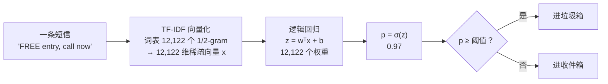

上一篇的线性回归预测一个数。把这个数过一个 sigmoid 函数压到 0 到 1 之间，它就变成了一个概率——这就是**逻辑回归**，最简单的分类器。它简单，但每一个神经网络的最后一层都是它：前面所有层在做特征提取，最后一层是一个逻辑回归（两类）或 softmax 回归（多类）。奖励模型也不例外：一个 8B 的 LLM 提特征，上面接一个 $$4096 \to 1$$ 的线性头，Bradley-Terry 的 loss 就是逻辑回归的 loss 作用在两个回答的**分差**上。看清这一点，奖励模型的一切性质——需要多少数据、怎么过拟合、准确率上限在哪——都可以用逻辑回归的语言想。

全篇的核心问题是：

> **一个预测数的模型怎么变成预测概率的模型，loss 为什么要换成交叉熵？[^q0] 奖励模型和逻辑回归是什么关系？[^q1] 为什么它的准确率到 80% 就上不去了？[^q2]**

## 一、总览

### 1. 从一条线到一个概率

本文按"模型怎么一步步变复杂"组织：先把线性回归改成两类分类（sigmoid + 交叉熵），再改成多类（softmax），再改成"比较两个东西"（Bradley-Terry）。三个模型是同一个骨架：

| 模型 | 线性部分 | 输出 | loss | 出现在 |
|---|---|---|---|---|
| 线性回归（上一篇） | $$z = w^T x + b$$ | $$\hat y = z$$ | $$(z - y)^2$$ | 回归头 |
| 逻辑回归 | $$z = w^T x + b$$ | $$p = \sigma(z)$$ | $$-[y \log p + (1-y)\log(1-p)]$$ | 二分类头、质量分类器 |
| softmax 回归 | $$z = W^T x + b$$（$$K$$ 个数） | $$p = \text{softmax}(z)$$ | $$-\log p_y$$ | 语言模型输出层 |
| Bradley-Terry 奖励模型 | $$z = w^T (x_A - x_B)$$，无偏置 | $$P(A \succ B) = \sigma(z)$$ | $$-\log \sigma(z)$$ | RLHF 的奖励模型、DPO |

Table: 线性回归、逻辑回归、softmax 与 Bradley-Terry 的同一骨架

三个模型的梯度长得一模一样：**（预测 − 真实）× 特征**。

### 2. 本文的章节安排

| 章 | 主题 | 内容 |
|---|---|---|
| 二 | 从数到概率 | sigmoid 长什么样<br/>为什么不能直接用线性回归做分类<br/>决策边界 |
| 三 | 交叉熵 | 为什么不用平方误差<br/>loss 曲线<br/>梯度 $$(p - y)x$$ 的推导与数值验证<br/>六个数走一遍：logit → 概率 → loss → 梯度 → 一步更新<br/>数值稳定：logaddexp 与 log-sum-exp |
| 四 | 手写一个逻辑回归 | 12 行梯度下降<br/>二维数据上的决策边界图<br/>与 scikit-learn 对数 |
| 五 | 真实数据集 | 乳腺癌 30 个特征 96%<br/>系数是可读的<br/>标准化 |
| 六 | softmax 回归 | 多类<br/>手写数字 10 类 96%<br/>它就是语言模型的输出层 |
| 七 | 奖励模型 = 逻辑回归 | Bradley-Terry 的推导<br/>用 3000 个偏好对拟合一个<br/>拟合分 vs 真实分<br/>一条样本怎么变成一对回答：分差、概率、loss 与梯度 |
| 八 | 准确率上限是标注的一致性 | 按分差分桶看标注噪声<br/>噪声 vs 上限曲线<br/>对真实 RM 的含义<br/>准确率、概率校准、标注一致性是三个不同的数 |
| 九 | 案例：垃圾短信识别 | 5,574 条真实短信，TF-IDF + 逻辑回归：12,122 个权重，准确率 98.3%、精确率 100%、召回率 87%<br/>阈值怎么定<br/>模型学到了哪些词<br/>错在哪<br/>概率校准：说 70% 的那些短信里真有 70% 是 spam 吗 |
| 十 | 本文小结 |  |
| 十一 | 自测 | 六道题 |

Table: 本文的章节安排

### 3. 来龙去脉：一条 S 形曲线的两百年

| 年 | 谁 | 当时的问题 | 留下的东西 |
|---|---|---|---|
| 1838 | Verhulst | 人口不能无限指数增长，会被资源顶住 | **logistic 曲线** $$\sigma(z) = 1/(1+e^{-z})$$：先快后慢、有上限的 S 形，"logistic"这个名字就是他起的 |
| 1944 | Berkson | 生物实验里"剂量 → 死亡率"是 0/1 结果，怎么用线性模型拟合一个概率 | **logit** $$\log \frac{p}{1-p} = w^T x + b$$：把概率拉直成一条线，反过来就是 sigmoid（第二章） |
| 1958 | Cox | 怎么系统地估计这个模型的参数、做统计检验 | **逻辑回归**作为一个统计模型成型；最大似然估计——就是本篇第三章的交叉熵 |
| 1970s–1980s | 信用评分（FICO 1989） | 银行要一个能解释、能审计的"违约概率" | 逻辑回归成为金融风控的默认模型，至今如此：每个系数是一条能写进监管报告的规则 |
| 1998– | 文本分类（垃圾邮件、新闻分类） | 几万个词做特征，样本几千条，要快、要稀疏 | 词袋 / TF-IDF + 逻辑回归（或线性 SVM，第五篇）成为文本分类的基线，第九章的案例 |
| 1986– | 神经网络 | 多层网络的最后一层该长什么样 | 每个分类网络的输出层就是它（第五章）；奖励模型是它作用在分差上（第七章） |

Table: 逻辑回归的来历

它解决的问题只有一个：**线性回归的输出是任意实数，而概率必须在 0 到 1 之间**。Berkson 的 logit 是"把概率变成实数再做线性回归"，Cox 的最大似然是"用交叉熵而不是平方误差训它"——这两步做完，线性回归就变成了分类器。之后八十年它没有被替代，因为替代者（树、SVM、神经网络）赢的是精度，输的是它的三个长处：**系数可读**（第五章的乳腺癌：凹点多 → 恶性）、**输出是校准的概率**（第十篇：它天生比树和 SVM 校准得好）、**训练一秒**。什么时候不该用它：特征与类别的关系不是"加权和过一个阈值"能表达的——一张图片的像素、一段语音的波形，这时要么先用别的东西提特征（深度学习做的事），要么换第四、五、六篇的非线性模型。

## 二、从数到概率

### 1. 为什么不能直接用线性回归做分类

分类任务的 $$y$$ 是 0 或 1（垃圾邮件 / 正常邮件，恶性 / 良性）。最直接的想法是照搬上一篇：把 0/1 当成数，拟合一条直线 $$\hat y = wx + b$$，大于 0.5 就判 1。举个例子：复习小时数 $$x$$ 与是否通过考试 $$y$$，复习 1、2、3 小时的三人没过（$$y = 0$$），复习 5、6、7 小时的三人过了（$$y = 1$$）。最小二乘直线是 $$\hat y = 0.214x - 0.357$$，恰好在 $$x = 4$$ 处穿过 0.5，看起来能用。两个毛病：

1. **输出不是概率**。复习 10 小时预测 1.79，复习 0 小时预测 −0.36——"通过的概率是 179%"没有意义。
2. **分对的点反而拖后腿**。再加一个复习 20 小时、通过了的人：他的 $$y = 1$$，原直线在 $$x = 20$$ 处的预测却是 3.93，残差 −2.93，平方误差 8.6——这个最不该有争议的样本，成了对损失贡献最大的点。重新拟合，最小二乘为了迁就他把直线压平成 $$0.052x + 0.245$$，穿过 0.5 的位置从 4 小时挪到 4.9 小时——一个明显分对的样本，把边界拉偏了。它本不该有任何"惩罚"。

要修的是输出的**形状**：无论 $$z = wx + b$$ 多大，输出都要落在 0 到 1 之间，而且越远离边界越接近 0 或 1、变化越慢。

### 2. sigmoid

**逻辑回归**保留线性部分 $$z = w^T x + b$$，再过一个 **sigmoid 函数**把它压到 $$(0, 1)$$：

$$
P(y = 1 \mid x) = \sigma(z) = \frac{1}{1 + e^{-z}}, \qquad z = w^T x + b
$$


| $$z$$ | −4 | −2 | 0 | 2 | 4 |
|---|---:|---:|---:|---:|---:|
| $$\sigma(z)$$ | 0.018 | 0.119 | 0.500 | 0.881 | 0.982 |

Table: sigmoid 在几个 z 上的取值

算一个：$$z = 2$$ 时 $$e^{-2} = 0.135$$，$$\sigma(2) = 1 / 1.135 = 0.881$$。$$z$$ 越大、$$e^{-z}$$ 越接近 0、$$\sigma$$ 越接近 1；$$z$$ 越负、$$e^{-z}$$ 越大、$$\sigma$$ 越接近 0；$$z = 0$$ 时 $$e^0 = 1$$，恰好 0.5。它还有一个对称性：$$\sigma(-z) = 1 - \sigma(z)$$（$$\sigma(-2) = 0.119 = 1 - 0.881$$），所以"是正类的概率"与"是负类的概率"自动加起来等于 1。$$z$$ 可以理解为"证据的强度"：正的证据支持类 1，负的支持类 0，sigmoid 把证据换算成概率——而且在 $$\lvert z \rvert > 4$$ 之后曲线几乎平了，复习 20 小时与复习 10 小时的概率都接近 1，上一节那个"分对却被重罚"的问题就消失了。

### 3. 决策边界

$$z > 0$$ 时概率大于 0.5、预测正类；$$z = 0$$ 即 $$w^T x + b = 0$$ 的那条线（高维是超平面）是**决策边界**。它是线性的——逻辑回归只能画直线把两类分开，第四章的图会看到。不能用一条直线分开的数据（XOR）它就无能为力，要么手工造新特征，要么用多层网络（L3）让模型自己造。

## 三、交叉熵

### 1. 为什么不用平方误差

有了概率 $$p$$，怎么衡量它预测得好不好？直觉的办法是 $$(p - y)^2$$，但它有个毛病：$$y = 1$$ 而模型自信地说 $$p = 0.01$$，平方误差是 0.98——与 $$p = 0.1$$ 的 0.81 差不多，惩罚不够重。**交叉熵**（cross-entropy）用对数：

$$
\mathcal{L} = -\big[\, y \log p + (1 - y) \log (1 - p) \,\big]
$$

- $$y = 1$$ 时只剩 $$-\log p$$：$$p = 0.9$$ 罚 0.105，$$p = 0.5$$ 罚 0.69，$$p = 0.01$$ 罚 4.6——越自信地错，罚得越重，趋向无穷；
- $$y = 0$$ 时只剩 $$-\log(1 - p)$$，对称。

上图右边画了这两条曲线与平方误差的对比。三个样本算一遍：模型对它们给出 $$p = 0.9, 0.3, 0.6$$，真实标签 $$y = 1, 0, 1$$，每个样本的损失分别是 $$-\log 0.9 = 0.105$$、$$-\log(1 - 0.3) = 0.357$$、$$-\log 0.6 = 0.511$$，平均 0.324。第一个预测得又对又自信，几乎不罚；第三个虽然也判对了（0.6 > 0.5）但不够自信，罚得比第二个还重——交叉熵奖励的是**自信且正确**。

这个公式不是拍脑袋的，它来自上一篇第八章同样的**最大似然**推理。模型说"$$y = 1$$ 的概率是 $$p$$"，那么观察到标签 $$y$$ 的概率是：$$y = 1$$ 时 $$p$$，$$y = 0$$ 时 $$1 - p$$，合写成一个式子 $$p^y (1 - p)^{1 - y}$$（$$y$$ 只取 0 或 1，两个因子总有一个的指数是 0、等于 1）。这就是抛一枚"正面概率为 $$p$$"的硬币的分布，叫**伯努利分布**。让全部样本的概率乘积最大 → 取对数变成和 → 加负号变最小：$$-[y \log p + (1 - y) \log(1 - p)]$$，正是交叉熵。上一篇的平方误差是"噪声是高斯"假设下的最大似然，交叉熵是"标签是抛硬币"假设下的最大似然——两个损失来自同一条推理、不同的分布假设。

### 2. 梯度：预测减真实，乘特征

训练要用梯度下降（上一篇第四章），所以要算交叉熵对 $$w$$ 的导数。$$\mathcal{L}$$ 依赖 $$p$$，$$p$$ 依赖 $$z$$，$$z$$ 依赖 $$w$$——一层套一层，用**链式法则**：外层对内层的导数逐层相乘（"$$\mathcal{L}$$ 随 $$w$$ 变多快" = "$$\mathcal{L}$$ 随 $$p$$ 变多快" × "$$p$$ 随 $$z$$ 变多快" × "$$z$$ 随 $$w$$ 变多快"）。三步：

$$
\frac{\partial \mathcal{L}}{\partial p} = -\frac{y}{p} + \frac{1 - y}{1 - p} = \frac{p - y}{p(1 - p)}, \qquad
\frac{\partial p}{\partial z} = \sigma(z)\big(1 - \sigma(z)\big) = p(1 - p), \qquad
\frac{\partial z}{\partial w} = x
$$

第一步：$$\log p$$ 的导数是 $$1/p$$，$$\log(1 - p)$$ 的导数是 $$-1/(1 - p)$$，两项通分得到中间那个式子。第二步是 sigmoid 自己的性质：$$\sigma(z) = (1 + e^{-z})^{-1}$$，求导得 $$e^{-z} / (1 + e^{-z})^2 = \sigma(z) \cdot \frac{e^{-z}}{1 + e^{-z}} = \sigma(z)(1 - \sigma(z))$$——sigmoid 的斜率可以用它自己的值算出来，$$z = 1$$ 处 $$0.731 \times 0.269 = 0.197$$，中间最陡（$$z = 0$$ 处 0.25）、两头趴平。第三步 $$z = w^T x + b$$ 对 $$w$$ 的导数就是 $$x$$。三项相乘，$$p(1-p)$$ 恰好约掉：

$$
\frac{\partial \mathcal{L}}{\partial w} = (p - y)\, x
$$

**预测概率减真实标签，乘特征**——与上一篇线性回归的梯度 $$(w^T x - y)\, x$$ 是同一个形式。sigmoid 的导数与 $$\log$$ 的导数互相抵消，这不是巧合：交叉熵就是为 sigmoid 配的 loss（用平方误差配 sigmoid，梯度里会多一个 $$p(1-p)$$，$$p$$ 接近 0 或 1 时梯度消失，学不动）。

推导可能出错，所以用**有限差分**验证——导数的定义就是"参数动一点点，函数值变多少"：把 $$w_j$$ 加上一个很小的 $$h$$（如 $$10^{-6}$$）算一次 loss、减去 $$h$$ 再算一次，两者之差除以 $$2h$$ 就是导数的数值近似。它慢（每个参数算两次 loss）但不会推错，是检查梯度公式的标准办法：

```text title="公式梯度与有限差分的对照"
公式算的梯度   [ 0.037713 -0.181696 -0.060722  0.146158]
有限差分算的   [ 0.037713 -0.181696 -0.060722  0.146158]   最大差 4.3e-11
```

### 3. 六个数走一遍：logit → 概率 → loss → 梯度 → 一步更新

公式会推了，再用一组能手算的数把它走一遍。回到第二章的例子：六个人的复习小时 $$x = [1, 2, 3, 5, 6, 7]$$，前三个没通过（$$y = 0$$）、后三个通过了（$$y = 1$$）。从 $$w = 0, b = 0$$ 出发，学习率 0.1。每个样本依次算五个数：logit $$z = wx + b$$、概率 $$p = \sigma(z)$$、这个样本的 loss、误差 $$p - y$$、误差乘特征 $$(p - y)x$$：

```text title="六个样本在 w = 0, b = 0 处的 logit、概率、loss 与梯度贡献"
    x   y   z=wx+b   p=σ(z)   每样本 loss   p−y    (p−y)·x
    1   0    0.000    0.500        0.6931   +0.500   +0.500
    2   0    0.000    0.500        0.6931   +0.500   +1.000
    3   0    0.000    0.500        0.6931   +0.500   +1.500
    5   1    0.000    0.500        0.6931   -0.500   -2.500
    6   1    0.000    0.500        0.6931   -0.500   -3.000
    7   1    0.000    0.500        0.6931   -0.500   -3.500
  平均 loss = 0.6931（= ln 2，因为每个 p 都是 0.5）；∂L/∂w = mean((p−y)·x) = -1.0000，∂L/∂b = mean(p−y) = +0.0000
  一步更新：w ← 0.0 − 0.1·(-1.000) = 0.100，b ← 0.0 − 0.1·(+0.000) = 0.000
  更新后：z = [0.1, 0.2, 0.3, 0.5, 0.6, 0.7]，p = [0.525, 0.55, 0.574, 0.622, 0.646, 0.668]，loss 0.6931 → 0.6186
```

每个数都能用纸笔核对：$$w = b = 0$$ 时所有 $$z = 0$$，$$\sigma(0) = 0.5$$，每个样本的 loss 都是 $$-\log 0.5 = 0.6931$$。误差 $$p - y$$ 在没通过的人身上是 $$+0.5$$、通过的人身上是 $$-0.5$$，乘上各自的复习小时再平均：$$(0.5 + 1.0 + 1.5 - 2.5 - 3.0 - 3.5) / 6 = -1.0$$。为什么 $$b$$ 的梯度恰好是 0、$$w$$ 的梯度却是 $$-1$$？[^q3] 走一步后 $$w = 0.1$$，六个 $$p$$ 全部抬到 0.5 以上——方向对了（复习多的 $$p$$ 更大），但前三个人的 $$p$$ 也被抬高了，要靠接下来 $$b$$ 变负把它们压回去。

代码就是这几行，每行一个动作：

```python title="逻辑回归的一步：返回所有中间量"
def one_step(x, y, w, b, lr):
    z = w * x + b                                       # !ref step-logit
    p = stable_sigmoid(z)                               # !ref step-prob
    loss = logistic_loss(z, y).mean()                   # !ref step-loss
    err = p - y                                         # !ref step-err
    dw, db = (err * x).mean(), err.mean()               # !ref step-grad
    return z, p, loss, err, dw, db, w - lr * dw, b - lr * db  # !ref step-update
```

[算 logit](#step-logit) → [过 sigmoid](#step-prob) → [算 loss](#step-loss) → [预测减真实](#step-err) → [乘特征再平均](#step-grad) → [沿负梯度走一步](#step-update)。`stable_sigmoid` 与 `logistic_loss` 是下一节的数值稳定版本，在这组温和的数字上与朴素写法结果相同。继续走下去，状态是这样变的：

```text title="同一学习率下 w、b、loss 与决策边界随步数的变化"
    步数      w        b      loss   决策边界 x = −b/w
       0     0.000    0.000   0.6931      —
       1     0.100    0.000   0.6186     0.00
      10     0.238   -0.147   0.5620     0.62
     100     0.527   -1.474   0.3544     2.79
    1000     1.534   -5.772   0.0880     3.76
```


决策边界 $$x = -b/w$$ 从 0 移到 3.76——正好落在 3 小时与 5 小时之间。loss 到 0.088 还在降：这组数据线性可分，梯度下降会让 $$\|w\|$$ 持续增大、$$p$$ 越来越接近 0 和 1，loss 趋向 0 但到不了——这就是第五章要加 L2 正则（scikit-learn 默认 `C=1.0`）的原因之一。

### 4. 数值稳定：logaddexp 与 log-sum-exp

上面的 `sigmoid` 和 `bce` 在 $$z$$ 温和时没问题，$$z$$ 一大就出事。$$z = -800$$、$$y = 1$$ 时真实 loss 是 $$\log(1 + e^{800}) \approx 800$$，但按定义写 `1 / (1 + np.exp(800))`，$$e^{800}$$ 超出 float64 的范围（上限约 $$1.8 \times 10^{308}$$）变成 inf，$$\sigma = 0$$，$$-\log 0 = $$ inf。第四章的 `bce` 加了 `eps = 1e-12` 防 $$\log 0$$，于是得到 $$-\log(10^{-12}) \approx 27.6$$——一个看着正常、实际错了 30 倍的数，比 inf 更危险，因为它不报错：

```text title="y = 1 时三种写法的每样本 loss：朴素、带 eps、logaddexp"
      z     朴素 σ(z)   朴素 −log σ    bce(eps=1e-12)   logaddexp 版   手算 log(1+e^{−z})
      -800           0           inf            27.63            800   ≈ −z
       -30    9.36e-14            30            27.54             30   30.0000
         0         0.5        0.6931           0.6931         0.6931   0.6931
        30           1     9.348e-14       -9.066e-13      9.237e-14   0.0000
       800           1            -0           -1e-12              0   ≈ e^{−z}
```

正确的做法是**不先算 $$p$$ 再取 log，而是直接用 logit 算 loss**。把 $$p = \sigma(z)$$ 代入交叉熵并化简：

$$
\mathcal{L}(z, y) = \log(1 + e^{z}) - y\,z
$$

$$y = 1$$ 时它是 $$\log(1 + e^{-z})$$，$$y = 0$$ 时是 $$\log(1 + e^{z})$$。而 $$\log(1 + e^{z}) = \log(e^0 + e^z)$$ 正是 NumPy 的 `np.logaddexp(0, z)`：它内部先取两数中的较大者 $$m$$，再算 $$m + \log(e^{0 - m} + e^{z - m})$$，括号里的指数都不超过 0，不会溢出。这就是 **log-sum-exp 技巧**：$$\log \sum_k e^{z_k} = m + \log \sum_k e^{z_k - m}$$，$$m = \max_k z_k$$。同一招用在 softmax 上——第六章手写的 `softmax` 先减每行最大值，就是它；`softmax([1000, 1001, 1002])` 直接算是三个 `nan`，减掉 1002 后是 $$[0.090, 0.245, 0.665]$$，log-softmax $$= z - \mathrm{logsumexp}(z) = [-2.408, -1.408, -0.408]$$。需要概率本身时再用 $$\sigma(z) = e^{-\mathrm{logaddexp}(0, -z)}$$：

```python title="数值稳定的 sigmoid 与交叉熵"
def stable_sigmoid(z):
    return np.exp(-np.logaddexp(0.0, -z))

def logistic_loss(z, y):                                # 每样本 loss，直接用 logit 算
    return np.logaddexp(0.0, z) - y * z
```

$$z = -800$$ 时 `stable_sigmoid` 仍返回 0——$$e^{-800}$$ 确实小于 float64 能表示的最小正数（约 $$5 \times 10^{-324}$$），$$\sigma$$ 本身下溢是真实的；关键是 loss 不经过 $$\sigma$$，仍是精确的 800。PyTorch 的 `BCEWithLogitsLoss` 和 `CrossEntropyLoss` 都要你传 logit 而不是概率，就是这个原因。

稳定版的梯度仍是 $$(p - y)x$$。在第 3 小节走完一步的位置 $$(w, b) = (0.1, 0)$$ 用有限差分核对，这次换三个步长 $$h$$：

```text title="稳定版 loss 在 (w, b) = (0.1, 0) 处的梯度：公式 vs 三种步长的中心差分"
  在 (w, b) = [0.1, 0.0] 处，公式梯度 (∂L/∂w, ∂L/∂b) = [-0.498079, 0.097593]
    中心差分 h = 1e-02：[-0.498214, 0.097592]，最大差 1.3e-04
    中心差分 h = 1e-04：[-0.498079, 0.097593]，最大差 1.3e-08
    中心差分 h = 1e-06：[-0.498079, 0.097593]，最大差 1.9e-11
```

中心差分 $$[\mathcal{L}(\theta + h) - \mathcal{L}(\theta - h)] / 2h$$ 的误差是 $$O(h^2)$$：$$h$$ 从 $$10^{-2}$$ 到 $$10^{-4}$$，误差从 $$10^{-4}$$ 降到 $$10^{-8}$$，正好 $$10^4$$ 倍；到 $$10^{-6}$$ 时浮点舍入开始占主导，不再按 $$h^2$$ 降。三个步长都对上，才算验证通过——只用一个 $$h$$ 碰巧对上，可能是公式错了但误差恰好抵消。

## 四、手写一个逻辑回归

### 1. 十二行

```python title="十二行逻辑回归"
def sigmoid(z):
    return 1 / (1 + np.exp(-z))

def bce(p, y):                                          # 二元交叉熵，每样本平均
    eps = 1e-12
    return -np.mean(y * np.log(p + eps) + (1 - y) * np.log(1 - p + eps))

def fit_logistic(X, y, lr=0.1, steps=2000):             # X 已含一列 1（偏置）
    w = np.zeros(X.shape[1])
    for _ in range(steps):
        p = sigmoid(X @ w)                              # ① 预测概率
        grad = X.T @ (p - y) / len(y)                   # ② 梯度：(p − y) 乘特征，再平均
        w -= lr * grad                                  # ③ 走一步
    return w
```

1. ① 全部样本的线性部分过 sigmoid，得到 $$n$$ 个概率（`X @ w` 一次算出所有样本的 $$z$$）；
2. ② 第三章的公式 $$(p - y)x$$，用矩阵一次算完所有样本再平均：`p - y` 是 $$n$$ 个"预测减真实"，`X.T @` 把每个样本的这个数乘上它的特征、按样本加起来；
3. ③ 与上一篇一模一样的更新。没有闭式解（令梯度为零的方程里 $$w$$ 藏在 $$e^{-w^T x}$$ 里，解不出来），所以只能梯度下降。

`bce` 里的 `eps = 1e-12` 是防止 $$\log 0$$：`p` 恰好是 0 或 1 时 $$\log$$ 会得到负无穷，加一个极小的数避开它。

### 2. 二维数据上看它

200 个点、两类、每类一团。跑 500 步：


```text title="手写 GD 与 sklearn 的结果对照"
手写 GD 500 步：w = [0.012 1.892 1.282]，训练准确率 0.930，最终交叉熵 0.201
sklearn：       w = [0.012 1.892 1.283]，训练准确率 0.930
```

怎么读左图：一开始 $$w = 0$$，每个样本 $$z = 0$$、预测 0.5，不管标签是什么损失都是 $$-\log 0.5 = 0.693$$——这是"完全不知道"的基准；loss 降到 0.201 表示模型对多数样本已经很确定。系数与 scikit-learn 的 `LogisticRegression` 差 0.001——两个实现算的是同一个东西。怎么读右图：每个位置的颜色是模型在那里给出的 $$P(y = 1)$$，等高线是概率相同的位置——因为 $$z = w^T x + b$$ 是线性的，$$z$$ 相同的点连成直线，所以等高线是一组平行直线，$$p = 0.5$$ 那条（黑线）就是决策边界。离边界越远概率越接近 0 或 1、颜色越深。两团点有重叠，直线分不干净，93% 已是线性边界的上限。

## 五、真实数据集

### 1. 乳腺癌：30 个特征 → 良性 / 恶性

569 个肿瘤、30 个数值特征（半径、纹理、凹点数……）、良性 / 恶性：

```text title="乳腺癌数据上的结果"
398 训练 / 171 测试；准确率 0.959；测试集每样本交叉熵 0.085
手写 GD（同样的 L2 强度）：准确率 0.959
|w| 最大的三个特征: ['radius error (-1.08)', 'worst texture (-1.07)', 'mean concave points (-1.01)']
一个样本: 线性部分 wᵀx+b = -13.15 → σ(·) = 0.000 → 预测 恶性，真实 恶性
```

30 个特征的线性组合过一个 sigmoid，准确率 96%。那个样本的 $$z = -13.15$$，sigmoid 之后是 0.000——模型非常确定它是恶性。

### 2. 系数是可读的


每个系数的符号与大小可读：凹点越多、纹理越差、半径越大，越可能恶性（负号对应"恶性 = 0"的编码）。这是线性模型相对深度网络的一个实际优点——出了问题能看出是哪个特征在起作用。前提是特征先**标准化**（减均值除标准差，上一篇第五章），否则量纲大的特征系数天然小，比不了。

### 3. 每个分类头的原型

任何神经网络分类器 = **前面所有层做特征提取 $$x = f_\theta(\text{输入})$$ + 最后一层 $$\sigma(w^T x + b)$$**。这里的 30 个特征是医生手工测量的；深度学习改变的是**特征从哪来**（学出来而不是手工设计），没有改变最后那一步。给 15T token 打质量分的 fastText 分类器（第六篇），就是把文本的词向量平均成特征再接一个逻辑回归。

## 六、softmax 回归：多类

### 1. 从 2 类到 $$K$$ 类

手写数字有 10 类，不能只用一个"是 / 不是"的概率。$$K$$ 类时，每类一个线性部分 $$z_k = w_k^T x + b_k$$——$$K$$ 组系数、$$K$$ 个"证据分"；再把 $$K$$ 个数过 **softmax** 变成和为 1 的概率：

$$
p_k = \frac{e^{z_k}}{\sum_{j=1}^{K} e^{z_j}}, \qquad \mathcal{L} = -\log p_y
$$

算一个：三类的分数 $$z = (2, 1, 0)$$，先各取 $$e^z$$ 得 $$(7.39, 2.72, 1.00)$$，和是 11.11，各除以和得 $$p = (0.665, 0.245, 0.090)$$——三个正数、和为 1、分数最高的类概率最大，而且分差 1 对应概率比 $$e \approx 2.72$$ 倍。$$K = 2$$ 时 softmax 退化成 sigmoid（两个分数只有差值有用）。loss 只看真实类别 $$y$$ 的那个概率，希望它大：真实类是第 0 类就罚 $$-\log 0.665 = 0.41$$，是第 2 类就罚 $$-\log 0.090 = 2.4$$。梯度仍是 $$(p - y_{\text{one-hot}})\, x$$——把标签写成 **one-hot** 向量（长度 $$K$$，真实类的位置是 1、其余 0，如第 1 类写成 $$(0, 1, 0)$$），预测减真实、乘特征。代码与二元版只差一个 softmax：

```python title="softmax 与多类逻辑回归"
def softmax(Z):
    Z = Z - Z.max(1, keepdims=True)                     # 数值稳定：先减每行最大值（不改变结果，见下）
    E = np.exp(Z)
    return E / E.sum(1, keepdims=True)

def fit_softmax(X, y, n_classes, lr=0.5, steps=500):
    Y = np.eye(n_classes)[y]                            # one-hot [n, K]
    W = np.zeros((X.shape[1], n_classes))               # [d+1, K]：每类一列系数
    for _ in range(steps):
        P = softmax(X @ W)                              # [n, K]
        W -= lr * X.T @ (P - Y) / len(y)                # 梯度形式与二元完全相同
    return W
```

`softmax` 第一行减去每行最大值是为了防溢出：$$z = 1000$$ 时 $$e^{1000}$$ 超出浮点数范围变成无穷，但每个 $$z_k$$ 同减一个常数 $$c$$，分子分母同乘 $$e^{-c}$$，结果不变——减最大值后最大的指数是 $$e^0 = 1$$，永远不会溢出。语言模型的输出层每天都在做这个减法。`np.eye(n_classes)[y]` 用单位矩阵的第 $$y$$ 行当 one-hot 向量，一行代码把整个标签数组变成 $$[n, K]$$ 的 0/1 矩阵。

### 2. 手写数字：10 类

1797 张 8×8 的手写数字，64 个像素当特征：


```text title="手写数字上的结果：准确率与一个样本的概率"
W 的形状 (65, 10)（64 个像素 + 1 偏置 → 10 类）；手写 softmax GD 500 步测试准确率 0.961；sklearn 0.970
一个测试样本：10 个类的概率 [0.   0.74 0.   0.01 0.02 0.   0.   0.01 0.22 0.  ] → argmax 1，真实 1
```

64 个像素的 10 组线性组合过一个 softmax，96%。那个样本模型给"1"0.74、给"8"0.22——它觉得这张图有点像 8，这种"犹豫"就是概率输出比硬分类多给的信息。

### 3. 它就是语言模型的输出层

语言模型最后一层 `nn.Linear(d_model, vocab)` + softmax，就是一个 $$K = \text{vocab}$$（几万到几十万）类的 softmax 回归：特征是前面几十层 Transformer 算出的 $$d_{\text{model}}$$ 维向量，"类别"是词表里的每个 token，loss 是 $$-\log p_{\text{下一个 token}}$$——与上面手写数字的代码一行一行对应，只是 $$W$$ 从 $$65 \times 10$$ 变成了 $$4096 \times 128000$$。L1 第二篇那个小 Transformer 最后的 `nn.Linear(d, vocab)` 就是它。

## 七、奖励模型 = 逻辑回归

### 1. 从"比较"到逻辑回归

RLHF 里的**奖励模型**（reward model，RM）要给每个回答打一个分——但标注员给不出"这个回答 7.3 分"这种绝对分数（不同人的尺子不一样），能可靠给出的是**比较**："A 比 B 好"。于是问题变成：从一堆"A 胜 B"的记录学出一个标量分 $$r(x, y)$$（$$x$$ 是问题、$$y$$ 是回答），使得分高的确实更常胜出。**Bradley-Terry 模型**（1952 年为给球队排名提出的）假设：A 胜过 B 的概率由两者分差决定，分差过 sigmoid：

$$
P(A \succ B) = \sigma\big(r(A) - r(B)\big), \qquad \mathcal{L} = -\log \sigma\big(r(A) - r(B)\big)
$$

分差 0 → 50%（抛硬币）；分差 2 → 88%；分差 4 → 98%——就是第二章那张 sigmoid 表，横轴换成了分差。分差越大标注员越一致，分数接近时标注员自己也常常摇摆，模型把这种摇摆当成正常现象而不是错误。现在假设 $$r$$ 是特征的线性函数——$$r(A) = w^T x_A$$，$$x_A$$ 是 LLM 对回答 A 算出的一个特征向量（实际做法：把"问题 + 回答"喂给一个 LLM，取它最后一层在最后一个 token 上的 [hidden state](# "tip: Transformer 每一层对每个 token 输出的向量。最后一层最后一个 token 的向量「读过」整段文字，常被当作整段文字的特征表示。Llama-3-8B 是 4096 维")；这就是第五章说的"前面所有层做特征提取"）——那么

$$
r(A) - r(B) = w^T x_A - w^T x_B = w^T (x_A - x_B)
$$

代回去：$$P(A \succ B) = \sigma\big(w^T (x_A - x_B)\big)$$。对照第二章：**这就是一个逻辑回归，输入是两个回答的特征差 $$x_A - x_B$$，标签是"A 是否更好"**。只有一个区别：没有偏置项 $$b$$——因为交换 A、B 时标签反转，必须有 $$P(A \succ B) + P(B \succ A) = 1$$，即 $$\sigma(z) + \sigma(-z) = 1$$，加了 $$b$$ 就不成立。

### 2. 拟合一个

造 300 个"回答"（各一个 16 维特征）、一个真实的"品味"向量 $$w^*$$，标注员按 Bradley-Terry 概率 $$\sigma(w^{*T}(x_A - x_B))$$ 随机给出偏好（所以标注**本身有噪声**——两个回答分数接近时标注员像抛硬币），共 3000 对：

```python title="Bradley-Terry：特征取差后做逻辑回归"
Xdiff = feats[i] - feats[j]                                                 # ① 特征取差
clf = LogisticRegression(fit_intercept=False).fit(Xdiff[:ntr], y[:ntr])     # ② 无偏置的逻辑回归
w_hand = fit_logistic(Xdiff[:ntr], y[:ntr])                                 # ③ 或者用第四章那 12 行（不加偏置列）
```

```text title="奖励模型的结果：与真实 w 相关 0.999"
2993 个偏好对，80% 训练；留出集准确率 0.915（用真实分数判断的上限 0.913——标注本身有噪声）
学到的 w 与真实 w 的相关系数 0.999
手写 GD（无偏置列）：留出集准确率 0.915，与真实 w 相关 0.999
```


学到的 $$w$$ 与真实 $$w^*$$ 相关 0.999，300 个回答的拟合分与真实分几乎在一条直线上（左图）——模型把"品味"学得几乎完美。

### 3. 一条样本怎么变成一对回答：分差、概率、loss 与梯度

上面是 3000 对的统计，再把一对拆开看，每个数怎么来的。两个回答各有 3 个特征（比如论据数、冗余句数、是否答对），当前奖励模型的权重 $$w = [0.5, -0.2, 1.0]$$，标注员选了 A：

```text title="一对回答：从特征到分差、概率、loss、梯度与一步更新"
  x_A = [2.0, 1.0, 1.0]，x_B = [1.0, 3.0, 0.0]，w = [0.5, -0.2, 1.0]，标注 y = 1（A 更好）
  r(A) = w·x_A = 1.80，r(B) = w·x_B = -0.10，分差 Δ = 1.90
  P(A ≻ B) = σ(Δ) = 0.8699；loss = log(1 + e^{−Δ}) = 0.1394
  x_A − x_B = [1.0, -2.0, 1.0]；∂loss/∂w = (p − y)(x_A − x_B) = -0.1301 × [1.0, -2.0, 1.0] = [-0.1301, 0.2602, -0.1301]
  ∂loss/∂r(A) = p − 1 = -0.1301（往上推 A 的分），∂loss/∂r(B) = 1 − p = +0.1301（等量往下压 B 的分）
  一步更新（lr = 0.5）：w ← [0.5651, -0.3301, 1.0651]；分差 1.90 → 2.2903，P(A ≻ B) 0.8699 → 0.9081，loss 0.1394 → 0.0964
```

逐行核对：$$r(A) = 0.5 \times 2 - 0.2 \times 1 + 1.0 \times 1 = 1.8$$，$$r(B) = 0.5 - 0.6 + 0 = -0.1$$，分差 1.9；$$\sigma(1.9) = 0.870$$；loss $$= -\log 0.870 = 0.139$$。梯度就是第三章的 $$(p - y)x$$，只是 $$x$$ 换成了 $$x_A - x_B$$、$$y = 1$$：$$(0.870 - 1) \times [1, -2, 1]$$。再往上游看一层，loss 对两个分数的梯度是 $$p - 1$$ 和 $$1 - p$$，**大小相等、方向相反**——奖励模型的每一步都是"把赢家的分抬一点、把输家的分压同样多"，而不是让所有分数一起漂移。这一层在深度学习里就是回传给两个回答 hidden state 的梯度。走一步后分差从 1.90 拉到 2.29，$$P(A \succ B)$$ 从 0.870 升到 0.908。

```python title="奖励模型的一步：两个回答 → 分差 → 概率 → loss → 梯度 → 更新"
def pair_step(xa, xb, w, y, lr):
    ra, rb = xa @ w, xb @ w                             # !ref pair-score
    delta = ra - rb                                     # !ref pair-delta
    p = stable_sigmoid(delta)                           # !ref pair-prob
    loss = logistic_loss(delta, y)                      # !ref pair-loss
    grad_w = (p - y) * (xa - xb)                        # !ref pair-grad
    return ra, rb, delta, p, loss, grad_w, w - lr * grad_w  # !ref pair-update
```

[两个分数](#pair-score) → [分差](#pair-delta) → [过 sigmoid](#pair-prob) → [logaddexp 版 loss](#pair-loss) → [误差乘特征差](#pair-grad) → [更新](#pair-update)。与第三章 `one_step` 对照，只有两处不同：输入从 $$x$$ 变成 $$x_A - x_B$$，没有 $$b$$。三个检查把"它就是逻辑回归"钉死：

```text title="同一对样本的三个检查：换顺序、当成逻辑回归、加偏置会怎样"
  把同一条样本摆成 (B, A, y=0)：Δ = -1.90，P(B ≻ A) = 0.1301，loss = 0.1394，梯度 [-0.1301, 0.2602, -0.1301] —— 与上面逐位相同
  当成普通逻辑回归：X = [x_A − x_B]、y = [1]、无偏置列，fit_logistic 从 w = 0 走一步得到 [0.25, -0.5, 0.25]；手算 0 − 0.5·(σ(0) − 1)·(x_A − x_B) = [0.25, -0.5, 0.25]，同一条公式
  若硬加偏置 b = 0.3：P(A ≻ B) + P(B ≻ A) = σ(Δ + b) + σ(−Δ + b) = 1.0682 ≠ 1，「谁放前面」会影响结论，所以奖励模型不要偏置
  有限差分核对：[-0.130108, 0.260217, -0.130108]，与公式最大差 1.9e-10
```

"A 比 B 好"和"B 比 A 差"是同一条信息，摆法不同梯度必须相同——第一行验证了这一点。第二行把 $$x_A - x_B$$ 直接喂给第四章的 `fit_logistic`，得到的就是公式的结果。第三行回答了为什么奖励模型不要偏置[^q4]。最后，分差大小决定一对样本贡献多少梯度：

```text title="y = 1 时分差与 loss、梯度大小的关系"
      Δ     P(A≻B)    loss    |∂loss/∂Δ| = 1 − p
     0.0   0.5000   0.6931   0.5000
     1.0   0.7311   0.3133   0.2689
     2.0   0.8808   0.1269   0.1192
     4.0   0.9820   0.0181   0.0180
     8.0   0.9997   0.0003   0.0003
```

分差 8 的对几乎不再更新模型（梯度 0.0003），分差 0 的对贡献最大（0.5）。模型的学习主要来自分数接近的对——而第八章会看到，这些恰恰是标注最容易出错的对。

## 八、准确率上限是标注的一致性

### 1. 那 8.5% 错在哪

$$w$$ 几乎完美，留出集准确率却只有 91.5%，而且**用真实分数判断也只有 91.3%**。把留出集的偏好对按两个回答的真实分差分成四桶，看标注与真实分数一致的比例：

| 两个回答的真实分差 | 标注与真实分数一致率 | 对数 |
|---|---:|---:|
| 0.00–1.61 | 0.75 | 150 |
| 1.61–3.31 | 0.91 | 150 |
| 3.31–6.06 | 0.99 | 150 |
| 6.06–17.44 | 1.00 | 150 |

Table: 按真实分差分桶的标注一致率

差的那 8.5% 几乎全在第一桶：分数接近的两个回答，标注员自己也只是在抛硬币（一致率 0.75）。这些错不是模型的错，是**标注的噪声**——在这批标签上，连用真实分数判断也只有 91.3%，学到真值的模型在这个留出集上无法系统地超过它。

### 2. 噪声越大，上限越低

把标注噪声从小到大调六档，每档重新生成偏好、重新训练：


| 标注噪声 | 标注一致率（上限） | 模型留出准确率 | $$w$$ 与真实相关 |
|---:|---:|---:|---:|
| 0.3 | 0.965 | 0.962 | 1.000 |
| 1.0 | 0.913 | 0.915 | 0.999 |
| 2.0 | 0.838 | 0.830 | 0.993 |
| 4.0 | 0.718 | 0.713 | 0.995 |
| 8.0 | 0.618 | 0.613 | 0.961 |

Table: 标注噪声对一致率上限与模型准确率的影响

模型准确率始终贴着上限走，而 $$w$$ 的相关系数一直在 0.96 以上——**模型学到的东西几乎没变，变的只是标注能被预测的程度**。噪声 4.0 那一档：模型准确率 71%，$$w$$ 相关 0.995。看到 71% 就说"模型不行、再训"，是在读错数字。

### 3. 对真实奖励模型的含义

真实的奖励模型也是这样：留出集准确率典型值 65%–80%，看起来不高，因为标签本身有噪声。但这里要把两个"一致率"分开——上面实验里的灰线是**标签与真值的一致率**（标签的正确率），它才是学到真值的模型能达到的上限，而它在真实数据里**不可观测**；能观测的是**标注员之间**的一致率（70%–80%），它比标签正确率**低**：两个各自独立 80% 正确的标注员，互相一致只有 $$0.8^2 + 0.2^2 = 68\%$$，而学到真值的模型对他们任何一人的标签仍能 80%。所以"RM 准确率不能超过人际一致率"是错的——人际一致率是标签噪声的线索，不是天花板；判断是否在拟合噪声要看训练 / 验证 gap 与按难度分桶的表现。提升奖励模型的路仍然不是"训得更久"，而是更一致的标注、更清晰的标注指南、以及在分数接近的对上不强求（或者按一致率给样本加权）。

看清"奖励模型 = 逻辑回归作用在分差上"还有一个用处："pairwise loss"不神秘，它就是把二分类的 $$w^T x$$ 换成了 $$w^T(x_A - x_B)$$；它怎么评估（第十篇：准确率、校准）、需要多少数据、怎么过拟合（第一篇），都可以用逻辑回归的语言想。L5 后训练系列第二篇讲真实奖励模型的训练细节；DPO（L0 第六篇）则是把这个逻辑回归里的 $$r$$ 换成了策略的对数比。

### 4. 准确率、概率校准、标注一致性：三个不同的数

上面反复出现的"准确率"、"一致率"，加上第十篇要讲的"校准"，是三个回答不同问题的数，容易被混成一个。用第七章那个奖励模型在 599 对留出集上把它们分开。先看准确率与校准：把模型的 logit 乘一个常数 $$T$$，每一对的判断方向都不变，准确率完全相同，但概率变了：

```text title="同一个奖励模型，logit 乘 T：准确率不变，校准变"
    T      准确率     ECE   平均 log loss   Brier      （ECE = 各桶 |平均预测概率 − 实际胜率| 按桶大小加权）
    1.00   0.915   0.015           0.226   0.068
    3.00   0.915   0.058           0.356   0.073
    0.33   0.915   0.135           0.331   0.096
  T = 1 时的可靠性表（预测概率分桶 → 这桶里 A 真的被选中的比例）：
    预测 0.0–0.2：234 对，平均预测 0.035，实际胜率 0.038
    预测 0.2–0.4： 42 对，平均预测 0.293，实际胜率 0.214
    预测 0.4–0.6： 34 对，平均预测 0.497，实际胜率 0.559
    预测 0.6–0.8： 50 对，平均预测 0.717，实际胜率 0.740
    预测 0.8–1.0：239 对，平均预测 0.955，实际胜率 0.962
```


**准确率**只看 $$p > 0.5$$ 的判断对了多少，对 $$T$$ 完全不敏感[^q5]。**校准**看的是"模型说 80% 的那些对里，是不是真有 80% 选了 A"——$$T = 1$$ 时每个桶的平均预测与实际胜率差不到 0.08，ECE 0.015；$$T = 3$$ 把概率推向两端（过度自信），$$T = 1/3$$ 把概率压向 0.5（过度保守），两者的 log loss 和 Brier 都变差，准确率却一个数字都没动。所以**用准确率挑出来的模型不保证概率可用**，而奖励模型的概率在 RLHF 里是要被当成数用的（分差进了策略的 loss）。

第三个数是**标注一致性**。让另一位"标注员"用同样的噪声独立再标一遍这 3000 对：

```text title="两位标注员各自与真值、以及互相之间的一致率"
    标注员 1 与真实分数一致 0.896，标注员 2 与真实分数一致 0.900，两人互相一致 0.857
    若两人的错误相互独立，互相一致率应是 a₁a₂ + (1−a₁)(1−a₂) = 0.817；实际更高，因为两人都在同一批分差小的对上出错——错误不独立
    模型在留出集上：与标注员 1 一致 0.915，与标注员 2 一致 0.895，与真实分数一致 0.988
```

两位标注员各自约 90% 正确，互相却只有 85.7% 一致——比上一节"独立错误"公式算出的 81.7% 高，因为两人的错误集中在同一批分差小的对上，不独立。而模型对真实分数的一致率是 98.8%，比对任何一位标注员的都高：它从 2400 条带噪标签里学到的 $$w$$ 比单个标注员更接近真值。三个数回答三个问题：准确率——阈值后的判断对了多少；校准——给出的概率可不可信；一致性——换个人标，还剩多少能对上。评估奖励模型时三个都要看，并且要知道第三个是数据的性质，不是模型的。

## 九、案例：垃圾短信识别——TF-IDF + 逻辑回归

第五章的乳腺癌有 30 个医生量出来的特征。真实业务里更常见的情形是**特征得自己造**——比如输入是一条短信。这一章用逻辑回归做一个垃圾短信过滤器：它是 1998 年以来文本分类的标准基线，也是第六篇要讲的 LLM 数据质量分类器的原型（同一个结构，特征从词袋换成词向量）。

### 1. 问题与数据

UCI SMS Spam Collection（Almeida & Hidalgo 2011）：5,574 条英文短信，人工标好 ham（正常）/ spam（垃圾），747 条 spam 占 13.4%。两条例子：

- ham：*Nah I don't think he goes to usf, he lives around here though*
- spam：*Had your mobile 11 months or more? U R entitled to Update to the latest colour mobiles wit...*

spam 平均 139 个字符，ham 71 个——垃圾短信更长、更"广告"。类别不平衡：全部判 ham 的准确率就有 86.6%，所以**准确率不是这个问题的指标**，要看精确率（判成 spam 的里面真是 spam 的比例——误杀正常短信是用户最恨的）和召回率（所有 spam 里抓住的比例）。

### 2. 解决思路



三步：（一）**词袋**——把短信变成一个向量，维度 = 词表大小，每一格是这个词在这条短信里的权重。用 [TF-IDF](# "tip: term frequency × inverse document frequency：一个词在这条短信里出现得多（TF 高）、又在别的短信里少见（IDF 高），权重就大。'the' 到处都有，IDF 低；'claim' 只在 spam 里出现，IDF 高") 而不是简单计数，让常见词自动降权；词表里同时放单词和相邻两个词的组合（"call now"、"free entry"），因为很多信号在词对上。（二）**逻辑回归**——12,122 个权重，每个词一个，"这个词出现让 spam 的对数几率涨多少"。（三）**阈值**——模型给的是概率，进不进垃圾箱要定一个阈值，这一步是业务决定不是模型决定。

### 3. 代码

完整脚本 [`case_03_sms_spam.py`](https://github.com/arganzheng/ai-learning-labs/blob/main/classical-ml/case_03_sms_spam.py)，模型本身四行：

```python title="case_03：TF-IDF 加逻辑回归四行"
Xtr, Xte, ytr, yte = train_test_split(df.text, y, test_size=0.2, random_state=0, stratify=y)  # 分层：两边 spam 比例一样
model = make_pipeline(
    TfidfVectorizer(ngram_range=(1, 2), min_df=2, sublinear_tf=True),  # 词与词对；只出现过 1 次的词不要
    LogisticRegression(C=10, max_iter=2000),                            # C 是 L2 正则强度的倒数（上一篇 Ridge 的 1/α）
)
model.fit(Xtr, ytr)
prob = model.predict_proba(Xte)[:, 1]                                   # 每条测试短信是 spam 的概率
pred = (prob >= 0.5).astype(int)

w = model[-1].coef_[0]                                                  # 12,122 个权重，每个词一个
vocab = model[0].get_feature_names_out()
top = np.argsort(w)                                                     # 最负的推向 ham，最正的推向 spam
```

`stratify=y` 是第一篇第三章的分层切：不分层的话 1,115 条测试集里的 spam 数量会抖。`min_df=2` 把只出现过一次的词扔掉——它们只在一条短信里出现，学不到什么，还会让词表膨胀三倍。

### 4. 效果

| 模型 | 准确率 | 精确率 | 召回率 | F1 |
|---|---:|---:|---:|---:|
| 基线：全部判 ham | 0.866 | — | 0.000 | — |
| TF-IDF + 逻辑回归，阈值 0.5 | **0.983** | **1.000** | 0.872 | **0.932** |
| 同上，阈值 0.3 | 0.979 | 0.950 | 0.893 | 0.920 |
| 同上，阈值 0.2 | 0.978 | 0.925 | 0.913 | 0.919 |

Table: 垃圾短信识别——测试集 1,115 条


阈值 0.5 时：966 条 ham **一条都没误杀**（精确率 100%），149 条 spam 抓住 130 条、漏 19 条（召回 87%）。这个形态是逻辑回归在不平衡数据上的典型：spam 是少数类，模型对"判 spam"很谨慎。

阈值是业务决定。下图是阈值从 0 扫到 1 时精确率和召回率的走法——**两条线此消彼长**，没有一个阈值让两个都最高：


把阈值降到 0.2，召回从 87% 升到 91%，代价是开始误杀（精确率 100% → 92.5%，1,115 条里误杀 11 条正常短信）。运营商的选择通常是**宁漏勿杀**（一条重要短信进了垃圾箱比收到一条广告严重得多），所以会取高阈值；一个企业内部的钓鱼邮件过滤器则反过来。**模型只负责给概率，阈值由"两种错各多贵"决定**——第十篇第三章专门讲这个。

**模型学到了什么**：12,122 个权重里最正和最负的各 12 个——


推向 spam 的：`txt`（+8.8）、`call`（+8.2）、`text`、`free`、`reply`、`uk`、`www`、`mobile`、`claim`、`150p`（英国短信资费）——全是"叫你做一件事"的广告词。推向 ham 的：`me`、`my`、`that`、`ok`、`at`、`later`、`he`——全是人和人说话的词。**这就是第五章"系数可读"在文本上的形态**：不需要任何可解释性工具，把权重排个序就知道模型在看什么，也能立刻发现它有没有学到不该学的东西（比如把某个客户的名字当成 spam 信号）。

**错在哪**：漏掉的 19 条 spam 里，一条是 *Bank of Granite issues Strong-Buy EXPLOSIVE PICK...*（股票骚扰，词表里几乎没有这类词，$$p = 0.04$$），一条是 *Hi ya babe x u 4goten bout me?...*（伪装成熟人的口吻，$$p = 0.01$$）。第一种是**训练集里没有这类样本**——加数据能修；第二种是**词袋的根本限制**：它只看有哪些词，看不出"一个陌生号码用熟人口吻"这种需要理解上下文的信号，要修得换特征（第六篇的词向量、或者一个小语言模型）。

### 5. 概率校准：说 70% 的那些短信里真有 70% 是 spam 吗

第八章第 4 节把准确率与校准分开了，真实数据上看一次。把 1,115 条测试短信按模型给出的 $$p(\text{spam})$$ 分桶，对比每桶的平均预测概率与实际 spam 比例：

```text title="测试集的可靠性表：预测概率分桶 vs 实际 spam 比例"
  预测 p(spam) ∈ [0.0, 0.1)： 950 条，平均预测 0.015，实际 spam 比例 0.009
  预测 p(spam) ∈ [0.1, 0.3)：  25 条，平均预测 0.173，实际 spam 比例 0.280
  预测 p(spam) ∈ [0.3, 0.5)：  10 条，平均预测 0.388，实际 spam 比例 0.300
  预测 p(spam) ∈ [0.5, 0.7)：   5 条，平均预测 0.594，实际 spam 比例 1.000
  预测 p(spam) ∈ [0.7, 0.9)：  28 条，平均预测 0.805，实际 spam 比例 1.000
  预测 p(spam) ∈ [0.9, 1.0]：  97 条，平均预测 0.962，实际 spam 比例 1.000
  ECE（各桶 |平均预测 − 实际比例| 按桶大小加权）= 0.018，Brier = 0.0161；0.5 以上的三个桶里实际 spam 比例都是 1.0、高于平均预测——模型在高概率区偏保守，这与阈值 0.5 时精确率 1.000、召回率 0.872 是同一件事的两种说法
  准确率说的是阈值后判断对了多少；校准说的是概率本身可不可信——两者可以一个好一个差
```

85% 的短信落在第一桶（$$p < 0.1$$），那里预测 0.015、实际 0.009，很准；$$p \ge 0.5$$ 的三个桶实际 spam 比例都是 1.0，高于平均预测——模型在高概率区**偏保守**：它说 60% 的时候其实全是 spam。这与"精确率 100%、召回率 87%"是同一件事的两种说法：被判成 spam 的从没错过，而一批真 spam 的 $$p$$ 被压在 0.5 以下。ECE 0.018 说明整体校准不差，但第 2 节的阈值讨论多了一个依据——既然 $$p \in [0.3, 0.5)$$ 的那 10 条里有 3 条是 spam，把阈值降到 0.3 的代价是可以从这张表直接读出来的。L2 正则（默认 `C=1.0`）在 12,122 维上把权重压小，是概率偏保守的来源之一；第十篇会讲用温度缩放或 Platt scaling 把它修回来，而不动准确率。

### 6. 落地还差什么

（一）**分布漂移**：垃圾短信是对抗性的，发送者会换词（"free" 写成 "fr33"），今天 98% 的模型半年后可能只剩 90%，要持续收集用户"举报 / 移出垃圾箱"的反馈重训——这也是为什么这个数据集是 2011 年的、上面的高分不能直接当今天的预期；（二）**中文**：词袋要先分词，或者直接用字 n-gram；（三）**规模**：5,000 条训练一秒，5 亿条也只是线性增长——这正是逻辑回归还在生产系统里的原因之一。第六篇的 LLM 数据质量分类器（给 15T token 打分决定留哪些网页）就是这个案例的放大版：同一个逻辑回归，特征从 TF-IDF 换成 fastText 词向量的平均，训练样本从人工标注换成"维基百科 vs 随机网页"。

## 十、本文小结

- **逻辑回归** = 线性部分 $$z = w^T x + b$$ 过 sigmoid 得概率；$$z = 0$$ 是线性的决策边界。
- **交叉熵** $$-[y \log p + (1-y) \log(1-p)]$$ 是伯努利分布的最大似然，越自信地错罚得越重；梯度 $$(p - y)\, x$$——预测减真实、乘特征，与线性回归同形（sigmoid 与 log 的导数互相抵消，有限差分验证差 $$10^{-11}$$）。
- **六个数走一遍**：$$w = b = 0$$ 时每个 $$p = 0.5$$、loss $$= \ln 2$$，$$\partial\mathcal{L}/\partial w = -1$$、$$\partial\mathcal{L}/\partial b = 0$$，一步后 $$w = 0.1$$；1000 步后决策边界落在 3.76 小时。**数值稳定**：loss 直接用 logit 算 $$\log(1 + e^z) - yz$$（`np.logaddexp`），softmax 先减最大值；$$z = -800$$ 时朴素写法给 inf、`eps` 截断给 27.6、logaddexp 给正确的 800；三种步长的中心差分都对上才算验证。
- **手写 12 行梯度下降**：二维两团点 93%，与 scikit-learn 系数差 0.001；乳腺癌 30 个特征 96%，系数可读（凹点多、纹理差 → 恶性）。
- **softmax 回归**：$$K$$ 类各一个线性部分过 softmax，loss $$-\log p_y$$，梯度同形；手写数字 64 像素 → 10 类 96%；**语言模型的输出层就是一个 vocab 类的 softmax 回归**，深度学习只改变了特征从哪来。
- **奖励模型 = 逻辑回归作用在两个回答的特征差上、无偏置**：$$P(A \succ B) = \sigma(w^T(x_A - x_B))$$。3000 对拟出的 $$w$$ 与真实相关 0.999。一对拆开看：分差 1.9 → $$p = 0.870$$ → loss 0.139 → 梯度 $$(p - 1)(x_A - x_B)$$，对两个分数的梯度大小相等方向相反；换顺序梯度不变，加偏置则 $$P(A \succ B) + P(B \succ A) \ne 1$$；分差 8 的对几乎不贡献梯度。
- **准确率上限是标签与真值的一致率**：留出集 91.5% 与用真实分数判断的 91.3% 持平，错的几乎全在分差最小的那 1/4 对上（标签正确率 0.75）；噪声从 0.3 到 8.0，模型准确率始终贴着上限、$$w$$ 相关始终 > 0.96。真实数据里这条线不可观测，能观测的人际一致率（70–80%）比它低（独立 80% 正确的两人一致 68%），不能当 RM 的上限。
- **准确率、校准、一致性是三个数**：logit 乘 $$T$$ 准确率不变（0.915）而 ECE 从 0.015 变到 0.058 / 0.135；两位各自 90% 正确的标注员互相只有 85.7% 一致（错误不独立，比 81.7% 高）；模型与真值一致 98.8%，高于与任何一位标注员的一致率。
- **案例**：5,574 条短信，TF-IDF 词袋 12,122 维 + 逻辑回归，准确率 98.3%、精确率 100%、召回率 87%；阈值由两种错各多贵决定；权重排序就是可解释性（`txt` / `call` / `free` → spam，`me` / `my` / `ok` → ham）；漏掉的是没见过的类型与需要读懂上下文的伪装；可靠性表 ECE 0.018，$$p \ge 0.5$$ 的三个桶实际全是 spam——概率偏保守，与"精确率 100%、召回率 87%"是同一件事。

配套代码：本文全部数字与图由 [`classical-ml/03_logistic_regression_and_reward_model.py`](https://github.com/arganzheng/ai-learning-labs/blob/main/classical-ml/03_logistic_regression_and_reward_model.py)（`sigmoid` / `gradient` / `boundary` / `cancer` / `softmax` / `reward` / `noise` / `step` / `stable` / `pair` / `calib` 十一个子实验）与 [`case_03_sms_spam.py`](https://github.com/arganzheng/ai-learning-labs/blob/main/classical-ml/case_03_sms_spam.py)（第九章案例，首次运行下载 200 KB 数据）产生，CPU 上十几秒跑完。

## 十一、自测

1. $$z = w^T x + b = 2$$，模型预测正类的概率是多少？$$z = -2$$ 呢？

   <details markdown="1"><summary>答案</summary>

   $$\sigma(2) = 0.881$$；$$\sigma(-2) = 0.119$$（两者和为 1）。

   </details>

2. 逻辑回归为什么用交叉熵而不用平方误差？两个理由。

   <details markdown="1"><summary>答案</summary>

   一，交叉熵是伯努利分布的最大似然，自信地错罚趋向无穷、平方误差最多罚 1；二，交叉熵配 sigmoid 的梯度是 $$(p - y)x$$，平方误差配 sigmoid 会多一个 $$p(1-p)$$，$$p$$ 接近 0 或 1 时梯度消失。

   </details>

3. 逻辑回归的决策边界是什么形状？为什么 XOR 问题它解不了？

   <details markdown="1"><summary>答案</summary>

   超平面（线性）；XOR 的两类不能用一条直线分开——需要特征变换或多层（L3）。

   </details>

4. 一个 128k 词表、$$d_{\text{model}} = 4096$$ 的语言模型，输出层是什么模型？参数矩阵多大？

   <details markdown="1"><summary>答案</summary>

   一个 128k 类的 softmax 回归；$$W$$ 是 $$4096 \times 128000 \approx 5.2$$ 亿参数。

   </details>

5. 奖励模型的逻辑回归为什么不能有偏置项？

   <details markdown="1"><summary>答案</summary>

   交换 A、B 标签反转，概率必须满足 $$P(A \succ B) + P(B \succ A) = 1$$，即 $$\sigma(z) + \sigma(-z) = 1$$，只有无偏置时成立。

   </details>

6. 一个奖励模型在留出集上准确率 72%，标注员两两一致率 75%。还值得继续训吗？该做什么？

   <details markdown="1"><summary>答案</summary>

   已接近上限（75%），继续训只会拟合噪声；该改进标注一致性、清理分歧大的对、或按类别看哪里差。

   </details>

## 下一篇

下一篇放下"线性边界"这个限制，看三个思路完全不同的分类器——朴素贝叶斯（算概率）、KNN（找邻居）、决策树（问问题）——各自怎么工作、边界长什么样，并亲手实现它们。

[^q0]: 把线性部分 $$z = w^T x + b$$ 过一个 sigmoid $$\sigma(z) = 1/(1 + e^{-z})$$ 压到 $$(0,1)$$ 就是概率；loss 换成交叉熵 $$-[y \log p + (1-y)\log(1-p)]$$——它是伯努利分布的最大似然，越自信地错罚得越重，而且它配 sigmoid 的梯度恰好是 $$(p - y)x$$，与线性回归同形，不会梯度消失。详见[第二章](#二从数到概率)、[第三章](#三交叉熵)。
[^q1]: 奖励模型 = 逻辑回归作用在两个回答的特征差上、无偏置——$$P(A \succ B) = \sigma(w^T(x_A - x_B))$$，loss 是 $$-\log\sigma(r_A - r_B)$$，与 $$\sigma(w^T x + b)$$ + 交叉熵是同一个模型；深度学习只改变了特征 $$x$$ 从哪来。详见[第七章](#七奖励模型--逻辑回归)。
[^q2]: 偏好标签本身有噪声。合成实验里 3000 对拟出的 $$w$$ 与真实相关 0.999，准确率 91.5% 恰好等于**标签与真值的一致率** 91.3%，错的几乎全在分差最小的 1/4 对上；把噪声调大六档，模型准确率始终贴着这条线、$$w$$ 相关始终 > 0.96。所以 RM 的准确率上限由标注质量决定，不是模型容量——但注意可观测的人际一致率（70–80%）低于标签正确率（两个独立 80% 正确的人互相一致只有 68%），不能拿它当 RM 的天花板。详见[第八章](#八准确率上限是标注的一致性)。
[^q3]: $$b$$ 的梯度是 $$\text{mean}(p - y)$$：三个 $$+0.5$$ 与三个 $$-0.5$$ 正好抵消，所以初始时 $$b$$ 不动。$$w$$ 的梯度是 $$\text{mean}((p - y)x)$$：同样的 $$\pm 0.5$$，但通过的人复习小时更多（5、6、7 对 1、2、3），"力臂"更长，负项占优，得到 $$-1.0$$——于是 $$w$$ 往正方向走，复习越多 $$p$$ 越大。等 $$w$$ 变正后六个 $$p$$ 不再对称，$$b$$ 的梯度才变成非零（表里第 10 步 $$b = -0.147$$）。
[^q4]: 因为偏好只与两个回答的差有关，"A 对 B"和"B 对 A"是同一条信息。无偏置时 $$\sigma(\Delta) + \sigma(-\Delta) = 1$$，摆法不影响任何结论；加了 $$b$$ 后 $$\sigma(\Delta + b) + \sigma(-\Delta + b) \ne 1$$（实验里 1.068），模型会学到"放在前面的回答更好"这种与内容无关的偏差。在 $$x_A - x_B$$ 上做逻辑回归并设 `fit_intercept=False`，就是把这个约束写进模型。
[^q5]: 准确率只用到 $$p$$ 与 0.5 的大小关系，即 logit 的符号；乘正常数 $$T$$ 不改变任何一个 logit 的符号，所以每一对的判断都不变。但概率值变了：$$T = 3$$ 把 $$\sigma(1.9) = 0.87$$ 推到 $$\sigma(5.7) = 0.997$$，模型显得比实际更自信，ECE 从 0.015 升到 0.058。这正是"温度缩放"校准法反过来用的原理：找一个 $$T$$ 让概率贴回对角线，准确率不受影响。
