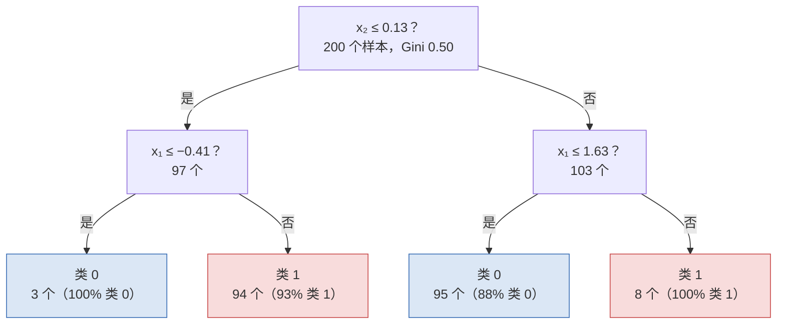

前两篇的模型都画一条直线（超平面）把两类分开。这一篇看三个思路完全不同的分类器：**朴素贝叶斯**用概率算"这个样本更像哪一类"，**KNN** 什么都不学、预测时找最像的几个训练样本投票，**决策树**像医生问诊一样一个问题一个问题地问下去。三个都能用几十行 NumPy 写出来，本文各写一个并与 scikit-learn 对数；它们各自的假设与失效方式，也就是后面 SVM（第五篇）与树的集成（第六篇）要解决的问题。

全篇的核心问题是：

> **"朴素"贝叶斯朴素在哪，假设不成立时会怎样？[^q0] 一个不训练的分类器为什么在 LLM 工作里到处都是？[^q1] 决策树为什么一定过拟合？[^q2]**

## 一、总览

### 1. 七个分类器的地图

本文与后两篇（SVM、集成）共用一张地图。同一份 5000 样本、20 特征的表格数据（8 个特征真有用、4 个是它们的线性组合、其余噪声，5% 标签随机翻转）上，七个分类器的成绩：

| 模型 | 训练准确率 | 测试准确率 | 训练耗时 | 一句话 | 讲在 |
|---|---:|---:|---:|---|---|
| 逻辑回归 | 0.832 | 0.853 | 0.00 s | 线性边界：有非线性就吃亏 | 第三篇 |
| 朴素贝叶斯 | 0.824 | 0.837 | 0.00 s | 假设特征独立：冗余特征让它更差 | 本篇 |
| KNN (k=15) | 0.910 | 0.889 | 0.00 s | 不训练；预测时找 15 个邻居投票 | 本篇 |
| 决策树 | 1.000 | 0.826 | 0.04 s | 训练 100%、测试掉一截：过拟合的教科书样子 | 本篇 |
| SVM (RBF) | 0.937 | 0.918 | 0.05 s | 核把线性边界变弯 | 第五篇 |
| 随机森林 | 1.000 | 0.919 | 0.30 s | 很多棵树的 bagging：降方差 | 第六篇 |
| 梯度提升 | 0.975 | 0.913 | 2.92 s | 逐棵树拟合残差：表格数据的默认最强 | 第六篇 |

在一份二维数据上（两个交错的月牙），七个分类器画出的决策边界长这样：


这张图是全篇的参照：**线性模型只能画直线**（0.88），三个"非线性"的分类器各用自己的方式把边界弯过去（0.93–0.94）——KNN 靠邻居、决策树靠横竖切、SVM 靠核。这张表的教训不是"谁最好"，而是**没有一个模型在所有数据上最好**（no free lunch）：选择要看数据的形状、规模与预测端的成本。

### 2. 本文的章节安排

本文按三个分类器各自的"世界观"组织——算概率、找邻居、问问题——每个都从一个能手算的例子开始，到手写实现，到它在 LLM 工作里出现的形态：

| 章 | 主题 | 内容 |
|---|---|---|
| 二 | 朴素贝叶斯 | 贝叶斯公式的一个手算例子；"朴素"假设；高斯版：每类每特征一条正态曲线；15 行实现；冗余特征为什么让它变差 |
| 三 | KNN | 4 行实现；$$k$$ 的作用（1 / 15 / 150 的边界）；标准化与距离；维度灾难；它在 LLM 里就是检索 |
| 四 | 决策树 | 第一刀怎么选（Gini 扫描图）；25 行实现；一棵深度 2 的树；深度 vs 过拟合 |
| 五 | 三个分类器怎么选 | 假设、训练成本、预测成本、可解释性一张表 |
| 六 | 本文小结 | |
| 七 | 自测 | 六道题 |

## 二、朴素贝叶斯：算概率

### 1. 贝叶斯公式：一个手算的例子

30% 的邮件是垃圾邮件。"免费"这个词在垃圾邮件里出现的概率是 60%，在正常邮件里是 5%。收到一封含"免费"的邮件，它是垃圾邮件的概率是多少？

**贝叶斯公式**（L0 第四篇）把"已知类别、特征出现的概率"倒过来变成"已知特征、属于类别的概率"：

$$
P(\text{垃圾} \mid \text{免费}) = \frac{P(\text{免费} \mid \text{垃圾})\, P(\text{垃圾})}{P(\text{免费})}
$$

- $$P(\text{垃圾}) = 0.3$$：**先验**——没看邮件内容之前的判断；
- $$P(\text{免费} \mid \text{垃圾}) = 0.6$$：**似然**——垃圾邮件里出现这个词的概率；
- $$P(\text{免费}) = 0.6 \times 0.3 + 0.05 \times 0.7 = 0.215$$：这个词总的出现概率（两类各贡献一部分）；
- 后验 $$= 0.6 \times 0.3 / 0.215 = 0.837$$。

看到"免费"，垃圾邮件的概率从 30% 升到 84%。

### 2. "朴素"在哪

再看到第二个词"会议"（垃圾邮件里 40%、正常邮件里 20%）。两个词同时出现的联合概率 $$P(\text{免费}, \text{会议} \mid \text{垃圾})$$ 本来需要统计"两个词同时出现"的频率——词一多（几万个词的任意组合）根本统计不过来。**朴素**（naive）假设：在给定类别的条件下，各特征彼此独立，联合概率就是各自概率的乘积：

$$
P(x_1, x_2, \ldots, x_d \mid c) = \prod_{j=1}^{d} P(x_j \mid c)
$$

于是只要每个词单独的概率：垃圾 $$0.3 \times 0.6 \times 0.4 = 0.072$$，正常 $$0.7 \times 0.05 \times 0.2 = 0.007$$，归一化后 $$P(\text{垃圾} \mid \text{两个词}) = 0.072 / 0.079 = 0.911$$。预测就是比较各类的 $$P(c) \prod_j P(x_j \mid c)$$ 谁大（分母 $$P(x)$$ 对所有类相同，不用算）。实际实现取对数把乘变加，避免几百个小于 1 的数相乘下溢：

$$
\hat c = \arg\max_c \Big[\log P(c) + \sum_{j} \log P(x_j \mid c)\Big]
$$

这个假设几乎从不真正成立（"免费"与"点击"在垃圾邮件里显然一起出现），但常常够用——分类只要求排出正确的顺序，不要求概率算得准。

### 3. 高斯朴素贝叶斯：每类每特征一条正态曲线

特征是连续数值（乳腺癌数据的"平均半径"）时，$$P(x_j \mid c)$$ 用什么？**高斯**朴素贝叶斯假设每类每特征服从一个正态分布，从数据里估它的均值 $$\mu_{cj}$$ 与方差 $$\sigma_{cj}^2$$：


一个新样本的平均半径是 15，代进两条曲线各得一个密度值——恶性那条更高，这个特征就投恶性一票；30 个特征各投一票（取对数相加），加上先验，谁大归谁。

### 4. 十五行实现

```python
class GaussianNaiveBayes:
    def fit(self, X, y):
        self.classes = np.unique(y)
        self.prior = np.array([(y == c).mean() for c in self.classes])            # ① P(c)：各类的比例
        self.mu = np.array([X[y == c].mean(0) for c in self.classes])             # ② [类, 特征]：每类每特征的均值
        self.var = np.array([X[y == c].var(0) + 1e-9 for c in self.classes])      # ③ 方差（加一点防止除零）
        return self

    def predict(self, X):
        ll = -0.5 * (np.log(2 * np.pi * self.var[:, None, :])
                     + (X[None] - self.mu[:, None, :]) ** 2 / self.var[:, None, :]).sum(-1)   # ④ Σ_j log N(x_j; μ, σ²)：[类, n]
        return self.classes[(np.log(self.prior)[:, None] + ll).argmax(0)]                    # ⑤ 加上 log P(c)，取最大的类
```

1. ①–③ `fit` 只是算三张表：各类比例、每类每特征的均值、方差——20 个特征两类就是两张 $$[2, 20]$$ 的表，0.0004 秒；
2. ④ 正态分布密度取对数是 $$-\frac{1}{2}\big[\log(2\pi\sigma^2) + \frac{(x - \mu)^2}{\sigma^2}\big]$$，对全部特征求和（独立假设 → 对数相加）；
3. ⑤ 加上先验的对数，每个样本取最大的类。

```text
手写：fit 0.0004s，测试准确率 0.837；sklearn GaussianNB 0.837
```

与 `GaussianNB` 完全一致——同一个算法、没有随机性，数字必须一样。

### 5. 假设不成立时：冗余特征

它在总表里比逻辑回归还差（0.837 vs 0.853）。原因是那 4 个**冗余特征**——它们是别的特征的线性组合，与它们高度相关，独立假设不成立，同一份证据在求和里被加了两遍，概率过度自信。验证：生成同样 8 个有用特征、但**没有**冗余特征的数据再比一次：

| 数据 | 朴素贝叶斯 | 逻辑回归 |
|---|---:|---:|
| 8 有用 + 4 冗余 + 8 噪声（总表） | 0.837 | 0.853 |
| 8 有用 + 8 噪声，无冗余 | **0.852** | 0.839 |

去掉冗余特征，朴素贝叶斯反超逻辑回归。它的强项是**训练极快、数据很少也能用、天然多类**——文本分类里用词频当特征（多项式朴素贝叶斯），几万个词几秒钟训完，垃圾邮件过滤是它的经典应用；弱项是特征相关时概率不准（第十篇讲校准时会再遇到它）。

## 三、KNN：找邻居

### 1. 四行实现

**K 近邻**（K-nearest neighbours）不训练：`fit` 只是把训练数据存下来。预测一个新样本时，找训练集里离它最近的 $$k$$ 个样本，看它们大多是哪一类：

```python
def knn_predict(Xtrain, ytrain, Xtest, k=15):
    d2 = ((Xtest[:, None, :] - Xtrain[None, :, :]) ** 2).sum(-1)   # ① [n_test, n_train]：每对样本的欧氏距离平方
    idx = np.argpartition(d2, k, axis=1)[:, :k]                    # ② 每个测试样本最近的 k 个训练样本的下标
    votes = ytrain[idx]                                             # ③ [n_test, k]：这 k 个邻居的标签
    return (votes.mean(1) > 0.5).astype(int)                        # ④ 多数票（两类时就是均值过半）
```

1. ① 用广播一次算出所有测试样本到所有训练样本的距离——1500 × 3500 个数；
2. ② `argpartition` 找每行最小的 $$k$$ 个（比完整排序快）；
3. ③④ 取这些邻居的标签，多数投票。

```text
手写 KNN(15)：1500×3500 个距离，0.19s，测试准确率 0.889；sklearn 0.889
```

全部成本在 ①：与训练集大小成正比。训练集到百万级就要换第 4 节的近似最近邻。

### 2. $$k$$ 的作用

$$k$$ 是它唯一的超参数：


| $$k$$ | 1 | 3 | 9 | 15 | 25 | 101 | 501 |
|---|---:|---:|---:|---:|---:|---:|---:|
| 训练准确率 | 1.000 | 0.937 | 0.913 | 0.910 | 0.903 | 0.877 | 0.842 |
| 测试准确率 | 0.833 | 0.864 | 0.891 | 0.889 | 0.891 | 0.876 | 0.850 |

- $$k = 1$$：训练准确率 100%——每个训练点最近的邻居是它自己。边界锯齿状，一个标错的点就在它周围圈出一块错误区域——**方差大**（第一篇）；
- $$k$$ 太大：边界过平，150 个邻居里一半来自另一个月牙，连月牙的形状都丢了——**偏差大**；
- 中间（9–25）最好。这又是第一篇的偏差-方差权衡，$$k$$ 就是它的旋钮。

### 3. 距离与标准化

"最近"要先定义距离。默认是欧氏距离 $$\sqrt{\sum_j (x_j - x'_j)^2}$$，所以必须先**标准化**（第二篇第五章）：一个特征取值 0–1000、另一个 0–1，距离几乎完全由前者决定，后者形同不存在。对 embedding 向量通常用**余弦相似度**（L0 第二篇）——只看方向不看长度。

### 4. 维度灾难

KNN 还有一个更根本的问题。在高维空间里随机撒 500 个点，看一个点到最近邻与最远点的距离之比：


| 维度 | 到最近点 | 到最远点 | 比值 |
|---:|---:|---:|---:|
| 2 | 0.035 | 1.25 | 0.03 |
| 10 | 0.534 | 1.76 | 0.30 |
| 100 | 3.36 | 4.85 | 0.69 |
| 1000 | 12.2 | 13.5 | **0.91** |

1000 维时，最近的邻居与最远的点只差 10%——**"邻居"失去了意义**，所有点离你都差不多远。这叫**维度灾难**。它意味着 KNN 不能直接用在原始的高维特征上（一张图的百万像素、一段文本的几万维词频），要先学出一个好的低维表示——**embedding**（几百到几千维，且相关的东西真的靠近）。第八篇讲降维时会再回到它。

### 5. 它在 LLM 里就是检索

KNN 的本质是"找最相似的几个"，这件事在 LLM 工作里到处都是——只是名字换成了**检索**：

1. **embedding 检索 / RAG**：查询的 embedding 找最近的 $$k$$ 段文本放进 prompt（应用地图 L3）；
2. **few-shot 示例选择**：挑与当前问题最相似的几个示例；
3. **去重的候选召回**（第九篇）：先用相似度找出可能重复的对；
4. **训练数据的影响分析**：哪些训练样本离这个测试样本最近——污染检测的一种做法。

暴力 KNN（本章手写的那个）要与全部 $$n$$ 个样本算距离，$$O(n)$$；**近似最近邻**（FAISS、HNSW、ScaNN 一类索引）把它降到近似 $$O(\log n)$$，代价是偶尔漏掉真正最近的。向量数据库做的就是这件事。

## 四、决策树：问问题

### 1. 第一刀怎么选

决策树把分类变成一串是非题："$$x_2 \le 0.13$$？是 → 左边，否 → 右边"，每边再问下一个问题，直到叶子给出类别。关键是**每一步问哪个问题**——选哪个特征、切在哪个阈值。

标准是切完之后两边**尽量纯**。纯度用**基尼不纯度**（Gini impurity）度量：一堆样本里类 1 占比 $$p$$，

$$
G = 1 - p^2 - (1 - p)^2 = 2p(1 - p)
$$

全是一类时 $$G = 0$$（最纯），各占一半时 $$G = 0.5$$（最不纯）。一刀切成左右两堆，切的好坏是两堆 Gini 按样本数的加权平均——越低越好。对每个特征、每个候选阈值都算一遍，选最低的：


月牙数据的根节点：Gini 0.498（两类各半）。扫遍两个特征的所有阈值，沿 $$x_2$$ 在 0.13 处切最好，切完加权 Gini 降到 0.25——上面一堆基本是蓝、下面一堆基本是红。这就是中图那条水平线。

### 2. 二十五行实现

```python
def gini(y):
    p = y.mean(); return 2 * p * (1 - p)                                          # 两类：全是一类 0，各占一半 0.5

def best_split(X, y):
    best = (gini(y), None, None)
    for j in range(X.shape[1]):                                                   # ① 每个特征
        for thr in np.percentile(X[:, j], np.arange(5, 100, 5)):                  # ② 19 个分位数当候选阈值
            left = X[:, j] <= thr
            if left.sum() == 0 or left.sum() == len(y): continue
            g = left.mean() * gini(y[left]) + (1 - left.mean()) * gini(y[~left])  # ③ 切完两边不纯度的加权平均
            if g < best[0]: best = (g, j, thr)
    return best[1], best[2]

def build_tree(X, y, depth, max_depth):
    if depth == max_depth or len(np.unique(y)) == 1: return int(y.mean() > 0.5)  # ④ 到深度或已纯：叶子 = 多数类
    j, thr = best_split(X, y)
    if j is None: return int(y.mean() > 0.5)
    left = X[:, j] <= thr
    return (j, thr, build_tree(X[left], y[left], depth + 1, max_depth), build_tree(X[~left], y[~left], depth + 1, max_depth))  # ⑤ 递归

def tree_predict(node, x):
    while isinstance(node, tuple):                                                # ⑥ 从根往下走到叶子
        j, thr, l, r = node
        node = l if x[j] <= thr else r
    return node
```

1. ①–③ `best_split` 遍历每个特征的 19 个分位数阈值，选加权 Gini 最低的一刀（scikit-learn 试每一个可能的切点，所以数字略有差别）；
2. ④ 停止条件：到了最大深度，或这堆样本已经全是一类——叶子返回多数类；
3. ⑤ 否则切一刀、两边各自递归——树就是一个嵌套的元组 `(特征, 阈值, 左子树, 右子树)`；
4. ⑥ 预测就是从根开始按答案往下走。

### 3. 一棵深度 2 的树

月牙数据上 scikit-learn 训出的深度 2 的树，画出来是：



三个问题、四个叶子，训练 0.91 / 测试 0.92——就是上一张图右边那条横竖折线。每个叶子还告诉你它有多纯（94 个里 93% 是类 1），这就是决策树输出的"概率"。**树是可解释的**：从根到叶的路径就是一条人能读的规则——"$$x_2 \le 0.13$$ 且 $$x_1 > -0.41$$ → 类 1"。它也不需要标准化（问题是"大于阈值吗"，与量纲无关）、能直接处理类别特征。

### 4. 深度与过拟合

树能切多深？不限深度它会一直切到每个叶子只剩一个样本：


| `max_depth` | 手写：训练 / 测试 | scikit-learn：训练 / 测试 |
|---|---|---|
| 1 | 0.725 / 0.719 | 0.731 / 0.713 |
| 3 | 0.800 / 0.806 | 0.805 / 0.803 |
| 6 | 0.888 / 0.851 | 0.892 / 0.847 |
| 10 | 0.974 / 0.841 | 0.968 / 0.843 |
| 不限 | **1.000 / 0.838** | **1.000 / 0.826** |

深度不限时训练 100%——它把 5000 个样本连同那 5% 翻转的标签全背下来了，测试掉到 83%，比深度 6 还差。**决策树天生过拟合**：它的容量随深度指数增长（深度 $$d$$ 最多 $$2^d$$ 个叶子），而每个叶子的决定只依赖落进它的那几个样本——训练数据换几个点，树的结构就完全不同，方差极大。控制方法是限制深度、限制叶子最少样本数、剪枝；更好的办法是第六篇的集成——很多棵树平均，把方差压掉。

## 五、三个分类器怎么选

| | 朴素贝叶斯 | KNN | 决策树 |
|---|---|---|---|
| 世界观 | 算每类生成这个样本的概率 | 像谁就是谁 | 一串是非题 |
| 假设 | 特征在类内独立 | 近的样本同类；距离有意义 | 边界能用横竖线拼出来 |
| 训练成本 | 极低（算均值方差） | 零（存数据） | 中（每个节点扫所有特征与阈值） |
| 预测成本 | 低 | **高**（与训练集大小成正比） | 极低（走一条路径） |
| 需要标准化 | 否 | **是** | 否 |
| 可解释 | 中（看每类的分布） | 低（只能给出邻居） | **高**（规则可读） |
| 失效方式 | 特征相关 → 概率过度自信 | 高维 → 邻居无意义；$$k$$ 选错 | 深度不限 → 背下训练集 |
| 在 LLM 工作里 | 词袋文本分类的 baseline | 检索、RAG、few-shot 选例、去重召回 | 特征重要性、GBDT 的组件（第六篇） |

## 六、本文小结

- **七个分类器一张地图**：线性模型（逻辑回归、朴素贝叶斯）只能画直线，月牙数据 0.88；KNN、决策树、SVM 各用自己的方式把边界弯过去，0.93–0.94。没有一个模型在所有数据上最好。
- **朴素贝叶斯** = 贝叶斯公式 + "特征在类内独立"的朴素假设：$$\hat c = \arg\max_c [\log P(c) + \sum_j \log P(x_j \mid c)]$$；高斯版每类每特征估一个均值方差，15 行，`fit` 0.0004 秒，与 `GaussianNB` 完全一致（0.837）。冗余特征让同一份证据被重复计数——去掉冗余特征后 0.852 反超逻辑回归。
- **KNN** 不训练，预测时找最近 $$k$$ 个投票，4 行；$$k$$ 是偏差-方差的旋钮（$$k = 1$$ 训练 100% 测试 0.83，$$k = 9$$–25 最好 0.89）；必须标准化；**维度灾难**——1000 维时最近与最远只差 10%，所以要先有 embedding；它在 LLM 里就是**检索**，近似最近邻把 $$O(n)$$ 降到 $$O(\log n)$$。
- **决策树**每个节点选"切完两边最纯"的一刀（Gini $$2p(1-p)$$ 的加权平均最低），25 行；深度 2 的树是三个问题四个叶子，规则可读；**天生过拟合**——深度不限时训练 100%、测试 0.83，方差极大，这是第六篇集成要解决的问题。

配套代码：本文全部数字与图由 [`classical-ml/04_naive_bayes_knn_and_trees.py`](https://github.com/arganzheng/ai-learning-labs/blob/main/classical-ml/04_naive_bayes_knn_and_trees.py) 产生（`compare` / `grid` / `bayes` / `nb` / `knn` / `curse` / `tree` / `depth` 八个子实验），CPU 上一分钟内跑完。

## 七、自测

1. 先验 $$P(\text{垃圾}) = 0.3$$，"中奖"在垃圾邮件里出现概率 0.5、正常邮件里 0.02。含"中奖"的邮件是垃圾邮件的概率？

   <details markdown="1"><summary>答案</summary>

   $$0.5 \times 0.3 / (0.5 \times 0.3 + 0.02 \times 0.7) = 0.15 / 0.164 = 0.915$$。

   </details>

2. 朴素贝叶斯在有冗余特征的数据上为什么变差？

   <details markdown="1"><summary>答案</summary>

   冗余特征高度相关，"条件独立"假设不成立，同一份证据被重复计数、概率过度自信；本文去掉 4 个冗余特征后从 0.837 升到 0.852。

   </details>

3. KNN 的 $$k = 1$$ 时训练准确率是多少？为什么？测试准确率会好吗？

   <details markdown="1"><summary>答案</summary>

   100%——每个训练点最近的邻居是它自己；测试不好（0.83 vs $$k = 15$$ 的 0.89），边界锯齿、方差大。

   </details>

4. 用 4096 维的原始像素做 KNN 图像分类，会遇到什么问题？该怎么办？

   <details markdown="1"><summary>答案</summary>

   维度灾难——高维里所有点距离差不多，"最近邻"没有意义；先用一个模型把图像编码成低维 embedding 再做 KNN。

   </details>

5. 一堆样本 60 个类 0、40 个类 1，Gini 不纯度是多少？一刀切成 (50, 0) 与 (10, 40) 两堆后加权 Gini 是多少？

   <details markdown="1"><summary>答案</summary>

   $$2 \times 0.6 \times 0.4 = 0.48$$；左堆 0，右堆 $$2 \times 0.2 \times 0.8 = 0.32$$，加权 $$0.5 \times 0 + 0.5 \times 0.32 = 0.16$$。

   </details>

6. 决策树训练准确率 100%、测试 83%，是欠拟合还是过拟合？三个修法。

   <details markdown="1"><summary>答案</summary>

   过拟合；限制深度（本文深度 6 最好）、叶子最少样本数 / 剪枝、集成（随机森林，第六篇）。

   </details>

## 下一篇

下一篇讲 SVM：同样是画一条直线分两类，它选的是**离两类都最远**的那条（最大间隔）；再用核技巧把直线变弯——在第一章那张图里画出平滑曲线的就是它。

[^q0]: 朴素 = 假设特征在给定类别下彼此独立，于是 $$P(x \mid c) = \prod_j P(x_j \mid c)$$，取对数相加。不成立时同一份证据被重复计数、概率过度自信：总表里它 0.837 输给逻辑回归 0.853，去掉 4 个冗余特征后 0.852 反超。分类只要顺序对，所以它常常仍然够用。详见[第二章](#二朴素贝叶斯算概率)。
[^q1]: KNN 的本质是"找最相似的几个"——这就是检索：RAG 找最近的 $$k$$ 段文本、few-shot 选最像的示例、去重先召回候选对、污染检测找最近的训练样本。代价是预测时要算与全部样本的距离（$$O(n)$$），近似最近邻索引降到 $$O(\log n)$$；前提是先有好的低维 embedding，否则维度灾难让所有距离都差不多。详见[第三章](#三knn找邻居)。
[^q2]: 它的容量随深度指数增长（$$2^d$$ 个叶子），深度不限时会切到每个叶子只剩一个样本，把训练集连同标签噪声全背下来——训练 100%、测试 0.83；每个叶子只由落进它的几个样本决定，换几个训练点结构就完全不同，方差极大。限制深度（深度 6 最好 0.85）或集成（第六篇）。详见[第四章](#四决策树问问题)。
