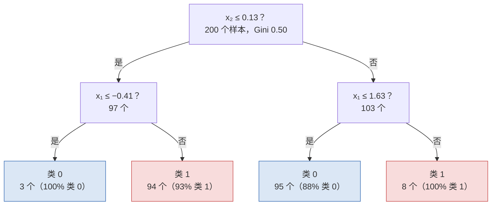

前两篇的模型都画一条直线（超平面）把两类分开。这一篇看三个思路完全不同的分类器：**朴素贝叶斯**用概率算"这个样本更像哪一类"，**KNN** 什么都不学、预测时找最像的几个训练样本投票，**决策树**像医生问诊一样一个问题一个问题地问下去。三个都能用几十行 NumPy 写出来，本文各写一个并与 scikit-learn 对数；它们各自的假设与失效方式，也就是后面 SVM（第五篇）与树的集成（第六篇）要解决的问题。

全篇的核心问题是：

> **"朴素"贝叶斯朴素在哪，假设不成立时会怎样？[^q0] 一个不训练的分类器为什么在 LLM 工作里到处都是？[^q1] 决策树为什么一定过拟合？[^q2]**

## 一、总览

### 1. 七个分类器的地图

本文与后两篇（SVM、集成）共用一张地图。同一份 5000 样本、20 特征的表格数据（8 个特征真有用、4 个是它们的线性组合、其余噪声，5% 标签随机翻转）上，七个分类器的成绩：

| 模型 | 训练准确率 | 测试准确率 | 训练耗时 | 一句话 | 讲在 |
|---|---:|---:|---:|---|---|
| 逻辑回归 | 0.832 | 0.853 | 0.00 s | 线性边界：有非线性就吃亏 | 第三篇 |
| 朴素贝叶斯 | 0.824 | 0.837 | 0.00 s | 假设特征独立：冗余特征让它更差 | 本篇 |
| KNN (k=15) | 0.910 | 0.889 | 0.00 s | 不训练；预测时找 15 个邻居投票 | 本篇 |
| 决策树 | 1.000 | 0.826 | 0.04 s | 训练 100%、测试掉一截：过拟合的教科书样子 | 本篇 |
| SVM (RBF) | 0.937 | 0.918 | 0.05 s | 核把线性边界变弯 | 第五篇 |
| 随机森林 | 1.000 | 0.919 | 0.30 s | 很多棵树的 bagging：降方差 | 第六篇 |
| 梯度提升 | 0.975 | 0.913 | 2.92 s | 逐棵树拟合残差：表格数据的默认最强 | 第六篇 |

Table: 七个分类器在同一份表格数据上的成绩

在一份二维数据上（两个交错的月牙），七个分类器画出的决策边界长这样：


这张图是全篇的参照：**线性模型只能画直线**（0.88），三个"非线性"的分类器各用自己的方式把边界弯过去（0.93–0.94）——KNN 靠邻居、决策树靠横竖切、SVM 靠核。这张表的教训不是"谁最好"，而是**没有一个模型在所有数据上最好**（no free lunch）：选择要看数据的形状、规模与预测端的成本。

### 2. 本文的章节安排

本文按三个分类器各自的"世界观"组织——算概率、找邻居、问问题——每个都从一个能手算的例子开始，到手写实现，到它在 LLM 工作里出现的形态：

| 章 | 主题 | 内容 |
|---|---|---|
| 二 | 朴素贝叶斯 | 1000 封邮件数出贝叶斯公式<br/>"朴素"假设<br/>高斯版：每类每特征一条正态曲线<br/>15 行实现<br/>冗余特征为什么让它变差 |
| 三 | KNN | 5 个点手算一次投票<br/>4 行实现<br/>$$k$$ 的作用（1 / 15 / 150 的边界）<br/>标准化与距离<br/>维度灾难<br/>它在 LLM 里就是检索 |
| 四 | 决策树 | 第一刀怎么选（Gini 扫描图 + 两堆样本的验算）<br/>25 行实现<br/>一棵深度 2 的树<br/>深度 vs 过拟合 |
| 五 | 三个分类器怎么选 | 假设、训练成本、预测成本、可解释性一张表 |
| 六 | 案例：三个分类器各一个经典问题 | 朴素贝叶斯做垃圾短信（与第三篇同一份数据，98.6%，23 ms 训完）<br/>KNN 做 MNIST 手写数字（60,000 张，错误率 2.95%）<br/>决策树做泰坦尼克（深度 3 的树整棵画出来，83%；一个泄漏的陷阱） |
| 七 | 本文小结 |  |
| 八 | 自测 | 六道题 |

Table: 本文的章节安排

### 3. 来龙去脉：三种世界观各从哪来

三个分类器不是一个家族的三代，而是三种互不相干的想法，各有自己的出身和第一次真正派上用场的场合：

| 分类器 | 年 | 谁 | 当时的问题 | 留下的东西 |
|---|---|---|---|---|
| 朴素贝叶斯 | 1763 | Bayes（遗稿由 Price 发表）、Laplace 1812 | 看到了结果，怎么反推原因的概率 | 贝叶斯公式 $$P(c \mid x) \propto P(x \mid c) P(c)$$（第二章） |
| | 1961 | Maron，《Automatic Indexing》 | 几千篇文献怎么自动归类到主题 | 第一次把"每个词独立"的朴素假设用在文本上——之后六十年它一直是文本分类的基线 |
| | 1998 / 2002 | Sahami 等（微软）；Paul Graham《A Plan for Spam》 | 垃圾邮件泛滥，规则过滤器追不上 | 用 NB 数每个词在垃圾 / 正常邮件里的频率，Graham 的文章让它进入 Thunderbird、SpamAssassin——第六章的案例 |
| KNN | 1951 | Fix & Hodges（美国空军报告） | 不知道数据的分布长什么样，能不能不假设、直接看邻居 | 最近邻分类：**不建模型**，把数据本身当模型 |
| | 1967 | Cover & Hart | 这么简单的方法到底有没有理论保证 | 证明 1-NN 的错误率不超过最优分类器的两倍——"看一个邻居"最多损失一半的信息 |
| | 2017– | Faiss、HNSW、向量数据库 | 十亿个 embedding 里找最近的几个 | 近似最近邻把 $$O(n)$$ 降到 $$O(\log n)$$：今天的 RAG 检索就是 KNN（第三章） |
| 决策树 | 1963 | Morgan & Sonquist，AID | 社会调查数据里哪些变量决定收入，要一个能讲给人听的模型 | 递归地把数据切成两堆，每堆更纯 |
| | 1984 | Breiman、Friedman、Olshen、Stone，CART | 怎么选切分（Gini）、怎么做回归树、树太深怎么剪 | CART——scikit-learn 的 `DecisionTree` 就是它（第四章） |
| | 1986 / 1993 | Quinlan，ID3 / C4.5 | 用信息增益选切分、处理缺失与连续值 | 机器学习领域最常被引用的算法之一；单棵树的过拟合问题留给第六篇的集成 |

Table: 三个分类器的来历

三个"当时的问题"今天都还在：**要一个能一秒训完、一眼看懂权重的文本分类器**——朴素贝叶斯；**不想建模型、只想找相似的**——KNN，今天叫检索；**要一个能画出来讲给业务方听的模型**——决策树。它们各自被更强的东西替代过（NB 被逻辑回归和 SVM、KNN 被学出来的 embedding + 近似检索、单棵树被随机森林和梯度提升），但替代者都保留了它们的骨架。

## 二、朴素贝叶斯：算概率

### 1. 贝叶斯公式：一个手算的例子

30% 的邮件是垃圾邮件。"免费"这个词在垃圾邮件里出现的概率是 60%，在正常邮件里是 5%。收到一封含"免费"的邮件，它是垃圾邮件的概率是多少？

先用数数的办法算。假设有 1000 封邮件：

| | 含"免费" | 不含"免费" | 合计 |
|---|---:|---:|---:|
| 垃圾邮件 | 180（= 300 × 60%） | 120 | 300 |
| 正常邮件 | 35（= 700 × 5%） | 665 | 700 |
| 合计 | **215** | 785 | 1000 |

Table: 1000 封邮件的贝叶斯计数

含"免费"的邮件共 215 封，其中 180 封是垃圾邮件，所以答案是 $$180 / 215 = 0.837$$。这就是全部推理——**条件概率**"已知 A，B 的概率"就是"A 和 B 都发生的次数 ÷ A 发生的次数"。**贝叶斯公式**只是把这个数数过程写成一般形式，把"已知类别、特征出现的概率"倒过来变成"已知特征、属于类别的概率"：

$$
P(\text{垃圾} \mid \text{免费}) = \frac{P(\text{免费} \mid \text{垃圾})\, P(\text{垃圾})}{P(\text{免费})}
$$

- $$P(\text{垃圾}) = 0.3$$：**先验**——没看邮件内容之前的判断；
- $$P(\text{免费} \mid \text{垃圾}) = 0.6$$：**似然**——垃圾邮件里出现这个词的概率；
- $$P(\text{免费}) = 0.6 \times 0.3 + 0.05 \times 0.7 = 0.215$$：这个词总的出现概率（两类各贡献一部分）；
- 后验 $$= 0.6 \times 0.3 / 0.215 = 0.837$$——分子 0.18 是表里的 180 封、分母 0.215 是 215 封，与数数完全一样。

看到"免费"，垃圾邮件的概率从 30%（**先验**）升到 84%（**后验**，看过证据之后的判断）。分类器做的事就是：对每个类算一个后验，选最大的。

### 2. "朴素"在哪

再看到第二个词"会议"（垃圾邮件里 40%、正常邮件里 20%）。两个词同时出现的联合概率 $$P(\text{免费}, \text{会议} \mid \text{垃圾})$$ 本来需要统计"两个词同时出现"的频率——词一多（几万个词的任意组合）根本统计不过来。**朴素**（naive）假设：在给定类别的条件下，各特征彼此独立，联合概率就是各自概率的乘积：

$$
P(x_1, x_2, \ldots, x_d \mid c) = \prod_{j=1}^{d} P(x_j \mid c)
$$

于是只要每个词单独的概率：垃圾 $$0.3 \times 0.6 \times 0.4 = 0.072$$，正常 $$0.7 \times 0.05 \times 0.2 = 0.007$$，归一化后 $$P(\text{垃圾} \mid \text{两个词}) = 0.072 / 0.079 = 0.911$$。预测就是比较各类的 $$P(c) \prod_j P(x_j \mid c)$$ 谁大（分母 $$P(x)$$ 对所有类相同，不用算）。实际实现取对数把乘变加，避免几百个小于 1 的数相乘下溢：

$$
\hat c = \arg\max_c \Big[\log P(c) + \sum_{j} \log P(x_j \mid c)\Big]
$$

这个假设几乎从不真正成立（"免费"与"点击"在垃圾邮件里显然一起出现），但常常够用——分类只要求排出正确的顺序，不要求概率算得准。

### 3. 高斯朴素贝叶斯：每类每特征一条正态曲线

特征是连续数值（乳腺癌数据的"平均半径"）时，$$P(x_j \mid c)$$ 用什么？**高斯**朴素贝叶斯假设每类每特征服从一个正态分布，从数据里估它的均值 $$\mu_{cj}$$ 与方差 $$\sigma_{cj}^2$$：


"正态分布"就是上一篇第八章那条钟形曲线，它由两个数决定：均值 $$\mu$$（曲线中心）与标准差 $$\sigma$$（曲线多宽），密度公式 $$\frac{1}{\sqrt{2\pi}\sigma} \exp\big(-\frac{(x - \mu)^2}{2\sigma^2}\big)$$。从数据估 $$\mu, \sigma$$ 就是算良性肿瘤的平均半径的均值和标准差——"训练"只是算两个统计量。一个新样本的平均半径是 15，代进两条曲线：良性那条（$$\mu = 12.15, \sigma = 1.78$$）在 15 处的密度是 0.062，恶性那条（$$\mu = 17.46, \sigma = 3.20$$）是 0.093——15 离恶性的中心更近（按各自的宽度衡量），这个特征就以 0.093 : 0.062 投恶性一票；30 个特征各投一票（取对数相加），加上先验，谁大归谁。

### 4. 十五行实现

```python title="GaussianNaiveBayes：十五行实现"
class GaussianNaiveBayes:
    def fit(self, X, y):
        self.classes = np.unique(y)
        self.prior = np.array([(y == c).mean() for c in self.classes])            # ① P(c)：各类的比例
        self.mu = np.array([X[y == c].mean(0) for c in self.classes])             # ② [类, 特征]：每类每特征的均值
        self.var = np.array([X[y == c].var(0) + 1e-9 for c in self.classes])      # ③ 方差（加一点防止除零）
        return self

    def predict(self, X):
        ll = -0.5 * (np.log(2 * np.pi * self.var[:, None, :])
                     + (X[None] - self.mu[:, None, :]) ** 2 / self.var[:, None, :]).sum(-1)   # ④ Σ_j log N(x_j; μ, σ²)：[类, n]
        return self.classes[(np.log(self.prior)[:, None] + ll).argmax(0)]                    # ⑤ 加上 log P(c)，取最大的类
```

1. ①–③ `fit` 只是算三张表：各类比例、每类每特征的均值、方差——20 个特征两类就是两张 $$[2, 20]$$ 的表，0.0004 秒；
2. ④ 正态分布密度取对数是 $$-\frac{1}{2}\big[\log(2\pi\sigma^2) + \frac{(x - \mu)^2}{\sigma^2}\big]$$，对全部特征求和（独立假设 → 对数相加）；
3. ⑤ 加上先验的对数，每个样本取最大的类。

```text title="手写与 sklearn GaussianNB 的结果"
手写：fit 0.0004s，测试准确率 0.837；sklearn GaussianNB 0.837
```

与 `GaussianNB` 完全一致——同一个算法、没有随机性，数字必须一样。

### 5. 假设不成立时：冗余特征

它在总表里比逻辑回归还差（0.837 vs 0.853）。原因是那 4 个**冗余特征**——它们是别的特征的线性组合，与它们高度相关，独立假设不成立，同一份证据在求和里被加了两遍，概率过度自信。验证：生成同样 8 个有用特征、但**没有**冗余特征的数据再比一次：

| 数据 | 朴素贝叶斯 | 逻辑回归 |
|---|---:|---:|
| 8 有用 + 4 冗余 + 8 噪声（总表） | 0.837 | 0.853 |
| 8 有用 + 8 噪声，无冗余 | **0.852** | 0.839 |

Table: 冗余特征对朴素贝叶斯与逻辑回归的影响

去掉冗余特征，朴素贝叶斯反超逻辑回归。它的强项是**训练极快、数据很少也能用、天然多类**——文本分类里用词频当特征（多项式朴素贝叶斯），几万个词几秒钟训完，垃圾邮件过滤是它的经典应用；弱项是特征相关时概率不准（第十篇讲校准时会再遇到它）。

## 三、KNN：找邻居

### 1. 四行实现

**K 近邻**（K-nearest neighbours）不训练：`fit` 只是把训练数据存下来。预测一个新样本时，找训练集里离它最近的 $$k$$ 个样本，看它们大多是哪一类——"像谁就是谁"。先手算一个：5 个训练点，问新点 $$(0, 0)$$ 属于哪类，$$k = 3$$：

| 训练点 | 类 | 到 $$(0, 0)$$ 的距离 $$\sqrt{x_1^2 + x_2^2}$$ | 最近 3 个？ |
|---|---|---:|---|
| (1, 0) | A | 1.00 | 是 |
| (0, 1.5) | B | 1.50 | 是 |
| (−1, −1) | A | 1.41 | 是 |
| (3, 0) | B | 3.00 | |
| (0, −4) | B | 4.00 | |

Table: KNN 手算：5 个训练点到 (0, 0) 的距离

最近的 3 个里两个 A、一个 B，判 A。$$k = 5$$ 时全部参与投票，3 个 B、2 个 A，判 B——同一个点，$$k$$ 不同结论不同，第 2 节会看这意味着什么。代码就是把这张表对所有测试样本一次算完：

```python title="knn_predict：四行实现"
def knn_predict(Xtrain, ytrain, Xtest, k=15):
    d2 = ((Xtest[:, None, :] - Xtrain[None, :, :]) ** 2).sum(-1)   # ① [n_test, n_train]：每对样本的欧氏距离平方
    idx = np.argpartition(d2, k, axis=1)[:, :k]                    # ② 每个测试样本最近的 k 个训练样本的下标
    votes = ytrain[idx]                                             # ③ [n_test, k]：这 k 个邻居的标签
    return (votes.mean(1) > 0.5).astype(int)                        # ④ 多数票（两类时就是均值过半）
```

1. ① 用广播一次算出所有测试样本到所有训练样本的距离——1500 × 3500 个数；
2. ② `argpartition` 找每行最小的 $$k$$ 个（比完整排序快）；
3. ③④ 取这些邻居的标签，多数投票。

```text title="手写 KNN 与 sklearn 的结果"
手写 KNN(15)：1500×3500 个距离，0.19s，测试准确率 0.889；sklearn 0.889
```

全部成本在 ①：与训练集大小成正比。训练集到百万级就要换第 4 节的近似最近邻。

### 2. $$k$$ 的作用

$$k$$ 是它唯一的超参数：


| $$k$$ | 1 | 3 | 9 | 15 | 25 | 101 | 501 |
|---|---:|---:|---:|---:|---:|---:|---:|
| 训练准确率 | 1.000 | 0.937 | 0.913 | 0.910 | 0.903 | 0.877 | 0.842 |
| 测试准确率 | 0.833 | 0.864 | 0.891 | 0.889 | 0.891 | 0.876 | 0.850 |

Table: 不同 k 下 KNN 的训练与测试准确率

- $$k = 1$$：训练准确率 100%——每个训练点最近的邻居是它自己。边界锯齿状，一个标错的点就在它周围圈出一块错误区域——**方差大**（第一篇）；
- $$k$$ 太大：边界过平，150 个邻居里一半来自另一个月牙，连月牙的形状都丢了——**偏差大**；
- 中间（9–25）最好。这又是第一篇的偏差-方差权衡，$$k$$ 就是它的旋钮。

### 3. 距离与标准化

"最近"要先定义距离。默认是欧氏距离 $$\sqrt{\sum_j (x_j - x'_j)^2}$$，所以必须先**标准化**（第二篇第五章）：一个特征取值 0–1000、另一个 0–1，距离几乎完全由前者决定，后者形同不存在。对 embedding 向量通常用[**余弦相似度**](# "tip: 两个向量夹角的余弦：点积除以两者长度的乘积，范围 −1 到 1。方向相同为 1、垂直为 0。只比较方向，不受向量长短影响")——只看方向不看长度。

### 4. 维度灾难

KNN 还有一个更根本的问题。在高维空间里随机撒 500 个点，看一个点到最近邻与最远点的距离之比：


| 维度 | 到最近点 | 到最远点 | 比值 |
|---:|---:|---:|---:|
| 2 | 0.035 | 1.25 | 0.03 |
| 10 | 0.534 | 1.76 | 0.30 |
| 100 | 3.36 | 4.85 | 0.69 |
| 1000 | 12.2 | 13.5 | **0.91** |

Table: 维度灾难：不同维度下最近与最远距离的比值

1000 维时，最近的邻居与最远的点只差 10%——**"邻居"失去了意义**，所有点离你都差不多远。这叫**维度灾难**。为什么会这样：两点的距离平方是 $$d$$ 个坐标差的平方**之和**；每个坐标差都是随机的，加 1000 个随机数，总和的相对波动很小（第一篇"独立量的平均，方差除以 $$n$$"），所以任意两点的距离都挤在同一个值附近，再也分不出"近"与"远"。它意味着 KNN 不能直接用在原始的高维特征上（一张图的百万像素、一段文本的几万维词频），要先学出一个好的低维表示——**embedding**（几百到几千维，且相关的东西真的靠近）。第八篇讲降维时会再回到它。

### 5. 它在 LLM 里就是检索

KNN 的本质是"找最相似的几个"，这件事在 LLM 工作里到处都是——只是名字换成了**检索**：

1. **embedding 检索 / RAG**：查询的 embedding 找最近的 $$k$$ 段文本放进 prompt（应用地图 L3）；
2. **few-shot 示例选择**：挑与当前问题最相似的几个示例；
3. **去重的候选召回**（第九篇）：先用相似度找出可能重复的对；
4. **训练数据的影响分析**：哪些训练样本离这个测试样本最近——污染检测的一种做法。

暴力 KNN（本章手写的那个）要与全部 $$n$$ 个样本算距离，$$O(n)$$；**近似最近邻**（FAISS、HNSW、ScaNN 一类索引）把它降到近似 $$O(\log n)$$，代价是偶尔漏掉真正最近的。向量数据库做的就是这件事。

## 四、决策树：问问题

### 1. 第一刀怎么选

决策树把分类变成一串是非题："$$x_2 \le 0.13$$？是 → 左边，否 → 右边"，每边再问下一个问题，直到叶子给出类别。关键是**每一步问哪个问题**——选哪个特征、切在哪个阈值。

标准是切完之后两边**尽量纯**。纯度用**基尼不纯度**（Gini impurity）度量：一堆样本里类 1 占比 $$p$$，

$$
G = 1 - p^2 - (1 - p)^2 = 2p(1 - p)
$$

全是一类时 $$G = 0$$（最纯），各占一半时 $$G = 0.5$$（最不纯）。一刀切成左右两堆，切的好坏是两堆 Gini 按样本数的加权平均——越低越好。对每个特征、每个候选阈值都算一遍，选最低的：


月牙数据的根节点：200 个训练样本，类 1 占 53%，Gini $$= 2 \times 0.53 \times 0.47 = 0.498$$（接近最不纯的 0.5）。扫遍两个特征的所有阈值，沿 $$x_2$$ 在 0.13 处切最好。把这一刀切完的两堆数出来验算：

| 堆 | 样本数 | 类 0 | 类 1 | 类 1 占比 $$p$$ | Gini $$2p(1 - p)$$ |
|---|---:|---:|---:|---:|---:|
| $$x_2 \le 0.13$$（下） | 97 | 10 | 87 | 0.897 | 0.185 |
| $$x_2 > 0.13$$（上） | 103 | 84 | 19 | 0.184 | 0.301 |

Table: 根节点第一刀切出的两堆及其 Gini

加权平均 $$= (97 \times 0.185 + 103 \times 0.301) / 200 = 0.245$$——从 0.498 降到 0.25，两堆都比切之前纯得多：下面一堆基本是类 1、上面一堆基本是类 0。这就是中图那条水平线。左图的每个点就是对一个候选阈值做一次这样的计算，曲线最低点就是选出的那一刀。

### 2. 二十五行实现

```python title="决策树：二十五行实现"
def gini(y):
    p = y.mean(); return 2 * p * (1 - p)                                          # 两类：全是一类 0，各占一半 0.5

def best_split(X, y):
    best = (gini(y), None, None)
    for j in range(X.shape[1]):                                                   # ① 每个特征
        for thr in np.percentile(X[:, j], np.arange(5, 100, 5)):                  # ② 19 个分位数当候选阈值
            left = X[:, j] <= thr
            if left.sum() == 0 or left.sum() == len(y): continue
            g = left.mean() * gini(y[left]) + (1 - left.mean()) * gini(y[~left])  # ③ 切完两边不纯度的加权平均
            if g < best[0]: best = (g, j, thr)
    return best[1], best[2]

def build_tree(X, y, depth, max_depth):
    if depth == max_depth or len(np.unique(y)) == 1: return int(y.mean() > 0.5)  # ④ 到深度或已纯：叶子 = 多数类
    j, thr = best_split(X, y)
    if j is None: return int(y.mean() > 0.5)
    left = X[:, j] <= thr
    return (j, thr, build_tree(X[left], y[left], depth + 1, max_depth), build_tree(X[~left], y[~left], depth + 1, max_depth))  # ⑤ 递归

def tree_predict(node, x):
    while isinstance(node, tuple):                                                # ⑥ 从根往下走到叶子
        j, thr, l, r = node
        node = l if x[j] <= thr else r
    return node
```

1. ①–③ `best_split` 遍历每个特征的 19 个分位数阈值，选加权 Gini 最低的一刀（scikit-learn 试每一个可能的切点，所以数字略有差别）；
2. ④ 停止条件：到了最大深度，或这堆样本已经全是一类——叶子返回多数类；
3. ⑤ 否则切一刀、两边各自递归——树就是一个嵌套的元组 `(特征, 阈值, 左子树, 右子树)`；
4. ⑥ 预测就是从根开始按答案往下走。

### 3. 一棵深度 2 的树

月牙数据上 scikit-learn 训出的深度 2 的树，画出来是：


```mermaid
%% 月牙数据上深度 2 的决策树：每个节点一个问题，叶子是类别与样本数
flowchart TD
    R["x₂ ≤ 0.13？<br/>200 个样本，Gini 0.50"]
    R -->|是| L["x₁ ≤ −0.41？<br/>97 个"]
    R -->|否| Rt["x₁ ≤ 1.63？<br/>103 个"]
    L -->|是| L1["类 0<br/>3 个（100% 类 0）"]
    L -->|否| L2["类 1<br/>94 个（93% 类 1）"]
    Rt -->|是| R1["类 0<br/>95 个（88% 类 0）"]
    Rt -->|否| R2["类 1<br/>8 个（100% 类 1）"]
    classDef c0 fill:#dbe7f5,stroke:#3b6fb6
    classDef c1 fill:#f8dcdc,stroke:#c94c4c
    class L1,R1 c0
    class L2,R2 c1
```

三个问题、四个叶子，训练 0.91 / 测试 0.92——就是上一张图右边那条横竖折线。每个叶子还告诉你它有多纯（94 个里 93% 是类 1），这就是决策树输出的"概率"。**树是可解释的**：从根到叶的路径就是一条人能读的规则——"$$x_2 \le 0.13$$ 且 $$x_1 > -0.41$$ → 类 1"。它也不需要标准化（问题是"大于阈值吗"，与量纲无关）、能直接处理类别特征。

### 4. 深度与过拟合

树能切多深？不限深度它会一直切到每个叶子只剩一个样本：


| `max_depth` | 手写：训练 / 测试 | scikit-learn：训练 / 测试 |
|---|---|---|
| 1 | 0.725 / 0.719 | 0.731 / 0.713 |
| 3 | 0.800 / 0.806 | 0.805 / 0.803 |
| 6 | 0.888 / 0.851 | 0.892 / 0.847 |
| 10 | 0.974 / 0.841 | 0.968 / 0.843 |
| 不限 | **1.000 / 0.838** | **1.000 / 0.826** |

Table: 不同 max_depth 下手写决策树与 scikit-learn 的准确率

深度不限时训练 100%——它把 5000 个样本连同那 5% 翻转的标签全背下来了，测试掉到 83%，比深度 6 还差。**决策树天生过拟合**：它的容量随深度指数增长（深度 $$d$$ 最多 $$2^d$$ 个叶子），而每个叶子的决定只依赖落进它的那几个样本——训练数据换几个点，树的结构就完全不同，方差极大。控制方法是限制深度、限制叶子最少样本数、剪枝；更好的办法是第六篇的集成——很多棵树平均，把方差压掉。

## 五、三个分类器怎么选

| | 朴素贝叶斯 | KNN | 决策树 |
|---|---|---|---|
| 世界观 | 算每类生成这个样本的概率 | 像谁就是谁 | 一串是非题 |
| 假设 | 特征在类内独立 | 近的样本同类；距离有意义 | 边界能用横竖线拼出来 |
| 训练成本 | 极低（算均值方差） | 零（存数据） | 中（每个节点扫所有特征与阈值） |
| 预测成本 | 低 | **高**（与训练集大小成正比） | 极低（走一条路径） |
| 需要标准化 | 否 | **是** | 否 |
| 可解释 | 中（看每类的分布） | 低（只能给出邻居） | **高**（规则可读） |
| 失效方式 | 特征相关 → 概率过度自信 | 高维 → 邻居无意义；$$k$$ 选错 | 深度不限 → 背下训练集 |
| 在 LLM 工作里 | 词袋文本分类的 baseline | 检索、RAG、few-shot 选例、去重召回 | 特征重要性、GBDT 的组件（第六篇） |

Table: 朴素贝叶斯、KNN 与决策树怎么选

## 六、案例：三个分类器各一个经典问题

前面五章用的都是合成数据。这一章三个分类器各配一个它历史上真正出过力的问题，看真实数据上的数字、代码和它错在哪。完整脚本 [`case_04_nb_knn_tree.py`](https://github.com/arganzheng/ai-learning-labs/blob/main/classical-ml/case_04_nb_knn_tree.py)（`nb` / `knn` / `tree` 三个子实验）。

### 1. 朴素贝叶斯：垃圾短信，与逻辑回归同一份数据

**问题与数据**：第三篇第九章的 UCI SMS Spam Collection——5,574 条短信、13.4% 是 spam，同一个分层划分（训练 4,459 / 测试 1,115）。这是 Paul Graham 2002 年那篇文章的问题：他当时正是用朴素贝叶斯数每个词在 spam / 正常邮件里的出现频率，把垃圾邮件过滤从"写规则"变成了"数数"。

**思路**：`CountVectorizer` 把每条短信变成词计数向量，`MultinomialNB` 对每个词各估一个 $$P(\text{词} \mid \text{spam})$$ 和 $$P(\text{词} \mid \text{ham})$$——"训练"就是数频率，一遍扫过就完。预测时把先验和每个词的对数比值加起来（第二章的公式）。

```python title="MultinomialNB 与每个词的对数比值"
Xtr, Xte, ytr, yte = train_test_split(df.text, y, test_size=0.2, random_state=0, stratify=y)   # 与第三篇一样
nb = make_pipeline(CountVectorizer(), MultinomialNB(alpha=1.0)).fit(Xtr, ytr)               # 23 ms

lp = nb[-1].feature_log_prob_          # [2, V]：log P(词 | ham), log P(词 | spam)
ratio = lp[1] - lp[0]                  # 每个词一个数：log P(词|spam) / P(词|ham)，Paul Graham 的"spam 概率表"
```

**效果**（测试集 1,115 条）：

| 模型 | 准确率 | 精确率 | 召回率 | F1 | 训练时间 |
|---|---:|---:|---:|---:|---:|
| 朴素贝叶斯，$$\alpha = 1$$（拉普拉斯平滑） | 0.982 | 0.978 | 0.886 | 0.930 | 23 ms |
| 朴素贝叶斯，$$\alpha = 0.1$$ | **0.986** | 0.978 | **0.913** | **0.944** | 22 ms |
| 朴素贝叶斯，$$\alpha = 10^{-9}$$（几乎不平滑） | 0.979 | 0.985 | 0.859 | 0.918 | 22 ms |
| 对照：TF-IDF + 逻辑回归（第三篇） | 0.983 | 1.000 | 0.872 | 0.932 | 56 ms |

Table: 垃圾短信——朴素贝叶斯 vs 逻辑回归

朴素贝叶斯和逻辑回归**打平**（F1 0.944 vs 0.932），训练时间少一半——这就是它六十年没退场的原因：在"词袋 + 小数据"的文本分类上，它几乎是免费的。$$\alpha$$ 是第二章说的平滑：训练集里从没在 spam 里出现过的词，不平滑时 $$P(\text{词} \mid \text{spam}) = 0$$，一个词就能把整条短信否决——$$\alpha = 10^{-9}$$ 那一行召回最低就是这个原因；$$\alpha$$ 太大又把所有词的概率抹平。

模型学到了什么——7,733 个词各一个数，排个序：


和第三篇逻辑回归的权重图对着看：两个模型抓到的词高度重合（`claim`、`www`、`150p` vs `he`、`she`、`later`），但**来路完全不同**——逻辑回归的权重是梯度下降学出来的、词与词之间会互相调整（两个总一起出现的词只会有一个拿到大权重）；朴素贝叶斯的数是每个词独立数出来的，两个总一起出现的词会被重复计数，这就是第二章"冗余特征让它变差"的原因。一条短信怎么算：*Free entry in 2 a wkly comp to win FA Cup final tkts*——`entry`(+4.3)、`wkly`(+3.6)、`win`(+2.7)、`tkts`(+2.6)……先验 $$-1.87$$ 加上 11 个词的贡献 $$= +20.9$$，$$P(\text{spam}) = 1.0000$$。每个词独立投票、把对数比值加起来，这就是"朴素"。

### 2. KNN：MNIST 手写数字，1998 年那张表的一行

**问题与数据**：MNIST——60,000 张训练、10,000 张测试的手写数字，每张 28×28 = 784 个像素。它 1998 年发布时的目的就是**比较分类器**：LeCun 等在同一篇论文里列了线性分类器 12%、K-NN 5%、SVM 1.1%、LeNet-5 0.95% 的错误率。这一节跑 KNN 那一行，第五篇第八章跑 SVM 那一行，L3 第五篇跑 LeNet-5。

**思路**：每张图是 784 维空间里的一个点，"模型"就是把 60,000 个训练点存下来；预测一张图 = 算它到 60,000 个点的距离，取最近 $$k$$ 个投票。没有训练，没有参数——第三章的 4 行实现放大到 6 万个点，唯一的工程问题是距离要算得快（`algorithm="brute"` 走 BLAS 矩阵乘，10,000 张 2 秒）。

```python title="KNN 在 MNIST 上：错误率 0.0295"
X, y = mnist("train"); Xt, yt = mnist("test")                       # [60000, 784], [10000, 784]，像素归一到 0–1
m = KNeighborsClassifier(3, algorithm="brute", n_jobs=-1).fit(X, y)  # "训练" = 存下来，0 秒
pred = m.predict(Xt)                                                 # 10,000 × 60,000 个距离，2.2 s
print(np.mean(pred != yt))                                           # 0.0295
```

**效果**：

| 设置 | 错误率 |
|---|---:|
| 10,000 张训练子集，$$k = 1$$ / 3 / 5 / 11 / 51 | 6.8% / 7.0% / 7.2% / 8.1% / 12.9% |
| 全量 60,000 张，$$k = 3$$，欧氏距离 | **2.95%**（295 张错） |
| 全量 60,000 张，$$k = 3$$，余弦距离 | 2.67% |
| LeCun 等 1998：K-NN 欧氏距离（原始像素） | 5.0% |
| LeCun 等 1998：K-NN，去斜（deskew）预处理后 | 2.4% |

Table: KNN 在 MNIST 上的错误率


三件事：（一）**数据量比 $$k$$ 重要得多**——10k 子集最好 6.8%，60k 全量 2.95%，训练点越多，每个测试点的最近邻越像它；这是 KNN 的性格，也是它在大数据上贵的原因（预测成本随训练集线性长）。（二）**MNIST 标签干净，$$k = 1$$ 反而最好**，$$k$$ 越大越"模糊"——第三章说 $$k$$ 小学噪声，那要数据里有噪声才成立。（三）**错分的字连人也会犹豫**：右图里 4↔9、3↔5、7↔1、8↔0，KNN 靠像素距离，一个写得瘦的 4 和一个开口的 9 在 784 维里就是很近。要再往下降，得换特征（去斜后 2.4%）或换模型（SVM 1.1%、卷积网络 < 1%）——"用什么距离"是 KNN 的全部。

### 3. 决策树：泰坦尼克，一棵能画出来的树

**问题与数据**：1912 年泰坦尼克号 1,309 名乘客的名单——舱等、性别、年龄、同行的兄弟姐妹 / 配偶数、父母 / 子女数、票价、登船港，目标是**是否生还**（500 人，38.2%）。它是 Kaggle 的入门赛题，也是决策树最合适的场景：数据小、特征是人能理解的属性、业务方要一个能讲出来的模型。真实数据的脏：263 人年龄缺失（用中位数补）；`sex` / `embarked` 是字符串（映射成数字）。

**思路**：先立两个基线——全判死亡（61.8%）、"女的活男的死"一条规则（80.5%）——树必须打败它们才算学到了东西。然后扫深度，用训练集内 5 折交叉验证选（第一篇第三章），最后把选出的树整棵画出来。

```python title="泰坦尼克：扫深度选树"
X = prep(df)                                                     # 7 列，缺失补中位数、字符串转数字
Xtr, Xte, ytr, yte = train_test_split(X, y, test_size=0.25, random_state=0, stratify=y)
for d in [1, 2, 3, 4, 5, 8, None]:
    m = DecisionTreeClassifier(max_depth=d, random_state=0).fit(Xtr, ytr)
    print(d, m.score(Xtr, ytr), m.score(Xte, yte), m.get_n_leaves())
cv = {d: cross_val_score(DecisionTreeClassifier(max_depth=d), Xtr, ytr, cv=5).mean() for d in ...}   # 选 3
```

**效果**：

| 模型 | 训练准确率 | 测试准确率 | 叶子数 |
|---|---:|---:|---:|
| 基线：全部判死亡 | 0.618 | 0.619 | — |
| 一条规则：女的活、男的死 | 0.772 | 0.805 | — |
| 决策树 `max_depth=1` | 0.772 | 0.805 | 2 |
| 决策树 `max_depth=3`（交叉验证选出） | 0.811 | **0.832** | 8 |
| 决策树 `max_depth=5` | 0.837 | 0.799 | 26 |
| 决策树 `max_depth=8` | 0.876 | 0.784 | 73 |
| 决策树不限深度 | **0.967** | 0.759 | 225 |
| 陷阱：加一列 `boat`（有没有救生艇记录），深度 3 | — | 0.970 | — |

Table: 泰坦尼克生还预测——树的深度与过拟合

深度 1 的树就是"女的活男的死"那条规则（80.5%）——树自己发现了性别是第一刀。深度 3 到 83.2%；再深就开始背乘客：不限深度时 225 个叶子、训练 96.7%、测试 75.9%，比一条规则还差——这是第四章"天生过拟合"在真实数据上的样子，也是第六篇要用一片森林来解决的问题。

深度 3 的树整棵画出来：


这就是决策树的价值：**八个叶子讲清了一场海难**——"妇女与儿童优先"（先问性别，男性一侧再问是不是小孩：9 岁以下的男孩生还率 66%，成年男性 17%），以及"头等舱优先"（一二等舱女性 92%，三等舱女性 47%）。逻辑回归能给出"女性系数 +2.5"，但给不出"三等舱女性里票价高的更可能活"这种**条件在条件之上**的规则——这正是树比线性模型多出来的表达力，也是它容易过拟合的原因（每多一层，规则就再细一半）。

**陷阱**：数据里还有一列 `boat`——救生艇编号。把"有没有救生艇记录"加进特征，深度 3 的树测试 97%，根节点直接问它。这不是模型变好了，是**泄漏**（第一篇第五章）：上了救生艇才有记录，它是"生还"的另一种写法，不是登船时能知道的东西。真实项目里泄漏的特征很少叫这么明显的名字，检查方法是一样的：**哪个特征好得不像真的，就去查它是什么时候产生的**。

### 4. 三个案例并排

| | 朴素贝叶斯 · 垃圾短信 | KNN · 手写数字 | 决策树 · 泰坦尼克 |
|---|---|---|---|
| 数据 | 5,574 条文本，7,733 维词计数 | 60,000 张图，784 维像素 | 1,309 行表格，7 列 |
| "训练"在做什么 | 数每个词在两类里的频率 | 存下全部点 | 递归找最纯的一刀 |
| 训练 / 预测成本 | 23 ms / 忽略 | 0 / 每张算 60,000 个距离 | 0.1 s / 走 3 步 |
| 成绩 | F1 0.944（与逻辑回归打平） | 错误率 2.95% | 83.2%（比一条规则多 2.7 个点） |
| 它给出的解释 | 每个词一个 log 比值 | "这张最像训练集里的那三张" | 八条 if-then 规则 |
| 输在哪 | 词之间不独立、看不懂上下文 | 像素距离 ≠ 语义距离 | 一深就背数据 |

Table: 三个案例并排

## 七、本文小结

- **七个分类器一张地图**：线性模型（逻辑回归、朴素贝叶斯）只能画直线，月牙数据 0.88；KNN、决策树、SVM 各用自己的方式把边界弯过去，0.93–0.94。没有一个模型在所有数据上最好。
- **朴素贝叶斯** = 贝叶斯公式 + "特征在类内独立"的朴素假设：$$\hat c = \arg\max_c [\log P(c) + \sum_j \log P(x_j \mid c)]$$；高斯版每类每特征估一个均值方差，15 行，`fit` 0.0004 秒，与 `GaussianNB` 完全一致（0.837）。冗余特征让同一份证据被重复计数——去掉冗余特征后 0.852 反超逻辑回归。
- **KNN** 不训练，预测时找最近 $$k$$ 个投票，4 行；$$k$$ 是偏差-方差的旋钮（$$k = 1$$ 训练 100% 测试 0.83，$$k = 9$$–25 最好 0.89）；必须标准化；**维度灾难**——1000 维时最近与最远只差 10%，所以要先有 embedding；它在 LLM 里就是**检索**，近似最近邻把 $$O(n)$$ 降到 $$O(\log n)$$。
- **决策树**每个节点选"切完两边最纯"的一刀（Gini $$2p(1-p)$$ 的加权平均最低），25 行；深度 2 的树是三个问题四个叶子，规则可读；**天生过拟合**——深度不限时训练 100%、测试 0.83，方差极大，这是第六篇集成要解决的问题。
- **三个案例**：朴素贝叶斯做垃圾短信 F1 0.944、23 ms 训完、与逻辑回归打平，$$\alpha$$ 平滑防一个没见过的词否决整条；KNN 做 MNIST 全量 2.95%（10k 子集 6.8%——数据量比 $$k$$ 重要）；决策树做泰坦尼克深度 3 最好 83.2%、八个叶子讲清"妇女与儿童优先"，不限深度 75.9%；`boat` 列 97% 是泄漏。

配套代码：本文全部数字与图由 [`classical-ml/04_naive_bayes_knn_and_trees.py`](https://github.com/arganzheng/ai-learning-labs/blob/main/classical-ml/04_naive_bayes_knn_and_trees.py)（`compare` / `grid` / `bayes` / `nb` / `knn` / `curse` / `tree` / `depth` 八个子实验）与 [`case_04_nb_knn_tree.py`](https://github.com/arganzheng/ai-learning-labs/blob/main/classical-ml/case_04_nb_knn_tree.py)（第六章三个案例，首次运行下载 MNIST 12 MB + 泰坦尼克 100 KB）产生，CPU 上两分钟内跑完。

## 八、自测

1. 先验 $$P(\text{垃圾}) = 0.3$$，"中奖"在垃圾邮件里出现概率 0.5、正常邮件里 0.02。含"中奖"的邮件是垃圾邮件的概率？

   <details markdown="1"><summary>答案</summary>

   $$0.5 \times 0.3 / (0.5 \times 0.3 + 0.02 \times 0.7) = 0.15 / 0.164 = 0.915$$。

   </details>

2. 朴素贝叶斯在有冗余特征的数据上为什么变差？

   <details markdown="1"><summary>答案</summary>

   冗余特征高度相关，"条件独立"假设不成立，同一份证据被重复计数、概率过度自信；本文去掉 4 个冗余特征后从 0.837 升到 0.852。

   </details>

3. KNN 的 $$k = 1$$ 时训练准确率是多少？为什么？测试准确率会好吗？

   <details markdown="1"><summary>答案</summary>

   100%——每个训练点最近的邻居是它自己；测试不好（0.83 vs $$k = 15$$ 的 0.89），边界锯齿、方差大。

   </details>

4. 用 4096 维的原始像素做 KNN 图像分类，会遇到什么问题？该怎么办？

   <details markdown="1"><summary>答案</summary>

   维度灾难——高维里所有点距离差不多，"最近邻"没有意义；先用一个模型把图像编码成低维 embedding 再做 KNN。

   </details>

5. 一堆样本 60 个类 0、40 个类 1，Gini 不纯度是多少？一刀切成 (50, 0) 与 (10, 40) 两堆后加权 Gini 是多少？

   <details markdown="1"><summary>答案</summary>

   $$2 \times 0.6 \times 0.4 = 0.48$$；左堆 0，右堆 $$2 \times 0.2 \times 0.8 = 0.32$$，加权 $$0.5 \times 0 + 0.5 \times 0.32 = 0.16$$。

   </details>

6. 决策树训练准确率 100%、测试 83%，是欠拟合还是过拟合？三个修法。

   <details markdown="1"><summary>答案</summary>

   过拟合；限制深度（本文深度 6 最好）、叶子最少样本数 / 剪枝、集成（随机森林，第六篇）。

   </details>

## 下一篇

下一篇讲 SVM：同样是画一条直线分两类，它选的是**离两类都最远**的那条（最大间隔）；再用核技巧把直线变弯——在第一章那张图里画出平滑曲线的就是它。

[^q0]: 朴素 = 假设特征在给定类别下彼此独立，于是 $$P(x \mid c) = \prod_j P(x_j \mid c)$$，取对数相加。不成立时同一份证据被重复计数、概率过度自信：总表里它 0.837 输给逻辑回归 0.853，去掉 4 个冗余特征后 0.852 反超。分类只要顺序对，所以它常常仍然够用。详见[第二章](#二朴素贝叶斯算概率)。
[^q1]: KNN 的本质是"找最相似的几个"——这就是检索：RAG 找最近的 $$k$$ 段文本、few-shot 选最像的示例、去重先召回候选对、污染检测找最近的训练样本。代价是预测时要算与全部样本的距离（$$O(n)$$），近似最近邻索引降到 $$O(\log n)$$；前提是先有好的低维 embedding，否则维度灾难让所有距离都差不多。详见[第三章](#三knn找邻居)。
[^q2]: 它的容量随深度指数增长（$$2^d$$ 个叶子），深度不限时会切到每个叶子只剩一个样本，把训练集连同标签噪声全背下来——训练 100%、测试 0.83；每个叶子只由落进它的几个样本决定，换几个训练点结构就完全不同，方差极大。限制深度（深度 6 最好 0.85）或集成（第六篇）。详见[第四章](#四决策树问问题)。
