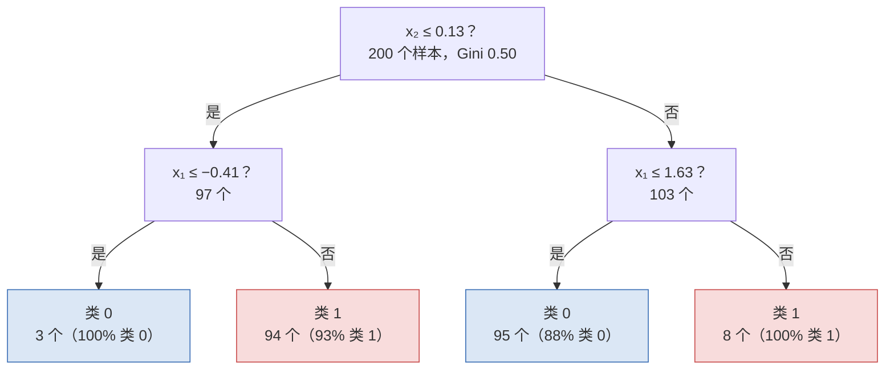

前两篇的模型都画一条直线（超平面）把两类分开。这一篇看三个思路完全不同的分类器：**朴素贝叶斯**用概率算"这个样本更像哪一类"，**KNN** 什么都不学、预测时找最像的几个训练样本投票，**决策树**像医生问诊一样一个问题一个问题地问下去。三个都能用几十行 NumPy 写出来，本文各写一个并与 scikit-learn 对数；它们各自的假设与失效方式，也就是后面 SVM（第五篇）与树的集成（第六篇）要解决的问题。

全篇的核心问题是：

> **"朴素"贝叶斯朴素在哪，假设不成立时会怎样？[^q0] 一个不训练的分类器为什么在 LLM 工作里到处都是？[^q1] 决策树为什么一定过拟合？[^q2]**

## 一、总览

### 1. 七个分类器的地图

本文与后两篇（SVM、集成）共用一张地图。同一份 5000 样本、20 特征的表格数据（8 个特征真有用、4 个是它们的线性组合、其余噪声，5% 标签随机翻转）上，七个分类器的成绩：

| 模型 | 训练准确率 | 测试准确率 | 训练耗时 | 一句话 | 讲在 |
|---|---:|---:|---:|---|---|
| 逻辑回归 | 0.832 | 0.853 | 0.00 s | 线性边界：有非线性就吃亏 | 第三篇 |
| 朴素贝叶斯 | 0.824 | 0.837 | 0.00 s | 假设特征独立：冗余特征让它更差 | 本篇 |
| KNN (k=15) | 0.910 | 0.889 | 0.00 s | 不训练；预测时找 15 个邻居投票 | 本篇 |
| 决策树 | 1.000 | 0.826 | 0.04 s | 训练 100%、测试掉一截：过拟合的教科书样子 | 本篇 |
| SVM (RBF) | 0.937 | 0.918 | 0.05 s | 核把线性边界变弯 | 第五篇 |
| 随机森林 | 1.000 | 0.919 | 0.30 s | 很多棵树的 bagging：降方差 | 第六篇 |
| 梯度提升 | 0.975 | 0.913 | 2.92 s | 逐棵树拟合残差：表格数据的默认最强 | 第六篇 |

Table: 七个分类器在同一份表格数据上的成绩

在一份二维数据上（两个交错的月牙），七个分类器画出的决策边界长这样：


这张图是全篇的参照：**线性模型只能画直线**（0.88），三个"非线性"的分类器各用自己的方式把边界弯过去（0.93–0.94）——KNN 靠邻居、决策树靠横竖切、SVM 靠核。这张表的教训不是"谁最好"，而是**没有一个模型在所有数据上最好**（no free lunch）：选择要看数据的形状、规模与预测端的成本。

### 2. 本文的章节安排

本文按三个分类器各自的"世界观"组织——算概率、找邻居、问问题——每个都从一个能手算的例子开始，到手写实现，到它在 LLM 工作里出现的形态：

| 章 | 主题 | 内容 |
|---|---|---|
| 二 | 朴素贝叶斯 | 1000 封邮件数出贝叶斯公式<br/>"朴素"假设<br/>高斯版：每类每特征一条正态曲线<br/>15 行实现<br/>冗余特征为什么让它变差<br/>多项式版手算：计数、拉普拉斯平滑、log-space 与下溢<br/>两个反例：相关特征过度自信、XOR |
| 三 | KNN | 5 个点手算一次投票<br/>4 行实现<br/>$$k$$ 的作用（1 / 15 / 150 的边界）<br/>标准化与距离<br/>维度灾难<br/>它在 LLM 里就是检索<br/>六个点手算：缩放、三种距离、投票规则与平票<br/>反例：无关特征淹没距离 |
| 四 | 决策树 | 第一刀怎么选（Gini 扫描图 + 两堆样本的验算）<br/>25 行实现<br/>一棵深度 2 的树<br/>深度 vs 过拟合<br/>候选切点：教学树的 19 个分位点 vs 库算法的全部相邻中点<br/>十个点的完整生长记录、停止条件、预剪枝与代价复杂度剪枝<br/>反例：斜着的边界 |
| 五 | 三个分类器怎么选 | 假设、训练成本、预测成本、可解释性一张表 |
| 六 | 案例：三个分类器各一个经典问题 | 朴素贝叶斯做垃圾短信（与第三篇同一份数据，98.6%，23 ms 训完）<br/>KNN 做 MNIST 手写数字（60,000 张，错误率 2.95%）<br/>决策树做泰坦尼克（深度 3 的树整棵画出来，83%；一个泄漏的陷阱） |
| 七 | 本文小结 |  |
| 八 | 自测 | 六道题 |

Table: 本文的章节安排

### 3. 来龙去脉：三种世界观各从哪来

三个分类器不是一个家族的三代，而是三种互不相干的想法，各有自己的出身和第一次真正派上用场的场合：

| 分类器 | 年 | 谁 | 当时的问题 | 留下的东西 |
|---|---|---|---|---|
| 朴素贝叶斯 | 1763 | Bayes（遗稿由 Price 发表）、Laplace 1812 | 看到了结果，怎么反推原因的概率 | 贝叶斯公式 $$P(c \mid x) \propto P(x \mid c) P(c)$$（第二章） |
| | 1961 | Maron，《Automatic Indexing》 | 几千篇文献怎么自动归类到主题 | 第一次把"每个词独立"的朴素假设用在文本上——之后六十年它一直是文本分类的基线 |
| | 1998 / 2002 | Sahami 等（微软）；Paul Graham《A Plan for Spam》 | 垃圾邮件泛滥，规则过滤器追不上 | 用 NB 数每个词在垃圾 / 正常邮件里的频率，Graham 的文章让它进入 Thunderbird、SpamAssassin——第六章的案例 |
| KNN | 1951 | Fix & Hodges（美国空军报告） | 不知道数据的分布长什么样，能不能不假设、直接看邻居 | 最近邻分类：**不建模型**，把数据本身当模型 |
| | 1967 | Cover & Hart | 这么简单的方法到底有没有理论保证 | 证明 1-NN 的错误率不超过最优分类器的两倍——"看一个邻居"最多损失一半的信息 |
| | 2017– | Faiss、HNSW、向量数据库 | 十亿个 embedding 里找最近的几个 | 近似最近邻把 $$O(n)$$ 降到 $$O(\log n)$$：今天的 RAG 检索就是 KNN（第三章） |
| 决策树 | 1963 | Morgan & Sonquist，AID | 社会调查数据里哪些变量决定收入，要一个能讲给人听的模型 | 递归地把数据切成两堆，每堆更纯 |
| | 1984 | Breiman、Friedman、Olshen、Stone，CART | 怎么选切分（Gini）、怎么做回归树、树太深怎么剪 | CART——scikit-learn 的 `DecisionTree` 就是它（第四章） |
| | 1986 / 1993 | Quinlan，ID3 / C4.5 | 用信息增益选切分、处理缺失与连续值 | 机器学习领域最常被引用的算法之一；单棵树的过拟合问题留给第六篇的集成 |

Table: 三个分类器的来历

三个"当时的问题"今天都还在：**要一个能一秒训完、一眼看懂权重的文本分类器**——朴素贝叶斯；**不想建模型、只想找相似的**——KNN，今天叫检索；**要一个能画出来讲给业务方听的模型**——决策树。它们各自被更强的东西替代过（NB 被逻辑回归和 SVM、KNN 被学出来的 embedding + 近似检索、单棵树被随机森林和梯度提升），但替代者都保留了它们的骨架。

## 二、朴素贝叶斯：算概率

### 1. 贝叶斯公式：一个手算的例子

30% 的邮件是垃圾邮件。"免费"这个词在垃圾邮件里出现的概率是 60%，在正常邮件里是 5%。收到一封含"免费"的邮件，它是垃圾邮件的概率是多少？

先用数数的办法算。假设有 1000 封邮件：

| | 含"免费" | 不含"免费" | 合计 |
|---|---:|---:|---:|
| 垃圾邮件 | 180（= 300 × 60%） | 120 | 300 |
| 正常邮件 | 35（= 700 × 5%） | 665 | 700 |
| 合计 | **215** | 785 | 1000 |

Table: 1000 封邮件的贝叶斯计数

含"免费"的邮件共 215 封，其中 180 封是垃圾邮件，所以答案是 $$180 / 215 = 0.837$$。这就是全部推理——**条件概率**"已知 A，B 的概率"就是"A 和 B 都发生的次数 ÷ A 发生的次数"。**贝叶斯公式**只是把这个数数过程写成一般形式，把"已知类别、特征出现的概率"倒过来变成"已知特征、属于类别的概率"：

$$
P(\text{垃圾} \mid \text{免费}) = \frac{P(\text{免费} \mid \text{垃圾})\, P(\text{垃圾})}{P(\text{免费})}
$$

- $$P(\text{垃圾}) = 0.3$$：**先验**——没看邮件内容之前的判断；
- $$P(\text{免费} \mid \text{垃圾}) = 0.6$$：**似然**——垃圾邮件里出现这个词的概率；
- $$P(\text{免费}) = 0.6 \times 0.3 + 0.05 \times 0.7 = 0.215$$：这个词总的出现概率（两类各贡献一部分）；
- 后验 $$= 0.6 \times 0.3 / 0.215 = 0.837$$——分子 0.18 是表里的 180 封、分母 0.215 是 215 封，与数数完全一样。

看到"免费"，垃圾邮件的概率从 30%（**先验**）升到 84%（**后验**，看过证据之后的判断）。分类器做的事就是：对每个类算一个后验，选最大的。

### 2. "朴素"在哪

再看到第二个词"会议"（垃圾邮件里 40%、正常邮件里 20%）。两个词同时出现的联合概率 $$P(\text{免费}, \text{会议} \mid \text{垃圾})$$ 本来需要统计"两个词同时出现"的频率——词一多（几万个词的任意组合）根本统计不过来。**朴素**（naive）假设：在给定类别的条件下，各特征彼此独立，联合概率就是各自概率的乘积：

$$
P(x_1, x_2, \ldots, x_d \mid c) = \prod_{j=1}^{d} P(x_j \mid c)
$$

于是只要每个词单独的概率：垃圾 $$0.3 \times 0.6 \times 0.4 = 0.072$$，正常 $$0.7 \times 0.05 \times 0.2 = 0.007$$，归一化后 $$P(\text{垃圾} \mid \text{两个词}) = 0.072 / 0.079 = 0.911$$。预测就是比较各类的 $$P(c) \prod_j P(x_j \mid c)$$ 谁大（分母 $$P(x)$$ 对所有类相同，不用算）。实际实现取对数把乘变加，避免几百个小于 1 的数相乘下溢：

$$
\hat c = \arg\max_c \Big[\log P(c) + \sum_{j} \log P(x_j \mid c)\Big]
$$

这个假设几乎从不真正成立（"免费"与"点击"在垃圾邮件里显然一起出现），但常常够用——分类只要求排出正确的顺序，不要求概率算得准。

### 3. 高斯朴素贝叶斯：每类每特征一条正态曲线

特征是连续数值（乳腺癌数据的"平均半径"）时，$$P(x_j \mid c)$$ 用什么？**高斯**朴素贝叶斯假设每类每特征服从一个正态分布，从数据里估它的均值 $$\mu_{cj}$$ 与方差 $$\sigma_{cj}^2$$：


"正态分布"就是上一篇第八章那条钟形曲线，它由两个数决定：均值 $$\mu$$（曲线中心）与标准差 $$\sigma$$（曲线多宽），密度公式 $$\frac{1}{\sqrt{2\pi}\sigma} \exp\big(-\frac{(x - \mu)^2}{2\sigma^2}\big)$$。从数据估 $$\mu, \sigma$$ 就是算良性肿瘤的平均半径的均值和标准差——"训练"只是算两个统计量。一个新样本的平均半径是 15，代进两条曲线：良性那条（$$\mu = 12.15, \sigma = 1.78$$）在 15 处的密度是 0.062，恶性那条（$$\mu = 17.46, \sigma = 3.20$$）是 0.093——15 离恶性的中心更近（按各自的宽度衡量），这个特征就以 0.093 : 0.062 投恶性一票；30 个特征各投一票（取对数相加），加上先验，谁大归谁。

### 4. 十五行实现

```python title="GaussianNaiveBayes：十五行实现"
class GaussianNaiveBayes:
    def fit(self, X, y):
        self.classes = np.unique(y)
        self.prior = np.array([(y == c).mean() for c in self.classes])            # ① P(c)：各类的比例
        self.mu = np.array([X[y == c].mean(0) for c in self.classes])             # ② [类, 特征]：每类每特征的均值
        self.var = np.array([X[y == c].var(0) + 1e-9 for c in self.classes])      # ③ 方差（加一点防止除零）
        return self

    def predict(self, X):
        ll = -0.5 * (np.log(2 * np.pi * self.var[:, None, :])
                     + (X[None] - self.mu[:, None, :]) ** 2 / self.var[:, None, :]).sum(-1)   # ④ Σ_j log N(x_j; μ, σ²)：[类, n]
        return self.classes[(np.log(self.prior)[:, None] + ll).argmax(0)]                    # ⑤ 加上 log P(c)，取最大的类
```

1. ①–③ `fit` 只是算三张表：各类比例、每类每特征的均值、方差——20 个特征两类就是两张 $$[2, 20]$$ 的表，0.0004 秒；
2. ④ 正态分布密度取对数是 $$-\frac{1}{2}\big[\log(2\pi\sigma^2) + \frac{(x - \mu)^2}{\sigma^2}\big]$$，对全部特征求和（独立假设 → 对数相加）；
3. ⑤ 加上先验的对数，每个样本取最大的类。

```text title="手写与 sklearn GaussianNB 的结果"
手写：fit 0.0004s，测试准确率 0.837；sklearn GaussianNB 0.837
```

与 `GaussianNB` 完全一致——同一个算法、没有随机性，数字必须一样。

### 5. 假设不成立时：冗余特征

它在总表里比逻辑回归还差（0.837 vs 0.853）。原因是那 4 个**冗余特征**——它们是别的特征的线性组合，与它们高度相关，独立假设不成立，同一份证据在求和里被加了两遍，概率过度自信。验证：生成同样 8 个有用特征、但**没有**冗余特征的数据再比一次：

| 数据 | 朴素贝叶斯 | 逻辑回归 |
|---|---:|---:|
| 8 有用 + 4 冗余 + 8 噪声（总表） | 0.837 | 0.853 |
| 8 有用 + 8 噪声，无冗余 | **0.852** | 0.839 |

Table: 冗余特征对朴素贝叶斯与逻辑回归的影响

去掉冗余特征，朴素贝叶斯反超逻辑回归。它的强项是**训练极快、数据很少也能用、天然多类**——文本分类里用词频当特征（多项式朴素贝叶斯），几万个词几秒钟训完，垃圾邮件过滤是它的经典应用；弱项是特征相关时概率不准（第十篇讲校准时会再遇到它）。

### 6. 多项式朴素贝叶斯手算：计数、平滑、log-space

上面的高斯版处理连续特征；文本分类用的是**多项式朴素贝叶斯**：特征是每个词出现的次数，$$P(x \mid c) \propto \prod_j P(w_j \mid c)^{x_j}$$——一条短信的似然是它里面每个词的"类内词频"连乘，出现几次乘几次。$$P(w_j \mid c)$$ 怎么估？数：类 $$c$$ 的所有短信里词 $$j$$ 出现的总次数，除以类 $$c$$ 的总词数。五个词、六条短信，手算一遍：

```text title="五个词、六条短信：从词计数到后验"
  词表 ['免费', '点击', '会议', '明天', '中奖']；6 条短信，前 3 条 spam（y=1）、后 3 条 ham（y=0）：
    spam  免费 中奖 点击     → 计数 [1, 1, 0, 0, 1]
    spam  免费 免费 点击     → 计数 [2, 1, 0, 0, 0]
    spam  中奖 点击        → 计数 [0, 1, 0, 0, 1]
    ham   会议 明天        → 计数 [0, 0, 1, 1, 0]
    ham   明天 会议 会议     → 计数 [0, 0, 2, 1, 0]
    ham   免费 会议        → 计数 [1, 0, 1, 0, 0]
  spam 的词计数 [3, 3, 0, 0, 2]，共 8 个词
  ham  的词计数 [1, 0, 4, 2, 0]，共 7 个词
  待判短信「点击 会议 会议」→ 计数 [0, 1, 2, 0, 0]
  不平滑（α=0）：P(w | ham) = [0.1429, 0.0, 0.5714, 0.2857, 0.0]，P(w | spam) = [0.375, 0.375, 0.0, 0.0, 0.25]
    log P(ham) + Σ count·log P(w|ham) = -inf，spam 侧 = -inf → 两边都是 −inf，argmax 无意义，P(ham | d) = nan
  拉普拉斯平滑（α=1）：P(w | ham) = [0.1667, 0.0833, 0.4167, 0.25, 0.0833]，P(w | spam) = [0.3077, 0.3077, 0.0769, 0.0769, 0.2308]
    log P(ham) + Σ count·log P(w|ham) = -4.9290，spam 侧 = -7.0017 → 判 ham，P(ham | d) = 0.8882
  α=0 时「点击」在 ham 里没出现过、「会议」在 spam 里没出现过，各有一项 log 0 = −inf，两类同时被一票否决；α=1 给每个词的计数加 1：P(点击|ham) = (0+1)/(7+5) = 1/12，P(会议|spam) = (0+1)/(8+5) = 1/13
  与 sklearn MultinomialNB(alpha=1) 对照：feature_log_prob_ 最大差 2.2e-16，predict_log_proba 最大差 4.4e-16（对齐条件：同一个 α、fit_prior=True 用类频率做先验）
```

spam 的三条共 8 个词，其中「免费」3 次、「点击」3 次、「中奖」2 次，所以 $$P(免费 \mid spam) = 3/8 = 0.375$$；ham 共 7 个词，「会议」4 次，$$P(会议 \mid ham) = 4/7 = 0.571$$。待判的「点击 会议 会议」在**不平滑**时出了问题：「点击」从未在 ham 里出现，$$P(点击 \mid ham) = 0$$；「会议」从未在 spam 里出现，$$P(会议 \mid spam) = 0$$。两边的连乘都是 0，取 log 都是 $$-\infty$$——为什么是两类**同时**被否决，而不是只有一边？[^q3] **拉普拉斯（加一）平滑**给每个 (词, 类) 的计数加 $$\alpha = 1$$，分母加 $$\alpha \times$$ 词表大小：

$$
P(w_j \mid c) = \frac{n_{jc} + \alpha}{n_c + \alpha V}
$$

$$P(点击 \mid ham) = (0 + 1)/(7 + 5) = 1/12 = 0.0833$$，$$P(会议 \mid spam) = (0 + 1)/(8 + 5) = 1/13 = 0.0769$$——没见过的词不再是"不可能"，只是"很少见"。平滑后手算 ham 一侧：$$\log 0.5 + \log(1/12) + 2\log(5/12) = -0.693 - 2.485 - 1.751 = -4.929$$；spam 一侧 $$\log 0.5 + \log(4/13) + 2\log(1/13) = -0.693 - 1.179 - 5.130 = -7.002$$。两个数相减再过 sigmoid 就是后验：$$P(ham \mid d) = \sigma(-4.929 + 7.002) = \sigma(2.073) = 0.888$$。与 `MultinomialNB(alpha=1)` 的 `feature_log_prob_` 和 `predict_log_proba` 差在 $$10^{-16}$$——对齐条件是同一个 $$\alpha$$、先验用类频率（`fit_prior=True`，scikit-learn 1.7 的默认）。

为什么一定要在 **log 域**累加而不是直接连乘？每个 $$P(w \mid c)$$ 都小于 1，几百个词连乘下去，float64 撑不住：

```text title="直接连乘 vs log 域累加"
  一条 600 词的短信（每个词 120 次）：直接乘概率 → P(ham)·ΠP(w|ham) = 0.0, spam 侧 = 0.0——两边都下溢成 0，argmax 无从比较；log 域累加 → [-1083.5, -1075.1]，照常比大小
```

直接乘，两类都下溢成 0，`argmax` 无从比较；log 域里两个 $$-1000$$ 左右的数照常比大小。第四章的 15 行实现一开始就写成 `log(先验) + Σ log(似然)`，就是这个原因；真要概率时，用第三篇的 log-sum-exp：先减去最大的那个 log 分数再取 `exp`。

```python title="多项式朴素贝叶斯：计数、平滑、log 域求和"
class MultinomialNaiveBayes:
    def __init__(self, alpha=1.0):
        self.alpha = alpha

    def fit(self, X, y):
        self.classes = np.unique(y)
        self.log_prior = np.log([(y == c).mean() for c in self.classes])   # !ref mnb-prior
        counts = np.array([X[y == c].sum(0) for c in self.classes])       # !ref mnb-count
        smoothed = counts + self.alpha                                      # !ref mnb-smooth
        self.log_prob = np.log(smoothed / smoothed.sum(1, keepdims=True))  # !ref mnb-logprob
        return self

    def joint_log(self, X):
        return self.log_prior + X @ self.log_prob.T                        # !ref mnb-joint

    def predict(self, X):
        return self.classes[self.joint_log(X).argmax(1)]
```

[类先验取 log](#mnb-prior) → [每类每词的总计数](#mnb-count) → [每格加 α](#mnb-smooth) → [按行归一化后取 log](#mnb-logprob) → [预测就是一次矩阵乘法](#mnb-joint)：`X @ log_prob.T` 把"出现几次就加几次 log 概率"写成了点积。注意最后一步的形式——$$\log P(c) + \sum_j x_j \log P(w_j \mid c)$$ 是一个关于词计数 $$x$$ 的**线性函数**，这就是第一章地图里朴素贝叶斯被归入"线性模型"的原因，也是第六章它与逻辑回归在同一份数据上打平的原因。

### 7. 两个反例：相关的特征、XOR

朴素贝叶斯的核心假设是"给定类别，特征彼此独立"。两个让它失效的小例子：

```text title="反例：复制一列特征、XOR"
  反例 1——条件独立假设失效：把「会议」复制成第 6 个特征（与原列完全相关），P(ham | d) 从 0.8882 变成 0.9834；同一条证据被算了两次，后验被推得更极端——相关特征多的文本上，朴素贝叶斯给出的概率往往比实际更「自信」
  反例 2——XOR：y = x₁ XOR x₂，P(x₁=1 | y) = 0.48/0.57（两类几乎一样），朴素贝叶斯测试准确率 0.260，深度 2 的决策树 1.000；每个特征单独看都没信息，NB 的「各算各的再相加」注定失败
```

**反例一**：把「会议」这一列原样复制成第六个特征。信息没有增加一个比特，但独立假设让模型把它算了两遍，$$P(ham \mid d)$$ 从 0.888 推到 0.983。真实文本里"会议 / 议程 / 纪要"这类词成群出现，正是温和版的"复制一列"——所以朴素贝叶斯**判对的比例可以不差，给出的概率却常常过于自信**（第五节冗余特征让它准确率下降是同一个机制的另一面，第十篇讲校准时会再遇到）。**反例二**：$$y = x_1 \oplus x_2$$。每个特征单独看与标签无关——$$P(x_1 = 1 \mid y = 0) = 0.48$$，$$P(x_1 = 1 \mid y = 1) = 0.57$$，两类几乎一样——而朴素贝叶斯只会"各算各的再相加"，测试准确率 0.26；一棵深度 2 的决策树先问 $$x_1$$ 再问 $$x_2$$，1.000。凡是"信息藏在特征的组合里"的问题，朴素贝叶斯都看不见。

## 三、KNN：找邻居

### 1. 四行实现

**K 近邻**（K-nearest neighbours）不训练：`fit` 只是把训练数据存下来。预测一个新样本时，找训练集里离它最近的 $$k$$ 个样本，看它们大多是哪一类——"像谁就是谁"。先手算一个：5 个训练点，问新点 $$(0, 0)$$ 属于哪类，$$k = 3$$：

| 训练点 | 类 | 到 $$(0, 0)$$ 的距离 $$\sqrt{x_1^2 + x_2^2}$$ | 最近 3 个？ |
|---|---|---:|---|
| (1, 0) | A | 1.00 | 是 |
| (0, 1.5) | B | 1.50 | 是 |
| (−1, −1) | A | 1.41 | 是 |
| (3, 0) | B | 3.00 | |
| (0, −4) | B | 4.00 | |

Table: KNN 手算：5 个训练点到 (0, 0) 的距离

最近的 3 个里两个 A、一个 B，判 A。$$k = 5$$ 时全部参与投票，3 个 B、2 个 A，判 B——同一个点，$$k$$ 不同结论不同，第 2 节会看这意味着什么。代码就是把这张表对所有测试样本一次算完：

```python title="knn_predict：四行实现"
def knn_predict(Xtrain, ytrain, Xtest, k=15):
    d2 = ((Xtest[:, None, :] - Xtrain[None, :, :]) ** 2).sum(-1)   # ① [n_test, n_train]：每对样本的欧氏距离平方
    idx = np.argpartition(d2, k, axis=1)[:, :k]                    # ② 每个测试样本最近的 k 个训练样本的下标
    votes = ytrain[idx]                                             # ③ [n_test, k]：这 k 个邻居的标签
    return (votes.mean(1) > 0.5).astype(int)                        # ④ 多数票（两类时就是均值过半）
```

1. ① 用广播一次算出所有测试样本到所有训练样本的距离——1500 × 3500 个数；
2. ② `argpartition` 找每行最小的 $$k$$ 个（比完整排序快）；
3. ③④ 取这些邻居的标签，多数投票。

```text title="手写 KNN 与 sklearn 的结果"
手写 KNN(15)：1500×3500 个距离，0.19s，测试准确率 0.889；sklearn 0.889
```

全部成本在 ①：与训练集大小成正比。训练集到百万级就要换第 4 节的近似最近邻。

### 2. $$k$$ 的作用

$$k$$ 是它唯一的超参数：


| $$k$$ | 1 | 3 | 9 | 15 | 25 | 101 | 501 |
|---|---:|---:|---:|---:|---:|---:|---:|
| 训练准确率 | 1.000 | 0.937 | 0.913 | 0.910 | 0.903 | 0.877 | 0.842 |
| 测试准确率 | 0.833 | 0.864 | 0.891 | 0.889 | 0.891 | 0.876 | 0.850 |

Table: 不同 k 下 KNN 的训练与测试准确率

- $$k = 1$$：训练准确率 100%——每个训练点最近的邻居是它自己。边界锯齿状，一个标错的点就在它周围圈出一块错误区域——**方差大**（第一篇）；
- $$k$$ 太大：边界过平，150 个邻居里一半来自另一个月牙，连月牙的形状都丢了——**偏差大**；
- 中间（9–25）最好。这又是第一篇的偏差-方差权衡，$$k$$ 就是它的旋钮。

### 3. 距离与标准化

"最近"要先定义距离。默认是欧氏距离 $$\sqrt{\sum_j (x_j - x'_j)^2}$$，所以必须先**标准化**（第二篇第五章）：一个特征取值 0–1000、另一个 0–1，距离几乎完全由前者决定，后者形同不存在。对 embedding 向量通常用[**余弦相似度**](# "tip: 两个向量夹角的余弦：点积除以两者长度的乘积，范围 −1 到 1。方向相同为 1、垂直为 0。只比较方向，不受向量长短影响")——只看方向不看长度。

### 4. 维度灾难

KNN 还有一个更根本的问题。在高维空间里随机撒 500 个点，看一个点到最近邻与最远点的距离之比：


| 维度 | 到最近点 | 到最远点 | 比值 |
|---:|---:|---:|---:|
| 2 | 0.035 | 1.25 | 0.03 |
| 10 | 0.534 | 1.76 | 0.30 |
| 100 | 3.36 | 4.85 | 0.69 |
| 1000 | 12.2 | 13.5 | **0.91** |

Table: 维度灾难：不同维度下最近与最远距离的比值

1000 维时，最近的邻居与最远的点只差 10%——**"邻居"失去了意义**，所有点离你都差不多远。这叫**维度灾难**。为什么会这样：两点的距离平方是 $$d$$ 个坐标差的平方**之和**；每个坐标差都是随机的，加 1000 个随机数，总和的相对波动很小（第一篇"独立量的平均，方差除以 $$n$$"），所以任意两点的距离都挤在同一个值附近，再也分不出"近"与"远"。它意味着 KNN 不能直接用在原始的高维特征上（一张图的百万像素、一段文本的几万维词频），要先学出一个好的低维表示——**embedding**（几百到几千维，且相关的东西真的靠近）。第八篇讲降维时会再回到它。

### 5. 它在 LLM 里就是检索

KNN 的本质是"找最相似的几个"，这件事在 LLM 工作里到处都是——只是名字换成了**检索**：

1. **embedding 检索 / RAG**：查询的 embedding 找最近的 $$k$$ 段文本放进 prompt（应用地图 L3）；
2. **few-shot 示例选择**：挑与当前问题最相似的几个示例；
3. **去重的候选召回**（第九篇）：先用相似度找出可能重复的对；
4. **训练数据的影响分析**：哪些训练样本离这个测试样本最近——污染检测的一种做法。

暴力 KNN（本章手写的那个）要与全部 $$n$$ 个样本算距离，$$O(n)$$；**近似最近邻**（FAISS、HNSW、ScaNN 一类索引）把它降到近似 $$O(\log n)$$，代价是偶尔漏掉真正最近的。向量数据库做的就是这件事。

### 6. 六个点手算：缩放、三种距离、投票规则

第 3 节说"必须标准化"，用六个点看它有多必须。特征是年龄与年收入，三个年轻低收入的类 0、三个年长高收入的类 1，查询点是一位 51 岁、年收入 4 万的人：

```text title="六个训练点上 k = 3 的最近邻：原始尺度 vs 按训练集标准化"
  训练点（年龄, 年收入/元）与类别：
    (20, 30,000) → 类 0
    (22, 32,000) → 类 0
    (24, 31,000) → 类 0
    (50, 80,000) → 类 1
    (52, 85,000) → 类 1
    (54, 82,000) → 类 1
  查询点 q = (51, 40,000)，k = 3
  原始尺度、欧氏距离：最近 3 个是 ['(22, 32,000) d=8,000', '(24, 31,000) d=9,000', '(20, 30,000) d=10,000'] → 票数 [3, 0] → 判 0（收入的差是几千到几万，年龄的差是几十，距离里年龄等于不存在）
  按训练集标准化：均值 [37.0, 56666.666666666664]，标准差 [15.1, 25714.2]；q → [0.928, -0.648]
  标准化后、euclidean：最近 3 个 ['#3 d=1.557', '#5 d=1.645', '#4 d=1.751'] → 票数 [0, 3] → 判 1
  标准化后、manhattan：最近 3 个 ['#3 d=1.622', '#4 d=1.816', '#5 d=1.832'] → 票数 [0, 3] → 判 1
  标准化后、cosine   ：最近 3 个 ['#5 d=0.760', '#3 d=0.851', '#4 d=0.876'] → 票数 [0, 3] → 判 1
  sklearn KNeighborsClassifier(3) 在标准化数据上判 1，邻居 [3, 5, 4]（与手写一致）
```

原始尺度下，收入的差动辄几千上万，年龄的差只有几十，欧氏距离 $$\sqrt{\Delta年龄^2 + \Delta收入^2}$$ 里年龄形同不存在——查询点被收入相近的三个年轻人包围，判成类 0。标准化后每个特征都是"离均值几个标准差"，查询点的年龄 $$+0.93$$ 个标准差、收入 $$-0.65$$ 个标准差，三个最近邻全是类 1。标准化的均值和标准差**只用训练集算**，再套到查询点上——为什么不能把测试集也算进去？[^q4]


三种距离在同一组标准化数据上给出了三种邻居排序：**欧氏** $$\sqrt{\sum_j (x_j - x'_j)^2}$$ 与**曼哈顿** $$\sum_j |x_j - x'_j|$$ 都是"坐标差的大小"，前者对大的坐标差更敏感（平方）；**余弦距离** $$1 - \frac{x \cdot x'}{\|x\|\|x'\|}$$ 只看方向不看长度——它把 #5 排到了第一，因为 #5 的方向与查询点最接近，而欧氏下 #5 排第二。三种结果这里都判 1，但排序不同说明"最近"从来不是一个客观事实，是度量的选择。余弦适合 embedding（第 5 节）这种"长度不表意、方向才表意"的向量；表格数据通常先标准化再用欧氏。

投票规则看起来没什么可说，直到 $$k$$ 取了偶数：

```text title="k = 4 平票：多数票按标签顺序裁决，距离加权则看谁更近"
  投票规则：一维训练点 x = [1.0, 2.0, 8.0, 9.0]，类 [1, 1, 0, 0]，查询 5.2，k = 4，距离 [4.2, 3.2, 2.8, 3.8]
    多数票：票数 [2, 2] 平票，手写 argmax 取第一个最大 → 判 0；sklearn（scipy mode，平票取较小标签）→ 判 0
    距离加权（权重 1/d）：票数 [0.62, 0.551] → 判 0；sklearn weights='distance' → 判 0。k 取奇数或用距离加权，才不会把结论交给「谁的标签编号小」
```

四个邻居两票对两票，多数票没有答案。手写的 `argmax` 取第一个最大值，scikit-learn 用 `scipy.stats.mode`，平票时返回**较小的标签**——两者都"判 0"，但这是实现细节在替数据做决定。**距离加权**（`weights='distance'`，权重 $$1/d$$）让更近的邻居话语权更大：类 0 的两个邻居距 2.8 和 3.8，权重和 0.620；类 1 的两个距 3.2 和 4.2，权重和 0.551，判 0——这次有理由了。实践里要么取奇数 $$k$$（二分类），要么用距离加权，别把结论交给"谁的标签编号小"。

```python title="KNN 的一次投票：距离、取前 k、按权重计票"
def knn_vote(Xtrain, ytrain, q, k, metric="euclidean", weighted=False):
    if metric == "euclidean":
        d = np.sqrt(((Xtrain - q) ** 2).sum(1))                           # !ref vote-euclid
    elif metric == "manhattan":
        d = np.abs(Xtrain - q).sum(1)                                     # !ref vote-manhattan
    else:
        d = 1 - (Xtrain @ q) / (np.linalg.norm(Xtrain, axis=1) * np.linalg.norm(q))  # !ref vote-cosine
    idx = np.argsort(d, kind="stable")[:k]                                # !ref vote-topk
    w = 1 / d[idx] if weighted else np.ones(k)                            # !ref vote-weight
    votes = np.array([w[ytrain[idx] == c].sum() for c in (0, 1)])         # !ref vote-count
    return idx, d[idx], votes, int(votes.argmax())
```

[欧氏](#vote-euclid) / [曼哈顿](#vote-manhattan) / [余弦](#vote-cosine)三选一算距离 → [稳定排序取前 k](#vote-topk)（`kind="stable"` 让距离相同的点按原顺序排，结果可复现）→ [权重：等权或 1/d](#vote-weight) → [按类累加权重](#vote-count)。与第 1 节的四行版相比只多了度量与权重两个开关。

### 7. 反例：无关特征淹没距离

KNN 的核心假设是"离得近的点标签相同"。第 4 节的维度灾难说的是距离在高维失去对比度；这里是它更常见的形态——特征里混着与标签无关的列：

```text title="月牙数据加入与标签无关的标准正态特征后 KNN(15) 的测试准确率"
  反例——「近的点同类」失效：月牙数据 2 维，标准化 + KNN(15) 测试准确率 0.945
    加  10 个与标签无关的 N(0,1) 特征：0.875（距离加权 0.875）
    加  50 个与标签无关的 N(0,1) 特征：0.760（距离加权 0.760）
    加 200 个与标签无关的 N(0,1) 特征：0.660（距离加权 0.660）
  无关特征已经是单位尺度，标准化救不了它；距离被噪声维度主导，「最近」的点与标签无关——KNN 没有任何机制学会忽略一个特征
```

两个有用特征上 0.945；每加一批 $$N(0, 1)$$ 的噪声列，距离里就多一批与标签无关的平方项，200 列时 0.660。这些噪声列**本来就是单位尺度**，标准化救不了；距离加权也救不了（0.660），因为"最近"本身已经被噪声决定。线性模型会给无关特征学出接近 0 的权重，决策树可以不选它们——KNN 没有任何机制学会**忽略**一个特征，特征选择必须在它之前做完。

## 四、决策树：问问题

### 1. 第一刀怎么选

决策树把分类变成一串是非题："$$x_2 \le 0.13$$？是 → 左边，否 → 右边"，每边再问下一个问题，直到叶子给出类别。关键是**每一步问哪个问题**——选哪个特征、切在哪个阈值。

标准是切完之后两边**尽量纯**。纯度用**基尼不纯度**（Gini impurity）度量：一堆样本里类 1 占比 $$p$$，

$$
G = 1 - p^2 - (1 - p)^2 = 2p(1 - p)
$$

全是一类时 $$G = 0$$（最纯），各占一半时 $$G = 0.5$$（最不纯）。一刀切成左右两堆，切的好坏是两堆 Gini 按样本数的加权平均——越低越好。对每个特征、每个候选阈值都算一遍，选最低的：


月牙数据的根节点：200 个训练样本，类 1 占 53%，Gini $$= 2 \times 0.53 \times 0.47 = 0.498$$（接近最不纯的 0.5）。扫遍两个特征的所有阈值，沿 $$x_2$$ 在 0.13 处切最好。把这一刀切完的两堆数出来验算：

| 堆 | 样本数 | 类 0 | 类 1 | 类 1 占比 $$p$$ | Gini $$2p(1 - p)$$ |
|---|---:|---:|---:|---:|---:|
| $$x_2 \le 0.13$$（下） | 97 | 10 | 87 | 0.897 | 0.185 |
| $$x_2 > 0.13$$（上） | 103 | 84 | 19 | 0.184 | 0.301 |

Table: 根节点第一刀切出的两堆及其 Gini

加权平均 $$= (97 \times 0.185 + 103 \times 0.301) / 200 = 0.245$$——从 0.498 降到 0.25，两堆都比切之前纯得多：下面一堆基本是类 1、上面一堆基本是类 0。这就是中图那条水平线。左图的每个点就是对一个候选阈值做一次这样的计算，曲线最低点就是选出的那一刀。

### 2. 二十五行实现

```python title="决策树：二十五行实现"
def gini(y):
    p = y.mean(); return 2 * p * (1 - p)                                          # 两类：全是一类 0，各占一半 0.5

def best_split(X, y):
    best = (gini(y), None, None)
    for j in range(X.shape[1]):                                                   # ① 每个特征
        for thr in np.percentile(X[:, j], np.arange(5, 100, 5)):                  # ② 19 个分位数当候选阈值
            left = X[:, j] <= thr
            if left.sum() == 0 or left.sum() == len(y): continue
            g = left.mean() * gini(y[left]) + (1 - left.mean()) * gini(y[~left])  # ③ 切完两边不纯度的加权平均
            if g < best[0]: best = (g, j, thr)
    return best[1], best[2]

def build_tree(X, y, depth, max_depth):
    if depth == max_depth or len(np.unique(y)) == 1: return int(y.mean() > 0.5)  # ④ 到深度或已纯：叶子 = 多数类
    j, thr = best_split(X, y)
    if j is None: return int(y.mean() > 0.5)
    left = X[:, j] <= thr
    return (j, thr, build_tree(X[left], y[left], depth + 1, max_depth), build_tree(X[~left], y[~left], depth + 1, max_depth))  # ⑤ 递归

def tree_predict(node, x):
    while isinstance(node, tuple):                                                # ⑥ 从根往下走到叶子
        j, thr, l, r = node
        node = l if x[j] <= thr else r
    return node
```

1. ①–③ `best_split` 遍历每个特征的 19 个分位数阈值，选加权 Gini 最低的一刀（scikit-learn 试每一个可能的切点，所以数字略有差别）；
2. ④ 停止条件：到了最大深度，或这堆样本已经全是一类——叶子返回多数类；
3. ⑤ 否则切一刀、两边各自递归——树就是一个嵌套的元组 `(特征, 阈值, 左子树, 右子树)`；
4. ⑥ 预测就是从根开始按答案往下走。

### 3. 一棵深度 2 的树

月牙数据上 scikit-learn 训出的深度 2 的树，画出来是：


```mermaid
%% 图：月牙数据上深度 2 的决策树：每个节点一个问题，叶子是类别与样本数
flowchart TD
    R["x₂ ≤ 0.13？<br/>200 个样本，Gini 0.50"]
    R -->|是| L["x₁ ≤ −0.41？<br/>97 个"]
    R -->|否| Rt["x₁ ≤ 1.63？<br/>103 个"]
    L -->|是| L1["类 0<br/>3 个（100% 类 0）"]
    L -->|否| L2["类 1<br/>94 个（93% 类 1）"]
    Rt -->|是| R1["类 0<br/>95 个（88% 类 0）"]
    Rt -->|否| R2["类 1<br/>8 个（100% 类 1）"]
    classDef c0 fill:#dbe7f5,stroke:#3b6fb6
    classDef c1 fill:#f8dcdc,stroke:#c94c4c
    class L1,R1 c0
    class L2,R2 c1
```

三个问题、四个叶子，训练 0.91 / 测试 0.92——就是上一张图右边那条横竖折线。每个叶子还告诉你它有多纯（94 个里 93% 是类 1），这就是决策树输出的"概率"。**树是可解释的**：从根到叶的路径就是一条人能读的规则——"$$x_2 \le 0.13$$ 且 $$x_1 > -0.41$$ → 类 1"。它也不需要标准化（问题是"大于阈值吗"，与量纲无关）、能直接处理类别特征。

### 4. 深度与过拟合

树能切多深？不限深度它会一直切到每个叶子只剩一个样本：


| `max_depth` | 手写：训练 / 测试 | scikit-learn：训练 / 测试 |
|---|---|---|
| 1 | 0.725 / 0.719 | 0.731 / 0.713 |
| 3 | 0.800 / 0.806 | 0.805 / 0.803 |
| 6 | 0.888 / 0.851 | 0.892 / 0.847 |
| 10 | 0.974 / 0.841 | 0.968 / 0.843 |
| 不限 | **1.000 / 0.838** | **1.000 / 0.826** |

Table: 不同 max_depth 下手写决策树与 scikit-learn 的准确率

深度不限时训练 100%——它把 5000 个样本连同那 5% 翻转的标签全背下来了，测试掉到 83%，比深度 6 还差。**决策树天生过拟合**：它的容量随深度指数增长（深度 $$d$$ 最多 $$2^d$$ 个叶子），而每个叶子的决定只依赖落进它的那几个样本——训练数据换几个点，树的结构就完全不同，方差极大。控制方法是限制深度、限制叶子最少样本数、剪枝；更好的办法是第六篇的集成——很多棵树平均，把方差压掉。

### 5. 候选切点：教学树的 19 个分位点 vs 库算法的全部相邻中点

第 2 节的 `best_split` 里有一行"19 个分位数当候选阈值"（5%、10%、…、95%）。这是**教学上的省略**，与库算法不是一回事。库算法（scikit-learn 的 `DecisionTreeClassifier`，CART）对每个特征把训练值排序，取**每一对相邻不同取值的中点**作为候选，全部扫一遍：$$n$$ 个不同取值就有 $$n - 1$$ 个候选。在月牙数据的 200 个训练点上两种扫法的第一刀：

```text title="同一批数据的第一刀：教学树 38 个候选 vs 精确扫描 398 个候选"
  200 个训练点、2 个特征
  教学树 best_split：每个特征 19 个分位点（5%, 10%, …, 95%），共 38 个候选 → x2 ≤ 0.1445，加权 Gini 0.2532
  精确扫描 best_split_exact：每个特征 199 个相邻中点，共 398 个候选 → x2 ≤ 0.1290，加权 Gini 0.2446
  sklearn 深度 1：x2 ≤ 0.1290，子节点加权 Gini 0.2446（与精确扫描逐位一致：阈值差 1.7e-09）
  精确最优阈值 0.1290 落在教学树的两个分位点 0.0837 与 0.1445 之间，19 个分位点里没有一个碰到它；两者的 Gini 差 0.0086
  对应到数据：精确阈值左侧 97 个点，分位点阈值左侧 100 个点——差了 3 个样本的归属
  说「两种切法 Gini 差不多」掩盖了三件事：候选集不同（38 vs 398）、复杂度不同（O(特征×19) vs O(特征×n log n)）、阈值语义不同（分位点插值 vs 相邻样本中点）
```

精确扫描选 $$x_2 \le 0.1290$$，与 scikit-learn 的根节点阈值差 $$1.7 \times 10^{-9}$$——这就是对齐条件：**同一个候选集 + 同一个不纯度**。教学树的 19 个分位点里没有一个落在 0.1290 上，它选了最接近的 0.1445，加权 Gini 差 0.0086，左子节点多了 3 个点。"Gini 差不多"不是可以把两者混为一谈的理由，它掩盖了三处不同：候选集（38 vs 398）、复杂度（每个特征 19 次 vs 排序后 $$n - 1$$ 次）、阈值语义（分位数插值出来的数 vs 两个真实样本的中点）。差 3 个样本在根节点无伤大雅，到了只剩十几个样本的深层节点，分位点扫描可能连一个能把两类分开的切点都碰不到。

```python title="库算法的候选切点：相邻不同取值的中点"
def best_split_exact(X, y, min_samples_leaf=1):
    best = (gini(y), None, None)
    for j in range(X.shape[1]):
        v = np.unique(X[:, j])                                           # !ref exact-unique
        cands = (v[:-1] + v[1:]) / 2                                     # !ref exact-mid
        for thr in cands:
            left = X[:, j] <= thr
            if min(left.sum(), (~left).sum()) < min_samples_leaf:        # !ref exact-minleaf
                continue
            g = left.mean() * gini(y[left]) + (1 - left.mean()) * gini(y[~left])  # !ref exact-gini
            if g < best[0]:
                best = (g, j, thr)
    return best
```

[去重排序](#exact-unique) → [相邻中点](#exact-mid) → [两边都够最小叶子数才算候选](#exact-minleaf) → [加权 Gini 取最小](#exact-gini)。`np.unique` 已排序，所以候选天然有序；真正的库实现还会利用"阈值右移一个样本只改变两个计数"做增量更新，把每个特征的扫描压到 $$O(n \log n)$$（排序）而不是 $$O(n^2)$$。

### 6. 递归生长、停止条件与剪枝

有了"选一刀"，整棵树就是**递归**：对根节点选一刀，把数据分成左右两堆，对每堆再选一刀……直到某个停止条件。十个点，把每一步都记下来：

```text title="十个点的完整生长记录"
  十个点 (x₁, x₂) → 类：(1,1)→0  (2,3)→0  (3,2)→0  (2,6)→0  (7,8)→0  (6,2)→1  (7,3)→1  (8,1)→1  (6,7)→1  (3,7)→1
  不限深度、min_samples_leaf=1 的生长记录：
    根（深度 0）：10 个点，类计数 [5, 5]，Gini 0.500 → 扫 10 个候选，选 x1 ≤ 2.50（加权 Gini 0.500 → 0.286），左 3 / 右 7
      根-左（深度 1）：3 个点，类计数 [3, 0]，Gini 0.000 → 纯节点，停
      根-右（深度 1）：7 个点，类计数 [2, 5]，Gini 0.408 → 扫 7 个候选，选 x2 ≤ 7.50（加权 Gini 0.408 → 0.238），左 6 / 右 1
        根-右-左（深度 2）：6 个点，类计数 [1, 5]，Gini 0.278 → 扫 6 个候选，选 x1 ≤ 4.50（加权 Gini 0.278 → 0.167），左 2 / 右 4
          根-右-左-左（深度 3）：2 个点，类计数 [1, 1]，Gini 0.500 → 扫 1 个候选，选 x2 ≤ 4.50（加权 Gini 0.500 → 0.000），左 1 / 右 1
            根-右-左-左-左（深度 4）：1 个点，类计数 [1, 0]，Gini 0.000 → 纯节点，停
            根-右-左-左-右（深度 4）：1 个点，类计数 [0, 1]，Gini 0.000 → 纯节点，停
          根-右-左-右（深度 3）：4 个点，类计数 [0, 4]，Gini 0.000 → 纯节点，停
        根-右-右（深度 2）：1 个点，类计数 [1, 0]，Gini 0.000 → 纯节点，停
  长成 5 片叶子，其中不纯的叶子 0 片
```

根节点 5 对 5，Gini 0.5；扫完 10 个候选选 $$x_1 \le 2.5$$，左边 3 个全是类 0（**纯节点，停**），右边 7 个 2 对 5 继续。"根-右"里先按 $$x_2 \le 7.5$$ 把 (7, 8) 这个孤立的类 0 点切出去，再按 $$x_1 \le 4.5$$，再按 $$x_2 \le 4.5$$，直到五片叶子全部纯净。每一刀的加权 Gini 都能验算：根-右-左是 6 个点 1 对 5，$$\text{Gini} = 1 - (1/6)^2 - (5/6)^2 = 10/36 = 0.278$$。与 scikit-learn 不限深度的树逐节点相同：

```text title="scikit-learn 同参数的树（export_text）与两种预剪枝"
  sklearn 同参数的树（export_text）：
    |--- x1 <= 2.50
    |   |--- class: 0
    |--- x1 >  2.50
    |   |--- x2 <= 7.50
    |   |   |--- x1 <= 4.50
    |   |   |   |--- x2 <= 4.50
    |   |   |   |   |--- class: 0
    |   |   |   |--- x2 >  4.50
    |   |   |   |   |--- class: 1
    |   |   |--- x1 >  4.50
    |   |   |   |--- class: 1
    |   |--- x2 >  7.50
    |   |   |--- class: 0
  预剪枝 max_depth=1, min_samples_leaf=1：手写 2 片叶子（[[3, 0], [2, 5]]），sklearn 2 片叶子，训练准确率 0.800
  预剪枝 max_depth=None, min_samples_leaf=3：手写 3 片叶子（[[3, 0], [1, 3], [1, 2]]），sklearn 3 片叶子，训练准确率 0.800
```

默认的停止条件只有"节点已纯"或"没有可用的切点"，于是树一定长到训练集全对——这就是第 4 节过拟合的来源。**预剪枝**在生长时就限制：`max_depth=1` 只切一刀，剩下 [2, 5] 那堆不再分（训练 0.8）；`min_samples_leaf=3` 要求每片叶子至少 3 个点，于是孤立的 (7, 8) 切不出来，长成 3 片叶子（训练同样 0.8，手写与 scikit-learn 一致——前提是 `best_split_exact` 在选候选时就排除了会产生小叶子的切点，而不是切完再检查）。

**后剪枝**反过来：先长满，再从叶子往上剪。CART 的**代价复杂度剪枝**给每个内部节点 $$t$$ 算一个"剪掉它的代价"：

$$
\alpha_{\text{eff}}(t) = \frac{R(t) - R(T_t)}{|T_t| - 1}
$$

$$R(t)$$ 是把 $$t$$ 剪成叶子后的不纯度（Gini × 该节点样本占比），$$R(T_t)$$ 是保留 $$t$$ 下面整棵子树时所有叶子的不纯度之和，$$|T_t|$$ 是子树的叶子数。分子是剪掉后不纯度升高多少，分母是省掉了几片叶子——$$\alpha_{\text{eff}}$$ 小，说明这个分支"用很多叶子只换来一点点纯度"，最该剪。每一轮剪掉 $$\alpha_{\text{eff}}$$ 最小的节点（weakest link），得到一串越来越小的树：

```text title="代价复杂度剪枝：三轮 weakest link 与 scikit-learn 的 ccp_alphas"
  代价复杂度剪枝（weakest link）：每步算 α_eff = (R(t) − R(T_t)) / (|叶子| − 1)，剪掉最小的：
    α_eff = 0.0833：把「根-右-左」剪成叶子，剩 3 片叶子
    α_eff = 0.1190：把「根-右」剪成叶子，剩 2 片叶子
    α_eff = 0.2143：把「根」剪成叶子，剩 1 片叶子
  四个 XOR 点：任何一刀都不能降低 Gini（0.5 → 0.5），手写 grow 停在根、1 片叶子；sklearn 默认 min_impurity_decrease=0.0，零增益也切，长到 4 片叶子、训练全对——「不纯就继续切」与「有增益才切」是两种停止规则
  sklearn cost_complexity_pruning_path 的 ccp_alphas：[0.0, 0.0833, 0.119, 0.2143]
  手写序列：[0.0, 0.0833, 0.119, 0.2143]（对齐条件：R(t) 用 Gini × 节点样本占比；两边都用加权不纯度，不是误分类数）
```

第一轮：根-右-左是 6 个点、Gini 0.278，$$R(t) = 0.278 \times 6/10 = 0.167$$；它下面 3 片叶子都纯，$$R(T_t) = 0$$；$$\alpha_{\text{eff}} = 0.167 / 2 = 0.0833$$——三个内部节点里最小，先剪它。三轮的序列 $$[0, 0.0833, 0.119, 0.2143]$$ 与 `cost_complexity_pruning_path` 的 `ccp_alphas` 逐位相同。对齐条件是 $$R$$ 用**加权 Gini**而不是误分类数——为什么用误分类数就对不上？[^q5] 同一段里还有一处容易被"差不多"掩盖的差别：四个 XOR 点上任何一刀都不降低 Gini，手写版"有增益才切"停在根节点，scikit-learn 默认 `min_impurity_decrease=0.0`，**零增益也切**，长到 4 片叶子训练全对。两种停止规则在有噪声的深层节点上可能长出不同的树——对比手写树与库的结果时，候选集与停止规则都要先对齐。

$$\alpha$$ 怎么选？`ccp_alpha=α` 意味着剪掉所有 $$\alpha_{\text{eff}} \le \alpha$$ 的节点，$$\alpha$$ 越大树越小。它是超参数，用**交叉验证只在训练集上**挑：

```text title="表格数据上用 5 折交叉验证挑 ccp_alpha"
  表格数据（3500 训练）：满树 337 片叶子，候选 α 共 27 个；用 5 折交叉验证挑 α：
    α = 0.00000： 337 片叶子，交叉验证 0.818，训练 1.000，测试 0.826
    α = 0.00133：  49 片叶子，交叉验证 0.851，训练 0.905，测试 0.859   ← CV 选中
    α = 0.03433：   2 片叶子，交叉验证 0.726，训练 0.731，测试 0.713
  剪枝后的树比 max_depth 限制更「不均匀」：该深的分支留着，没用的分支整枝剪掉；α 要用交叉验证挑，用测试集挑就是在测试集上训练
```


满树 337 片叶子、训练 1.000、测试 0.826；交叉验证选中的 $$\alpha = 0.00133$$ 剪到 49 片，测试 0.859，比第 4 节用 `max_depth` 限制到的任何一行都不差。剪枝后的树不"均匀"：该深的分支留着，没用的分支整枝剪掉——这是它比 `max_depth` 更灵活的地方。注意表里"测试"一列只是事后对照：如果用测试集挑 $$\alpha$$，测试集就成了训练的一部分。

### 7. 反例：斜着的边界

决策树的核心假设是**边界平行于坐标轴**——每一刀只问一个特征。让它失效只需要一条对角线：

```text title="y = [x₁ > x₂]：原坐标 vs 旋转 45° 后，不同深度的叶子数与测试准确率"
  2000 个均匀点，y = [x₁ > x₂]：边界是对角线；再把坐标轴转 45°，边界变成 x₁' = 0
    max_depth   原坐标：叶子数 / 测试准确率   转 45° 后：叶子数 / 测试准确率
            1          2 / 0.734                2 / 1.000
            2          4 / 0.857                2 / 1.000
            4         14 / 0.949                2 / 1.000
            8         32 / 0.968                2 / 1.000
         None         32 / 0.968                2 / 1.000
  对照：逻辑回归在原坐标下测试准确率 0.985——一条直线就是答案，树用 32 片叶子砌楼梯也只到 0.968；同一个问题，换坐标系后一刀就够
  树的核心假设是「边界平行于坐标轴」；特征之间的线性组合（x₁ − x₂）它表达不了，只能用很多刀逼近，而每一刀都在消耗样本
```

![左：原坐标下 2000 个均匀点按 y = [x₁ > x₂] 着色（蓝、红），不限深度的决策树把对角线边界画成一串锯齿状的楼梯，标题注明 32 片叶子、测试 0.968；右：同一批点旋转 45° 后，边界变成一条竖直线，树一刀两片叶子、测试 1.000](/img/in-post/classical-ml-04-tree-diagonal.svg)

原坐标下树用 32 片叶子砌楼梯，测试 0.968，而一条直线（逻辑回归）0.985；把坐标轴转 45°，边界变成 $$x_1' = 0$$，深度 1 的树两片叶子 1.000。同一个问题、同一批点，差别只在坐标系——树表达不了 $$x_1 - x_2$$ 这种特征的**线性组合**，只能用很多刀逼近，而每一刀都在消耗样本。这也是第六篇集成方法仍然有用的原因之一：很多棵树平均能把楼梯抹平一些，但更直接的办法是把 $$x_1 - x_2$$ 当成一个新特征喂给它（特征工程），或者干脆用线性模型。

## 五、三个分类器怎么选

| | 朴素贝叶斯 | KNN | 决策树 |
|---|---|---|---|
| 世界观 | 算每类生成这个样本的概率 | 像谁就是谁 | 一串是非题 |
| 假设 | 特征在类内独立 | 近的样本同类；距离有意义 | 边界能用横竖线拼出来 |
| 训练成本 | 极低（算均值方差） | 零（存数据） | 中（每个节点扫所有特征与阈值） |
| 预测成本 | 低 | **高**（与训练集大小成正比） | 极低（走一条路径） |
| 需要标准化 | 否 | **是** | 否 |
| 可解释 | 中（看每类的分布） | 低（只能给出邻居） | **高**（规则可读） |
| 失效方式 | 特征相关 → 概率过度自信 | 高维 → 邻居无意义；$$k$$ 选错 | 深度不限 → 背下训练集 |
| 在 LLM 工作里 | 词袋文本分类的 baseline | 检索、RAG、few-shot 选例、去重召回 | 特征重要性、GBDT 的组件（第六篇） |

Table: 朴素贝叶斯、KNN 与决策树怎么选

## 六、案例：三个分类器各一个经典问题

前面五章用的都是合成数据。这一章三个分类器各配一个它历史上真正出过力的问题，看真实数据上的数字、代码和它错在哪。完整脚本 [`case_04_nb_knn_tree.py`](https://github.com/arganzheng/ai-learning-labs/blob/main/classical-ml/case_04_nb_knn_tree.py)（`nb` / `knn` / `tree` 三个子实验）。

### 1. 朴素贝叶斯：垃圾短信，与逻辑回归同一份数据

**问题与数据**：第三篇第九章的 UCI SMS Spam Collection——5,574 条短信、13.4% 是 spam，同一个分层划分（训练 4,459 / 测试 1,115）。这是 Paul Graham 2002 年那篇文章的问题：他当时正是用朴素贝叶斯数每个词在 spam / 正常邮件里的出现频率，把垃圾邮件过滤从"写规则"变成了"数数"。

**思路**：`CountVectorizer` 把每条短信变成词计数向量，`MultinomialNB` 对每个词各估一个 $$P(\text{词} \mid \text{spam})$$ 和 $$P(\text{词} \mid \text{ham})$$——"训练"就是数频率，一遍扫过就完。预测时把先验和每个词的对数比值加起来（第二章的公式）。

```python title="MultinomialNB 与每个词的对数比值"
Xtr, Xte, ytr, yte = train_test_split(df.text, y, test_size=0.2, random_state=0, stratify=y)   # 与第三篇一样
nb = make_pipeline(CountVectorizer(), MultinomialNB(alpha=1.0)).fit(Xtr, ytr)               # 23 ms

lp = nb[-1].feature_log_prob_          # [2, V]：log P(词 | ham), log P(词 | spam)
ratio = lp[1] - lp[0]                  # 每个词一个数：log P(词|spam) / P(词|ham)，Paul Graham 的"spam 概率表"
```

**效果**（测试集 1,115 条）：

| 模型 | 准确率 | 精确率 | 召回率 | F1 | 训练时间 |
|---|---:|---:|---:|---:|---:|
| 朴素贝叶斯，$$\alpha = 1$$（拉普拉斯平滑） | 0.982 | 0.978 | 0.886 | 0.930 | 23 ms |
| 朴素贝叶斯，$$\alpha = 0.1$$ | **0.986** | 0.978 | **0.913** | **0.944** | 22 ms |
| 朴素贝叶斯，$$\alpha = 10^{-9}$$（几乎不平滑） | 0.979 | 0.985 | 0.859 | 0.918 | 22 ms |
| 对照：TF-IDF + 逻辑回归（第三篇） | 0.983 | 1.000 | 0.872 | 0.932 | 56 ms |

Table: 垃圾短信——朴素贝叶斯 vs 逻辑回归

朴素贝叶斯和逻辑回归**打平**（F1 0.944 vs 0.932），训练时间少一半——这就是它六十年没退场的原因：在"词袋 + 小数据"的文本分类上，它几乎是免费的。$$\alpha$$ 是第二章说的平滑：训练集里从没在 spam 里出现过的词，不平滑时 $$P(\text{词} \mid \text{spam}) = 0$$，一个词就能把整条短信否决——$$\alpha = 10^{-9}$$ 那一行召回最低就是这个原因；$$\alpha$$ 太大又把所有词的概率抹平。

模型学到了什么——7,733 个词各一个数，排个序：


和第三篇逻辑回归的权重图对着看：两个模型抓到的词高度重合（`claim`、`www`、`150p` vs `he`、`she`、`later`），但**来路完全不同**——逻辑回归的权重是梯度下降学出来的、词与词之间会互相调整（两个总一起出现的词只会有一个拿到大权重）；朴素贝叶斯的数是每个词独立数出来的，两个总一起出现的词会被重复计数，这就是第二章"冗余特征让它变差"的原因。一条短信怎么算：*Free entry in 2 a wkly comp to win FA Cup final tkts*——`entry`(+4.3)、`wkly`(+3.6)、`win`(+2.7)、`tkts`(+2.6)……先验 $$-1.87$$ 加上 11 个词的贡献 $$= +20.9$$，$$P(\text{spam}) = 1.0000$$。每个词独立投票、把对数比值加起来，这就是"朴素"。

第二章第 6 节说多项式朴素贝叶斯必须在 log 域累加，真实数据上看它有多必要——测试集里最长的一条短信：

```text title="最长的一条测试短信：直接连乘 vs log 域累加"
  测试集里最长的一条短信（588 字符，101 个词表内的词）：直接乘概率 P(c)·ΠP(词|c)^计数 = [4.0903768157065306e-297, 0.0]（1 类已下溢成 0，另一类也只剩 1e-297 量级，再长几十个词就全是 0）；log 域累加 = [-682.5, -838.8] → 判 ham
```

101 个词的似然连乘，spam 一侧已经是 0，ham 一侧只剩 $$10^{-297}$$，再长几十个词两边就都归零；log 域里是 $$-682.5$$ 对 $$-838.8$$，照常比大小。scikit-learn 的 `MultinomialNB` 内部存的就是 `feature_log_prob_`，`predict_log_proba` 从头到尾不碰概率本身。

### 2. KNN：MNIST 手写数字，1998 年那张表的一行

**问题与数据**：MNIST——60,000 张训练、10,000 张测试的手写数字，每张 28×28 = 784 个像素。它 1998 年发布时的目的就是**比较分类器**：LeCun 等在同一篇论文里列了线性分类器 12%、K-NN 5%、SVM 1.1%、LeNet-5 0.95% 的错误率。这一节跑 KNN 那一行，第五篇第八章跑 SVM 那一行，L3 第五篇跑 LeNet-5。

**思路**：每张图是 784 维空间里的一个点，"模型"就是把 60,000 个训练点存下来；预测一张图 = 算它到 60,000 个点的距离，取最近 $$k$$ 个投票。没有训练，没有参数——第三章的 4 行实现放大到 6 万个点，唯一的工程问题是距离要算得快（`algorithm="brute"` 走 BLAS 矩阵乘，10,000 张 2 秒）。

```python title="KNN 在 MNIST 上：错误率 0.0295"
X, y = mnist("train"); Xt, yt = mnist("test")                       # [60000, 784], [10000, 784]，像素归一到 0–1
m = KNeighborsClassifier(3, algorithm="brute", n_jobs=-1).fit(X, y)  # "训练" = 存下来，0 秒
pred = m.predict(Xt)                                                 # 10,000 × 60,000 个距离，2.2 s
print(np.mean(pred != yt))                                           # 0.0295
```

**效果**：

| 设置 | 错误率 |
|---|---:|
| 10,000 张训练子集，$$k = 1$$ / 3 / 5 / 11 / 51 | 6.8% / 7.0% / 7.2% / 8.1% / 12.9% |
| 全量 60,000 张，$$k = 3$$，欧氏距离 | **2.95%**（295 张错） |
| 全量 60,000 张，$$k = 3$$，余弦距离 | 2.67% |
| LeCun 等 1998：K-NN 欧氏距离（原始像素） | 5.0% |
| LeCun 等 1998：K-NN，去斜（deskew）预处理后 | 2.4% |

Table: KNN 在 MNIST 上的错误率


三件事：（一）**数据量比 $$k$$ 重要得多**——10k 子集最好 6.8%，60k 全量 2.95%，训练点越多，每个测试点的最近邻越像它；这是 KNN 的性格，也是它在大数据上贵的原因（预测成本随训练集线性长）。（二）**MNIST 标签干净，$$k = 1$$ 反而最好**，$$k$$ 越大越"模糊"——第三章说 $$k$$ 小学噪声，那要数据里有噪声才成立。（三）**错分的字连人也会犹豫**：右图里 4↔9、3↔5、7↔1、8↔0，KNN 靠像素距离，一个写得瘦的 4 和一个开口的 9 在 784 维里就是很近。要再往下降，得换特征（去斜后 2.4%）或换模型（SVM 1.1%、卷积网络 < 1%）——"用什么距离"是 KNN 的全部。

### 3. 决策树：泰坦尼克，一棵能画出来的树

**问题与数据**：1912 年泰坦尼克号 1,309 名乘客的名单——舱等、性别、年龄、同行的兄弟姐妹 / 配偶数、父母 / 子女数、票价、登船港，目标是**是否生还**（500 人，38.2%）。它是 Kaggle 的入门赛题，也是决策树最合适的场景：数据小、特征是人能理解的属性、业务方要一个能讲出来的模型。真实数据的脏：263 人年龄缺失（用中位数补）；`sex` / `embarked` 是字符串（映射成数字）。

**思路**：先立两个基线——全判死亡（61.8%）、"女的活男的死"一条规则（80.5%）——树必须打败它们才算学到了东西。然后扫深度，用训练集内 5 折交叉验证选（第一篇第三章），最后把选出的树整棵画出来。

```python title="泰坦尼克：扫深度选树"
X = prep(df)                                                     # 7 列，缺失补中位数、字符串转数字
Xtr, Xte, ytr, yte = train_test_split(X, y, test_size=0.25, random_state=0, stratify=y)
for d in [1, 2, 3, 4, 5, 8, None]:
    m = DecisionTreeClassifier(max_depth=d, random_state=0).fit(Xtr, ytr)
    print(d, m.score(Xtr, ytr), m.score(Xte, yte), m.get_n_leaves())
cv = {d: cross_val_score(DecisionTreeClassifier(max_depth=d), Xtr, ytr, cv=5).mean() for d in ...}   # 选 3
```

**效果**：

| 模型 | 训练准确率 | 测试准确率 | 叶子数 |
|---|---:|---:|---:|
| 基线：全部判死亡 | 0.618 | 0.619 | — |
| 一条规则：女的活、男的死 | 0.772 | 0.805 | — |
| 决策树 `max_depth=1` | 0.772 | 0.805 | 2 |
| 决策树 `max_depth=3`（交叉验证选出） | 0.811 | **0.832** | 8 |
| 决策树 `max_depth=5` | 0.837 | 0.799 | 26 |
| 决策树 `max_depth=8` | 0.876 | 0.784 | 73 |
| 决策树不限深度 | **0.967** | 0.759 | 225 |
| 陷阱：加一列 `boat`（有没有救生艇记录），深度 3 | — | 0.970 | — |

Table: 泰坦尼克生还预测——树的深度与过拟合

深度 1 的树就是"女的活男的死"那条规则（80.5%）——树自己发现了性别是第一刀。深度 3 到 83.2%；再深就开始背乘客：不限深度时 225 个叶子、训练 96.7%、测试 75.9%，比一条规则还差——这是第四章"天生过拟合"在真实数据上的样子，也是第六篇要用一片森林来解决的问题。

深度 3 的树整棵画出来：


这就是决策树的价值：**八个叶子讲清了一场海难**——"妇女与儿童优先"（先问性别，男性一侧再问是不是小孩：9 岁以下的男孩生还率 66%，成年男性 17%），以及"头等舱优先"（一二等舱女性 92%，三等舱女性 47%）。逻辑回归能给出"女性系数 +2.5"，但给不出"三等舱女性里票价高的更可能活"这种**条件在条件之上**的规则——这正是树比线性模型多出来的表达力，也是它容易过拟合的原因（每多一层，规则就再细一半）。

**陷阱**：数据里还有一列 `boat`——救生艇编号。把"有没有救生艇记录"加进特征，深度 3 的树测试 97%，根节点直接问它。这不是模型变好了，是**泄漏**（第一篇第五章）：上了救生艇才有记录，它是"生还"的另一种写法，不是登船时能知道的东西。真实项目里泄漏的特征很少叫这么明显的名字，检查方法是一样的：**哪个特征好得不像真的，就去查它是什么时候产生的**。

第四章第 6 节的代价复杂度剪枝也可以在这里试一次，$$\alpha$$ 同样只用训练集交叉验证挑：

```text title="泰坦尼克：代价复杂度剪枝 vs 深度 3 的预剪枝"
  后剪枝（代价复杂度）：满树 225 片叶子，剪枝路径上 84 个 α 候选，5 折交叉验证选 α = 0.00886 → 5 片叶子、深度 3，训练 0.794 测试 0.771（深度 3 预剪枝：8 片叶子，测试 0.832）
```

交叉验证选出的 $$\alpha$$ 把 225 片叶子剪到 5 片、深度 3，测试 0.771；而上面按深度交叉验证选出的深度 3 预剪枝树有 8 片叶子，测试 0.832。两棵树都是只看训练集选出来的，测试集上 262 个人的差距不足以断言哪种剪枝"更好"——它说明的是：两种剪枝选出的树不一样（5 片 vs 8 片叶子），而交叉验证的选择本身也有方差。要比较两种剪枝策略，得换多个随机划分重复做，不能看一次。

### 4. 三个案例并排

| | 朴素贝叶斯 · 垃圾短信 | KNN · 手写数字 | 决策树 · 泰坦尼克 |
|---|---|---|---|
| 数据 | 5,574 条文本，7,733 维词计数 | 60,000 张图，784 维像素 | 1,309 行表格，7 列 |
| "训练"在做什么 | 数每个词在两类里的频率 | 存下全部点 | 递归找最纯的一刀 |
| 训练 / 预测成本 | 23 ms / 忽略 | 0 / 每张算 60,000 个距离 | 0.1 s / 走 3 步 |
| 成绩 | F1 0.944（与逻辑回归打平） | 错误率 2.95% | 83.2%（比一条规则多 2.7 个点） |
| 它给出的解释 | 每个词一个 log 比值 | "这张最像训练集里的那三张" | 八条 if-then 规则 |
| 输在哪 | 词之间不独立、看不懂上下文 | 像素距离 ≠ 语义距离 | 一深就背数据 |

Table: 三个案例并排

## 七、本文小结

- **七个分类器一张地图**：线性模型（逻辑回归、朴素贝叶斯）只能画直线，月牙数据 0.88；KNN、决策树、SVM 各用自己的方式把边界弯过去，0.93–0.94。没有一个模型在所有数据上最好。
- **朴素贝叶斯** = 贝叶斯公式 + "特征在类内独立"的朴素假设：$$\hat c = \arg\max_c [\log P(c) + \sum_j \log P(x_j \mid c)]$$；高斯版每类每特征估一个均值方差，15 行，`fit` 0.0004 秒，与 `GaussianNB` 完全一致（0.837）。冗余特征让同一份证据被重复计数——去掉冗余特征后 0.852 反超逻辑回归。
- **KNN** 不训练，预测时找最近 $$k$$ 个投票，4 行；$$k$$ 是偏差-方差的旋钮（$$k = 1$$ 训练 100% 测试 0.83，$$k = 9$$–25 最好 0.89）；必须标准化；**维度灾难**——1000 维时最近与最远只差 10%，所以要先有 embedding；它在 LLM 里就是**检索**，近似最近邻把 $$O(n)$$ 降到 $$O(\log n)$$。
- **决策树**每个节点选"切完两边最纯"的一刀（Gini $$2p(1-p)$$ 的加权平均最低），25 行；深度 2 的树是三个问题四个叶子，规则可读；**天生过拟合**——深度不限时训练 100%、测试 0.83，方差极大，这是第六篇集成要解决的问题。
- **多项式朴素贝叶斯**：似然是类内词频的连乘，$$P(w \mid c) = (n_{wc} + \alpha)/(n_c + \alpha V)$$；$$\alpha = 0$$ 时一个没见过的词就是一项 $$-\infty$$（手算例子里两类同时被否决），$$\alpha = 1$$ 后 $$P(ham \mid d) = 0.888$$，与 `MultinomialNB` 差 $$10^{-16}$$；600 个词直接连乘两类都下溢成 0，必须在 log 域累加。反例：复制一列特征后验从 0.888 推到 0.983；XOR 上 0.26。
- **KNN 的三个开关**：不标准化时收入淹没年龄（三个邻居全错类），按训练集标准化后三个邻居全对；欧氏 / 曼哈顿 / 余弦给出三种邻居排序；$$k = 4$$ 平票时多数票由标签顺序裁决，距离加权（$$1/d$$）才有理由。反例：加 200 列无关的 $$N(0,1)$$ 特征，0.945 → 0.660，标准化与加权都救不了。
- **决策树的切点、生长与剪枝**：教学树扫 19 个分位点，库算法扫全部相邻中点（38 vs 398 个候选，阈值 0.1445 vs 0.1290，与 scikit-learn 差 $$10^{-9}$$）；十个点的生长记录到五片纯叶子；预剪枝（`max_depth`、`min_samples_leaf`）在生长时限制，代价复杂度剪枝 $$\alpha_{\text{eff}} = (R(t) - R(T_t)) / (|T_t| - 1)$$ 先长满再剪，手写序列 $$[0, 0.0833, 0.119, 0.2143]$$ 与 `ccp_alphas` 相同；交叉验证选 $$\alpha$$ 把 337 片叶子剪到 49 片、测试 0.826 → 0.859。反例：对角线边界要 32 片叶子砌楼梯（0.968），转 45° 后一刀 1.000。
- **三个案例**：朴素贝叶斯做垃圾短信 F1 0.944、23 ms 训完、与逻辑回归打平，$$\alpha$$ 平滑防一个没见过的词否决整条；KNN 做 MNIST 全量 2.95%（10k 子集 6.8%——数据量比 $$k$$ 重要）；决策树做泰坦尼克深度 3 最好 83.2%、八个叶子讲清"妇女与儿童优先"，不限深度 75.9%；`boat` 列 97% 是泄漏。

配套代码：本文全部数字与图由 [`classical-ml/04_naive_bayes_knn_and_trees.py`](https://github.com/arganzheng/ai-learning-labs/blob/main/classical-ml/04_naive_bayes_knn_and_trees.py)（`compare` / `grid` / `bayes` / `nb` / `knn` / `curse` / `tree` / `depth` / `mnb` / `knn_rules` / `split` / `grow` / `diag` 十三个子实验）与 [`case_04_nb_knn_tree.py`](https://github.com/arganzheng/ai-learning-labs/blob/main/classical-ml/case_04_nb_knn_tree.py)（第六章三个案例，首次运行下载 MNIST 12 MB + 泰坦尼克 100 KB）产生，CPU 上两分钟内跑完。

## 八、自测

1. 先验 $$P(\text{垃圾}) = 0.3$$，"中奖"在垃圾邮件里出现概率 0.5、正常邮件里 0.02。含"中奖"的邮件是垃圾邮件的概率？

   <details markdown="1"><summary>答案</summary>

   $$0.5 \times 0.3 / (0.5 \times 0.3 + 0.02 \times 0.7) = 0.15 / 0.164 = 0.915$$。

   </details>

2. 朴素贝叶斯在有冗余特征的数据上为什么变差？

   <details markdown="1"><summary>答案</summary>

   冗余特征高度相关，"条件独立"假设不成立，同一份证据被重复计数、概率过度自信；本文去掉 4 个冗余特征后从 0.837 升到 0.852。

   </details>

3. KNN 的 $$k = 1$$ 时训练准确率是多少？为什么？测试准确率会好吗？

   <details markdown="1"><summary>答案</summary>

   100%——每个训练点最近的邻居是它自己；测试不好（0.83 vs $$k = 15$$ 的 0.89），边界锯齿、方差大。

   </details>

4. 用 4096 维的原始像素做 KNN 图像分类，会遇到什么问题？该怎么办？

   <details markdown="1"><summary>答案</summary>

   维度灾难——高维里所有点距离差不多，"最近邻"没有意义；先用一个模型把图像编码成低维 embedding 再做 KNN。

   </details>

5. 一堆样本 60 个类 0、40 个类 1，Gini 不纯度是多少？一刀切成 (50, 0) 与 (10, 40) 两堆后加权 Gini 是多少？

   <details markdown="1"><summary>答案</summary>

   $$2 \times 0.6 \times 0.4 = 0.48$$；左堆 0，右堆 $$2 \times 0.2 \times 0.8 = 0.32$$，加权 $$0.5 \times 0 + 0.5 \times 0.32 = 0.16$$。

   </details>

6. 决策树训练准确率 100%、测试 83%，是欠拟合还是过拟合？三个修法。

   <details markdown="1"><summary>答案</summary>

   过拟合；限制深度（本文深度 6 最好）、叶子最少样本数 / 剪枝、集成（随机森林，第六篇）。

   </details>

## 下一篇

下一篇讲 SVM：同样是画一条直线分两类，它选的是**离两类都最远**的那条（最大间隔）；再用核技巧把直线变弯——在第一章那张图里画出平滑曲线的就是它。

[^q0]: 朴素 = 假设特征在给定类别下彼此独立，于是 $$P(x \mid c) = \prod_j P(x_j \mid c)$$，取对数相加。不成立时同一份证据被重复计数、概率过度自信：总表里它 0.837 输给逻辑回归 0.853，去掉 4 个冗余特征后 0.852 反超。分类只要顺序对，所以它常常仍然够用。详见[第二章](#二朴素贝叶斯算概率)。
[^q1]: KNN 的本质是"找最相似的几个"——这就是检索：RAG 找最近的 $$k$$ 段文本、few-shot 选最像的示例、去重先召回候选对、污染检测找最近的训练样本。代价是预测时要算与全部样本的距离（$$O(n)$$），近似最近邻索引降到 $$O(\log n)$$；前提是先有好的低维 embedding，否则维度灾难让所有距离都差不多。详见[第三章](#三knn找邻居)。
[^q2]: 它的容量随深度指数增长（$$2^d$$ 个叶子），深度不限时会切到每个叶子只剩一个样本，把训练集连同标签噪声全背下来——训练 100%、测试 0.83；每个叶子只由落进它的几个样本决定，换几个训练点结构就完全不同，方差极大。限制深度（深度 6 最好 0.85）或集成（第六篇）。详见[第四章](#四决策树问问题)。
[^q3]: 待判短信里有「点击」也有「会议」。「点击」只在 spam 里出现过，ham 一侧多了一项 $$\log P(点击 \mid ham) = \log 0 = -\infty$$；「会议」只在 ham 里出现过，spam 一侧多了一项 $$\log P(会议 \mid spam) = -\infty$$。两边各被自己没见过的那个词一票否决，$$-\infty$$ 与 $$-\infty$$ 无法比较，`argmax` 返回的只是实现细节（NumPy 取第一个），不是判断。平滑后两项分别变成 $$\log(1/12)$$ 与 $$\log(1/13)$$，才有了可比的 $$-4.93$$ 对 $$-7.00$$。
[^q4]: 标准化是模型的一部分：均值和标准差是从数据里"学"出来的参数。把测试集算进去，测试样本的分布信息就进了模型，评估出的准确率会偏乐观（第二篇讲的泄漏）；更实际的是，上线后每次只来一个查询点，根本没有"测试集"可算均值——只能用训练时存下的那两组数。scikit-learn 里 `StandardScaler` 的 `fit` 只在训练集上调用，`transform` 套到一切后来的数据上，`make_pipeline` 就是为了把这个顺序固定下来。
[^q5]: scikit-learn 的 `cost_complexity_pruning_path` 用树训练时的不纯度准则（这里是 Gini）乘节点样本占比作为 $$R$$。十个点的例子里，根-右-左节点 6 个点 1 对 5：按 Gini，$$R(t) = 0.278 \times 0.6 = 0.167$$，$$\alpha_{\text{eff}} = 0.167 / 2 = 0.0833$$；若按误分类数，$$R(t) = 1/10 = 0.1$$，$$\alpha_{\text{eff}} = 0.05$$，序列就对不上了。两种 $$R$$ 都是合法的定义（Breiman 的原书用误分类率），但要与库对数，就得用库的那一种。
