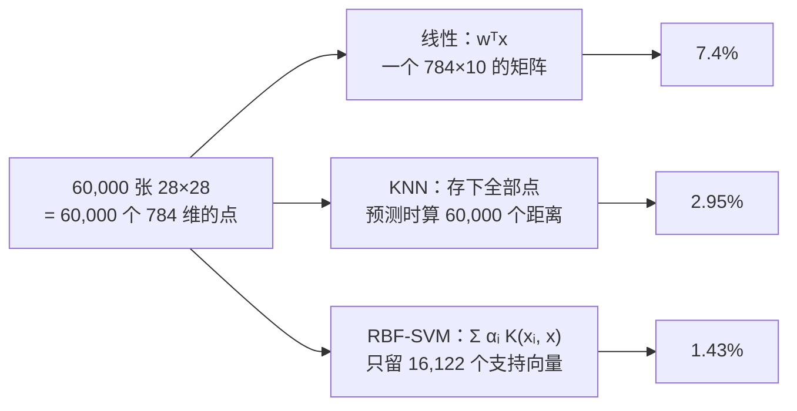

逻辑回归画一条直线把两类分开，但能分开的直线有无数条，它选的是让交叉熵最小的那条。**支持向量机**（SVM，support vector machine）换了一个标准：选**离两类都最远**的那条——间隔最大。这个标准只由离边界最近的几个点决定，其余点删掉也不影响结果。然后是它最漂亮的部分——**核技巧**：不改变算法，只把"两个点的内积"换成一个相似度函数，直线就变成了任意形状的曲线。核方法在深度学习时代退出了主流，但它的两个思想活得很好：间隔（对比学习的 margin loss）与"相似度加权"（attention 就是一个核平滑器，本文会把两个公式对到一位小数不差）。

全篇的核心问题是：

> **能分开两类的直线有无数条，SVM 凭什么选"间隔最大"的那条？[^q0] 核技巧为什么能不增加计算量就把直线变成曲线？[^q1] attention 和一百年前的核回归是什么关系？[^q2]**

## 一、总览

### 1. 从一条线到一个核

本文按 SVM 的三层组织：先是**线性 SVM**（最大间隔、hinge loss、软间隔），再是**核**（把内积换成相似度），最后是核这个思想在今天的两个去处（attention、以及它为什么在大数据上退场）：

| 概念 | 一句话 | 本文里的数字 |
|---|---|---|
| 最大间隔 | 选离两类最近点都最远的直线 | 60 个训练点，只有 2 个支持向量决定了边界 |
| hinge loss | 间隔够 1 不罚，不够才罚 | 手写 SGD 与 `LinearSVC` 的 $$w$$ 方向余弦 0.9997 |
| 软间隔 $$C$$ | 允许多少点越过间隔 | $$C = 0.01$$ 支持向量 82 个、间隔 1.83；$$C = 100$$ 36 个、0.53 |
| 核技巧 | 内积换成相似度 = 在高维空间画直线 | 圆环数据线性 0.58 → 加一维 1.00 → RBF 核 1.00 |
| RBF 的 $$\gamma$$ | 每个点的影响范围 | $$\gamma = 200$$ 训练 1.00 / 测试 0.87 |
| 核 = attention | 相似度 → 归一化 → 加权值 | 核回归与 attention 公式差 $$10^{-15}$$ |
| 复杂度 | 核 SVM $$O(n^2)$$–$$O(n^3)$$ | $$n$$ = 64000 时 7.6 s vs 逻辑回归 0.01 s |

Table: SVM 的概念与本文里的数字

### 2. 本文的章节安排

| 章 | 主题 | 内容 |
|---|---|---|
| 二 | 最大间隔 | 三条都能分开的直线；间隔的定义；支持向量 |
| 三 | hinge loss 与手写 SVM | hinge 与逻辑回归 loss 的对比图；12 行次梯度下降；与 `LinearSVC` 对数 |
| 四 | 软间隔 | 分不开怎么办；$$C$$ 的作用（三张图） |
| 五 | 核技巧 | 圆环数据：升一维就能分；核函数 = 不升维算内积；RBF 与 $$\gamma$$ |
| 六 | 核 = 相似度加权 | 核回归的三步；attention 是同一个公式；对数到 $$10^{-15}$$ |
| 七 | SVM 在今天 | 训练时间随 $$n$$ 的增长；间隔思想去了哪 |
| 八 | 案例：MNIST 手写数字 | 重跑 LeCun 等 1998 那张表：线性 7.4% → KNN 2.95% → RBF-SVM 1.43%（60,000 张训练 3.5 分钟、16,122 个支持向量）；$$C$$ 与 $$\gamma$$ 的网格；错在哪 |
| 九 | 本文小结 | |
| 十 | 自测 | 六道题 |

Table: 本文的章节安排

### 3. 来龙去脉：从苏联的统计学到十年的默认选择

| 年 | 谁 | 当时的问题 | 留下的东西 |
|---|---|---|---|
| 1963 | Vapnik & Chervonenkis（莫斯科） | 能分开两类的直线无数条，哪一条对新数据最保险 | **最大间隔**（generalized portrait）：离两侧最近点都最远的那条（第二章）；之后十年他们发展出 VC 理论，说明为什么间隔大泛化好 |
| 1964 | Aizerman、Braverman、Rozonoer | 线性方法怎么处理线性分不开的数据 | 核函数 = 高维空间里的内积——**核技巧**的最早形态，当时没人重视 |
| 1992 | Boser、Guyon、Vapnik（贝尔实验室） | 把 1963 年的算法和 1964 年的核合起来 | **核 SVM**：在数据只以内积出现的算法里把内积换成核（第五章） |
| 1995 | Cortes & Vapnik | 真实数据总有几个点分不开、有噪声 | **软间隔** $$C$$（第四章）；同年在 MNIST 上做到 1.1% 错误率——第八章的案例 |
| 1998 | Joachims；Platt（SMO） | 文本分类几万维、几千样本；核 SVM 训练太慢 | SVM 成为文本分类的默认（Joachims 证明它比 NB、KNN、决策树都好）；SMO 让训练可行 |
| 2001 | Chang & Lin，LIBSVM | 每个人都在自己实现 | 一个人人都用的库——scikit-learn 的 `SVC` 至今包着它 |
| 1998–2012 | | | **"SVM 时代"**：在中小数据集上几乎是所有比赛的冠军，直到 2012 年 AlexNet 在 ImageNet 上把错误率从 26% 降到 16%（L3 第五篇） |

Table: SVM 的来历

SVM 解决的问题，用一句话说是：**在"能分开"的直线里选最保险的那条（间隔），并且能在不算高维坐标的情况下画曲线（核）**。它赢过逻辑回归的地方是有理论保证的泛化和核带来的非线性；输给深度学习的地方是两个——核矩阵 $$n \times n$$ 让它在百万样本上训不动（第七章），以及它不会自己学特征（核是人挑的，卷积是学出来的）。今天什么时候还用它：样本几千到几万、特征多、要一个不用调太多的强基线——文本分类（线性 SVM）、小数据集上的图像分类（在别人提好的特征上）、异常检测（one-class SVM）。什么时候不用：样本超过十万（换线性模型或树），或者特征要从原始像素 / 波形里学（换神经网络）。

## 二、最大间隔

### 1. 哪条线最好

60 个点、两类、分得开。能把它们分开的直线有无数条：


左图三条线都让训练准确率 100%，但直觉上橙色那条更好：它离两类都远，新来的点稍微偏一点也不会越界。SVM 把这个直觉变成标准——**间隔**（margin）：直线到两侧最近的点的距离。选间隔最大的那条。

### 2. 间隔的公式

直线仍写成 $$w^T x + b = 0$$（第三篇的决策边界）。$$w$$ 是直线的**法向量**——垂直于直线的方向；$$\lVert w \rVert = \sqrt{w_1^2 + w_2^2}$$ 是它的长度。一个点 $$x_i$$ 到直线的距离是

$$
\text{dist}(x_i) = \frac{\lvert w^T x_i + b \rvert}{\lVert w \rVert}
$$

算一个：直线 $$x_1 + x_2 - 2 = 0$$（$$w = (1, 1), b = -2, \lVert w \rVert = \sqrt 2$$），点 $$(3, 3)$$ 代进去 $$w^T x + b = 3 + 3 - 2 = 4$$，距离 $$4 / \sqrt 2 = 2.83$$。分子是"把点代进直线方程得到的数"——在直线上为 0、离得越远绝对值越大、两侧符号相反；除以 $$\lVert w \rVert$$ 是因为把 $$w, b$$ 同乘 2（直线 $$2x_1 + 2x_2 - 4 = 0$$ 还是同一条线）分子会翻倍，除掉 $$\lVert w \rVert$$ 才是真正的几何距离。

把标签写成 $$y_i \in \{-1, +1\}$$（不再是 0/1，为了下面的式子好写），分对的点满足 $$y_i (w^T x_i + b) > 0$$——正类在正的一侧、负类在负的一侧，乘起来总是正。既然 $$w, b$$ 同时放大不改变直线，可以利用这个自由度做一个约定："离直线最近的点恰好满足 $$y_i(w^T x_i + b) = 1$$"。于是最近点的距离——**间隔**——就是 $$1 / \lVert w \rVert$$：$$\lVert w \rVert$$ 越小间隔越大。最大化间隔 = 最小化 $$\lVert w \rVert$$（写成 $$\frac{1}{2}\lVert w \rVert^2$$ 只是为了求导方便，最优解不变）：

$$
\min_{w, b}\ \frac{1}{2}\lVert w \rVert^2 \quad \text{s.t.}\quad y_i (w^T x_i + b) \ge 1\ \ \forall i
$$

读法："在**所有**（$$\forall$$）训练点都满足 $$y_i (w^T x_i + b) \ge 1$$（都分对、而且离直线至少一个间隔）的条件下（s.t. = subject to），找让 $$\lVert w \rVert$$ 最小的 $$w, b$$。"这是一个带约束的优化问题，与前几篇"直接最小化一个损失"不同——第三章会把约束变回损失。

右图：60 个点里只有**两个**落在间隔边界上（虚线）。这两个点叫**支持向量**（support vector）——它们"支撑"着边界；把其他 58 个点全删掉，解出来的直线一模一样。这与逻辑回归很不同：逻辑回归里每个点都对 $$w$$ 有贡献（远的贡献小但不为零）。

```text title="最大间隔直线与两个支持向量"
最大间隔直线：w = [0.819 1.753], b = 0.006；间隔宽度（到边界的距离）= 1/||w|| = 0.517
支持向量：2 个（60 个训练点里只有它们决定了这条线）
```

## 三、hinge loss 与手写 SVM

### 1. 把约束写成 loss

上面的"约束优化"可以改写成一个普通的 loss：违反约束就罚，罚多少看差多少。这就是 **hinge loss**（合页损失）：

$$
\ell(x, y) = \max\big(0,\ 1 - y\,(w^T x + b)\big)
$$

- $$y(w^T x + b)$$ 是这个点的"间隔"：正 = 分对，越大越自信；
- 间隔 $$\ge 1$$：loss 恰好为 0——分对且够远的点**对模型没有任何影响**；
- 间隔 $$< 1$$：loss 线性增长——离得越近、或分错得越远，罚得越多。间隔 0.5（分对了但离边界太近）罚 0.5，间隔 0（正好在边界上）罚 1，间隔 −1（分错、且离边界一个单位）罚 2。

"合页"是形容它的图形：一条水平线在 1 处折起来，像门的合页。它把上一节的约束"$$\ge 1$$"变成了"不满足就按差多少罚"——满足约束的点罚 0，与约束等价；不满足的点也有一个有限的罚而不是"无解"，第四章的软间隔靠的就是这一点。


| 间隔 $$y \cdot f(x)$$ | −1 | 0 | 0.5 | 1 | 2 |
|---|---:|---:|---:|---:|---:|
| hinge | 2.00 | 1.00 | 0.50 | **0** | **0** |
| 逻辑回归 $$\log(1 + e^{-m})$$ | 1.31 | 0.69 | 0.47 | 0.31 | 0.13 |

Table: hinge 与逻辑回归损失在几个间隔上的取值

对比逻辑回归的 loss：它对分得很对的点也有一点惩罚（间隔 2 时 0.13），所以每个点都在推 $$w$$；hinge 在间隔 1 之后完全为零，这就是"只有支持向量起作用"的代数原因。加上 $$\frac{\lambda}{2}\lVert w \rVert^2$$ 正则（就是上一节的 $$\frac{1}{2}\lVert w \rVert^2$$），整个 SVM 就是：

$$
\min_{w, b}\ \frac{1}{2}\lVert w \rVert^2 + C \sum_i \max\big(0,\ 1 - y_i (w^T x_i + b)\big)
$$

$$C$$ 控制"少犯错"与"间隔大"之间的权衡，第四章。

### 2. 十二行实现

hinge 在折点（间隔恰好 1）不可导，但两边的导数都有——左边斜率 $$-1$$、右边 0——取其中任意一个当"导数"用，梯度下降照样收敛，这叫[**次梯度**](# "tip: subgradient：对折线这类有尖角的凸函数，尖角处任何介于左右斜率之间的值都可以当导数用。用它做的梯度下降叫次梯度下降")。间隔 $$< 1$$ 时，$$\max(0, 1 - y(w^T x + b))$$ 对 $$w$$ 的导数是 $$-y\, x$$（第三篇链式法则：外层对内层的导数 $$-y$$，乘内层 $$w^T x$$ 对 $$w$$ 的导数 $$x$$）；间隔 $$\ge 1$$ 时是 0。逐样本的随机梯度下降：

```python title="fit_linear_svm：十二行次梯度下降"
def fit_linear_svm(X, y, C_=1.0, lr=0.01, epochs=200, seed=0):       # y ∈ {−1, +1}
    r = np.random.default_rng(seed)
    n, d = X.shape
    w, b = np.zeros(d), 0.0
    for ep in range(epochs):
        for i in r.permutation(n):                                   # ① 逐个样本（SGD）
            margin = y[i] * (X[i] @ w + b)                           # ② 这个样本的间隔 y·f(x)
            if margin < 1:                                           # ③ 间隔不足 1：hinge 有梯度
                w -= lr * (w - C_ * y[i] * X[i]); b += lr * C_ * y[i]
            else:                                                    # ④ 间隔够：只有正则项在拉 w
                w -= lr * w
    return w, b
```

1. ② 算这个样本的间隔；
2. ③ 间隔不够时 hinge 的导数是 $$-y_i x_i$$，加上正则项的导数 $$w$$，一起走一步；
3. ④ 间隔够时 hinge 为零，只剩正则项把 $$w$$ 往小拉——这就是"分对且够远的点不参与"。

```text title="手写 SVM、LinearSVC 与逻辑回归的结果"
手写：0.18s，测试准确率 0.897；LinearSVC：0.907；两个 w 方向的余弦相似度 0.9997
同一份数据逻辑回归 0.920——线性可分程度高的数据上，两种线性分类器差别很小
```

1000 个样本、10 个特征，手写版与 `LinearSVC` 的 $$w$$ 方向几乎重合（余弦 0.9997）。同一份数据逻辑回归 0.920——**线性 SVM 与逻辑回归是近亲**：同一个线性模型 $$w^T x + b$$，只是 loss 从交叉熵换成 hinge。在大多数数据上两者差别很小。

## 四、软间隔

### 1. 分不开怎么办

真实数据几乎从不完全可分——两类有重叠，"所有点间隔 $$\ge 1$$"的约束无解。**软间隔**允许一些点越过间隔甚至分错，每越一点罚一点（就是 hinge loss），$$C$$ 是罚的力度：


| $$C$$ | 支持向量 | 间隔宽度 | 训练准确率 |
|---:|---:|---:|---:|
| 0.01 | 82 | 1.83 | 0.883 |
| 1 | 39 | 0.59 | 0.875 |
| 100 | 36 | 0.53 | 0.883 |

Table: 不同 C 下的支持向量数、间隔与准确率

- $$C$$ **小**：更看重 $$\lVert w \rVert$$ 小（间隔宽），不在乎多几个点越界——82 个点落进了间隔带、都成了支持向量。边界平、稳、不怎么受个别点影响；
- $$C$$ **大**：尽量不让任何点越界，间隔收窄到只剩 36 个支持向量，边界开始为个别点转向。

$$C$$ 是正则化强度的**倒数**（第二篇 Ridge 的 $$\alpha$$ 越大越正则，这里 $$C$$ 越小越正则）：$$C$$ 太大过拟合，太小欠拟合，用验证集选。

## 五、核技巧

### 1. 二维分不开，升一维就能分

一个内圈、一个外圈——没有任何直线能分开它们，线性 SVM 只有 58%。但如果加一个特征 $$z = x_1^2 + x_2^2$$（到原点距离的平方），内圈的 $$z$$ 小、外圈的 $$z$$ 大，在三维空间里一个**水平的平面**就把它们分开了：


```text title="圆环数据：线性、升维、RBF 核的准确率"
二维线性 SVM 训练准确率 0.583（一条直线切圆环，只能对一半）
加第三维 r² 后线性 SVM 1.000——三维里一个水平的平面就把内圈与外圈分开
不显式升维、直接用 RBF 核的 SVM 1.000
```

三维里的平面投回二维就是一个圆——**在高维空间画直线，等于在原空间画曲线**。这是核方法的全部想法。问题是：要升到多少维？升维后的计算量怎么办？

### 2. 核函数：不升维就算出升维后的内积

回头看第三章那 12 行代码：$$w$$ 从零开始，每次更新要么乘一个数缩小、要么加上 $$C \cdot y_i x_i$$——**$$w$$ 永远是训练点的加权和** $$w = \sum_i \alpha_i y_i x_i$$，权重 $$\alpha_i$$ 只在间隔不足的点（支持向量）上非零。于是预测

$$
f(x) = w^T x + b = \sum_i \alpha_i y_i\, (x_i^T x) + b
$$

数据只以**两两内积** $$x_i^T x$$ 的形式出现（训练时同样，$$w^T x_j = \sum_i \alpha_i y_i\, x_i^T x_j$$）。如果先把 $$x$$ 映射到高维 $$\phi(x)$$ 再做 SVM，需要的只是 $$\phi(x_i)^T \phi(x_j)$$——两个高维向量的内积，一个数。

**核技巧**（kernel trick）：找一个函数 $$K(x_i, x_j)$$，它直接算出 $$\phi(x_i)^T \phi(x_j)$$ 的值，而**从不真的构造 $$\phi$$**。用上一节的例子验证：取 $$K(x, x') = (x^T x')^2$$（二维内积再平方）。展开：

$$
(x_1 x'_1 + x_2 x'_2)^2 = x_1^2 x'^2_1 + 2 x_1 x_2 x'_1 x'_2 + x_2^2 x'^2_2
= \phi(x)^T \phi(x'),\qquad \phi(x) = (x_1^2,\ \sqrt 2\, x_1 x_2,\ x_2^2)
$$

数字验算：$$x = (1, 2), x' = (3, 1)$$，左边 $$(3 + 2)^2 = 25$$；右边 $$\phi(x) = (1, 2.83, 4)$$、$$\phi(x') = (9, 4.24, 1)$$，内积 $$9 + 12 + 4 = 25$$。二维里做一次内积、平方，得到的就是三维特征空间（含 $$x_1^2 + x_2^2$$ 那个能分开圆环的方向）里的内积，而三维坐标一次都没算。最常用的核是 **RBF 核**（高斯核，radial basis function）：

$$
K(x, x') = \exp\big(-\gamma \lVert x - x' \rVert^2\big)
$$

两点重合时 $$K = 1$$；$$\gamma = 1$$ 时距离 1 的两点 $$K = e^{-1} = 0.37$$，距离 2 的 $$K = e^{-4} = 0.018$$——离得越远越接近 0。它对应的 $$\phi$$ 是**无穷维**的（把 $$e^{z}$$ 泰勒展开，每一阶多项式都是一个坐标）——但我们只算 $$K$$，一个减法、一个范数、一个指数。预测就变成：

$$
f(x) = \sum_{i \in \text{支持向量}} \alpha_i y_i\, K(x_i, x) + b
$$

读一下这个式子：新点 $$x$$ 与每个支持向量算一个**相似度** $$K$$（离得近 → 接近 1，远 → 接近 0），按 $$\alpha_i y_i$$ 加权求和——"离哪一类的支持向量近，就归哪一类"。RBF 核 SVM 的边界因此可以是任意形状。

### 3. $$\gamma$$：每个点的影响范围

$$\gamma$$ 越大，$$K$$ 随距离衰减越快，每个支持向量只影响它周围一小块：


| $$\gamma$$ | 训练 | 测试 | 支持向量 |
|---:|---:|---:|---:|
| 0.1 | 0.870 | 0.885 | 92 |
| 1 | 0.940 | 0.935 | 54 |
| 200 | **1.000** | **0.865** | 190 |

Table: 不同 γ 下 RBF 核 SVM 的准确率与支持向量数

$$\gamma = 200$$ 时每个训练点周围一个小岛，训练 100%、测试掉到 0.87——又是第一篇的过拟合，$$\gamma$$ 就是它的容量旋钮。$$\gamma$$ 与 $$C$$ 一起用验证集选（scikit-learn 的默认 `gamma='scale'` = $$1 / (d \cdot \text{Var}(X))$$，多数时候是个好起点）。

## 六、核 = 相似度加权

### 1. 核回归的三步

把"用相似度加权"这个想法单独拿出来，就是比 SVM 更古老的**核回归**（Nadaraya-Watson，1964）：有一堆已知的 $$(x_k, v_k)$$，要预测新点 $$x_q$$ 的值，就用 $$x_q$$ 与每个 $$x_k$$ 的相似度做权重，对 $$v_k$$ 加权平均：

```python title="kernel_regression：核回归三步"
def kernel_regression(xq, xk, vk, gamma):
    K = np.exp(-gamma * (xq[:, None] - xk[None, :]) ** 2)      # ① 查询与每个键的相似度（RBF 核）
    W = K / K.sum(1, keepdims=True)                             # ② 每行归一化成权重（和为 1）
    return W @ vk                                               # ③ 用权重加权「值」
```

手算一个：三个已知点 $$x_k = 1, 2, 4$$，值 $$v_k = 10, 20, 40$$，查询 $$x_q = 1.5$$，$$\gamma = 1$$。相似度 $$e^{-(1.5 - 1)^2} = 0.779$$、$$e^{-(1.5 - 2)^2} = 0.779$$、$$e^{-(1.5 - 4)^2} = 0.002$$；归一化成权重 $$0.499, 0.499, 0.001$$；加权平均 $$0.499 \times 10 + 0.499 \times 20 + 0.001 \times 40 = 15.0$$——查询点在 1 与 2 正中间，答案就是两者的中间值，远处的 4 几乎不说话。


### 2. attention 是同一个公式

现在把 Transformer 的 attention 写出来：

```python title="attention：同样的三步"
def attention(q, k, v, scale):
    S = q @ k.T / scale                                         # ① 查询与键的点积相似度
    W = np.exp(S - S.max(1, keepdims=True)); W /= W.sum(1, keepdims=True)   # ② softmax（归一化成权重）
    return W @ v                                                # ③ 加权值
```

三步一一对应：**相似度 → 归一化 → 加权值**。名字换一下：核回归里的"查询点 / 已知点 / 已知值"，在 attention 里叫 query / key / value——当前 token 拿自己的 query 去和每个 token 的 key 比相似度，按相似度加权平均它们的 value。区别只在①：核回归用 RBF 核 $$e^{-\gamma \lVert q - k \rVert^2}$$，attention 用点积 $$q^T k$$ 再过 softmax（$$e^{q^T k}$$）。而 $$e^{-\gamma \lVert q - k \rVert^2} = e^{2\gamma q^T k} \cdot e^{-\gamma \lVert q \rVert^2} \cdot e^{-\gamma \lVert k \rVert^2}$$——把两个范数项当成额外的坐标塞进 $$q$$ 与 $$k$$，RBF 核回归就**恰好**是一个点积 attention：

```text title="RBF 核回归与点积 attention 的最大差"
RBF 核回归与用点积 + softmax 写的 attention，在 200 个查询点上的最大差 1.0e-15
```

所以 attention 的三步就是核平滑器：query 与每个 key 算相似度、softmax 归一化、加权 value。Transformer 相对核回归的新东西只有一个——$$Q, K, V$$ 不是原始数据，而是**学出来的投影**（$$W_Q x, W_K x, W_V x$$），相似度该怎么算由训练决定。L4 讲 attention 时会用到这个视角：线性 attention、Performer 一类工作就是在给 softmax 核找低维的 $$\phi$$——核技巧反过来用。

## 七、SVM 在今天

### 1. 训练时间随 $$n$$ 的增长

核 SVM 要算全部样本两两的核矩阵（$$n \times n$$），求解 $$O(n^2)$$ 到 $$O(n^3)$$；线性模型是 $$O(n)$$：

| 样本数 $$n$$ | RBF SVM | 线性 SVM | 逻辑回归 |
|---:|---:|---:|---:|
| 1,000 | 0.01 s | 0.00 s | 0.00 s |
| 4,000 | 0.05 s | 0.00 s | 0.00 s |
| 16,000 | 0.53 s | 0.01 s | 0.00 s |
| 64,000 | **7.6 s** | 0.04 s | 0.01 s |

Table: 训练时间随样本数 n 的增长

$$n$$ 乘 4，RBF SVM 的时间乘十几倍；预测时还要与所有支持向量算核。样本到百万级——LLM 数据工程的常态是几亿——核 SVM 跑不动，只剩线性模型与树（第六篇）。核 SVM 在 2000 年代是默认最强分类器（中等数据 + 手工特征），深度学习接管"从原始数据学特征"之后，它退回到中小数据集。

### 2. 间隔思想去了哪

两个地方：

1. **对比学习的 margin loss**：triplet loss $$\max(0, d(a, p) - d(a, n) + m)$$——正样本要比负样本近至少一个间隔 $$m$$，够了就不罚——就是 hinge；
2. **fastText 一类的线性文本分类器**（第六篇）：词袋特征 + 线性模型，与线性 SVM 是近亲，是给 15T token 打分的实际工具。

## 八、案例：MNIST 手写数字——重跑 1998 年那张表

**问题与数据**：MNIST 是 1998 年 LeCun、Bottou、Bengio、Haffner 为了**比较分类器**造的数据集：60,000 张训练、10,000 张测试的手写数字，28×28 像素。他们那篇论文的表 1 至今是最常被引用的一张对比表——线性分类器 12.0%、K-NN 5.0%、SVM 1.1%、LeNet-5 0.95%——SVM 和卷积网络在这张表上打平，是"SVM 时代"开始的地方。上一篇第六章跑了 KNN 那一行，这一章把线性、KNN、核 SVM 三行在今天的笔记本上重跑一遍，数字对着 1998 年的看。

**思路**：三层模型对应本篇的三层——线性（第三章的 hinge + L2，也放一个 softmax 回归做对照）、邻居（上一篇）、核（第五章的 RBF）。核 SVM 有两个超参：$$C$$（第四章：允许多少点越过间隔）和 $$\gamma$$（第五章：每个点的影响范围），先在 10,000 张的子集上做网格搜索，再把选出的配置放到全量 60,000 张上训。



```python title="MNIST 上核 SVM 的网格搜索"
X, y = mnist("train"); Xt, yt = mnist("test")
# 1. 10k 子集上扫 C × γ
for c in [0.1, 1, 10, 100]:
    for g in [0.001, 0.01, 0.03, 0.1]:
        m = SVC(C=c, gamma=g).fit(Xs, ys)                       # 每个 5 s 左右
        err[c, g] = 1 - m.score(Xv, yv); n_sv[c, g] = m.n_support_.sum()
# 2. 选出的配置放到全量上
m = SVC(C=10, gamma=0.03, cache_size=2000).fit(X, y)             # 60,000 张，214 s
pred = m.predict(Xt)                                             # 10,000 张，34 s
print(np.mean(pred != yt), m.n_support_.sum())                   # 0.0143, 16122
```

**效果**——先是网格：


| | $$\gamma = 0.001$$ | $$\gamma = 0.01$$ | $$\gamma = 0.03$$ | $$\gamma = 0.1$$ |
|---|---:|---:|---:|---:|
| $$C = 0.1$$ | 18.1%（SV 9,108） | 10.0%（6,418） | 8.9%（6,720） | 64.8%（9,363） |
| $$C = 1$$ | 11.6%（5,671） | 5.5%（3,831） | 3.9%（4,970） | 14.8%（8,633） |
| $$C = 10$$ | 8.3%（3,440） | 4.8%（3,552） | **3.85%**（5,042） | 13.9%（8,639） |
| $$C = 100$$ | 7.8%（2,866） | 4.7%（3,566） | 3.85%（5,042） | 13.9%（8,639） |

Table: RBF-SVM 在 10,000 张子集上的验证错误率（括号里是支持向量数）

这张表就是第四、五章两个旋钮的实物。**$$\gamma$$ 是主旋钮**：0.1 时核太窄——每个训练点只认自己附近，9,000 多个点（90%）都成了支持向量，模型就是在背训练集，错误率 14%–65%；0.001 时核太宽——接近线性，8%–18%；0.03 最好。**$$C$$ 是副旋钮**：$$C = 0.1$$ 时间隔太软、太多点被允许越界，每一列都最差；$$C \ge 10$$ 之后几乎没差别——MNIST 标签干净，"少犯错"没有代价。scikit-learn 默认的 `gamma='scale'` 算出来是 0.013，落在好区间里，这就是它成为默认值的原因。

然后是那张表：

| 模型 | 训练集 | 测试错误率 | 训练时间 | 预测 10,000 张 | 1998 年的数字 |
|---|---:|---:|---:|---:|---:|
| 线性：softmax 回归 | 60,000 | 7.44% | 1.7 s | 0.0 s | 线性分类器 12.0% |
| 线性 SVM（hinge + L2） | 60,000 | 8.30% | 8.5 s | 0.0 s | |
| KNN，$$k = 3$$ | 60,000 | 2.95% | 0 | 2.2 s | K-NN 5.0% |
| RBF-SVM，$$C = 10, \gamma = 0.03$$ | 10,000 | 2.72% | 5.2 s | 10 s | |
| RBF-SVM，$$C = 10, \gamma = 0.03$$ | 60,000 | **1.43%**（16,122 个支持向量） | 214 s | 34 s | SVM（多项式核）1.1% |
| （L3 第五篇）LeNet-5 | 60,000 | | | | 0.95% |

Table: MNIST 上从线性到核方法——今天的重跑与 1998 年的对照


读法：

- **三层模型，错误率一路降**：线性 7–8% → 邻居 3% → 核 1.4%。线性模型在 784 维里画 10 个超平面，一个写得斜的 7 和一个 1 在像素空间里就是线性分不开的；KNN 靠邻居把边界弯过去；RBF-SVM 也是靠邻居——第六章说了，核就是相似度加权——但它只留 16,122 个"有用的邻居"（支持向量，27% 的训练集），其余 44,000 个点对边界没有贡献，第二章的结论在 6 万个点上仍然成立。
- **数据量的作用**：同一个 SVM，10,000 张训练 2.72%，60,000 张 1.43%——几乎减半。但训练时间从 5 秒到 214 秒（40 倍，比 $$n^2$$ 还陡），预测时间从 10 秒到 34 秒（支持向量从 5,042 到 16,122）。这就是第七章"核 SVM 在大数据上退场"的实测：再加 10 倍数据，训练要几天。
- **和 1998 年对照**：线性 7.4% vs 12%——他们的线性分类器是无正则的单层网络、像素没归一化；KNN 2.95% vs 5.0%——预处理不同；RBF 1.43% vs 多项式核 1.1%——核不同、超参也没细调。数字有出入，**排序和量级一模一样**。1998 年 SVM 与 LeNet-5 打平（1.1% vs 0.95%）、之后十年 SVM 成为默认选择，是因为它不需要 GPU、不需要调结构、有理论保证；直到数据大到 ImageNet 的 120 万张，核矩阵存不下、卷积学出的特征又远好于像素距离，局面才翻过来。


**错在哪**：143 张错分的字大部分连人也会犹豫——开口的 4 和 9、上半截像的 3 和 5、带横杠的 7 和 2。像素距离能做到 1.4%，剩下的错误要的是"知道笔画是怎么写的"，这是卷积网络学出来的东西（L3 第五篇里 LeNet-5 的错分样本会和这张图对照）。

**落地还差什么**：MNIST 的数字是居中、去噪、大小归一的——真实场景里的手写识别（支票金额、邮政编码，这正是 LeCun 1998 年论文的应用）要先做检测、切分、归一化，分类器只是流水线的最后一步；预测 34 秒 / 10,000 张 = 3.4 ms / 张，对批处理够、对实时每张要几十微秒的场景不够，这也是生产系统后来换成小卷积网络的原因之一。

## 九、本文小结

- **最大间隔**：能分开两类的直线无数条，SVM 选离两侧最近点都最远的那条；间隔 $$= 1 / \lVert w \rVert$$；只有落在间隔边界上的**支持向量**决定它（60 个点里 2 个）。
- **hinge loss** $$\max(0, 1 - y f(x))$$：间隔 $$\ge 1$$ 恰好为零——分对且够远的点不参与；对比逻辑回归的 loss 永远不为零。手写 12 行次梯度下降与 `LinearSVC` 的 $$w$$ 方向余弦 0.9997；线性 SVM 与逻辑回归是近亲。
- **软间隔** $$C$$ 是正则化的倒数：$$C$$ 小间隔宽、支持向量多（0.01 → 82 个、1.83）；$$C$$ 大贴数据（100 → 36 个、0.53）。
- **核技巧**：算法里数据只以内积出现，把内积换成核函数 $$K(x, x') = \phi(x)^T \phi(x')$$，等于在高维画直线、在原空间画曲线，而从不构造 $$\phi$$。圆环数据 0.58 → 1.00。RBF 核 $$e^{-\gamma \lVert x - x' \rVert^2}$$ 对应无穷维；$$\gamma$$ 是容量旋钮（200 → 训练 1.00 / 测试 0.87）。
- **核 = 相似度加权**：核回归的三步（相似度 → 归一化 → 加权值）就是 attention 的三步，RBF 核回归与点积 attention 公式对到 $$10^{-15}$$；Transformer 的新东西是 $$Q, K, V$$ 学出来。
- **今天**：核 SVM $$O(n^2)$$–$$O(n^3)$$（64000 样本 7.6 s vs 逻辑回归 0.01 s），大数据上退场；间隔思想活在 triplet / margin loss 里，线性 SVM 活在 fastText 里。
- **案例**：MNIST 上重跑 1998 年的表——线性 7.4%、KNN 2.95%、RBF-SVM 1.43%（$$C = 10, \gamma = 0.03$$，16,122 个支持向量，60,000 张训 3.5 分钟），排序与量级和原表一致；$$\gamma$$ 是主旋钮（0.1 时 90% 的点成为支持向量）；10k → 60k 训练时间 40 倍，是核方法退场的实测。

配套代码：本文全部数字与图由 [`classical-ml/05_svm_and_kernels.py`](https://github.com/arganzheng/ai-learning-labs/blob/main/classical-ml/05_svm_and_kernels.py)（`margin` / `hinge` / `primal` / `softc` / `kernel` / `rbf` / `attention` / `scale` 八个子实验）与 [`case_05_svm_mnist.py`](https://github.com/arganzheng/ai-learning-labs/blob/main/classical-ml/case_05_svm_mnist.py)（第八章案例，全量 RBF-SVM 约 4 分钟）产生。

## 十、自测

1. 一个 SVM 有 1000 个训练点、12 个支持向量。删掉 500 个非支持向量的点重新训练，边界会变吗？

   <details markdown="1"><summary>答案</summary>

   不变——hinge 在间隔 ≥ 1 的点上为零，它们对解没有贡献；只有支持向量决定边界。

   </details>

2. 一个点的间隔 $$y f(x) = 0.3$$，它的 hinge loss 是多少？逻辑回归的 loss 是多少？它是支持向量吗？

   <details markdown="1"><summary>答案</summary>

   hinge $$= 0.7$$；逻辑回归 $$\log(1 + e^{-0.3}) = 0.55$$；是——间隔 < 1 的点都在间隔带内，是支持向量。

   </details>

3. $$C$$ 从 1 调到 0.001，支持向量数量、间隔宽度、过拟合风险各怎么变？

   <details markdown="1"><summary>答案</summary>

   支持向量变多、间隔变宽、过拟合风险变小（$$C$$ 小 = 正则强）；太小会欠拟合。

   </details>

4. 核技巧为什么能"在无穷维空间画直线"而不需要无穷的计算量？

   <details markdown="1"><summary>答案</summary>

   算法里数据只以内积 $$\phi(x)^T\phi(x')$$ 出现，RBF 核直接给出这个内积的值（一个指数），从不构造无穷维的 $$\phi$$。

   </details>

5. 写出核回归与 attention 各自的三步，指出唯一的差别。

   <details markdown="1"><summary>答案</summary>

   相似度 → 归一化 → 加权值；核回归用 RBF 核 + 除以行和，attention 用点积 + softmax，且 $$Q, K, V$$ 是学出来的投影。

   </details>

6. 500 万条样本、40 个数值特征的分类任务，能用 RBF 核 SVM 吗？该用什么？

   <details markdown="1"><summary>答案</summary>

   不能——核矩阵 $$n^2 = 2.5 \times 10^{13}$$ 个元素、时间 $$O(n^2)$$ 以上；用线性模型（逻辑回归 / 线性 SVM）或 GBDT（第六篇）。

   </details>

## 下一篇

下一篇回到决策树：一棵树方差极大、天生过拟合，但**很多棵树**平均起来（随机森林）或一棵接一棵地修正前面的错（梯度提升）就成了表格数据上至今最强的模型——然后算一笔账：给 15T token 打质量分为什么用它们而不是 LLM。

[^q0]: 间隔 = 直线到两侧最近点的距离 $$= 1/\lVert w \rVert$$；间隔最大的直线离两类都最远，新点稍微偏一点也不会越界，泛化更稳。这个解只由落在间隔边界上的支持向量决定（60 个点里 2 个），其余点删掉不影响；写成 loss 就是 hinge $$\max(0, 1 - yf(x))$$——间隔够 1 的点 loss 恰好为零。详见[第二章](#二最大间隔)、[第三章](#三hinge-loss-与手写-svm)。
[^q1]: SVM 的求解与预测里数据只以两两内积出现。把内积换成核函数 $$K(x, x') = \phi(x)^T\phi(x')$$，就等于把数据先映射到高维 $$\phi$$ 再画直线——投回原空间是曲线；而 $$K$$ 直接算出高维内积的值（RBF 核只是一个指数），从不构造 $$\phi$$（RBF 对应无穷维）。圆环数据：线性 0.58，RBF 核 1.00。详见[第五章](#五核技巧)。
[^q2]: 同一个公式。核回归：查询与每个键算相似度（RBF 核）→ 除以行和归一化 → 加权"值"；attention：点积相似度 → softmax → 加权 value。把 RBF 核的两个范数项当额外坐标塞进 $$q, k$$，两者数值差 $$10^{-15}$$。Transformer 的新东西是 $$Q, K, V$$ 是学出来的投影。详见[第六章](#六核--相似度加权)。
