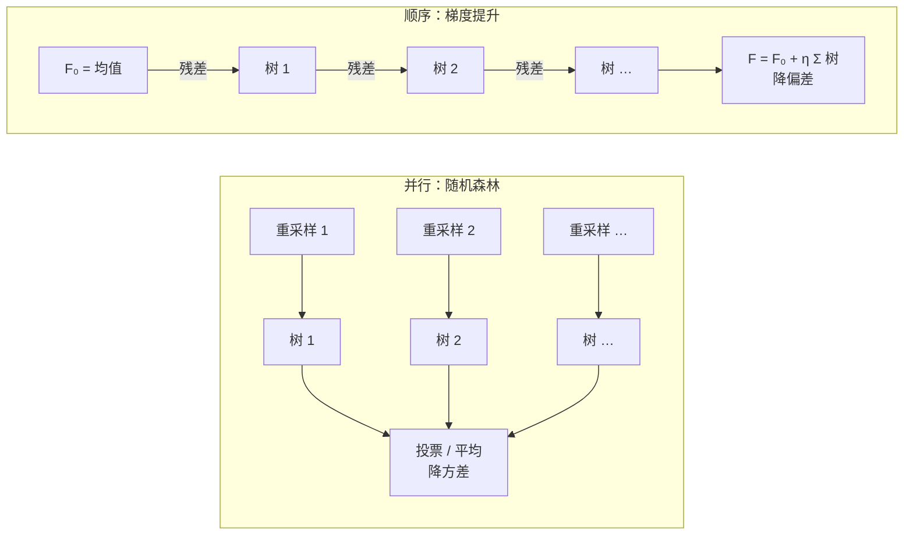

第四篇结尾留下一个问题：决策树方差极大、天生过拟合，怎么办？答案是**很多棵树**。两种组织方式：**随机森林**并行地训几百棵各不相同的树再投票——第一篇"集成只降方差"的直接应用；**梯度提升**则一棵接一棵地训，每棵树专门修正前面所有树加起来还没解释的部分（残差）。后者是至今表格数据上最强的模型（XGBoost、LightGBM、CatBoost 都是它），也是预训练数据工程里质量分类器的常用工具之一。最后算一笔账：给 15T token 打质量分，为什么用这些小模型而不是 LLM 自己。

全篇的核心问题是：

> **很多棵都过拟合的树平均起来为什么反而不过拟合？[^q0] 梯度提升"逐棵拟合残差"到底在做什么，为什么叫"梯度"？[^q1] 预训练数据过滤为什么用 fastText 与 GBDT 而不是 LLM？[^q2]**

## 一、总览

### 1. 两种集成、一笔账

本文按"并行集成 → 顺序集成 → 它们在 LLM 工作里的位置"组织：



| 概念 | 一句话 | 本文里的数字 |
|---|---|---|
| bagging | 重采样训很多棵树，平均 | 一棵树测试 0.826 → 200 棵 0.905；预测方差 0.094 → 0.007 |
| 随机森林 | bagging + 每个节点只看部分特征 | 树间相关 0.59 → 0.53，测试 0.904 → 0.918 |
| 梯度提升 | 每棵树拟合前面的残差 | 3 棵深度 1 的树：MSE 0.211 → 0.070；手写 15 行与 scikit-learn 同量级 |
| 学习率 × 棵数 | 小步多棵更稳 | 学习率 1.0 第 24 棵到顶后下滑；0.1 到 0.915 |
| 特征重要性 | 每个特征贡献的不纯度下降 | 乳腺癌 30 个特征前 6 个占 91% |
| 算力账 | 给 15T token 打分 | 8B 模型 = 训练算力的 1/3；线性模型 0.004% |

### 2. 本文的章节安排

| 章 | 主题 | 内容 |
|---|---|---|
| 二 | bagging | 一棵树 vs 很多棵；方差降了多少；棵数曲线 |
| 三 | 随机森林 | 再加一层随机：只看部分特征；树越不像，平均越有效；袋外估计 |
| 四 | 梯度提升 | 4 个点手算两步；一步一步拟合残差（八张图）；为什么叫"梯度"；15 行实现对 scikit-learn |
| 五 | 调参 | 学习率 × 棵数；深度；XGBoost / LightGBM / CatBoost 各改了什么 |
| 六 | 特征重要性与表格数据 | 重要性怎么算；表格数据上 GBDT vs 神经网络 |
| 七 | 数据质量分类器的算力账 | 15T token 打分：8B 是 1/3、线性模型几乎为零；两级做法；fastText 的形态 |
| 八 | 小分类器带回来的老问题 | 分布偏移、系统性误杀、阈值 |
| 九 | 本文小结 | |
| 十 | 自测 | 六道题 |

## 二、bagging：很多棵树平均

### 1. 一棵树 vs 很多棵

第四篇的表格数据上一棵不限深度的树：训练 1.000、测试 0.826。**bagging**（bootstrap aggregating）：从训练集里**有放回地**抽同样多的样本，训一棵树；重复 $$B$$ 次；预测时 $$B$$ 棵树投票。

"有放回地抽"（**bootstrap** 重采样）是什么意思：训练集有 5 个样本 {1, 2, 3, 4, 5}，抽 5 次、每次抽完放回去再抽，可能得到 {3, 1, 3, 5, 2}——样本 3 被抽到两次、样本 4 一次都没抽到。每个样本每次被抽到的概率是 $$1/n$$，$$n$$ 次都没被抽到的概率是 $$(1 - 1/n)^n$$，$$n$$ 大时趋于 $$1/e = 0.37$$——所以每棵树大约只见过 63% 的不同样本，另外 37% 对它来说是"没见过的"。这样得到的 $$B$$ 份数据每份都略有不同，训出的 $$B$$ 棵树也就略有不同——这正是我们要的。


| 棵数 | 1 | 2 | 5 | 10 | 20 | 50 | 100 | 200 |
|---|---:|---:|---:|---:|---:|---:|---:|---:|
| 测试准确率 | 0.829 | 0.841 | 0.870 | 0.886 | 0.899 | 0.901 | 0.905 | 0.905 |

每一棵树的训练准确率仍是 100%（各自背下了自己那份重采样数据），但 200 棵投票后测试从 0.83 升到 0.90。

### 2. 降的是方差

为什么？第一篇的分解：一棵树偏差小（容量够）、**方差大**（换几个训练点结构就变）。第一篇第六章那个骰子的比喻：一个骰子的结果在 1–6 乱跳，20 个骰子的平均稳稳落在 3.5 附近——平均 $$B$$ 个方差为 $$\sigma^2$$ 的**独立**估计，方差变成 $$\sigma^2 / B$$。树之间不完全独立（它们的重采样数据有大量重叠，像 20 个被胶水粘在一起的骰子），降不到 $$1/B$$，但降得很多。直接量一下——换 20 批训练数据，看模型对测试样本预测概率的方差：

```text
换 20 批训练数据：单棵树预测概率的方差 0.094；50 棵 bagging 的 0.007
```

方差降到 1/13。偏差没有变——每棵树仍是不限深度的树，平均之后能表达的边界形状与单棵树一样（右图边界仍是横竖线段拼的）。**集成不改变模型的表达能力，只让它稳定**。

## 三、随机森林

### 1. 再加一层随机

bagging 的树彼此还是太像：数据有 20 个特征，其中几个特别强，每棵树的根节点几乎都选它们切，树的上半部分长得差不多。**随机森林**（random forest）在每个节点只允许从**随机抽的 $$m$$ 个特征**里选切分（默认 $$m = \sqrt{d}$$），逼树走不同的路：

| 每个节点可选的特征数 $$m$$ | 测试准确率 | 树之间预测的平均相关 |
|---:|---:|---:|
| 20（= bagging） | 0.904 | 0.593 |
| 10 | 0.917 | 0.581 |
| 4（默认 $$\sqrt{20}$$） | **0.918** | 0.530 |
| 2 | 0.909 | 0.477 |
| 1 | 0.895 | 0.374 |

$$m$$ 越小，树彼此越不像（相关从 0.59 降到 0.37），平均后方差降得越多——但 $$m$$ 太小每棵树本身太弱（连有用的特征都常抽不到），偏差升上来。$$\sqrt{d}$$ 附近最好。相关低的估计平均起来方差降得多，这是随机森林比纯 bagging 好的全部理由。

### 2. 袋外估计

每棵树的重采样漏掉了约 37% 的样本（**袋外**，out-of-bag），这些样本对这棵树来说就是没见过的数据。用每个样本"没见过它的那些树"来预测它，得到一个不用切验证集的泛化估计：

```text
300 棵、默认 max_features=√20≈4：测试 0.919；袋外（OOB）估计 0.913
```

随机森林几乎不需要调参（棵数越多越好、$$m$$ 用默认），是"先跑一个看看"的默认模型。

## 四、梯度提升

### 1. 一步一步拟合残差

随机森林的树各自独立。**梯度提升**（gradient boosting）让树**顺序**地工作：第 1 棵树拟合数据，第 2 棵树拟合第 1 棵没拟合好的部分，第 3 棵拟合前两棵加起来还没拟合好的部分……用一个一维回归问题把每一步画出来（用深度 1 的树——只切一刀、预测是一个台阶——最容易看）：


| 树的棵数 | 0 | 1 | 2 | 3 | 50 |
|---|---:|---:|---:|---:|---:|
| 训练 MSE | 0.211 | 0.166 | 0.099 | 0.070 | 0.025 |

先用 4 个点手算两步，看清"拟合残差"是什么意思。四个样本的 $$y = 1, 2, 6, 7$$（按 $$x$$ 从小到大排），学习率暂取 1：

| 步 | 当前预测 $$F$$ | 残差 $$y - F$$ | 这一步的树 $$h$$（深度 1：切一刀、两边各取残差均值） | 训练 MSE |
|---|---|---|---|---:|
| 0 | 均值 4, 4, 4, 4 | −3, −2, 2, 3 | | 6.5 |
| 1 | 1.5, 1.5, 6.5, 6.5 | −0.5, 0.5, −0.5, 0.5 | 前两个 → −2.5，后两个 → +2.5 | 0.25 |

第 1 棵树不看 $$y$$，只看残差 $$(-3, -2, 2, 3)$$：在中间切一刀，左边残差平均 −2.5、右边 +2.5，就是一个台阶；把台阶加到预测上，MSE 从 6.5 降到 0.25。第 2 棵树面对的是新残差 $$(-0.5, 0.5, -0.5, 0.5)$$，切在哪都只能再降一点——它拟合的是"前一棵树没做完的部分"。学习率 0.5 时第 1 步只加半个台阶（预测 2.75, 2.75, 5.25, 5.25），残差留得多一些，给后面的树慢慢修。

读下排：第 1 棵树面对的是"$$y$$ 减去均值"，它切了一刀把左端那一撮低点分出来；第 2 棵面对的是剩下的残差，它在右边切一刀；每棵树只负责**前面所有树加起来还没解释的部分**。50 个台阶叠出一条曲线。

### 2. 为什么叫"梯度"

写成公式。模型是树的累加：

$$
F_t(x) = F_{t-1}(x) + \eta\, h_t(x), \qquad F_0(x) = \bar y
$$

- $$F_t$$：前 $$t$$ 棵树加起来的预测；
- $$h_t$$：第 $$t$$ 棵树；
- $$\eta$$：学习率——每棵树的贡献乘一个小系数。

第 $$t$$ 棵树该拟合什么？我们想让 loss $$L = \sum_i \ell(y_i, F(x_i))$$ 下降最快。第二篇的梯度下降是"对参数 $$w$$ 求导、沿负梯度走"；这里换一个视角：暂时忘掉树，把模型在 $$n$$ 个训练点上的 $$n$$ 个预测值 $$F(x_1), \ldots, F(x_n)$$ 本身当成 $$n$$ 个可以自由调的参数。loss 对第 $$i$$ 个预测值的导数 $$\partial \ell / \partial F(x_i)$$ 告诉我们：把这个预测值调大一点，loss 会怎么变；沿负梯度 $$-\partial \ell / \partial F(x_i)$$ 调，loss 下降最快。平方损失 $$\ell = \frac{1}{2}(y - F)^2$$ 的负梯度是

$$
-\frac{\partial \ell}{\partial F(x_i)} = y_i - F(x_i) = \text{残差}
$$

所以"拟合残差"就是"用一棵树去逼近负梯度"，再沿这个方向走一步（乘 $$\eta$$）——**这是第二篇的梯度下降，只不过参数不是一个向量 $$w$$，而是函数 $$F$$ 本身**，每一步的"更新量"用一棵树表示。换 loss 只换负梯度：分类用第三篇的交叉熵，负梯度是 $$y - p$$（标签减预测概率——又是那个形式），树拟合它，累加的是 [logit](# "tip: 过 sigmoid 之前的那个数 z = wᵀx + b，也叫「对数几率」log(p / (1 − p))。梯度提升做分类时，各棵树的输出加起来是 z，最后过一次 sigmoid 才是概率")。

### 3. 十五行实现

```python
def fit_gbdt(X, y, n_trees=100, lr=0.1, max_depth=2):
    f0 = y.mean()                                                  # ① 初始预测：常数（均值）
    pred = np.full(len(y), f0)
    trees = []
    for _ in range(n_trees):
        resid = y - pred                                           # ② 残差 = 平方损失的负梯度 −∂L/∂F
        t = DecisionTreeRegressor(max_depth=max_depth, random_state=0).fit(X, resid)   # ③ 用一棵浅树拟合残差
        pred += lr * t.predict(X)                                  # ④ 加进去，乘学习率
        trees.append(t)
    return f0, trees

def predict_gbdt(model, X, lr=0.1):
    f0, trees = model
    return f0 + lr * sum(t.predict(X) for t in trees)              # ⑤ 预测 = 初值 + 所有树的累加
```

500 个样本、4 个特征、带交互项的非线性回归：

```text
手写 GBDT（300 棵深度 3、lr 0.1）测试 MSE 0.4101；sklearn 0.4090
对比：一棵深度 8 的回归树 1.7368
```

手写版与 `GradientBoostingRegressor` 同量级（差别来自树切分平局时的处理），都比一棵深树好 4 倍。

## 五、调参

### 1. 学习率 × 棵数


| 学习率 | 最好测试准确率 | 在第几棵 | 600 棵时 |
|---:|---:|---:|---:|
| 1.0 | 0.898 | 24 | 0.891 |
| 0.3 | 0.914 | 497 | 0.911 |
| 0.1 | **0.915** | 137 | 0.907 |
| 0.03 | 0.911 | 274 | 0.911 |

学习率大：几十棵就到顶，然后开始过拟合下滑（每棵树的修正全额加进去，把噪声也学了）。学习率小：慢，但顶更高、更平。这与第二篇 SGD 的学习率是同一个权衡。实践：学习率 0.05–0.1，棵数用验证集**早停**（第一篇）——scikit-learn 的 `staged_predict`、XGBoost 的 `early_stopping_rounds` 都是为此。

### 2. 三个超参数与三个实现

梯度提升要调的核心是三个：**棵数**（早停定）、**学习率**（0.05–0.1）、**树的深度**（3–8，浅树；每棵树只需要捕捉一点点交互）。再加常用的正则：行采样（每棵树只用部分样本）、列采样（同随机森林）、叶子最少样本数。

| 实现 | 主要改动 | 什么时候用 |
|---|---|---|
| XGBoost（2014） | 二阶梯度（用 Hessian 定叶子值）、正则化的目标函数、缺失值自动处理、并行找切分 | 通用默认 |
| LightGBM（2017） | 直方图切分（特征分桶，快几倍）、按叶子生长（leaf-wise）、类别特征原生支持 | 大数据、特征多 |
| CatBoost（2018） | 有序目标编码处理类别特征（防泄漏）、对称树 | 类别特征多、不想调参 |

三者的模型是同一个——树的累加、拟合负梯度——差别在速度与工程细节。会用一个、看懂上面三个超参数即可。

## 六、特征重要性与表格数据

### 1. 特征重要性

树模型附带一个很有用的副产品：每个特征在所有分裂里贡献了多少不纯度下降（第四篇的 Gini），归一化后就是**特征重要性**。乳腺癌数据上：


```text
测试准确率 0.942
  worst perimeter            0.506
  worst concave points       0.161
  mean concave points        0.134
  worst radius               0.050
  worst texture              0.029
  mean texture               0.026
前 6 个特征占重要性 91%
```

30 个特征里 6 个占了 91%。数据质量打分里这张表告诉你"困惑度、长度、符号比例、重复率"哪个在起作用——这是数据工程师调过滤器时最常看的东西。（它有偏向：高基数的特征、相关特征之间会分走重要性；更可靠的是 permutation importance——打乱一个特征看分数掉多少。）

### 2. 表格数据为什么是树的天下

在**表格数据**上——特征是数值与类别、样本几万到几千万、特征之间没有图像 / 文本那种局部结构——GBDT 至今是最强的默认选择。同一份表格数据、都不调参：

| 模型 | 测试准确率 | 训练耗时 |
|---|---:|---:|
| 梯度提升 300 棵 | 0.913 | 3.1 s |
| 随机森林 300 棵 | **0.919** | 0.3 s |
| MLP 两层 128 | 0.905 | 1.3 s |
| 逻辑回归 | 0.853 | 0.0 s |

树对特征的单调变换不敏感（不需要标准化）、天然处理缺失值与类别特征、对无关特征鲁棒、在小数据上不容易过拟合（相对深度网络）；神经网络要调结构、学习率、正则、标准化才能追平，而树两三个参数就到位。LLM 工作里表格数据出现在：数据质量打分（特征是几十个统计量）、实验结果分析（哪些超参数组合好）、线上 A/B 的归因。会用 LightGBM 训一个模型、看特征重要性、调三个超参数即可。

## 七、数据质量分类器的算力账

### 1. 问题

预训练要从几十 T 原始文本里挑出高质量的部分。"高质量"由一个分类器判断——"这段像不像百科 / 教科书"。用什么模型？直觉是"用 LLM 自己判断最准"。算一笔账。

### 2. 账

给 15T token 打分。一个 token 过一个 $$N$$ 参数的模型（前向一次）约 $$2N$$ [FLOP](# "tip: floating-point operation，一次浮点加法或乘法。每个参数对每个 token 贡献一次乘法和一次加法，所以前向约 2N；训练还要反向传播，约是前向的 2 倍，合计约 6N")：8B 模型是 $$1.6 \times 10^{10}$$，乘 15T 个 token 就是 $$2.4 \times 10^{23}$$。训练一个 8B 模型的算力约 $$6ND = 6 \times 8 \times 10^9 \times 15 \times 10^{12} = 7.2 \times 10^{23}$$（$$D$$ 是训练 token 数）：

| 打分模型 | 打分 FLOP | 占训练 8B 模型算力的 |
|---|---:|---:|
| 8B LLM 逐段打分 | $$2.4 \times 10^{23}$$ | **33.3%** ← 不可接受 |
| 1B 小 LLM | $$3.0 \times 10^{22}$$ | 4.2% |
| BERT 级 1 亿参数 | $$3.0 \times 10^{21}$$ | 0.42% |
| fastText / 线性模型 ~1M | $$3.0 \times 10^{19}$$ | 0.004% |

**用 8B 模型打分要花训练算力的三分之一。** 换成 1 亿参数的模型是 0.4%，换成线性模型几乎为零。

### 3. 两级做法

所以实际做法是**两级**：用大模型给**一小部分**样本打标（几十万段），拿这些标签训一个小分类器，再用小分类器过全部语料。FineWeb-Edu 用 Llama-3-70B 给 45 万段打"教育价值"分（0–5），训一个小 embedding 模型加线性回归头，再过全部 15T；DCLM 用 fastText 做质量过滤。**不是小模型效果更好，是只有它跑得起**。

### 4. fastText 的形态

fastText 一类文本分类器就是**[词袋](# "tip: bag of words：不管词序，只数每个词出现了几次，一段文本变成一个「词表长度」维的计数向量。词表 5 万就是 5 万维，绝大多数位置是 0（稀疏）")特征 + 线性分类器**：把每个词（和相邻两个词组成的 bigram）映射成一个向量，整段文本的向量是它们的平均，上面接一个第三篇的 softmax 回归。scikit-learn 里等价的写法：

```python
vec = TfidfVectorizer(sublinear_tf=True, min_df=2, ngram_range=(1, 2))   # ① 每段文本 → 几万维的词 / 词对计数（稀疏），TF-IDF 加权
Xtr = vec.fit_transform(train_texts)
clf = LogisticRegression(max_iter=3000, C=5).fit(Xtr, train_labels)     # ② 第三篇的逻辑回归 / softmax 回归
```

`TfidfVectorizer` 做的是词袋计数再加权：一个词在这段里出现越多（TF，词频）权重越高，但在所有文本里都常见的词（"的"、"是"，IDF 低）权重被压低；`ngram_range=(1, 2)` 表示除了单个词还数相邻两个词组成的词对。几万个 n-gram 特征的线性模型，几千篇文本训练一秒钟。在"判断这段文本属于哪一类 / 像不像教科书"这件事上，它离 LLM 的差距远小于算力上的差距——第五篇说线性 SVM 活在 fastText 里，就是这里。

## 八、小分类器带回来的老问题

用小分类器过滤万亿 token，经典监督学习的每个问题也一并回来，只是规模大了一万倍：

1. **分布偏移**：训练标签是在几十万段样本上打的，这些样本是否代表全部语料？如果标注样本里没有代码、没有非英语，分类器对它们的判断是随机的（第一篇按组切的教训：验证集要像真实数据）。
2. **系统性误杀**（类别不平衡与偏见）：分类器可能把某种语体——非英语、口语、诗歌、低资源领域——系统性判为低质量。每滤掉一类文本，模型就失去一种能力，而且这个损失在 benchmark 上不一定看得见。
3. **阈值**：分数切在哪里、滤掉多少——精确率与召回率的权衡（第十篇）。FineWeb-Edu 切在 3 分留下约 1.3T token，切在 2 分留下几倍多；这个决定没有标准答案，取决于你有多少数据、模型多大（Chinchilla 的 $$D / N \approx 20$$ 告诉你至少要多少 token）。

数据工程师每天在做的，是经典监督学习在万亿 token 上的工程化——同样的模型、同样的失效方式、同样的评估工具。

## 九、本文小结

- **bagging**：重采样训很多棵树取平均，一棵树 0.826 → 200 棵 0.905；预测方差 0.094 → 0.007（降 13 倍），偏差不变——集成不改变表达能力，只让它稳定。
- **随机森林** = bagging + 每个节点只在随机的 $$m$$ 个特征里选切分：树越不像（相关 0.59 → 0.53）平均越有效，$$m = \sqrt{d}$$ 最好 0.918；袋外估计免费给一个泛化数字；几乎不用调参。
- **梯度提升**：$$F_t = F_{t-1} + \eta h_t$$，每棵树拟合前面的残差——残差就是平方损失的负梯度，所以它是**在函数空间里做梯度下降**；换 loss 只换负梯度（分类：$$y - p$$）。15 行手写与 scikit-learn 同量级，比一棵深树好 4 倍。
- **调参**：学习率 0.05–0.1 + 棵数早停（学习率 1.0 第 24 棵到顶后下滑）+ 浅树 3–8；XGBoost / LightGBM / CatBoost 是同一个模型的三个工程实现。
- **特征重要性**是调过滤器时最常看的表（乳腺癌 6/30 占 91%）；**表格数据**上树的集成默认最强（RF 0.919 vs 不调参的 MLP 0.905），不用标准化、鲁棒、两三个参数到位。
- **算力账**：给 15T token 打分，8B 模型 = 训练算力的 1/3、线性模型 0.004% → **两级做法**：大模型标几十万段、小分类器过全部（FineWeb-Edu、DCLM）。fastText = 词袋 + 线性分类器。小分类器带回来的老问题：分布偏移、系统性误杀、阈值。

配套代码：本文全部数字与图由 [`classical-ml/06_ensembles_and_gradient_boosting.py`](https://github.com/arganzheng/ai-learning-labs/blob/main/classical-ml/06_ensembles_and_gradient_boosting.py) 产生（`bagging` / `forest` / `boost_steps` / `boost_hand` / `lr` / `importance` / `tabular` / `budget` 八个子实验），CPU 上一两分钟跑完。

## 十、自测

1. 决策树训练准确率 100%、测试 83%，随机森林训练也 100%、测试 92%。为什么训练准确率一样测试差这么多？

   <details markdown="1"><summary>答案</summary>

   两者都能背下训练集，但随机森林平均了 300 棵树，方差被压掉（本文实测 0.094 → 0.007），泛化更好；偏差没变。

   </details>

2. 随机森林为什么要在每个节点只看部分特征？$$m$$ 太小会怎样？

   <details markdown="1"><summary>答案</summary>

   让树彼此更不相关，平均后方差降得更多；$$m$$ 太小每棵树连有用特征都常抽不到，偏差升高（$$m = 1$$ 时 0.895 < $$m = 4$$ 的 0.918）。

   </details>

3. 梯度提升的第 $$t$$ 棵树拟合的目标是什么？平方损失下它等于什么？log-loss 下呢？

   <details markdown="1"><summary>答案</summary>

   loss 对当前预测 $$F_{t-1}(x_i)$$ 的负梯度；平方损失下是残差 $$y - F$$，log-loss 下是 $$y - p$$。

   </details>

4. 学习率 1.0、600 棵树的梯度提升与学习率 0.1、600 棵，哪个更可能过拟合？为什么？

   <details markdown="1"><summary>答案</summary>

   1.0——每棵树的修正全额加进去，几十棵就把训练集连噪声学完，之后继续加树只会过拟合（本文 24 棵到顶后下滑）；0.1 小步多棵，顶更高更平。

   </details>

5. 用 1B 模型给 30T token 打分，占训练一个 70B 模型（$$D = 15\text{T}$$）算力的百分之几？

   <details markdown="1"><summary>答案</summary>

   $$2 \times 10^9 \times 30 \times 10^{12} = 6 \times 10^{22}$$，训练 $$6 \times 70 \times 10^9 \times 15 \times 10^{12} = 6.3 \times 10^{24}$$，约 1%。

   </details>

6. 质量分类器的训练标签来自 40 万段英文百科风格的样本。用它过滤一个含 30% 代码与 20% 中文的语料，会发生什么？

   <details markdown="1"><summary>答案</summary>

   分布偏移：代码与中文在训练标签里没有，分类器对它们的判断接近随机或系统性偏低，很可能把它们大量滤掉——模型失去这两种能力。

   </details>

## 下一篇

前六篇的模型都需要标签。下一篇开始讲**没有标签**时能做什么：聚类——怎么知道一个几十 T 的语料里有哪些主题、各占多少。

[^q0]: 一棵不限深度的树偏差小、方差大——换几个训练点结构就变。平均 $$B$$ 棵各用重采样数据训的树，方差按近似 $$1/B$$ 下降（实测 0.094 → 0.007），偏差不变；每棵树仍 100% 拟合自己的数据，但投票结果不再随某几个点乱跳——过拟合的表现（方差）被平均掉了。随机森林再让每个节点只看部分特征，树彼此更不相关，降得更多。详见[第二章](#二bagging很多棵树平均)、[第三章](#三随机森林)。
[^q1]: 模型是树的累加 $$F_t = F_{t-1} + \eta h_t$$。把 $$n$$ 个预测值 $$F(x_i)$$ 看成参数，loss 下降最快的方向是负梯度 $$-\partial \ell / \partial F(x_i)$$；平方损失下它恰好是残差 $$y_i - F(x_i)$$。所以"拟合残差"= 用一棵树逼近负梯度、再乘学习率走一步——是在函数空间里做梯度下降。换 loss 只换负梯度（分类：$$y - p$$）。详见[第四章](#四梯度提升)。
[^q2]: 不是效果更好，是只有它跑得起——给 15 T token 打分，用 8 B 模型的算力是预训练本身的 1/3，1 亿参数是 0.4%，线性模型几乎为零；所以是两级做法：大模型标几十万段，小分类器（fastText = 词袋 + 线性分类器，或 GBDT 吃几十个统计特征）过全部（FineWeb-Edu、DCLM 都这样）。代价是分布偏移与对少数语体的系统性误杀。详见[第七章](#七数据质量分类器的算力账)、[第八章](#八小分类器带回来的老问题)。
