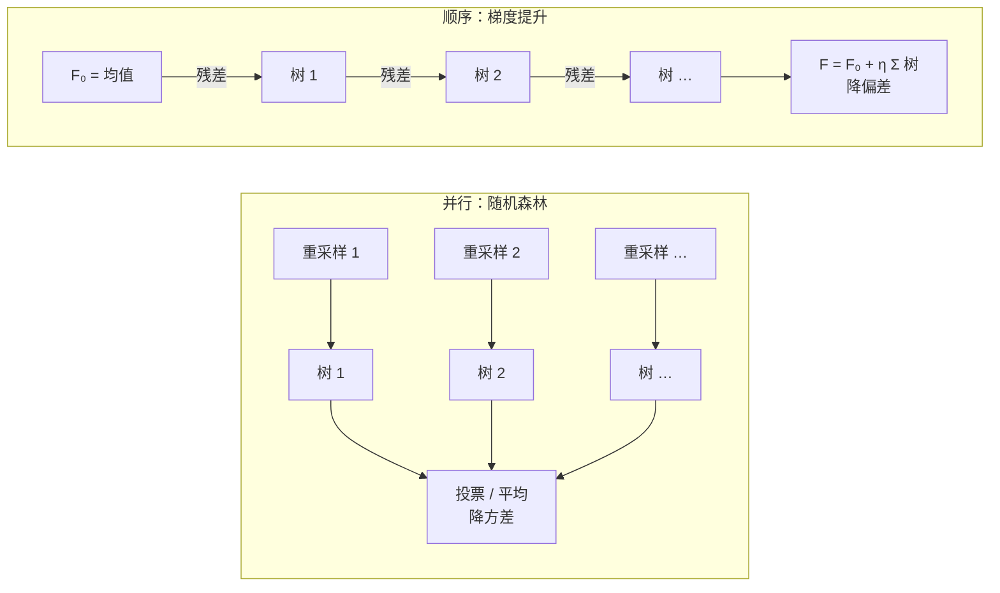

第四篇结尾留下一个问题：决策树方差极大、天生过拟合，怎么办？答案是**很多棵树**。两种组织方式：**随机森林**并行地训几百棵各不相同的树再投票——第一篇"集成只降方差"的直接应用；**梯度提升**则一棵接一棵地训，每棵树专门修正前面所有树加起来还没解释的部分（残差）。后者是至今表格数据上最强的模型（XGBoost、LightGBM、CatBoost 都是它），也是预训练数据工程里质量分类器的常用工具之一。最后算一笔账：给 15T token 打质量分，为什么用这些小模型而不是 LLM 自己。

全篇的核心问题是：

> **很多棵都过拟合的树平均起来为什么反而不过拟合？[^q0] 梯度提升"逐棵拟合残差"到底在做什么，为什么叫"梯度"？[^q1] 预训练数据过滤为什么用 fastText 与 GBDT 而不是 LLM？[^q2]**

## 一、总览

### 1. 两种集成、一笔账

本文按"并行集成 → 顺序集成 → 它们在 LLM 工作里的位置"组织：


```mermaid
%% 图：两种集成方式：并行（bagging / 随机森林）与顺序（梯度提升）
flowchart LR
    subgraph P["并行：随机森林"]
        direction TB
        D1[重采样 1] --> T1[树 1]
        D2[重采样 2] --> T2[树 2]
        D3[重采样 …] --> T3[树 …]
        T1 & T2 & T3 --> V[投票 / 平均<br/>降方差]
    end
    subgraph S["顺序：梯度提升"]
        direction LR
        F0["F₀ = 均值"] -->|残差| G1[树 1]
        G1 -->|残差| G2[树 2]
        G2 -->|残差| G3[树 …]
        G3 --> F["F = F₀ + η Σ 树<br/>降偏差"]
    end
```

| 概念 | 一句话 | 本文里的数字 |
|---|---|---|
| bagging | 重采样训很多棵树，平均 | 一棵树测试 0.826 → 200 棵 0.905；预测方差 0.094 → 0.007 |
| 随机森林 | bagging + 每个节点只看部分特征 | 树间相关 0.59 → 0.53，测试 0.904 → 0.918 |
| 梯度提升 | 每棵树拟合前面的残差 | 3 棵深度 1 的树：MSE 0.211 → 0.070；手写 15 行与 scikit-learn 同量级 |
| 学习率 × 棵数 | 小步多棵更稳 | 学习率 1.0 第 24 棵到顶后下滑；0.1 到 0.915 |
| 特征重要性 | 每个特征贡献的不纯度下降 | 乳腺癌 30 个特征前 6 个占 91% |
| 算力账 | 给 15T token 打分 | 8B 模型 = 训练算力的 1/3；线性模型 0.004% |
| 方差公式 | $$\rho\sigma^2 + (1 - \rho)\sigma^2 / B$$：$$B$$ 再大也压不掉 $$\rho\sigma^2$$ | $$m$$ = 20 → 4：$$\rho$$ 0.057 → 0.028，1000 棵的方差 0.0085 → 0.0033 |
| 二分类 boosting | 树拟合 $$y - p$$，累加的是 logit，最后才 sigmoid | 4 个点手算 $$F = \pm 2 \to \pm 3.135$$；直接累加概率 48% 的点越出 [0, 1] |
| 早停与划分 | 轮数来自独立验证集；OOB 只是随机留出 | 群组数据 OOB 1.000 vs 全新来源 0.755 |
| 棵数的代价 | 准确率饱和、代价线性 | 100 → 3000 棵：准确率 −0.001，训练 ×26、模型 ×30 |

Table: 集成学习的概念与本文里的数字

### 2. 来龙去脉：从"一棵树不稳"到 Kaggle 的默认武器

| 年 | 谁 | 当时的问题 | 留下的东西 |
|---|---|---|---|
| 1984 | Breiman 等，CART | 单棵决策树能解释、但换几个训练点结构就全变（方差大） | 树成为后面一切集成的基本单元 |
| 1995–1997 | Freund & Schapire，AdaBoost | 能不能把很多"只比瞎猜好一点"的弱分类器合成一个强的 | **boosting**：顺序训练，每一轮加重上一轮分错的样本——第一个实用的"逐轮修正" |
| 1996 | Breiman，bagging | 树太不稳，怎么让它稳 | 重采样训很多棵取平均，方差降、偏差不变（第二章） |
| 2001 | Breiman，随机森林 | bagging 的树太像，平均效果有限 | 每个节点只看随机一部分特征，让树彼此不像（第三章）<br/>袋外估计<br/>特征重要性 |
| 1999–2001 | Friedman，Gradient Boosting Machine | AdaBoost 为什么有效、能不能推到任意损失 | 把 boosting 解释成**函数空间里的梯度下降**：每棵树拟合负梯度（第四章）；换 loss 只换梯度 |
| 2014–2016 | Chen & Guestrin，XGBoost | Higgs 玻色子等 Kaggle 比赛，GBM 太慢 | 二阶近似、正则、列采样、并行——2015 年 Kaggle 获胜方案里 17/29 用了它（第五章） |
| 2017–2018 | LightGBM（微软）、CatBoost（Yandex） | 亿级样本、高基数类别特征 | 直方图分桶、叶子优先生长；类别特征的有序目标编码 |
| 2022 | Grinsztajn 等，《Why do tree-based models still outperform deep learning on tabular data?》 | 深度学习横扫图像与文本，表格数据上呢 | 45 个数据集系统比较：中等规模表格数据上树的集成仍然领先（第六章） |

Table: 集成方法的来历

一条线看下来：**bagging 和 boosting 解决的是两个不同的病**。单棵树方差大——bagging 用"平均"治它；单个弱模型偏差大——boosting 用"逐轮修正"治它。第一篇的偏差-方差分解在这里不是理论装饰，它就是这两族方法的分界线。它们今天的位置：任何表格数据问题（风控、推荐排序、广告点击率、预训练数据质量过滤）的第一个强基线都是梯度提升树，第九章的案例是它最标准的一个考题。什么时候不该用：输入是图像、语音、原始文本这种要从像素 / 波形 / 字符里学特征的数据——树只会在给定的列上切，不会造特征，这是深度学习的地盘。

### 3. 本文的章节安排

| 章 | 主题 | 内容 |
|---|---|---|
| 二 | bagging | 一棵树 vs 很多棵<br/>方差降了多少<br/>棵数曲线 |
| 三 | 随机森林 | 再加一层随机：只看部分特征<br/>树越不像，平均越有效<br/>方差公式 $$\rho\sigma^2 + (1 - \rho)\sigma^2/B$$ 与实测<br/>袋外估计；OOB 处理不了群组与时间泄漏 |
| 四 | 梯度提升 | 4 个点手算两步<br/>一步一步拟合残差（八张图）<br/>为什么叫"梯度"<br/>15 行实现对 scikit-learn<br/>走一轮二分类：$$y - p$$、牛顿叶子值、累加 logit（4 个点手算 + 乳腺癌对照 + 反例） |
| 五 | 调参 | 学习率 × 棵数<br/>深度<br/>XGBoost / LightGBM / CatBoost 各改了什么<br/>早停的验证集从哪来<br/>「森林不用调参」「树越多越好」的条件与代价 |
| 六 | 特征重要性与表格数据 | 重要性怎么算；表格数据上 GBDT vs 神经网络 |
| 七 | 数据质量分类器的算力账 | 15T token 打分：8B 是 1/3、线性模型几乎为零<br/>两级做法<br/>fastText 的形态 |
| 八 | 小分类器带回来的老问题 | 分布偏移、系统性误杀、阈值 |
| 九 | 案例：人口普查收入预测 | 48,842 人、14 个特征的真实表格：逻辑回归 → 一棵树 → 随机森林 → 梯度提升，AUC 0.905 → 0.772 → 0.917 → 0.930<br/>特征重要性怎么审计<br/>学习率 × 轮数的实物<br/>早停轮数来自哪份数据；棵数的收益与代价 |
| 十 | 本文小结 |  |
| 十一 | 自测 | 八道题 |

Table: 本文的章节安排

## 二、bagging：很多棵树平均

### 1. 一棵树 vs 很多棵

第四篇的表格数据上一棵不限深度的树：训练 1.000、测试 0.826。**bagging**（bootstrap aggregating）：从训练集里**有放回地**抽同样多的样本，训一棵树；重复 $$B$$ 次；预测时 $$B$$ 棵树投票。

"有放回地抽"（**bootstrap** 重采样）是什么意思：训练集有 5 个样本 {1, 2, 3, 4, 5}，抽 5 次、每次抽完放回去再抽，可能得到 {3, 1, 3, 5, 2}——样本 3 被抽到两次、样本 4 一次都没抽到。每个样本每次被抽到的概率是 $$1/n$$，$$n$$ 次都没被抽到的概率是 $$(1 - 1/n)^n$$，$$n$$ 大时趋于 $$1/e = 0.37$$——所以每棵树大约只见过 63% 的不同样本，另外 37% 对它来说是"没见过的"。这样得到的 $$B$$ 份数据每份都略有不同，训出的 $$B$$ 棵树也就略有不同——这正是我们要的。


| 棵数 | 1 | 2 | 5 | 10 | 20 | 50 | 100 | 200 |
|---|---:|---:|---:|---:|---:|---:|---:|---:|
| 测试准确率 | 0.829 | 0.841 | 0.870 | 0.886 | 0.899 | 0.901 | 0.905 | 0.905 |

Table: bagging 测试准确率随棵数的变化

每一棵树的训练准确率仍是 100%（各自背下了自己那份重采样数据），但 200 棵投票后测试从 0.83 升到 0.90。

### 2. 降的是方差

为什么？第一篇的分解：一棵树偏差小（容量够）、**方差大**（换几个训练点结构就变）。第一篇第六章那个骰子的比喻：一个骰子的结果在 1–6 乱跳，20 个骰子的平均稳稳落在 3.5 附近——平均 $$B$$ 个方差为 $$\sigma^2$$ 的**独立**估计，方差变成 $$\sigma^2 / B$$。树之间不完全独立（它们的重采样数据有大量重叠，像 20 个被胶水粘在一起的骰子），降不到 $$1/B$$，但降得很多。直接量一下——换 20 批训练数据，看模型对测试样本预测概率的方差：

```text title="单棵树与 bagging 的预测方差"
换 20 批训练数据：单棵树预测概率的方差 0.094；50 棵 bagging 的 0.007
```

方差降到 1/13。偏差没有变——每棵树仍是不限深度的树，平均之后能表达的边界形状与单棵树一样（右图边界仍是横竖线段拼的）。**集成不改变模型的表达能力，只让它稳定**。

## 三、随机森林

### 1. 再加一层随机

bagging 的树彼此还是太像：数据有 20 个特征，其中几个特别强，每棵树的根节点几乎都选它们切，树的上半部分长得差不多。**随机森林**（random forest）在每个节点只允许从**随机抽的 $$m$$ 个特征**里选切分（默认 $$m = \sqrt{d}$$），逼树走不同的路：

| 每个节点可选的特征数 $$m$$ | 测试准确率 | 树之间预测的平均相关 |
|---:|---:|---:|
| 20（= bagging） | 0.904 | 0.593 |
| 10 | 0.917 | 0.581 |
| 4（默认 $$\sqrt{20}$$） | **0.918** | 0.530 |
| 2 | 0.909 | 0.477 |
| 1 | 0.895 | 0.374 |

Table: 随机森林每节点可选特征数对准确率与树相关性的影响

$$m$$ 越小，树彼此越不像（相关从 0.59 降到 0.37），平均后方差降得越多——但 $$m$$ 太小每棵树本身太弱（连有用的特征都常抽不到），偏差升上来。$$\sqrt{d}$$ 附近最好。相关低的估计平均起来方差降得多，这是随机森林比纯 bagging 好的全部理由。

### 2. 方差公式：$$B$$ 再大也压不掉 $$\rho\sigma^2$$

把"相关低的估计平均起来方差降得多"写成公式。$$B$$ 棵树的预测 $$h_1(x), \ldots, h_B(x)$$ **同分布**（都是"在一份 bootstrap 样本上、按同一算法长出来的树"），各自方差 $$\sigma^2$$，任意两棵的相关系数都是 $$\rho$$。平均值的方差：

$$
\operatorname{Var}\Big(\frac{1}{B}\sum_{b=1}^{B} h_b\Big)
= \frac{1}{B^2}\Big[\underbrace{B\,\sigma^2}_{\text{对角}} + \underbrace{B(B-1)\,\rho\sigma^2}_{\text{两两协方差}}\Big]
= \rho\sigma^2 + \frac{1 - \rho}{B}\,\sigma^2
$$

- $$\sigma^2$$：一棵树预测的方差——换一份训练数据、换一个随机种子，它的输出跳多少；
- $$\rho$$：两棵树预测的相关——它们一起跳的程度；
- $$B$$：棵数。

读它：第二项随 $$B$$ 消失，第一项 $$\rho\sigma^2$$ 与 $$B$$ 无关。所以**加树只能压掉 $$(1 - \rho)\sigma^2 / B$$，剩下的 $$\rho\sigma^2$$ 只能靠降 $$\rho$$**——这就是"每个节点只看 $$m$$ 个特征"存在的理由：bagging 只动数据，$$\rho$$ 由数据决定；随机特征选择动的是算法，直接把 $$\rho$$ 往下拉。为什么棵数再多也到不了 $$\sigma^2 / B$$？[^q3] 公式成立的条件也写清楚：各棵树同分布（bootstrap + 同一算法保证）、两两相关相同（随机森林里对称地成立）；它说的是**方差**，偏差一项没碰——$$m$$ 太小单棵树变弱是偏差在升，公式看不见。

实测一遍，把 $$\sigma^2$$、$$\rho$$ 都量出来：从同一个分布抽 50 份训练集，每份上训几对只差随机种子的树（量 $$\sigma^2$$ 与 $$\rho$$）和一片 $$B$$ 棵的森林（量实际方差），固定 300 个测试点：

```text title="方差公式 ρσ² + (1 − ρ)σ²/B：m 与 B 变化时的公式值与实测值"
从同一个分布抽 50 份训练集（各 1000 个样本），固定 300 个测试点；每份上训 5 对只差随机种子的树 (h, h′) 和一片 B 棵的森林
  m     单棵树方差 σ²      两棵树相关 ρ   公式 B=100   实测 B=100   公式 B=∞ (ρσ²)  实测 B=1000      森林测试准确率
 20       0.1315        0.057     0.0087     0.0096         0.0075     0.0085        0.839
  4       0.1432        0.028     0.0054     0.0046         0.0040     0.0033        0.858
  1       0.1790        0.008     0.0032     0.0036         0.0015     0.0020        0.841
m = 4 时手算：ρσ² + (1 − ρ)σ²/B = 0.028×0.1432 + 0.972×0.1432/100 = 0.0040 + 0.00139 = 0.0054
    B   公式 (m=4)   实测 (m=4)    训练 50 片森林
    1     0.1432     0.1484         0.7s
   10     0.0179     0.0172         2.9s
  100     0.0054     0.0046         7.7s
 1000     0.0041     0.0033        68.5s
条件读法：方差公式要求各棵树同分布（bootstrap + 同一算法保证）、ρ 是任意两棵树的相关；B → ∞ 只能压掉 (1 − ρ)σ²/B，剩下的 ρσ² 只能靠降 ρ——这就是每个节点只看 m 个特征的理由；m 太小单棵树偏差上升，准确率反而掉
ρ 是用 50 份数据 × 5 对树估的，小到 0.0x 时本身带有 ±0.01 量级的抽样误差，所以「公式」列在 m = 4、1 时只能看量级，不能看第四位小数
```

手算 $$m = 4$$ 那行：$$0.028 \times 0.1432 + 0.972 \times 0.1432 / 100 = 0.0040 + 0.0014 = 0.0054$$，实测 0.0046，同一量级；$$B$$ 从 100 加到 1000，实测只从 0.0046 降到 0.0033，再加也只能逼近 $$\rho\sigma^2 \approx 0.004$$。$$m$$ 从 20 降到 4，$$\rho$$ 从 0.057 降到 0.028，1000 棵时的方差从 0.0085 降到 0.0033——这是随机特征选择做的事。$$m = 1$$ 时 $$\rho$$ 更低（0.008）、方差更低（0.0020），但准确率掉回 0.841：单棵树太弱，偏差把方差省下的部分吃掉了。$$\rho$$ 是估出来的，小到 0.0x 时自带 ±0.01 量级的抽样误差，所以"公式"列只能看量级。


### 3. 袋外估计

每棵树的重采样漏掉了约 37% 的样本（**袋外**，out-of-bag），这些样本对这棵树来说就是没见过的数据。用每个样本"没见过它的那些树"来预测它，得到一个不用切验证集的泛化估计：

```text title="随机森林的测试准确率与 OOB 估计"
300 棵、默认 max_features=√20≈4：测试 0.919；袋外（OOB）估计 0.913
```

在信号强、标签噪声小、特征数适中的数据上，随机森林用默认参数（不限深度、叶子 1 个样本、$$m = \sqrt d$$）就能到位，棵数在上一节的 $$1/B$$ 项上多多益善——所以它是"先跑一个看看"的默认模型。两句话各有条件：噪声大、信号稀疏时默认值不是最好的，棵数的收益饱和得很快而代价是线性的，第五章第 4 节实测。

**OOB 诚实的前提是"随机留出"就是对的划分。** 每棵树的 bootstrap 是逐条随机抽的，所以 OOB 等价于一次随机 K 折：某条样本不在这棵树的袋里，但它的"近亲"——同一个用户的另一条记录、同一天前后一分钟的样本——很可能在袋里。OOB 为什么处理不了群组与时间泄漏？[^q4] 两个造出来的反例：400 个"来源"各有 8 条近似重复的记录，按来源切分才是真实的部署场景；一份决策边界随时间旋转 90° 的数据，用前 70% 预测后 30% 才是真实场景：

```text title="OOB、随机 K 折、按群组 / 时间划分、真实留出：两份数据上的准确率"
群组数据（400 个来源 × 8 条近似重复，前 300 个来源训练）：OOB 1.000，随机 5 折 1.000，按来源分组 5 折 0.860，100 个全新来源 0.755
时间漂移数据（边界随时间转 90°，前 70% 训练）：OOB 0.896，打乱 5 折 0.893，按时间向前 5 折 0.879，之后 30% 0.861
OOB 只是「每棵树没抽到的样本」——抽样是逐条随机的，同来源的另一条、同一时刻前后的样本仍在袋内；它对随机划分诚实，对群组与时间泄漏和随机 K 折一样乐观
```


群组数据上 OOB 与随机 K 折都报 1.000，真实的新来源只有 0.755——差的 0.245 全是泄漏：树"没见过"这条记录，但见过它的 7 个近亲。按来源分组的 5 折 0.860 接近真实。时间数据上差距小一些（0.896 vs 0.861），方向一样。所以 OOB 替代的是**随机**验证集，不是**正确**的验证集；数据有群组或时间结构时要用 `GroupKFold`、`TimeSeriesSplit` 这类按结构划分的方法（第一篇），OOB 在这里会和随机 K 折一样乐观。

## 四、梯度提升

### 1. 一步一步拟合残差

随机森林的树各自独立。**梯度提升**（gradient boosting）让树**顺序**地工作：第 1 棵树拟合数据，第 2 棵树拟合第 1 棵没拟合好的部分，第 3 棵拟合前两棵加起来还没拟合好的部分……用一个一维回归问题把每一步画出来（用深度 1 的树——只切一刀、预测是一个台阶——最容易看）：


| 树的棵数 | 0 | 1 | 2 | 3 | 50 |
|---|---:|---:|---:|---:|---:|
| 训练 MSE | 0.211 | 0.166 | 0.099 | 0.070 | 0.025 |

Table: 梯度提升训练 MSE 随棵数的下降

先用 4 个点手算两步，看清"拟合残差"是什么意思。四个样本的 $$y = 1, 2, 6, 7$$（按 $$x$$ 从小到大排），学习率暂取 1：

| 步 | 当前预测 $$F$$ | 残差 $$y - F$$ | 这一步的树 $$h$$（深度 1：切一刀、两边各取残差均值） | 训练 MSE |
|---|---|---|---|---:|
| 0 | 均值 4, 4, 4, 4 | −3, −2, 2, 3 | | 6.5 |
| 1 | 1.5, 1.5, 6.5, 6.5 | −0.5, 0.5, −0.5, 0.5 | 前两个 → −2.5，后两个 → +2.5 | 0.25 |

Table: 4 个点的梯度提升手算两步

第 1 棵树不看 $$y$$，只看残差 $$(-3, -2, 2, 3)$$：在中间切一刀，左边残差平均 −2.5、右边 +2.5，就是一个台阶；把台阶加到预测上，MSE 从 6.5 降到 0.25。第 2 棵树面对的是新残差 $$(-0.5, 0.5, -0.5, 0.5)$$，切在哪都只能再降一点——它拟合的是"前一棵树没做完的部分"。学习率 0.5 时第 1 步只加半个台阶（预测 2.75, 2.75, 5.25, 5.25），残差留得多一些，给后面的树慢慢修。

读下排：第 1 棵树面对的是"$$y$$ 减去均值"，它切了一刀把左端那一撮低点分出来；第 2 棵面对的是剩下的残差，它在右边切一刀；每棵树只负责**前面所有树加起来还没解释的部分**。50 个台阶叠出一条曲线。

### 2. 为什么叫"梯度"

写成公式。模型是树的累加：

$$
F_t(x) = F_{t-1}(x) + \eta\, h_t(x), \qquad F_0(x) = \bar y
$$

- $$F_t$$：前 $$t$$ 棵树加起来的预测；
- $$h_t$$：第 $$t$$ 棵树；
- $$\eta$$：学习率——每棵树的贡献乘一个小系数。

第 $$t$$ 棵树该拟合什么？我们想让 loss $$L = \sum_i \ell(y_i, F(x_i))$$ 下降最快。第二篇的梯度下降是"对参数 $$w$$ 求导、沿负梯度走"；这里换一个视角：暂时忘掉树，把模型在 $$n$$ 个训练点上的 $$n$$ 个预测值 $$F(x_1), \ldots, F(x_n)$$ 本身当成 $$n$$ 个可以自由调的参数。loss 对第 $$i$$ 个预测值的导数 $$\partial \ell / \partial F(x_i)$$ 告诉我们：把这个预测值调大一点，loss 会怎么变；沿负梯度 $$-\partial \ell / \partial F(x_i)$$ 调，loss 下降最快。平方损失 $$\ell = \frac{1}{2}(y - F)^2$$ 的负梯度是

$$
-\frac{\partial \ell}{\partial F(x_i)} = y_i - F(x_i) = \text{残差}
$$

所以"拟合残差"就是"用一棵树去逼近负梯度"，再沿这个方向走一步（乘 $$\eta$$）——**这是第二篇的梯度下降，只不过参数不是一个向量 $$w$$，而是函数 $$F$$ 本身**，每一步的"更新量"用一棵树表示。换 loss 只换负梯度：分类用第三篇的交叉熵，负梯度是 $$y - p$$（标签减预测概率——又是那个形式），树拟合它，累加的是 [logit](# "tip: 过 sigmoid 之前的那个数 z = wᵀx + b，也叫「对数几率」log(p / (1 − p))。梯度提升做分类时，各棵树的输出加起来是 z，最后过一次 sigmoid 才是概率")。

### 3. 十五行实现

```python title="fit_gbdt：十五行实现"
def fit_gbdt(X, y, n_trees=100, lr=0.1, max_depth=2):
    f0 = y.mean()                                                  # ① 初始预测：常数（均值）
    pred = np.full(len(y), f0)
    trees = []
    for _ in range(n_trees):
        resid = y - pred                                           # ② 残差 = 平方损失的负梯度 −∂L/∂F
        t = DecisionTreeRegressor(max_depth=max_depth, random_state=0).fit(X, resid)   # ③ 用一棵浅树拟合残差
        pred += lr * t.predict(X)                                  # ④ 加进去，乘学习率
        trees.append(t)
    return f0, trees

def predict_gbdt(model, X, lr=0.1):
    f0, trees = model
    return f0 + lr * sum(t.predict(X) for t in trees)              # ⑤ 预测 = 初值 + 所有树的累加
```

500 个样本、4 个特征、带交互项的非线性回归：

```text title="手写 GBDT 与 sklearn 的结果"
手写 GBDT（300 棵深度 3、lr 0.1）测试 MSE 0.4101；sklearn 0.4090
对比：一棵深度 8 的回归树 1.7368
```

手写版与 `GradientBoostingRegressor` 同量级（差别来自树切分平局时的处理），都比一棵深树好 4 倍。

### 4. 走一轮二分类：树拟合 $$y - p$$，累加的是 logit

上面都是平方损失。真正把"换 loss 只换负梯度"走一遍：二分类用第三篇的 log-loss，$$\ell = -[y \log p + (1 - y)\log(1 - p)]$$，但树的输出是实数，不能直接当概率——所以模型累加的是 **logit** $$F$$，概率是 $$p = \sigma(F) = 1 / (1 + e^{-F})$$。对 $$F$$ 求导（链式法则，$$\partial p / \partial F = p(1 - p)$$）：

$$
\frac{\partial \ell}{\partial F} = -\Big[\frac{y}{p} - \frac{1 - y}{1 - p}\Big] p(1 - p) = p - y,
\qquad
\frac{\partial^2 \ell}{\partial F^2} = p(1 - p)
$$

负梯度 $$y - p$$，和上一节的残差一个形状。但有一处新东西：树拟合 $$y - p$$ 只决定了叶子的**划分**，叶子的**值**用一步牛顿法——负梯度之和除以二阶导之和：

$$
\gamma_j = \frac{\sum_{i \in \text{叶 } j} (y_i - p_i)}{\sum_{i \in \text{叶 } j} p_i (1 - p_i)}
$$

平方损失下二阶导恒为 1，这一步退化成"叶子取残差均值"，所以上一节看不见它。初值 $$F_0 = \log\frac{\bar y}{1 - \bar y}$$（先验概率的 logit）。为什么累加 logit 而不是概率？[^q5]

**4 个点手算**（学习率 1）：$$x = 1, 2, 3, 4$$，$$y = 0, 0, 1, 1$$。$$\bar y = 0.5$$，$$F_0 = \log(0.5 / 0.5) = 0$$，$$p = 0.5$$，负梯度 $$y - p = (-0.5, -0.5, 0.5, 0.5)$$。深度 1 的树切在中间；左叶 $$\gamma = (-1) / (2 \times 0.25) = -2$$，右叶 $$+2$$；$$F = (-2, -2, 2, 2)$$，$$p = \sigma(\pm 2) = 0.119 / 0.881$$。第 2 棵：$$y - p = (\mp 0.119)$$，$$\sum p(1 - p) = 2 \times 0.119 \times 0.881 = 0.210$$，$$\gamma = \mp 0.238 / 0.210 = \mp 1.135$$，$$F = \mp 3.135$$，$$p = 0.042 / 0.958$$。注意 $$F$$ 从 $$\pm 2$$ 加到 $$\pm 3.135$$ 是**加法**，概率从 0.881 到 0.958 不是。

```python title="fit_gbdt_logloss：二分类梯度提升，每轮五个动作"
def sigmoid(z):
    return 1.0 / (1.0 + np.exp(-z))


def fit_gbdt_logloss(X, y, n_trees=100, lr=0.1, max_depth=2):
    """y ∈ {0, 1}。loss = −[y log p + (1 − y) log(1 − p)]，p = sigmoid(F)；树拟合负梯度 y − p，叶子值用一步牛顿法。"""
    p0 = y.mean()
    # !ref init-logit
    f0 = np.log(p0 / (1 - p0))
    F = np.full(len(y), f0)
    trees = []
    for _ in range(n_trees):
        # !ref prob-from-logit
        p = sigmoid(F)
        # !ref neg-grad
        g = y - p
        t = DecisionTreeRegressor(max_depth=max_depth, random_state=0).fit(X, g)
        leaf = t.apply(X)
        for j in np.unique(leaf):
            mask = leaf == j
            # !ref newton-leaf
            t.tree_.value[j, 0, 0] = g[mask].sum() / (p[mask] * (1 - p[mask])).sum()
        # !ref add-logit
        F += lr * t.predict(X)
        trees.append(t)
    return f0, trees
```

- [初值](#init-logit)：先验概率的 logit，不是先验概率本身；
- [logit → 概率](#prob-from-logit)：每轮开头过一次 sigmoid，只为算梯度；
- [负梯度](#neg-grad)：$$y - p$$，树去拟合它；
- [牛顿叶子值](#newton-leaf)：把树的叶子值从"$$y - p$$ 的均值"改写成 $$\sum(y - p) / \sum p(1 - p)$$——XGBoost "二阶近似"的最简形式；
- [累加](#add-logit)：加到 $$F$$ 上，不是加到 $$p$$ 上。

跑一遍：4 个点与手算对；乳腺癌数据（569 例、30 个特征）上与 `GradientBoostingClassifier` 对照；再做一个反例——把每棵树的输出直接加到概率上：

```text title="二分类 boosting：手算对照、与 sklearn 对照、直接累加概率的反例"
4 个点 y = [0, 0, 1, 1]，学习率 1：F₀ = log(p̄/(1 − p̄)) = log(0.5/0.5) = 0.000
第 1 棵树后：F = [-2.0, -2.0, 2.0, 2.0]，p = sigmoid(F) = [0.119, 0.119, 0.881, 0.881]，log-loss 0.1269
第 2 棵树后：F = [-3.135, -3.135, 3.135, 3.135]，p = sigmoid(F) = [0.042, 0.042, 0.958, 0.958]，log-loss 0.0426
手算第 1 棵：p = 0.5，g = y − p = [−0.5, −0.5, 0.5, 0.5]，切在中间；左叶 Σg/Σp(1−p) = −1/(2×0.25) = −2，右叶 +2 → F = [−2, −2, 2, 2]，p = 0.119 / 0.881
第 2 棵：g = [−0.119, −0.119, 0.119, 0.119]，Σp(1−p) = 2×0.119×0.881 = 0.210，叶子值 ∓0.238/0.210 = ∓1.135 → F = ∓3.135，p = 0.042 / 0.958
乳腺癌数据、100 棵深度 2、lr 0.1：手写与 sklearn GradientBoostingClassifier 的 logit 最大差 6.8e-01，概率最大差 9.1e-02
测试 log-loss：手写 0.1408，sklearn 0.1406；准确率 0.936 / 0.936
反例——直接累加概率 p ← p + η·tree(y − p)：100 棵后 48% 的测试点「概率」跑出 [0, 1]（最小 -0.15，最大 1.11）；裁剪到 [0, 1] 后 log-loss 0.1375 vs 累加 logit 的 0.1408
在这份干净的数据上两者的损失差不多——直接累加概率的问题不是「准确率低」，而是输出不再是概率：一半样本越界、越界的点梯度 y − p 仍非零会继续推、也没有 p(1 − p) 这个二阶量可用
累加 logit：F 可以是任何实数，sigmoid 最后才把它压回 (0, 1)；每棵树的叶子值由负梯度与二阶导 p(1 − p) 一起决定，这就是 XGBoost「二阶近似」的最简形式
```


与 sklearn 的对照：测试 log-loss 0.1408 vs 0.1406、准确率相同，但逐点 logit 最大差 0.68——两边的树在切分并列时选了不同的特征，和上一节回归版的"同量级、不逐点相等"一样，对齐条件是"同一棵树"，本文没有去复现它的随机特征顺序。反例的读法要诚实：在这份干净的数据上，直接累加概率再裁剪，log-loss 并不差（0.1375）；它的问题是**输出不再是概率**——48% 的测试点跑到了 [0, 1] 之外（最小 −0.15、最大 1.11），越界的点 $$y - p$$ 仍非零会被继续推，也没有 $$p(1 - p)$$ 这个二阶量可用。累加 logit 则没有这些问题：$$F$$ 可以是任何实数，sigmoid 最后才把它压回 (0, 1)，这就是第 2 节那条脚注"各棵树的输出加起来是 $$z$$，最后过一次 sigmoid 才是概率"的全部内容。

## 五、调参

### 1. 学习率 × 棵数


| 学习率 | 最好测试准确率 | 在第几棵 | 600 棵时 |
|---:|---:|---:|---:|
| 1.0 | 0.898 | 24 | 0.891 |
| 0.3 | 0.914 | 497 | 0.911 |
| 0.1 | **0.915** | 137 | 0.907 |
| 0.03 | 0.911 | 274 | 0.911 |

Table: 学习率与棵数对测试准确率的影响

学习率大：几十棵就到顶，然后开始过拟合下滑（每棵树的修正全额加进去，把噪声也学了）。学习率小：慢，但顶更高、更平。这与第二篇 SGD 的学习率是同一个权衡。实践：学习率 0.05–0.1，棵数用验证集**早停**（第一篇）——scikit-learn 的 `staged_predict`、XGBoost 的 `early_stopping_rounds` 都是为此。

### 2. 三个超参数与三个实现

梯度提升要调的核心是三个：**棵数**（早停定）、**学习率**（0.05–0.1）、**树的深度**（3–8，浅树；每棵树只需要捕捉一点点交互）。再加常用的正则：行采样（每棵树只用部分样本）、列采样（同随机森林）、叶子最少样本数。

| 实现 | 主要改动 | 什么时候用 |
|---|---|---|
| XGBoost（2014） | 二阶梯度（用 Hessian 定叶子值）、正则化的目标函数、缺失值自动处理、并行找切分 | 通用默认 |
| LightGBM（2017） | 直方图切分（特征分桶，快几倍）、按叶子生长（leaf-wise）、类别特征原生支持 | 大数据、特征多 |
| CatBoost（2018） | 有序目标编码处理类别特征（防泄漏）、对称树 | 类别特征多、不想调参 |

Table: XGBoost、LightGBM、CatBoost 三个实现

三者的模型是同一个——树的累加、拟合负梯度——差别在速度与工程细节。会用一个、看懂上面三个超参数即可。

### 3. 早停：轮数来自哪份数据

"棵数用验证集早停"里的验证集是哪一份？早停选出来的轮数能不能用测试集来挑？[^q6] 原则只有一条：**挑轮数也是在拟合**，用哪份数据挑，哪份数据的分数就不再是泛化估计。第二章那份表格数据，把训练集再切 20% 做验证：

```text title="早停：用验证集挑轮数 vs 在测试集上挑轮数；sklearn 内置早停"
训练集再切 20% 做验证：验证集最好在第 79 棵（验证 0.906），此时测试 0.905；600 棵全用时测试 0.907
若直接在测试集上挑轮数：第 257 棵、测试 0.915——比用验证集挑高 0.010，这部分是「在测试集上调参」的乐观偏差，不是泛化
sklearn 内置早停（n_iter_no_change=20, validation_fraction=0.2）：停在第 180 棵，测试 0.907；HistGradientBoosting 的 early_stopping='auto' 只在 n > 10000 时自动开启
```

验证集挑在第 79 棵、测试 0.905；在测试集上挑能挑到第 257 棵、0.915——高出的 0.010 是"在测试集上调参"的乐观偏差，不是模型变好了。库的内置早停（`GradientBoostingClassifier(n_iter_no_change=20, validation_fraction=0.2)`）自己从训练集里切验证集，停在 180 棵、测试 0.907——它不碰测试集。两个库默认值要记住：`GradientBoostingClassifier` 默认**不**早停（`n_iter_no_change=None`）；`HistGradientBoostingClassifier` 的 `early_stopping='auto'` 只在样本数 > 10,000 时自动开启（scikit-learn 1.9 源码里就是 `n_samples > 10_000`），小数据上要自己设 `True`。验证集的切法同第三章第 3 节：有群组、时间结构就按结构切，否则早停挑到的是泄漏出来的轮数。

### 4. "森林不用调参"、"树越多越好"的条件与代价

第三章说随机森林是"先跑一个看看"的默认模型，这里把两句常见说法的条件补上。**树越多越好**：只在第三章第 2 节的 $$(1 - \rho)\sigma^2 / B$$ 那一项上成立，而那一项在几百棵后已经小于 $$\rho\sigma^2$$；训练时间、预测时间、内存都随棵数**线性**增长：

```text title="随机森林：棵数的收益与代价；标签噪声与稀疏信号下默认参数的表现"
   棵数    测试准确率      训练  预测 1500 点      节点总数 pickle 大小
   10    0.889   0.03s      0.01s     5,916     0.5MB
   50    0.915   0.10s      0.01s    29,936     2.4MB
  100    0.918   0.20s      0.02s    60,166     4.8MB
  300    0.918   0.57s      0.05s   179,534    14.5MB
 1000    0.917   1.65s      0.15s   597,182    48.1MB
 3000    0.917   5.17s      0.44s 1,790,774   144.2MB
100 → 3000 棵：准确率 -0.001，训练时间 ×26、模型 ×30——「越多越好」只在方差项上成立（第 9 节的 1/B 项），代价是线性的
标签噪声 30%（flip_y=0.3）：min_samples_leaf=1: 0.813  min_samples_leaf=5: 0.811  min_samples_leaf=20: 0.798  min_samples_leaf=50: 0.781
300 个特征只有 5 个有信息：max_features=sqrt: 0.858  max_features=60: 0.867  max_features=150: 0.892  max_features=None: 0.907
默认值（不限深度、叶子 1 个样本、m = √d）在信号强、噪声小、特征数适中时够用；噪声大要加 min_samples_leaf，有信息特征稀疏时 m = √d 太小，每次分裂常抽不到有用特征
```


100 棵到 3000 棵，准确率 −0.001，训练 ×26、模型 ×30（144 MB、179 万个节点）。**不用调参**的条件是"信号强、噪声小、特征数适中"：标签噪声 30% 时默认 `min_samples_leaf=1` 0.813，加大叶子最小样本数在这份数据上反而降（0.781）——噪声大时该调的是什么要看数据，但"默认一定够"不成立；300 个特征只有 5 个有信息时，默认 $$m = \sqrt{300} \approx 17$$ 每次分裂常抽不到有用特征，0.858，`max_features=None` 0.907——这时随机特征选择在降 $$\rho$$ 的同时把偏差抬得更多。所以更准确的说法是：随机森林**对超参不敏感的范围很宽**，默认值在常见表格数据上够用；但棵数按"验证分数饱和 + 预测预算"定，$$m$$ 与叶子大小在噪声大、信号稀疏时要看验证集。

## 六、特征重要性与表格数据

### 1. 特征重要性

树模型附带一个很有用的副产品：每个特征在所有分裂里贡献了多少不纯度下降（第四篇的 Gini），归一化后就是**特征重要性**。乳腺癌数据上：


```text title="乳腺癌数据上的特征重要性"
测试准确率 0.942
  worst perimeter            0.506
  worst concave points       0.161
  mean concave points        0.134
  worst radius               0.050
  worst texture              0.029
  mean texture               0.026
前 6 个特征占重要性 91%
```

30 个特征里 6 个占了 91%。数据质量打分里这张表告诉你"困惑度、长度、符号比例、重复率"哪个在起作用——这是数据工程师调过滤器时最常看的东西。（它有偏向：高基数的特征、相关特征之间会分走重要性；更可靠的是 permutation importance——打乱一个特征看分数掉多少。）

### 2. 表格数据为什么是树的天下

在**表格数据**上——特征是数值与类别、样本几万到几千万、特征之间没有图像 / 文本那种局部结构——GBDT 至今是最强的默认选择。同一份表格数据、都不调参：

| 模型 | 测试准确率 | 训练耗时 |
|---|---:|---:|
| 梯度提升 300 棵 | 0.913 | 3.1 s |
| 随机森林 300 棵 | **0.919** | 0.3 s |
| MLP 两层 128 | 0.905 | 1.3 s |
| 逻辑回归 | 0.853 | 0.0 s |

Table: 表格数据上各模型不调参的成绩

树对特征的单调变换不敏感（不需要标准化）、天然处理缺失值与类别特征、对无关特征鲁棒、在小数据上不容易过拟合（相对深度网络）；神经网络要调结构、学习率、正则、标准化才能追平，而树两三个参数就到位。LLM 工作里表格数据出现在：数据质量打分（特征是几十个统计量）、实验结果分析（哪些超参数组合好）、线上 A/B 的归因。会用 LightGBM 训一个模型、看特征重要性、调三个超参数即可。

## 七、数据质量分类器的算力账

### 1. 问题

预训练要从几十 T 原始文本里挑出高质量的部分。"高质量"由一个分类器判断——"这段像不像百科 / 教科书"。用什么模型？直觉是"用 LLM 自己判断最准"。算一笔账。

### 2. 账

给 15T token 打分。一个 token 过一个 $$N$$ 参数的模型（前向一次）约 $$2N$$ [FLOP](# "tip: floating-point operation，一次浮点加法或乘法。每个参数对每个 token 贡献一次乘法和一次加法，所以前向约 2N；训练还要反向传播，约是前向的 2 倍，合计约 6N")：8B 模型是 $$1.6 \times 10^{10}$$，乘 15T 个 token 就是 $$2.4 \times 10^{23}$$。训练一个 8B 模型的算力约 $$6ND = 6 \times 8 \times 10^9 \times 15 \times 10^{12} = 7.2 \times 10^{23}$$（$$D$$ 是训练 token 数）：

| 打分模型 | 打分 FLOP | 占训练 8B 模型算力的 |
|---|---:|---:|
| 8B LLM 逐段打分 | $$2.4 \times 10^{23}$$ | **33.3%** ← 不可接受 |
| 1B 小 LLM | $$3.0 \times 10^{22}$$ | 4.2% |
| BERT 级 1 亿参数 | $$3.0 \times 10^{21}$$ | 0.42% |
| fastText / 线性模型 ~1M | $$3.0 \times 10^{19}$$ | 0.004% |

Table: 给 15T token 打分的算力账

**用 8B 模型打分要花训练算力的三分之一。** 换成 1 亿参数的模型是 0.4%，换成线性模型几乎为零。

### 3. 两级做法

所以实际做法是**两级**：用大模型给**一小部分**样本打标（几十万段），拿这些标签训一个小分类器，再用小分类器过全部语料。FineWeb-Edu 用 Llama-3-70B 给 45 万段打"教育价值"分（0–5），训一个小 embedding 模型加线性回归头，再过全部 15T；DCLM 用 fastText 做质量过滤。**不是小模型效果更好，是只有它跑得起**。

### 4. fastText 的形态

fastText 一类文本分类器就是**[词袋](# "tip: bag of words：不管词序，只数每个词出现了几次，一段文本变成一个「词表长度」维的计数向量。词表 5 万就是 5 万维，绝大多数位置是 0（稀疏）")特征 + 线性分类器**：把每个词（和相邻两个词组成的 bigram）映射成一个向量，整段文本的向量是它们的平均，上面接一个第三篇的 softmax 回归。scikit-learn 里等价的写法：

```python title="fastText 形态的 scikit-learn 等价写法"
vec = TfidfVectorizer(sublinear_tf=True, min_df=2, ngram_range=(1, 2))   # ① 每段文本 → 几万维的词 / 词对计数（稀疏），TF-IDF 加权
Xtr = vec.fit_transform(train_texts)
clf = LogisticRegression(max_iter=3000, C=5).fit(Xtr, train_labels)     # ② 第三篇的逻辑回归 / softmax 回归
```

`TfidfVectorizer` 做的是词袋计数再加权：一个词在这段里出现越多（TF，词频）权重越高，但在所有文本里都常见的词（"的"、"是"，IDF 低）权重被压低；`ngram_range=(1, 2)` 表示除了单个词还数相邻两个词组成的词对。几万个 n-gram 特征的线性模型，几千篇文本训练一秒钟。在"判断这段文本属于哪一类 / 像不像教科书"这件事上，它离 LLM 的差距远小于算力上的差距——第五篇说线性 SVM 活在 fastText 里，就是这里。

## 八、小分类器带回来的老问题

用小分类器过滤万亿 token，经典监督学习的每个问题也一并回来，只是规模大了一万倍：

1. **分布偏移**：训练标签是在几十万段样本上打的，这些样本是否代表全部语料？如果标注样本里没有代码、没有非英语，分类器对它们的判断是随机的（第一篇按组切的教训：验证集要像真实数据）。
2. **系统性误杀**（类别不平衡与偏见）：分类器可能把某种语体——非英语、口语、诗歌、低资源领域——系统性判为低质量。每滤掉一类文本，模型就失去一种能力，而且这个损失在 benchmark 上不一定看得见。
3. **阈值**：分数切在哪里、滤掉多少——精确率与召回率的权衡（第十篇）。FineWeb-Edu 切在 3 分留下约 1.3T token，切在 2 分留下几倍多；这个决定没有标准答案，取决于你有多少数据、模型多大（Chinchilla 的 $$D / N \approx 20$$ 告诉你至少要多少 token）。

数据工程师每天在做的，是经典监督学习在万亿 token 上的工程化——同样的模型、同样的失效方式、同样的评估工具。

## 九、案例：人口普查收入预测——表格数据的标准考题

**问题与数据**：UCI Adult（Census Income）——1994 年美国人口普查抽样 48,842 人，14 个特征，预测**年收入是否超过 5 万美元**（23.9% 是）。它是表格数据分类的标准考题，被几乎每篇集成方法的论文用过。它的"脏"是真实业务里的典型：5 个数值特征（年龄、教育年限、资本收益、资本损失、每周工时）+ 7 个类别特征（工作类别 8 类、婚姻 7 类、职业 14 类、家庭关系 6 类、种族 5 类、性别、国籍 41 类）；工作类别和职业各缺约 2,800 个、国籍缺 857 个。

**思路**：按本篇的顺序——一棵树、一片森林、逐轮修正——在同一份数据上各跑一次，逻辑回归做对照。类别特征两种编码：逻辑回归要 one-hot（7 列变 100 列）、要标准化；树模型用序数编码（每个类别一个整数）直接吃，缺失当成一个类别。指标用 AUC 而不只是准确率——正类只有 24%，全判"≤50K"的准确率已有 76%（第十篇第四章）。

```python title="人口普查收入：两种编码与四个模型"
onehot  = ColumnTransformer([("num", make_pipeline(SimpleImputer(), StandardScaler()), NUM),
                             ("cat", OneHotEncoder(handle_unknown="ignore"), CAT)])        # 逻辑回归用
ordinal = ColumnTransformer([("num", "passthrough", NUM),
                             ("cat", OrdinalEncoder(handle_unknown="use_encoded_value", unknown_value=-1), CAT)])  # 树用
models = [
    ("逻辑回归", make_pipeline(onehot, LogisticRegression(C=1.0, max_iter=2000))),
    ("一棵决策树（不限深度）", make_pipeline(ordinal, DecisionTreeClassifier(random_state=0))),
    ("随机森林（500 棵）", make_pipeline(ordinal, RandomForestClassifier(500, min_samples_leaf=2, n_jobs=-1))),
    ("梯度提升（500 轮，lr 0.05，早停）", make_pipeline(ordinal, HistGradientBoostingClassifier(
        max_iter=500, learning_rate=0.05, early_stopping=True, validation_fraction=0.1))),
]
```

`HistGradientBoostingClassifier` 是 scikit-learn 里 LightGBM 式的实现（直方图分桶），第五章表里"XGBoost / LightGBM 各改了什么"的东西它都有一份；生产里换成 XGBoost / LightGBM 只是换一个 import。

**效果**（测试集 12,211 人）：

| 模型 | 准确率 | AUC | 训练时间 |
|---|---:|---:|---:|
| 基线：全部判 ≤50K | 0.761 | 0.500 | — |
| 逻辑回归（one-hot 后 100 列） | 0.854 | 0.905 | 0.1 s |
| 一棵决策树，不限深度 | 0.820 | 0.772 | 0.1 s |
| 一棵决策树，`max_depth=6` | 0.855 | 0.890 | 0.1 s |
| 随机森林，500 棵 | 0.864 | 0.917 | 1.1 s |
| 梯度提升，默认 100 轮 | 0.874 | 0.929 | 0.7 s |
| 梯度提升，500 轮、lr 0.05、早停（停在 256 轮） | **0.875** | **0.930** | 2.2 s |

Table: 收入预测——从一棵树到一片森林到逐轮修正


读这张表就是读本篇的前四章：

- **一棵不限深度的树是最差的**（AUC 0.772，比逻辑回归低 0.13）——它把 36,000 个训练样本背了下来；限深到 6 层就回到 0.890。这是第二章开头那张"一棵树 vs 很多棵"的真实版。
- **500 棵这样的树平均，AUC 0.917**——每棵都过拟合没关系，bagging 只降方差；随机森林还免费给了一个几乎不用调的模型（这里只设了 `min_samples_leaf=2`）。
- **梯度提升再高一截，0.930**——它不是平均，是逐轮修正上一轮的错（第四章）；256 轮早停，训练 2 秒。在表格数据上这个排序（GBDT > RF > 单树，线性在中间）几乎是定律，第六章的 Grinsztajn 等 2022 在 45 个数据集上验证过。
- **逻辑回归 0.905 不差**——它输给树的 0.025 AUC 主要是特征交互（"已婚 × 高教育 × 高工时"这种组合），树天然会切、线性模型要手工造交互项；但它要 one-hot 出 100 列、要标准化、要补缺失，树模型直接吃原始列。


**特征重要性怎么审计**。第六章说的重要性这里用 permutation 版（把一列打乱后测试 AUC 掉多少，比不纯度版少一层偏向高基数特征的毛病）：资本收益 −0.061、年龄 −0.057、教育年限 −0.031、婚姻状况 −0.026、家庭关系 −0.017 居前；`sex` −0.002、`native-country` 和 `race` −0.0007，几乎不起作用。这张表有两个用途：一是**和常识对**（收入靠资本、年龄、教育，说得通）；二是**审计**——如果 `sex` 或 `race` 排在前面，模型就在学一种不该学的关系，上线前必须处理（去掉这列不够，因为别的列会替它——`relationship` 里的 Husband / Wife 就带着性别）。这是第八章"系统性误杀"的检查手段。

**学习率 × 轮数的实物**（第五章的调参，训练集内切 10% 做验证）：


| 学习率 | 最佳轮数 | 最佳验证 AUC | 第 400 轮 |
|---:|---:|---:|---:|
| 0.3 | 80 | 0.9226 | 0.9123（掉头） |
| 0.1 | 222 | 0.9243 | 0.9224 |
| 0.03 | 400（还没到顶） | 0.9242 | 0.9242 |

Table: 梯度提升的学习率与轮数

学习率大：80 轮到顶，之后每加一棵树都在拟合噪声，AUC 掉头；学习率小：400 轮还在缓升，但更稳。三条线的顶差不到 0.002——这就是第五章的结论"学习率 0.05–0.1 + 早停"在真实数据上的样子：**学习率决定你有多少轮的犯错余地，早停替你找到那一轮**。

**早停的验证集与森林的棵数**：第五章第 3、4 节的两笔账在这份真实数据上再算一遍。早停：训练集里再切 10% 做验证挑轮数，与"直接在测试集上挑"对照；森林：`min_samples_leaf=2`，棵数 50 → 2000：

```text title="Adult：早停轮数来自哪份数据；随机森林棵数的 AUC 与代价"
早停选的轮数来自哪份数据（lr 0.05，最多 1000 轮）
  验证集（训练集内 10%）最佳第 454 轮 → 测试 AUC 0.9297；直接在测试集上挑：第 252 轮、0.9299（高出的 0.0003 是在测试集上调参的乐观偏差）；第 1000 轮 0.9279
  内置早停（validation_fraction=0.1, n_iter_no_change=10）停在第 256 轮，测试 AUC 0.9295——它自己从训练集里切验证集，测试集没有参与

随机森林的棵数：收益与代价（min_samples_leaf=2）
     棵数     AUC    准确率      训练      预测 pickle 大小
     50  0.9155  0.863    0.2s   0.04s      21MB
    100  0.9158  0.864    0.3s   0.05s      41MB
    500  0.9166  0.865    1.4s   0.16s     206MB
   2000  0.9169  0.865    5.1s   0.53s     822MB
  AUC 在几百棵后只在第四位小数上动，训练时间与模型大小随棵数线性涨——「树越多越好」只在方差项上成立，代价是线性的
```

这份数据上验证集挑的轮数（454）与测试集挑的（252）差很远，测试 AUC 却只差 0.0003——学习率 0.05 下第 250 到 1000 轮的曲线几乎是平的（第五章那张学习率 × 轮数图），挑哪一轮都差不多；库的内置早停停在 256 轮、0.9295，没碰测试集。森林 50 棵到 2000 棵 AUC 0.9155 → 0.9169，第三位小数动了 1，训练时间 ×25、模型从 21 MB 到 822 MB——48,842 行表格数据上 2000 棵不限深度的树（叶子 2 个样本）就是这么大，线上部署前这笔账要先算。

**落地还差什么**：这个数据是 1994 年的，所有数字只对 1994 年的美国有效——真正的收入模型每年要重训；`race` / `sex` 这类特征在信贷等受监管场景里不允许进模型，而且要检验模型对不同群体的错误率是否一致（第八章的"系统性误杀"在监管语境里叫公平性）；AUC 0.93 之后要再往上，靠的不是换模型而是**加特征**（家庭收入、居住地、行业）——在表格数据上，梯度提升树已经把"给定这些列能学到的"学完了。

## 十、本文小结

- **bagging**：重采样训很多棵树取平均，一棵树 0.826 → 200 棵 0.905；预测方差 0.094 → 0.007（降 13 倍），偏差不变——集成不改变表达能力，只让它稳定。
- **随机森林** = bagging + 每个节点只在随机的 $$m$$ 个特征里选切分：树越不像（相关 0.59 → 0.53）平均越有效，$$m = \sqrt{d}$$ 最好 0.918；袋外估计免费给一个泛化数字——但它等价于随机 K 折，群组 / 时间泄漏下与随机 K 折一样乐观（群组数据 OOB 1.000 vs 全新来源 0.755）。
- **方差公式** $$\rho\sigma^2 + (1 - \rho)\sigma^2 / B$$：加树只能压掉第二项，$$\rho\sigma^2$$ 只能靠降 $$\rho$$——随机特征选择的理由；$$m$$ 20 → 4，$$\rho$$ 0.057 → 0.028，1000 棵的方差 0.0085 → 0.0033；$$m = 1$$ 方差更低但偏差升、准确率掉。
- **二分类 boosting**：负梯度 $$y - p$$、二阶导 $$p(1 - p)$$，叶子值 $$\sum(y - p) / \sum p(1 - p)$$，累加的是 logit，最后才 sigmoid；4 个点手算 $$F = \pm 2 \to \pm 3.135$$；直接累加概率 48% 的点越出 [0, 1]。
- **早停与划分**：挑轮数也是拟合，验证集挑 0.905、测试集挑 0.915，差的 0.010 是乐观偏差；`HistGradientBoosting` 的早停只在 $$n > 10{,}000$$ 时自动开。**树越多越好**只在 $$1/B$$ 项上成立：100 → 3000 棵准确率 −0.001、训练 ×26、模型 ×30；**不用调参**的条件是信号强、噪声小、特征数适中。
- **梯度提升**：$$F_t = F_{t-1} + \eta h_t$$，每棵树拟合前面的残差——残差就是平方损失的负梯度，所以它是**在函数空间里做梯度下降**；换 loss 只换负梯度（分类：$$y - p$$）。15 行手写与 scikit-learn 同量级，比一棵深树好 4 倍。
- **调参**：学习率 0.05–0.1 + 棵数早停（学习率 1.0 第 24 棵到顶后下滑）+ 浅树 3–8；XGBoost / LightGBM / CatBoost 是同一个模型的三个工程实现。
- **特征重要性**是调过滤器时最常看的表（乳腺癌 6/30 占 91%）；**表格数据**上树的集成默认最强（RF 0.919 vs 不调参的 MLP 0.905），不用标准化、鲁棒、两三个参数到位。
- **算力账**：给 15T token 打分，8B 模型 = 训练算力的 1/3、线性模型 0.004% → **两级做法**：大模型标几十万段、小分类器过全部（FineWeb-Edu、DCLM）。fastText = 词袋 + 线性分类器。小分类器带回来的老问题：分布偏移、系统性误杀、阈值。
- **案例**：Adult 48,842 人收入预测，AUC 一棵树 0.772 → 随机森林 0.917 → 梯度提升 0.930（逻辑回归 0.905）；permutation 重要性做审计（`sex` / `race` 接近零）；学习率 0.3 第 80 轮掉头、0.03 到 400 轮还在升，早停替你选轮数。

配套代码：本文全部数字与图由 [`classical-ml/06_ensembles_and_gradient_boosting.py`](https://github.com/arganzheng/ai-learning-labs/blob/main/classical-ml/06_ensembles_and_gradient_boosting.py)（`bagging` / `forest` / `boost_steps` / `boost_hand` / `lr` / `importance` / `tabular` / `budget` / `variance` / `logit` / `early` / `forest_cost` 十二个子实验）与 [`case_06_adult_income.py`](https://github.com/arganzheng/ai-learning-labs/blob/main/classical-ml/case_06_adult_income.py)（第九章案例，首次运行下载 4 MB）产生，CPU 上两三分钟跑完。

## 十一、自测

1. 决策树训练准确率 100%、测试 83%，随机森林训练也 100%、测试 92%。为什么训练准确率一样测试差这么多？

   <details markdown="1"><summary>答案</summary>

   两者都能背下训练集，但随机森林平均了 300 棵树，方差被压掉（本文实测 0.094 → 0.007），泛化更好；偏差没变。

   </details>

2. 随机森林为什么要在每个节点只看部分特征？$$m$$ 太小会怎样？

   <details markdown="1"><summary>答案</summary>

   让树彼此更不相关，平均后方差降得更多；$$m$$ 太小每棵树连有用特征都常抽不到，偏差升高（$$m = 1$$ 时 0.895 < $$m = 4$$ 的 0.918）。

   </details>

3. 梯度提升的第 $$t$$ 棵树拟合的目标是什么？平方损失下它等于什么？log-loss 下呢？

   <details markdown="1"><summary>答案</summary>

   loss 对当前预测 $$F_{t-1}(x_i)$$ 的负梯度；平方损失下是残差 $$y - F$$，log-loss 下是 $$y - p$$。

   </details>

4. 学习率 1.0、600 棵树的梯度提升与学习率 0.1、600 棵，哪个更可能过拟合？为什么？

   <details markdown="1"><summary>答案</summary>

   1.0——每棵树的修正全额加进去，几十棵就把训练集连噪声学完，之后继续加树只会过拟合（本文 24 棵到顶后下滑）；0.1 小步多棵，顶更高更平。

   </details>

5. 用 1B 模型给 30T token 打分，占训练一个 70B 模型（$$D = 15\text{T}$$）算力的百分之几？

   <details markdown="1"><summary>答案</summary>

   $$2 \times 10^9 \times 30 \times 10^{12} = 6 \times 10^{22}$$，训练 $$6 \times 70 \times 10^9 \times 15 \times 10^{12} = 6.3 \times 10^{24}$$，约 1%。

   </details>

6. 质量分类器的训练标签来自 40 万段英文百科风格的样本。用它过滤一个含 30% 代码与 20% 中文的语料，会发生什么？

   <details markdown="1"><summary>答案</summary>

   分布偏移：代码与中文在训练标签里没有，分类器对它们的判断接近随机或系统性偏低，很可能把它们大量滤掉——模型失去这两种能力。

   </details>

7. 单棵树方差 $$\sigma^2 = 0.16$$、树间相关 $$\rho = 0.25$$。100 棵的森林方差是多少？棵数加到无穷呢？要把方差再减半该动什么？

   <details markdown="1"><summary>答案</summary>

   $$0.25 \times 0.16 + 0.75 \times 0.16 / 100 = 0.040 + 0.0012 = 0.0412$$；$$B \to \infty$$ 时 $$0.040$$。再减半只能降 $$\rho$$（减小 $$m$$、或换更不相关的基学习器），加树没用。

   </details>

8. 二分类梯度提升，某个叶子里有 3 个样本，当前 $$p = 0.8, 0.8, 0.8$$，标签 $$1, 1, 0$$。这个叶子的值是多少？是加到概率上还是 logit 上？

   <details markdown="1"><summary>答案</summary>

   $$\sum(y - p) = 0.2 + 0.2 - 0.8 = -0.4$$，$$\sum p(1 - p) = 3 \times 0.16 = 0.48$$，叶子值 $$-0.4 / 0.48 = -0.833$$（再乘学习率）；加到 logit $$F$$ 上，概率是最后 $$\sigma(F)$$。

   </details>

## 下一篇

前六篇的模型都需要标签。下一篇开始讲**没有标签**时能做什么：聚类——怎么知道一个几十 T 的语料里有哪些主题、各占多少。

[^q0]: 一棵不限深度的树偏差小、方差大——换几个训练点结构就变。平均 $$B$$ 棵各用重采样数据训的树，方差按近似 $$1/B$$ 下降（实测 0.094 → 0.007），偏差不变；每棵树仍 100% 拟合自己的数据，但投票结果不再随某几个点乱跳——过拟合的表现（方差）被平均掉了。随机森林再让每个节点只看部分特征，树彼此更不相关，降得更多。详见[第二章](#二bagging很多棵树平均)、[第三章](#三随机森林)。
[^q1]: 模型是树的累加 $$F_t = F_{t-1} + \eta h_t$$。把 $$n$$ 个预测值 $$F(x_i)$$ 看成参数，loss 下降最快的方向是负梯度 $$-\partial \ell / \partial F(x_i)$$；平方损失下它恰好是残差 $$y_i - F(x_i)$$。所以"拟合残差"= 用一棵树逼近负梯度、再乘学习率走一步——是在函数空间里做梯度下降。换 loss 只换负梯度（分类：$$y - p$$）。详见[第四章](#四梯度提升)。
[^q2]: 不是效果更好，是只有它跑得起——给 15 T token 打分，用 8 B 模型的算力是预训练本身的 1/3，1 亿参数是 0.4%，线性模型几乎为零；所以是两级做法：大模型标几十万段，小分类器（fastText = 词袋 + 线性分类器，或 GBDT 吃几十个统计特征）过全部（FineWeb-Edu、DCLM 都这样）。代价是分布偏移与对少数语体的系统性误杀。详见[第七章](#七数据质量分类器的算力账)、[第八章](#八小分类器带回来的老问题)。
[^q3]: 因为树不独立。$$B$$ 棵同分布、两两相关 $$\rho$$ 的预测取平均，方差是 $$\rho\sigma^2 + (1 - \rho)\sigma^2 / B$$：对角项 $$B\sigma^2$$ 被 $$B^2$$ 除掉随 $$B$$ 消失，但 $$B(B - 1)$$ 个协方差项除以 $$B^2$$ 趋于 $$\rho\sigma^2$$，与 $$B$$ 无关。实测 $$m = 4$$ 时 $$B$$ 从 100 到 1000 方差只从 0.0046 到 0.0033；要再降只能降 $$\rho$$——随机特征选择把 $$\rho$$ 从 0.057（$$m = 20$$）压到 0.028（$$m = 4$$）。详见[第三章](#三随机森林)。
[^q4]: OOB 是"每棵树 bootstrap 没抽到的样本"，抽样逐条随机，所以它等价于一次随机 K 折：一条记录不在袋里，它的近亲（同一来源的另一条、同一时刻前后的样本）多半在袋里，树靠近亲就能答对它。群组数据上 OOB 与随机 5 折都报 1.000，按来源分组 5 折 0.860，真实的新来源 0.755；时间漂移数据 OOB 0.896，之后 30% 只有 0.861。有群组 / 时间结构时要用 `GroupKFold`、`TimeSeriesSplit` 这类按结构划分的方法。详见[第三章](#三随机森林)。
[^q5]: 树的输出是任意实数，一棵棵加上去的和不受 [0, 1] 约束——直接加到概率上，100 棵后 48% 的测试点"概率"跑到了 −0.15 到 1.11 之间，越界点的 $$y - p$$ 仍非零会被继续推。累加 logit $$F$$ 则没有约束问题，$$p = \sigma(F)$$ 最后才压回 (0, 1)；而且 log-loss 对 $$F$$ 的二阶导 $$p(1 - p)$$ 有定义，叶子值可以用牛顿步 $$\sum(y - p) / \sum p(1 - p)$$（4 个点手算 $$\pm 2 \to \pm 3.135$$），与 `GradientBoostingClassifier` 同一公式。详见[第四章](#四梯度提升)。
[^q6]: 不能。挑轮数也是在拟合，用测试集挑，测试分数就不再是泛化估计：同一份数据验证集挑在第 79 棵、测试 0.905，测试集上挑到第 257 棵、0.915，多出的 0.010 是乐观偏差。库的内置早停自己从训练集里切验证集（停在 180 棵、测试 0.907），不碰测试集；`HistGradientBoosting` 的 `early_stopping='auto'` 只在 $$n > 10{,}000$$ 时开启。验证集的切法要和部署一致——有群组 / 时间结构就按结构切。详见[第五章](#五调参)。
