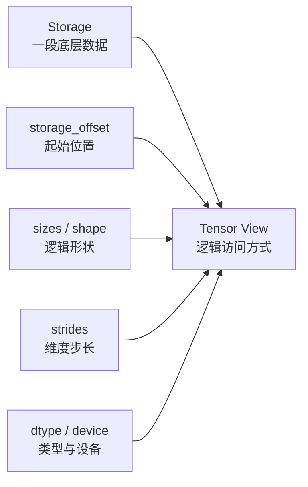
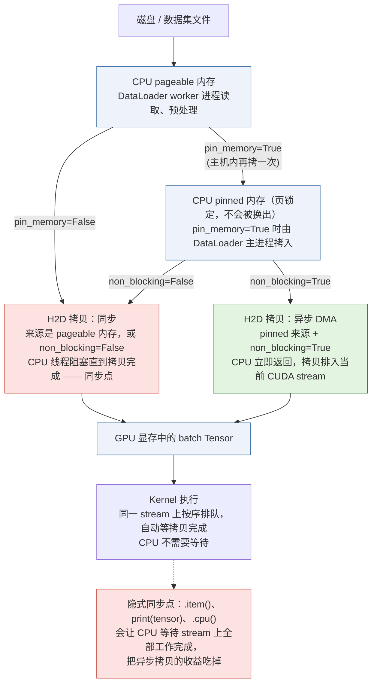
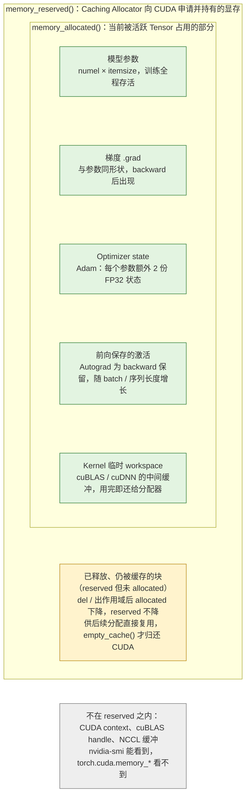
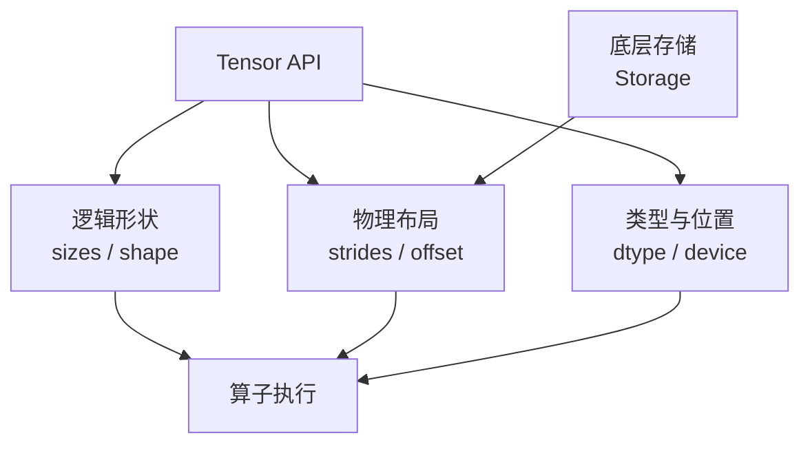

上一篇从整体上介绍了 PyTorch：它不是只有 Python API 的库，而是连接模型代码、Tensor 编程模型、算子运行时、设备后端、Kernel 和硬件的一套计算平台。

这一次进入这张地图的核心数据抽象：

> **Tensor 到底是什么？**

初学 PyTorch 时，Tensor 很容易被理解成“支持 GPU 的 NumPy 数组”。这个理解可以帮助开始使用，但不足以解释真实工程中的许多现象：

- 为什么 `transpose()` 通常不会复制数据？
- 为什么 `view()` 有时成功，有时会报错？
- 为什么 `reshape()` 有时是零拷贝，有时会产生一份新数据？
- 为什么一个 Tensor 的 `shape` 相同，性能却可能完全不同？
- 为什么把模型移动到 GPU 后，输入数据还需要单独移动？
- 为什么 `float16` 不只是把每个数字占用的字节数减半？
- 为什么一个看似普通的 in-place 操作会和 Autograd 冲突？
- 为什么数据已经“释放”了，GPU 显存仍然显示被占用？

这些问题背后都指向同一个事实：

> **Tensor 不只是数据本身，而是数据、形状、布局、类型、设备和生命周期的组合。**

## 一、总览：一个 Tensor 由哪些部分组成

### 1. 本文的主线

本文会从一个简化的 Tensor 模型开始，逐步解释 Storage、Shape、Stride、Storage Offset、dtype、device、view、拷贝和 contiguous：先建立“逻辑视图 + 物理存储”的整体模型，再逐个展开描述 Tensor 的各个字段，然后讨论 view / clone / detach / in-place 与广播这几组容易混淆的操作，最后从 Tensor 视角解释显存问题，并动手实现一个简化版 Tensor 来验证这套模型。后面 Autograd、Dispatcher、Kernel 和性能分析文章，都会以本文建立的 Tensor 心智模型为基础。

### 2. 本文的章节安排

```text
第二章   Tensor 的整体模型                逻辑视图与物理存储、核心字段、元素数量与占用空间
第三章   Shape：Tensor 的逻辑形状          view / reshape / flatten、增删维度
第四章   Stride：逻辑索引如何映射到内存     stride 的定义、二维与三维例子、view 为何可能
第五章   Transpose、Permute 与 View        只改 metadata 的变换、转置后 view 为何失败
第六章   Contiguous：连续布局与数据拷贝     contiguous 的定义、Kernel 为何关心它、其他 layout
第七章   Storage、Storage Offset 与共享内存  Storage、offset、切片 view、view 的生命周期影响
第八章   dtype：如何解释每个元素           FP16 与 BF16、dtype promotion、转换的拷贝成本
第九章   Device：数据到底在哪里执行         .to() 的两个维度、H2D 搬运、device mismatch、Meta device
第十章   View、Clone、Detach 与 In-place    四组操作的语义边界及其与 Autograd 的关系
第十一章 Broadcasting                     expand 与 repeat、广播不等于复制、排查方式
第十二章 从 Tensor 视角理解内存问题        数据 / 缓存 / 计算图内存、生命周期、成本模型
第十三章 实现一个简化版 Tensor            用 Python 复现 stride、transpose 与 contiguous copy
第十四章 Java 工程师应该如何理解 Tensor    Tensor 与 Java 数组的关键差异
第十五章 本文小结
```


## 二、Tensor 的整体模型

### 1. Tensor 不只是一个多维数组

假设有一个二维 Tensor：

```python
import torch

x = torch.tensor([
    [1, 2, 3],
    [4, 5, 6],
])
```

从数学上看，它是一个 `2 × 3` 的矩阵：

```text
[[1, 2, 3],
 [4, 5, 6]]
```

但 PyTorch 还需要知道：

- 数据存储在哪里？
- 每个元素是什么类型？
- 逻辑上有几行几列？
- 从一个元素移动到下一个元素，需要跨过多少个存储位置？
- 这个 Tensor 是否与另一个 Tensor 共享底层数据？
- 数据位于 CPU 还是 GPU？
- 是否需要参与 Autograd？

因此可以把一个 Tensor 粗略表示为：

```text
Tensor
├── Storage：底层数据存储
├── sizes：每个维度的长度
├── strides：每个维度的步长
├── storage_offset：相对于 Storage 的起始偏移
├── dtype：元素类型
├── device：数据所在设备
└── layout：布局信息
```

这组信息共同决定了“如何解释一段内存”。

### 2. Tensor 的逻辑视图与物理存储

Tensor 有两个需要分开的层次：

```text
逻辑层
    shape / sizes
    例如：2 行 3 列

物理层
    storage / offset / stride
    例如：数据如何放在一段连续内存中
```

逻辑形状相同的两个 Tensor，物理布局可以不同：

```python
x = torch.randn(2, 3)
y = x.t()

print(x.shape)  # torch.Size([2, 3])
print(y.shape)  # torch.Size([3, 2])
```

`y` 的逻辑形状发生了变化，但它可能仍然使用 `x` 的底层存储。它并不一定需要重新分配并复制六个元素。

这就是 Tensor 与普通二维数组的一个重要差异：

> Tensor 的逻辑维度和底层内存布局可以分离。

### 3. Tensor 的核心字段

可以用一张图表示 Tensor 如何解释 Storage：



其中：

- `Storage` 提供真实的数据存储；
- `storage_offset` 决定 Tensor 从 Storage 的哪个位置开始；
- `sizes` 决定逻辑上有多少个元素；
- `strides` 决定多维索引如何映射到 Storage；
- `dtype` 决定如何解释每个元素的二进制内容；
- `device` 决定 Storage 位于 CPU、CUDA 还是其他设备。

这些字段在源码里对应两个 C++ 对象，都位于第一篇代码地图最底层的 `c10/core/`：Python 的 `torch.Tensor` 持有一个 `c10::TensorImpl`，`sizes`、`strides`、`storage_offset`、`dtype`、`device` 以及 Autograd 元数据都是它的成员；`TensorImpl` 再持有一个 `c10::StorageImpl`，里面只有数据指针、字节数和分配器。多个 `TensorImpl` 可以指向同一个 `StorageImpl`——这就是后文 view 的实现基础。本篇讨论的是源码上最底层的抽象，之所以放在系列最前面，是因为 Autograd、算子分发、Kernel 和显存分析都建立在这几个字段之上。

### 4. Tensor 的元素数量与占用空间

逻辑元素数量可以通过 `numel()` 获得：

```python
x = torch.empty(2, 3, 4)

print(x.shape)  # torch.Size([2, 3, 4])
print(x.numel())  # 24
```

如果忽略对齐、Allocator 和额外元数据，数据区大小可以粗略估算为：

```text
数据区大小 ≈ numel × dtype.itemsize
```

例如：

```text
1000000 个 float32 ≈ 4 MB
1000000 个 float16 ≈ 2 MB
1000000 个 bfloat16 ≈ 2 MB
```

但真实显存占用还可能包括：

- Tensor 对象本身；
- Storage 和分配器元数据；
- Autograd 保存的中间结果；
- 梯度；
- Optimizer state；
- CUDA caching allocator 保留的内存；
- 临时 workspace。

因此，`numel × itemsize` 只能估算数据本体，不能直接等同于进程的完整内存占用。


## 三、Shape：Tensor 的逻辑形状

### 1. Shape、维度和元素数量

```python
x = torch.empty(2, 3, 4)

print(x.shape)  # torch.Size([2, 3, 4])
print(x.dim())  # 3
print(x.numel())  # 24
```

这里：

```text
dim()  = 3
shape  = (2, 3, 4)
numel  = 2 × 3 × 4 = 24
```

`shape` 描述的是逻辑结构，不直接说明数据在内存中如何排列。

### 2. Shape 变换不一定复制数据

下面的操作通常只需要修改 Tensor 的元数据：

```python
x = torch.arange(6)
y = x.reshape(2, 3)
```

如果底层布局满足条件，`y` 可以和 `x` 共享 Storage：

```python
print(x.data_ptr() == y.data_ptr())
```

但这不是 `reshape()` 的永久保证。它会尝试返回 view；如果现有布局不允许，就可能创建拷贝。

### 3. `view()`、`reshape()` 与 `flatten()`

**`view()`**

`view()` 要求现有 stride 能够支持目标形状：

```python
x = torch.arange(6)
y = x.view(2, 3)
```

如果布局不满足要求，`view()` 通常会直接报错，而不是自动复制。

**`reshape()`**

`reshape()` 更宽松：

```python
y = x.reshape(2, 3)
```

它会在可能时返回 view，在不可能时创建拷贝。因此不能仅凭 `reshape()` 这个名字判断是否发生了内存复制。

**`flatten()`**

```python
x = torch.randn(2, 3, 4)
y = x.flatten(1) 

print(y.shape)  # torch.Size([2, 12])
```

这里`flatten(start_dim=1)` 的作用是：保持 start_dim 之前的维度不变，将从 start_dim 开始往后的所有维度“拉平”成一个维度。在这里，第 0 维（大小为 2）被保留。第 1 维和第 2 维（大小分别为 3 和 4）被合并。合并后的新维度大小为它们乘积：$$3 \times 4 = 12$$。

这种 flatten(1) 的操作在深度学习中非常常见，通常用于卷积层（Convolutional Layer）到全连接层（Linear Layer）的过渡，目的是保留样本数量（Batch Size，即第 0 维），同时将特征图的所有像素和通道展平为一维特征向量。

`flatten()` 也可能返回 view，也可能创建新的 Tensor，取决于原始布局。

### 4. 增加和删除维度

```python
x = torch.randn(3, 4)

x1 = x.unsqueeze(0)
print(x1.shape)  # torch.Size([1, 3, 4])

x2 = x1.squeeze(0)
print(x2.shape)  # torch.Size([3, 4])
```

`unsqueeze()` 和 `squeeze()` 通常是 metadata 操作，不需要复制数据。

需要注意：`squeeze()` 删除的是长度为 1 的维度。如果不指定维度，输入 shape 改变后，可能删除比预期更多的维度。

### 5. `reshape` 不改变元素语义

```python
x = torch.arange(6)
y = x.reshape(2, 3)
```

`reshape()` 改变的是如何组织元素，而不是元素顺序本身：

```text
x: [0, 1, 2, 3, 4, 5]

y: [[0, 1, 2],
    [3, 4, 5]]
```

如果业务语义要求交换维度，应该使用 `transpose()` 或 `permute()`，而不是把 `reshape()` 当成转置。


## 四、Stride：逻辑索引如何映射到内存

### 1. 什么是 stride？

对于一个 Tensor，stride 表示：

> **沿某个维度增加 1 时，底层存储位置需要前进多少个元素。**

```python
x = torch.arange(6).reshape(2, 3)

print(x)
# tensor([[0, 1, 2],
#         [3, 4, 5]])

print(x.shape)   # torch.Size([2, 3])
print(x.stride()) # (3, 1)
```

对于 `x[i, j]`，底层位置可以粗略计算为：

```text
offset(i, j) = storage_offset + i × stride[0] + j × stride[1]
```

这里：

```text
storage_offset = 0
stride[0]      = 3
stride[1]      = 1
```

所以：

```text
x[0, 0] → 0
x[0, 1] → 1
x[0, 2] → 2
x[1, 0] → 3
x[1, 1] → 4
x[1, 2] → 5
```

### 2. 二维连续 Tensor 的 stride

一个 `2 × 3` 的行优先连续 Tensor：

```text
[[a, b, c],
 [d, e, f]]
```

底层存储是：

```text
[a, b, c, d, e, f]
```

对应：

```text
shape  = (2, 3)
stride = (3, 1)
```

含义是：

- 行索引增加 1，需要跨过 3 个元素；
- 列索引增加 1，只需要跨过 1 个元素。

把 storage 的线性下标和逻辑格子放在一起看，每个格子里写的就是它落在 storage 的哪个位置：

```text
storage（一维，下标即物理位置）
 idx:   0     1     2     3     4     5
      ┌─────┬─────┬─────┬─────┬─────┬─────┐
      │  a  │  b  │  c  │  d  │  e  │  f  │
      └─────┴─────┴─────┴─────┴─────┴─────┘
       └─── row i=0 ───┘ └─── row i=1 ───┘
            相邻两行起点相差 3 = stride[0]

x: shape=(2,3), stride=(3,1)       offset(i,j) = i*3 + j*1
            j=0          j=1          j=2
       ┌────────────┬────────────┬────────────┐
  i=0  │ (0,0)→0  a │ (0,1)→1  b │ (0,2)→2  c │
       ├────────────┼────────────┼────────────┤
  i=1  │ (1,0)→3  d │ (1,1)→4  e │ (1,2)→5  f │
       └────────────┴────────────┴────────────┘
  j 增 1 → 物理位置 +1 (stride[1]=1)
  i 增 1 → 物理位置 +3 (stride[0]=3)
```

### 3. 三维 Tensor 的 stride

```python
x = torch.empty(2, 3, 4)
print(x.stride())
```

典型结果是：

```text
(12, 4, 1)
```

计算方式为：

```text
stride[2] = 1
stride[1] = 4
stride[0] = 3 × 4 = 12
```

对于索引 `x[i, j, k]`：

```text
offset(i, j, k)
    = storage_offset
    + i × 12
    + j × 4
    + k × 1
```

把 24 个 storage 下标按 `i` 切成两个 `3 × 4` 平面，就能直观看到三个 stride 各自“跨过”多少元素：

```text
x: shape=(2,3,4), stride=(12,4,1)    offset(i,j,k) = i*12 + j*4 + k*1

      i=0: idx 0..11                  i=1: idx 12..23
        k=0  k=1  k=2  k=3                  k=0  k=1  k=2  k=3
      ┌────┬────┬────┬────┐               ┌────┬────┬────┬────┐
  j=0 │  0 │  1 │  2 │  3 │           j=0 │ 12 │ 13 │ 14 │ 15 │
      ├────┼────┼────┼────┤               ├────┼────┼────┼────┤
  j=1 │  4 │  5 │  6 │  7 │           j=1 │ 16 │ 17 │ 18 │ 19 │
      ├────┼────┼────┼────┤               ├────┼────┼────┼────┤
  j=2 │  8 │  9 │ 10 │ 11 │           j=2 │ 20 │ 21 │ 22 │ 23 │
      └────┴────┴────┴────┘               └────┴────┴────┴────┘

  k 增 1 → +1  (stride[2])   相邻元素
  j 增 1 → +4  (stride[1])   跨过一行 4 个元素
  i 增 1 → +12 (stride[0])   跨过一整个 3×4 = 12 个元素的平面
```

### 4. stride 让 view 成为可能

一个 view 不需要复制数据的关键，是新的 Tensor 能否通过新的 `sizes` 和 `strides` 正确解释原来的 Storage。

```text
同一份 Storage
    ├── Tensor A：sizes=(2,3), strides=(3,1)
    └── Tensor B：sizes=(3,2), strides=(1,3)
```

A 和 B 可以具有不同的逻辑形状，但共享同一份底层数据。

这就是为什么一个 Tensor 的 `shape` 不能单独说明它的性能和存储行为，必须同时观察：

```python
print(x.shape)
print(x.stride())
print(x.is_contiguous())
```


## 五、Transpose、Permute 与 View

### 1. `transpose()` 通常只改变 metadata

```python
x = torch.arange(6).reshape(2, 3)
y = x.transpose(0, 1)

print(x)
# tensor([[0, 1, 2],
#         [3, 4, 5]])

print(y)
# tensor([[0, 3],
#         [1, 4],
#         [2, 5]])

print(x.shape)    # torch.Size([2, 3])
print(y.shape)    # torch.Size([3, 2])
print(x.stride()) # (3, 1)
print(y.stride()) # (1, 3)
```

`y` 通过新的 shape 和 stride 解释同一份数据：

```text
x[i, j] → offset = i × 3 + j × 1
y[i, j] → offset = i × 1 + j × 3
```

用同一份 storage 把两个视图画出来，可以看到 `y` 只是把 stride 的两个分量交换了，逐行读 `y` 时在 storage 里是跳着走的：

```text
同一份 storage
 idx:   0     1     2     3     4     5
      ┌─────┬─────┬─────┬─────┬─────┬─────┐
      │  0  │  1  │  2  │  3  │  4  │  5  │
      └─────┴─────┴─────┴─────┴─────┴─────┘

x: shape=(2,3), stride=(3,1)        offset(i,j) = i*3 + j*1
            j=0          j=1          j=2
       ┌────────────┬────────────┬────────────┐
  i=0  │ (0,0)→0    │ (0,1)→1    │ (0,2)→2    │   读第 0 行：idx 0,1,2
       ├────────────┼────────────┼────────────┤
  i=1  │ (1,0)→3    │ (1,1)→4    │ (1,2)→5    │   读第 1 行：idx 3,4,5
       └────────────┴────────────┴────────────┘

y = x.t(): shape=(3,2), stride=(1,3)   offset(i,j) = i*1 + j*3
            j=0          j=1
       ┌────────────┬────────────┐
  i=0  │ (0,0)→0    │ (0,1)→3    │   读第 0 行：idx 0,3
       ├────────────┼────────────┤
  i=1  │ (1,0)→1    │ (1,1)→4    │   读第 1 行：idx 1,4
       ├────────────┼────────────┤
  i=2  │ (2,0)→2    │ (2,1)→5    │   读第 2 行：idx 2,5
       └────────────┴────────────┘

  x 按逻辑顺序遍历访问的 storage 下标：0 1 2 3 4 5（连续）
  y 按逻辑顺序遍历访问的 storage 下标：0 3 1 4 2 5（跳跃）
```

这是一种典型的 zero-copy view。

### 2. `permute()` 可以重新排列多个维度

```python
x = torch.empty(2, 3, 4)
y = x.permute(2, 0, 1)

print(x.shape)  # (2, 3, 4)
print(y.shape)  # (4, 2, 3)
```

`permute()` 通常也只是重新排列 sizes 和 strides：

```text
原始维度：D0, D1, D2
新顺序：  D2, D0, D1
```

这对图像、序列和批处理数据非常常见。例如不同模型可能采用：

```text
NCHW：batch, channel, height, width
NHWC：batch, height, width, channel
```

改变布局的逻辑解释不等于立刻复制数据，但后续算子可能更偏好某种物理布局。

### 3. 为什么转置后 `view()` 可能失败？

```python
x = torch.arange(6).reshape(2, 3)
y = x.transpose(0, 1)

z = y.view(6)
```

这段代码可能失败，因为 `y` 的 stride 已经不符合把它直接解释成一个连续的一维序列的条件。

`view(6)` 只允许改 metadata，因此它需要一个单一的 stride 就能从 `z[k]` 走到 `z[k+1]`。把 `y` 的逻辑顺序和实际 storage 下标对齐写出来，就能看到这个条件为什么不满足：

```text
view(6) 要求：逻辑上相邻的元素，在 storage 中以同一个 stride 相邻

  z 的下标 k        0      1      2      3      4      5
  对应 y 元素     y[0,0] y[0,1] y[1,0] y[1,1] y[2,0] y[2,1]
  storage 下标      0      3      1      4      2      5
  相邻差值            +3     -2     +3     -2     +3
                    ↑ 不是常数 → 无法用 (stride,) 表达 → view 报错

  y 需要的"连续顺序"：storage 依次是 0 3 1 4 2 5
  storage 的实际顺序：              0 1 2 3 4 5   ← 两者不一致
```

通常可以这样处理：

```python
z = y.contiguous().view(6)
```

这里的过程是：

```text
y：非连续 view
    ↓
contiguous()：创建连续副本
    ↓
view(6)：在新布局上创建一维 view
```

如果不希望显式拆开，也可以使用：

```python
z = y.reshape(6)
```

但 `reshape()` 是否复制，应根据实际布局判断，而不是假设。

### 4. View 和原始 Tensor 共享数据

```python
x = torch.arange(6)
y = x.view(2, 3)

y[0, 0] = 100
print(x)
# tensor([100, 1, 2, 3, 4, 5])
```

这说明 `y` 和 `x` 共享底层数据。

如果需要完全独立的数据副本，应明确使用：

```python
z = x.clone()
z[0] = 200

print(x[0])  # 100
print(z[0])  # 200
```


## 六、Contiguous：连续布局与数据拷贝

### 1. 什么是 contiguous？

对于默认的行优先布局，Tensor 的逻辑索引顺序与底层存储顺序一致时，可以称为 contiguous：

```python
x = torch.arange(6).reshape(2, 3)
print(x.is_contiguous())  # True
```

转置通常会产生 non-contiguous view：

```python
y = x.transpose(0, 1)
print(y.is_contiguous())  # False
```

### 2. `contiguous()` 做了什么？

```python
z = y.contiguous()

print(z.is_contiguous())  # True
print(z.shape)            # torch.Size([3, 2])
```

如果原 Tensor 已经连续，`contiguous()` 通常可以直接返回自身或等价的引用；如果不连续，它会分配新的 Storage，并按照逻辑顺序复制数据。

以上一章的转置视图 `y` 为例，`contiguous()` 前后的两条 storage 如下：

```text
before: y = x.t()   shape=(3,2) stride=(1,3)   与 x 共享 storage
        storage   idx:  0   1   2   3   4   5
                      ┌───┬───┬───┬───┬───┬───┐
                      │ 0 │ 1 │ 2 │ 3 │ 4 │ 5 │
                      └───┴───┴───┴───┴───┴───┘
        按 y 的逻辑顺序读取：idx 0 → 3 → 1 → 4 → 2 → 5（跳跃访问）

        读取结果        0   3   1   4   2   5
                        │   │   │   │   │   │   逐元素复制（真实拷贝）
                        ▼   ▼   ▼   ▼   ▼   ▼
after:  z = y.contiguous()   shape=(3,2) stride=(2,1)   新分配的 storage
        storage'  idx:  0   1   2   3   4   5
                      ┌───┬───┬───┬───┬───┬───┐
                      │ 0 │ 3 │ 1 │ 4 │ 2 │ 5 │
                      └───┴───┴───┴───┴───┴───┘
        z[i,j] = storage'[i*2 + j]    逻辑顺序 == 物理顺序，可直接 view(6)
```

因此：

```text
contiguous()
    不是简单的“设置一个标志”
    而可能是真实的数据拷贝
```

### 3. 为什么 Kernel 关心 contiguous？

一个 Kernel 可以处理任意 stride，但通用 stride 访问通常更复杂：

```text
逻辑索引
    ↓
根据 stride 计算地址
    ↓
访问非连续内存
```

连续布局往往更有利于：

- 顺序访存；
- Cache 命中；
- GPU 合并访存；
- 向量化加载；
- 简化 Kernel 实现。

但把所有 Tensor 都提前 `contiguous()` 也不一定正确，因为这会增加：

- 内存分配；
- 数据拷贝；
- GPU 带宽消耗；
- 临时显存峰值。

正确的原则是：

> 不要为了“看起来整齐”无条件调用 `contiguous()`，要根据后续算子是否需要以及拷贝成本决定。

### 4. 不同 layout 不只有 contiguous 和 non-contiguous

PyTorch 还支持其他布局概念，例如：

- channels-last；
- sparse layout；
- MKLDNN layout；
- nested layout。

所以工程中不应把 layout 简化成一个布尔值。`is_contiguous()` 只是在默认布局语境下回答一个具体问题，不代表 Tensor 的所有存储属性。


## 七、Storage、Storage Offset 与共享内存

### 1. Storage 是什么？

从概念上说，Storage 是一段承载实际元素数据的底层存储，而 Tensor 是对这段存储的一个带元数据解释。

多个 Tensor 可以共享同一个 Storage：

```text
Storage
    └── [0, 1, 2, 3, 4, 5]

Tensor A
    sizes=(2,3), strides=(3,1), offset=0

Tensor B
    sizes=(3,2), strides=(1,3), offset=0
```

现代 PyTorch 的具体 Storage API 和底层实现会随版本变化。本文使用 Storage 这个概念，是为了说明“数据本体”和“Tensor 视图”之间的关系，不建议把某个内部类的当前细节当成稳定公共 API。

### 2. `storage_offset()`

一个 view 不一定从 Storage 的第 0 个元素开始：

```python
x = torch.arange(10)
y = x[2:8]

print(y.storage_offset())
# 可能为 2
```

`y` 逻辑上有六个元素，但它从原始 Storage 的位置 2 开始解释：

```text
x: shape=(10,), stride=(1,), storage_offset=0
 idx:   0   1   2   3   4   5   6   7   8   9
      ┌───┬───┬───┬───┬───┬───┬───┬───┬───┬───┐
      │ 0 │ 1 │ 2 │ 3 │ 4 │ 5 │ 6 │ 7 │ 8 │ 9 │   同一份 storage
      └───┴───┴───┴───┴───┴───┴───┴───┴───┴───┘
                ▲                       ▲
                │ y 起点                │ y 终点（不含）
                storage_offset = 2      offset + 6*stride = 8

y = x[2:8]: shape=(6,), stride=(1,), storage_offset=2
               y0  y1  y2  y3  y4  y5      ← 6 个逻辑元素
               =2  =3  =4  =5  =6  =7      ← 直接落在 idx 2..7 上
```

对于一维 Tensor，可以粗略写成：

```text
y[i] = Storage[storage_offset + i × stride] = Storage[2 + i]
```

### 3. 切片也可能只是 view

```python
x = torch.arange(10)
y = x[2:8:2]

print(y)       # tensor([2, 4, 6])
print(y.stride())
print(y.storage_offset())
```

`y` 不一定拥有独立数据，而可能通过 offset 和 stride 指向原始 Storage。

因此，长期保存一个小切片，有时可能让一整块大 Storage 继续存活。这是理解内存生命周期时需要注意的边界。

### 4. View 的生命周期影响

```python
large = torch.empty(1024, 1024, 1024)
small = large[0, 0, :10]
```

即使 `small` 只包含 10 个元素，它可能仍然持有对 `large` Storage 的引用。如果 `small` 的生命周期很长，底层大块存储也可能无法释放。

如果确实需要让小结果独立，可以显式复制：

```python
small = large[0, 0, :10].clone()
```

这不是说所有切片都应该 clone，而是要根据对象生命周期和内存成本做决定。


## 八、dtype：如何解释每个元素

### 1. dtype 不只是精度选项

`dtype` 决定了底层数据如何被解释，也直接影响：

- 单个元素占用的字节数；
- 可表示的数值范围；
- 有效精度；
- 算子支持情况；
- 内存带宽需求；
- 计算吞吐；
- 梯度和数值稳定性。

常见 dtype 包括：

```text
float32
float16
bfloat16
float64
int32
int64
bool
```

### 2. FP16 与 BF16

FP16 和 BF16 都通常占用 16 bit，但位分配不同：

```text
FP16：更多位用于尾数，指数范围较小
BF16：指数范围接近 FP32，尾数精度较低
```

把三种格式的位域画在一起（每个字符代表 1 bit）：

```text
bit: 31 30    23 22                    0
FP32 ┌─┬────────┬───────────────────────┐
     │S│ exp(8) │      mantissa(23)     │  1 + 8 + 23 = 32 bit
     └─┴────────┴───────────────────────┘  范围 ~1e-38 .. 3e38，~7 位十进制精度

bit: 15 14 10 9        0
FP16 ┌─┬─────┬──────────┐
     │S│exp 5│ mant(10) │  1 + 5 + 10 = 16 bit
     └─┴─────┴──────────┘  范围 ~6e-5 .. 65504（易溢出/下溢），~3 位十进制精度

bit: 15 14     7 6     0
BF16 ┌─┬────────┬───────┐
     │S│ exp(8) │mant(7)│  1 + 8 + 7 = 16 bit
     └─┴────────┴───────┘  指数位和 FP32 一样，范围相同；~2 位十进制精度

BF16 = FP32 直接砍掉低 16 位尾数（符号位、指数位与 FP32 完全一致）：
FP32 ┌─┬────────┬───────┬────────────────┐
     │S│ exp(8) │mant 7 │  mant 低 16 位 │
     └─┴────────┴───────┴────────────────┘
      └── BF16 保留 ───┘ └─ 直接丢弃 ───┘
```

因此二者的工程特性不同：

- FP16 可能更容易出现溢出或下溢；
- BF16 数值范围更接近 FP32，训练中通常更稳；
- 不同 GPU 对 FP16、BF16 的吞吐支持不同；
- 某些算子可能自动使用更高精度的累加。

不能只因为二者都是 16 bit，就认为它们可以无条件互换。

### 3. dtype promotion

当不同 dtype 的 Tensor 参与计算时，PyTorch 需要决定结果类型：

```python
x = torch.ones(3, dtype=torch.float32)
y = torch.ones(3, dtype=torch.float64)
z = x + y

print(z.dtype)
```

类型提升规则会受到：

- 输入 dtype；
- scalar 类型；
- 算子定义；
- device；
- 当前计算上下文；

等因素影响。

工程中不要只凭直觉猜测结果 dtype，尤其是在混合精度、索引和整数计算中，应通过显式检查和测试确认。

### 4. dtype 转换可能产生真实拷贝

```python
x = torch.randn(1024, 1024, device="cuda", dtype=torch.float32)
y = x.to(torch.float16)
```

`y` 通常需要一份新的数据，因为每个元素的二进制表示发生了变化。这与 `view()` 只改变 metadata 的情况不同。

可以用下面的方式检查：

```python
print(x.dtype)
print(y.dtype)
print(x.data_ptr() == y.data_ptr())
```

### 5. 计算 dtype 与存储 dtype

某些硬件和算子会使用低精度存储，但采用更高精度累加。例如矩阵乘法可能：

```text
输入：FP16 / BF16
累加：FP32 或硬件支持的内部精度
输出：FP16 / BF16
```

具体行为取决于算子、硬件和配置。分析数值问题时，要区分：

```text
Tensor 的存储 dtype
Kernel 的计算 dtype
累加使用的内部精度
输出 Tensor 的 dtype
```


## 九、Device：数据到底在哪里执行

### 1. CPU Tensor 与 CUDA Tensor

```python
cpu_x = torch.randn(2, 3)
gpu_x = cpu_x.to("cuda")

print(cpu_x.device)  # cpu
print(gpu_x.device)  # cuda:0
```

模型和输入必须位于兼容的设备上：

```python
model = model.to("cuda")
inputs = inputs.to("cuda")
outputs = model(inputs)
```

“模型在 GPU 上”不会自动把之后传入的所有输入都移动到 GPU；“输入在 GPU 上”也不会自动移动模型参数。

### 2. `.to()` 的两个维度

`.to()` 既可以改变 device，也可以改变 dtype：

```python
x = x.to(device="cuda", dtype=torch.float16)
```

这两个变化都可能需要新的数据存储：

```text
CPU → CUDA       通常发生设备间拷贝
float32 → float16 通常发生 dtype 转换和拷贝
```

如果目标 device 和 dtype 与当前一致，PyTorch 通常可以避免不必要的复制，但工程代码仍应以语义和实际测试为准。

### 3. CPU 到 GPU 的数据搬运

训练中的典型路径是：

```text
磁盘
  ↓
CPU 内存
  ↓
Pinned CPU Memory
  ↓
GPU Memory
  ↓
Kernel 执行
```

如果数据搬运跟不上 GPU 计算，GPU 就会等待输入。

把这条路径按 `pin_memory` 和 `non_blocking` 两个开关展开，可以看清哪一步是真正的同步点、哪一步可以和计算重叠：



DataLoader 常见配置包括：

```python
loader = DataLoader(
    dataset,
    batch_size=64,
    num_workers=4,
    pin_memory=True,
)
```

配合：

```python
batch = batch.to("cuda", non_blocking=True)
```

可以在满足条件时改善 CPU-GPU 数据传输的重叠，但并不是打开两个参数就必然加速。实际收益取决于：

- CPU 内存是否 pinned；
- 数据预处理是否成为瓶颈；
- GPU 计算时间是否足够长；
- 是否存在隐式同步；
- 主机内存和 PCIe/NVLink 带宽。

### 4. Device mismatch

常见错误是：

```text
Expected all tensors to be on the same device
```

排查时同时打印：

```python
print(next(model.parameters()).device)
print(inputs.device)
print(targets.device)
```

还要检查：

- 模型内部动态创建的 Tensor；
- `register_buffer()` 注册的状态；
- loss 函数内部的权重；
- hidden state 和 mask；
- checkpoint 加载后的设备位置。

### 5. Meta Device 不是普通计算设备

Meta Tensor 可以只携带 shape、dtype 等元数据，而不分配真实数据：

```python
with torch.device("meta"):
    x = torch.empty(2, 3)

print(x.shape)
print(x.device)
```

它适合：

- 大模型结构分析；
- 参数量估算；
- shape 推断；
- 初始化前的图变换；
- 编译和测试中的抽象执行。

Meta Tensor 不能像普通 CPU/CUDA Tensor 一样直接读取数值。它说明了“Tensor 的数据”和“Tensor 的元数据”可以在一定程度上分离。


## 十、View、Clone、Detach 与 In-place

### 1. View 与 Clone

```python
x = torch.arange(6)
view = x.view(2, 3)
copy = x.clone()
```

二者的语义不同：

| 操作 | 是否共享底层数据 | 主要用途 |
|---|---|---|
| `view()` | 通常共享 | 改变解释方式 |
| `reshape()` | 可能共享，也可能复制 | 更宽松地改变形状 |
| `transpose()` | 通常共享 | 交换两个维度 |
| `permute()` | 通常共享 | 重排多个维度 |
| `clone()` | 不共享 | 创建独立副本 |
| `contiguous()` | 不连续时复制 | 获得连续布局 |

### 2. View 与 Detach 是两个维度的问题

`view()` 解决的是存储解释方式：

```text
是否共享 Storage？
shape 和 stride 如何变化？
```

`detach()` 解决的是 Autograd 关系：

```text
是否继续连接当前计算图？
```

```python
x = torch.randn(3, requires_grad=True)
y = x * 2
z = y.detach()
```

`z` 可能与 `y` 共享数据，但不再沿原来的 Autograd 关系传播梯度。

因此不能把：

```text
view = 不需要梯度
```

或：

```text
detach = 创建数据副本
```

作为一般规律。两者处理的是不同层次。

### 3. In-place 操作

带下划线的方法通常表示 in-place 操作：

```python
x.add_(1)
x.zero_()
x.copy_(other)
```

它们会直接修改已有 Storage，而不是返回一份新的结果数据。

优点可能是：

- 减少内存分配；
- 减少临时 Tensor；
- 降低峰值内存。

代价可能是：

- 破坏其他 view 看到的数据；
- 让代码的数据流不明显；
- 与 Autograd 保存的中间值冲突；
- 限制编译器优化；
- 让调试和并发访问更复杂。

### 4. In-place 与 Autograd

```python
x = torch.randn(3, requires_grad=True)
y = x * x
# x.add_(1) 可能触发 Autograd 相关错误
```

Autograd 可能需要保存某些 Tensor 的旧值。如果这个 Tensor 在 backward 之前被原地修改，保存的值就不再可靠。

并不是所有 in-place 操作都会报错，也不是所有场景都禁止 in-place。正确的原则是：

> 在需要梯度的计算中，只有明确理解数据依赖和 Autograd 保存关系后，才使用 in-place 优化。


## 十一、Broadcasting：不复制数据的逻辑扩展

### 1. 广播解决什么问题？

```python
x = torch.ones(2, 3)
y = torch.ones(3)
z = x + y
```

`y` 的逻辑形状可以扩展为 `(2, 3)`，从而与 `x` 逐元素相加。

广播通常遵循从最后一个维度开始对齐的规则：

```text
(2, 3)
(   3)
------
(2, 3)
```

两个维度兼容的条件通常是：

- 两者相等；
- 其中一个为 1；
- 某个维度不存在。

对 `(2, 3) + (3,)` 这个例子，PyTorch 实际做的是先把 `y` 右对齐补成 `(1, 3)`，再用 `expand` 得到一个 `shape=(2,3)`、`stride=(0,1)` 的视图，物理上不多占一个字节：

```text
第一步：右对齐比较各维
        x   (2, 3)
        y   (   3)   → 缺失的维度视为 1，补成 (1, 3)
        -----------
        z   (2, 3)   → 1 可以扩展成 2，3 == 3 保持不变

第二步：y.expand(2, 3)  shape=(2,3), stride=(0,1)，不分配新 storage

 expand 视图（逻辑 2x3）                 y 的 storage（物理只有 3 个元素）
        j=0     j=1     j=2                  idx:  0    1    2
     ┌───────┬───────┬───────┐                  ┌────┬────┬────┐
 i=0 │ →idx0 │ →idx1 │ →idx2 │ ──┐              │ y0 │ y1 │ y2 │
     ├───────┼───────┼───────┤   ├─ 两行都读 ─▶ └────┴────┴────┘
 i=1 │ →idx0 │ →idx1 │ →idx2 │ ──┘
     └───────┴───────┴───────┘

 offset(i,j) = i*0 + j*1 = j   ← i 变化不移动物理位置，两行读的是同一段内存
```

### 2. `expand()` 与 `repeat()`

```python
x = torch.tensor([[1], [2]])

a = x.expand(2, 3)
b = x.repeat(1, 3)
```

二者表面结果相似，但存储语义不同：

| 操作 | 是否通常复制数据 | 语义 |
|---|---|---|
| `expand()` | 否 | 通过 stride 为 0 的 view 表示重复访问 |
| `repeat()` | 是 | 创建实际重复的数据 |

`expand()` 可以节省内存，但它产生的 view 不能简单当作普通连续 Tensor；某些 in-place 操作也会受到限制，因为多个逻辑位置可能对应同一个物理位置。

### 3. 广播不等于真实复制

```text
逻辑上：y 看起来扩展成了更大的形状
物理上：底层数据可能仍然只有一份
```

这也是 stride 重要的原因：一个维度的 stride 为 0 时，索引增加并不一定导致物理地址增加。

### 4. 广播错误的排查方式

遇到：

```text
The size of tensor a must match the size of tensor b
```

不要只看 Tensor 的元素数量，要打印完整信息：

```python
for name, value in {
    "x": x,
    "y": y,
}.items():
    print(name, value.shape, value.stride(), value.dtype, value.device)
```

shape 相乘相等，不代表两个 Tensor 可以逐元素广播。


## 十二、从 Tensor 视角理解内存问题

### 1. 数据内存、缓存内存和计算图内存

一个训练进程中的内存，至少可以分为：

```text
Tensor 数据
    ↓
梯度
    ↓
Optimizer State
    ↓
Autograd 保存的中间结果
    ↓
Kernel 临时 workspace
    ↓
Allocator 缓存
```

把这几类放进同一块 GPU 显存里看，并标出 `memory_allocated()` 与 `memory_reserved()` 各自覆盖的范围：



因此，下面两个数字不是同一个概念：

```python
torch.cuda.memory_allocated()
torch.cuda.memory_reserved()
```

- `allocated`：当前 Tensor 等对象实际使用的显存；
- `reserved`：PyTorch 分配器向 CUDA 申请并保留的显存。

释放一个 Tensor 后，`allocated` 可能下降，但 `reserved` 不一定立即下降，因为缓存分配器可能保留内存供后续复用。

### 2. 为什么删除 Tensor 后显存仍然存在？

可能原因包括：

- 还有其他 Python 引用；
- 某个 view 仍然持有底层 Storage；
- Autograd 图仍然被保存；
- CUDA caching allocator 仍然保留内存；
- Kernel 尚未完成，存在异步执行；
- 其他 Tensor、梯度或 Optimizer state 仍在使用。

因此，`del x` 只删除一个 Python 名称，不代表底层数据一定立即归还操作系统或 GPU 驱动。

### 3. Tensor 生命周期比变量名更重要

```python
outputs.append(model(batch))
```

如果 `model(batch)` 参与 Autograd，这个列表可能不只是保存输出值，还会间接保留计算图和中间 Tensor。

如果只需要记录数值，可以考虑：

```python
outputs.append(model(batch).detach().cpu())
```

如果只需要日志指标：

```python
loss_value = loss.detach().item()
```

具体做法要根据是否需要梯度和后续设备访问来决定。

### 4. 复制、迁移和视图的成本模型

分析一个 Tensor 操作时，可以先问四个问题：

```text
是否创建新的 Storage？
是否复制了数据？
是否发生了设备迁移？
是否延长了原始 Storage 的生命周期？
```

例如：

| 操作 | 新 Storage | 数据复制 | 可能影响生命周期 |
|---|---:|---:|---:|
| `view()` | 通常否 | 否 | 是，共享原 Storage |
| `transpose()` | 通常否 | 否 | 是，共享原 Storage |
| `clone()` | 是 | 是 | 否，数据独立 |
| `contiguous()` | 视布局而定 | 视布局而定 | 可能 |
| `.to("cuda")` | 通常是 | 是 | 否，设备不同 |
| `detach()` | 通常否 | 否 | 共享关系仍需注意 |

这张表是分析思路，不是对所有特殊后端和布局的绝对保证。


## 十三、实现一个简化版 Tensor

### 1. 实践目标

为了把前面的概念串起来，可以使用 Python 和 NumPy 实现一个只支持 CPU 的简化版 Tensor。

它不需要实现完整的数学运算，只需要支持：

- 一维 Storage；
- sizes；
- strides；
- storage offset；
- `view()`；
- `transpose()`；
- 索引访问；
- contiguous 检查。

目标数据结构：

```python
class MiniTensor:
    def __init__(
        self,
        storage,
        sizes,
        strides,
        storage_offset=0,
    ):
        self.storage = storage
        self.sizes = tuple(sizes)
        self.strides = tuple(strides)
        self.storage_offset = storage_offset
```

### 2. 从多维索引计算物理位置

```python
def storage_index(self, index):
    if len(index) != len(self.sizes):
        raise IndexError("dimension mismatch")

    offset = self.storage_offset
    for i, size, stride in zip(index, self.sizes, self.strides):
        if not 0 <= i < size:
            raise IndexError("index out of range")
        offset += i * stride
    return offset
```

对于：

```text
sizes  = (2, 3)
strides = (3, 1)
offset = 0
```

访问 `[1, 2]` 时：

```text
offset = 0 + 1 × 3 + 2 × 1 = 5
```

### 3. 实现 transpose

```python
def transpose(self, dim0, dim1):
    sizes = list(self.sizes)
    strides = list(self.strides)

    sizes[dim0], sizes[dim1] = sizes[dim1], sizes[dim0]
    strides[dim0], strides[dim1] = strides[dim1], strides[dim0]

    return MiniTensor(
        self.storage,
        sizes,
        strides,
        self.storage_offset,
    )
```

这个实现没有复制 Storage，只是交换了 sizes 和 strides。这正是 PyTorch view 操作的核心思想之一。

### 4. 实现 contiguous copy

```python
def contiguous(self):
    if self.is_contiguous():
        return self

    values = [self[index] for index in self.iter_indices()]
    return MiniTensor.from_flat(values, self.sizes)
```

这个实现刻意把非连续 Tensor 按逻辑顺序重新写入一段新的连续 Storage，从而体现：

```text
non-contiguous view
    ↓
按逻辑顺序读取
    ↓
创建新的连续 Storage
    ↓
返回 contiguous Tensor
```

### 5. 这个项目不实现什么？

为了控制范围，MiniTensor 不实现：

- CUDA；
- Autograd；
- dtype promotion；
- broadcasting 的全部规则；
- sparse layout；
- 内存分配器；
- 并行 Kernel。

它的意义不是替代 PyTorch，而是把一个真实框架中的关键数据结构缩小到可以观察的范围。


## 十四、Java 工程师应该如何理解 Tensor

### 1. Tensor 不是 `List<List<Float>>`

`List<List<Float>>` 主要描述对象之间的嵌套关系，而 Tensor 还描述：

- 连续的底层存储；
- 元素类型；
- 逻辑 shape；
- stride；
- offset；
- CPU/GPU 设备；
- 梯度关系；
- 共享 Storage 和生命周期。

把 Tensor 理解成嵌套集合，会漏掉 PyTorch 最重要的性能和内存语义。

### 2. Tensor 更接近“带布局的设备内存视图”

对于 AI-Infra 工程师，一个更有用的近似是：

```text
Tensor
    = 一段设备内存
    + 对这段内存的形状解释
    + 对地址计算的 stride 规则
    + dtype 和 device 元数据
    + 可选的 Autograd 关系
```

这不是 Tensor 的完整定义，但足以帮助分析：

- 一个操作是否复制数据；
- 为什么转置可以很便宜；
- 为什么某些 Kernel 需要 contiguous；
- 为什么设备迁移成本很高；
- 为什么保存一个小 view 可能持有大块内存。

### 3. 与 Java 数组的关键差异

| 维度 | Java 数组 | PyTorch Tensor |
|---|---|---|
| 数据布局 | 数组对象和元素布局由 JVM 管理 | Storage、shape、stride 可以分离 |
| 多维结构 | `T[][]` 常是数组的数组 | 通常是一段 Storage 加 metadata |
| 视图 | 需要显式抽象 | view 可以共享底层 Storage |
| 设备 | 通常在主机内存 | CPU、CUDA 和其他设备均可 |
| 类型 | 编译期类型系统为主 | dtype 参与运行时计算语义 |
| 数值计算 | 通常由循环和库完成 | 交给算子、Kernel 和硬件后端 |
| 内存释放 | GC 管理对象可达性 | Python 引用、Storage、Autograd、Allocator 共同影响 |

类比的价值在于搭桥，但不能让 Java 的数组和对象模型覆盖 Tensor 的真实语义。


## 十五、本文小结

Tensor 是 PyTorch 编程模型的核心数据抽象。理解它，不能只停留在：

```python
x.shape
x.dtype
x.device
```

还要同时关注：

```text
Storage
sizes
strides
storage_offset
dtype
device
layout
```

### 1. Tensor 的基本模型

```text
Tensor
    = Storage
    + Shape
    + Stride
    + Storage Offset
    + Dtype
    + Device
```

### 2. View 与拷贝

```text
view / transpose / permute
    → 通常只改变 metadata

clone / dtype conversion / device transfer
    → 通常需要新的数据存储

reshape / contiguous
    → 是否复制取决于当前布局和目标要求
```

### 3. 性能分析的第一组问题

遇到一个 Tensor 操作时，先问：

1. 是否创建了新的 Storage？
2. 是否复制了数据？
3. 是否改变了 device 或 dtype？
4. 是否改变了 stride 和 contiguous 状态？
5. 是否与其他 Tensor 共享底层数据？
6. 是否延长了某块内存的生命周期？
7. 是否影响 Autograd 或后续 Kernel？

### 4. 两张 Tensor 地图



### 5. 本篇涉及的源码位置

本篇讨论的机制在源码中的位置（对应第一篇第七章的代码地图）：

| 路径 | 内容 |
|---|---|
| `c10/core/TensorImpl.h` | Tensor 元数据：`sizes_and_strides_`、`storage_offset_`、`data_type_`、`device_opt_`、`key_set_` |
| `c10/core/StorageImpl.h` | 底层存储：数据指针、字节数、所属 Allocator |
| `aten/src/ATen/native/TensorShape.cpp` | `view`、`reshape`、`transpose`、`permute`、`squeeze` 等只改 metadata 的操作 |
| `aten/src/ATen/native/TensorProperties.cpp`、`TensorConversions.cpp` | `contiguous()`、`.to()`：何时拷贝、何时只改 metadata |
| `aten/src/ATen/ExpandUtils.h` | 广播规则 `infer_size` 与 `expand` |
| `c10/core/ScalarType.h`、`aten/src/ATen/native/TypeProperties.cpp` | dtype 定义与 `result_type`（dtype promotion） |
| `c10/cuda/CUDACachingAllocator.cpp` | 缓存分配器：为什么 `del` 之后显存仍被占用 |
| `torch/_tensor.py`、`torch/csrc/autograd/python_variable.cpp` | Python `torch.Tensor` 对象与它包装的 C++ Tensor |

下一篇将进入 Tensor 之上的梯度系统：

> **Autograd 如何把一次次 Tensor 运算连接成动态计算图，并在 backward 阶段沿图传播梯度？**


## 下一篇

[自动求导与动态计算图](/pytorch-autograd-and-dynamic-computation-graph.html)
