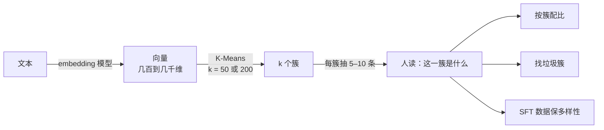

前六篇的模型都需要标签。**无监督学习**没有标签，只有 $$x$$，要回答的问题是"这批数据里有什么结构"。**聚类**是其中最常用的一种：把相似的样本归成一堆。在 LLM 的数据工程里它回答一个具体问题——**这个几十 T 的语料里有哪些主题、各占多少、哪些是垃圾**。这一篇讲三个聚类算法（K-Means、DBSCAN、层次聚类）各自怎么工作、假设什么、什么时候失效，手写 K-Means 并看它一步步收敛，最后用一个真实的小语料（78 句话过一个 0.5B 的语言模型得到句向量）把"每簇抽几条看看"跑一遍。

全篇的核心问题是：

> **K-Means 那两步为什么一定收敛，收敛到的一定是最好的吗？[^q0] 怎么知道一个语料里有什么主题、$$k$$ 该取多少？[^q1]**

## 一、总览

### 1. 三个算法、一个用途

本文按"算法 → 它的假设与失效 → 替代算法 → 在真实语料上用"组织：

| 算法 | 一句话 | 假设 | 失效 | 本文里的数字 |
|---|---|---|---|---|
| K-Means | 分成 $$k$$ 簇、每簇一个中心，反复"分配 → 更新中心" | 簇球形、大小差不多；$$k$$ 已知 | 月牙形簇切错（ARI 0.26）；局部最优 | 手写 12 行与 scikit-learn 同数：inertia 7281 |
| DBSCAN | 按密度聚：密集处连成簇、稀疏处是噪声 | 簇内密度差不多 | $$\varepsilon$$ 难选；密度不均 | 月牙 ARI 1.00；$$\varepsilon = 0.05$$ 碎成 8 簇 |
| 层次聚类 | 从每点一簇开始反复合并最近的两簇 | — | $$O(n^2)$$ 内存 | 30 个点，树状图上一刀切出 3 簇 |
| 用途 | 语料 embedding → 聚类 → 每簇抽几条看 | — | — | 78 句、$$k = 7$$：主题全对，模板文本自成一簇 |

Table: K-Means、DBSCAN 与层次聚类的假设与失效

### 2. 本文的章节安排

| 章 | 主题 | 内容 |
|---|---|---|
| 二 | K-Means | 六个数手算三轮；迭代过程（四帧图）；12 行实现与 scikit-learn 对数；为什么一定收敛 |
| 三 | $$k$$ 怎么选 | 肘部法与轮廓系数（两者不一致时怎么办） |
| 四 | 初始化 | 局部最优是真的：随机 vs k-means++（50 个 seed 的分布） |
| 五 | DBSCAN | 核心点 / 边界点 / 噪声；两个月牙；$$\varepsilon$$ 的作用 |
| 六 | 层次聚类 | 合并过程与树状图；不用先定 $$k$$ |
| 七 | 聚类在数据工程里 | 78 句真实语料 → 句向量 → K-Means → 每簇抽几条；按簇配比、找垃圾簇、SFT 多样性 |
| 八 | 本文小结 | |
| 九 | 自测 | 六道题 |

Table: 本文的章节安排

## 二、K-Means

### 1. 两步反复

把 $$n$$ 个点分成 $$k$$ 簇，每簇一个**中心**，目标是让每个点到自己簇中心的距离平方和（**簇内平方和**，inertia）最小。算法只有两步反复：**分配**——每个点归到最近的中心；**更新**——每个中心移到自己簇内所有点的均值。

先在一维上手算一遍。六个数 $$\{1, 2, 3, 10, 11, 12\}$$，$$k = 2$$，故意把两个初始中心都放在左边：$$c_1 = 1, c_2 = 2$$。

| 轮 | 中心 $$c_1, c_2$$ | 分配（每个数归到更近的中心） | 簇内平方和 | 更新后的中心（各簇均值） |
|---:|---|---|---:|---|
| 1 | 1, 2 | {1} → $$c_1$$；{2, 3, 10, 11, 12} → $$c_2$$ | 246 | 1, 7.6 |
| 2 | 1, 7.6 | {1, 2, 3} → $$c_1$$；{10, 11, 12} → $$c_2$$ | 41.7 | 2, 11 |
| 3 | 2, 11 | 同上，分配没变 | 4 | 2, 11——不再移动，停 |

Table: 一维 K-Means 手算三轮

第 1 轮 $$c_2$$ 抢走了五个数，于是被它们的均值拉到了 7.6；第 2 轮 3 离 1 比离 7.6 近，回到 $$c_1$$，两个中心各归各位；第 3 轮分配不再变化，算法停止。簇内平方和 246 → 41.7 → 4，每一轮都在降。二维上是同一件事，看一遍：


```text
6 步收敛；每步的簇内平方和： 10665 3594 841 320
```

初始化随机挑了三个点当中心，两个挤在同一团里；第一步分配之后，那个"没抢到点"的中心被更新到了两团之间，第二步就各归各位。簇内平方和从 10665 一路降到 320。

### 2. 十二行实现

```python
def kmeans(X, k, n_iter=100, seed=0):
    rng = np.random.default_rng(seed)
    centers = X[rng.choice(len(X), k, replace=False)]                     # ① 初始化：随机挑 k 个点当中心
    for _ in range(n_iter):
        d2 = ((X[:, None, :] - centers[None, :, :]) ** 2).sum(-1)           # ② [n, k]：每个点到每个中心的距离平方
        labels = d2.argmin(1)                                               # ③ 分配：每个点归到最近的中心
        new_centers = np.array([X[labels == j].mean(0) for j in range(k)])  # ④ 更新：每个中心移到自己簇的均值
        if np.allclose(new_centers, centers): break                         # ⑤ 中心不再移动就收敛
        centers = new_centers
    inertia = d2[np.arange(len(X)), labels].sum()                         # 簇内平方和
    return labels, centers, inertia
```

1. ② 用广播一次算出 $$n \times k$$ 个距离（第四篇 KNN 的同一招）；
2. ③④ 就是那两步；
3. ⑤ 中心不动了就停。

在一份真实有 6 簇、3000 个点的数据上，跑 10 个 seed 取簇内平方和最小的：

```text
手写（10 个 seed 取簇内平方和最小）：inertia 7281，ARI 0.762
sklearn KMeans(6, n_init=10)：       inertia 7281，ARI 0.761
每簇样本数 [569, 500, 504, 500, 459, 468]
```

同一个算法、同一个数。**ARI**（adjusted Rand index）是有真实标签时衡量聚类与标签一致程度的指标，1 是完全一致、0 是随机水平；0.76 说明 6 簇里有两对靠得近的被部分混了。真实数据没有标签，ARI 用不上，靠第三章的判据加人眼看。

### 3. 为什么一定收敛

两步都不会让簇内平方和变大：**分配步**把每个点换到更近的中心，它到中心的距离只会变小；**更新步**里，一堆点到某个点的距离平方和，在那个点是均值时最小（第二篇最小二乘的一维版：$$\sum (x_i - c)^2$$ 对 $$c$$ 求导为零得 $$c = \bar x$$）。一个单调不增、有下界的量，一定收敛。但它收敛到的是**局部最优**——第四章会看到从不同起点出发可以停在很不一样的地方。

## 三、$$k$$ 怎么选

$$k$$ 是超参数，算法不告诉你。两个常用判据，还是那份真实有 6 簇的数据：


| $$k$$ | 簇内平方和 | 轮廓系数 | |
|---:|---:|---:|---|
| 2 | 42,880 | **0.665** | |
| 3 | 26,439 | 0.591 | |
| 4 | 16,412 | 0.532 | |
| 5 | 8,274 | 0.609 | |
| 6 | 7,281 | 0.518 | ← 肘部 |
| 7 | 6,773 | 0.473 | |
| 8 | 6,226 | 0.468 | |
| 10 | 5,313 | 0.343 | |

Table: 不同 k 下的簇内平方和与轮廓系数

1. **肘部法**：簇内平方和随 $$k$$ 单调下降（$$k = n$$ 时为零），但下降速度在真实簇数处突然变缓——从 5 到 6 降了 1000，从 6 到 7 只降 500。曲线的"肘部"就是 $$k$$。
2. **轮廓系数**（silhouette）：对每个点算 $$a$$ = 它到自己簇内其他点的平均距离，$$b$$ = 它到最近的**别的**簇里各点的平均距离，轮廓系数 $$s = (b - a) / \max(a, b)$$：自己簇很紧（$$a$$ 小）、别的簇很远（$$b$$ 大）时接近 1；$$a \approx b$$ 时接近 0，说明这个点放哪个簇都差不多；为负说明它更像别的簇。全部点取平均，越大越好。这里它在 $$k = 2$$ 最高——因为 6 个簇两两靠近形成了 3 个大组（右图看得出来），轮廓系数偏好粗的划分。

两个判据不一致时，**按业务定**：你想看 3 个大主题还是 6 个细主题。数据工程里 $$k$$ 通常取得比"真实簇数"大得多（50、200），因为目的是让人看，不是找"正确"的划分——第七章。

## 四、初始化：局部最优是真的

第二章说 K-Means 收敛到局部最优。它有多严重？同一份 6 簇数据，随机初始化跑 50 个不同的 seed，看收敛后的簇内平方和分布：


```text
50 个 seed：随机初始化的簇内平方和 中位数 7285，最差 16541，落到最优（≈7281）的比例 64%
         k-means++            中位数 7292，最差 7861，落到最优的比例 66%
```

随机初始化有 1/3 的概率停在差解，最差时是最优的两倍多——两个中心挤在同一个真簇里、另一个中心管着两个真簇（第二章四帧图的初始状态如果没有被拉开，就会停在那里）。**k-means++** 初始化：第一个中心随机挑，之后每个中心按"离已有中心越远越可能被挑到"抽样，让初始中心彼此散开——最差情况从 16541 变成 7861。scikit-learn 默认用它，再加 `n_init=10` 多跑几次取最好。

## 五、DBSCAN：按密度聚

### 1. K-Means 的假设

K-Means 用"到中心的欧氏距离"分配，等于假设**簇是球形的、大小差不多的**。簇是长条形、月牙形、密度不同、大小差很多时，它会切错。

### 2. 三种点

**DBSCAN** 不预设簇的形状与个数。两个参数：邻域半径 $$\varepsilon$$ 与最少点数 `min_samples`。半径内有至少 `min_samples` 个点的是**核心点**；在某个核心点半径内、但自己不够核心的是**边界点**；两者都不是的是**噪声**。核心点与它半径内的点连成一簇——密集处连成片，稀疏处断开。


```text
K-Means k=2:  ARI 0.255（球形假设不成立，一刀切在中间）
DBSCAN(eps=0.15, min_samples=8): ARI 1.000，2 簇 + 0 个噪声点
```

两个交错的月牙，K-Means 用一条直线切成左右两半，DBSCAN 沿着密度把两个月牙完整地分开——不用指定 $$k$$，还能标出离群点。

### 3. $$\varepsilon$$ 的代价

| $$\varepsilon$$ | 簇数 | 噪声点 | ARI |
|---:|---:|---:|---:|
| 0.05 | 8 | 167 | 0.311 |
| 0.10 | 2 | 3 | 0.996 |
| 0.15 | 2 | 0 | 1.000 |
| 0.30 | 2 | 0 | 1.000 |

Table: DBSCAN 不同 ε 下的簇数、噪声点与 ARI

$$\varepsilon$$ 太小，月牙碎成 8 段、167 个点被当成噪声；合适的范围（0.1–0.3）内结果稳定。真实数据里的麻烦是**密度不均匀**：一个 $$\varepsilon$$ 对密的簇太大（把邻近簇连起来）、对稀的簇太小（碎掉），没有一个全局合适的值——HDBSCAN 是为此改进的版本。另一个代价：DBSCAN 要算每个点的邻域，大数据上比 K-Means 慢。

选择的原则：簇大致球形、想指定个数、数据量大 → K-Means；形状不规则、想自动发现个数、想标出离群点 → DBSCAN。

## 六、层次聚类

**层次聚类**（凝聚式）不要求先定 $$k$$：从每个点自成一簇开始，每一步合并**最近的两簇**，直到全部合成一簇。合并的整个过程画成一棵树——**树状图**（dendrogram）：


```text
30 个点、Ward 链接：最后三次合并的距离 [5.01, 22.13, 54.12]——最后一次跳得很大 → 切成 3 簇；ARI 1.000
```

"两簇的距离"有几种定义（最近点、最远点、均值、Ward——合并后簇内平方和增加最少），Ward 最常用。读树状图：纵轴是合并时的距离，从下往上找**距离突然跳大**的那一层（5 → 22 → 54），在跳之前横切，切出几个分支就是几簇。代价是要存 $$n \times n$$ 的距离矩阵，几万个点以上就不合适；它的用处是小数据上探索结构，以及给 K-Means 找 $$k$$ 的参考。

## 七、聚类在数据工程里

### 1. "这批数据里有什么"

预训练语料几十 T、SFT 数据几十万条，没人能读完。聚类是回答"这批数据里有什么"的探索工具：



### 2. 在一个真实的小语料上跑一遍

78 句话：6 个主题（体育、编程、烹饪、金融、天气、医学）各 12 句，外加 6 句同一个模板换几个数字的文本（模拟爬虫抓到的模板页）。把每句话过一遍 Qwen2.5-0.5B，取最后一层隐状态对 token 做平均，得到 896 维的句向量：

```python
h = model(**batch).last_hidden_state                          # [batch, T, 896]：每个 token 一个向量
m = batch["attention_mask"][..., None].float()
E = (h * m).sum(1) / m.sum(1)                                   # mean pooling：对真实 token 取平均 → 每句一个向量
En = E / np.linalg.norm(E, axis=1, keepdims=True)               # 归一化：长度变 1，之后的欧氏距离等价于余弦相似度（见下）
km = KMeans(7, n_init=10, random_state=0).fit(En)
```

第一行：模型对每个 token 输出一个 896 维向量（第三篇说的 hidden state）；第三行把一句话里所有 token 的向量取平均，得到"这句话"的一个向量（**mean pooling**），`attention_mask` 用来排除补齐用的空 token；第四行把每个向量的长度缩放成 1——两个单位向量的欧氏距离平方是 $$\lVert a - b \rVert^2 = 2 - 2\cos\theta$$，所以之后 K-Means 用的欧氏距离就是在比较方向（第四篇的余弦相似度），不受句子长短影响。

| $$k$$ | ARI（与真实主题） | 每簇大小 |
|---:|---:|---|
| 4 | 0.629 | 24, 24, 18, 12 |
| 7 | **1.000** | 12, 12, 12, 12, 12, 12, 6 |
| 10 | 0.874 | 12, 12, 12, 12, 7, 6, 5, 5, 4, 3 |

Table: 真实小语料上不同 k 的聚类 ARI 与簇大小

$$k = 7$$ 时每簇抽两条：

| 簇 | 大小 | 抽出来的两条 | 人读一眼的判断 |
|---:|---:|---|---|
| 0 | 12 | 央行宣布下调基准利率 25 个基点… / 这家公司季度营收超出预期… | 金融 |
| 1 | 12 | 冷空气明天抵达，气温将下降… / 台风外围云系影响沿海地区… | 天气 |
| 2 | 12 | 这个函数在空列表上会抛出索引越界… / 把循环改成向量化的 NumPy 操作… | 编程 |
| 3 | 12 | 先把洋葱用小火炒到透明… / 面团要醒发一小时… | 烹饪 |
| 4 | 12 | 病人的血压持续偏高… / 这种抗生素对革兰氏阴性菌有效… | 医学 |
| 5 | **6** | 欢迎访问本站，本页面共有 12 条记录… / 欢迎访问本站，本页面共有 37 条记录… | **模板页——垃圾簇** |
| 6 | 12 | 昨晚的比赛进入加时… / 马拉松选手在 35 公里处开始掉速… | 体育 |

Table: k = 7 时每簇抽样与人读判断

每簇读两条就知道这一簇是什么，簇的大小就是主题占比，模板文本自成一簇——三件事同时看到了。$$k$$ 取 4 时体育与天气、金融与编程被合并（ARI 0.63），$$k$$ 取 10 时几个主题被拆成两半（0.87）——但对"看看有什么"这个目的，三个 $$k$$ 都能用。

### 3. 三个具体用法

1. **按簇配比**：某个主题（比如 SEO 垃圾、模板页）占了 20%，按簇采样把它压到 2%；某个想要的主题太少，定向补。这是 L4 预训练系列"数据配比"决策的第一步——**先知道有什么，再决定要多少**。
2. **找垃圾簇**：爬虫抓到的乱码、导航栏、cookie 提示常常自成一簇（上表的簇 5）——比写规则更快地发现它们。
3. **SFT 数据的多样性**：几万条指令按簇采样，保证各类任务都有、没有一类占太多；也用来发现"这 500 条其实是同一个模板"的近重复（第九篇用 MinHash 做精细版）。

三个用法都不需要聚类"正确"——$$k$$ 取 50 还是 200、边界切在哪，对"看看有什么"影响不大。这是无监督学习在工程里最常见的角色：**探索，而不是预测**。

## 八、本文小结

- **K-Means**：分配 → 更新中心反复，12 行；每步簇内平方和不增（更新步的均值是最小二乘解）所以一定收敛，但到**局部最优**——随机初始化 1/3 的概率停在差解、最差是最优的两倍，k-means++ 让初始中心散开、再加 `n_init` 多跑几次。手写与 scikit-learn 同数（inertia 7281、ARI 0.76）。
- **$$k$$**：肘部法（簇内平方和的拐点）或轮廓系数，两者不一致时按业务定；数据工程里 $$k$$ 取得大（50–200），目的是让人看。
- **DBSCAN** 按密度聚：核心点 / 边界点 / 噪声；不用指定 $$k$$、能找任意形状、能标离群点——两个月牙 K-Means ARI 0.26 vs DBSCAN 1.00；代价是 $$\varepsilon$$ 难选（0.05 碎成 8 簇）、密度不均时没有全局合适的值、大数据慢。
- **层次聚类**：反复合并最近两簇，树状图上找合并距离突然跳大的那一层横切；$$O(n^2)$$ 内存，小数据探索用。
- **数据工程**：文本 → 句向量（模型最后一层 mean pooling、归一化）→ K-Means → 每簇抽几条人读。78 句真实语料 $$k = 7$$ 主题全对、模板页自成一簇；用法是按簇配比、找垃圾簇、SFT 保多样性——**探索，不是预测**，聚类不需要"正确"。

配套代码：本文全部数字与图由 [`classical-ml/07_clustering.py`](https://github.com/arganzheng/ai-learning-labs/blob/main/classical-ml/07_clustering.py) 产生（`iterate` / `kmeans` / `choose_k` / `init` / `dbscan` / `hierarchical` / `corpus` 七个子实验；语料与句向量在同目录 `_sentences.py`，第一次运行加载本地缓存的 Qwen2.5-0.5B，之后读 `out/sentence_embeddings.npz`），CPU 上一分钟内跑完。

## 九、自测

1. K-Means 的簇内平方和为什么随 $$k$$ 单调下降？$$k = n$$ 时是多少？

   <details markdown="1"><summary>答案</summary>

   多一个中心只会让点到最近中心的距离不增；$$k = n$$ 时每点自成一簇，为 0。

   </details>

2. K-Means 的更新步为什么把中心移到均值，而不是中位数或别的点？

   <details markdown="1"><summary>答案</summary>

   目标是距离**平方**和，一堆点到某点的距离平方和在均值处最小（对 $$c$$ 求导为零得 $$c = \bar x$$）；若目标换成绝对距离和，就该用中位数（K-Medians）。

   </details>

3. 同一份数据跑两次 K-Means 得到不同的簇内平方和 7281 与 16541。发生了什么？怎么避免？

   <details markdown="1"><summary>答案</summary>

   收敛到了不同的局部最优（后者两个中心挤在一个真簇里）；用 k-means++ 初始化并 `n_init` 多跑几次取最小。

   </details>

4. 一批数据里有一个很大的簇和三个很小的簇，K-Means $$k = 4$$ 会怎样？该用什么？

   <details markdown="1"><summary>答案</summary>

   K-Means 假设等大，会把大簇切开、把小簇合并；用 DBSCAN 或层次聚类，或先按密度分再细分。

   </details>

5. DBSCAN 的 $$\varepsilon$$ 从 0.15 调到 0.05，簇数与噪声点数各怎么变？

   <details markdown="1"><summary>答案</summary>

   簇变多（碎成 8 段）、噪声变多（167 个）——半径小了，很多点凑不够 `min_samples` 个邻居。

   </details>

6. 给 50 万条 SFT 数据做多样性检查，$$k$$ 取 200 而不是"真实簇数"，为什么可以？

   <details markdown="1"><summary>答案</summary>

   目的是让人每簇抽几条看有什么、按簇配比，不需要划分"正确"；$$k$$ 大一点只是把大主题拆细，不影响这三个用法。

   </details>

## 下一篇

聚类回答"有哪些堆"，下一篇回答另一个问题：896 维的句向量怎么"看"？**降维**——PCA 找方差最大的方向、它与 SVD 的关系、解释方差告诉你数据的有效维度；t-SNE / UMAP 画出好看的二维图；以及本文那批句向量里藏着的一个陷阱——任意两句的余弦相似度都在 0.5 以上。

[^q0]: 分配步把每个点换到更近的中心、更新步把中心移到均值（一堆点到某点的距离平方和在均值处最小），两步都不让簇内平方和变大，单调有界所以一定收敛。但收敛到的是局部最优：随机初始化 50 次里约 1/3 停在差解、最差是最优的两倍（16541 vs 7281）；k-means++ 让初始中心散开，再 `n_init` 多跑几次取最好。详见[第二章](#二k-means)、[第四章](#四初始化局部最优是真的)。
[^q1]: 文本过 embedding 模型（最后一层隐状态 mean pooling、归一化）→ K-Means → 每簇抽几条人读：簇的内容就是主题、大小就是占比、模板页自成一簇。78 句真实语料 $$k = 7$$ 主题全对。$$k$$ 用肘部法或轮廓系数，两者不一致按业务定；数据工程里 $$k$$ 取 50–200——聚类在这里是探索工具，不需要「正确」。详见[第三章](#三k-怎么选)、[第七章](#七聚类在数据工程里)。
