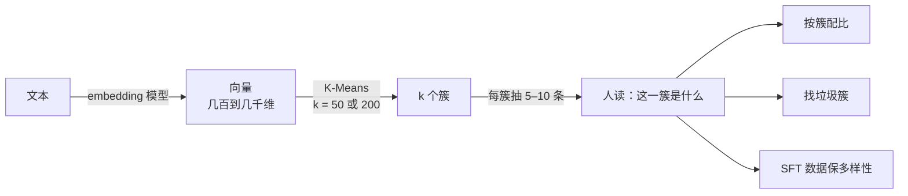
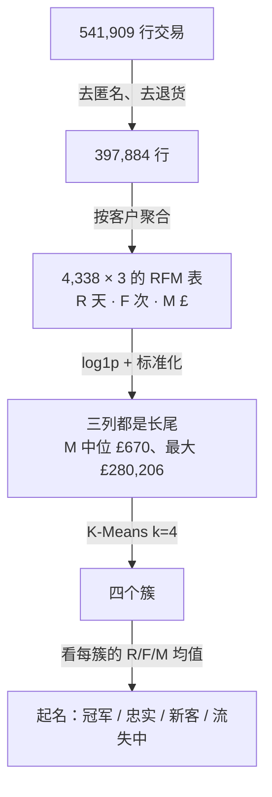

前六篇的模型都需要标签。**无监督学习**没有标签，只有 $$x$$，要回答的问题是"这批数据里有什么结构"。**聚类**是其中最常用的一种：把相似的样本归成一堆。在 LLM 的数据工程里它回答一个具体问题——**这个几十 T 的语料里有哪些主题、各占多少、哪些是垃圾**。这一篇讲三个聚类算法（K-Means、DBSCAN、层次聚类）各自怎么工作、假设什么、什么时候失效，手写 K-Means 并看它一步步收敛，最后用一个真实的小语料（78 句话过一个 0.5B 的语言模型得到句向量）把"每簇抽几条看看"跑一遍。

全篇的核心问题是：

> **K-Means 那两步为什么一定收敛，收敛到的一定是最好的吗？[^q0] 怎么知道一个语料里有什么主题、$$k$$ 该取多少？[^q1]**

## 一、总览

### 1. 三个算法、一个用途

本文按"算法 → 它的假设与失效 → 替代算法 → 在真实语料上用"组织：

| 算法 | 一句话 | 假设 | 失效 | 本文里的数字 |
|---|---|---|---|---|
| K-Means | 分成 $$k$$ 簇、每簇一个中心，反复"分配 → 更新中心" | 簇球形、大小差不多；$$k$$ 已知 | 月牙形簇切错（ARI 0.26）；局部最优 | 手写 12 行与 scikit-learn 同数：inertia 7281 |
| DBSCAN | 按密度聚：密集处连成簇、稀疏处是噪声 | 簇内密度差不多 | $$\varepsilon$$ 难选；密度不均 | 月牙 ARI 1.00；$$\varepsilon = 0.05$$ 碎成 8 簇 |
| 层次聚类 | 从每点一簇开始反复合并最近的两簇 | — | $$O(n^2)$$ 内存 | 30 个点，树状图上一刀切出 3 簇 |
| 用途 | 语料 embedding → 聚类 → 每簇抽几条看 | — | — | 78 句、$$k = 7$$：主题全对，模板文本自成一簇 |

Table: K-Means、DBSCAN 与层次聚类的假设与失效

### 2. 来龙去脉：一个为压缩发明的算法

| 年 | 谁 | 当时的问题 | 留下的东西 |
|---|---|---|---|
| 1957 | Lloyd（贝尔实验室，1982 年才正式发表） | 电话信号数字化（PCM）：把连续的电压值用最少的几个"代表值"编码，失真最小 | **Lloyd 算法**：分配到最近的代表值 → 代表值移到组均值 → 重复。这就是 K-Means 的两步（第二章）——它最初是一个**量化 / 压缩**算法，第八章的颜色量化是它的本行 |
| 1967 | MacQueen | 统计学里怎么把观测分成 $$k$$ 组 | "k-means"这个名字；证明它收敛 |
| 1963 | Ward | 分类学、社会科学里不知道该分几组 | **层次聚类**（第六章）：不定 $$k$$，画一棵树再决定切在哪 |
| 1994 | Hughes，《Strategic Database Marketing》 | 直邮营销：几十万客户，寄给谁 | **RFM**（最近一次、频率、金额）成为客户细分的标准三维——第八章的案例 |
| 1996 | Ester、Kriegel、Sander、Xu，DBSCAN | 地理数据里的簇形状不规则、还有噪声点，K-Means 的"球"不合适 | **按密度聚**（第五章）；2014 年拿 KDD 时间检验奖 |
| 2007 | Arthur & Vassilvitskii，k-means++ | 随机初始化经常落进坏的局部最优 | 初始中心彼此拉开的采样（第四章）；scikit-learn 的默认 |
| 2013– | 句向量 + K-Means | 几亿条网页 / 对话怎么看清里面有什么 | 第七章：聚类成为**数据工程的显微镜**——按簇抽样、配比、找垃圾 |

Table: 聚类方法的来历

一条线看下来，K-Means 在六十多年里换了三次身份：先是**压缩**（用 $$k$$ 个代表值替代一堆值），再是**分组**（客户、文档、基因），今天是**探索**（把一亿条数据变成一千个能看的簇）。三种用法的算法一模一样，差别只在"簇中心"拿来干什么：当代表值、当分组标签、还是当抽样入口。什么时候不该用它：簇不是球形（月牙、环——换 DBSCAN）、密度差很大、或者你其实想要一个"正确"的分组——聚类没有正确答案，只有有用与否（第七章）。


### 3. 本文的章节安排

| 章 | 主题 | 内容 |
|---|---|---|
| 二 | K-Means | 六个数手算三轮<br/>迭代过程（四帧图）<br/>最小实现与 scikit-learn 对照<br/>空簇、停止条件、最终返回值一致性 |
| 三 | $$k$$ 怎么选 | 肘部法与轮廓系数（两者不一致时怎么办） |
| 四 | 初始化 | 局部最优是真的：随机 vs k-means++（50 个 seed 的分布） |
| 五 | DBSCAN | 核心点 / 边界点 / 噪声<br/>两个月牙<br/>邻域查询与队列扩张<br/>邻域半径的作用 |
| 六 | 层次聚类 | 合并过程与树状图<br/>五点手算四种 linkage 与失效对照 |
| 七 | 聚类在数据工程里 | 78 句真实语料 → 句向量 → K-Means → 每簇抽几条；按簇配比、找垃圾簇、SFT 多样性 |
| 八 | 案例：客户分群与颜色量化 | 54 万行真实交易 → 4,338 个客户的 R/F/M → 分 4 群、每群起名；一张照片 96,615 种颜色压成 16 种——K-Means 1957 年被发明时干的活 |
| 九 | 本文小结 |  |
| 十 | 自测 | 六道题 |

Table: 本文的章节安排

## 二、K-Means

### 1. 两步反复

把 $$n$$ 个点分成 $$k$$ 簇，每簇一个**中心**，目标是让每个点到自己簇中心的距离平方和（**簇内平方和**，inertia）最小。算法只有两步反复：**分配**——每个点归到最近的中心；**更新**——每个中心移到自己簇内所有点的均值。

先在一维上手算一遍。六个数 $$\{1, 2, 3, 10, 11, 12\}$$，$$k = 2$$，故意把两个初始中心都放在左边：$$c_1 = 1, c_2 = 2$$。

| 轮 | 中心 $$c_1, c_2$$ | 分配（每个数归到更近的中心） | 簇内平方和 | 更新后的中心（各簇均值） |
|---:|---|---|---:|---|
| 1 | 1, 2 | {1} → $$c_1$$；{2, 3, 10, 11, 12} → $$c_2$$ | 246 | 1, 7.6 |
| 2 | 1, 7.6 | {1, 2, 3} → $$c_1$$；{10, 11, 12} → $$c_2$$ | 41.7 | 2, 11 |
| 3 | 2, 11 | 同上，分配没变 | 4 | 2, 11——不再移动，停 |

Table: 一维 K-Means 手算三轮

第 1 轮 $$c_2$$ 抢走了五个数，于是被它们的均值拉到了 7.6；第 2 轮 3 离 1 比离 7.6 近，回到 $$c_1$$，两个中心各归各位；第 3 轮分配不再变化，算法停止。簇内平方和 246 → 41.7 → 4，每一轮都在降。二维上是同一件事，看一遍：


```text title="K-Means 6 步收敛的簇内平方和"
6 步收敛；每步的簇内平方和： 10665 3594 841 320
```

初始化随机挑了三个点当中心，两个挤在同一团里；第一步分配之后，那个"没抢到点"的中心被更新到了两团之间，第二步就各归各位。簇内平方和从 10665 一路降到 320。


把上面的目标写成公式：

$$
J(z,C)=\sum_{i=1}^{n}\lVert x_i-c_{z_i}\rVert_2^2.
$$

$$x_i$$ 是第 $$i$$ 个点的 $$d$$ 维向量，$$z_i\in\{0,\ldots,k-1\}$$ 是它的簇号，$$C$$ 的 $$k$$ 行是中心。$$\lVert v\rVert_2^2$$ 就是把向量每个分量平方后相加。一轮先固定 $$C$$ 找每个 $$z_i$$，再固定 $$z$$ 求每组均值；这叫交替优化，不是一步求出了全局最小值。

### 2. 十二行实现

```python title="kmeans：十二行实现"
def kmeans(X, k, n_iter=100, seed=0):
    rng = np.random.default_rng(seed)
    centers = X[rng.choice(len(X), k, replace=False)]                     # ① 初始化：随机挑 k 个点当中心
    for _ in range(n_iter):
        d2 = ((X[:, None, :] - centers[None, :, :]) ** 2).sum(-1)           # ② [n, k]：每个点到每个中心的距离平方
        labels = d2.argmin(1)                                               # ③ 分配：每个点归到最近的中心
        new_centers = np.array([X[labels == j].mean(0) for j in range(k)])  # ④ 更新：每个中心移到自己簇的均值
        if np.allclose(new_centers, centers): break                         # ⑤ 中心不再移动就收敛
        centers = new_centers
    inertia = d2[np.arange(len(X)), labels].sum()                         # 簇内平方和
    return labels, centers, inertia
```

1. ② 用广播一次算出 $$n \times k$$ 个距离（第四篇 KNN 的同一招）；
2. ③④ 就是那两步；
3. ⑤ 中心不动了就停。

在一份真实有 6 簇、3000 个点的数据上，跑 10 个 seed 取簇内平方和最小的：

```text title="手写 K-Means 与 sklearn 的结果"
手写（10 个 seed 取簇内平方和最小）：inertia 7281，ARI 0.762
sklearn KMeans(6, n_init=10)：       inertia 7281，ARI 0.761
每簇样本数 [569, 500, 504, 500, 459, 468]
```

同一个算法、同一个数。**ARI**（adjusted Rand index）是有真实标签时衡量聚类与标签一致程度的指标，1 是完全一致、0 是随机水平；0.76 说明 6 簇里有两对靠得近的被部分混了。真实数据没有标签，ARI 用不上，靠第三章的判据加人眼看。

### 3. 为什么目标值不再下降

两步都不会让簇内平方和变大：**分配步**把每个点换到更近的中心，它到中心的距离只会变小；**更新步**里，一堆点到某个点的距离平方和，在那个点是均值时最小（第二篇最小二乘的一维版：$$\sum (x_i - c)^2$$ 对 $$c$$ 求导为零得 $$c = \bar x$$）。一个单调不增、有下界的量，一定收敛。这保证的是目标值收敛，不是全局最优；达到分配与均值更新的固定点后，通常称为一个**局部解**——第四章会看到从不同起点出发可以停在很不一样的地方。

### 4. 空簇与停止条件：两个实现里绕不开的细节

上面十二行有两个地方会在真实数据上出事。

**第一，某个中心一个点都没抢到。** 第 ④ 行 `X[labels == j].mean(0)` 对空簇取均值，NumPy 返回 `nan`，之后所有距离都变成 `nan`、全盘崩掉。什么时候会发生？两个初始中心落在完全相同的坐标上，或者一个中心被夹在两个更近的中心之间。构造一个最小的例子：四个点 $$\{0, 0, 10, 10\}$$，三个初始中心 $$\{0, 0, 10\}$$——两个中心重合，第一轮分配时距离相同的点全归编号小的那个，第二个中心颗粒无收。

空簇如何处理、提前停止时返回值怎样保持一致？[^q2]

**第二，什么时候停。** `np.allclose(new_centers, centers)` 是"中心几乎不动就停"；换成固定迭代次数、或者把阈值调大，会在标签与中心还没达到固定点时就退出——这时**返回的中心不是最终标签的均值**，报出来的簇内平方和也不是那组标签的最优值。

```python title="K-Means：空簇保留中心，退出后重新分配"
import numpy as np


def kmeans_safe(X, initial_centers, n_iter=100, tol=1e-8):
    X = np.asarray(X, dtype=float)
    centers = np.asarray(initial_centers, dtype=float).copy()
    if X.ndim != 2 or len(X) == 0 or X.shape[1] == 0:
        raise ValueError("X must be a nonempty matrix")
    if (
        centers.ndim != 2
        or not 1 <= len(centers) <= len(X)
        or centers.shape[1] != X.shape[1]
    ):
        raise ValueError("invalid initial centers")
    if not np.isfinite(X).all() or not np.isfinite(centers).all():
        raise ValueError("non-finite input")
    if n_iter < 1 or not np.isfinite(tol) or tol < 0:
        raise ValueError("invalid stopping parameters")
    for iteration in range(1, n_iter + 1):
        d2 = ((X[:, None] - centers[None]) ** 2).sum(-1)
        labels = d2.argmin(1)
        # !ref keep-empty-centers
        new_centers = centers.copy()
        for j in range(len(centers)):
            members = X[labels == j]
            if len(members):
                new_centers[j] = members.mean(0)
        shift = np.linalg.norm(new_centers - centers)
        # !ref update-final-centers
        centers = new_centers
        if shift <= tol:
            break
    d2 = ((X[:, None] - centers[None]) ** 2).sum(-1)
    # !ref refresh-final-labels
    labels = d2.argmin(1)
    inertia = float(d2[np.arange(len(X)), labels].sum())
    return labels, centers, inertia, iteration
```

[先复制旧中心](#keep-empty-centers)，只有非空簇才覆盖其均值；[先保存新中心再判停](#update-final-centers)；[退出循环后重新分配](#refresh-final-labels)，让标签、中心和 inertia 对应同一状态。保留空中心是教学策略，不保证消除空簇；业务若要求恰好 $$k$$ 个非空组，还需检测重复样本、减少 $$k$$ 或重新初始化。

停止实验用的是另一组点 $$[0,2,3,10]$$、初始中心 $$[0,2]$$。首轮分配为 $$\{0\}$$ 与 $$\{2,3,10\}$$，更新中心得到 $$[0,5]$$；再用新中心分配，2 改归第一个簇，因此 inertia 是 $$0^2+2^2+(3-5)^2+(10-5)^2=33$$。这解释了为什么只跑一轮时，中心还不是最终标签各组的均值。

把两件事都做一遍（空簇的处理方式是**保留这一轮之前的旧中心**，这是最保守的一种选择；scikit-learn 的做法不同，它把空簇的中心重新放到离其所属簇最远的点上）：

```text title="空簇与提前停止：实际运行输出"
=== 8. 空簇与提前停止：最终中心、标签和目标值必须对应 ===
  重复坐标 [0, 0, 10, 10]、初始中心 [0, 0, 10]：首轮计数 [2, 0, 2]
  空簇保留旧中心：中心 [0.0, 0.0, 10.0]，实际非空簇 2，inertia 0.0
  max_iter=1：1 轮，中心 [0.0, 5.0]，标签 [0, 0, 1, 1]，inertia 33.000
  max_iter=100：4 轮，中心 [1.667, 10.0]，标签 [0, 0, 0, 1]，inertia 4.667
  同一初始中心、充分迭代与 sklearn 对照：ARI 1.000，inertia 4.667
  绝对 Frobenius 位移阈值 0：4 轮，inertia 4.667
  绝对 Frobenius 位移阈值 0.0001：4 轮，inertia 4.667
  绝对 Frobenius 位移阈值 10：1 轮，inertia 33.000
  保留空中心不保证 k 个非空簇；绝对位移阈值不是 sklearn 的缩放 tol；提前停止后中心未必是最终标签的均值
```

三行结论值得记住：

1. **要了 $$k$$ 不等于拿到 $$k$$ 个非空簇**：上面 $$k = 3$$ 跑完只剩 2 个非空簇，下游代码如果假设"每簇都有数据"（按簇抽样、按簇配比）可能在求均值或抽样时出错；
2. **停止阈值是对"中心移动了多少"的约束，不是对解的质量的约束**：阈值 10 时算法一轮就停，inertia 33 比收敛值 4.667 差了七倍。这里用的是中心位移矩阵的 Frobenius 范数的**绝对**阈值；scikit-learn 的 `tol` 是按各特征方差缩放之后的相对量，两者数值不可直接比较；
3. **报数字之前先自检**：最终标签要用最终中心算一遍，inertia 要用那组标签算，三者必须对应。

去掉这两个坑之后，同一组初始中心下手写实现与 `KMeans(init=那组中心, n_init=1)` 的 ARI 是 1.000、inertia 完全相同。

## 三、$$k$$ 怎么选

$$k$$ 是超参数，算法不告诉你。两个常用判据，还是那份真实有 6 簇的数据：


| $$k$$ | 簇内平方和 | 轮廓系数 | |
|---:|---:|---:|---|
| 2 | 42,880 | **0.665** | |
| 3 | 26,439 | 0.591 | |
| 4 | 16,412 | 0.532 | |
| 5 | 8,274 | 0.609 | |
| 6 | 7,281 | 0.518 | ← 肘部 |
| 7 | 6,773 | 0.473 | |
| 8 | 6,226 | 0.468 | |
| 10 | 5,313 | 0.343 | |

Table: 不同 k 下的簇内平方和与轮廓系数

1. **肘部法**：簇内平方和随 $$k$$ 单调下降（$$k = n$$ 时为零），但下降速度在真实簇数处突然变缓——从 5 到 6 降了 1000，从 6 到 7 只降 500。曲线的"肘部"就是 $$k$$。
2. **轮廓系数**（silhouette）：对每个点算 $$a$$ = 它到自己簇内其他点的平均距离，$$b$$ = 它到最近的**别的**簇里各点的平均距离，轮廓系数 $$s = (b - a) / \max(a, b)$$：自己簇很紧（$$a$$ 小）、别的簇很远（$$b$$ 大）时接近 1；$$a \approx b$$ 时接近 0，说明这个点放哪个簇都差不多；为负说明它更像别的簇。全部点取平均，越大越好。这里它在 $$k = 2$$ 最高——因为 6 个簇两两靠近形成了 3 个大组（右图看得出来），轮廓系数偏好粗的划分。

两个判据不一致时，**按业务定**：你想看 3 个大主题还是 6 个细主题。数据工程里 $$k$$ 通常取得比"真实簇数"大得多（50、200），因为目的是让人看，不是找"正确"的划分——第七章。

## 四、初始化：局部最优是真的

第二章说 K-Means 收敛到局部最优。它有多严重？同一份 6 簇数据，随机初始化跑 50 个不同的 seed，看收敛后的簇内平方和分布：


```text title="随机初始化与 k-means++ 的 50 个 seed 对照"
50 个 seed：随机初始化的簇内平方和 中位数 7285，最差 16541，落到最优（≈7281）的比例 64%
         k-means++            中位数 7292，最差 7861，落到最优的比例 66%
```

随机初始化有 1/3 的概率停在差解，最差时是最优的两倍多——两个中心挤在同一个真簇里、另一个中心管着两个真簇（第二章四帧图的初始状态如果没有被拉开，就会停在那里）。**k-means++** 初始化：第一个中心随机挑，之后每个中心按"离已有中心越远越可能被挑到"抽样，让初始中心彼此散开——最差情况从 16541 变成 7861。本例显式设置 `init="k-means++", n_init=10`，多次运行取 inertia 最小的一次；不要把这里的 10 当成所有版本的默认值。

## 五、DBSCAN：按密度聚

### 1. K-Means 的假设

K-Means 不规定簇必须等大，但平方欧氏距离偏好**紧凑、近似球形、尺度相近的簇**。簇是长条形、月牙形、密度不同、大小差很多时，它会切错。

### 2. 三种点

**DBSCAN** 不预设簇的形状与个数。两个参数：邻域半径 $$\varepsilon$$ 与最少点数 `min_samples`。半径内有至少 `min_samples` 个点的是**核心点**；在某个核心点半径内、但自己不够核心的是**边界点**；两者都不是的是**噪声**。核心点与它半径内的点连成一簇——密集处连成片，稀疏处断开。


```text title="月牙数据：K-Means 与 DBSCAN 的 ARI"
K-Means k=2:  ARI 0.255（球形假设不成立，一刀切在中间）
DBSCAN(eps=0.15, min_samples=8): ARI 1.000，2 簇 + 0 个噪声点
```

两个交错的月牙，K-Means 用一条直线切成左右两半，DBSCAN 沿着密度把两个月牙完整地分开——不用指定 $$k$$，还能标出离群点。

### 3. 一簇是怎么被"吃"完的

"核心点与它半径内的点连成一簇"听起来含糊，实现其实很死板：挑一个还没访问过的核心点，开一个队列，把它邻域里的点全部入队并打上当前簇号；逐个出队，**只有出队的点自己也是核心点时**才把它的邻域继续入队。队列空了这一簇就结束，换下一个没被访问过的核心点开新簇。边界点为什么不能继续传播？[^q3]

```python title="DBSCAN：预计算邻域，核心点驱动队列扩张"
from collections import deque
import numpy as np


def dbscan(X, eps, min_samples):
    distances = np.linalg.norm(X[:, None] - X[None], axis=-1)
    neighbors = [np.flatnonzero(row <= eps) for row in distances]
    core = np.array([len(row) >= min_samples for row in neighbors])
    labels = np.full(len(X), -1)
    cluster = 0
    for seed in range(len(X)):
        if labels[seed] != -1 or not core[seed]:
            continue
        labels[seed] = cluster
        queue = deque([seed])
        while queue:
            point = queue.popleft()
            # !ref dbscan-border
            if not core[point]:
                continue
            for neighbor in neighbors[point]:
                if labels[neighbor] == -1:
                    # !ref dbscan-enqueue
                    labels[neighbor] = cluster
                    queue.append(neighbor)
        cluster += 1
    return labels, core
```

这段最小实现约定输入为有限的二维矩阵，$$\varepsilon\geq0$$，`min_samples` 为正整数，邻居数**包含自己**。[入队就写簇号](#dbscan-enqueue)，每点至多入队一次；[边界点直接停止](#dbscan-border)，只有核心点继续扩张。`-1` 同时表示尚未归簇的点；外层跳过非核心点，之后它仍可被某个核心点收进簇，所有扩张结束后剩下的 `-1` 才是最终噪声。教学版显式存 $$n\times n$$ 距离矩阵；大数据需换邻域索引，但不能因此改变密度可达的定义。

十个点坐标依次为 $$(0,0),(0.4,0.2),(0.2,0.5),(0.8,0.3),(1.2,0.4),(1.6,0.5),(4,4),(4.3,4.2),(4.1,4.4),(8,1)$$。例如 p0 到 p2 距离 $$\sqrt{0.2^2+0.5^2}\approx0.539<0.8$$，到 p3 为 $$\sqrt{0.8^2+0.3^2}\approx0.854>0.8$$，所以 p0 的邻域是 p0、p1、p2，刚好够 3 个。

十个点上逐步看一遍（$$\varepsilon = 0.8$$、`min_samples = 3`）：

```text title="DBSCAN 的队列扩张：实际运行输出"
=== 9. DBSCAN 的扩张：从一个核心点出发，队列怎么把一簇吃完 ===
  10 个点，eps = 0.8、min_samples = 3；每个点 eps 邻域内的点数 [3, 4, 4, 4, 3, 2, 3, 3, 3, 1]
  核心点 ['p0', 'p1', 'p2', 'p3', 'p4', 'p6', 'p7', 'p8']
  簇 0 从核心点 p0 出发，队列 ['p1', 'p2']
    取出 p1：它是核心点，把邻域里还没归属的 ['p3'] 加进队列 → 队列 ['p2', 'p3']
    取出 p2：它是核心点，把邻域里还没归属的 （没有新点） 加进队列 → 队列 ['p3']
    取出 p3：它是核心点，把邻域里还没归属的 ['p4'] 加进队列 → 队列 ['p4']
    取出 p4：它是核心点，把邻域里还没归属的 ['p5'] 加进队列 → 队列 ['p5']
    取出 p5：邻域不足 3 个，是边界点——归到簇 0，但不再向外扩
  簇 1 从核心点 p6 出发，队列 ['p7', 'p8']
    取出 p7：它是核心点，把邻域里还没归属的 （没有新点） 加进队列 → 队列 ['p8']
    取出 p8：它是核心点，把邻域里还没归属的 （没有新点） 加进队列 → 队列 空
  手写结果 [0, 0, 0, 0, 0, 0, 1, 1, 1, -1]（−1 是噪声）
  sklearn  [0, 0, 0, 0, 0, 0, 1, 1, 1, -1]——逐点相同：True
  扩张只从核心点继续：边界点被吃进簇里但不再传播，所以两个密集团之间只要没有核心点搭桥就不会连起来
```

读这段输出要注意三件事：

1. **边界点不传播**。p5 邻域里只有 2 个点、不是核心点，它被 p4 吃进簇 0，但它的邻域不再入队——所以两团点之间只要没有核心点搭桥，就不会被连成一簇。DBSCAN 的"链式连接"风险来自**核心点连成的链**，不是来自边界点。
2. **边界点的归属取决于谁先吃到它**。一个边界点同时落在两个簇的核心点邻域里时，归哪一簇取决于遍历顺序——这是 DBSCAN 少数几个与实现有关的地方（噪声点的判定则是确定的）。
3. **未归簇不等于最终噪声**。队列还没走到的边界点也暂时是 $$-1$$；本例 p9 不在任何核心点邻域内，所有队列结束后仍为 $$-1$$，才确定是噪声。

手写实现与 `sklearn.cluster.DBSCAN` 在这十个点上逐点相同（包括那个噪声点），核心点集合也一致。

### 4. 邻域半径的代价

| $$\varepsilon$$ | 簇数 | 噪声点 | ARI |
|---:|---:|---:|---:|
| 0.05 | 8 | 167 | 0.311 |
| 0.10 | 2 | 3 | 0.996 |
| 0.15 | 2 | 0 | 1.000 |
| 0.30 | 2 | 0 | 1.000 |

Table: DBSCAN 不同 ε 下的簇数、噪声点与 ARI

$$\varepsilon$$ 太小，月牙碎成 8 段、167 个点被当成噪声；合适的范围（0.1–0.3）内结果稳定。真实数据里的麻烦是**密度不均匀**：一个 $$\varepsilon$$ 对密的簇太大（把邻近簇连起来）、对稀的簇太小（碎掉），没有一个全局合适的值——HDBSCAN 是为此改进的版本。另一个代价：DBSCAN 要算每个点的邻域，大数据上比 K-Means 慢。

选择的原则：簇大致球形、想指定个数、数据量大 → K-Means；形状不规则、想自动发现个数、想标出离群点 → DBSCAN。

## 六、层次聚类

### 1. 合并过程与树状图

**层次聚类**（凝聚式）不要求先定 $$k$$：从每个点自成一簇开始，每一步合并**最近的两簇**，直到全部合成一簇。合并的整个过程画成一棵树——**树状图**（dendrogram）：


```text title="Ward 层次聚类的最后三次合并距离"
30 个点、Ward 链接：最后三次合并的距离 [5.01, 22.13, 54.12]——最后一次跳得很大 → 切成 3 簇；ARI 1.000
```

"两簇的距离"有几种定义（最近点、最远点、均值、Ward——合并后簇内平方和增加最少），Ward 最常用。读树状图：纵轴是合并时的距离，从下往上找**距离突然跳大**的那一层（5 → 22 → 54），在跳之前横切，切出几个分支就是几簇。代价是要存 $$n \times n$$ 的距离矩阵，几万个点以上就不合适；它的用处是小数据上探索结构，以及给 K-Means 找 $$k$$ 的参考。

### 2. 四种 linkage：换一个定义就是另一套簇

上一节一句"两簇的距离有几种定义"带过了，但这个选择也会改变合并次序和最终结果。四种定义：

1. **最近点**（single）：两簇之间最近的那对点的距离；
2. **最远点**（complete）：最远的那对点的距离；
3. **平均**（average）：所有跨簇点对距离的平均；
4. **Ward**：合并之后簇内平方和增加得最少（与 K-Means 同一个目标，只是贪心地合并）。


Ward 的合并代价可以直接算：

$$
\Delta(A,B)=\frac{n_A n_B}{n_A+n_B}\lVert\mu_A-\mu_B\rVert_2^2.
$$

$$n_A,n_B$$ 是两簇点数，$$\mu_A,\mu_B$$ 是均值，$$\Delta$$ 是合并后新增的簇内平方和。拿五个一维点 $$[0,1,3,5,9]$$ 手算：第一步都合并 0、1，得到 $$A=\{0,1\}$$。下一步 single 看见 $$A$$ 到 3 的最近距离为 2，与 3 到 5 的距离并列；本例实现先合并 $$A$$ 与 3。complete 下 $$A$$ 到 3 的距离是 3，average 下为 $$(3+2)/2=2.5$$，都比 3 到 5 的 2 大，因此先合并 3、5。Ward 下，$$A$$ 与 3 的增量为 $$\frac{2}{3}(0.5-3)^2=4.167$$，3 与 5 为 $$\frac12(3-5)^2=2$$，也先合并后者。**并列时的合并顺序可能随实现而异**，不能把这一次 single 的顺序当成唯一结果。

SciPy `linkage` 每行记录左右子簇编号、合并高度、点数；原始点编号 0–4，之后的新簇从 5 开始。Ward 的高度是 $$\sqrt{2\Delta}$$，不是 $$\Delta$$ 本身，且这里要求欧氏距离。

同一份数据、同一个 $$k$$，四种定义各跑一遍：


```text title="四种 linkage 在两份数据上的 ARI 与簇大小：实际运行输出"
=== 10. 层次聚类的四种 linkage：簇间距离怎么定，结果差很多 ===
  五个一维点 [0, 1, 3, 5, 9]：每行 [左簇, 右簇, 合并高度, 合并后点数]；新簇编号从 5 开始
    single: [[0.0, 1.0, 1.0, 2.0], [2.0, 5.0, 2.0, 3.0], [3.0, 6.0, 2.0, 4.0], [4.0, 7.0, 4.0, 5.0]]
    complete: [[0.0, 1.0, 1.0, 2.0], [2.0, 3.0, 2.0, 2.0], [5.0, 6.0, 5.0, 4.0], [4.0, 7.0, 9.0, 5.0]]
    average: [[0.0, 1.0, 1.0, 2.0], [2.0, 3.0, 2.0, 2.0], [5.0, 6.0, 3.5, 4.0], [4.0, 7.0, 6.75, 5.0]]
    ward: [[0.0, 1.0, 1.0, 2.0], [2.0, 3.0, 2.0, 2.0], [5.0, 6.0, 4.95, 4.0], [4.0, 7.0, 8.538, 5.0]]
  两个月牙：
    最近点（single）                  ARI 1.000，每簇大小 [150, 150]
    最远点（complete）                ARI 0.297，每簇大小 [218, 82]
    平均（average）                  ARI 0.425，每簇大小 [202, 98]
    Ward（合并后平方和增加最少）             ARI 0.241，每簇大小 [178, 122]
  一大两小、密度不同的三团：
    最近点（single）                  ARI 1.000，每簇大小 [200, 60, 40]
    最远点（complete）                ARI 1.000，每簇大小 [200, 60, 40]
    平均（average）                  ARI 0.910，每簇大小 [192, 68, 40]
    Ward（合并后平方和增加最少）             ARI 1.000，每簇大小 [200, 60, 40]
  图已保存 out/07-linkage-comparison.svg
  single 容易产生链式连接；complete 与 Ward 偏好紧凑的簇。结果依赖数据、噪声与切树位置，不是普适排名
  同一份数据、同一个 k，换个 linkage 就是另一套簇——聚类给的是一种看法，不是数据里「本来就有」的答案
```

两行数据给出不同的结果：月牙上只有 single 做对（ARI 1.000），其余三种在 0.24–0.43；一大两小的三团上 single、complete、Ward 都是 1.000，反而是 average 把大团的一角划了出去。原因是各自的偏好：**single 只要求两簇之间有一对点靠近**，所以能顺着细长的形状走，也因此在有噪声点搭桥时会把两团"链"成一团；**complete 控制最远点对，Ward 控制平方和增量**，都偏好紧凑簇，但不要求各簇等大，对细长形状会拦腰切断。没有普适的最优，只有"你的簇是什么形状"。

这也是本文反复说的那件事的最尖锐版本：同一份数据、同一个 $$k$$，换个 linkage 就是另一套簇。**聚类给的是一种看法，不是数据里"本来就有"的答案**——所以第七章把它当探索工具用，而不是当成一个要被"做对"的预测任务。

## 七、聚类在数据工程里

### 1. "这批数据里有什么"

预训练语料几十 T、SFT 数据几十万条，没人能读完。聚类是回答"这批数据里有什么"的探索工具：


```mermaid
%% 图：语料探索的标准流程：embedding → 聚类 → 抽样人读 → 决策
flowchart LR
    T[文本] -->|embedding 模型| V["向量<br/>几百到几千维"]
    V -->|"K-Means<br/>k = 50 或 200"| K[k 个簇]
    K -->|每簇抽 5–10 条| R[人读：这一簇是什么]
    R --> A[按簇配比]
    R --> B[找垃圾簇]
    R --> D[SFT 数据保多样性]
```

### 2. 在一个真实的小语料上跑一遍

78 句话：6 个主题（体育、编程、烹饪、金融、天气、医学）各 12 句，外加 6 句同一个模板换几个数字的文本（模拟爬虫抓到的模板页）。把每句话过一遍 Qwen2.5-0.5B，取最后一层隐状态对 token 做平均，得到 896 维的句向量：

```python title="Qwen2.5-0.5B 句向量的 mean pooling 与聚类"
h = model(**batch).last_hidden_state                          # [batch, T, 896]：每个 token 一个向量
m = batch["attention_mask"][..., None].float()
E = (h * m).sum(1) / m.sum(1)                                   # mean pooling：对真实 token 取平均 → 每句一个向量
En = E / np.linalg.norm(E, axis=1, keepdims=True)               # 归一化：长度变 1，之后的欧氏距离等价于余弦相似度（见下）
km = KMeans(7, n_init=10, random_state=0).fit(En)
```

第一行：模型对每个 token 输出一个 896 维向量（第三篇说的 hidden state）；第三行把一句话里所有 token 的向量取平均，得到"这句话"的一个向量（**mean pooling**），`attention_mask` 用来排除补齐用的空 token；第四行把每个向量的长度缩放成 1——两个单位向量的欧氏距离平方是 $$\lVert a - b \rVert^2 = 2 - 2\cos\theta$$，所以之后 K-Means 用的欧氏距离就是在比较方向（第四篇的余弦相似度），不受句子长短影响。

| $$k$$ | ARI（与真实主题） | 每簇大小 |
|---:|---:|---|
| 4 | 0.629 | 24, 24, 18, 12 |
| 7 | **1.000** | 12, 12, 12, 12, 12, 12, 6 |
| 10 | 0.874 | 12, 12, 12, 12, 7, 6, 5, 5, 4, 3 |

Table: 真实小语料上不同 k 的聚类 ARI 与簇大小

$$k = 7$$ 时每簇抽两条：

| 簇 | 大小 | 抽出来的两条 | 人读一眼的判断 |
|---:|---:|---|---|
| 0 | 12 | 央行宣布下调基准利率 25 个基点… / 这家公司季度营收超出预期… | 金融 |
| 1 | 12 | 冷空气明天抵达，气温将下降… / 台风外围云系影响沿海地区… | 天气 |
| 2 | 12 | 这个函数在空列表上会抛出索引越界… / 把循环改成向量化的 NumPy 操作… | 编程 |
| 3 | 12 | 先把洋葱用小火炒到透明… / 面团要醒发一小时… | 烹饪 |
| 4 | 12 | 病人的血压持续偏高… / 这种抗生素对革兰氏阴性菌有效… | 医学 |
| 5 | **6** | 欢迎访问本站，本页面共有 12 条记录… / 欢迎访问本站，本页面共有 37 条记录… | **模板页——垃圾簇** |
| 6 | 12 | 昨晚的比赛进入加时… / 马拉松选手在 35 公里处开始掉速… | 体育 |

Table: k = 7 时每簇抽样与人读判断

每簇读两条就知道这一簇是什么，簇的大小就是主题占比，模板文本自成一簇——三件事同时看到了。$$k$$ 取 4 时体育与天气、金融与编程被合并（ARI 0.63），$$k$$ 取 10 时几个主题被拆成两半（0.87）——但对"看看有什么"这个目的，三个 $$k$$ 都能用。

### 3. 三个具体用法

1. **按簇配比**：某个主题（比如 SEO 垃圾、模板页）占了 20%，按簇采样把它压到 2%；某个想要的主题太少，定向补。这是 L4 预训练系列"数据配比"决策的第一步——**先知道有什么，再决定要多少**。
2. **找垃圾簇**：爬虫抓到的乱码、导航栏、cookie 提示常常自成一簇（上表的簇 5）——比写规则更快地发现它们。
3. **SFT 数据的多样性**：几万条指令按簇采样，保证各类任务都有、没有一类占太多；也用来发现"这 500 条其实是同一个模板"的近重复（第九篇用 MinHash 做精细版）。

三个用法都不需要聚类"正确"——$$k$$ 取 50 还是 200、边界切在哪，对"看看有什么"影响不大。这是无监督学习在工程里最常见的角色：**探索，而不是预测**。

## 八、案例：客户分群与颜色量化——K-Means 的两个本行

第七章用 78 句话演示了"聚类是探索"。这一章两个更大的真实数据：一个是 K-Means 最经典的商业用法（客户分群），一个是它 1957 年被发明时的本行（量化）。完整脚本 [`case_07_customer_segments.py`](https://github.com/arganzheng/ai-learning-labs/blob/main/classical-ml/case_07_customer_segments.py)（`rfm` / `colors` 两个子实验）。

### 1. 客户分群：RFM + K-Means

**问题与数据**：UCI Online Retail——一家英国网店 2010-12 到 2011-12 的 541,909 行交易记录（发票号、商品、数量、单价、客户号、国家）。运营想知道：几千个客户里，谁是要维护的大客户、谁快流失了、谁是新客——然后对每一群做不同的事。这是 1994 年以来直邮营销的标准做法：**RFM**——每个客户三个数，R（Recency，最近一次购买距今几天）、F（Frequency，买过几次）、M（Monetary，一共花了多少）。

清洗是真实数据的第一课：135,080 行没有客户号（匿名结账）、10,624 行是退货（数量为负、发票号以 C 开头），去掉之后剩 397,884 行、4,338 个客户、18,532 张发票。

**思路**：


```mermaid
%% 图：从 54 万行交易到四群客户
flowchart TB
    T["541,909 行交易"] -->|去匿名、去退货| T2["397,884 行"]
    T2 -->|按客户聚合| R["4,338 × 3 的 RFM 表<br/>R 天 · F 次 · M £"]
    R -->|log1p + 标准化| S["三列都是长尾<br/>M 中位 £670、最大 £280,206"]
    S -->|K-Means k=4| K["四个簇"]
    K -->|看每簇的 R/F/M 均值| N["起名：冠军 / 忠实 / 新客 / 流失中"]
```

三列都是长尾（M 中位数 £670、最大 £280,206），直接算欧氏距离会被几个大客户主导——先 `log1p` 再标准化（第二章的"必须标准化"在真实数据上的样子）。

```python title="RFM：清洗与聚合"
df = raw[raw.customer_id.notna() & (raw.quantity > 0) & ~raw.invoice.str.startswith("C")]
now = df.invoice_date.max() + pd.Timedelta(days=1)
rfm = df.groupby("customer_id").agg(R=("invoice_date", lambda d: (now - d.max()).days),   # 最近一次距今几天
                                    F=("invoice", "nunique"),                             # 买过几次
                                    M=("amount", "sum"))                                  # 一共花了多少
Xs = StandardScaler().fit_transform(np.log1p(rfm.values))
for k in range(2, 9):                                                                    # 第三章：k 怎么选
    km = KMeans(k, n_init=10, random_state=0).fit(Xs)
    print(k, km.inertia_, silhouette_score(Xs, km.labels_))
rfm["cluster"] = KMeans(4, n_init=10, random_state=0).fit_predict(Xs)
rfm.groupby("cluster").agg(人数=("R", "size"), R=("R", "mean"), F=("F", "mean"), M=("M", "mean"))
```

**效果**：$$k$$ 怎么选——轮廓系数在 $$k = 2$$ 最高（0.433），但"活跃 / 不活跃"两群对运营没用；惯性的拐点在 4 附近，且 4 群每群都能起出名字。这是第三章说的"两个指标不一致时怎么办"：**看业务能不能用**。

| 簇 | 人数 | R 均值（天） | F 均值（次） | M 均值（£） | M 合计占比 | 画像 |
|---|---:|---:|---:|---:|---:|---|
| 1 | 714 | 12 | 14.0 | 8,093 | **64.8%** | 冠军：最近来过、买得最多 |
| 2 | 1,168 | 72 | 4.0 | 1,806 | 23.7% | 忠实：常来、花得不少 |
| 3 | 832 | 18 | 2.0 | 562 | 5.2% | 新客 / 低频：最近来过一两次 |
| 0 | 1,624 | 181 | 1.0 | 342 | 6.2% | 流失中：半年没来 |

Table: 4,338 个客户的四群画像


读法：**714 个人（16%）贡献了 65% 的营业额**——这是零售业的常识（帕累托），K-Means 把它从 54 万行里算了出来；**1,624 个人（37%）平均 181 天没来**，只买过一次，这一群是"流失召回"的名单。四群对应四个动作：冠军维护（别让他们走）、忠实升级（推更贵的）、新客促复购（第二单优惠券）、流失召回（唤醒短信）。**K-Means 没有"发现"这四群**——它只是把三维空间切成了四块；给每块起名字、决定对它做什么，是人的事。这就是第七章"探索，不是预测"在商业上的形态。

### 2. 颜色量化：一张照片 96,615 种颜色 → 16 种

**问题**：一张 640×427 的照片有 273,280 个像素、96,615 种不同的颜色，每像素 24 位 = 801 KB。GIF 只能存 256 色、早期显示器只有 16 色——怎么用 $$k$$ 种颜色画这张图、看起来最不失真？这正是 Lloyd 1957 年的问题（电话信号用几个电平编码），只是把一维的电压换成三维的 RGB。

**思路与代码**：每个像素是 RGB 空间里的一个点，K-Means 找 $$k$$ 个簇中心（"代表色"），每个像素换成离它最近的代表色。拟合只用随机抽的 1 万个像素就够：

```python title="颜色量化：16 色 K-Means"
img = load_sample_image("china.jpg")                  # [427, 640, 3]，scikit-learn 自带的示例图
pixels = img.reshape(-1, 3) / 255                     # 273,280 个三维的点
km = KMeans(16, n_init=4, random_state=0).fit(pixels[rng.choice(len(pixels), 10000)])
quantized = km.cluster_centers_[km.predict(pixels)]   # 每个像素 → 离它最近的代表色
```

**效果**：

| $$k$$ | 每像素位数 | 文件大小 | 相对原图 | 均方误差（0–255 尺度） |
|---:|---:|---:|---:|---:|
| 2 | 1 | 33 KB | 4.2% | 1,285 |
| 4 | 2 | 67 KB | 8.3% | 456 |
| 16 | 4 | 133 KB | 16.7% | 115 |
| 64 | 6 | 200 KB | 25.0% | 38 |
| 原图 | 24 | 801 KB | 100% | 0 |

Table: 颜色量化——k 种颜色的大小与失真


$$k = 16$$ 时文件是原来的 1/6、已经能看；$$k = 64$$ 几乎看不出差别、1/4 大小。K-Means 的"惯性"（各点到簇中心的距离平方和）在这里有了物理意义——**它就是压缩失真**，第三章那条肘部曲线就是"多用一位能少多少失真"。这也是理解 LLM 权重量化（把权重压成 4 位，L4 第十二篇）的最直观入口：把一堆数用少数几个代表值替代，代表值怎么选、失真怎么算，是同一件事。

**落地还差什么**：RFM 分群要**定期重跑**——客户在群之间流动，上个月的冠军这个月可能进了流失名单，运营看的是群之间的迁移矩阵；聚类结果要和 A/B 测试连起来——对"流失中"发唤醒短信到底有没有用，聚类不回答，实验才回答；颜色量化在今天的图像压缩里已被 JPEG / WebP 的变换编码取代，但同一个算法活在向量数据库的**乘积量化**（PQ）里——把 768 维 embedding 切成 96 段、每段用 K-Means 量化成 256 个代表值，内存降 24 倍——向量检索系统（Faiss 的 IVF-PQ）的标配。

## 九、本文小结

- **K-Means**：分配 → 更新中心反复，12 行；每步簇内平方和不增（更新步的均值是最小二乘解）所以一定收敛，但到**局部最优**——随机初始化 1/3 的概率停在差解、最差是最优的两倍，k-means++ 让初始中心散开、再加 `n_init` 多跑几次。手写与 scikit-learn 同数（inertia 7281、ARI 0.76）。
- **$$k$$**：肘部法（簇内平方和的拐点）或轮廓系数，两者不一致时按业务定；数据工程里 $$k$$ 取得大（50–200），目的是让人看。
- **DBSCAN** 按密度聚：核心点 / 边界点 / 噪声；不用指定 $$k$$、能找任意形状、能标离群点——两个月牙 K-Means ARI 0.26 vs DBSCAN 1.00；代价是 $$\varepsilon$$ 难选（0.05 碎成 8 簇）、密度不均时没有全局合适的值、大数据慢。
- **层次聚类**：反复合并最近两簇，树状图上找合并距离突然跳大的那一层横切；$$O(n^2)$$ 内存，小数据探索用。
- **数据工程**：文本 → 句向量（模型最后一层 mean pooling、归一化）→ K-Means → 每簇抽几条人读。78 句真实语料 $$k = 7$$ 主题全对、模板页自成一簇；用法是按簇配比、找垃圾簇、SFT 保多样性——**探索，不是预测**，聚类不需要"正确"。

- **案例**：54 万行交易 → 4,338 个客户 RFM → K-Means 4 群：714 个冠军贡献 65% 营业额、1,624 个半年没来；$$k$$ 按业务能否起名选，不只看轮廓系数。颜色量化：96,615 色 → 16 色，1/6 大小——K-Means 1957 年的本行，惯性 = 失真。

配套代码：本文全部数字与图由 [`classical-ml/07_clustering.py`](https://github.com/arganzheng/ai-learning-labs/blob/main/classical-ml/07_clustering.py) 产生（`iterate` / `kmeans` / `choose_k` / `init` / `dbscan` / `hierarchical` / `corpus` / `edge` / `expand` / `linkage` 十个子实验；第八章案例由 [`case_07_customer_segments.py`](https://github.com/arganzheng/ai-learning-labs/blob/main/classical-ml/case_07_customer_segments.py) 产生，首次运行下载 23 MB 的交易表；语料与句向量在同目录 `_sentences.py`，第一次运行加载本地缓存的 Qwen2.5-0.5B，之后读 `out/sentence_embeddings.npz`）；模型与真实数据需首次下载，运行时长随硬件和缓存而变。

## 十、自测

1. K-Means 的簇内平方和为什么随 $$k$$ 单调下降？$$k = n$$ 时是多少？

   <details markdown="1"><summary>答案</summary>

   多一个中心只会让点到最近中心的距离不增；$$k = n$$ 时每点自成一簇，为 0。

   </details>

2. K-Means 的更新步为什么把中心移到均值，而不是中位数或别的点？

   <details markdown="1"><summary>答案</summary>

   目标是距离**平方**和，一堆点到某点的距离平方和在均值处最小（对 $$c$$ 求导为零得 $$c = \bar x$$）；若目标换成绝对距离和，就该用中位数（K-Medians）。

   </details>

3. 同一份数据跑两次 K-Means 得到不同的簇内平方和 7281 与 16541。发生了什么？怎么避免？

   <details markdown="1"><summary>答案</summary>

   收敛到了不同的局部最优（后者两个中心挤在一个真簇里）；用 k-means++ 初始化并 `n_init` 多跑几次取最小。

   </details>

4. 一批数据里有一个很大的簇和三个很小的簇，K-Means $$k = 4$$ 会怎样？该用什么？

   <details markdown="1"><summary>答案</summary>

   K-Means 并不强制等大；当拆分大簇带来的平方和下降超过保留小簇的收益时，可能拆大簇、并小簇。需同时看间距、尺度与样本量；DBSCAN 与层次聚类也要按密度和 linkage 选择，不能保证替换就对。

   </details>

5. DBSCAN 的 $$\varepsilon$$ 从 0.15 调到 0.05，簇数与噪声点数各怎么变？

   <details markdown="1"><summary>答案</summary>

   簇变多（碎成 8 段）、噪声变多（167 个）——半径小了，很多点凑不够 `min_samples` 个邻居。

   </details>

6. 给 50 万条 SFT 数据做多样性检查，$$k$$ 取 200 而不是"真实簇数"，为什么可以？

   <details markdown="1"><summary>答案</summary>

   目的是让人每簇抽几条看有什么、按簇配比，不需要划分"正确"；$$k$$ 大一点只是把大主题拆细，不影响这三个用法。

   </details>

## 下一篇

聚类回答"有哪些堆"，下一篇回答另一个问题：896 维的句向量怎么"看"？**降维**——PCA 找方差最大的方向、它与 SVD 的关系、解释方差告诉你数据的有效维度；t-SNE / UMAP 画出好看的二维图；以及本文那批句向量里藏着的一个陷阱——任意两句的余弦相似度都在 0.5 以上。

[^q0]: 分配步把每个点换到更近的中心、更新步把中心移到均值（一堆点到某点的距离平方和在均值处最小），两步都不让簇内平方和变大，单调有界保证目标值收敛，不保证全局最优；达到分配与均值更新的固定点后，通常称为局部解：随机初始化 50 次里约 1/3 停在差解、最差是最优的两倍（16541 vs 7281）；k-means++ 让初始中心散开，再 `n_init` 多跑几次取最好。详见[第二章](#二k-means)、[第四章](#四初始化局部最优是真的)。
[^q1]: 文本过 embedding 模型（最后一层隐状态 mean pooling、归一化）→ K-Means → 每簇抽几条人读：簇的内容就是主题、大小就是占比、模板页自成一簇。78 句真实语料 $$k = 7$$ 主题全对。$$k$$ 用肘部法或轮廓系数，两者不一致按业务定；数据工程里 $$k$$ 取 50–200——聚类在这里是探索工具，不需要「正确」。详见[第三章](#三k-怎么选)、[第七章](#七聚类在数据工程里)。

[^q2]: 空簇可暂留旧中心，但不保证得到 k 个非空簇。每次更新后再判断中心位移，退出后用最终中心重算标签和 inertia；提前停止时这些中心未必是最终标签各组的均值。四点实验一轮为 33，充分迭代为 4.667。详见[第二章](#二k-means)。
[^q3]: DBSCAN 的扩张边必须从核心点出发。边界点只有被邻域接纳的资格，没有继续传播的资格；入队即标记可避免重复排队，所有队列结束后仍未归簇的点才是噪声。详见[第五章](#五dbscan按密度聚)。
