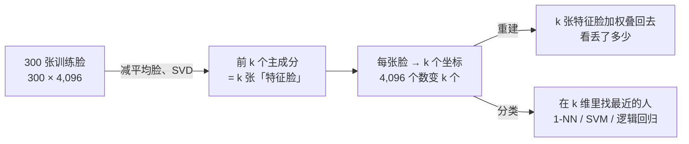

上一篇的句向量有 896 维，一个 LLM 的 hidden state 有 4096 维。人看不了 896 维的东西，但可以问两个问题：这些维度里**真正有信息的有几个**？能不能把它们**画在纸上**？**降维**回答这两个问题。主角是 **PCA**（主成分分析）——找数据方差最大的几个方向，把数据投影上去。它简单到四行代码，但连着三件后面反复出现的事：它就是 L0 第三篇的 SVD；它给出的"有效维度"是 LoRA 低秩假设的直觉来源；用它看一眼 embedding，会发现一个让"余弦相似度 0.8"失去含义的陷阱。

全篇的核心问题是：

> **PCA 的"方差最大的方向"到底在找什么，为什么它等于 SVD？[^q0] 4096 维的 embedding 怎么"看"，二维图上的距离能信吗？[^q1] 为什么一个 embedding 模型算出来任意两句话的余弦相似度都在 0.7 以上？[^q2]**

## 一、总览

### 1. 从一个方向到一张图

本文按"PCA 是什么 → 它给出什么数字 → 怎么画图 → 在真实 embedding 上看到什么"组织：

| 概念 | 一句话 | 本文里的数字 |
|---|---|---|
| PCA 的几何 | 找投影后方差最大的方向 | 二维例子：PC1 方向方差 3.44，随手挑的方向 1.34 |
| 手写 PCA | 中心化 → SVD → 取前 $$k$$ 行 | 与 scikit-learn 差 $$3 \times 10^{-13}$$ |
| 解释方差 | 前 $$k$$ 个主成分占总方差的比例 = 数据的有效维度 | 手写数字 64 维里 29 维解释 95% |
| 重建 | 均值 + 前 $$k$$ 个坐标 × 方向 | $$k = 30$$ 时重建误差 0.77，肉眼看不出差别 |
| PCA = SVD = 协方差特征分解 | 三种算法同一个答案 | 前 3 个特征值 179.0 / 163.7 / 141.8 三种算法全同 |
| t-SNE / UMAP | 非线性、只保局部、不可逆 | 二维图上 KNN 准确率：PCA 0.60，t-SNE 0.98 |
| 各向异性 | 所有向量挤在一个窄锥里 | 78 句真实句向量：任意两句余弦均值 0.79，减均值后 −0.01 |

Table: 降维的概念与本文里的数字

### 2. 来龙去脉：一百二十年的同一个想法

| 年 | 谁 | 当时的问题 | 留下的东西 |
|---|---|---|---|
| 1901 | Pearson | 一堆二维点，找"最贴合"它们的一条线——不是回归（那要分 $$x$$ 和 $$y$$），是对称的 | **PCA 的几何**：让点到线的垂直距离平方和最小 = 让投影的方差最大（第二章） |
| 1933 | Hotelling | 心理测量：几十项测试分数背后有几个"因子" | "主成分"这个名字；把 Pearson 的一条线推到 $$k$$ 个正交方向 |
| 1936 | Eckart & Young | 用一个低秩矩阵逼近一个矩阵，最优解是什么 | **截断 SVD 是最优低秩近似**——PCA、SVD、协方差特征分解是一件事（第四章） |
| 1987 / 1991 | Sirovich & Kirby；Turk & Pentland | 计算机怎么认人脸——4,096 个像素太多、机器太慢 | **Eigenfaces**：人脸投到前几十个主成分上再比——第八章的案例；第一个实用的人脸识别系统 |
| 2008 | van der Maaten & Hinton，t-SNE | 高维数据画到二维，PCA 保住了大方向但簇糊在一起 | 保**近邻**而不是保方差的降维（第六章）；十年里几乎每篇 embedding 论文都有一张 |
| 2018 | McInnes 等，UMAP | t-SNE 太慢、全局结构不可信 | 更快、保一点全局结构；今天的默认 |
| 2021 | Hu 等，LoRA | 微调一个 70 亿参数的模型要存多少 | **权重更新是低秩的**——第五章：一个真实权重矩阵的奇异值谱衰减得很快，所以 $$\Delta W = BA$$ 用两个瘦矩阵就够 |

Table: 降维方法的来历

一条线看下来，同一个想法用了一百二十年：**高维数据的变化只发生在少数几个方向上**。Pearson 用它找一条线，Hotelling 找几个因子，Turk & Pentland 用它认人脸，LoRA 用它省显存。PCA 至今是所有降维的第一步和基线，因为它有闭式解、方向可解释、能重建；t-SNE / UMAP 拿走的是"画图"这一个用途。什么时候不该用 PCA：数据的结构是弯的（一条螺旋线，PCA 的直线方向抓不住——换 t-SNE / UMAP 或第五篇的核 PCA）、或者你要的是可分性而不是方差（两类的差别可能正好在方差最小的方向上——换 LDA）。


### 3. 本文的章节安排

| 章 | 主题 | 内容 |
|---|---|---|
| 二 | PCA 的几何 | 投影是什么（一个点手算）<br/>四个点沿三个方向的方差<br/>二维例子：哪个方向方差最大 |
| 三 | 手写 PCA | 四行 SVD<br/>手写数字 64 维的解释方差曲线<br/>用前 $$k$$ 维重建图像 |
| 四 | 三个名字一件事 | 协方差矩阵特征分解 = 数据矩阵 SVD = PCA；数字对上 |
| 五 | 有效维度与低秩 | 29 维解释 95% 意味着什么<br/>一个真实权重矩阵的奇异值谱<br/>LoRA |
| 六 | 画在二维上 | PCA vs t-SNE；二维图能信什么、不能信什么 |
| 七 | embedding 的各向异性 | 真实句向量的余弦分布<br/>减均值前后<br/>检索例子 |
| 八 | 案例：Eigenfaces | 400 张 64×64 人脸：平均脸与特征脸长什么样<br/>50 个数重建一张 4,096 像素的脸<br/>PCA + 分类器认人 94%<br/>whiten 的一个坑 |
| 九 | 本文小结 |  |
| 十 | 自测 | 六道题 |

Table: 本文的章节安排

## 二、PCA 的几何

### 1. 哪个方向方差最大

200 个二维的点，一团拉长、倾斜的云。想把它压成一维（每个点只留一个数），该往哪个方向投影？


```text title="二维点云的主成分与投影方差"
两个主成分方向 [-0.825 -0.565], [ 0.565 -0.825]（互相垂直）
解释方差比 [0.907 0.093]：第一主成分占 90.7%
投影到 PC1（方差最大的方向）：投影后的方差 3.442
投影到随手挑的方向（竖直）：投影后的方差 1.340
```

**投影**：把每个点沿垂直方向"压"到一条直线上，只保留它在这条线上的坐标。算一个：直线方向用一个长度为 1 的向量 $$u$$ 表示，点 $$x$$ 在这条线上的坐标就是点积 $$x^T u$$。取 $$u = (1, 1) / \sqrt 2 = (0.707, 0.707)$$（45° 方向），点 $$x = (3, 1)$$ 的坐标是 $$3 \times 0.707 + 1 \times 0.707 = 2.83$$；把这个坐标乘回方向 $$2.83 \cdot u = (2, 2)$$ 就是"压到直线上之后的点"，它与原点 $$(3, 1)$$ 的差 $$(1, -1)$$ 垂直于直线，是被丢掉的部分。

压到不同的直线上，点散开的程度（方差）不同。四个已中心化的点 $$(2, 2), (-2, -2), (1, -1), (-1, 1)$$，试三个方向：

| 方向 $$u$$ | 四个点的投影坐标 | 坐标的方差（平方的平均） |
|---|---|---:|
| $$(1, 1)/\sqrt 2$$ | 2.83, −2.83, 0, 0 | **4.0** |
| $$(1, 0)$$（横轴） | 2, −2, 1, −1 | 2.5 |
| $$(1, -1)/\sqrt 2$$ | 0, 0, 1.41, −1.41 | 1.0 |

Table: 四个点沿三个方向的投影方差

沿 45° 方向投影，四个点散得最开（两个点在远端、两个点重合在原点）；沿 −45° 方向，前两个点都压成了 0，散得最窄。PCA 找的是**投影后方差最大**的方向——方差最大意味着点之间的差别保留得最多、丢掉的信息最少。这个方向叫**第一主成分**（PC1）。第二主成分在与 PC1 垂直的方向里再找方差最大的，依此类推，$$d$$ 维数据有 $$d$$ 个互相垂直的主成分。四个点的例子里 PC1 就是 $$(1, 1)/\sqrt 2$$、方差 4，PC2 是与它垂直的 $$(1, -1)/\sqrt 2$$、方差 1；两者相加 5 是总方差（每个点到原点距离平方的平均：$$(8 + 8 + 2 + 2)/4 = 5$$），PC1 占 $$4/5 = 80\%$$——这个比例叫**解释方差比**。上面 200 个点的云 90.7% 的方差在 PC1 上——压成一维只丢 9.3%。

### 2. 为什么是"方差"

换个说法：把点投到一条线上再"抬回"原空间，与原来的点有一个距离（重建误差）。让重建误差之和最小的直线，恰好就是方差最大的直线——两者是同一件事。上一节 $$(3, 1)$$ 的例子：点到原点距离² 是 $$9 + 1 = 10$$，投影坐标² 是 $$2.83^2 = 8$$，残差 $$(1, -1)$$ 的长度² 是 2，$$10 = 8 + 2$$——勾股定理。对每个点都有"距离² = 投影² + 残差²"，左边与方向无关（点在那里不动），所以让投影² 的总和最大，就是让残差² 的总和最小。第二篇最小二乘也是找一条线让残差最小，但那里的残差是竖直的（只看 $$y$$ 的误差），这里是垂直于直线的（$$x$$、$$y$$ 一起算），所以两条线不一样。


### 3. 从一条线推广到 k 个方向

把 $$n$$ 个 $$d$$ 维样本排成矩阵 $$X$$，减去各列均值得到 $$X_c$$。令 $$V_k$$ 为 $$d\times k$$ 矩阵，每列是一个单位方向，且两两垂直：$$V_k^T V_k=I$$。坐标 $$Z=X_cV_k$$ 是 $$n\times k$$，重建 $$\hat X=\mathbf1\mu^T+ZV_k^T$$ 回到 $$n\times d$$。

两个目标是：

$$
\max_{V_k^TV_k=I}\frac{\lVert X_cV_k\rVert_F^2}{n-1},
\qquad
\min_{V_k^TV_k=I}\lVert X_c-X_cV_kV_k^T\rVert_F^2.
$$

$$\lVert M\rVert_F^2$$ 是矩阵每个元素平方后求和；前式是所保留方向的方差总和，后式是全部样本的重建残差平方和。因为投影与残差垂直，

$$
\lVert X_c\rVert_F^2=\lVert X_cV_k\rVert_F^2+\lVert X_c-X_cV_kV_k^T\rVert_F^2.
$$

左边固定，两个目标才等价；**正交约束、中心化与平方欧氏误差是条件，不是可省略的装饰**。本章四个点的总平方长度为 20，两个方向的奇异值为 4、2：保留第一个方向留下 $$4^2=16$$，丢掉 $$2^2=4$$，每个样本的残差平方均值为 1；若再除以两列像素，则逐元素 MSE 为 0.5。由此也能区分“总平方误差”“每样本误差”和后文的逐元素 MSE。

## 三、手写 PCA

### 1. 四行

```python title="pca：四行 SVD"
def pca(X, k):
    Xc = X - X.mean(0)                                        # ① 中心化
    U, S, Vt = np.linalg.svd(Xc, full_matrices=False)         # ② 数据矩阵的 SVD：Vt 的每一行是一个主成分方向
    explained = S ** 2 / (len(X) - 1)                         # ③ 每个主成分的方差 = 奇异值² / (n−1)
    return Xc @ Vt[:k].T, Vt[:k], explained / explained.sum()  # ④ 投影到前 k 个方向 [n, k]；方向；各主成分的解释方差比
```

1. ① 减掉均值——PCA 找的是围绕均值的方差方向，不减均值时主方向会受均值影响，可能主要指向数据云的位置；
2. ② 对中心化后的 $$n \times d$$ 数据矩阵做 [SVD](# "tip: 奇异值分解（singular value decomposition）：任何矩阵都能写成 X = U Σ Vᵀ——「旋转 · 沿几个互相垂直的方向拉伸 · 再旋转」。Σ 对角线上的拉伸倍数叫奇异值，按大小排列；Vᵀ 的每一行是一个被拉伸的方向。对数据矩阵而言，拉得最长的方向就是数据散得最开的方向")，$$V^T$$ 的行就是主成分方向、已按方差从大到小排好。四个点的例子：`svd` 返回的奇异值是 $$4, 2$$，$$V^T$$ 的两行是 $$(1, 1)/\sqrt 2$$ 与 $$(1, -1)/\sqrt 2$$（可能差一个负号）；
3. ③ 奇异值的平方除以 $$n - 1$$ 就是该方向上的方差（第四章证明；四个点用 $$n$$ 而不是 $$n - 1$$ 除：$$4^2 / 4 = 4$$、$$2^2 / 4 = 1$$，正是上一章手算的两个方差）；
4. ④ 投影 = 数据矩阵乘前 $$k$$ 个方向。

```text title="手写 PCA 与 sklearn 的最大差"
前 10 维投影坐标与 sklearn 的最大差 3.2e-13（符号对齐后）
```

与 `sklearn.decomposition.PCA` 逐元素相差 $$10^{-13}$$（"符号对齐"：一个方向乘 −1 仍是同一个方向，两个实现可能选相反的符号）。

### 2. 解释方差：手写数字

1797 张 8×8 的手写数字，每张 64 个像素 = 64 维：


| 前 $$k$$ 个主成分 | 1 | 2 | 5 | 10 | 20 | 30 |
|---|---:|---:|---:|---:|---:|---:|
| 累计解释方差 | 14.9% | 28.5% | 54.5% | 73.8% | 89.4% | 95.9% |

Table: 手写数字前 k 个主成分的累计解释方差

解释 95% 需要 29 维（原 64 维）。64 个像素之间高度相关（一个像素黑，它旁边的也大概率黑），真正独立变化的方向远少于 64。

### 3. 重建：前 $$k$$ 维还原一张图

降维之后能还原吗？**重建** = 均值 + 前 $$k$$ 个坐标 × 前 $$k$$ 个方向：

```python title="用前 k 个主成分重建"
rec = mu + Z[i, :k] @ V[:k]        # Z[i, :k]：这张图在前 k 个主成分上的坐标；V[:k]：前 k 个方向
```


| $$k$$ | 1 | 2 | 5 | 10 | 30 |
|---|---:|---:|---:|---:|---:|
| 全部 1797 张的平均重建 MSE | 15.98 | 13.42 | 8.54 | 4.91 | 0.77 |

Table: 前 k 个主成分重建的平均 MSE

用 10 个数（而不是 64 个）就能存一张认得出来的数字，30 个数就肉眼无差——这就是"64 维数据基本上是低维的"的直观含义。


### 4. 中心化、标准化与白化

三种操作都在调整数值，为什么不能互换？[^q3] 它们改的是三个不同的对象：

| 操作 | 计算 | 改变的是什么 | 工程条件 |
|---|---|---|---|
| 中心化 | $$x_{ij}-\mu_j$$ | 把原点移到样本均值 | 均值只在训练集估计 |
| 标准化 | $$(x_{ij}-\mu_j)/s_j$$ | 调整原始各列的单位，让它们按相近尺度竞争 | $$s_j$$ 是该列标准差，常量列需单独处理 |
| PCA 白化 | $$z_{ir}/\sqrt{\lambda_r}$$ | 在旋转后的主成分轴上拉平方差 | $$\lambda_r>0$$；小特征值方向会被放大 |

Table: 中心化、标准化与 PCA 白化的不同对象

继续用四点例子：若把整个点云平移到 $$(100,100)$$ 附近，中心化后方向和方差不变；不中心化就会把“离原点很远”混进目标。若把第二列的单位放大 100 倍，中心化仍消不掉这个尺度差，需标准化才能让两列按相对变化竞争。最后，原例两个投影方向按样本方差计为 $$16/3$$ 与 $$4/3$$，白化分别除以 $$4/\sqrt3$$ 与 $$2/\sqrt3$$，第二个方向被相对放大两倍；它与逐原始列标准化不是同一回事。

在乳腺癌数据的 569 行、30 个测量特征上验证：
```text title="中心化、标准化、白化在真实特征上的运行结果"
=== 8. 中心化、标准化、白化：三件不同的事 ===
  数据 (569, 30)：各列标准差从 0.0026（fractal dimension error）到 568.9（worst area）
  不中心化：第一「主成分」与均值向量的 |余弦| 0.9995——它指的是数据云的位置，不是数据的变化方向
  中心化、不标准化：PC1 解释 98.2%，载荷最大的列是 worst area（量纲最大的那列）
  标准化（每列减均值除标准差）之后：PC1 解释 44.3%，前 3 个 72.6%——各列按相关性而不是按单位大小竞争
  PCA 之后（未白化）：10 个坐标两两不相关（协方差矩阵非对角最大 4.7e-15），但方差从 13.30 到 0.351 不等
  白化之后：协方差矩阵与单位阵的最大偏差 2.2e-15——每个方向方差都是 1
  三件事互不替代：中心化决定主成分是不是「变化方向」；标准化决定各列按什么尺度竞争；白化把尺度全抹平，低方差方向也会被放大；是否有益必须在留出集上比较
  图已保存 out/08-centering-scaling-whitening.svg
```


不标准化时，“worst area”所在的大尺度方向几乎独占第一主成分；标准化后 PC1 从 98.2% 变成 44.3%。**这不是信息突然变少了，而是评价距离的尺度变了**，两个百分比的分母不再是同一个总方差。协方差不相关也不等于统计独立，PCA 只消除了二阶的线性相关。

下面的核心计算在保留主成分方差非零时可直接运行；`ddof=1` 与 $$n-1$$ 的样本协方差口径一致：

```python title="在标准化空间做 PCA，再沿主成分轴白化"
import numpy as np
from sklearn.datasets import load_breast_cancer
from sklearn.preprocessing import StandardScaler

X = StandardScaler().fit_transform(load_breast_cancer().data)
Xc = X - X.mean(0)
_, singular_values, Vt = np.linalg.svd(Xc, full_matrices=False)
Z = Xc @ Vt[:10].T
variances = singular_values[:10] ** 2 / (len(X) - 1)
# !ref whiten-coordinates
Zw = Z / np.sqrt(variances)
np.testing.assert_allclose(np.cov(Zw.T), np.eye(10), atol=1e-10)
```

[除以每个主成分的标准差](#whiten-coordinates)，才得到单位样本协方差。若用 NumPy 默认的 `std(ddof=0)`，再用 `np.cov` 的 $$n-1$$ 验证，就会出现 $$n/(n-1)$$ 的小偏差；这不是白化失效，而是两种分母混用了。对预测任务，上例的 `fit_transform` 必须移入训练集内部，验证集和测试集只能 `transform`。

## 四、三个名字一件事

教材里 PCA 有两种讲法——"协方差矩阵的特征分解"与"数据矩阵的 SVD"——它们是同一个算法：

- **协方差矩阵** $$C = \frac{1}{n-1} X_c^T X_c$$（$$d \times d$$）描述各维度之间怎么一起变化：对角线是每个维度自己的方差，第 $$(i, j)$$ 格是维度 $$i$$ 与 $$j$$ 的**协方差**——两者同增同减为正、一增一减为负、无关为零。四个点的例子（用 $$n$$ 除）：$$C = \begin{pmatrix} 2.5 & 1.5 \\ 1.5 & 2.5 \end{pmatrix}$$，两个坐标各自方差 2.5，协方差 1.5 为正——点云沿 45° 拉长。一个矩阵的**特征向量**是被它作用后方向不变、只被拉长 $$\lambda$$ 倍的向量（$$Cv = \lambda v$$），$$\lambda$$ 叫**特征值**。验算：$$C \begin{pmatrix} 1 \\ 1 \end{pmatrix} = \begin{pmatrix} 4 \\ 4 \end{pmatrix} = 4 \begin{pmatrix} 1 \\ 1 \end{pmatrix}$$，$$C \begin{pmatrix} 1 \\ -1 \end{pmatrix} = 1 \cdot \begin{pmatrix} 1 \\ -1 \end{pmatrix}$$——特征向量正是两个主成分方向，特征值 4 与 1 正是投影后的方差。这不是巧合：沿方向 $$u$$ 投影后的方差是 $$u^T C u$$，让它最大的单位向量就是最大特征值对应的特征向量。
- 对中心化数据做 **SVD**：$$X_c = U \Sigma V^T$$。代进去：$$C = \frac{1}{n-1} V \Sigma U^T U \Sigma V^T = V \frac{\Sigma^2}{n-1} V^T$$——这正是 $$C$$ 的特征分解：$$V$$ 的列是特征向量，$$\sigma_i^2 / (n-1)$$ 是特征值。

三种算法算同一份数据：

| 算法 | 前 3 个方差 |
|---|---|
| 协方差矩阵 `eigh` 的特征值 | 179.01, 163.72, 141.79 |
| 数据矩阵 SVD 的 $$\sigma^2 / (n-1)$$ | 179.01, 163.72, 141.79 |
| `sklearn.PCA.explained_variance_` | 179.01, 163.72, 141.79 |

Table: 特征分解、SVD 与 PCA 算出的同一组方差

特征向量与 SVD 的 $$V$$ 的前 3 列余弦 1.000（同一方向）。下面的手写实现用 SVD：不用先算 $$X^T X$$（它的条件数是 $$X$$ 的平方，数值上更不稳）。"PCA"与"截断 SVD"在中心化数据上对应同一个低秩子空间。库实现还可能按形状选择协方差特征分解或随机化求解器；做精确对照时可显式指定 `svd_solver="full"`。

## 五、有效维度与低秩

### 1. 29 维解释 95% 意味着什么

64 维的数据，29 维就解释了 95% 的方差——**数据"基本上"躺在一个 29 维的子空间里**，剩下 35 个方向合计只占约 5% 的方差；低方差不等于无信息，某个小方向仍可能区分类别。矩阵的[**秩**](# "tip: rank：矩阵里线性独立的行（或列）的个数，也等于非零奇异值的个数。秩为 r 的 n×d 矩阵，每一行都能用 r 个基本方向拼出来；「低秩」= r 远小于 n 和 d，矩阵看起来很大、实际信息量很小")名义上是 64（没有哪个奇异值精确为零），但后 35 个奇异值很小——"有效秩"只有 29 左右，这是"低秩"的第一个真实实例。它有直接的工程含义：存储、传输、检索都可以只用前 29 维，在平方重建误差意义下损失较小（上一节 $$k = 30$$ 的重建），是否保留任务信息还要下游验证。

### 2. 一个真实权重矩阵的奇异值谱

同样的眼光看一个 LLM 的权重矩阵。Qwen2.5-0.5B 第 12 层的 $$W_Q$$（896 × 896），与一个同尺寸、同标准差的随机高斯矩阵，各算奇异值：


```text title="真实权重与随机矩阵的有效秩"
解释 90% 能量需要的秩：真实权重 299 / 896，随机矩阵 458 / 896
```

"能量"就是奇异值的平方和（对数据矩阵它是总方差）；"解释 90% 能量需要的秩"是前多少个奇异值的平方加起来占到 90%——与手写数字那张累计曲线是同一个量，只是对象从数据矩阵换成了权重矩阵。

真实权重的谱比随机矩阵衰减得快——它不是随机的，有结构——但 $$W$$ 本身**远不是低秩的**（90% 的能量要 299 维）。**LoRA 的低秩假设说的不是 $$W$$，而是微调的改动 $$\Delta W$$**：一次微调只教模型少数几件新事，改动集中在少数方向上，所以 $$\Delta W = BA$$、$$r = 8$$–64 就够。这是比"数据是低维的"更强的一个假设，已被实践反复验证（L5 后训练系列讲它的训练细节）。

## 六、画在二维上

### 1. PCA vs t-SNE

要把 64 维画在纸上，最直接的是取前两个主成分：


前两维只解释了 28.5% 的方差，所以图上能分开的只有差别最大的几类（0 和 1），形状相近的 3 / 5 / 8 混在一起。要在二维上把更多结构分开，用**非线性**降维：**t-SNE**、**UMAP**。它们不找方向，而是直接在二维上安排点的位置，让原空间里的近邻在二维上也是近邻。量化一下"同类点有多聚在一起"——在二维坐标上做 KNN 分类：

| 二维坐标来自 | KNN 准确率（5 折） |
|---|---:|
| PCA 2 维 | 0.603 |
| t-SNE 2 维 | 0.976 |
| PCA 30 维 → t-SNE 2 维 | 0.977 |

Table: PCA 与 t-SNE 二维坐标上的 KNN 聚集度诊断

上表先用全部样本构造嵌入，再把标签分折。**这些数字只诊断既有图上同类点的聚集程度，不是对未见样本的分类泛化评估**。算法虽没看标签，验证折的特征已参与坐标构造；不能据此断言 t-SNE 分类比原始特征好。

### 2. t-SNE：把“谁是邻居”变成概率

对每个高维点 $$x_i$$，先把到其他点的距离转换成邻居概率：

$$
p_{j\mid i}=\frac{\exp(-\lVert x_i-x_j\rVert^2/(2\sigma_i^2))}{\sum_{l\ne i}\exp(-\lVert x_i-x_l\rVert^2/(2\sigma_i^2))},\qquad j\ne i.
$$

$$\sigma_i$$ 是点 $$i$$ 自己的邻域宽度；距离越近，权重越大，分母把本行概率归一到 1。例如只有两个候选，距离为 1、2，设 $$2\sigma_i^2=1$$，未归一化权重为 $$e^{-1},e^{-4}$$，归一后约为 0.953、0.047。实际不是所有点用同一个 $$\sigma$$，而是调整各自宽度，让条件分布的 perplexity 接近设定值。

**perplexity** 是 $$2^H$$，其中 $$H=-\sum_j p_{j\mid i}\log_2p_{j\mid i}$$ 是邻居分布熵。若 30 个邻居各占 $$1/30$$，perplexity 恰好为 30；真实概率不均匀，所以它是“有效邻居数”，不是截断保留 30 个点。对称化得到 $$p_{ij}=(p_{j\mid i}+p_{i\mid j})/(2n)$$。

低维坐标记作 $$y_i$$，用重尾相似度 $$q_{ij}\propto(1+\lVert y_i-y_j\rVert^2)^{-1}$$，对所有非自身点对归一化，然后最小化：

$$
\mathrm{KL}(P\Vert Q)=\sum_{i\ne j}p_{ij}\log\frac{p_{ij}}{q_{ij}}.
$$

高维里 $$p_{ij}$$ 很大的近邻，若低维里被拉远、$$q_{ij}$$ 很小，就受到强惩罚；高维已经很远的两组，其精确距离则没被当成必须复制的标尺。重尾让二维中的中远距离仍保留一些排斥作用，缓解大量近邻挤在有限平面里的拥挤问题；它并没有把高维距离原封不动搬到纸上。

### 3. UMAP：先建局部近邻图，再优化图的布局

UMAP 也不是“更快的 PCA”。它先为每点找 `n_neighbors` 个近邻。对一条候选边，用 $$\rho_i$$（局部最近邻距离）补偿密度，用 $$\sigma_i$$ 调整局部尺度，构造有向权重：

$$
w_{i\to j}=\exp\left(-\frac{\max(0,d(x_i,x_j)-\rho_i)}{\sigma_i}\right).
$$

相互的两条边合成 $$w_{ij}=w_{i\to j}+w_{j\to i}-w_{i\to j}w_{j\to i}$$。例如两边权重为 0.8 和 0.5，合成 $$0.8+0.5-0.8\times0.5=0.9$$：任一方向认为关系强，这条边就应保留，不要求双方都同样密集。

低维用 $$q_{ij}=(1+a\lVert y_i-y_j\rVert^{2b})^{-1}$$ 表示连接强度，拟合图的交叉熵。省去与坐标无关的项，可写成：

$$
-\sum_{i<j}\left[w_{ij}\log q_{ij}+(1-w_{ij})\log(1-q_{ij})\right].
$$

第一项拉近强边，第二项推开弱边；实际优化用边采样和负采样近似，不会每步枚举全部点对。$$a,b$$ 决定低维距离曲线，由 `min_dist`、`spread` 等设置决定。`n_neighbors` 改的是**高维图的邻域范围**，`min_dist` 主要改的是**二维点团能挤多紧**。增大前者通常引入更大尺度结构，但不承诺全局距离保持；减小后者可能让图团更紧，也不能证明数据天然分成这些簇。

### 4. 同一份数据只改邻域范围

固定 digits 的 1797 个样本、同一份 PCA 30 维输入、随机种子 0；t-SNE 只换 `perplexity`，UMAP 固定 `min_dist=0.1`、只换 `n_neighbors`。类心距离相关是把十类中心的 45 个点对距离排序，再比较高低维排序的 Spearman 相关；它不测局部保真，也不证明单个点对距离正确。

```text title="同一份手写数字的邻域参数对照"
=== 9. 邻域大小：t-SNE 的 perplexity、UMAP 的 n_neighbors，以及二维图上的距离 ===
  参照：在原始 64 维上做同样的 5-NN 交叉验证 0.963
  PCA 2 维                            二维上的 5-NN 准确率 0.603，类心距离与 64 维的 Spearman 相关 +0.81
  t-SNE perplexity=5                 二维上的 5-NN 准确率 0.979，类心距离与 64 维的 Spearman 相关 +0.76
  t-SNE perplexity=30                二维上的 5-NN 准确率 0.978，类心距离与 64 维的 Spearman 相关 +0.81
  t-SNE perplexity=50                二维上的 5-NN 准确率 0.972，类心距离与 64 维的 Spearman 相关 +0.81
  UMAP n_neighbors=5                 二维上的 5-NN 准确率 0.979，类心距离与 64 维的 Spearman 相关 +0.42
  UMAP n_neighbors=15                二维上的 5-NN 准确率 0.977，类心距离与 64 维的 Spearman 相关 +0.64
  UMAP n_neighbors=50                二维上的 5-NN 准确率 0.948，类心距离与 64 维的 Spearman 相关 +0.66
  图已保存 out/08-neighborhood-size.svg
  perplexity / n_neighbors 调的是「多大范围算邻居」：小值只管最近的几个点（团碎、团间距离更不可信），大值把更大范围算进来
  两点注意：① 二维图上的 KNN 只说明这张图上同类点聚在一起，它用了全部数据（含标签要预测的那些点）来构造坐标，不能当成泛化评估——要评估就在原始特征上按第一篇的划分做；② 本例 t-SNE 的类心距离相关也可达 +0.81，但高相关不等于保距保证，UMAP 的相关随邻域参数改变，不能把团间距离当语义刻度
```


指标使用全部 1797 个点，图为控制体积，每类固定抽样 10 点显示，七个面板用相同点集。t-SNE 的类心距离相关在本例也达到 +0.81，因此不能说它“绝不保留任何全局结构”；UMAP 的相关从 +0.42 到 +0.66，说明邻域选择会改变图的整体布局。**能否信任某种尺度的关系，要回到原空间核对，而不是只看某张图漂亮不漂亮。**

### 5. 二维图能信什么

t-SNE / UMAP 更强调局部邻域，但连“同团就是近邻”也不是无条件保证。读图时分清四件事：

1. **近邻是优化目标，不是逐对保证**：需回原空间抽查邻居或计算邻域保真指标；远近团的间距、面积、空白不能直接解释为语义差异、密度或类别个数。
2. **新点与重建是不同问题**：scikit-learn 的 t-SNE 没有通用 `transform`；UMAP 支持把新点嵌入已拟合图，但这不是 PCA 的固定线性投影，也不保证精确逆变换。
3. **参数和随机种子会影响布局**：多试几组应检查结论稳定性，不是挑一张最支持预期的图。
4. **代价取决于实现**：精确 t-SNE 的全点对版本是二次复杂度，Barnes–Hut 等近似可加速；UMAP 的近邻搜索也有近似实现，不能一概称为 $$O(n^2)$$。

常见起点是先 PCA 到 30–50 维，再作二维嵌入，但保留多少维应结合样本和方差谱，不是固定配方。真正比较分类泛化时，要**先划分原始数据**，只在训练折拟合标准化、PCA / UMAP 和分类器，再变换验证折；测试集不能参与调邻域参数。这与上面的整图聚集度诊断是两个不同实验。

## 七、embedding 的各向异性

### 1. 任意两句话都很像

回到上一篇那 78 句话的 896 维句向量（Qwen2.5-0.5B 最后一层 mean pooling）。算任意两句的余弦相似度：


| | 全部对的余弦均值 | 同主题对 | 不同主题对 | 两者之差 |
|---|---:|---:|---:|---:|
| 原始 | **0.790** | 0.911 | 0.771 | 0.140 |
| 减均值 | −0.011 | 0.539 | −0.098 | **0.637** |
| 减均值 + 去掉前 2 个主成分 | −0.012 | 0.297 | −0.061 | 0.358 |

Table: 减均值前后同主题与不同主题句子对的余弦

原始向量上，"央行下调利率"与"先把洋葱炒到透明"的余弦也有 0.77——**所有向量都挤在一个窄锥里**，两两之间的夹角都很小。用本文的工具看一眼：对这 78 个向量做 PCA，第一主成分解释 25.8%、前 3 个 50.2%——一个巨大的公共方向（大致是"所有句子的均值"）主导了一切。这叫**各向异性**（anisotropy），是很多 embedding 模型（尤其是直接拿语言模型隐状态当 embedding）的通病，它让"余弦相似度 0.8"这个数字失去含义——0.8 可能只是"两句都是中文句子"。

### 2. 修法

最简单的修法是**减均值**：把公共方向扣掉。减均值后全部对的均值降到 −0.01，同主题与不同主题的差距从 0.14 拉开到 0.64（右图两个分布分开了）。再进一步是**去掉前几个主成分**（all-but-the-top）或**白化**（把各主成分的方差拉平）——但在这个只有 78 句、6 个主题的小语料上，前 2 个主成分恰好承载了主题信息，去掉它们反而让差距缩回 0.36；这些更激进的修法适合大语料，小数据上减均值就够。训练时的修法是加对比 loss（第五篇的间隔思想），专门的 embedding 模型都这么做。

减均值不等于“去主成分越多越好”：本例再去掉前两个主成分，同/异主题余弦差距由 0.637 降到 0.358，说明这些方向里也有主题信号。均值和主成分应在参考语料上拟合，检索查询只应用同一变换；是否有效看留出的检索指标，而不是只看直方图分开。第一主成分占比高本身只说明某个中心化方向变化大，不能单独证明所有向量挤在窄锥里；还要结合均值向量和原始余弦分布。

### 3. 对检索的影响

用一句体育的句子去检索最相似的三句：

| | top-1 | top-2 | top-3 |
|---|---|---|---|
| 原始余弦 | 自行车赛…（0.93） | 守门员扑出点球…（0.92） | 羽毛球决赛…（0.91） |
| 减均值余弦 | 自行车赛…（0.56） | 新赛季的赛程表…（0.53） | 羽毛球决赛…（0.51） |

Table: 减均值前后检索 top-3 的变化

检索结果都对（体育句子排前面），但原始分数 0.93 / 0.92 / 0.91 与不同主题句子的 0.77 挤在一起，几乎没有区分度；减均值后 0.56 vs −0.10，阈值才有地方放。看到检索分数全都很高又分不开时，**先做一次 PCA 看解释方差**——第一主成分占比异常大就是各向异性，减均值再算。

## 八、案例：Eigenfaces——用 PCA 认人脸

第三章用 8×8 的手写数字演示了重建。这一章是 PCA 历史上最有名的应用：1991 年 Turk & Pentland 的 Eigenfaces（特征脸），第一个实用的人脸识别系统。完整脚本 [`case_08_eigenfaces.py`](https://github.com/arganzheng/ai-learning-labs/blob/main/classical-ml/case_08_eigenfaces.py)。

### 1. 问题与数据

Olivetti / AT&T 人脸库（1992–1994 年剑桥 AT&T 实验室采集）：40 个人、每人 10 张、共 400 张 64×64 灰度图，不同表情、有无眼镜、光照略有变化。每张图是 4,096 个像素——一个 4,096 维的点。任务：给一张新的脸，认出是 40 个人里的谁。1991 年的机器上，4,096 维的最近邻搜索太慢，Turk & Pentland 的想法是：**人脸的变化远比像素数少，先把 4,096 维压到几十维再比**。

每人 7 张训练（300）、3 张测试（100）。

### 2. 思路



### 3. 代码

```python title="Olivetti 人脸：PCA 加分类"
X, y = olivetti_faces()                                          # [400, 4096]，[400]
Xtr, Xte, ytr, yte = train_test_split(X, y, test_size=0.25, stratify=y, random_state=0)
pca = PCA(n_components=150).fit(Xtr)                             # 第三章的四行 SVD，scikit-learn 版
cum = np.cumsum(pca.explained_variance_ratio_)                   # 前 k 个主成分解释了多少方差
mean_face = pca.mean_.reshape(64, 64)                            # 平均脸
eigenfaces = pca.components_.reshape(-1, 64, 64)                 # 每个主成分是一张 64×64 的"脸"

k = 50
p = PCA(n_components=k).fit(Xtr)
rec = p.inverse_transform(p.transform(face[None]))[0]           # 4,096 → 50 个数 → 4,096：重建

p = PCA(n_components=50, whiten=True).fit(Xtr)                   # whiten：每个主成分方差归一
acc = SVC(C=10).fit(p.transform(Xtr), ytr).score(p.transform(Xte), yte)   # 0.94
```

`components_` 的每一行是一个 4,096 维的单位向量——把它 reshape 成 64×64，就是一张"特征脸"：它不是某个人的脸，而是**所有脸共同的一个变化方向**（光从左边来还是右边来、有没有眼镜、脸长还是圆）。

### 4. 效果

**4,096 维里有多少是"真的"**：训练集只有 300 张，所以最多 299 个主成分就能 100% 重建它们——数据只占 4,096 维里一个 299 维的子空间；而前 50 个就解释了 88% 的方差、前 10 个 65.5%：

| 主成分个数 $$k$$ | 1 | 5 | 10 | 20 | 50 | 100 | 150 |
|---|---:|---:|---:|---:|---:|---:|---:|
| 累计解释方差 | 23.0% | 53.9% | 65.5% | 76.5% | 88.0% | 94.5% | 97.3% |

Table: Olivetti 人脸前 k 个主成分解释的方差

**特征脸长什么样**：


前几个主成分抓的是**光照**（整体亮度 23%、左右光 14%、上下光 8%）——不是身份。这是 PCA 的性格：它找方差最大的方向，而在这批照片里光照的变化比人与人的差别更大。往后（特征脸 7、8）才出现眼镜的轮廓。这也预告了它的局限：PCA 不知道你要认人，它只知道哪里变化大。

**用 k 个数重建一张 4,096 个像素的脸**：


$$k = 5$$（5 个数、压缩 819 倍）只剩明暗和轮廓；$$k = 20$$ 已经能认出是谁；$$k = 50$$ 眼镜、胡子都清楚（压缩 82 倍，均方误差 0.0033）。这就是第三章"用前 $$k$$ 维重建"在人脸上的样子，也是 1991 年那篇论文的核心图。

**认人**：

| 特征 | 1-NN | SVM(RBF) | 逻辑回归 |
|---|---:|---:|---:|
| 原始 4,096 像素 | 0.93 | 0.95 | **0.96**（3.6 s） |
| PCA 10 维（whiten） | 0.88 | 0.90 | 0.85 |
| PCA 50 维（whiten） | 0.91 | **0.94** | 0.95（0.00 s） |
| PCA 150 维（whiten） | **0.80** | 0.91 | 0.94 |

Table: 100 张测试脸的识别准确率


两件要说实话的事：

- **在这 400 张干净、对齐好的图上，原始像素直接喂分类器就最准**（逻辑回归 0.96）。PCA 在这里不是为了准确率——是为了把 4,096 维压成 50 维：SVM 0.94 几乎不掉、特征少 80 倍、逻辑回归从 3.6 秒到 0.00 秒。1991 年的机器上，这个差别是"能不能跑"的差别。今天它对应的场景是**检索**：一亿个 768 维向量存不下、比不完，先降维（第七章各向异性的减均值就是 PCA 的第一步）。
- **PCA 150 + 1-NN 掉到 0.80 是一个真实的坑**：`whiten=True` 把每个主成分的方差拉平，第 100–150 个主成分本来只解释 3% 的方差、基本是噪声，被放大成和前几个一样重要，欧氏距离就被噪声主导了。第五章说"29 维解释 95%"意味着后面的维度可以扔——这里是反面：**留着它们还放大它们，会变差**。保留多少主成分不是越多越好。


前两个主成分上 5 个人的 50 张脸：同一个人的点大致聚在一起，但两个维度不够分开 40 个人——这也是第六章"二维图能信什么"的提醒，认人要在 50 维里做。


### 5. 把白化单独拿出来比较

前面的分类表同时改了维数和白化，不能单凭它断言性能下降都由“噪声方向”造成。固定同一训练/测试划分、同一维数、同一 1-NN，只切换 `whiten`，得到：
```text title="Eigenfaces：同一划分下的白化控制变量实验"
=== 10. Eigenfaces 控制变量：同一划分、同一维数，只切换白化 ===
  训练 300 张、测试 100 张；各人训练张数 [7, 8]
  PCA  50，whiten=False：1-NN 留出准确率 0.930
  PCA  50，whiten=True ：1-NN 留出准确率 0.930
  PCA 150，whiten=False：1-NN 留出准确率 0.930
  PCA 150，whiten=True ：1-NN 留出准确率 0.800
  只在训练集 fit PCA；此对照隔离白化效应，但不能据此把每个低方差方向都判成噪声
```

白化前距离是 $$\sum_r(z_{ir}-z_{jr})^2$$，白化后变成 $$\sum_r(z_{ir}-z_{jr})^2/\lambda_r$$。小方差方向因此得到更大权重，最近的人可能改变；这是数学上确定的机制。是否那些方向主要在表达噪声，则还需检查样本、特征脸与重复划分，不能从一次准确率倒推。

这里是“已知 40 个人的新照片”识别，不是对从未见过的新身份做泛化。300/100 的分层划分也不是每人恰好 7/3：有人 7 张训练、有人 8 张，剩下 2–3 张测试；历史输出里的“每人 7/3”是简写，不是划分代码的精确行为。

### 6. 落地还差什么

Eigenfaces 在 1990 年代是最好的人脸识别方法，今天没有人这样做了：它对光照、姿态、遮挡太敏感（前几个主成分抓的就是光照），一张侧脸、一个阴影就认不出。2014 年之后的人脸识别（DeepFace、FaceNet）用卷积网络学一个 128–512 维的 embedding，同一个人的照片在里面靠得近——**结构一模一样**（先降到几百维、再比距离），只是"降维"这一步从 PCA（找方差最大的方向）换成了神经网络（学让同一个人靠近的方向）。PCA 留下的是这个范式，和一个至今仍在用的诊断工具：任何 embedding，先做一次 PCA 看看方差集中在几个方向上（第五、七章）。

## 九、本文小结

- **PCA** 找投影后方差最大（= 重建误差最小）的互相垂直的方向；二维例子 PC1 方差 3.44 vs 随手方向 1.34。手写四行（中心化 → SVD → 取前 $$k$$ 行），与 scikit-learn 差 $$10^{-13}$$。
- **解释方差**给出数据的有效维度：手写数字 64 维里 29 维解释 95%，10 个坐标就能重建一张认得出的图，30 个肉眼无差。
- **三个名字一件事**：协方差矩阵特征分解 = 中心化数据 SVD = PCA，特征值 $$= \sigma^2 / (n-1)$$，三种算法数字全同；实现走 SVD 更稳。
- **低秩**：数据基本上是低维的；真实权重矩阵的谱比随机矩阵衰减得快（90% 能量 299 vs 458 维）但 $$W$$ 本身不低秩——**LoRA 的低秩假设是关于 $$\Delta W$$ 的**。
- **画图**：PCA 前两维只能分开差别最大的类（KNN 0.60）；t-SNE / UMAP 优化邻域关系，不保证全局保距；整图 KNN 的 0.98 不是泛化精度。PCA 常作预降维，UMAP 支持新点变换，参数与种子需做稳定性检查。
- **各向异性**：78 句向量的原始余弦均值为 0.79，绝对分数不宜直接作阈值；减均值后同/异主题差距从 0.14 拉到 0.64，再去两主成分却回落到 0.36。结合均值、余弦分布和 PCA 谱诊断，并用留出检索指标选择变换。

- **案例 Eigenfaces**：400 张 4,096 维人脸，前 50 个主成分解释 88%、50 个数重建出眼镜和胡子；前几个特征脸抓的是光照不是身份；PCA 50 + SVM 认人 0.94（像素 0.96——PCA 为的是 80 倍的压缩不是精度）；whiten 后留 150 维的 1-NN 为 0.80；对白化的控制变量对照说明它会改变距离权重，不能凭此认定全部低方差方向都是噪声。

配套代码：本文全部数字与图由 [`classical-ml/08_dimensionality_reduction.py`](https://github.com/arganzheng/ai-learning-labs/blob/main/classical-ml/08_dimensionality_reduction.py) 产生（`geometry` / `pca` / `reconstruct` / `svd` / `tsne` / `anisotropy` / `spectrum` / `scaling` / `neighbors` / `faces` 十个子实验；第八章案例由 [`case_08_eigenfaces.py`](https://github.com/arganzheng/ai-learning-labs/blob/main/classical-ml/case_08_eigenfaces.py) 产生，首次运行下载 4 MB；句向量复用上一篇的 `out/sentence_embeddings.npz`，权重谱读本地缓存的 Qwen2.5-0.5B）；新增 UMAP 对照使用 `umap-learn==0.5.7`，首次模型/数据下载及编译缓存会增加耗时。

## 十、自测

1. 为什么 PCA 前要减均值？不减会怎样？

   <details markdown="1"><summary>答案</summary>

   PCA 找的是围绕均值的方差方向；不减均值，SVD 最大化的是关于原点的平方投影，会受均值项影响；均值足够大时，首方向可能主要指向均值，而非中心化后的最大变化方向。

   </details>

2. 中心化数据矩阵的奇异值是 $$\sigma_1 = 30$$，$$n = 101$$。第一主成分方向上的方差是多少？

   <details markdown="1"><summary>答案</summary>

   $$\sigma_1^2 / (n - 1) = 900 / 100 = 9$$。

   </details>

3. 64 维数据 29 维解释 95% 方差，说明什么？这与 LoRA 有什么关系、又有什么区别？

   <details markdown="1"><summary>答案</summary>

   数据近似躺在 29 维子空间里，有效维度远少于 64；LoRA 假设微调的**改动** $$\Delta W$$ 只在少数方向上——同一种低秩直觉，但对象是 $$\Delta W$$ 而不是数据或 $$W$$ 本身（真实 $$W$$ 的 90% 能量要 299/896 维）。

   </details>

4. t-SNE 图上两个团离得很远、另两个团挨得很近。能得出什么结论？

   <details markdown="1"><summary>答案</summary>

   不能直接把这张图的团间距离当成原空间的差异比例，也不能由面积推出密度；应回原空间核对近邻、类心距离及不同参数下的稳定性。它可能保留部分全局关系，但优化目标没有保证。

   </details>

5. 两个 embedding 的余弦相似度 0.85，但这个模型的所有向量对余弦都在 0.75 以上。0.85 说明什么？该怎么处理？

   <details markdown="1"><summary>答案</summary>

   几乎没有信息——各向异性让所有对都高；减均值后再算（本文 0.14 的差距拉开到 0.64），或看它在全部对里的百分位。

   </details>

6. 怎么用 PCA 一眼判断一批 embedding 有没有各向异性？

   <details markdown="1"><summary>答案</summary>

   同时看原始向量对的余弦分布、均值向量与 PCA 谱。首成分占比 26% 表示中心化后的变化集中，但没有通用的“正常应多小”阈值；单靠它不能判定窄锥，也不能决定删除几个方向。

   </details>

## 下一篇

下一篇讲无监督学习在数据工程里最重要的一个应用：万亿 token 的近似去重——Jaccard、MinHash 的无偏估计、LSH 的 S 曲线，以及"Jaccard 大于 0.7 视为重复"是怎么定出来的。

[^q0]: 它找的是投影后方差最大、等价地重建误差最小的方向（勾股定理：投影长度² + 残差² = 常数）。对中心化数据 $$X_c = U\Sigma V^T$$，协方差矩阵 $$C = X_c^T X_c / (n-1) = V \frac{\Sigma^2}{n-1} V^T$$ 恰好是特征分解——$$V$$ 的列是主成分方向、$$\sigma^2/(n-1)$$ 是方差，所以 PCA 就是 SVD；三种算法前 3 个方差全是 179.01 / 163.72 / 141.79。详见[第二章](#二pca-的几何)、[第四章](#四三个名字一件事)。
[^q1]: 先用 PCA 的解释方差看有效维度（手写数字 64 维里 29 维解释 95%），画图时先 PCA 到 30–50 维再 t-SNE / UMAP 到 2 维。PCA 前两维只能分开差别最大的类（KNN 0.60），t-SNE 能把十类各成一团（0.98），但这些 KNN 数字仅是整图诊断；t-SNE/UMAP 不保证局部每一对或全局距离不失真，须在原空间及多组参数下核查。UMAP 可以变换新点，但不等价于 PCA 的可重建线性投影。详见[第六章](#六画在二维上)。
[^q2]: 本例向量存在强公共分量，任意两句余弦均值 0.79，使绝对相似度阈值难以解释；减均值让同/异主题差距由 0.14 增到 0.64，但再去两个主成分回落到 0.36。应结合原始余弦分布、均值与 PCA 谱诊断；首成分占比 26% 不是独立证据或通用阈值。删除方向、白化或改用对比学习模型，都需在留出检索集上验证。详见[第七章](#七embedding-的各向异性)。

[^q3]: 中心化减各列均值，标准化再除原始列的标准差；PCA 白化则在旋转后的主成分坐标上除以各自标准差。三者依次改变原点、原始特征尺度、主成分尺度。乳腺癌数据标准化后首成分占比从 98.2% 变为 44.3%，白化后样本协方差约为单位阵，但预测是否改善仍需留出验证。详见[第三章](#三手写-pca)。
