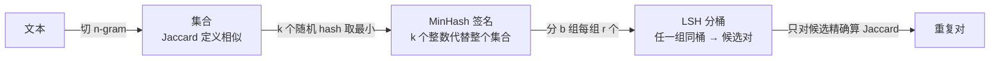

预训练语料里有大量重复：同一篇文章的几十个转载、改了几个词的模板页、复制粘贴的代码。重复的数据让模型记忆而不是学习，去重是数据工程里收益最确定的一步。精确去重（对整段文本取 hash）只能抓完全一样的副本；**近似去重**要处理"大部分一样"的文本，标准做法是 MinHash + LSH。它是无监督学习里"相似度估计"的一个漂亮应用——三个经典元素（集合相似度、随机化估计、用概率分桶换掉两两比较）没有一个是深度学习，但在 15T token 上做去重，没有它寸步难行。这一篇把它的概率算清楚，每一步都有一个能手算的例子和几十行能跑的代码。

全篇的核心问题是：

> **两段文本"相似"到什么程度算重复？[^q0] MinHash 的阈值怎么定？[^q1] 为什么不用两两比较？[^q2]**

## 一、总览

### 1. 三步

本文按去重流水线的三步组织，每一步解决上一步留下的问题：



| 步 | 变换 | 关键式子 | 解决什么 |
|---|---|---|---|
| 1 | 文本 → n-gram 集合 | Jaccard $$J = \lvert A \cap B \rvert / \lvert A \cup B \rvert$$ | "相似"的定义 |
| 2 | 集合 → $$k$$ 个 MinHash 签名 | $$P(\text{签名相等}) = J$$ → 相等比例是 $$J$$ 的无偏估计 | 用 $$k$$ 个数代替整个集合 |
| 3 | 签名 → 分 $$b$$ 组每组 $$r$$ 个 | 任一组全等即候选：$$P = 1 - (1 - s^r)^b$$ | 用概率分桶换掉 $$O(n^2)$$ |

### 2. 本文的章节安排

| 章 | 主题 | 内容 |
|---|---|---|
| 二 | Jaccard | n-gram 集合、交并比、为什么不用编辑距离 |
| 三 | MinHash | 一个能手算的例子；一行证明；20 行实现；$$k$$ 个签名的估计误差（实测 vs 理论） |
| 四 | LSH | 分组分桶（图）；S 曲线 $$1 - (1 - s^r)^b$$；FineWeb 的 $$b = 14, r = 8$$ 是怎么定的 |
| 五 | 在 2000 段文本上跑一遍 | 200 万对 vs 267 个候选；实测的召回贴着 S 曲线 |
| 六 | 三层去重 | 精确 / 模糊 / 语义各抓什么；用第七篇的句子试一遍 |
| 七 | 工程上的几件事 | 词级 vs 字符级、精确去重先做、跨文档 vs 文档内、去重多少合适 |
| 八 | 本文小结 | |
| 九 | 自测 | 六道题 |

## 二、Jaccard

### 1. 把文本变成集合

先把一段文本切成 **n-gram 集合**：连续 $$n$$ 个词（或字符）为一项，去重。"the quick brown fox" 的词级 2-gram 集合是 {the quick, quick brown, brown fox}。代码是一行：

```python
def shingles(text, n=5):
    text = " ".join(text.split())
    return {text[i:i + n] for i in range(max(1, len(text) - n + 1))}    # 字符级 n-gram 集合
```

$$n$$ 取 5 左右：太小（1-gram = 词袋）任何两段用词相近的文本都"相似"，太大一点改动就让所有 n-gram 都变。

### 2. 交并比

两个集合 $$A, B$$ 的 **Jaccard 相似度**：

$$
J(A, B) = \frac{\lvert A \cap B \rvert}{\lvert A \cup B \rvert}
$$

——共有的 n-gram 占全部 n-gram 的比例，取值 $$[0, 1]$$，完全相同为 1，没有共同项为 0。用上一节的例子："the quick brown fox" 与 "the quick red fox" 的词级 2-gram 集合分别是 {the quick, quick brown, brown fox} 与 {the quick, quick red, red fox}，交集 {the quick} 1 项，并集 5 项，$$J = 1/5 = 0.2$$——只换了一个词，2-gram 的 Jaccard 就掉到 0.2，因为那个词参与了两个 n-gram。一段 100 个词的文本改掉 5 个词，词级 5-gram 大约有 25 个受影响，$$J \approx (100 - 25) / (100 + 25) = 0.6$$。

为什么不用编辑距离？编辑距离是 $$O(\lvert A \rvert \cdot \lvert B \rvert)$$ 的动态规划，且不能像集合那样被压缩成几个数——下一章的 MinHash 只对集合相似度成立。

## 三、MinHash

### 1. 问题

直接算 Jaccard 要存整个集合、两两求交——$$n$$ 段文本要算 $$n^2 / 2$$ 次集合运算。**MinHash** 用 $$k$$ 个整数代替整个集合，且两个签名的比较能估计 Jaccard。

### 2. 一个能手算的例子

$$A = \{a, b, c, d\}$$，$$B = \{b, c, d, e, f\}$$。交集 $$\{b, c, d\}$$ 3 个，并集 6 个，$$J = 3/6 = 0.5$$。

随便给全体元素排一个顺序（一个**随机排列**），看 $$A$$ 里谁排最前、$$B$$ 里谁排最前：

| 随机排列 | $$A$$ 里排最前的 | $$B$$ 里排最前的 | 相等？ |
|---|---|---|---|
| c < a < e < b < f < d | c | c | ✓ |
| e < d < a < c < b < f | d | e | ✗ |
| b < f < c < a < d < e | b | b | ✓ |

3 次里 2 次相等，估计 $$J \approx 2/3$$（真实 0.5——3 次太少，后面会看到要多少次）。

**为什么"排最前的相等"的概率恰好是 Jaccard**：并集 6 个元素里谁排最前是等可能的。如果排最前的是 $$a$$（只在 $$A$$ 里），$$A$$ 的最小是 $$a$$、$$B$$ 的最小是别的，不等；如果是 $$e$$ 或 $$f$$（只在 $$B$$ 里），同理不等；**只有当排最前的落在交集 $$\{b, c, d\}$$ 里，两边的最小值才相同**。所以概率是 交集大小 / 并集大小 $$= 3/6$$。这就是全部证明：

$$
P\big(\min h(A) = \min h(B)\big) = \frac{\lvert A \cap B \rvert}{\lvert A \cup B \rvert} = J(A, B)
$$

实际用 [hash 函数](# "tip: 把任意长的字符串映成一个固定范围内的整数的函数：同一个输入永远得到同一个输出，不同输入的输出看起来像随机数、几乎不会撞车。常见的有 MD5、SHA、blake2")代替"随机排列"：把每个 n-gram 映成一个大整数，谁的整数小谁就"排在前面"——这等于给全体 n-gram 排了一个随机顺序，而且不用真的把它们列出来排。集合的 MinHash 就是 $$\min_{a \in A} h(a)$$：把集合里每个 n-gram 都 hash 一遍，取最小的那个数。

### 3. 二十行实现

用 $$k$$ 个不同的 hash 函数得到 $$k$$ 个签名。不需要真的写 $$k$$ 个 hash：一个基础 hash $$h_0$$ 加 $$k$$ 组随机的 $$(a_i, b_i)$$，$$h_i(x) = (a_i h_0(x) + b_i) \bmod p$$（$$p$$ 是一个大素数）：

```python
PRIME = (1 << 61) - 1

def h64(s):                                                                     # ① 确定性的 64 位 hash
    return int.from_bytes(hashlib.blake2b(s.encode(), digest_size=8).digest(), "little")

class MinHash:
    def __init__(self, k=128, seed=0):
        r = np.random.default_rng(seed)
        self.a = r.integers(1, PRIME, k, dtype=np.int64)                        # ② k 组随机系数 (a_i, b_i)
        self.b = r.integers(0, PRIME, k, dtype=np.int64)

    def signature(self, S):
        x = np.array([h64(s) % PRIME for s in S], dtype=np.int64)[:, None]      # ③ [|S|, 1]：每个 n-gram 的基础 hash
        hv = (x * self.a + self.b) % PRIME                                      # ④ [|S|, k]：k 个随机 hash
        return hv.min(0)                                                        # ⑤ 每个 hash 取最小值 → k 个签名

est = np.mean(MinHash(128).signature(A) == MinHash(128).signature(B))          # ⑥ 签名相等的比例 = Jaccard 的估计
```

1. ① Python 内建 `hash` 每次进程随机化，不能用，换 blake2b；
2. ②④ 一个基础 hash 经 $$k$$ 组线性变换得到 $$k$$ 个"不同的"hash——每组 $$(a_i, b_i)$$ 相当于一个不同的随机排列；
3. ⑤ 每列取最小，得到 $$k$$ 个整数——这就是这个集合的签名，之后集合本身可以丢掉；
4. ⑥ 两个签名逐位比较，相等的比例就是估计。

### 4. $$k$$ 个签名的估计误差

每个签名相等与否是一次成功概率为 $$J$$ 的伯努利试验（第三篇：抛一枚正面概率为 $$J$$ 的硬币），$$k$$ 次里正面的比例平均起来正好是 $$J$$（**无偏**——没有系统性的高估或低估），但单次估计会抖，抖动的标准差是 $$\sqrt{J(1 - J) / k}$$——抛 $$k$$ 次硬币估正面概率的经典公式，$$k$$ 越大越准、但精度只按 $$\sqrt k$$ 提高。真的量一下——同一对文本（$$J = 0.644$$），换 200 组随机系数各估一次：


| $$k$$ | 8 | 16 | 32 | 64 | 128 | 256 | 512 | 1024 |
|---|---:|---:|---:|---:|---:|---:|---:|---:|
| 实测标准差 | 0.164 | 0.113 | 0.088 | 0.057 | 0.044 | 0.027 | 0.021 | 0.014 |
| 理论 $$\sqrt{J(1-J)/k}$$ | 0.169 | 0.120 | 0.085 | 0.060 | 0.042 | 0.030 | 0.021 | 0.015 |

$$k$$ 翻 4 倍，误差减半。再看不同相似度的文本：

| 改动词数 | 真实 Jaccard | $$k = 16$$ 估计 | $$k = 128$$ 估计 | $$k = 1024$$ 估计 |
|---:|---:|---:|---:|---:|
| 0 | 1.000 | 1.000 | 1.000 | 1.000 |
| 2 | 0.790 | 0.812 | 0.820 | 0.791 |
| 5 | 0.637 | 0.688 | 0.609 | 0.646 |
| 10 | 0.337 | 0.438 | 0.414 | 0.334 |
| 20 | 0.023 | 0.000 | 0.000 | 0.027 |

$$k = 16$$ 抖动大（0.337 估成 0.438），$$k = 128$$ 到 ±0.04，$$k = 1024$$ 到 ±0.015。**用 128 个整数（512 字节）代替一个几百个 n-gram 的集合，还能以 ±0.04 的精度比较相似度**——这是 MinHash 的全部价值。实际系统用 128 到 256 个。

## 四、LSH

### 1. 还是 $$O(n^2)$$

有了签名，比较两段文本从"求集合交并"变成"比 128 个整数"，快了，但**仍然要两两比较**——$$10^9$$ 段文本是 $$5 \times 10^{17}$$ 对，不可能。

### 2. 分组分桶

**局部敏感哈希**（LSH，locality-sensitive hashing）的想法：把 $$k$$ 个签名分成 $$b$$ 组（band），每组 $$r$$ 个（$$k = b \times r$$）；每组的 $$r$$ 个签名拼在一起再 hash 成一个桶号；**任何一组落进同一个桶的两段文本成为候选对**，只对候选对精确算 Jaccard：


代码：

```python
buckets = defaultdict(list)
for idx, sig in enumerate(sigs):                                          # sigs: [n, k] 的签名矩阵
    for band in range(b):
        key = (band, sig[band * r:(band + 1) * r].tobytes())              # ① 第 band 组的 r 个签名拼成桶号
        buckets[key].append(idx)                                          # ② 同一桶号的文本放一起
cand = {(i, j) for members in buckets.values()                            # ③ 每个桶里两两成为候选对
        for i in members for j in members if i < j}
dups = {p for p in cand if jaccard(sets[p[0]], sets[p[1]]) >= 0.7}        # ④ 只对候选精确算 Jaccard
```

一趟遍历、一次分桶，没有两两比较。

### 3. S 曲线

两段 Jaccard 为 $$s$$ 的文本：一组的 $$r$$ 个签名全相等的概率是 $$s^r$$（每个相等的概率是 $$s$$，$$r$$ 个独立）；某一组不全等是 $$1 - s^r$$；$$b$$ 组全都不全等是 $$(1 - s^r)^b$$；所以**成为候选的概率**是

$$
P(\text{候选}) = 1 - (1 - s^r)^b
$$

代一个数：$$s = 0.7$$，$$b = 14, r = 8$$。$$0.7^8 = 0.058$$——一组 8 个签名全相等不容易；$$1 - 0.058 = 0.942$$；$$0.942^{14} = 0.435$$——14 组全都不全等；$$1 - 0.435 = 0.565$$。Jaccard 0.7 的一对文本有 56% 的概率成为候选。这是一条 **S 形曲线**：$$s$$ 小时 $$s^r$$ 极小、接近 0；$$s$$ 大时 $$s^r$$ 接近 1、$$b$$ 组里几乎必有一组全等；中间陡峭地过渡。


| $$s$$ | $$b = 14, r = 8$$ | $$b = 8, r = 16$$ | $$b = 28, r = 4$$ | $$b = 20, r = 5$$ |
|---:|---:|---:|---:|---:|
| 0.30 | 0.0009 | 0.0000 | 0.2037 | 0.0475 |
| 0.50 | 0.0533 | 0.0001 | 0.8359 | 0.4701 |
| 0.60 | 0.2111 | 0.0023 | 0.9795 | 0.8019 |
| 0.70 | 0.5645 | 0.0263 | 0.9995 | 0.9748 |
| 0.80 | 0.9235 | 0.2042 | 1.0000 | 0.9996 |
| 0.90 | 0.9996 | 0.8059 | 1.0000 | 1.0000 |
| **过 50% 的 $$s$$** | **0.685** | **0.856** | **0.395** | **0.509** |

曲线过 50% 的位置 $$s_{50} = (1 - 0.5^{1/b})^{1/r}$$ 就是这套参数的**阈值**。**FineWeb 用 $$b = 14, r = 8$$**（112 个 hash）：$$s = 0.5$$ 时候选概率 5%，0.7 时 56%，0.8 时 92%，0.9 时 99.96%，曲线在 0.685 过 50%——**这就是"Jaccard 大于约 0.7 视为重复"的来源**，它不是拍脑袋定的，是这组 $$(b, r)$$ 的 S 曲线中点。

调整的方向：**$$r$$ 大更陡更严**（$$b = 8, r = 16$$ 阈值到 0.856，只抓几乎相同的），**$$b$$ 大更宽松**（$$b = 28, r = 4$$ 阈值到 0.395，改一半词也算候选）。$$b \times r$$ 固定时二者此消彼长；想两头都好就加总签名数 $$k$$。

## 五、在 2000 段文本上跑一遍

造 1700 段随机文本、再从中复制 300 段各改掉 1–6 个词做近重复，用 $$b = 14, r = 8$$ 去重：

```text
两两比较要算 1,999,000 对 Jaccard；LSH 只产生 267 个候选对（0.01%），再对候选精确算
300 组真实近重复的 Jaccard 分布: 最小 0.64 / 中位 0.81 / 最大 0.96
Jaccard ≥ 0.7 的真实对 254 个，其中 LSH 找到 226；候选里 Jaccard ≥ 0.7 的共 236（多出来的是碰巧相似的随机对）
```

把 300 组真实近重复按 Jaccard 分区间，看每个区间里有多大比例被 LSH 找到，叠在理论的 S 曲线上：


三件事：

1. **两两比较 200 万对 → 267 个候选**，工作量降到万分之一。$$n$$ 越大收益越大：$$10^9$$ 段文本两两比较不可能，LSH 的候选数与真实重复对数同阶。
2. **实测的召回贴着 S 曲线**：Jaccard 0.83 以上的全找到，0.68 附近一半一半，0.63 的一个没找到——第四章的公式不是近似，是这个算法的精确描述。Jaccard ≥ 0.7 的 254 对里找到 226（89%），漏掉的 28 对都在 0.7 附近。想抓全就把阈值往下调（增 $$b$$）或增 $$k$$。
3. **候选里有 10 对是碰巧相似的随机对**（236 − 226）——精确算 Jaccard 那一步会过滤掉不够相似的；LSH 只负责"不漏太多"，"不错杀"由后面的精确比较负责。

改了 5–6 个词的对 Jaccard 约 0.6，只有 21% 的概率成候选。这不是 bug，是**阈值的定义**：你说了 0.7 以下不算重复。

## 六、三层去重

MinHash 抓的是"字面上大部分相同"。实际的去重是三层，各抓不同的东西。用第七篇那 78 句话试一遍——其中 6 句是同一个模板换了数字，12 句体育是意思相关但措辞完全不同的句子：

| 句子组 | 精确 hash 相同 | 字符 5-gram Jaccard（均值） | 减均值后的 embedding 余弦（均值） |
|---|---:|---:|---:|
| 6 句模板文本（换了数字） | 0 对 | **0.70** | 1.00 |
| 12 句体育（意思相关、措辞不同） | 0 对 | 0.00 | **0.46** |
| 模板 vs 体育（对照） | — | — | −0.20 |

| 层 | 做什么 | 抓到什么 | 抓不到什么 | 成本 |
|---|---|---|---|---|
| **精确去重** | 整段（或归一化后）取一个 hash，相同即重复 | 逐字相同的转载 | 改了一个字的 | 最低，一趟 hash |
| **模糊去重**（本篇） | n-gram + MinHash + LSH | 改了几个词的模板页、近似转载（Jaccard 0.70） | 意思相同但措辞不同的（Jaccard 0.00） | 中，签名 + 一次分桶 |
| **语义去重** | embedding → 聚类（第七篇）→ 簇内按余弦去重（SemDeDup） | 同一件事的不同写法（余弦 0.46 vs 无关 −0.20） | 阈值难定；可能把"合理的复述"也去掉 | 高，要过一遍 embedding 模型 |

三层由便宜到贵依次做：精确去重先去掉一大半（几乎零成本、零误差），MinHash 处理剩下的近重复，语义去重看预算与目标——它对"提高数据多样性"有用，但阈值比 Jaccard 更难解释（第八篇的各向异性：不减均值的余弦全在 0.7 以上，根本没法设阈值）。

## 七、工程上的几件事

1. **词级还是字符级 n-gram**：英文用词级 5-gram（FineWeb）；中文没有天然分词，用字符级 5–10 gram 或先分词。
2. **精确去重先做**：便宜、没有误差，能去掉一大半。MinHash 处理剩下的近重复。
3. **文档内 vs 跨文档**：跨文档去重是本篇的内容；文档内的重复（同一页面重复的导航栏、页脚）用行级 / 段级的精确 hash 处理。
4. **去重多少合适**：去重太狠会把"合理的重复"（高质量的教科书内容被大量引用）也去掉。实践里常按 Jaccard 阈值去重后再对高质量来源做"上采样"补回来——去重是为了控制重复的**分布**，不是消灭一切重复。L4 预训练系列第三篇讲这些取舍。
5. **规模**：15T token 的去重在几百台机器上跑几天；签名的生成是 embarrassingly parallel，分桶是一次 shuffle。`datatrove`、`text-dedup` 一类库把这套流程封装好了，但参数 $$(k, b, r)$$ 要自己按本篇的 S 曲线定。

## 八、本文小结

- **Jaccard** $$= \lvert A \cap B \rvert / \lvert A \cup B \rvert$$，在 n-gram 集合上定义"相似"；改 5% 的词大约 0.6。
- **MinHash**：随机排列（hash）下集合里排最前的元素；两个集合的最小值相等 ⟺ 并集里排最前的落在交集里，概率恰好是 Jaccard（手算例子 3/6）。$$k$$ 个签名相等的比例是无偏估计，标准差 $$\sqrt{J(1-J)/k}$$——实测与理论逐点吻合，$$k = 128$$ 时 ±0.04，用 512 字节代替整个集合。20 行实现。
- **LSH**：$$k$$ 个签名分 $$b$$ 组每组 $$r$$ 个，每组拼起来 hash 成桶号，任一组同桶即候选；$$P = 1 - (1 - s^r)^b$$ 是 S 曲线，过 50% 的位置 $$(1 - 0.5^{1/b})^{1/r}$$ 就是阈值。FineWeb 的 $$b = 14, r = 8$$ 阈值 0.685——**"Jaccard > 0.7 算重复"是这条曲线的中点**；$$r$$ 大更严、$$b$$ 大更松。
- 2000 段文本：200 万对 → 267 个候选（万分之一）；按 Jaccard 分区间的实测召回贴着理论 S 曲线；LSH 负责不漏，精确比较负责不错杀。
- **三层去重**：精确 hash（逐字相同）→ MinHash（模板页 Jaccard 0.70）→ embedding 语义去重（措辞不同的同义句余弦 0.46 vs 无关 −0.20），由便宜到贵依次做。
- 工程：精确去重先做；词级 / 字符级 n-gram 按语言定；去重是控制重复的分布而不是消灭重复；参数 $$(k, b, r)$$ 按 S 曲线定。

配套代码：本文全部数字与图由 [`classical-ml/09_minhash_lsh.py`](https://github.com/arganzheng/ai-learning-labs/blob/main/classical-ml/09_minhash_lsh.py) 产生（`tiny` / `estimate` / `error` / `scurve` / `dedup` / `semantic` 六个子实验，纯 NumPy；`semantic` 复用第七篇的句向量），CPU 上一分钟内跑完。

## 九、自测

1. 两段 100 个词的文本有 90 个词级 5-gram 相同、各自有 10 个不同，Jaccard 是多少？

   <details markdown="1"><summary>答案</summary>

   $$90 / (90 + 10 + 10) = 0.82$$。

   </details>

2. 为什么 MinHash 相等的概率恰好是 Jaccard？用一句话说出证明的关键。

   <details markdown="1"><summary>答案</summary>

   $$A \cup B$$ 里排最前（hash 最小）的元素在 $$A \cap B$$ 里的概率 = 交的大小 / 并的大小，因为随机排列下每个元素排最前的概率相同。

   </details>

3. $$k = 64$$ 个签名估计 $$J = 0.5$$，标准差多少？想到 ±0.02 要多少个签名？

   <details markdown="1"><summary>答案</summary>

   $$\sqrt{0.25 / 64} = 0.0625$$；$$0.25 / 0.02^2 = 625$$ 个。

   </details>

4. $$b = 16, r = 8$$（128 个 hash）的阈值大约在哪？比 $$b = 14, r = 8$$ 更严还是更松？

   <details markdown="1"><summary>答案</summary>

   $$(1 - 0.5^{1/16})^{1/8} \approx 0.67$$；更松一点（$$b$$ 大）。

   </details>

5. 一个团队说"我们用 MinHash 去掉了所有 Jaccard > 0.8 的重复"。按 $$b = 14, r = 8$$ 的曲线，$$J = 0.8$$ 的对有多少概率被漏掉？

   <details markdown="1"><summary>答案</summary>

   $$1 - 0.9235 = 7.7\%$$——"所有"是不准确的，LSH 是概率算法。

   </details>

6. 两句话意思完全相同但没有一个共同的 5-gram。MinHash 能抓到吗？该用哪一层？

   <details markdown="1"><summary>答案</summary>

   不能（Jaccard = 0）；语义去重——embedding 余弦（减均值后同义句 0.46 vs 无关 −0.20）。

   </details>

## 下一篇

下一篇是本系列最后一篇正文：评估——混淆矩阵、阈值的权衡、AUC、类别不平衡、校准、交叉验证、配对检验、多重比较，以及每一个在 LLM 评测里的陷阱。

[^q0]: 在 n-gram 集合上用 Jaccard 度量。「Jaccard > 0.7 视为重复」不是拍脑袋——它是 LSH 的 S 曲线 $$P = 1 - (1 - s^r)^b$$ 过 50% 的位置：FineWeb 的 $$b = 14, r = 8$$ 给出 $$(1 - 0.5^{1/14})^{1/8} \approx 0.685$$；2000 段文本上实测的召回逐点贴着这条曲线。字面之外的"意思相同"要靠 embedding 的语义去重。详见[第二章](#二jaccard)、[第四章](#四lsh)、[第六章](#六三层去重)。
[^q1]: 反过来定——先定想要的阈值与陡度，再解出 $$(b, r)$$；$$r$$ 大更严、$$b$$ 大更松；$$k = br$$ 个签名的存储是 512 字节一段。详见[第四章](#四lsh)、[第七章](#七工程上的几件事)。
[^q2]: $$n$$ 段文本有 $$n^2/2$$ 对，万亿 token 不可能。MinHash 用 $$k$$ 个最小 hash 无偏估计 Jaccard（标准差 $$\sqrt{J(1-J)/k}$$，实测与理论吻合），LSH 分组让相似的对以高概率撞进同一桶——2000 段 200 万对只剩 267 个候选，再精确比较。LSH 负责不漏，精确比较负责不错杀。详见[第三](#三minhash)至[五章](#五在-2000-段文本上跑一遍)。
