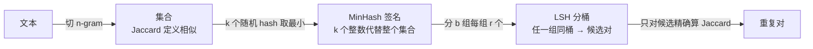
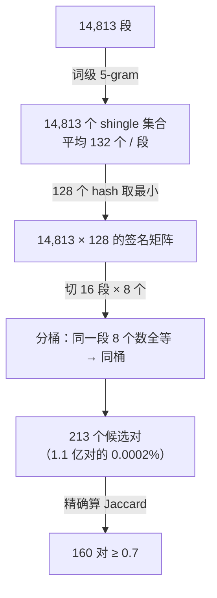

预训练语料里有大量重复：同一篇文章的几十个转载、改了几个词的模板页、复制粘贴的代码。重复的数据让模型记忆而不是学习，去重是数据工程里收益最确定的一步。精确去重（对整段文本取 hash）只能抓完全一样的副本；**近似去重**要处理"大部分一样"的文本，标准做法是 MinHash + LSH。它是无监督学习里"相似度估计"的一个漂亮应用——三个经典元素（集合相似度、随机化估计、用概率分桶换掉两两比较）没有一个是深度学习，但在 15T token 上做去重，没有它寸步难行。这一篇把它的概率算清楚，每一步都有一个能手算的例子和几十行能跑的代码。

全篇的核心问题是：

> **两段文本"相似"到什么程度算重复？[^q0] MinHash 的阈值怎么定？[^q1] 为什么不用两两比较？[^q2]**

## 一、总览

### 1. 三步

本文按去重流水线的三步组织，每一步解决上一步留下的问题：


```mermaid
%% 近似去重的三步：每一步解决上一步留下的问题
flowchart LR
    T["文本"] -->|"切 n-gram"| S["集合<br/>Jaccard 定义相似"]
    S -->|"k 个随机 hash 取最小"| M["MinHash 签名<br/>k 个整数代替整个集合"]
    M -->|"分 b 组每组 r 个"| L["LSH 分桶<br/>任一组同桶 → 候选对"]
    L -->|"只对候选精确算 Jaccard"| D["重复对"]
```

| 步 | 变换 | 关键式子 | 解决什么 |
|---|---|---|---|
| 1 | 文本 → n-gram 集合 | Jaccard $$J = \lvert A \cap B \rvert / \lvert A \cup B \rvert$$ | "相似"的定义 |
| 2 | 集合 → $$k$$ 个 MinHash 签名 | $$P(\text{签名相等}) = J$$ → 相等比例是 $$J$$ 的无偏估计 | 用 $$k$$ 个数代替整个集合 |
| 3 | 签名 → 分 $$b$$ 组每组 $$r$$ 个 | 任一组全等即候选：$$P = 1 - (1 - s^r)^b$$ | 用概率分桶换掉 $$O(n^2)$$ |

Table: 去重的三步：变换、关键式子与解决什么

### 2. 本文的章节安排

| 章 | 主题 | 内容 |
|---|---|---|
| 二 | Jaccard | n-gram 集合、交并比、为什么不用编辑距离 |
| 三 | MinHash | 一个能手算的例子<br/>一行证明<br/>20 行实现<br/>$$k$$ 个签名的估计误差（实测 vs 理论） |
| 四 | LSH | 分组分桶（图）<br/>S 曲线 $$1 - (1 - s^r)^b$$<br/>FineWeb 的 $$b = 14, r = 8$$ 是怎么定的 |
| 五 | 一个能跟踪的小例子 | 六段文本、六个真随机排列、$$b = 3, r = 2$$：签名矩阵 → 分 band → 候选 → 精确复核，逐对解释命中与漏掉<br/>理论公式 vs 仿射 hash vs 相关 hash 族（图）<br/>候选召回率 ≠ 去重阈值 ≠ 保留策略；近重复不传递时连通分量 vs 贪心 |
| 六 | 在 2000 段文本上跑一遍 | 200 万对 vs 267 个候选；实测的召回贴着 S 曲线 |
| 七 | 三层去重 | 精确 / 模糊 / 语义各抓什么；用第七篇的句子试一遍 |
| 八 | 工程上的几件事 | 词级 vs 字符级、精确去重先做、跨文档 vs 文档内、去重多少合适 |
| 九 | 案例：给 wikitext 去重 | 14,813 段真实语料：暴力要 16 分钟，MinHash-LSH 1.5 秒找到 213 个候选<br/>注入的 500 个近重复按改动比例的召回贴着 S 曲线<br/>语料自带的模板段 |
| 十 | 本文小结 |  |
| 十一 | 自测 | 七道题 |

Table: 本文的章节安排

### 3. 来龙去脉：从 AltaVista 到 15T token

| 年 | 谁 | 当时的问题 | 留下的东西 |
|---|---|---|---|
| 1901 / 1912 | Jaccard | 植物学：两片山地的物种有多像 | **Jaccard 相似度**：交集 / 并集（第二章） |
| 1997 | Broder（AltaVista） | 搜索引擎爬回的几亿网页里，镜像站、转载、只改了日期的页面占了很大一块；两两比较不可能 | **MinHash**：$$k$$ 个随机 hash 的最小值，两个集合签名相等的概率恰好等于 Jaccard（第三章）——用几十个数替代整个集合 |
| 1998 | Indyk & Motwani | 有了签名，几亿个签名之间怎么找相近的，还是不能两两比 | **LSH**（局部敏感哈希）：把签名分段分桶，相似的大概率撞进同一个桶（第四章） |
| 2002 / 2007 | Charikar；Manku 等（Google） | 网页去重要在爬取时在线做、每页只能存几十位 | **SimHash**：64 位指纹、汉明距离 ≤ 3 判近重复，Google 爬虫的做法 |
| 2021 | Lee 等，《Deduplicating Training Data Makes Language Models Better》 | C4 等预训练语料里近重复有多少、有什么害 | 去重后模型更好、更少逐字背诵——去重从"省存储"变成**训练数据质量**问题 |
| 2023–2024 | RefinedWeb、FineWeb | 15T token 的网页语料，去重比例、粒度怎么定 | FineWeb 的 $$b = 14, r = 8$$、按 CommonCrawl 快照内去重而不是全局（第四、七章）；去重是控制重复的分布，不是消灭重复 |

Table: 去重方法的来历

Broder 1997 年的问题和今天 FineWeb 的问题是同一个：**$$n$$ 个文档两两比较是 $$n^2$$，$$n$$ 是几亿时算不完**。MinHash 把每个文档压成几十个数、LSH 让相似的文档不用比就撞在一起，两件事合起来把 $$n^2$$ 变成接近 $$n$$。之后二十五年算法几乎没变，变的是用途：从"搜索结果别重复"到"训练数据别重复"。什么时候不用它：要抓的是**语义**重复（同一件事的两种说法，n-gram 不重叠）——换第七章的 embedding；文档很短（一句话，shingle 太少，签名不稳）——直接精确匹配或编辑距离。

## 二、Jaccard

### 1. 把文本变成集合

先把一段文本切成 **n-gram 集合**：连续 $$n$$ 个词（或字符）为一项，去重。"the quick brown fox" 的词级 2-gram 集合是 {the quick, quick brown, brown fox}。代码是一行：

```python title="shingles：字符级 n-gram 集合"
def shingles(text, n=5):
    text = " ".join(text.split())
    return {text[i:i + n] for i in range(max(1, len(text) - n + 1))}    # 字符级 n-gram 集合
```

$$n$$ 取 5 左右：太小（1-gram = 词袋）任何两段用词相近的文本都"相似"，太大一点改动就让所有 n-gram 都变。

### 2. 交并比

两个集合 $$A, B$$ 的 **Jaccard 相似度**：

$$
J(A, B) = \frac{\lvert A \cap B \rvert}{\lvert A \cup B \rvert}
$$

——共有的 n-gram 占全部 n-gram 的比例，取值 $$[0, 1]$$，完全相同为 1，没有共同项为 0。用上一节的例子："the quick brown fox" 与 "the quick red fox" 的词级 2-gram 集合分别是 {the quick, quick brown, brown fox} 与 {the quick, quick red, red fox}，交集 {the quick} 1 项，并集 5 项，$$J = 1/5 = 0.2$$——只换了一个词，2-gram 的 Jaccard 就掉到 0.2，因为那个词参与了两个 n-gram。一段 100 个词的文本改掉 5 个词，词级 5-gram 大约有 25 个受影响，$$J \approx (100 - 25) / (100 + 25) = 0.6$$。

为什么不用编辑距离？编辑距离是 $$O(\lvert A \rvert \cdot \lvert B \rvert)$$ 的动态规划，且不能像集合那样被压缩成几个数——下一章的 MinHash 只对集合相似度成立。

## 三、MinHash

### 1. 问题

直接算 Jaccard 要存整个集合、两两求交——$$n$$ 段文本要算 $$n^2 / 2$$ 次集合运算。**MinHash** 用 $$k$$ 个整数代替整个集合，且两个签名的比较能估计 Jaccard。

### 2. 一个能手算的例子

$$A = \{a, b, c, d\}$$，$$B = \{b, c, d, e, f\}$$。交集 $$\{b, c, d\}$$ 3 个，并集 6 个，$$J = 3/6 = 0.5$$。

随便给全体元素排一个顺序（一个**随机排列**），看 $$A$$ 里谁排最前、$$B$$ 里谁排最前：

| 随机排列 | $$A$$ 里排最前的 | $$B$$ 里排最前的 | 相等？ |
|---|---|---|---|
| c < a < e < b < f < d | c | c | ✓ |
| e < d < a < c < b < f | d | e | ✗ |
| b < f < c < a < d < e | b | b | ✓ |

Table: MinHash 手算：随机排列下 A 与 B 的最小元素

3 次里 2 次相等，估计 $$J \approx 2/3$$（真实 0.5——3 次太少，后面会看到要多少次）。

**为什么"排最前的相等"的概率恰好是 Jaccard**：并集 6 个元素里谁排最前是等可能的。如果排最前的是 $$a$$（只在 $$A$$ 里），$$A$$ 的最小是 $$a$$、$$B$$ 的最小是别的，不等；如果是 $$e$$ 或 $$f$$（只在 $$B$$ 里），同理不等；**只有当排最前的落在交集 $$\{b, c, d\}$$ 里，两边的最小值才相同**。所以概率是 交集大小 / 并集大小 $$= 3/6$$。这就是全部证明：

$$
P\big(\min h(A) = \min h(B)\big) = \frac{\lvert A \cap B \rvert}{\lvert A \cup B \rvert} = J(A, B)
$$

实际用 [hash 函数](# "tip: 把任意长的字符串映成一个固定范围内的整数的函数：同一个输入永远得到同一个输出，不同输入的输出看起来像随机数、几乎不会撞车。常见的有 MD5、SHA、blake2")代替"随机排列"：把每个 n-gram 映成一个大整数，谁的整数小谁就"排在前面"——这等于给全体 n-gram 排了一个随机顺序，而且不用真的把它们列出来排。集合的 MinHash 就是 $$\min_{a \in A} h(a)$$：把集合里每个 n-gram 都 hash 一遍，取最小的那个数。

### 3. 二十行实现

用 $$k$$ 个不同的 hash 函数得到 $$k$$ 个签名。不需要真的写 $$k$$ 个 hash：一个基础 hash $$h_0$$ 加 $$k$$ 组随机的 $$(a_i, b_i)$$，$$h_i(x) = (a_i h_0(x) + b_i) \bmod p$$（$$p$$ 是一个大素数）：

```python title="MinHash：二十行实现"
PRIME = (1 << 61) - 1

def h64(s):                                                                     # ① 确定性的 64 位 hash
    return int.from_bytes(hashlib.blake2b(s.encode(), digest_size=8).digest(), "little")

class MinHash:
    def __init__(self, k=128, seed=0):
        r = np.random.default_rng(seed)
        self.a = r.integers(1, PRIME, k, dtype=np.int64)                        # ② k 组随机系数 (a_i, b_i)
        self.b = r.integers(0, PRIME, k, dtype=np.int64)

    def signature(self, S):
        x = np.array([h64(s) % PRIME for s in S], dtype=np.int64)[:, None]      # ③ [|S|, 1]：每个 n-gram 的基础 hash
        hv = (x * self.a + self.b) % PRIME                                      # ④ [|S|, k]：k 个随机 hash
        return hv.min(0)                                                        # ⑤ 每个 hash 取最小值 → k 个签名

est = np.mean(MinHash(128).signature(A) == MinHash(128).signature(B))          # ⑥ 签名相等的比例 = Jaccard 的估计
```

1. ① Python 内建 `hash` 每次进程随机化，不能用，换 blake2b；
2. ②④ 一个基础 hash 经 $$k$$ 组线性变换得到 $$k$$ 个"不同的"hash——每组 $$(a_i, b_i)$$ 相当于一个不同的随机排列；
3. ⑤ 每列取最小，得到 $$k$$ 个整数——这就是这个集合的签名，之后集合本身可以丢掉；
4. ⑥ 两个签名逐位比较，相等的比例就是估计。

### 4. $$k$$ 个签名的估计误差

每个签名相等与否是一次成功概率为 $$J$$ 的伯努利试验（第三篇：抛一枚正面概率为 $$J$$ 的硬币），$$k$$ 次里正面的比例平均起来正好是 $$J$$（**无偏**——没有系统性的高估或低估），但单次估计会抖，抖动的标准差是 $$\sqrt{J(1 - J) / k}$$——抛 $$k$$ 次硬币估正面概率的经典公式，$$k$$ 越大越准、但精度只按 $$\sqrt k$$ 提高。真的量一下——同一对文本（$$J = 0.644$$），换 200 组随机系数各估一次：


| $$k$$ | 8 | 16 | 32 | 64 | 128 | 256 | 512 | 1024 |
|---|---:|---:|---:|---:|---:|---:|---:|---:|
| 实测标准差 | 0.164 | 0.113 | 0.088 | 0.057 | 0.044 | 0.027 | 0.021 | 0.014 |
| 理论 $$\sqrt{J(1-J)/k}$$ | 0.169 | 0.120 | 0.085 | 0.060 | 0.042 | 0.030 | 0.021 | 0.015 |

Table: 签名个数 k 与估计标准差

$$k$$ 翻 4 倍，误差减半。再看不同相似度的文本：

| 改动词数 | 真实 Jaccard | $$k = 16$$ 估计 | $$k = 128$$ 估计 | $$k = 1024$$ 估计 |
|---:|---:|---:|---:|---:|
| 0 | 1.000 | 1.000 | 1.000 | 1.000 |
| 2 | 0.790 | 0.812 | 0.820 | 0.791 |
| 5 | 0.637 | 0.688 | 0.609 | 0.646 |
| 10 | 0.337 | 0.438 | 0.414 | 0.334 |
| 20 | 0.023 | 0.000 | 0.000 | 0.027 |

Table: 不同相似度文本在不同 k 下的 Jaccard 估计

$$k = 16$$ 抖动大（0.337 估成 0.438），$$k = 128$$ 到 ±0.04，$$k = 1024$$ 到 ±0.015。**用 128 个整数（512 字节）代替一个几百个 n-gram 的集合，还能以 ±0.04 的精度比较相似度**——这是 MinHash 的全部价值。实际系统用 128 到 256 个。

## 四、LSH

### 1. 还是 $$O(n^2)$$

有了签名，比较两段文本从"求集合交并"变成"比 128 个整数"，快了，但**仍然要两两比较**——$$10^9$$ 段文本是 $$5 \times 10^{17}$$ 对，不可能。

### 2. 分组分桶

**局部敏感哈希**（LSH，locality-sensitive hashing）的想法：把 $$k$$ 个签名分成 $$b$$ 组（band），每组 $$r$$ 个（$$k = b \times r$$）；每组的 $$r$$ 个签名拼在一起再 hash 成一个桶号；**任何一组落进同一个桶的两段文本成为候选对**，只对候选对精确算 Jaccard：


代码：

```python title="LSH 分组分桶"
buckets = defaultdict(list)
for idx, sig in enumerate(sigs):                                          # sigs: [n, k] 的签名矩阵
    for band in range(b):
        key = (band, sig[band * r:(band + 1) * r].tobytes())              # ① 第 band 组的 r 个签名拼成桶号
        buckets[key].append(idx)                                          # ② 同一桶号的文本放一起
cand = {(i, j) for members in buckets.values()                            # ③ 每个桶里两两成为候选对
        for i in members for j in members if i < j}
dups = {p for p in cand if jaccard(sets[p[0]], sets[p[1]]) >= 0.7}        # ④ 只对候选精确算 Jaccard
```

一趟遍历、一次分桶，没有两两比较。

### 3. S 曲线

两段 Jaccard 为 $$s$$ 的文本：一组的 $$r$$ 个签名全相等的概率是 $$s^r$$（每个相等的概率是 $$s$$，$$r$$ 个独立）；某一组不全等是 $$1 - s^r$$；$$b$$ 组全都不全等是 $$(1 - s^r)^b$$；所以**成为候选的概率**是

$$
P(\text{候选}) = 1 - (1 - s^r)^b
$$

代一个数：$$s = 0.7$$，$$b = 14, r = 8$$。$$0.7^8 = 0.058$$——一组 8 个签名全相等不容易；$$1 - 0.058 = 0.942$$；$$0.942^{14} = 0.435$$——14 组全都不全等；$$1 - 0.435 = 0.565$$。Jaccard 0.7 的一对文本有 56% 的概率成为候选。这是一条 **S 形曲线**：$$s$$ 小时 $$s^r$$ 极小、接近 0；$$s$$ 大时 $$s^r$$ 接近 1、$$b$$ 组里几乎必有一组全等；中间陡峭地过渡。


| $$s$$ | $$b = 14, r = 8$$ | $$b = 8, r = 16$$ | $$b = 28, r = 4$$ | $$b = 20, r = 5$$ |
|---:|---:|---:|---:|---:|
| 0.30 | 0.0009 | 0.0000 | 0.2037 | 0.0475 |
| 0.50 | 0.0533 | 0.0001 | 0.8359 | 0.4701 |
| 0.60 | 0.2111 | 0.0023 | 0.9795 | 0.8019 |
| 0.70 | 0.5645 | 0.0263 | 0.9995 | 0.9748 |
| 0.80 | 0.9235 | 0.2042 | 1.0000 | 0.9996 |
| 0.90 | 0.9996 | 0.8059 | 1.0000 | 1.0000 |
| **过 50% 的 $$s$$** | **0.685** | **0.856** | **0.395** | **0.509** |

Table: 四组 (b, r) 的 S 曲线取值

曲线过 50% 的位置 $$s_{50} = (1 - 0.5^{1/b})^{1/r}$$ 就是这套参数的**阈值**。**FineWeb 用 $$b = 14, r = 8$$**（112 个 hash）：$$s = 0.5$$ 时候选概率 5%，0.7 时 56%，0.8 时 92%，0.9 时 99.96%，曲线在 0.685 过 50%——**这就是"Jaccard 大于约 0.7 视为重复"的来源**（$$s_{50}$$ 是候选概率过半的位置，不是硬边界：0.6 仍有 21% 成候选、0.8 仍有 8% 漏掉），它不是拍脑袋定的，是这组 $$(b, r)$$ 的 S 曲线中点。

调整的方向：**$$r$$ 大更陡更严**（$$b = 8, r = 16$$ 阈值到 0.856，只抓几乎相同的），**$$b$$ 大更宽松**（$$b = 28, r = 4$$ 阈值到 0.395，改一半词也算候选）。$$b \times r$$ 固定时二者此消彼长；想两头都好就加总签名数 $$k$$。

## 五、一个能跟踪的小例子：从 shingle 到删除清单

第四章的公式说"Jaccard 0.7 的一对有 56% 的概率成候选"。56% 落到某一对具体文本上，就是命中或漏掉——下面用六段短句、六个真随机排列、$$b = 3, r = 2$$ 把每一步的状态摆出来，让你能指着签名矩阵说出某一对**为什么**命中、**为什么**漏掉。为什么 $$\text{d}_1$$ 与 $$\text{d}_2$$ 的 Jaccard 够 0.7 却没成为候选？[^q3]

### 1. 文本 → shingle → 精确 Jaccard

六段文本、词级 2-gram（小例子用 2-gram 是为了 shingle 少到能逐个看；真实系统用 5-gram）：

```text title="六段文本的 shingle 集合与精确 Jaccard（trace 子实验）"
d0: "the cat sat on the mat by the door" → 8 个 shingle
d1: "the cat sat on the mat by the window" → 8 个 shingle
d2: "a cat sat on the mat by the window today" → 9 个 shingle
d3: "machine learning models need lots of data" → 6 个 shingle
d4: "machine learning models need lots of good data" → 7 个 shingle
d5: "the quick brown fox jumps over the lazy dog" → 8 个 shingle
全集 27 个不同 shingle；d0 ∩ d1 = ['by the', 'cat sat', 'mat by', 'on the', 'sat on', 'the cat', 'the mat']
d0 ∪ d1 多出来的：['the door', 'the window']
精确 Jaccard（只列有交集的对）：(d0,d1) 0.778，(d0,d2) 0.545，(d1,d2) 0.700，(d3,d4) 0.625
```

手算一对：$$\text{d}_0$$ 与 $$\text{d}_1$$ 只差最后一个词，7 个 shingle 相同、各自多 1 个，$$J = 7 / 9 = 0.778$$。注意 $$\text{d}_0 \approx \text{d}_1$$（0.778）、$$\text{d}_1 \approx \text{d}_2$$（0.700）、但 $$\text{d}_0$$ 与 $$\text{d}_2$$ 只有 0.545——**近重复关系不传递**，第 6 节会回到这一点。

### 2. 签名矩阵：真随机排列

第三章的 MinHash 用 $$(a x + b) \bmod p$$ 近似随机排列。这一节先用**真的**随机排列（把 27 个 shingle 的全集打乱 6 次），签名就是"打乱后集合里排最前的位置"，数值小到能看：

```python title="真随机排列下的签名与分 band 候选"
def perm_signature(S, perms, universe):
    # !ref perm-cols
    cols = [universe[s] for s in S]                   # 集合里每个 shingle 在全集中的编号
    # !ref perm-min
    return perms[:, cols].min(1)                      # k 个排列各取集合里排最前的位置 → k 个签名

def lsh_candidates(sigs, b, r):
    buckets = defaultdict(list)
    for i, sig in enumerate(sigs):
        for band in range(b):
            # !ref band-key
            key = tuple(sig[band * r:(band + 1) * r])  # 第 band 组的 r 个签名原样拼成桶键
            buckets[(band, key)].append(i)
    cand = defaultdict(list)
    for (band, _), members in buckets.items():
        for x in range(len(members)):
            for y in range(x + 1, len(members)):
                # !ref cand-band
                cand[(members[x], members[y])].append(band)  # 记下是哪一组把这对撞到一起
    return dict(cand)
```

`perms` 是 $$k \times 27$$ 的矩阵，每行一个排列；[取列](#perm-cols)再[按行取最小](#perm-min)就是第三章"并集里排最前的元素落在交集里"的字面实现。桶键这里[不再 hash](#band-key)，直接用 $$r$$ 个整数的元组——小例子里不需要省内存，而且能肉眼比对。候选对[记下命中的 band 编号](#cand-band)，是为了下面解释"为什么"。

seed = 9 下的签名矩阵（竖线分 band，每组 2 列）：

```text title="签名矩阵（k = 6，b = 3 组 × r = 2）"
d0:  2  2 |  8  5 |  0  4
d1:  0  2 |  5  3 |  0  4
d2:  0  0 |  3  2 |  0  2
d3:  7  3 |  0  0 |  4  3
d4:  7  1 |  2  0 |  4  1
d5:  3  8 |  1  1 |  1  0
```

### 3. 分 band → 候选 → 精确复核

规则只有一条：**某一组的 2 个签名全等**才同桶。逐组看：

```text title="候选对与精确复核；没进候选的对为什么漏"
候选对（某个 band 的 2 个签名全等）与精确复核：
  (d0, d1)：band [2] 全等，签名相等 3/6，精确 Jaccard 0.778，J ≥ 0.7 → 判重复
真实 Jaccard ≥ 0.5 却没进候选的对：
  (d0, d2)：Jaccard 0.545，签名相等 1/6，但 3 个 band [0, 1, 2] 各自至少有一列不等——没有一个 band 完整命中，理论上这对成候选的概率只有 1 − (1 − 0.545²)³ = 0.653
  (d1, d2)：Jaccard 0.700，签名相等 2/6，但 3 个 band [0, 1, 2] 各自至少有一列不等——没有一个 band 完整命中，理论上这对成候选的概率只有 1 − (1 − 0.700²)³ = 0.867
  (d3, d4)：Jaccard 0.625，签名相等 3/6，但 3 个 band [0, 1, 2] 各自至少有一列不等——没有一个 band 完整命中，理论上这对成候选的概率只有 1 − (1 − 0.625²)³ = 0.774
```

对照矩阵能把每一行解释清楚：

- **$$(\text{d}_0, \text{d}_1)$$ 命中**：第 2 组两者都是 `0 4`，同桶；第 0 组 `2 2` vs `0 2`、第 1 组 `8 5` vs `5 3` 都不全等。6 个签名里只有 3 个相等（估计 $$\hat J = 0.5$$，离真值 0.778 很远——$$k = 6$$ 的估计标准差是 $$\sqrt{0.778 \times 0.222 / 6} = 0.17$$），但 LSH 不看估计值，只看**有没有一组全等**。
- **$$(\text{d}_1, \text{d}_2)$$ 漏掉**：真实 Jaccard 0.700 够阈值，但第 0 组 `0 2` vs `0 0`、第 1 组 `5 3` vs `3 2`、第 2 组 `0 4` vs `0 2`——每组都恰好差一列。理论上这对有 86.7% 的概率成候选，这次落在了那 13.3% 里。**换一组排列它大概率会命中，但这一次它就是漏了**；精确复核救不了它，因为复核只在候选里做。
- **$$(\text{d}_3, \text{d}_4)$$ 漏掉**：Jaccard 0.625 本来就低于 0.7，漏掉对最终结果没有影响；如果它进了候选，也会在复核时被判"不重复"。候选阶段的漏与复核阈值是两个不同的筛子。

这就是"候选召回"与"去重阈值"的区别：**候选召回是概率事件**，由 $$(b, r)$$ 和真实 Jaccard 决定；**去重阈值是确定的规则**，只对进了候选的对执行。两者都不是"保证"：前者按 S 曲线有漏，后者对没进候选的对无能为力。

### 4. 理论公式 vs 实际 hash：候选概率量出来

第四章的 $$P = 1 - (1 - s^r)^b$$ 有两个前提：每个签名相等的概率恰好是 $$s$$（独立随机排列的性质），且 $$k$$ 个签名**彼此独立**。把上面四对文本的候选概率各量 2000 次——独立随机排列、第三章的仿射 hash $$(a x + b) \bmod p$$、以及一个故意做坏的 hash 族（$$a$$ 固定为 1，只平移，$$k$$ 个 hash 高度相关）：

```text title="四对文本的候选概率：理论 vs 2000 次实测（family 子实验）"
对         Jaccard      签名相等率:排列   仿射hash      候选概率:理论     排列实测   仿射hash   只平移的hash
(d0, d1)     0.778         0.780    0.779        0.938    0.934    0.944      0.915
(d1, d2)     0.700         0.704    0.704        0.867    0.857    0.875      0.785
(d0, d2)     0.545         0.548    0.547        0.653    0.646    0.658      0.729
(d3, d4)     0.625         0.631    0.621        0.774    0.780    0.754      0.566
```

再把 Jaccard 从 0.2 扫到 0.95（两个 60 元集合、控制交集大小），每点各跑 300 次：


三点结论，都有条件：

1. **独立随机排列下公式是精确的期望**：签名相等率 0.780 / 0.704 / 0.548 / 0.631 对应 Jaccard 0.778 / 0.700 / 0.545 / 0.625，候选概率与理论差在 ±0.01 内（2000 次的抽样标准差约 0.008）。
2. **仿射 hash 是近似，这里近似得很好**：$$(a x + b) \bmod p$$ 在 $$p = 2^{61} - 1$$ 上是 2-universal 的，不是 min-wise independent 的；理论上它的签名相等概率可以偏离 Jaccard，这个例子里差在千分位。生产系统（datasketch、datatrove）用的就是这一族，但"与理论吻合"是**实测出来**的，不是推出来的。
3. **hash 族一旦相关，公式就失效**：$$a = 1$$ 时 $$k$$ 个 hash 几乎同时相等或同时不等，"任一组全等"退化成"一个签名相等"，候选概率塌向 $$P = s$$——S 曲线的陡峭完全来自 $$k$$ 列的独立性。换 hash 族、换 shingle 的 hash 宽度（32 位 hash 在亿级 shingle 下碰撞明显）都要重新量这张图，不能照抄公式。

### 5. 候选召回率 ≠ 去重阈值 ≠ 保留策略

到这里流水线里有三个独立的量，容易混成一个"阈值"：

| 量 | 由什么决定 | 是概率还是规则 | 本例 |
|---|---|---|---|
| 候选召回率 | $$(b, r)$$ 与真实 Jaccard 的 S 曲线、hash 族是否独立 | 概率：$$J = 0.7$$ 时 86.7%，有漏 | $$(\text{d}_1, \text{d}_2)$$ 漏了 |
| 去重阈值 | 业务定义"多像算重复" | 规则：只对候选执行 | $$J \ge 0.7$$ |
| 保留策略 | 判重对如何变成删除清单 | 规则：连通分量 / 贪心 / 按质量 | 下一节 |

Table: 流水线里三个容易混的量

$$(b, r)$$ 通常让 S 曲线的中点 $$s_{50}$$ 落在去重阈值附近（FineWeb 的 0.685 对 0.7），**但这是设计选择，不是等式**：把 $$s_{50}$$ 压到阈值以下（多加 band）能提高阈值处的召回，代价是更多碰巧相似的候选要复核；生产管线若省掉复核、同桶即判重，这些多出来的候选就直接变成误删。

### 6. 近重复不传递：保留谁

$$\text{d}_0 \approx \text{d}_1$$、$$\text{d}_1 \approx \text{d}_2$$，而 $$\text{d}_0$$ 与 $$\text{d}_2$$ 只有 0.545。判为重复的对是 $$\{(\text{d}_0, \text{d}_1), (\text{d}_1, \text{d}_2)\}$$，删哪些？两种常见策略给出不同答案（这里假设复核阶段算出了全部三对的精确 Jaccard）：

```text title="两种保留策略（retain 子实验）"
阈值 0.7 下判为重复的对：[(0, 1), (1, 2)]；(d0, d2) 的 Jaccard 0.545 不够——重复关系不传递
策略 A 连通分量（并查集）：分量 [[0, 1, 2], [3], [4], [5]]，每个分量留编号最小的 → 保留 [0, 3, 4, 5]，d2 被删，虽然它和代表 d0 的 Jaccard 只有 0.545
策略 B 贪心按顺序 [0, 1, 2, 3, 4, 5]：保留 [0, 2, 3, 4, 5]（只与已保留的代表比，删除的都与某个代表 J ≥ 0.7）
策略 B 贪心按顺序 [1, 0, 2, 3, 4, 5]：保留 [1, 3, 4, 5]（只与已保留的代表比，删除的都与某个代表 J ≥ 0.7）
策略 B 贪心按顺序 [2, 1, 0, 3, 4, 5]：保留 [0, 2, 3, 4, 5]（只与已保留的代表比，删除的都与某个代表 J ≥ 0.7）
700 段（500 随机 + 100 条两步改写链）：J ≥ 0.7 的对 239，连通分量里 J < 0.7 的同组对 93 个（不传递的证据）
连通分量保留 500 段；贪心正序保留 564 段、倒序保留 566 段——同一批重复对，三种答案
```

- **策略 A：连通分量**（FineWeb、RefinedWeb 的做法）。把判重对当作图的边，用并查集连起来，每个分量留一篇。结果与扫描顺序无关、保留集里任意两篇都不重复；代价是 $$\text{d}_2$$ 被删了，虽然它与留下的 $$\text{d}_0$$ 并不像。改写链越长（A → B → C → D），分量两端的差距越大，删得越狠——700 段的放大实验里 100 条两步改写链让连通分量比贪心多删了 64–66 段。
- **策略 B：贪心**。按某个顺序扫，与已保留的代表 Jaccard ≥ 阈值就删，否则自己成为代表。每一篇被删的都确实与某个代表相似；但结果**依赖顺序**：先看 $$\text{d}_1$$ 就留 $$\text{d}_1$$、删 $$\text{d}_0$$ 和 $$\text{d}_2$$，先看 $$\text{d}_0$$ 就留 $$\text{d}_0$$ 和 $$\text{d}_2$$。顺序通常按质量分或时间排，让"留谁"变成有意识的选择。

两种都对，取舍是：训练集里更怕漏删（重复让模型记忆）就用连通分量；更怕误删内容（$$\text{d}_2$$ 其实有一半是新词）就用贪心并按质量排序。先定策略再谈"去重率"——同一批重复对，三种答案相差 13%。第九章的 wikitext 案例里重复几乎都是孤立的一对，两种策略删得一样多，这是那份语料的性质，不是普遍规律。

## 六、在 2000 段文本上跑一遍

造 1700 段随机文本、再从中复制 300 段各改掉 1–6 个词做近重复，用 $$b = 14, r = 8$$ 去重：

```text title="2000 段文本上的去重结果"
两两比较要算 1,999,000 对 Jaccard；LSH 只产生 267 个候选对（0.01%），再对候选精确算
300 组真实近重复的 Jaccard 分布: 最小 0.64 / 中位 0.81 / 最大 0.96
Jaccard ≥ 0.7 的真实对 254 个，其中 LSH 找到 226；候选里 Jaccard ≥ 0.7 的共 236（多出来的是碰巧相似的随机对）
```

把 300 组真实近重复按 Jaccard 分区间，看每个区间里有多大比例被 LSH 找到，叠在理论的 S 曲线上：


三件事：

1. **两两比较 200 万对 → 267 个候选**，工作量降到万分之一。$$n$$ 越大收益越大：$$10^9$$ 段文本两两比较不可能，LSH 的候选数与真实重复对数同阶。
2. **实测的召回贴着 S 曲线**：Jaccard 0.83 以上的全找到，0.68 附近一半一半，0.63 的一个没找到——第四章的公式不是近似，是这个算法的精确描述。Jaccard ≥ 0.7 的 254 对里找到 226（89%），漏掉的 28 对都在 0.7 附近。想抓全就把阈值往下调（增 $$b$$）或增 $$k$$。
3. **候选里有 10 对是碰巧相似的随机对**（236 − 226）——本文的流水线后面接了精确算 Jaccard 那一步，会过滤掉不够相似的；LSH 只能按 S 曲线"少漏"（这里 J ≥ 0.7 的对漏了 11%），不能保证不漏；"不错杀"由精确比较负责。注意**生产管线常常没有这一步**（FineWeb、RefinedWeb 同桶即判重、传递闭包后每簇随机留一篇），那时误报会直接误删，$$b$$ 就不能一味往大调。

改了 5–6 个词的对 Jaccard 约 0.6，只有 21% 的概率成候选。这不是 bug，是**阈值的定义**：你说了 0.7 以下不算重复。

## 七、三层去重

MinHash 抓的是"字面上大部分相同"。实际的去重是三层，各抓不同的东西。用第七篇那 78 句话试一遍——其中 6 句是同一个模板换了数字，12 句体育是意思相关但措辞完全不同的句子：

| 句子组 | 精确 hash 相同 | 字符 5-gram Jaccard（均值） | 减均值后的 embedding 余弦（均值） |
|---|---:|---:|---:|
| 6 句模板文本（换了数字） | 0 对 | **0.70** | 1.00 |
| 12 句体育（意思相关、措辞不同） | 0 对 | 0.00 | **0.46** |
| 模板 vs 体育（对照） | — | — | −0.20 |

Table: 三类句子组在三层去重指标上的表现

| 层 | 做什么 | 抓到什么 | 抓不到什么 | 成本 |
|---|---|---|---|---|
| **精确去重** | 整段（或归一化后）取一个 hash，相同即重复 | 逐字相同的转载 | 改了一个字的 | 最低，一趟 hash |
| **模糊去重**（本篇） | n-gram + MinHash + LSH | 改了几个词的模板页、近似转载（Jaccard 0.70） | 意思相同但措辞不同的（Jaccard 0.00） | 中，签名 + 一次分桶 |
| **语义去重** | embedding → 聚类（第七篇）→ 簇内按余弦去重（SemDeDup） | 同一件事的不同写法（余弦 0.46 vs 无关 −0.20） | 阈值难定；可能把"合理的复述"也去掉 | 高，要过一遍 embedding 模型 |

Table: 三层去重各抓到什么与成本

三层由便宜到贵依次做：精确去重先去掉一大半（几乎零成本、零误差），MinHash 处理剩下的近重复，语义去重看预算与目标——它对"提高数据多样性"有用，但阈值比 Jaccard 更难解释（第八篇的各向异性：不减均值的余弦全在 0.7 以上，根本没法设阈值）。

## 八、工程上的几件事

1. **词级还是字符级 n-gram**：英文用词级 5-gram（FineWeb）；中文没有天然分词，用字符级 5–10 gram 或先分词。
2. **精确去重先做**：便宜、没有误差，能去掉一大半。MinHash 处理剩下的近重复。
3. **文档内 vs 跨文档**：跨文档去重是本篇的内容；文档内的重复（同一页面重复的导航栏、页脚）用行级 / 段级的精确 hash 处理。
4. **去重多少合适**：去重太狠会把"合理的重复"（高质量的教科书内容被大量引用）也去掉。实践里常按 Jaccard 阈值去重后再对高质量来源做"上采样"补回来——去重是为了控制重复的**分布**，不是消灭一切重复。L4 预训练系列第四篇讲这些取舍。
5. **规模**：15T token 的去重在几百台机器上跑几天；签名的生成是 embarrassingly parallel，分桶是一次 shuffle。`datatrove`、`text-dedup` 一类库把这套流程封装好了，但参数 $$(k, b, r)$$ 要自己按本篇的 S 曲线定。

## 九、案例：给一份真实语料去重

第五章的 2,000 段是随机词拼的。这一章换真实文本——wikitext-2（维基百科精选条目）训练集里长度超过 200 字符的 14,313 段——再注入 500 个"近重复"，看 MinHash-LSH 在真文本上找到什么、漏掉什么、比暴力快多少。完整脚本 [`case_09_wikitext_dedup.py`](https://github.com/arganzheng/ai-learning-labs/blob/main/classical-ml/case_09_wikitext_dedup.py)。

### 1. 问题与数据

14,313 段、平均 137 个词。注入 500 个近重复：随机挑一段原文，把 2% / 5% / 10% / 20% 的词删掉或写错（各 125 个），模拟改写、模板变化、OCR 错字。这样每个注入的对我们知道"真相"，能算召回。任务：找出 Jaccard $$\ge 0.7$$ 的所有段落对。

### 2. 思路


```mermaid
%% 图：14,813 段文本的去重流水线
flowchart TB
    D["14,813 段"] -->|词级 5-gram| S["14,813 个 shingle 集合<br/>平均 132 个 / 段"]
    S -->|"128 个 hash 取最小"| M["14,813 × 128 的签名矩阵"]
    M -->|"切 16 段 × 8 个"| B["分桶：同一段 8 个数全等 → 同桶"]
    B --> Cd["213 个候选对<br/>（1.1 亿对的 0.0002%）"]
    Cd -->|精确算 Jaccard| R["160 对 ≥ 0.7"]
```

用词级 5-gram（预训练去重的常用设置，第七章），$$b = 16, r = 8$$，阈值 $$(1/b)^{1/r} = 0.71$$。

### 3. 代码

```python title="wikitext2 上的去重流程"
docs = wikitext2("train")                                  # 14,313 段
sets = [shingles(d) for d in docs]                         # 词级 5-gram 集合，0.4 s
mh = MinHash(k=128)                                        # 第三章的 20 行
sigs = np.array([mh.signature(S) for S in sets])           # [14813, 128]，1.2 s
buckets = defaultdict(list)                                # 第四章的分桶
for i, sig in enumerate(sigs):
    for band in range(16):
        buckets[(band, sig[band * 8:(band + 1) * 8].tobytes())].append(i)
cand = {(a, b) for members in buckets.values() if len(members) > 1
        for a in members for b in members if a < b}      # 213 对，0.27 s
dup = {p for p in cand if jaccard(sets[p[0]], sets[p[1]]) >= 0.7}   # 对候选精确算：160 对
```

### 4. 效果

**暴力有多贵**：14,813 段有 1.097 亿对；实测每对算一次 Jaccard 9 µs → 全部要 **16 分钟**（Python 里）。**LSH**：签名 1.2 秒 + 分桶 0.27 秒 → 213 个候选对（全部对的 0.0002%），对候选精确算 Jaccard 几毫秒。

**找到了什么、漏了什么**——500 个注入的近重复按改动比例：

| 改掉的词 | 与原文的 Jaccard（中位） | 成为候选的比例 |
|---:|---:|---:|
| 2% | 0.87 | **98%** |
| 5% | 0.68 | 61% |
| 10% | 0.46 | 6% |
| 20% | 0.24 | 0% |

Table: 注入的近重复按改动比例的召回


三件事：

- **词级 5-gram 很敏感**：改一个词毁掉 5 个 shingle，所以改 5% 的词 Jaccard 就掉到 0.68、改 10% 掉到 0.46。这是第七章"词级 vs 字符级"的实测——阈值 0.7 在词级 5-gram 下的含义是"最多改 4%–5% 的词"。
- **召回贴着 S 曲线**：改 2%（Jaccard 0.87）98% 找到；改 5%（0.68）正卡在阈值 0.71 上，61%——S 曲线在阈值附近就是一半一半；改 10% 只剩 6%。**漏掉的不是 bug，是阈值的定义**：要抓改 10% 的，调 $$b, r$$ 把阈值降到 0.5（代价是候选对暴涨），或换字符级 shingle。
- **语料自带的重复**：候选里 Jaccard $$\ge 0.7$$ 且两段都是原文的有 3 对——同型军舰条目里"After Winslow's August 1915 commissioning, she sailed off the east coast..." 和 "After Cushing's August 1915 commissioning, she sailed off the east coast..."（$$J = 0.77$$），以及专辑曲目表里两个演唱者的两行。**维基百科精选条目里都有整段套模板改名字的写法**，几亿网页里这类东西的比例只会更高——这就是 Lee 等 2021 在 C4 里发现的东西。

### 5. 落地还差什么

（一）**规模**：14,813 段在一台笔记本上 1.5 秒；FineWeb 的一个 CommonCrawl 快照是几十亿段，同样的算法要分布式地做——签名矩阵按行切到多机、桶按 key 分到多机（一次 shuffle），这是 Spark / Ray 上的标准作业，算法不变；（二）**去重之后做什么**：找到 160 对不等于删 160 段——要决定留哪一份（通常留最长或最早的）、成簇的重复（A≈B≈C）要用并查集连起来一起处理——第五章第 6 节比较过连通分量与贪心两种策略，这份语料里 160 对重复连成 158 个分量、最大 3 段，两种策略都删 159 段，差别在改写链长的语料里才显现；（三）**去多少**：第七章说过，去重是控制重复的分布——FineWeb 发现按快照内去重比全局去重训出的模型更好，因为全局去重把高质量的、被多次转载的内容也删光了。找重复是算法问题，删多少是实验问题。

## 十、本文小结

- **Jaccard** $$= \lvert A \cap B \rvert / \lvert A \cup B \rvert$$，在 n-gram 集合上定义"相似"；改 5% 的词大约 0.6。
- **MinHash**：随机排列（hash）下集合里排最前的元素；两个集合的最小值相等 ⟺ 并集里排最前的落在交集里，概率恰好是 Jaccard（手算例子 3/6）。$$k$$ 个签名相等的比例是无偏估计，标准差 $$\sqrt{J(1-J)/k}$$——实测与理论逐点吻合，$$k = 128$$ 时 ±0.04，用 512 字节代替整个集合。20 行实现。
- **LSH**：$$k$$ 个签名分 $$b$$ 组每组 $$r$$ 个，每组拼起来 hash 成桶号，任一组同桶即候选；$$P = 1 - (1 - s^r)^b$$ 是 S 曲线，过 50% 的位置 $$(1 - 0.5^{1/b})^{1/r}$$ 就是阈值。FineWeb 的 $$b = 14, r = 8$$ 阈值 0.685——**"Jaccard > 0.7 算重复"是这条曲线的中点**；$$r$$ 大更严、$$b$$ 大更松。
- 2000 段文本：200 万对 → 267 个候选（万分之一）；按 Jaccard 分区间的实测召回贴着理论 S 曲线；LSH 按概率召回候选（J ≥ 0.7 的对找到 89%，不保证不漏），精确比较负责不错杀。
- **可跟踪的小例子**：六段文本、六个真随机排列、$$b = 3, r = 2$$——$$(\text{d}_0, \text{d}_1)$$ 靠第 2 组全等命中，$$(\text{d}_1, \text{d}_2)$$ 的 Jaccard 0.700 够阈值却三组各差一列而漏掉（理论命中率 86.7%）。候选召回率（概率）、去重阈值（规则）、保留策略（规则）是三个量；独立随机排列下公式精确、仿射 hash 在本例差千分位、相关 hash 族让 S 曲线塌向 $$P = s$$；近重复不传递时连通分量与贪心给出不同的删除清单（700 段上相差 64–66 段）。
- **三层去重**：精确 hash（逐字相同）→ MinHash（模板页 Jaccard 0.70）→ embedding 语义去重（措辞不同的同义句余弦 0.46 vs 无关 −0.20），由便宜到贵依次做。
- 工程：精确去重先做；词级 / 字符级 n-gram 按语言定；去重是控制重复的分布而不是消灭重复；参数 $$(k, b, r)$$ 按 S 曲线定。

- **案例**：wikitext-2 的 14,813 段，暴力 1.1 亿对要 16 分钟，MinHash-LSH 1.5 秒出 213 个候选；注入的近重复改 2% 的词召回 98%、改 5%（Jaccard 0.68，卡在阈值上）61%、改 10% 6%——漏掉的是阈值的定义不是 bug；语料自带的模板段（同型军舰条目）$$J = 0.77$$。

配套代码：本文全部数字与图由 [`classical-ml/09_minhash_lsh.py`](https://github.com/arganzheng/ai-learning-labs/blob/main/classical-ml/09_minhash_lsh.py) 产生（`tiny` / `estimate` / `error` / `scurve` / `dedup` / `semantic` / `trace` / `family` / `retain` 九个子实验，纯 NumPy；第九章案例由 [`case_09_wikitext_dedup.py`](https://github.com/arganzheng/ai-learning-labs/blob/main/classical-ml/case_09_wikitext_dedup.py) 产生，wikitext-2 通过 `datasets` 下载约 4 MB；`semantic` 复用第七篇的句向量），CPU 上一分钟内跑完。

## 十一、自测

1. 两段 100 个词的文本有 90 个词级 5-gram 相同、各自有 10 个不同，Jaccard 是多少？

   <details markdown="1"><summary>答案</summary>

   $$90 / (90 + 10 + 10) = 0.82$$。

   </details>

2. 为什么 MinHash 相等的概率恰好是 Jaccard？用一句话说出证明的关键。

   <details markdown="1"><summary>答案</summary>

   $$A \cup B$$ 里排最前（hash 最小）的元素在 $$A \cap B$$ 里的概率 = 交的大小 / 并的大小，因为随机排列下每个元素排最前的概率相同。

   </details>

3. $$k = 64$$ 个签名估计 $$J = 0.5$$，标准差多少？想到 ±0.02 要多少个签名？

   <details markdown="1"><summary>答案</summary>

   $$\sqrt{0.25 / 64} = 0.0625$$；$$0.25 / 0.02^2 = 625$$ 个。

   </details>

4. $$b = 16, r = 8$$（128 个 hash）的阈值大约在哪？比 $$b = 14, r = 8$$ 更严还是更松？

   <details markdown="1"><summary>答案</summary>

   $$(1 - 0.5^{1/16})^{1/8} \approx 0.67$$；更松一点（$$b$$ 大）。

   </details>

5. 一个团队说"我们用 MinHash 去掉了所有 Jaccard > 0.8 的重复"。按 $$b = 14, r = 8$$ 的曲线，$$J = 0.8$$ 的对有多少概率被漏掉？

   <details markdown="1"><summary>答案</summary>

   $$1 - 0.9235 = 7.7\%$$——"所有"是不准确的，LSH 是概率算法。

   </details>

6. 两句话意思完全相同但没有一个共同的 5-gram。MinHash 能抓到吗？该用哪一层？

   <details markdown="1"><summary>答案</summary>

   不能（Jaccard = 0）；语义去重——embedding 余弦（减均值后同义句 0.46 vs 无关 −0.20）。

   </details>

7. 判重对是 (A, B)、(B, C)，A 与 C 的 Jaccard 0.5。连通分量策略和"按 A, B, C 顺序贪心"各留下谁？哪种会删掉与保留文本并不相似的一篇？

   <details markdown="1"><summary>答案</summary>

   连通分量：{A, B, C} 一个分量，留一篇（如 A），C 被删——但 C 与 A 并不相似。贪心按 A, B, C：留 A，B 与 A 重复删掉，C 与 A 不重复留下，结果 {A, C}；换成 B, A, C 的顺序则只留 B。连通分量删得多且与顺序无关，贪心少删但依赖顺序。

   </details>

## 下一篇

下一篇是本系列最后一篇正文：评估——混淆矩阵、阈值的权衡、AUC、类别不平衡、校准、交叉验证、配对检验、多重比较，以及每一个在 LLM 评测里的陷阱。

[^q0]: 在 n-gram 集合上用 Jaccard 度量。「Jaccard > 0.7 视为重复」不是拍脑袋——它是 LSH 的 S 曲线 $$P = 1 - (1 - s^r)^b$$ 过 50% 的位置：FineWeb 的 $$b = 14, r = 8$$ 给出 $$(1 - 0.5^{1/14})^{1/8} \approx 0.685$$；2000 段文本上实测的召回逐点贴着这条曲线。字面之外的"意思相同"要靠 embedding 的语义去重。详见[第二章](#二jaccard)、[第四章](#四lsh)、[第六章](#七三层去重)。
[^q1]: 反过来定——先定想要的阈值与陡度，再解出 $$(b, r)$$；$$r$$ 大更严、$$b$$ 大更松；$$k = br$$ 个签名的存储是 512 字节一段。详见[第四章](#四lsh)、[第八章](#八工程上的几件事)。
[^q2]: $$n$$ 段文本有 $$n^2/2$$ 对，万亿 token 不可能。MinHash 用 $$k$$ 个最小 hash 无偏估计 Jaccard（标准差 $$\sqrt{J(1-J)/k}$$，实测与理论吻合），LSH 分组让相似的对以高概率撞进同一桶——2000 段 200 万对只剩 267 个候选，再精确比较。LSH 的候选召回是概率事件（J ≥ 0.7 的对找到 89%，不保证不漏），精确比较负责不错杀。详见[第三](#三minhash)至[六章](#六在-2000-段文本上跑一遍)。
[^q3]: 候选只看"某一组的 $$r$$ 个签名是否全等"。seed = 9 下 $$\text{d}_1$$ 与 $$\text{d}_2$$ 的三组签名是 `0 2` vs `0 0`、`5 3` vs `3 2`、`0 4` vs `0 2`，每组恰好差一列，没有一组全等，就没有同桶；6 个签名里只有 2 个相等。理论上 Jaccard 0.700 的一对在 $$b = 3, r = 2$$ 下有 $$1 - (1 - 0.7^2)^3 = 86.7\%$$ 的概率成候选，这次落在了 13.3% 里——换一组排列大概率命中，但精确复核只在候选里做，救不了它。详见[第五章](#五一个能跟踪的小例子从-shingle-到删除清单)。
