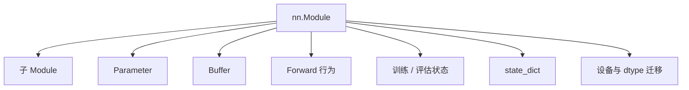
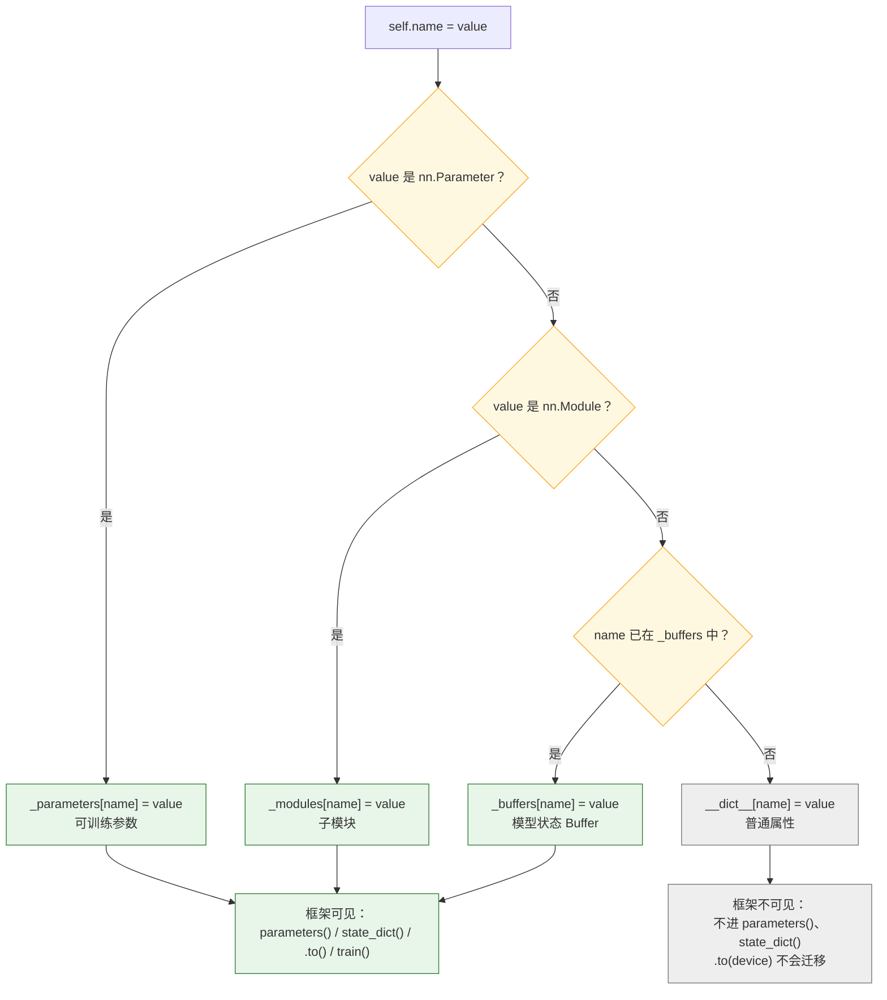
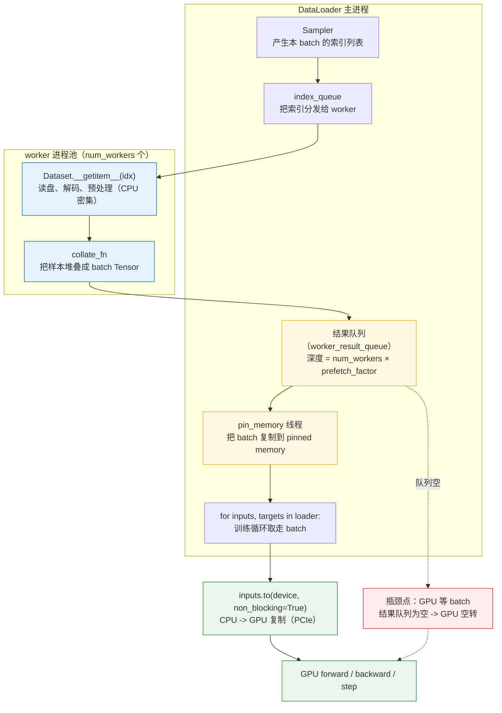
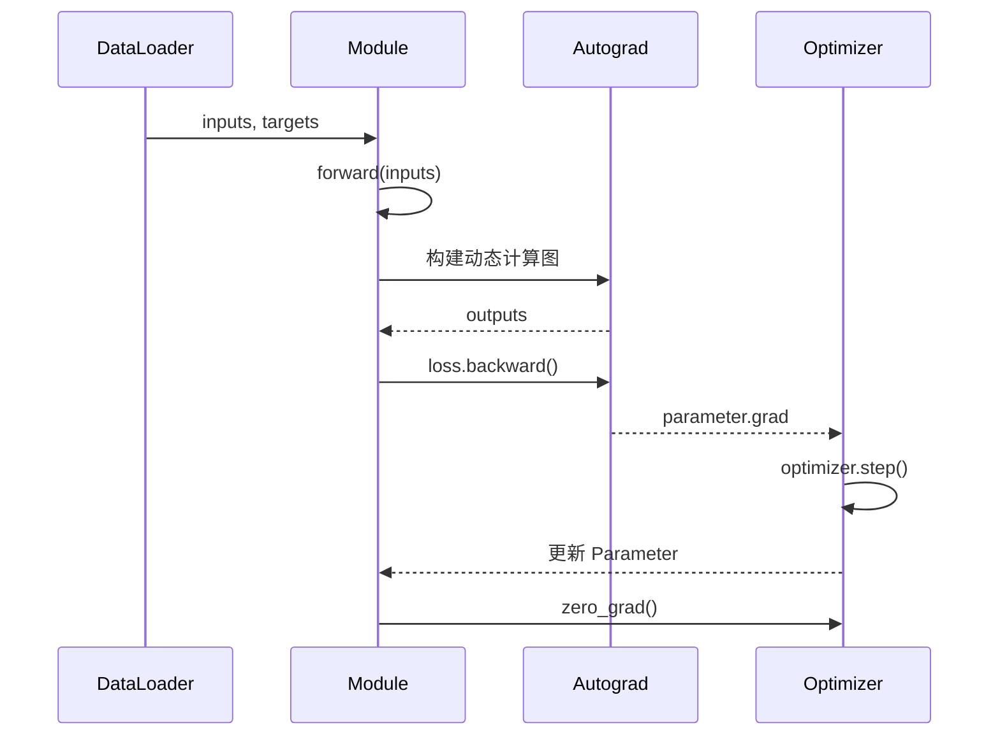
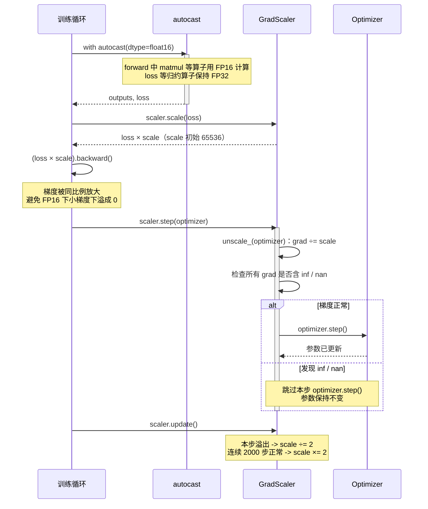
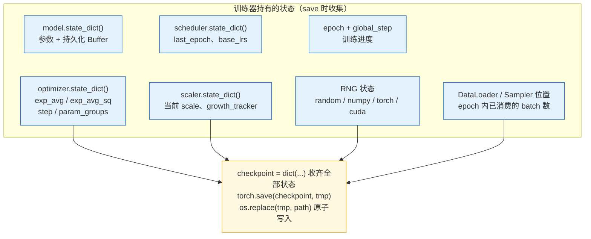
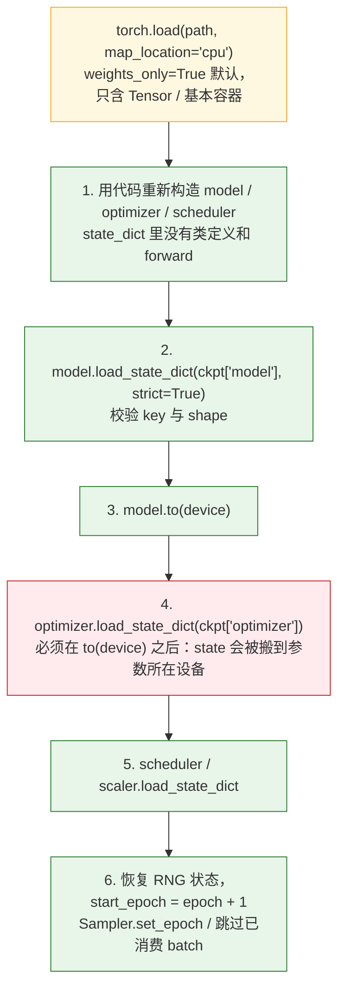

> 本文是[《PyTorch 深度实践：从 Tensor 到深度学习运行时》](/deep-dive-into-pytorch.html)系列的第 4 篇（共十篇）。上一篇：[自动求导与动态计算图](/pytorch-autograd-and-dynamic-computation-graph.html)；下一篇：[Dispatcher 与算子系统](/pytorch-dispatcher-and-operator-system.html)

上一篇讨论了 Autograd：Tensor 运算如何形成动态计算图，`backward()` 如何沿图传播梯度，以及梯度状态和计算图生命周期之间有什么关系。

但一个真实的模型不会只是几个散落的 Tensor 运算。它通常包含：

- 多层嵌套的网络结构；
- 需要训练的参数；
- 不参与梯度更新但属于模型状态的 Buffer；
- 优化器和优化器状态；
- 训练、验证和推理三种不同阶段；
- 数据集、采样器和 DataLoader；
- CPU 到 GPU 的数据搬运；
- checkpoint、恢复训练和混合精度。

PyTorch 用 `nn.Module` 把这些对象组织起来，再通过 Optimizer、Dataset 和 DataLoader 将它们连接成训练系统：

```text
Module 树
    ↓
Parameter / Buffer / state_dict
    ↓
forward
    ↓
Loss
    ↓
backward
    ↓
Optimizer
    ↓
Parameter 更新
```

本文要回答的不是“如何调用 `nn.Linear`”，而是：

> **PyTorch 如何把模型结构、参数状态、数据管线和训练循环组织成一个可以保存、迁移、复用和扩展的系统？**


## 一、总览：从模型对象到训练系统

### 1. 本文的主线

本文沿着上面那条从 Module 树到参数更新的链路展开：先看一个模型对象里到底包含什么，`nn.Module` 靠什么机制发现子模块、Parameter 和 Buffer，`state_dict` 如何把模型状态变成可保存、可迁移的快照；再进入训练系统的其余部分——训练 / 评估 / 推理三种状态、Optimizer、Dataset / Sampler / DataLoader、CPU 到 GPU 的数据搬运；然后把这些部件拼成一个完整训练循环，并补上混合精度、Hook 和 checkpoint 三个工程上绕不开的话题。

### 2. 本文的章节安排

```text
第二章   从模型对象到训练系统              一个模型包含什么、Module 树、forward、生命周期容器
第三章   nn.Module 与模块注册              __setattr__ 的注册机制、ModuleList / ModuleDict / Sequential
第四章   Parameter、Buffer 与模型状态       三类属性的区别、为什么普通 Tensor 不会自动迁移
第五章   state_dict                       保存什么、不是完整模型、保存与加载、可恢复 checkpoint
第六章   训练、评估与推理状态              train() / eval()、eval 不等于关闭梯度、完整评估函数
第七章   Optimizer 与参数更新              Optimizer 管理什么、梯度清零、参数组、冻结、state
第八章   Dataset、Sampler 与 DataLoader     三者的职责、collate_fn、瓶颈与 num_workers
第九章   CPU-GPU 数据传输与训练流水线       设备兼容、模型迁移、pinned memory、理想流水线
第十章   完整训练循环                     最小循环、完整程序、一次迭代的状态流、常见顺序错误
第十一章 混合精度训练入门                 autocast、GradScaler 及其边界
第十二章 Hooks 与模型观测                 Hook 能做什么、成本与风险
第十三章 Checkpoint 与可恢复训练          保存什么、何时保存、resume 不只是加载权重
第十四章 Java 工程师如何理解 nn.Module     组件树、Parameter、state_dict、DataLoader 的类比
第十五章 本文小结
```


## 二、从模型对象到训练系统

### 1. 一个模型包含什么？

一个最小的训练模型可以写成：

```python
import torch
from torch import nn


class MLP(nn.Module):
    def __init__(self, input_dim: int, hidden_dim: int, output_dim: int) -> None:
        super().__init__()
        self.fc1 = nn.Linear(input_dim, hidden_dim)
        self.activation = nn.ReLU()
        self.fc2 = nn.Linear(hidden_dim, output_dim)

    def forward(self, x: torch.Tensor) -> torch.Tensor:
        hidden = self.fc1(x)
        hidden = self.activation(hidden)
        return self.fc2(hidden)
```

可以看出，模型的定义其实是由两个部分组成：

1. `__init__`：
    定义有哪些子 Module、Parameter 和 Buffer
    形成模型的静态对象结构

2. `forward`：
    定义数据如何经过这些 Module
    形成一次执行中的计算关系

对应到上面的 `MLP`：

__init__ 定义的 Module 树：

```text
MLP
├── fc1: Linear
│   ├── weight
│   └── bias
├── activation: ReLU
└── fc2: Linear
    ├── weight
    └── bias
```

forward 定义的数据流：

```text
x → fc1 → activation → fc2 → output
```

因此，这个对象从训练系统的角度同时包含：

```text
MLP
├── Module 层级结构
├── Linear 的 Parameter
├── ReLU 的行为
├── forward 定义的数据流
├── state_dict
├── train / eval 状态
├── device / dtype 迁移能力
└── hook 和序列化协议
```

`nn.Module` 的价值不只是提供一个可以继承的基类，而是定义了一套模型对象协议。

**TIPS** 对于上面这个简单的 MLP，其实我们可以直接使用 `Sequential`：

```python
class SequentialMLP(nn.Module):
    def __init__(self, input_dim: int, hidden_dim: int, output_dim: int) -> None:
        super().__init__()
        self.layers = nn.Sequential(
            nn.Linear(input_dim, hidden_dim),
            nn.ReLU(),
            nn.Linear(hidden_dim, output_dim),
        )

    def forward(self, x: torch.Tensor) -> torch.Tensor:
        return self.layers(x)
```

`Sequential` 内部已经固化了“按顺序调用每个子模块”的 `forward()` 逻辑，因此对于这种没有分支、旁路和多输入的模型，它非常合适。使用 `Sequential` 并不意味着没有计算关系，只是把这部分固定流程交给了容器类。两个版本在这个简单例子中的计算结果等价，区别在于 `forward()` 的控制权：

| 写法 | Module 结构 | forward 关系 | 适合场景 |
|---|---|---|---|
| `Sequential` | 通过容器注册子模块 | 容器内部固定为顺序调用 | 线性、固定流程 |
| 显式 `__init__` + `forward` | 在 `__init__` 中显式注册 | 在 `forward` 中自由编排 | 分支、残差、多输入、多输出 |


### 2. Module 树：`__init__` 定义的静态结构

模型通常是一个树状结构。对于上面的 `MLP`，`__init__` 执行完成后，Module 树是：

```text
MLP
├── fc1: Linear
│   ├── weight
│   └── bias
├── activation: ReLU
└── fc2: Linear
    ├── weight
    └── bias
```

可以查看这棵树：

```python
model = MLP(128, 256, 10)
print(model)
```

也可以查看命名模块和参数：

```python
for name, module in model.named_modules():
    print(name, type(module).__name__)

for name, parameter in model.named_parameters():
    print(name, parameter.shape)
```

这里得到的 `fc1`、`activation`、`fc2` 是静态对象结构的一部分。它们会影响：

- 参数发现；
- `state_dict` 的 key；
- `.to(device)` 的递归迁移；
- `train()` 和 `eval()` 的递归传播；
- hook 的注册；
- 分布式包装；
- checkpoint 加载。

但 Module 树只说明“有哪些模块和状态”，还没有说明一次输入会按照什么顺序经过它们。这个关系由 `forward()` 定义。

### 3. `forward()` 定义动态数据流

`__init__()` 和 `forward()` 描述的是两个不同层次：

```text
__init__()
    定义可复用的模块、参数和 Buffer
    通常在模型构造时执行一次

forward()
    定义输入、模块和 Tensor 运算之间的数据流
    每次调用都可能形成一条新的执行路径
```

对于当前的 `MLP`，`forward()` 定义的是：

```text
x
 ↓
fc1
 ↓
activation
 ↓
fc2
 ↓
output
```

在 Eager Mode 下，forward 中的每个 Tensor 运算会立即执行；如果开启梯度记录，Autograd 还会为本次调用记录一张动态计算图。这里要区分两张图：

```text
Module 树
    → __init__ 中注册的模块、参数和 Buffer
    → 主要描述模型有哪些组件

Tensor / Autograd 计算图
    → forward 本次执行产生的运算关系
    → 主要描述数据如何流过这些组件
```

`forward()` 不只是把层按顺序排列，也可以表达分支、跳跃连接和条件路径：

```python
class ResidualBlock(nn.Module):
    def __init__(self, width: int) -> None:
        super().__init__()
        self.fc1 = nn.Linear(width, width)
        self.fc2 = nn.Linear(width, width)

    def forward(self, x: torch.Tensor) -> torch.Tensor:
        residual = x
        x = torch.relu(self.fc1(x))
        x = self.fc2(x)
        return x + residual
```

它的 Module 树只有两个 Linear，但 forward 的数据流包含一条旁路：

```text
        ┌──────────── residual ────────────┐
        │                                  │
x ─────┴→ fc1 → ReLU → fc2 ────────────── + → output
```

因此，更准确的说法是：

> `__init__()` 定义模型的静态组件结构，`forward()` 定义一次执行中的数据流；后者在开启 Autograd 时还会形成当前输入对应的动态计算图。

### 4. Module 是模型的生命周期容器



后续所有训练行为，都建立在 Module 能够找到并管理这些对象的前提上。


## 三、`nn.Module` 与模块注册

### 1. 为什么需要注册？

考虑下面两种写法：

```python
class BadMLP(nn.Module):
    def __init__(self) -> None:
        super().__init__()
        self.layers = [
            nn.Linear(10, 20),
            nn.Linear(20, 1),
        ]
```

以及：

```python
class GoodMLP(nn.Module):
    def __init__(self) -> None:
        super().__init__()
        self.layers = nn.ModuleList([
            nn.Linear(10, 20),
            nn.Linear(20, 1),
        ])
```

前者把子模块放进普通 Python list，后者使用 `ModuleList` 注册子模块。

```python
bad = BadMLP()
good = GoodMLP()

print(sum(parameter.numel() for parameter in bad.parameters()))
print(sum(parameter.numel() for parameter in good.parameters()))
```

普通 list 中的 Linear 可能不会被 Module 的参数遍历发现；`ModuleList` 中的 Linear 则会进入模块树。

这就是注册机制的意义：

> **只有被 Module 认识的对象，才能自动参与参数遍历、状态保存、设备迁移和训练生命周期管理。**

### 2. `__setattr__()` 的作用

当执行：

```python
self.layer = nn.Linear(10, 20)
```

Module 的属性设置逻辑会识别右侧对象是不是：

- Parameter；
- Module；
- 普通对象。

概念上可以简化为：

```text
赋值 self.name = value
        ↓
value 是 Parameter？ → 注册到 _parameters
        ↓
value 是 Module？    → 注册到 _modules
        ↓
否则                 → 作为普通属性保存
```

把 Buffer 也算进来，`__setattr__()` 的完整决策路径如下——绿色分支的对象会进入 Module 的内部字典，从而被框架“看见”；灰色分支的对象只是 Python 对象属性：



注意 Buffer 走的是“名字已经被 `register_buffer()` 登记过”这条判断，而不是看 value 的类型——这也是为什么必须先 `register_buffer("scale", ...)`，之后再 `self.scale = new_tensor` 才会更新 Buffer 而不是变成普通属性。

这也是为什么下面几种对象的行为不同：

```python
self.weight = nn.Parameter(torch.randn(10, 20))
self.layer = nn.Linear(10, 20)
self.counter = 0
```

分别属于：

```text
Parameter → 参数
Module    → 子模块
int       → 普通属性
```

### 3. `ModuleList`

当需要保存一组按顺序执行的子模块时，可以使用：

```python
class StackedMLP(nn.Module):
    def __init__(self, dims: list[int]) -> None:
        super().__init__()
        self.layers = nn.ModuleList(
            nn.Linear(left, right)
            for left, right in zip(dims, dims[1:])
        )

    def forward(self, x: torch.Tensor) -> torch.Tensor:
        for layer in self.layers:
            x = layer(x)
            x = torch.relu(x)
        return x
```

`ModuleList` 提供列表式访问，同时保留 Module 的注册语义。

### 4. `ModuleDict`

当子模块需要使用有意义的名字时，可以使用：

```python
class MultiHead(nn.Module):
    def __init__(self, input_dim: int, output_dim: int) -> None:
        super().__init__()
        self.heads = nn.ModuleDict({
            "classification": nn.Linear(input_dim, output_dim),
            "regression": nn.Linear(input_dim, 1),
        })

    def forward(self, x: torch.Tensor) -> dict[str, torch.Tensor]:
        return {
            name: head(x)
            for name, head in self.heads.items()
        }
```

### 5. `Sequential`

`Sequential` 是一种更强约束的 Module 容器：

```python
model = nn.Sequential(
    nn.Linear(10, 20),
    nn.ReLU(),
    nn.Linear(20, 1),
)
```

它适合“前一个模块的输出直接作为下一个模块的输入”的线性结构。

如果 forward 需要：

- 多个输入；
- 多个输出；
- 分支；
- 跳跃连接；
- 条件判断；

则通常应该使用自定义 Module，而不是强行塞进 Sequential。


## 四、Parameter、Buffer 与模型状态

### 1. Parameter 是什么？

`Parameter` 是 Tensor 的特殊封装，用来表示：

```text
这是 Module 的可训练参数
```

```python
from torch import nn

weight = nn.Parameter(torch.randn(4, 2))
print(weight.requires_grad)  # True
```

当它被赋值为 Module 的属性时，会自动注册：

```python
class LinearLike(nn.Module):
    def __init__(self, input_dim: int, output_dim: int) -> None:
        super().__init__()
        self.weight = nn.Parameter(torch.randn(output_dim, input_dim))
        self.bias = nn.Parameter(torch.zeros(output_dim))

    def forward(self, x: torch.Tensor) -> torch.Tensor:
        return x @ self.weight.t() + self.bias
```

```python
model = LinearLike(4, 2)
print(list(model.named_parameters()))
```

### 2. 普通 Tensor 不会自动成为参数

```python
class NotAParameter(nn.Module):
    def __init__(self) -> None:
        super().__init__()
        self.weight = torch.randn(4, 2, requires_grad=True)
```

这里的 `weight` 可以参与 Autograd，但它不会自动出现在：

```python
list(model.parameters())
model.state_dict()
```

这再次说明：

```text
requires_grad
    → 是否参与梯度计算

Parameter 注册
    → 是否被 Module 和 Optimizer 发现
```

### 3. Buffer 是什么？

有些 Tensor 属于模型状态，但不是需要 Optimizer 更新的参数。例如 BatchNorm 的运行统计量：

```python
class RunningMean(nn.Module):
    def __init__(self, size: int) -> None:
        super().__init__()
        self.register_buffer("running_mean", torch.zeros(size))

    def forward(self, x: torch.Tensor) -> torch.Tensor:
        return x - self.running_mean
```

Buffer 的典型特征是：

- 不会出现在 `parameters()` 中；
- 会出现在 `state_dict()` 中；
- 会随 `.to(device)` 迁移；
- 可以是持久化的，也可以设置 `persistent=False`。

```python
self.register_buffer(
    "temporary_mask",
    mask,
    persistent=False,
)
```

### 4. Parameter、Buffer 和普通属性

| 对象 | `parameters()` | `state_dict()` | `.to(device)` | Optimizer 更新 |
|---|---:|---:|---:|---:|
| `nn.Parameter` | 是 | 是 | 是 | 是 |
| persistent Buffer | 否 | 是 | 是 | 否 |
| non-persistent Buffer | 否 | 否 | 是 | 否 |
| 普通 Tensor 属性 | 否 | 否 | 否 | 否 |
| 普通 Python 属性 | 否 | 否 | 否 | 否 |

这张表是理解模型状态的关键。

### 5. 为什么普通 Tensor 不会自动迁移？

```python
class BadModule(nn.Module):
    def __init__(self) -> None:
        super().__init__()
        self.scale = torch.ones(10)
```

```python
model = BadModule().cuda()
print(model.scale.device)  # 仍可能是 cpu
```

因为普通属性没有经过 Module 的注册机制。需要把它注册为 Buffer：

```python
class GoodModule(nn.Module):
    def __init__(self) -> None:
        super().__init__()
        self.register_buffer("scale", torch.ones(10))
```


## 五、`state_dict`：模型状态的结构化快照

### 1. `state_dict()` 保存什么？

```python
model = LinearLike(4, 2)
state = model.state_dict()

print(state.keys())
```

通常会得到：

```text
weight
bias
```

嵌套模块会使用点号组织 key：

```text
layers.0.weight
layers.0.bias
layers.2.weight
layers.2.bias
```

`state_dict` 是一个从名字到 Tensor 的映射：

```text
模块路径 + 参数 / Buffer 名称
    ↓
state_dict key
    ↓
Tensor 状态
```

把 Module 树和 `state_dict` 并排放在一起看会更直观：左边是嵌套的对象树，右边是按"模块路径 + 属性名"拍平后的 key。Parameter 和持久化 Buffer 都会生成 key，无状态模块（如 ReLU）什么也不产生；下面以一个加了 BatchNorm 的 MLP 为例：

```text
Module 树（嵌套对象）                      state_dict（扁平 key -> Tensor）
────────────────────────────────         ──────────────────────────────
MLP
├── fc1: Linear
│   ├── weight       (Parameter) ──────▶ "fc1.weight"
│   └── bias         (Parameter) ──────▶ "fc1.bias"
├── act: ReLU                (无状态，不产生任何 key)
├── bn: BatchNorm1d
│   ├── weight       (Parameter) ──────▶ "bn.weight"
│   ├── bias         (Parameter) ──────▶ "bn.bias"
│   ├── running_mean (Buffer)    ──────▶ "bn.running_mean"
│   ├── running_var  (Buffer)    ──────▶ "bn.running_var"
│   └── num_batches_tracked (Buffer) ─▶ "bn.num_batches_tracked"
└── fc2: Linear
    ├── weight       (Parameter) ──────▶ "fc2.weight"
    └── bias         (Parameter) ──────▶ "fc2.bias"

不包含：类定义 / forward 逻辑 / optimizer 状态 / scheduler / RNG 状态
```

### 2. `state_dict` 不是完整模型

```python
state = model.state_dict()
```

它主要保存参数和持久化 Buffer，不包含：

- Python 类定义；
- forward 代码；
- Optimizer 状态；
- scheduler 状态；
- 随机数状态；
- 数据加载位置；
- 训练进度。

因此：

```text
模型状态快照 ≠ 可独立运行的完整模型
```

### 3. 保存和加载模型状态

```python
torch.save(model.state_dict(), "model.pt")

model = LinearLike(4, 2)
state = torch.load("model.pt", map_location="cpu")
model.load_state_dict(state)
```

加载时应该关注：

- key 是否一致；
- shape 是否一致；
- dtype 是否兼容；
- device 是否正确；
- 是否使用 strict 模式。

```python
result = model.load_state_dict(state, strict=True)
print(result)
```

`strict=False` 可以允许缺失或多余 key，但不应该用来掩盖模型结构错误。

`torch.load` 底层是 pickle，反序列化可以执行任意代码。PyTorch 2.6 起 `weights_only=True` 成为默认值：只允许加载 Tensor、基本容器和显式加入白名单的类型。只保存 `state_dict` 的做法天然满足这个限制；如果 checkpoint 里放了自定义对象，在新版本上会遇到 `UnpicklingError`。这类版本行为的变化和 `state_dict` 自身的版本迁移，第十篇会作为兼容性问题专门讨论。

### 4. 保存可恢复训练的 checkpoint

如果需要中断后继续训练，通常需要保存更多状态：

```python
checkpoint = {
    "model": model.state_dict(),
    "optimizer": optimizer.state_dict(),
    "scheduler": scheduler.state_dict(),
    "epoch": epoch,
    "global_step": global_step,
}

torch.save(checkpoint, "checkpoint.pt")
```

更完整的训练系统还可能保存：

- AMP GradScaler；
- Python 随机状态；
- NumPy 随机状态；
- PyTorch CPU 随机状态；
- CUDA 随机状态；
- 数据采样器状态；
- 配置和代码版本。

### 5. Java 对照的边界

`state_dict` 可以类比为结构化状态快照，但它不是 Java 序列化整个对象图：

```text
state_dict
    → 只保存可训练参数和模型状态
    → 依赖代码重新构造 Module
    → 通过 key 和 shape 恢复
```

这种设计使得权重状态和模型代码相对解耦，也使得模型结构变更时必须显式处理兼容性。


## 六、训练、评估与推理状态

### 1. `train()` 与 `eval()`

```python
model.train()
model.eval()
```

这两个方法会切换 Module 的训练状态，并递归作用于子模块。

典型受影响的模块包括：

- Dropout；
- BatchNorm；
- 某些自定义模块。

```python
model.train()
output = model(inputs)

model.eval()
with torch.inference_mode():
    output = model(inputs)
```

### 2. `eval()` 不等于关闭梯度

```python
model.eval()
output = model(inputs)
loss = criterion(output, targets)
loss.backward()
```

即使在 `eval()` 状态下，如果梯度记录开启，Autograd 仍然可以构建计算图。

反过来：

```python
model.train()
with torch.no_grad():
    output = model(inputs)
```

训练状态下也可以临时关闭梯度记录。

两者控制的是不同维度：

```text
train / eval
    → Module 行为

no_grad / inference_mode
    → Autograd 记录
```

两个维度正交，组合起来一共六种状态。下表每个格子写的是：Dropout / BatchNorm 的行为、是否构建计算图、典型用途：

| | 梯度开启（默认） | `torch.no_grad()` | `torch.inference_mode()` |
|---|---|---|---|
| `model.train()` | Dropout 随机丢弃，BN 用 batch 统计并更新 `running_*`<br/>**建图**<br/>正常训练 step | Dropout 随机丢弃，BN 用 batch 统计并更新 `running_*`<br/>不建图<br/>训练中临时的无梯度计算（如 EMA 权重更新、手写参数修改） | 同上，BN 仍更新 `running_*`<br/>不建图，且输出 Tensor 不能再进入 Autograd<br/>少见，通常没有理由这样组合 |
| `model.eval()` | Dropout 关闭（恒等），BN 用 `running_*`，不更新<br/>**建图**（显存和时间白白浪费）<br/>需要对输入求梯度的场景：对抗样本、显著性图、部分蒸馏 | Dropout 关闭，BN 用 `running_*`<br/>不建图<br/>验证 / 评估，输出后续还可能参与梯度计算时 | Dropout 关闭，BN 用 `running_*`<br/>不建图，跳过版本计数与 view 追踪，最省<br/>纯推理 / 验证：默认首选 |

真正的“推理”只有右下角那一格：`eval()` 负责让 Module 行为确定，`inference_mode()` 负责让 Autograd 彻底退出；缺任何一个都不算完整。

### 3. 一个完整的评估函数

```python
def evaluate(
    model: nn.Module,
    loader,
    criterion: nn.Module,
    device: torch.device,
) -> float:
    model.eval()
    total_loss = 0.0
    total_count = 0

    with torch.inference_mode():
        for inputs, targets in loader:
            inputs = inputs.to(device)
            targets = targets.to(device)
            outputs = model(inputs)
            loss = criterion(outputs, targets)

            batch_size = inputs.size(0)
            total_loss += loss.item() * batch_size
            total_count += batch_size

    return total_loss / total_count
```

这里同时处理了：

- Module 评估状态；
- 不记录梯度；
- 输入设备迁移；
- loss 转 Python 标量；
- 按样本数量汇总指标。


## 七、Optimizer 与参数更新

### 1. Optimizer 管理什么？

Optimizer 不只是一个“调用 `step()` 的对象”，它通常管理：

- 参数引用；
- 学习率；
- 参数组；
- 动量；
- 一阶和二阶统计量；
- weight decay 状态；
- step 计数。

```python
model = LinearLike(4, 2)
optimizer = torch.optim.AdamW(model.parameters(), lr=1e-3)
```

训练过程为：

```text
Parameter
    ↓
forward
    ↓
loss
    ↓
backward
    ↓
Parameter.grad
    ↓
optimizer.step()
    ↓
Parameter.data 更新
```

### 2. Optimizer 不负责计算梯度

```python
loss.backward()
```

负责根据计算图计算梯度；

```python
optimizer.step()
```

负责根据已有梯度和自身状态更新参数。

二者职责不同：

```text
Autograd  → 计算应该往哪个方向变化
Optimizer → 决定采用什么更新规则和步长
```

### 3. 梯度清零

典型训练循环为：

```python
optimizer.zero_grad(set_to_none=True)
loss.backward()
optimizer.step()
```

如果不清零，梯度会按照上一篇介绍的规则继续累积。

```text
第 1 步梯度 → grad
第 2 步梯度 → grad + 新梯度
```

### 4. 参数组

不同参数可以使用不同的学习率和 weight decay：

```python
optimizer = torch.optim.AdamW([
    {
        "params": model.backbone.parameters(),
        "lr": 1e-5,
    },
    {
        "params": model.head.parameters(),
        "lr": 1e-3,
    },
])
```

参数组常用于：

- 微调预训练模型；
- 冻结部分层；
- 对 bias 和 normalization 参数使用不同正则化；
- 新增 head 使用更大学习率。

### 5. 冻结参数

```python
for parameter in model.backbone.parameters():
    parameter.requires_grad_(False)
```

冻结参数意味着它们通常不参与梯度计算，但还需要注意：

- 是否仍然被放入 Optimizer；
- 模块是否处于 train 状态；
- BatchNorm 的 Buffer 是否仍然更新；
- forward 是否仍然消耗计算资源。

冻结参数不等于冻结整个模块的所有行为。

### 6. Optimizer state

AdamW 等 Optimizer 会为参数保存额外状态：

```python
optimizer.state_dict()
```

这些状态可能包括：

- step；
- exp_avg；
- exp_avg_sq。

因此训练显存通常不仅包含：

```text
参数 + 梯度
```

还包含：

```text
参数 + 梯度 + Optimizer State
```

以 FP32 + Adam(W) 为例，每一个标量参数在显存里对应四块同样大小的内存，其中一半属于 Optimizer state：

```text
每个参数（FP32, Adam/AdamW）
┌────────────┬────────────┬────────────┬────────────┐
│   param    │    grad    │  exp_avg   │ exp_avg_sq │
│  (weight)  │  (.grad)   │ (一阶动量) │ (二阶动量) │
│    4 B     │    4 B     │    4 B     │    4 B     │
└────────────┴────────────┴────────────┴────────────┘
 ◀───── Module 持有 ─────▶ ◀── Optimizer.state 持有 ──▶
                                        合计 16 B / 参数

换算：7B 参数模型
    7e9 × 16 B  ≈ 112 GB           （尚未计入激活值、临时缓冲）
    其中 param + grad = 56 GB，Optimizer state = 56 GB
```

这也是大模型训练中 Optimizer state 可能成为显存主要消耗者的原因之一：Adam 训练下每个参数要占 16 字节（参数、梯度、两个动量），第八篇会算这笔账。多卡训练时 Optimizer state 是最先被切分到各卡上的状态——第九篇的 ZeRO 与 FSDP 从这里开始。


## 八、Dataset、Sampler 与 DataLoader

### 1. Dataset 的职责

一个 Map-style Dataset 通常实现：

```python
from torch.utils.data import Dataset


class RegressionDataset(Dataset):
    def __init__(self, features: torch.Tensor, targets: torch.Tensor) -> None:
        self.features = features
        self.targets = targets

    def __len__(self) -> int:
        return self.features.size(0)

    def __getitem__(self, index: int):
        return self.features[index], self.targets[index]
```

它提供两个基本协议：

```text
__len__
    → 数据集大小

__getitem__
    → 根据索引取得一个样本
```

Dataset 不负责：

- 模型 forward；
- loss 计算；
- 参数更新；
- GPU 训练。

### 2. `IterableDataset`

对于流式数据或无法随机访问的数据，可以实现 `IterableDataset`：

```python
from torch.utils.data import IterableDataset


class StreamingDataset(IterableDataset):
    def __iter__(self):
        for record in stream_records():
            yield encode(record)
```

它适合：

- 日志流；
- 大于本地磁盘的数据；
- 在线生成的数据；
- 顺序读取的数据源。

但多 worker 场景需要显式处理 worker 分片，否则多个 worker 可能重复读取相同数据。

### 3. Sampler 的职责

Sampler 决定索引访问顺序：

```text
Dataset
    → 提供样本

Sampler
    → 产生索引顺序

DataLoader
    → 组织 batch 和 worker
```

常见 Sampler 包括：

- `SequentialSampler`；
- `RandomSampler`；
- `WeightedRandomSampler`；
- `DistributedSampler`。

数据顺序会影响：

- 训练随机性；
- 类别平衡；
- 分布式数据切分；
- 可复现性。

### 4. DataLoader 的职责

```python
from torch.utils.data import DataLoader

loader = DataLoader(
    dataset,
    batch_size=64,
    shuffle=True,
    num_workers=4,
    pin_memory=True,
)
```

DataLoader 通常负责：

- 读取样本；
- 组织 batch；
- 调用 `collate_fn`；
- 启动 worker；
- 预取数据；
- 将 CPU 数据放入 pinned memory。

### 5. `collate_fn`

默认 collate 可以处理形状一致的样本：

```text
样本 1：shape=(3,)
样本 2：shape=(3,)
样本 3：shape=(3,)
    ↓
Batch：shape=(3, 3)
```

但变长序列通常需要自定义 padding：

```python
def collate_fn(batch):
    sequences, labels = zip(*batch)
    padded = pad_sequence(
        sequences,
        batch_first=True,
        padding_value=0,
    )
    return padded, torch.tensor(labels)
```

### 6. DataLoader 为什么会成为瓶颈？

训练的一次迭代可以表示为：

```text
磁盘读取
    ↓
数据解码
    ↓
CPU 预处理
    ↓
collate
    ↓
Pinned Memory
    ↓
CPU → GPU
    ↓
GPU 计算
```

把这条链路展开到进程 / 线程层面，就能看到 `num_workers`、`prefetch_factor`、`pin_memory` 三个参数各自作用在哪一段，以及瓶颈最终在哪里表现出来：



- `num_workers` 决定蓝色部分有多少个进程并行执行 `__getitem__` + `collate_fn`；
- `prefetch_factor`（默认 2）决定每个 worker 最多提前准备多少个 batch，也就是结果队列的深度；
- `pin_memory=True` 才会启动 pin_memory 线程，后面的 `non_blocking=True` 复制才可能真正异步。

如果前面的数据准备速度低于 GPU 消耗速度，就会出现：

```text
GPU 计算完成
    ↓
等待下一个 batch
    ↓
GPU 利用率下降
```

所以 GPU 利用率低不一定是模型 Kernel 的问题，也可能是 DataLoader 没有及时提供数据。第八篇把这种情况单列为一类瓶颈（GPU 在等数据到达），并给出在 Profiler 时间线上把它与"GPU 在等 Python"区分开的方法。

### 7. `num_workers` 不是越大越好

增加 worker 可能提升并行数据准备能力，但也会增加：

- 进程数量；
- CPU 内存；
- 进程间通信；
- 文件句柄；
- 数据复制或序列化；
- worker 启动时间。

正确的调优方式是测量：

```text
num_workers=0
    ↓
num_workers=2
    ↓
num_workers=4
    ↓
num_workers=8
```

观察：

- batch 等待时间；
- GPU 利用率；
- CPU 使用率；
- 主机内存；
- 端到端 step time。

### 8. DataLoader 的 Java 对照

可以把数据管线近似理解为生产者—消费者系统：

```text
Dataset / Worker
    → 生产样本

Prefetch Queue
    → 暂存 batch

Training Loop
    → 消费 batch

GPU
    → 消费计算输入
```

但 DataLoader 不是简单的 Java `ExecutorService`：它还涉及 Python 进程、Tensor 共享、pinned memory 和设备搬运。


## 九、CPU-GPU 数据传输与训练流水线

### 1. 模型和数据必须位于兼容设备

```python
device = torch.device("cuda" if torch.cuda.is_available() else "cpu")
model = model.to(device)

for inputs, targets in loader:
    inputs = inputs.to(device)
    targets = targets.to(device)
    outputs = model(inputs)
```

`.to(device)` 需要分别作用于：

- 模型参数；
- 模型 Buffer；
- 输入 Tensor；
- target Tensor；
- 运行时创建的辅助 Tensor。

### 2. 模型迁移的递归性

```python
model.cuda()
```

会递归迁移已注册的 Parameter 和 Buffer，以及子 Module 中的对应状态。

但不会自动迁移普通属性中的 Tensor：

```python
self.mask = torch.ones(10)
```

这正是 Buffer 注册重要的原因。

### 3. Pinned Memory

CPU 普通内存与 GPU 之间的数据复制，可能受到主机内存页锁定状态的影响。DataLoader 可以配置：

```python
loader = DataLoader(
    dataset,
    batch_size=64,
    pin_memory=True,
)
```

再配合：

```python
inputs = inputs.to("cuda", non_blocking=True)
```

在满足条件时，数据复制可以与其他 GPU 工作重叠。

但需要注意：

- `pin_memory=True` 会增加主机内存压力；
- `non_blocking=True` 不保证所有场景都异步；
- 如果后面立刻读取结果，仍可能发生同步；
- 数据预处理和 PCIe 带宽仍可能是瓶颈。

### 4. 训练流水线的理想状态

```text
CPU Worker 准备 Batch N+1
              │
              ▼
GPU 计算 Batch N
              │
              ▼
CPU Worker 准备 Batch N+2
```

目标是让 CPU 数据准备和 GPU 计算尽量重叠，而不是：

```text
CPU 准备 Batch N
    ↓
GPU 计算 Batch N
    ↓
CPU 准备 Batch N+1
    ↓
GPU 等待
```

第八篇性能文章会用 Profiler 分析这种等待具体发生在哪里。

### 5. 不要在训练循环中频繁搬回 CPU

```python
for batch in loader:
    output = model(batch)
    value = output.cpu().numpy()
```

如果每个 step 都把大 Tensor 搬回 CPU，可能导致：

- GPU 与 CPU 同步；
- PCIe 带宽消耗；
- Python 线程等待；
- 显存和主机内存之间频繁交换。

如果只是记录标量，应优先使用：

```python
value = loss.detach().item()
```


## 十、完整训练循环

### 1. 最小训练循环

```python
def train_one_epoch(
    model: nn.Module,
    loader,
    criterion: nn.Module,
    optimizer: torch.optim.Optimizer,
    device: torch.device,
) -> float:
    model.train()
    total_loss = 0.0
    total_count = 0

    for inputs, targets in loader:
        inputs = inputs.to(device)
        targets = targets.to(device)

        optimizer.zero_grad(set_to_none=True)
        outputs = model(inputs)
        loss = criterion(outputs, targets)
        loss.backward()
        optimizer.step()

        batch_size = inputs.size(0)
        total_loss += loss.detach().item() * batch_size
        total_count += batch_size

    return total_loss / total_count
```

### 2. 一个完整的训练程序

```python
model = MLP(input_dim=128, hidden_dim=256, output_dim=10)
criterion = nn.CrossEntropyLoss()
optimizer = torch.optim.AdamW(model.parameters(), lr=1e-3)

device = torch.device("cuda" if torch.cuda.is_available() else "cpu")
model.to(device)

for epoch in range(10):
    train_loss = train_one_epoch(
        model,
        train_loader,
        criterion,
        optimizer,
        device,
    )
    valid_loss = evaluate(
        model,
        valid_loader,
        criterion,
        device,
    )
    print(epoch, train_loss, valid_loss)
```

### 3. 一次训练迭代的状态流



### 4. 训练循环中的常见顺序错误

**忘记调用 `optimizer.step()`**

```python
loss.backward()
# 没有 optimizer.step()
```

这样只计算了梯度，没有更新参数。

**忘记清空梯度**

```python
loss.backward()
optimizer.step()
```

如果没有在下一步前清零，梯度会继续累积。

**在 forward 前错误地清零**

通常推荐：

```python
optimizer.zero_grad()
outputs = model(inputs)
loss = criterion(outputs, targets)
loss.backward()
optimizer.step()
```

关键不是某一行绝对不能换位置，而是每一次 backward 前必须明确当前 `.grad` 中应该保留什么。

**验证阶段仍然构建计算图**

```python
model.eval()
for batch in valid_loader:
    output = model(batch)
```

这可能产生不必要的 Autograd 和显存开销。验证通常应使用：

```python
model.eval()
with torch.inference_mode():
    ...
```


## 十一、混合精度训练入门

### 1. 为什么使用混合精度？

低精度计算可能带来：

- 更小的存储空间；
- 更低的内存带宽需求；
- 更高的硬件吞吐；
- 更低的通信成本。

但低精度也可能带来：

- 溢出；
- 下溢；
- 梯度数值不稳定；
- 不同算子支持差异。

### 2. autocast

现代 PyTorch 中可以使用：

```python
with torch.autocast(device_type="cuda", dtype=torch.bfloat16):
    outputs = model(inputs)
    loss = criterion(outputs, targets)
```

autocast 会根据算子和设备选择适合的计算 dtype。它不是把整个模型的所有 Tensor 无条件转换成一种类型。

### 3. GradScaler

对于 FP16 训练，通常还需要梯度缩放：

```python
scaler = torch.amp.GradScaler("cuda")

for inputs, targets in loader:
    optimizer.zero_grad(set_to_none=True)

    with torch.autocast(device_type="cuda", dtype=torch.float16):
        outputs = model(inputs)
        loss = criterion(outputs, targets)

    scaler.scale(loss).backward()
    scaler.step(optimizer)
    scaler.update()
```

这三行各自做了什么、和 autocast、Optimizer 之间怎么配合，用一次迭代的时序来看：



要点有两个：`scaler.step()` 内部才做 unscale 和溢出检查，所以如果需要在 step 前做梯度裁剪，必须先显式调用 `scaler.unscale_(optimizer)`；`scaler.update()` 让 scale 自适应——溢出就减半、长期稳定就翻倍，这也是它必须在每步 `step()` 之后调用的原因。

BF16 的指数范围接近 FP32，很多训练场景不需要和 FP16 完全相同的缩放策略，但具体行为仍取决于硬件、算子和版本。

### 4. 混合精度的边界

混合精度不是“免费加速”：

- 首次运行可能有额外上下文开销；
- 某些算子可能回退到 FP32；
- dtype 转换本身需要成本；
- 数值结果可能发生变化；
- 不同 GPU 的收益不同。

应使用正确性测试和 Benchmark 验证，而不是只看代码中出现了 `autocast`。本节只介绍混合精度作为训练 API 的用法；它为什么能加速（Tensor Core 与访存量减半）、什么时候加速不明显、如何用 Benchmark 确认收益，第八篇作为一条性能处方展开。


## 十二、Hooks 与模型观测

### 1. Hook 能做什么？

Module 提供多种 hook，用于观察或干预执行过程：

```python
def log_shape(module, inputs, output):
    print(type(module).__name__, output.shape)

handle = model.register_forward_hook(log_shape)
```

使用结束后应移除：

```python
handle.remove()
```

Hook 常用于：

- 观察中间激活；
- 调试 shape；
- 统计耗时；
- 采集特征；
- 检查模块执行顺序；
- 研究模型行为。

### 2. Hook 的成本和风险

Hook 会改变或包裹执行路径，可能带来：

- Python 回调开销；
- 额外 Tensor 引用；
- 计算图被意外保留；
- 编译器 graph break；
- 并发和生命周期复杂化。

因此，不应在生产热路径中无条件挂载大量 hook。

### 3. Hook 与 `forward()` 的关系

```python
output = model(inputs)
```

通常会经过 Module 的调用协议，而不是简单执行：

```python
model.forward(inputs)
```

Hook 正是 Module 调用协议中的一部分。直接调用 `forward()` 可能绕过部分 Module 行为，因此业务代码通常应调用：

```python
model(inputs)
```

而不是：

```python
model.forward(inputs)
```

这与第一篇对 PyTorch 调用路径的介绍相互呼应。


## 十三、Checkpoint 与可恢复训练

### 1. 只保存模型权重

适合部署或只需要推理的场景：

```python
torch.save(model.state_dict(), "weights.pt")
```

### 2. 保存完整训练状态

适合训练中断后恢复：

```python
checkpoint = {
    "model": model.state_dict(),
    "optimizer": optimizer.state_dict(),
    "epoch": epoch,
    "global_step": global_step,
}
```

如果使用 scheduler 和 AMP，还应加入：

```python
checkpoint["scheduler"] = scheduler.state_dict()
checkpoint["scaler"] = scaler.state_dict()
```

### 3. 保存 checkpoint 的时机

常见选择包括：

- 每个 epoch 结束；
- 每隔固定 global step；
- 验证集指标刷新时；
- 训练发生异常前；
- 周期性保存最新和最佳版本。

生产系统还需要考虑：

- 原子写入；
- 临时文件；
- 文件损坏；
- 并发保存；
- 远程对象存储；
- 版本和元数据；
- 清理旧 checkpoint。

### 4. Resume 不只是加载权重

```python
checkpoint = torch.load(path, map_location="cpu")
model.load_state_dict(checkpoint["model"])
optimizer.load_state_dict(checkpoint["optimizer"])
start_epoch = checkpoint["epoch"] + 1
```

如果只加载模型而不加载 Optimizer state，训练可能不能从原来的优化轨迹继续。

一个完整的 save / resume 流程如下。save 时是“收集所有会影响后续训练轨迹的状态”，resume 时则有严格的先后顺序——模型对象必须先由代码构造出来，`optimizer` 又必须在 `model.to(device)` 之后才能 `load_state_dict`，否则 Optimizer state 会留在 CPU 上、与参数设备不一致：



resume 是 save 的逆过程，但顺序不能乱：



这就像 Java 服务恢复业务状态时，不只是恢复一个对象字段，还可能需要恢复：

- 定时任务进度；
- 消费位点；
- 缓存状态；
- 重试计数；
- 外部依赖版本。


## 十四、Java 工程师如何理解 `nn.Module`

### 1. Module 更像带状态协议的组件树

`nn.Module` 可以近似理解为：

```text
组件树
+ 参数注册
+ 状态注册
+ 生命周期切换
+ 设备迁移
+ 序列化协议
+ 调用钩子
```

它不是简单的 Java POJO，也不是只有一个 `forward()` 方法的接口。

### 2. Parameter 不是普通字段

Java 中一个 `double[]` 字段不会因为被放入对象就自动进入 Optimizer。PyTorch 中，Parameter 的注册让框架能够发现它、保存它、迁移它并更新它。

```text
普通 Tensor 字段
    → 只是对象属性

nn.Parameter 字段
    → Module 管理的模型参数
```

### 3. state_dict 不是 Java Serialization

`state_dict` 保存的是显式模型状态，而不是整个 Python 对象图。重新加载时仍然需要：

```text
重新构造模型代码
    ↓
加载 state_dict
    ↓
恢复参数和 Buffer
```

这种方式牺牲了部分“直接恢复对象”的便利性，换来了更明确的状态边界和更好的跨代码版本控制能力。

### 4. DataLoader 是带设备语义的数据管线

DataLoader 可以类比生产者—消费者，但它还额外包含：

- Python worker 进程；
- Tensor batch；
- pinned memory；
- CPU-GPU 传输；
- 数据预取；
- 训练 step 的背压。

所以调优 DataLoader 不能只看线程池大小，还要看数据格式、CPU、内存、总线和 GPU 消费速度。


## 十五、本文小结

本文讨论了 PyTorch 如何把 Module、参数、状态、数据和训练循环组织成完整系统。

### 1. Module 是模型生命周期容器

```text
Module
    ├── 子 Module
    ├── Parameter
    ├── Buffer
    ├── forward
    ├── train / eval
    ├── state_dict
    ├── device / dtype 迁移
    └── hooks
```

### 2. 注册机制决定框架能否发现对象

```text
普通 Python list
    → 不自动注册子 Module

ModuleList / ModuleDict
    → 注册子 Module

普通 Tensor 属性
    → 不自动进入 state_dict，也不自动迁移

register_buffer()
    → 注册模型状态，但不参与 Optimizer 更新
```

### 3. 训练系统的状态流

```text
DataLoader
    ↓
inputs / targets
    ↓
model(inputs)
    ↓
loss
    ↓
loss.backward()
    ↓
Parameter.grad
    ↓
optimizer.step()
    ↓
Parameter 更新
```

### 4. 训练和推理的边界

```text
train()
    → 训练态 Module 行为

eval()
    → 评估态 Module 行为

no_grad()
    → 关闭梯度记录

inference_mode()
    → 面向纯推理的更强上下文
```

### 5. 分析一个训练问题的顺序

```text
Module 是否正确注册？
    ↓
Parameter 是否被发现？
    ↓
Buffer 是否正确迁移？
    ↓
输入和模型是否在同一 device？
    ↓
DataLoader 是否及时供给 batch？
    ↓
loss 是否连接到目标参数？
    ↓
grad 是否正确清零和更新？
    ↓
checkpoint 是否保存了完整状态？
```

### 6. 本篇涉及的源码位置

本篇讨论的机制在源码中的位置（对应第一篇第七章的代码地图）：

| 路径 | 内容 |
|---|---|
| `torch/nn/modules/module.py` | `Module`：`__setattr__` 注册、`register_buffer`、`state_dict` / `load_state_dict`、`_apply`（`.to()` 的递归）、hook 链 |
| `torch/nn/parameter.py`、`torch/nn/modules/container.py` | `Parameter`；`Sequential`、`ModuleList`、`ModuleDict` |
| `torch/optim/optimizer.py`、`torch/optim/adamw.py` | Optimizer 基类：param groups、`state`、`zero_grad`；AdamW 的 fused / foreach 实现 |
| `torch/utils/data/dataloader.py`、`sampler.py`、`_utils/` | DataLoader 的 worker 进程、预取；Sampler；`collate`、`pin_memory` 线程 |
| `torch/amp/autocast_mode.py`、`torch/amp/grad_scaler.py` | autocast 的 Python 入口与 GradScaler |
| `aten/src/ATen/autocast_mode.cpp` | autocast 的 C++ 实现：作为一个 DispatchKey 拦截算子并转换 dtype（第五篇的机制） |
| `torch/serialization.py` | `torch.save` / `torch.load`、`weights_only` 的受限 unpickler |
| `torch/utils/hooks.py` | `RemovableHandle` 与 hook 注册机制 |

下一篇将进入 PyTorch 的算子运行时：

> **同一个 `add` 算子为什么能够运行在 CPU、CUDA、Autograd 和 Meta 等不同后端上？Dispatcher 又是如何选择具体实现的？**


## 下一篇

[Dispatcher 与算子系统](/pytorch-dispatcher-and-operator-system.html)
