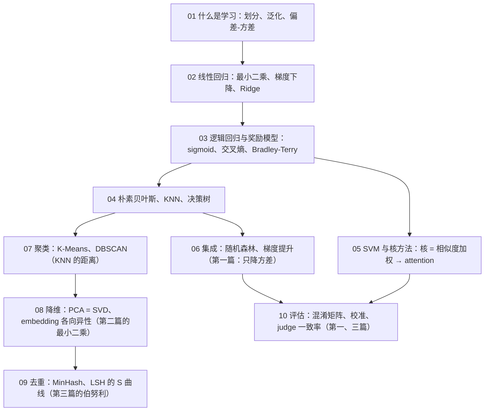

十篇正文回答了一个问题：**LLM 工作里的哪些问题其实是经典机器学习的老问题，它们的经典解法在 LLM 上还成立吗**。第一篇讲什么是学习与泛化；第二、三篇讲线性回归与逻辑回归并指出奖励模型就是后者；第四到六篇从三个基础分类器到 SVM 到树的集成，并算清数据过滤为什么用小模型；第七、八篇讲聚类与降维；第九篇把 MinHash 与 LSH 的概率算清楚；第十篇讲评估——一切结论是否成立的最后一道关。十篇合起来对应[《AI 算法工程师学习地图》](/ai-algorithm-engineer-learning-roadmap.html)的 L2 层，也是总纲那张"重现表"的逐行展开。

本文不讲新内容，做三件事：把十篇压成一张表与十段回顾，把贯穿十篇的几条线拎出来，然后给一套三段式的通关自测——判断与计算、跨篇综合、面试题。各篇末尾的自测检验的是"这一篇读懂了没有"，这里检验的是"十篇能不能连起来用"。

> **读完这十篇，你应该能回答哪些问题？[^q0] 哪些数字与结论必须能脱口而出？[^q1] 怎么判断自己是"读过"还是"掌握"了？[^q2]**

先把整个系列放在一张图上——箭头是**推导或前置上的依赖**（箭头尾端的结论被箭头头端当作前提），不是阅读顺序：

## 一、总览：系列回答的问题与主线

系列的一句话主张是：**看到 LLM 上的一个问题，能叫出它的经典名字——叫出名字，经典解法就在手边**。污染是测试集泄漏，reward hacking 是在过拟合的评估器上做优化，weight decay 是 Ridge，RAG 是 KNN，attention 是核回归，judge 的长度偏好是系统误差，过滤器的误杀是精确率与召回率的权衡，"20 个 benchmark 领先 12 个"是多重比较。十篇用同一种方法推进：从一个具体的小例子讲起，画出来，用十几行 NumPy 手写核心机制并与 scikit-learn 对数，指出它在 LLM 工作里的形态与失效方式。

| 篇 | 回答的问题 | 一句话结论 | 必记的数字 / 公式 |
|---|---|---|---|
| [第一篇：什么是学习](/what-is-learning-splits-generalization-and-bias-variance.html) | benchmark 涨了 5 个点，怎么知道不是泄漏？奖励模型准确率 80%，为什么 RL 还会钻空子？ | 测试集只能看一次，参与过决策的数据就不再是测试集；过拟合是容量相对于数据太大；reward hacking = 在一个过拟合的评估器上做优化 | 次数 25 训练 MSE 0.040 低于噪声方差 0.09、验证 0.313；学习曲线：100 个点时 15 次与 4 次一样好；近重复随机切 CV 0.060 vs 真实 0.10；测试集上挑最好中位乐观 0.015、均值 0.255；误差 = 偏差² + 方差 + 噪声 |
| [第二篇：线性回归](/linear-regression-least-squares-ridge-and-lasso.html) | `lstsq` 解了什么方程？梯度下降为什么有时发散？`weight_decay` 和 Ridge 是什么关系？ | 正规方程 $$X^T X w = X^T y$$ 是把 $$y$$ 投影到特征平面；损失是一条斜沟，学习率上限 $$2/\lambda_{\max}$$；Ridge = weight decay | GD 与闭式解差 $$10^{-10}$$；条件数 540 万 → 标准化后 1；共线时系数 7.88 / −5.95；Lasso 45/50 归零；$$w \leftarrow (1 - 2\eta\lambda) w - \eta g$$ 与 Ridge 差 $$10^{-13}$$ |
| [第三篇：逻辑回归与奖励模型](/linear-and-logistic-regression-the-skeleton-of-reward-models.html) | 预测数的模型怎么变成预测概率？奖励模型和逻辑回归是什么关系？为什么准确率到 80% 就上不去？ | 线性部分过 sigmoid，交叉熵的梯度是 $$(p - y)x$$；语言模型输出层是 softmax 回归；奖励模型 = 逻辑回归作用在特征差上、无偏置；准确率上限是标注一致性 | 乳腺癌 30 特征 0.959；手写数字 softmax 0.961；$$P(A \succ B) = \sigma(w^T(x_A - x_B))$$；3000 对 91.5% vs 上限 91.3%、$$w$$ 相关 0.999；噪声 4.0 时准确率 71% 而 $$w$$ 相关 0.995 |
| [第四篇：三个基础分类器](/a-family-of-classifiers-from-naive-bayes-to-gradient-boosting.html) | "朴素"朴素在哪？不训练的分类器为什么到处都是？决策树为什么一定过拟合？ | 朴素 = 类内特征独立，不成立时证据重复计数；KNN 就是检索，前提是有好的 embedding；决策树容量随深度指数增长 | 去掉冗余特征 NB 0.837 → 0.852；$$k = 1$$ 训练 100% 测试 0.83；1000 维最近与最远只差 10%；Gini $$2p(1-p)$$；深度不限训练 1.000 测试 0.826 |
| [第五篇：SVM 与核方法](/svm-and-kernel-methods.html) | SVM 凭什么选间隔最大的直线？核技巧为什么不增加计算量？attention 和核回归是什么关系？ | 只有支持向量决定边界（hinge 在间隔 ≥ 1 为零）；核 = 不升维算高维内积；核回归的三步就是 attention 的三步 | 60 个点 2 个支持向量；$$C$$ 0.01 → 82 个支持向量、100 → 36 个；圆环线性 0.58 → RBF 1.00；$$\gamma = 200$$ 训练 1.00 测试 0.87；核回归 = attention 差 $$10^{-15}$$；64000 样本 7.6 s vs 0.01 s |
| [第六篇：集成](/ensembles-random-forest-and-gradient-boosting.html) | 很多棵过拟合的树平均为什么不过拟合？梯度提升为什么叫"梯度"？数据过滤为什么用 fastText 与 GBDT？ | bagging 只降方差；残差 = 负梯度，梯度提升是函数空间的梯度下降；不是小模型更准，是只有它跑得起 | 一棵树 0.826 → 200 棵 0.905，方差 0.094 → 0.007；树间相关 0.59 → 0.53；学习率 1.0 第 24 棵到顶后下滑；8B 打分 = 训练算力的 33.3%、线性模型 0.004% |
| [第七篇：聚类](/unsupervised-learning-kmeans-pca-and-embedding-clusters.html) | K-Means 为什么一定收敛、收敛到的是最好的吗？怎么知道语料里有什么、$$k$$ 取多少？ | 两步都不增簇内平方和所以收敛，但到局部最优；聚类是探索不是预测，不需要"正确" | inertia 7281；随机初始化最差 16541、k-means++ 7861；肘部 5→6 降 1000、6→7 降 500；月牙 K-Means ARI 0.255 vs DBSCAN 1.000；78 句 $$k = 7$$ ARI 1.0、模板页自成一簇 |
| [第八篇：降维](/dimensionality-reduction-pca-svd-tsne-and-umap.html) | PCA 为什么等于 SVD？二维图上的距离能信吗？为什么任意两句余弦都在 0.7 以上？ | PCA = 中心化数据的 SVD，特征值 = $$\sigma^2/(n-1)$$；t-SNE 只保局部；各向异性——所有向量挤在窄锥里，减均值 | 64 维里 29 维解释 95%；PCA 2 维 KNN 0.60 vs t-SNE 0.98；余弦均值 0.79、第一主成分占 26%；减均值后同 / 异主题差距 0.14 → 0.64；真实权重 90% 能量要 299/896 维 |
| [第九篇：去重](/deduplication-minhash-and-lsh-probabilities.html) | 相似到什么程度算重复？阈值怎么定？为什么不两两比较？ | MinHash 相等的概率恰好等于 Jaccard；LSH 的 S 曲线中点就是阈值；三层去重由便宜到贵 | 手算 3/6；标准差 $$\sqrt{J(1 - J)/k}$$、$$k = 128$$ ±0.04；$$P = 1 - (1 - s^r)^b$$，$$b = 14, r = 8$$ 阈值 0.685；200 万对 → 267 候选；模板页 Jaccard 0.70、同义句 0.00 但余弦 0.46 |
| [第十篇：评估](/evaluation-from-confusion-matrix-to-judge-agreement.html) | 准确率 95% 能上线吗？judge 一致率 80% 够不够？20 个 benchmark 领先 12 个算不算？ | 不平衡时准确率没有信息；AUC 不看概率、校准要单独查；κ 扣掉随机一致、系统偏差平均不掉；同一套题用配对；多个 benchmark 要多重比较 | 召回 ≥ 95% 时精确率 0.904；正例 3% 全判负 95.6%；过度自信 ECE 0.069 → 0.019；永远选 A 一致率 92% κ = 0；位置偏差 21 个点；MMLU ±0.8、100 题 ±9；McNemar 3.13 vs 独立 1.38；领先期望 10 ± 2.2 |

### 1. 本文的章节安排

| 章 | 内容 |
|---|---|
| 二 | 逐篇回顾：核心问题、结论、必记、常见误解 |
| 三 | 贯穿十篇的六条线：测试集只看一次、偏差-方差与集成、逻辑回归这条骨架、梯度下降这条线、相似度这条线、用便宜的近似换掉跑不起的精确 |
| 四 | 常见误区表 |
| 五 | 通关自测：A 判断与计算 10 题、B 跨篇综合 5 题、C 面试题 8 题、D 掌握判据 |
| 六 | 下一步 |
| 七 | 延伸阅读 |

## 二、逐篇回顾

### 1. 第一篇：什么是学习——划分、泛化、过拟合与偏差-方差

**核心问题**：benchmark 涨了 5 个点，怎么知道不是测试题泄漏？奖励模型的准确率 80%，为什么 RL 还会钻空子？

**结论**：学习是从有限样本推断没见过的样本，`fit` 就是"找让训练误差最小的参数"（多项式的情形是三行最小二乘）。数据分三份：训练集拟合、验证集选超参数、测试集只看一次；怎么切要看样本是否独立——近重复样本随机切时 CV 分数 0.060 vs 真实 0.10，按组切才排出正确顺序。30 个点拟合正弦：次数 1 欠拟合（0.272 / 0.308），4 合适，15 过拟合（穿过每个训练点、两端乱甩），25 的训练 MSE 0.040 低于噪声方差 0.09、验证 0.313；学习曲线告诉你过拟合是容量**相对于数据**太大——100 个点时 15 次与 4 次一样好。在测试集上挑配置：中位数乐观 0.015、均值 0.255（长尾）；LLM 上叫污染与过度调参，n-gram 重叠抓得住原文（0.77）、抓不住改写（0.05）。误差 = 偏差² + 方差 + 噪声，100 个模型的预测带把它画出来；集成只降方差。正则化是拉向简单解；reward hacking 是在一个过拟合的评估器上做优化。

**必记**：三份数据、测试集只看一次、按组切；次数 1 / 4 / 15 / 25 的四个数字；学习曲线 100 个点；0.015 / 0.255；n-gram 0.77 vs 0.05；偏差² 0.158 / 方差 0.662 那张表；经典解法五条。

**常见误解**："self-consistency 能修正系统性错"——集成只降方差；"大模型几千亿参数也不过拟合，所以过拟合不重要"——15T token 相对于参数仍是数据多的一侧，一到几千条 SFT 数据训三个 epoch 就回到 15 个点的世界。

### 2. 第二篇：线性回归——最小二乘、梯度下降与 Ridge / Lasso

**核心问题**：`lstsq` 那一行解了什么方程？梯度下降为什么有时几百步、有时发散？`weight_decay=0.1` 和 Ridge 是什么关系？

**结论**：一条直线、20 个点，最小二乘让残差平方和最小（38.7 vs 随手画的 90 多）。对损失求导令为零得正规方程 $$X^T X w = X^T y$$，几何上是把 $$y$$ 投影到特征张成的平面；$$d > n$$ 或共线时不可逆。梯度下降沿负梯度走，损失是一条斜的窄沟：学习率上限 $$2 / \lambda_{\max}$$（0.027），条件数就是沟有多窄；GD 与闭式解差 $$10^{-10}$$，SGD 用 1/12 算量到同一邻域但抖动。两种坏地形：量纲不同（条件数 540 万，标准化后 1）、共线（系数 7.88 / −5.95 乱跳，Ridge 各分一半）。Ridge 加 $$\alpha \lVert w \rVert^2$$ 让 $$X^T X + \alpha I$$ 可逆、系数一起变小；Lasso 加 $$\alpha \lVert w \rVert_1$$ 把无用系数压到恰好为零（45/50）——菱形的角在坐标轴上。Ridge 的梯度下降是 $$w \leftarrow (1 - 2\eta\lambda) w - \eta g$$，就是 weight decay，数值差 $$10^{-13}$$；15 次多项式加 Ridge 系数 2021 → 5、验证 0.143 → 0.108。平方误差是高斯噪声的 MLE，离群点把斜率从 1.57 拉到 0.82，绝对值误差不受影响。

**必记**：正规方程与投影；$$2/\lambda_{\max}$$ 与条件数；标准化让碗变圆；Lasso 归零 / Ridge 不归零的几何；weight decay 公式；MSE 与 MAE 的噪声假设。

**常见误解**："学习率越小越安全所以越小越好"——小了在沟底爬不动，上限由最大曲率定，先标准化把碗变圆；"Ridge 减小了模型容量"——容量不变（还是 15 次），只是不让系数变大。

### 3. 第三篇：逻辑回归与奖励模型——每个分类头的原型

**核心问题**：一个预测数的模型怎么变成预测概率的模型？奖励模型和逻辑回归是什么关系？为什么它的准确率到 80% 就上不去了？

**结论**：线性部分 $$z$$ 过 sigmoid 得概率，$$z = 0$$ 是线性的决策边界。交叉熵是伯努利分布的 MLE，越自信地错罚得越重，且配 sigmoid 的梯度恰好是 $$(p - y)x$$——与线性回归同形（有限差分验证差 $$10^{-11}$$），用平方误差会梯度消失。12 行手写 GD：二维两团点 0.93、与 scikit-learn 系数差 0.001；乳腺癌 30 特征 0.959，系数可读。softmax 回归把 sigmoid 换成 softmax、loss 是 $$-\log p_y$$，手写数字 0.961；**语言模型输出层就是一个 vocab 类的 softmax 回归**，$$W$$ 从 65×10 变成 4096×128000。奖励模型：Bradley-Terry $$P(A \succ B) = \sigma(r_A - r_B)$$，$$r$$ 线性时等于 $$\sigma(w^T(x_A - x_B))$$——特征差上的无偏置逻辑回归；3000 对拟出的 $$w$$ 与真实相关 0.999，准确率 91.5% 等于用真实分数判断的 91.3%，错的几乎全在分差最小的 1/4 对上（标注一致率 0.75）；噪声调六档，模型准确率始终贴着上限、$$w$$ 相关始终 > 0.96——71% 的准确率对应 0.995 的 $$w$$ 相关。

**必记**：$$\sigma(z)$$ 的五个值；$$(p - y)x$$；softmax = 输出层；$$P(A \succ B) = \sigma(w^T(x_A - x_B))$$、无偏置的理由；91.5% vs 91.3%；噪声 vs 上限表；真实 RM 65–80% 对应标注一致 70–80%。

**常见误解**："奖励模型准确率 78% 太低，该训得更久"——已接近上限，再训拟合噪声；"pairwise loss 是特殊的 loss"——就是把 $$w^T x$$ 换成 $$w^T(x_A - x_B)$$。

### 4. 第四篇：三个基础分类器——朴素贝叶斯、KNN 与决策树

**核心问题**："朴素"贝叶斯朴素在哪，假设不成立时会怎样？一个不训练的分类器为什么在 LLM 工作里到处都是？决策树为什么一定过拟合？

**结论**：七个分类器一张地图：线性模型只能画直线（月牙 0.88），KNN、决策树、SVM 各用自己的方式弯过去（0.93–0.94），没有一个模型在所有数据上最好。朴素贝叶斯 = 贝叶斯公式 + 类内特征独立：$$\hat c = \arg\max_c [\log P(c) + \sum_j \log P(x_j \mid c)]$$，高斯版每类每特征一条正态曲线、15 行、`fit` 0.0004 秒、与 `GaussianNB` 完全一致；冗余特征让证据重复计数（去掉后 0.837 → 0.852 反超逻辑回归）。KNN 4 行、不训练；$$k$$ 是偏差-方差的旋钮（1 → 训练 100% 测试 0.83，9–25 最好 0.89）；必须标准化；维度灾难——1000 维时最近与最远只差 10%，所以要先有 embedding；它在 LLM 里就是检索，近似最近邻 $$O(\log n)$$。决策树每个节点选切完两边加权 Gini 最低的一刀，25 行；深度 2 的树是三个问题四个叶子、规则可读；容量随深度指数增长，深度不限训练 100%、测试 0.83。

**必记**：贝叶斯手算 0.837 / 0.911；NB 0.837 → 0.852；$$k$$ 表；维度灾难表；Gini $$2p(1-p)$$；深度表；三个分类器的选择表。

**常见误解**："KNN 可以直接用在原始像素 / 词频上"——维度灾难，邻居无意义；"决策树可解释所以泛化好"——可解释与过拟合是两件事，单棵树方差极大。

### 5. 第五篇：SVM 与核方法——最大间隔、核技巧与 attention 的远亲

**核心问题**：能分开两类的直线无数条，SVM 凭什么选间隔最大的？核技巧为什么能不增加计算量就把直线变成曲线？attention 和核回归是什么关系？

**结论**：间隔 $$= 1/\lVert w \rVert$$，最大化间隔 = 最小化 $$\lVert w \rVert$$，60 个点里只有 2 个支持向量决定边界。hinge $$\max(0, 1 - yf(x))$$ 在间隔 ≥ 1 恰好为零——分对且够远的点不参与（逻辑回归的 loss 永远不为零），12 行次梯度下降与 `LinearSVC` 的 $$w$$ 余弦 0.9997；线性 SVM 与逻辑回归是近亲。软间隔 $$C$$ 是正则化的倒数（0.01 → 82 个支持向量、间隔 1.83；100 → 36 个、0.53）。核技巧：算法里数据只以内积出现，换成核函数 $$K = \phi(x)^T\phi(x')$$ 等于在高维画直线、原空间画曲线而从不构造 $$\phi$$——圆环 0.58 → 加一维 1.00 → RBF 1.00；RBF 对应无穷维，$$\gamma$$ 是容量旋钮（200 → 训练 1.00 测试 0.87）。核回归三步——相似度、归一化、加权值——就是 attention 的三步，RBF 核回归与点积 attention 公式对到 $$10^{-15}$$；Transformer 的新东西是 $$Q, K, V$$ 学出来。核 SVM $$O(n^2)$$–$$O(n^3)$$（64000 样本 7.6 s vs 0.01 s），大数据上退场；间隔活在 margin loss、线性 SVM 活在 fastText。

**必记**：间隔公式；支持向量 2 个；hinge 表；$$C$$ 表；核 = 不升维算内积；$$\gamma$$ 表；核回归 = attention；复杂度表。

**常见误解**："核把数据映射到高维再计算所以更慢"——从不构造高维特征，只算核函数；"attention 是全新的机制"——相似度加权是 1964 年的核回归，新的是投影学出来。

### 6. 第六篇：集成——随机森林、梯度提升与数据质量分类器的算力账

**核心问题**：很多棵都过拟合的树平均起来为什么反而不过拟合？梯度提升"逐棵拟合残差"为什么叫"梯度"？预训练数据过滤为什么用 fastText 与 GBDT 而不是 LLM？

**结论**：bagging 重采样训很多棵树取平均：一棵树 0.826 → 200 棵 0.905，预测方差 0.094 → 0.007，偏差不变——集成不改变表达能力只让它稳定。随机森林每个节点只看 $$m$$ 个特征，树间相关 0.59 → 0.53，$$m = \sqrt{d}$$ 最好 0.918；袋外估计免费。梯度提升 $$F_t = F_{t-1} + \eta h_t$$，每棵树拟合残差，残差是平方损失的负梯度——在函数空间做梯度下降；15 行手写与 scikit-learn 同量级、比一棵深树好 4 倍；换 loss 只换负梯度（分类 $$y - p$$）。学习率 × 棵数：1.0 第 24 棵到顶后下滑，0.1 到 0.915；早停定棵数；XGBoost / LightGBM / CatBoost 是同一模型的三个实现。特征重要性 6/30 占 91%；表格数据 RF 0.919 vs 不调参 MLP 0.905。算力账：8B 给 15T 打分 $$2.4 \times 10^{23}$$ = 训练算力的 33.3%，1 亿参数 0.42%，线性模型 0.004% → 两级做法（FineWeb-Edu 45 万段、DCLM fastText）；fastText = 词袋 + 线性分类器；老问题：分布偏移、系统性误杀、阈值。

**必记**：0.826 → 0.905、0.094 → 0.007；相关表；残差 = 负梯度；学习率表；三个超参数；算力表；两级做法。

**常见误解**："用 LLM 打分最准所以应该用 LLM"——1/3 的训练算力；"表格数据也该上神经网络"——GBDT 不用标准化、鲁棒、两三个参数到位。

### 7. 第七篇：聚类——K-Means、DBSCAN 与「这批语料里有什么」

**核心问题**：K-Means 那两步为什么一定收敛，收敛到的一定是最好的吗？怎么知道一个语料里有什么主题、$$k$$ 该取多少？

**结论**：分配步让每个点到中心更近、更新步的均值是最小二乘解，两步都不增簇内平方和所以一定收敛（四帧图 10665 → 320），但到局部最优：随机初始化 50 次里 1/3 停在差解、最差 16541 是最优 7281 的两倍，k-means++ 最差 7861，再加 `n_init`。12 行手写与 scikit-learn 同数。$$k$$ 用肘部（5→6 降 1000、6→7 降 500）或轮廓系数（$$k = 2$$ 最高 0.665），不一致按业务定。DBSCAN 按密度：核心点 / 边界点 / 噪声，月牙 K-Means ARI 0.255 vs DBSCAN 1.000，$$\varepsilon$$ 0.05 碎成 8 簇。层次聚类在树状图上找合并距离跳大处横切，$$O(n^2)$$。真实语料：78 句过 Qwen2.5-0.5B 取 mean pooling、归一化、K-Means——$$k = 7$$ ARI 1.0，每簇抽两条一眼认出主题，6 句模板页自成一簇；用法是按簇配比、找垃圾簇、SFT 保多样性——探索不是预测。

**必记**：两步；inertia 7281 / ARI 0.76；随机 vs ++ 的最差值；肘部与轮廓表；月牙 0.255 vs 1.000；$$\varepsilon$$ 表；78 句 $$k$$ = 4 / 7 / 10 的 ARI。

**常见误解**："跑两次结果不同说明 K-Means 有 bug"——局部最优是算法本身的性质；"聚类要选对 $$k$$ 才有用"——数据工程里目的是让人看。

### 8. 第八篇：降维——PCA、SVD、t-SNE 与 embedding 的各向异性

**核心问题**：PCA 的"方差最大的方向"在找什么，为什么等于 SVD？4096 维的 embedding 怎么看，二维图上的距离能信吗？为什么任意两句的余弦都在 0.7 以上？

**结论**：PCA 找投影后方差最大 = 重建误差最小的互相垂直的方向（PC1 方差 3.44 vs 随手方向 1.34）。四行手写：中心化 → SVD → 取前 $$k$$ 行，与 scikit-learn 差 $$10^{-13}$$。手写数字 64 维里 29 维解释 95%，10 个坐标重建出认得出的图、30 个肉眼无差。协方差特征分解 = 数据矩阵 SVD = PCA，特征值 $$= \sigma^2/(n-1)$$，三种算法 179.01 / 163.72 / 141.79 全同。真实权重矩阵的谱比随机矩阵衰减快（90% 能量 299 vs 458 维）但不低秩——LoRA 的低秩假设是关于 $$\Delta W$$ 的。PCA 前两维 KNN 0.60，t-SNE 0.98，但 t-SNE 只保局部、不可逆、有随机性——看团不看团间距离；标准做法先 PCA 到 30–50 维。各向异性：78 句真实句向量任意两句余弦均值 0.79、第一主成分占 26%；减均值后同主题 / 不同主题差距 0.14 → 0.64，检索分数才有区分度；小语料上去掉前几个主成分反而伤主题信息。

**必记**：PCA 几何；四行代码；29 维 / 95%；重建表；三种算法同数；299 vs 458；0.60 vs 0.98；0.79 / 26% / 0.14 → 0.64。

**常见误解**："余弦 0.85 说明很像"——先看第一主成分占比；"t-SNE 图上两团离得远说明差别大"——团间距离没有意义。

### 9. 第九篇：去重——MinHash 与 LSH 的概率

**核心问题**：两段文本"相似"到什么程度算重复？MinHash 的阈值怎么定？为什么不用两两比较？

**结论**：n-gram 集合的 Jaccard 定义相似（100 词改 5 词约 0.6）。MinHash：随机排列下集合里排最前的元素，两集合的最小值相等 ⟺ 并集里排最前的落在交集里，概率恰好是 Jaccard（手算 3/6）；20 行实现；$$k$$ 个签名相等的比例是无偏估计，标准差 $$\sqrt{J(1-J)/k}$$ 实测与理论逐点吻合、$$k = 128$$ 时 ±0.04、512 字节。LSH 分 $$b$$ 组每组 $$r$$ 个拼成桶号，任一组同桶即候选，$$P = 1 - (1 - s^r)^b$$，中点 $$s_{50} = (1 - 0.5^{1/b})^{1/r}$$；FineWeb $$b = 14, r = 8$$ 阈值 0.685——"Jaccard > 0.7"是曲线中点；$$r$$ 大更严（8 × 16 → 0.856）、$$b$$ 大更松（28 × 4 → 0.395）。2000 段 200 万对 → 267 候选，按 Jaccard 分区间的实测召回贴着理论 S 曲线；LSH 不漏、精确比较不错杀。三层去重：精确 hash → MinHash（模板页 Jaccard 0.70）→ embedding 语义去重（同义句 Jaccard 0.00 但余弦 0.46 vs 无关 −0.20）。

**必记**：Jaccard；3/6 手算；标准差公式与 $$k$$ 表；S 曲线公式与 $$b = 14, r = 8$$ 的五个点；三组参数的阈值；200 万 → 267；三层表。

**常见误解**："去掉了所有 Jaccard > 0.8 的重复"——概率算法，7.7% 漏掉；"去重越彻底越好"——控制重复的分布而不是消灭重复。

### 10. 第十篇：评估——从混淆矩阵到 judge 的一致性

**核心问题**：一个安全分类器准确率 95%，能上线吗？judge 与人的一致率 80%，够不够？20 个 benchmark 领先 12 个算赢吗？

**结论**：混淆矩阵拆出精确率（判为正的有多准）、召回率（真正的抓了多少）、F1，12 行手写与 scikit-learn 全同；阈值是旋钮——0.1 → 0.9 召回 0.985 → 0.721、精确率 0.765 → 0.980，要求召回 95% 精确率 0.904；AUC 是随机一正一负正例分数更高的概率（实测 0.9721 vs 0.9726），比模型用 AUC、定阈值用 P / R。正例 3% 时全判负 95.6%——不平衡时准确率没有信息。校准：可靠性图与 ECE；过度自信的模型 AUC 不变、ECE 0.069，Platt / isotonic 校准后 0.019——AUC 不看概率；RLHF 后置信度变差是同一现象。judge：Cohen's κ 扣掉随机一致，永远选 A 在 90% 选 A 的题上一致率 92%、κ = 0；位置偏差可以量（对换顺序差 21 个点）、可以消（两次一致才算），系统偏差平均不掉。一个分数稳不稳：5 折 0.763 ± 0.022 vs 单次抖 0.078；标准误 $$\sqrt{p(1-p)/n}$$——MMLU ±0.8、GSM8K ±1.9、100 题 ±9；bootstrap 与公式一致。两个模型比：同一套题用配对，McNemar $$z = 3.13$$ vs 独立 1.38；20 个 benchmark 期望 1 个假显著、至少一个 61%、领先期望 10 ± 2.2。

**必记**：精确率 / 召回率定义；阈值表；AUC 含义；不平衡表；ECE 0.069 → 0.019；κ 公式与 0.917 / 0；位置偏差 21 个点；MMLU ±0.8；McNemar 公式；10 ± 2.2。

**常见误解**："AUC 高的模型概率也可信"——AUC 只看排序；"judge 一致率 82% 超过人与人的 80% 所以够了"——先算 κ、再查系统偏差。

## 三、贯穿全系列的几条线

### 1. 测试集只能看一次：从 0.255 到 61%

第一篇立下的规矩——参与过任何决策的数据都不再是测试集——在后面每一篇里换一个规模重现。原型是 20 个测试点上挑最好的多项式次数（中位乐观 0.015、均值 0.255）；按组切告诉你连"验证集"都可能是假的——近重复样本随机切时 CV 分数 0.060 vs 真实 0.10。第三篇的奖励模型把它推到极端：91.5% 已等于标注上限 91.3%，再往上就是拟合噪声。第六篇把同一件事搬到数据过滤：训练标签的样本不代表全部语料就是分布偏移。第十篇给出全部量化工具：5 折 vs 单次划分、标准误与 bootstrap、配对 vs 独立、20 个 benchmark 至少一个假显著 61%——在很多个数字里挑最好的那个，挑出来的数字就带了选择偏差。

### 2. 偏差-方差与集成：降得掉的与降不掉的

第一篇的分解与预测带（次数 1 偏差² 0.158、次数 15 方差 0.662）贯穿五篇。第四篇 KNN 的 $$k$$（1 → 方差大，150 → 偏差大）与决策树的深度是同一个旋钮的两种形态；第五篇 SVM 的 $$C$$ 与 RBF 的 $$\gamma$$ 也是；第六篇 bagging 把方差 0.094 压到 0.007、偏差不变，随机森林靠降低树间相关压得更多，梯度提升则反过来降偏差、用学习率与早停防过拟合。第十篇把它用到 judge 上：多个 judge 平均能降随机误差，位置、长度、自我偏好是系统偏差，平均不掉，只能设计消掉。

### 3. 逻辑回归这条骨架：从分类头到奖励模型到校准

第三篇的 $$\sigma(w^T x + b)$$ + 交叉熵是五篇的公共骨架。它是每一个神经网络分类头的原型，softmax 版是语言模型的输出层；以特征差的形式变成奖励模型；第五篇的线性 SVM 是它换了 hinge loss 的近亲，第六篇的 fastText 是它加词袋特征的形态、梯度提升分类用的负梯度 $$y - p$$ 也是它的梯度；第十篇里它输出概率所以有阈值、loss 是对数似然所以天然校准，Platt scaling 就是在分数上再套一个它。

### 4. 梯度下降这条线：从一个碗到函数空间

第二篇在二维碗上把梯度下降看清：学习率上限 $$2/\lambda_{\max}$$、条件数、标准化让碗变圆、SGD 的噪声与 batch。第三篇的逻辑回归没有闭式解只能 GD，梯度形式 $$(p - y)x$$ 不变；第五篇的 hinge 用次梯度；第六篇的梯度提升把参数从向量 $$w$$ 换成函数 $$F$$，每一步的更新量用一棵树表示——"拟合残差"就是"沿负梯度走一步"；第七篇 K-Means 的两步是坐标下降、也到局部最优。L3 的深度学习优化器是这条线的延续。

### 5. 相似度这条线：从欧氏距离到 attention

第四篇 KNN 定义"最近"（欧氏、余弦、必须标准化），维度灾难说原始高维空间里距离无意义、要先有 embedding；第五篇的核函数是一个相似度，核回归的"相似度 → 归一化 → 加权值"就是 attention；第七篇用余弦（归一化后的欧氏）在句向量上聚类；第八篇发现 embedding 的各向异性让余弦失去含义、减均值才能比；第九篇的 Jaccard 是集合上的相似度，MinHash 把它变成可 hash 的签名，语义去重又回到余弦。RAG、few-shot 选例、去重召回、attention——全在这一条线上。

### 6. 用便宜的近似换掉跑不起的精确，再把代价算清

第六篇的算力账是起点：8B 打分 = 训练算力的 1/3，所以两级做法，代价是分布偏移与误杀。第四篇暴力 KNN $$O(n)$$ → 近似最近邻 $$O(\log n)$$，代价是偶尔漏掉最近的；第五篇核 SVM $$O(n^2)$$ 在大数据上换成线性模型；第七篇聚类放弃"正确"；第八篇先 PCA 到 50 维再 t-SNE。第九篇算到最精确：$$10^9$$ 段两两比较 $$5 \times 10^{17}$$ 对不可能，MinHash 用 512 字节代替集合（代价 ±0.04），LSH 用分桶换掉两两比较（代价由 S 曲线精确给出，实测召回贴着它）。第十篇的对应是大模型不做交叉验证。方法论：先算精确做法的代价，再选近似，再用概率或消融给出近似的误差。

| 概念 | 出现的篇 | 关系 |
|---|---|---|
| 测试集只看一次、选择偏差 | 一、三、六、十 | 一给原型（0.015 / 0.255、按组切）；三的 RM 超过上限即拟合噪声；六的分布偏移；十的 CV、标准误、配对、多重比较 |
| 偏差-方差、集成只降方差 | 一、四、五、六、十 | 一分解并画预测带；四的 $$k$$ 与深度；五的 $$C$$ 与 $$\gamma$$；六的 bagging / RF / GBDT；十的 judge 系统偏差 |
| 逻辑回归 $$\sigma(w^T x + b)$$ | 三、五、六、十 | 三是原型、输出层、RM；五的线性 SVM 是近亲；六的 fastText 与 GBDT 分类梯度；十的阈值与校准 |
| 梯度下降 | 二、三、五、六、七 | 二的碗与学习率上限；三无闭式解；五的次梯度；六的函数空间；七的坐标下降与局部最优 |
| 相似度与近邻 | 四、五、七、八、九 | 四的 KNN 与维度灾难；五的核 = attention；七的余弦聚类；八的各向异性；九的 Jaccard / MinHash / 语义去重 |
| 正则化 | 一、二、五 | 一定义为"拉向简单解"；二的 Ridge = weight decay、Lasso 稀疏；五的 $$C$$ 是倒数 |
| 算力账与两级做法 | 五、六、十 | 五的 $$O(n^2)$$；六算出 1/3 与 0.42%；十的阈值取舍 |
| 标注一致性作为上限 | 三、十 | 三的 91.5% vs 91.3% 与噪声表；十的 κ 与人与人 70–80% |
| 低维 / 低秩 | 八 | 29 维解释 95%；真实权重 299/896；LoRA 的假设是关于 $$\Delta W$$ |

## 四、常见误区

| 误区 | 为什么错 | 正确的说法 | 出处 |
|---|---|---|---|
| benchmark 涨了 5 个点就是能力提升 | 题目可能在预训练语料里（污染），或团队在它上面反复调参使它变成了验证集 | 没有干净的测试集，评测数字就没有含义；n-gram 查原文、换一份没参与过决策的题重测 | [第一篇](/what-is-learning-splits-generalization-and-bias-variance.html) |
| self-consistency 或多个 judge 平均能修正系统性的错 | 集成只降方差，偏差不变 | bagging 把方差 0.094 降到 0.007、偏差不变；系统偏差只能设计消掉 | [第一篇](/what-is-learning-splits-generalization-and-bias-variance.html)、[第六篇](/ensembles-random-forest-and-gradient-boosting.html) |
| 学习率越小越安全 | 上限由最大曲率定（$$2/\lambda_{\max}$$），太小在沟底爬不动 | 先标准化让碗变圆（条件数 540 万 → 1），再选接近上限的学习率 | [第二篇](/linear-regression-least-squares-ridge-and-lasso.html) |
| weight decay 是深度学习特有的技巧 | 它就是 Ridge 的梯度下降形态 | $$w \leftarrow (1 - 2\eta\lambda)w - \eta g$$，与 Ridge 闭式解差 $$10^{-13}$$ | [第二篇](/linear-regression-least-squares-ridge-and-lasso.html) |
| 奖励模型准确率 78% 太低，该训得更久 | 标签有噪声，准确率贴着标签正确率就是学会了；判断过拟合看训练 / 验证 gap | 上限是标签与真值的一致率（不可观测），人际一致率 70–80% 比它低、不是天花板；噪声 4.0 时准确率 71% 而 $$w$$ 相关 0.995 | [第三篇](/linear-and-logistic-regression-the-skeleton-of-reward-models.html) |
| KNN 可以直接用在原始的高维特征上 | 维度灾难：1000 维时最近与最远只差 10% | 先学出低维 embedding 再做近邻；这就是检索的前提 | [第四篇](/a-family-of-classifiers-from-naive-bayes-to-gradient-boosting.html) |
| attention 是 Transformer 发明的全新机制 | 相似度 → 归一化 → 加权值是 1964 年的核回归 | RBF 核回归与点积 attention 公式对到 $$10^{-15}$$；新的是 $$Q, K, V$$ 学出来 | [第五篇](/svm-and-kernel-methods.html) |
| 数据质量用 LLM 打分最准，所以应该用 LLM | 8B 给 15T token 打分是训练算力的 1/3 | 两级做法：大模型标几十万段、小分类器过全部；不是效果更好，是只有它跑得起 | [第六篇](/ensembles-random-forest-and-gradient-boosting.html) |
| 梯度提升在所有数据上最好 | 5000 样本上随机森林 0.919、SVM 0.918、梯度提升 0.913 | 线性模型是 baseline，树的集成是表格数据的默认，按数据形状、规模与预测端成本选 | [第四篇](/a-family-of-classifiers-from-naive-bayes-to-gradient-boosting.html)、[第六篇](/ensembles-random-forest-and-gradient-boosting.html) |
| K-Means 两次结果不同说明有 bug | 收敛到局部最优是算法的性质 | 随机初始化最差 16541 vs 最优 7281；用 k-means++ 与 `n_init` | [第七篇](/unsupervised-learning-kmeans-pca-and-embedding-clusters.html) |
| 聚类结果不"正确"就没用 | 数据工程里聚类是探索工具，目的是让人能看 | $$k$$ 取 50 还是 200 对"看看有什么"影响不大；每簇抽几条读 | [第七篇](/unsupervised-learning-kmeans-pca-and-embedding-clusters.html) |
| 两段文本余弦相似度 0.85 说明很像 | embedding 各向异性让所有对余弦都在 0.7 以上（实测均值 0.79） | 先 PCA 看第一主成分占比；减均值后再比 | [第八篇](/dimensionality-reduction-pca-svd-tsne-and-umap.html) |
| LoRA 的低秩假设是因为权重矩阵本身低秩 | 真实 $$W$$ 90% 能量要 299/896 维，不低秩 | 低秩假设是关于微调改动 $$\Delta W$$ 的 | [第八篇](/dimensionality-reduction-pca-svd-tsne-and-umap.html) |
| "Jaccard > 0.7 算重复"是经验值 | 它是 $$b = 14, r = 8$$ 的 S 曲线过 50% 的位置 | $$s_{50} = (1 - 0.5^{1/14})^{1/8} \approx 0.685$$；想改阈值就改 $$(b, r)$$ | [第九篇](/deduplication-minhash-and-lsh-probabilities.html) |
| 过滤器准确率 95% 说明很好 | 正例 3% 时全判负也有 95.6% | 不平衡时看精确率 / 召回率 / AUC | [第十篇](/evaluation-from-confusion-matrix-to-judge-agreement.html) |
| AUC 高的模型给出的概率也可信 | AUC 只看排序，不看概率的绝对值 | 过度自信的模型 AUC 不变、ECE 0.069；Platt / isotonic 校准 | [第十篇](/evaluation-from-confusion-matrix-to-judge-agreement.html) |
| judge 一致率超过人与人的一致率就够了 | 一致率未扣随机基线，且系统偏差不在里面 | 算 κ（永远选 A 可以 92% 一致、κ = 0）；对换顺序量位置偏差 | [第十篇](/evaluation-from-confusion-matrix-to-judge-agreement.html) |
| 20 个 benchmark 领先 12 个就是全面领先 | 两个完全相同的模型随机期望领先 10 个、标准差 2.2 | 12 在一个标准差以内；Bonferroni、看平均分的置信区间、或预先指定主 benchmark | [第十篇](/evaluation-from-confusion-matrix-to-judge-agreement.html) |

## 五、通关自测

### A. 判断与计算（10 题）

1. 30 个点拟合正弦、噪声方差 0.09。某个配置报出验证 MSE 0.07，这个数字在期望意义上可能吗？看到它该先查什么？

   

答案

   不可能——噪声方差 0.09 是验证误差的下限（不可约误差）。看到低于下限的分数，先查验证集是否参与过决策（第一篇在测试集上挑配置的乐观偏差），或验证集里是否有训练样本的近重复（按组切）。

   

2. 用第一篇的分解数字：次数 1 偏差² 0.158、方差 0.025；次数 4 偏差² 0.003、方差 0.014；次数 15 偏差² 0.008、方差 0.662；噪声 0.09。三个容量的期望误差各是多少，哪个最合适？

   

答案

   误差 = 偏差² + 方差 + 噪声：次数 1 为 0.273，次数 4 为 0.107，次数 15 为 0.760。次数 4 最合适——容量增加降偏差、升方差，两者之和最小处就是合适的容量。

   

3. 一个线性回归的 Hessian $$\frac{2}{n}X^T X$$ 最大特征值 50、最小 0.5。稳定的学习率上限多少？条件数多少？怎么让它变好？

   

答案

   上限 $$2 / 50 = 0.04$$；条件数 100；标准化特征让各方向曲率接近（第二篇里条件数 540 万 → 1）。

   

4. 一个奖励模型留出集准确率 86%，而标注员两两一致率 75%。这个数字说明什么？

   

答案

   超过了标注一致性的上限——第三篇里模型准确率始终贴着上限走（噪声六档全是如此）。要么留出集与训练集有重叠、不再是干净的测试集，要么留出集恰好都是分差大的对；先查数据。

   

5. 一堆样本 60 个类 0、40 个类 1，Gini 不纯度是多少？一刀切成 (50, 0) 与 (10, 40) 两堆后加权 Gini 是多少？

   

答案

   $$2 \times 0.6 \times 0.4 = 0.48$$；左堆 0，右堆 $$2 \times 0.2 \times 0.8 = 0.32$$，加权 $$0.5 \times 0 + 0.5 \times 0.32 = 0.16$$。

   

6. 一个 SVM 的 1000 个训练点里 12 个是支持向量。删掉 500 个非支持向量的点重新训练，边界会变吗？一个间隔 $$yf(x) = 0.3$$ 的点 hinge loss 是多少、是支持向量吗？

   

答案

   不变——hinge 在间隔 ≥ 1 的点上为零，它们对解没有贡献。hinge $$= 0.7$$；是（间隔 < 1 的点都在间隔带内）。

   

7. 一份数据上 K-Means 的簇内平方和：$$k = 5$$ 为 8274、$$k = 6$$ 为 7281、$$k = 7$$ 为 6773；轮廓系数在 $$k = 2$$ 最高。$$k$$ 该取几？同一份数据两次跑出 7281 与 16541 又是为什么？

   

答案

   肘部在 6（5→6 降 1000、6→7 只降 500）；轮廓系数偏好粗划分，不一致时按业务定。16541 是收敛到了局部最优（两个中心挤在一个真簇里），用 k-means++ 与 `n_init`。

   

8. 中心化数据矩阵的奇异值 $$\sigma_1 = 30$$，$$n = 101$$，第一主成分的方差是多少？一批 embedding 做 PCA 第一主成分解释 26%、任意两个余弦均值 0.79，说明什么、该怎么办？

   

答案

   $$900 / 100 = 9$$。各向异性——所有向量挤在一个窄锥里，余弦失去含义；减均值后再算（第八篇里同 / 异主题差距从 0.14 拉到 0.64）。

   

9. 按 $$b = 14, r = 8$$ 的 S 曲线，$$J = 0.6$$ 的一对文本被漏掉的概率多少？$$J = 0.9$$ 呢？两句意思相同但没有共同 5-gram 的句子，MinHash 抓得到吗？

   

答案

   $$J = 0.6$$ 候选概率 0.2111，漏掉 79%；$$J = 0.9$$ 候选 0.9996，漏掉 0.04%。抓不到（Jaccard = 0），要语义去重（embedding 余弦）。

   

10. 同一套 500 题上比两个模型，分歧题 40 道：28 道 A 对 B 错、12 道 A 错 B 对。McNemar 的 $$z$$ 是多少，显著吗？一个 200 题的 benchmark 正确率 70%，95% 区间多宽？

    

答案

    $$z = (28 - 12)/\sqrt{40} = 2.53$$，显著；20 : 12 时 1.41 不显著。标准误 $$\sqrt{0.7 \times 0.3 / 200} = 3.2$$ 个点，区间 ±6.3 个点。

    

### B. 跨篇综合（5 题）

1. 你要给一份 40T token 的语料训一个质量分类器，然后决定阈值。用哪些篇的什么来做三个决定：用什么模型、切在哪、怎么评估它？

   

答案

   第六篇：算力账——8B 给 15T 打分已是训练算力的 1/3，用两级做法（大模型标几十万段、fastText 或 GBDT 过全部），标注样本要覆盖代码与非英语否则分布偏移；特征重要性看哪些统计量在起作用。第十篇：阈值高则干净但少、低则多但脏，比较分类器本身用 AUC，决定阈值看精确率 / 召回率；"高质量"是少数类，准确率不能看。第一篇：评估用的留出集不能参与阈值的选择，且要按来源分组切。

   

2. 奖励模型留出集准确率 78%，RL 训了几千步后奖励一路上涨、人评质量下降。用三篇解释发生了什么，并给出处理顺序。

   

答案

   第三篇：奖励模型是逻辑回归作用在特征差上，78% 能不能再涨要看训练 / 验证 gap 与按分差分桶的曲线——人际一致率 70–80% 不是上限（两个独立 80% 正确的标注员互相一致只有 68%）；模型准确率贴着标签正确率时再训才是拟合噪声。第一篇：8B 特征提取器加几万对数据是容量大、数据少的极端，学到的是表面特征；RL 在它上面优化就是去它判断错的地方找漏洞——reward hacking。处理按经典解法：加大 KL 正则、限制步数并监控真实质量（早停）、多个奖励模型取最小或均值（集成）、用当前策略的输出重新标注。第十篇：检查奖励模型的校准——分差过 sigmoid 后应等于人类偏好比例。

   

3. 5 万条 SFT 数据，怀疑里面有大量同一模板生成的近重复、且主题分布失衡。用第四、七、八、九篇各做什么？

   

答案

   第七篇：embedding 后 K-Means（$$k = 50$$ 或 200）、每簇抽几条人读，簇大小就是主题占比，模板文本常自成一簇，按簇采样保多样性。第八篇：先看 PCA 第一主成分占比——各向异性时减均值再聚类 / 检索。第九篇：对疑似模板簇做精细版去重——MinHash + LSH 按 S 曲线选 $$(b, r)$$，精确去重先做，意思相同措辞不同的用语义去重。第四篇：候选召回本质是 KNN，5 万条可以暴力算，大了用近似最近邻。

   

4. 新模型在 benchmark A 上比上一版涨了 4 个点。给出一张核查清单，并说明每一项来自哪篇。

   

答案

   第一篇：A 是否参与过决策（选 checkpoint、调 prompt）——是则它已是验证集；用 n-gram 重叠查污染（注意它抓不住改写）、困惑度对比、换私有测试集重测。第十篇：先看区间——A 有几道题（MMLU ±0.8、100 题 ±9）；同一套题用配对检验而不是独立比较；分歧题有几道决定了能分辨的最小差异；若同时报了多个 benchmark，做多重比较校正或看平均分的置信区间。第四篇：污染检测的另一种做法是找测试样本在训练数据里的最近邻。

   

5. 把 5 个 judge 的打分取平均后，与人类的一致率从 78% 升到 81%，但长回答仍然系统性得高分。这两件事分别对应哪篇的什么结论，下一步做什么？

   

答案

   第一篇 / 第六篇：集成只降方差——78% 到 81% 是随机误差被平均掉的部分；长度偏好是系统偏差，5 个 judge 都有，平均消不掉。第十篇：先算 κ（人类偏好不平衡时一致率会骗人）；与人和人之间的一致率比——但人际一致率不是 judge 的上限（68% 对 80% 的反例），81% 高于它不说明到顶；三种系统偏差分别设计消掉——对换顺序（本文模拟里位置偏差 21 个点）、控制长度或报长度控制后的胜率、换家族交叉。第三篇：judge 与奖励模型一样，上限是标签与真值的一致率，不是标注员之间的一致率。

   

### C. 面试题（8 题）

1. 一个 benchmark 提升了几个点，你怎么判断它是真的？

   

答案

   **答案要点**：(1) 先问测试集是不是还是测试集——参与过选 checkpoint、调 prompt 就已是验证集；(2) 查污染：n-gram 重叠（原文 0.77、改写 0.05）、困惑度异常低、留私有或动态测试集；(3) 先看区间宽度：$$\sqrt{p(1-p)/n}$$，MMLU ±0.8、100 题 ±9；(4) 同一套题用配对检验——500 题差 4.2 个点，独立 $$z = 1.38$$ 不显著、McNemar $$z = 3.13$$ 显著；(5) 多个 benchmark 一起报时做多重比较校正——20 个里至少一个假显著 61%，领先 12 个在随机期望 10 ± 2.2 之内。
   **追问方向**：为什么配对比独立灵敏；Bonferroni 怎么做；bootstrap 什么时候比公式好。
   **好答案与一般答案的区别**：一般答案说"跑多次、看置信区间"；好答案先把"泄漏 / 过度调参"与"随机波动"分成两个问题，各给一个能算的数字。

   

2. 奖励模型为什么会过拟合、reward hacking 怎么防、它的准确率上限在哪？

   

答案

   **答案要点**：(1) 结构：LLM 提特征 + 无偏置的逻辑回归作用在特征差上，$$P(A \succ B) = \sigma(w^T(x_A - x_B))$$；(2) 8B 参数对几万到几十万对数据，容量大、数据少，学到的是表面特征；(3) RL 在它上面优化就是在过拟合的评估器上做优化，去分布外找它判断错的地方——像 15 次多项式在没有训练点的右端乱甩；(4) 经典解法逐条对应——更多偏好对、KL 惩罚（正则化）、限制步数并监控真实质量（早停）、多个奖励模型取最小或均值（集成）、重新标注；(5) 上限是标注一致性——合成实验 91.5% 等于用真实分数判断的 91.3%，噪声调六档准确率始终贴着上限而 $$w$$ 相关始终 > 0.96；真实场景标注员一致率 70–80%。
   **追问方向**：为什么不能有偏置项；校准对 $$\beta$$ 的影响；DPO 与这个逻辑回归的关系。
   **好答案与一般答案的区别**：一般答案说"数据少所以过拟合、加 KL"；好答案能写出它就是逻辑回归，并用噪声实验说出为什么"训得更久"不能突破 80%。

   

3. 给你 15T token 的原始语料，设计质量过滤：用什么模型、标签从哪来、阈值怎么定、怎么知道它没有误杀某类文本？

   

答案

   **答案要点**：(1) 算力账：8B 逐段打分 $$2.4 \times 10^{23}$$ FLOP、占训练算力 33.3%，1 亿参数 0.42%，线性模型 0.004%；(2) 两级做法——FineWeb-Edu 用 Llama-3-70B 给 45 万段打分、小模型过全部，DCLM 用 fastText（词袋 + 线性分类器）；GBDT 吃几十个统计特征也常用，特征重要性看哪个在起作用；(3) 标注样本要代表全部语料，否则分布偏移；(4) 阈值是精确率 / 召回率的权衡，按有多少数据、模型多大定；(5) 比较分类器用 AUC；(6) 按语体分开报召回，找系统性误杀——聚类（第七篇）能帮忙发现被误杀的簇。
   **追问方向**：高质量是少数类时为什么准确率不能看；分类器的概率要不要校准；线性 SVM 与逻辑回归在这里的差别。
   **好答案与一般答案的区别**：一般答案说"训个分类器切个分"；好答案先算算力再选模型，把阈值说成权衡，并主动提分布偏移与误杀。

   

4. 一份几十 T 的语料，你怎么知道里面有什么、哪一类占太多、哪些是垃圾？

   

答案

   **答案要点**：(1) 聚类是探索工具而不是预测——embedding（模型最后一层 mean pooling、归一化）→ K-Means $$k = 50$$ 或 200 → 每簇抽 5–10 条人读，簇大小就是主题占比；(2) $$k$$ 用肘部法或轮廓系数，不一致时按业务定，结果"正确"与否对看有什么影响不大；(3) 垃圾（模板页、导航栏）常自成一簇——78 句实验里 6 句模板页自成一簇；(4) 用法：按簇配比、定向补少的主题、SFT 按簇采样；(5) 可视化先 PCA 到 30–50 维再 t-SNE / UMAP，看团不看团间距离；(6) 各向异性——余弦均值 0.79、第一主成分 26% 时先减均值。
   **追问方向**：K-Means 的球形等大假设什么时候失效（月牙 0.255 vs DBSCAN 1.0）；局部最优怎么办；聚类与去重的分工。
   **好答案与一般答案的区别**：一般答案说"聚个类看看"；好答案说清它是探索工具、给出流程与三个具体用法，并知道 embedding 相似度的陷阱。

   

5. 解释 MinHash + LSH，并说明 FineWeb 的 $$b = 14, r = 8$$ 为什么等于"Jaccard > 0.7 算重复"。

   

答案

   **答案要点**：(1) 文本 → n-gram 集合，Jaccard 定义相似；(2) MinHash：随机排列下集合里排最前的元素，两集合最小值相等 ⟺ 并集里排最前的落在交集里，概率恰好是 Jaccard（手算 3/6）；(3) $$k$$ 个签名相等的比例是无偏估计，标准差 $$\sqrt{J(1 - J)/k}$$，$$k = 128$$ 时 ±0.04、512 字节；(4) LSH 分 $$b$$ 组每组 $$r$$ 个拼成桶号、任一组同桶即候选，$$P = 1 - (1 - s^r)^b$$ 是 S 曲线，中点 $$s_{50} = (1 - 0.5^{1/b})^{1/r}$$；(5) $$b = 14, r = 8$$ 给 0.685——0.5 时 5%、0.7 时 56%、0.8 时 92%；$$r$$ 大更严、$$b$$ 大更松；(6) 2000 段 200 万对只剩 267 个候选，实测召回贴着 S 曲线；LSH 不漏、精确比较不错杀；(7) 三层去重：精确 hash → MinHash → 语义。
   **追问方向**：想把阈值定在 0.8 怎么反解 $$(b, r)$$；中文用什么 n-gram；语义去重的阈值为什么难定（各向异性）。
   **好答案与一般答案的区别**：一般答案背"分桶、相似的碰撞"；好答案能写出 S 曲线公式并说出 0.685 是算出来的而不是经验值。

   

6. LLM-as-judge 与人类一致率 80%，够不够？你会怎么评估一个 judge？

   

答案

   **答案要点**：(1) 先扣掉随机一致——Cohen's κ，永远选 A 的 judge 在 90% 选 A 的题上一致率 92%、κ = 0；(2) 与人和人之间的一致率比——70–80% 是标签噪声的线索、不是上限（独立 80% 正确的两人一致 68%）；(3) 区分随机误差与系统偏差——位置、长度、自我偏好是系统偏差，平均消不掉：对换顺序各评一次（模拟里位置偏差 21 个点、两次一致才算数），控制长度，换家族交叉；(4) 按类别分开报；(5) 若 judge 输出概率看校准——RLHF 后模型倾向于对错都说 90%。
   **追问方向**：偏差-方差里为什么集成消不掉偏差；judge 与奖励模型的评估有何异同；多重比较在多个类别上的影响。
   **好答案与一般答案的区别**：一般答案说"80% 挺高了"；好答案把随机基线、上限、系统偏差三件事分开，每一件给出对应的检查。

   

7. 给你一张对比表：新模型在 20 个 benchmark 上有 12 个领先、其中 3 个"显著"。你怎么读？

   

答案

   **答案要点**：(1) 随机情况下两个完全相同的模型期望领先 10 个、标准差 2.2，12 在一个标准差以内；(2) 5% 显著性水平下 20 个 benchmark 期望 1 个假显著、至少一个的概率 61%，3 个略多于随机但不强；(3) 每个 benchmark 上的比较应该是配对的；(4) 校正：Bonferroni、或看平均分的置信区间、或预先指定主 benchmark；(5) 很多 benchmark 差几个点本来就在置信区间内（先算 $$\sqrt{p(1-p)/n}$$）；(6) 这 20 个 benchmark 有没有参与过选 checkpoint。
   **追问方向**：怎么估一个 benchmark 上差值的标准误；为什么"数领先个数"是一种多重比较；效应大小与显著性的区别。
   **好答案与一般答案的区别**：一般答案数领先个数；好答案先算随机基线（10 ± 2.2、61%），再说该看什么统计量。

   

8. 用经典机器学习的语言解释三个深度学习里的东西：weight decay、attention、梯度提升的"梯度"。

   

答案

   **答案要点**：(1) weight decay = Ridge 的梯度下降形态：$$w \leftarrow (1 - 2\eta\lambda) w - \eta g$$，与 Ridge 闭式解差 $$10^{-13}$$；不改变容量，只不让系数变大；(2) attention = 核回归：query 与每个 key 算相似度（点积核）、softmax 归一化、加权 value——与 RBF 核回归的三步一样，公式对到 $$10^{-15}$$；Transformer 的新东西是 $$Q, K, V$$ 学出来；(3) 梯度提升 = 在函数空间做梯度下降：把 $$n$$ 个预测值当参数，loss 的负梯度在平方损失下恰好是残差，每棵树逼近它、乘学习率走一步；换 loss 只换负梯度（分类 $$y - p$$，就是逻辑回归的梯度）。
   **追问方向**：AdamW 里 weight decay 与 $$L_2$$ 正则的区别；线性 attention 与核技巧反过来用；XGBoost 的二阶梯度。
   **好答案与一般答案的区别**：一般答案各背一个定义；好答案每一个都能写出等式两边并说出数值对上了。

   

### D. 掌握判据

| 水平 | 表现 |
|---|---|
| 读过 | 能说出十篇各讲什么；知道过拟合、正规方程、Bradley-Terry、Gini、核技巧、GBDT、K-Means、PCA、MinHash、McNemar 这些名词 |
| 掌握 | A 组能不翻书算出 8 题以上；B 组能说出每题用了哪几篇的什么；看到 LLM 上的一个问题能叫出它的经典名字（污染是测试集泄漏、reward hacking 是过拟合、weight decay 是 Ridge、RAG 是 KNN、attention 是核回归、judge 的长度偏好是系统误差、过滤器误杀是精确率召回率的权衡、"20 个领先 12 个"是多重比较） |
| 能教人 | C 组每题能给出全部要点并预判追问；能解释十篇里每个反直觉结论（奖励模型不该训得更久、数据过滤用小模型不是因为它更准、聚类不需要正确、0.7 不是经验值、准确率 95.9% 可能几乎没抓到正例、真实权重不低秩但 LoRA 仍成立）为什么成立，并能用几十行 NumPy 把最小二乘、逻辑回归、KNN、决策树、K-Means、PCA、MinHash、混淆矩阵各写出来并与 scikit-learn 对数 |

通关标准：A 组至少 8 题、B 组至少 4 题、C 组每题能说出一半以上要点。没过的部分回到第二章对应篇的"必记"，再回该篇正文与配套脚本——总纲说的十个脚本跑完、改过参数，L2 就够了。

## 六、下一步

十篇讲的是经典机器学习在 LLM 工作里重现的那部分，紧邻但不在范围内的方向：

- **本系列的前置**是 [L0 数学](/math-for-ai-algorithm-engineers.html)（范数、SVD、贝叶斯公式、交叉熵、Bradley-Terry、梯度下降、置信区间）与 [L1 工具箱](/tooling-for-ai-algorithm-engineers.html)（NumPy、Pandas、scikit-learn 的接口）——第十篇的配对检验与多重比较直接用了 L0 的标准误与 p 值。
- **深度学习基础**（L3）：神经网络、反向传播、优化器、正则化在深度网络里的具体形态。那里的过拟合、正则化、学习率、评估全是本系列的概念换了一个模型；本系列只到"逻辑回归是分类头的原型、softmax 回归是输出层"。
- **预训练的数据工程**（L4）：怎么抓、怎么清洗、配比怎么定。本系列只给它用到的分类器、聚类、去重三个工具。
- **后训练算法本身**（L5）：奖励模型怎么训、RLHF 怎么做、DPO 是什么。本系列只到"奖励模型是逻辑回归、会过拟合、上限是标注一致性"。
- **深度无监督学习**（自编码器、VAE、VQ-VAE）在 L7 多模态系列。

这些系列在[《AI 算法工程师学习地图》](/ai-algorithm-engineer-learning-roadmap.html)的 L3 至 L7 层各有总纲。回到本系列总纲：[《LLM 时代还要学经典机器学习吗：只讲它在哪里重现》](/classical-machine-learning-in-the-llm-era.html)。

## 七、延伸阅读

本系列有意不展开的内容，以及它们在哪个系列里：

- **不推导**：SVM 的对偶与 KKT 条件、EM 算法的收敛、XGBoost 的二阶展开、核方法的再生核 Hilbert 空间、PAC 学习理论。它们是很好的数学练习，但不在最小集里；想看严格版本翻 Bishop 或 ESL。
- **深度学习**：神经网络、反向传播、优化器、正则化在深度网络里的具体形态。在 L3 系列。
- **后训练算法本身**：奖励模型怎么训、RLHF 怎么做、DPO 是什么。在 L5 系列。
- **数据工程的流水线**：怎么抓、怎么清洗、配比怎么定。在 L4 预训练系列第三篇。
- **深度无监督学习**：自编码器、VAE、VQ-VAE。在 L7 多模态系列。
- **统计推断的基础**：标准误、置信区间、p 值的定义。在 L0 第八篇；第十篇直接用。

[^q0]: 十组，见第一章总览表的"回答的问题"列：从 benchmark 涨了几个点是真的还是泄漏（第一篇），到 `weight_decay` 与 Ridge 的关系（第二篇）、奖励模型为什么到 80% 上不去（第三篇）、不训练的分类器为什么到处都是（第四篇）、attention 与核回归的关系（第五篇）、数据过滤为什么用小模型（第六篇）、语料里有什么主题（第七篇）、为什么任意两句余弦都在 0.7 以上（第八篇）、Jaccard 0.7 从哪来（第九篇）、20 个领先 12 个算不算（第十篇）。详见[第二章](#二逐篇回顾)。
[^q1]: 每篇 5–8 个，见第一章总览表的"必记"列与第二章各篇的"必记"。最核心的一组：次数 25 训练 0.040 / 验证 0.313、$$2/\lambda_{\max}$$、$$w \leftarrow (1 - 2\eta\lambda)w - \eta g$$、$$(p - y)x$$、$$P(A \succ B) = \sigma(w^T(x_A - x_B))$$ 与 91.5% vs 91.3%、Gini $$2p(1-p)$$、1000 维最近与最远差 10%、核回归 = attention、方差 0.094 → 0.007、8B 打分 = 1/3、inertia 7281 与最差 16541、29 维解释 95%、余弦均值 0.79、$$P = 1 - (1 - s^r)^b$$ 与 0.685、MMLU ±0.8、McNemar 3.13 vs 1.38、10 ± 2.2。详见[第一章](#一总览系列回答的问题与主线)、[第三章](#三贯穿全系列的几条线)。
[^q2]: 用第五章的三段自测：A 组 10 题判断与计算（至少 8 题）、B 组 5 题跨篇综合（至少 4 题）、C 组 8 道面试题（每题说出一半以上要点）；D 组的表给出"读过 / 掌握 / 能教人"三级的表现。详见[第五章](#五通关自测)。
