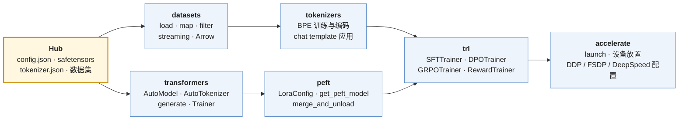

> 本文是[《AI 算法工程师学习地图》](/ai-algorithm-engineer-learning-roadmap.html)第 L1 层（编程与工具）的导读。上一篇导读是 [L0 数学](/math-for-ai-algorithm-engineers.html)。它回答的是"每个工具用到什么程度"，不是任何一个工具的教程。

算法工程师的日常是把一个想法变成一次实验：读到一篇论文说"把 DPO 的 sigmoid 换成 hinge 会更稳"，当天下午就要在一个 1B 模型、一万条偏好对上跑出对比曲线。这条路上要经过的东西很固定——Python 写胶水、NumPy / Pandas 处理数据、PyTorch 定义与训练模型、Hugging Face 提供模型与训练器、GPU 决定跑得动跑不动、实验跟踪工具记录发生了什么。每一样都能学成一门专业，但算法工程师对每一样的需求只到某个深度为止，越过那条线就进入了 Infra 地图的范围。

本文逐个工具说明那条线在哪里：会到什么程度就够、哪些内部不需要懂、以及为什么。和 L0 导读一样，每一节尽量给出一个能算出来的数字——因为"跑得动跑不动"最终是显存与算力的算术，而不是对工具的熟悉程度。

全篇的核心问题是：

> **能不能在一天之内，把一篇论文里的方法变成一次能跑、能复现、能与 baseline 对比的实验？**


## 一、总览：工具的分层与"用"与"改"的边界

### 1. 一次实验经过的六层工具

| 层 | 工具 | 在实验里做什么 | 学到什么程度 |
|---|---|---|---|
| 语言 | Python | 写训练脚本、数据处理、配置；读别人的代码 | 会读会写训练代码；语言机制与运行时不必深究 |
| 数值与数据 | NumPy、Pandas / Polars、Matplotlib | 形状直觉、数据清洗与聚合、看曲线 | 形状与广播规则要熟；其余按需查 |
| 深度学习框架 | PyTorch（使用层） | 定义模型、自动求导、训练循环、混合精度、多卡 | 五个核心对象会用、知道每个 API 在做什么；内部实现不必 |
| 模型生态 | Hugging Face：`transformers`、`datasets`、`tokenizers`、`peft`、`trl`、`accelerate` | 加载模型与数据、微调、对齐训练 | 熟练使用；**读源码**是学后训练最快的路 |
| 硬件 | GPU | 决定 batch 多大、模型放不放得下、一步多少秒 | 两个上限、四块显存、能读 profiler、能解释 OOM |
| 实验管理 | W&B / MLflow / TensorBoard、Hydra、git | 记录每次实验、管理配置、保证可复现 | 每次实验的代码 / 配置 / 数据 / 环境可追溯 |

### 2. 与 Infra 地图的分界

同一个名词——Python、PyTorch、CUDA——在两张地图上都出现，分工用一句话说清：**算法地图"用"它们，Infra 地图"改"它们**。具体到本文的每一节：

| 工具 | 算法工程师（本文） | Infra 工程师（Infra 地图） |
|---|---|---|
| Python | 语法、面向对象、类型标注、装饰器、生成器、多进程的用法 | GIL、内存模型、C 扩展、打包交付 → [01 系列](/python-for-ai-infra.html) |
| PyTorch | Tensor / Autograd / Module / DataLoader / Optimizer / AMP / DDP-FSDP 的**用法** | Dispatcher、Autograd 引擎、编译、分布式通信栈的**实现** → [03 系列](/deep-dive-into-pytorch.html) |
| GPU | 算力与带宽两个上限、显存去向、为什么 batch 大才快 | CUDA 编程模型、访存、Tensor Core、写 kernel → [05 系列](/gpu-kernel-engineering.html) |
| 分布式训练 | DDP / FSDP 启用、并行度对配方的影响 | 并行策略、checkpoint、容错、MFU → [07 系列](/large-scale-training-from-parallelism-to-fault-tolerance.html) |

需要越界的时候是知道的：当你发现"用"解决不了问题——一个算子太慢、一个并行策略框架不支持、一个 OOM 靠调参绕不过去——就是该翻 Infra 地图的时候。

### 3. 本文的章节安排

| 章 | 主题 | 内容 |
|---|---|---|
| 二 | Python | 会读会写训练代码需要的语言特性；不需要的部分 |
| 三 | 科学计算栈 | NumPy 的形状与广播、einsum 作为读公式的工具、Pandas 做错误分析、Matplotlib 看曲线 |
| 四 | PyTorch 使用层 | 五个核心对象与一个最小训练循环；混合精度；显存的账：全量微调 vs LoRA vs QLoRA；多卡启用 |
| 五 | Hugging Face 生态 | 六个库各管什么；一次微调的组装；为什么读源码是最快的路 |
| 六 | GPU 直觉 | 两个上限与 roofline 直觉、显存四块、OOM 归因、读 profiler |
| 七 | 实验工具 | 跟踪、配置、随机性、可复现的最小记录 |
| 八 | 自测清单 | 五件做出来的事 |
| 九 | 怎么学 | 材料与顺序 |
| 十 | 本文小结 |  |


## 二、Python：会读会写训练代码

> **打开一个开源训练仓库的主脚本，能不能读懂它在做什么？**

### 1. 训练代码里实际出现的语言特性

算法工作里的 Python 有一个很窄的子集，读几个主流仓库（`transformers` 的 `Trainer`、`trl` 的各个 Trainer、nanoGPT、OpenRLHF）就能看到全部：

| 特性 | 在训练代码里的样子 | 要到什么程度 |
|---|---|---|
| 面向对象与继承 | `class MyModel(nn.Module)`、`class MyTrainer(Trainer)` 重写 `compute_loss` | 会继承、会重写方法、知道 `super().__init__()` 为什么必须调 |
| `dataclass` 与类型标注 | `@dataclass class TrainConfig: lr: float = 1e-5` | 配置全用它；类型标注让 IDE 与 reviewer 都少猜 |
| 装饰器 | `@torch.no_grad()`、`@torch.compile`、`@dataclass`、`@property` | 会用、知道装饰器就是"函数包函数"；不必会写复杂的 |
| 上下文管理器 | `with torch.autocast(...)`、`with torch.no_grad()`、`with open(...)` | 会用；`contextlib.contextmanager` 会写一个 |
| 生成器与迭代器 | 流式数据集 `yield` 一条条样本、`for batch in dataloader` | 理解惰性求值：数据不必全进内存 |
| 异常处理 | 捕获 OOM 后减 batch 重试、checkpoint 保存失败的兜底 | 基本 `try / except / finally` |
| 多进程 | `DataLoader(num_workers=8)`、`torchrun --nproc_per_node=8` | 知道每个 rank 是一个进程、进程间不共享内存 |
| `asyncio` | RL 训练里 rollout 与训练的并发、调用外部 API 做评测 | 基本用法：`async def`、`await`、`gather` |
| 包与环境 | `pip` / `uv` / `conda`、`requirements.txt`、虚拟环境 | 能建一个干净可复现的环境 |

### 2. 不需要的部分

GIL 与真正的并行、引用计数与垃圾回收、`__slots__` 与内存布局、C 扩展与 pybind11、打包成 wheel 与交付——这些在算法工作里几乎不出现，出现时（比如数据处理慢到要写 C 扩展）就是越界的信号。Infra 地图 01 系列七篇讲的全是这些。

一个现实的标准：**能读懂 nanoGPT 的 `train.py`（约 300 行）与 `trl` 里 `DPOTrainer` 的 loss 函数，能照着 `transformers` 的 `Trainer` 写一个自己的训练循环**，Python 就够了。


## 三、科学计算栈：形状、表格与曲线

> **看到一个 attention 的公式，能不能写出对应的 `einsum`？拿到评测结果，能不能按类别算出错误率？**

### 1. NumPy：形状直觉与广播

PyTorch 的 Tensor 语义与 NumPy 的 ndarray 一致，所以形状直觉先在 NumPy 上建立。要熟到不用查的只有三样：

**轴（axis）。** `x.shape == (batch, seq, d)`，`x.sum(axis=-1)` 沿最后一维求和得到 `(batch, seq)`，`x.mean(axis=0)` 沿 batch 平均。所有"沿哪个维度"的操作都是这一个概念——softmax 沿词表维、LayerNorm 沿 hidden 维、loss 沿 token 维平均。

**广播（broadcasting）。** 形状不同的数组做逐元素运算时的对齐规则，只有三条：从最后一维往前对齐；每一维要么相等，要么其中一个是 1（或缺失）；是 1 的那一维被复制。`(batch, seq, d) + (d,)` 合法（bias 加到每个 token），`(batch, seq, d) + (seq,)` 不合法。attention 的 causal mask `(1, 1, seq, seq)` 加到 score `(batch, heads, seq, seq)` 上就是广播。写错形状是新手最常见的 bug，而且常常**不报错**——两个 `(n,)` 与 `(n, 1)` 的数组相加会广播成 `(n, n)`，结果是错的但代码能跑。

**reshape / transpose / view。** `(batch, seq, heads × head_dim)` → `(batch, seq, heads, head_dim)` → `(batch, heads, seq, head_dim)`，这是 multi-head attention 每一步都在做的形状变换。理解 `reshape` 不移动数据（只改解释方式）、`transpose` 之后内存不连续（PyTorch 里需要 `.contiguous()`）到这个程度即可；stride 与内存布局的细节属于 Infra 地图 03 系列第二篇。

**`einsum`** 是把公式翻译成代码的最短路径。attention score $$S = QK^T$$ 带 batch 与 head：

```python
S = np.einsum("bhqd,bhkd->bhqk", Q, K)   # (batch, heads, q_len, k_len)
```

下标字符串就是形状说明书：相同字母的维度被缩并（这里是 `d`），只出现在左边的字母被求和，右边的顺序就是输出形状。读论文里的张量公式时，先在脑子里写出 `einsum`，是检验自己是否真的看懂形状的办法。

### 2. Pandas / Polars：评测结果的错误分析

数据工程与评测分析是表格操作：按类别聚合正确率、找 baseline 对而新模型错的题、按长度分桶看 loss。这些是 `groupby`、`merge`、`pivot`、`query`：

```python
df = pd.read_json("eval_results.jsonl", lines=True)
df["correct"] = df["pred"] == df["gold"]
df.groupby("category")["correct"].agg(["mean", "count"])          # 各类别正确率与题数
regress = df.merge(base, on="id", suffixes=("", "_base")) \
            .query("not correct and correct_base")                # 新模型退化的题
```

第二行就是 L5 评测里"能力分解与错误分析"的全部工具。Polars 在数据量到千万行以上时换用，API 风格接近但更快；两者选一个熟练即可。

### 3. Matplotlib：看曲线是第一诊断手段

训练是否正常，第一眼看的是曲线：loss、梯度范数、学习率随步数的变化。需要的绘图能力很少——折线、多条曲线对比、对数坐标、子图。两个习惯值得早建立：**loss 曲线用对数 x 轴看早期**（前 1% 的步数决定了初始化与 warmup 是否对），**多个 seed 画均值与阴影带**而不是单条线（横切"实验方法论"）。scaling law 的图是双对数坐标，因为幂律在双对数下是直线。


## 四、PyTorch 使用层：五个对象与一张显存账

> **能不能从零写一个训练循环？能不能算出一个 8B 模型全量微调要多少显存、为什么 LoRA 能放进一张卡？**

### 1. 五个核心对象与最小训练循环

PyTorch 的使用层只有五个对象：`Tensor`（数据与形状）、Autograd（`requires_grad`、`backward()`、`.grad`）、`nn.Module`（参数的容器与前向逻辑）、`Dataset` / `DataLoader`（取数与组 batch）、`Optimizer`（用梯度更新参数）。一个完整的训练循环二十行：

```python
model = MyModel(cfg).to("cuda")
opt = torch.optim.AdamW(model.parameters(), lr=cfg.lr, weight_decay=0.1)
sched = get_cosine_schedule_with_warmup(opt, cfg.warmup, cfg.total_steps)
loader = DataLoader(ds, batch_size=cfg.bs, shuffle=True, num_workers=4, collate_fn=collate)

for step, batch in enumerate(loader):
    batch = {k: v.to("cuda", non_blocking=True) for k, v in batch.items()}
    with torch.autocast("cuda", dtype=torch.bfloat16):
        logits = model(batch["input_ids"])
        loss = F.cross_entropy(logits.view(-1, V).float(), batch["labels"].view(-1), ignore_index=-100)
    loss.backward()
    torch.nn.utils.clip_grad_norm_(model.parameters(), 1.0)
    opt.step(); sched.step(); opt.zero_grad(set_to_none=True)
    if step % 10 == 0: log({"loss": loss.item(), "lr": sched.get_last_lr()[0]})
```

每一行都对应 L3 的一个概念：`autocast` 是混合精度，`cross_entropy(... .float())` 里的 `.float()` 是在 fp32 上算 softmax 以免溢出，`ignore_index=-100` 是 SFT 的 loss mask，`clip_grad_norm_` 是梯度裁剪，`set_to_none=True` 是省一次显存写。能写出这二十行、并解释每一行为什么在那里，PyTorch 的使用层就过关了。`Trainer` 一类高层封装做的是同一件事加上日志、checkpoint、分布式——遇到它们的行为不符合预期时，回到这二十行想。

Autograd 只需要知道三件事：前向时记录计算图，`backward()` 从 loss 反向走一遍图算出每个 `requires_grad=True` 的叶子的梯度累加到 `.grad`；梯度**累加**而不是覆盖，所以每步要 `zero_grad`（也因此梯度累积不需要额外代码，少调几次 `zero_grad` 即可）；`torch.no_grad()` 下不建图，推理与评测必须加。Autograd 引擎怎么实现、动态图怎么记录，属于 Infra 地图 03 系列第三篇。

### 2. 混合精度

`torch.autocast(dtype=torch.bfloat16)` 让矩阵乘法在 bf16 上跑（快、省显存），reduction 类操作（softmax、norm、loss）自动留在 fp32。bf16 与 fp32 指数位相同，不需要 loss scaling；fp16 指数位少，需要 `GradScaler`——当前 LLM 训练基本用 bf16，`GradScaler` 只在老硬件上遇到。权重的主副本、优化器状态保持 fp32，这是下一节显存账的来源。数值格式本身（谁有几位、哪里会丢精度）在[《Transformer 与 LLM》第六篇](/floating-point-formats-and-mixed-precision.html)。

### 3. 显存的账：为什么 8B 全量微调放不进一张卡

训练时每个参数在显存里有五份东西：bf16 权重（2 字节）、bf16 梯度（2 字节）、fp32 主权重（4 字节）、AdamW 的一阶矩与二阶矩（各 4 字节），**共 16 字节 / 参数**。这就是 L1 表里"AdamW 的两个矩是每参数 8 字节状态的来源"那一句的展开。

代入 Llama-3-8B（8.03B 参数）：

| 方案 | 参数与状态 | 算法 | 显存 |
|---|---|---|---|
| 全量微调，混合精度 + AdamW | 全部 8.03B 参数 × 16 字节 | $$8.03 \times 10^9 \times 16$$ | **128.5 GB**，还没算激活 |
| LoRA（$$r = 16$$，七个线性层） | 冻结权重 bf16 8.03B × 2 字节；可训练 41.9M × 16 字节 | $$16.06 + 0.67$$ | **16.7 GB** + 激活 |
| QLoRA（4-bit 基座 + LoRA） | 冻结权重 ≈ 0.5 字节 / 参数（加量化常数略多）；LoRA 同上 | $$4.0 + 0.67$$ | **≈ 5 GB** + 激活 |

结论一眼可见：全量微调一个 8B 模型至少要两张 80 GB 的卡加 FSDP 把状态切开，LoRA 一张卡绰绰有余，QLoRA 能在消费级显卡上跑。这是 L5 里"全量还是 LoRA"这个决策的第一道约束，先于任何效果上的考虑。

激活是第五块，与参数量无关、与 batch × 序列长度成正比。一个粗略的锚点：Llama-3-8B 在序列长度 4096 上，仅残差流一份就是 $$4096 \times 4096 \times 2$$ 字节 $$= 32$$ MiB / 层，32 层共 1 GiB / 序列；反向传播要保存的中间量是它的很多倍（attention 输入、FFN 的 14336 维中间激活、norm 的输入……）。**gradient checkpointing** 只保存每层的输入、反向时重算中间量，用约 30% 的额外计算换掉大部分激活显存；`model.gradient_checkpointing_enable()` 一行开启。精确的激活公式与每一项的来源在 Infra 地图 07 系列第一篇。

### 4. 多卡：启用即可

- **DDP**：每张卡一份完整模型，各算自己 batch 的梯度后 all-reduce 平均。`torchrun --nproc_per_node=8 train.py`，模型包一层 `DistributedDataParallel`，数据用 `DistributedSampler`。前提是模型加状态能放进一张卡——按上一节的账，8B 全量微调不行。
- **FSDP**：把参数、梯度、优化器状态切到各卡，前向 / 反向时按层临时聚合。`FullyShardedDataParallel(model, ...)` 或 `accelerate` 的配置文件；8 张 80 GB 卡上 128.5 GB 的状态被切成每卡 16 GB，全量微调 8B 就放得下了。
- **张量并行、流水并行、专家并行**：预训练规模才需要，由 Megatron / DeepSpeed / torchtitan 一类框架提供。算法工程师知道它们各切什么、对 batch 与学习率有什么影响即可。

DDP 与 FSDP 的通信内部（bucket、overlap、`ProcessGroupNCCL`）在 Infra 地图 03 系列第九篇与 06 系列；并行策略的选择在 07 系列第二篇。


## 五、Hugging Face 生态：六个库与一次微调的组装

> **能不能用 `peft` + `trl` 在一小时内跑起一个 LoRA SFT？卡住的时候能不能直接读源码找到原因？**

### 1. 六个库各管什么



| 库 | 负责 | 要会的 |
|---|---|---|
| `transformers` | 模型定义与加载（`modeling_llama.py` 一类）、tokenizer 封装、`generate`、`Trainer` | `AutoModelForCausalLM.from_pretrained(..., torch_dtype=torch.bfloat16)`；`tokenizer.apply_chat_template`；`generate` 的采样参数；读 `modeling_*.py` |
| `datasets` | 数据加载与处理，底层 Apache Arrow（内存映射、零拷贝） | `load_dataset`、`map(batched=True, num_proc=...)`、`filter`、`streaming=True` 处理放不进内存的语料 |
| `tokenizers` | 分词器的训练与快速编码（Rust 实现） | 训练一个 BPE 词表；理解 `tokenizer.json` 里的 normalizer / pre-tokenizer / model / post-processor 四段 |
| `peft` | 参数高效微调 | `LoraConfig(r, lora_alpha, target_modules, dropout)`、`get_peft_model`、训练后 `merge_and_unload` 合回基座 |
| `trl` | 后训练的各个 Trainer | `SFTTrainer`（自动处理 chat template、packing、loss mask）、`DPOTrainer`、`GRPOTrainer`、`RewardTrainer` |
| `accelerate` | 把单卡脚本变多卡，统一 DDP / FSDP / DeepSpeed 的启动 | `accelerate config` 生成配置；`accelerate launch train.py` |

### 2. 一次 LoRA SFT 的组装

```python
model = AutoModelForCausalLM.from_pretrained("meta-llama/Llama-3.1-8B", torch_dtype=torch.bfloat16)
tok = AutoTokenizer.from_pretrained("meta-llama/Llama-3.1-8B")
model = get_peft_model(model, LoraConfig(r=16, lora_alpha=32, target_modules="all-linear", lora_dropout=0.05))
ds = load_dataset("HuggingFaceH4/ultrachat_200k", split="train_sft")
trainer = SFTTrainer(model=model, train_dataset=ds, processing_class=tok, args=SFTConfig(...))
trainer.train()
```

六行。它背后发生的事——数据被套上 chat template、回复之外的 token 被 mask 成 −100、多条短样本被 pack 进一个序列、LoRA 的 $$A$$ 与 $$B$$ 被挂到每个线性层旁边、AdamW 只更新它们——每一件都在第四章的二十行训练循环里有对应位置。

### 3. 为什么读源码是最快的路

Hugging Face 的库是当前算法工作的事实标准，也是**最好的教材**——比论文更准确（论文写的是想法，代码写的是实际做法），比教程更完整。几个值得直接读的入口：

| 想学 | 读 | 大约多长 |
|---|---|---|
| Llama 的结构 | `transformers/models/llama/modeling_llama.py`：`LlamaAttention`、`LlamaMLP`、`LlamaDecoderLayer`、`apply_rotary_pos_emb` | 核心几百行 |
| DPO 的 loss 到底怎么算 | `trl/trainer/dpo_trainer.py` 里 `dpo_loss`：把 L0 导读推出的公式变成十几行代码，还能看到 IPO、hinge 等变体各改了哪一行 | 几十行 |
| GRPO 的优势怎么算、KL 怎么加 | `trl/trainer/grpo_trainer.py` | 几百行 |
| LoRA 怎么挂上去 | `peft/tuners/lora/layer.py`：`Linear.forward` 里 `result += lora_B(lora_A(dropout(x))) * scaling` | 一行核心 |
| SFT 的 loss mask 与 packing | `trl/trainer/sft_trainer.py` 与它的 data collator | 几百行 |
| `generate` 的采样 | `transformers/generation/utils.py` 与 `logits_process.py`：temperature、top-k、top-p 各是一个 `LogitsProcessor` | 每个 processor 十几行 |

方法很简单：遇到一个后训练概念，先读它在 `trl` 里的实现，再读论文。库的版本变化快，函数名会变，但找到入口的方法不变——从 Trainer 的 `compute_loss` 往下追。

### 4. Hub 上的三个文件

拿到一个模型，先看三个文件：`config.json`（结构超参数——[《Transformer 与 LLM》第一篇](/transformer-anatomy-and-parameter-count.html)教的是从它算出参数量）、`tokenizer.json` 与 `tokenizer_config.json`（词表、特殊 token、chat template）、`*.safetensors`（权重，按名字分片，`safetensors` 格式支持不加载全部就读某一层）。模型卡（README）里的评测数字读的时候带着 L0 导读第三章的置信区间。


## 六、GPU 直觉：两个上限与四块显存

> **不写 kernel，能不能解释一次训练为什么慢、一次推理为什么快不起来、一个 OOM 从哪里来？**

### 1. 两个上限

GPU 有两个硬指标：**算力**（每秒能做多少 FLOPs）与**显存带宽**（每秒能从 HBM 搬多少字节）。任何一段计算要么受前者限制（compute-bound），要么受后者限制（memory-bound），取决于它**每搬一个字节做多少 FLOPs**——算术强度。以 H100 SXM 为例：bf16 稠密算力约 989 TFLOPS，HBM3 带宽 3.35 TB/s，两者之比约 **295 FLOP / 字节**。算术强度高于它的操作受算力限制，低于它的受带宽限制。

两个立刻能算的推论：

**decode 是 memory-bound。** 生成一个 token 要把全部权重读一遍（8B 模型 bf16 是 16 GB），每个权重只做 2 次 FLOPs（乘、加），算术强度约为 1，远低于 295。所以 batch = 1 时一个 token 的时间下限是 $$16.06 \text{ GB} / 3.35 \text{ TB/s} \approx 4.8$$ ms，约 208 token / s——再快就要换更高带宽的卡或量化权重，模型多聪明都没用。batch 加到几百，权重读一次被几百个 token 共享，才逼近算力上限。这就是"为什么 batch 大才快"。

**prefill 是 compute-bound。** 4096 个 token 一起过模型，$$2 \times 8.03 \times 10^9 \times 4096 \approx 66$$ TFLOPs，在 989 TFLOPS 上约 67 ms；权重只读一次，算术强度是 decode 的 4096 倍。训练与 prefill 同理，所以训练的效率指标是 MFU（实际 FLOPs / 峰值 FLOPs），好的训练能到 40–50%。

这两条是 roofline 模型的全部内容。[《Transformer 与 LLM》第二篇](/transformer-flops-bytes-and-roofline.html)把整个模型逐层算了一遍；[GPU Kernel 系列第一篇](/gpu-architecture-and-roofline.html)从硬件侧讲同一件事。算法工程师需要的是用它判断：我改的这个结构（更大的 FFN、更多的专家、更长的上下文）把瓶颈往哪边推了。

### 2. 显存的四块

| 块 | 大小由什么决定 | 训练 | 推理 |
|---|---|---|---|
| 权重 | 参数量 × 字节 / 参数 | bf16 2 字节 | bf16 2 字节；量化后 1 或 0.5 |
| 梯度与优化器状态 | 可训练参数量 × 14 字节（第四章） | 全量微调时的大头 | 无 |
| 激活 | batch × 序列长度 × 层数 × hidden；反向要保存 | 长序列大 batch 时的大头；checkpointing 可换 | 只有当前层，很小 |
| KV cache | batch × 序列长度 × 层数 × $$2 \times n_{kv} \times d_{head}$$ × 字节 | 无 | 长上下文、高并发时的大头；GQA / MLA 就是为了压它 |

一个 OOM 报错，先问它落在哪一块：参数量没变、batch 没变、序列变长了 → 激活或 KV cache；换了优化器 → 状态；加了 LoRA 还是 OOM → 不是参数的问题，看激活。这张表加上第四章的账，能解释绝大多数 OOM。KV cache 的精确公式在[《Transformer 与 LLM》第三篇](/attention-variants-and-kv-cache.html)。

### 3. kernel、stream 与 profiler

只需要三个概念：**kernel** 是 GPU 上执行的一个函数（一次矩阵乘、一次 softmax），PyTorch 的每个算子对应一个或几个 kernel；**kernel launch 有固定开销**（几微秒），所以小算子多了会让 GPU 空转——这是 `torch.compile` 与 CUDA Graph 做算子融合的动机，也是小模型 batch 小时 GPU 利用率低的原因；**stream** 是 kernel 的执行队列，CPU 把 kernel 扔进队列就继续往下走，所以 `time.time()` 测出来的不是 GPU 时间，要 `torch.cuda.synchronize()` 或用 profiler。

`torch.profiler` 输出一张表：每个算子的 GPU 时间、调用次数、显存变化。会读它意味着能回答"这一步 300 ms 花在哪"——是 attention、是 FFN 的 GEMM、是数据加载等 GPU 空转、还是几千个小算子的 launch 开销。到这里为止；怎么让那个算子快起来，是 Infra 地图 05 系列的事。


## 七、实验工具：让三个月前的结果能复现

> **三个月后能不能复现今天这次实验？能不能说清两次实验之间到底改了什么？**

这一章是横切"实验方法论"的物质基础，方法论本身在那里展开，这里只列工具与最小要求。

| 需求 | 工具 | 最小做法 |
|---|---|---|
| 记录指标与曲线 | W&B、MLflow、TensorBoard | 每次实验一个 run；记 loss、学习率、梯度范数、评测指标、吞吐；同一张图上叠多个 run 对比 |
| 管理配置 | Hydra / OmegaConf，或 `dataclass` + YAML | 所有超参数进配置文件，命令行只覆盖个别项；配置随 run 一起记录 |
| 代码版本 | git | 每次实验记录 commit hash；有未提交改动时记录 diff 或拒绝启动 |
| 数据版本 | 数据文件的 hash 或 `datasets` 的版本 / revision | 数据变了就是另一个实验 |
| 环境 | `pip freeze` / 锁文件、CUDA 与驱动版本、容器镜像 | 随 run 记录 |
| 随机性 | `seed` 参数 + `torch.manual_seed` 等；必要时 `torch.use_deterministic_algorithms(True)` | 多 seed 报均值与方差；知道有些 kernel 本身不确定 |
| 产物 | checkpoint、评测输出、生成样本 | 命名含 run id；评测输出保存到能做第三章那种错误分析的粒度 |

一次实验的最小记录是一行：`run id · commit · 配置文件 · 数据版本 · seed · 环境 · 指标`。这一行齐了，"复现三个月前的结果"就是重跑一条命令。少了任何一项，那次实验的结论都只是"当时好像是这样"。


## 八、自测清单：五件做出来的事

工具的检验是做，不是读。五件事做完，L1 就够了：

| # | 做什么 | 检验的是 |
|---|---|---|
| 1 | 用 NumPy 手写一个单头 causal self-attention 的前向（含 mask 与 softmax），与 PyTorch 的 `F.scaled_dot_product_attention` 对数值 | 形状、广播、`einsum` |
| 2 | 不用 `Trainer`，写一个二十行训练循环在小数据集上训一个小 Transformer（nanoGPT 规模），loss 曲线正常下降 | PyTorch 五个对象、AMP、看曲线 |
| 3 | 用 `peft` + `trl` 对一个 1B 级模型做 LoRA SFT，跑通、记进 W&B、事后能从 run 页面复现配置 | HF 生态、实验记录 |
| 4 | 在跑之前算出第 3 件事的显存（权重 + LoRA 状态 + 激活估计），与 `torch.cuda.max_memory_allocated()` 对比，误差在 30% 以内 | 显存的账 |
| 5 | 用 `torch.profiler` 看第 2 件事的一步，说出前三个最耗时的算子与 GPU 空转比例 | GPU 直觉、读 profiler |

第 4 件事最值得做：它把"跑得动跑不动"从试出来变成算出来。


## 九、怎么学

### 1. 材料

| 工具 | 材料 | 说明 |
|---|---|---|
| Python | 官方教程；《Fluent Python》选读第一部分与"函数即对象"部分 | 有编程基础的人一周够；不要通读《Fluent Python》 |
| NumPy | 官方 "NumPy fundamentals"（特别是 Broadcasting 与 Indexing 两节）；Nicolas Rougier《From Python to NumPy》 | 后者的练习建立形状直觉最快 |
| PyTorch | 官方 "Learn the Basics" 与 "Deep Learning with PyTorch: A 60 Minute Blitz"；Karpathy 的 nanoGPT 与 "Let's build GPT" 视频 | 官方教程建立五个对象；nanoGPT 是"从零写训练循环"的范本，读完能改 |
| Hugging Face | 官方 LLM Course（hf.co/learn）；`trl` 与 `peft` 文档里的示例脚本；`transformers` 源码 | 课程过一遍即可，源码是主教材 |
| GPU 直觉 | [《Transformer 与 LLM》第二篇](/transformer-flops-bytes-and-roofline.html)；"Making Deep Learning Go Brrrr From First Principles"（Horace He） | 后者一篇博客讲透三种瓶颈；不需要 CUDA 教材 |
| 实验管理 | W&B 或 MLflow 的快速入门；Hydra 文档 | 半天 |

### 2. 顺序

从第八章的五件事倒推：先做第 2 件（训练循环），它会逼你学会 PyTorch 的五个对象与看曲线；然后第 1 件补形状；再第 3、4 件进 HF 生态与显存账；最后第 5 件看 profiler。全部做完大约两到三周。不要按库逐个学完——工具在被用来做一件事时才记得住，这与 L0 导读对数学的建议是同一条。

L1 与 L0 可以交错：写训练循环时遇到 `cross_entropy` 为什么要 `.float()`、`clip_grad_norm_` 在防什么，回 L0 与 L3 找答案。


## 十、本文小结

- 算法工程师的工具是六层：Python、科学计算栈、PyTorch 使用层、Hugging Face 生态、GPU 直觉、实验管理。每一层"用"到能做实验为止，"改"属于 Infra 地图。
- **Python** 只需要训练代码里出现的那个子集：类与继承、`dataclass`、装饰器、上下文管理器、生成器、多进程的用法；GIL、内存、C 扩展不需要。
- **NumPy** 要熟的是轴、广播三条规则、reshape / transpose、`einsum`；形状错误常常不报错。Pandas 做评测的错误分析；Matplotlib 看曲线是第一诊断手段。
- **PyTorch** 使用层是五个对象与二十行训练循环；混合精度用 bf16 不需要 loss scaling；**显存账：训练每参数 16 字节**——Llama-3-8B 全量微调 128.5 GB、LoRA 16.7 GB、QLoRA 约 5 GB，这是"全量还是 LoRA"的第一道约束；激活用 gradient checkpointing 换；多卡 DDP / FSDP 启用即可。
- **Hugging Face** 六个库各管一段，六行组装一次 LoRA SFT；读 `trl` / `peft` / `modeling_llama.py` 的源码是学后训练最快的路。
- **GPU 直觉**是两个上限（H100：989 TFLOPS、3.35 TB/s、ridge 约 295 FLOP / 字节）与四块显存：decode 是 memory-bound（8B 模型 batch 1 下限 4.8 ms / token），prefill 与训练是 compute-bound；OOM 先问落在哪一块。
- **实验管理**的最小记录是一行：run id、commit、配置、数据版本、seed、环境、指标；齐了才谈复现。
- 用第八章的五件事检验；从"写训练循环"开始倒推着学。
