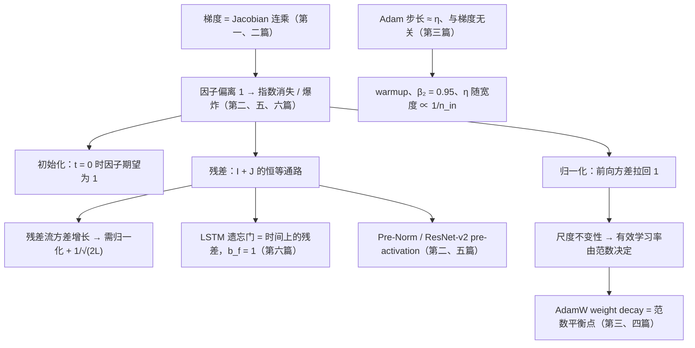

六篇正文回答了一个问题：**一个几十层甚至上百层的网络，为什么能训、什么时候不能训、训不动的时候该看哪个数字**。前四篇是训练动力学——第一篇建立梯度，第二篇讲梯度为什么会坏、怎么修，第三篇讲怎么用梯度更新参数，第四篇讲什么时候该停；后两篇是结构史——卷积这条线留下了残差、归一化与"堆同样的块"，循环这条线留下了 attention。六篇合起来，是 Transformer 每一个部件的来历，也是读任何一份预训练技术报告时"初始化、归一化、优化器、稳定性"那几段的公式出处。

本文不讲新内容，做三件事：把六篇压成一张表与六段回顾，把贯穿六篇的几条线拎出来，然后给一套三段式的通关自测——判断与计算、跨篇综合、面试题。各篇末尾的自测检验的是"这一篇读懂了没有"，这里检验的是"六篇能不能连起来用"。

> **读完这六篇，你应该能回答哪些问题？[^q0] 哪些数字与结论必须能脱口而出？[^q1] 怎么判断自己是"读过"还是"掌握"了？[^q2]**

## 一、总览：系列回答的问题与主线

系列的一句话主张是：**深网络训练里的每个现象都能推到公式、代到数字、用几十行代码复现，然后在 LLM 里认出它的形态**。主线是一条连乘链：前向的方差每层乘一个因子、反向的梯度是一串 Jacobian 的乘积，因子偏离 1 就指数放大或消失——第一篇写出这串乘积，第二篇讲它怎么坏、初始化 / 归一化 / 残差各修哪一环，第三篇讲拿到稳定的梯度后步长怎么定，第四篇讲优化器挑出的解为什么泛化、什么时候不再泛化，第五、六篇在卷积与循环两条线上再看一遍同一条链——ResNet 的退化问题与 RNN 的 BPTT 衰减是它的两个历史形态，残差与 LSTM 的遗忘门是同一个修法。六篇用同一份几百行的 NumPy 小框架，全部实验在笔记本 CPU 上几分钟跑完。

| 篇 | 回答的问题 | 一句话结论 | 必记的数字 / 公式 |
|---|---|---|---|
| [第一篇：反向传播](/backpropagation-by-hand.html) | 不用框架能不能手推并手写两层网络的反向传播？为什么训练 FLOPs 是 $$6ND$$、激活为什么要存？ | 反向传播 = 沿计算图反向拓扑序对每个算子算一次 VJP，从不构造 Jacobian；梯度与被求导的量同形；每个 Linear 反向做两个 GEMM，所以反向 = 2 × 前向；$$\partial L / \partial W = X^T G$$ 需要本层输入，所以激活要存 | $$\partial L/\partial W = X^T G$$、$$\partial L/\partial X = G W^T$$、$$(P - Y)/m$$；$$6ND$$，激活重算 $$8ND$$；实测比值 2.00；激活 552 KiB 对权重 795 KiB，batch × 32 → 17.3 MiB；梯度检查 float64、相对误差 $$< 10^{-6}$$ |
| [第二篇：初始化、归一化与残差](/initialization-normalization-and-residual.html) | 64 层 MLP 不加技巧为什么训不动？三样东西各修哪一段？ | 深网络的稳定性是连乘问题；初始化只管 $$t = 0$$，归一化切断前向的连乘但修不了反向，残差把 Jacobian 变成 $$I + J$$ 给梯度一条恒等通路；三样必须同用，Pre-Norm 是当前摆法 | $$\text{Var}(y) = n_{in}\sigma_w^2 \text{Var}(x)$$，Kaiming $$2/n_{in}$$；$$2^{-32}$$、$$0.9^{128} \approx 1.4 \times 10^{-6}$$；残差流无归一化每层翻倍（$$2^{64}$$）、Pre-Norm 线性；GPT-2 缩放 $$1/\sqrt{2L}$$；Pre-Norm 梯度 0.12–0.15 对 Post-Norm 0.51–1.96；0.02 |
| [第三篇：优化器](/optimizers-from-sgd-to-adamw.html) | Adam 的两个矩各做什么？AdamW 与 $$L_2$$ 为什么不一样？warmup 为什么不能省？batch 变大学习率怎么变？ | Adam 让每个参数步长 $$\approx \eta$$、与梯度大小无关，因此第一步是满步长 $$\eta \cdot \text{sign}(g)$$、必须 warmup；$$L_2$$ 被 $$1/\sqrt{v}$$ 缩放而 AdamW 不被；线性 scaling 在临界 batch 内成立；裁剪限制步长上界 | Momentum 有效学习率 $$\times 1/(1-\beta)$$；$$\beta_2 = 0.95$$ 记 20 步；8 字节 / 参数，Llama-3-8B 64 GB，16 字节里的 12；$$\lVert W_1 \rVert$$ 22.6 → 2.3、95.6% → 86.2%；warmup：4.59 对 1.26；scaling 到 512 成立、2048 发散；裁剪 1.0 |
| [第四篇：正则化与泛化](/regularization-and-generalization.html) | 参数是样本几百倍的网络为什么不过拟合？什么数据规模、多少 epoch 后会？怎么提前看到？ | 先算参数 / 数据比定体制；过参数化时优化器挑最小范数、平坦、先学简单的解——隐式正则化；double descent 越过插值阈值再变好；预训练在数据体制里不用 dropout、一个 epoch；SFT 与奖励模型把模型放回过参数化体制 | $$N/D$$：预训练 0.0005、SFT 1600、RM 160、实验 407；宽度 8 测试 loss 5.48、2048 最好 14.5%；wd 把 0.55 压到 0.42，dropout 0.62；重复 4 epoch 以内几乎无损；2 万字符第 16 epoch 拐点、记忆率 10%，20 万第 8 epoch，200 万未到 |
| [第五篇：CNN](/cnn-from-lenet-to-resnet-and-vit.html) | 3×3 卷积核相当于多大的全连接矩阵？ResNet 的残差与 Transformer 的残差是一回事吗？ViT 为什么可以不用卷积？ | 卷积 = 全连接 + 局部性 + 参数共享两条约束；深度是为了感受野，深了就训不动，BN 修前向、残差修反向；数据够多时约束成负担，ViT 把图切成 token，只留下 patch embedding 这一个 stride 卷积 | $$16 \times 36$$ 矩阵、144 非零、9 自由参数；等价矩阵 $$4 \times 10^{10}$$ 元素；RF $$= 1 + 2L$$；ResNet-50 25.6M、8.2 GFLOPs、每参数用 320 次；bottleneck 69K 对 1.18M；plain 56 层 loss 0.72、梯度比 2849；196 / 576 / 5476 token；590,592 |
| [第六篇：RNN](/rnn-lstm-and-the-birth-of-attention.html) | RNN 为什么记不住 20 步外的东西？遗忘门与残差什么关系？attention 为解决什么被发明、为什么取代了 RNN？ | BPTT 是同一个 $$W$$ 的连乘，训练信号传不到远处；LSTM 的 $$c_t = f_t \odot c_{t-1} + i_t \odot \tilde c_t$$ 是时间上的残差，遗忘门偏置要初始化为 1；attention 为绕过 seq2seq 的固定向量瓶颈而生，然后人们发现循环可以不要 | $$J_k = \text{diag}(1 - h_k^2) W$$；20 步外千分之四、60 步外 $$10^{-10}$$；RNN 10 步失败；$$0.5^{20} \approx 10^{-6}$$、$$\sigma(1) = 0.73$$；倒序 16 token 整句 0% → 76%；attention 算力 4.5 倍；$$O(T^2 d)$$ 对 $$O(T d^2)$$ |

### 1. 本文的章节安排

| 章 | 内容 |
|---|---|
| 二 | 逐篇回顾：核心问题、结论、必记、常见误解 |
| 三 | 贯穿六篇的五条线：连乘与恒等通路、尺度与有效学习率、噪声与体制、诊断曲线、Transformer 部件的来历 |
| 四 | 常见误区表 |
| 五 | 通关自测：A 判断与计算 10 题、B 跨篇综合 5 题、C 面试题 7 题、D 掌握判据 |
| 六 | 下一步 |

## 二、逐篇回顾

### 1. 第一篇：反向传播——手推一个两层网络

**核心问题**：不用框架，能不能手推并手写一个两层网络（Linear → ReLU → Linear → softmax → 交叉熵）的反向传播，用有限差分验证到 $$10^{-6}$$ 以内？能不能由此说出为什么训练 FLOPs 是 $$6ND$$、为什么激活要存？

**结论**：反向传播的精确含义是"按计算图的反向拓扑序，对每个算子算一次 VJP $$J^T v$$"——从不构造 Jacobian，因为本文第一层的 Jacobian 拉直后有 13 GB，而 VJP 的结果只有输入那么大。Linear 层的三条公式 $$\partial L/\partial W = X^T G$$、$$\partial L/\partial X = G W^T$$、$$\partial L/\partial b = \sum_i G_{i,:}$$ 不必背：**梯度与被求导的量同形**，加上"只能用手头的量做矩阵乘"，形状就唯一确定了公式。逐元素算子的反向是上游梯度乘导数；softmax 与交叉熵合并求导得 $$(P - Y)/m$$，分开算数值更差。前向一个 Linear 做一次 GEMM（$$2mkn$$），反向做两次（$$X^T G$$ 与 $$G W^T$$），所以反向 = 2 × 前向；每个参数前向 $$2N$$ / token、反向 $$4N$$，训练 $$6ND$$，Llama-3-8B 训 15T 是 $$7.2 \times 10^{23}$$。$$\partial L/\partial W$$ 需要本层的输入 $$X$$，它是前向的中间结果，所以激活必须留到反向——激活显存与 batch × 序列长度 × 层数 × 宽度成正比、与参数量无关；gradient checkpointing 只存每块的输入、反向时重算，多一次前向（$$6N \to 8N$$，约 33%），FlashAttention 是它的算子级版本。

**必记**：

- 三条形状公式与 $$(P - Y)/m$$；反向 3–5 重复若干次就是任意深度的 MLP，Transformer 的 FFN 就是一个两层 MLP。
- 实测：前向 52.0 MFLOPs、反向 104.1 MFLOPs、比值 2.00；$$6ND$$ 与激活重算的 $$8ND$$——"MFU 按 $$6ND$$、HFU 按 $$8ND$$"的区别在此。
- 激活 552 KiB 对权重 795 KiB（batch 128）；batch 4096 时激活 17.3 MiB，权重不变。
- 梯度检查：float64、中心差分（误差 $$O(\epsilon^2)$$）、相对误差；$$< 10^{-6}$$ 通过，$$> 10^{-2}$$ 一定有错；fp32 下 $$\epsilon = 10^{-6}$$ 的舍入误差约 0.1，毫无意义。实测最大相对误差 $$1.1 \times 10^{-7}$$，与 autograd 差 $$10^{-8}$$。
- 训练前两个 sanity check：初始 loss 接近 $$\ln C$$（10 类 2.30，LLM $$\ln V \approx 11.8$$）；能过拟合一个 16 样本的小 batch。
- Autograd 四件事：录带、每个算子的 backward、saved tensors（反向后释放，所以不能反向两次）、`.grad` 累加（所以要 `zero_grad()`，梯度累积正是利用它）。

**常见误解**："激活显存与参数量成正比"——不是，它与 batch、序列长度、层数、宽度成正比，与参数量无关，长上下文训练的激活会远超权重。另一个："梯度检查在 float32 上做也行"——fp32 机器精度 $$10^{-7}$$，有限差分的舍入误差在 $$10^{-1}$$ 到 $$10^{-3}$$ 量级，分不清对错。

### 2. 第二篇：训练为什么不稳定——初始化、归一化与残差

**核心问题**：一个 64 层的 MLP 不加任何技巧为什么训不动？初始化、归一化、残差三样东西各修了哪一段，缺了哪一样会怎样？

**结论**：$$L$$ 层网络的前向是 $$L$$ 个因子的连乘、反向是 $$L$$ 个 Jacobian 的乘积，任何一个因子系统性地偏离 1 就指数放大或消失。一层 $$y = Wx$$ 让方差乘 $$n_{in}\sigma_w^2$$，ReLU 再砍一半，所以 Kaiming 是 $$2/n_{in}$$；用错成 $$1/n_{in}$$，64 层后标准差是 $$2^{-32}$$，loss 停在 $$\ln 10$$ 一步不动。但**初始化只能修初始时刻**：训练开始后 $$W$$ 会变，随机矩阵乘积的分布会越来越宽——Kaiming 的 64 层 plain 网络前向正常、梯度范数却在层间从 1.7 波动到 13，学习率 0.05 三步 NaN。归一化在每层把前向方差拉回 1、切断前向的连乘，并带来尺度不变性（$$\text{Norm}(cx) = \text{Norm}(x)$$，前面那个权重的梯度与其范数成反比），但它修不了反向——64 层无残差加 LN 仍几乎训不动（37%）。残差把每层的 Jacobian 变成 $$I + J$$，乘积展开后有一项恒等，梯度到每一层都有一条不经过任何 Jacobian 的直达通路，各层梯度范数均匀得像同一层。代价是残差流方差只增不减：无归一化时每层翻倍（$$2^{64}$$，第一步 NaN），Pre-Norm 下线性增长，GPT-2 再把残差分支初始化乘 $$1/\sqrt{2L}$$ 压平；缩放只修初始时刻，**残差与归一化必须同用**。Pre-Norm 保住恒等通路、各层梯度同量级、能用大学习率；Post-Norm 顶层梯度是底层的 4 倍，需要 warmup、深了难训。七种配置里只有 prenorm 在两个学习率下都正常。

**必记**：

- $$\text{Var}(y_i) = n_{in}\sigma_w^2\sigma_x^2$$；Xavier $$1/n_{in}$$（折中 $$2/(n_{in} + n_{out})$$），Kaiming $$2/n_{in}$$；反向要 $$1/n_{out}$$，只要比例不系统性偏向一边，另一方向只是常数因子。
- $$\sqrt{2/n_{in}}$$：256 → 0.088，768 → 0.051，4096 → 0.022，8192 → 0.0156；LLM 的 0.02 是不随宽度变的常数，靠归一化兜底，代价是最优学习率随宽度漂移（$$\mu$$P 要解决的）。
- BatchNorm 沿 batch、LayerNorm 沿特征（$$2d$$ 参数）、RMSNorm 不减均值（$$d$$ 参数）；序列模型不用 BN 的三个原因：统计量随 batch 变、padding 与变长、推理时用滑动平均导致训练推理不一致。
- 残差流：无归一化 $$2^{64}$$（实测第 64 块标准差 $$6.0 \times 10^9$$）；Pre-Norm 方差 1.66 → 2.13；GPT-2 small 缩放 $$1/\sqrt{24} = 0.20$$，Llama-3-70B $$1/\sqrt{160} = 0.079$$。
- Pre-Norm 梯度范数 0.12–0.15，Post-Norm 0.51–1.96；lr 0.05 时 Pre-Norm 91.6%、Post-Norm 8.8%。Pre-Norm 需要 final norm。
- 规模化补丁各针对一个失稳来源：QK-norm（attention logits 增长）、z-loss $$10^{-4}(\log Z)^2$$（lm_head logits 漂移）、$$\mu$$P（学习率随宽度漂移）、$$\beta_2$$ 0.999 → 0.95；诊断看三条曲线：各层激活 RMS、各层梯度范数、$$\lVert \Delta W \rVert / \lVert W \rVert$$（约 $$10^{-3}$$）。

**常见误解**："加了 LayerNorm 就能训深网络"——LN 只修前向，反向仍是 64 个 Jacobian 的乘积，实测无残差的 ln 配置 300 步只到 37%。另一个："残差加了缩放就不需要归一化"——res-nonorm-scaled 初始统计完全正常，但 lr 0.05 与 0.005 都发散，要降到 0.001（比 prenorm 小 50 倍）才能训。

### 3. 第三篇：优化器——从 SGD 到 AdamW 与学习率调度

**核心问题**：Adam 的两个矩各在做什么？为什么 AdamW 与在 loss 里加 $$L_2$$ 不一样？warmup 为什么在 Adam 下几乎不能省？batch 变大时学习率该怎么变、变到哪里为止？

**结论**：从 SGD 出发每加一个部件就问"改变了更新量的哪个性质、代价是什么"。mini-batch 梯度无偏、方差 $$\propto 1/B$$，由此得线性 scaling 规则（$$B$$ 乘 $$k$$、$$\eta$$ 乘 $$k$$），只在"$$k$$ 步内梯度基本不变"时成立——实测 $$B$$ 到 512 成立、2048 发散，存在一个随训练增大的临界 batch，这是预训练 batch ramp 的依据；Adam 下近似 $$\sqrt{B}$$。Momentum 是梯度的指数移动平均，有效学习率放大 $$1/(1 - \beta)$$（SGD 最优 0.3 对应 Momentum 0.03）。Adam 用 $$\hat m / \sqrt{\hat v}$$ 让每个参数的步长 $$\approx \eta$$、与梯度大小无关，一个学习率适用于尺度差几个量级的所有参数；偏差修正后第一步恰好是 $$\eta \cdot \text{sign}(g)$$——满步长——此时 $$v$$ 还没学到真实尺度，这是 warmup 必须的根本原因（$$\eta = 10^{-2}$$ 无 warmup 时 loss 冲到 4.59、高于随机的 2.30，有则 1.26）。$$L_2$$ 的 $$\lambda\theta$$ 混进 $$g$$ 后被 $$1/\sqrt{v}$$ 缩放，梯度小的参数被过度衰减，同一个 $$\lambda = 0.1$$ 把 $$\lVert W_1 \rVert$$ 从 22.6 打到 2.3、准确率掉到 86.2%；AdamW 把衰减放在矩之外，均匀作用——"weight decay 0.1"只在 AdamW 语义下有意义，且在 LLM 里它的作用是设定参数范数的平衡点、进而控制有效学习率，而不是防过拟合。裁剪到全局范数 1.0 只在异常时介入，SGD 下一个坏 batch 让 loss 从 0.19 跳到 1.18、400 步不恢复，裁剪后无感。

**必记**：

- $$\text{Cov}(g_B) \approx \Sigma / B$$，噪声尺度 $$\eta / \sqrt{B}$$；线性 scaling 实测 32 / 128 / 512 都约 96.1%，2048 第 32 步 NaN。
- 第一步更新量 / $$\eta$$：有偏差修正 1.00；无修正 $$(1 - \beta_1)/\sqrt{1 - \beta_2}$$，$$\beta_2 = 0.999$$ 时 3.16、0.95 时 0.45。
- 记忆窗 $$1/(1 - \beta)$$：$$\beta_1 = 0.9$$ 记 10 步，$$\beta_2 = 0.999$$ 记 1000 步、0.95 记 20 步——spike 时 $$v$$ 20 步内跟上。
- 状态：Momentum 4 字节、Adam 8 字节 / 参数；混合精度 16 字节里 12 字节是优化器的；Llama-3-8B 的 $$m$$、$$v$$ 64 GB，三项 96 GB，70B 847 GB；8-bit Adam 2 字节、Adafactor $$\approx 0$$、Lion 4 字节。
- 累计衰减 $$\exp(-\lambda \sum_t \eta_t)$$：938 步 $$\eta\lambda = 10^{-4}$$ 只衰减到 0.91；LLM 里 $$\lambda \sum \eta_t$$ 是几十，实际是梯度推、衰减拉的平衡。norm 增益与 bias 不加 wd。
- 调度：cosine 衰减到峰值的 10%、必须预知 $$T$$；WSD 恒定段可随时延长；衰减阶段才是 loss 大幅下降的阶段。峰值 $$\eta$$：预训练小模型 $$6 \times 10^{-4}$$ 到 $$10^{-3}$$，Llama-3-8B $$3 \times 10^{-4}$$、70B $$1.5 \times 10^{-4}$$，SFT $$10^{-5}$$ 级，RL $$10^{-6}$$ 级；一层输出变化 $$\approx \eta\sqrt{n_{in}}$$，$$\mu$$P 让隐层 $$\eta \propto 1/n_{in}$$。

**常见误解**："weight decay 是正则化，LLM 用它防过拟合"——LLM 预训练根本不在会过拟合的体制里（第四篇），wd 在这里是控制参数范数与有效学习率的旋钮。另一个："Adam 已经归一化了步长，裁剪没用"——异常梯度进入 $$m$$ 要 10 步、进入 $$v$$ 要 20 步才衰减掉，实测 Adam 不裁剪时损伤小但可见。

### 4. 第四篇：正则化与泛化——为什么参数比样本多却不过拟合

**核心问题**：一个参数量是样本量几百倍的网络为什么不过拟合？同一个网络在什么数据规模、多少个 epoch 之后会开始过拟合？怎么提前看到？

**结论**：先算**参数 / 数据比**。Llama-3-8B 预训练是 0.0005——每个参数只分到约两千个 token，模型背不下数据，训练 loss 与验证 loss 几乎重合，容量是瓶颈而不是过拟合；本文实验（407）、SFT（1600）、奖励模型（160）在另一个体制，参数是数据的几百到上千倍，能背下数据。过参数化体制里深网络仍能泛化，是因为经典理论错在把参数量当容量：能拟合训练集的解有无数个，优化器挑的是最小范数、平坦（SGD 噪声让它在尖锐极小值待不住）、"先学简单的"那一个——隐式正则化；网络能背下随机标签（Zhang 等 2017），所以容量不是它泛化好的原因。Double descent：4000 样本、20% 标签噪声下宽度从 2 扫到 2048，测试 loss 在插值阈值（宽度 8，5.48）尖峰后一路下降，参数是样本 407 倍的网络最好——不要停在阈值附近，加数据可能把一个模型推回尖峰。显式正则化各是一种先验：weight decay 是高斯先验（把 300 epoch 的测试 loss 从 0.55 压到 0.42，改变终点）；dropout 是集成 / 乘性噪声（拖慢过拟合、不改变终点，300 epoch 后反而最差 0.62）；早停利用"先学简单的"，最便宜；label smoothing 改善校准但压低置信度。预训练不用 dropout、只训一个 epoch，因为在数据体制里任何减少有效容量的正则化都在浪费算力；数据受限时重复到 4 个 epoch 以内几乎无损，之后收益迅速递减（Muennighoff 等 2023）。过拟合在 SFT 与奖励模型上回来：字符级小语言模型 2 万字符时第 16 个 epoch 起 held-out loss 回升、训练 loss 继续降、逐字记忆率升到 10%；20 万字符拐点推到第 8 个 epoch；200 万字符 10 个 epoch 未到拐点。

**必记**：

- $$N/D$$ 表：预训练 0.0005、Chinchilla 0.05、RM 160、实验 407、SFT 1600；比值大于 1 就要准备早停与验证集，大于 100 就要预期几个 epoch 内过拟合。
- Double descent：宽度 8 测试 loss 5.48 / 错误率 43.4%，宽度 2048 为 0.95 / 14.5%；从宽度 16 起训练错误率就是 0。
- 四种配置 300 epoch 的测试 loss：无正则化 0.548、wd 0.5 为 0.422、dropout 0.5 为 0.617、两者 0.421；准确率都在 89% 上下——差别全在 loss，是过度自信。
- Dropout：训练时置零、剩下乘 $$1/(1 - p)$$，推理什么都不做；$$n$$ 个神经元 $$2^n$$ 个子网络的集成。
- 小语言模型三行：20K / 5.8 参数每字符 / 第 16 epoch / 10%；200K / 0.58 / 第 8 epoch / $$\le 1\%$$；2M / 0.06 / 未到拐点 / 0%。SFT 控制在 2–3 个 epoch，RM 1 个 epoch 后验证准确率不再涨。
- 诊断五条：训练 / 验证 gap、held-out 拐点、测试 loss 涨而准确率不变（过度自信）、记忆探针（前缀续写与原文逐字比对）、训练前算 $$N/D$$。

**常见误解**："参数比样本多就会过拟合"——参数量不是容量的度量，实验里参数是样本 407 倍的网络泛化最好。另一个："预训练不用 dropout 是因为模型太大"——是因为数据远多于模型能背下的量、每个 token 只见一次，在欠拟合体制里正则化只会浪费算力；GPT-2 还用 dropout 0.1，GPT-3 之后几乎全部去掉。

### 5. 第五篇：CNN——从 LeNet 到 ResNet，再到 ViT

**核心问题**：一个 3×3 卷积核相当于多大的全连接矩阵？ResNet 的残差与 Transformer 的残差是同一个东西吗？ViT 为什么可以不用卷积？

**结论**：卷积是一个被强约束的线性层。把输入拉直，卷积就是矩阵乘 $$y = Mx$$：$$3 \times 3$$ 核作用在 $$6 \times 6$$ 图上是一个 $$16 \times 36$$ 矩阵，576 个元素里 144 个非零、且只有 9 个不同的值——**局部性**让矩阵稀疏，**参数共享**让各行是同一个核的平移。参数量 $$C_{out} C_{in} k_h k_w$$ 与图像大小无关，FLOPs 是参数量乘输出位置数；ResNet-50 25.6M 参数、8.2 GFLOPs（文献里的 4.1 数的是 MACs），每个参数平均用 320 次，一个 $$56 \times 56 \times 64$$ 的卷积层等价全连接矩阵有 $$4 \times 10^{10}$$ 个元素——两条约束把参数压了六个量级，这是 2012–2016 年 CNN 能训、MLP 不能的算术原因。深度是为了感受野：stride 1 的 $$3 \times 3$$ 每层扩大 2，RF $$= 1 + 2L$$，看到整张 224 图要 112 层；stride 与池化把增量乘上去，"空间减半、通道翻倍"是默认节奏。深了就遇到第二篇的全部问题：VGG 止于 19 层，BN 修前向、残差修反向，ResNet 到 152 层。实测复现退化问题：plain 网络 20 → 56 层训练 loss 从 0.13 恶化到 0.72（优化失败，不是过拟合），残差网络 0.09 与 0.13；有 BN 的深 plain 网络梯度**向输入方向爆炸**——第 1 块是第 56 块的 2849 倍——BN 修了前向、把反向的问题换了个方向，残差把比值压到 3。ResNet 留下四样：残差、归一化到处用、pre-activation（Pre-Norm 的前身）、堆同样的块。数据够多时卷积的先验成为负担：ViT 在 ImageNet-1k 上不如 ResNet、在 JFT-300M 上反超；它把图切成 $$(H/p)(W/p)$$ 个 patch 线性投影成 token 送进标准 encoder，二维结构只靠位置编码——而 patch embedding 本身就是 kernel = stride = $$p$$ 的卷积（实测差 $$1.2 \times 10^{-6}$$）。

**必记**：

- $$16 \times 36$$、144 非零、9 自由参数；ResNet-50 第二阶段 $$3 \times 3$$、$$64 \to 64$$ 卷积 36,864 参数，等价矩阵 $$200704^2 \approx 4 \times 10^{10}$$，160 GB。
- FLOPs $$= 2 H_{out} W_{out} C_{out} C_{in} k_h k_w$$；ResNet-50：conv 23.45M、fc 2.05M、bn 0.05M，8.18 GFLOPs = 4.09 GMACs。
- RF $$= 1 + 2L$$：5 层 11、10 层 21、20 层 41；ResNet-50 总下采样 32 倍到 $$7 \times 7$$。
- 里程碑：LeNet-5 60K、AlexNet 60M（58M 在最后三个全连接层）、VGG-16 138M、GoogLeNet 6.8M、ResNet-50 25.6M / 152 层 60M；bottleneck 三层 69K 对两个 $$3 \times 3$$ 的 1.18M，少 17 倍；$$1 \times 1$$ 卷积 = 逐位置线性层 = Transformer FFN 同类算子。
- plain / residual 56 层：梯度比 2849 对 2.9，3 epoch 训练 loss 0.724 对 0.129，测试 70.9% 对 96.1%。
- token 数 $$= (H/p)(W/p)$$：ViT-B/16 224 → 196，/14 → 256，CLIP-336/14 → 576，1024²/14 → 5476；patch embedding $$3 \times 16 \times 16 \times 768 + 768 = 590{,}592$$。

**常见误解**："深网络训练 loss 变差是过拟合"——plain-56 比 plain-20 训练误差更高，是优化失败（退化问题），过拟合是训练好、测试差。另一个："深网络的梯度问题都是消失"——有 BN 的深 plain 网络梯度向输入方向爆炸，越靠输入越大，与无归一化时的消失方向相反。

### 6. 第六篇：RNN——从 LSTM 到 attention 的诞生

**核心问题**：RNN 为什么记不住 20 步之外的东西？LSTM 的遗忘门与残差连接是什么关系？attention 最初是为了解决什么问题被发明的，它又为什么最终取代了发明它的 RNN？

**结论**：RNN 用一个固定维度的状态与一组共享参数处理变长序列，沿时间展开是深度为 $$T$$、**每层权重相同**的网络——第二篇的 Jacobian 连乘以最纯粹的形式出现，没有"不同层的偏差互相抵消"的运气。BPTT 的梯度是 $$T - t$$ 个 $$\text{diag}(1 - h_k^2) W$$ 的乘积：标准初始化下 20 步外衰减到千分之四、60 步外 $$10^{-10}$$，即使 $$W$$ 最大奇异值接近 3，tanh 的导数也把它拉回来。"记不住"的含义不是状态装不下，是训练信号传不到——记忆任务里 vanilla RNN 在 10 步就失败。梯度裁剪最初就是 Pascanu 等 2013 为 RNN 的爆炸发明的。LSTM 的细胞状态更新 $$c_t = f_t \odot c_{t-1} + i_t \odot \tilde c_t$$ 是加法式的，Jacobian $$\partial c_t / \partial c_{t-1} = \text{diag}(f_t) + \dots$$，只要 $$f_t \approx 1$$ 就是一条接近恒等的通路——与 ResNet 的 $$I + J$$ 同构，1997 年就有（"constant error carousel"）。恒等通路要在初始时刻打开：$$b_f = 0$$ 时 $$f_t \approx 0.5$$，20 步后 $$10^{-6}$$，LSTM 默认初始化也止于 10 步；$$b_f = 1$$ 时 $$\sigma(1) = 0.73$$，20 步与 40 步的任务在 500 步内学会——与 ResNet 靠结构、GPT-2 靠小初始化是同一个教训。seq2seq 把整句压进一个固定向量，倒序任务 16 个 token 整句准确率 0%；Bahdanau 让 decoder 每步对 encoder 全部隐状态算权重、加权求和，同一任务到 76%，对齐矩阵自己学出反对角线。换一套记号，$$s_{k-1}$$ 是 query、$$h_j^{enc}$$ 既是 key 也是 value，就是 $$\text{softmax}(QK^T/\sqrt{d_k})V$$；Transformer 换了打分函数与用法（self-attention），然后发现循环可以整个去掉。RNN 的两个致命缺点：串行（每步一个小矩阵乘向量填不满硬件，同一颗 CPU 上 attention 达到的算力是它的 4.5 倍）与 $$O(n)$$ 的路径长度；Transformer 用 $$O(n^2)$$ 的算量与 KV cache 换掉了两者。

**必记**：

- $$h_t = \tanh(W h_{t-1} + U x_t + b)$$；$$J_k = \text{diag}(1 - h_k^2) W$$；$$c = 1.0$$ 时距离 20 为 $$4.0 \times 10^{-3}$$、59 为 $$1.0 \times 10^{-10}$$；$$c = 0.5$$ 时距离 59 为 $$3.2 \times 10^{-28}$$。
- 记忆任务：RNN $$T = 5$$ 100%、$$T = 10$$ 17.7%（6000 步后仍 10%）；LSTM 默认初始化 $$T = 10$$ 100%、$$T = 20$$ 随机；$$b_f = 1$$ 后 20 与 40 步在第 500 步就 100%，80 步 6000 步内未学会。
- LSTM 四组权重各 $$d \times 2d$$，参数是 vanilla RNN 的 4 倍，GRU 3 倍；$$0.5^{20} \approx 10^{-6}$$，$$\sigma(1) = 0.73$$ 时 20 步后剩 0.2%。
- 倒序任务：固定向量 $$T = 8 / 16 / 32$$ 整句 40.4% / 0% / 0%；attention 91.3% / 76.4% / 47.0%。
- 耗时：$$T = 4096$$、$$d = 256$$ 时 RNN 1.07 GFLOPs 用 14.6 ms（73 GFLOPS），attention 17.2 GFLOPs 用 52.4 ms（330 GFLOPS）；attention $$O(T^2 d)$$、RNN $$O(T d^2)$$，$$T > d$$ 后 attention 更贵。
- SSM / 线性 attention / RWKV 在找回 RNN 的 $$O(1)$$ / token 推理成本与固定状态，权衡的是"固定状态装不下长历史"。

**常见误解**："RNN 记不住远处是因为隐状态维度不够"——是训练信号传不到：64 维向量理论上装得下 16 个 20 类 token 的 69 bit，但梯度在 20 步外已是千分之四，网络学不出这种编码。另一个："attention 是 Transformer 的发明"——它 2014 年为 RNN 翻译模型的瓶颈而生，Transformer 只换了打分函数与用法。

## 三、贯穿全系列的几条线

### 1. 连乘与恒等通路

这是系列的主线，六篇里出现了五次。第一篇写出反向传播的形式——$$\nabla_{x_i} L = J_i^T \nabla_{x_{i+1}} L$$ 逐层套用，梯度就是一串 Jacobian 转置的乘积。第二篇问这串乘积的范数会怎样：各因子谱范数的乘积，0.9 的 128 次方是 $$1.4 \times 10^{-6}$$，1.1 的 128 次方是 $$2 \times 10^5$$；初始化只能把 $$t = 0$$ 时每个因子的期望调到 1，归一化管前向不管反向，残差把因子从 $$J$$ 换成 $$I + J$$，展开后多出一条不经过任何 Jacobian 的恒等通路——这是唯一在训练全程持续起作用的修法。

第五篇在卷积这条线上看它的历史形态：退化问题（56 层 plain 比 20 层训练误差更高）是这串连乘在 2015 年的样子，残差把"学恒等"变成"学零"；一个新的细节是有 BN 的深 plain 网络梯度向输入方向**爆炸**（2849 倍）而不是消失——归一化改变了连乘的方向，没有消灭它。第六篇在循环这条线上看它最纯粹的形态：BPTT 是同一个 $$W$$ 乘 $$T - t$$ 次，20 步外千分之四；LSTM 的 $$c_t = f_t \odot c_{t-1} + \dots$$ 是时间上的 $$I + J$$，比 ResNet 早 18 年。

三篇各给出同一条附加条件：**恒等通路要在初始时刻就是打开的**。ResNet 靠 $$x + f(x)$$ 的结构保证；GPT-2 靠残差分支乘 $$1/\sqrt{2L}$$ 让每块初始时接近恒等；LSTM 靠 $$b_f = 1$$ 让 $$f_t$$ 从 0.5 抬到 0.73——忘了这一条，20 步的任务从"500 步学会"变回"学不会"。

### 2. 尺度：方差、步长与有效学习率

第二篇建立"尺度"这个变量：初始化决定前向方差（$$n_{in}\sigma_w^2$$），归一化把它固定住并带来尺度不变性——归一化层之前那个权重乘 2，输出不变，于是该权重的梯度与它的范数成反比，等价于一个随范数自动调节的有效学习率。同一章还留下一个悬念：LLM 的初始化标准差 0.02 不随宽度变，对 $$d = 4096$$ 恰好接近 Kaiming、对 768 偏小、8192 偏大，能用是因为归一化兜底，代价是最优学习率随宽度漂移。

第三篇接住这个悬念。Adam 让每个参数每步移动 $$\approx \eta$$，一层输出的变化量 $$\approx \eta\sqrt{n_{in}}$$，宽度翻 4 倍输出变化翻 2 倍——所以模型越宽学习率越小（Llama-3-8B $$3 \times 10^{-4}$$、70B $$1.5 \times 10^{-4}$$），$$\mu$$P 把它做成隐层 $$\eta \propto 1/n_{in}$$ 的规则；"0.02 不随宽度变"与"学习率要随宽度变"是同一个问题的两面。同一篇把 weight decay 也接到尺度上：AdamW 的累计衰减 $$\exp(-\lambda\sum\eta_t)$$ 在 LLM 里是 $$e^{-\text{几十}}$$，实际发生的是 Adam 随机游走把范数往外推（$$\sqrt{t}$$ 增长）、衰减往里拉的平衡，对有归一化跟随的权重，这个平衡范数就是有效学习率——所以 norm 的增益与 bias 不加 wd。

第四篇从另一头看同一个量：weight decay 作为高斯先验（$$\lambda = 1/\sigma^2$$）是经典的正则化含义，在 1000 样本的小实验里它确实把测试 loss 的上升从 0.55 压到 0.42；但在预训练的数据体制里过拟合不是风险，它保留下来的原因回到第三篇——控制范数与有效学习率。一个超参数、两种语义，哪一种成立取决于你在哪个体制。

### 3. 噪声、参数 / 数据比与体制

第三篇给出 SGD 噪声的尺度 $$\eta/\sqrt{B}$$：它限制学习率的上限（线性 scaling 到 512 成立、2048 发散）、决定临界 batch、也是学习率衰减阶段 loss 大幅下降的原因——学习率一降噪声就小。第四篇把同一个噪声变成正则化：噪声让参数在尖锐极小值待不住、在平坦极小值停下，这解释了大 batch 训出来的模型泛化略差、也解释了衰减为什么要留到最后（早期大噪声在挑盆地）。

第四篇再引入一个训练前就能算的数：参数 / 数据比。它把六篇里所有"要不要正则化"的问题分成两个体制——预训练 0.0005、每个 token 只见一次，欠拟合，dropout 只是浪费算力，多 epoch 到 4 以内几乎无损；SFT 1600、RM 160，能背下数据，2–3 个 epoch 后验证 loss 回升、记忆探针能测出逐字复现。第一篇的 $$6ND$$ 与第三篇的状态账在这里有了另一个用途：$$N$$ 与 $$D$$ 是同一对变量，训练 FLOPs、优化器显存、过拟合风险都由它们决定。

第五篇把"先验 vs 数据量"再推一层。第四篇说显式正则化是把模型拉向某种简单解的先验，卷积的局部性与参数共享则是**只允许**满足先验的解——最强的正则化，把等价全连接矩阵的参数压六个量级。先验的价值与数据量反相关：ViT 在 130 万张图上不如 ResNet、在 3 亿张上反超，是同一条规律的干净实验。第六篇 RNN 的时间参数共享与卷积的空间参数共享同类，而 attention 用"由内容决定的可学习路由"取代了固定结构——先验越少，需要的数据越多，这条线一直延伸到 Transformer。

### 4. 诊断：看哪条曲线、动哪个开关

系列的第二个目标是诊断能力，每篇留下几条曲线与几个开关，合起来是一张排查表。第一篇是训练前的检查：梯度检查相对误差 $$< 10^{-6}$$、初始 loss 接近 $$\ln C$$（远大于说明初始化太大，远小于说明泄漏或 loss 算错）、能否过拟合一个 16 样本的小 batch。第二篇是结构层面的三条曲线：各层激活 RMS（随深度指数衰减 → 初始化太小；指数增长 → 残差没有归一化）、各层梯度范数（随深度衰减几个量级 → 没有残差或 Post-Norm 太深；顶层远大于底层 → Post-Norm 需要 warmup）、$$\lVert \Delta W \rVert / \lVert W \rVert$$ 约 $$10^{-3}$$。

第三篇是优化层面：梯度范数曲线是第二重要的曲线，持续上升是 spike 前兆、周期性尖峰是数据里的周期异常、裁剪一直在介入说明 $$c$$ 太小或 $$\eta$$ 太大；loss 在前 100 步冲高到高于随机是 warmup 缺失；loss 在衰减开始处下折是正常的。第四篇是泛化层面：训练 / 验证 gap、held-out 拐点、测试 loss 涨而准确率不变（过度自信）、记忆探针、训练前的 $$N/D$$。第五篇补了一条反直觉的：训练 loss 随深度变差是优化失败不是过拟合；第六篇补了一条：记忆任务失败不是状态装不下，是梯度传不到。

总纲末尾那张表——loss 不降看第一、三篇，NaN 看第二、三篇，Pre-Norm 与 0.02 看第二篇，SFT 背答案看第四篇——就是这条线的索引。

### 5. Transformer 部件的来历

六篇每一篇都在最后指出它在 LLM 里的形态，合起来 Transformer 的每个部件都有了出处。第一篇：训练 FLOPs $$6ND$$ 与激活重算 $$8ND$$，FlashAttention 是激活重算的算子级版本，Transformer 的 FFN 就是一个两层 MLP。第二篇：Pre-Norm、RMSNorm、残差、final norm、0.02、残差分支 $$1/\sqrt{2L}$$、QK-norm、z-loss、$$\mu$$P。第三篇：AdamW $$\beta = (0.9, 0.95)$$、wd 0.1、裁剪 1.0、warmup、cosine 到 10% 或 WSD、峰值学习率随宽度减小、每参数 8 字节状态是 ZeRO / FSDP 切分的对象。第四篇：预训练不用 dropout、只训一个 epoch、重复到 4 个 epoch 以内、SFT 2–3 个 epoch。第五篇：残差、归一化到处用、pre-activation → Pre-Norm、堆同样的块、$$1 \times 1$$ 卷积 → 逐位置 FFN、patch embedding、一张图 196 / 576 / 5476 个 token。第六篇：attention 本身、query / key / value 的对应、self-attention 去掉循环、$$O(n^2)$$ 与 KV cache、梯度裁剪的起源。

读到这里，[《Transformer 与 LLM》](/transformer-and-llm-for-infra-engineers.html)系列不再问"为什么这样设计"，而是问"这样设计每一步花多少钱"。

| 概念 | 出现的篇 | 关系 |
|---|---|---|
| Jacobian 连乘 | 一、二、五、六 | 一写出形式；二算范数、给三种修法；五是退化问题与 BN 下的反向爆炸；六是同一个 $$W$$ 连乘的 BPTT |
| 残差 / 恒等通路 $$I + J$$ | 二、五、六 | 二推导；五是 ResNet 与 pre-activation；六是 LSTM 遗忘门；三篇共同的条件：初始时刻要打开 |
| 归一化 | 二、五 | 二给公式、尺度不变性、BN 为什么不适合序列；五是 BN 修前向、把反向问题换了方向 |
| 尺度与有效学习率 | 二、三、四 | 二：0.02 与尺度不变性；三：步长 $$\approx \eta$$、$$\mu$$P、wd 平衡点；四：wd 作为先验的另一种语义 |
| 噪声 $$\eta/\sqrt{B}$$ | 三、四 | 三：限制学习率、临界 batch、衰减阶段下折；四：平坦极小值、大 batch 泛化略差 |
| 参数 / 数据比、epoch | 一、三、四 | 一：$$6ND$$；三：状态 8 字节 × $$N$$；四：体制、一个 epoch、4 epoch、SFT 2–3 epoch |
| 先验与数据量 | 四、五、六 | 四：正则化 = 先验；五：卷积约束 = 最强先验，ViT 反超；六：attention = 可学习路由 |
| 梯度裁剪 | 二、三、六 | 二列为补丁；三给公式与实测；六说它为 RNN 爆炸而生 |
| 激活与显存 | 一、三 | 一：激活与参数无关、重算 33%；三：16 字节 / 参数里 12 是优化器的 |

概念之间真实的依赖关系（不是阅读顺序）画出来是这样——连乘导致消失 / 爆炸，三种修法各接一环，残差又带出新的约束：

## 四、常见误区

| 误区 | 为什么错 | 正确的说法 | 出处 |
|---|---|---|---|
| 反向传播要算出每层的 Jacobian | 一个 20 万参数网络的一层 Jacobian 就有 13 GB | 只算 VJP $$J^T v$$，对 Linear 就是两个 GEMM | [第一篇](/backpropagation-by-hand.html) |
| 激活显存与参数量成正比 | 每层保存的是该层输入 $$[m, \text{宽度}]$$ | 与 batch × 序列长 × 层数 × 宽度成正比，与参数量无关；重算用 33% 算力换掉 | [第一篇](/backpropagation-by-hand.html) |
| 初始化对了深网络就能训 | 初始化只管 $$t = 0$$；训练后因子偏离、随机乘积分布变宽 | Kaiming 的 64 层 plain 网络梯度范数在层间 1.7 到 13，lr 0.05 三步 NaN | [第二篇](/initialization-normalization-and-residual.html) |
| 加了 LayerNorm 就不需要残差 | 归一化切断前向连乘，反向仍是 64 个 Jacobian 的乘积 | 无残差加 LN 300 步 37%；残差把梯度范数拉到各层均匀 | [第二篇](/initialization-normalization-and-residual.html) |
| Post-Norm 效果好，LLM 应该用它 | 顶层梯度是底层 4 倍，需要 warmup、深了难训 | LLM 用 Pre-Norm 加 final norm；lr 0.05 时 91.6% 对 8.8% | [第二篇](/initialization-normalization-and-residual.html) |
| Adam + $$L_2$$ 就是 AdamW | $$\lambda\theta$$ 混进 $$g$$ 被 $$1/\sqrt{v}$$ 缩放，梯度小的参数被过度衰减 | 同一 $$\lambda = 0.1$$：$$\lVert W_1 \rVert$$ 2.33 对 23.59，准确率 86.2% 对 95.6% | [第三篇](/optimizers-from-sgd-to-adamw.html) |
| warmup 是经验做法，小心点就能省 | 偏差修正后第一步是 $$\eta \cdot \text{sign}(g)$$ 满步长，$$v$$ 还没学到尺度 | $$\eta = 10^{-2}$$ 无 warmup loss 冲到 4.59（高于随机），有则 1.26 | [第三篇](/optimizers-from-sgd-to-adamw.html) |
| batch 翻倍学习率翻倍永远成立 | 只在"$$k$$ 步内梯度基本不变"时成立，超过临界 batch 发散 | 实测 512 成立、2048 NaN；Adam 下近似 $$\sqrt{B}$$ | [第三篇](/optimizers-from-sgd-to-adamw.html) |
| 参数比样本多就会过拟合 | 参数量不是容量的度量，优化器挑平坦、低范数的解 | 参数是样本 407 倍的网络测试 loss 最好；不要停在插值阈值 | [第四篇](/regularization-and-generalization.html) |
| 加 dropout 总没坏处 | 减少有效容量、拖慢收敛，不改变过拟合的终点 | 300 epoch 后 dropout 0.5 反而最差（0.62）；预训练不用 | [第四篇](/regularization-and-generalization.html) |
| 验证准确率没掉就没过拟合 | 过拟合最常见的形态是测试 loss 涨而准确率不变 | 那是过度自信，校准变差；看 loss 拐点与记忆探针 | [第四篇](/regularization-and-generalization.html) |
| ResNet-50 是 4.1 GFLOPs | 4.1 数的是乘加次数（MACs） | 按一次乘加 = 2 FLOPs 是 8.2 GFLOPs；25.6M 参数每个用 320 次 | [第五篇](/cnn-from-lenet-to-resnet-and-vit.html) |
| ViT 完全不用卷积 | patch embedding 就是 kernel = stride = $$p$$ 的卷积 | 实测两种写法差 $$10^{-6}$$、参数同为 590,592；卷积退到第一层 | [第五篇](/cnn-from-lenet-to-resnet-and-vit.html) |
| RNN 记不住远处是隐状态太小 | 是训练信号传不到：20 步外梯度千分之四 | 64 维装得下 69 bit，但网络学不出编码；LSTM 靠恒等通路把 10 步推到几十步 | [第六篇](/rnn-lstm-and-the-birth-of-attention.html) |

## 五、通关自测

### A. 判断与计算（10 题）

1. 一个 Linear 层输入 $$X \in \mathbb{R}^{64 \times 512}$$、权重 $$W \in \mathbb{R}^{512 \times 2048}$$。前向多少 FLOPs？反向多少？一步训练合计是前向的几倍？

   

答案

   前向 $$2mkn = 2 \times 64 \times 512 \times 2048 = 134.2$$ MFLOPs；反向两个 GEMM（$$X^T G$$ 与 $$G W^T$$）各 134.2 M，合计 268.4 M；一步训练 402.7 M，是前向的 3 倍——这就是 $$6N = 2N + 4N$$。

   

2. 一个 70B 模型训 15T token，训练 FLOPs 多少？开了 gradient checkpointing 呢？

   

答案

   $$6ND = 6 \times 7 \times 10^{10} \times 1.5 \times 10^{13} = 6.3 \times 10^{24}$$（前向 $$2.1 \times 10^{24}$$、反向 $$4.2 \times 10^{24}$$）；重算多一次前向，$$8ND = 8.4 \times 10^{24}$$，多 33%。与 Llama-3-8B 的 $$7.2 \times 10^{23}$$ 比约 9 倍。

   

3. 一个宽度 $$n_{in} = 1024$$ 的 ReLU 网络，Kaiming 初始化的标准差是多少？若错用 $$1/n_{in}$$，32 层后信号的标准差衰减到多少？LLM 的 0.02 对这个宽度偏大还是偏小？

   

答案

   $$\sqrt{2/1024} = 0.044$$；错用 $$1/n_{in}$$ 每层标准差乘 0.707，32 层后 $$2^{-16} \approx 1.5 \times 10^{-5}$$（64 层是 $$2^{-32}$$）；0.02 比 0.044 偏小——与第二篇表里 768 → 0.051 同一方向，靠归一化兜底。

   

4. Llama-3-8B 有 32 层。按 GPT-2 的做法，残差分支最后那个投影矩阵的初始化要再乘多少？这个因子想让哪个量与深度无关？

   

答案

   残差块数 $$2L = 64$$，因子 $$1/\sqrt{64} = 0.125$$（GPT-2 small 0.20、Llama-3-70B 0.079）。它让残差流在最后一层的方差 $$2L\sigma_f^2 / (2L) = \sigma_f^2$$ 与深度无关；但缩放只修初始时刻，仍要配归一化。

   

5. Adam 不做偏差修正，$$\beta_1 = 0.9$$、$$\beta_2 = 0.99$$，第一步的更新量是 $$\eta$$ 的多少倍？与 $$\beta_2 = 0.999$$、$$0.95$$ 比呢？

   

答案

   $$(1 - \beta_1)/\sqrt{1 - \beta_2} = 0.1 / 0.1 = 1.00$$——恰好与有偏差修正时相同；$$\beta_2 = 0.999$$ 是 3.16（超过满步长），0.95 是 0.45。无论哪个值，第一步的更新都与梯度大小无关，只由 $$\eta$$ 决定——warmup 的理由。

   

6. AdamW，$$\lambda = 0.1$$、学习率固定 $$10^{-3}$$，5000 步后仅由 weight decay 造成的累计衰减因子是多少？换成 Adam + $$L_2$$、同一 $$\lambda$$，对一个梯度 $$\sqrt{v} \approx 10^{-3}$$、量级 0.09 的参数会怎样？

   

答案

   $$\exp(-\lambda\sum\eta_t) = \exp(-0.1 \times 10^{-3} \times 5000) = e^{-0.5} \approx 0.61$$（第三篇 938 步是 0.91）。Adam + $$L_2$$：$$\lambda\theta \approx 9 \times 10^{-3}$$ 比梯度大一个量级，归一化后更新 $$\approx \eta \cdot \text{sign}(\theta)$$，每步向零走 $$10^{-3}$$，约 90 步就把 0.09 量级的元素打到零。

   

7. 第三篇的线性 scaling 实验以 $$B = 32$$、$$\eta = 0.05$$ 为基准。$$B = 256$$ 时 SGD 学习率取多少、预计成立吗？$$B = 4096$$ 呢？换 Adam，$$B = 256$$ 的学习率该乘多少？

   

答案

   SGD：$$\eta = 0.05 \times 256/32 = 0.4$$，在 512（$$\eta = 0.8$$）成立的范围内，预计成立；$$B = 4096$$ 要 $$\eta = 6.4$$，2048（$$\eta = 3.2$$）已在第 32 步 NaN，必定发散。Adam 近似 $$\sqrt{B}$$：乘 $$\sqrt{8} \approx 2.8$$ 而不是 8。

   

8. 用 20 万条偏好对（约 1 亿 token）训一个 8B 奖励模型，参数 / 数据比多少？在哪个体制？训 5 个 epoch 会怎样？

   

答案

   $$8 \times 10^9 / 10^8 = 80$$——第四篇 10 万对是 160，翻倍数据减半；仍在过参数化体制（大于 1 要准备早停，接近 100 要预期几个 epoch 内过拟合）。经验是 1 个 epoch 后验证准确率不再涨、2 个后开始降，5 个 epoch 会记住长度、格式等表面特征，被 RL 放大成 reward hacking。

   

9. 一个原生分辨率 ViT，patch 14，处理一张 $$448 \times 448$$ 的图是多少 token？若 $$d = 1024$$，patch embedding 有多少参数？

   

答案

   $$(448/14)^2 = 32^2 = 1024$$ 个 token（是 224/14 的 256 的 4 倍，比 CLIP-336 的 576 多近一倍）；patch embedding 是 kernel = stride = 14 的卷积：$$3 \times 14 \times 14 \times 1024 + 1024 = 603{,}136$$。

   

10. LSTM 遗忘门偏置初始化为 2，$$f_t$$ 初始约多少？细胞状态穿过 20 步后保留多少？与 $$b_f = 0$$、$$b_f = 1$$ 比。

    

答案

    $$\sigma(2) \approx 0.88$$，$$0.88^{20} \approx 8\%$$；$$b_f = 0$$ 时 $$0.5^{20} \approx 10^{-6}$$（通路关着），$$b_f = 1$$ 时 $$0.73^{20} \approx 0.2\%$$——第六篇里这已经足以让训练启动，20 与 40 步的任务 500 步学会。偏置越大通路越开，代价是遗忘更慢。

    

### B. 跨篇综合（5 题）

1. 第二篇的 64 层 Pre-Norm 网络在 SGD 下 lr 0.05 与 0.005 都正常；第三篇把它换成 Adam、峰值 $$10^{-2}$$、无 warmup，前 100 步 loss 冲到 4.59。结构没变，为什么会这样？用哪一个训练前的检查能一眼看出"被打到比随机还差"？

   

答案

   第二篇：Pre-Norm 让各层梯度范数均匀（0.12–0.15），SGD 的步长与梯度成正比，小梯度自然小步。第三篇：Adam 的步长与梯度无关，偏差修正后第一步每个参数都走满 $$\eta \cdot \text{sign}(g)$$，$$v$$ 还没学到尺度，所有参数同时以最大步长乱跳，把第二篇建立的平衡打破；100 步 warmup 把峰值压到 1.26。第一篇：初始 loss 应接近 $$\ln 10 = 2.30$$，4.59 高于随机猜测说明网络被打坏了再爬回来。

   

2. Llama-3-8B 的训练配置：初始化标准差 0.02、RMSNorm + Pre-Norm、AdamW $$\beta_2 = 0.95$$、weight decay 0.1、裁剪 1.0、无 dropout、15T token 一个 epoch。逐项说出它来自哪一篇、为什么是这个值。

   

答案

   第二篇：0.02 对 $$d = 4096$$ 接近 Kaiming 的 0.022，能作为常数是因为归一化兜底；RMSNorm 去掉均值与 $$\beta$$ 效果不变、参数省一半；Pre-Norm 保住恒等通路、能用大学习率，配 final norm。第三篇：$$\beta_2 = 0.95$$ 让 $$v$$ 20 步内跟上尺度变化，防 spike 被放大；wd 0.1 只在 AdamW 语义下有意义，作用是范数平衡点与有效学习率；裁剪 1.0 只在异常时介入，可以一直开着。第四篇：$$N/D = 0.0005$$，欠拟合体制，dropout 浪费算力，每个 token 只见一次不存在"背下来"。

   

3. 第二篇无归一化的深网络梯度随深度**消失**，第五篇有 BN 的 56 层 plain 网络梯度向输入方向**爆炸**（2849 倍），第六篇 RNN 的梯度随距离**衰减**（20 步千分之四）。三种失败是同一个机制吗？各自的修法为什么殊途同归？

   

答案

   同一个机制——Jacobian 连乘，因子偏离 1 就指数变化，方向由因子决定。第二篇：无归一化时因子由 $$W$$ 与激活决定，Kaiming 只修 $$t = 0$$；第五篇：BN 把前向方差归一，反向穿过每个 BN 被输入方差放大，Yang 等 2019 证明深 plain 网络里必然爆炸——归一化换了连乘的方向；第六篇：同一个 $$W$$ 乘 $$T - t$$ 次，tanh 导数再压一层，没有不同层互相抵消的运气。修法都是给乘积加一项恒等：ResNet 的 $$x + f(x)$$（梯度比压到 3）、LSTM 的 $$f_t \odot c_{t-1}$$（$$b_f = 1$$ 打开通路）、Transformer 的 Pre-Norm 残差。

   

4. 一张 80 GB 的卡装不下 Llama-3-8B 的全参训练。用第一篇与第三篇把账算出来，并说出两个开关各省什么、各花什么。

   

答案

   第三篇：混合精度 + AdamW 每参数 16 字节（bf16 权重 2、梯度 2、fp32 主权重 4、$$m$$ 4、$$v$$ 4），$$8 \times 10^9 \times 16 = 128$$ GB，其中 12 字节 96 GB 是优化器的——单卡还没算激活就已超出。第一篇：激活与 batch × 序列长 × 层数 × 宽度成正比、与参数量无关，长序列下会远超权重。开关一（第三篇）：8-bit Adam 把 $$m$$、$$v$$ 从 8 字节压到 2，省 48 GB，或用 ZeRO / FSDP 把优化器状态切到多卡；开关二（第一篇）：gradient checkpointing 只存每块输入，激活从"所有中间量"降到"每块一个输入"，代价是多一次前向、$$6N \to 8N$$，约 33% 算力。

   

5. 有人用 SFT 训一个 8B 模型：1 万条指令、5 个 epoch、学习率 $$3 \times 10^{-4}$$。用第三篇与第四篇预测会发生什么，给出该看的两条曲线和该改的三个数。

   

答案

   第四篇：$$N/D = 8 \times 10^9 / 5 \times 10^6 = 1600$$，过参数化体制；训练 loss 平滑下降、验证 loss 在第 2–3 个 epoch 后回升，模型对训练集的问题逐字复述、对改写的问题失去泛化——同第七章 2 万字符那行（第 16 epoch 拐点、记忆率 10%）。第三篇：$$3 \times 10^{-4}$$ 是预训练量级，SFT 应是 $$10^{-5}$$ 到 $$2 \times 10^{-5}$$，大一个量级会把预训练学到的表示冲掉。看：held-out loss 的拐点、记忆探针（训练集 prompt 续写与原答案逐字比对）。改：epoch 降到 2–3、学习率降到 $$10^{-5}$$ 级、按拐点早停（或加数据把 $$N/D$$ 压下来）。

   

### C. 面试题（7 题）

1. 为什么训练 FLOPs 是 $$6ND$$ 而不是 $$2ND$$？激活为什么要存？这两件事对训练系统意味着什么？

   

答案

   **答案要点**：(1) 前向每个参数一次乘加 $$2N$$ / token；反向每个 Linear 做两个 GEMM——对输入的 $$G W^T$$、对权重的 $$X^T G$$——$$4N$$，合计 $$6N$$，实测比值 2.00；(2) $$\partial L/\partial W = X^T G$$ 需要本层输入，它是前向中间结果，所以要留到反向；(3) 激活显存与 batch × 序列长 × 层数 × 宽度成正比、与参数量无关，长上下文下远超权重；(4) 激活重算只存每块输入、反向时重算，$$6N \to 8N$$（MFU 与 HFU 的区别），FlashAttention 是算子级的同一件事；(5) $$2N$$ 忽略了 attention 里与序列长度成正比的 $$QK^T$$、$$PV$$。
   **追问方向**：梯度检查为什么必须 float64；autograd 的 saved tensors 什么时候释放、为什么不能反向两次；MFU 按哪个算。
   **好答案与一般答案的区别**：一般答案背"反向是前向两倍"；好答案指出两倍来自两个 GEMM、说出哪个 GEMM 需要哪个激活，并把 $$8ND$$ 与显存的取舍连起来。

   

2. 为什么现在的 LLM 几乎全用 Pre-Norm + RMSNorm + 残差？初始化为什么可以是一个不随宽度变的 0.02？

   

答案

   **答案要点**：(1) 深网络的问题是连乘：前向方差、反向 Jacobian，$$0.9^{128} \approx 10^{-6}$$；(2) 残差把 Jacobian 变成 $$I + J$$，给梯度恒等通路，实测各层梯度范数 0.12–0.15 均匀；(3) 残差流方差只增不减，无归一化每层翻倍（$$2^{64}$$），Pre-Norm 让它线性增长，$$1/\sqrt{2L}$$ 再压平，所以残差与归一化必须同用，加 final norm；(4) Pre-Norm 保住恒等通路、能用大学习率，Post-Norm 顶层梯度是底层 4 倍、需要 warmup、深了难训；(5) RMSNorm 去掉均值与 $$\beta$$，归一化的作用来自固定尺度不来自中心化；(6) 0.02 对 $$d = 4096$$ 接近 Kaiming 0.022，能作常数是因为每个子层前都有归一化——尺度不变性让前向对权重尺度不敏感——代价是最优学习率随宽度漂移，$$\mu$$P 修它。
   **追问方向**：BatchNorm 为什么不适合序列模型；QK-norm 与 z-loss 各防什么；ResNet-v2 的 pre-activation 与 Pre-Norm 的关系。
   **好答案与一般答案的区别**：一般答案说"残差防梯度消失、Pre-Norm 更稳"；好答案说出三样东西各修连乘的哪一环、缺一样会怎样，并解释 0.02 与归一化的依赖关系。

   

3. Adam 为什么需要 warmup？AdamW 与 $$L_2$$ 到底差在哪？LLM 里 weight decay 0.1 在做什么？

   

答案

   **答案要点**：(1) Adam 的更新量 $$\hat m/\sqrt{\hat v}$$ 量级约 1，每参数步长 $$\approx \eta$$、与梯度无关；(2) 偏差修正后第一步恰好 $$\eta \cdot \text{sign}(g)$$——满步长——$$v$$ 还没学到尺度，所有参数同时乱跳，实测 $$\eta = 10^{-2}$$ 无 warmup 冲到 4.59、有则 1.26；(3) $$L_2$$ 的 $$\lambda\theta$$ 混进 $$g$$ 被 $$1/\sqrt{v}$$ 缩放，梯度小的参数被过度衰减，实测 $$\lVert W_1 \rVert$$ 22.6 → 2.3、准确率 95.6% → 86.2%；AdamW 把衰减放矩之外，SGD 下两者等价、Adam 下不等价；(4) LLM 里 $$\lambda\sum\eta_t$$ 是几十，只有衰减权重早归零，实际是梯度推、衰减拉的范数平衡，对有归一化跟随的权重平衡范数就是有效学习率——所以 norm 增益与 bias 不加 wd；(5) $$\beta_2 = 0.95$$ 让 $$v$$ 20 步跟上，防 spike 放大。
   **追问方向**：cosine 与 WSD 的取舍、衰减到 10% 而不是 0；裁剪 1.0 对 Adam 还有没有用；优化器状态 8 字节从哪来。
   **好答案与一般答案的区别**：一般答案说"warmup 让训练更稳、AdamW 是解耦的 weight decay"；好答案算出第一步的更新量、给出同一个 $$\lambda$$ 下两个世界的数字，并说出 wd 在 LLM 里是有效学习率的旋钮而非正则化。

   

4. 参数比样本多几百倍的网络为什么不过拟合？那 SFT 为什么会？怎么判断一个模型是在学还是在背？

   

答案

   **答案要点**：(1) 先算参数 / 数据比：预训练 0.0005 是数据体制，SFT 1600、RM 160 是过参数化体制；(2) 过参数化体制里能拟合训练集的解无数个，优化器挑最小范数、平坦（噪声 $$\eta/\sqrt{B}$$）、先学简单的解——隐式正则化；容量不是度量，网络能背下随机标签；(3) double descent：插值阈值处尖峰（宽度 8 测试 loss 5.48），越过后一路变好（2048 最好）；(4) 同一体制里训得够久、数据有噪声，测试 loss 仍会缓慢回升——SFT 几千条数据、2–3 epoch 后验证 loss 回升、逐字复述；小 LM 实验 2 万字符第 16 epoch 拐点、记忆率 10%，数据每多 10 倍拐点推后几个 epoch；(5) 判断：held-out 拐点、训练 / 验证 gap、测试 loss 涨而准确率不变是过度自信、记忆探针（前缀续写逐字比对）。
   **追问方向**：weight decay 与 dropout 各改变过拟合的终点还是速度；重复数据几个 epoch 内无损（4）；奖励模型的过拟合怎么变成 reward hacking。
   **好答案与一般答案的区别**：一般答案说"深网络有隐式正则化"；好答案先算 $$N/D$$ 定体制，再用实验数字说出同一个网络在什么条件下从不过拟合变成过拟合。

   

5. 一个 $$3 \times 3$$ 卷积核相当于多大的全连接矩阵？ViT 为什么可以不用卷积、一张图等于多少 token？

   

答案

   **答案要点**：(1) 卷积 = 全连接 + 局部性（稀疏）+ 参数共享（各行是同一核的平移）：$$6 \times 6$$ 图上 $$16 \times 36$$ 矩阵、144 非零、9 自由参数；ResNet-50 一层 36,864 参数对等价矩阵 $$4 \times 10^{10}$$ 元素，压六个量级；(2) 参数量与图像大小无关，FLOPs 与之成正比，ResNet-50 25.6M / 8.2 GFLOPs（4.1 是 MACs）、每参数用 320 次；(3) 约束就是先验，数据少时是资产、多时是负债——ViT 在 ImageNet-1k 不如 ResNet、JFT-300M 反超；(4) ViT 把图切成 $$(H/p)(W/p)$$ 个 patch 线性投影成 token 送进标准 encoder，二维结构只靠位置编码，任意两 patch 路径长度 1；(5) patch embedding 就是 kernel = stride = $$p$$ 的卷积（实测差 $$10^{-6}$$），224/16 → 196、CLIP-336/14 → 576、1024²/14 → 5476，attention 算量随 token 数平方增长——多模态成本从这里起算。
   **追问方向**：感受野 $$1 + 2L$$ 与"深"的动机；bottleneck 为什么省 17 倍、$$1 \times 1$$ 卷积与 FFN 的关系；ConvNeXt 说明了什么。
   **好答案与一般答案的区别**：一般答案说"卷积参数共享、ViT 用 patch"；好答案给出矩阵的具体形状与自由参数数、把先验与数据量的关系说成一条规律，并能算出一张图的 token 数。

   

6. RNN 为什么被 Transformer 取代？attention 最初解决的是什么问题？代价是什么、SSM 在找回什么？

   

答案

   **答案要点**：(1) RNN 展开是深度 $$T$$、每层同一个 $$W$$ 的网络，BPTT 是 $$\text{diag}(1 - h^2)W$$ 的连乘，20 步外千分之四，记忆任务 10 步失败——不是装不下，是训练信号传不到；(2) LSTM 的 $$c_t = f_t \odot c_{t-1} + \dots$$ 是时间上的残差，$$b_f = 1$$ 打开通路，把可用长度推到几十步，但路径仍 $$O(T)$$、仍串行；(3) seq2seq 把整句压进固定向量，倒序 16 token 整句 0%；Bahdanau 让 decoder 每步对 encoder 全部状态加权求和，到 76%，就是 $$\text{softmax}(QK^T)V$$ 的原型；(4) 两个致命缺点：串行（同一 CPU 上 attention 达到的算力是 RNN 的 4.5 倍，GPU 上差距更大）与 $$O(n)$$ 路径长度；self-attention 路径长度 1、序列维完全并行；(5) 代价 $$O(T^2 d)$$ 算量与 $$O(T)$$ KV cache，$$T > d$$ 后比 RNN 贵；SSM / 线性 attention / RWKV 找回 $$O(1)$$ / token 推理与固定状态，权衡回到"固定状态装不下长历史"。
   **追问方向**：遗忘门偏置为什么初始化为 1；Bahdanau 的加性打分与缩放点积的区别；梯度裁剪的起源。
   **好答案与一般答案的区别**：一般答案说"RNN 不能并行、有长依赖问题"；好答案用梯度衰减的数字区分"装不下"与"传不到"，把 LSTM 门与残差等同起来，并说清 attention 是先为 RNN 发明、后取代 RNN。

   

7. 训练一个新模型，loss 不降 / 爆成 NaN / 中途 spike，你的排查顺序是什么？每一步看哪个数字、动哪个开关？

   

答案

   **答案要点**：(1) 训练前（第一篇）：梯度检查相对误差 $$< 10^{-6}$$；初始 loss 接近 $$\ln C$$，远大说明初始化太大、远小说明泄漏或 loss 算错；能否过拟合 16 个样本——不能说明梯度没传到；(2) loss 停在 $$\ln C$$ 不动或第一步 NaN（第二篇）：看各层激活 RMS——随深度指数衰减是初始化太小或漏了 ReLU 的因子 2，指数增长是残差没有归一化；看各层梯度范数——随深度衰减几个量级是没有残差，顶层远大于底层是 Post-Norm 缺 warmup；(3) 前几百步冲高（第三篇）：Adam 第一步满步长，加 warmup；$$\lVert \Delta W \rVert / \lVert W \rVert$$ 远大于 $$10^{-3}$$ 是学习率太大；(4) 中途 spike（第二、三篇）：梯度范数曲线持续上升是前兆，周期性尖峰是数据里周期出现的异常样本；裁剪 1.0、$$\beta_2 = 0.95$$、QK-norm、z-loss 各对一个来源；裁剪一直在介入说明 $$c$$ 太小或 $$\eta$$ 太大；(5) loss 在衰减开始处下折是正常的；(6) 训练 loss 随深度变差是优化失败不是过拟合（第五篇）。
   **追问方向**：怎么区分数据问题与数值问题；bf16 溢出的表现；Post-Norm 加 100 步 warmup 能否追上 Pre-Norm。
   **好答案与一般答案的区别**：一般答案说"降学习率、加裁剪、检查数据"；好答案按训练前 → 结构 → 优化 → 中途的顺序，每一步给出一条曲线的健康形状与病态形状，并把开关对到具体的失稳来源。

   

### D. 掌握判据

| 水平 | 表现 |
|---|---|
| 读过 | 能说出六篇各讲什么；知道 $$6ND$$、Kaiming、Pre-Norm、AdamW、double descent、感受野、BPTT 这些名词 |
| 掌握 | A 组能不翻书算出 8 题以上；B 组能说出每题用了哪几篇的什么；拿到一份技术报告的训练配置能逐项说出每个数字来自哪个推导、改了会怎样 |
| 能教人 | C 组每题能给出全部要点并预判追问；能解释六篇里每个反直觉结论（加 LN 仍训不动、$$L_2$$ 训坏网络、参数越多泛化越好、BN 下梯度向输入爆炸、RNN 不是装不下）为什么成立，并能在 NumPy 基座上复现它 |

通关标准：A 组至少 8 题、B 组至少 4 题、C 组每题能说出一半以上要点。没过的部分回到第二章对应篇的"必记"，再回该篇正文与实验。

## 六、下一步

六篇讲的是"训练一个深网络时会发生什么"，几个方向紧邻但不在范围内：

- **Transformer 本身**——attention 的变体、位置编码、MoE、参数量与 FLOPs 的完整推导——在[《Transformer 与 LLM：结构、算量与数值》](/transformer-and-llm-for-infra-engineers.html)。本系列第六篇止于"attention 为什么被发明、为什么取代 RNN"，那个系列从这里接手，不再问"为什么这样设计"，而是问"这样设计每一步花多少钱"。
- **预训练配方**——学习率、batch、warmup 的具体数值怎么随规模定，scaling law，数据配比——属于 L4，本系列只讲每个开关的原理与诊断。
- **框架内部与数值格式**——Autograd 引擎、分布式通信、bf16 / fp8 的位布局——属于 Infra 地图的系列，本系列只到"框架在做什么"。
- **泛化理论**（VC 维、PAC-Bayes）与**具体的 CNN / RNN 应用**（检测、分割、语音识别）不在本系列范围内。

前置的三层如果读时觉得吃力，回去补：[L0 数学](/math-for-ai-algorithm-engineers.html)的链式法则、Jacobian、期望与方差、谱范数；[L1 工具](/tooling-for-ai-algorithm-engineers.html)的 NumPy 形状与训练循环；[L2 经典机器学习](/classical-machine-learning-in-the-llm-era.html)的过拟合、偏差 - 方差与正则化。本系列在[《AI 算法工程师学习地图》](/ai-algorithm-engineer-learning-roadmap.html)上是 L3，L4 之前的最后一层基础。

回到总纲：[《深度学习基础：从反向传播到残差》](/deep-learning-foundations.html)。

[^q0]: 六个：不用框架能不能手推两层网络的反向传播、由此说出 $$6ND$$ 与激活为什么要存（VJP、形状规则、两个 GEMM）；64 层 MLP 为什么训不动、初始化 / 归一化 / 残差各修哪一环（连乘、$$I + J$$、Pre-Norm）；Adam 的两个矩做什么、AdamW 与 $$L_2$$ 差在哪、warmup 为什么不能省、batch 变大学习率怎么变（步长 $$\approx \eta$$、满步长、临界 batch）；参数比样本多为什么不过拟合、什么时候会（$$N/D$$、隐式正则化、double descent、SFT 的 epoch）；卷积相当于多大的矩阵、ResNet 留下什么、ViT 为什么不用卷积（稀疏矩阵、退化问题、patch embedding）；RNN 为什么记不住、LSTM 门与残差的关系、attention 为什么被发明又取代了 RNN（BPTT、时间上的残差、seq2seq 瓶颈）。详见[第二章](#二逐篇回顾)。
[^q1]: $$\partial L/\partial W = X^T G$$ 与 $$6ND$$、$$8ND$$；$$\text{Var}(y) = n_{in}\sigma_w^2\text{Var}(x)$$、Kaiming $$2/n_{in}$$、$$2^{-32}$$、$$0.9^{128} \approx 10^{-6}$$；残差 $$I + J$$、残差流每层翻倍对线性、$$1/\sqrt{2L}$$、0.02；Pre-Norm 梯度 0.12–0.15 对 Post-Norm 0.51–1.96；Adam 第一步 $$\eta \cdot \text{sign}(g)$$、$$\beta_2 = 0.95$$ 记 20 步、8 字节 / 参数、Llama-3-8B 64 GB；$$L_2$$ 把 $$\lVert W_1 \rVert$$ 22.6 打到 2.3；warmup 4.59 对 1.26；scaling 512 成立 2048 发散；$$N/D$$ 0.0005 对 1600；宽度 2048 最好、宽度 8 尖峰 5.48；4 epoch 以内无损；ResNet-50 25.6M / 8.2 GFLOPs、$$16 \times 36$$ 矩阵 9 参数、196 token；BPTT 20 步千分之四、$$b_f = 1$$、倒序 0% → 76%、attention 算力 4.5 倍。详见[第一章](#一总览系列回答的问题与主线)、[第三章](#三贯穿全系列的几条线)。
[^q2]: 用第五章的三段自测：A 组 10 题判断与计算（至少 8 题）、B 组 5 题跨篇综合（至少 4 题）、C 组 7 道面试题（每题说出一半以上要点）；D 组的表给出"读过 / 掌握 / 能教人"三级的表现。详见[第五章](#五通关自测)。
