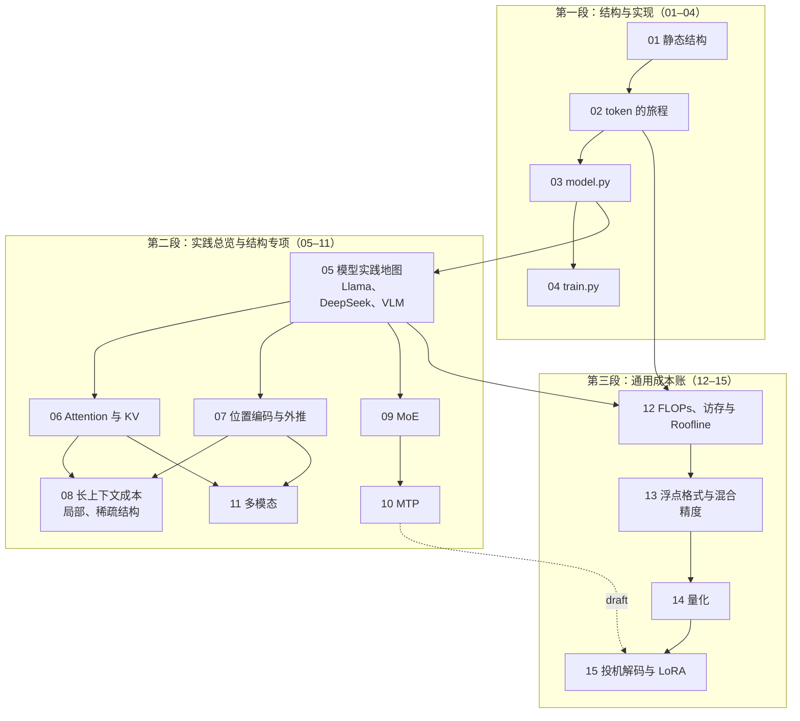
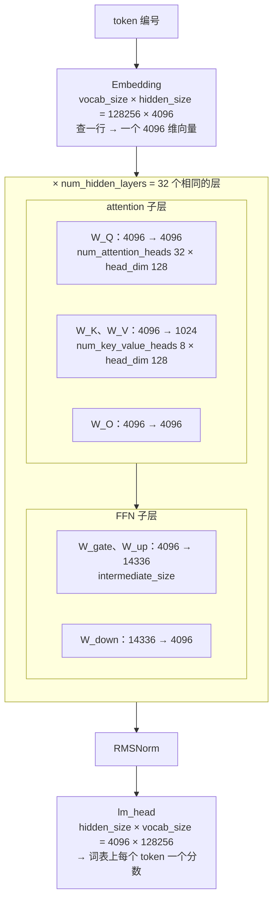

## 内容简介

《Transformer 与 LLM：结构、实现与算量》是一组共十五篇的系列文章，讲今天所有大语言模型共用的那一种结构。它分三段：**先讲清结构与实现**——Transformer 里每个方框是什么、为什么必须在那里、一个 token 在训练和推理时怎么流过它们，然后用 nanoGPT 的 300 行代码把它写出来、训出来；**再讲结构的演进**——从 GPT-2 到 Llama、DeepSeek，归一化、位置编码、FFN、attention 的 K/V、专家层、训练目标、多模态输入各改成了什么样、为什么、带来什么成本；**最后算通用的成本账**——任何结构每一步算多少、读多少、存多少，数值格式、量化、投机解码、LoRA 各怎么改变这些数字。同一张成本表的训练侧——tokenizer 与词表、算力怎么分给参数与数据、15T token 从哪来、超参表里的数字从哪来——是紧接着的系列[《预训练：从 tokenizer 到训练配方》](/pretraining-from-tokenizer-to-training-recipe.html)的内容。

它回答的问题是：

> **一个大模型内部到底是什么？为什么是这个样子？它的每一步花多少？[^q0]**

读完之后，读者应该能做三件事：

1. **手搓一个 GPT**：不看原文写出 nanoGPT `model.py` 的骨架，在一台笔记本上训出一个能续写莎士比亚的模型，并读懂任何模型的 `modeling_*.py`——先找到 embedding、block、attention 的四个矩阵、FFN、norm、lm_head 这七样东西，再看它改了哪几处；
2. **有底气改结构**：知道 GQA、MLA、RoPE、SwiGLU、MoE、MTP 各在解决什么问题、动了哪几行代码、代价是什么，能在小模型上做一次"改结构 → 改目标 → 看效果"的完整实验；
3. **算出成本表**：拿到任何一个模型的 `config.json` 和一张 GPU 的规格表，不运行代码算出它的参数量、每 token FLOPs、KV cache、decode 时间下界，判断一个优化在什么区间有效。

### 三段十五篇

| 段 | 篇 | 回答的问题 | 读完能做什么 |
|---|---|---|---|
| I 结构与实现 | 01–04 | Transformer 长什么样、一个 token 怎么流过它、300 行怎么写出来并训出来 | 手搓 GPT；读懂 `modeling_gpt2.py` |
| II 结构的演进 | 05–11 | 今天的模型改了哪些结构：每一处是什么、为什么改、带来什么成本（参数量、attention 变体与 KV cache、位置编码、MoE、MTP、多模态） | 读懂 `modeling_llama.py` / `modeling_deepseek_v3.py` / VLM 的 config；改结构 |
| III 通用成本账 | 12–15 | 不论哪种结构，每一步算多少、读多少、存多少 数值格式 量化 / 投机解码 / LoRA | 算出任何模型在任何 GPU 上的成本表 |

Table: 系列的三段与各段的目标

第一段面向零基础读者（只要 L0 数学与一点 PyTorch），第二、三段的推导逐渐加深；三段可以分开读，但第二段假设读者见过第一篇的结构图与第三篇的代码，第三段假设读者知道第二篇的 prefill / decode 与第五篇的参数量。为了不看总纲也能接上，每篇开头都有一段「本篇在系列中的位置」：属于哪一段、接上一篇的什么、回答什么问题。

### 第三段的入口：六个数字

第三段的所有推导都从一个 `config.json` 出发。Llama-3-8B 的 `config.json` 里有六个数字：

- **hidden_size**：4096
- **intermediate_size**：14336
- **num_hidden_layers**：32
- **num_attention_heads**：32
- **num_key_value_heads**：8
- **vocab_size**：128256

先把这六个数字标到模型结构上——每个数字都是图里某个方框的一条边长（第一篇会解释每个方框是什么，第五篇解释它与 GPT-2 差在哪）：

从这六个数字出发，不需要运行任何代码，可以算出：

- 它有 8.03B 参数，BF16 权重 16.06 GB；
- 每生成一个 token 需要约 15 GFLOPs（不含 attention 对上下文的那部分），而这部分在上下文 8K 时再加 4.3 GFLOPs，128K 时加 68.7 GFLOPs——超过权重那部分；
- 每个 token 的 KV cache 占 128 KiB；如果它没有用 GQA，会是 512 KiB；
- 在一张 H100 上，batch 为 1 的 decode 每步至少要 4.5–4.8 ms，因为要把约 15–16 GB 权重从 HBM 读一遍；要让 Tensor Core 忙起来，batch 得接近三百。

这些推导是第三段的内容，方法是：每一篇给出公式、代入公开模型的真实超参数、得到数字，再解释这个数字对系统设计意味着什么。

第三段覆盖的范围可以用一句话概括——一个 LLM 的成本由四组变量决定，多模态加第五组（训练侧的第六组在预训练系列）：

| 变量组 | 包括 | 在哪几篇 |
|---|---|---|
| 结构变量 | 层数 · hidden · FFN 宽度 · head 数 · KV 头数 · 专家数与 top-k | 第五、六、九篇 |
| 运行变量 | batch · 上下文长度 · prefill 还是 decode | 第八、十二篇 |
| 数值变量 | 每个数占几个字节 · 在哪一步累加 · 误差怎么积累 | 第十三篇 |
| 方法变量 | 量化格式 · 投机解码的草稿与接受率 · LoRA 的秩 | 第十四、十五篇 |
| 模态变量 | 图片分辨率 · patch 与 merge 大小 · encoder 深度 · 注入方式 | 第十一篇 |

Table: 决定一个 LLM 成本的五组变量与对应篇目

读完第三段，读者应该能把任何一个模型放进这五组变量里，算出它在任何一张 GPU 上的成本表。

## 为什么写这个系列？

### 所有 LLM 都是同一种结构，但"知道它长什么样"和"能写出来"差得很远

2017 年之后的语言模型结构上只做了修补，没有被替换——GPT、Llama、Qwen、DeepSeek、Claude、Gemini 用的是同一种结构。这意味着理解大模型内部只需要理解一种结构，但也意味着"大概知道 attention 和 FFN 堆起来"远远不够：能优化模型结构、能迭代出更强模型的人，脑子里装的是每个部件为什么在那里、去掉会怎样、改一处会牵动什么。这种理解的检验标准只有一个——**能不能不看原文把它写出来、训出来**。第一段四篇就是为这个标准设计的：结构图（静态）→ 数据流（动态）→ 代码 → 训练，每一步都可以在笔记本上验证。

### 结构的演进都是对某个具体问题的回答

从 GPT-2 到 Llama 的主要部件变化可归纳为五处，从 Llama 到 DeepSeek-V3 又改了三处（MLA、细粒度 MoE、MTP）。第 05 篇先用真实配置把这些变化放在一张实践地图里，第 06–11 篇再逐项展开。每一处都在回答一个能用数字说清的问题：KV cache 太大（GQA、MLA）、上下文外推失败（RoPE 的 base 与 YaRN）、参数与算量绑死（MoE）、监督信号太稀（MTP）。第二段七篇把每处改动放回它要解决的问题里讲，配上"在 nanoGPT 上改哪几行"的实现——读完之后再看一个新模型的技术报告，能一眼看出它改了哪里、为什么。

### 引擎与 kernel 的一切优化都以模型的算量和访存量为目标

推理引擎的 continuous batching、PagedAttention、prefix caching、PD 分离，训练框架的张量并行、流水并行、专家并行、激活重算，kernel 层的 FlashAttention、融合算子、低精度 GEMM——每一项都是对模型某个成本项的回应。不知道 KV cache 是怎么算出来的，就不理解 PagedAttention 在管理什么；不知道 decode 为什么是 memory-bound 的，就不理解为什么 weight-only 量化对 decode 有效、对 prefill 无效；不知道 MoE 每层只激活 8/256 的专家，就不理解为什么它必须做 all-to-all 而不是 all-reduce。第三段四篇给出这些推导：面对一个新模型、新硬件、新方法，可以在看任何 benchmark 之前先算出它**应该**多快，再用测量去解释差距。

### "参数量"只是成本的一个维度

模型卡上通常只有一个数字：参数量。但一个 8B 的 dense 模型、一个 47B 总参数 13B 激活参数的 MoE 模型、一个 671B 总参数 37B 激活参数的 MoE 模型，它们的显存、算量、访存量、通信量之间的关系完全不同：

| | 参数量决定 | 激活参数量决定 | 上下文长度决定 | batch 决定 |
|---|---|---|---|---|
| 显存 | 权重 | — | KV cache | KV cache · 激活值 |
| 算量（FLOPs） | — | 每 token 的 GEMM | attention 项 | 总量 |
| 访存量 | decode 的下界 | — | KV 读取 | 摊薄权重读取 |
| 通信量 | 并行切分 | MoE 的 all-to-all | 序列并行 | — |

Table: 四类成本各由哪个变量决定

每一格都有自己的公式，公式里的变量各不相同。第三段把这张表的每一格填上。

### 现有材料的断层

- **教材与课程**（d2l 10.7、"Let's build GPT"）把结构与代码讲得很好，但止步于 GPT-2 的形态，不讲 GQA、MLA、MoE、MTP 为什么出现，也不算成本；
- **论文**给出了每个方法的定义和实验结果，但假设读者会自己算成本，而且每篇只讲一个方法，读者需要自己把它们放进同一个坐标系；
- **框架文档**（PyTorch、`transformers`、vLLM、Megatron）讲怎么用，把模型当作黑盒；
- **博客**里的"Transformer 数学"多数止步于参数量和 $$6ND$$，不覆盖 MLA、MoE、FP8、投机解码这些当前实践的重心。

本系列想做的是把这三段接成一条线：从"能手写一个 GPT-2"到"知道今天的模型为什么不是 GPT-2 的样子"到"能为任何一个模型算出一张完整成本表"。取法是：**结构与实现用同一个玩具例子和同一份代码从头到尾验证；每一个演进都放回它解决的问题里讲并给出实现；每一个成本都放回同一张成本表里讨论，用同样三个模型、同一张 GPU 的数字**。

## 适合哪些读者？

### 想真正理解大模型内部、并且亲手写一个的人

你可能是算法方向的学生或转行者，读过 attention 的公式但从没把一个 Transformer 从头写出来、训出来。第一段四篇按"图 → 数据流 → 代码 → 训练"的顺序，每一步都有可以在笔记本上跑的代码和数字，不需要 GPU。

### 设计或调整模型结构的算法工程师

你在选 GQA 组数、选 MoE 的专家粒度、选 RoPE 的 base、决定是否用 MLA 或 MTP。第二段告诉你每个选择在解决什么、动了哪几行、系统上的代价是什么；第三段把代价算成显存、算量、访存、通信的数字，让结构设计和硬件效率在同一张表上讨论。

### 做推理系统与训练基础设施的工程师

你在配置或改造 vLLM、SGLang、Megatron、DeepSpeed 这类系统，需要判断：这个模型在这几张卡上该怎么切、batch 和上下文的上限在哪、开哪种量化、投机解码的收益上界是多少、MoE 该用 EP 还是 TP。第三段给的是你做这些判断时要用的公式和数字；第一、二段是理解这些公式的前提——如果你已经熟悉结构，可以从第五篇或第十二篇进入。

### 写 kernel 的工程师

你要优化的 attention、GEMM、MoE、量化 kernel 的输入 shape 和访存模式都来自模型结构。理解 GQA 的组数如何改变 decode attention 的算术强度、MLA 的矩阵吸收如何把 attention 变成一个大 head dim 的 MQA、MoE 的 grouped GEMM 的 M 维为什么这么小，才知道该往哪个方向优化。

### 从后端转向 AI-Infra、需要一份"模型知识最小集"的工程师

你不打算成为算法工程师，但读引擎源码、看性能报告、参加技术讨论时，需要知道 head、layer、KV cache、prefill、decode、MoE、FP8 这些词背后的数量关系。第一、二篇加第十二篇是为此准备的最小集。

## 系列的整体主线

十五篇分三段，每段只回答一个问题：第一段问 GPT-2 怎么工作、怎么写；第二段问今天的模型改了哪些结构；第三段问不论哪种结构，在硬件上花多少。

**第一段：结构与实现**

1. 第一篇：Transformer 长什么样 —— 从一句话到下一个 token，静态结构里每个部件为什么在那里
2. 第二篇：一个 token 的旅程 —— 训练侧的 teacher forcing 与反向、推理侧的 prefill / decode / KV cache
3. 第三篇：手搓 GPT（上）—— nanoGPT `model.py` 逐行解析，并与 HuggingFace 对拍
4. 第四篇：手搓 GPT（下）—— nanoGPT `train.py` 与训一个会续写的模型

**第二段：实践总览与结构专项**

5. 第五篇：今天的模型长什么样 —— 用 Llama-3、DeepSeek-V3 与 VLM 的真实配置画出实践地图；RMSNorm、SwiGLU、去 bias 在这里讲清；参数量公式与 8.03B
6. 第六篇：Attention 变体与 KV cache —— MHA / GQA / MQA / MLA 的推导与实现
7. 第七篇：位置编码与外推 —— 位置编码解决顺序；RoPE 的波长、外推为什么失败、PI / NTK-aware / YaRN 改了什么
8. 第八篇：长上下文的成本与结构手段 —— KV 线性项、prefill 二次项、不能物化的 logits；滑窗、交错、sink、稀疏 attention
9. 第九篇：MoE —— 路由、激活参数量与 all-to-all 的通信形态
10. 第十篇：MTP —— 改训练目标而不改主干；顺序模块、投机 draft、nanoGPT 上的对照实验
11. 第十一篇：多模态 —— vision encoder 与 connector 加在哪里、image token 数由谁决定，以及它们的算量与 KV 代价

**第三段：通用成本账**

12. 第十二篇：前向的算量与访存量 —— shape → GEMM、FLOPs、字节数、Roofline 视角下的 prefill 与 decode
13. 第十三篇：浮点格式、数值稳定性与混合精度 —— 数值在哪里丢失，为什么还能工作
14. 第十四篇：量化 —— 权重、激活与 KV cache 少用几位；scale、粒度、校准与误差补偿
15. 第十五篇：投机解码与 LoRA —— 不改结构、只改计算形态的两种算法手段

第二段的每一处结构变化都同时是一笔成本变化：GQA / MQA / MLA 改的是 attention 的形状，省下的是 KV cache；MoE 改的是 FFN，换来的是激活参数与 all-to-all 通信；多模态改的是输入，多出来的是 encoder 算量与 image token 的 KV。所以第二段每篇都讲到「是什么、为什么、带来什么成本」为止。第三段不再引入新结构，而是把这些成本放到硬件上统一算：FLOPs 与字节数、数值格式、以及量化、投机解码、LoRA 这三种不改结构、只改计算形态的方法。贯穿全系列的模型实例是 GPT-2 small（第一段）→ Llama-3-8B / 70B（dense、GQA）→ DeepSeek-V3（MLA、MoE、FP8、MTP）→ Mixtral 8x7B（粗粒度 MoE）→ LLaVA-1.5 / Qwen2-VL / Llama-3.2-Vision（多模态）。

第一段的每一篇都用同样的方法：**画出图，写出代码，跑出数字，与 PyTorch / HuggingFace 对拍**。第二、三段的每一篇都用同样的方法：**写出公式，代入真实模型的超参数，算出数字，解释数字对系统意味着什么**。

## 章节结构与分章导读

### 1. Transformer 长什么样：从一句话到下一个 token

第一篇是静态线。把一个 decoder-only Transformer 里的每个方框打开：embedding 查表、位置信息、attention、FFN、残差与 LayerNorm、lm_head——每个部件先讲它为什么必须在那里（去掉会失去什么），再讲它是什么、怎么算。全篇用一个 $$d = 4$$、3 个 token 的例子把 attention 的六步**手算**出来并与 PyTorch 对拍，再用 GPT-2 small 的真实数字对照；附 GPT-2 两个真实 attention 头的热力图（一个看上一个词、一个把 it 指回 cat）、换序实验（attention 不知道顺序）、$$\sqrt d$$ 的方差表、GPT-2 small 1.24 亿参数的逐项数法，以及与 d2l 10.7 那张 encoder-decoder 图的对照——cross-attention 去哪了、为什么 GPT 只留 decoder。

核心问题是：

> **一个 token 的编号进入模型，到词表上的一个概率分布出来，中间经过了哪些运算？每一个运算为什么必须在那里？[^q1]**

### 2. 一个 token 的旅程：训练侧与推理侧

第二篇是动态线。训练侧：$$T + 1$$ 个连续 token → 输入与右移一位的目标 → 一次前向得到 $$[B, T, V]$$ 的 logits → $$T$$ 个交叉熵 → 反向沿原路给每个参数梯度 → AdamW 一步；为什么一次前向能同时得到 $$T$$ 个训练信号（causal mask + teacher forcing）、为反向保存的激活值为什么与 $$B \times T$$ 成正比。推理侧：prefill（同训练前向，只取最后位置）与 decode（每步一个 token）；KV cache 为什么可行、省了什么、花了什么——用一个自带 cache 的极小 GPT 实测有 / 无 cache 输出逐 token 一致、生成 256 个 token 快 7.9 倍。末尾一张训练 / prefill / decode 三种形态的对照表。

核心问题是：

> **训练时一句话的 $$T$$ 个 token 进入模型，为什么一次前向就能得到 $$T$$ 个训练信号？推理时为什么前面的 token 不用重算？[^q2]**

### 3. 手搓 GPT（上）：nanoGPT model.py 逐行解析

第三篇把前两篇的图变成代码：Karpathy 的 nanoGPT `model.py`，330 行、6 个类。每段代码说三件事——对应结构图的哪个方框、在训练 / 推理的哪一步执行、为什么这么写：Q / K / V 为什么合成一个 $$d \to 3d$$ 的矩阵、`view` + `transpose` 怎么拆头、mask 为什么叫 `bias`、`c_proj` 的初始化为什么除 $$\sqrt{2L}$$、推理时为什么只算最后一个位置的 lm_head、`generate` 的温度 / top-k / 采样、`from_pretrained` 怎么把 OpenAI 的权重搬进来（与 HuggingFace 对拍相对差 $$9 \times 10^{-5}$$）、`configure_optimizers` 为什么只对二维参数做 weight decay、`estimate_mfu` 的 $$6N + 12LHQT$$。末尾一张 nanoGPT / HF GPT-2 / Llama 的名字对照表——Llama 相对 GPT-2 只改了五处。

核心问题是：

> **一个能加载 GPT-2 权重、能训练、能生成的 Transformer，最少需要写哪些东西？[^q3]**

### 4. 手搓 GPT（下）：nanoGPT train.py 与训一个会续写的模型

第四篇补上数据与训练循环：`prepare.py` 把文本变成 `uint16` 数组；`train.py` 336 行按块过——配置与 `configurator.py`、`get_batch` 的随机窗口、三种模型来源（从零 / 续训 / GPT-2 权重）、GradScaler / 优化器 / `compile` / DDP 四层包装、warmup + cosine、训练循环里的梯度累积、预取、DDP 只在最后一步同步、裁剪、checkpoint 五样。然后在一台 MacBook 上用莎士比亚全集训 2000 步（7 分钟）：loss 从 $$\ln 65 = 4.17$$ 到 1.66、输出从乱码到有莎士比亚的格式；再只改层数 2 / 4 / 8 各训一次——参数量与每步耗时随层数线性增长、loss 收益递减，第一次亲手"改结构看后果"。末尾一张"nanoGPT 有的与真实预训练多出来的"对照表。

核心问题是：

> **从一个 1.1 MB 的文本文件到一个能续写它的模型，中间每一步的代码在哪、为什么那样写？把层数从 4 改到 2 或 8，loss 和速度各会怎样？**

### 5. 今天的模型长什么样：从 GPT-2 到 Llama 与 DeepSeek

第五篇先读真实模型的配置：GPT-2 到 Llama 的五处变化、DeepSeek-V3 的 MLA / MoE / MTP、VLM 的图像接口各是什么、为什么改、后续在哪里展开。RMSNorm、SwiGLU、去 bias 在这里讲清；GQA 只保留参数量所需的 KV 投影宽度，原理交给第六篇。参数量公式、8B / 70B / 405B 的逐项验证、`modeling_llama.py` 映射和 `llm_cost.py` 起点保留。

这一篇会覆盖：

- 五处改动逐个讲为什么：LayerNorm → RMSNorm、学习式位置表 → RoPE、GELU 两矩阵 → SwiGLU 三矩阵、MHA → GQA、去掉 bias；每处回答 GPT-2 的做法有什么问题、新做法怎么解决、参数与算量代价是什么（结构本身不重讲，见第一篇）；
- attention 的四个投影矩阵 $$W_Q$$、$$W_K$$、$$W_V$$、$$W_O$$ 的形状，`num_attention_heads`、`num_key_value_heads`、`head_dim` 三者的关系；
- FFN 的形状：传统两矩阵 FFN 与 SwiGLU 的三矩阵 FFN（gate、up、down），为什么 Llama 的 `intermediate_size` 是 14336 而不是 $$4d = 16384$$；
- RMSNorm 与 LayerNorm 的参数量与计算量；为什么 bias 项在近年的模型里几乎消失；
- embedding 与 lm_head 是否共享（tie），vocab 大小对参数量和 lm_head 计算量的影响；
- 参数量公式：

$$
N \approx L \cdot \left[ d \cdot (d + 2 d_{kv} + d) + 3 \cdot d \cdot d_{ff} \right] + 2 \cdot V \cdot d
$$

  其中 $$d_{kv} = n_{kv} \cdot d_{head}$$；逐项代入 Llama-3-8B：attention 每层 41.9M，FFN 每层 176.2M，32 层共 6.98B，embedding 与 lm_head 各 525M，合计 8.03B；再代入 Llama-3-70B（$$d = 8192$$，$$d_{ff} = 28672$$，80 层，64 头，8 个 KV 头）得到 70.6B；
- 参数分布：dense 模型里 FFN 占每层参数的约 80%，embedding 在小模型里占比很高（8B 的 13%）而在大模型里可以忽略；
- 读 `transformers` 的 `modeling_llama.py`：把每个 `nn.Linear` 的 `in_features`/`out_features` 与上面的公式一一对应；这些形状怎么变成 GEMM、张量并行怎么切，留给第十二篇。

核心问题是：

> **给你任意一个模型的 `config.json`，不运行代码，能不能在五分钟内算出它的参数量，并说出这些参数在 attention、FFN、embedding 之间怎么分配？误差要在 1% 以内。[^q4]**

实践：写一个读 `config.json` 输出逐层参数表的脚本，用 Llama-3-8B、Llama-3-70B 验证到与官方公布的参数量一致。这个脚本会在后面每一篇里长出新的列。

### 6. Attention 变体与 KV cache：MHA、GQA、MQA 与 MLA 的推导

第六篇专门讲 attention，因为它是 Transformer 里唯一成本随上下文长度增长的部分，也是过去几年结构改动最集中的地方。每一种变体都是在同一个目标下做取舍：**减少每个 token 的 KV cache 字节数，同时尽量不损失质量**。

这一篇会覆盖：

- GQA 在第三篇的 `CausalSelfAttention` 上只改三处（K/V 投影变窄、按 $$n_{kv}$$ 拆头、`repeat_interleave` 对齐），MQA 是 $$n_{kv} = 1$$；MLA 的压缩与吸收单独展开；
- 为什么需要 KV cache（第二篇已从动态线讲过"为什么有"，这里讲"为什么要省"）：自回归 decode 时每个新 token 要 attend 到全部历史 token 的 K 和 V，不缓存就要重算，缓存就要占显存；
- KV cache 大小公式：

$$
\text{bytes/token} = 2 \cdot L \cdot n_{kv} \cdot d_{head} \cdot \text{bytes/elem}
$$

  MHA（$$n_{kv} = n_h$$）：Llama-3-8B 如果是 MHA，每 token $$2 \times 32 \times 32 \times 128 \times 2 = 512$$ KiB；
- MQA（Shazeer 2019）：$$n_{kv} = 1$$，KV cache 缩小 $$n_h$$ 倍，但质量有损；
- GQA（Ainslie 等 2023）：$$n_{kv}$$ 取中间值，Llama-3-8B 的 8 个 KV 头把 KV cache 压到 128 KiB/token，Llama-3-70B 为 320 KiB/token；128K 上下文时两者分别是 16 GiB 和 40 GiB；一张 80 GB 的 H100 放下 8B 权重后剩余约 64 GB，能容纳约 50 万个 token 的 KV；
- GQA 对 decode attention 算术强度的影响：每读一个 KV 元素服务 $$g = n_h / n_{kv}$$ 个 query head，强度从 MHA 的约 1 FLOP/byte 提到约 $$g$$；这是 GQA 除了省显存之外的第二个收益；
- MLA（DeepSeek-V2 / V3）：把 K 和 V 联合压缩到一个 $$d_c = 512$$ 维的 latent，外加一个 $$d_h^R = 64$$ 维的解耦 RoPE key；每 token 每层只缓存 $$512 + 64 = 576$$ 个数；DeepSeek-V3 的 61 层 BF16 下每 token 约 68.6 KiB——尽管它有 128 个 head，KV cache 比 Llama-3-8B 还小；如果它用 MHA，每 token 是 3.8 MiB，压缩了约 57 倍；
- MLA 的矩阵吸收：推理时把 $$W_{UK}$$ 吸收进 $$W_Q$$、$$W_{UV}$$ 吸收进 $$W_O$$，attention 直接在 576 维的 latent 上做——它在 kernel 层等价于一个 head dim 为 576（K）/ 512（V）、128 个 query head 共享一个 KV 头的 MQA，算术强度极高，但每个 head 的点积长度从 192 变成 576，计算量上升；为什么这对 decode 是划算的，对 prefill 不一定；
- 为什么 RoPE 与低秩压缩不兼容，MLA 要把 RoPE 部分解耦出来单独缓存；
- 标准 attention 的中间结果：$$S = QK^\top$$ 对 $$s = 8K$$、32 个 head 的 BF16 是每层 4 GiB；FlashAttention 通过分块与 online softmax 不物化它，HBM 流量从 $$O(s^2)$$ 降到 $$O(s^2 d^2 / M)$$（$$M$$ 为 SRAM 大小）——本篇只推导 IO 复杂度，不讲 kernel 实现；
- 因果掩码让 prefill 的 attention 实际算量减半，sliding window 让它变成线性；
- KV cache 的分页、prefix 共享、量化（FP8 / INT8 KV）对上面公式的影响。

核心问题是：

> **DeepSeek-V3 有 128 个 attention head、61 层，KV cache 却比 32 头 32 层的 Llama-3-8B 小。这是怎么做到的？代价是什么？**

实践：脚本增加 KV cache 列，支持 MHA / GQA / MQA / MLA 四种模式；给定显存预算，输出各模型在不同上下文长度下的最大并发数。

### 7. 位置编码与外推

位置编码首先解决顺序与相对距离的表示，不是专为长上下文发明。第七篇从不带位置与掩码的 attention 的置换等变性出发，比较位置表、正弦编码与 RoPE，推导旋转点积里的相对位置和各维度的波长，再看 PI、NTK-aware、YaRN、Llama 3.1 分段缩放与 ALiBi。位置方案约束长度外推，但并不独自决定长文理解质量，也不消除长上下文的计算成本。

> **一个用 8K 训练的 RoPE 模型，为什么不能保证直接推理 32K？改 base 解决了什么？[^q5]**

实践：用 NumPy 验证 RoPE 的相对性，对照三种缩放方法的波长与频率变化。

### 8. 长上下文的成本与结构手段

第八篇承接位置编码，但换一个问题：即使位置能够外推，显存、TTFT 与并发仍被什么限制？KV cache 随长度线性增长，整段 prefill attention 的算量二次增长；FlashAttention 避免物化 logits，却不消除全局 attention 的二次算量。

这一篇把 sliding window、全局 / 局部交错、attention sink、块稀疏逐项代入成本表，区分“改变可见位置”“压缩 KV 表示”和“减少中间量 IO”；再连接到 chunked prefill 与序列并行的动机。

> **一个 128K 请求贵在哪里？滑窗把哪项改成了什么函数？[^q6]**

实践：扫描上下文长度，计算每条请求的 KV、prefill FLOPs 与 attention 占比。8B 在 128K 下约 16 GiB KV，prefill 6.5 PFLOP，60% MFU 单卡等效约 11 秒。

### 9. MoE：路由、激活参数量与通信形态

第九篇讲混合专家模型。MoE 把"参数量"与"每 token 算量"解耦，是当前大模型扩展的主流路线；它也把一个新的成本项——**all-to-all 通信**——引入了模型前向。

这一篇会覆盖：

- 一个最小 MoE 层的实现（router、top-k、专家计算、共享专家），把第三篇的 `MLP` 换成它；
- MoE layer 的结构：router（一个 $$d \times E$$ 的线性层加 softmax 或 sigmoid）为每个 token 选 top-$$k$$ 个专家，专家是独立的 FFN，输出按路由权重加权求和；
- 两种粒度：Mixtral 8x7B 是 8 个 $$d_{ff} = 14336$$ 的专家取 top-2，DeepSeek-V3 是 256 个 $$d_{ff} = 2048$$ 的路由专家取 top-8、外加 1 个共享专家；细粒度专家为什么在同样激活参数下表达能力更强；
- 参数量与激活参数量：Mixtral 8x7B 总参数 46.7B（8 个专家每层 1.41B，32 层），每 token 激活 12.9B；DeepSeek-V3 每个专家 $$3 \times 7168 \times 2048 \approx 44$$M，每个 MoE 层 257 个专家共 11.3B，58 个 MoE 层加 3 个 dense 层与 attention、embedding 合计约 671B，每 token 激活 37B；
- 算量按激活参数算，显存按总参数算：DeepSeek-V3 每 token 约 74 GFLOPs（$$2 \times 37\text{B}$$），但 FP8 权重也要 671 GB，一台 8 卡 H100（640 GB）放不下；
- decode 时的访存形态：batch 为 $$B$$ 时期望被激活的专家数为 $$E \cdot [1 - (1 - k/E)^B]$$，DeepSeek-V3 在 $$B = 32$$ 时约 163 个、$$B = 128$$ 时约 252 个——中等 batch 就几乎要把所有专家的权重读一遍，"稀疏"在访存上不成立；这是它的推理部署要用大规模专家并行的原因；
- 专家并行（EP）的通信：每个 token 的 hidden state 要发到它的 $$k$$ 个专家所在的 GPU，再收回来——两次 all-to-all；DeepSeek-V3 dispatch 用 FP8（每 token 每专家 7 KiB）、combine 用 BF16（14 KiB），并限制每个 token 最多路由到 4 个节点以控制跨节点流量；
- EP 与 TP 的对比：TP 切每个专家的矩阵，通信是 all-reduce，量与 dense 相同；EP 按专家切，通信是 all-to-all，量与 $$k$$ 成正比；两者在什么规模下哪个划算；
- grouped GEMM 的形态：$$T$$ 个 token 分到 $$E$$ 个专家后，每个专家的 GEMM 平均只有 $$Tk/E$$ 行——prefill 4096 个 token 在 DeepSeek-V3 里每个专家平均 128 行，decode 时可能只有几行；为什么这让 MoE 的 GEMM 效率天然低于 dense；
- 负载均衡：辅助损失（Switch Transformer）、容量因子与 token 丢弃、DeepSeek-V3 的 aux-loss-free 偏置调节；负载不均对 EP 意味着什么（最慢的 GPU 决定这一层的时间）；
- 与 MoE 配套的其他结构：共享专家；MTP 另立第十篇。

核心问题是：

> **DeepSeek-V3 每 token 只算 37B 参数，为什么部署它比部署一个 dense 70B 难得多？把"参数量"、"激活参数量"、"每步实际读取的参数量"三个数分开算。**

实践：脚本增加 MoE 支持——总参数、激活参数、给定 batch 下期望激活的专家数、EP 下每层的 all-to-all 字节数；用 Mixtral 8x7B 与 DeepSeek-V3 的公开超参验证。

### 10. MTP：改训练目标而不改主干的多 token 预测

第十篇是第二段里唯一改**训练目标**而不改结构的一篇。next-token 每个位置只有一份监督信号、只学一步远；MTP 让位置 $$i$$ 额外预测 $$t_{i+2}$$，同一批数据的信号密度翻倍，并逼主干表示编码更远的未来。讲 DeepSeek-V3 的顺序 MTP 模块（两个 RMSNorm + 一个 $$2d \to d$$ 投影 + 一个 block，embedding 与 lm_head 与主干共享）、$$\mathcal L = \mathcal L_{\text{main}} + \lambda \bar{\mathcal L}_{\text{MTP}}$$、顺序为什么优于并行头（teacher forcing 的延伸）、推理时丢弃或当投机解码的 draft（接受率 85–90%，TPS 约 1.8 倍）。在第四篇的 nanoGPT 上挂一个 MTP 模块做对照实验：小模型上主任务不变（规模依赖）、MTP 头对下下个字符命中 45%、代价 +29% 参数。

核心问题是：

> **每个位置多预测一个 token，训练时多花了什么、可能多得到什么？DeepSeek-V3 的 MTP 模块为什么要"顺序"而不是"并行"，推理时它去哪了？**

### 11. 多模态：vision encoder 的算量与 image token 的 KV 代价

第十一篇把输入从 token id 扩展到图片、视频与音频。前面所有的账都以"token 数由 tokenizer 决定"为前提；多模态模型把一张图先送进一个独立的 vision encoder（ViT），再由 connector 变成几百到几千个 token 插进 prompt。于是多了三笔账：encoder 自己的算量、connector 决定的 token 数、这些 token 进入 decoder 后与文本 token 完全相同的 prefill FLOPs 与 KV cache。

这一篇会覆盖：

- patchify 与 ViT 的参数量、FLOPs 公式：$$N_{vit} \approx 12 L_{vit} d_{vit}^2$$，一张图的 FLOPs $$= 2 N_{vit} n_p + 4 L_{vit} n_p^2 d_{vit}$$；代入 CLIP ViT-L/14-336（0.3 B、576 patch、0.38 TFLOP）、Qwen2-VL 的 ViT（0.63 B、1024² 图 5476 patch、11.8 TFLOP，attention 二次项占 42%）与 Qwen2.5-VL 的 window attention 为什么能砍掉三分之一；
- 分辨率策略：固定分辨率（LLaVA）、固定 tile 动态 tile 数（InternVL、Llama 3.2 Vision）、原生动态分辨率（Qwen2-VL）各自的 patch 数范围；
- connector 的三类：MLP projector（不压缩）、2×2 merge / pixel-shuffle（÷4）、Perceiver resampler / Q-Former（定长）；image token 数的公式 $$n_{img} = \lceil H/28 \rceil \lceil W/28 \rceil$$——同一张 1024² 的图从 576 到 6404 个 token，差 11 倍；
- image token 在 decoder 里的三个字节数：prefill FLOPs $$2 N n_{img}$$、KV $$n_{img} \cdot 2 L n_{kv} d_{head} \cdot 2$$ B、encoder 输出 $$n_{img} d_{model} \cdot 2$$ B；70B 规格下 1369 个 token 的 KV 是 428 MiB、encoder 输出 21 MiB，比值 $$2 L n_{kv} d_{head} / d_{model} = 20$$，且 KV 活到请求结束而 encoder 输出用完即弃——**图片贵的不是 encoder，是它变成的 token 在 decoder 里占的 KV**；
- cross-attention 注入（Llama 3.2 Vision）：图片特征不进序列，8 个 cross-attention 层的 K / V 固定为 200 MiB，与 decoder-only 注入的 800 MiB 对照；用 0.5 B 参数换序列长度；
- M-RoPE：把 $$d_{head}$$ 的 64 对旋转维度按 16 / 24 / 24 分给 $$(t, h, w)$$，图片在位置空间里占的长度是边长而不是面积——但不改变 KV 的账；
- 视频与音频：一分钟 720p 视频约 36K token；Whisper encoder 30 秒 → 1500 个位置、50 token / 秒；所有模态最终归结为进入 decoder 的 token 数；
- 训练侧：冻结 encoder 省的主要是激活值，状态是小头（两者都省）；样本 token 数的方差对打包的影响；图片解码把数据管线的瓶颈搬到 CPU。

核心问题是：

> **一张 1024×1024 的图片在 Qwen2-VL 里等于多少个 token？为什么"encoder 输出只有 21 MB"与"这张图占 400 MB 显存"两句话同时成立？[^q7]**

实践：脚本增加 vision encoder 的参数与 FLOPs、image token 数、image token 在 decoder 中的三个字节数；成本表新增"一张 1024² 图片"一行，按三种注入方式对照。

### 12. 前向的算量与访存量：prefill、decode 与 Roofline

第十二篇开始第三段：把前十篇里的每一个矩阵乘换成时间。它先把训练与推理时的 shape（`[batch, seq, hidden]` 在每个矩阵乘法处变成什么 GEMM、prefill 与 decode 的 $$m$$ 有何不同、张量并行怎么切这些形状）过一遍，再回答：跑一次前向要做多少浮点运算、从 HBM 读多少字节，以及这两个数的比值如何决定一段计算是 compute-bound 还是 memory-bound。

这一篇会覆盖：

- 矩阵乘法的 FLOPs：$$[m, k] \times [k, n]$$ 需要 $$2mkn$$ 次浮点运算；为什么每个参数每个 token 贡献 2 FLOPs，得到前向的经典近似 $$2N$$ FLOPs/token；
- attention 对上下文的那部分：$$QK^\top$$ 与 $$PV$$ 每层每 token 各 $$2 \cdot n_h \cdot d_{head} \cdot s = 2ds$$ FLOPs，合计 $$4ds$$；对 Llama-3-8B 这是每层 $$16384 \cdot s$$，32 层共 $$0.52\,\text{MFLOPs} \times s$$；上下文 8K 时 4.3 GFLOPs，128K 时 68.7 GFLOPs，与权重部分的 15 GFLOPs 对比；
- 训练的 $$6ND$$：前向 $$2N$$，反向约 $$4N$$（对输入的梯度和对权重的梯度各一次），乘以 token 总数；激活重算再加一个前向；
- prefill 与 decode 的区别：prefill 一次处理 $$s$$ 个 token，GEMM 的 $$m$$ 维是 $$s$$；decode 每步处理 1 个 token，$$m$$ 维是 batch 大小；
- 访存量：参与 GEMM 的权重每步必须读一遍——Llama-3-8B BF16 驻留 16.06 GB、每步流量约 15.0 GB（embedding 只 gather 不整表读）；KV cache 每步读一遍——每个 token 128 KiB 乘以上下文长度乘以 batch；激活值在 decode 时可以忽略；
- Roofline：算术强度 $$I = \text{FLOPs} / \text{bytes}$$；H100 SXM 的 ridge point 约 $$989 / 3.35 \approx 295$$ FLOP/byte（BF16 dense 算力 989 TFLOPS，HBM3 带宽 3.35 TB/s），A100 约 156；
- decode 的算术强度：batch 为 $$B$$ 时，权重 GEMM 的强度约为 $$B$$ FLOP/byte（每 2 字节权重做 $$2B$$ 次运算）；$$B = 1$$ 时距 ridge point 差两个数量级——这就是"decode 是 memory-bound 的"的全部含义；
- decode 每步的时间下界：Llama-3-8B 在 H100 上约 $$15.0\,\text{GB} / 3.35\,\text{TB/s} \approx 4.5$$ ms（按全部 16.06 GB 粗算 4.8 ms），即 BF16 单卡单请求理想上限约 220 token/s——量化、投机、多卡 TP 都能超过它；加上 KV cache：上下文 8K、batch 64 时 KV 读取 64 GiB，已远超权重；
- prefill 的时间：8K 个 token 约 $$8192 \times 19\,\text{GFLOPs} \approx 156$$ TFLOP，峰值下 0.16 s 是物理下限，按 60% 的经验 MFU 约 0.26 s；
- 激活值显存：训练时每层每 token 的激活值随 $$d$$、$$s$$、head 数变化的估算式（Megatron 团队论文中的 $$s b h (34 + 5 a s / h)$$ 字节，不用 FlashAttention 时），以及为什么 $$s^2$$ 项让长序列训练必须重算或用 FlashAttention；
- MFU 与 HFU：如何从 token 吞吐反推硬件利用率，为什么 40–50% 的 MFU 已经算好。

核心问题是：

> **Llama-3-8B 在一张 H100 上，batch 多大时 decode 从 memory-bound 变成 compute-bound？考虑 KV cache 之后，这个 batch 还能达到吗？**

实践：脚本增加 FLOPs 与字节数两列，输入 batch、上下文长度和硬件参数，输出 prefill 和 decode 的理论时间下界；与 vLLM 或 `transformers` 实测对比，解释差距。

### 13. 浮点格式、数值稳定性与混合精度

第十三篇从"每个数占几个字节"进入"每个字节里存了什么"。前面各篇的字节数估算通常以 BF16 的 2 字节为默认；这一篇解释为什么是 BF16，以及把它换成 FP16、FP8、INT8 时数值上会发生什么。

这一篇会覆盖：

- 浮点格式的位布局：FP32（1/8/23）、TF32（1/8/10，19 位有效）、FP16（1/5/10）、BF16（1/8/7）、FP8 E4M3（1/4/3）与 E5M2（1/5/2）、INT8、INT4；每种格式的最大值、最小正规数、机器精度：FP16 最大 65504、BF16 与 FP32 同范围但相对精度只有 $$2^{-8}$$ 量级、E4M3 最大 448 且没有 inf；
- 指数位与尾数位的取舍：范围与精度不可兼得，BF16 用范围换精度，FP16 反之；为什么深度学习几乎总是选范围；
- 数值在哪些地方丢失：加法中大数吃小数、长求和的误差积累、softmax 的指数溢出（FP16 下 $$e^x$$ 在 $$x > 11.09$$ 时溢出，所以要先减最大值）、方差计算中的相消；
- 累加精度：一个 $$k = 4096$$ 的点积如果在 BF16 中累加会损失多少位；Tensor Core 用 FP32 累加器的原因；FP8 Tensor Core 的累加精度有限，DeepSeek-V3 每 128 个元素就把部分和提升到 FP32 的做法；
- 混合精度训练（Micikevicius 等 2017）为什么能工作：前向和反向用低精度、权重更新用 FP32 master weights；Adam 的单步更新量常在 $$10^{-4}$$ 到 $$10^{-3}$$ 的相对量级，低于 BF16 的机器精度 $$2^{-8} \approx 0.0039$$，直接用 BF16 累加会把更新吃掉；
- FP16 的 loss scaling：梯度的动态范围与 FP16 的最小正规数 $$6.1 \times 10^{-5}$$ 之间的矛盾，动态 loss scale 的机制；BF16 为什么不需要它；
- 训练状态的字节数：混合精度 + Adam 下每参数 16 字节（BF16 权重 2 + BF16 梯度 2 + FP32 master 4 + FP32 一阶矩 4 + FP32 二阶矩 4），Llama-3-8B 全量训练的状态就是 128 GB，这是 ZeRO 和 FSDP 存在的理由；
- FP8 训练：E4M3 用于前向与权重、E5M2 用于梯度的分工；per-tensor scaling 与 delayed scaling（Transformer Engine）；DeepSeek-V3 的分块量化（激活按 $$1 \times 128$$、权重按 $$128 \times 128$$）为什么能用 E4M3 训练 671B；
- 推理中的数值：attention logit 随训练增长、QK-norm 的作用；RMSNorm 的 $$\epsilon$$；不同 kernel 实现之间的数值差异应该有多大，怎么判断一个差异是 bug 还是正常的浮点噪声；
- 随机性与可复现：atomicAdd 的非确定性、`torch.use_deterministic_algorithms` 的代价。

核心问题是：

> **BF16 的相对精度只有 FP16 的 1/8，为什么它反而成了训练的默认格式？把它同时用在权重更新上会出什么问题？**

实践：用 NumPy / PyTorch 逐位构造各种格式的数，验证最大值、最小值和机器精度；模拟一个 BF16 权重更新被吃掉的过程；对同一个 GEMM 用 FP32 / BF16 / FP8 计算并度量误差随 $$k$$ 的增长。

### 14. 量化：权重、激活与 KV cache 少用几位

第十四篇紧接数值格式：格式给出可表示的范围和精度，量化决定哪些张量压缩、scale 按什么粒度放、如何校准与补偿误差。量化既可用于训练也可用于推理，这篇以推理成本为主，并集中解释 DeepSeek-V3 的分块 FP8 与 KV cache 量化，避免与第六、十三篇重复。

覆盖 INT4 的元数据开销、W4A16 的收益区间、GPTQ / AWQ / SmoothQuant / LLM.int8()、FP8 推理量化、W8A8 的计算路径以及 KV 的误差敏感性。

> **为什么同一个 INT4 模型，decode 变快而 prefill 可能变慢？[^q8]**

实践：用量化字节函数算理论下界，并给出 BF16 / INT4、batch 1 / 64 的 GPU 对照实验设计；设计不是本机实测结果。

### 15. 投机解码与 LoRA

第十五篇不再混入量化推导：投机解码承接第十篇 MTP 与第十二篇 memory-bound decode，一次前向验证多个候选；LoRA 承接第十三篇的训练状态，冻结底座只更新低秩参数，QLoRA 再复用第十四篇的量化。

投机部分推导接受与拒绝重采样的分布等式、期望 token 数与草稿开销，说明小 batch 的收益何时消失；LoRA 部分计算参数、状态、额外 GEMM 与多租户服务的成本。两者不等于改成一种新的基础模型架构。

> **投机解码为什么随 batch 增大而失去收益？LoRA 为什么不按可训练参数比例节省全部显存？[^q9]**

实践：保留量化、投机与 LoRA 共用的成本脚本，汇总三个模型的结果；脚本版本号不随文章拆分而变。

### 系列总结与通关自测

最后一篇不讲新内容：把十五篇正文压成一张「问题 → 结论 → 必记数字」的表并逐篇回顾，拎出贯穿全系列的几条线与常见误区，然后给一套三段式通关自测——判断与计算、跨篇综合、面试题，答案各自折叠，附「读过 / 掌握 / 能教人」的判据。各篇末尾的自测检验的是一篇读懂了没有，这一篇检验的是十五篇能不能连起来用；读完正文再做。

## 贯穿全系列的实践线

第一段的贯穿物是**一份能跑的代码**：第一篇的 `attention_by_hand.py`（手算与对拍）、第二篇的 `token_journey.py`（带 KV cache 的极小 GPT）、第三篇的 `nanogpt_walkthrough.py`（vendored 的 nanoGPT 与 HuggingFace 对拍）、第四篇的 `nanogpt/`（实训脚本与 2 / 4 / 8 层的日志）、第十篇的 `mtp_nanogpt.py`（MTP 对照实验）。第二、三段的贯穿物是**一张成本表和一组生成它的推导脚本**。脚本从第五篇的参数量开始，每篇增加几列，到第十五篇结束时可以为任何一个给出 `config.json` 的模型、任何一组硬件参数输出（预训练系列再加上训练侧的四列）：

- **第五篇**：参数量；逐层、逐矩阵；attention / FFN / embedding 的分布
- **第六篇**：KV cache；MHA / GQA / MQA / MLA；给定显存的最大并发
- **第八篇**：长上下文；上下文长度 → KV cache、prefill FLOPs、attention 占比
- **第九篇**：MoE；总参数 · 激活参数 · 期望激活专家数 · all-to-all 字节数
- **第十一篇**：多模态；ViT 参数与 FLOPs；image token 数；image token 的 prefill FLOPs 与 KV
- **第十二篇**：FLOPs · 字节数；prefill 与 decode 的理论时间下界；Roofline 位置
- **第十三篇**：精度；各格式的字节数与训练状态；误差随累加长度的增长
- **第十四、十五篇**：量化 · 投机 · LoRA；量化后字节数；期望加速比；LoRA 参数与状态

三个模型贯穿第二、三段：**Llama-3-8B** 与 **Llama-3-70B** 代表 dense + GQA 的主流结构，**DeepSeek-V3** 代表 MLA + 细粒度 MoE + FP8 的另一条路线；Mixtral 8x7B 在 MoE 一篇作为粗粒度专家的对照；第十一篇加入 LLaVA-1.5、Qwen2-VL、Llama-3.2-Vision 三个多模态模型，把"一张图"作为一行放进同一张表。每篇算出的数字都会填进同一张表，读者在第十五篇结束时手上有一张这些模型在 H100 上的完整成本对照。表的骨架大致如下（BF16，H100 SXM，数字为理论值）：

|  | Llama-3-8B | Llama-3-70B | DeepSeek-V3 |
|---|---|---|---|
| 参数量 | 8.03B | 70.6B | 671B（激活 37B） |
| 权重字节数（BF16） | 16.1 GB | 141 GB | 1342 GB（FP8 为 671 GB） |
| 每 token 权重 FLOPs | ~15 GFLOPs | ~141 GFLOPs | ~74 GFLOPs |
| KV cache / token | 128 KiB | 320 KiB | 68.6 KiB |
| 128K 上下文的 KV cache | 16 GiB | 40 GiB | 8.6 GiB |
| batch 1 decode 时间下界 | 4.8 ms（单卡） | 不能单卡 | 不能单卡 |

Table: 贯穿全系列的三个模型：参数量、权重字节、FLOPs 与 KV cache

脚本的价值不在这几个数字本身，而在换一个模型、换一张卡、换一种精度之后能立刻重算。

与它平行的源码与资料阅读线：

- **第一至四篇**：d2l 10.7 · Karpathy nanoGPT（model.py、train.py）· transformers modeling_gpt2.py · Radford 等 2019（GPT-2）
- **第五篇**：transformers modeling_llama.py · Llama-3 的 config.json
- **第六篇**：Shazeer 2019（MQA）· Ainslie 等 2023（GQA）· DeepSeek-V2 论文的 MLA 章节 · FlashAttention 论文的 IO 复杂度分析
- **第七篇**：Su 等 2021（RoPE）· Chen 等 2023（Position Interpolation）· Peng 等 2023（YaRN）· Press 等 2021（ALiBi）
- **第八篇**：Mistral 7B · Gemma 2 · Xiao 等 2023（StreamingLLM）
- **第九篇**：Fedus 等 2021（Switch Transformer）· Mixtral 与 DeepSeek-V3 的技术报告 · transformers 的 modeling_deepseek_v3.py
- **第十篇**：Gloeckle 等 2024（多 token 预测）· DeepSeek-V3 技术报告的 MTP 章节
- **第十一篇**：Dosovitskiy 等 2020（ViT）· Liu 等 2023（LLaVA-1.5）· Qwen2-VL 与 Qwen2.5-VL 技术报告 · Alayrac 等 2022（Flamingo）· Llama 3.2 Vision 与 InternVL2 的 config.json
- **第十二篇**：Kaplan 等 2020 与 Hoffmann 等 2022（scaling laws）的 FLOPs 估算；Korthikanti 等 2022（激活重算）
- **第十三篇**：Micikevicius 等 2017（混合精度）· Micikevicius 等 2022（FP8 格式）· DeepSeek-V3 技术报告的 FP8 训练章节
- **第十四、十五篇**：Frantar 等 2022（GPTQ）· Lin 等 2023（AWQ）· Xiao 等 2022（SmoothQuant）· Leviathan 等 2023（投机解码）· Hu 等 2021（LoRA）

第一段的五个脚本、`llm_cost.py` 的八版（历史版本号保留，各自独立可运行）与各篇的独立实验（RoPE、最小 MoE 层、浮点格式、MTP）保存在 [ai-learning-labs/transformer-and-llm](https://github.com/arganzheng/ai-learning-labs/tree/main/transformer-and-llm)，附每个脚本的完整输出。

## 前置要求与说明

### 前置要求

- L0 数学系列的前五篇：矩阵乘法的形状规则、内积、softmax 与交叉熵——第一篇的手算只用到这些；
- 会读 Python 与 PyTorch 代码：能看懂 `nn.Linear`、`torch.matmul`、`softmax` 的调用（工具箱第三篇的二十行训练循环是第四篇的前身）；
- 第三段另需：知道 GPU 有算力和带宽两个上限，见过"memory-bound / compute-bound"这两个词（第十二篇会从头建立 Roofline，不假设读者用过）。

不要求：

- 见过 Transformer 的结构图或 attention 的公式——第一篇从头讲；
- 训练过模型——第四篇带你训第一个；
- 了解 GQA、MLA、MoE、RoPE、FP8、GPTQ 等任何一个具体方法；
- 写过 CUDA；
- 有 GPU。第一段的全部代码在 CPU 上几分钟内跑完（第四篇的实训在一台 MacBook 上 7 分钟）；第三段的推导可以在纸上完成，实践部分的验证需要一张能放下 8B 模型的 GPU，没有也不影响阅读。

### 版本与模型基线

- 模型：第一段以 **GPT-2 small**（12 层、$$d = 768$$、12 头、上下文 1024、词表 50257，1.24 亿参数）与 nanoGPT 的 shakespeare_char 配置为实例；第二、三段以 **Llama-3-8B / 70B**（Llama 3 与 3.1 结构相同，$$d = 4096 / 8192$$，32 / 80 层，GQA 8 个 KV 头，$$d_{head} = 128$$，vocab 128256）和 **DeepSeek-V3**（$$d = 7168$$，61 层，128 头，MLA 的 $$d_c = 512$$、$$d_h^R = 64$$，256 个路由专家 + 1 个共享专家取 top-8，专家 $$d_{ff} = 2048$$）为主要分析对象，超参数取自各自公开的 `config.json` 与技术报告；Mixtral 8x7B 在 MoE 一篇作为对照；多模态一篇以 **LLaVA-1.5-7B**（CLIP ViT-L/14-336）、**Qwen2-VL-7B / Qwen2.5-VL-7B**（32 层 d=1280 的 ViT，2×2 merge，M-RoPE）与 **Llama-3.2-11B-Vision**（cross-attention 注入）为分析对象，InternVL2-8B 作为 tile 方案的对照，超参数取自各自的 `config.json`；
- 硬件：以 **H100 SXM** 为默认（80 GB HBM3，3.35 TB/s，BF16 dense 约 989 TFLOPS，FP8 dense 约 1979 TFLOPS），必要处标注 **A100**（80 GB，约 2 TB/s，BF16 约 312 TFLOPS）；这些是公开标称值，实测会因型号、频率与功耗设置有差异；
- 文中所有 FLOPs 与字节数都是**理论下界**，用于建立数量级判断与相互比较，不是任何具体实现的实测值；实测与理论的差距本身就是本系列要教读者解释的东西；
- 论文引用以第一作者与年份标注；方法本身比它们在某个框架中的实现稳定，正文只在必要处提及 vLLM、Megatron、Transformer Engine 等项目中的对应实现。

## 章节目录

**第一段：结构与实现**

1. [Transformer 长什么样——从一句话到下一个 token](/transformer-architecture-from-a-sentence-to-the-next-token.html)
2. [一个 token 的旅程——训练侧与推理侧](/transformer-token-journey-training-and-inference.html)
3. [手搓 GPT（上）——nanoGPT model.py 逐行解析](/nanogpt-model-py-line-by-line.html)
4. [手搓 GPT（下）——nanoGPT train.py 与训一个会续写的模型](/nanogpt-train-py-and-training-a-model-that-writes.html)

**第二段：实践总览与结构专项**

5. [今天的模型长什么样——从 GPT-2 到 Llama 与 DeepSeek](/transformer-anatomy-and-parameter-count.html)
6. [Attention 变体与 KV cache](/attention-variants-and-kv-cache.html)
7. [位置编码与外推](/positional-encoding-and-long-context.html)
8. [长上下文的成本与结构手段](/long-context-cost-and-structural-remedies.html)
9. [MoE 的路由、激活参数量与通信形态](/moe-compute-and-communication.html)
10. [MTP——改训练目标而不改主干的多 token 预测](/multi-token-prediction-mtp.html)
11. [多模态：vision encoder 的算量与 image token 的 KV 代价](/multimodal-vision-encoder-cost-and-image-token-kv.html)

**第三段：通用成本账**

12. [前向的算量与访存量](/transformer-flops-bytes-and-roofline.html)
13. [浮点格式、数值稳定性与混合精度](/floating-point-formats-and-mixed-precision.html)
14. [量化——权重、激活与 KV cache 少用几位](/quantization-speculative-decoding-and-lora.html)
15. [投机解码与 LoRA](/speculative-decoding-and-lora.html)

[系列总结与通关自测](/transformer-and-llm-series-recap-and-self-test.html)

## 最终目标

读完这套系列之后，读者应该能够回答：

- Transformer 里每个部件为什么在那里？去掉会怎样？：→ 第一篇
- 训练时一次前向为什么能得到 $$T$$ 个信号？推理时 KV cache 存了什么？：→ 第二篇
- 一个能加载 GPT-2 权重的 Transformer 最少要写什么？：→ 第三篇
- 训练循环里每一行为什么在那里？改层数会怎样？：→ 第四篇
- Llama 相对 GPT-2 改了哪五处、为什么？它有多少参数，分布在哪里？：→ 第五篇
- 一张卡放得下吗？放下之后还剩多少显存？：→ 第五篇、第六篇：权重与 KV cache
- 支持多长的上下文？代价在哪一项？：→ 第六至八篇：KV cache、位置外推与二次项
- 它的 attention 变体让 kernel 长什么样？：→ 第六篇：GQA 的组、MLA 的吸收
- 如果是 MoE，多卡之间要传多少数据？：→ 第九篇：all-to-all 字节数
- MTP 多花了什么、多得了什么？：→ 第十篇
- 一张图等于多少 token？贵在哪一环？：→ 第十一篇
- 每个 token 多少 FLOPs？prefill 和 decode 各是什么瓶颈？batch 开到多大才能把算力用起来？：→ 第十二篇：Roofline
- 用什么精度？哪一步可能出数值问题？：→ 第十三篇：格式与累加
- 量化能快多少？投机解码值得开吗？微调需要多少显存？：→ 第十四、十五篇

最终目标是四种能力：

1. **实现能力**：不看原文写出一个 GPT 的骨架并训出来；读任何 `modeling_*.py` 先找到七样东西再看差别；
2. **推导能力**：面对一个新模型或新方法，不依赖 benchmark，先算出它的参数量、算量、访存量、显存和通信量的理论值；
3. **判断能力**：用这些数字判断一个结构改动值不值、一个优化在什么区间有效、一个部署方案的瓶颈在哪一项、一个实测结果离理论下界差多远；
4. **对话能力**：与算法工程师讨论结构选择、与 kernel 工程师讨论输入 shape、与平台工程师讨论资源需求时，用同一张图和同一张成本表说话。

紧接着的[《预训练：从 tokenizer 到训练配方》](/pretraining-from-tokenizer-to-training-recipe.html)在这四种之上再加一种：**读报告的能力**——打开一份预训练技术报告，能看出它的 tokenizer、$$D/N$$、数据配比与超参表站在哪个时代、每个决定花了多少。

[^q0]: 内部是七样东西：token embedding → $$L$$ 个相同的 block（RMSNorm → attention 的 $$W_Q,W_K,W_V,W_O$$ 四个矩阵 → 残差 → RMSNorm → FFN（SwiGLU 三个矩阵）→ 残差）→ 最后的 norm → lm_head，再加位置信息（RoPE）。之所以是这个样子：attention 让每个位置按内容查全序列（唯一成本随上下文增长的部分），FFN 存知识并占三分之二参数，残差与 Pre-Norm 让几十层能训，causal mask + teacher forcing 让一次前向得到 $$T$$ 个训练信号，KV cache 让推理不重算前缀；每处演进（GQA / MLA、SwiGLU、MoE、MTP）都是在质量与账之间交换。每一步花多少：前向约 $$2N$$ FLOPs / token（加 attention 的 $$4LdT$$ 项）、训练 $$6N$$、权重 $$2N$$ 字节、KV cache 每 token $$2\cdot L\cdot n_{kv}\cdot d_{head}\cdot 2$$ 字节——第五篇的脚本把任意 `config.json` 算成这些数字。
[^q1]: 依次：查 embedding 表得到 $$d$$ 维向量（必须：离散编号变成可做线性代数的向量）→ 每层先 RMSNorm（必须：把残差流尺度钉住、让几十层可训）→ attention：$$q,k,v$$ 投影、RoPE 旋转 $$q,k$$（必须：否则没有位置信息）、$$\text{softmax}(qK^\top/\sqrt d)V$$ 对前面所有位置加权（必须：这是唯一让位置之间交换信息的运算；mask 保证只看过去）、$$W_O$$ 投影后加回残差流（必须：残差是梯度的恒等通路）→ RMSNorm → FFN（SwiGLU：升维、门控、降维；必须：逐位置的非线性与知识存储，attention 本身对 $$v$$ 是线性的）→ 残差 → 重复 $$L$$ 层 → 最后 RMSNorm → lm_head 投到词表维度得 logits（必须：从 $$d$$ 维回到 $$V$$ 个候选）→ softmax 成概率分布。第一篇的结构图逐个方框解释「为什么必须在那里」。
[^q2]: 因为 **causal mask + teacher forcing**：输入是 $$T$$ 个 token、目标是右移一位的同一句话，causal mask 保证位置 $$t$$ 的输出只依赖 $$x_{\le t}$$，所以第 $$t$$ 个位置的 logits 就是「看过前 $$t$$ 个 token 后对第 $$t+1$$ 个的预测」，与逐个生成时完全一致——一次前向同时得到 $$T$$ 个独立的交叉熵项（目标用的是真实 token 而不是模型自己的预测，这就是 teacher forcing）。推理时前面的 token 不用重算，因为每个位置的 $$k,v$$ 只依赖它自己及之前的 token、与后来生成的 token 无关，算过一次就不会变——把它们存成 KV cache，decode 每步只算新 token 的 $$q,k,v$$、对缓存做一次 attention；第二篇的极小 GPT 实测有 / 无 cache 输出逐 token 一致、生成 256 个 token 快 7.9 倍。
[^q3]: nanoGPT `model.py` 的 330 行、6 个类：`LayerNorm`（带可选 bias）、`CausalSelfAttention`（一个 $$d\to3d$$ 的 `c_attn` 合并 Q / K / V，`view` + `transpose` 拆头，causal mask 注册为 `bias` buffer，`c_proj` 输出投影）、`MLP`（`c_fc` → GELU → `c_proj`）、`Block`（Pre-Norm + 两个残差）、`GPTConfig`、`GPT`（`wte` / `wpe` embedding、$$L$$ 个 block、`ln_f`、与 `wte` 共享权重的 `lm_head`，`forward` 算 logits 与可选的交叉熵、推理时只算最后一个位置；`generate` 的温度 / top-k 采样；`from_pretrained` 把 HF 的 Conv1D 权重转置搬进来并对拍到 $$9\times10^{-5}$$；`configure_optimizers` 只对二维参数做 weight decay；`estimate_mfu` 用 $$6N+12LHQT$$）。除此之外只需 `train.py` 的数据与循环（第四篇）。
[^q4]: 能，公式就几行：embedding $$V\cdot d$$（lm_head 不共享时再加一份）；每层 attention $$d\cdot d_{head}\cdot(n_h + 2 n_{kv}) + d\cdot d$$（GQA 时 $$n_{kv}<n_h$$；MLA 换成压缩 / 升维矩阵）；每层 FFN SwiGLU 三个矩阵 $$3\cdot d\cdot d_{ff}$$（MoE 时乘专家数并加路由器）；norm 的 $$d$$ 可忽略。Llama-3-8B：$$d=4096,d_{ff}=14336,L=32,n_h=32,n_{kv}=8,V=128256$$ → embedding 0.525B × 2、attention 每层 41.9M × 32 = 1.34B、FFN 每层 176M × 32 = 5.64B，合计 8.03B，与官方一致；分配约为 FFN 70%、attention 17%、embedding + lm_head 13%。第五篇的脚本对 Llama-3-8B / 70B 验证到 1% 以内，后面各篇在它上面加 FLOPs、字节与 KV 列。
[^q5]: RoPE 没有位置表行数上限，但训练长度之外的相位与距离分布未必被训练覆盖；改 base 只改变频谱，不能自动补上长序列训练，也不降低 KV 与 attention 成本。详见第七篇。
[^q6]: KV 随 s 线性、整段 prefill attention 随 s² 二次增长。滑窗 W 让缓存与每步 decode attention 限于 O(W)，整段 prefill attention 变成 O(sW)，代价是窗口外不能直接访问；全局层仍保留全局成本。详见第八篇。
[^q7]: Qwen2-VL 用 14×14 的 patch、再 2×2 合并：$$1024/14\approx 73$$，$$73\times73=5329$$ 个 patch，合并后约 **1,330 个 image token**（动态分辨率下按像素上限会略有不同）。两句话同时成立是因为说的是不同的字节：vision encoder 输出 $$1330\times d_{\text{vis}}$$（或投影后 $$\times 3584$$）个 bf16 数，约 **21 MB**，这是 connector 交给 decoder 的东西；而「占 400 MB 显存」是这 1,330 个 token 在 **decoder** 里的三份字节——每层的 KV cache（$$2\cdot L\cdot n_{kv}\cdot d_{head}\cdot 2$$ 字节 / token，Qwen2-VL-7B 约 57 KB / token → 76 MB）、prefill 时每层的激活、以及 attention 分数 $$T^2$$ 的中间量——它们按 image token 数在 decoder 的 28 层上展开，比 encoder 输出大一个量级以上。第十一篇把这三个字节数算进成本表。
[^q8]: 小 batch decode 主要受读取权重限制，INT4 减少字节数；prefill 通常计算受限，W4A16 仍用 BF16 乘加且多了反量化，所以不能保证加速。W8A8 改用低精度 Tensor Core，收益条件不同。详见第十四篇。
[^q9]: batch 变大后一次验证多个候选的 FLOPs 不再落在空闲算力上，收益取决于接受率与草稿开销；LoRA 虽只训练少量参数，冻结底座仍占显存，且反向穿过主干仍要激活值。详见第十五篇。
