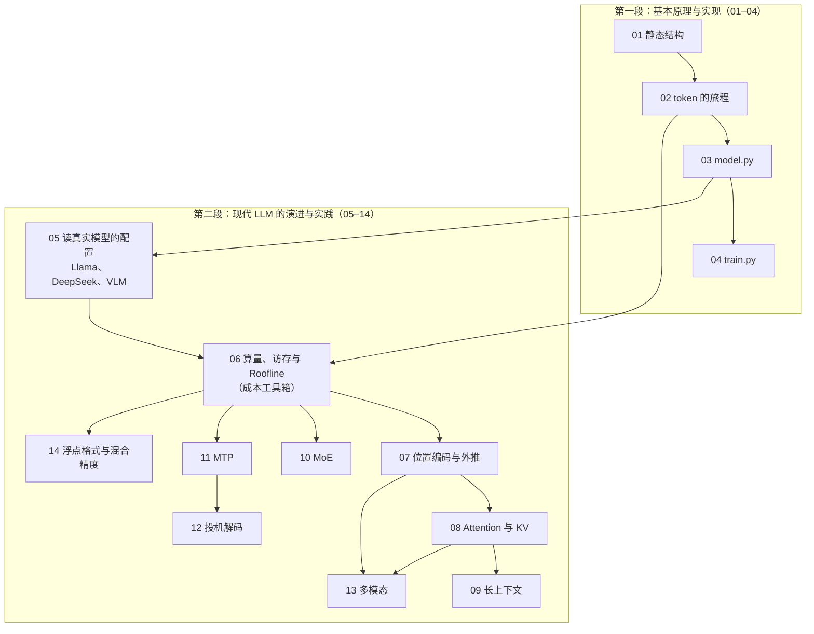
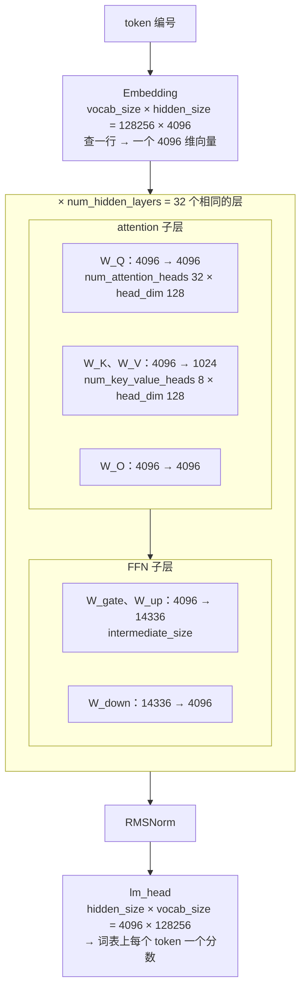

## 内容简介

《Transformer 与 LLM：结构、实现与演进》是一组共十四篇的系列文章，围绕两个问题展开：**一个 GPT 如何工作、如何写出来；现代 LLM 又如何在它的基础上扩展能力、改善质量并调整计算与存储的代价。** 对象是以 decoder-only Transformer 为主干的主流公开模型——GPT-2、Llama-3、DeepSeek-V3，以及接入图片的 VLM。

它分两段：

- **第一段「基本原理与实现」（01–04）**从结构图、训练与推理的数据流出发，用 nanoGPT 的 300 行代码写出并训练一个可运行的模型。
- **第二段「现代 LLM 的演进与实践」（05–14）**以公开模型为案例，先建立一套算成本的工具，再围绕位置表示、KV cache、长上下文、专家模型、训练目标、解码流程、多模态输入与低精度计算，逐项解释每种方法解决什么问题、改变哪些代码、带来什么效果与代价。

成本分析不另设阶段，而是贯穿每一次改造：从张量形状出发，逐步建立参数量、计算量、显存与数据搬运的统一分析方法；同时用小实验或公开实验依据检验收益与适用条件。同一张成本表的训练侧——tokenizer 与词表、算力怎么分给参数与数据、15T token 从哪来、超参表里的数字从哪来——是紧接着的系列[《预训练：从 tokenizer 到训练配方》](/pretraining-from-tokenizer-to-training-recipe.html)的内容；把权重、激活与 KV 压到更少的位（量化）与参数高效微调（LoRA）各有自己的专题系列，见本文末尾。

它回答的问题是：

> **一个大模型内部到底是什么？为什么是这个样子？它的每一步花多少？[^q0]**

读完之后，读者应该能做三件事：

1. **手搓一个 GPT**：不看原文写出 nanoGPT `model.py` 的骨架，在一台笔记本上训出一个能续写莎士比亚的模型，并读懂任何模型的 `modeling_*.py`——先找到 embedding、block、attention 的四个矩阵、FFN、norm、lm_head 这七样东西，再看它改了哪几处；
2. **有底气改结构**：知道 GQA、MLA、RoPE、SwiGLU、MoE、MTP 各在解决什么问题、动了哪几行代码、代价是什么，能在小模型上做一次"改结构 → 改目标 → 看效果"的完整实验；
3. **算出成本表**：拿到一个模型的 `config.json` 和一张 GPU 的规格表，在明确的运行条件（batch、上下文长度、精度）下不运行代码估算它的参数量、每 token FLOPs、KV cache 与 decode 时间下界，判断一个优化在什么区间有效。

### 两段十四篇

| 段 | 篇 | 回答的问题 | 读完能做什么 |
|---|---|---|---|
| I 基本原理与实现 | 01–04 | Transformer 长什么样、一个 token 怎么流过它、300 行怎么写出来并训出来 | 手搓 GPT；读懂 `modeling_gpt2.py` |
| II 现代 LLM 的演进与实践 | 05–14 | 今天的模型相对 GPT-2 改了什么：每一处解决什么问题、实现上变了什么、效果如何、相对基线多算或少搬了什么 | 读懂 `modeling_llama.py` / `modeling_deepseek_v3.py` / VLM 的 config；改结构；算出成本表 |

Table: 系列的两段与各段的目标

第一段面向零基础读者（只要 L0 数学与一点 PyTorch）；第二段假设读者见过第一篇的结构图、第二篇的 prefill / decode 与第三篇的代码，推导逐渐加深。为了不看总纲也能接上，每篇开头都有一段「本篇在系列中的位置」：属于哪一段、接上一篇的什么、回答什么问题。

### 第二段的入口：六个数字

第二段的所有推导都从一个 `config.json` 出发。Llama-3-8B 的 `config.json` 里有六个数字：

- **hidden_size**：4096
- **intermediate_size**：14336
- **num_hidden_layers**：32
- **num_attention_heads**：32
- **num_key_value_heads**：8
- **vocab_size**：128256

先把这六个数字标到模型结构上——每个数字都是图里某个方框的一条边长（第一篇会解释每个方框是什么，第五篇解释它与 GPT-2 差在哪）：

图里有两处容易让人停下来的地方。**$$W_Q$$ 是 4096 → 4096 而 $$W_K$$、$$W_V$$ 是 4096 → 1024**，因为 Q 有 32 个头、K 和 V 只有 8 个头（GQA）：每个头都是 128 维，$$32 \times 128 = 4096$$，$$8 \times 128 = 1024$$，推理时每个 K/V 头被 4 个 Q 头共用——第五篇讲这一处为什么改、第八篇讲它省了多少 KV。**两个 head_dim 128 必须相同吗？** Q 与 K 的必须相同，因为 attention 分数是 $$q \cdot k$$ 的点积，长度不同乘不了；V 的 head_dim 原则上可以不同——它只参与加权求和，输出再由 $$W_O$$ 投回 hidden_size——DeepSeek-V3 的 MLA 就是 Q/K 每头 192 维（128 + 64 维 RoPE 部分）、V 每头 128 维。Llama 这类 GQA 模型三者都取 128，所以 `config.json` 只给一个 `head_dim`。

从这六个数字出发，不需要运行任何代码，可以算出：

- 它有 8.03B 参数，BF16 权重 16.06 GB；
- 每生成一个 token 需要约 15 GFLOPs（不含 attention 对上下文的那部分），而这部分在上下文 8K 时再加 4.3 GFLOPs，128K 时加 68.7 GFLOPs——超过权重那部分；
- 每个 token 的 KV cache 占 128 KiB；如果它没有用 GQA，会是 512 KiB；
- 在一张 H100 上，batch 为 1 的 decode 每步至少要 4.5–4.8 ms，因为要把约 15–16 GB 权重从 HBM 读一遍；要让 Tensor Core 忙起来，batch 得接近三百。

这些推导是第五、六篇的内容，方法是：给出公式、代入公开模型的真实超参数、得到数字，再解释这个数字对系统设计意味着什么。之后每个专项都只算自己相对这条基线的增量。一个 LLM 的成本由四组变量决定，多模态加第五组（训练侧的第六组在预训练系列）：

| 变量组 | 包括 | 在哪几篇 |
|---|---|---|
| 结构变量 | 层数 · hidden · FFN 宽度 · head 数 · KV 头数 · 专家数与 top-k | 第五、八、十篇 |
| 运行变量 | batch · 上下文长度 · prefill 还是 decode | 第六、九篇 |
| 方法变量 | 草稿与接受率 · 验证几个 token | 第十二篇 |
| 模态变量 | 图片分辨率 · patch 与 merge 大小 · encoder 深度 · 注入方式 | 第十三篇 |
| 数值变量 | 每个数占几个字节 · 在哪一步累加 · 误差怎么积累 | 第十四篇 |

Table: 决定一个 LLM 成本的五组变量与对应篇目

## 为什么写这个系列？

### 主流 LLM 共用同一种主干，但"知道它长什么样"和"能写出来"差得很远

今天的主流语言模型——GPT、Llama、Qwen、DeepSeek、Gemma 等公开或半公开其结构的模型——都以 2017 年提出的 Transformer 的 decoder 部分为主干；之后的变化是对部件的替换、增删与重组，没有换掉这个主干。这意味着理解大模型内部只需要先理解一种结构，但也意味着"大概知道 attention 和 FFN 堆起来"远远不够：能优化模型结构、能迭代出更强模型的人，脑子里装的是每个部件承担什么作用、去掉或换掉会怎样、改一处会牵动什么。这种理解的检验标准只有一个——**能不能不看原文把它写出来、训出来**。第一段四篇就是为这个标准设计的：结构图（静态）→ 数据流（动态）→ 代码 → 训练，每一步都可以在笔记本上验证。

### 演进沿着几个方向走，每一处都是对某个具体问题的回答

从 GPT-2 到 Llama 的主要部件变化可归纳为五处（LayerNorm → RMSNorm、位置表 → RoPE、GELU 两矩阵 FFN → SwiGLU 三矩阵、MHA → GQA、去掉 bias），从 Llama 到 DeepSeek-V3 又改了三处（MLA、细粒度 MoE、MTP）。第 05 篇先用真实配置把这些变化放在一张实践地图里，并把 2025 年的 Qwen3、Llama 4、Kimi K2、gpt-oss 放到同一张图上对照；第 07–14 篇再逐项展开。把这些改动按它们回答的问题归类，是四个方向：

| 方向 | 问题 | 改动 | 篇 |
|---|---|---|---|
| 更长的上下文 | 训练长度之外位置还认不认得；上下文拉长后 KV、prefill 与并发被什么限制 | RoPE 的 base 与 YaRN；GQA / MLA；滑窗、交错、sink、稀疏 attention | 07、08、09 |
| 更大的容量、更低的每 token 代价 | 参数量与每 token 算量能不能解耦；每个数能不能少占几个字节 | MoE；FP8 训练与推理 | 10、14 |
| 更密的训练信号、更快的生成 | 同一批数据能不能给更多监督；decode 的串行形态能不能打破 | MTP；投机解码 | 11、12 |
| 更多的输入模态 | 图片、视频、音频怎么变成 decoder 能处理的 token，代价在哪一环 | vision encoder、connector、cross-attention、M-RoPE | 13 |

Table: 第二段的四个演进方向

第四个方向不是从 Llama-3 或 DeepSeek-V3 推出来的：多模态首先是增加能力，不是降低成本。这也是不把"成本"当作第二段唯一视角的原因——位置编码关乎顺序表示和长度泛化，MoE 关乎给定计算预算下的模型容量，MTP 关乎辅助训练信号与生成流程。每篇统一按**问题 → 方法（改了什么、什么没改）→ 实现（形状、公式、最小代码）→ 效果（功能验证、质量指标或公开实验依据）→ 代价（相对基线增减了哪些资源项）→ 边界（什么场景有效）**的顺序讲；不是每篇都给成本表加一列——位置编码、数值稳定性、MTP 更适合给一张验证图或一组对照实验。

### 引擎与 kernel 的一切优化都以模型的算量和访存量为目标

推理引擎的 continuous batching、PagedAttention、prefix caching、PD 分离，训练框架的张量并行、流水并行、专家并行、激活重算，kernel 层的 FlashAttention、融合算子、低精度 GEMM——每一项都是对模型某个成本项的回应。不知道 KV cache 是怎么算出来的，就不理解 PagedAttention 在管理什么；不知道 decode 为什么是 memory-bound 的，就不理解为什么 weight-only 量化对 decode 有效、对 prefill 不保证加速；不知道 MoE 每层只激活 8/256 的专家，就不理解它的部署为什么要考虑 all-to-all 而不只是 all-reduce。第六篇建立这套推导，后面每篇用它：面对一个新模型、新硬件、新方法，可以在看任何 benchmark 之前先算出它**应该**多快，再用测量去解释差距。

### "参数量"只是成本的一个维度

模型卡上通常只有一个数字：参数量。但一个 8B 的 dense 模型、一个 47B 总参数 13B 激活参数的 MoE 模型、一个 671B 总参数 37B 激活参数的 MoE 模型，它们的显存、算量、访存量、通信量之间的关系完全不同：

| | 参数量决定 | 激活参数量决定 | 上下文长度决定 | batch 决定 |
|---|---|---|---|---|
| 显存 | 权重 | — | KV cache | KV cache · 激活值 |
| 算量（FLOPs） | — | 每 token 的 GEMM | attention 项 | 总量 |
| 访存量 | decode 的下界 | — | KV 读取 | 摊薄权重读取 |
| 通信量 | 并行切分 | MoE 的 all-to-all | 序列并行 | — |

Table: 四类成本各由哪个变量决定

每一格都有自己的公式，公式里的变量各不相同。第二段把这张表的每一格填上。

### 现有材料的断层

- **教材与课程**（d2l 10.7、"Let's build GPT"）把结构与代码讲得很好，但止步于 GPT-2 的形态，不讲 GQA、MLA、MoE、MTP 为什么出现，也不算成本；
- **论文**给出了每个方法的定义和实验结果，但假设读者会自己算成本，而且每篇只讲一个方法，读者需要自己把它们放进同一个坐标系；
- **框架文档**（PyTorch、`transformers`、vLLM、Megatron）讲怎么用，把模型当作黑盒；
- **博客**里的"Transformer 数学"多数止步于参数量和 $$6ND$$，不覆盖 MLA、MoE、FP8、投机解码这些当前实践的重心。

本系列想做的是把两段接成一条线：从"能手写一个 GPT-2"到"知道今天的模型为什么不是 GPT-2 的样子、每一处改动花了什么"。取法是：**结构与实现用同一个玩具例子和同一份代码从头到尾验证；每一个演进都放回它解决的问题里讲并给出实现；每一个成本都放回同一张成本表里讨论，用同样三个模型、同一张 GPU 的数字**。

## 适合哪些读者？

### 想真正理解大模型内部、并且亲手写一个的人

你可能是算法方向的学生或转行者，读过 attention 的公式但从没把一个 Transformer 从头写出来、训出来。第一段四篇按"图 → 数据流 → 代码 → 训练"的顺序，每一步都有可以在笔记本上跑的代码和数字，不需要 GPU。

### 设计或调整模型结构的算法工程师

你在选 GQA 组数、选 MoE 的专家粒度、选 RoPE 的 base、决定是否用 MLA 或 MTP。第二段告诉你每个选择在解决什么、动了哪几行、效果如何，并把代价算成显存、算量、访存、通信的数字，让结构设计和硬件效率在同一张表上讨论。

### 做推理系统与训练基础设施的工程师

你在配置或改造 vLLM、SGLang、Megatron、DeepSpeed 这类系统，需要判断：这个模型在这几张卡上该怎么切、batch 和上下文的上限在哪、投机解码的收益上界是多少、MoE 该用 EP 还是 TP 还是两者组合。第六篇给的是你做这些判断时要用的公式，各专项篇给的是数字；第一段是理解这些公式的前提——如果你已经熟悉结构，可以从第五篇进入。

### 写 kernel 的工程师

你要优化的 attention、GEMM、MoE、量化 kernel 的输入 shape 和访存模式都来自模型结构。理解 GQA 的组数如何改变 decode attention 的算术强度、MLA 的矩阵吸收如何把 attention 变成一个大 head dim 的 MQA、MoE 的 grouped GEMM 的 M 维为什么这么小，才知道该往哪个方向优化。

### 从后端转向 AI-Infra、需要一份"模型知识最小集"的工程师

你不打算成为算法工程师，但读引擎源码、看性能报告、参加技术讨论时，需要知道 head、layer、KV cache、prefill、decode、MoE、FP8 这些词背后的数量关系。第一、二篇加第六篇是为此准备的最小集。

## 系列的整体主线

两段各回答一个问题：第一段问 GPT-2 怎么工作、怎么写；第二段问今天的模型改了什么、为什么、花了什么。第二段的入口是第五篇的参数量与第六篇的算量、字节与时间——后面每个专项都只算自己相对这条基线的增量：GQA / MQA / MLA 改的是 attention 的形状，省下的是 KV cache；MoE 改的是 FFN，换来的是激活参数与 all-to-all 通信；MTP 改的是训练目标，多出来的是一个模块和一个损失项；投机解码改的是解码流程，用空转的算力换 token；多模态改的是输入，多出来的是 encoder 算量与 image token 的 KV；浮点格式改的是每个数占几个字节。贯穿全系列的模型实例是 GPT-2 small（第一段）→ Llama-3-8B / 70B（dense、GQA）→ DeepSeek-V3（MLA、MoE、FP8、MTP）→ Mixtral 8x7B（粗粒度 MoE）→ LLaVA-1.5 / Qwen2-VL / Llama-3.2-Vision（多模态）。

第一段的每一篇都用同样的方法：**画出图，写出代码，跑出数字，与 PyTorch / HuggingFace 对拍**。第二段的每一篇都用同样的方法：**写出公式，代入真实模型的超参数，算出数字，解释数字对系统意味着什么，再用小实验或公开实验依据检验**。

## 章节结构与分章导读

### 1. Transformer 长什么样：从一句话到下一个 token

第一篇是静态线。把一个 decoder-only Transformer 里的每个方框打开：embedding 查表、位置信息、attention、FFN、残差与 LayerNorm、lm_head——每个部件先讲它承担什么作用（去掉会失去什么），再讲它是什么、怎么算。全篇用一个 $$d = 4$$、3 个 token 的例子把 attention 的六步**手算**出来并与 PyTorch 对拍，再用 GPT-2 small 的真实数字对照；附 GPT-2 两个真实 attention 头的热力图、换序实验（attention 不知道顺序）、$$\sqrt d$$ 的方差表、GPT-2 small 1.24 亿参数的逐项数法，以及与 d2l 10.7 那张 encoder-decoder 图的对照——cross-attention 去哪了、为什么 GPT 只留 decoder。

> **一个 token 的编号进入模型，到词表上的一个概率分布出来，中间经过了哪些运算？每一个运算承担什么作用、去掉会怎样？[^q1]**

### 2. 一个 token 的旅程：训练侧与推理侧

第二篇是动态线。训练侧：$$T + 1$$ 个连续 token → 输入与右移一位的目标 → 一次前向得到 $$[B, T, V]$$ 的 logits → $$T$$ 个交叉熵 → 反向沿原路给每个参数梯度 → AdamW 一步；为什么一次前向能同时得到 $$T$$ 个训练信号（causal mask + teacher forcing）、为反向保存的激活值为什么与 $$B \times T$$ 成正比。推理侧：prefill（同训练前向，只取最后位置）与 decode（每步一个 token）；KV cache 为什么可行、省了什么、花了什么——用一个自带 cache 的极小 GPT 实测有 / 无 cache 输出逐 token 一致、生成 256 个 token 快 7.9 倍。末尾一张训练 / prefill / decode 三种形态的对照表。

> **训练时一句话的 $$T$$ 个 token 进入模型，为什么一次前向就能得到 $$T$$ 个训练信号？推理时为什么前面的 token 不用重算？[^q2]**

### 3. 手搓 GPT（上）：nanoGPT model.py 逐行解析

第三篇把前两篇的两条线（静态线与动态线）变成代码：Karpathy 的 nanoGPT `model.py`，330 行、6 个类。每段代码说三件事——对应结构图的哪个方框、在训练 / 推理的哪一步执行、为什么这么写：Q / K / V 为什么合成一个 $$d \to 3d$$ 的矩阵、`view` + `transpose` 怎么拆头、mask 为什么叫 `bias`、`c_proj` 的初始化为什么除 $$\sqrt{2L}$$、推理时为什么只算最后一个位置的 lm_head、`generate` 的温度 / top-k / 采样、`from_pretrained` 怎么把 OpenAI 的权重搬进来（与 HuggingFace 对拍相对差 $$9 \times 10^{-5}$$）、`configure_optimizers` 为什么只对二维参数做 weight decay、`estimate_mfu` 的 $$6N + 12LHQT$$。末尾一张 nanoGPT / HF GPT-2 / Llama 的名字对照表——Llama 相对 GPT-2 只改了五处。

> **一个能加载 GPT-2 权重、能训练、能生成的 Transformer，最少需要写哪些东西？[^q3]**

### 4. 手搓 GPT（下）：nanoGPT train.py 与训一个会续写的模型

第四篇补上数据与训练循环：`prepare.py` 把文本变成 `uint16` 数组；`train.py` 336 行按块过——配置与 `configurator.py`、`get_batch` 的随机窗口、三种模型来源（从零 / 续训 / GPT-2 权重）、GradScaler / 优化器 / `compile` / DDP 四层包装、warmup + cosine、训练循环里的梯度累积、预取、DDP 只在最后一步同步、裁剪、checkpoint 五样。然后在一台 MacBook 上用莎士比亚全集训 2000 步（7 分钟）：loss 从 $$\ln 65 = 4.17$$ 到 1.66、输出从乱码到有莎士比亚的格式；再只改层数 2 / 4 / 8 各训一次——参数量与每步耗时随层数线性增长、loss 收益递减，第一次亲手"改结构看后果"。末尾一张"nanoGPT 有的与真实预训练多出来的"对照表。

> **从一个 1.1 MB 的文本文件到一个能续写它的模型，中间每一步的代码在哪、为什么那样写？把层数从 4 改到 2 或 8，loss 和速度各会怎样？**

### 5. 从 GPT-2 到 Llama 与 DeepSeek：读真实模型的配置与参数量

第五篇先读真实模型的配置：GPT-2 到 Llama 的五处变化、DeepSeek-V3 的 MLA / MoE / MTP、VLM 的图像接口各是什么、为什么改、后续在哪里展开，再把 2025 年的 Qwen3、Llama 4、Kimi K2、gpt-oss 放到同一张地图上对照——它们没有引入新的部件类型，只是换了组合与配置。RMSNorm、SwiGLU、去 bias 没有专篇，在这里讲透；GQA 只保留参数量所需的 KV 投影宽度，原理交给第八篇。然后是参数量公式 $$N \approx L \cdot [d (d + 2 d_{kv} + d) + 3 d \, d_{ff}] + 2 V d$$，逐项代入 Llama-3-8B（attention 每层 41.9M，FFN 每层 176.2M，32 层共 6.98B，embedding 与 lm_head 各 525M，合计 8.03B）、70B 与 405B 验证；dense 模型里 FFN 占每层参数约 80%，embedding 在小模型里占比很高（8B 的 13%）而在大模型里可以忽略；最后对照 `modeling_llama.py` 把每个 `nn.Linear` 的形状与公式一一对应。

> **给你任意一个模型的 `config.json`，不运行代码，能不能在五分钟内算出它的参数量，并说出这些参数在 attention、FFN、embedding 之间怎么分配？误差要在 1% 以内。[^q4]**

实践：写一个读 `config.json` 输出逐层参数表的脚本，用 Llama-3-8B、Llama-3-70B 验证到与官方公布的参数量一致。这个脚本会在后面每一篇里长出新的列。

### 6. 前向的算量与访存量：prefill、decode 与 Roofline

第六篇是第二段共用的成本工具箱：把第五篇数出的每一个矩阵乘换成时间。一个 $$[m, k] \times [k, n]$$ 的矩阵乘是 $$2mkn$$ FLOPs，于是前向约 $$2N$$ FLOPs / token、训练约 $$6N$$；attention 对上下文的那部分每层每 token $$4ds$$，8K 时 4.3 GFLOPs，128K 时 68.7 GFLOPs，超过权重的 15 GFLOPs。prefill 一次处理 $$s$$ 个 token，decode 每步只处理 $$B$$ 个——同一组矩阵、两种 GEMM 形状。访存量：权重每步读一遍（Llama-3-8B 约 15–16 GB），KV cache 每步读一遍（每 token 128 KiB × 上下文 × batch）。Roofline：算术强度 $$I = \text{FLOPs} / \text{bytes}$$，H100 的 ridge point 约 295 FLOP/byte；decode 权重 GEMM 的强度约等于 $$B$$，$$B = 1$$ 时差两个数量级——这就是"decode 是 memory-bound 的"的全部含义。时间下界：decode 每步约 4.5–4.8 ms（约 220 token/s 的单请求上限）；8K prefill 按因果三角约 140 TFLOP（不利用掩码约 158），峰值下 0.14–0.16 s，按 60% 的经验 MFU 约 0.24–0.27 s——注意"causal mask 让算量减半"要实现确实跳过被掩码区域才成立，完整矩阵乘完再加 mask 不会省下这部分 FLOPs。文末的训练侧一节（激活值显存 $$sbh(34 + 5as/h)$$、重算、MFU 与 HFU）只在训练相关篇目用到，第一遍可跳过。

> **Llama-3-8B 在一张 H100 上，batch 多大时 decode 从 memory-bound 变成 compute-bound？考虑 KV cache 之后，这个 batch 还能达到吗？**

实践：脚本增加 FLOPs 与字节数两列，输入 batch、上下文长度和硬件参数，输出 prefill 和 decode 的理论时间下界；与 vLLM 或 `transformers` 实测对比，解释差距。

### 7. 位置编码与外推

位置编码首先解决顺序与相对距离的表示，不是专为长上下文发明。第七篇从不带位置与掩码的 attention 的置换等变性出发，比较位置表、正弦编码与 RoPE，推导旋转点积里的相对位置和各维度的波长，再看 PI、NTK-aware、YaRN、Llama 3.1 分段缩放与 ALiBi。这里的**外推**（length extrapolation）指在比训练时更长的序列上推理：位置方案约束位置能否外推，但并不独自决定长文理解质量，也不消除长上下文的计算成本。

> **一个用 8K 训练的 RoPE 模型，为什么不能保证直接推理 32K？改 base 解决了什么？[^q5]**

实践：用 NumPy 验证 RoPE 的相对性，对照三种缩放方法的波长与频率变化。

### 8. Attention 变体与 KV cache：MHA、GQA、MQA 与 MLA 的推导

第八篇专门讲 attention，因为它是 Transformer 里唯一成本随上下文长度增长的部分，也是过去几年结构改动最集中的地方。每一种变体都是在同一个目标下做取舍：**减少每个 token 的 KV cache 字节数，同时尽量不损失质量**。GQA 在第三篇的 `CausalSelfAttention` 上只改三处（K/V 投影变窄、按 $$n_{kv}$$ 拆头、`repeat_interleave` 对齐），MQA 是 $$n_{kv} = 1$$；KV cache 每 token $$2 L n_{kv} d_{head} \cdot \text{bytes}$$——Llama-3-8B 若是 MHA 是 512 KiB，GQA 压到 128 KiB，70B 为 320 KiB，128K 上下文时分别 16 GiB 和 40 GiB；GQA 还把 decode attention 的算术强度从约 1 提到约 $$g = n_h / n_{kv}$$。MLA 把 K 和 V 联合压缩到一个 512 维的 latent 外加 64 维的解耦 RoPE key，每 token 每层只缓存 576 个数，DeepSeek-V3 的 61 层每 token 约 68.6 KiB——128 个 head 却比 Llama-3-8B 还小；推理时的矩阵吸收让 attention 在 kernel 层等价于一个大 head dim 的 MQA；为什么 RoPE 与低秩压缩不兼容、要单独缓存，用的是第七篇的结论。末尾讲 FlashAttention 的 IO 复杂度（只推导、不讲 kernel）。

> **DeepSeek-V3 有 128 个 attention head、61 层，KV cache 却比 32 头 32 层的 Llama-3-8B 小。这是怎么做到的？代价是什么？**

实践：脚本增加 KV cache 列，支持 MHA / GQA / MQA / MLA 四种模式；给定显存预算，输出各模型在不同上下文长度下的最大并发数。

### 9. 长上下文的成本与结构手段

第九篇承接第七篇的外推与第八篇的 KV，换一个问题：即使位置能够外推，显存、TTFT 与并发仍被什么限制？KV cache 随长度线性增长，整段 prefill attention 的算量二次增长；FlashAttention 避免物化 logits，却不消除全局 attention 的二次算量。这一篇把 sliding window、全局 / 局部交错、attention sink、块稀疏逐项代入成本表，区分"改变可见位置""压缩 KV 表示"和"减少中间量 IO"；再连接到 chunked prefill 与序列并行的动机。

> **一个 128K 请求贵在哪里？滑窗把哪项改成了什么函数？[^q6]**

实践：扫描上下文长度，计算每条请求的 KV、prefill FLOPs 与 attention 占比。8B 在 128K 下约 16 GiB KV，prefill 6.5 PFLOP，60% MFU 单卡等效约 11 秒。

### 10. MoE：路由、激活参数量与通信形态

第十篇讲混合专家模型。MoE 把"参数量"与"每 token 算量"解耦，是在给定计算预算下扩大模型容量的主流路线；它也把一个新的成本项——专家之间的通信——引入了模型前向。内容：一个最小 MoE 层的实现（router、top-k、专家计算、共享专家），把第三篇的 `MLP` 换成它；两种粒度（Mixtral 8x7B 的 8 个宽专家取 top-2，DeepSeek-V3 的 256 个窄专家取 top-8 加 1 个共享专家）；参数量与激活参数量（V3 总参数约 671B、每 token 激活 37B）；算量按激活参数算、显存按总参数算；decode 时的访存形态——在独立、均匀路由的假设下，batch 为 $$B$$ 时期望被激活的专家数为 $$E [1 - (1 - k/E)^B]$$，V3 在 $$B = 32$$ 时约 163 个、$$B = 128$$ 时约 252 个，中等 batch 下读取的专家集合扩大、权重流量上的稀疏收益减弱；专家并行（EP）的两次 all-to-all 与字节数，EP 与 TP 的对比及两者的组合（是否跨卡 all-to-all 取决于部署方式）；grouped GEMM 的 $$M$$ 维为什么小；负载均衡的三种做法。

> **DeepSeek-V3 每 token 只算 37B 参数，为什么部署它比部署一个 dense 70B 难得多？把"参数量"、"激活参数量"、"每步实际读取的参数量"三个数分开算。**

实践：脚本增加 MoE 支持——总参数、激活参数、给定 batch 下期望激活的专家数、EP 下每层的 all-to-all 字节数；用 Mixtral 8x7B 与 DeepSeek-V3 的公开超参验证。

### 11. MTP：改训练目标、不改主干的多 token 预测

第十一篇是第二段里改**训练目标**的一篇：它不改主干，但增加训练时的模块与一个损失项。next-token 每个位置只有一份监督信号、只学一步远；MTP 让位置 $$i$$ 额外预测 $$t_{i+2}$$，并逼主干表示编码更远的未来。讲 DeepSeek-V3 的顺序 MTP 模块（两个 RMSNorm + 一个 $$2d \to d$$ 投影 + 一个 block，embedding 与 lm_head 与主干共享；顺序模块接收移位后的真实 token 信息，不只是凭原位置表示预测两步以外）、$$\mathcal L = \mathcal L_{\text{main}} + \lambda \bar{\mathcal L}_{\text{MTP}}$$、顺序为什么优于并行头、推理时丢弃或当投机解码的 draft（技术报告：接受率 85–90%，TPS 约 1.8 倍）。在第四篇的 nanoGPT 上挂一个 MTP 模块做对照实验：0.8M 参数的小模型上主任务无变化（一次小实验既不能证明也不能否定它在大模型上的收益）、MTP 头对下下个字符命中 45%、代价 +29% 参数、每步 +38% 时间。

> **每个位置多预测一个 token，训练时多花了什么、可能多得到什么？DeepSeek-V3 的 MTP 模块为什么要"顺序"而不是"并行"，推理时它去哪了？**

### 12. 投机解码：草稿、验证与收益条件

第十二篇承接第十一篇的 MTP 与第六篇的 memory-bound decode：既然小 batch 时多算几行几乎不花时间，就先用一个便宜的草稿猜 $$\gamma$$ 个 token，再由目标模型一次前向验证。推导接受 / 拒绝重采样的分布等式（输出分布严格等于目标模型，草稿只影响效率）、期望产出 $$\frac{1 - \alpha^{\gamma+1}}{1 - \alpha}$$ 与加速比（$$\alpha = 0.8$$、$$\gamma = 4$$、草稿成本 10% 时约 2.4×）、验证 $$\gamma + 1$$ 个 token 为什么几乎免费又在 $$B \gtrsim \text{ridge}/(\gamma+1) \approx 60$$ 后失效甚至低于 1；草稿从哪里来——独立小模型、Medusa、EAGLE、n-gram、MTP 模块——MTP 模块只是草稿来源之一，不是投机解码的必要条件。

> **同一套投机解码，为什么 batch 1 时加速 2 倍，batch 64 时没有收益？[^q7]**

实践：脚本增加时间模型与期望加速比，扫描 batch 得到转折点。

### 13. 多模态：vision encoder 的算量与 image token 的 KV 代价

第十三篇把输入从 token id 扩展到图片、视频与音频。前面所有的账都以"token 数由 tokenizer 决定"为前提；多模态模型把一张图先送进一个独立的 vision encoder（ViT），再由 connector 变成几百到几千个 token 插进 prompt。于是多了三笔账：encoder 自己的算量（ViT 参数量 $$\approx 12 L_{vit} d_{vit}^2$$，一张图 $$2 N_{vit} n_p + 4 L_{vit} n_p^2 d_{vit}$$ FLOPs）、connector 决定的 token 数（MLP projector 不压缩、2×2 merge ÷4、Perceiver / Q-Former 定长；同一张 1024² 的图从 576 到 6404 个 token）、这些 token 进入 decoder 后与文本 token 完全相同的 prefill FLOPs 与 KV cache。本篇只保留一个从预处理到 decoder 的完整案例（Qwen2-VL 风格、1024² → 37 × 37 = 1369 个 token，放到 70B 规格的 decoder 上），其他模型做对照表；再看 cross-attention 注入（Llama 3.2 Vision）、M-RoPE、视频与音频的 token 数，以及训练侧冻结 encoder 省的是什么。编码器怎么选、connector 与注入方式的设计动机、VLM 怎么训练，在算法地图的[《多模态》系列](/multimodal-from-vision-encoders-to-diffusion.html)。

> **一张 1024×1024 的图片在 Qwen2-VL 里等于多少个 token？为什么"encoder 输出只有 21 MB"与"这张图在 decoder 里占 400 多 MB 显存"两句话同时成立？[^q8]**

实践：脚本增加 vision encoder 的参数与 FLOPs、image token 数、image token 在 decoder 中的三个字节数；成本表新增"一张 1024² 图片"一行，按三种注入方式对照。

### 14. 浮点格式、数值稳定性与混合精度

第十四篇从"每个数占几个字节"进入"每个字节里存了什么"。前面各篇的字节数估算以 BF16 的 2 字节为默认；这一篇解释为什么是 BF16，以及把它换成 FP16、FP8、INT8 时数值上会发生什么。浮点格式的位布局（FP32 / TF32 / FP16 / BF16 / E4M3 / E5M2 / INT8 / INT4）与各自的最大值、最小正规数、机器精度：BF16 与 FP32 同范围，相邻可表示数在 1 附近的间隔是 $$2^{-7}$$、舍入到最近值的单位舍入误差是 $$2^{-8}$$；**BF16 牺牲尾数精度换取更大的表示范围**，FP16 反之，深度学习几乎总是选范围。数值在哪些地方丢失（大数吃小数、长求和、softmax 的指数溢出、方差的相消）；累加精度与 Tensor Core 的 FP32 累加器，FP8 Tensor Core 累加精度有限、DeepSeek-V3 每 128 个元素提升到 FP32；混合精度训练为什么能工作、master weights 为什么不能省（Adam 单步更新 $$10^{-4}$$–$$10^{-3}$$ 量级低于 BF16 的 $$2^{-8}$$）、FP16 的 loss scaling；训练状态每参数 16 字节，8B 全量训练 128 GB；FP8 训练的 E4M3 / E5M2 分工与分块 scaling；推理中的数值（QK-norm、RMSNorm 的 $$\epsilon$$、两个 kernel 的差异该多大、非确定性）。它是两条线的交接处：训练状态接到预训练与大规模训练系列，低比特表示接到高效推理的量化篇。

> **BF16 的相对精度只有 FP16 的 1/8，为什么它反而成了训练的默认格式？把它同时用在权重更新上会出什么问题？**

实践：用 NumPy / PyTorch 逐位构造各种格式的数，验证最大值、最小值和机器精度；模拟一个 BF16 权重更新被吃掉的过程；对同一个 GEMM 用 FP32 / BF16 / FP8 计算并度量误差随 $$k$$ 的增长。

### 系列总结与通关自测

最后一篇不讲新内容：把十四篇正文压成一张「问题 → 结论 → 必记数字」的表并逐篇回顾，拎出贯穿全系列的几条线与常见误区，然后给一套三段式通关自测——判断与计算、跨篇综合、面试题，答案各自折叠，附「读过 / 掌握 / 能教人」的判据。各篇末尾的自测检验的是一篇读懂了没有，这一篇检验的是十四篇能不能连起来用；读完正文再做。

## 贯穿全系列的实践线

第一段的贯穿物是**一份能跑的代码**：第一篇的 `attention_by_hand.py`（手算与对拍）、第二篇的 `token_journey.py`（带 KV cache 的极小 GPT）、第三篇的 `nanogpt_walkthrough.py`（vendored 的 nanoGPT 与 HuggingFace 对拍）、第四篇的 `nanogpt/`（实训脚本与 2 / 4 / 8 层的日志）、第十一篇的 `mtp_nanogpt.py`（MTP 对照实验）。第二段的贯穿物是**一张成本表和一组生成它的推导脚本**。脚本从第五篇的参数量开始，每篇增加几列，到第十四篇结束时可以为任何一个给出 `config.json` 的模型、任何一组硬件参数输出（预训练系列再加上训练侧的四列）：

- **第五篇**：参数量；逐层、逐矩阵；attention / FFN / embedding 的分布
- **第六篇**：FLOPs · 字节数；prefill 与 decode 的理论时间下界；Roofline 位置
- **第八篇**：KV cache；MHA / GQA / MQA / MLA；给定显存的最大并发
- **第九篇**：长上下文；上下文长度 → KV cache、prefill FLOPs、attention 占比
- **第十篇**：MoE；总参数 · 激活参数 · 期望激活专家数 · all-to-all 字节数
- **第十二篇**：投机解码；时间模型、期望产出与加速比随 batch 的曲线
- **第十三篇**：多模态；ViT 参数与 FLOPs；image token 数；image token 的 prefill FLOPs 与 KV
- **第十四篇**：精度；各格式的字节数与训练状态；误差随累加长度的增长

三个模型贯穿第二段：**Llama-3-8B** 与 **Llama-3-70B** 代表 dense + GQA 的主流结构，**DeepSeek-V3** 代表 MLA + 细粒度 MoE + FP8 的另一条路线；Mixtral 8x7B 在 MoE 一篇作为粗粒度专家的对照；第十三篇加入 LLaVA-1.5、Qwen2-VL、Llama-3.2-Vision 三个多模态模型，把"一张图"作为一行放进同一张表。每篇算出的数字都会填进同一张表，读者在第十四篇结束时手上有一张这些模型在 H100 上的完整成本对照。表的骨架大致如下（BF16，H100 SXM，数字为理论值）：

|  | Llama-3-8B | Llama-3-70B | DeepSeek-V3 |
|---|---|---|---|
| 参数量 | 8.03B | 70.6B | 671B（激活 37B） |
| 权重字节数（BF16） | 16.1 GB | 141 GB | 1342 GB（FP8 为 671 GB） |
| 每 token 权重 FLOPs | ~15 GFLOPs | ~141 GFLOPs | ~74 GFLOPs |
| KV cache / token | 128 KiB | 320 KiB | 68.6 KiB |
| 128K 上下文的 KV cache | 16 GiB | 40 GiB | 8.6 GiB |
| batch 1 decode 时间下界 | 4.8 ms（单卡） | 不能单卡 | 不能单卡 |
| 投机解码 α=0.8 γ=4 | 2.4×（B ≲ 60） | 2.4×（B ≲ 60） | MTP 草稿 ~1.8× |

Table: 贯穿全系列的三个模型：参数量、权重字节、FLOPs、KV cache 与投机解码

脚本的价值不在这几个数字本身，而在换一个模型、换一张卡、换一种精度之后能立刻重算。

与它平行的源码与资料阅读线：

- **第一至四篇**：d2l 10.7 · Karpathy nanoGPT（model.py、train.py）· transformers modeling_gpt2.py · Radford 等 2019（GPT-2）
- **第五篇**：transformers modeling_llama.py · Llama-3 的 config.json · Qwen3 / Llama 4 / Kimi K2 / gpt-oss 的 config.json
- **第六篇**：Kaplan 等 2020 与 Hoffmann 等 2022（scaling laws）的 FLOPs 估算；Korthikanti 等 2022（激活重算）
- **第七篇**：Su 等 2021（RoPE）· Chen 等 2023（Position Interpolation）· Peng 等 2023（YaRN）· Press 等 2021（ALiBi）
- **第八篇**：Shazeer 2019（MQA）· Ainslie 等 2023（GQA）· DeepSeek-V2 论文的 MLA 章节 · FlashAttention 论文的 IO 复杂度分析
- **第九篇**：Mistral 7B · Gemma 2 · Xiao 等 2023（StreamingLLM）
- **第十篇**：Fedus 等 2021（Switch Transformer）· Mixtral 与 DeepSeek-V3 的技术报告 · transformers 的 modeling_deepseek_v3.py
- **第十一篇**：Gloeckle 等 2024（多 token 预测）· DeepSeek-V3 技术报告的 MTP 章节
- **第十二篇**：Leviathan 等 2023 与 Chen 等 2023（投机解码）· Cai 等 2024（Medusa）· Li 等 2024（EAGLE）
- **第十三篇**：Dosovitskiy 等 2020（ViT）· Liu 等 2023（LLaVA-1.5）· Qwen2-VL 与 Qwen2.5-VL 技术报告 · Alayrac 等 2022（Flamingo）· Llama 3.2 Vision 与 InternVL2 的 config.json
- **第十四篇**：Micikevicius 等 2017（混合精度）· Micikevicius 等 2022（FP8 格式）· DeepSeek-V3 技术报告的 FP8 训练章节

第一段的五个脚本、`llm_cost.py` 的各版（历史版本号保留，各自独立可运行；第 07 版同时带量化与 LoRA 两组函数，它们的讲解已归入对应专题系列）与各篇的独立实验（RoPE、最小 MoE 层、浮点格式、MTP）保存在 [ai-learning-labs/transformer-and-llm](https://github.com/arganzheng/ai-learning-labs/tree/main/transformer-and-llm)，附每个脚本的完整输出。

## 前置要求与说明

### 前置要求

- L0 数学系列的前五篇：矩阵乘法的形状规则、内积、softmax 与交叉熵——第一篇的手算只用到这些；
- 会读 Python 与 PyTorch 代码：能看懂 `nn.Linear`、`torch.matmul`、`softmax` 的调用（工具箱第三篇的二十行训练循环是第四篇的前身）；
- 第二段另需：知道 GPU 有算力和带宽两个上限，见过"memory-bound / compute-bound"这两个词（第六篇会从头建立 Roofline，不假设读者用过）。

不要求：

- 见过 Transformer 的结构图或 attention 的公式——第一篇从头讲；
- 训练过模型——第四篇带你训第一个；
- 了解 GQA、MLA、MoE、RoPE、FP8 等任何一个具体方法；
- 写过 CUDA；
- 有 GPU。第一段的全部代码在 CPU 上几分钟内跑完（第四篇的实训在一台 MacBook 上 7 分钟）；第二段的推导可以在纸上完成，实践部分的验证需要一张能放下 8B 模型的 GPU，没有也不影响阅读。

### 版本与模型基线

- 模型：第一段以 **GPT-2 small**（12 层、$$d = 768$$、12 头、上下文 1024、词表 50257，1.24 亿参数）与 nanoGPT 的 shakespeare_char 配置为实例；第二段以 **Llama-3-8B / 70B**（Llama 3 与 3.1 结构相同，$$d = 4096 / 8192$$，32 / 80 层，GQA 8 个 KV 头，$$d_{head} = 128$$，vocab 128256）和 **DeepSeek-V3**（$$d = 7168$$，61 层，128 头，MLA 的 $$d_c = 512$$、$$d_h^R = 64$$，256 个路由专家 + 1 个共享专家取 top-8，专家 $$d_{ff} = 2048$$）为主要分析对象，超参数取自各自公开的 `config.json` 与技术报告；Mixtral 8x7B 在 MoE 一篇作为对照；第五篇的 2025 年对照表只读配置、不重算；多模态一篇以 **LLaVA-1.5-7B**（CLIP ViT-L/14-336）、**Qwen2-VL-7B / Qwen2.5-VL-7B**（32 层 d=1280 的 ViT，2×2 merge，M-RoPE）与 **Llama-3.2-11B-Vision**（cross-attention 注入）为分析对象，InternVL2-8B 作为 tile 方案的对照，超参数取自各自的 `config.json`；
- 硬件：以 **H100 SXM** 为默认（80 GB HBM3，3.35 TB/s，BF16 dense 约 989 TFLOPS，FP8 dense 约 1979 TFLOPS），必要处标注 **A100**（80 GB，约 2 TB/s，BF16 约 312 TFLOPS）；这些是公开标称值，实测会因型号、频率与功耗设置有差异；
- 计量约定：文中的数字分四类，不要混用——**参数计数**（从 config 数出来的）、**算法工作量**（按 $$2mkn$$ 数出来的 FLOPs，不含任何实现开销）、**理想流量**（权重与 KV 各读一遍的字节数）、**性能下界**（前两者除以标称算力与带宽）。它们用于建立数量级判断与相互比较，不是任何具体实现的实测值；实测与下界的差距本身就是本系列要教读者解释的东西；
- 论文引用以第一作者与年份标注；方法本身比它们在某个框架中的实现稳定，正文只在必要处提及 vLLM、Megatron、Transformer Engine 等项目中的对应实现。

## 章节目录

**第一段：基本原理与实现**

1. [Transformer 长什么样——从一句话到下一个 token](/transformer-architecture-from-a-sentence-to-the-next-token.html)
2. [一个 token 的旅程——训练侧与推理侧](/transformer-token-journey-training-and-inference.html)
3. [手搓 GPT（上）——nanoGPT model.py 逐行解析](/nanogpt-model-py-line-by-line.html)
4. [手搓 GPT（下）——nanoGPT train.py 与训一个会续写的模型](/nanogpt-train-py-and-training-a-model-that-writes.html)

**第二段：现代 LLM 的演进与实践**

5. [从 GPT-2 到 Llama 与 DeepSeek——读真实模型的配置与参数量](/transformer-anatomy-and-parameter-count.html)
6. [前向的算量与访存量——prefill、decode 与 Roofline](/transformer-flops-bytes-and-roofline.html)
7. [位置编码与外推](/positional-encoding-and-long-context.html)
8. [Attention 变体与 KV cache](/attention-variants-and-kv-cache.html)
9. [长上下文的成本与结构手段](/long-context-cost-and-structural-remedies.html)
10. [MoE 的路由、激活参数量与通信形态](/moe-compute-and-communication.html)
11. [MTP——改训练目标、不改主干的多 token 预测](/multi-token-prediction-mtp.html)
12. [投机解码——草稿、验证与收益条件](/speculative-decoding-draft-verify-and-payoff.html)
13. [多模态：vision encoder 的算量与 image token 的 KV 代价](/multimodal-vision-encoder-cost-and-image-token-kv.html)
14. [浮点格式、数值稳定性与混合精度](/floating-point-formats-and-mixed-precision.html)

[系列总结与通关自测](/transformer-and-llm-series-recap-and-self-test.html)

**相邻的专题系列**（原本在本系列里的两块内容已并入它们）：

- 量化——权重、激活与 KV cache 少用几位：[《高效推理与压缩（算法侧）》](/efficient-inference-and-compression-for-llms.html)第 03 篇起（收益区间与 Roofline 账在第 03 篇第二章）
- LoRA——参数高效微调的四本账与上线：[《LoRA 专题》](/lora-for-sft-from-low-rank-hypothesis-to-serving.html)
- 训练侧的成本表——tokenizer、算力分配、数据与配方：[《预训练：从 tokenizer 到训练配方》](/pretraining-from-tokenizer-to-training-recipe.html)

## 最终目标

读完这套系列之后，读者应该能够回答：

- Transformer 里每个部件承担什么作用？去掉会怎样？：→ 第一篇
- 训练时一次前向为什么能得到 $$T$$ 个信号？推理时 KV cache 存了什么？：→ 第二篇
- 一个能加载 GPT-2 权重的 Transformer 最少要写什么？：→ 第三篇
- 训练循环里每一行为什么在那里？改层数会怎样？：→ 第四篇
- Llama 相对 GPT-2 改了哪五处、为什么？它有多少参数，分布在哪里？：→ 第五篇
- 每个 token 多少 FLOPs？prefill 和 decode 各是什么瓶颈？batch 开到多大才能把算力用起来？：→ 第六篇：Roofline
- 一张卡放得下吗？放下之后还剩多少显存？：→ 第五篇、第八篇：权重与 KV cache
- 支持多长的上下文？代价在哪一项？：→ 第七至九篇：位置外推、KV cache 与二次项
- 它的 attention 变体让 kernel 长什么样？：→ 第八篇：GQA 的组、MLA 的吸收
- 如果是 MoE，多卡之间要传多少数据？：→ 第十篇：all-to-all 字节数
- MTP 多花了什么、多得了什么？投机解码值得开吗？：→ 第十一、十二篇
- 一张图等于多少 token？贵在哪一环？：→ 第十三篇
- 用什么精度？哪一步可能出数值问题？：→ 第十四篇：格式与累加

最终目标是四种能力：

1. **实现能力**：不看原文写出一个 GPT 的骨架并训出来；读任何 `modeling_*.py` 先找到七样东西再看差别；
2. **推导能力**：面对一个新模型或新方法，不依赖 benchmark，先算出它的参数量、算量、访存量、显存和通信量的理论值；
3. **判断能力**：用这些数字判断一个结构改动值不值、一个优化在什么区间有效、一个部署方案的瓶颈在哪一项、一个实测结果离理论下界差多远；
4. **对话能力**：与算法工程师讨论结构选择、与 kernel 工程师讨论输入 shape、与平台工程师讨论资源需求时，用同一张图和同一张成本表说话。

紧接着的[《预训练：从 tokenizer 到训练配方》](/pretraining-from-tokenizer-to-training-recipe.html)在这四种之上再加一种：**读报告的能力**——打开一份预训练技术报告，能看出它的 tokenizer、$$D/N$$、数据配比与超参表站在哪个时代、每个决定花了多少。

[^q0]: 内部是七样东西：token embedding → $$L$$ 个相同的 block（norm → attention 的 $$W_Q,W_K,W_V,W_O$$ 四个矩阵 → 残差 → norm → FFN → 残差）→ 最后的 norm → lm_head，再加位置信息。GPT-2 用 LayerNorm、位置表、GELU 两矩阵 FFN；Llama 换成 RMSNorm、RoPE、SwiGLU 三矩阵——骨架不变。之所以是这个样子：attention 让每个位置按内容查全序列（唯一成本随上下文增长的部分），FFN 存知识并占三分之二参数，残差与 Pre-Norm 让几十层能训，causal mask + teacher forcing 让一次前向得到 $$T$$ 个训练信号，KV cache 让推理不重算前缀；每处演进（GQA / MLA、SwiGLU、MoE、MTP）都是在质量与账之间交换。每一步花多少：前向约 $$2N$$ FLOPs / token（加 attention 的 $$4LdT$$ 项）、训练 $$6N$$、权重 $$2N$$ 字节、KV cache 每 token $$2\cdot L\cdot n_{kv}\cdot d_{head}\cdot 2$$ 字节——第五、六篇的脚本把任意 `config.json` 算成这些数字。
[^q1]: 依次：查 embedding 表得到 $$d$$ 维向量（离散编号变成可做线性代数的向量）→ 每层先 norm（把残差流尺度钉住、让几十层可训）→ attention：$$q,k,v$$ 投影、加入位置信息（GPT-2 在输入端加位置表，Llama 对 $$q,k$$ 做 RoPE 旋转；没有它 attention 不知道顺序）、$$\text{softmax}(qK^\top/\sqrt d)V$$ 对前面所有位置加权（这是唯一让位置之间交换信息的运算；mask 保证只看过去）、$$W_O$$ 投影后加回残差流（残差是梯度的恒等通路）→ norm → FFN（升维、非线性、降维；逐位置的非线性与知识存储，attention 本身对 $$v$$ 是线性的）→ 残差 → 重复 $$L$$ 层 → 最后 norm → lm_head 投到词表维度得 logits（从 $$d$$ 维回到 $$V$$ 个候选）→ softmax 成概率分布。第一篇的结构图逐个方框解释「承担什么作用、去掉会失去什么」。
[^q2]: 因为 **causal mask + teacher forcing**：输入是 $$T$$ 个 token、目标是右移一位的同一句话，causal mask 保证位置 $$t$$ 的输出只依赖 $$x_{\le t}$$，所以第 $$t$$ 个位置的 logits 就是「看过前 $$t$$ 个 token 后对第 $$t+1$$ 个的预测」，与逐个生成时完全一致——一次前向同时得到 $$T$$ 个独立的交叉熵项（目标用的是真实 token 而不是模型自己的预测，这就是 teacher forcing）。推理时前面的 token 不用重算，因为每个位置的 $$k,v$$ 只依赖它自己及之前的 token、与后来生成的 token 无关，算过一次就不会变——把它们存成 KV cache，decode 每步只算新 token 的 $$q,k,v$$、对缓存做一次 attention；第二篇的极小 GPT 实测有 / 无 cache 输出逐 token 一致、生成 256 个 token 快 7.9 倍。
[^q3]: nanoGPT `model.py` 的 330 行、6 个类：`LayerNorm`（带可选 bias）、`CausalSelfAttention`（一个 $$d\to3d$$ 的 `c_attn` 合并 Q / K / V，`view` + `transpose` 拆头，causal mask 注册为 `bias` buffer，`c_proj` 输出投影）、`MLP`（`c_fc` → GELU → `c_proj`）、`Block`（Pre-Norm + 两个残差）、`GPTConfig`、`GPT`（`wte` / `wpe` embedding、$$L$$ 个 block、`ln_f`、与 `wte` 共享权重的 `lm_head`，`forward` 算 logits 与可选的交叉熵、推理时只算最后一个位置；`generate` 的温度 / top-k 采样；`from_pretrained` 把 HF 的 Conv1D 权重转置搬进来并对拍到 $$9\times10^{-5}$$；`configure_optimizers` 只对二维参数做 weight decay；`estimate_mfu` 用 $$6N+12LHQT$$）。除此之外只需 `train.py` 的数据与循环（第四篇）。
[^q4]: 能，公式就几行：embedding $$V\cdot d$$（lm_head 不共享时再加一份）；每层 attention $$d\cdot d_{head}\cdot(n_h + 2 n_{kv}) + d\cdot d$$（GQA 时 $$n_{kv}<n_h$$；MLA 换成压缩 / 升维矩阵）；每层 FFN SwiGLU 三个矩阵 $$3\cdot d\cdot d_{ff}$$（MoE 时乘专家数并加路由器）；norm 的 $$d$$ 可忽略。Llama-3-8B：$$d=4096,d_{ff}=14336,L=32,n_h=32,n_{kv}=8,V=128256$$ → embedding 0.525B × 2、attention 每层 41.9M × 32 = 1.34B、FFN 每层 176M × 32 = 5.64B，合计 8.03B，与官方一致；分配约为 FFN 70%、attention 17%、embedding + lm_head 13%。第五篇的脚本对 Llama-3-8B / 70B 验证到 1% 以内，后面各篇在它上面加 FLOPs、字节与 KV 列。
[^q5]: RoPE 没有位置表行数上限，但训练长度之外的相位与距离分布未必被训练覆盖；改 base 只改变频谱，不能自动补上长序列训练，也不降低 KV 与 attention 成本。详见第七篇。
[^q6]: KV 随 s 线性、整段 prefill attention 随 s² 二次增长。滑窗 W 让缓存与每步 decode attention 限于 O(W)，整段 prefill attention 变成 O(sW)，代价是窗口外不能直接访问；全局层仍保留全局成本。详见第九篇。
[^q7]: 投机解码一次前向验证 $$\gamma + 1$$ 个 token，等于把每步的 $$m$$ 放大 $$\gamma + 1$$ 倍；batch 1 时 decode 是 memory-bound 的，多算的 FLOPs 落在空转的算力上，几乎免费，$$\alpha = 0.8$$、$$\gamma = 4$$ 时一轮期望产出 3.36 个 token、加速约 2.4 倍。batch 增大到约 $$295/(\gamma+1) \approx 60$$ 时验证本身就过了 ridge，多算的 FLOPs 开始花真时间，加速比随 batch 下降，完全 compute-bound 时低于 1。详见第十二篇。
[^q8]: Qwen2-VL 每个 image token 对应 28×28 像素（14×14 的 patch 再 2×2 合并）：$$1024/28 \approx 37$$，$$37 \times 37 = 1369$$ 个 token（精确值要看 processor 把边长凑成 28 的倍数后的尺寸）。两句话同时成立是因为说的是不同的字节、不同的生命周期：encoder 交给 decoder 的是 $$1369 \times d_{model}$$ 个 BF16 数——放到 70B 规格（$$d = 8192$$）的 decoder 上是 21 MiB，用完即弃；而这 1369 个 token 在 decoder 里的 KV cache 是 $$1369 \times 2 L n_{kv} d_{head} \times 2$$ 字节 = 428 MiB，比值 $$2 L n_{kv} d_{head} / d_{model} = 20$$，并且一直活到请求结束。换成 Qwen2-VL-7B 自己的 decoder（28 层、4 个 KV 头）这两个数分别是约 10 MiB 与 73 MiB——倍数仍在一个量级以上。所以"图片贵在 KV 而不是 encoder"是对**驻留显存与并发容量**说的；对首 token 延迟，encoder 的十几毫秒与 image token 的 prefill 都要算。第十三篇把这几个字节数算进成本表。
