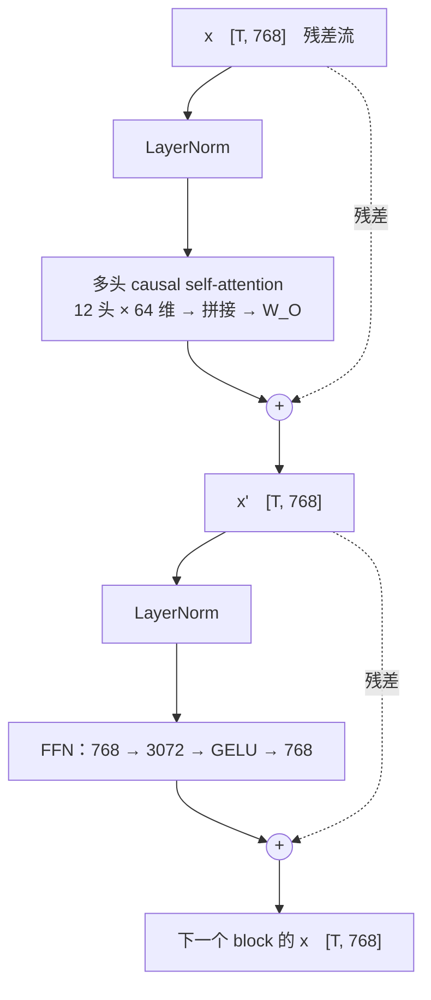

> **本篇在系列中的位置。** 《Transformer 原理与实现》系列的第一篇。本篇画出静态结构：六种部件各是什么、为什么在那里；下一篇让一个 token 在这张图上动起来，第 03 篇再把它写成代码。完整地图见[总纲](/gpt2-to-llama-five-changes-and-parameter-count.html)。

2017 年之后，几乎所有你听说过的大模型——GPT、Llama、Qwen、DeepSeek、Claude、Gemini——用的都是同一种结构：Transformer。它取代了在它之前统治序列建模十年的循环网络（[《深度学习基础（06）：RNN——从 LSTM 到 attention 的诞生》](/rnn-lstm-and-the-birth-of-attention.html)讲了为什么），之后八年结构上只做了修补，没有被替换。所以"看懂一个大模型的内部"这件事，其实只需要看懂一种结构。

这一篇讲**静态线**：把一个 decoder-only Transformer 里的每一个方框打开，说清它是什么、为什么要有它、里面的数怎么算。全篇用一个 4 维、3 个 token 的玩具例子把每一步**手算出来**，再用 GPT-2 small（1.24 亿参数，2019 年）的真实数字对照——真实模型只是把 4 换成 768、把 3 换成 1024，公式一个字都不变。读完这一篇，你应该能对着任何一个模型的 `config.json` 画出它的结构图，并且说出每个部件在做什么；下一篇[《一个 token 的旅程：训练侧与推理侧》](/transformer-token-journey-training-and-inference.html)再讲一个 token 怎么在训练和推理时**流过**这些方框（动态线），本系列第三篇[《手搓 GPT（上）——nanoGPT model.py 逐行解析》](/nanogpt-model-py-line-by-line.html)把这两篇画的图变成 300 行代码。

本篇要回答的核心问题是：

> **一个 token 的编号进入模型，到词表上的一个概率分布出来，中间经过了哪些运算？每一个运算为什么必须在那里——去掉它模型会失去什么？[^q0]**

## 一、总览：从一句话到下一个 token

### 1. 模型在做的唯一一件事

先把"大模型"这个词祛魅：一个语言模型做的事只有一件——**给定前面的 token，输出下一个 token 是词表里每一个词的概率**（[《算法工程师的数学（04）：概率入门——语言模型是一个条件分布》](/probability-basics-language-model-as-conditional-distribution.html)讲过它为什么是一个条件分布）。输入是一串整数（token 编号），输出是一张长度为词表大小 $$V$$ 的概率表。Transformer 就是从这串整数到那张概率表之间的那台机器。


图分左右两半，自下而上读：

- **左半是整台机器。**最底下进来的是一串整数（token 编号）；经过 token embedding 与位置 embedding 两次查表，变成每个 token 一个 768 维向量；然后进入 12 个结构完全相同、参数各自一份的 block；出来后做最后一次 LayerNorm（`ln_f`），乘 lm_head 得到词表上 50257 个分数，softmax 变成概率。淡蓝底的框把**一个 block** 展开：两个子层，每个子层都是"LayerNorm → 变换 → 加回原输入"，虚线就是那条加回去的残差（第六章）。
- **右半把 attention 子层放大。**它是整张图里唯一让 token 之间交流的地方（第四章）：同一个输入分别乘三个矩阵得到 Q、K、V，Q 与 K 打分、加 causal mask 只保留左边、softmax 成权重、按权重把 V 加起来；12 个头各自在 64 维上算完再拼成 768 维，最后乘 W_O。这一子层的全部参数就是四个 768 × 768 的矩阵。

图里每个方框的输入和输出都是"若干个 768 维向量"——一个 token 一个向量，从头到尾形状不变（$$[T, d]$$，$$T$$ 是 token 数，$$d$$ 是隐藏维度，GPT-2 small 的 $$d = 768$$；只有最后 lm_head 把它变成 $$[T, V]$$）。这是 Transformer 能"一层层叠"的前提，也是读结构图时最重要的一条线索：**任何一个方框，问它的输入输出形状是什么，就知道它在干什么。**

### 2. 六种部件

数一数图里有几种不同的东西——六种：

| 部件 | 做什么 | 有没有参数 | 章 |
|---|---|---|---|
| token embedding | 整数编号 → 向量（查表） | 有：$$V \times d$$ 的表 | 二 |
| 位置 embedding | 告诉模型"这是第几个 token" | 有（GPT-2）/ 无（RoPE） | 三 |
| attention 子层 | 每个 token 看别的 token、把有用的信息加到自己身上 | 有：四个 $$d \times d$$ 的矩阵 | 四 |
| FFN 子层 | 每个 token 各自过一个两层的小网络 | 有：两个矩阵，$$d \times 4d$$ 与 $$4d \times d$$ | 五 |
| 残差连接 + LayerNorm | 让几十层能训得动 | LayerNorm 有 $$2d$$ 个；残差没有 | 六 |
| lm_head | 向量 → 词表上的分数 | 有：$$d \times V$$，常与 embedding 表共用 | 七 |

Table: decoder-only Transformer 的六种部件与它们的参数

六种部件里，attention 是**唯一让 token 之间交流**的地方，其他五种都是"每个 token 各自算"——两次查表、FFN、残差 + LayerNorm、lm_head 都只看自己这一行。这是理解 Transformer 的第一把钥匙：把它想成 $$T$$ 条平行的流水线，只在 attention 那一站互相传递信息。

这张表和《算法工程师的数学》第一篇《向量、矩阵与形状》第六章的「[七个权重矩阵](/vectors-matrices-shapes-and-flops.html#1-七个权重矩阵)」数的是同一台机器，只是切法不同。那一章只数**一层 block 里带参数的矩阵**：attention 四个（$$W_Q, W_K, W_V, W_O$$）加 MLP 三个（Llama 的 $$W_{\text{gate}}, W_{\text{up}}, W_{\text{down}}$$），按形状规则算出 Llama-3-8B 一层 218M 参数、81% 在 MLP。本文数的是**整台机器有几种不同的东西**，所以多出了三样不在那七个里的部件——两张 embedding 表、LayerNorm 的 $$2d$$ 个数、以及 lm_head。两张表对起来是这样：

| 本文的部件 | 对应「七个权重矩阵」里的哪几个 | GPT-2 small 里的实际矩阵（nanoGPT 命名） | 两个模型的差别 |
|---|---|---|---|
| token embedding | 不在七个里 | `wte`：50257 × 768 | 查表不是矩阵乘，那一章的 FLOPs 账里不算它 |
| 位置 embedding | 不在七个里 | `wpe`：1024 × 768 | Llama 用 RoPE，没有这张表 |
| attention 子层 | $$W_Q, W_K, W_V, W_O$$ 四个 | `c_attn`：768 × 2304（$$W_Q, W_K, W_V$$ 三个拼成一个）<br/>`c_proj`：768 × 768 | GPT-2 的 K、V 与 Q 同宽；Llama-3 用 GQA，$$W_K, W_V$$ 只有 4096 × 1024 |
| FFN 子层 | $$W_{\text{gate}}, W_{\text{up}}, W_{\text{down}}$$ 三个 | `c_fc`：768 × 3072<br/>`c_proj`：3072 × 768 | GPT-2 是两个矩阵夹一个 GELU；Llama 多一个门 $$W_{\text{gate}}$$、用 SiLU，所以是三个 |
| 残差连接 + LayerNorm | 不在七个里 | `ln_1`、`ln_2` 各 768 + 768 个数 | 残差没有参数；LayerNorm 只有缩放与偏置两个向量，不是矩阵 |
| lm_head | 不在七个里 | 与 `wte` 共享 | Llama 不共享，单独一个 4096 × 128256 |

Table: 本文的六种部件与「七个权重矩阵」的对应——七个矩阵全落在 attention 与 FFN 两个子层里，其余四种部件在那张表之外

所以那一章的 $$QK^\top$$、$$\mathrm{softmax}(\cdot)V$$ 是数据之间的运算、没有参数，这里的残差与 LayerNorm 同理；两边的数字也能互相印证——第八章第 2 节数出 GPT-2 small 一层 7.09M 参数，几乎全在 `c_attn`、`c_proj`、`c_fc`、`c_proj` 这几个矩阵里，两个 LayerNorm 只占 3072 个；把形状换成 Llama-3-8B 的，就是那一章的 218M。

### 3. 本文的章节安排

第二至七章按上一节表里六种部件的顺序逐个展开，一章一种；第八章再把它们叠成一个 block、数出整台 GPT-2 small 的参数。

| 章 | 主题 | 内容 |
|---|---|---|
| 二 | token embedding | 查表：编号 → 向量<br/>查表等价于 one-hot 乘矩阵 |
| 三 | 位置 embedding | attention 不知道顺序（换序实验）<br/>两种给位置的方法：查位置表与 RoPE |
| 四 | attention 子层 | 为什么需要它：GPT-2 真实的 attention 图<br/>Q / K / V 三个投影<br/>d = 4 的六步手算<br/>为什么除 √d、为什么 mask<br/>多头：怎么切、为什么各头看的不一样<br/>这一子层的四个参数矩阵 |
| 五 | FFN 子层 | 为什么 attention 之后还要它<br/>GELU 与 4d<br/>知识存在哪 |
| 六 | 残差连接与 LayerNorm | 深了为什么训不动<br/>LayerNorm 手算<br/>pre-norm 与 post-norm |
| 七 | lm_head | 最后一次 LayerNorm 与 lm_head<br/>与 embedding 表共享权重 |
| 八 | 把它们叠起来 | 一个 block 的数据流<br/>GPT-2 small 的 1.24 亿参数逐项数出来 |
| 九 | 与 d2l 10.7 的 encoder-decoder 对照 | cross-attention 去哪了<br/>为什么 GPT 只留 decoder |
| 十 | 本文小结 |  |
| 十一 | 自测 | 六道题 |

Table: 本文的章节安排

## 二、token embedding：把编号变成向量

### 1. 查表

模型看到的不是字，是 token 编号（[《算法工程师的数学（01）：向量、矩阵与形状》](/vectors-matrices-shapes-and-flops.html)；分词器怎么切在[《预训练（02）：分词与词表——BPE、词表大小与 token 效率》](/tokenizer-vocabulary-and-token-efficiency.html)）。GPT-2 的词表有 50257 个 token，"The cat sat on the" 被切成 `[464, 3797, 3332, 319, 262]`。

第一步是把每个整数变成一个向量。做法简单到令人失望：**查表**。有一张 $$50257 \times 768$$ 的表（`wte`，word token embedding），编号 464 就取第 464 行，得到一个 768 维向量。这张表的每一行都是可训练参数——训练结束时，意思相近的词（cat / dog / kitten）的行会靠得很近，这不是设计出来的，是训练"顺便"学出来的。

### 2. 查表等价于 one-hot 乘矩阵

编号本身不能直接当数用：编号是任意的，464 和 465 之间没有任何关系。查表等价于先做 one-hot（一个 50257 维、只有第 464 位是 1 的向量）再乘一个矩阵，但没人真的去乘——取一行就够了，所以 embedding 不算矩阵乘法的 FLOPs（[现代 LLM 结构（02）](/transformer-flops-bytes-and-roofline.html)算账时单列）。

## 三、位置 embedding：告诉模型这是第几个 token

### 1. attention 不知道顺序

接下来要说一件容易被忽略、但决定了整个结构的事：**第四章的 attention 完全不知道 token 的顺序。** 它把输入当成一个集合，而不是一个序列。用第四章要用的玩具模型做个实验——把三个输入 token 的顺序打乱（原来是 t0、t1、t2，打乱成 t2、t0、t1），看 attention 的输出：

| | token 顺序 | attention 输出（去掉 mask） |
|---|---|---|
| 原顺序 | t0, t1, t2 | (0.92, 0.43, 0.57, 0.08) · (0.43, 0.92, 0.08, 0.57) · (0.73, 0.73, 0.27, 0.27) |
| 打乱后 | t2, t0, t1 | (0.73, 0.73, 0.27, 0.27) · (0.92, 0.43, 0.57, 0.08) · (0.43, 0.92, 0.08, 0.57) |

Table: 打乱输入顺序，attention 的输出只是跟着换了位置——三个向量一个数都没变

输出集合完全相同，只是跟着输入换了位置。也就是说，对 attention 来说，"猫 追 狗"和"狗 追 猫"是同一个输入。这显然不行——语言的意思依赖顺序。所以必须**另外**把位置信息喂进去，这就是"位置编码"这个部件存在的全部理由。

### 2. 两种给位置的方法

**方法一：再查一张表。** GPT-2 的做法：另有一张 $$1024 \times 768$$ 的表（`wpe`，position embedding），第 $$i$$ 个位置取第 $$i$$ 行，**逐元素加**到 token 向量上。第 0 个位置的 cat 和第 7 个位置的 cat 于是变成两个不同的向量，attention 就能区分它们了。这张表也是训练学出来的。它有几行，由训练前定下的上下文长度决定：GPT-2（2019）的上下文长度是 1024 个 token（config 里的 `n_positions`），所以表就建 1024 行——行数和上下文长度是同一个数，不是两件事。这种做法的代价不在 1024 这个数本身，而在于上限被**写死在参数里**：训练时只有这 1024 行被训过，第 1025 个位置没有对应的行，推理时就不能超过它；想加长上下文，只能把表扩大、让新增的行从头训。方法二不建表，也就没有这道硬上限。今天看 1024 很小，当年并不小——attention 的算量和那张 $$T \times T$$ 权重表都随 $$T^2$$ 增长（第四章第 6 节），GPT-2 之前的 BERT 是 512，GPT-3 也只到 2048；上下文从 4K（Llama 2）、8K（Llama 3）到 128K（Llama 3.1），靠的是方法二的 RoPE 加上专门的长上下文扩展技术，[现代 LLM 结构（03）](/positional-encoding-and-long-context.html)讲。

**方法二：不加向量，转角度。** Llama 之后的模型用 RoPE（旋转位置编码）：不改输入向量，而是在 attention 算 $$q \cdot k$$ 之前，把 $$q$$、$$k$$ 按各自的位置旋转一个角度（[《算法工程师的数学（03）：正交与旋转、特征值与 SVD》](/orthogonal-rotation-svd-and-low-rank.html)的正交矩阵），使得两者的内积只依赖**位置差**。它不需要那张表、外推到更长上下文也更自然。[现代 LLM 结构（03）](/positional-encoding-and-long-context.html)专门讲它；本篇的玩具例子和 GPT-2 都用方法一。

用上一节那两句话把两种方法各走一遍。为了能口算，token 向量取二维：猫 = (2, 0)、追 = (0, 2)、狗 = (2, 1)；方法一的位置表取 4 行：位置 0 = (1, 0)、1 = (0, 1)、2 = (−1, 0)、3 = (0, −1)；方法二让每个位置转 30°（$$q$$、$$k$$ 直接取 token 向量本身，省掉 $$W_Q, W_K$$）：


| | 猫追狗 | 狗追猫 | 「猫追狗」整体后移一位（前面多一个 token） |
|---|---|---|---|
| 方法一：token 向量 + 位置表那一行 | 猫@0 = (3, 0)，追@1 = (0, 3)，狗@2 = (1, 1) | 狗@0 = (3, 1)，追@1 = (0, 3)，猫@2 = (1, 0) | 猫@1 = (2, 1)，追@2 = (−1, 2)，狗@3 = (2, 0) |
| 方法二：猫 看 狗 的分数 $$q \cdot k$$ | 狗在猫右边 2 格，$$k$$ 相对 $$q$$ 转 +60°：**0.27** | 狗在猫左边 2 格，转 −60°：**3.73** | 位置差仍是 +2：**0.27**（不变） |

Table: 两种方法在「猫追狗」「狗追猫」上的数字：方法一改的是向量本身，方法二改的是打分；不加位置时猫·狗 = 4，两句话分不出来

- **方法一**：同一个「猫」在第 0 位是 (3, 0)、第 2 位是 (1, 0)，两句话送进 attention 的已经是两组不同的向量，上一节的换序实验不再成立。但它记的是**绝对**位置——整句后移一位，三个向量全变了，"猫@1 和猫@0 是同一个词"要靠训练自己学会；位置表有几行就只认几个位置。
- **方法二**：向量不动，打分时 $$q$$ 按自己的位置 $$m$$ 转 $$m\theta$$、$$k$$ 按位置 $$n$$ 转 $$n\theta$$，两个旋转合起来等于只把 $$k$$ 相对 $$q$$ 转 $$(n - m)\theta$$（[《算法工程师的数学（03）：正交与旋转、特征值与 SVD》](/orthogonal-rotation-svd-and-low-rank.html)：$$R(a)^\top R(b) = R(b - a)$$），所以分数只和**相对**位置差有关：猫看"右边两格的狗"永远是 0.27、看"左边两格的狗"永远是 3.73，整句后移分数不变——词序进了分数，而且天然是相对的。真实模型里 $$d_h = 128$$ 维被分成 64 对，每一对像这里的二维平面一样各转一个角度，只是转速不同，[现代 LLM 结构（03）](/positional-encoding-and-long-context.html)展开。

两种方法回答的是同一个问题：attention 是集合运算，顺序必须显式地喂给它。

## 四、Attention 子层：让 token 互相看

### 1. 为什么需要它

看这句话：**The cat sat on the mat because it was tired.** 要预测 "tired" 后面的词，模型得知道 "it" 指的是 cat 而不是 mat——这个信息在 7 个 token 之前。任何一个 token 单独看自己的向量都不够，它需要**看别的 token**，而且要知道该看谁、看多少。

attention 就是这个"看"的机制：对每个 token，算出它对句子里每个其他 token 的**关注权重**（一组和为 1 的数），然后按权重把那些 token 的向量加权平均、加到自己身上。这不是比喻——GPT-2 small 内部真的在这么做。

先说清下面两张图在结构里的位置。GPT-2 small 有 12 个 block，每个 block 的 attention 子层里并排放着 12 个**头**（head）：每个头各有自己的一套 $$W_Q, W_K, W_V$$，各算一张 $$T \times T$$ 的权重表，所以整个模型一共有 $$12 \times 12 = 144$$ 张这样的表（怎么切成 12 个头、为什么各头看的不一样，本章第 6 节讲）。下面取的是第 4 层的两个头处理这句话时的权重——模型自己学出来的，没有人告诉它 it 指 cat：


左边那个头（第 4 层第 11 头）学会了"看上一个词"——每一行的权重几乎全部落在对角线左下一格；右边那个头（同一层的第 3 头）把句子里大部分 token 的注意力都指向主语 cat，"it" 那一行给 cat 的权重是 0.84。同一层的两个头、同样的输入，学出了完全不同的"该看谁"。两张图都是下三角形：右上角全是 0，因为每个 token 只能看它**左边**的 token（本章第 5 节讲为什么）。

有了这张图，attention 的三个问题就具体了：权重怎么算出来的（第 2–4 节）、为什么只能看左边（第 5 节）、为什么一个头不够要 12 个头（第 6 节）。

### 2. Q、K、V：三个投影

"该看谁、看多少"要有个打分的办法。最朴素的想法是用两个 token 向量的内积（[《算法工程师的数学（02）：内积、范数与余弦相似度》](/inner-product-norms-and-cosine-similarity.html)：内积大 = 方向接近）当分数。但这有个毛病：一个 token"想找什么"和它"是什么"通常不是一回事——"it" 想找的是一个名词，它自己却是个代词；用同一个向量既当问题又当答案，分数就只会奖励"和我长得像的"。

所以 attention 给每个 token 算出**三个**不同的向量，各用一个可训练的矩阵从 $$x$$ 投影出来：

| 名字 | 公式 | 比喻 | 用来 |
|---|---|---|---|
| query $$q = x W_Q$$ | 查询 | "我在找什么" | 当打分的一方 |
| key $$k = x W_K$$ | 键 | "我是什么、我能被怎么找到" | 被打分的一方 |
| value $$v = x W_V$$ | 值 | "被选中后我提供什么内容" | 被加权求和的一方 |

Table: attention 的三个投影：一个 token 在三种角色下的三个向量

分数是 $$q_i \cdot k_j$$：第 $$i$$ 个 token 的问题与第 $$j$$ 个 token 的答案对得上多少。三个矩阵 $$W_Q, W_K, W_V$$ 都是 $$d \times d$$（GPT-2 small：$$768 \times 768$$），是这个子层的主要参数。训练时模型会把 $$W_Q$$ 调成"把代词投影到'我要找名词'的方向"、把 $$W_K$$ 调成"把名词投影到'我是名词'的方向"——上面右图那个头就是这么来的。

### 3. 六步手算：d = 4、T = 3

把公式写出来只有一行：

$$
\text{Attention}(Q, K, V) = \text{softmax}\!\left(\frac{QK^T}{\sqrt{d}} + M\right) V
$$

$$M$$ 是 mask（第 5 节）。这行公式里每个符号都对应下面六步里的一步。取 $$d = 4$$、三个 token，投影矩阵用手写的小整数（让算出来的数能口算），$$W_V$$ 取单位矩阵（这样 $$V = x$$，加权求和后一眼能看出"混合了谁"）。先把四个矩阵摆出来——图里每一个数都能从它们口算出来：

$$
x = \begin{pmatrix} 1 & 0 & 1 & 0 \\ 0 & 1 & 0 & 1 \\ 1 & 1 & 0 & 0 \end{pmatrix},\quad
W_Q = \begin{pmatrix} 1 & 0 & 0 & 0 \\ 0 & 1 & 0 & 0 \\ 1 & 0 & 1 & 0 \\ 0 & 1 & 0 & 1 \end{pmatrix},\quad
W_K = \begin{pmatrix} 1 & 0 & 1 & 0 \\ 0 & 1 & 0 & 1 \\ 0 & 0 & 1 & 0 \\ 0 & 0 & 0 & 1 \end{pmatrix},\quad
W_V = I_4
$$

$$x$$ 每行一个 token（t0、t1、t2），$$W_Q$$、$$W_K$$、$$W_V$$ 都是 $$[4, 4]$$。$$Q = xW_Q$$ 的第一行就是 t0 那行 $$(1, 0, 1, 0)$$ 乘 $$W_Q$$——挑出 $$W_Q$$ 的第 1 行与第 3 行相加，得 $$(2, 0, 1, 0)$$；三行都这么算：

$$
Q = xW_Q = \begin{pmatrix} 2 & 0 & 1 & 0 \\ 0 & 2 & 0 & 1 \\ 1 & 1 & 0 & 0 \end{pmatrix},\quad
K = xW_K = \begin{pmatrix} 1 & 0 & 2 & 0 \\ 0 & 1 & 0 & 2 \\ 1 & 1 & 1 & 1 \end{pmatrix},\quad
V = xW_V = x
$$

这就是六步里的第 ① 步；后面五步全是在 $$Q$$、$$K$$、$$V$$ 上算：


逐步读：

1. **投影**：$$Q = xW_Q$$、$$K = xW_K$$、$$V = xW_V$$（四个矩阵的值见图上方），三个都是 $$[3, 4]$$——每个 token 一行，三种角色各一份。
2. **打分** $$S = QK^T$$，形状 $$[3, 3]$$：$$S_{ij} = q_i \cdot k_j$$。第一行 $$(4, 0, 3)$$ 是 t0 的 query 与三个 key 的内积——t0 与自己对得最好（4），与 t1 完全不对（0）。这是[《算法工程师的数学（01）：向量、矩阵与形状》](/vectors-matrices-shapes-and-flops.html)说的"矩阵乘法的第三种看法：相似度表"。
3. **缩放**：除以 $$\sqrt{d} = 2$$，得 $$(2.0, 0.0, 1.5)$$。为什么要除，下一节。
4. **mask**：右上角（t0 看 t1、t2，t1 看 t2）填 $$-\infty$$。
5. **softmax**（[《算法工程师的数学（05）：从最大似然到交叉熵》](/from-maximum-likelihood-to-cross-entropy.html)）逐行：$$e^{-\infty} = 0$$，所以被 mask 的位置权重恰好为 0；t2 那一行 $$(0.5, 0.5, 1.0)$$ 变成 $$(0.27, 0.27, 0.45)$$——$$e^{1.0} / (e^{0.5} + e^{0.5} + e^{1.0}) = 2.72 / 6.02 = 0.45$$。每行和为 1。
6. **加权求和** $$\text{out} = PV$$：t2 的输出 $$= 0.27 \cdot v_0 + 0.27 \cdot v_1 + 0.45 \cdot v_2 = (0.73, 0.73, 0.27, 0.27)$$。t0 只能看自己，输出就是 $$v_0$$。

输出形状 $$[3, 4]$$ 与输入相同——所以它能被加回输入（第六章的残差），也能一层层叠。这段手算在配套脚本里与 PyTorch 的 `F.scaled_dot_product_attention(is_causal=True)` 对拍，最大差 $$6 \times 10^{-8}$$：

```python title='d=4、T=3 的因果注意力手算：与 F.scaled_dot_product_attention 对拍'
import math, torch, torch.nn.functional as F

x = torch.tensor([[1., 0., 1., 0.], [0., 1., 0., 1.], [1., 1., 0., 0.]])   # 3 个 token，d = 4
W_Q = torch.tensor([[1., 0., 0., 0.], [0., 1., 0., 0.], [1., 0., 1., 0.], [0., 1., 0., 1.]])
W_K = torch.tensor([[1., 0., 1., 0.], [0., 1., 0., 1.], [0., 0., 1., 0.], [0., 0., 0., 1.]])
W_V = torch.eye(4)

Q, K, V = x @ W_Q, x @ W_K, x @ W_V                       # ① 三个投影，各 [3, 4]
S = Q @ K.T                                               # ② 分数表 [3, 3]
S = S / math.sqrt(4)                                      # ③ 除以 √d
mask = torch.tril(torch.ones(3, 3)).bool()                # ④ 下三角为 True
S = S.masked_fill(~mask, float("-inf"))                   #    右上角填 −∞
P = F.softmax(S, dim=-1)                                  # ⑤ 逐行 softmax → 权重
out = P @ V                                               # ⑥ 加权求和 [3, 4]

ref = F.scaled_dot_product_attention(Q[None, None], K[None, None], V[None, None], is_causal=True)[0, 0]
print((out - ref).abs().max())                            # tensor(5.9605e-08)
```

`F.scaled_dot_product_attention` 是 PyTorch 2.0 起的内置函数，把 ②–⑥ 合成一个 kernel（Infra 地图 GPU Kernel 系列讲 FlashAttention 怎么做到不写出那张 $$[T, T]$$ 的表）；本系列第三篇[《手搓 GPT（上）——nanoGPT model.py 逐行解析》](/nanogpt-model-py-line-by-line.html)的 nanoGPT 两条路径都有。

### 4. 为什么除以 √d

$$q \cdot k$$ 是 $$d$$ 项相加。$$d$$ 越大，和的典型大小越大——各项独立、均值 0、方差 1 时，和的标准差正好是 $$\sqrt{d}$$（[《算法工程师的数学（04）：概率入门——语言模型是一个条件分布》](/probability-basics-language-model-as-conditional-distribution.html)用方差算过）。用随机向量实测：

| $$d$$ | $$q \cdot k$$ 的标准差 | $$\sqrt{d}$$ | 除以 $$\sqrt{d}$$ 后 |
|---|---:|---:|---:|
| 4 | 1.99 | 2.00 | 1.00 |
| 64 | 8.01 | 8.00 | 1.00 |
| 128 | 11.33 | 11.31 | 1.00 |
| 1024 | 32.01 | 32.00 | 1.00 |

Table: 随机 q、k 的点积标准差随 d 按 √d 增长；除以 √d 后回到 1

不除会怎样：$$d = 128$$ 时分数的标准差是 11，随便两个 token 的分数就能差出 10 分以上，softmax 后是 0.99995 : 0.00005——一个 token 独占全部权重，其他全被忽略，而且这种极端概率对输入的微小变化几乎没有响应（梯度接近 0，[《算法工程师的数学（05）：从最大似然到交叉熵》](/from-maximum-likelihood-to-cross-entropy.html)），训不动。除以 $$\sqrt{d}$$ 把分数拉回"有区分度但不饱和"的区间。原论文把这个版本叫 **scaled dot-product attention**，"scaled" 就是指这一步。

### 5. 为什么 mask：只能看左边

mask 把"看未来的 token"的分数设成 $$-\infty$$，softmax 后权重为 0。为什么要禁止看未来？因为模型的任务是**预测下一个 token**：如果算第 3 个位置的输出时允许看到第 4 个 token，模型直接把它抄过来就是标准答案，什么都学不到。

更深一层的原因在下一篇展开，这里先说结论：训练时一句话的 $$T$$ 个位置**同时**各预测自己的下一个 token（一次前向算 $$T$$ 个 loss），mask 保证第 $$i$$ 个位置只用了前 $$i$$ 个 token 的信息，这样训练时的每个位置和推理时"只有前文"的情形完全一致。这也是它叫 **causal**（因果）attention、模型叫 decoder-only 的原因：只往一个方向看。第三章那个"换序实验"里去掉了 mask，所以输出严格只是换位置；加上 mask 之后，位置就有了"先后"的意义——但 mask 只告诉模型"谁在我左边"，不告诉它"谁在我左边第几个"，位置编码仍然不可少。

### 6. 多头：12 个头各看各的

第 1 节那两张热力图来自**同一层的两个不同的头**：一个看上一个词，一个看主语。如果这一层只有一套 $$W_Q, W_K, W_V$$，它只能学出一种"该看谁"的模式；语言里同时存在很多种关系（上一个词、指代、主谓、句首……），所以让一层里有 $$h$$ 套独立的投影，各算一张自己的权重表——这就是**多头**（multi-head）。

实现上不是把 $$d$$ 维的向量复制 $$h$$ 份，而是**切成 $$h$$ 段**：GPT-2 small 的 768 维切成 12 个头、每头 64 维（$$d_h = d / h$$）。每个头在自己的 64 维上做上一节的六步，得到一个 $$[T, 64]$$ 的输出，12 个拼回 $$[T, 768]$$，再过一个 $$W_O$$（$$768 \times 768$$）把各头的结果混合。

"切"这个字容易让人以为是把输入向量的 768 维分给 12 个头、每头只看其中 64 维——不是。被切的是**投影之后**的结果：$$W_Q$$ 是一个 $$768 \times 768$$ 的矩阵，$$x W_Q$$ 得到 768 维，再平均切成 12 段；而 $$W_Q$$ 的第 $$i$$ 段 64 列本身就是一个独立的 $$768 \times 64$$ 小矩阵 $$W_Q^{(i)}$$。所以"切成 12 段"等价于"12 个头各有一个从**整个** 768 维输入读进来的小投影"，每个头都能看到输入的全部信息，切分的位置本身没有任何讲究——按 64 维平均切只是为了把 12 个小矩阵拼成一个大矩阵、一次乘完。

那怎么保证各头看的方向不一样？**没有任何机制保证。** 12 套 $$W_Q^{(i)}, W_K^{(i)}, W_V^{(i)}$$ 只是随机初始化得不同，训练时梯度各自更新；"一个看上一个词、一个看主语"是训练"顺便"分工出来的结果，不是设计出来的。事实上也常常没分工好——GPT-2 里有不少头几乎只看第一个 token（相当于什么都不看），剪掉一层里的大部分头对效果影响很小[^heads]。多头的价值不在"保证每头一个方向"，而在于给了模型同时学多种关系的**容量**，用不用得上由训练决定。形状变化在 [《算法工程师的数学（01）：向量、矩阵与形状》](/vectors-matrices-shapes-and-flops.html)画过：

![多头 attention 的形状变化：Q [T, d] 先 reshape 成 [T, h, d_h]，再转置成 [h, T, d_h]，每个头拿到自己的 [T, d_h] 小矩阵各做一次 QKᵀ](/img/in-post/vectors-matrices-multi-head-reshape-transpose.svg)

两件常被问的事：

- **多头的代价是什么？** 打分与加权求和不增加算量：$$h$$ 个 $$[T, d_h]$$ 的小乘法加起来与一个 $$[T, d]$$ 的大乘法 FLOPs 相同（$$h \times 2T^2 d_h = 2T^2 d$$），$$W_Q, W_K, W_V$$ 的总大小也不变（12 个 $$768 \times 64$$ 拼起来就是一个 $$768 \times 768$$）。真正多出来的有两样：
  - **参数：$$W_O$$。** 就是上面"12 个头拼回 $$[T, 768]$$ 之后再过的那个 $$768 \times 768$$"——它的作用是把各头**各自算出的结果混在一起**：拼接只是把 12 段摆在一起，第 $$i$$ 头的输出还只在自己那 64 维里，$$W_O$$ 的每一列都能同时用到 12 个头，后面的 FFN 才拿到一个融合过的向量。单头时并不需要它——$$W_V W_O$$ 可以合成一个矩阵——所以它确实是多头带来的：GPT-2 small 每层多 $$768^2 \approx 0.59$$M 个参数（attention 子层四个矩阵的 1/4），每个 token 多 $$2 \times 768^2 \approx 1.2$$M FLOPs。
  - **中间结果：权重表多了 $$h$$ 倍。** 单头一层只有一张 $$[T, T]$$ 的 $$P$$，多头是 $$h$$ 张 $$[T, T]$$。$$T = 1024$$ 时 GPT-2 small 一层就是 $$12 \times 1024^2 \approx 12.6$$M 个数，bf16 下 25 MB，训练时反向还要留着；这是 attention 显存随 $$T^2$$ 涨的那一项，也是 FlashAttention 不肯把它写出来的原因（Infra 地图 GPU Kernel 系列）。KV cache 不受影响：缓存的是 $$K, V$$ 各 $$[T, d]$$，切成几个头都一样大。
- **为什么每头只有 64 维还够用？** 每个头只需要判断一种关系，64 维足够表达"是不是名词""是不是上一个词"这类问题；真实模型从 GPT-2 到 Llama-3 都保持 $$d_h = 64$$–$$128$$，加大的是头数与层数。

### 7. 这一子层的参数

这一子层的参数就是前面几节一个个引出来的四个矩阵，把它们的来历、形状与数量放到一张表里：

| 矩阵 | 哪一节、为什么引入 | 形状（GPT-2 small） | 参数量（含 768 维 bias） |
|---|---|---|---:|
| $$W_Q$$ | 第 2 节：打分要有"我在找什么"的一方 | 768 × 768 | 590,592 |
| $$W_K$$ | 第 2 节：被打分的一方"我是什么"，与 $$W_Q$$ 分开才能不对称 | 768 × 768 | 590,592 |
| $$W_V$$ | 第 2 节：被选中后传什么内容，与打分解耦 | 768 × 768 | 590,592 |
| $$W_O$$ | 第 6 节：12 个头各算出 64 维、拼成 768 维后，用它把各头的结果混合并投影回残差流 | 768 × 768 | 590,592 |
| **合计** | | | **2,362,368 ≈ 2.36M** |

Table: GPT-2 small 一层 attention 子层的四个参数矩阵：来历、形状与数量

为什么恰好是这四个：打分需要一对（$$W_Q$$、$$W_K$$），传内容需要一个（$$W_V$$），多头之后把各头的结果合起来需要一个（$$W_O$$）。$$W_O$$ 在第 6 节之前没有出现，是因为单头时它并不必要——加权求和之后再乘 $$W_O$$，等价于一开始就用 $$W_V W_O$$ 这一个矩阵；多头后 12 个头各有自己的 $$W_V^{(i)}$$（768 × 64），拼接后再乘一个 768 × 768 的 $$W_O$$，第 $$i$$ 头的输出才能影响到全部 768 维，所以它是随多头一起出现的。nanoGPT 里前三个拼成一个 `c_attn`（768 × 2304），$$W_O$$ 叫 `c_proj`（第八章第 2 节的参数表）。注意 attention **本身**——打分、softmax、加权求和——没有任何参数：它是一套固定的运算，"学"全发生在四个投影矩阵里。Llama 之后的模型把 $$W_K, W_V$$ 缩小（GQA，[现代 LLM 结构（04）](/attention-variants-and-kv-cache.html)）、把 bias 去掉，但四个矩阵的角色没变。

## 五、FFN 子层：让每个 token 自己想一想

### 1. attention 之后为什么还要一步

回头看第四章第 3 节的第 ⑥ 步：输出是 $$V$$ 的**加权平均**。加权平均是线性运算——不管权重多聪明，输出永远在输入向量张成的空间里，不能"算出"新东西。而且到这一步为止整个模型都是线性的（查表、加法、矩阵乘），[《深度学习基础（01）：反向传播——手推一个两层网络》](/backpropagation-by-hand.html)说过：没有非线性，一百层等于一层。

所以每个 block 的第二个子层是一个小小的两层神经网络，**每个 token 各自过一遍**（token 之间完全不交流，所以叫 position-wise / 逐位置 FFN）：

$$
\text{FFN}(x) = \text{GELU}(x W_1 + b_1)\, W_2 + b_2, \qquad W_1 \in \mathbb{R}^{d \times 4d},\; W_2 \in \mathbb{R}^{4d \times d}
$$

先把 768 维放大到 3072 维，过一个非线性函数，再压回 768 维。GELU 是 ReLU 的平滑版本（[《深度学习基础（01）：反向传播——手推一个两层网络》](/backpropagation-by-hand.html)），负半轴不是硬截到 0 而是缓缓压到 0，GPT-2 起成为标配。"4 倍"是原论文的经验选择，之后被沿用；Llama 换成三个矩阵的 SwiGLU、宽度改为约 2.7 倍（本系列第五篇[《现代 LLM 结构（01）：从 GPT-2 到 Llama——五处改动与参数量》](/gpt2-to-llama-five-changes-and-parameter-count.html)讲 14336 怎么来的），但"放大 → 非线性 → 压回"的形状没变。

### 2. 它在一层里占了三分之二

一层的参数数一数：attention 四个矩阵 $$4d^2$$，FFN 两个矩阵 $$8d^2$$——**FFN 占一层参数的三分之二**（GPT-2 small：4.72M 对 2.36M）。这个比例在 Llama 上更高（约 80%，本系列第五篇[《现代 LLM 结构（01）：从 GPT-2 到 Llama——五处改动与参数量》](/gpt2-to-llama-five-changes-and-parameter-count.html)的表）。所以"大模型的参数主要在 attention 里"是个常见误解；attention 负责决定看谁，真正的"存储"在 FFN。

### 3. 知识存在哪

有一个有用的直觉：把 $$W_1$$ 的 3072 列看成 3072 个"探测器"，每个探测器问输入向量一个问题（"这是不是在讲一种动物？""前面是不是出现了 Paris？"），GELU 决定答"是"的强度，$$W_2$$ 再把答"是"的探测器对应的"回答向量"加起来。可解释性研究（Geva 等，2021 起）确实在真实模型的 FFN 里找到了这种 key–value 结构：某些神经元专门在特定主题出现时激活，并把对应的词推向输出。这也是为什么"往模型里塞知识"（预训练）主要涨的是 FFN，而 MoE（[现代 LLM 结构（06）](/moe-compute-and-communication.html)）选择把 **FFN** 复制成多个专家而不是复制 attention。

## 六、残差连接与 LayerNorm：让几十层能训

### 1. 残差流

第四、五章的两个子层都不是"输入进去、输出出来"，而是**把输出加回输入**：

$$
x \leftarrow x + \text{Attention}(\text{LN}(x)), \qquad x \leftarrow x + \text{FFN}(\text{LN}(x))
$$

这就是残差连接（[《深度学习基础（02）：训练为什么不稳定——初始化、归一化与残差》](/initialization-normalization-and-residual.html)讲了它的数学：让梯度能沿着"+"直接传回去，深网络才训得动）。一个有用的读法：把那条从 embedding 一直通到 lm_head 的 $$[T, d]$$ 主干叫**残差流**（residual stream），每个子层都是从主干上读一份、算出一个"修正量"、再加回主干。12 层 = 24 次修正。GPT-2 small 的一个 token 从进到出，它的 768 维向量被修正了 24 次，每次修正量都比主干本身小得多——这也是为什么 Transformer 能到 100 层以上而 RNN 不行。

### 2. LayerNorm 做什么

每个子层读主干之前先做一次 **LayerNorm**（层归一化）：把一个 token 的 $$d$$ 维向量减去自己的均值、除以自己的标准差，再乘一个可学习的缩放 $$\gamma$$、加一个偏移 $$\beta$$（各 $$d$$ 个参数）。用一个 4 维向量手算：

$$
x = (2, 4, 4, 6) \;\to\; \mu = 4,\; \sigma^2 = 2 \;\to\; \frac{x - \mu}{\sqrt{\sigma^2 + \epsilon}} = (-1.41,\, 0,\, 0,\, 1.41) \;\to\; \gamma \odot (\cdot) + \beta
$$

它解决的问题是**尺度**：残差流上 24 次相加，向量的数值会越来越大，直接喂给 attention 会让 $$q \cdot k$$ 的分数失控（第四章第 4 节那个问题的另一个来源）；LayerNorm 保证每个子层看到的输入都在同一个尺度上。注意它是**每个 token 自己归一化**，不跨 token、也不跨 batch——这是它与 CNN 里 BatchNorm 的区别，也是它在变长序列上好用的原因。Llama 换成 RMSNorm（不减均值，只除均方根，省一次运算，本系列第五篇[《现代 LLM 结构（01）：从 GPT-2 到 Llama——五处改动与参数量》](/gpt2-to-llama-five-changes-and-parameter-count.html)），作用相同。

### 3. pre-norm 与 post-norm

LayerNorm 放在子层**之前**（上面的公式，GPT-2 起的做法，叫 pre-norm）还是**之后**（原论文 2017 与 d2l 10.7 画的是 $$\text{LN}(x + \text{Sublayer}(x))$$，叫 post-norm）？两者数学上不等价：pre-norm 下残差流本身不经过归一化，梯度有一条干净的直通路；post-norm 下每层输出都被重新归一化，深了以后需要 warmup 和小学习率才不发散（Xiong 等，2020）。现代大模型几乎全部用 pre-norm，代价是最后要多加一次 `ln_f`（图 1 里"最后一次 LayerNorm"那个框），否则残差流的尺度直接进 lm_head。

## 七、lm_head：把向量变成词表上的分数

### 1. 最后一次 LayerNorm 与 lm_head

最后一个 block 出来的 $$[T, 768]$$ 过 `ln_f`，再乘 **lm_head**（$$768 \times 50257$$）得到每个位置在词表上的 50257 个分数（logits），softmax 之后就是"下一个 token 是谁"的概率。

### 2. 与 embedding 表共享权重

GPT-2 的 lm_head 直接**复用 embedding 表的转置**（tie weights）：查表是"编号 → 向量"，lm_head 是"向量 → 每个编号的分数"，用同一张表做两件事既省了 3860 万参数，又让"输入端相近的词在输出端也相近"。大模型（Llama-3-70B）通常不共享，因为 embedding 那点参数相对总量已经不重要（本系列第五篇[《现代 LLM 结构（01）：从 GPT-2 到 Llama——五处改动与参数量》](/gpt2-to-llama-five-changes-and-parameter-count.html)）。

## 八、把它们叠起来

### 1. 一个 block



这个图就是本系列第三篇[《手搓 GPT（上）——nanoGPT model.py 逐行解析》](/nanogpt-model-py-line-by-line.html)里 nanoGPT `Block.forward` 的两行代码：

```python title='nanoGPT Block.forward 的两行'
x = x + self.attn(self.ln_1(x))
x = x + self.mlp(self.ln_2(x))
```

12 个这样的 block 串起来，各有自己的参数（$$12 \times 7.09$$M）。"层数"（`n_layer`）指的就是 block 的个数。

### 2. GPT-2 small 的 1.24 亿参数

把全文的部件加起来，就是 GPT-2 small 的参数量：

| 部件 | 形状 | 参数量 |
|---|---|---:|
| token embedding `wte` | 50257 × 768 | 38,597,376 |
| 位置 embedding `wpe` | 1024 × 768 | 786,432 |
| 每层 attention（$$W_Q, W_K, W_V$$ 合成一个 768 × 2304，加 $$W_O$$，各带 bias） | 768 × 2304 + 2304 + 768 × 768 + 768 | 2,362,368 |
| 每层 FFN | 768 × 3072 + 3072 + 3072 × 768 + 768 | 4,722,432 |
| 每层两个 LayerNorm | 2 × (768 + 768) | 3,072 |
| 一层合计 | | 7,087,872 |
| 12 层 | | 85,054,464 |
| `ln_f` | 768 + 768 | 1,536 |
| lm_head | 与 `wte` 共享 | 0 |
| **总计** | | **124,439,808** |

Table: GPT-2 small 的参数量逐项：embedding 占 31.6%，FFN 占每层的 66.6%

两个观察：embedding 在这个小模型里占了将近三分之一，模型越大这一项占比越小（Llama-3-8B 是 13%，70B 是 1.5%）；12 层里三分之二的参数在 FFN。本系列第三篇[《手搓 GPT（上）——nanoGPT model.py 逐行解析》](/nanogpt-model-py-line-by-line.html)会用 `model.get_num_params()` 把这个数打印出来（nanoGPT 默认不计 `wpe`，报 123.65M），本系列第五篇[《现代 LLM 结构（01）：从 GPT-2 到 Llama——五处改动与参数量》](/gpt2-to-llama-five-changes-and-parameter-count.html)把同一套算法用到 Llama 上。

## 九、与 d2l 10.7 的 encoder-decoder 对照

### 1. 原始 Transformer 是两半

《动手学深度学习》10.7 节和 2017 年的原论文画的 Transformer 有**两半**：左边一个 encoder 读入源句子（比如英文），右边一个 decoder 生成目标句子（比如中文）——它是为机器翻译设计的。


图分三列，每列都自下而上：

- **左列 encoder** 读整句英文，每个 block 是"双向 self-attention → Add & Norm → FFN → Add & Norm"。双向的意思是 self-attention 不加 mask，每个词能看到整句——它只负责"读懂"，不负责生成。
- **中列 decoder** 逐词生成中文。它的 block 比 encoder 多一个子层：causal self-attention 之后先做一次 **cross-attention**——Q 来自 decoder 自己，K、V 来自 encoder 的输出（图中横过来的那条线），"翻译到这里该看原文的哪个词"；然后才是 FFN。
- **右列 GPT** 就是本文第一至八章的结构。红色虚线框住的两样东西被整个去掉：encoder 没了，cross-attention 自然也没了。剩下的 decoder block 只有 causal self-attention 与 FFN 两个子层，而且 LayerNorm 从子层之后（Add & Norm）挪到了子层之前（pre-norm，第六章）。

对照本文讲的结构，有三处不同：

| | encoder | 原始 decoder | GPT 的 decoder-only |
|---|---|---|---|
| self-attention 的 mask | 无：每个词可以看整句（双向） | 有：只看左边 | 有：只看左边 |
| cross-attention 子层 | 无 | 有：query 是自己，key / value 是 encoder 的输出 | **无** |
| 位置编码 | 固定的正弦函数 | 同 | GPT-2 学习式表 / Llama RoPE |
| 归一化位置 | post-norm | post-norm | pre-norm |

Table: encoder、原始 decoder 与 GPT 式 decoder-only 的差别

### 2. cross-attention 去哪了

原始 decoder 每个 block 有**三**个子层：causal self-attention、cross-attention、FFN。cross-attention 与第四章的运算完全相同，只是 $$Q$$ 来自 decoder 自己的 token、$$K, V$$ 来自 encoder 的输出——"翻译到这里该看原文的哪个词"。GPT 把 encoder 整个去掉，cross-attention 自然也没了：**要参考的内容直接拼在输入前面**（prompt），用 self-attention 去看它。"翻译 → 输入英文，输出中文"变成"输入'英文 + 请翻译成中文：'，续写中文"。

### 3. 为什么 GPT 只留 decoder

2018–2019 年三条路都有人走：只留 encoder（BERT，双向，适合分类 / 理解）、只留 decoder（GPT，单向，适合生成）、两半都留（T5、BART）。decoder-only 最后胜出的原因：

1. **一个目标做一切**：next-token prediction 既是预训练目标又是使用方式，不需要为下游任务改结构；理解类任务也能变成生成（"这段话的情感是：正面 / 负面"）。
2. **训练效率**：causal mask 让一句话的 $$T$$ 个位置同时提供 $$T$$ 个训练信号（下一篇[《一个 token 的旅程：训练侧与推理侧》](/transformer-token-journey-training-and-inference.html)第二章），而 encoder-decoder 只在 decoder 侧有信号。
3. **KV cache**（下一篇[《一个 token 的旅程：训练侧与推理侧》](/transformer-token-journey-training-and-inference.html)第三章）：单向结构让推理时前面 token 的中间结果可以缓存复用，双向结构做不到。

所以本系列只讲 decoder-only；d2l 10.7 里 encoder 那一半，读者知道它就是"不加 mask 的第四章"即可。多模态模型里的 vision encoder（[现代 LLM 结构（09）](/multimodal-vision-encoder-cost-and-image-token-kv.html)）是 encoder 这一半在今天的主要去处。

## 十、本文小结

- 一个 decoder-only Transformer 只有**六种部件**：token embedding、位置 embedding、attention、FFN、残差 + LayerNorm、lm_head；从头到尾每个方框的输入输出都是 $$[T, d]$$ 的向量，所以能一层层叠。
- **attention 是唯一让 token 之间交流的地方**：每个 token 用 query 与所有 key 打分（$$QK^T$$），除 $$\sqrt{d}$$ 防止 softmax 饱和，mask 禁止看未来，softmax 得权重，加权求和 value。$$d = 4$$、$$T = 3$$ 的六步手算与 PyTorch 对拍差 $$6 \times 10^{-8}$$；GPT-2 真实的头学出了"看上一个词"与"it 指回 cat"。
- attention **不知道顺序**（换序实验：输出只是跟着换位置），所以必须另加位置信息：GPT-2 查一张位置表，Llama 用 RoPE 转角度。
- **FFN 是每个 token 各自过的两层小网络**，提供非线性，占一层参数的三分之二，知识主要存在这里。
- **残差流**让 24 次修正能训得动，**LayerNorm** 让每个子层看到同一尺度的输入；现代模型用 pre-norm，代价是末尾多一次 `ln_f`。
- GPT-2 small：12 层 × 7.09M + embedding 38.6M + 位置表 0.79M = **1.244 亿**，lm_head 与 embedding 共享。
- 原始 Transformer 是 encoder-decoder；GPT 去掉 encoder 与 cross-attention，把"要参考的内容"拼进输入用 self-attention 看——一个目标、更高的训练效率、可缓存的推理，让 decoder-only 成为今天所有 LLM 的形状。

配套脚本 `attention_by_hand.py`（[ai-learning-labs/transformer-and-llm](https://github.com/arganzheng/ai-learning-labs/tree/main/transformer-and-llm)）打印本文六步手算的每一个中间矩阵、对拍 PyTorch、做换序实验、测 $$\sqrt{d}$$ 表；`tools/gen_gpt2_attention_heatmap.py` 生成第四章那张 GPT-2 真实 attention 图。

## 十一、自测

1. 一个 block 的输入是 $$[T, d]$$，输出是什么形状？为什么必须相同？

   <details markdown="1"><summary>答案</summary>

   也是 $$[T, d]$$。两个原因：残差连接要把子层输出**加回**输入，形状不同加不了；形状不变才能把任意多个 block 串起来，且 lm_head 只需要处理一种形状。见[第六章](#六残差连接与-layernorm让几十层能训)、[第八章](#八把它们叠起来)。
   </details>

2. 用第四章的玩具模型：t1 的 query 是 $$(0, 2, 0, 1)$$，三个 key 是 $$(1, 0, 2, 0)$$、$$(0, 1, 0, 2)$$、$$(1, 1, 1, 1)$$。算出 t1 那一行 mask 后的 softmax 权重。

   <details markdown="1"><summary>答案</summary>

   内积：$$0, 4, 3$$；除 $$\sqrt 4 = 2$$：$$0, 2, 1.5$$；mask 掉 t2：$$(0, 2, -\infty)$$；softmax：$$e^0 / (e^0 + e^2) = 1 / (1 + 7.39) = 0.12$$，$$e^2 / 8.39 = 0.88$$，0。与手算图第 ⑤ 步第二行一致。
   </details>

3. 把位置 embedding 那张表删掉，模型还能训吗？会失去什么？

   <details markdown="1"><summary>答案</summary>

   能训、会收敛，但它分不清"猫追狗"和"狗追猫"——attention 是集合运算，[第三章第 1 节](#1-attention-不知道顺序)的换序实验说明输出只随输入换位置。causal mask 给了"左右"的信息，但不给"距离"，所以位置信息仍然必须显式提供。（有趣的是带 causal mask 的 decoder 在没有位置编码时也能学到一点位置信息——通过"能看到几个 token"间接推断——但远不如显式编码。）
   </details>

4. 为什么 FFN 占一层参数的三分之二，而不是 attention？

   <details markdown="1"><summary>答案</summary>

   attention 四个 $$d \times d$$ 矩阵共 $$4d^2$$；FFN 是 $$d \times 4d$$ 加 $$4d \times d$$ 共 $$8d^2$$。attention 本身（打分、softmax、加权求和）没有参数，参数只在投影矩阵里。见[第五章第 2 节](#2-它在一层里占了三分之二)。
   </details>

5. GPT-2 的上下文上限是 1024 个 token，这个限制来自哪个部件？Llama 为什么没有同样的硬上限？

   <details markdown="1"><summary>答案</summary>

   来自位置 embedding 表：它的行数就是训练前定下的上下文长度（`n_positions` = 1024），上限写死在参数里，第 1025 个位置没有训练过的向量，要加长只能扩表再训。Llama 用 RoPE，位置是一个角度而不是查表，任何位置都能算（能不能算得**好**是另一回事，[《现代 LLM 结构（03）：位置编码与外推》](/positional-encoding-and-long-context.html)讲外推）。见[第三章第 2 节](#2-两种给位置的方法)。
   </details>

6. 原始 Transformer 的 decoder 有三个子层，GPT 只有两个，少了哪个？它的功能在 GPT 里由什么代替？

   <details markdown="1"><summary>答案</summary>

   少了 cross-attention（读 encoder 输出的那个）。GPT 把要参考的内容直接拼在输入前面（prompt），由 causal self-attention 去看——见[第九章第 2 节](#2-cross-attention-去哪了)。
   </details>

## 下一篇

本篇画的是静态的结构。[下一篇《一个 token 的旅程：训练侧与推理侧》](/transformer-token-journey-training-and-inference.html)让数据流过这些方框：训练时一句话的 $$T$$ 个位置怎么同时算出 $$T$$ 个 loss、反向传播沿哪条路走回来；推理时 prefill 与 decode 有什么不同、KV cache 为什么能让每一步只算一个 token。

[^q0]: 六种部件：**embedding 查表**（编号 → 向量，否则编号只是任意整数）；**位置信息**（attention 是集合运算，不加它分不清词序）；**attention**（唯一让 token 互相看的地方：$$\text{softmax}(QK^T/\sqrt d + M)V$$，去掉它每个 token 只能看自己）；**FFN**（逐 token 的非线性变换，去掉它整个模型是线性的、存不了知识）；**残差 + LayerNorm**（去掉残差深了训不动，去掉 LayerNorm 残差流尺度失控）；最后 **lm_head** 把向量变成词表上的分数。详见[第二](#二token-embedding把编号变成向量)至[七章](#七lm_head把向量变成词表上的分数)。

[^heads]: Michel, Levy & Neubig, *Are Sixteen Heads Really Better than One?* (NeurIPS 2019)：训好的 BERT / 机器翻译模型里，很多层在推理时只留一个头，效果几乎不变；Voita 等人同年的工作把 Transformer 翻译模型 48 个 encoder 头剪到 10 个，BLEU 只掉 0.15。
