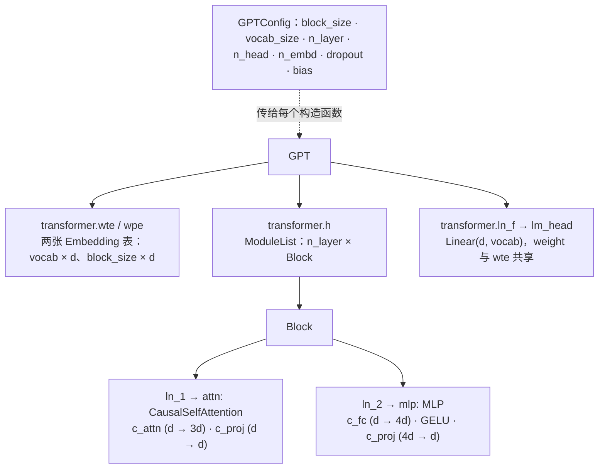

> **本篇在系列中的位置。** 第一段的第三篇。前两篇的结构图与动态线在这里落成 nanoGPT `model.py` 的 330 行；下一篇写训练循环并真正训一个模型，文末的 GPT-2 / Llama 对照表是第 05 篇的起点。完整地图见[总纲](/transformer-and-llm-structure-implementation-and-evolution.html)。

前两篇画了 Transformer 的静态结构和 token 流过它的两条动态线。图看懂了，能不能**写出来**？这一篇的答案是 Andrej Karpathy 的 [nanoGPT](https://github.com/karpathy/nanoGPT)：`model.py` 一个文件、330 行、6 个类，完整定义了 GPT-2，能加载 OpenAI 的原版权重并给出和 HuggingFace 一样的输出。它是目前最好的"从图到代码"的范本——没有多余的抽象，每一行都对应前两篇的某个方框或某一步。

本篇把这 330 行**逐行**过一遍：每段代码解释三件事——它对应结构图的哪个部分（第一篇）、在训练 / 推理的哪一步执行（第二篇）、以及那些"为什么这么写"（为什么 Q、K、V 合成一个矩阵、为什么 mask 叫 `bias`、为什么 `c_proj` 的初始化要除 $$\sqrt{2L}$$、为什么推理时只算最后一个位置的 lm_head）。文中代码块行号旁的蓝色数字可以点，正文里的引用会高亮对应的行。读完之后你应该能不看原文默写出这个文件的骨架，并且能在下一篇用它训出一个会续写莎士比亚的模型。

本篇要回答的核心问题是：

> **一个能加载 GPT-2 权重、能训练、能生成的 Transformer，最少需要写哪些东西？nanoGPT 的每一行分别在实现前两篇的哪个方框、哪一步？[^q0]**

## 一、总览：330 行的地图

### 1. 六个类

| 类 | 行数 | 对应第一篇 | 做什么 |
|---|---:|---|---|
| `LayerNorm` | 11 | 第五章第 2 节 | 可选 bias 的 LayerNorm（PyTorch 自带的不支持 `bias=False`） |
| `CausalSelfAttention` | 47 | 第三章 | Q / K / V 投影、多头、causal mask、softmax、加权求和、W_O |
| `MLP` | 15 | 第四章 | $$d \to 4d \to$$ GELU $$\to d$$ |
| `Block` | 14 | 第六章第 1 节 | pre-norm + 两个残差 |
| `GPTConfig` | 9 | 全篇的超参数 | `block_size`、`vocab_size`、`n_layer`、`n_head`、`n_embd`、`dropout`、`bias` |
| `GPT` | 210 | 第六章 + 第二篇 | embedding、堆 block、lm_head、权重共享、初始化；`forward`、`generate`、`from_pretrained`、`configure_optimizers`、`estimate_mfu` |

Table: nanoGPT model.py 的六个类与它们对应的结构

`GPT` 一个类占了三分之二，因为它除了拼结构，还带着四件"周边"：加载 HF 权重、配置优化器、估算算力利用率、生成。前四个类合起来不到 90 行——**Transformer 的结构本身就这么多**。

### 2. 依赖关系



属性名（`transformer.wte`、`h`、`ln_1`、`c_attn`、`c_proj`、`c_fc`）不是随便起的：它们与 HuggingFace `GPT2LMHeadModel` 的 `state_dict` 键名一一对应，所以 `from_pretrained`（第九章）能按名字把权重搬过来。读别的模型的 `modeling_*.py` 时，先找这几个名字的对应物（第十一章的表）。

### 3. 本文的章节安排

| 章 | 内容 |
|---|---|
| 二 | `LayerNorm`：为什么自己写 |
| 三 | `CausalSelfAttention`：47 行，第一篇《Transformer 长什么样》第四章的六步各在哪一行 |
| 四 | `MLP` 与 `Block` |
| 五 | `GPTConfig`：为什么 vocab_size 是 50304 |
| 六 | `GPT.__init__`：拼结构、权重共享、两种初始化 |
| 七 | `forward`：训练分支与推理分支 |
| 八 | `generate`：温度、top-k、采样；nanoGPT 为什么没有 KV cache |
| 九 | `from_pretrained`：把 OpenAI 的权重搬进来 |
| 十 | `configure_optimizers` 与 `estimate_mfu` |
| 十一 | 与 HuggingFace GPT-2 / Llama 的名字对照；Llama 改了哪五处 |
| 十二 | 本文小结 |
| 十三 | 自测 |

Table: 本文的章节安排

配套：`nanogpt_model.py`（原样 vendored 的 model.py）与 `nanogpt_walkthrough.py`（打印极小配置的全部参数、一次前向的形状、GPT-2 small 的参数量、与 HuggingFace 的 logits 对拍、`generate` 的三种设置）。

## 二、`LayerNorm`：为什么自己写

```python title='model.py 开头：导入与自定义 LayerNorm'
import math
import inspect
from dataclasses import dataclass

import torch
import torch.nn as nn
from torch.nn import functional as F

class LayerNorm(nn.Module):
    """ LayerNorm but with an optional bias. PyTorch doesn't support simply bias=False """

    # !ref ln-init +3
    def __init__(self, ndim, bias):
        super().__init__()
        self.weight = nn.Parameter(torch.ones(ndim))
        self.bias = nn.Parameter(torch.zeros(ndim)) if bias else None

    # !ref ln-fwd +1
    def forward(self, input):
        return F.layer_norm(input, self.weight.shape, self.weight, self.bias, 1e-5)
```

第一篇[《Transformer 长什么样》](/transformer-architecture-from-a-sentence-to-the-next-token.html)第六章第 2 节的 LayerNorm：减均值、除标准差、乘 $$\gamma$$（这里叫 `weight`，初始化为全 1）、加 $$\beta$$（`bias`，全 0）。PyTorch 自带 `nn.LayerNorm`，为什么要自己写 11 行？因为 [`bias` 可以是 `None`](#ln-init)：`GPTConfig.bias=False` 时整个模型（Linear 和 LayerNorm）都不带偏置——Llama 之后的模型都这么做，参数少一点、快一点、效果不差（第五篇讲 bias 为什么消失）；写这篇时 `nn.LayerNorm` 还不支持 `bias=False`（2.1 起支持了）。

[`forward`](#ln-fwd) 直接调 `F.layer_norm`：对最后一维（`self.weight.shape` = `(ndim,)`）归一化，$$\epsilon = 10^{-5}$$ 防止除零。注意归一化是**每个 token 自己**做——输入 `[B, T, d]`，沿 `d` 那一维算均值和方差，`B × T` 个 token 各算各的。

## 三、`CausalSelfAttention`：47 行装下第一篇《Transformer 长什么样》的第四章

```python title='CausalSelfAttention 全文'
class CausalSelfAttention(nn.Module):

    def __init__(self, config):
        super().__init__()
        assert config.n_embd % config.n_head == 0
        # key, query, value projections for all heads, but in a batch
        # !ref attn-cattn
        self.c_attn = nn.Linear(config.n_embd, 3 * config.n_embd, bias=config.bias)
        # output projection
        # !ref attn-cproj
        self.c_proj = nn.Linear(config.n_embd, config.n_embd, bias=config.bias)
        # regularization
        self.attn_dropout = nn.Dropout(config.dropout)
        self.resid_dropout = nn.Dropout(config.dropout)
        self.n_head = config.n_head
        self.n_embd = config.n_embd
        self.dropout = config.dropout
        # flash attention make GPU go brrrrr but support is only in PyTorch >= 2.0
        # !ref attn-flashflag
        self.flash = hasattr(torch.nn.functional, 'scaled_dot_product_attention')
        if not self.flash:
            print("WARNING: using slow attention. Flash Attention requires PyTorch >= 2.0")
            # causal mask to ensure that attention is only applied to the left in the input sequence
            # !ref attn-mask +1
            self.register_buffer("bias", torch.tril(torch.ones(config.block_size, config.block_size))
                                        .view(1, 1, config.block_size, config.block_size))

    def forward(self, x):
        B, T, C = x.size() # batch size, sequence length, embedding dimensionality (n_embd)

        # calculate query, key, values for all heads in batch and move head forward to be the batch dim
        # !ref attn-split
        q, k, v  = self.c_attn(x).split(self.n_embd, dim=2)
        # !ref attn-view +2
        k = k.view(B, T, self.n_head, C // self.n_head).transpose(1, 2) # (B, nh, T, hs)
        q = q.view(B, T, self.n_head, C // self.n_head).transpose(1, 2) # (B, nh, T, hs)
        v = v.view(B, T, self.n_head, C // self.n_head).transpose(1, 2) # (B, nh, T, hs)

        # causal self-attention; Self-attend: (B, nh, T, hs) x (B, nh, hs, T) -> (B, nh, T, T)
        if self.flash:
            # efficient attention using Flash Attention CUDA kernels
            # !ref attn-flash
            y = torch.nn.functional.scaled_dot_product_attention(q, k, v, attn_mask=None, dropout_p=self.dropout if self.training else 0, is_causal=True)
        else:
            # manual implementation of attention
            # !ref attn-manual +4
            att = (q @ k.transpose(-2, -1)) * (1.0 / math.sqrt(k.size(-1)))
            att = att.masked_fill(self.bias[:,:,:T,:T] == 0, float('-inf'))
            att = F.softmax(att, dim=-1)
            att = self.attn_dropout(att)
            y = att @ v # (B, nh, T, T) x (B, nh, T, hs) -> (B, nh, T, hs)
        # !ref attn-merge
        y = y.transpose(1, 2).contiguous().view(B, T, C) # re-assemble all head outputs side by side

        # output projection
        # !ref attn-out
        y = self.resid_dropout(self.c_proj(y))
        return y
```

### 1. 三个投影合成一个矩阵

第一篇里 $$W_Q, W_K, W_V$$ 是三个 $$d \times d$$ 矩阵。这里[只有一个 `c_attn`](#attn-cattn)，形状 $$d \to 3d$$（GPT-2 small：$$768 \to 2304$$）。数学上完全等价——把三个矩阵**横着拼**成一个宽矩阵，$$x$$ 乘一次得到 $$[B, T, 3d]$$，再[沿最后一维切成三段](#attn-split)就是 $$Q, K, V$$。为什么合并：一次大 GEMM 比三次小 GEMM 快（少两次 kernel launch、少两次读 $$x$$），Infra PyTorch 第八篇讲为什么。名字 `c_attn`（c = Conv1D）沿用 OpenAI 原版代码，为了和 HF 权重对上。

[`c_proj`](#attn-cproj) 是第一篇[《Transformer 长什么样》](/transformer-architecture-from-a-sentence-to-the-next-token.html)第四章第 6 节的 $$W_O$$：多头拼接后再混合一次。

### 2. 拆头：`view` + `transpose`

[三行 `view(...).transpose(1, 2)`](#attn-view) 就是第一篇那张"多头形状变化"图：`[B, T, d]` → `view` 成 `[B, T, nh, hs]`（把每行的 $$d$$ 个数按顺序切成 $$nh$$ 段，不动数据）→ `transpose(1, 2)` 成 `[B, nh, T, hs]`（把"头"换到 batch 后面）。为什么要把头换到第 1 维：接下来的 `q @ k.transpose(-2, -1)` 是**批量矩阵乘**（L0 第一篇第五章：最后两维做矩阵乘，前面的维度是批），`B × nh` 个头就成了 `B × nh` 个独立的 $$[T, hs] \times [hs, T]$$，一次调用全算完。`transpose` 只改 stride 不搬数据（Infra PyTorch 第二篇）——这是下面 `contiguous()` 出现的原因。

### 3. 两条路径：Flash 与手写

[`self.flash`](#attn-flashflag) 检查 PyTorch 有没有 `scaled_dot_product_attention`（2.0 起有）。有就走[一行](#attn-flash)：`is_causal=True` 让它自己加下三角 mask，内部用 FlashAttention 一类的融合 kernel，**不会真的造出那张 $$[B, nh, T, T]$$ 的分数表**（Infra GPU Kernel 系列第九篇讲它怎么做到），显存从 $$O(T^2)$$ 降到 $$O(T)$$。

没有就走[手写的五行](#attn-manual)——这五行正是第一篇[《Transformer 长什么样》](/transformer-architecture-from-a-sentence-to-the-next-token.html)第四章第 3 节的第 ②–⑥ 步：

| 行 | 第一篇的步骤 | 说明 |
|---|---|---|
| `att = (q @ k.transpose(-2, -1)) * (1.0 / math.sqrt(k.size(-1)))` | ② 打分 ③ 缩放 | $$QK^T / \sqrt{d_h}$$；注意除的是**每头维度** $$hs = 64$$，不是 $$d$$ |
| `att = att.masked_fill(self.bias[:,:,:T,:T] == 0, float('-inf'))` | ④ mask | 下三角外填 $$-\infty$$；`[:T, :T]` 是因为 mask 按最大长度 `block_size` 预先建好，实际序列可能更短 |
| `att = F.softmax(att, dim=-1)` | ⑤ softmax | 沿最后一维（key 那一维）归一化，每行和为 1 |
| `att = self.attn_dropout(att)` | — | 训练时随机丢一些权重（正则化，L3 第四篇）；`eval()` 下不做 |
| `y = att @ v` | ⑥ 加权求和 | `[B, nh, T, T] × [B, nh, T, hs] → [B, nh, T, hs]` |

Table: 手写 attention 的五行与第一篇六步的对应

那个 mask 为什么[叫 `bias`](#attn-mask)？又是为了和 OpenAI / HF 的 checkpoint 键名一致（它们把 mask 存成了一个叫 `attn.bias` 的 buffer）。`register_buffer` 让它随模型 `.to(device)`、进 `state_dict`（`from_pretrained` 里要专门把它剔掉），但不是参数、没有梯度——Infra PyTorch 第四篇讲 buffer 与 parameter 的区别。`torch.tril(torch.ones(T, T))` 就是第一篇手算图里那个下三角的 0/1 矩阵，`view(1, 1, T, T)` 加两个维度是为了能广播到 `[B, nh, T, T]`。

### 4. 拼回去

[`y.transpose(1, 2).contiguous().view(B, T, C)`](#attn-merge) 是拆头的逆操作：`[B, nh, T, hs]` → `transpose` 回 `[B, T, nh, hs]` → `view` 成 `[B, T, d]`。中间必须 `contiguous()`：`transpose` 之后的张量在内存里不连续，`view` 会报错（Infra PyTorch 第二篇第五章的那个例子，这里是它在真实代码里的样子）；`contiguous()` 做一次真实拷贝把顺序理顺。然后[过 `c_proj`（$$W_O$$）再 dropout](#attn-out)，输出 `[B, T, d]`——和输入同形状，可以加回残差流。

## 四、`MLP` 与 `Block`

```python title='MLP 与 Block 全文'
class MLP(nn.Module):

    # !ref mlp-init +5
    def __init__(self, config):
        super().__init__()
        self.c_fc    = nn.Linear(config.n_embd, 4 * config.n_embd, bias=config.bias)
        self.gelu    = nn.GELU()
        self.c_proj  = nn.Linear(4 * config.n_embd, config.n_embd, bias=config.bias)
        self.dropout = nn.Dropout(config.dropout)

    # !ref mlp-fwd +5
    def forward(self, x):
        x = self.c_fc(x)
        x = self.gelu(x)
        x = self.c_proj(x)
        x = self.dropout(x)
        return x

class Block(nn.Module):

    # !ref block-init +5
    def __init__(self, config):
        super().__init__()
        self.ln_1 = LayerNorm(config.n_embd, bias=config.bias)
        self.attn = CausalSelfAttention(config)
        self.ln_2 = LayerNorm(config.n_embd, bias=config.bias)
        self.mlp = MLP(config)

    # !ref block-fwd +3
    def forward(self, x):
        x = x + self.attn(self.ln_1(x))
        x = x + self.mlp(self.ln_2(x))
        return x
```

[`MLP`](#mlp-init) 是第一篇[《Transformer 长什么样》](/transformer-architecture-from-a-sentence-to-the-next-token.html)第五章的公式原样：`c_fc` 放大到 $$4d$$（$$768 \to 3072$$），GELU，`c_proj` 压回 $$d$$。[`forward`](#mlp-fwd) 四行按顺序执行，每个 token 各自过——`nn.Linear` 作用于最后一维，前面的 `[B, T]` 都是"批"，所以 token 之间天然不交流。

[`Block`](#block-init) 把四个部件装在一起，[`forward` 两行](#block-fwd)就是第一篇[《Transformer 长什么样》](/transformer-architecture-from-a-sentence-to-the-next-token.html)第八章第 1 节那张 block 数据流图：`x + attn(ln_1(x))`——先归一化、过 attention、加回原来的 `x`（残差）；再对 FFN 做一遍。LayerNorm 在子层**之前**（pre-norm），残差加的是**归一化之前**的 `x`——这两点决定了残差流不经过任何归一化，梯度有一条直通路（第一篇第五章第 3 节）。

## 五、`GPTConfig`：为什么 vocab_size 是 50304

```python title='GPTConfig：vocab_size 填到 50304'
@dataclass
class GPTConfig:
    block_size: int = 1024
    # !ref cfg-vocab
    vocab_size: int = 50304 # GPT-2 vocab_size of 50257, padded up to nearest multiple of 64 for efficiency
    n_layer: int = 12
    n_head: int = 12
    n_embd: int = 768
    dropout: float = 0.0
    bias: bool = True # True: bias in Linears and LayerNorms, like GPT-2. False: a bit better and faster
```

七个超参数（工具箱第一篇的 `dataclass` 配置）。默认值就是 GPT-2 small，只有一处不同：[`vocab_size = 50304`](#cfg-vocab) 而不是真实的 50257。50304 是 50257 向上取到 64 的倍数——lm_head 那个 $$768 \times V$$ 的矩阵乘法在 $$V$$ 是 64 的倍数时 GPU 跑得明显更快（Tensor Core 按 8 / 16 / 64 对齐，Infra GPU Kernel 系列第六篇）；多出来的 47 个词永远不会出现在数据里，模型学会给它们几乎为 0 的概率。从零训练时用 50304；`from_pretrained` 加载 GPT-2 权重时强制回 50257（第九章）。

`block_size` 是上下文上限（位置表的行数，第一篇[《Transformer 长什么样》](/transformer-architecture-from-a-sentence-to-the-next-token.html)第三章第 2 节）；`bias=False` 是 Llama 式的选择，作者注释说"稍好一点、快一点"。

## 六、`GPT.__init__`：拼结构、共享权重、两种初始化

```python title='GPT.__init__ 全文：ModuleDict、权重共享、初始化'
class GPT(nn.Module):

    def __init__(self, config):
        super().__init__()
        assert config.vocab_size is not None
        assert config.block_size is not None
        self.config = config

        # !ref gpt-dict +6
        self.transformer = nn.ModuleDict(dict(
            wte = nn.Embedding(config.vocab_size, config.n_embd),
            wpe = nn.Embedding(config.block_size, config.n_embd),
            drop = nn.Dropout(config.dropout),
            h = nn.ModuleList([Block(config) for _ in range(config.n_layer)]),
            ln_f = LayerNorm(config.n_embd, bias=config.bias),
        ))
        # !ref gpt-head
        self.lm_head = nn.Linear(config.n_embd, config.vocab_size, bias=False)
        # with weight tying when using torch.compile() some warnings get generated:
        # "UserWarning: functional_call was passed multiple values for tied weights.
        # This behavior is deprecated and will be an error in future versions"
        # not 100% sure what this is, so far seems to be harmless. TODO investigate
        # !ref gpt-tie
        self.transformer.wte.weight = self.lm_head.weight # https://paperswithcode.com/method/weight-tying

        # init all weights
        # !ref gpt-init
        self.apply(self._init_weights)
        # apply special scaled init to the residual projections, per GPT-2 paper
        # !ref gpt-scaled +2
        for pn, p in self.named_parameters():
            if pn.endswith('c_proj.weight'):
                torch.nn.init.normal_(p, mean=0.0, std=0.02/math.sqrt(2 * config.n_layer))

        # report number of parameters
        print("number of parameters: %.2fM" % (self.get_num_params()/1e6,))

    # !ref numparams +9
    def get_num_params(self, non_embedding=True):
        """
        Return the number of parameters in the model.
        For non-embedding count (default), the position embeddings get subtracted.
        The token embeddings would too, except due to the parameter sharing these
        params are actually used as weights in the final layer, so we include them.
        """
        n_params = sum(p.numel() for p in self.parameters())
        if non_embedding:
            n_params -= self.transformer.wpe.weight.numel()
        return n_params

    # !ref initweights +6
    def _init_weights(self, module):
        if isinstance(module, nn.Linear):
            torch.nn.init.normal_(module.weight, mean=0.0, std=0.02)
            if module.bias is not None:
                torch.nn.init.zeros_(module.bias)
        elif isinstance(module, nn.Embedding):
            torch.nn.init.normal_(module.weight, mean=0.0, std=0.02)
```

### 1. 拼结构

[`nn.ModuleDict`](#gpt-dict) 装着第一篇图 1 从上到下的部件：`wte`（token 表 $$V \times d$$）、`wpe`（位置表 $$\text{block\_size} \times d$$）、`drop`（embedding 后的 dropout）、`h`（$$n_{\text{layer}}$$ 个 `Block` 的 `ModuleList`，Infra PyTorch 第四篇讲为什么不能用普通 list）、`ln_f`（最后一次 LayerNorm）。用 `ModuleDict` 而不是直接 `self.wte = ...`，只为了让 `state_dict` 的键长成 `transformer.wte.weight`——与 HF 一致。

[`lm_head`](#gpt-head) 是 $$d \to V$$ 的线性层，不带 bias。

### 2. 权重共享

[`self.transformer.wte.weight = self.lm_head.weight`](#gpt-tie)：把 embedding 表的 `weight` **指向** lm_head 的 `weight`——之后两者是同一个 `Parameter` 对象，一处更新两处生效，`state_dict` 里也只存一份（`nanogpt_walkthrough.py` 第 1 步打印的参数列表里没有 `lm_head.weight`，就是这个原因）。第一篇第六章第 2 节讲了为什么可以共享：查表是"编号 → 向量"，lm_head 是"向量 → 每个编号的分数"，同一张表做两件事。省下 $$V \times d = 3860$$ 万参数——GPT-2 small 的 31%。

一个细节：形状对得上吗？`nn.Embedding(V, d).weight` 是 `[V, d]`，`nn.Linear(d, V).weight` 也是 `[V, d]`（PyTorch 的 Linear 权重存成 `[out, in]`），所以可以直接赋值，不用转置。

### 3. 两种初始化

[`self.apply(self._init_weights)`](#gpt-init) 对每个子模块调一次 [`_init_weights`](#initweights)：所有 `Linear` 与 `Embedding` 的权重从 $$\mathcal{N}(0, 0.02^2)$$ 采样，bias 置 0。0.02 是 GPT-2 论文的数（$$1/\sqrt{d}$$ 量级，L3 第二篇讲初始化的方差怎么定）。第二篇第二章那个"随机初始化 loss ≈ $$\ln V$$"就靠它——初始化太大 logits 就会很极端。

然后[对所有 `c_proj.weight` 再来一次](#gpt-scaled)，标准差改成 $$0.02 / \sqrt{2L}$$。为什么？`c_proj` 是每个子层**写回残差流**的那个矩阵（attention 的 $$W_O$$ 与 FFN 的第二个矩阵）。$$L$$ 层有 $$2L$$ 个子层往残差流里加东西，如果每份的方差都一样，残差流的方差会随 $$2L$$ 线性增长；把每份的标准差除以 $$\sqrt{2L}$$，$$2L$$ 份加起来的方差恰好回到 1。这是 GPT-2 论文里的一句话，nanoGPT 忠实实现了它；第一篇第五章第 1 节说残差流上"每次修正量都比主干小得多"，这就是保证它的手段。

[`get_num_params`](#numparams) 默认扣掉 `wpe` 的参数（作者认为位置表不算"模型"），所以 GPT-2 small 打印 123.65M；加回来是 124.44M，与第一篇的表一致。`wte` 没有扣，因为它兼任 lm_head。

## 七、`forward`：训练分支与推理分支

```python title='GPT.forward 全文：训练分支与推理分支'
    def forward(self, idx, targets=None):
        device = idx.device
        b, t = idx.size()
        # !ref fwd-assert
        assert t <= self.config.block_size, f"Cannot forward sequence of length {t}, block size is only {self.config.block_size}"
        # !ref fwd-pos
        pos = torch.arange(0, t, dtype=torch.long, device=device) # shape (t)

        # forward the GPT model itself
        # !ref fwd-emb +5
        tok_emb = self.transformer.wte(idx) # token embeddings of shape (b, t, n_embd)
        pos_emb = self.transformer.wpe(pos) # position embeddings of shape (t, n_embd)
        x = self.transformer.drop(tok_emb + pos_emb)
        for block in self.transformer.h:
            x = block(x)
        x = self.transformer.ln_f(x)

        if targets is not None:
            # if we are given some desired targets also calculate the loss
            # !ref fwd-loss +1
            logits = self.lm_head(x)
            loss = F.cross_entropy(logits.view(-1, logits.size(-1)), targets.view(-1), ignore_index=-1)
        else:
            # inference-time mini-optimization: only forward the lm_head on the very last position
            # !ref fwd-last
            logits = self.lm_head(x[:, [-1], :]) # note: using list [-1] to preserve the time dim
            loss = None

        return logits, loss
```

这 20 行就是第二篇的两条动态线合在一起。

**共同部分**（[6 行](#fwd-emb)）：`wte(idx)` 查表得 `[b, t, d]`；[`pos = arange(t)`](#fwd-pos) 是 `[0, 1, ..., t-1]`，`wpe(pos)` 得 `[t, d]`，与 `tok_emb` 相加时**广播**到每句话（L0 第一篇第五章第 3 节）；dropout；依次过每个 block；`ln_f`。[`assert t <= block_size`](#fwd-assert) 是位置表只有 `block_size` 行的直接后果。

**训练分支**（传了 `targets`，[2 行](#fwd-loss)）：对**全部** $$t$$ 个位置算 lm_head 得 `[b, t, V]`，拍平成 `[b·t, V]` 与 `[b·t]` 的目标算交叉熵——第二篇第三章那一行。`ignore_index=-1`：目标里标成 $$-1$$ 的位置不算 loss（padding 用，nanoGPT 自己没用到）。注意这里用的是 `targets.view(-1)`：`view` 要求张量连续，`train.py` 的 `get_batch` 用 `torch.stack` 造出的 `y` 是连续的所以没问题；如果你自己传 `idx[:, 1:]` 这样的切片进来，会报 "view size is not compatible"（`nanogpt_walkthrough.py` 里特意 `.contiguous()` 了一下），这是 Infra PyTorch 第二篇那个问题的又一次现身。

**推理分支**（没传 `targets`，[1 行](#fwd-last)）：只对**最后一个位置** `x[:, [-1], :]` 算 lm_head。第二篇第五章说过 prefill 时 $$t$$ 个位置只有最后一个的分布有用；lm_head 是 $$768 \times 50257$$ 的大矩阵，对 1024 个位置全算一遍要 $$2 \times 1024 \times 768 \times 50257 \approx 79$$ GFLOPs，只算一个位置省掉 99.9%。用 `[-1]` 而不是 `-1` 是为了保留时间维（`[b, 1, d]` 而不是 `[b, d]`），让返回值的形状在两个分支下一致（都是三维）。

## 八、`generate`：温度、top-k、采样

```python title='GPT.generate 全文：温度、top-k、采样'
    @torch.no_grad()
    def generate(self, idx, max_new_tokens, temperature=1.0, top_k=None):
        """
        Take a conditioning sequence of indices idx (LongTensor of shape (b,t)) and complete
        the sequence max_new_tokens times, feeding the predictions back into the model each time.
        Most likely you'll want to make sure to be in model.eval() mode of operation for this.
        """
        for _ in range(max_new_tokens):
            # if the sequence context is growing too long we must crop it at block_size
            # !ref gen-crop
            idx_cond = idx if idx.size(1) <= self.config.block_size else idx[:, -self.config.block_size:]
            # forward the model to get the logits for the index in the sequence
            # !ref gen-fwd
            logits, _ = self(idx_cond)
            # pluck the logits at the final step and scale by desired temperature
            # !ref gen-temp
            logits = logits[:, -1, :] / temperature
            # optionally crop the logits to only the top k options
            # !ref gen-topk +2
            if top_k is not None:
                v, _ = torch.topk(logits, min(top_k, logits.size(-1)))
                logits[logits < v[:, [-1]]] = -float('Inf')
            # apply softmax to convert logits to (normalized) probabilities
            probs = F.softmax(logits, dim=-1)
            # sample from the distribution
            # !ref gen-sample
            idx_next = torch.multinomial(probs, num_samples=1)
            # append sampled index to the running sequence and continue
            # !ref gen-cat
            idx = torch.cat((idx, idx_next), dim=1)

        return idx
```

第二篇第五章的生成循环，一共 8 行有效代码：

1. [`idx_cond`](#gen-crop)：序列超过 `block_size` 就只保留最后 `block_size` 个——位置表只有那么多行，再长模型也看不了（GPT-2 的硬上限）。
2. [`self(idx_cond)`](#gen-fwd)：整段前向。**注意这里每一步都重新前向整段序列**——nanoGPT 没有 KV cache，用的是第二篇第六章第 1 节说的"朴素做法"。对一个教学仓库这是正确的取舍（少 30 行、少一类 bug）；代价是生成 $$n$$ 个 token 的计算量随 $$n^2$$ 增长。第二篇的 `token_journey.py` 给同样结构加了 cache，两者输出逐 token 一致。
3. [`/ temperature`](#gen-temp)：只取最后一个位置的 logits（第七章的推理分支其实已经只返回了这一个位置），除以温度——温度 < 1 让分布更尖（更保守），> 1 更平（更随机），趋近 0 就是贪心（L0 第五篇画过温度对分布的影响）。
4. [top-k](#gen-topk)：`torch.topk` 取前 $$k$$ 大的 logits，比第 $$k$$ 大还小的全部设成 $$-\infty$$（softmax 后为 0）——把长尾里那些概率 0.001 的词砍掉，避免采到明显的胡话。
5. [`multinomial`](#gen-sample)：按概率抽一个（L0 第四篇的类别分布采样）。
6. [`cat`](#gen-cat)：接到序列末尾，下一轮继续。

`@torch.no_grad()` 让整个循环不建计算图（推理没有反向）。`nanogpt_walkthrough.py` 第 5 步用真实 GPT-2 权重跑了三组：

```text title='真实 GPT-2 权重下三组温度 / top-k 的生成结果'
温度 1e-4（≈贪心）    → 'The meaning of life is not the same as the meaning of death.\n\nThe'
温度 1.0 + top_k 50   → 'The meaning of life is as much in the beginning as it is in the end,'
温度 1.5 + top_k 50   → 'The meaning of life is far different of late times: A person who is going through'
```

同一个 prompt，温度越高越"放飞"。

## 九、`from_pretrained`：把 OpenAI 的权重搬进来

```python title='crop_block_size 与 from_pretrained 全文'
    # !ref crop +8
    def crop_block_size(self, block_size):
        # model surgery to decrease the block size if necessary
        # e.g. we may load the GPT2 pretrained model checkpoint (block size 1024)
        # but want to use a smaller block size for some smaller, simpler model
        assert block_size <= self.config.block_size
        self.config.block_size = block_size
        self.transformer.wpe.weight = nn.Parameter(self.transformer.wpe.weight[:block_size])
        for block in self.transformer.h:
            if hasattr(block.attn, 'bias'):
                block.attn.bias = block.attn.bias[:,:,:block_size,:block_size]

    @classmethod
    def from_pretrained(cls, model_type, override_args=None):
        assert model_type in {'gpt2', 'gpt2-medium', 'gpt2-large', 'gpt2-xl'}
        override_args = override_args or {} # default to empty dict
        # only dropout can be overridden see more notes below
        assert all(k == 'dropout' for k in override_args)
        from transformers import GPT2LMHeadModel
        print("loading weights from pretrained gpt: %s" % model_type)

        # n_layer, n_head and n_embd are determined from model_type
        # !ref fp-table +5
        config_args = {
            'gpt2':         dict(n_layer=12, n_head=12, n_embd=768),  # 124M params
            'gpt2-medium':  dict(n_layer=24, n_head=16, n_embd=1024), # 350M params
            'gpt2-large':   dict(n_layer=36, n_head=20, n_embd=1280), # 774M params
            'gpt2-xl':      dict(n_layer=48, n_head=25, n_embd=1600), # 1558M params
        }[model_type]
        print("forcing vocab_size=50257, block_size=1024, bias=True")
        # !ref fp-force +2
        config_args['vocab_size'] = 50257 # always 50257 for GPT model checkpoints
        config_args['block_size'] = 1024 # always 1024 for GPT model checkpoints
        config_args['bias'] = True # always True for GPT model checkpoints
        # we can override the dropout rate, if desired
        if 'dropout' in override_args:
            print(f"overriding dropout rate to {override_args['dropout']}")
            config_args['dropout'] = override_args['dropout']
        # create a from-scratch initialized minGPT model
        config = GPTConfig(**config_args)
        model = GPT(config)
        sd = model.state_dict()
        sd_keys = sd.keys()
        # !ref fp-strip
        sd_keys = [k for k in sd_keys if not k.endswith('.attn.bias')] # discard this mask / buffer, not a param

        # init a huggingface/transformers model
        model_hf = GPT2LMHeadModel.from_pretrained(model_type)
        sd_hf = model_hf.state_dict()

        # copy while ensuring all of the parameters are aligned and match in names and shapes
        sd_keys_hf = sd_hf.keys()
        sd_keys_hf = [k for k in sd_keys_hf if not k.endswith('.attn.masked_bias')] # ignore these, just a buffer
        sd_keys_hf = [k for k in sd_keys_hf if not k.endswith('.attn.bias')] # same, just the mask (buffer)
        # !ref fp-transposed
        transposed = ['attn.c_attn.weight', 'attn.c_proj.weight', 'mlp.c_fc.weight', 'mlp.c_proj.weight']
        # basically the openai checkpoints use a "Conv1D" module, but we only want to use a vanilla Linear
        # this means that we have to transpose these weights when we import them
        assert len(sd_keys_hf) == len(sd_keys), f"mismatched keys: {len(sd_keys_hf)} != {len(sd_keys)}"
        # !ref fp-copy +10
        for k in sd_keys_hf:
            if any(k.endswith(w) for w in transposed):
                # special treatment for the Conv1D weights we need to transpose
                assert sd_hf[k].shape[::-1] == sd[k].shape
                with torch.no_grad():
                    sd[k].copy_(sd_hf[k].t())
            else:
                # vanilla copy over the other parameters
                assert sd_hf[k].shape == sd[k].shape
                with torch.no_grad():
                    sd[k].copy_(sd_hf[k])

        return model
```

这一段的意义是**验证前面所有代码是对的**：如果结构与 GPT-2 有任何出入，OpenAI 训好的权重装进来就会输出胡话。

1. [四个尺寸的表](#fp-table)：GPT-2 small / medium / large / xl 只差三个数——层数、头数、宽度；`vocab_size`、`block_size`、`bias` 被[强制](#fp-force)成 checkpoint 的值（50257，不是训练用的 50304）。这张表就是第一篇第六章第 3 节参数量公式的四次代入。
2. [剔掉 `attn.bias`](#fp-strip)：两边的 `state_dict` 里都有那个 mask buffer，它不是权重、形状还可能不同（`block_size` 不同），比对前先删掉。
3. [四个要转置的矩阵](#fp-transposed)：OpenAI 原版用 TensorFlow 的 `Conv1D`，权重存成 `[in, out]`；PyTorch `Linear` 是 `[out, in]`。所以 `c_attn`、`c_proj`、`c_fc`、`c_proj` 四个矩阵要 `.t()` 后再拷；LayerNorm、embedding 不用。
4. [逐键拷贝](#fp-copy)：先 `assert` 形状对得上，再 `copy_` 进当前模型的参数（`with torch.no_grad()` 避免被 Autograd 记录）。

`nanogpt_walkthrough.py` 第 4 步的对拍：对同一句话，nanoGPT 与 HF 的最后一个位置 logits 相对差 $$9 \times 10^{-5}$$，argmax 相同，下一个 token 的前五名 `so / too / a / hungry / the`。这个数字是"我写的结构和 OpenAI 的一模一样"的证明。

[`crop_block_size`](#crop) 是配套的"手术"：加载的 GPT-2 上下文是 1024，如果想用更短的上下文微调，把 `wpe` 表切到前 `block_size` 行、mask 也切小——位置表就是一张普通的表，可以切。

## 十、`configure_optimizers` 与 `estimate_mfu`

```python title='configure_optimizers 与 estimate_mfu 全文'
    def configure_optimizers(self, weight_decay, learning_rate, betas, device_type):
        # start with all of the candidate parameters
        param_dict = {pn: p for pn, p in self.named_parameters()}
        # filter out those that do not require grad
        param_dict = {pn: p for pn, p in param_dict.items() if p.requires_grad}
        # create optim groups. Any parameters that is 2D will be weight decayed, otherwise no.
        # i.e. all weight tensors in matmuls + embeddings decay, all biases and layernorms don't.
        # !ref opt-groups +5
        decay_params = [p for n, p in param_dict.items() if p.dim() >= 2]
        nodecay_params = [p for n, p in param_dict.items() if p.dim() < 2]
        optim_groups = [
            {'params': decay_params, 'weight_decay': weight_decay},
            {'params': nodecay_params, 'weight_decay': 0.0}
        ]
        num_decay_params = sum(p.numel() for p in decay_params)
        num_nodecay_params = sum(p.numel() for p in nodecay_params)
        print(f"num decayed parameter tensors: {len(decay_params)}, with {num_decay_params:,} parameters")
        print(f"num non-decayed parameter tensors: {len(nodecay_params)}, with {num_nodecay_params:,} parameters")
        # Create AdamW optimizer and use the fused version if it is available
        # !ref opt-fused +3
        fused_available = 'fused' in inspect.signature(torch.optim.AdamW).parameters
        use_fused = fused_available and device_type == 'cuda'
        extra_args = dict(fused=True) if use_fused else dict()
        optimizer = torch.optim.AdamW(optim_groups, lr=learning_rate, betas=betas, **extra_args)
        print(f"using fused AdamW: {use_fused}")

        return optimizer

    def estimate_mfu(self, fwdbwd_per_iter, dt):
        """ estimate model flops utilization (MFU) in units of A100 bfloat16 peak FLOPS """
        # first estimate the number of flops we do per iteration.
        # see PaLM paper Appendix B as ref: https://arxiv.org/abs/2204.02311
        N = self.get_num_params()
        cfg = self.config
        L, H, Q, T = cfg.n_layer, cfg.n_head, cfg.n_embd//cfg.n_head, cfg.block_size
        # !ref mfu-flops +3
        flops_per_token = 6*N + 12*L*H*Q*T
        flops_per_fwdbwd = flops_per_token * T
        flops_per_iter = flops_per_fwdbwd * fwdbwd_per_iter
        # express our flops throughput as ratio of A100 bfloat16 peak flops
        # !ref mfu-ratio +3
        flops_achieved = flops_per_iter * (1.0/dt) # per second
        flops_promised = 312e12 # A100 GPU bfloat16 peak flops is 312 TFLOPS
        mfu = flops_achieved / flops_promised
        return mfu
```

### 1. 谁做 weight decay

工具箱第三篇说 `weight_decay=0.1` 是"参数别太大"的惩罚。nanoGPT 不是对所有参数一视同仁：[按维度分两组](#opt-groups)——二维以上的（所有矩阵：`c_attn`、`c_proj`、`c_fc`、`wte`、`wpe`）做 decay，一维的（所有 bias、LayerNorm 的 $$\gamma$$、$$\beta$$）不做。理由：decay 是在压"权重的大小"，对矩阵这是正则化；对 LayerNorm 的缩放参数，压向 0 会直接破坏归一化后的尺度，对 bias 也没意义。这是训练 Transformer 的通行做法（HF 的 Trainer 也这么分）。

[fused AdamW](#opt-fused)：PyTorch 2.0 起 `AdamW(fused=True)` 把几十个参数张量的更新合成一个 kernel，避免工具箱第三篇说的"100 个参数张量 × 10 个算子 = 1000 次 launch"（Infra PyTorch 第八篇）；只在 CUDA 上可用，所以先检查。

### 2. MFU：用了硬件几成算力

MFU（model FLOPs utilization）= 实际达到的 FLOP/s ÷ 硬件峰值。[每 token 的 FLOPs](#mfu-flops) 是 $$6N + 12 L H Q T$$：

- $$6N$$：每个参数在前向做一次乘加（$$2N$$，L0 第一篇的"一个 token 过整个模型 ≈ $$2N$$"），反向约两倍（$$4N$$），合计 $$6N$$——第十二篇会把它按 GEMM 逐个算出来；
- $$12 L H Q T$$：attention 里 $$QK^T$$ 与 $$PV$$ 两个矩阵乘**与参数无关**、与上下文长度 $$T$$ 成正比（L0 第一篇第六章表末那一行）：每层每头 $$2 \times 2 \times Q \times T$$ FLOPs 前向，乘 3（含反向）、乘 $$L H$$。

乘上每次迭代处理的 token 数，除以一次迭代的时间，再[除以 A100 的 312 TFLOPS](#mfu-ratio)。GPT-2 small 在 A100 上训到 MFU 约 40% 左右算正常；这个数字是下一篇训练时的重要仪表。第六篇讲为什么到不了 100%。

## 十一、名字对照：nanoGPT、HuggingFace GPT-2、Llama

读别的模型代码时，先把名字对上。三处同一结构：

| 结构（第一篇） | nanoGPT | HF `modeling_gpt2.py` | HF `modeling_llama.py` |
|---|---|---|---|
| token embedding | `transformer.wte` | `transformer.wte` | `model.embed_tokens` |
| 位置 | `transformer.wpe`（表） | `transformer.wpe` | 无表；`rotary_emb`（RoPE） |
| block 列表 | `transformer.h` | `transformer.h` | `model.layers` |
| 子层前的归一化 | `ln_1` / `ln_2`（LayerNorm） | `ln_1` / `ln_2` | `input_layernorm` / `post_attention_layernorm`（RMSNorm） |
| Q / K / V 投影 | `attn.c_attn`（一个 $$d \to 3d$$） | `attn.c_attn` | `self_attn.q_proj` / `k_proj` / `v_proj`（三个；K、V 更窄） |
| 输出投影 $$W_O$$ | `attn.c_proj` | `attn.c_proj` | `self_attn.o_proj` |
| FFN | `mlp.c_fc` → GELU → `mlp.c_proj` | 同左 | `mlp.gate_proj`、`up_proj` → SiLU 门控 → `down_proj` |
| 最后归一化 | `transformer.ln_f` | `transformer.ln_f` | `model.norm` |
| 输出层 | `lm_head`（与 wte 共享） | `lm_head`（共享） | `lm_head`（不共享） |

Table: 同一结构在 nanoGPT、HuggingFace GPT-2 与 Llama 里的名字

最后一列已经把 Llama 相对 GPT-2 的改动全列出来了——**只有五处**：

1. LayerNorm → **RMSNorm**（不减均值，省一次运算）；
2. 位置表 → **RoPE**（第七篇）；
3. GELU 两矩阵 FFN → **SwiGLU 三矩阵**（gate / up / down，第五篇讲 14336 怎么来的）；
4. K、V 投影变窄 → **GQA**（多个 Q 头共用一组 K、V，第八篇）；
5. **去掉所有 bias**，lm_head 不再与 embedding 共享。

其余——残差流、pre-norm、causal mask、softmax、多头拆合、$$1/\sqrt{d_h}$$——一行没变。所以本篇的 330 行读懂了，`modeling_llama.py` 就只剩五个局部改动要看，这正是第五篇的内容。

## 十二、本文小结

- nanoGPT `model.py` 330 行、6 个类；结构本身（`LayerNorm` + `CausalSelfAttention` + `MLP` + `Block`）不到 90 行，`GPT` 类的大部分是周边：加载权重、优化器、MFU、生成。
- **attention 的实现细节**：Q、K、V 合成一个 $$d \to 3d$$ 的 `c_attn` 一次算完再 `split`；`view` + `transpose` 把头换到第 1 维以便批量矩阵乘；有 `scaled_dot_product_attention` 就走融合 kernel，否则手写五行（打分、缩放、mask、softmax、加权）；拼回去要 `contiguous()`；mask 叫 `bias` 是为了和 checkpoint 键名一致。
- **`GPT.__init__`** 用 `ModuleDict` 让键名与 HF 一致；`wte.weight = lm_head.weight` 共享权重省 31% 参数；所有权重 $$\mathcal N(0, 0.02^2)$$，写回残差流的 `c_proj` 再除 $$\sqrt{2L}$$ 让 $$2L$$ 次相加后方差不涨。
- **`forward`** 传 `targets` 时对全部位置算 lm_head 与交叉熵（训练），不传时只算最后一个位置（推理，省 99.9% 的 lm_head 计算）。
- **`generate`**：裁到 `block_size` → 前向 → 除温度 → top-k 砍长尾 → 按概率抽 → 接上；每步重算整段，**没有 KV cache**（教学取舍）。
- **`from_pretrained`** 按名字逐键拷贝 HF 权重，四个来自 `Conv1D` 的矩阵要转置；对拍相对差 $$9 \times 10^{-5}$$——结构正确的证明。
- **`configure_optimizers`** 只对二维以上参数做 weight decay；**`estimate_mfu`** 用 $$6N + 12LHQT$$ 算每 token FLOPs。
- Llama 相对 GPT-2 只改了五处：RMSNorm、RoPE、SwiGLU、GQA、去 bias。

配套：`nanogpt_model.py`、`nanogpt_walkthrough.py` 与 `expected/nanogpt_walkthrough.txt`（[ai-learning-labs/transformer-and-llm](https://github.com/arganzheng/ai-learning-labs/tree/main/transformer-and-llm)）。

## 十三、自测

1. `c_attn` 的输出形状是 `[B, T, 3d]`，`split(self.n_embd, dim=2)` 之后 `q`、`k`、`v` 各是什么形状？如果改用三个独立的 `nn.Linear(d, d)`，数学结果会变吗？

   <details markdown="1"><summary>答案</summary>

   各是 `[B, T, d]`。不会变——一个 $$d \times 3d$$ 的矩阵横着切成三个 $$d \times d$$ 就是 $$W_Q, W_K, W_V$$；合并只是为了一次 GEMM 更快。见[第三章第 1 节](#1-三个投影合成一个矩阵)。
   </details>

2. 为什么 `y.transpose(1, 2).view(B, T, C)` 会报错，中间必须加 `.contiguous()`？

   <details markdown="1"><summary>答案</summary>

   `transpose` 只交换 stride、不搬数据，之后的张量在内存里不连续；`view` 要求能用一组 stride 描述目标形状，不连续时做不到。`contiguous()` 按逻辑顺序拷贝一份连续的。Infra PyTorch 第二篇第五章的例子，见[第三章第 4 节](#4-拼回去)。
   </details>

3. `_init_weights` 已经把所有 Linear 初始化为 $$\mathcal N(0, 0.02^2)$$，为什么还要对 `c_proj.weight` 单独用 $$0.02/\sqrt{2L}$$？

   <details markdown="1"><summary>答案</summary>

   `c_proj` 是每个子层写回残差流的矩阵；$$L$$ 层共 $$2L$$ 个子层往残差流里加东西，若每份方差相同，残差流方差随 $$2L$$ 线性增长；每份标准差除以 $$\sqrt{2L}$$ 后总方差不涨。见[第六章第 3 节](#3-两种初始化)。
   </details>

4. 推理时 `forward` 为什么只对 `x[:, [-1], :]` 算 lm_head？省了多少？

   <details markdown="1"><summary>答案</summary>

   生成下一个 token 只需要最后一个位置的分布；lm_head 是 $$d \times V$$ 的大矩阵，$$T = 1024$$ 时全算是 79 GFLOPs，只算一个位置是 1/1024。见[第七章](#七forward训练分支与推理分支)。
   </details>

5. `from_pretrained` 里哪四个权重要转置？为什么 LayerNorm 和 embedding 不用？

   <details markdown="1"><summary>答案</summary>

   `attn.c_attn`、`attn.c_proj`、`mlp.c_fc`、`mlp.c_proj`——OpenAI 用 `Conv1D` 存成 `[in, out]`，PyTorch `Linear` 是 `[out, in]`。LayerNorm 是一维向量、embedding 两边都是 `[V, d]`，形状一致直接拷。见[第九章](#九from_pretrained把-openai-的权重搬进来)。
   </details>

6. nanoGPT 的 `generate` 生成 500 个 token 时，第 500 步前向了多少个位置？加上 KV cache 后是多少？

   <details markdown="1"><summary>答案</summary>

   prompt 长度 + 499 个——每步重算整段（第二篇第六章的朴素做法）；有 cache 只算 1 个。nanoGPT 有意省掉 cache 换取代码简单。见[第八章](#八generate温度top-k采样)。
   </details>

## 下一篇

模型有了，还差数据、训练循环和一张 GPU。[下一篇《手搓 GPT（下）：nanoGPT train.py 与训一个会续写的模型》](/nanogpt-train-py-and-training-a-model-that-writes.html)把 336 行的训练脚本也逐块过一遍，然后在莎士比亚全集上训 5 分钟，看它从乱码到能写出像样的台词；再改层数和头数各跑一次——"改结构"的第一次体验。

[^q0]: 最少四个类、不到 90 行：`LayerNorm`（可选 bias）、`CausalSelfAttention`（`c_attn` 一次算出 Q/K/V → `view`/`transpose` 拆头 → 打分、缩放、mask、softmax、加权 → 拼回 → `c_proj`）、`MLP`（$$d \to 4d \to$$ GELU $$\to d$$）、`Block`（pre-norm + 两次残差）；`GPT` 把 `wte`、`wpe`、$$L$$ 个 `Block`、`ln_f`、`lm_head` 拼起来，共享 `wte` 与 `lm_head` 的权重，`forward` 的训练分支对全部位置算交叉熵、推理分支只算最后一个位置。其余是周边：`generate`（温度 / top-k / 采样）、`from_pretrained`（按键名拷 HF 权重、四个矩阵转置）、`configure_optimizers`（二维参数才 decay）、`estimate_mfu`（$$6N + 12LHQT$$）。详见[第三](#三causalselfattention47-行装下第一篇transformer-长什么样的第四章)、[六](#六gpt__init__拼结构共享权重两种初始化)、[七章](#七forward训练分支与推理分支)。
