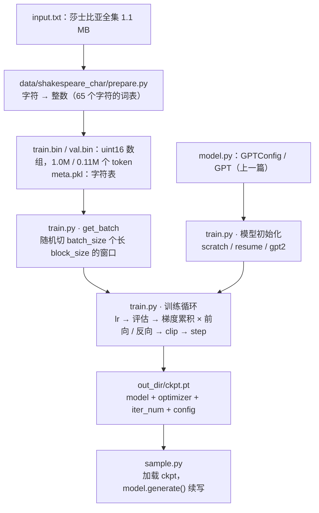

> **本篇在系列中的位置。** 第一段的最后一篇。第 03 篇写好了模型，本篇写训练循环并在笔记本上训出会续写的模型；第一段到此回答完「GPT-2 怎么工作、怎么写」，第 05 篇起进入第二段：今天的模型改了哪些结构。完整地图见[总纲](/transformer-and-llm-for-infra-engineers.html)。

上一篇的 `model.py` 定义了一个 GPT，但它的权重是随机数，输出是乱码。让它变成一个"会写东西"的模型，还差三样：**数据**（一段文本怎么变成模型能吃的整数数组）、**训练循环**（第二篇那一步"取 batch → 前向 → loss → 反向 → 更新"怎么写成能跑几十万步、能断点续训、能多卡的代码）、**一次实际的训练**（看着 loss 从 4.17 掉到 1.66、输出从乱码变成像莎士比亚台词的东西）。nanoGPT 的 `train.py`（336 行）加 `prepare.py`（68 行）就是这三样。

这一篇把 `train.py` 按块过完，然后在一台 MacBook 上用莎士比亚全集训 2000 步（7 分钟），再把层数改成 2 和 8 各训一次——这是你第一次亲手**改模型结构并看到后果**，也是第二段（第五至九篇：现代 LLM 每个部件为什么改成那样）的入口。训练循环里的每个机制（混合精度、梯度累积、学习率调度、DDP）本身在工具箱与 Infra PyTorch 系列里都讲过，这里只讲**它们在这个脚本里的位置和为什么在那里**。

本篇要回答的核心问题是：

> **从一个 1.1 MB 的文本文件到一个能续写它的模型，中间每一步的代码在哪、为什么那样写？把层数从 4 改到 2 或 8，loss 和速度各会怎样？[^q0]**

## 一、总览：三个文件、一条流水线



`train.py` 从上到下分九块。本文的章节安排就按这九块走：

| 章 | `train.py` 的块 | 行号 | 内容 |
|---|---|---|---|
| 二 | （`prepare.py`） | — | 字符级分词：文本 → `uint16` 数组 |
| 三 | 配置 | 31–75 | 72 个全局变量；`configurator.py` 的 `exec` 技巧 |
| 四 | 初始化与 I/O | 79–110 | DDP 判定、随机种子、`autocast` 上下文 |
| 五 | `get_batch` | 113–130 | 穷人的 DataLoader：随机窗口、`memmap`、pinned memory |
| 六 | 模型初始化 | 133–195 | 三种来源：从零、续训、GPT-2 权重；词表大小从数据来 |
| 七 | GradScaler、优化器、compile、DDP | 197–214 | 四层包装 |
| 八 | `estimate_loss` 与 `get_lr` | 216–243 | 评估；warmup + cosine |
| 九 | 训练循环 | 249–336 | 逐行：学习率、评估与 checkpoint、梯度累积、clip、step、日志 |
| 十 | 实跑 | — | 0.8M 参数、2000 步、7 分钟：loss 与样本 |
| 十一 | 改结构 | — | 2 / 4 / 8 层对比 |
| 十二 | 从 nanoGPT 到真实模型 | — | 差什么、去哪读 |
| 十三、十四 | 小结、自测 | | |

Table: 本文的章节安排与 train.py 的对应

## 二、数据：`prepare.py` 把文本变成整数

模型吃的是 token 编号（本系列第一篇[《Transformer 长什么样》](/transformer-architecture-from-a-sentence-to-the-next-token.html)第二章）。莎士比亚这个例子用**字符级**分词：每个不同的字符就是一个 token，词表只有 65 个（26 个字母大小写、标点、空格、换行）：

```python title='prepare.py 节选：字符级分词与 train.bin / val.bin'
# data/shakespeare_char/prepare.py（节选）
data = open('input.txt').read()                          # 1,115,394 个字符
chars = sorted(list(set(data)))                          # 65 个不同字符
stoi = { ch:i for i,ch in enumerate(chars) }             # 字符 → 编号
itos = { i:ch for i,ch in enumerate(chars) }             # 编号 → 字符
train_ids = np.array([stoi[c] for c in data[:n]], dtype=np.uint16)   # 前 90% 训练
val_ids   = np.array([stoi[c] for c in data[n:]], dtype=np.uint16)   # 后 10% 验证
train_ids.tofile('train.bin'); val_ids.tofile('val.bin')
pickle.dump({'vocab_size': 65, 'itos': itos, 'stoi': stoi}, open('meta.pkl', 'wb'))
```

```text title='prepare.py 的输出：65 个字符、100 万 token'
length of dataset in characters: 1,115,394
all the unique characters:  !$&',-.3:;?ABCDEFGHIJKLMNOPQRSTUVWXYZabcdefghijklmnopqrstuvwxyz
vocab size: 65
train has 1,003,854 tokens
val has 111,540 tokens
```

三个决定：`uint16`（词表 < 65536，两字节够，文件是文本的两倍大而不是 8 倍）；训练 / 验证按 9 : 1 **切开**（L2 第一篇：验证集要没见过）；`meta.pkl` 存字符表，训练脚本从它读词表大小、采样脚本用它把编号翻回字符。真实预训练用 BPE 分词、词表几万到十几万（预训练系列第二篇），但"文本 → 整数数组 → 随机切窗口"这条流水线完全一样——nanoGPT 的 OpenWebText 版本只是把 65 换成 50257、把 1 MB 换成 17 GB。

## 三、配置：72 个全局变量与一个 `exec`

```python title='train.py 的配置段：72 个全局变量'
# -----------------------------------------------------------------------------
# default config values designed to train a gpt2 (124M) on OpenWebText
# I/O
out_dir = 'out'
eval_interval = 2000
log_interval = 1
eval_iters = 200
eval_only = False # if True, script exits right after the first eval
always_save_checkpoint = True # if True, always save a checkpoint after each eval

# !ref cfg-init
init_from = 'scratch' # 'scratch' or 'resume' or 'gpt2*'
# data
dataset = 'openwebtext'
# !ref cfg-accum
gradient_accumulation_steps = 5 * 8 # used to simulate larger batch sizes
batch_size = 12 # if gradient_accumulation_steps > 1, this is the micro-batch size
block_size = 1024
# model
n_layer = 12
n_head = 12
n_embd = 768
dropout = 0.0 # for pretraining 0 is good, for finetuning try 0.1+
bias = False # do we use bias inside LayerNorm and Linear layers?
# adamw optimizer

# !ref cfg-opt +6
learning_rate = 6e-4 # max learning rate
max_iters = 600000 # total number of training iterations
weight_decay = 1e-1
beta1 = 0.9
beta2 = 0.95
grad_clip = 1.0 # clip gradients at this value, or disable if == 0.0
# learning rate decay settings
decay_lr = True # whether to decay the learning rate
warmup_iters = 2000 # how many steps to warm up for
lr_decay_iters = 600000 # should be ~= max_iters per Chinchilla
min_lr = 6e-5 # minimum learning rate, should be ~= learning_rate/10 per Chinchilla
# system
device = 'cuda' # examples: 'cpu', 'cuda', 'cuda:0', 'cuda:1' etc., or try 'mps' on macbooks

# !ref cfg-dtype
dtype = 'bfloat16' if torch.cuda.is_available() and torch.cuda.is_bf16_supported() else 'float16' # 'float32', 'bfloat16', or 'float16', the latter will auto implement a GradScaler
compile = True # use PyTorch 2.0 to compile the model to be faster
# -----------------------------------------------------------------------------

# !ref cfg-exec +2
config_keys = [k for k,v in globals().items() if not k.startswith('_') and isinstance(v, (int, float, bool, str))]
exec(open('configurator.py').read()) # overrides from command line or config file
config = {k: globals()[k] for k in config_keys} # will be useful for logging
```

（为省篇幅删去了 wandb 与 DDP backend 三行。）默认值是 **GPT-2 small 在 OpenWebText 上的复现配方**：12 层 768 维、上下文 1024、每次迭代 [`5 × 8` 次梯度累积](#cfg-accum) × 12 × 1024 ≈ 49 万 token（8 卡各 5 次）、60 万步、峰值学习率 6e-4、warmup 2000 步后 cosine 衰减到 6e-5、weight decay 0.1、梯度裁剪 1.0——这组数字就是预训练系列第五篇讨论的"训练配方"，[六个优化器参数](#cfg-opt)与 GPT-3 论文一致（$$\beta_2 = 0.95$$ 而不是 Adam 默认的 0.999，L3 第三篇讲为什么）。

[`dtype`](#cfg-dtype)：有 CUDA 且支持 bf16 就用 bf16，否则 fp16（要配 GradScaler，第七章）；CPU / MPS 上这一行会选 fp16，但第四章会看到 CPU 实际不用 autocast。

[配置怎么改](#cfg-exec)：`configurator.py` 是作者自称"糟糕主意"的 47 行——把命令行 `--key=value` 解析后 `exec` 进 `globals()`，覆盖上面的默认值；配置文件（`config/train_shakespeare_char.py`）也是一段被 `exec` 的 Python。好处是每个变量就是一个普通全局名，代码里不用写 `config.xxx`；代价是没有类型检查、IDE 不认识、`exec` 一般被认为不安全（Infra Python 系列讲 `exec` 与作用域）。工具箱第一篇用 `dataclass` 做配置是更常规的选择；理解 nanoGPT 时只要记住：**`train.py` 里出现的每个小写全局变量都可以在命令行上 `--name=value` 改**。`config_keys` 把所有基础类型的全局名收集起来，之后一起存进 checkpoint 和 wandb。

## 四、初始化与 I/O

```python title='初始化与 I/O：DDP 判断、种子、dtype'
# various inits, derived attributes, I/O setup

# !ref init-ddp +14
ddp = int(os.environ.get('RANK', -1)) != -1 # is this a ddp run?
if ddp:
    init_process_group(backend=backend)
    ddp_rank = int(os.environ['RANK'])
    ddp_local_rank = int(os.environ['LOCAL_RANK'])
    ddp_world_size = int(os.environ['WORLD_SIZE'])
    device = f'cuda:{ddp_local_rank}'
    torch.cuda.set_device(device)
    master_process = ddp_rank == 0 # this process will do logging, checkpointing etc.
    seed_offset = ddp_rank # each process gets a different seed
    # world_size number of processes will be training simultaneously, so we can scale
    # down the desired gradient accumulation iterations per process proportionally
    assert gradient_accumulation_steps % ddp_world_size == 0
    gradient_accumulation_steps //= ddp_world_size
else:
    # if not ddp, we are running on a single gpu, and one process
    master_process = True
    seed_offset = 0
    ddp_world_size = 1
# !ref init-tokens
tokens_per_iter = gradient_accumulation_steps * ddp_world_size * batch_size * block_size
print(f"tokens per iteration will be: {tokens_per_iter:,}")

if master_process:
    os.makedirs(out_dir, exist_ok=True)
# !ref init-seed
torch.manual_seed(1337 + seed_offset)
torch.backends.cuda.matmul.allow_tf32 = True # allow tf32 on matmul
torch.backends.cudnn.allow_tf32 = True # allow tf32 on cudnn
device_type = 'cuda' if 'cuda' in device else 'cpu' # for later use in torch.autocast
# note: float16 data type will automatically use a GradScaler
ptdtype = {'float32': torch.float32, 'bfloat16': torch.bfloat16, 'float16': torch.float16}[dtype]
# !ref init-ctx
ctx = nullcontext() if device_type == 'cpu' else torch.amp.autocast(device_type=device_type, dtype=ptdtype)
```

[DDP 判定](#init-ddp)：`torchrun` 启动时会给每个进程设 `RANK` / `LOCAL_RANK` / `WORLD_SIZE` 环境变量（Infra PyTorch 第九篇），有就是多卡。每个进程绑到自己的 GPU、用不同的随机种子（否则 8 张卡取到同样的 batch）、只有 rank 0 打日志存 checkpoint；**梯度累积步数按卡数分摊**——8 卡时每卡 5 次，合起来还是 40 个 micro-batch，保证不管几张卡，[每次迭代的 token 数](#init-tokens)不变。这就是"改卡数不改配方"的实现。

[随机种子](#init-seed) 1337 固定，实验可复现（工具箱第六篇）；TF32 让 A100 上 fp32 矩阵乘走 Tensor Core（第十二篇）。[`ctx`](#init-ctx) 是之后每次前向都要包一层的 `autocast` 上下文：CUDA 上用低精度（工具箱第四篇的混合精度），CPU 上是 `nullcontext()`——什么都不做。注意 `device_type` 只认 `cuda`，MPS 也走 CPU 分支，所以本文的 MacBook 实跑其实是 fp32。

## 五、`get_batch`：穷人的 DataLoader

```python title='get_batch：memmap 上随机切窗口'
# poor man's data loader
data_dir = os.path.join('data', dataset)
def get_batch(split):
    # We recreate np.memmap every batch to avoid a memory leak, as per
    # https://stackoverflow.com/questions/45132940/numpy-memmap-memory-usage-want-to-iterate-once/61472122#61472122
    # !ref gb-memmap +3
    if split == 'train':
        data = np.memmap(os.path.join(data_dir, 'train.bin'), dtype=np.uint16, mode='r')
    else:
        data = np.memmap(os.path.join(data_dir, 'val.bin'), dtype=np.uint16, mode='r')
    # !ref gb-window +2
    ix = torch.randint(len(data) - block_size, (batch_size,))
    x = torch.stack([torch.from_numpy((data[i:i+block_size]).astype(np.int64)) for i in ix])
    y = torch.stack([torch.from_numpy((data[i+1:i+1+block_size]).astype(np.int64)) for i in ix])
    # !ref gb-pin +4
    if device_type == 'cuda':
        # pin arrays x,y, which allows us to move them to GPU asynchronously (non_blocking=True)
        x, y = x.pin_memory().to(device, non_blocking=True), y.pin_memory().to(device, non_blocking=True)
    else:
        x, y = x.to(device), y.to(device)
    return x, y
```

工具箱第三篇用 `Dataset` + `DataLoader`，nanoGPT 用 18 行自己写。三件事：

1. [`np.memmap`](#gb-memmap)：把 `train.bin` 映射进内存而不是读进来——OpenWebText 的 `train.bin` 有 17 GB，读不进 RAM；memmap 让操作系统按需换页（Infra Python 系列讲内存映射）。每次调用重新 memmap 是绕一个已知的内存泄漏。
2. [随机窗口](#gb-window)：从数据里随机挑 `batch_size` 个起点，每个起点切 `block_size` 个 token 当 `x`，**右移一位**再切当 `y`——第二篇第二章的"目标 = 输入右移一位"就在这两行。`torch.stack` 把 `batch_size` 个一维张量叠成 `[B, T]`，叠出来的是**连续**张量，所以上一篇 `forward` 里的 `targets.view(-1)` 才不报错。没有 epoch 的概念：每步随机采样，训练多久由 `max_iters` 决定——预训练的数据量大到看不完一遍时，这是常见做法。
3. [pinned memory + `non_blocking`](#gb-pin)：CUDA 上先把 `x`、`y` 放进页锁定内存再异步搬到 GPU，让下一批数据的传输和当前批的计算重叠（Infra PyTorch 第四篇第九章）。第九章会看到它怎么被用上。

## 六、模型初始化：三种来源

```python title='模型初始化的三种来源：scratch、resume、gpt2*'
# init these up here, can override if init_from='resume' (i.e. from a checkpoint)
iter_num = 0
best_val_loss = 1e9

# attempt to derive vocab_size from the dataset

# !ref mi-meta +6
meta_path = os.path.join(data_dir, 'meta.pkl')
meta_vocab_size = None
if os.path.exists(meta_path):
    with open(meta_path, 'rb') as f:
        meta = pickle.load(f)
    meta_vocab_size = meta['vocab_size']
    print(f"found vocab_size = {meta_vocab_size} (inside {meta_path})")

# model init
model_args = dict(n_layer=n_layer, n_head=n_head, n_embd=n_embd, block_size=block_size,
                  bias=bias, vocab_size=None, dropout=dropout) # start with model_args from command line

# !ref mi-scratch +8
if init_from == 'scratch':
    # init a new model from scratch
    print("Initializing a new model from scratch")
    # determine the vocab size we'll use for from-scratch training
    if meta_vocab_size is None:
        print("defaulting to vocab_size of GPT-2 to 50304 (50257 rounded up for efficiency)")
    model_args['vocab_size'] = meta_vocab_size if meta_vocab_size is not None else 50304
    gptconf = GPTConfig(**model_args)
    model = GPT(gptconf)
# !ref mi-resume +22
elif init_from == 'resume':
    print(f"Resuming training from {out_dir}")
    # resume training from a checkpoint.
    ckpt_path = os.path.join(out_dir, 'ckpt.pt')
    checkpoint = torch.load(ckpt_path, map_location=device)
    checkpoint_model_args = checkpoint['model_args']
    # force these config attributes to be equal otherwise we can't even resume training
    # the rest of the attributes (e.g. dropout) can stay as desired from command line
    for k in ['n_layer', 'n_head', 'n_embd', 'block_size', 'bias', 'vocab_size']:
        model_args[k] = checkpoint_model_args[k]
    # create the model
    gptconf = GPTConfig(**model_args)
    model = GPT(gptconf)
    state_dict = checkpoint['model']
    # fix the keys of the state dictionary :(
    # honestly no idea how checkpoints sometimes get this prefix, have to debug more
    unwanted_prefix = '_orig_mod.'
    for k,v in list(state_dict.items()):
        if k.startswith(unwanted_prefix):
            state_dict[k[len(unwanted_prefix):]] = state_dict.pop(k)
    model.load_state_dict(state_dict)
    iter_num = checkpoint['iter_num']
    best_val_loss = checkpoint['best_val_loss']
# !ref mi-gpt2 +7
elif init_from.startswith('gpt2'):
    print(f"Initializing from OpenAI GPT-2 weights: {init_from}")
    # initialize from OpenAI GPT-2 weights
    override_args = dict(dropout=dropout)
    model = GPT.from_pretrained(init_from, override_args)
    # read off the created config params, so we can store them into checkpoint correctly
    for k in ['n_layer', 'n_head', 'n_embd', 'block_size', 'bias', 'vocab_size']:
        model_args[k] = getattr(model.config, k)
# crop down the model block size if desired, using model surgery

# !ref mi-crop +2
if block_size < model.config.block_size:
    model.crop_block_size(block_size)
    model_args['block_size'] = block_size # so that the checkpoint will have the right value
model.to(device)
```

[词表大小从数据来](#mi-meta)：`prepare.py` 写的 `meta.pkl` 里有 `vocab_size = 65`，脚本读到就用它——模型的 `wte` 和 `lm_head` 大小由数据决定，不是配置项。没有 `meta.pkl`（OpenWebText 用 GPT-2 的 BPE）就用上一篇讲的 50304。

三种来源对应 [`init_from`](#cfg-init) 的三个取值、三种场景：

- [`scratch`](#mi-scratch)：从零训（预训练）。
- [`resume`](#mi-resume)：断点续训——从 `ckpt.pt` 里读回模型参数、`iter_num`、`best_val_loss`，结构超参**强制**用 checkpoint 里的（层数对不上就加载不了），第七章再读回优化器状态。那个 `_orig_mod.` 前缀是 `torch.compile` 包装模型后 `state_dict` 键名多出来的（Infra PyTorch 第七篇），存之前没剥干净这里就剥。真实的大规模训练里 checkpoint 与恢复是一门大学问（Infra 大规模训练系列第五篇），这 22 行是它的最小形态。
- [`gpt2*`](#mi-gpt2)：从 OpenAI 权重出发**微调**——上一篇的 `from_pretrained`。

[`crop_block_size`](#mi-crop)：加载的 GPT-2 上下文是 1024，想用更短的就切位置表（上一篇第九章）。最后 `model.to(device)` 把参数搬到 GPU。

## 七、四层包装：GradScaler、优化器、compile、DDP

```python title='四层包装：GradScaler、优化器、compile、DDP'
# initialize a GradScaler. If enabled=False scaler is a no-op

# !ref wrap-scaler
scaler = torch.cuda.amp.GradScaler(enabled=(dtype == 'float16'))

# optimizer

# !ref wrap-opt +3
optimizer = model.configure_optimizers(weight_decay, learning_rate, (beta1, beta2), device_type)
if init_from == 'resume':
    optimizer.load_state_dict(checkpoint['optimizer'])
checkpoint = None # free up memory

# compile the model

# !ref wrap-compile +3
if compile:
    print("compiling the model... (takes a ~minute)")
    unoptimized_model = model
    model = torch.compile(model) # requires PyTorch 2.0

# wrap model into DDP container

# !ref wrap-ddp +1
if ddp:
    model = DDP(model, device_ids=[ddp_local_rank])
```

四件事各一句，机制都在别处讲过：

- [`GradScaler`](#wrap-scaler)：只在 fp16 下启用。fp16 的指数位只有 5 位，小梯度会下溢成 0；scaler 先把 loss 乘一个大数再反向、更新前再除回来（工具箱第四篇第二章、第十二篇讲 bf16 为什么不需要）。`enabled=False` 时它的每个方法都是空操作，所以后面的代码不用写两套。
- [优化器](#wrap-opt)：上一篇第十章的 `configure_optimizers`（二维参数才 decay）；续训时把优化器状态（Adam 的两个动量）也读回来——不读回来，恢复后前几百步会因为动量从零重新估计而抖动。读完把 `checkpoint` 置 `None` 释放那份内存。
- [`torch.compile`](#wrap-compile)：Infra PyTorch 第七篇；A100 上给 GPT-2 提速约 1.3–1.5 倍，代价是启动多花一分钟。MacBook 上关掉（`--compile=False`）。
- [DDP](#wrap-ddp)：多卡时把模型包进 `DistributedDataParallel`，反向时自动 all-reduce 梯度（Infra PyTorch 第九篇第三章）；下面训练循环里有一处专门为它写的优化。

## 八、`estimate_loss` 与 `get_lr`

```python title='estimate_loss 与 get_lr'
# helps estimate an arbitrarily accurate loss over either split using many batches
@torch.no_grad()
# !ref el-fn +12
def estimate_loss():
    out = {}
    model.eval()
    for split in ['train', 'val']:
        losses = torch.zeros(eval_iters)
        for k in range(eval_iters):
            X, Y = get_batch(split)
            with ctx:
                logits, loss = model(X, Y)
            losses[k] = loss.item()
        out[split] = losses.mean()
    model.train()
    return out

# learning rate decay scheduler (cosine with warmup)

# !ref lr-fn +11
def get_lr(it):
    # 1) linear warmup for warmup_iters steps
    if it < warmup_iters:
        return learning_rate * (it + 1) / (warmup_iters + 1)
    # 2) if it > lr_decay_iters, return min learning rate
    if it > lr_decay_iters:
        return min_lr
    # 3) in between, use cosine decay down to min learning rate
    decay_ratio = (it - warmup_iters) / (lr_decay_iters - warmup_iters)
    assert 0 <= decay_ratio <= 1
    coeff = 0.5 * (1.0 + math.cos(math.pi * decay_ratio)) # coeff ranges 0..1
    return min_lr + coeff * (learning_rate - min_lr)
```

[`estimate_loss`](#el-fn)：训练日志里每步的 loss 只来自一个 batch，抖得厉害；评估时在训练集和验证集上各取 `eval_iters` 个 batch 求平均，得到一个稳定的数。`model.eval()` / `model.train()` 切换 dropout（第二篇第七章的表）；`@torch.no_grad()` 不建图。**train loss 与 val loss 的差**就是过拟合的信号（L2 第一篇）——第十章的实跑里能看到它逐渐拉开。

[`get_lr`](#lr-fn)：工具箱第三篇画过的那条曲线——前 `warmup_iters` 步从 0 线性升到 `learning_rate`，之后 cosine 衰减到 `min_lr`，超过 `lr_decay_iters` 后保持 `min_lr`。注意它是一个纯函数，每步算一个数再写进 `optimizer.param_groups`（下一章第一行），没有用 PyTorch 的 `LRScheduler`——效果一样，代码更直白。

## 九、训练循环：逐行

```python title='训练循环全文'
# training loop

# !ref loop-first
X, Y = get_batch('train') # fetch the very first batch
t0 = time.time()
local_iter_num = 0 # number of iterations in the lifetime of this process
raw_model = model.module if ddp else model # unwrap DDP container if needed
running_mfu = -1.0
while True:

    # determine and set the learning rate for this iteration
    # !ref loop-lr +2
    lr = get_lr(iter_num) if decay_lr else learning_rate
    for param_group in optimizer.param_groups:
        param_group['lr'] = lr

    # evaluate the loss on train/val sets and write checkpoints
    # !ref loop-eval +14
    if iter_num % eval_interval == 0 and master_process:
        losses = estimate_loss()
        print(f"step {iter_num}: train loss {losses['train']:.4f}, val loss {losses['val']:.4f}")
        if losses['val'] < best_val_loss or always_save_checkpoint:
            best_val_loss = losses['val']
            if iter_num > 0:
                checkpoint = {
                    'model': raw_model.state_dict(),
                    'optimizer': optimizer.state_dict(),
                    'model_args': model_args,
                    'iter_num': iter_num,
                    'best_val_loss': best_val_loss,
                    'config': config,
                }
                print(f"saving checkpoint to {out_dir}")
                torch.save(checkpoint, os.path.join(out_dir, 'ckpt.pt'))
    if iter_num == 0 and eval_only:
        break

    # forward backward update, with optional gradient accumulation to simulate larger batch size
    # and using the GradScaler if data type is float16
    # !ref loop-accum
    for micro_step in range(gradient_accumulation_steps):
        if ddp:
            # in DDP training we only need to sync gradients at the last micro step.
            # the official way to do this is with model.no_sync() context manager, but
            # I really dislike that this bloats the code and forces us to repeat code
            # looking at the source of that context manager, it just toggles this variable
            # !ref loop-sync
            model.require_backward_grad_sync = (micro_step == gradient_accumulation_steps - 1)
        # !ref loop-fwd +2
        with ctx:
            logits, loss = model(X, Y)
            loss = loss / gradient_accumulation_steps # scale the loss to account for gradient accumulation
        # immediately async prefetch next batch while model is doing the forward pass on the GPU
        # !ref loop-prefetch
        X, Y = get_batch('train')
        # backward pass, with gradient scaling if training in fp16
        # !ref loop-bwd
        scaler.scale(loss).backward()
    # clip the gradient
    # !ref loop-clip +2
    if grad_clip != 0.0:
        scaler.unscale_(optimizer)
        torch.nn.utils.clip_grad_norm_(model.parameters(), grad_clip)
    # step the optimizer and scaler if training in fp16
    # !ref loop-step +1
    scaler.step(optimizer)
    scaler.update()
    # flush the gradients as soon as we can, no need for this memory anymore
    # !ref loop-zero
    optimizer.zero_grad(set_to_none=True)

    # timing and logging
    t1 = time.time()
    dt = t1 - t0
    t0 = t1
    # !ref loop-log +7
    if iter_num % log_interval == 0 and master_process:
        # get loss as float. note: this is a CPU-GPU sync point
        # scale up to undo the division above, approximating the true total loss (exact would have been a sum)
        lossf = loss.item() * gradient_accumulation_steps
        if local_iter_num >= 5: # let the training loop settle a bit
            mfu = raw_model.estimate_mfu(batch_size * gradient_accumulation_steps, dt)
            running_mfu = mfu if running_mfu == -1.0 else 0.9*running_mfu + 0.1*mfu
        print(f"iter {iter_num}: loss {lossf:.4f}, time {dt*1000:.2f}ms, mfu {running_mfu*100:.2f}%")
    iter_num += 1
    local_iter_num += 1

    # termination conditions
    if iter_num > max_iters:
        break

if ddp:
    destroy_process_group()
```

（删去了 wandb 的几行。）这就是工具箱第三篇那二十行的"生产版"。按执行顺序：

1. [取第一个 batch](#loop-first)，之后每次迭代内部预取下一个（第 5 步）。`raw_model` 是剥掉 DDP 包装的原始模型——`estimate_mfu`、`state_dict` 都要在它上面调。
2. [设学习率](#loop-lr)：每步算 `get_lr(iter_num)`，写进每个参数组——第二篇第四章"AdamW 走一步"里的 $$\eta$$ 就是它。
3. [评估与 checkpoint](#loop-eval)：每 `eval_interval` 步在 rank 0 上跑 `estimate_loss`；验证 loss 创新低（或 `always_save_checkpoint`）就存一份 checkpoint——**模型 + 优化器状态 + 结构超参 + 步数 + 配置**五样，缺一样都续不了训。第六章的 `resume` 读的就是这个字典。
4. [梯度累积](#loop-accum)：想要每步 49 万 token 但显存放不下那么大的 batch，就分 `gradient_accumulation_steps` 个 micro-batch，每个[前向 + 反向](#loop-fwd)但**不更新**，梯度在 `.grad` 里累加（第二篇第三章：`.grad` 默认累加，正是为此），最后一起 `step`。[loss 除以累积步数](#loop-fwd)让累加后的梯度等于大 batch 的平均梯度。`with ctx` 是第四章的 autocast。
5. [预取](#loop-prefetch)：前向刚提交给 GPU（异步，Infra PyTorch 第八篇），CPU 立刻去取下一个 batch——两件事重叠。第五章的 pinned memory 在这里派上用场。
6. [DDP 的小优化](#loop-sync)：默认 DDP 每次 `backward` 都 all-reduce 梯度；累积 40 个 micro-batch 就通信 40 次，浪费。只在**最后一个** micro-step 同步——官方写法是 `model.no_sync()` 上下文，作者直接改那个内部标志。
7. [反向](#loop-bwd)：`scaler.scale(loss)` 在 fp16 下放大 loss 再 `backward`；bf16 / fp32 下 scaler 是空操作。
8. [梯度裁剪](#loop-clip)：先 `unscale_` 把梯度除回真实尺度，再把全部梯度的总范数裁到 1.0——工具箱第三篇说的"少一样迟早出事"的那一样，预训练系列第五篇讲它防的 loss spike。
9. [更新](#loop-step)：`scaler.step` 在 fp16 下检查有没有 inf / NaN（有就跳过这步）再调 `optimizer.step`；`scaler.update` 调整放大倍数。然后 [`zero_grad(set_to_none=True)`](#loop-zero) 释放梯度显存。
10. [日志](#loop-log)：`loss.item()` 是一次 CPU–GPU 同步（Infra PyTorch 第八篇第七章），所以只每 `log_interval` 步做一次；MFU 用上一篇第十章的公式，前 5 步不算（还没稳定），之后做指数平滑。

第 4–9 步合起来是一次"参数更新"；`iter_num` 数的是更新次数，不是 micro-batch 数。

## 十、实跑：0.8M 参数、2000 步、7 分钟

MacBook（Apple 芯片，`--device=mps`）上跑 nanoGPT README 给的小配置：4 层 4 头 128 维、上下文 64、batch 12、2000 步：

```bash title='MacBook 上跑 nanoGPT 小配置的命令'
python data/shakespeare_char/prepare.py
python train.py --dataset=shakespeare_char --out_dir=out-shakespeare-char-base --device=mps --compile=False \
  --eval_interval=250 --eval_iters=20 --log_interval=50 --block_size=64 --batch_size=12 \
  --n_layer=4 --n_head=4 --n_embd=128 --max_iters=2000 --lr_decay_iters=2000 --dropout=0.0
```

```text title='训练日志：0.8M 参数，2000 步 loss 从 4.17 到 1.47'
number of parameters: 0.80M
step 0:    train loss 4.1676, val loss 4.1649
step 250:  train loss 2.8491, val loss 2.8662
step 500:  train loss 2.3961, val loss 2.4026
step 750:  train loss 2.1386, val loss 2.1655
step 1000: train loss 1.8985, val loss 1.9509
step 1250: train loss 1.6965, val loss 1.8532
step 1500: train loss 1.5555, val loss 1.7179
step 1750: train loss 1.4989, val loss 1.6616
iter 1500: loss 1.5963, time 364.55ms, mfu 0.20%
real 7m34s
```

读这段日志：

- **step 0 的 4.17 ≈ $$\ln 65 = 4.17$$**——第二篇说的"随机初始化在词表上均匀乱猜"，65 个字符。
- **2000 步后 val loss 1.66**：每个字符平均 $$e^{1.66} \approx 5.3$$ 个候选里犹豫（工具箱第三篇的 PPL）；从 65 到 5.3，它学到了英语拼写和莎士比亚的格式。
- **train 与 val 从 step 1000 起拉开**（1.90 / 1.95 → 1.50 / 1.66）：1 MB 数据、0.8M 参数，开始过拟合；再训下去 val 会停在 1.6 左右而 train 继续降——L2 第一篇的曲线。真实预训练数据远大于参数，几乎不会过拟合。
- **MFU 0.2%**：MPS 上 12 × 64 = 768 个 token 的小 batch 完全喂不饱硬件（`estimate_mfu` 还按 A100 的 312 TFLOPS 算分母）；每步 320 ms 里绝大部分是 kernel 启动开销——Infra PyTorch 第八篇的 launch-bound。这个配置是为了几分钟看到结果，不是为了效率。

用 `sample.py` 读回 checkpoint 续写（贪心以外的采样，温度 0.8、top-k 200）：

```text title='sample.py 读回 checkpoint 的续写'
DUKE:
How that the thee when tyrants, do loge,
And in you to let this games, knee,
I bet some mee to state, he within's the you love to count
For yet cousin shakes a bid such of England's fie,
What I can a won the doof did so live!
```

单词一半是拼出来的，但**格式**全对：大写的角色名加冒号、换行、诗行的长度、莎士比亚的用词（thee、cousin、England）。这就是 0.8M 参数、7 分钟、字符级模型能做到的程度——它学的是"下一个字符是什么"，语法和词义要在更大的模型和更多数据上才会出现（预训练系列第三篇的 scaling law）。

## 十一、改结构：2 层、4 层、8 层

第一次改结构。其他全部不动，只改 `--n_layer`：

| `n_layer` | 参数量 | step 1000 val loss | 最终 val loss（step 1750） | 每步耗时 |
|---:|---:|---:|---:|---:|
| 2 | 0.40M | 2.108 | 1.822 | ≈ 0.5× |
| 4（基线） | 0.80M | 1.951 | 1.662 | 1×（约 350 ms） |
| 8 | 1.58M | 1.882 | 1.592 | ≈ 2× |

Table: 只改层数：参数量、loss 与每步耗时（耗时按 mps 上单独运行时的相对值给出；MPS 上小 batch 的绝对毫秒数受系统负载影响很大，不宜直接比较）


读这张表：

- **参数量**：每加一层多 0.20M（一层 = attention 4 个 $$128 \times 128$$ + FFN 两个 $$128 \times 512$$ ≈ 0.197M），embedding 那 $$65 \times 128 + 64 \times 128$$ 不随层数变——第一篇第六章的参数表在另一个模型上又对了一次。
- **loss**：2 → 4 层降了 0.16，4 → 8 层只降了 0.07。翻倍的参数换来的收益在递减；而且 8 层的 train / val 差距（1.41 / 1.59）比 2 层（1.71 / 1.82）大——模型越大越容易把 1 MB 的数据背下来。
- **每步耗时**：层是串行的（第 $$l$$ 层的输入是第 $$l-1$$ 层的输出），8 层的一步大约是 4 层的两倍。同样 7 分钟，2 层能跑 4000 步、8 层只能跑 1000 步——"更深"不是免费的。

这个小实验的三个通用结论，后面每一篇都会用到：

1. **参数量随层数线性增长**（每层 0.20M，embedding 不变），但 loss 不是——第五篇用参数量公式解释每层多少、第十一篇算每层多少 FLOPs；
2. **每步耗时随层数线性增长**——层是串行的，深了就慢，这是第八篇 MoE 想绕开的约束（加参数不加每 token 的计算）；
3. **同样的步数下更大的模型更好，但差距在缩小**——"训多久、多大的模型"这个权衡就是预训练系列第三篇 scaling law 的全部内容。

## 十二、从 nanoGPT 到真实模型差什么

nanoGPT 是完整的：数据、模型、训练、续训、多卡、混合精度、生成都有。真实的预训练与它的差别不在"有没有"，在**规模带来的新问题**：

| 环节 | nanoGPT | 真实预训练（Llama 3 量级） | 去哪读 |
|---|---|---|---|
| 数据 | 1 MB 文本，`prepare.py` 一次编码 | 15T token，抓取 / 去重 / 过滤 / 配比是一门工程 | 预训练系列第四篇 |
| 分词 | 65 个字符 | BPE，词表 128K | 预训练系列第二篇 |
| 结构 | GPT-2：LayerNorm、位置表、GELU、MHA | RMSNorm、RoPE、SwiGLU、GQA、MoE、MTP | 本系列第五至九篇 |
| 并行 | DDP：每卡一份完整模型 | 模型放不进一张卡：张量 / 流水 / 序列 / 专家并行，ZeRO | Infra 大规模训练系列 |
| 精度 | bf16 autocast | bf16 主流，FP8 训练开始出现 | 本系列第十二篇 |
| 稳定性 | 梯度裁剪 | loss spike 的诊断与恢复、z-loss、QK-norm | 预训练系列第五篇 |
| 容错 | `resume` 从单个 ckpt.pt | 万卡训练每几小时坏一张卡：分片 checkpoint、自动重启 | Infra 大规模训练系列第五、六篇 |
| 配方 | 默认值抄 GPT-3 | 用小模型消融 + scaling law 外推 | 预训练系列第三、五篇 |
| 之后 | 生成 | 后训练：SFT、RLHF / RLVR | L5 后训练系列 |

Table: nanoGPT 有的与真实预训练多出来的

每一行 nanoGPT 都给了一个可读的最小版本；真实系统是在同一个骨架上把每一格换成能扛规模的实现。读那些系统的代码时，先在这张表里找到它对应 nanoGPT 的哪几行。

## 十三、本文小结

- `prepare.py`：文本 → 字符级整数 → `uint16` 的 `train.bin` / `val.bin`（9 : 1）+ `meta.pkl`；模型的词表大小由数据决定。
- `train.py` 的配置是 72 个全局变量，默认值就是 GPT-2 small 的复现配方；`configurator.py` 用 `exec` 让每个变量都能 `--name=value` 覆盖。
- `get_batch` 用 `memmap` + 随机窗口 + `torch.stack` 造 `[B, T]` 的 `x` 与右移一位的 `y`，CUDA 上 pinned memory 异步搬运；没有 epoch。
- 模型三种来源：从零（词表大小从 `meta.pkl`）、续训（读回参数 / 优化器 / 步数，结构超参强制一致）、GPT-2 权重；然后 GradScaler（仅 fp16）、优化器、`torch.compile`、DDP 四层包装。
- 训练循环每步：设学习率 → 到点评估并存 checkpoint（五样） → 梯度累积 $$k$$ 个 micro-batch（loss ÷ $$k$$，预取下一批，DDP 只在最后一步同步）→ unscale + 裁剪 → step / update → zero_grad → 日志与 MFU。
- 实跑：0.8M 参数、2000 步、7 分钟，val loss 4.17（$$= \ln 65$$）→ 1.66，输出有莎士比亚的格式；train / val 从 1000 步起拉开——过拟合的开始。
- 改层数：参数量与每步耗时随层数线性增长，loss 收益递减——这三条是后面结构篇与 scaling law 的起点。

配套：`nanogpt/`（vendored 的 `train.py`、`configurator.py`、`sample.py`、`data/shakespeare_char/prepare.py`）、`expected/train_shakespeare_char_{base,L2,L8}.txt`、`expected/sample_shakespeare_char_base.txt`（[ai-learning-labs/transformer-and-llm](https://github.com/arganzheng/ai-learning-labs/tree/main/transformer-and-llm)）。

## 十四、自测

1. 默认配置下一次迭代处理多少 token？8 卡 DDP 时每卡的 `gradient_accumulation_steps` 是多少，一次迭代的 token 数变不变？

   <details markdown="1"><summary>答案</summary>

   $$40 \times 12 \times 1024 = 491{,}520$$。8 卡时每卡 $$40 / 8 = 5$$ 次累积，总 token 数不变——脚本按卡数分摊累积步数正是为了让"配方"与卡数无关。见[第四章](#四初始化与-io)。
   </details>

2. `get_batch` 里 `y` 为什么是 `data[i+1 : i+1+block_size]`？用 `torch.stack` 而不是切片拼接对上一篇的 `forward` 有什么意义？

   <details markdown="1"><summary>答案</summary>

   目标是输入右移一位（第二篇第二章）。`stack` 造出的是连续张量，`forward` 里 `targets.view(-1)` 才不会因不连续报错。见[第五章](#五get_batch穷人的-dataloader)。
   </details>

3. 梯度累积时为什么要 `loss = loss / gradient_accumulation_steps`？如果不除会怎样？

   <details markdown="1"><summary>答案</summary>

   `.grad` 在 $$k$$ 个 micro-batch 上累加；除以 $$k$$ 后累加结果等于大 batch 的**平均**梯度。不除，梯度是 $$k$$ 倍，等价于学习率放大 $$k$$ 倍，配方就不对了。见[第九章第 4 点](#九训练循环逐行)。
   </details>

4. checkpoint 里存了哪五样？少了 `optimizer` 会怎样？

   <details markdown="1"><summary>答案</summary>

   `model`（参数）、`optimizer`（Adam 的两个动量）、`model_args`（结构超参）、`iter_num`、`config`（外加 `best_val_loss`）。没有优化器状态也能续训，但动量从零重新估计，恢复后前几百步的更新方向会抖。见[第九章第 3 点](#九训练循环逐行)、[第七章](#七四层包装gradscaler优化器compileddp)。
   </details>

5. 实跑里 step 0 的 loss 为什么恰好是 4.17？如果换成 GPT-2 的 BPE 分词，这个数会是多少？

   <details markdown="1"><summary>答案</summary>

   $$\ln 65 = 4.17$$：随机模型在 65 个字符上均匀乱猜。BPE 词表 50257 时是 $$\ln 50257 = 10.8$$。见[第十章](#十实跑08m-参数2000-步7-分钟)。
   </details>

6. 只把 `n_layer` 从 4 改成 8，参数量、每步耗时、loss 各怎么变？为什么每步耗时随层数线性增长而不能并行？

   <details markdown="1"><summary>答案</summary>

   参数量约翻倍（embedding 部分不变）、每步耗时约翻倍、loss 更低但收益递减。层是串行的——第 $$l$$ 层的输入是第 $$l-1$$ 层的输出（残差流），不能同时算；流水线并行也只是让**不同 batch** 的不同层同时算。见[第十一章](#十一改结构2-层4-层8-层)。
   </details>

## 下一篇

到这里，一个 GPT-2 结构的模型从零到能续写走完了。但今天的 Llama、Qwen、DeepSeek 已经不是 GPT-2 的样子。[下一篇《从 GPT-2 到 Llama：现代 LLM 的解剖与参数量》](/transformer-anatomy-and-parameter-count.html)从上一篇末尾那五处改动出发——RMSNorm、RoPE、SwiGLU、GQA、去 bias——讲每一处为什么改、改了之后参数怎么数，把 `config.json` 里的六个数字算成 8.03B。

[^q0]: **数据**：`prepare.py` 把字符映射成 0–64 的整数存成 `uint16` 的 `train.bin`；`get_batch` 随机切 `batch_size` 个长 `block_size` 的窗口，目标是窗口右移一位。**模型**：按 `meta.pkl` 的词表大小建 `GPT`（或从 checkpoint / GPT-2 权重恢复），包上 GradScaler、优化器、`compile`、DDP。**循环**：每步设学习率（warmup + cosine）→ 到点评估并存 checkpoint → $$k$$ 个 micro-batch 各前向 + 反向累积梯度（loss ÷ $$k$$，同时预取下一批）→ 裁剪 → step → zero_grad。**改层数**：参数量和每步耗时随层数线性增长（层是串行的），loss 的收益递减。详见[第五](#五get_batch穷人的-dataloader)、[九](#九训练循环逐行)、[十一章](#十一改结构2-层4-层8-层)。
