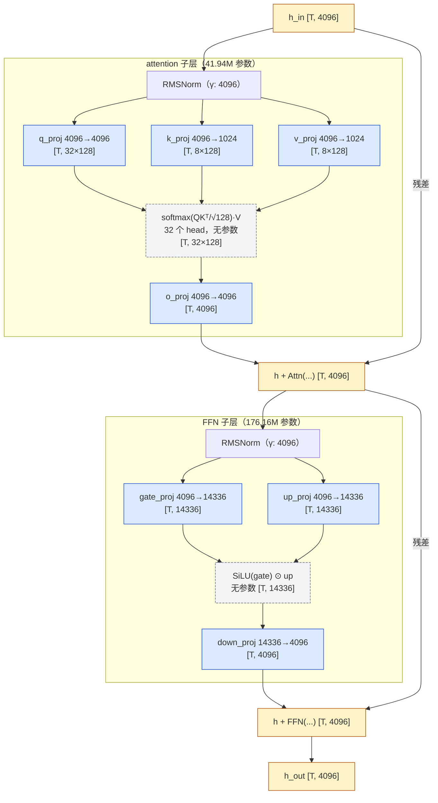

> **本篇在系列中的位置。** 现代 LLM 结构的第 01 篇，承接[系列总纲](/llm-architecture-evolution-roadmap-from-gpt2.html)，从 GPT-2 走到 Llama，先认出现代模型改动的五个位置，再读真实配置并逐项数出参数。

读完《Transformer 原理与实现》之后，GPT-2 的主干已经熟悉。现在拿到 Llama 的 `config.json`，哪些地方变了？这些变化分别解决什么问题，又怎样体现在模型参数量里？

## 一、总览：本文的章节安排

| 章 | 主题 | 内容 |
|---|---|---|
| 一 | 五处改动 | 从 GPT-2 的槽位出发理解 Llama 的结构选择 |
| 二 | 读配置 | 对照真实模型的 `config.json` 与结构路线 |
| 三 | 参数量 | 从配置逐项推导到 8.03B |
| 四 | 源码对照 | 在 `modeling_llama.py` 中找到对应实现 |
| 五 | 实践 | 用 `llm_cost.py` 第一版复算参数量 |

## 二、五处改动，每一处为什么

decoder-only 的整体结构、残差流为什么把所有子层锁在宽度 $$d$$、pre-norm 为什么比 post-norm 好训，[《Transformer 原理与实现（01）：Transformer 长什么样——从一句话到下一个 token》](/transformer-architecture-from-a-sentence-to-the-next-token.html)的第六、八章已经讲过，GPT-2 就是 pre-norm，这些在 Llama 里都没变。下面只讲变了的五处，每一处回答三个问题：GPT-2 的做法有什么问题、新做法怎么解决、代价（参数、算量、工程）是什么。

### 1. LayerNorm → RMSNorm

LayerNorm（Ba 等 2016）对每个 token 的 $$d$$ 维向量减均值、除标准差，再乘 $$\gamma$$ 加 $$\beta$$：

$$
\text{LN}(x) = \gamma \odot \frac{x - \mu}{\sqrt{\sigma^2 + \epsilon}} + \beta, \quad \gamma, \beta \in \mathbb{R}^d
$$

LayerNorm 同时控制均值与尺度；RMSNorm 的取舍是不再强制中心化，只保留尺度归一化，从而减少均值计算及相应的读写、规约开销。这是计算效率的取舍，不是说 LayerNorm 无法训练大模型。

LayerNorm 参数量 $$2d$$。RMSNorm（Zhang 与 Sennrich 2019）去掉了减均值和 $$\beta$$，只除以均方根：

$$
\text{RMSNorm}(x) = \gamma \odot \frac{x}{\sqrt{\frac{1}{d} \sum_i x_i^2 + \epsilon}}, \quad \gamma \in \mathbb{R}^d
$$

参数量 $$d$$。Llama-3-8B 每层两个 RMSNorm 共 $$2 \times 4096 = 8192$$ 个参数，加上最后的 final norm 4096 个，全模型 $$32 \times 8192 + 4096 = 266{,}240$$ 个，占总参数的 0.003%。**参数量上 Norm 可以忽略**。

计算量上两者都是每 token $$O(d)$$；以 RMSNorm 为例：算一次平方和（$$d$$ 次乘加）、一次 rsqrt、$$d$$ 次缩放。与同一层里 attention 和 FFN 的 GEMM 每 token $$2 \times 218\text{M} \approx 436$$ MFLOPs 相比，Norm 每 token 只有约 $$3d \approx 12$$ KFLOPs，差五个数量级。但 Norm 是 memory-bound 的逐元素操作，它读写一遍 `[batch, seq, d]` 的激活值，在 decode 阶段的 kernel 数量和 launch 开销里占一席之地，推理引擎通常把它与相邻的残差加法融合成一个 kernel（vLLM 的 `fused_add_rms_norm` 即是）。RMSNorm 不需要均值统计；具体少多少读写与同步，取决于 kernel 是否融合、规约如何实现，不能直接等同于整个模型按同比例加速。

`rms_norm_eps` 字段（Llama 3 为 $$10^{-5}$$）是分母里的 $$\epsilon$$，防止除零。这个值与第十篇的数值稳定性有关：BF16 下 $$x_i^2$$ 的求和是否先转 FP32，直接影响 RMSNorm 的精度。

### 2. 位置表 → RoPE

**GPT-2 的问题。** GPT-2 的位置信息来自一张学出来的表 `wpe`，形状 $$[1024, 768]$$：第 $$i$$ 个位置查第 $$i$$ 行加到 token 向量上（[《Transformer 原理与实现（01）：Transformer 长什么样——从一句话到下一个 token》](/transformer-architecture-from-a-sentence-to-the-next-token.html)第三章）。表有几行，模型就最多能处理多长的上下文；第 1025 个位置没有对应的行，想加长只能扩表再训。而且它给的是**绝对**位置，「猫追狗」出现在第 3 个词还是第 300 个词，模型看到的是两组不同的向量，"相隔 2 个词"这种相对关系要靠模型自己从数据里学。

**RoPE 怎么做。** RoPE（Su 等 2021）不再往输入上加位置向量，而是在每层 attention 里，把 Q、K 向量的每两维看成一个平面上的点，按位置 $$i$$ 旋转角度 $$i\theta_j$$（不同的两维用不同的频率 $$\theta_j$$）。两个旋转过的向量做点积时，结果只和角度差 $$(i - j)\theta$$ 有关——**相对位置直接出现在 attention 分数里**，不需要模型去学。

**代价。** RoPE 没有参数（旋转角由位置和固定频率算出），所以 Llama 的参数量里没有位置表这一项；每层每个 token 多一次逐元素的旋转，算量可以忽略。它没有"表的行数"这个硬上限，但训练时没见过的长度上效果仍会下降，这就引出了 NTK、YaRN 这些外推方法——波长与外推在[《现代 LLM 结构（03）：位置编码与外推》](/positional-encoding-and-long-context.html)展开。本篇只需要记住一点：**RoPE 让位置这一项从参数量公式里消失了**。

### 3. GELU 两矩阵 FFN → SwiGLU 三矩阵

**传统 FFN。** 原始 Transformer 的 FFN 是两个矩阵夹一个非线性：

$$
\text{FFN}(x) = \sigma(x W_1)\, W_2, \quad W_1 \in \mathbb{R}^{d \times d_{ff}}, \; W_2 \in \mathbb{R}^{d_{ff} \times d}
$$

（沿用第四章第 2 节 $$Q = x W_Q$$ 的行向量约定：$$x$$ 是 $$[s, d]$$，矩阵右乘，形状按 $$[in, out]$$ 写。）

$$\sigma$$ 是 ReLU 或 GELU，$$d_{ff} = 4d$$ 是从 Vaswani 等 2017 一直沿用到 GPT-3 的惯例。参数量 $$2 d \cdot d_{ff} = 8 d^2$$。

**为什么换成门控。** GELU FFN 对每个中间通道只做固定的逐元素非线性；SwiGLU 用输入算出另一组值，逐通道调制 `up` 分支，加入了两条投影的乘性交互。Shazeer 2020 的等参数、等算量比较中，SwiGLU 取得了比 ReLU / GELU 更低的语言建模损失；这是经验收益，不意味着 GELU 表达不了同一类函数。

**SwiGLU：gate、up、down。** Shazeer 2020 提出用门控线性单元（GLU）替换 FFN 的第一层，其中 SiLU 门控的版本称为 SwiGLU，被 PaLM、Llama 系列以及之后几乎所有开源模型采用：

$$
\text{FFN}(x) = \left[ \text{SiLU}(x W_{gate}) \odot (x W_{up}) \right] W_{down}
$$

三个矩阵：$$W_{gate}, W_{up} \in \mathbb{R}^{d \times d_{ff}}$$，$$W_{down} \in \mathbb{R}^{d_{ff} \times d}$$。$$\odot$$ 是逐元素乘。参数量：

$$
P_{ffn} = 3 \cdot d \cdot d_{ff}
$$

`transformers` 里对应 `gate_proj`、`up_proj`、`down_proj` 三个 `nn.Linear`，`hidden_act` 字段为 `silu`。

**代价。** 若中间宽度不变，矩阵从两个变三个，参数与主要 GEMM FLOPs 都增加 50%，还多一次逐元素乘法；把宽度缩到原来的 $$2/3$$ 才能维持近似相同的矩阵预算。Llama-3-8B 又主动加宽 FFN，因此并非只把 GELU 换成 SwiGLU 就能零成本提升。

**14336 是怎么来的。** Llama-3-8B 的 `intermediate_size` 是 14336，不是 $$4d = 16384$$。这个数字的来历分三步。

**第一步：保持参数量不变。** SwiGLU 有三个矩阵，传统 FFN 有两个。若 $$d_{ff}$$ 仍取 $$4d$$，参数量会从 $$8d^2$$ 涨到 $$12d^2$$。Shazeer 2020 为了公平比较，把 $$d_{ff}$$ 缩到 $$\frac{2}{3}$$，使 $$3 \cdot d \cdot \frac{2}{3} \cdot 4d = 8d^2$$ 与原来相同：

$$
d_{ff} = \frac{2}{3} \cdot 4d = \frac{8}{3} d
$$

代入 $$d = 4096$$：$$\frac{8}{3} \times 4096 = 10922.67$$，取整为 10922（Llama 官方代码用 `int(2 * 4 * dim / 3)`，向下取整；手算常写作 10923，差一个不影响后续结果）。

**第二步：对齐到 `multiple_of` 的倍数。** 10922 不是一个 GPU 友好的数字，Llama 的代码把它向上取到 `multiple_of` 的整数倍。Llama 2 的 `multiple_of = 256`，于是 $$\lceil 10922 / 256 \rceil \times 256 = 43 \times 256 = 11008$$，这正是 Llama-2-7B 的 `intermediate_size`。

**第三步：Llama 3 额外乘一个 `ffn_dim_multiplier = 1.3`。** Llama 2 的 70B 和 Llama 3 的 8B / 70B在第二步之前多乘了一个系数 1.3，把 FFN 加宽以吸收更多参数：

$$
10922 \times 1.3 = 14198.6 \to 14198
$$

再向上对齐。Llama 3 的 `params.json` 里 `multiple_of = 1024`：

$$
\lceil 14198 / 1024 \rceil \times 1024 = 14 \times 1024 = 14336
$$

如果用 256 对齐，$$\lceil 14198 / 256 \rceil \times 256 = 56 \times 256 = 14336$$，恰好相同。所以完整的公式是：

$$
d_{ff} = \text{multiple\_of} \cdot \left\lceil \frac{\text{ffn\_dim\_multiplier} \cdot \lfloor \frac{2}{3} \cdot 4d \rfloor}{\text{multiple\_of}} \right\rceil
$$

对 70B 验证一遍：$$\lfloor \frac{2}{3} \times 32768 \rfloor = 21845$$，$$\times 1.3 = 28398$$，对齐到 1024：$$\lceil 28398 / 1024 \rceil \times 1024 = 28 \times 1024 = 28672$$。与 config 一致（注意此处若用 256 对齐会得到 28416，说明 Llama 3 确实用的是 1024）。

为什么要对齐到 256 或 1024 的倍数？Tensor Core 的 GEMM 以 8、16、64、128 的 tile 分块，$$n$$ 或 $$k$$ 不是 tile 尺寸的倍数时会有边角块浪费算力；张量并行（TP）把 $$d_{ff}$$ 切成 8 份时，每份也需要仍是 tile 尺寸的倍数。$$14336 / 8 = 1792 = 14 \times 128$$，切 8 路 TP 后每张卡上的 FFN 中间维度仍是 128 的倍数。

### 4. MHA → GQA：本篇只取 KV 投影宽度

Llama-3-8B 的 `num_attention_heads = 32`、`num_key_value_heads = 8`，表示 32 个 Q 头共用 8 组 K/V。动机是缩小 KV cache，而不是主要为了省参数；代价是 K/V 表示的共享，质量需训练与评测确认。Q 头数不变，所以 attention 的主要算量不会随 KV 一起缩成四分之一。

本篇参数账只需要一个派生宽度：

$$
d_{kv} = n_{kv} d_{head} = 8 \times 128 = 1024
$$

Llama-3-8B 与 70B 的 K/V 投影输出宽度都是 1024，而 Q 的输出宽度分别是 4096、8192。所以第四章的 $$W_K,W_V$$ 是 $$[d,1024]$$，不是 $$[d,d]$$。head 怎么分组、MHA / GQA / MQA 的区别、MLA 为什么不能套这条公式，以及每 token 的 KV 字节数，都在[《现代 LLM 结构（04）：Attention 变体与 KV cache》](/attention-variants-and-kv-cache.html)推导。

### 5. 去掉所有 bias

GPT-2 的 attention / FFN 线性投影带 bias，LayerNorm 也有偏移参数；与 embedding 共享权重的 `lm_head` 本来就不带 bias。Llama-3-8B 的 `config.json` 里 `attention_bias: false`、`mlp_bias: false`，所有投影矩阵都没有 bias；embedding 和 lm_head 也没有。

参数量上 bias 从来不重要：一个 $$[4096, 4096]$$ 的矩阵有 16.78M 个权重，它的 bias 只有 4096 个，占 0.02%。去掉它的原因主要有三：

- 结构上少一组可学习的常数偏移，是一个需要评测的简化，而不是等价变换。RMSNorm 不减均值，因此不能用“输入已中心化，bias 就没用”来解释，也不能保证后续矩阵总能吸收任意 bias；
- PaLM（Chowdhery 等 2022）的报告指出去掉 bias 提升了大模型训练的稳定性；
- 对系统而言，无 bias 的 GEMM 是纯 $$Y = XW$$，少一次 broadcast add 的 epilogue，量化时也少一个需要处理的浮点向量（INT4 权重量化只需要处理 $$W$$，见算法地图的《高效推理与压缩》）。

Qwen2 系列是一个例外，它在 Q、K、V 投影上保留 bias（`attention_bias: true`），据其报告是为了改善 RoPE 的长度外推。DeepSeek-V3 与 Llama 一样无 bias。本系列的参数量公式忽略 bias。

## 三、读配置：把路线图落到 config.json 上

### 1. GPT-2 small 与 Llama-3-8B：骨架不变，五处改动加规模放大

Transformer 原理与实现系列用 GPT-2 small 讲清了结构和代码，现代 LLM 结构系列的数字基线换成 Llama-3-8B。两者放在一起，骨架完全相同——embedding → $$L$$ 个相同的 block → final norm → lm_head，每个 block 是 pre-norm 的 attention 与 FFN 两个子层——变的只有下面这些格子：

| 项目 | GPT-2 small | Llama-3-8B | 属于哪类变化 |
|---|---|---|---|
| Norm | LayerNorm（$$\gamma$$ 与 $$\beta$$ 两组参数） | RMSNorm（只有 $$\gamma$$） | 改动 ①（第二章第 1 节） |
| 位置 | 学出来的位置表 `wpe`，1024 行 | RoPE，对 Q、K 做旋转，无参数 | 改动 ②（第二章第 2 节） |
| FFN | GELU，两个矩阵，$$d_{ff} = 4d$$ | SwiGLU，三个矩阵，$$d_{ff} = 3.5d$$ | 改动 ③（第二章第 3 节） |
| attention | MHA，12 个 Q 头、12 个 K/V 头 | GQA，32 个 Q 头、8 个 K/V 头 | 改动 ④（第二章第 4 节） |
| bias | block 内的线性投影与 LayerNorm 带 bias | 全部去掉 | 改动 ⑤（第二章第 5 节） |
| embedding 与 lm_head | 共享一份 | 不共享，各一份 | 规模选择（第四章第 4 节） |
| $$d$$ / $$L$$ / 头维度 | 768 / 12 / 64 | 4096 / 32 / 128 | 规模 |
| 词表 $$V$$ / 上下文 | 50257 / 1024 | 128256 / 8192 | 规模 |
| 总参数 | 1.24 亿 | 80.3 亿 | 第四章算到每一位 |

Table: GPT-2 small 与 Llama-3-8B 的逐项对照：骨架不变，五处改动加规模放大

### 2. 三代模型的实践地图：每个槽位在哪条线上、去哪一篇

把 GPT-2 到 Llama 的五处改动放进三个具体模型的实践地图，每一行写"改了什么、为什么、影响哪笔账、属于哪条线、去第几篇看"：

| 槽位 | GPT-2 → Llama-3 | DeepSeek-V3 / VLM 的进一步变化 | 为什么改、影响哪笔账 | 线 | 展开位置 |
|---|---|---|---|---|---|
| 归一化与 bias | LayerNorm → RMSNorm；去 bias | DeepSeek-V3 也用 RMSNorm、无 bias | 简化归一化和投影；参数减少很小，数值行为仍需评测 | 2 | 本篇第二章第 1、5 节 |
| FFN 的非线性 | GELU 两矩阵 → SwiGLU 三矩阵 | 每个专家仍是 SwiGLU，但不再只有一个 FFN | 门控增加表达能力；中间宽度要随矩阵数调整 | 2 | 本篇第二章第 3 节 |
| 算量与字节 | 每个矩阵的形状 → GEMM | 同一套公式，MoE 按激活参数算、MLA 按吸收后形态算 | 参数量换成 FLOPs、字节与时间；prefill 与 decode 的瓶颈不同 | 工具 | [06 前向的算量与访存量](/transformer-flops-bytes-and-roofline.html) |
| 位置表示 | 1024 行位置表 → RoPE | V3 用解耦 RoPE 与 YaRN；VLM 可扩成 M-RoPE | 表达顺序与相对位置；外推需要处理训练长度之外的分布 | 1 | [07 位置编码与外推](/positional-encoding-and-long-context.html) |
| KV 表示 | MHA → GQA，32 个 Q 头共享 8 组 KV | MLA 缓存 512 维潜向量与 64 维位置键 | 减少每 token 的 KV；投影参数与 attention kernel 随之变化 | 1 / 2 | [08 Attention 变体与 KV cache](/attention-variants-and-kv-cache.html) |
| 可见范围 | Llama-3 文本基线仍是全局 causal attention | 长度扩展不自动带来滑窗；局部 / 稀疏是另一组选择 | KV 线性、prefill attention 二次增长；改变可见 token 集才能改变这笔账 | 1 | [09 长上下文的成本与结构手段](/long-context-cost-and-structural-remedies.html) |
| FFN 的份数 | Llama 每 token 使用整个 dense FFN | V3：256 个路由专家选 8 个，另有 1 个共享专家 | 扩容量而不同比例增加每 token 算量；总权重与通信仍昂贵 | 2 | [10 MoE 的路由、激活参数量与通信形态](/moe-compute-and-communication.html) |
| 训练目标 | 默认只预测下一个 token | V3 加 1 层 MTP，训练时继续预测后一个 token | 增加训练模块与监督信号；推理可丢弃或用作草稿 | 3 | [11 MTP](/multi-token-prediction-mtp.html) |
| 解码流程 | 每步一次前向产出一个 token | 草稿 + 一次前向验证多个 token（MTP 模块可当草稿） | 不改结构与分布；只在小 batch 的 memory-bound 区间有收益 | 3 | [12 投机解码](/speculative-decoding-draft-verify-and-payoff.html) |
| 输入模态 | 以上文本模型只有 token embedding | VLM 加 vision encoder、connector，或 cross-attention | 图像先算一次编码，再以 image token 或独立 KV 进入 decoder | 4 | [13 多模态](/multimodal-vision-encoder-cost-and-image-token-kv.html) |
| 数值精度 | BF16 权重与计算 | V3 用 FP8 训练与推理（分块 scale） | 每个数占几个字节、误差在哪里积累、训练状态每参数几字节 | 2 | [14 浮点格式、数值稳定性与混合精度](/floating-point-formats-and-mixed-precision.html) |

Table: 模型实践地图：各处变化的动机、成本、所在的演进线与后续专项

这张表是阅读路线，不是"一款模型把所有优化都开齐"的配置表。例如 YaRN 不等于 sliding window，MTP 也不等于常规推理必须多跑一层；具体模型用了什么，以它的配置、实现与训练报告为准。Llama 和 DeepSeek-V3 本身是文本模型，不能把 VLM 的组件误读成它们共有的配置；第一篇再用 LLaVA-1.5 / Qwen2-VL / Llama-3.2-Vision 对照多模态接口。

### 3. 2025 年的对照：路线图上还有哪些点

Llama-3（2024）与 DeepSeek-V3（2024 年末）是本系列贯穿的两个数字基线，不是"最新"的模型。它们之后发布的主流开放权重模型没有引入新的槽位，而是在同一张路线图上换了组合与配置——这正是读懂路线图的价值。截至 2025 年秋，几个有代表性的 `config.json`（数字取自各自公开的配置，不重算）：

| 模型（发布） | 规模 | attention | 位置 / 长上下文 | FFN | 其他 |
|---|---|---|---|---|---|
| Qwen3-235B-A22B（2025.04） | 94 层，$$d = 4096$$，总 235B / 激活 22B | GQA 64 Q / 4 KV 头，$$d_{head} = 128$$，**QK-norm** | RoPE base $$10^6$$，40K 原生 | 128 个专家选 8，无共享专家，专家 $$d_{ff} = 1536$$ | dense 版 0.6B–32B 同一骨架 |
| Llama 4 Scout（2025.04） | 48 层，$$d = 5120$$，总 109B / 激活 17B | GQA 40 Q / 8 KV 头，QK-norm | 每 4 层 1 层**不加 RoPE**（NoPE），RoPE 层按 8192 分块 attention；标称 10M 上下文 | 16 个专家选 1 + 1 个共享专家 | 原生多模态：34 层 ViT + pixel-shuffle ÷4 的 early fusion |
| Kimi K2（2025.07） | 61 层，$$d = 7168$$，总约 1T / 激活 32B | **MLA**（$$d_c = 512$$、$$d_h^R = 64$$），64 头（V3 是 128） | RoPE + YaRN，128K | 384 个专家选 8 + 1 个共享，专家 $$d_{ff} = 2048$$ | DeepSeek-V3 骨架、FP8 分块权重；`num_nextn_predict_layers = 0`，不带 MTP |
| gpt-oss-120B（2025.08） | 36 层，$$d = 2880$$，总 117B / 激活 5.1B | GQA 64 Q / 8 KV 头，$$d_{head} = 64$$，带 bias 与可学习的 attention sink | **滑窗 128 与全局逐层交错**；YaRN 从 4K 扩到 128K | 128 个专家选 4，专家 $$d_{ff} = 2880$$ | MoE 权重以 **MXFP4** 发布，attention 与 embedding 保留高精度 |

Table: 2025 年几个代表性开放权重模型在路线图上的位置（配置摘自各自的 `config.json` 与技术报告）

读法：每一列都是四条线上的某一站。GQA 的 KV 头数从 Llama-3 的 8 收到 Qwen3 的 4、MLA 把头数从 128 减到 64——线 1 / 2 的 KV 账，第四篇；滑窗与全局交错、NoPE 层、分块 attention——线 1，第三、五篇；专家数从 256 到 384、top-k 从 8 到 1、有无共享专家——线 2，第六篇；MXFP4 与 FP8 分块——线 2，第十篇与量化专题；Llama 4 的 early fusion——线 4，第九篇。QK-norm 是本篇五处改动之外近两年几乎成为默认的第六处小改动（对 Q、K 各做一次 RMSNorm 再算点积，抑制 attention logit 增长，第十篇讨论它的数值动机）。后面各篇的数字仍以 Llama-3 与 DeepSeek-V3 为准，读者可以把这张表里的任何一行代进同一组公式——这就是贯穿脚本 `llm_cost.py` 存在的理由。

## 四、参数量：从 config.json 到 8.03B

现代 LLM 结构系列的第一笔账。第 02 篇的算量、第 04 篇的 KV、第 06 篇的激活参数都从这里取数，所以这一章把 Llama 算到最后一位。

### 1. 一层里的七个矩阵

把一层（以 Llama-3-8B 为例，$$T$$ 为 token 数）内部的数据流和每一步的张量形状画出来，可以看到宽度只在两个子层内部变化、回到残差流时又都是 $$d = 4096$$；带参数的矩阵只有七个，其余节点（attention 计算、SiLU、逐元素乘、残差加法）都没有参数：



蓝色是七个带权重的 `nn.Linear`（加上两个 RMSNorm 的 $$\gamma$$ 就是一层的全部参数），虚线灰色是没有参数的计算，黄色是残差流上的张量——它们的最后一维始终是 4096。

### 2. attention 的四个矩阵

attention 子层的输入是归一化后的 $$x \in \mathbb{R}^{s \times d}$$（$$s$$ 个 token，每个 $$d$$ 维；先不管 batch）。它先做三个线性投影：

$$
Q = x W_Q, \quad K = x W_K, \quad V = x W_V
$$

然后按 head 切开，每个 head 独立算 $$\text{softmax}(Q_i K_i^\top / \sqrt{d_{head}}) V_i$$，把 $$n_h$$ 个 head 的结果拼起来，再过一个输出投影 $$W_O$$ 回到 $$d$$ 维。

把一个 head 的这条公式拆成循环，形状就不用记了——它只是"每个 token 对每个 token 打一个分，按分加权求和 V"：

```python title="一个 head 的 attention 拆成循环"
# 一个 head：q, k, v 形状 [s, d_head]，out 形状 [s, d_head]
for i in range(s):                              # 第 i 个 token 在看
    for j in range(s):                          # 看第 j 个 token
        score[i][j] = dot(q[i], k[j]) / sqrt(d_head)   # d_head 次乘加：QKᵀ 的一个元素
    w = softmax(score[i])                       # 这一行归一化，s 个权重加起来是 1
    for j in range(s):
        out[i] += w[j] * v[j]                   # 加权求和：softmax(·)V 的第 i 行
```

两层 `for i / for j` 就是 $$Q K^\top$$ 的 $$[s, d_{head}] \times [d_{head}, s] \to [s, s]$$，这也是 attention 的计算与 KV cache 大小都与 $$s^2$$、$$s$$ 相关的来源；causal mask 就是把 `j > i` 的分数设为 $$-\infty$$，让第 `i` 个 token 只看得到它前面的。$$n_h$$ 个 head 各自跑一遍这个循环、互不通信，所以可以并行。

这里有三个超参数：`num_attention_heads`（$$n_h$$）、`num_key_value_heads`（$$n_{kv}$$）、`head_dim`（$$d_{head}$$）。它们的关系是：

- Q 有 $$n_h$$ 个 head，每个 $$d_{head}$$ 维，所以 $$W_Q \in \mathbb{R}^{d \times n_h d_{head}}$$；
- K 和 V 有 $$n_{kv}$$ 个 head，所以 $$W_K, W_V \in \mathbb{R}^{d \times n_{kv} d_{head}}$$；
- $$W_O$$ 把 $$n_h$$ 个 head 的输出拼接后（$$n_h d_{head}$$ 维）映回 $$d$$，所以 $$W_O \in \mathbb{R}^{n_h d_{head} \times d}$$。

大多数模型满足 $$n_h \cdot d_{head} = d$$，即 head 是把 $$d$$ 均分。Llama-3-8B：$$32 \times 128 = 4096 = d$$；70B：$$64 \times 128 = 8192 = d$$。但这不是必然的，DeepSeek-V3 的 $$n_h \cdot d_{head} = 128 \times 128 = 16384 \ne 7168$$，所以正式的公式要用 $$n_h d_{head}$$ 而不是 $$d$$。

`config.json` 里通常没有 `head_dim` 字段，`transformers` 的默认是 $$d_{head} = d / n_h$$。近期模型有的显式写出 `head_dim`，读 config 时要检查。

为什么 $$d_{head}$$ 几乎总是 128（Llama 2/3、Mistral、Qwen2.5、DeepSeek-V3 的 V 均如此，少数模型用 64 或 256）？从模型侧看，$$d_{head}$$ 是每个 head 做点积的维度，太小则单个 head 的表达能力不够，太大则 head 数太少。从系统侧看，attention kernel 把一个 head 的 Q、K、V 分块装进 SM 的共享内存，$$d_{head}$$ 决定了每个 tile 的宽度：128 个 BF16 恰好是 256 字节，与 Tensor Core 的 MMA 指令形状和共享内存的 bank 宽度对齐得很好；FlashAttention 一类 kernel 对 64 和 128 做了专门调优，$$d_{head} = 256$$ 时共享内存压力翻倍、可用的分块策略变少。这是模型超参数与 kernel 实现互相迁就的一个典型例子：一旦主流 kernel 围绕 128 优化，新模型就倾向于沿用 128。

四个矩阵的形状与参数量：

| 矩阵 | 形状 [in, out] | 参数量 |
|---|---|---|
| $$W_Q$$ | [4096, 32×128 = 4096] | 16,777,216 = 16.78M |
| $$W_K$$ | [4096, 8×128 = 1024] | 4,194,304 = 4.19M |
| $$W_V$$ | [4096, 8×128 = 1024] | 4,194,304 = 4.19M |
| $$W_O$$ | [4096, 4096] | 16,777,216 = 16.78M |
| **attention 每层** |  | **41,943,040 = 41.94M** |

Table: Llama-3-8B attention 四个矩阵的形状与参数量

用公式写：

$$
P_{attn} = d \cdot n_h d_{head} + 2 \cdot d \cdot d_{kv} + n_h d_{head} \cdot d
$$

当 $$n_h d_{head} = d$$ 时简化为 $$P_{attn} = d(2d + 2d_{kv}) = 2d^2 + 2 d \cdot d_{kv}$$。代入 $$d = 4096$$、$$d_{kv} = 1024$$：$$2 \times 16.78\text{M} + 2 \times 4.19\text{M} = 41.94\text{M}$$。

如果是 MHA（$$n_{kv} = 32$$），attention 每层会是 $$4 d^2 = 67.1\text{M}$$。GQA 省了 25.2M/层、32 层 805M，约占总参数的 10%。但这不是它的主要收益，主要收益在 KV cache。

Llama-3-70B：$$d = 8192$$，$$d_{kv} = 1024$$：

$$
P_{attn} = 2 \times 8192^2 + 2 \times 8192 \times 1024 = 134.2\text{M} + 16.8\text{M} = 151.0\text{M}
$$

注意 $$W_Q$$ 和 $$W_O$$ 随 $$d^2$$ 增长，而 $$W_K$$、$$W_V$$ 只随 $$d \cdot d_{kv}$$ 增长；70B 把 $$d$$ 翻倍、$$n_{kv}$$ 不变，K/V 投影在 attention 里的占比从 20% 降到 11%。

$$QK^\top$$、softmax、$$PV$$ 这几步没有任何可学习参数，它们的算量与上下文长度 $$s$$ 成正比（每层每 token $$4 d s$$ FLOPs，第二篇推导），但对本篇的参数量没有贡献。RoPE 位置编码也没有参数，它只是对 Q、K 做一个由位置决定的旋转（第三篇）。这提醒我们：**参数量只衡量权重，不衡量 attention 对上下文的那部分计算**，两者在长上下文下会严重分离。

### 3. FFN 的三个矩阵

| 模型 | d | d_ff | 3·d·d_ff | 占每层参数 |
|---|---|---|---|---|
| Llama-3-8B | 4096 | 14336 | 176,160,768 = 176.16M | 80.8% |
| Llama-3-70B | 8192 | 28672 | 704,643,072 = 704.64M | 82.3% |

Table: 两个模型的 FFN 参数量与占每层参数的比例

$$d_{ff} / d = 3.5$$，对两个模型都成立。因此 SwiGLU FFN 的参数量可以记成 $$3 \times 3.5 \, d^2 = 10.5 \, d^2$$，比 attention 的 $$2d^2 + 2 d \cdot d_{kv} \approx 2.5 d^2$$ 大 4 倍多。**dense 模型每一层约 80% 的参数在 FFN 里**，这是 MoE 选择把 FFN 而不是 attention 换成专家的直接原因：参数大头在这里，把它"稀疏化"收益最大（第二篇）。

### 4. embedding、lm_head 与 tie

embedding 矩阵 $$E \in \mathbb{R}^{V \times d}$$，lm_head $$W_{out} \in \mathbb{R}^{d \times V}$$，各 $$V \cdot d$$ 个参数。是否共享（weight tying，`tie_word_embeddings: true`）由模型决定：

- GPT-2、Gemma、Qwen2.5 的小尺寸（0.5B、1.5B、3B）共享，只算一份 $$V \cdot d$$；
- Llama 3 全系、DeepSeek-V3、Mixtral、Qwen2.5 的 7B 以上不共享，算两份。

Llama-3-8B：$$V = 128256$$，$$d = 4096$$：

$$
V \cdot d = 128256 \times 4096 = 525{,}336{,}576 = 525.3\text{M}
$$

两份合计 1.05B，占 8.03B 的 13.1%。Llama-3-70B：$$128256 \times 8192 = 1.05\text{B}$$，两份 2.10B，占 70.55B 的 3.0%。

把词表大小、是否 tie 和模型规模放在一起看，embedding 部分的占比跨越两个数量级：

| 模型 | $$V$$ | $$d$$ | tie | $$V \cdot d$$ | embedding + lm_head | 占总参数 |
|---|---|---|---|---|---|---|
| Qwen2.5-0.5B | 151936 | 896 | 是 | 136M | 136M（一份） | 约 27% |
| Llama-2-7B | 32000 | 4096 | 否 | 131M | 262M | 3.9% |
| Mistral-7B | 32000 | 4096 | 否 | 131M | 262M | 3.6% |
| Llama-3-8B | 128256 | 4096 | 否 | 525M | 1.05B | 13.1% |
| Llama-3-70B | 128256 | 8192 | 否 | 1.05B | 2.10B | 3.0% |
| Llama-3.1-405B | 128256 | 16384 | 否 | 2.10B | 4.20B | 1.0% |
| DeepSeek-V3 | 129280 | 7168 | 否 | 927M | 1.85B | 0.3% |

Table: 各模型 embedding + lm_head 的参数占比

同为 $$d = 4096$$、$$L = 32$$ 的 Llama-2-7B 与 Llama-3-8B，占比差 3 倍多，全部来自词表从 32000 扩到 128256；Qwen2.5-0.5B 即使 tie 了也有超过四分之一的参数是查表用的 embedding。

词表大小对系统的影响有两面：

**参数量与显存。** Llama 2 的词表是 32000，Llama 3 扩到 128256（4 倍）。同样 $$d = 4096$$，embedding + lm_head 从 262M 涨到 1.05B，多出的 789M 参数在 BF16 下是 1.58 GB 显存。Llama-2-7B 到 Llama-3-8B 的"多出来的 1.3B"由三项构成：词表 +789M，FFN 从 11008 加宽到 14336 再 +1.31B，GQA 把 K/V 从 32 头减到 8 头省了 805M；净增 $$0.789 + 1.309 - 0.805 \approx 1.29$$B——词表只占其中六成，另一大块是 FFN 加宽。

**lm_head 的算量。** lm_head 是一个 $$[m, d] \times [d, V]$$ 的 GEMM，每 token $$2 d V = 2 \times 4096 \times 128256 \approx 1.05$$ GFLOPs，占 Llama-3-8B 每 token 总 FLOPs（约 15 GFLOPs）的 7%。而 embedding 是查表，不是 GEMM，每 token 只读一行 $$d$$ 个数，FLOPs 为零。这就是为什么第二篇算每 token FLOPs 时用 $$2 \times (8.03 - 0.53)\text{B} \approx 15.0$$ GFLOPs：总参数减去 embedding 那 525M，因为它不参与乘加。

**词表越大，每个 token 编码的文本越多。** 128K 词表的 tokenizer 平均每个 token 对应的字符数比 32K 词表多约 15%（Llama 3 报告的数字），同一段文本的 token 数减少，prefill 和 decode 的总步数随之减少。对以 token 计价的推理服务而言，这是一个"隐形"的效率提升。

训练时 lm_head 输出的 logits 是 `[batch, seq, V]` 的 FP32 张量，$$V = 128256$$ 时每个 token 512 KB，8K 序列、batch 1 就是 4 GB——这是训练显存里经常被忽视的一块，也是很多框架把 lm_head 与 cross-entropy 融合、分块计算的原因。


### 5. 公式

把前面几节合起来。每层：

$$
P_{layer} = \underbrace{d \cdot n_h d_{head} + 2 \cdot d \cdot d_{kv} + n_h d_{head} \cdot d}_{\text{attention}} + \underbrace{3 \cdot d \cdot d_{ff}}_{\text{FFN}} + \underbrace{2d}_{\text{RMSNorm}}
$$

当 $$n_h d_{head} = d$$ 时：

$$
P_{layer} = d(2d + 2 d_{kv}) + 3 \cdot d \cdot d_{ff} + 2d
$$

全模型：

$$
N = L \cdot P_{layer} + (1 + [\text{untied}]) \cdot V \cdot d + d
$$

其中 $$[\text{untied}]$$ 在不共享 embedding 时为 1，共享时为 0；最后的 $$d$$ 是 final norm。总纲里给的简化形式 $$N \approx L \cdot [d(d + 2d_{kv} + d) + 3 d \cdot d_{ff}] + 2 V d$$ 是省去 Norm 之后的同一个式子。

### 6. 逐项代入 Llama-3-8B

超参数：$$d = 4096$$，$$L = 32$$，$$n_h = 32$$，$$n_{kv} = 8$$，$$d_{head} = 128$$，$$d_{ff} = 14336$$，$$V = 128256$$，不共享。

| 部分 | 项 | 计算 | 参数量 |
|---|---|---|---|
| attention 每层 | $$W_Q$$ | 4096 × 4096 | 16,777,216 |
|  | $$W_K$$ | 4096 × 1024 | 4,194,304 |
|  | $$W_V$$ | 4096 × 1024 | 4,194,304 |
|  | $$W_O$$ | 4096 × 4096 | 16,777,216 |
|  | 小计 |  | 41,943,040（41.94M） |
| FFN 每层 | gate | 4096 × 14336 | 58,720,256 |
|  | up | 4096 × 14336 | 58,720,256 |
|  | down | 14336 × 4096 | 58,720,256 |
|  | 小计 |  | 176,160,768（176.16M） |
| RMSNorm 每层 | 两个 $$\gamma$$ | 2 × 4096 | 8,192 |
| **每层合计** |  |  | **218,112,000（218.11M）** |
| **× 32 层** |  |  | **6,979,584,000（6.98B）** |
| 首尾 | embedding | 128256 × 4096 | 525,336,576（525.3M） |
|  | lm_head | 128256 × 4096 | 525,336,576（525.3M） |
|  | final norm | 4096 | 4,096 |
| **总计** |  |  | **8,030,261,248（8.03B）** |

Table: Llama-3-8B 参数量逐项代入

Meta 公布的 Llama-3-8B 参数量是 8.03B，与我们算出的 8,030,261,248 一致到小数点后两位。这个数字是精确的，不是估算：dense Transformer 的每一个参数都在上面的表里。

### 7. 逐项代入 Llama-3-70B

超参数：$$d = 8192$$，$$L = 80$$，$$n_h = 64$$，$$n_{kv} = 8$$，$$d_{head} = 128$$，$$d_{ff} = 28672$$，$$V = 128256$$，不共享。

| 项 | 计算 | 参数量 |
|---|---|---|
| attention 每层 | 2 × 8192² + 2 × 8192 × 1024 | 150,994,944（151.0M） |
| FFN 每层 | 3 × 8192 × 28672 | 704,643,072（704.6M） |
| RMSNorm 每层 | 2 × 8192 | 16,384 |
| **每层合计** |  | **855,654,400（855.7M）** |
| **× 80 层** |  | **68,452,352,000（68.45B）** |
| embedding + lm_head | 2 × 128256 × 8192 | 2,101,346,304（2.10B） |
| final norm | 8192 | 8,192 |
| **总计** |  | **70,553,706,496（70.55B）** |

Table: Llama-3-70B 参数量逐项代入

公布值 70.6B。注意从 8B 到 70B 的放大方式：$$d$$ 翻倍（每层参数约 4 倍），$$L$$ 从 32 到 80（2.5 倍），$$n_h$$ 翻倍但 $$n_{kv}$$ 不变（GQA 组从 4 变 8），$$d_{ff}/d$$ 保持 3.5。每层 855.7M 与 218.1M 之比是 3.92，接近 4，其中差的 0.08 来自 K/V 投影没有随 $$d^2$$ 增长。

### 8. 第三次验证：Llama-3.1-405B

同一个公式再往上代一次，作为它对超大 dense 模型是否仍然精确的检验。Llama-3.1-405B 的 config：$$d = 16384$$，$$L = 126$$，$$n_h = 128$$，$$n_{kv} = 8$$，$$d_{head} = 128$$，$$d_{ff} = 53248$$，$$V = 128256$$，不共享。

| 项 | 计算 | 参数量 |
|---|---|---|
| attention 每层 | 2 × 16384² + 2 × 16384 × 1024 | 570,425,344（570.4M） |
| FFN 每层 | 3 × 16384 × 53248 | 2,617,245,696（2.617B） |
| RMSNorm 每层 | 2 × 16384 | 32,768 |
| **每层合计** |  | **3,187,703,808（3.188B）** |
| **× 126 层** |  | **401,650,679,808（401.65B）** |
| embedding + lm_head | 2 × 128256 × 16384 | 4,202,692,608（4.20B） |
| final norm | 16384 | 16,384 |
| **总计** |  | **405,853,388,800（405.85B）** |

Table: Llama-3.1-405B 参数量逐项代入

公布值 405B。三个尺寸的模型都对上了，说明 dense Transformer 的参数量确实没有任何"隐藏"的部分——RoPE 没有参数，attention 计算没有参数，softmax 没有参数，全部权重就是这张表里的矩阵。

顺便检查 405B 的 $$d_{ff}$$：$$\lfloor \frac{2}{3} \times 65536 \rfloor = 43690$$，$$\times 1.3 = 56797$$，但 config 里是 53248 $$= 3.25 d$$，不是 3.5d。这说明 405B 没有沿用 1.3 的 multiplier（对应约 1.219），Meta 在这个尺寸上重新选了 FFN 宽度。读 config 时以实际字段为准，推导公式只是帮助理解数字从哪里来，不能代替它。

### 9. 参数分布

| 部分 | Llama-3-8B | 占比 | Llama-3-70B | 占比 |
|---|---|---|---|---|
| attention（全部层） | 1.342B | 16.7% | 12.08B | 17.1% |
| FFN（全部层） | 5.637B | 70.2% | 56.37B | 79.9% |
| Norm | 0.0003B | 0.0% | 0.0013B | 0.0% |
| embedding | 0.525B | 6.5% | 1.051B | 1.5% |
| lm_head | 0.525B | 6.5% | 1.051B | 1.5% |
| **合计** | **8.030B** |  | **70.55B** |  |
| 层内 attention / FFN | 19.2% / 80.8% |  | 17.6% / 82.3% |  |

Table: Llama-3-8B 与 70B 的参数分布

两个规律：

**层内 FFN 占约 80%。** 这个比例由 $$d_{ff}/d = 3.5$$ 和 GQA 决定，对所有采用 SwiGLU + GQA 的 dense 模型大致相同。它意味着 dense 模型每 token 的 GEMM FLOPs 也有约 80% 花在 FFN 上（每参数 2 FLOPs），attention 的投影只占 20%——但这不包括 attention 对上下文的 $$QK^\top$$ 与 $$PV$$，那部分随 $$s$$ 增长，长上下文下会反过来成为主导。

**embedding 占比随模型变大而消失。** $$V \cdot d$$ 随 $$d$$ 线性增长，而层参数随 $$L \cdot d^2$$ 增长。8B 时 embedding + lm_head 占 13%，70B 时 3%，405B（$$d = 16384$$、$$L = 126$$）时约 1%。所以谈"小模型"的参数量时必须说清楚是否含 embedding：Qwen2.5-0.5B 的 embedding（$$151936 \times 896 = 136\text{M}$$，tie）占了总参数的 27%，"0.5B"里只有 0.36B 是层参数。

从系统视角，这张分布表直接对应显存的分布：BF16 下 Llama-3-8B 的 16.06 GB 权重里，FFN 11.3 GB、attention 2.7 GB、embedding 与 lm_head 各 1.05 GB。做张量并行时，FFN 和 attention 的权重按列/行切到各卡，embedding 通常按词表切（vocab parallel），lm_head 同样按词表切并在 cross-entropy 处做规约——切法不同是因为它们的形状不同。

这张表也决定了优化精力应该花在哪里。权重量化（算法地图《高效推理与压缩》第 03 篇）如果只量化 FFN 的三个矩阵而保留 attention 为 BF16，就已经覆盖了 70% 的字节；反过来，attention 投影的量化收益有限，很多量化方案对 `o_proj` 单独保留更高精度，显存代价约 3%（`o_proj` 占 8B 参数的 6.7%，从 4 bit 回到 16 bit 多出 $$0.54\text{B} \times 1.5$$ B ≈ 0.8 GB）；对 `down_proj` 这么做就贵得多——它一项占 23%。LoRA（算法地图的[《LoRA 专题》](/lora-for-sft-from-low-rank-hypothesis-to-serving.html)）默认只挂在 Q、K、V、O 四个矩阵上，覆盖的是那 17% 的参数；要覆盖 FFN 就得再挂 gate、up、down——按 Llama-3-8B 的形状，七个矩阵的 LoRA 参数量约是四个的 3.1 倍（FFN 矩阵更宽，$$r(d + d_{ff})$$ 对 $$r(d + d_{kv})$$）。embedding 与 lm_head 在 8B 上占 13%，是 INT4 量化通常跳过的部分——跳过它们意味着 8B 模型量化后的字节数是 $$6.98\text{B} \times 0.5 + 1.05\text{B} \times 2 \approx 5.6$$ GB，相对 BF16 的压缩比不是 4 倍而是不到 3 倍，这个差异在容量规划时不能忽略。

### 10. 几种常见的算错方式

参数量公式简单，但在真实 config 上套用时容易在几个地方出错，每一个都会造成 5% 到 30% 的偏差：

**把 K/V 投影当成 MHA 算。** 忽略 `num_key_value_heads`，attention 每层从 41.9M 变成 67.1M，Llama-3-8B 总数会多出 805M（10%）。反过来，读到 `num_key_value_heads: 8` 却按 $$n_{kv} = 8$$ 去算 Q，会少算 W_Q 的四分之三。

**漏掉不共享的 lm_head。** 只算一份 $$V \cdot d$$，Llama-3-8B 会少 525M（6.5%）。判断依据是 `tie_word_embeddings` 字段，缺省时 `transformers` 视为 true，但 Llama 3 的 config 显式写了 false。反过来 Gemma 与小尺寸的 Qwen2.5 是 true，多算一份会高估 20% 以上。

**用 $$4d$$ 当 $$d_{ff}$$。** 传统 FFN 的直觉。对 Llama-3-8B，$$3 \times 4096 \times 16384 = 201\text{M}$$ 而不是 176M，每层多 14%。永远以 `intermediate_size` 为准。

**忘了 SwiGLU 是三个矩阵。** 按两矩阵算 FFN，每层少 58.7M（33%），总数少 1.9B。看 `hidden_act` 是否为 `silu`/`swiglu` 类，或者直接看 `modeling_*.py` 里 MLP 有几个 `nn.Linear`。

**把 embedding 算进 FLOPs。** 参数量上 embedding 与 lm_head 对称，都是 $$V \cdot d$$；但算量上 embedding 是查表、FLOPs 为零，lm_head 是 GEMM、每 token $$2Vd$$。把两者都乘 2 会高估每 token FLOPs 约 7%。这不是参数量的错误，而是从参数量推 FLOPs 时最常见的错误。

**默认 $$n_h \cdot d_{head} = d$$。** 对 Llama 成立，对 DeepSeek-V3（$$128 \times 128 \ne 7168$$）和一些显式给出 `head_dim` 的模型不成立。公式里用 $$n_h d_{head}$$ 而不是 $$d$$ 作为 $$W_Q$$ 的列数、$$W_O$$ 的行数，就不会错。

这些错误都可以用第六章的脚本避免：它按 config 字段逐项算，不依赖任何"通常等于"的假设。

### 11. DeepSeek-V3 的 config：dense 公式在哪里失效

DeepSeek-V3 是本系列的第三个贯穿模型，它的 attention 和 FFN 都不是上面的形状；总纲的路线图概述了它与 Llama 的差异。本节列出 config 里的关键字段，并说明 attention、FFN 与训练目标的差异，推导留给第四篇（MLA）和第六篇（MoE）。

```json title="DeepSeek-V3 config.json 的关键字段"
{
  "hidden_size": 7168,
  "num_hidden_layers": 61,
  "num_attention_heads": 128,
  "num_key_value_heads": 128,
  "q_lora_rank": 1536,
  "kv_lora_rank": 512,
  "qk_nope_head_dim": 128,
  "qk_rope_head_dim": 64,
  "v_head_dim": 128,
  "intermediate_size": 18432,
  "moe_intermediate_size": 2048,
  "n_routed_experts": 256,
  "n_shared_experts": 1,
  "num_experts_per_tok": 8,
  "first_k_dense_replace": 3,
  "num_nextn_predict_layers": 1,
  "vocab_size": 129280,
  "tie_word_embeddings": false
}
```

**attention 不再是四个矩阵。** `num_key_value_heads` 等于 `num_attention_heads`，看起来像 MHA，但 MLA（Multi-head Latent Attention）用低秩分解代替了直接的 $$W_K$$、$$W_V$$：K 和 V 先被压成一个 $$d_c = 512$$ 维（`kv_lora_rank`）的潜向量，再由两个上投影矩阵展开成 128 个 head；Q 同样经过 $$1536$$ 维（`q_lora_rank`）的低秩瓶颈。每个 head 的 Q/K 维度是 $$128 + 64 = 192$$（`qk_nope_head_dim` 不带 RoPE 的部分加 `qk_rope_head_dim` 带 RoPE 的部分），V 是 128。这样每层 attention 的参数约 187M（六个矩阵：$$7168 \times 1536$$、$$1536 \times 24576$$、$$7168 \times 576$$、$$512 \times 16384$$、$$512 \times 16384$$、$$16384 \times 7168$$），61 层约 11.4B——比同等 $$d$$ 下的 MHA 少，但更重要的是 KV cache 只需存那个 512 + 64 维的潜向量。这是第四篇的主题。

**FFN 不再是一组三矩阵。** 前 3 层（`first_k_dense_replace`）是 dense SwiGLU，$$d_{ff} = 18432$$，每层 $$3 \times 7168 \times 18432 = 396\text{M}$$。第 4 到 61 层是 MoE：每层 256 个路由专家加 1 个共享专家，每个专家是一个 $$d_{ff} = 2048$$ 的小 SwiGLU（$$3 \times 7168 \times 2048 = 44.04\text{M}$$），每层 257 个专家共 11.32B，58 层共 656.5B。每个 token 只经过 top-8 路由专家加 1 个共享专家，所以**总参数 671B，每 token 激活约 37B**——参数量与算量在 MoE 里第一次分离，这是第六篇的主题。

**训练目标还多了 MTP。** `num_nextn_predict_layers: 1` 表示增加一层 next-token 之后的预测模块：它接收主干隐状态与下一 token 的 embedding，再经过投影和 Transformer block 继续预测。它不是“所有主干层都多一份”，也不应混进主干 671B / 激活 37B 的口径里；训练时多付参数与算量，常规推理可以不用，保留下来则可做草稿。具体因果关系、参数与实跑见[《现代 LLM 结构（07）：MTP》](/multi-token-prediction-mtp.html)。

**embedding 与 lm_head。** $$129280 \times 7168 = 926.7\text{M}$$，两份 1.85B，占 671B 的 0.3%。在 MoE 模型里 embedding 更加可以忽略。

对本篇的意义在于：**参数量公式的骨架不变**——仍然是"每层参数 × 层数 + 首尾"，只是 attention 和 FFN 那两项要换成各自的形状。第六篇会把 `llm_cost.py` 扩展到能算 MoE 的总参数与激活参数。

把三个模型放在一起看，能看到两条不同的放大路线。Llama 从 8B 到 70B 到 405B 是同一个形状按比例放大：$$d$$、$$L$$、$$n_h$$ 一起增长，$$d_{ff}/d$$ 和 $$n_{kv}$$ 基本不变，每 token 的算量与参数量同步增长。DeepSeek-V3 则是把参数量放大到 671B，但通过路由让每 token 只用其中 37B，算量停留在一个 40B 级 dense 模型的水平；代价是全部 671B 参数都必须常驻显存（FP8 下 671 GB，至少 9 张 H100 只放权重），以及专家之间的 all-to-all 通信。"参数量"这个词在 MoE 出现之后就不再单独对应成本，必须同时报总参数（决定显存）和激活参数（决定算量）——这是本系列反复强调"参数量只是成本的一个维度"的第一个具体例子。

## 五、对照 transformers 的 modeling_llama.py

`transformers` 库里 `models/llama/modeling_llama.py` 是上面所有形状的代码形式。读它的时候只需要盯住每个 `nn.Linear(in_features, out_features, bias)` 的两个维度，就能与公式一一对应。以下按类结构描述，不引用具体行号（不同版本行号会变，类结构多年稳定）。

### 1. LlamaRMSNorm

```python title="LlamaRMSNorm"
class LlamaRMSNorm(nn.Module):
    def __init__(self, hidden_size, eps=1e-6):
        super().__init__()
        self.weight = nn.Parameter(torch.ones(hidden_size))   # gamma, d 个参数
        self.variance_epsilon = eps

    def forward(self, hidden_states):
        input_dtype = hidden_states.dtype
        hidden_states = hidden_states.to(torch.float32)       # 平方和用 FP32
        variance = hidden_states.pow(2).mean(-1, keepdim=True)
        hidden_states = hidden_states * torch.rsqrt(variance + self.variance_epsilon)
        return self.weight * hidden_states.to(input_dtype)
```

只有一个 `weight`，形状 `[hidden_size]`，对应 $$\gamma \in \mathbb{R}^d$$。没有 `bias`。注意 forward 里先转 FP32 再算平方和——这是第二篇会回来讨论的数值细节。

### 2. LlamaAttention

```python title="LlamaAttention"
class LlamaAttention(nn.Module):
    def __init__(self, config, layer_idx):
        super().__init__()
        self.head_dim = getattr(config, "head_dim",
                                config.hidden_size // config.num_attention_heads)
        self.num_key_value_groups = (config.num_attention_heads
                                     // config.num_key_value_heads)

        self.q_proj = nn.Linear(config.hidden_size,
                                config.num_attention_heads * self.head_dim,
                                bias=config.attention_bias)
        self.k_proj = nn.Linear(config.hidden_size,
                                config.num_key_value_heads * self.head_dim,
                                bias=config.attention_bias)
        self.v_proj = nn.Linear(config.hidden_size,
                                config.num_key_value_heads * self.head_dim,
                                bias=config.attention_bias)
        self.o_proj = nn.Linear(config.num_attention_heads * self.head_dim,
                                config.hidden_size,
                                bias=config.attention_bias)
```

四个 `nn.Linear` 与 $$W_Q, W_K, W_V, W_O$$ 对应：

| nn.Linear | in | out |
|---|---|---|
| `q_proj` | in=hidden_size (d) | out=num_attention_heads × head_dim (n_h·d_head) |
| `k_proj` | in=hidden_size (d) | out=num_key_value_heads × head_dim (n_kv·d_head) |
| `v_proj` | in=hidden_size (d) | out=num_key_value_heads × head_dim (n_kv·d_head) |
| `o_proj` | in=num_attention_heads × head_dim | out=hidden_size (d) |

Table: 四个 nn.Linear 的输入与输出维度

`num_key_value_groups` 就是 GQA 的 $$g = n_h / n_{kv}$$。forward 里用 `repeat_kv` 把 K、V 沿 head 维复制 $$g$$ 次以匹配 Q 的 head 数（或者交给支持 GQA 的 attention kernel 直接处理，不做物理复制）。

一个需要注意的细节：`nn.Linear` 的 `weight` 张量形状是 `[out_features, in_features]`，即 `q_proj.weight.shape == [4096, 4096]`，`k_proj.weight.shape == [1024, 4096]`。数学上写 $$x W_K$$、$$W_K \in \mathbb{R}^{d \times d_{kv}}$$，PyTorch 存的是它的转置。参数量不受影响，但读权重文件（safetensors 的 shape 字段）时要记得这一点。

### 3. LlamaMLP

```python title="LlamaMLP"
class LlamaMLP(nn.Module):
    def __init__(self, config):
        super().__init__()
        self.gate_proj = nn.Linear(config.hidden_size, config.intermediate_size,
                                   bias=config.mlp_bias)
        self.up_proj = nn.Linear(config.hidden_size, config.intermediate_size,
                                 bias=config.mlp_bias)
        self.down_proj = nn.Linear(config.intermediate_size, config.hidden_size,
                                   bias=config.mlp_bias)
        self.act_fn = ACT2FN[config.hidden_act]      # "silu"

    def forward(self, x):
        return self.down_proj(self.act_fn(self.gate_proj(x)) * self.up_proj(x))
```

forward 的一行就是 $$W_{down}[\text{SiLU}(W_{gate} x) \odot (W_{up} x)]$$。推理引擎通常把 `gate_proj` 与 `up_proj` 合并成一个 `[d, 2 d_{ff}]` 的矩阵做一次 GEMM（vLLM 的 `MergedColumnParallelLinear`），再用一个融合 kernel 做 SiLU 与逐元素乘——参数量不变，GEMM 次数从 3 减到 2。同理 `q_proj`、`k_proj`、`v_proj` 也常合并成一个 `[d, (n_h + 2 n_{kv}) d_{head}]` 的 QKV 矩阵。

### 4. LlamaDecoderLayer 与 LlamaModel、LlamaForCausalLM

```python title="LlamaDecoderLayer"
class LlamaDecoderLayer(nn.Module):
    def __init__(self, config, layer_idx):
        super().__init__()
        self.self_attn = LlamaAttention(config, layer_idx)
        self.mlp = LlamaMLP(config)
        self.input_layernorm = LlamaRMSNorm(config.hidden_size, eps=config.rms_norm_eps)
        self.post_attention_layernorm = LlamaRMSNorm(config.hidden_size, eps=config.rms_norm_eps)

    def forward(self, hidden_states, ...):
        residual = hidden_states
        hidden_states = self.input_layernorm(hidden_states)
        hidden_states = self.self_attn(hidden_states, ...)
        hidden_states = residual + hidden_states

        residual = hidden_states
        hidden_states = self.post_attention_layernorm(hidden_states)
        hidden_states = self.mlp(hidden_states)
        hidden_states = residual + hidden_states
        return hidden_states
```

这是 pre-norm 结构（第 01 篇第四章）的逐字翻译：两个 RMSNorm（`input_layernorm`、`post_attention_layernorm`，名字里的 "layernorm" 是历史遗留，实际是 RMSNorm），两条残差。

```python title="LlamaModel 与 LlamaForCausalLM"
class LlamaModel(LlamaPreTrainedModel):
    def __init__(self, config):
        self.embed_tokens = nn.Embedding(config.vocab_size, config.hidden_size,
                                         config.pad_token_id)
        self.layers = nn.ModuleList(
            [LlamaDecoderLayer(config, i) for i in range(config.num_hidden_layers)])
        self.norm = LlamaRMSNorm(config.hidden_size, eps=config.rms_norm_eps)
        self.rotary_emb = LlamaRotaryEmbedding(config=config)   # 无参数

class LlamaForCausalLM(LlamaPreTrainedModel):
    def __init__(self, config):
        self.model = LlamaModel(config)
        self.lm_head = nn.Linear(config.hidden_size, config.vocab_size, bias=False)
```

`embed_tokens.weight` 形状 `[vocab_size, hidden_size]`，`lm_head.weight` 形状 `[vocab_size, hidden_size]`（同样是 `[out, in]`）。`tie_word_embeddings` 为 true 时两者指向同一个张量。`rotary_emb` 没有可学习参数，它在初始化时算好一张 $$\cos / \sin$$ 表作为 buffer。

用 `transformers` 验证参数量只需要：

```python title="用 transformers 在 meta 设备上验证参数量"
from transformers import AutoConfig, AutoModelForCausalLM
cfg = AutoConfig.from_pretrained("meta-llama/Meta-Llama-3-8B")
with torch.device("meta"):                       # 只建图不分配内存
    model = AutoModelForCausalLM.from_config(cfg)
print(sum(p.numel() for p in model.parameters()))   # 8030261248
```

在 `meta` 设备上构造模型不占显存，几秒钟就能验证任意 config 的参数总量。

## 六、实践：llm_cost.py 第一版

本系列的贯穿脚本 `llm_cost.py` 从本篇开始，每篇增加几个函数。第一版只做一件事：从超参数算出逐组件参数量并打印表格。完整可运行代码如下。

```python title="llm_cost.py 第一版：从超参数算参数量"
"""llm_cost.py -- 第一版：从超参数算出参数量。

用法：
    python llm_cost.py                # 打印内置模型的参数表
    python llm_cost.py config.json    # 读 transformers 风格的 config.json
"""
import json
import sys
from dataclasses import dataclass


@dataclass
class ModelConfig:
    name: str
    hidden: int
    layers: int
    n_heads: int
    n_kv_heads: int
    head_dim: int
    d_ff: int
    vocab: int
    tie_embeddings: bool = False


LLAMA3_8B = ModelConfig("Llama-3-8B", 4096, 32, 32, 8, 128, 14336, 128256)
LLAMA3_70B = ModelConfig("Llama-3-70B", 8192, 80, 64, 8, 128, 28672, 128256)


@dataclass
class GPU:
    name: str
    hbm_bytes: float
    bandwidth: float   # bytes/s
    bf16_flops: float  # FLOP/s


H100 = GPU("H100 SXM", 80e9, 3.35e12, 989e12)
A100 = GPU("A100 80GB", 80e9, 2.0e12, 312e12)


def param_count(cfg: ModelConfig) -> dict:
    """返回逐组件参数量（单位：个）。键的顺序即打印顺序。"""
    d, L = cfg.hidden, cfg.layers
    d_q = cfg.n_heads * cfg.head_dim          # W_Q 的输出维度，通常等于 d
    d_kv = cfg.n_kv_heads * cfg.head_dim      # W_K / W_V 的输出维度

    w_q = d * d_q
    w_k = d * d_kv
    w_v = d * d_kv
    w_o = d_q * d
    attn = w_q + w_k + w_v + w_o

    ffn = 3 * d * cfg.d_ff                    # gate + up + down
    norms = 2 * d                             # 两个 RMSNorm 的 gamma
    per_layer = attn + ffn + norms

    embed = cfg.vocab * d
    lm_head = 0 if cfg.tie_embeddings else cfg.vocab * d
    final_norm = d

    total = L * per_layer + embed + lm_head + final_norm
    return {
        "W_Q": w_q, "W_K": w_k, "W_V": w_v, "W_O": w_o,
        "attention/layer": attn,
        "FFN/layer": ffn,
        "norms/layer": norms,
        "per_layer": per_layer,
        "all_layers": L * per_layer,
        "embedding": embed,
        "lm_head": lm_head,
        "final_norm": final_norm,
        "total": total,
    }


def fmt(n: int) -> str:
    if n >= 1e9:
        return f"{n / 1e9:.3f}B"
    if n >= 1e6:
        return f"{n / 1e6:.2f}M"
    return f"{n:,}"


def print_table(cfg: ModelConfig) -> None:
    p = param_count(cfg)
    total = p["total"]
    print(f"== {cfg.name}: d={cfg.hidden} L={cfg.layers} "
          f"n_h={cfg.n_heads} n_kv={cfg.n_kv_heads} d_head={cfg.head_dim} "
          f"d_ff={cfg.d_ff} V={cfg.vocab}")
    print(f"{'component':<18}{'params':>14}{'exact':>18}{'share':>9}")
    for k, v in p.items():
        share = "" if k == "total" else f"{100 * v / total:6.2f}%"
        if k in ("W_Q", "W_K", "W_V", "W_O"):
            share = ""  # 单个投影矩阵不算全局占比，避免表格噪音
        print(f"{k:<18}{fmt(v):>14}{v:>18,}{share:>9}")
    print()


def from_config_json(path: str) -> ModelConfig:
    with open(path) as f:
        c = json.load(f)
    n_heads = c["num_attention_heads"]
    return ModelConfig(
        name=path,
        hidden=c["hidden_size"],
        layers=c["num_hidden_layers"],
        n_heads=n_heads,
        n_kv_heads=c.get("num_key_value_heads", n_heads),
        head_dim=c.get("head_dim", c["hidden_size"] // n_heads),
        d_ff=c["intermediate_size"],
        vocab=c["vocab_size"],
        tie_embeddings=c.get("tie_word_embeddings", False),
    )


if __name__ == "__main__":
    if len(sys.argv) > 1:
        print_table(from_config_json(sys.argv[1]))
    else:
        for cfg in (LLAMA3_8B, LLAMA3_70B):
            print_table(cfg)
```

几点设计说明：

- `ModelConfig` 的字段与 `config.json` 一一对应，`from_config_json` 负责翻译字段名并处理缺省（没有 `num_key_value_heads` 视为 MHA，没有 `head_dim` 用 $$d / n_h$$）。后面几篇会给它加 `mla_rank`、`n_experts` 等字段，dense 模型这些字段保持默认值即可；
- `param_count` 返回字典而不是单个数字，因为第二篇算 FLOPs、第四篇算 KV cache、《LoRA 专题》算 LoRA 参数都需要按组件取值；
- `GPU` 结构本篇用不到，先按系列约定放进来，第二篇的 `decode_step_time(cfg, gpu, batch, ctx)` 会用。

运行 `python llm_cost.py` 的输出：

```text title="python llm_cost.py 的输出"
== Llama-3-8B: d=4096 L=32 n_h=32 n_kv=8 d_head=128 d_ff=14336 V=128256
component                 params             exact    share
W_Q                       16.78M        16,777,216
W_K                        4.19M         4,194,304
W_V                        4.19M         4,194,304
W_O                       16.78M        16,777,216
attention/layer           41.94M        41,943,040    0.52%
FFN/layer                176.16M       176,160,768    2.19%
norms/layer                8,192             8,192    0.00%
per_layer                218.11M       218,112,000    2.72%
all_layers                6.980B     6,979,584,000   86.92%
embedding                525.34M       525,336,576    6.54%
lm_head                  525.34M       525,336,576    6.54%
final_norm                 4,096             4,096    0.00%
total                     8.030B     8,030,261,248

== Llama-3-70B: d=8192 L=80 n_h=64 n_kv=8 d_head=128 d_ff=28672 V=128256
component                 params             exact    share
W_Q                       67.11M        67,108,864
W_K                        8.39M         8,388,608
W_V                        8.39M         8,388,608
W_O                       67.11M        67,108,864
attention/layer          150.99M       150,994,944    0.21%
FFN/layer                704.64M       704,643,072    1.00%
norms/layer               16,384            16,384    0.00%
per_layer                855.65M       855,654,400    1.21%
all_layers               68.452B    68,452,352,000   97.02%
embedding                 1.051B     1,050,673,152    1.49%
lm_head                   1.051B     1,050,673,152    1.49%
final_norm                 8,192             8,192    0.00%
total                    70.554B    70,553,706,496
```

两个总数与 Meta 公布的 8.03B、70.6B 一致。用 Llama-3-8B 真实的 `config.json` 跑一遍也是同样的结果，下面是它的关键字段（省略了 token id、dtype 等与结构无关的项）：

```json title="Llama-3-8B 的 config.json 关键字段"
{
  "architectures": ["LlamaForCausalLM"],
  "attention_bias": false,
  "hidden_act": "silu",
  "hidden_size": 4096,
  "intermediate_size": 14336,
  "max_position_embeddings": 8192,
  "model_type": "llama",
  "num_attention_heads": 32,
  "num_hidden_layers": 32,
  "num_key_value_heads": 8,
  "rms_norm_eps": 1e-05,
  "rope_theta": 500000.0,
  "tie_word_embeddings": false,
  "torch_dtype": "bfloat16",
  "vocab_size": 128256
}
```

八个字段决定了全部 8,030,261,248 个参数：`hidden_size`、`intermediate_size`、`num_hidden_layers`、`num_attention_heads`、`num_key_value_heads`、`vocab_size`、`tie_word_embeddings`，以及隐含的 `head_dim = 4096 / 32`。`rope_theta = 500000` 是第三篇的主角（线 1），`max_position_embeddings = 8192` 是它的训练上下文长度，`torch_dtype` 告诉我们权重以 BF16 存储、每参数 2 字节。

可以试着把其他模型的 `config.json` 喂给脚本。几个 7B 级 dense 模型的关键字段与脚本输出如下，同一个公式对它们全部适用，差别只在字段取值：

| 模型 | $$d$$ | $$L$$ | $$n_h$$ / $$n_{kv}$$ | $$d_{ff}$$ | $$V$$ | tie | 每层参数 | 脚本总参数 | 公布值 |
|---|---|---|---|---|---|---|---|---|---|
| Llama-2-7B | 4096 | 32 | 32 / 32（MHA） | 11008 | 32000 | 否 | 202.4M | 6.74B | 6.74B |
| Mistral-7B | 4096 | 32 | 32 / 8 | 14336 | 32000 | 否 | 218.1M | 7.24B | 7.24B |
| Llama-3-8B | 4096 | 32 | 32 / 8 | 14336 | 128256 | 否 | 218.1M | 8.03B | 8.03B |
| Qwen2.5-7B | 3584 | 28 | 28 / 4 | 18944 | 152064 | 否 | 233.1M | 7.62B | 7.61B |

Table: 几个 7B 级 dense 模型的 config 字段与脚本参数量

Mistral-7B（$$d = 4096$$、$$L = 32$$、$$n_{kv} = 8$$、$$d_{ff} = 14336$$、$$V = 32000$$）会得到 7.24B，与 Llama-3-8B 的差恰好是词表从 32000 到 128256 多出的 $$2 \times 96256 \times 4096 = 789\text{M}$$；Qwen2.5-7B（$$d = 3584$$、$$L = 28$$、$$n_h = 28$$、$$n_{kv} = 4$$、$$d_{ff} = 18944$$、$$V = 152064$$）会得到 7.6B 左右，与公布的 7.61B 一致（它的 Q/K/V 有 bias，差的几十万个参数在脚本的忽略范围内）。DeepSeek-V3 的 config 喂进去会得到错误的结果，因为它的 attention 与 FFN 不是这个形状——那是第四篇和第六篇要扩展的。

## 七、小结

本篇是现代 LLM 结构系列的第一篇：从 GPT-2 到 Llama 讲清五处关键改动，读取真实配置、计算 Llama-3-8B 的参数量，再对照 `modeling_llama.py` 并用 `llm_cost.py` 第一版复算。

- **骨架从未变过**：embedding → $$L$$ 个相同的 block → norm → lm_head。每一处演进都是往某个槽位里换一个新填法：归一化、位置、attention 的 K/V、可见范围、FFN、FFN 的份数、bias、输出层、训练目标、解码流程、输入模态、数值格式；
- **两种节奏**：部件级论文（RMSNorm 2019、SwiGLU 2020、RoPE 2021、MQA 2019）在 2023 年的 LLaMA / GQA 之后才成为默认；PaLM 与 DeepSeek-V2 / V3 则是一次打包多项。2023 年以后结构改动重新活跃的驱动力是推理成本——这是第 02 篇排在所有专项之前的原因；
- **四条线**：更长的上下文（03 位置编码 → 04 KV 压缩 → 05 可见范围）；更大的容量、更低的每 token 代价（本篇的部件精简 → 04 GQA / MLA → 06 MoE → 10 低精度）；更密的训练信号、更快的生成（07 MTP → 08 投机解码）；更多的输入模态（09）。一处改动可以服务两条线，GQA / MLA 就是交汇点；
- **五处改动**：RMSNorm 去掉减均值和 $$\beta$$；RoPE 用旋转把相对位置放进 attention 分数，位置表从参数里消失；SwiGLU 用三个矩阵换两个，中间宽度按三矩阵调整（Llama-3-8B 取 $$3.5d$$）；GQA 让 K/V 投影变窄，主要为省 KV cache；去 bias 换来训练稳定和更简单的 GEMM；
- **参数量公式** $$N = L[d(2d + 2d_{kv}) + 3 d \cdot d_{ff} + 2d] + 2Vd + d$$，代入得 Llama-3-8B 精确到 8,030,261,248，70B 到 70,553,706,496，405B 到 405.85B；层内约 80% 参数在 FFN，embedding 在 8B 占 13%、70B 占 3%；MoE 出现之后"参数量"分成总参数（决定显存）与激活参数（决定算量）两个数。

本篇算出的数字：

|  | Llama-3-8B | Llama-3-70B | DeepSeek-V3 |
|---|---|---|---|
| hidden d | 4096 | 8192 | 7168 |
| layers L | 32 | 80 | 61（3 dense + 58 MoE） |
| n_h / n_kv / d_head | 32 / 8 / 128 | 64 / 8 / 128 | 128 / MLA / 192（v 128） |
| d_ff | 14336 | 28672 | 18432 dense / 2048 专家 |
| vocab | 128256 | 128256 | 129280 |
| attention 每层 | 41.94M | 151.0M | 约 187M（MLA，第四篇） |
| FFN 每层 | 176.16M | 704.6M | 396M dense / 11.32B MoE（第六篇） |
| 每层合计 | 218.1M | 855.7M | — |
| 所有层 | 6.98B | 68.45B | 约 668B |
| embedding + lm_head | 1.05B（13.1%） | 2.10B（3.0%） | 1.85B（0.3%） |
| 总参数 | 8.03B | 70.55B | 约 671B |
| 每 token 激活参数 | 8.03B | 70.55B | 约 37B（第六篇推导） |
| 层内 FFN 占比 | 80.8% | 82.3% | — |
| BF16 权重字节数 | 16.06 GB | 141.1 GB | 1342 GB（FP8 671 GB） |
| 每 token 权重 GEMM FLOPs | 约 15.0 G | 约 141 G | 约 74 G（第六篇推导） |

Table: 本篇算出的数字：三个模型的维度、参数量与形状

最后一行用到的关系是"每参数每 token 2 FLOPs，embedding 查表不计"，即 $$2 \times (8.03 - 0.53)\text{B} \approx 15.0$$ GFLOPs。这是第二篇的起点：有了每个矩阵的形状，就能算每个 GEMM 的 FLOPs 和要搬多少字节，把 prefill 与 decode 放到 Roofline 上，回答"一张 H100 跑 Llama-3-8B，decode 一个 token 最快多少毫秒"。

配套代码：本章的脚本保存为 [`transformer-and-llm/llm_cost_01_params.py`](https://github.com/arganzheng/ai-learning-labs/blob/main/transformer-and-llm/llm_cost_01_params.py)，之后每篇一版，都在 [ai-learning-labs/transformer-and-llm](https://github.com/arganzheng/ai-learning-labs/tree/main/transformer-and-llm)。

## 八、自测

1. 下面是 Qwen3-235B-A22B `config.json` 的一部分：`num_key_value_heads: 4`、`num_attention_heads: 64`、`num_experts: 128`、`num_experts_per_tok: 8`、`rope_theta: 1000000`、`hidden_act: silu`、`attention_bias: false`。逐项说出它相对 GPT-2 换了哪个槽位、属于哪条线、去哪一篇看推导。[^q0]

   <details markdown="1"><summary>答案</summary>

   `num_key_value_heads: 4` / `num_attention_heads: 64`：attention 的 K/V 槽位，GQA 16 个 Q 头共用一组 KV，线 1 / 2，第四篇；`num_experts: 128`、`num_experts_per_tok: 8`：FFN 的份数槽位，MoE，线 2，第二篇；`rope_theta: 1000000`：位置槽位，RoPE 且 base 调大以支持长上下文，线 1，第三篇；`hidden_act: silu` 配三个 FFN 矩阵：FFN 槽位，SwiGLU，本篇第二章；`attention_bias: false`：bias 槽位，本篇第二章。config 里没写的 QK-norm 在它的 `modeling_qwen3.py` 里（`q_norm`、`k_norm`），属于训练稳定性一类，第二篇。

   </details>

2. Qwen2.5-7B：$$L = 28$$、$$d = 3584$$、$$d_{ff} = 18944$$、$$n_h = 28$$、$$n_{kv} = 4$$、$$d_{head} = 128$$、$$V = 152064$$，embedding 与 lm_head 不共享（attention 有 bias，可忽略）。参数量约多少？[^q1]

   <details markdown="1"><summary>答案</summary>

   每层 attention：$$3584 \times (2 \times 3584 + 2 \times 512) = 29.4$$M；FFN：$$3 \times 3584 \times 18944 = 203.7$$M；一层约 233M，28 层 6.53B；词表 $$2 \times 152064 \times 3584 = 1.09$$B；合计约 7.6B（官方 7.61B）。

   </details>

3. Llama-3-8B 的 $$d_{ff} = 14336$$ 是怎么从 $$d = 4096$$ 来的？

   <details markdown="1"><summary>答案</summary>

   SwiGLU 有三个矩阵，为了与两矩阵 FFN 的 $$8d^2$$ 参数量持平取 $$\frac{2}{3} \times 4d = 10923$$，再乘 `ffn_dim_multiplier` 1.3 得 14200，向上对齐到 `multiple_of` 1024 的倍数得 14336。

   </details>

4. GQA 把 $$n_{kv}$$ 从 32 降到 8，Llama-3-8B 每层省了多少参数？占全模型多少？它在四条线里为什么被放在"更长的上下文"而不只是"更低的代价"？

   <details markdown="1"><summary>答案</summary>

   $$W_K, W_V$$ 从 $$4096 \times 4096$$ 各变成 $$4096 \times 1024$$，每层省 $$2 \times 4096 \times 3072 = 25.2$$M，32 层 805M，约 10%。省参数不是主要目的——主要目的是 KV cache 缩小 4 倍（第四篇），而 KV cache 是上下文拉长后最先撞到的显存项，所以它主要回答的是长上下文的问题；参数与算量的节省是次要收益。

   </details>

5. 一个 0.5B 的小模型（$$d = 896$$、$$V = 151936$$、tied embedding）里词表参数占多少？为什么小模型常用 tied embedding？

   <details markdown="1"><summary>答案</summary>

   $$Vd = 136$$M，占 0.49B 的约 28%；不 tied 就是 272M、占一半以上——小模型里词表是大头，共享一份能省一半，且对效果影响小。

   </details>

6. prefill 一条 4096 token 的 prompt 与 decode 一个 batch 为 32 的步，各让 `nn.Linear` 做什么形状的 GEMM（以 $$W_Q$$ 为例）？

   <details markdown="1"><summary>答案</summary>

   prefill：$$m = 4096$$，$$[4096, 4096] \times [4096, 4096]$$；decode：$$m = B = 32$$，$$[32, 4096] \times [4096, 4096]$$。同一个矩阵，$$m$$ 差 128 倍——第二篇 Roofline 上两种完全不同的工作点。

   </details>


## 下一篇

下一篇进入成本工具箱：[《前向的算量与访存量》](/transformer-flops-bytes-and-roofline.html)，把参数量换成 FLOPs、字节数与时间下界。

[^q0]: **能，而且不需要看它的论文。** 对照[第二章](#二五处改动每一处为什么)的五处改动逐字段看：`num_key_value_heads: 4` 对 `num_attention_heads: 64` 是 attention 的 K/V 槽位——GQA，16 个 Q 头共用一组 KV，回答的是每 token 的 KV 字节（线 1 / 2，第四篇）；`num_experts: 128`、`num_experts_per_tok: 8`、没有共享专家，是 FFN 的份数槽位——MoE，回答参数量与每 token 算量的解耦（线 2，第二篇）；`rope_theta: 1e6`、`max_position_embeddings: 40960` 是位置槽位——RoPE 且 base 调大（线 1，第三篇）；`hidden_act: silu` 加 `gate_proj / up_proj / down_proj` 是 SwiGLU，`attention_bias: false`、`rms_norm_eps` 是去 bias 与 RMSNorm（线 2，本篇[第二章](#二五处改动每一处为什么)）；`torch_dtype: bfloat16` 是数值槽位（第二篇）。没换的槽位同样有信息：没有 `sliding_window` 或 `layer_types`，可见范围仍是全局 causal；没有 `num_nextn_predict_layers`，训练目标仍是 next-token；没有 `vision_config`，只有文本。
[^q1]: **能。** 从 `config.json` 读七个数——$$L$$、$$d$$、$$d_{ff}$$、$$n_h$$、$$n_{kv}$$、$$d_{head}$$、$$V$$——代入 $$N = L[d(2d + 2d_{kv}) + 3 d \cdot d_{ff} + 2d] + 2Vd + d$$（$$d_{kv} = n_{kv} d_{head}$$；lm_head 与 embedding 不共享时是 $$2Vd$$），Llama-3-8B 算出 8,030,261,248、Llama-3-70B 算出 70,553,706,496，与 `safetensors` 的实际参数量精确一致（[第四章](#四参数量从-configjson-到-803b)）。**分配**：每层里 attention 四个矩阵 $$d(2d + 2d_{kv})$$、FFN 三个矩阵 $$3 d \cdot d_{ff}$$，SwiGLU 加宽后 FFN 占层内约 80%；embedding + lm_head 的 $$2Vd$$ 在 8B 上占 13%、70B 上占 3%——模型越大词表越不重要；RMSNorm 的 $$2d$$ 可忽略，bias 已经消失（[第五章](#五对照-transformers-的-modeling_llamapy)）。误差来源只有一个：漏算或多算 lm_head 是否 tied。
