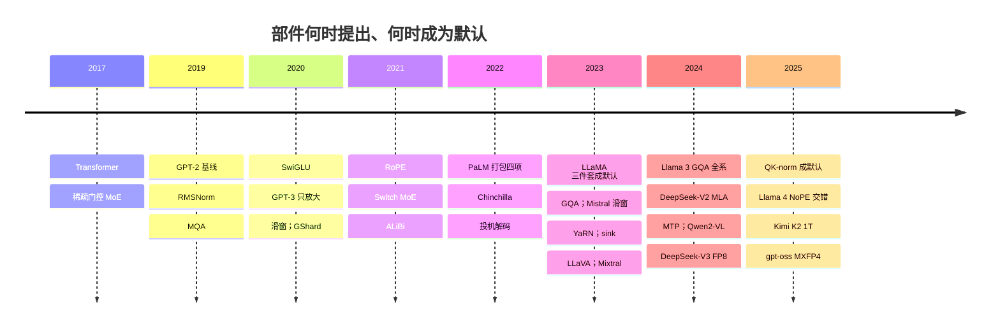
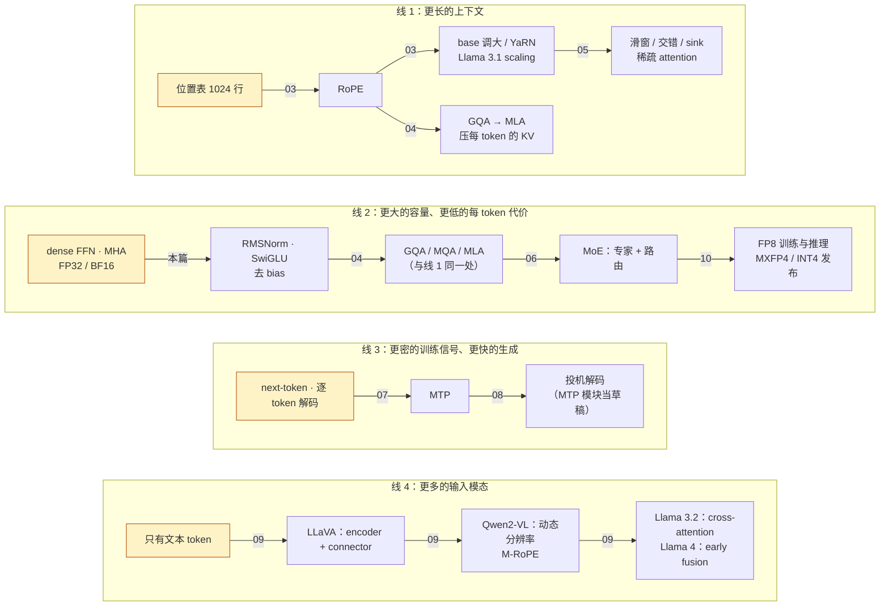
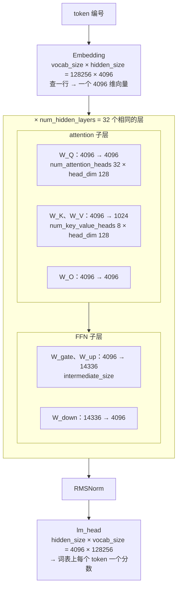

> **系列总览。** 本系列承接《Transformer 原理与实现：从论文到手搓 GPT-2》，从 GPT-2 的结构出发，沿着现代 LLM 的演进路线，读真实模型配置、拆解结构改动，再把它们换算成成本。

## 内容简介

《Transformer 原理与实现》用四篇回答 GPT-2 怎么工作、怎么写、怎么训练；本系列的十篇正文继续回答：从 GPT-2 到今天，模型的结构改了什么、为什么改、代价是什么。先看 Llama、DeepSeek 与多模态模型的配置，再以算量与访存为共同坐标，逐篇展开位置编码、Attention、长上下文、MoE、MTP、投机解码、多模态和数值格式。

## 一、承上：GPT-2 是一组可替换的槽位

[第一篇](/transformer-architecture-from-a-sentence-to-the-next-token.html)数出 decoder-only Transformer 有六种部件：token embedding、位置 embedding、attention 子层、FFN 子层、残差 + LayerNorm、lm_head。[第三篇](/nanogpt-model-py-line-by-line.html)把它们写成 330 行，[第四篇](/nanogpt-train-py-and-training-a-model-that-writes.html)训了出来。除了这六种部件，那份代码还隐含了四个当时没有讨论的约定：训练目标只有 next-token 一个、解码是逐 token 一次前向、权重与计算用一种浮点格式、输入只有文本。

把六种部件和四个约定排成一列，就是十个**槽位**。从 GPT-2 到今天的每一处结构改动，都是往其中一个槽位里换一个新的填法——没有一处改动换掉了"embedding → L 个相同的 block → norm → lm_head"这个骨架：

| 槽位 | GPT-2 的填法（nanoGPT 里的名字） | 今天常见的填法 | 换它为了回答什么问题 | 在哪一篇 |
|---|---|---|---|---|
| 归一化 | LayerNorm（`ln_1`、`ln_2`、`ln_f`） | RMSNorm | 少一次均值、少一组参数，数值行为更简单 | [01 五处改动](/gpt2-to-llama-five-changes-and-parameter-count.html) |
| 位置 | 学出来的位置表（`wpe`，1024 行） | RoPE；再加 base 调大、YaRN、NoPE 层交错 | 相对位置怎么进 attention；训练长度之外还认不认得 | [03 位置编码与外推](/positional-encoding-and-long-context.html) |
| attention 的 K/V | MHA：K、V 与 Q 同宽（`c_attn` 是 $$d \to 3d$$） | GQA / MQA / MLA | 每个 token 的 KV cache 占多少字节 | [04 Attention 变体与 KV cache](/attention-variants-and-kv-cache.html) |
| attention 的可见范围 | 全局 causal mask（`bias` 下三角） | 滑窗、局部 / 全局交错、attention sink、稀疏 | 上下文拉长后 KV 线性、prefill 二次增长怎么办 | [05 长上下文的成本与结构手段](/long-context-cost-and-structural-remedies.html) |
| FFN | GELU 两矩阵、$$4d$$（`c_fc`、`c_proj`） | SwiGLU 三矩阵、约 $$3.5d$$ | 等参数、等算量下更低的 loss | [01 五处改动](/gpt2-to-llama-five-changes-and-parameter-count.html) |
| FFN 的份数 | 一份 dense FFN | MoE：多个专家 + 路由 | 参数量与每 token 算量能不能解耦 | [06 MoE](/moe-compute-and-communication.html) |
| bias | 线性投影与 LayerNorm 都带 bias | 全部去掉 | 训练更稳、GEMM 更纯 | [01 五处改动](/gpt2-to-llama-five-changes-and-parameter-count.html) |
| 输出层 | lm_head 与 `wte` 共享权重 | 大模型不共享 | 词表大小与模型规模的关系 | [01 参数量](/gpt2-to-llama-five-changes-and-parameter-count.html) |
| 训练目标 | 只预测下一个 token | MTP：同时预测后面几个 | 同一批数据能不能给更多监督 | [07 MTP](/multi-token-prediction-mtp.html) |
| 解码流程 | 每步一次前向、产出一个 token | 投机解码：草稿 + 一次前向验证多个 | decode 的串行形态能不能打破 | [08 投机解码](/speculative-decoding-draft-verify-and-payoff.html) |
| 输入模态 | 只有 token embedding | vision encoder + connector，或 cross-attention | 图片怎么变成 decoder 能处理的 token，代价在哪一环 | [09 多模态](/multimodal-vision-encoder-cost-and-image-token-kv.html) |
| 数值格式 | FP32（可选 BF16 autocast） | BF16 训练 → FP8 训练与推理 → MXFP4 / INT4 发布 | 每个数占几个字节，误差在哪里积累 | [10 浮点格式与混合精度](/floating-point-formats-and-mixed-precision.html) |

Table: GPT-2 的槽位、今天的填法与展开它们的篇目——现代 LLM 结构系列的目录就是这张表

两件事值得先说清。其一，**规模不在表里**：从 124M 到 8B、70B、1T，$$d$$、$$L$$、$$V$$ 的放大不换任何槽位，但它决定每一处改动值不值得——GQA 在 124M 的模型上省不出什么，在 70B 上省的是几十 GB 的 KV。规模怎么选是[预训练系列](/pretraining-from-tokenizer-to-training-recipe.html)的 scaling law，规模带来的算量与字节是[第 02 篇](/transformer-flops-bytes-and-roofline.html)。其二，**一处改动可以同时服务两个问题**：GQA 既省 10% 的参数也省 4 倍的 KV，MLA 既是 attention 变体也是长上下文手段。本篇把每处改动放在它**主要回答的问题**所在的线上，并在该篇里说明它的次要收益；读者不必纠结一处改动"属于"哪条线。

## 二、时间线：这些改动是什么时候、为什么出现的

把表里的填法按出现时间排开，能看到两种节奏。一种是"论文先提出、几年后被某个有影响的开源模型采纳、再成为默认"——RMSNorm（2019）、SwiGLU（2020）、RoPE（2021）都是在 2023 年的 LLaMA 里被打包采纳之后，才变成开源模型的默认配置；MQA（2019）等到 2023 年的 GQA 才被大模型普遍接受。另一种是"一个实验室为了解决自己的问题一次打包多项"——PaLM（2022）同时用了 SwiGLU、去 bias、MQA、RoPE，DeepSeek-V2 / V3（2024）同时引入 MLA、细粒度 MoE、MTP 与 FP8 训练：

时间线上有两个值得注意的"空档"。2019–2022 年几乎所有部件级的改动都已经被提出，但主流模型（GPT-3）仍是放大的 GPT-2 结构——这几年的主旋律是规模与数据，不是结构。2023 年之后结构改动重新活跃，驱动力换成了**推理成本**：上下文从 2K 拉到 128K、从单轮问答到长文档与 agent，KV cache 与 decode 带宽成了瓶颈，GQA / MLA、滑窗、MoE、FP8、投机解码都是对这个瓶颈的回答。这也是现代 LLM 结构系列把[第 02 篇](/transformer-flops-bytes-and-roofline.html)的算量与访存量放在所有专项之前的原因：不先知道什么贵，就看不出每处改动在省什么。

## 三、四条演进线

按"回答什么问题"归类，时间线上的改动落在四条线上。每条线给出起点、各站、各站的篇目；四条线的交汇点是 attention 的 K/V 槽位——它同时被长上下文线和效率线改写：

### 1. 更长的上下文（03 → 04 → 05）

**问题**：GPT-2 的上下文是 1024，因为位置表只有 1024 行；今天的模型要处理 128K 甚至更长。拉长上下文要同时解决两件事——**训练长度之外的位置还认不认得**，和**上下文拉长之后 KV、prefill 与并发被什么限制**。前者是位置编码的事，后者与位置编码无关，换任何位置方案都不会消失。

**各站**：位置表 → RoPE（相对位置进 attention 分数，没有行数上限）→ RoPE 的 base 从 10⁴ 调到 5×10⁵、YaRN、Llama 3.1 的 scaling（训练长度之外的相位分布怎么处理）——[第 03 篇](/positional-encoding-and-long-context.html)。然后是两条互补的成本手段：GQA / MLA 把每个 token 的 KV 从 512 KiB 压到 128 KiB、再到 70 KiB——[第 04 篇](/attention-variants-and-kv-cache.html)；滑窗、局部 / 全局交错、attention sink、稀疏 attention 改变每个 token 能看到的集合，把 KV 的线性项和 prefill 的二次项改成别的形状——[第 05 篇](/long-context-cost-and-structural-remedies.html)。

**读 config 时认它**：`rope_theta`、`rope_scaling`、`max_position_embeddings`、`num_key_value_heads`（或 MLA 的 `kv_lora_rank`）、`sliding_window` / `layer_types`。

### 2. 更大的容量、更低的每 token 代价（01 → 04 → 06 → 10）

**问题**：参数越多效果越好，但每 token 的算量、每个参数占的字节、每个 token 的 KV 也跟着涨。这条线的每一站都是在**不降低质量的前提下少算、少存、少搬**。

**各站**：先是三处几乎零成本的部件精简——LayerNorm → RMSNorm、GELU 两矩阵 → SwiGLU 三矩阵、去掉 bias——它们在[第 01 篇](/gpt2-to-llama-five-changes-and-parameter-count.html)讲清。然后 MHA → GQA → MLA 在 attention 槽位上省 K/V 投影的参数和 KV cache——[第 04 篇](/attention-variants-and-kv-cache.html)。再是最大的一步：把 dense FFN 换成 MoE，总参数 671B、每 token 只激活 37B，参数量与每 token 算量第一次分离，代价是全部权重常驻显存和专家之间的 all-to-all——[第 06 篇](/moe-compute-and-communication.html)。最后是每个数占几个字节：BF16 训练 → DeepSeek-V3 的 FP8 分块训练与推理 → gpt-oss 以 MXFP4 发布 MoE 权重——[第 10 篇](/floating-point-formats-and-mixed-precision.html)讲格式与误差，更低位宽的量化方法在算法地图的[《高效推理与压缩》](/efficient-inference-and-compression-for-llms.html)。

**读 config 时认它**：`rms_norm_eps`、`hidden_act: silu` 加三个 FFN 矩阵、`attention_bias` / `mlp_bias`、`num_key_value_heads`、`n_routed_experts` / `num_experts_per_tok` / `n_shared_experts`、`torch_dtype` 与 `quantization_config`。

### 3. 更密的训练信号、更快的生成（07 → 08）

**问题**：GPT-2 的训练目标是每个位置预测下一个 token，解码是每步一次前向产出一个 token。前者决定一批数据能提供多少监督，后者决定 decode 的串行形态——batch 小时每步都要把全部权重从 HBM 读一遍，Tensor Core 大多空转。

**各站**：MTP 在主干之上加预测模块，训练时同时预测后面几个 token，推理时可以丢掉——[第 07 篇](/multi-token-prediction-mtp.html)；投机解码不改结构、不改输出分布，用一个便宜的草稿（小模型、或留下来的 MTP 模块）先猜几个 token，再用一次前向把它们全部验证掉——[第 08 篇](/speculative-decoding-draft-verify-and-payoff.html)。两站相邻，因为 DeepSeek-V3 的 MTP 模块正是它自己投机解码的草稿来源。

**读 config 时认它**：`num_nextn_predict_layers`；投机解码是推理引擎的配置，不在模型 config 里。

### 4. 更多的输入模态（09）

**问题**：前三条线都是在文本模型内部改；这条线是**加能力**——让同一个 decoder 读图片、视频、音频。它不是从 Llama-3 或 DeepSeek-V3 推出来的，而是另起一条线。

**各站**：LLaVA 用 CLIP 一类的 vision encoder 把图片编码成一串向量、经一个线性或 MLP 的 connector 投到 $$d$$ 维、当作 token 插进序列；Qwen2-VL 改为动态分辨率（图片多大就多少 token）加 M-RoPE（位置编码扩成时间、高、宽三维）；Llama 3.2 Vision 不插 token，用 cross-attention 层把图像特征注入；Llama 4 把图像 patch 与文本 token 从预训练开始就混在一起（early fusion）。[第 09 篇](/multimodal-vision-encoder-cost-and-image-token-kv.html)算这几种接法的 encoder 算量和 image token 的 KV 代价；编码器怎么选、connector 怎么训、生成式多模态是算法地图[《多模态》](/multimodal-from-vision-encoders-to-diffusion.html)系列的内容。

**读 config 时认它**：`vision_config`、`mm_projector_type` / `projector_hidden_act`、`image_token_id`、`spatial_merge_size`、`cross_attention_layers`。

四条线之外还有一类改动是**训练稳定性**：QK-norm（对 Q、K 各做一次 RMSNorm 再算点积，Gemma 3、Qwen3 采用）、DeepSeek-V3 无辅助损失的负载均衡、Kimi K2 的 MuonClip。它们不改变前向的成本形态，本系列只在相关处顺带说明（QK-norm 在[第 10 篇](/floating-point-formats-and-mixed-precision.html)中讨论），训练配方整体在预训练系列。

有了路线图，剩下的工作是把它落到真实配置上。第四章讲路线图里没有专篇的三处改动（RMSNorm、SwiGLU、去 bias）加上 GQA 与去共享的参数接口；第五章用三张配置表把 GPT-2 → Llama-3 → DeepSeek-V3 → 2025 年的模型放到四条线上；第六章算现代 LLM 结构系列的第一笔账——参数量——把 Llama-3-8B 精确到 8,030,261,248，再验证 70B 与 405B，最后解释 DeepSeek-V3 的 config 字段怎么对应 MLA、MoE、MTP、dense 公式在哪里失效；第七章对照 `modeling_llama.py`；第八章给出贯穿脚本 `llm_cost.py` 的第一版。

| 章 | 主题 | 内容 |
|---|---|---|
| 四 | 五处改动，每一处为什么 | RMSNorm、RoPE、SwiGLU 与 14336、GQA、去 bias：各解决什么问题、代价是什么、参数怎么变 |
| 五 | 读配置：把路线图落到 `config.json` 上 | GPT-2 与 Llama-3 对照；三代模型的实践地图；2025 年的对照 |
| 六 | 参数量：从 `config.json` 到 8.03B | 七个矩阵；公式；逐项代入 8B / 70B / 405B；参数分布；常见算错；DeepSeek-V3 的字段 |
| 七 | 对照 `modeling_llama.py` | 每个类对应哪些矩阵、哪些形状 |
| 八 | 实践 | `llm_cost.py` 第一版：从 `config.json` 算参数量 |
| 九 | 本文小结 |  |
| 十 | 自测 | 6 道题 |

Table: 本文余下的章节安排

每个矩阵在前向里对应的 GEMM 形状（$$m$$、$$k$$、$$n$$）、prefill 与 decode 的差别、张量并行怎么切，放在[下一篇《现代 LLM 结构（02）：前向的算量与访存量》](/transformer-flops-bytes-and-roofline.html)，那里与 FLOPs 一起讲。

## 六个数字：从结构到成本

现代 LLM 结构系列的所有推导都从一个 `config.json` 出发。Llama-3-8B 的 `config.json` 里有六个数字：

- **hidden_size**：4096
- **intermediate_size**：14336
- **num_hidden_layers**：32
- **num_attention_heads**：32
- **num_key_value_heads**：8
- **vocab_size**：128256

先把这六个数字标到模型结构上——每个数字都是图里某个方框的一条边长（第一篇会解释每个方框是什么，第一篇解释它与 GPT-2 差在哪）：

图里有两处容易让人停下来的地方。**$$W_Q$$ 是 4096 → 4096 而 $$W_K$$、$$W_V$$ 是 4096 → 1024**，因为 Q 有 32 个头、K 和 V 只有 8 个头（GQA）：每个头都是 128 维，$$32 \times 128 = 4096$$，$$8 \times 128 = 1024$$，推理时每个 K/V 头被 4 个 Q 头共用——第一篇讲这一处为什么改、第四篇讲它省了多少 KV。**两个 head_dim 128 必须相同吗？** Q 与 K 的必须相同，因为 attention 分数是 $$q \cdot k$$ 的点积，长度不同乘不了；V 的 head_dim 原则上可以不同——它只参与加权求和，输出再由 $$W_O$$ 投回 hidden_size——DeepSeek-V3 的 MLA 就是 Q/K 每头 192 维（128 + 64 维 RoPE 部分）、V 每头 128 维。Llama 这类 GQA 模型三者都取 128，所以 `config.json` 只给一个 `head_dim`。

从这六个数字出发，不需要运行任何代码，可以算出：

- 它有 8.03B 参数，BF16 权重 16.06 GB；
- 每生成一个 token 需要约 15 GFLOPs（不含 attention 对上下文的那部分），而这部分在上下文 8K 时再加 4.3 GFLOPs，128K 时加 68.7 GFLOPs——超过权重那部分；
- 每个 token 的 KV cache 占 128 KiB；如果它没有用 GQA，会是 512 KiB；
- 在一张 H100 上，batch 为 1 的 decode 每步至少要 4.5–4.8 ms，因为要把约 15–16 GB 权重从 HBM 读一遍；要让 Tensor Core 忙起来，batch 得接近三百。

这些推导是第五、六篇的内容，方法是：给出公式、代入公开模型的真实超参数、得到数字，再解释这个数字对系统设计意味着什么。之后每个专项都只算自己相对这条基线的增量。一个 LLM 的成本由四组变量决定，多模态加第五组（训练侧的第六组在预训练系列）：

| 变量组 | 包括 | 在哪几篇 |
|---|---|---|
| 结构变量 | 层数 · hidden · FFN 宽度 · head 数 · KV 头数 · 专家数与 top-k | 第五、八、十篇 |
| 运行变量 | batch · 上下文长度 · prefill 还是 decode | 第六、九篇 |
| 方法变量 | 草稿与接受率 · 验证几个 token | 第四篇 |
| 模态变量 | 图片分辨率 · patch 与 merge 大小 · encoder 深度 · 注入方式 | 第一篇 |
| 数值变量 | 每个数占几个字节 · 在哪一步累加 · 误差怎么积累 | 第二篇 |

Table: 决定一个 LLM 成本的五组变量与对应篇目

## 为什么写这个系列？

### 主流 LLM 共用同一种主干，但"知道它长什么样"和"能写出来"差得很远

今天的主流语言模型——GPT、Llama、Qwen、DeepSeek、Gemma 等公开或半公开其结构的模型——都以 2017 年提出的 Transformer 的 decoder 部分为主干；之后的变化是对部件的替换、增删与重组，没有换掉这个主干。这意味着理解大模型内部只需要先理解一种结构，但也意味着"大概知道 attention 和 FFN 堆起来"远远不够：能优化模型结构、能迭代出更强模型的人，脑子里装的是每个部件承担什么作用、去掉或换掉会怎样、改一处会牵动什么。这种理解的检验标准只有一个——**能不能不看原文把它写出来、训出来**。Transformer 原理与实现系列四篇就是为这个标准设计的：结构图（静态）→ 数据流（动态）→ 代码 → 训练，每一步都可以在笔记本上验证。

### 演进沿着几个方向走，每一处都是对某个具体问题的回答

从 GPT-2 到 Llama 的主要部件变化可归纳为五处（LayerNorm → RMSNorm、位置表 → RoPE、GELU 两矩阵 FFN → SwiGLU 三矩阵、MHA → GQA、去掉 bias），从 Llama 到 DeepSeek-V3 又改了三处（MLA、细粒度 MoE、MTP）。第 01 篇把这些改动按时间线排好，再用真实配置把它们放在一张实践地图里，并把 2025 年的 Qwen3、Llama 4、Kimi K2、gpt-oss 放到同一张图上对照；第 03–10 篇再逐项展开。把这些改动按它们回答的问题归类，是四条演进线（第 01 篇第三章逐线给出起点、各站与篇目）：

| 方向 | 问题 | 改动 | 篇 |
|---|---|---|---|
| 更长的上下文 | 训练长度之外位置还认不认得；上下文拉长后 KV、prefill 与并发被什么限制 | RoPE 的 base 与 YaRN；GQA / MLA；滑窗、交错、sink、稀疏 attention | 03、04、05 |
| 更大的容量、更低的每 token 代价 | 参数量与每 token 算量能不能解耦；每个数能不能少占几个字节 | MoE；FP8 训练与推理 | 06、10 |
| 更密的训练信号、更快的生成 | 同一批数据能不能给更多监督；decode 的串行形态能不能打破 | MTP；投机解码 | 07、08 |
| 更多的输入模态 | 图片、视频、音频怎么变成 decoder 能处理的 token，代价在哪一环 | vision encoder、connector、cross-attention、M-RoPE | 09 |

Table: 现代 LLM 结构系列的四个演进方向

第四个方向不是从 Llama-3 或 DeepSeek-V3 推出来的：多模态首先是增加能力，不是降低成本。这也是不把"成本"当作现代 LLM 结构系列唯一视角的原因——位置编码关乎顺序表示和长度泛化，MoE 关乎给定计算预算下的模型容量，MTP 关乎辅助训练信号与生成流程。每篇统一按**问题 → 方法（改了什么、什么没改）→ 实现（形状、公式、最小代码）→ 效果（功能验证、质量指标或公开实验依据）→ 代价（相对基线增减了哪些资源项）→ 边界（什么场景有效）**的顺序讲；不是每篇都给成本表加一列——位置编码、数值稳定性、MTP 更适合给一张验证图或一组对照实验。

### 引擎与 kernel 的一切优化都以模型的算量和访存量为目标

推理引擎的 continuous batching、PagedAttention、prefix caching、PD 分离，训练框架的张量并行、流水并行、专家并行、激活重算，kernel 层的 FlashAttention、融合算子、低精度 GEMM——每一项都是对模型某个成本项的回应。不知道 KV cache 是怎么算出来的，就不理解 PagedAttention 在管理什么；不知道 decode 为什么是 memory-bound 的，就不理解为什么 weight-only 量化对 decode 有效、对 prefill 不保证加速；不知道 MoE 每层只激活 8/256 的专家，就不理解它的部署为什么要考虑 all-to-all 而不只是 all-reduce。第二篇建立这套推导，后面每篇用它：面对一个新模型、新硬件、新方法，可以在看任何 benchmark 之前先算出它**应该**多快，再用测量去解释差距。

### "参数量"只是成本的一个维度

模型卡上通常只有一个数字：参数量。但一个 8B 的 dense 模型、一个 47B 总参数 13B 激活参数的 MoE 模型、一个 671B 总参数 37B 激活参数的 MoE 模型，它们的显存、算量、访存量、通信量之间的关系完全不同：

| | 参数量决定 | 激活参数量决定 | 上下文长度决定 | batch 决定 |
|---|---|---|---|---|
| 显存 | 权重 | — | KV cache | KV cache · 激活值 |
| 算量（FLOPs） | — | 每 token 的 GEMM | attention 项 | 总量 |
| 访存量 | decode 的下界 | — | KV 读取 | 摊薄权重读取 |
| 通信量 | 并行切分 | MoE 的 all-to-all | 序列并行 | — |

Table: 四类成本各由哪个变量决定

每一格都有自己的公式，公式里的变量各不相同。现代 LLM 结构系列把这张表的每一格填上。

### 现有材料的断层

- **教材与课程**（d2l 10.7、"Let's build GPT"）把结构与代码讲得很好，但止步于 GPT-2 的形态，不讲 GQA、MLA、MoE、MTP 为什么出现，也不算成本；
- **论文**给出了每个方法的定义和实验结果，但假设读者会自己算成本，而且每篇只讲一个方法，读者需要自己把它们放进同一个坐标系；
- **框架文档**（PyTorch、`transformers`、vLLM、Megatron）讲怎么用，把模型当作黑盒；
- **博客**里的"Transformer 数学"多数止步于参数量和 $$6ND$$，不覆盖 MLA、MoE、FP8、投机解码这些当前实践的重心。

本系列想与《Transformer 原理与实现》接成一条学习路径：从"能手写一个 GPT-2"到"知道今天的模型为什么不是 GPT-2 的样子、每一处改动花了什么"。取法是：**结构与实现用同一个玩具例子和同一份代码从头到尾验证；每一个演进都放回它解决的问题里讲并给出实现；每一个成本都放回同一张成本表里讨论，用同样三个模型、同一张 GPU 的数字**。

## 适合哪些读者？

### 想真正理解大模型内部、并且亲手写一个的人

你可能是算法方向的学生或转行者，读过 attention 的公式但从没把一个 Transformer 从头写出来、训出来。Transformer 原理与实现系列四篇按"图 → 数据流 → 代码 → 训练"的顺序，每一步都有可以在笔记本上跑的代码和数字，不需要 GPU。

### 设计或调整模型结构的算法工程师

你在选 GQA 组数、选 MoE 的专家粒度、选 RoPE 的 base、决定是否用 MLA 或 MTP。现代 LLM 结构系列告诉你每个选择在解决什么、动了哪几行、效果如何，并把代价算成显存、算量、访存、通信的数字，让结构设计和硬件效率在同一张表上讨论。

### 做推理系统与训练基础设施的工程师

你在配置或改造 vLLM、SGLang、Megatron、DeepSpeed 这类系统，需要判断：这个模型在这几张卡上该怎么切、batch 和上下文的上限在哪、投机解码的收益上界是多少、MoE 该用 EP 还是 TP 还是两者组合。第二篇给的是你做这些判断时要用的公式，各专项篇给的是数字；Transformer 原理与实现系列是理解这些公式的前提——如果你已经熟悉结构，可以从第一篇进入。

### 写 kernel 的工程师

你要优化的 attention、GEMM、MoE、量化 kernel 的输入 shape 和访存模式都来自模型结构。理解 GQA 的组数如何改变 decode attention 的算术强度、MLA 的矩阵吸收如何把 attention 变成一个大 head dim 的 MQA、MoE 的 grouped GEMM 的 M 维为什么这么小，才知道该往哪个方向优化。

### 从后端转向 AI-Infra、需要一份"模型知识最小集"的工程师

你不打算成为算法工程师，但读引擎源码、看性能报告、参加技术讨论时，需要知道 head、layer、KV cache、prefill、decode、MoE、FP8 这些词背后的数量关系。第一、二篇加第二篇是为此准备的最小集。

## 系列的整体主线

两个系列各回答一个问题：《Transformer 原理与实现》问 GPT-2 怎么工作、怎么写；《现代 LLM 结构》问今天的模型改了什么、为什么、花了什么。本系列的入口是第一篇的参数量与第二篇的算量、字节与时间——后面每个专项都只算自己相对这条基线的增量：GQA / MQA / MLA 改的是 attention 的形状，省下的是 KV cache；MoE 改的是 FFN，换来的是激活参数与 all-to-all 通信；MTP 改的是训练目标，多出来的是一个模块和一个损失项；投机解码改的是解码流程，用空转的算力换 token；多模态改的是输入，多出来的是 encoder 算量与 image token 的 KV；浮点格式改的是每个数占几个字节。贯穿全系列的模型实例是 GPT-2 small（Transformer 原理与实现系列）→ Llama-3-8B / 70B（dense、GQA）→ DeepSeek-V3（MLA、MoE、FP8、MTP）→ Mixtral 8x7B（粗粒度 MoE）→ LLaVA-1.5 / Qwen2-VL / Llama-3.2-Vision（多模态）。

Transformer 原理与实现系列的每一篇都用同样的方法：**画出图，写出代码，跑出数字，与 PyTorch / HuggingFace 对拍**。现代 LLM 结构系列的每一篇都用同样的方法：**写出公式，代入真实模型的超参数，算出数字，解释数字对系统意味着什么，再用小实验或公开实验依据检验**。

### 01. 从 GPT-2 到今天的 LLM：结构演进的路线图

第一篇从两组系列的交界处出发：先把《Transformer 原理与实现》写出的 GPT-2 看成十个可替换的槽位（归一化、位置、attention 的 K/V、可见范围、FFN、FFN 的份数、bias、输出层、训练目标、解码流程、输入模态、数值格式），再按 2017–2025 年的时间线排出每个填法是什么时候、为什么出现的——部件级论文（RMSNorm、SwiGLU、RoPE、MQA）在 2023 年的 LLaMA 之后才成为默认，2023 年之后结构改动重新活跃的驱动力是推理成本；然后把这些改动归成四条演进线（更长的上下文 03 → 04 → 05；更大的容量、更低的每 token 代价 01 → 04 → 06 → 10；更密的训练信号、更快的生成 07 → 08；更多的输入模态 09），每条线标出起点、各站与篇目。有了路线图再读真实配置：GPT-2 与 Llama-3 对照、三代模型的实践地图、2025 年的 Qwen3 / Llama 4 / Kimi K2 / gpt-oss——它们没有引入新的槽位，只是换了组合与配置。RMSNorm、SwiGLU、去 bias 没有专篇，在这里讲透；GQA 只保留参数量所需的 KV 投影宽度，原理交给第四篇。最后是现代 LLM 结构系列的第一笔账——参数量公式 $$N \approx L \cdot [d (d + 2 d_{kv} + d) + 3 d \, d_{ff}] + 2 V d$$，逐项代入 Llama-3-8B（attention 每层 41.9M，FFN 每层 176.2M，32 层共 6.98B，embedding 与 lm_head 各 525M，合计 8.03B）、70B 与 405B 验证；dense 模型里 FFN 占每层参数约 80%，embedding 在小模型里占比很高（8B 的 13%）而在大模型里可以忽略；最后对照 `modeling_llama.py` 把每个 `nn.Linear` 的形状与公式一一对应。

> **给你一个 2025 年模型的 `config.json`，能不能指出它相对 GPT-2 在哪几个槽位换了什么、每一处回答什么问题、去哪一篇看推导？再给你一个 Llama 式 dense 模型的配置，不运行代码，能不能在五分钟内算出它的参数量，并说出这些参数在 attention、FFN、embedding 之间怎么分配？误差要在 1% 以内。**

实践：写一个读 `config.json` 输出逐层参数表的脚本，用 Llama-3-8B、Llama-3-70B 验证到与官方公布的参数量一致。这个脚本会在后面每一篇里长出新的列。

### 02. 前向的算量与访存量：prefill、decode 与 Roofline

第二篇是现代 LLM 结构系列共用的成本工具箱：把第一篇数出的每一个矩阵乘换成时间。一个 $$[m, k] \times [k, n]$$ 的矩阵乘是 $$2mkn$$ FLOPs，于是前向约 $$2N$$ FLOPs / token、训练约 $$6N$$；attention 对上下文的那部分每层每 token $$4ds$$，8K 时 4.3 GFLOPs，128K 时 68.7 GFLOPs，超过权重的 15 GFLOPs。prefill 一次处理 $$s$$ 个 token，decode 每步只处理 $$B$$ 个——同一组矩阵、两种 GEMM 形状。访存量：权重每步读一遍（Llama-3-8B 约 15–16 GB），KV cache 每步读一遍（每 token 128 KiB × 上下文 × batch）。Roofline：算术强度 $$I = \text{FLOPs} / \text{bytes}$$，H100 的 ridge point 约 295 FLOP/byte；decode 权重 GEMM 的强度约等于 $$B$$，$$B = 1$$ 时差两个数量级——这就是"decode 是 memory-bound 的"的全部含义。时间下界：decode 每步约 4.5–4.8 ms（约 220 token/s 的单请求上限）；8K prefill 按因果三角约 140 TFLOP（不利用掩码约 158），峰值下 0.14–0.16 s，按 60% 的经验 MFU 约 0.24–0.27 s——注意"causal mask 让算量减半"要实现确实跳过被掩码区域才成立，完整矩阵乘完再加 mask 不会省下这部分 FLOPs。文末的训练侧一节（激活值显存 $$sbh(34 + 5as/h)$$、重算、MFU 与 HFU）只在训练相关篇目用到，第一遍可跳过。

> **Llama-3-8B 在一张 H100 上，batch 多大时 decode 从 memory-bound 变成 compute-bound？考虑 KV cache 之后，这个 batch 还能达到吗？**

实践：脚本增加 FLOPs 与字节数两列，输入 batch、上下文长度和硬件参数，输出 prefill 和 decode 的理论时间下界；与 vLLM 或 `transformers` 实测对比，解释差距。

### 03. 位置编码与外推

位置编码首先解决顺序与相对距离的表示，不是专为长上下文发明。第三篇从不带位置与掩码的 attention 的置换等变性出发，比较位置表、正弦编码与 RoPE，推导旋转点积里的相对位置和各维度的波长，再看 PI、NTK-aware、YaRN、Llama 3.1 分段缩放与 ALiBi。这里的**外推**（length extrapolation）指在比训练时更长的序列上推理：位置方案约束位置能否外推，但并不独自决定长文理解质量，也不消除长上下文的计算成本。

> **一个用 8K 训练的 RoPE 模型，为什么不能保证直接推理 32K？改 base 解决了什么？**

实践：用 NumPy 验证 RoPE 的相对性，对照三种缩放方法的波长与频率变化。

### 04. Attention 变体与 KV cache：MHA、GQA、MQA 与 MLA 的推导

第四篇专门讲 attention，因为它是 Transformer 里唯一成本随上下文长度增长的部分，也是过去几年结构改动最集中的地方。每一种变体都是在同一个目标下做取舍：**减少每个 token 的 KV cache 字节数，同时尽量不损失质量**。GQA 在第三篇的 `CausalSelfAttention` 上只改三处（K/V 投影变窄、按 $$n_{kv}$$ 拆头、`repeat_interleave` 对齐），MQA 是 $$n_{kv} = 1$$；KV cache 每 token $$2 L n_{kv} d_{head} \cdot \text{bytes}$$——Llama-3-8B 若是 MHA 是 512 KiB，GQA 压到 128 KiB，70B 为 320 KiB，128K 上下文时分别 16 GiB 和 40 GiB；GQA 还把 decode attention 的算术强度从约 1 提到约 $$g = n_h / n_{kv}$$。MLA 把 K 和 V 联合压缩到一个 512 维的 latent 外加 64 维的解耦 RoPE key，每 token 每层只缓存 576 个数，DeepSeek-V3 的 61 层每 token 约 68.6 KiB——128 个 head 却比 Llama-3-8B 还小；推理时的矩阵吸收让 attention 在 kernel 层等价于一个大 head dim 的 MQA；为什么 RoPE 与低秩压缩不兼容、要单独缓存，用的是第三篇的结论。末尾讲 FlashAttention 的 IO 复杂度（只推导、不讲 kernel）。

> **DeepSeek-V3 有 128 个 attention head、61 层，KV cache 却比 32 头 32 层的 Llama-3-8B 小。这是怎么做到的？代价是什么？**

实践：脚本增加 KV cache 列，支持 MHA / GQA / MQA / MLA 四种模式；给定显存预算，输出各模型在不同上下文长度下的最大并发数。

### 05. 长上下文的成本与结构手段

第五篇承接第三篇的外推与第四篇的 KV，换一个问题：即使位置能够外推，显存、TTFT 与并发仍被什么限制？KV cache 随长度线性增长，整段 prefill attention 的算量二次增长；FlashAttention 避免物化 logits，却不消除全局 attention 的二次算量。这一篇把 sliding window、全局 / 局部交错、attention sink、块稀疏逐项代入成本表，区分"改变可见位置""压缩 KV 表示"和"减少中间量 IO"；再连接到 chunked prefill 与序列并行的动机。

> **一个 128K 请求贵在哪里？滑窗把哪项改成了什么函数？**

实践：扫描上下文长度，计算每条请求的 KV、prefill FLOPs 与 attention 占比。8B 在 128K 下约 16 GiB KV，prefill 6.5 PFLOP，60% MFU 单卡等效约 11 秒。

### 06. MoE：路由、激活参数量与通信形态

第六篇讲混合专家模型。MoE 把"参数量"与"每 token 算量"解耦，是在给定计算预算下扩大模型容量的主流路线；它也把一个新的成本项——专家之间的通信——引入了模型前向。内容：一个最小 MoE 层的实现（router、top-k、专家计算、共享专家），把第三篇的 `MLP` 换成它；两种粒度（Mixtral 8x7B 的 8 个宽专家取 top-2，DeepSeek-V3 的 256 个窄专家取 top-8 加 1 个共享专家）；参数量与激活参数量（V3 总参数约 671B、每 token 激活 37B）；算量按激活参数算、显存按总参数算；decode 时的访存形态——在独立、均匀路由的假设下，batch 为 $$B$$ 时期望被激活的专家数为 $$E [1 - (1 - k/E)^B]$$，V3 在 $$B = 32$$ 时约 163 个、$$B = 128$$ 时约 252 个，中等 batch 下读取的专家集合扩大、权重流量上的稀疏收益减弱；专家并行（EP）的两次 all-to-all 与字节数，EP 与 TP 的对比及两者的组合（是否跨卡 all-to-all 取决于部署方式）；grouped GEMM 的 $$M$$ 维为什么小；负载均衡的三种做法。

> **DeepSeek-V3 每 token 只算 37B 参数，为什么部署它比部署一个 dense 70B 难得多？把"参数量"、"激活参数量"、"每步实际读取的参数量"三个数分开算。**

实践：脚本增加 MoE 支持——总参数、激活参数、给定 batch 下期望激活的专家数、EP 下每层的 all-to-all 字节数；用 Mixtral 8x7B 与 DeepSeek-V3 的公开超参验证。

### 07. MTP：改训练目标、不改主干的多 token 预测

第七篇是现代 LLM 结构系列里改**训练目标**的一篇：它不改主干，但增加训练时的模块与一个损失项。next-token 每个位置只有一份监督信号、只学一步远；MTP 让位置 $$i$$ 额外预测 $$t_{i+2}$$，并逼主干表示编码更远的未来。讲 DeepSeek-V3 的顺序 MTP 模块（两个 RMSNorm + 一个 $$2d \to d$$ 投影 + 一个 block，embedding 与 lm_head 与主干共享；顺序模块接收移位后的真实 token 信息，不只是凭原位置表示预测两步以外）、$$\mathcal L = \mathcal L_{\text{main}} + \lambda \bar{\mathcal L}_{\text{MTP}}$$、顺序为什么优于并行头、推理时丢弃或当投机解码的 draft（技术报告：接受率 85–90%，TPS 约 1.8 倍）。在第四篇的 nanoGPT 上挂一个 MTP 模块做对照实验：0.8M 参数的小模型上主任务无变化（一次小实验既不能证明也不能否定它在大模型上的收益）、MTP 头对下下个字符命中 45%、代价 +29% 参数、每步 +38% 时间。

> **每个位置多预测一个 token，训练时多花了什么、可能多得到什么？DeepSeek-V3 的 MTP 模块为什么要"顺序"而不是"并行"，推理时它去哪了？**

### 08. 投机解码：草稿、验证与收益条件

第八篇承接第七篇的 MTP 与第二篇的 memory-bound decode：既然小 batch 时多算几行几乎不花时间，就先用一个便宜的草稿猜 $$\gamma$$ 个 token，再由目标模型一次前向验证。推导接受 / 拒绝重采样的分布等式（输出分布严格等于目标模型，草稿只影响效率）、期望产出 $$\frac{1 - \alpha^{\gamma+1}}{1 - \alpha}$$ 与加速比（$$\alpha = 0.8$$、$$\gamma = 4$$、草稿成本 10% 时约 2.4×）、验证 $$\gamma + 1$$ 个 token 为什么几乎免费又在 $$B \gtrsim \text{ridge}/(\gamma+1) \approx 60$$ 后失效甚至低于 1；草稿从哪里来——独立小模型、Medusa、EAGLE、n-gram、MTP 模块——MTP 模块只是草稿来源之一，不是投机解码的必要条件。

> **同一套投机解码，为什么 batch 1 时加速 2 倍，batch 64 时没有收益？**

实践：脚本增加时间模型与期望加速比，扫描 batch 得到转折点。

### 09. 多模态：vision encoder 的算量与 image token 的 KV 代价

第九篇把输入从 token id 扩展到图片、视频与音频。前面所有的账都以"token 数由 tokenizer 决定"为前提；多模态模型把一张图先送进一个独立的 vision encoder（ViT），再由 connector 变成几百到几千个 token 插进 prompt。于是多了三笔账：encoder 自己的算量（ViT 参数量 $$\approx 12 L_{vit} d_{vit}^2$$，一张图 $$2 N_{vit} n_p + 4 L_{vit} n_p^2 d_{vit}$$ FLOPs）、connector 决定的 token 数（MLP projector 不压缩、2×2 merge ÷4、Perceiver / Q-Former 定长；同一张 1024² 的图从 576 到 6404 个 token）、这些 token 进入 decoder 后与文本 token 完全相同的 prefill FLOPs 与 KV cache。本篇只保留一个从预处理到 decoder 的完整案例（Qwen2-VL 风格、1024² → 37 × 37 = 1369 个 token，放到 70B 规格的 decoder 上），其他模型做对照表；再看 cross-attention 注入（Llama 3.2 Vision）、M-RoPE、视频与音频的 token 数，以及训练侧冻结 encoder 省的是什么。编码器怎么选、connector 与注入方式的设计动机、VLM 怎么训练，在算法地图的[《多模态》系列](/multimodal-from-vision-encoders-to-diffusion.html)。

> **一张 1024×1024 的图片在 Qwen2-VL 里等于多少个 token？为什么"encoder 输出只有 21 MB"与"这张图在 decoder 里占 400 多 MB 显存"两句话同时成立？**

实践：脚本增加 vision encoder 的参数与 FLOPs、image token 数、image token 在 decoder 中的三个字节数；成本表新增"一张 1024² 图片"一行，按三种注入方式对照。

### 10. 浮点格式、数值稳定性与混合精度

第十篇从"每个数占几个字节"进入"每个字节里存了什么"。前面各篇的字节数估算以 BF16 的 2 字节为默认；这一篇解释为什么是 BF16，以及把它换成 FP16、FP8、INT8 时数值上会发生什么。浮点格式的位布局（FP32 / TF32 / FP16 / BF16 / E4M3 / E5M2 / INT8 / INT4）与各自的最大值、最小正规数、机器精度：BF16 与 FP32 同范围，相邻可表示数在 1 附近的间隔是 $$2^{-7}$$、舍入到最近值的单位舍入误差是 $$2^{-8}$$；**BF16 牺牲尾数精度换取更大的表示范围**，FP16 反之，深度学习几乎总是选范围。数值在哪些地方丢失（大数吃小数、长求和、softmax 的指数溢出、方差的相消）；累加精度与 Tensor Core 的 FP32 累加器，FP8 Tensor Core 累加精度有限、DeepSeek-V3 每 128 个元素提升到 FP32；混合精度训练为什么能工作、master weights 为什么不能省（Adam 单步更新 $$10^{-4}$$–$$10^{-3}$$ 量级低于 BF16 的 $$2^{-8}$$）、FP16 的 loss scaling；训练状态每参数 16 字节，8B 全量训练 128 GB；FP8 训练的 E4M3 / E5M2 分工与分块 scaling；推理中的数值（QK-norm、RMSNorm 的 $$\epsilon$$、两个 kernel 的差异该多大、非确定性）。它是两条线的交接处：训练状态接到预训练与大规模训练系列，低比特表示接到高效推理的量化篇。

> **BF16 的相对精度只有 FP16 的 1/8，为什么它反而成了训练的默认格式？把它同时用在权重更新上会出什么问题？**

实践：用 NumPy / PyTorch 逐位构造各种格式的数，验证最大值、最小值和机器精度；模拟一个 BF16 权重更新被吃掉的过程；对同一个 GEMM 用 FP32 / BF16 / FP8 计算并度量误差随 $$k$$ 的增长。

## `llm_cost.py` 贯穿实践线

现代 LLM 结构系列的贯穿物是**一张成本表和一组生成它的推导脚本**。脚本从第一篇的参数量开始，每篇增加几列，到第二篇结束时可以为任何一个给出 `config.json` 的模型、任何一组硬件参数输出（预训练系列再加上训练侧的四列）：

- **第一篇**：参数量；逐层、逐矩阵；attention / FFN / embedding 的分布
- **第二篇**：FLOPs · 字节数；prefill 与 decode 的理论时间下界；Roofline 位置
- **第四篇**：KV cache；MHA / GQA / MQA / MLA；给定显存的最大并发
- **第五篇**：长上下文；上下文长度 → KV cache、prefill FLOPs、attention 占比
- **第六篇**：MoE；总参数 · 激活参数 · 期望激活专家数 · all-to-all 字节数
- **第八篇**：投机解码；时间模型、期望产出与加速比随 batch 的曲线
- **第九篇**：多模态；ViT 参数与 FLOPs；image token 数；image token 的 prefill FLOPs 与 KV
- **第十篇**：精度；各格式的字节数与训练状态；误差随累加长度的增长

三个模型贯穿现代 LLM 结构系列：**Llama-3-8B** 与 **Llama-3-70B** 代表 dense + GQA 的主流结构，**DeepSeek-V3** 代表 MLA + 细粒度 MoE + FP8 的另一条路线；Mixtral 8x7B 在 MoE 一篇作为粗粒度专家的对照；第一篇加入 LLaVA-1.5、Qwen2-VL、Llama-3.2-Vision 三个多模态模型，把"一张图"作为一行放进同一张表。每篇算出的数字都会填进同一张表，读者在第二篇结束时手上有一张这些模型在 H100 上的完整成本对照。表的骨架大致如下（BF16，H100 SXM，数字为理论值）：

|  | Llama-3-8B | Llama-3-70B | DeepSeek-V3 |
|---|---|---|---|
| 参数量 | 8.03B | 70.6B | 671B（激活 37B） |
| 权重字节数（BF16） | 16.1 GB | 141 GB | 1342 GB（FP8 为 671 GB） |
| 每 token 权重 FLOPs | ~15 GFLOPs | ~141 GFLOPs | ~74 GFLOPs |
| KV cache / token | 128 KiB | 320 KiB | 68.6 KiB |
| 128K 上下文的 KV cache | 16 GiB | 40 GiB | 8.6 GiB |
| batch 1 decode 时间下界 | 4.8 ms（单卡） | 不能单卡 | 不能单卡 |
| 投机解码 α=0.8 γ=4 | 2.4×（B ≲ 60） | 2.4×（B ≲ 60） | MTP 草稿 ~1.8× |

Table: 贯穿全系列的三个模型：参数量、权重字节、FLOPs、KV cache 与投机解码

脚本的价值不在这几个数字本身，而在换一个模型、换一张卡、换一种精度之后能立刻重算。

与它平行的源码与资料阅读线：

- **第一至四篇**：d2l 10.7 · Karpathy nanoGPT（model.py、train.py）· transformers modeling_gpt2.py · Radford 等 2019（GPT-2）
- **第一篇**：transformers modeling_llama.py · Llama-3 的 config.json · Qwen3 / Llama 4 / Kimi K2 / gpt-oss 的 config.json
- **第二篇**：Kaplan 等 2020 与 Hoffmann 等 2022（scaling laws）的 FLOPs 估算；Korthikanti 等 2022（激活重算）
- **第三篇**：Su 等 2021（RoPE）· Chen 等 2023（Position Interpolation）· Peng 等 2023（YaRN）· Press 等 2021（ALiBi）
- **第四篇**：Shazeer 2019（MQA）· Ainslie 等 2023（GQA）· DeepSeek-V2 论文的 MLA 章节 · FlashAttention 论文的 IO 复杂度分析
- **第五篇**：Mistral 7B · Gemma 2 · Xiao 等 2023（StreamingLLM）
- **第六篇**：Fedus 等 2021（Switch Transformer）· Mixtral 与 DeepSeek-V3 的技术报告 · transformers 的 modeling_deepseek_v3.py
- **第七篇**：Gloeckle 等 2024（多 token 预测）· DeepSeek-V3 技术报告的 MTP 章节
- **第八篇**：Leviathan 等 2023 与 Chen 等 2023（投机解码）· Cai 等 2024（Medusa）· Li 等 2024（EAGLE）
- **第九篇**：Dosovitskiy 等 2020（ViT）· Liu 等 2023（LLaVA-1.5）· Qwen2-VL 与 Qwen2.5-VL 技术报告 · Alayrac 等 2022（Flamingo）· Llama 3.2 Vision 与 InternVL2 的 config.json
- **第十篇**：Micikevicius 等 2017（混合精度）· Micikevicius 等 2022（FP8 格式）· DeepSeek-V3 技术报告的 FP8 训练章节

## 前置要求与说明

建议先读完[《Transformer 原理与实现：从论文到手搓 GPT-2》](/transformer-and-llm-structure-implementation-and-evolution.html)，或已经熟悉 decoder-only Transformer、训练与推理的基本过程。其余数学、Python / PyTorch 与 GPU 算力、带宽的基础要求沿用下文的说明；不要求预先掌握 GQA、MLA、RoPE、MoE 或 FP8。

## 章节目录

1. [从 GPT-2 到 Llama——五处改动与参数量](/gpt2-to-llama-five-changes-and-parameter-count.html)
2. [前向的算量与访存量——prefill、decode 与 Roofline](/transformer-flops-bytes-and-roofline.html)
3. [位置编码与外推](/positional-encoding-and-long-context.html)
4. [Attention 变体与 KV cache](/attention-variants-and-kv-cache.html)
5. [长上下文的成本与结构手段](/long-context-cost-and-structural-remedies.html)
6. [MoE 的路由、激活参数量与通信形态](/moe-compute-and-communication.html)
7. [MTP——改训练目标、不改主干的多 token 预测](/multi-token-prediction-mtp.html)
8. [投机解码——草稿、验证与收益条件](/speculative-decoding-draft-verify-and-payoff.html)
9. [多模态：vision encoder 的算量与 image token 的 KV 代价](/multimodal-vision-encoder-cost-and-image-token-kv.html)
10. [浮点格式、数值稳定性与混合精度](/floating-point-formats-and-mixed-precision.html)

[系列总结与通关自测](/transformer-and-llm-series-recap-and-self-test.html)

## 最终目标

读完本系列，能够从 `config.json` 估算参数量、权重字节与 KV/token；把运行点代入 FLOPs、访存和 Roofline；判断位置外推、长上下文、MoE、投机解码、多模态和数值格式各自改变了什么变量、带来什么代价，以及结论在哪些条件下成立。
