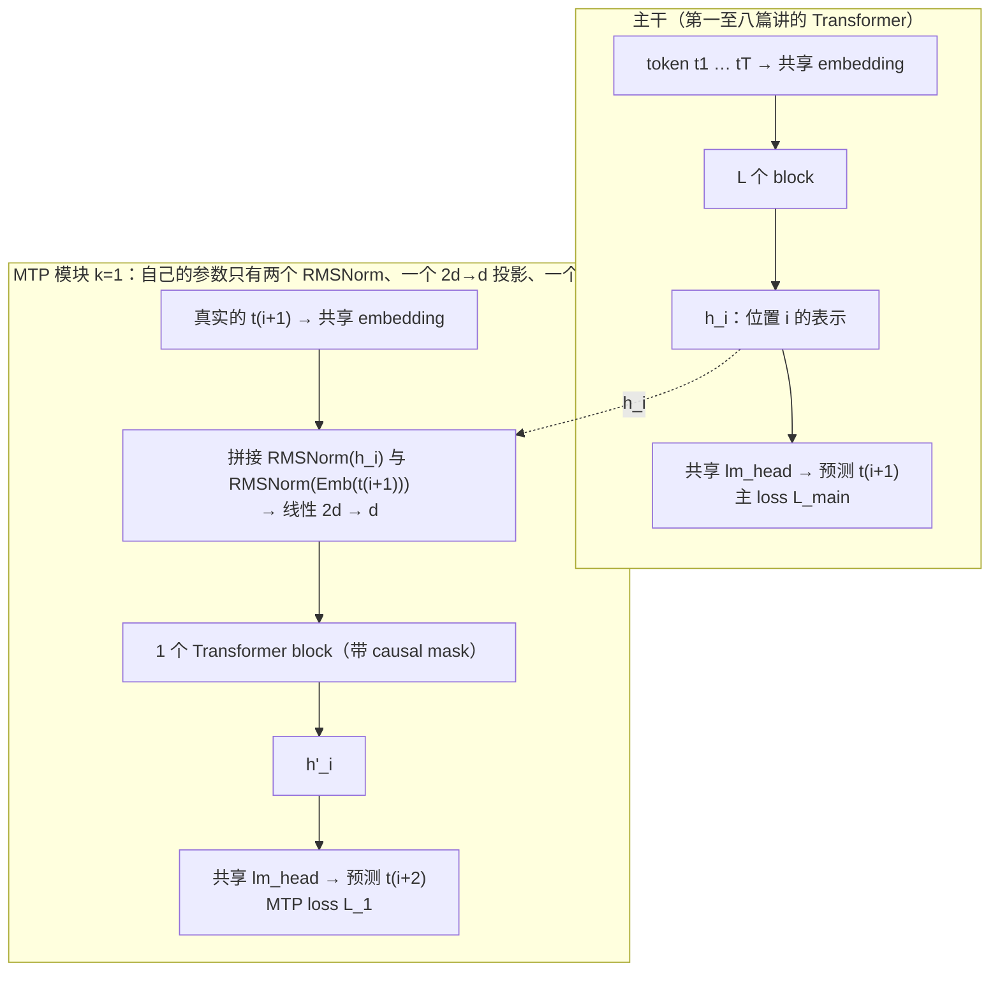

前八篇改的都是**结构**：换归一化、换位置编码、换 FFN、换 attention 的 K/V、把 FFN 换成专家。这一篇改的是另一样东西——**训练目标**。从第二篇起，模型学的一直是"看前文、预测下一个 token"，每个位置只有一个正确答案、一份监督信号。MTP（multi-token prediction，多 token 预测）让每个位置**额外**预测后面第 2、第 3 个 token：同一批数据，榨出两三倍的监督信号；训完之后那几个额外的预测头还能拿来做投机解码的草稿（第十二篇），白送一个 1.8 倍的生成加速。DeepSeek-V3 把它写进了正式的训练配方，是 2024 年以后"改目标"这一条路上最成功的例子。

这一篇讲清三件事：MTP 为什么可能有用、DeepSeek-V3 的 MTP 模块长什么样（它不是简单地多加几个输出头）、以及在第四篇的 nanoGPT 上挂一个 MTP 模块训一遍会看到什么——包括一个诚实的结果：小模型上主任务没有变好，但 MTP 头对"下下个 token"的命中率到了 45%。

本篇要回答的核心问题是：

> **每个位置多预测一个 token，训练时多花了什么、可能多得到什么？DeepSeek-V3 的 MTP 模块为什么要"顺序"而不是"并行"，推理时它去哪了？[^q0]**

## 一、总览：为什么盯上训练目标

### 1. next-token 的信号有多稀

第二篇第二章：一句 $$T$$ 个 token 的话给出 $$T$$ 个训练信号，每个位置一个——"看到前 $$i$$ 个，第 $$i+1$$ 个是什么"。这已经比 RNN 时代高效得多，但它有两个可挑剔的地方：

- **每个位置只学一步之内的事**。第 $$i$$ 个位置的表示 $$h_i$$ 被要求"含有预测 $$t_{i+1}$$ 的全部信息"，但没有任何直接的压力让它也考虑 $$t_{i+2}$$、$$t_{i+3}$$。可它在推理时要一步一步生成很长的序列——每步只看一步远，容易被局部最可能的 token 带偏（比如写代码时选了一个局部通顺、但两行后接不上的分支）。
- **数据的每个 token 只被用一次**。预训练的瓶颈之一是高质量数据不够（预训练系列第三篇），能从同一批 token 里多学一点，就是白赚。

MTP 的想法直接对着这两点：让位置 $$i$$ 同时预测 $$t_{i+1}, t_{i+2}, \ldots, t_{i+D}$$。表示 $$h_i$$ 要为更远的未来负责，"预谋"更长；同一批数据的监督信号变成 $$D$$ 倍。

### 2. 两条实现路线

| | 并行头（Gloeckle 等，2024） | 顺序模块（DeepSeek-V3，2024） |
|---|---|---|
| 结构 | 主干之上并排 $$D$$ 个输出头，第 $$k$$ 个头直接从 $$h_i$$ 预测 $$t_{i+k}$$ | $$D$$ 个**串联**的小模块，第 $$k$$ 个吃"前一级的表示 + 真实的 $$t_{i+k}$$ 的 embedding"，预测 $$t_{i+k+1}$$ |
| 预测 $$t_{i+2}$$ 时知道 $$t_{i+1}$$ 吗 | 不知道：跳过中间 token 直接猜 | 知道：训练时喂真实的 $$t_{i+1}$$，保持完整的因果链 |
| 额外参数 | $$D - 1$$ 个 lm_head（不共享时很大） | 每级一个 Transformer block + 一个投影；embedding 与 lm_head 共享 |
| 报告的收益 | 13B 以上、代码任务明显；小模型上可能变差 | 主任务全面小幅提升；第 2 个 token 的接受率 85–90% |
| 推理 | 头可做自投机解码，约 3 倍 | 模块可丢弃，或做投机 draft，TPS 约 1.8 倍 |

Table: 两条 MTP 路线

本篇以 DeepSeek-V3 的顺序模块为主（它是被大规模验证过的版本），第三章解释"顺序"为什么重要。

### 3. 本文的章节安排

| 章 | 内容 |
|---|---|
| 二 | DeepSeek-V3 的 MTP 模块：结构、共享了什么、$$D$$ 取几 |
| 三 | 训练目标：主 loss + $$\lambda \times$$ MTP loss；为什么顺序优于并行 |
| 四 | 推理：丢掉，或当投机解码的 draft |
| 五 | 实验：在 nanoGPT 上挂一个 MTP 模块 |
| 六 | 代价与边界：参数、算力、什么时候不该用 |
| 七 | 本文小结 |
| 八 | 自测 |

Table: 本文的章节安排

## 二、DeepSeek-V3 的 MTP 模块

### 1. 结构



一个 MTP 模块（DeepSeek-V3 只用了一个，$$D = 1$$，即每个位置多预测一个）由四样东西组成：

1. **两个 RMSNorm**：分别归一化主干的表示 $$h_i$$ 和下一个真实 token 的 embedding $$\text{Emb}(t_{i+1})$$——两者尺度不同，拼之前先各自归一。
2. **一个 $$2d \to d$$ 的线性投影** $$M$$：把拼接后的 $$2d$$ 维向量压回 $$d$$ 维：$$h'_i = M\,[\text{RMSNorm}(h_i) \,\|\, \text{RMSNorm}(\text{Emb}(t_{i+1}))]$$。
3. **一个完整的 Transformer block**（attention + FFN，带 causal mask）：对 $$h'_i$$ 这一序列再算一层，让位置 $$i$$ 也能看别的位置的 $$h'$$。
4. **共享的 lm_head**：把结果映射到词表，得到对 $$t_{i+2}$$ 的分布。

第 1、4 样共享主干的 embedding 表与 lm_head，所以 MTP 模块的自有参数只有一个 block 加一个投影——对 671B 的 DeepSeek-V3 这是不到 2% 的增量（一层 ≈ 1/61）。第五章的小模型上这个比例是 29%，因为它只有 4 层。

### 2. 每个位置多预测一个：数据的对齐

拿第二篇的例子，输入 `The cat sat on the`：

| 位置 $$i$$ | 主干看到 | 主头预测（$$t_{i+1}$$） | MTP 模块额外喂入（真实 $$t_{i+1}$$） | MTP 头预测（$$t_{i+2}$$） |
|---|---|---|---|---|
| 0 | The | cat | cat | sat |
| 1 | The cat | sat | sat | on |
| 2 | The cat sat | on | on | the |
| 3 | The cat sat on | the | the | mat |
| 4 | The cat sat on the | mat | mat | （需要 $$t_6$$） |

Table: D=1 的 MTP：每个位置两个目标；序列末尾少一个位置有 MTP 目标

实现上只是取 batch 时多拿一个 token：$$T + 2$$ 个连续 token，主头的目标是右移一位，MTP 头的目标是右移两位。因果性没有破坏：位置 $$i$$ 预测 $$t_{i+2}$$ 时用到的是 $$t_{\le i}$$（经主干）和 $$t_{i+1}$$（经 embedding），都是它"应该知道"的——推理时这两样也都能拿到（第四章）。

## 三、训练目标

### 1. 一个加权和

$$
\mathcal{L} = \mathcal{L}_{\text{main}} + \lambda \cdot \frac{1}{D}\sum_{k=1}^{D} \mathcal{L}_k
$$

$$\mathcal{L}_{\text{main}}$$ 是第二篇的交叉熵；$$\mathcal{L}_k$$ 是第 $$k$$ 个 MTP 模块对 $$t_{i+k+1}$$ 的交叉熵（同样的公式，目标错开 $$k$$ 位）。DeepSeek-V3 的 $$\lambda$$：前 10T token 取 0.3，之后降到 0.1——MTP 是**辅助**目标，主任务始终是 next-token，$$\lambda$$ 控制辅助信号别把主干带偏。

梯度从两个头流回主干：主干的 $$h_i$$ 现在同时被要求"能预测 $$t_{i+1}$$"和"配上 $$t_{i+1}$$ 之后能预测 $$t_{i+2}$$"。第二个要求逼着 $$h_i$$ 多编码一点"再往后会怎样"的信息——这就是"预谋"（pre-planning）的机制，也是论文里说 MTP 可能提升主任务的原因。

### 2. 顺序为什么优于并行

并行头的方案让第 2 个头**直接从 $$h_i$$ 猜 $$t_{i+2}$$**，中间的 $$t_{i+1}$$ 是什么它不知道。这在语言里是个真实的困难：$$t_{i+2}$$ 强烈依赖 $$t_{i+1}$$——"The cat sat on ___ ___"，第二个空是 mat 还是 floor 取决于第一个空是 the 还是 a；不知道第一个空，第二个空只能猜一个模糊的平均。所以并行头的 loss 天然偏高，把它加进训练目标反而可能干扰主干（Gloeckle 等确实报告小模型上变差）。

顺序模块把真实的 $$t_{i+1}$$ 喂给第 $$k = 1$$ 级——**训练时的 teacher forcing 延伸到了 MTP 上**（第二篇第二章）。预测 $$t_{i+2}$$ 的条件是完整的 $$t_{\le i+1}$$，难度和主头预测 $$t_{i+1}$$ 一样，loss 是"干净"的。第五章的实验里能直接看到：MTP 头的 val loss 甚至**低于**主头，因为它多了一层 block。

$$D > 1$$ 时第 $$k$$ 级吃第 $$k-1$$ 级的输出和真实的 $$t_{i+k}$$，链式往后接；DeepSeek-V3 停在 $$D = 1$$——第 2 个 token 的接受率已经 85–90%，第 3 个的边际收益不够付一个 block 的代价。

## 四、推理时它去哪了

### 1. 丢掉

最简单：MTP 模块只是训练时的辅助，推理时不加载，模型就是一个普通的 decoder-only Transformer——结构、显存、速度与没训过 MTP 时完全一样，只是主干的权重（希望）更好。这是"改目标不改主干"的字面含义：部署方不需要知道 MTP 存在过。

### 2. 当投机解码的 draft

或者留下来赚一笔：投机解码（第十二篇）需要一个便宜的"草稿模型"先猜几个 token、再由主模型一次前向验证。MTP 模块正是一个现成的、**与主模型同源**的草稿生成器：

1. decode 一步：主头给出 $$t_{i+1}$$ 的分布，抽出 $$\hat t_{i+1}$$；
2. 把 $$h_i$$ 与 $$\text{Emb}(\hat t_{i+1})$$ 喂给 MTP 模块，得到 $$t_{i+2}$$ 的分布，抽出 $$\hat t_{i+2}$$——只多算了一个 block，不是整个模型；
3. 下一步主模型同时验证 $$\hat t_{i+1}, \hat t_{i+2}$$（一次前向算两个位置）：都对就一步前进两个 token，第二个错就退回。

DeepSeek-V3 报告第 2 个 token 的接受率 85–90%，解码吞吐（TPS）约 1.8 倍。与独立的小草稿模型比，MTP draft 的优点是它看得到主干的 $$h_i$$（不是从 token 重新算），所以又便宜又准；代价是推理时要多加载一个 block 的参数。

## 五、实验：给 nanoGPT 挂一个 MTP 模块

在第四篇的设置上做（4 层 4 头 128 维、shakespeare_char、2000 步、CPU），加一个 $$D = 1$$ 的 MTP 模块，$$\lambda = 0.3$$。模块的实现 40 行，直接复用 nanoGPT 的 `Block` 与 `LayerNorm`：

```python
class MTPModule(nn.Module):
    """DeepSeek-V3 的一个 MTP 模块：Norm(h) ‖ Norm(Emb(t_{i+1})) → 线性 2d→d → 一个 block。
    embedding 与 lm_head 与主干共享，这里只有自己的 norm、投影和 block。"""
    def __init__(self, config):
        super().__init__()
        self.norm_h = LayerNorm(config.n_embd, bias=config.bias)
        self.norm_e = LayerNorm(config.n_embd, bias=config.bias)
        # !ref mtp-proj
        self.proj = nn.Linear(2 * config.n_embd, config.n_embd, bias=False)
        self.block = Block(config)

    def forward(self, h, emb_next):
        # h: 主干最后一层的表示 [B, T, d]；emb_next: 下一个真实 token 的 embedding [B, T, d]
        # !ref mtp-cat
        x = self.proj(torch.cat([self.norm_h(h), self.norm_e(emb_next)], dim=-1))
        return self.block(x)


class GPTWithMTP(nn.Module):
    def forward(self, x, y):                                   # y: [B, T+1]，比 x 多取一个 token
        h = self.trunk(x)                                      # 主干 ln_f 之前的表示 [B, T, d]
        logits = self.gpt.lm_head(self.gpt.transformer.ln_f(h))
        # !ref mtp-lmain
        loss_main = F.cross_entropy(logits.reshape(-1, V), y[:, :T].reshape(-1))       # 目标：右移 1
        if self.mtp is None: return loss_main, None
        # !ref mtp-feed +1
        emb_next = self.gpt.transformer.wte(y[:, :T])          # 真实的 t_{i+1} 的 embedding（共享表）
        h2 = self.mtp(h, emb_next)
        logits2 = self.gpt.lm_head(self.gpt.transformer.ln_f(h2))                     # 共享 lm_head
        # !ref mtp-l2
        loss_mtp = F.cross_entropy(logits2.reshape(-1, V), y[:, 1:T + 1].reshape(-1))  # 目标：右移 2
        return loss_main, loss_mtp

# 训练循环里：

# !ref mtp-total
loss = loss_main + lam * loss_mtp        # lam = 0.3
```

[拼接 + 投影](#mtp-cat)与 [$$2d \to d$$ 的矩阵](#mtp-proj)是第二章第 1 节的第 2、3 样；[真实 $$t_{i+1}$$ 的 embedding](#mtp-feed)来自共享的 `wte`；[主 loss](#mtp-lmain) 与 [MTP loss](#mtp-l2) 的差别只是目标错开一位；[总 loss](#mtp-total) 是第三章的加权和。

两个模型同一随机种子、同一数据顺序、同样 2000 步：

```text
== 不带 MTP（基线）：4 层 4 头 d=128，2000 步，cpu
  step 2000: 主头 val loss 1.9375
== 带 MTP（D=1，λ=0.3）
  step  250: 主头 val loss 2.4517  MTP 头 val loss 2.2061  t+2 top-1 命中 36.2%
  step 1000: 主头 val loss 2.0926  MTP 头 val loss 1.9329  t+2 top-1 命中 42.6%
  step 2000: 主头 val loss 1.9364  MTP 头 val loss 1.8149  t+2 top-1 命中 45.3%

== 汇总
  参数量：基线 804,096，带 MTP 1,033,984（多 229,888，+29%：一个 block + 2d→d 投影 + 两个 norm）
  每步耗时：基线 10 ms，带 MTP 13 ms（+38%）
  最终主头 val loss：基线 1.9375，带 MTP 1.9364
  MTP 头对 t+2：val loss 1.8149，top-1 命中率 45.3%
```

三个读数：

1. **主任务没有变好**：1.9375 对 1.9364，差在噪声里。这与 Gloeckle 等的观察一致——MTP 对主任务的收益要到 10B 以上才明显，0.8M 参数、1 MB 数据的模型没有"预谋"的余地。DeepSeek-V3 报告的提升是在 671B / 14.8T token 上的。**在小模型上做实验然后宣称 MTP 无用或有用，都是错的**——这是 L4 实验方法论系列反复讲的"规模依赖的结论"。
2. **MTP 头很准**：对下下个字符 top-1 命中 45%，val loss 1.81 比主头的 1.94 还低——它知道真实的 $$t_{i+1}$$，又多了一层 block。这个 45% 就是把它当投机 draft 时的大致接受率（字符级；DeepSeek-V3 在 BPE token 上是 85–90%）。
3. **代价**：多 29% 参数、每步慢 38%（多算一个 block 和一次 lm_head）。大模型上比例小得多（一层 / 61 层），但 lm_head 那一次是实打实的：词表 128K 时 MTP 头的 logits 与主头一样大（第十篇算这笔账）。

配套脚本 `mtp_nanogpt.py` 可以改 `--lam`、`--iters` 复现；把 `n_layer` 调大、`iters` 调长看主任务差距会不会出现，是一个值得自己做的练习。

## 六、代价与边界

| | 训练 | 推理（保留 MTP 做 draft） | 推理（丢弃） |
|---|---|---|---|
| 参数 | + 每级一个 block + $$2d^2$$ 投影（共享 embedding / lm_head） | 同左 | 0 |
| 算力 | 每级多一个 block 的前向 / 反向 + 一次 lm_head（词表大时不可忽略） | 每步多一个 block；换来 ~1.8 倍 TPS | 0 |
| 显存 | 多一份 MTP logits $$[B, T, V]$$（与主头同大） | 多一个 block 的权重 | 0 |
| 收益 | 主任务小幅提升（大模型）；数据利用率 ×$$(1 + D)$$ | 接受率 85–90% 的免费 draft | 主干权重更好（若有） |

Table: MTP 的账

什么时候不该用：模型小、数据充足（信号密度不是瓶颈）；词表极大而算力紧张（每级多一次 lm_head）；任务本身对"预谋"不敏感。什么时候值得：数据受限的大模型预训练，以及**本来就打算做投机解码**的部署——后者几乎是白赚。

## 七、本文小结

- next-token 每个位置只有一份监督信号、只学一步远；MTP 让位置 $$i$$ 额外预测 $$t_{i+2}, \ldots$$，同一批数据的信号密度 ×$$(1 + D)$$，并逼主干表示编码更远的未来。
- DeepSeek-V3 的 MTP 模块（$$D = 1$$）：两个 RMSNorm + 一个 $$2d \to d$$ 投影 + 一个 Transformer block，embedding 与 lm_head 与主干**共享**；输入是主干的 $$h_i$$ 拼上真实 $$t_{i+1}$$ 的 embedding，输出预测 $$t_{i+2}$$。
- **顺序优于并行**：喂入真实 $$t_{i+1}$$ 保持完整因果链（teacher forcing 的延伸），loss 干净；并行头跳过中间 token 直接猜，小模型上会干扰主干。
- 目标 $$\mathcal L = \mathcal L_{\text{main}} + \lambda \bar{\mathcal L}_{\text{MTP}}$$，$$\lambda$$ 0.3 → 0.1，MTP 是辅助。
- 推理时可丢弃（部署方无感）或当投机解码的 draft（第 2 个 token 接受率 85–90%，TPS ~1.8 倍）。
- nanoGPT 实验：0.8M 模型上主任务无变化（规模依赖），MTP 头对 $$t_{i+2}$$ 命中 45%，代价 +29% 参数、+38% 每步耗时。

配套：`mtp_nanogpt.py` 与 `expected/mtp_nanogpt.txt`（[ai-learning-labs/transformer-and-llm](https://github.com/arganzheng/ai-learning-labs/tree/main/transformer-and-llm)）。

## 八、自测

1. 一句 $$T = 4096$$ 的训练样本，next-token 给出多少个监督信号？$$D = 1$$ 的 MTP 呢？多出来的信号在预测什么？

   <details markdown="1"><summary>答案</summary>

   4096 个；MTP 再加约 4096 个（序列末尾少一个），每个是"位置 $$i$$ 在知道 $$t_{\le i+1}$$ 的条件下预测 $$t_{i+2}$$"。见[第二章第 2 节](#2-每个位置多预测一个数据的对齐)。
   </details>

2. DeepSeek-V3 的 MTP 模块自己的参数有哪几样？为什么它对 671B 模型的增量不到 2%？

   <details markdown="1"><summary>答案</summary>

   两个 RMSNorm、一个 $$2d \to d$$ 投影、一个 Transformer block；embedding 与 lm_head 共享主干的。一个 block 约是 61 层主干的 1/61。见[第二章第 1 节](#1-结构)。
   </details>

3. 为什么顺序模块要把**真实的** $$t_{i+1}$$ 喂进去，而不是让它自己从 $$h_i$$ 猜 $$t_{i+2}$$？

   <details markdown="1"><summary>答案</summary>

   $$t_{i+2}$$ 强烈依赖 $$t_{i+1}$$；不知道 $$t_{i+1}$$ 只能猜一个模糊平均，loss 天然偏高，会干扰主干。喂真实值是 teacher forcing 的延伸，让 MTP 的 loss 与主头一样"干净"。见[第三章第 2 节](#2-顺序为什么优于并行)。
   </details>

4. 实验里 MTP 头的 val loss（1.81）比主头（1.94）低，说明 MTP 头更强吗？

   <details markdown="1"><summary>答案</summary>

   不能这么比：MTP 头多知道一个真实 token（$$t_{i+1}$$）、多了一层 block，任务条件不同。它说明的是顺序设计让 MTP 的任务与主任务同难度而非更难。见[第五章](#五实验给-nanogpt-挂一个-mtp-模块)。
   </details>

5. 推理时保留 MTP 模块做投机 draft，每步多算多少？为什么比独立的小草稿模型划算？

   <details markdown="1"><summary>答案</summary>

   多算一个 block 加一次 lm_head（不是整个模型）。它直接吃主干的 $$h_i$$，不用从 token 重新编码上下文，所以又便宜又准（接受率 85–90%）。见[第四章第 2 节](#2-当投机解码的-draft)。
   </details>

6. 在 0.8M 参数的 nanoGPT 上 MTP 没有改善主任务，能据此说 MTP 无效吗？

   <details markdown="1"><summary>答案</summary>

   不能。MTP 对主任务的收益是规模依赖的（Gloeckle 等：13B 以上才明显；DeepSeek-V3 在 671B 上报告提升）。小模型实验只能验证机制（MTP 头能学会、代价是多少），不能外推结论。见[第五章](#五实验给-nanogpt-挂一个-mtp-模块)、[第六章](#六代价与边界)。
   </details>

## 下一篇

第二段到此结束：从 GPT-2 的结构出发，第五至九篇讲了现代 LLM 在归一化、位置、FFN、attention、专家、训练目标上各改了什么、为什么。第三段开始算账：[下一篇《前向的算量与访存：FLOPs、字节数与 Roofline》](/transformer-flops-bytes-and-roofline.html)把前九篇里的每一个矩阵乘换成时间——prefill 与 decode 各花多少、瓶颈在计算还是访存。

[^q0]: **多花的**：每级一个 Transformer block + 一个 $$2d \to d$$ 投影的参数与前向 / 反向算力，加一次 lm_head（embedding 与 lm_head 共享，不额外加参数）。**可能多得的**：同一批数据的监督信号 ×$$(1 + D)$$，主干表示被逼着编码更远的未来（大模型上主任务小幅提升）；一个接受率 85–90% 的投机 draft。**顺序而非并行**：把真实的 $$t_{i+1}$$ 喂给预测 $$t_{i+2}$$ 的模块，保持完整因果链，loss 与主头同难度；并行头跳过中间 token，loss 偏高会干扰主干。**推理时**：可丢弃（模型与普通 decoder-only 无异），或保留当投机解码的 draft（多算一个 block，TPS ~1.8 倍）。详见[第二](#二deepseek-v3-的-mtp-模块)、[三](#三训练目标)、[四章](#四推理时它去哪了)。
