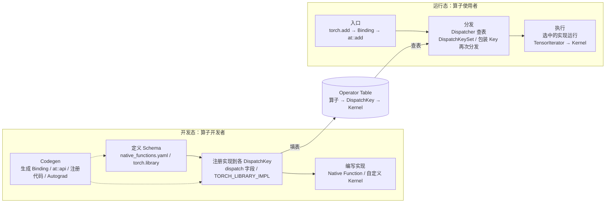
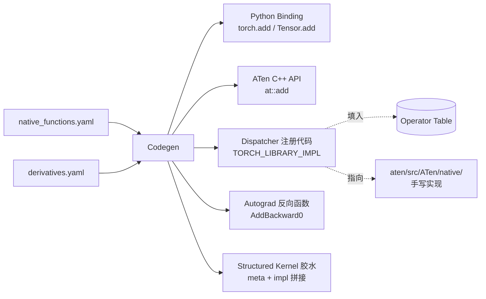
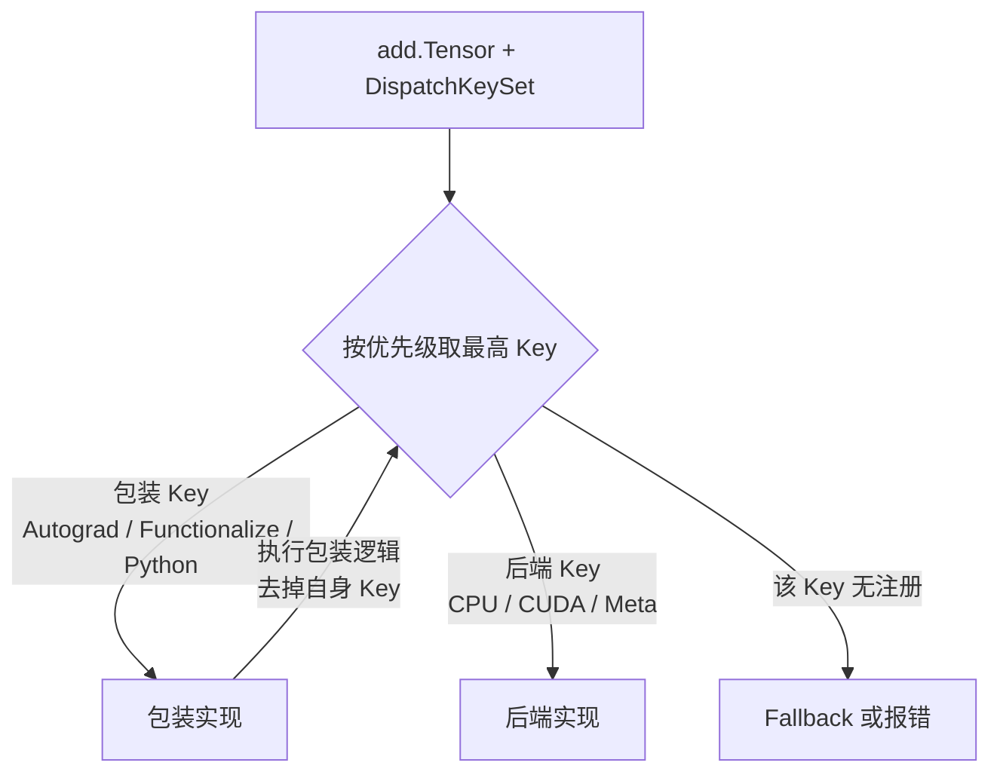
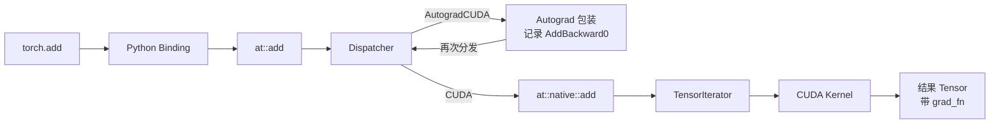
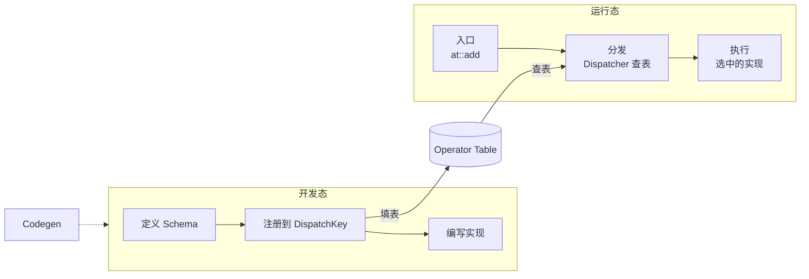

> 本文是[《PyTorch 深度实践：从 Tensor 到深度学习运行时》](/deep-dive-into-pytorch.html)系列的第五篇（共十篇）。上一篇：[`nn.Module` 与训练系统](/pytorch-module-and-training-system.html)　下一篇：[C++ 扩展与自定义算子](/pytorch-cpp-extension-and-custom-operators.html)

上一篇讨论了 `nn.Module` 与训练系统：Module 如何组织子模块、Parameter 和 Buffer，Optimizer 如何更新参数，DataLoader 如何把数据送入训练循环。

但当我们写下：

```python
z = x + y
```

到底是谁决定了这个操作对应哪个算子、`x` 和 `y` 位于哪个设备、当前是否需要 Autograd、最终应该调用哪个 Kernel？

这些问题属于 PyTorch 的**算子系统（Operator System）**。本文不会一开始分析复杂的 Attention，而是选择最简单的 `add` 算子，从两个视角把算子系统拆开：**算子开发者在构建时做了什么**，以及**算子使用者在调用时发生了什么**。

> **Dispatcher 解决的不是“调用哪个 Python 函数”，而是“在当前运行时上下文中，如何为一个抽象算子选择正确的实现路径”。**


## 一、总览：两个维度与一张注册表

### 1. Tensor 操作不是普通函数调用

从 Python 代码看，`z = x + y` 很像一次普通的函数调用。但 PyTorch 还需要处理：

```text
x 的 dtype / device / layout / 是否需要梯度
y 的 dtype / device / layout
当前的 Autograd 状态
当前的编译 / tracing 状态
```

同一个加法语义，可能需要对应不同的底层实现：

```text
CPU Tensor + CPU Tensor       → CPU Kernel
CUDA Tensor + CUDA Tensor     → CUDA Kernel
需要 Autograd 的 Tensor 运算  → 先记录反向关系，再进入设备 Kernel
Meta Tensor                   → 只推断 shape、dtype 等元数据
```

如果每种组合都由 Python 代码手动判断，系统会迅速变成大量条件分支。算子系统的作用，就是把**统一的算子语义**与**具体的执行后端**解耦。

### 2. 两个维度

理解算子系统最容易犯的错误，是把所有名词——Schema、Dispatcher、ATen、Native Functions、TensorIterator、Kernel——排成一条直线。它们其实属于两个不同的时间轴：

| 维度 | 参与者 | 时间 | 三个步骤 |
|---|---|---|---|
| **开发态** | 算子开发者 | 构建时 | 定义 Schema → 注册实现到 DispatchKey → 编写实现 |
| **运行态** | 算子使用者 | 调用时 | 入口（Python API → C++ API）→ 分发（Dispatcher 查表选路）→ 执行（选中的实现运行） |

“分发”和“实现”在两个维度里都出现，但含义不同：

| | 开发态 | 运行态 |
|---|---|---|
| 分发 | **填表**：把实现注册到 Operator Table 的各个 DispatchKey | **查表**：Dispatcher 根据 DispatchKeySet 查表选路 |
| 实现 | **写代码**：Native Function / 自定义 Kernel，选择实现模式 | **被执行**：选中的实现运行，TensorIterator 遍历、Kernel launch |

### 3. Operator Table：两个维度的交汇点

两个维度通过同一个数据结构连接：**Operator Table**——Dispatcher 内部为每个算子维护的一张 `DispatchKey → Kernel` 表。开发者往里填，用户调用时从里查。



这与 Python 系列第四篇讨论的**注册表模式**是同一个骨架：稳定的接口契约，动态注册的实现，运行时按 key 查找。区别在于 PyTorch 的 key 不是一个字符串，而是由 Tensor 元数据和执行上下文合并出的 DispatchKeySet。

### 4. 本文的章节安排

```text
二 ~ 五   开发态：定义 → 注册 → 实现 → Codegen（横向粘合）
六 ~ 八   运行态：入口 → 分发 → 执行
九        串起来：add 的完整路径，开发者做了什么 / 用户调用时发生了什么
十        Java 对照
十一      小结
```


## 二、开发态（1）：定义算子

### 1. Operator Schema

一个算子 Schema 可以抽象写成：

```text
add.Tensor(Tensor self, Tensor other, *, Scalar alpha=1) -> Tensor
```

它描述：

- 算子名称与 overload 名（`add.Tensor`）；
- 参数数量、类型、名称和默认值；
- 返回值类型；
- 是否修改输入（mutability）；
- 输入和输出之间是否存在 alias 关系。

Schema 不是某个 Kernel 的实现，而是所有实现共同遵守的接口契约。

### 2. 原生算子：`native_functions.yaml`

PyTorch 的原生算子集中声明在：

```text
aten/src/ATen/native/native_functions.yaml
```

一条声明概念上类似：

```yaml
- func: add.Tensor(Tensor self, Tensor other, *, Scalar alpha=1) -> Tensor
  variants: function, method
  dispatch:
    CPU, CUDA: add        # 在 CPU 和 CUDA Key 下，实现函数叫 add
    Meta: add_meta        # 在 Meta Key 下，实现函数叫 add_meta
```

真实文件包含更多字段，示例只用于说明结构。一条声明至少包含三类信息：

```text
func       → Schema 本身                    ← 本章
variants   → 暴露为函数、方法，或两者都有    ← 决定入口层生成什么
dispatch   → 各 DispatchKey 对应的实现函数名 ← 下一章：注册
```

### 3. 自定义算子：`torch.library`

原生算子之外，开发者可以通过 `torch.library`（Python）或 `TORCH_LIBRARY`（C++）定义新算子：

```python
import torch

lib = torch.library.Library("myops", "DEF")
lib.define("scale(Tensor x, float alpha) -> Tensor")
```

它与 YAML 声明进入同一个 Operator Table，遵守同一套 Schema 语法。因此“定义层 = YAML”是不完整的说法：YAML 是原生算子的定义入口，`torch.library` 是扩展算子的定义入口，二者定义的算子在运行态没有区别。这是下一篇自定义算子的起点。

### 4. `add`、`add_` 和 `add.out`

同一语义通常有三种 variant，它们是三条独立的 Schema：

```python
z = torch.add(x, y)              # add.Tensor      functional
x.add_(y)                        # add_.Tensor     in-place
torch.add(x, y, out=output)      # add.out         out
```

| Variant | 是否修改输入 | 是否分配输出 | 典型用途 |
|---|---:|---:|---|
| functional | 否 | 是 | 普通 Tensor 计算 |
| in-place | 是 | 否 | 明确的内存复用 |
| out | 否 | 由调用者提供 | 控制输出存储 |

### 5. 为什么 alias 和 mutability 语义重要？

如果一个算子会修改输入，Autograd、编译器和调用者都必须知道哪个输入被修改、哪个输出与哪个输入共享存储：

```python
x.add_(y)     # 修改 x，其他 view 可见变化，backward 需要检查版本
z = x + y     # 不修改 x，分配新 Storage
```

Schema 中的 alias 标注（如 `Tensor(a!)`）是 Autograd 版本检查、编译器安全重排和内存复用的共同基础。

### 6. 导数声明：`derivatives.yaml`

原生算子的反向公式声明在 `tools/autograd/derivatives.yaml`：

```yaml
- name: add.Tensor(Tensor self, Tensor other, *, Scalar alpha=1) -> Tensor
  self: grad
  other: maybe_multiply(grad, alpha)
```

它也是定义的一部分——定义的不是前向语义，而是 Autograd 应该如何为这个算子建立反向节点。Codegen 会据此生成 `AddBackward0` 等反向函数。

定义完成后，开发者还需要告诉 Dispatcher：在哪个 Key 下，用哪个函数实现这个 Schema。这是下一步：注册。


## 三、开发态（2）：注册实现到 DispatchKey

### 1. DispatchKey：实现被挂在哪个槽位上

开发者注册实现时，需要指定它服务于哪个 **DispatchKey**。DispatchKey 分两类：

| 类别 | 例子 | 开发者视角 |
|---|---|---|
| 后端 Key | CPU、CUDA、Meta、XLA、MPS、PrivateUse1 | 为哪种设备/后端提供实现 |
| 包装 Key | Autograd、AutogradCUDA、Functionalize、Python、Vmap | 为哪种横切能力提供包装逻辑 |
| 复合 Key | CompositeImplicitAutograd、CompositeExplicitAutograd | 用其他算子组合实现，各后端自动获得 |

大多数原生算子开发者只需关心后端 Key 和复合 Key；Autograd 等包装 Key 的实现通常由 Codegen 根据 `derivatives.yaml` 自动生成。

### 2. 原生算子的注册：`dispatch` 字段

`native_functions.yaml` 中的 `dispatch` 字段就是注册声明：

```yaml
dispatch:
  CPU, CUDA: add        # 在 CPU 和 CUDA Key 下，实现函数叫 add
  Meta: add_meta        # 在 Meta Key 下，实现函数叫 add_meta
```

Codegen 读到这一段，会生成类似下面的注册代码（简化）：

```cpp
TORCH_LIBRARY_IMPL(aten, CPU, m) {
  m.impl("add.Tensor", TORCH_FN(at::native::add));
}
TORCH_LIBRARY_IMPL(aten, CUDA, m) {
  m.impl("add.Tensor", TORCH_FN(at::native::add));
}
```

这些代码在库加载时执行，把函数指针填入 Operator Table 中 `add.Tensor` 这一行的对应 Key 槽位。

### 3. 自定义算子的注册：`TORCH_LIBRARY_IMPL`

自定义算子开发者手写同样的注册代码：

```cpp
TORCH_LIBRARY_IMPL(myops, CPU, m) {
  m.impl("scale", scale_cpu);
}
TORCH_LIBRARY_IMPL(myops, CUDA, m) {
  m.impl("scale", scale_cuda);
}
```

或在 Python 中：

```python
lib.impl("scale", scale_cpu, "CPU")
lib.impl("scale", scale_cuda, "CUDA")
```

原生算子和自定义算子填的是同一张 Operator Table，只是前者的注册代码由 Codegen 生成，后者手写。

### 4. Operator Table 长什么样

注册完成后，Operator Table 中 `add.Tensor` 这一行概念上是：

| DispatchKey | Kernel |
|---|---|
| CPU | `at::native::add` |
| CUDA | `at::native::add` |
| Meta | `at::native::add_meta` |
| Autograd | Codegen 生成的 `add` Autograd 包装（记录 `AddBackward0` 后再次分发） |
| … | fallback 或空 |

运行态的 Dispatcher 做的事，就是拿着 DispatchKeySet 在这一行里按优先级查一个非空槽位。

### 5. 没有注册会怎样

如果某个 Key 下没有注册实现，运行时会报类似的错误：

```text
NotImplementedError: Could not run 'myops::scale' with arguments from the 'CUDA' backend.
```

或者落到该 Key 的 fallback（例如某些后端配置的 CPU fallback）。这是自定义算子和新后端适配中最常见的一类错误，根因在开发态的注册，而不在运行态的调用。


## 四、开发态（3）：编写实现

### 1. 实现入口：被注册的那个函数

Operator Table 里填的函数，就是实现层的入口。它有三种来源：

| 来源 | 位置 | 说明 |
|---|---|---|
| Native Function | `aten/src/ATen/native/` 下的 `at::native::*` | 原生算子的实现主体 |
| Structured Kernel | 同上，但拆成 `meta` + `impl` 两个函数 | 原生算子的一种组织方式，`meta` 推断输出并分配，`impl` 计算；Codegen 拼接二者 |
| 自定义算子函数 | 用户代码 | `TORCH_LIBRARY_IMPL` 注册的任意 C++/Python 函数 |

这里要澄清“Native Functions”的双重身份：**声明**在 `native_functions.yaml`（第二章，定义），**函数主体**在 `aten/src/ATen/native/`（本章，实现）。二者由第三章的注册代码连接。

### 2. 实现内部的五种模式

被注册的实现函数内部并不总是“写一个循环”。按内部做的事，至少有五种模式：

| 模式 | 内部做什么 | 典型算子 | 是否启动硬件 Kernel |
|---|---|---|---|
| TensorIterator 路径 | 构造 TensorIterator 处理广播 / dtype 提升 / stride 遍历 / 并行划分，再调用逐元素 Kernel | `add`、`mul`、`exp`、`sum` | 是 |
| 直接 Kernel 路径 | 自己写 launch 逻辑 | `embedding`、`softmax`、多数自定义 CUDA 算子 | 是 |
| 厂商库路径 | 调用 cuBLAS / cuDNN / MKL / oneDNN | `matmul`、`conv2d` | 是，但 Kernel 在库内部 |
| Composite 路径 | 调用其他 `at::` 算子组合出语义，**重新进入 Dispatcher** | `CompositeImplicitAutograd` 算子 | 本层不直接启动 |
| Meta 路径 | 只推断输出 shape / dtype / stride | 所有算子的 Meta 实现 | 否 |

此外还有外部后端（XLA、Lazy Tensor）把调用记录到自己的图中延迟执行，这属于后端运行时的设计，本文不展开。

### 3. TensorIterator：为什么把它单独抽出来

大量逐元素和归约算子具有相同骨架：读输入 → 广播对齐 → dtype 提升 → 按 stride 计算地址 → 逐元素计算 → 写输出。如果每个算子都重新实现这些，代码会大量重复，且难以保证行为一致。

TensorIterator 把“如何遍历多维 Tensor”抽象出来，让 Hardware Kernel 只需表达“对一个元素（或一段向量）做什么”。对 `add` 而言，开发者写的 CPU/CUDA Kernel 概念上只需要表达 `a + alpha * b`，遍历、广播、并行都由 TensorIterator 处理。

它消费的正是第二篇讨论的 Tensor 元数据：

```text
shape / stride / storage_offset / dtype
    ↓
TensorIterator 构造迭代空间，检测连续布局，划分并行块
    ↓
Hardware Kernel 处理每个块
```

它不是所有算子的必经之路——矩阵乘法走厂商库，卷积有专用实现，Attention 用融合 Kernel。

### 4. Composite：用组合代替重写

Composite 实现用已有算子表达新算子的语义。它的收益是所有后端自动获得支持、Autograd 自动可用（因为子算子都可导）；代价是额外的中间 Tensor、更多 Kernel launch、编译器融合机会变化。

一个算子可以同时有 Composite 实现和某些后端的专用实现：CUDA 下走专用 Kernel，其他后端走 Composite。这正是 Operator Table 按 Key 分槽位的价值。

### 5. Meta 实现：为什么也要写

Meta 实现不计算数值，只推断输出元数据。它服务于大模型结构分析、shape 传播检查、编译器图捕获和内存规划。因此每个算子最好都有 Meta 实现（Structured Kernel 的 `meta` 函数天然提供了这一点）；如果 Meta 路径与真实实现的 shape 规则不一致，编译器就会在后续阶段失败。

到这里，开发者的三步——定义、注册、实现——已经完整。把三步粘在一起的样板代码从哪里来？这是横向机制 Codegen。


## 五、开发态横向机制：Codegen

### 1. 为什么需要代码生成？

PyTorch 有上千个算子、多种 variant、多个后端。如果 Python Binding、C++ API、注册代码、Autograd 反向函数全部手写，会产生大量重复、Schema 与实现漂移、新增 variant 时遗漏注册等问题。

### 2. Codegen 读什么、生成什么



开发者手写的只有两处：**定义层的 YAML** 和 **实现层的函数主体**。中间所有把它们粘合起来的代码由 Codegen 生成。

### 3. Codegen 的产物分别属于哪一步

| 产物 | 服务于 |
|---|---|
| Python Binding、`at::add` | 运行态的**入口**（第六章） |
| 注册代码 | 开发态的**注册**，填 Operator Table（第三章） |
| Autograd 反向函数 | 注册到 Autograd Key 的包装实现（第七章） |
| Structured Kernel 胶水 | 开发态的**实现**组织（第四章） |

这就是“横向”的含义：Codegen 不属于任何一步，但为每一步生成代码。

### 4. 代码生成的工程边界

Codegen 减少了重复，但增加了源码阅读成本：调用栈中很多函数不是手写的；错误可能发生在声明、生成器和实现之间的任何一环；生成结果不应作为稳定 API 依赖。

阅读源码的原则：**先找 YAML 声明，再找 `dispatch` 字段指向的实现函数**，中间的生成代码只在需要时展开。

以上是开发态。接下来切换视角：用户调用 `torch.add(x, y)` 时，运行时发生了什么。


## 六、运行态（1）：入口

### 1. 三种 Python 写法，同一个算子

```python
z = torch.add(x, y)   # 函数
z = x.add(y)          # 方法
z = x + y             # 运算符 → Tensor.__add__ → 内部调用 add
```

三者在用户层语义相同，最终进入同一个 `add.Tensor` Schema。`variants: function, method` 决定了前两种入口是否被生成。

### 2. Python Binding

Python Binding 负责参数解析：把 Python 对象转换为 C++ Tensor handle 和 Scalar，匹配 overload（`add.Tensor` 还是 `add.Scalar`），处理默认参数。它不复制 Tensor 数据，只传递引用。

### 3. ATen C++ API：`at::add`

Binding 之后进入 Codegen 生成的 C++ 函数：

```cpp
at::Tensor z = at::add(x, y);
```

`at::add` 是统一的 C++ 入口：Python Binding 调用它，C++ 用户也直接调用它。它内部做的事只有一件：**拿着算子 handle 和参数进入 Dispatcher**。

因此 `at::add` 不是实现。第四章的 `at::native::add` 才是实现。前者是入口，位于 Dispatcher 之前；后者是被注册的函数，位于 Dispatcher 之后。名字相近，位置相反。

```text
at::add(x, y)              入口：调用 Dispatcher
    ↓ Dispatcher
at::native::add(x, y)      实现：被 Dispatcher 调用
```


## 七、运行态（2）：分发

### 1. 查 Schema，校验参数

Dispatcher 拿到算子 handle 后，先从 Operator Table 取出 Schema，校验参数数量、类型和 alias 约束。这是定义层在运行态的唯一直接出场。

### 2. 合并 DispatchKeySet

Dispatcher 收集所有输入 Tensor 的 DispatchKey，并合并当前线程的全局状态（是否在 `no_grad` 中、是否在 tracing、是否有 Python Dispatch 模式），得到本次调用的 **DispatchKeySet**。

```text
x: CUDA Tensor, requires_grad=True  → {AutogradCUDA, CUDA}
y: CUDA Tensor                      → {CUDA}
全局状态: 梯度开启                   → 不移除 Autograd
    ↓ 合并
DispatchKeySet = {AutogradCUDA, CUDA}
```

如果输入位于不同设备，会在这一步报错，而不是随便选一个 Kernel。

### 3. 按优先级选 Key，查表

Dispatcher 在 DispatchKeySet 中按优先级取最高的 Key，到 `add.Tensor` 那一行查对应槽位：



### 4. 包装 Key 与再次分发

包装 Key 的优先级高于后端 Key。以 Autograd 为例：

```text
DispatchKeySet = {AutogradCUDA, CUDA}
    ↓ 取 AutogradCUDA
Autograd 包装实现（Codegen 生成）：
    检查 requires_grad，记录 AddBackward0，保存反向所需的值
    从 KeySet 中去掉 Autograd，再次调用 Dispatcher
    ↓ 取 CUDA
后端实现 at::native::add
```

这就是“Autograd Kernel 与设备 Kernel 是什么关系”的答案：Autograd 是注册在包装 Key 上的一层实现，通过**再次分发**串联到后端实现。Functionalize、Python Dispatch、Vmap 都是同样的机制。

在 `torch.no_grad()` 中，全局状态会让 Autograd Key 被排除，DispatchKeySet 直接是 `{CUDA}`，跳过包装层。

### 5. Dispatcher 不是简单的 if/else

概念上它是一张表的查找，但真实系统还要处理多个 Key 的合并与优先级、包装 Key 的再次分发、fallback、boxed/unboxed 调用约定、Python 级自定义分发。它是一个**多维、可多次的运行时分发系统**。


## 八、运行态（3）：执行

Dispatcher 选中后端实现后，第四章的五种实现模式在运行态各自表现为：

### 1. TensorIterator 模式的运行时行为

```python
x = torch.ones(2, 3)
y = torch.ones(3)
z = x + y
```

`at::native::add` 构造 TensorIterator：对齐 `(2,3)` 与 `(3)`，让 `y` 以 stride 为 0 的方式参与遍历（不复制数据，与第二篇 `expand()` 同机制）；检查 dtype 提升；检测输入是否连续，选择快速路径或通用 stride 路径；按块划分后调用 CPU 向量化 Kernel 或 launch CUDA Kernel。

对非连续输入（如 `x.transpose(0, 1) + 1`），TensorIterator 直接按任意 stride 遍历，不强制 `contiguous()`。何时复制、何时直接遍历，是第八篇性能分析的话题之一。

### 2. 厂商库模式

`matmul` 的 CUDA 实现调用 cuBLAS。PyTorch 侧负责准备参数（转置标记、leading dimension、workspace），Kernel 由库内部 launch，不出现在 PyTorch 源码中。

### 3. Composite 模式：重入分发

Composite 实现调用子算子，每个子算子都是一次完整的 `at::xxx → Dispatcher → 实现` 流程。因此一次用户可见的算子调用，在 Profiler 中可能表现为多个子算子和多个 Kernel。

### 4. Meta 模式：不启动任何 Kernel

```python
with torch.device("meta"):
    x = torch.empty(2, 3)
    y = torch.empty(3)
    z = x + y          # DispatchKeySet = {Meta}
print(z.shape)         # torch.Size([2, 3])
```

Meta 实现只推断输出元数据并构造一个无数据的 Tensor。不进入 TensorIterator，不 launch Kernel。这是大模型结构分析和编译器图捕获能在没有 GPU 的机器上进行的原因。

### 5. 结果 Tensor 的构造

无论哪种模式，执行结束时都要产出一个元数据正确的结果 Tensor：shape、stride、dtype、device、Storage；如果经过了 Autograd 包装，还带有 `grad_fn`。第二篇和第三篇建立的 Tensor 与 Autograd 模型，在这里汇合。


## 九、串起来：`add` 的完整路径

### 1. 开发者在构建时做了什么

```text
定义    native_functions.yaml：add.Tensor(...) -> Tensor，variants: function, method
        derivatives.yaml：self: grad, other: maybe_multiply(grad, alpha)
    ↓
注册    dispatch: CPU, CUDA: add；Meta: add_meta
        → Codegen 生成 TORCH_LIBRARY_IMPL，填入 Operator Table
        → Codegen 根据 derivatives.yaml 生成 Autograd 包装，填入 Autograd Key
    ↓
实现    aten/src/ATen/native/：at::native::add
        内部使用 TensorIterator，调用 CPU / CUDA 逐元素 Kernel
    ↓
Codegen 另生成 Python Binding 与 at::add 入口
```

### 2. 用户调用时发生了什么

```python
x = torch.randn(2, 3, device="cuda", requires_grad=True)
y = torch.randn(2, 3, device="cuda")
z = torch.add(x, y)
```

```text
入口    torch.add → Python Binding 解析参数 → at::add(x, y)
    ↓
分发    查 Operator Table 取 Schema，校验参数
        DispatchKeySet = {AutogradCUDA, CUDA}
        取 AutogradCUDA → Autograd 包装：记录 AddBackward0，去掉 Autograd Key，再次分发
        取 CUDA → at::native::add
    ↓
执行    TensorIterator 对齐 shape / dtype / stride，划分迭代空间
        launch CUDA Kernel：逐元素 a + alpha * b
        构造结果 Tensor，挂上 grad_fn
```



### 3. 换一个上下文

| 上下文 | DispatchKeySet | 路径 |
|---|---|---|
| CUDA + `no_grad` | `{CUDA}` | 跳过 Autograd，直接 `at::native::add` → TensorIterator → CUDA Kernel |
| CPU，不需梯度 | `{CPU}` | `at::native::add` → TensorIterator → 向量化 CPU Kernel |
| Meta | `{Meta}` | `add_meta` → 只推断元数据，无 Kernel |
| 自定义后端未注册 `add` | `{PrivateUse1}` | fallback 或 `NotImplementedError` |

开发态填好的表不变，变化的只是运行态查到的槽位。

### 4. 这是一条概念路径

上面的流程用于建立心智模型。真实调用栈还可能包含 Functionalization、Python Dispatch、boxed fallback、编译模式下的图捕获等。但两个维度的职责边界是稳定的：

> **开发者定义契约、注册实现、编写 Kernel，Codegen 粘合；用户从入口进入，Dispatcher 查表选路，选中的实现执行。Operator Table 是两者的交汇点。**


## 十、Java 工程师如何理解 Dispatcher

### 1. 最贴切的类比：注册表模式

Python 系列第四篇讨论过注册表模式：稳定接口 + 动态注册 + 运行时按 key 查找。Operator Table 就是这样一张注册表。区别在于 key 的维度：

```text
业务注册表   key = 字符串（"torch" / "tensorrt"）
Operator Table   key = 算子 × DispatchKey，DispatchKey 由多个 Tensor 的元数据和执行上下文合并
```

### 2. 与 SPI 的区别

Java SPI 在加载阶段根据配置发现实现，之后调用路径固定；Dispatcher 在**每次算子调用**时根据当前 Tensor 重新选路。同一段代码，输入换成 Meta Tensor，走的路径就完全不同。

### 3. 与方法重载 / 虚方法分发的区别

Java 重载依据编译期参数类型；虚方法分发依据**单个**对象的运行时类型。Dispatcher 依据**多个** Tensor 的运行时元数据加执行上下文，且可能**多次**分发（包装 Key → 后端 Key）。

### 4. Dispatcher 是控制平面，不是计算本身

```text
Dispatcher   → 决定调用谁
实现 / Kernel → 真正计算数值
Autograd     → 注册在包装 Key 上的一层实现
Compiler     → 可能在调用前后重写计算路径（第七篇）
```

Dispatcher 本身的开销只是执行路径的一部分。第八篇会用 Profiler 区分 Python 开销、分发开销、Kernel 开销和同步开销。


## 十一、本文小结

### 1. 两个维度



```text
开发态  定义 Schema（YAML / torch.library）
        → 注册实现到 DispatchKey（dispatch 字段 / TORCH_LIBRARY_IMPL）
        → 编写实现（Native Function / 自定义函数；五种模式）
        Codegen 横向生成 Binding、at::api、注册代码、Autograd 函数

运行态  入口（torch.add → Binding → at::add）
        → 分发（合并 DispatchKeySet，包装 Key 再次分发，后端 Key 查表）
        → 执行（TensorIterator / 厂商库 / Composite 重入 / Meta）
```

### 2. 几个容易混淆的名字

| 名字 | 属于 | 说明 |
|---|---|---|
| `native_functions.yaml` | 开发态 · 定义 | 原生算子的 Schema 与 dispatch 声明 |
| `at::native::add` | 开发态 · 实现 | 被注册到 Operator Table 的函数主体 |
| `at::add` | 运行态 · 入口 | Codegen 生成的 C++ 入口，调用 Dispatcher |
| Native Functions | 双重身份 | 声明在 YAML，实现在 `ATen/native/` |
| Autograd | 分发层的包装 Key | 注册在 Autograd Key 上的实现，再次分发到后端 |
| TensorIterator | 实现的一种模式 | 逐元素 / 归约算子的通用遍历框架，不是必经之路 |
| ATen | 基础库 | 提供 `at::Tensor`、`at::*` API 和 `at::native::*` 实现所在的 C++ 库，横跨入口与实现 |

### 3. 源码阅读的顺序

```text
native_functions.yaml 找到 Schema 与 dispatch 字段
    → aten/src/ATen/native/ 找 dispatch 指向的函数主体
    → 看它是 TensorIterator / 直接 Kernel / 厂商库 / Composite
    → derivatives.yaml 找反向公式
    → 用 Meta Tensor 验证 shape 推断
    → 用 Profiler 看实际 launch 了哪些 Kernel
```

下一篇进入开发态的实践：

> **如何用 C++ 和 CUDA 编写一个自定义算子，完成定义、注册、实现三步，并正确处理 Tensor、dtype、device、stride、Autograd 和 ABI？**


## 下一篇

[C++ 扩展与自定义算子](/pytorch-cpp-extension-and-custom-operators.html)
