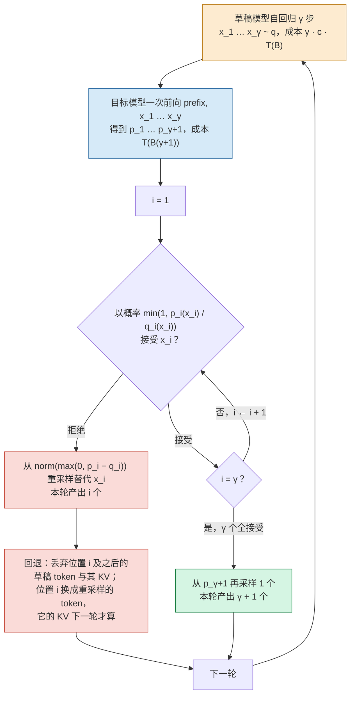

> **本篇在系列中的位置。** 第二段的第八篇。第 06 篇算出 batch 小时 decode 受带宽限制、Tensor Core 大多空闲；第 11 篇的 MTP 模块给了一个现成的草稿来源。本篇不改结构、不改数值格式，改的是解码流程：先猜几个 token，再用一次前向验证，输出分布严格不变。LoRA 不在本系列：参数高效微调的账在[《LoRA 专题》](/lora-for-sft-from-low-rank-hypothesis-to-serving.html)。完整地图见[总纲](/transformer-and-llm-structure-implementation-and-evolution.html)。

第六篇算过 decode 的账：batch 为 $$B$$ 时权重 GEMM 的算术强度约等于 $$B$$，距 H100 的 ridge point 295 差两个数量级，每步时间被"把权重读一遍"钉在 4.8 ms 上，Tensor Core 几乎空转。第十一篇的 MTP 模块在训练时多预测一个 token，推理时可以丢掉——也可以留下来当"草稿"。本篇把这两件事接起来：**既然多算几行几乎不花时间，能不能先猜几个 token，再用一次前向把它们全部验证掉？**

投机解码（speculative decoding）就是这个想法。它不改结构、不改数值格式，只改解码流程；收益却不是无条件的。本篇要回答的核心问题是：

> **同一套投机解码，为什么 batch 1 时加速 2 倍，batch 64 时没有收益？[^q0]**

## 一、总览：一个时间模型

### 1. 本文的路线

先把第六篇的 Roofline 压成一个时间模型（本章第 2 节），后面所有估算都用它；再讲投机解码本身：算法与"输出分布严格不变"的证明、期望接受数与加速比、验证多个 token 为什么几乎免费又何时不再免费、草稿从哪里来（第二章）；最后把它加进 `llm_cost.py`，合成文本模型的成本表（第三章）。

### 2. 一个时间模型

一次前向处理 $$m$$ 个 token 行，时间下界是访存时间与计算时间的较大者：

$$
T(m) = \max\left( \frac{W_{\text{bytes}}}{BW},\ \frac{2 N m}{F} \right)
$$

其中 $$W_{\text{bytes}}$$ 是要读的权重字节数，$$N$$ 是参与 GEMM 的参数量（embedding 是查表，不算），$$F$$ 是算力。代入 Llama-3-8B（8.03B 参数，BF16 权重 16.06 GB，每 token 权重 FLOPs 约 15.0 GFLOPs）：

$$
T_{\text{mem}} = \frac{16.06 \ \text{GB}}{3.35 \ \text{TB/s}} \approx 4.8 \ \text{ms}, \qquad
T_{\text{cmp}}(m) = m \times \frac{15.0 \ \text{GFLOPs}}{989 \ \text{TFLOPS}} \approx m \times 15.2 \ \mu\text{s}
$$

两者相等在 $$m \approx 316$$，与 ridge 295 同一量级（差别来自 16.06 GB 包含了 embedding 而 15.0 GFLOPs 不含）。这个模型忽略了 KV cache 读取、activations 与 kernel 效率，是**理论下界**，不是任何实现的实测。$$m < 316$$ 时 $$T(m)$$ 是常数——多算几行不多花时间，这就是投机解码的全部空间。

### 3. 本文的章节安排

| 章 | 主题 | 内容 |
|---|---|---|
| 二 | 投机解码：改变 m | 分布等式、期望接受数与加速比、验证 γ+1 个 token 何时免费、草稿从哪里来 |
| 三 | 实践 | 脚本新增的函数、文本模型的成本表 |
| 四 | 本文小结 |  |
| 五 | 自测 | 3 道题 |

Table: 本文的章节安排

## 二、投机解码：改变 m

### 1. 问题：一次前向只产出一个 token

decode 每步读 16 GB 权重、产出 $$B$$ 个 token。$$B = 1$$ 时，4.8 ms 里 Tensor Core 只做了 15 GFLOPs，利用率约 0.3%。第一章的时间模型说：在斜线上，多算几行几乎不多花时间——$$T(m)$$ 在 $$m < 316$$ 时是常数。如果能一次前向验证多个候选 token，就把串行的产出变成了并行的验证。

问题是候选从哪里来，以及怎么保证结果与原模型**一致**。

### 2. 算法与分布等式

记目标模型的分布为 $$p(\cdot \mid \text{prefix})$$，一个便宜的草稿模型的分布为 $$q(\cdot \mid \text{prefix})$$。投机解码（Leviathan 等 2023；Chen 等 2023）一轮做四件事：

1. 草稿模型自回归采样 $$\gamma$$ 个 token $$x_1, \ldots, x_\gamma$$，$$x_i \sim q(\cdot \mid \text{prefix}, x_{<i})$$；
2. 目标模型对 $$\text{prefix}, x_1, \ldots, x_\gamma$$ 做**一次**前向，得到 $$\gamma + 1$$ 个位置的分布 $$p_1, \ldots, p_{\gamma+1}$$；
3. 从 $$i = 1$$ 起逐个判定：以概率 $$\min(1, p_i(x_i) / q_i(x_i))$$ 接受 $$x_i$$；一旦拒绝，从修正分布 $$\text{norm}(\max(0, p_i - q_i))$$ 采样一个 token 替代 $$x_i$$，本轮结束；
4. 若 $$\gamma$$ 个全部接受，再从 $$p_{\gamma+1}$$ 采样一个 token。

每轮至少产出 1 个 token（拒绝时的重采样或全接受时的额外采样），最多 $$\gamma + 1$$ 个。一轮的分支与回退如下：



关键性质：**输出分布严格等于 $$p$$**。看单步。在某一位置，草稿提出 $$x$$ 的概率是 $$q(x)$$，被接受的概率是 $$\min(1, p(x)/q(x))$$，所以"接受且输出 $$x$$"的概率是

$$
q(x) \min\left(1, \frac{p(x)}{q(x)}\right) = \min(q(x), p(x))
$$

总接受概率

$$
\beta = \sum_x \min(p(x), q(x))
$$

拒绝的概率是 $$1 - \beta$$，拒绝后从 $$\text{norm}(\max(0, p - q))$$ 采到 $$x$$ 的概率是 $$\max(0, p(x) - q(x)) / Z$$，归一化常数

$$
Z = \sum_y \max(0, p(y) - q(y)) = \sum_y \left( p(y) - \min(p(y), q(y)) \right) = 1 - \beta
$$

于是输出 $$x$$ 的总概率

$$
P(x) = \min(p(x), q(x)) + (1 - \beta) \cdot \frac{\max(0, p(x) - q(x))}{1 - \beta} = \min(p(x), q(x)) + \max(0, p(x) - q(x)) = p(x)
$$

每个位置都从 $$p$$ 采样，且被接受的 token 之后的位置以它为条件——与目标模型自回归采样的联合分布逐位相同。greedy 解码是 $$p$$ 退化为 one-hot 的特例：接受当且仅当草稿与目标 argmax 一致。这个证明不依赖 $$q$$ 是什么——$$q$$ 只影响**效率**，不影响**正确性**。

两点补充。第一，拒绝后的重采样分布 $$\text{norm}(\max(0, p - q))$$ 有直观含义：它只在 $$p(x) > q(x)$$ 的 token 上有质量，即"目标模型认为比草稿更可能"的那些 token——草稿高估的 token 已经被接受步骤按 $$p/q$$ 的比例采纳过了，剩下的概率质量正好是目标模型比草稿多出来的部分。第二，验证时目标模型输出的 $$\gamma + 1$$ 个分布只需要一次前向，是因为因果掩码下每个位置的输出只依赖它之前的 token，草稿序列的每个前缀恰好对应一个位置——这与 prefill 一次算出整个 prompt 所有位置的 KV 是同一件事，投机解码的验证本质上是一次长度为 $$\gamma + 1$$ 的小 prefill。KV cache 的回退要精确到位置：被拒绝的位置 $$i$$ **本身**的 KV 是按草稿 token $$x_i$$ 算的，也要丢掉（或覆盖），保留到 $$i - 1$$；重采样出的新 token 占据位置 $$i$$，它的 KV 在下一轮验证前向里才会算出来；全接受时的 bonus token 同理。这是引擎实现中需要处理的细节。

### 3. 期望接受数与加速比

记单个位置的接受率 $$\alpha = \mathbb{E}[\beta]$$（它等于 $$1 - \text{TV}(p, q)$$，$$p$$ 与 $$q$$ 的总变差距离的补）。假设各位置独立且接受率相同，一轮产出的 token 数是"连续接受的个数 + 1"，期望

$$
\mathbb{E}[\text{tokens}] = 1 + \alpha + \alpha^2 + \cdots + \alpha^\gamma = \frac{1 - \alpha^{\gamma+1}}{1 - \alpha}
$$

$$\alpha = 0.8$$、$$\gamma = 4$$：$$(1 - 0.8^5)/0.2 = (1 - 0.328)/0.2 = 3.36$$。

一轮的成本：$$\gamma$$ 次草稿前向加一次目标前向。记草稿一次前向的时间是目标前向的 $$c$$ 倍，并且——这是关键假设——目标模型验证 $$\gamma + 1$$ 个 token 的时间与验证 1 个相同。那么

$$
\text{speedup} = \frac{\mathbb{E}[\text{tokens}]}{\gamma c + 1}
$$

$$c = 0.1$$：$$3.36 / 1.4 = 2.4$$。若草稿几乎免费（$$c = 0.02$$，多头或 n-gram 方案），$$3.36 / 1.08 \approx 3.1$$。

几个变体的数字：

| alpha | gamma | E[tokens] | speedup(c=0.1) | speedup(c=0.02) |
|---|---|---|---|---|
| 0.6 | 4 | 2.31 | 1.65 | 2.13 |
| 0.8 | 2 | 2.44 | 2.03 | 2.35 |
| 0.8 | 4 | 3.36 | 2.40 | 3.11 |
| 0.8 | 8 | 4.33 | 2.40 | 3.73 |
| 0.9 | 4 | 4.10 | 2.93 | 3.79 |

Table: 投机解码几个 α、γ 组合的期望 token 数与加速比

$$\gamma$$ 越大，期望接受数增长越慢（$$\alpha^\gamma$$ 衰减），而草稿成本线性增长；$$c = 0.1$$ 时 $$\gamma = 4$$ 与 $$\gamma = 8$$ 的加速比相同，最优 $$\gamma$$ 由 $$\alpha$$ 与 $$c$$ 共同决定。

### 4. 为什么验证 γ+1 个 token 几乎免费——以及何时不再免费

"验证 $$\gamma + 1$$ 个与验证 1 个同样贵"是 Roofline 的直接推论。目标模型的 GEMM 从 $$[B, k] \times [k, n]$$ 变成 $$[B(\gamma + 1), k] \times [k, n]$$：FLOPs 乘 $$\gamma + 1$$，**权重读取不变**。只要 $$B(\gamma + 1)$$ 仍在 ridge 之下，

$$
T(B(\gamma + 1)) = T(B) = \frac{W_{\text{bytes}}}{BW}
$$

多出的 FLOPs 填的是本来空转的 Tensor Core。KV cache 读取也一样：验证 5 个 token 的 attention 读同一份 KV cache。

条件是 $$B(\gamma + 1) \lesssim \text{ridge}$$，即

$$
B \lesssim \frac{\text{ridge}}{\gamma + 1} \approx \frac{300}{5} = 60
$$

超过这个 batch，验证前向进入 compute-bound，$$T(B(\gamma+1))$$ 开始以 $$(\gamma + 1)$$ 倍于 $$T(B)$$ 的斜率增长。极限情况（完全 compute-bound）加速比变为

$$
\frac{\mathbb{E}[\text{tokens}]}{\gamma c + (\gamma + 1)} = \frac{3.36}{0.4 + 5} \approx 0.62
$$

**低于 1**。原因很朴素：投机解码是用 FLOPs 换延迟——每产出 3.36 个 token 要为 5 个位置做完整前向，FLOPs 效率是 $$3.36/5 = 67\%$$，被拒绝的 token 的计算是白做的。当 FLOPs 是瓶颈时，这笔交易亏本。

用第一章的时间模型算 Llama-3-8B 在 H100 上各 batch 的加速比（$$\alpha = 0.8$$、$$\gamma = 4$$、$$c = 0.1$$，草稿成本按 $$c \cdot T(B)$$ 计）：

$$
\text{speedup}(B) = \frac{\mathbb{E}[\text{tokens}] \cdot T(B)}{\gamma c \cdot T(B) + T(B(\gamma + 1))}
$$

| batch B | T(B) ms | T(5B) ms | 加速比（峰值算力） | 加速比（60% MFU） |
|---|---|---|---|---|
| 1 | 4.79 | 4.79 | 2.40 | 2.40 |
| 8 | 4.79 | 4.79 | 2.40 | 2.40 |
| 32 | 4.79 | 4.79 | 2.40 | 2.40 |
| 64 | 4.79 | 4.85 | 2.38 | 1.61 |
| 128 | 4.79 | 9.71 | 1.39 | 0.89 |
| 256 | 4.79 | 19.4 | 0.76 | 0.62 |

Table: 投机解码加速比随 batch 的变化

第二列按 60% MFU 折算实际可达算力（593 TFLOPS，有效 ridge 约 177，转折 batch 约 35）：$$B = 64$$ 时验证前向已进入计算区，加速比掉到 1.6；$$B = 128$$ 时低于 1。再算上真实系统里草稿模型在大 batch 下的开销、每轮调度与采样的固定成本、以及 $$\alpha$$ 在不同位置并不独立同分布，**"batch 64 时没有收益"** 是这条曲线的工程表述——精确的转折位置随模型、硬件、$$\gamma$$ 移动，但它的量级由 $$\text{ridge}/(\gamma + 1)$$ 决定。

另一种常见的 decode 加速——weight-only 量化（把 BF16 权重压成 INT4，字节数降到四分之一；原理与方法在算法地图的[《高效推理与压缩》](/efficient-inference-and-compression-for-llms.html)）——与本章的数字画在同一条 $$T(m)$$ 曲线上（对数坐标）：量化把 memory-bound 的平台**向下**移，投机解码把工作点**向右**推，两者的收益都止于平台与斜线的交点：


INT4 在 $$B < \text{ridge}/4$$ 时兑现字节收益，投机解码在 $$B < \text{ridge}/(\gamma+1)$$ 时兑现并行验证的收益——**两者都只在 Roofline 的斜线上有效，越过 ridge 就消失甚至反转**。它们优化的是同一个量：memory-bound 区间里被浪费的算力。这也意味着两者可以叠加：W4A16 的目标模型验证 5 个 token 同样几乎免费，只是转折 batch 变成 $$\text{ridge}/(4 \times 5) \approx 15$$。

### 5. 草稿从哪里来

草稿方案决定 $$\alpha$$ 与 $$c$$。以下区间是各论文与工程报告中**通常报告**的量级，不是本文实测：

| 方案 | 草稿形态 | c（相对目标一次前向） | alpha（通常报告） |
|---|---|---|---|
| 独立小模型 | 同 tokenizer 的小模型自回归 γ 步 | 参数量之比，~0.05–0.15 | 0.6–0.8（取决于配对） |
| Medusa（Cai 等 2024） | 目标模型顶层加 K 个头并行预测 t+2.. | ≈0（一次前向内） | 第 1 头 ~0.6–0.7，逐头下降 |
| EAGLE（Li 等 2024） | 一层 Transformer 在特征级自回归起草 | ~0.02–0.05 | ~0.75–0.85（论文报告） |
| n-gram / prompt lookup | 在上下文中查找 n-gram 复制后续 token | ≈0 | 任务依赖：改写/摘要/RAG 高，自由生成低 |
| DeepSeek-V3 MTP | 训练时联合训练的一个额外 block | 1/61 层的量级 | 第二 token 85–90%（技术报告） |

Table: 常见草稿方案的形态、代价 c 与接受率 α（文献通常报告的量级）

- **独立小模型**要求与目标共享 tokenizer（Llama-3-8B 给 70B 起草），$$c$$ 约等于参数量之比，在 memory-bound 区间也等于字节数之比。$$\alpha$$ 取决于两者分布的接近程度，同系列同数据训练的模型配对最好。
- **Medusa** 在目标模型最后一层 hidden state 上接 $$K$$ 个轻量头，第 $$k$$ 个头预测第 $$t + k + 1$$ 个 token，一次前向同时出所有草稿；用 tree attention 一次验证多条候选路径。$$c \approx 0$$，但各头独立预测（没有以前一个草稿为条件），$$\alpha$$ 随头序号下降。论文报告 Medusa-1 约 2.2×、Medusa-2 约 2.3–3.6×。
- **EAGLE** 的观察是：在特征（倒数第二层的 hidden state）而非 token 层面做自回归，不确定性更低；草稿模块只有一层 decoder，输入是目标模型的特征与已采样 token 的 embedding。论文报告 LLaMA2-Chat 70B 上约 2.7–3.5×，EAGLE-2 用动态草稿树进一步提高。它的 $$\alpha$$ 通常高于 Medusa，$$c$$ 是一层对全模型的比例。
- **n-gram / prompt lookup**：把上下文里最近出现的 n-gram 后面接的 token 当草稿，零成本、零训练，在有大量复制的任务（改写、摘要、代码编辑、RAG）上 $$\alpha$$ 很高，在自由生成上接近 0——加速比完全依赖任务。
- **DeepSeek-V3 的 MTP**：训练时就带一个预测下一下个 token 的额外模块，推理时可当草稿用（$$\gamma = 1$$）。技术报告称第二个 token 的接受率在 85–90% 之间，对应 $$\mathbb{E}[\text{tokens}] = 1 + \alpha \approx 1.85 \sim 1.9$$，报告的解码吞吐提升约 1.8×，与 $$c$$ 很小时 $$1.9 / (c + 1)$$ 的估算一致。

所有这些方案共享同一条约束：它们提升的是 $$\alpha$$ 或降低 $$c$$，但都改不了 $$B \lesssim \text{ridge}/(\gamma + 1)$$ 这个收益区间。

## 三、实践：投机解码的期望加速比

### 1. 脚本新增的函数

延续贯穿全系列的 `llm_cost.py`，本篇新增 `roofline_step_time`（第一章的时间模型）与 `speculative_speedup`。配套仓库里这一版脚本（`llm_cost_07_quant_specdec_lora.py`）还带着 weight-only 量化字节数与 LoRA 参数量两组函数——它们原来与投机解码同在一篇，现在分别归入算法地图的[《高效推理与压缩》](/efficient-inference-and-compression-for-llms.html)与[《LoRA 专题》](/lora-for-sft-from-low-rank-hypothesis-to-serving.html)；脚本原样保留以便独立运行与对照输出，下面只讲投机解码那一组。前几篇用到的 `param_count`、`forward_flops_per_token`、`kv_bytes_per_token` 同样重给 dense 版本（MoE 与 MLA 的版本在第八、十篇）。

```python title="llm_cost.py：时间模型与投机解码（脚本里同时带量化与 LoRA 两组函数）"
from dataclasses import dataclass

@dataclass
class ModelConfig:
    name: str
    hidden: int
    layers: int
    n_heads: int
    n_kv_heads: int
    head_dim: int
    d_ff: int
    vocab: int
    tie_embeddings: bool = False

LLAMA3_8B = ModelConfig("Llama-3-8B", 4096, 32, 32, 8, 128, 14336, 128256)
LLAMA3_70B = ModelConfig("Llama-3-70B", 8192, 80, 64, 8, 128, 28672, 128256)

@dataclass
class GPU:
    name: str
    hbm_bytes: float
    bandwidth: float   # bytes/s
    bf16_flops: float  # FLOP/s

H100 = GPU("H100 SXM", 80e9, 3.35e12, 989e12)
A100 = GPU("A100 80GB", 80e9, 2.0e12, 312e12)

# ---- 前几篇的函数（dense 版本）----
def embedding_params(cfg):
    return cfg.vocab * cfg.hidden * (1 if cfg.tie_embeddings else 2)

def param_count(cfg):
    """第五篇的参数量（重给以便独立运行），返回 dict。"""
    d = cfg.hidden
    q, kv = cfg.n_heads * cfg.head_dim, cfg.n_kv_heads * cfg.head_dim
    attn = d * q + d * kv + d * kv + q * d
    ffn = 3 * d * cfg.d_ff
    per_layer = attn + ffn + 2 * d
    embed = cfg.vocab * d
    lm_head = 0 if cfg.tie_embeddings else cfg.vocab * d
    total = per_layer * cfg.layers + embed + lm_head + d
    return {"per_layer": per_layer, "embedding": embed, "lm_head": lm_head, "total": total}

def forward_flops_per_token(cfg, ctx=0):
    # embedding 查表不算 GEMM；lm_head 算
    # 输入 embedding 是查表不算 GEMM；tied 模型那张表兼作 lm_head，仍要算
    gemm_params = param_count(cfg)["total"] - (0 if cfg.tie_embeddings else cfg.vocab * cfg.hidden)
    return 2 * gemm_params + 4 * cfg.hidden * ctx * cfg.layers

def kv_bytes_per_token(cfg, dtype_bytes=2):
    return 2 * cfg.layers * cfg.n_kv_heads * cfg.head_dim * dtype_bytes

# ---- 本篇：时间模型与投机解码（量化、LoRA 两组函数见对应专题系列）----
def quantized_weight_bytes(cfg, bits=4, group_size=128, scale_bits=16,
                           zero_bits=16, keep_embed_bf16=False):
    """weight-only 量化后的权重字节数；返回 (bytes, 等效 bit/权重)。"""
    eff_bits = bits + (scale_bits + zero_bits) / group_size
    n = param_count(cfg)["total"]
    if keep_embed_bf16:
        e = embedding_params(cfg)
        return (n - e) * eff_bits / 8 + e * 2, eff_bits
    return n * eff_bits / 8, eff_bits

def roofline_step_time(cfg, gpu, rows, weight_bytes, mfu=1.0):
    """一次前向处理 rows 个 token 行的时间下界 max(访存, 计算)，只计权重部分。"""
    t_mem = weight_bytes / gpu.bandwidth
    t_cmp = forward_flops_per_token(cfg) * rows / (gpu.bf16_flops * mfu)
    return max(t_mem, t_cmp)

def speculative_speedup(alpha, gamma, c, batch, cfg, gpu, mfu=1.0):
    """投机解码相对普通 decode 的加速比；返回 (speedup, E[tokens])。"""
    assert 0.0 <= alpha <= 1.0
    # alpha == 1 时几何级数的闭式是 0/0，极限是 gamma + 1（全部接受 + bonus）
    exp_tokens = gamma + 1 if alpha == 1.0 else (1 - alpha ** (gamma + 1)) / (1 - alpha)
    w = param_count(cfg)["total"] * 2              # BF16 目标模型
    t_base = roofline_step_time(cfg, gpu, batch, w, mfu)
    t_verify = roofline_step_time(cfg, gpu, batch * (gamma + 1), w, mfu)
    t_round = gamma * c * t_base + t_verify
    return exp_tokens * t_base / t_round, exp_tokens

LORA_TARGETS_ATTN = ("q", "k", "v", "o")
LORA_TARGETS_ALL = ("q", "k", "v", "o", "gate", "up", "down")

def lora_params(cfg, rank=16, targets=LORA_TARGETS_ALL):
    d = cfg.hidden
    q, kv = cfg.n_heads * cfg.head_dim, cfg.n_kv_heads * cfg.head_dim
    shapes = {"q": (d, q), "k": (d, kv), "v": (d, kv), "o": (q, d),
              "gate": (d, cfg.d_ff), "up": (d, cfg.d_ff), "down": (cfg.d_ff, d)}
    per_layer = sum(rank * (din + dout)
                    for t in targets for din, dout in [shapes[t]])
    return per_layer * cfg.layers

if __name__ == "__main__":
    for cfg in (LLAMA3_8B, LLAMA3_70B):
        n = param_count(cfg)["total"]
        b4, eb = quantized_weight_bytes(cfg)
        print(f"{cfg.name}: {n/1e9:.2f}B  BF16 {n*2/1e9:.1f} GB  "
              f"INT4(g128) {eb:.2f} bit -> {b4/1e9:.2f} GB")
        print(f"  decode 下界 BF16 {n*2/H100.bandwidth*1e3:.2f} ms  "
              f"W4A16 {b4/H100.bandwidth*1e3:.2f} ms")
        print(f"  LoRA r=16 attn {lora_params(cfg, 16, LORA_TARGETS_ATTN)/1e6:.2f}M  "
              f"all {lora_params(cfg, 16)/1e6:.2f}M ({lora_params(cfg, 16)/n*100:.2f}%)")
    print("投机解码 alpha=0.8 gamma=4 c=0.1 (Llama-3-8B, H100):")
    for B in (1, 8, 32, 64, 128, 256):
        s, e = speculative_speedup(0.8, 4, 0.1, B, LLAMA3_8B, H100)
        s60, _ = speculative_speedup(0.8, 4, 0.1, B, LLAMA3_8B, H100, mfu=0.6)
        print(f"  B={B:4d}  peak {s:.2f}  60%MFU {s60:.2f}  E[tokens]={e:.2f}")
```

输出：

```text title="脚本输出（量化与 LoRA 两行来自同一脚本，讲解见对应专题）"
Llama-3-8B: 8.03B  BF16 16.1 GB  INT4(g128) 4.25 bit -> 4.27 GB
  decode 下界 BF16 4.79 ms  W4A16 1.27 ms
  LoRA r=16 attn 13.63M  all 41.94M (0.52%)
Llama-3-70B: 70.55B  BF16 141.1 GB  INT4(g128) 4.25 bit -> 37.48 GB
  decode 下界 BF16 42.12 ms  W4A16 11.19 ms
  LoRA r=16 attn 65.54M  all 207.09M (0.29%)
投机解码 alpha=0.8 gamma=4 c=0.1 (Llama-3-8B, H100):
  B=   1  peak 2.40  60%MFU 2.40  E[tokens]=3.36
  B=   8  peak 2.40  60%MFU 2.40  E[tokens]=3.36
  B=  32  peak 2.40  60%MFU 2.40  E[tokens]=3.36
  B=  64  peak 2.38  60%MFU 1.61  E[tokens]=3.36
  B= 128  peak 1.39  60%MFU 0.89  E[tokens]=3.36
  B= 256  peak 0.76  60%MFU 0.62  E[tokens]=3.36
```

最后六行是本篇的数字：$$B \le 32$$ 时加速比稳定在 2.40，$$B = 64$$ 起按 60% MFU 折算的曲线先掉到 1.61，$$B = 128$$ 低于 1——与第二章第 4 节的表一致。70B 的 BF16 decode 下界 42 ms 是"假设能放进一张卡"的数值，实际放不进。

### 2. 文本模型的成本表

前面各篇的数字合到一张表（H100 SXM，理论值；DeepSeek-V3 列用第八、十篇的 MLA 与 MoE 版本函数）：

|  | Llama-3-8B | Llama-3-70B | DeepSeek-V3 |
|---|---|---|---|
| 参数量 | 8.03B | 70.55B | 671B（每 token 激活 37B） |
| 权重字节 BF16 | 16.06 GB | 141 GB | 1342 GB（FP8 671 GB） |
| 每 token 权重 FLOPs | 15.0 GFLOPs | ~141 GFLOPs | ~74 GFLOPs |
| KV cache / token（BF16） | 128 KiB | 320 KiB | 68.6 KiB（MLA） |
| 128K 上下文 KV cache（BF16） | 16 GiB | 40 GiB | 8.6 GiB |
| decode 下界 B=1，BF16 | 4.8 ms | 不能单卡 | 不能单卡 |
| 投机解码 α=0.8 γ=4 c=0.1 | 2.4×（B ≲ 60） | 2.4×（B ≲ 60） | MTP α≈0.85–0.9 γ=1 → ~1.8× |

Table: 前面各篇数字的汇总：三个模型的权重、KV cache、decode 下界与投机解码

DeepSeek-V3 的投机一行按其技术报告的 MTP 接受率转述。第十三篇给这张表加"一张 1024² 图片"一行，第十四篇加精度一列（权重与 KV 换成 FP8 各是多少字节、训练状态每参数几字节）。

## 四、本文小结

投机解码只改一个变量——每步验证的 token 数：

| 项 | 结论 |
|---|---|
| 正确性 | 以 $$\min(1, p/q)$$ 接受、拒绝后从 $$\text{norm}(\max(0, p - q))$$ 重采样，输出分布严格等于目标模型 $$p$$；草稿 $$q$$ 只影响效率 |
| 期望产出 | 一轮 $$\frac{1 - \alpha^{\gamma+1}}{1 - \alpha}$$ 个 token；$$\alpha = 0.8$$、$$\gamma = 4$$ 时 3.36 |
| 加速比 | $$\mathbb{E}[\text{tokens}] / (\gamma c + 1)$$，$$c = 0.1$$ 时 2.4×；成立的前提是验证 $$\gamma + 1$$ 个 token 与验证 1 个同样贵 |
| 收益区间 | $$B \lesssim \text{ridge}/(\gamma + 1) \approx 60$$；越过之后验证进入 compute-bound，被拒绝 token 的 FLOPs 开始花真时间，大 batch 下可低于 1 |
| 草稿来源 | 独立小模型、Medusa、EAGLE、n-gram、MTP 模块——改变的是 $$\alpha$$ 与 $$c$$，改不了收益区间 |

Table: 投机解码的正确性、收益与边界

本篇的数字：

|  | Llama-3-8B | Llama-3-70B | DeepSeek-V3 |
|---|---|---|---|
| 投机 E[tokens]（α=0.8, γ=4） | 3.36 | 3.36 | 1.85–1.9（MTP） |
| 投机加速比（c=0.1，B ≲ 60） | 2.4× | 2.4× | ~1.8× |
| 投机转折 batch（ridge/(γ+1)） | ~60 | ~60 | — |

Table: 本篇的数字：投机解码在三个模型上的账

本篇只算了投机解码的账。怎么把接受率提上去（草稿的训练目标是蒸馏）、Medusa / EAGLE 的草稿各看到了什么、树状草稿怎么一次验证多条路径、何时投机反而变慢，在算法地图的[《高效推理与压缩》第 02 篇](/speculative-decoding-drafters-acceptance-and-trees.html)展开。[下一篇《Transformer 与 LLM（13）：多模态：vision encoder 的算量与 image token 的 KV 代价》](/multimodal-vision-encoder-cost-and-image-token-kv.html)把输入从 token 换成图片：vision encoder 与 connector 加在哪里、一张图变成多少 token、这些 token 在 decoder 里占多少 KV。

配套代码：[`transformer-and-llm/llm_cost_07_quant_specdec_lora.py`](https://github.com/arganzheng/ai-learning-labs/blob/main/transformer-and-llm/llm_cost_07_quant_specdec_lora.py)。

## 五、自测

1. 投机解码 $$\alpha = 0.8$$、$$\gamma = 4$$、$$c = 0.1$$：一轮期望产出几个 token？加速比多少？batch 多大时失效？

   <details markdown="1"><summary>答案</summary>

   $$E = (1 - 0.8^5)/(1 - 0.8) = 3.36$$；加速 $$3.36 / (4 \times 0.1 + 1) = 2.4\times$$；验证一次前向要算 $$\gamma + 1 = 5$$ 倍的 token，等效 batch 过 ridge 的点是 $$295 / 5 \approx 60$$，之后验证不再免费、加速开始随 $$B$$ 下降，但不是立刻低于 1：要到验证时间变成基线的 3.36 倍以上才亏（第四章的表里 $$B = 64$$ 仍有 2.38 倍、$$B = 128$$ 是 1.39 倍）。

   </details>

2. 为什么"验证 $$\gamma + 1$$ 个 token 与验证 1 个同样贵"？这个说法在什么条件下失效？

   <details markdown="1"><summary>答案</summary>

   目标模型的 GEMM 从 $$[B, k] \times [k, n]$$ 变成 $$[B(\gamma+1), k] \times [k, n]$$：FLOPs 乘 $$\gamma + 1$$，但权重只从 HBM 读一遍、KV cache 也只读一遍；只要 $$B(\gamma + 1)$$ 仍在 ridge 之下，时间由字节数决定，多出的 FLOPs 落在空转的 Tensor Core 上。$$B(\gamma+1)$$ 越过 ridge 后验证进入 compute-bound，时间随 $$\gamma + 1$$ 线性增长，被拒绝 token 的计算成了真实成本。

   </details>

3. 投机解码的输出分布为什么严格等于目标模型？草稿模型越差，会出错还是只会变慢？

   <details markdown="1"><summary>答案</summary>

   单步"接受且输出 $$x$$"的概率是 $$q(x)\min(1, p(x)/q(x)) = \min(p(x), q(x))$$，拒绝的概率是 $$1 - \beta$$，拒绝后从 $$\text{norm}(\max(0, p - q))$$ 采到 $$x$$ 的概率是 $$\max(0, p(x) - q(x)) / (1 - \beta)$$，两项相加恰好是 $$p(x)$$；每个位置都以已接受的前缀为条件，与自回归采样的联合分布逐位相同。证明不依赖 $$q$$，所以草稿再差也不会出错，只是接受率 $$\alpha$$ 下降、每轮产出更少、更慢。

   </details>


[^q0]: 投机解码一次前向验证 $$\gamma + 1$$ 个 token，等于把每步的 $$m$$ 放大 $$\gamma + 1$$ 倍；batch 1 时 decode 是 memory-bound 的，多算的 FLOPs 落在空转的算力上，几乎免费，$$\alpha = 0.8$$、$$\gamma = 4$$ 时一轮期望产出 3.36 个 token、加速约 2.4 倍。batch 增大到约 $$295/(\gamma+1) \approx 60$$ 时验证本身就过了 ridge，多算的 FLOPs 开始花真时间，加速比随 batch 下降。详见[第二章第 4 节](#4-为什么验证-γ1-个-token-几乎免费以及何时不再免费)。
