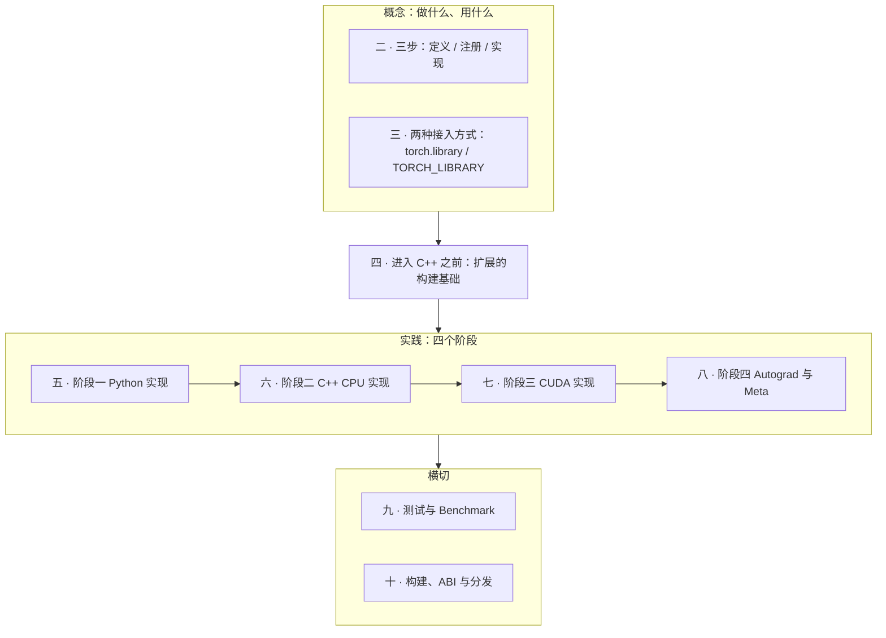
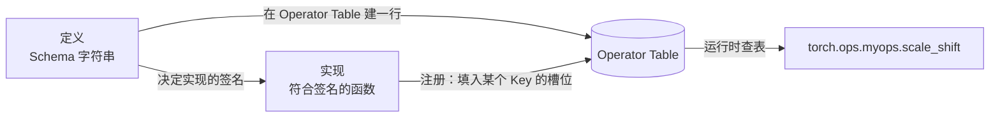
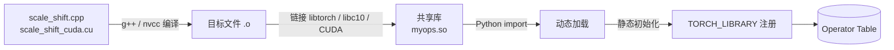

> 本文是[《PyTorch 深度实践：从 Tensor 到深度学习运行时》](/deep-dive-into-pytorch.html)系列的第六篇（共十篇）。上一篇：[Dispatcher 与算子系统](/pytorch-dispatcher-and-operator-system.html)　下一篇：[编译执行与图优化](/pytorch-compilation-and-graph-optimization.html)

上一篇把算子系统拆成两个维度：开发者在构建时**定义 → 注册 → 实现**，用户在运行时**入口 → 分发 → 执行**，两者通过 Operator Table 交汇。那一篇站在使用者的角度观察原生算子 `add`。

这一篇换到开发者的位置：**自己写一个算子，把它接入 PyTorch 的算子系统**。

这是从“阅读框架”走向“扩展框架”的关键一步。AI-Infra 工作中大量的实际需求都落在这里：一个融合 Kernel、一个新硬件的后端适配、一个推理引擎的定制算子，最终都要经过同样的路径。

本文用一个刻意简单的算子贯穿全文：

```text
scale_shift(x, alpha, beta) = alpha * x + beta
```

它简单到不会分散注意力，又足够涉及 Tensor 元数据、dtype、device、Autograd 和构建系统的全部问题。通过这个实际例子，我们可以了解到一个算子是怎么正确完成定义、注册与实现，并能通过 Autograd、Meta、测试和构建检验的完整过程。


## 一、总览：三个概念与本文主线

写一个自定义算子需要同时回答三个问题，本文的前三章分别回答它们，之后再用一个四阶段项目把答案落到代码上。

### 1. 要做哪几件事？——三步

第五篇开发态的三步对自定义算子完全适用：**定义** Schema、**注册**实现到 DispatchKey、**编写实现**。原生算子由 Codegen 帮忙生成大部分粘合代码；自定义算子这三步都要自己做。第二章展开每一步的具体内容。

### 2. 用什么工具做？——两种接入方式

同样的三步，可以在 **Python 侧**用 `torch.library` 完成，也可以在 **C++ 侧**用 `TORCH_LIBRARY` 宏完成，或者混用。两种方式填的是同一张 Operator Table。第三章展开两种方式的 API、原理和选型。

### 3. 按什么顺序练？——四个阶段

从纯 Python 实现开始，逐步下沉到 C++ CPU、CUDA，最后补上 Autograd 和 Meta。每个阶段都是完整的三步，只是实现所在的层次不同。第五至八章是四个阶段的实践。

### 4. 本文的章节安排



```text
二    三步：定义、注册、实现
三    两种接入方式：torch.library 与 TORCH_LIBRARY
四    进入 C++ 之前：扩展的构建基础
五    阶段一：Python 实现
六    阶段二：C++ CPU 实现
七    阶段三：CUDA 实现
八    阶段四：Autograd 与 Meta
九    测试与 Benchmark
十    构建、ABI 与分发
十一  Java 对照：JNI
十二  小结
```

如果你已经熟悉 C++ 扩展的构建方式，可以跳过第四章；如果没有写过 C++ 扩展，第四章是后面所有代码能跑起来的前提。


## 二、三步：定义、注册、实现

### 1. 第一步：定义——写下 Schema

定义一个算子，就是写下它的 **Schema**：名字、参数、返回值、以及是否修改输入。对 `scale_shift` 来说：

```text
myops::scale_shift(Tensor x, float alpha, float beta) -> Tensor
```

#### 1.1 Schema 的组成

```text
myops::scale_shift(Tensor x, float alpha, float beta) -> Tensor
│      │           │                                     │
│      │           └── 参数列表：类型 + 名字              └── 返回类型
│      └── 算子名
└── 命名空间：避免与 aten:: 和其他扩展冲突
```

如果同一个名字需要多个签名，用 overload 名区分，写法是 `name.overload`：

```text
myops::scale_shift.Tensor(Tensor x, Tensor alpha, Tensor beta) -> Tensor
myops::scale_shift.Scalar(Tensor x, float alpha, float beta) -> Tensor
```

原生算子的 `add.Tensor`、`add.Scalar`、`add.out` 就是这样命名的。

#### 1.2 Schema 类型系统

Schema 有自己的类型名，与 Python 和 C++ 类型是三套不同的写法。写实现函数时必须按这张表对应，否则注册时报错：

| Schema 类型 | Python 侧类型 | C++ 侧类型 | 说明 |
|---|---|---|---|
| `Tensor` | `torch.Tensor` | `const at::Tensor&` | 最常用 |
| `Tensor?` | `Optional[Tensor]` | `const std::optional<at::Tensor>&` | 可为 None |
| `Tensor[]` | `List[Tensor]` | `at::TensorList` | Tensor 列表 |
| `int` | `int` | `int64_t` | 注意不是 `int` |
| `float` | `float` | `double` | 注意不是 `float` |
| `bool` | `bool` | `bool` | |
| `str` | `str` | `c10::string_view` | |
| `Scalar` | `int` / `float` / `bool` | `const c10::Scalar&` | 可接受多种标量 |
| `int[]` / `int[2]` | `List[int]` / `Tuple[int, int]` | `at::IntArrayRef` | 固定长度可写 `int[2]` |
| `ScalarType` | `torch.dtype` | `at::ScalarType` | |
| `Device` | `torch.device` | `at::Device` | |

两个高频错误：Schema 的 `float` 对应 C++ 的 `double`，Schema 的 `int` 对应 C++ 的 `int64_t`。

#### 1.3 默认值与 keyword-only 参数

```text
myops::scale_shift(Tensor x, float alpha=1.0, *, float beta=0.0) -> Tensor
```

`*` 之后的参数只能用关键字传递，这与 Python 的语法一致。

#### 1.4 alias 与 mutability 标注

如果算子会修改某个输入（in-place），必须在 Schema 中声明：

```text
myops::scale_shift_(Tensor(a!) x, float alpha, float beta) -> Tensor(a!)
```

`(a!)` 表示：参数 `x` 属于 alias 集合 `a`，且会被修改（`!`）；返回值与 `x` 是同一块存储。第五篇讲过，Autograd 的版本检查、编译器的安全重排、内存复用都依赖这条信息。**不声明却修改输入，是自定义算子中最危险的错误之一**——不会报错，但会静默破坏 Autograd 和 `torch.compile` 的正确性。

按 PyTorch 惯例，in-place 算子名以下划线结尾。

### 2. 第二步：注册——把实现挂到 DispatchKey

定义只是声明“有这样一个算子”。注册是告诉 Dispatcher：**在哪个 DispatchKey 下，用哪个函数实现它**。

#### 2.1 自定义算子常用的 DispatchKey

| DispatchKey | 含义 | 什么时候注册到它 |
|---|---|---|
| `CPU` | CPU Tensor 的实现 | 有 CPU 实现时 |
| `CUDA` | CUDA Tensor 的实现 | 有 CUDA 实现时 |
| `Meta` | 只推断输出元数据 | 需要支持 Meta Tensor、`torch.compile` 时 |
| `Autograd` | 反向规则 | 需要自定义 backward 时 |
| `CompositeExplicitAutograd` | 用其他算子组合实现，对所有后端有效，但**不**自动提供 Autograd | 实现是纯算子组合，反向另外注册 |
| `CompositeImplicitAutograd` | 用其他**可导**算子组合实现，Autograd 自动通过子算子获得 | 实现是纯算子组合，且不需要自定义反向 |

选错 Key 的典型后果：

```text
只注册 CPU        → 传 CUDA Tensor 时 NotImplementedError
只注册 CompositeExplicitAutograd → 能算，但 backward 报错“没有导数”
注册 CompositeImplicitAutograd 却手写了 Autograd → 两套反向冲突
```

#### 2.2 注册就是往 Operator Table 填槽位

第五篇讲过，Operator Table 中每个算子一行，每个 DispatchKey 一个槽位。注册的效果就是填某个槽位：

| `myops::scale_shift` | CPU | CUDA | Meta | Autograd |
|---|---|---|---|---|
| 注册前 | 空 | 空 | 空 | 空 |
| 注册 CPU 实现后 | `scale_shift_cpu` | 空 | 空 | 空 |
| 全部完成后 | `scale_shift_cpu` | `scale_shift_cuda` | `scale_shift_meta` | 反向包装 |

运行态的 Dispatcher 拿着 DispatchKeySet 在这一行里查非空槽位。空槽位就是 `NotImplementedError` 的来源。

### 3. 第三步：实现——写符合 Schema 的函数

实现函数的签名必须与 Schema 按上面的类型表严格对应：

```text
Schema:  myops::scale_shift(Tensor x, float alpha, float beta) -> Tensor
Python:  def scale_shift(x: torch.Tensor, alpha: float, beta: float) -> torch.Tensor
C++:     at::Tensor scale_shift(const at::Tensor& x, double alpha, double beta)
```

实现函数内部要处理的事情，就是第五篇第四章的“五种实现模式”中的某一种：直接循环、TensorIterator、调用厂商库、组合其他算子、只推断元数据。第六至八章会分别演示。

### 4. 三步的关系



定义决定了实现必须长什么样；注册把实现与定义在某个 Key 下绑定；用户调用时，Dispatcher 从表里取出实现。三步缺一不可，顺序也不能乱——没有定义就不能注册，注册的函数签名必须匹配定义。


## 三、两种接入方式：`torch.library` 与 `TORCH_LIBRARY`

第二章的三步可以在 Python 侧或 C++ 侧完成。它们操作的是同一张 Operator Table，只是 API 不同。

### 1. Python 侧：`torch.library`

`torch.library` 模块提供了在 Python 中完成三步的全部 API。

#### 1.1 显式三步

```python
import torch

# 定义：创建命名空间，写 Schema
lib = torch.library.Library("myops", "DEF")
lib.define("scale_shift(Tensor x, float alpha, float beta) -> Tensor")

# 实现：一个普通 Python 函数
def scale_shift_impl(x, alpha, beta):
    return alpha * x + beta

# 注册：挂到 CompositeExplicitAutograd Key
lib.impl("scale_shift", scale_shift_impl, "CompositeExplicitAutograd")
```

`Library("myops", "DEF")` 的 `"DEF"` 表示这个对象负责定义命名空间 `myops`；同一进程内一个命名空间只能 `DEF` 一次。如果只想给已有命名空间添加实现，用 `"IMPL"`：

```python
lib_impl = torch.library.Library("myops", "IMPL")
lib_impl.impl("scale_shift", scale_shift_cuda_impl, "CUDA")
```

#### 1.2 便捷装饰器：`custom_op`

PyTorch 2.4 起提供 `torch.library.custom_op`，把三步压成一个装饰器：

```python
@torch.library.custom_op("myops::scale_shift", mutates_args=())
def scale_shift(x: torch.Tensor, alpha: float, beta: float) -> torch.Tensor:
    return alpha * x + beta
```

它从类型注解推导 Schema，把函数体注册为默认实现。`mutates_args=()` 就是 alias 标注：声明不修改任何输入。如果修改了 `x`，必须写 `mutates_args=("x",)`。

`custom_op` 还支持按设备注册不同实现：

```python
@scale_shift.register_kernel("cuda")
def _(x, alpha, beta):
    return my_cuda_ext.scale_shift(x, alpha, beta)   # 调用已编译的 C++ 扩展
```

#### 1.3 Autograd 与 Fake 的注册

Python 侧还提供两个高层 API，对应 Operator Table 的 Autograd 和 Meta 槽位：

```python
torch.library.register_autograd("myops::scale_shift", backward_fn, setup_context=setup_fn)
torch.library.register_fake("myops::scale_shift")(fake_fn)
```

第八章展开它们。

#### 1.4 Python 侧能做什么、不能做什么

| 能 | 不能 |
|---|---|
| 完成定义、注册、实现全部三步 | 实现本身如果是纯 Python，性能受限 |
| 把已编译的 C++/CUDA 函数包装成算子 | 在没有 Python 解释器的环境（纯 C++ 部署）中使用 |
| 注册 Autograd、Fake，与 `torch.compile` 协作 | |

因此 Python 侧最常见的用法是：**Schema、Autograd、Fake 在 Python 定义，重计算通过扩展下沉到 C++/CUDA。**

### 2. C++ 侧：`TORCH_LIBRARY` 宏族

#### 2.1 三个宏

```cpp
#include <torch/library.h>

// 定义：一个命名空间在整个进程中只能 TORCH_LIBRARY 一次
TORCH_LIBRARY(myops, m) {
  m.def("scale_shift(Tensor x, float alpha, float beta) -> Tensor");
}

// 注册：为某个 DispatchKey 提供实现
TORCH_LIBRARY_IMPL(myops, CPU, m) {
  m.impl("scale_shift", scale_shift_cpu);
}

// 追加定义：命名空间已被别处 TORCH_LIBRARY 定义时使用
TORCH_LIBRARY_FRAGMENT(myops, m) {
  m.def("another_op(Tensor x) -> Tensor");
}
```

| 宏 | 对应三步 | 约束 |
|---|---|---|
| `TORCH_LIBRARY(ns, m)` | 定义 | 每个命名空间全进程只能出现一次 |
| `TORCH_LIBRARY_FRAGMENT(ns, m)` | 定义（追加） | 可多次；命名空间已存在时用它 |
| `TORCH_LIBRARY_IMPL(ns, key, m)` | 注册 | 可多次；每个 (ns, key) 一份 |

#### 2.2 宏在做什么

这三个宏展开后都是一个**静态初始化对象**。共享库被加载时，C++ 运行时执行静态初始化，对象的构造函数被调用，构造函数里执行你写的花括号代码块，`m.def` / `m.impl` 把 Schema 和函数指针写入 Operator Table。

```text
Python: import myops._C
    ↓ 动态链接器加载 .so
    ↓ 执行静态初始化
TORCH_LIBRARY(myops, m) { m.def(...) }        → Operator Table 新增一行
TORCH_LIBRARY_IMPL(myops, CPU, m) { m.impl(...) } → 填入 CPU 槽位
    ↓
torch.ops.myops.scale_shift 可用
```

这解释了两个现象：为什么 `import` 一个扩展模块之后算子就“凭空出现”了；为什么 `TORCH_LIBRARY` 同一命名空间不能出现两次——第二次静态初始化会尝试重复建表。

对 Java 工程师：这与 JNI 的 `JNI_OnLoad` 在 `System.loadLibrary` 时被调用是同一种机制。

#### 2.3 C++ 侧能做什么、不能做什么

| 能 | 不能 |
|---|---|
| 完成三步，包括 Autograd（`torch::autograd::Function`）和 Meta | 使用 Python 侧的 `register_fake` 等便捷 API（需在 C++ 手写 Meta 实现） |
| 不依赖 Python，可用于 libtorch 纯 C++ 部署 | |
| 直接调用 CUDA、厂商库 | |

### 3. 混用：最常见的实际组合

两种方式可以混用，规则只有一条：**一个命名空间只能被 `TORCH_LIBRARY`（C++）或 `Library(..., "DEF")`（Python）定义一次**，其余位置用 `FRAGMENT` / `"IMPL"` 追加。

最常见的组合：

```text
C++ 侧    TORCH_LIBRARY 定义 Schema
          TORCH_LIBRARY_IMPL 注册 CPU / CUDA 实现（重计算在这里）
Python 侧 register_autograd 注册反向（Python 写反向更方便）
          register_fake 注册 Fake（Python 写 shape 推断更方便）
```

本文的四个阶段最终就是这个组合。

### 4. 选型

| 场景 | 建议 |
|---|---|
| 快速验证一个算子的接口设计 | Python `custom_op` |
| 把已有的 CUDA Kernel 接入 PyTorch | C++ `TORCH_LIBRARY` 定义 + 注册；Python 补 Autograd / Fake |
| 扩展需要在纯 C++ 推理服务中使用 | 全部 C++ |
| 为新硬件后端适配一批算子 | C++ `TORCH_LIBRARY_IMPL(aten, PrivateUse1, m)`，给原生算子填新 Key 的槽位 |

最后一行值得注意：新后端适配不需要重新定义 `aten::add`，只需要给它的 Operator Table 行填上新 Key 的槽位。这正是“定义与实现解耦”在硬件适配上的价值。


## 四、进入 C++ 之前：扩展的构建基础

从第六章开始，实现会下沉到 C++。对于没有写过 PyTorch C++ 扩展的读者，这一章回答一个前置问题：**一段 C++ 代码，是怎样变成 Python 里可以调用的算子的？**

### 1. C++ 扩展是什么

PyTorch C++ 扩展本质上是一个**共享库**（Linux 下是 `.so`，Windows 下是 `.pyd`）。它有三个特征：

1. 用 C++（可能加 CUDA）编写，编译时链接 PyTorch 自己的 C++ 库；
2. 编译产物是一个 Python 可以 `import` 的模块文件；
3. `import` 时，共享库被加载，其中的 `TORCH_LIBRARY` 静态初始化执行，算子注册完成。



对 Java 工程师：这与 JNI 的流程一一对应——`.c` 编译成 `.so`，`System.loadLibrary` 加载，`JNI_OnLoad` 执行初始化。

### 2. 扩展依赖 PyTorch 的哪些东西

编译扩展时，编译器需要找到 PyTorch 的**头文件**和**库文件**。它们都在已安装的 `torch` 包目录下：

```text
site-packages/torch/
├── include/            头文件
│   ├── ATen/           at::Tensor、算子 API
│   ├── c10/            核心基础设施：Device、ScalarType、Dispatcher
│   ├── torch/          torch::autograd、torch::library 等高层 API
│   └── torch/csrc/api/include/   C++ 前端
└── lib/                库文件
    ├── libc10.so
    ├── libtorch_cpu.so
    ├── libtorch_cuda.so
    ├── libtorch_python.so
    └── ...
```

三个命名空间经常一起出现，它们的分工是：

| 命名空间 / 库 | 内容 | 本文用到的 |
|---|---|---|
| `c10` | 最底层的基础设施：`Device`、`ScalarType`、`Scalar`、Dispatcher 核心、CUDA Stream 封装 | `c10::cuda::CUDAGuard`、`C10_CUDA_KERNEL_LAUNCH_CHECK` |
| `at`（ATen） | Tensor 类型和算子 API | `at::Tensor`、`at::empty_like`、`at::TensorIterator`、`AT_DISPATCH_*` |
| `torch` | 高层 API：Autograd、Library 注册宏、C++ 前端 | `TORCH_LIBRARY`、`torch::autograd::Function`、`TORCH_CHECK` |

不需要记住每个符号在哪个命名空间；需要知道的是：**看到 `c10::` 是基础设施，`at::` 是 Tensor 与算子，`torch::` 是高层封装**。

### 3. 编译一个扩展需要告诉编译器什么

一次手工编译大致需要这些参数：

```text
头文件路径   -I site-packages/torch/include
             -I site-packages/torch/include/torch/csrc/api/include
             -I /usr/local/cuda/include
库文件路径   -L site-packages/torch/lib
             -L /usr/local/cuda/lib64
链接的库     -lc10 -ltorch -ltorch_cpu -ltorch_python
             -lc10_cuda -ltorch_cuda -lcudart
编译标志     -std=c++17
             -D_GLIBCXX_USE_CXX11_ABI=<必须与 PyTorch 一致>
             -DTORCH_EXTENSION_NAME=myops
CUDA 标志    -gencode arch=compute_80,code=sm_80  （目标 GPU 架构）
```

手工写这些既繁琐又容易错。PyTorch 提供了 `torch.utils.cpp_extension` 模块，它会自动从当前安装的 `torch` 读取所有路径和标志。**这是为什么应该始终通过它构建扩展，而不是手写编译命令。**

### 4. 三种构建方式

#### 4.1 JIT 编译：`load` 与 `load_inline`

最适合实验和本文演示的方式。在 Python 中直接指定源文件，首次调用时编译，结果缓存在 `~/.cache/torch_extensions/`：

```python
from torch.utils.cpp_extension import load

myops = load(
    name="myops",                                      # 模块名，也用于缓存目录
    sources=["scale_shift.cpp", "scale_shift_cuda.cu"], # .cu 自动用 nvcc
    extra_cflags=["-O2"],
    extra_cuda_cflags=["-O2"],
    verbose=True,                                      # 打印完整编译命令
)
```

`verbose=True` 打印出来的编译命令，就是第 3 节那些参数的真实版本——第一次构建时值得看一遍。

`load_inline` 允许把 C++ 源码写在 Python 字符串里，适合几十行的小实验：

```python
from torch.utils.cpp_extension import load_inline

cpp_src = """
#include <torch/extension.h>
at::Tensor double_it(const at::Tensor& x) { return x * 2; }
"""
mod = load_inline(name="tiny", cpp_sources=cpp_src, functions=["double_it"])
mod.double_it(torch.ones(3))   # tensor([2., 2., 2.])
```

注意 `load_inline` 的 `functions=` 参数用的是 pybind11 方式暴露函数（见第 5 节），不是算子注册。

#### 4.2 setuptools：`setup.py`

发布给他人使用时的标准方式：

```python
# setup.py
from setuptools import setup
from torch.utils.cpp_extension import CppExtension, CUDAExtension, BuildExtension

setup(
    name="myops",
    packages=["myops"],
    ext_modules=[
        CUDAExtension(                          # 只有 CPU 代码时用 CppExtension
            name="myops._C",                    # 编译出 myops/_C.so
            sources=["csrc/scale_shift.cpp", "csrc/scale_shift_cuda.cu"],
        ),
    ],
    cmdclass={"build_ext": BuildExtension},     # 让 setuptools 使用 PyTorch 的编译逻辑
)
```

配合一个 Python 包：

```text
myops/
├── __init__.py        import myops._C 触发注册；补 register_autograd / register_fake
├── _C.so              编译产物
└── csrc/
    ├── scale_shift.cpp
    └── scale_shift_cuda.cu
```

`pip install .` 或 `python setup.py develop` 完成构建与安装。

#### 4.3 CMake

当扩展是一个更大 C++ 项目的一部分，或需要与其他 C++ 库一起构建时，用 CMake：

```cmake
cmake_minimum_required(VERSION 3.18)
project(myops LANGUAGES CXX CUDA)

find_package(Torch REQUIRED)          # 需要 -DCMAKE_PREFIX_PATH=<torch 安装目录>
find_package(Python REQUIRED COMPONENTS Development)

add_library(myops SHARED csrc/scale_shift.cpp csrc/scale_shift_cuda.cu)
target_link_libraries(myops PRIVATE ${TORCH_LIBRARIES} Python::Python)
target_compile_features(myops PRIVATE cxx_std_17)
```

`find_package(Torch)` 会导入 PyTorch 的头文件路径、库和 ABI 标志。`CMAKE_PREFIX_PATH` 可以通过 `python -c "import torch; print(torch.utils.cmake_prefix_path)"` 获取。

#### 4.4 三种方式对比

| 方式 | 编译时机 | 适合 | 缺点 |
|---|---|---|---|
| `load` / `load_inline` | 运行时按需 | 实验、教学、快速迭代 | 每台机器首次运行都要编译；不适合分发 |
| setuptools | 安装时 | 发布为 pip 包 | 需要维护 `setup.py`；组合矩阵大时构建成本高 |
| CMake | 独立构建 | 大型 C++ 项目集成、libtorch 纯 C++ 部署 | 配置最重 |

本文用 `load` 演示，第十章讨论 setuptools 与分发。

### 5. 两种把 C++ 暴露给 Python 的方式

这是初学者最容易混淆的地方。C++ 函数让 Python 调到，有两条完全不同的路：

#### 5.1 pybind11：绑定为普通 Python 函数

```cpp
#include <torch/extension.h>   // 包含了 pybind11 和 ATen

at::Tensor scale_shift_cpu(const at::Tensor& x, double alpha, double beta) { /* ... */ }

PYBIND11_MODULE(TORCH_EXTENSION_NAME, m) {
  m.def("scale_shift", &scale_shift_cpu, "alpha * x + beta");
}
```

Python 侧：

```python
myops.scale_shift(x, 2.0, 1.0)   # 一个普通 Python 函数
```

这条路的本质是：pybind11 生成一个 Python 函数对象，调用时做参数类型转换，然后**直接调用** `scale_shift_cpu`。**Dispatcher 完全不知道这个函数的存在。**

#### 5.2 `TORCH_LIBRARY`：注册为 PyTorch 算子

```cpp
#include <torch/library.h>

TORCH_LIBRARY(myops, m) {
  m.def("scale_shift(Tensor x, float alpha, float beta) -> Tensor");
}
TORCH_LIBRARY_IMPL(myops, CPU, m) {
  m.impl("scale_shift", scale_shift_cpu);
}
```

Python 侧：

```python
torch.ops.myops.scale_shift(x, 2.0, 1.0)   # 经过 Dispatcher
```

这条路把函数填进 Operator Table，调用时走第五篇的完整运行态路径。

#### 5.3 两者的差别

| | pybind11 | `TORCH_LIBRARY` |
|---|---|---|
| Python 侧的名字 | `myops.scale_shift` | `torch.ops.myops.scale_shift` |
| 是否经过 Dispatcher | 否 | 是 |
| 能否按 CPU / CUDA 分别注册实现 | 不能，函数内自己 `if` | 能 |
| 能否接 Autograd | 只能在 Python 用 `autograd.Function` 包一层 | 注册到 Autograd Key 即可 |
| `torch.compile` 如何看它 | 不透明的 Python 调用，导致 graph break | 一个算子节点，配合 Fake 实现可被捕获 |
| Profiler 中的表现 | 看不到算子名 | 显示为 `myops::scale_shift` |
| 适合 | 暴露工具函数、配置接口 | **任何要成为算子的东西** |

结论：**pybind11 适合暴露不是算子的辅助函数；要成为算子，必须走 `TORCH_LIBRARY`**。两者可以共存于同一个扩展中。本文的算子只用后者。

### 6. 最小可编译骨架

把前面的内容放在一起，一个最小的扩展骨架是：

```text
scale_shift/
├── scale_shift.cpp        定义 + CPU 注册 + CPU 实现
├── scale_shift_cuda.cu    CUDA 注册 + CUDA 实现（第七章加入）
└── build.py               调用 load()
```

`scale_shift.cpp` 的骨架：

```cpp
#include <torch/library.h>
#include <ATen/ATen.h>

// 实现：签名必须与 Schema 对应（float → double）
at::Tensor scale_shift_cpu(const at::Tensor& x, double alpha, double beta) {
  return alpha * x + beta;     // 先用 ATen 组合实现占位，第六章替换
}

// 定义
TORCH_LIBRARY(myops, m) {
  m.def("scale_shift(Tensor x, float alpha, float beta) -> Tensor");
}

// 注册
TORCH_LIBRARY_IMPL(myops, CPU, m) {
  m.impl("scale_shift", scale_shift_cpu);
}
```

`build.py`：

```python
import torch
from torch.utils.cpp_extension import load

load(name="myops", sources=["scale_shift.cpp"], verbose=True)

x = torch.randn(4, 3)
print(torch.ops.myops.scale_shift(x, 2.0, 1.0))
```

注意 `load()` 的返回值这里没有使用——因为我们不走 pybind11，`import` 的副作用（静态初始化注册）已经让 `torch.ops.myops.scale_shift` 可用。

如果这个骨架能跑通，构建环境就是正确的，后面的章节只需要替换实现函数。

### 7. 常见编译与加载错误速查

| 现象 | 常见原因 | 处理 |
|---|---|---|
| `fatal error: torch/library.h: No such file` | 没有通过 `cpp_extension` 构建，头文件路径缺失 | 用 `load` / `CppExtension`，不要手写编译命令 |
| `undefined symbol: _ZN3c10...` | C++ ABI 不一致，或链接的 PyTorch 版本与运行时不同 | 确认 `_GLIBCXX_USE_CXX11_ABI` 与 `torch._C._GLIBCXX_USE_CXX11_ABI` 一致；重新编译 |
| `nvcc fatal: Unsupported gpu architecture` | CUDA Toolkit 版本与 GPU 架构或 PyTorch 期望不匹配 | 对齐 CUDA 版本；设置 `TORCH_CUDA_ARCH_LIST` |
| `no kernel image is available for execution` | 编译时没有包含目标 GPU 的 compute capability | 设置 `TORCH_CUDA_ARCH_LIST="8.0;9.0"` 重新编译 |
| `RuntimeError: ... myops already registered` | 同一命名空间 `TORCH_LIBRARY` 出现两次，或重复 `import` 了不同构建 | 改用 `TORCH_LIBRARY_FRAGMENT`；重启进程 |
| Schema 与函数签名不匹配的注册错误 | Schema 写 `float` 但 C++ 用了 `float` 而不是 `double` | 按第二章类型表修正 |
| `import` 成功但 `torch.ops.myops` 没有属性 | 用了 pybind11 而不是 `TORCH_LIBRARY` | 检查是否写了 `m.def` Schema |

第一次遇到这些错误时很难判断问题在哪一层。原则是：**编译期错误看头文件和类型；链接期错误看 ABI 和库版本；加载期错误看注册；运行期 `NotImplementedError` 看 DispatchKey 槽位。**


## 五、阶段一：Python 实现，建立契约

从这一章开始进入四阶段实践。每个阶段都完成一次完整的三步，实现所在的层次逐步下沉。

### 1. 先定义，再实现

第一步不是写计算，而是用第三章的 Python 侧方式写下 Schema：

```python
import torch

@torch.library.custom_op("myops::scale_shift", mutates_args=())
def scale_shift(x: torch.Tensor, alpha: float, beta: float) -> torch.Tensor:
    return alpha * x + beta
```

三步在这几行里全部完成：从类型注解推导出 Schema；把函数体注册为默认实现；`mutates_args=()` 声明不修改输入。

### 2. 与直接写 Python 函数的区别

直接写 `def f(x, alpha, beta): return alpha * x + beta` 也能算出同样的数字。区别在于它对算子系统**不可见**：

| | 普通 Python 函数 | `custom_op` |
|---|---|---|
| Dispatcher 是否知道它 | 否，只看到内部的 `mul`、`add` | 是，作为一个整体算子 |
| `torch.compile` 如何处理 | 追踪进函数内部，看到两个子算子 | 视为一个算子节点，需要 Fake 实现 |
| 能否为 CUDA 单独注册实现 | 不能 | 能 |
| 能否自定义反向 | 需要 `autograd.Function` | 通过 `register_autograd` |

阶段一的价值在于：**先把边界画出来**。之后替换内部实现时，用户代码和 Schema 都不用变。

### 3. 调用与验证

```python
x = torch.randn(4, 3)
y = torch.ops.myops.scale_shift(x, 2.0, 1.0)
torch.testing.assert_close(y, 2.0 * x + 1.0)
```

阶段一结束时我们有了一条 Schema 和一个对所有后端可用的 Python 实现。接下来把实现下沉到 C++，并切换到第三章的“C++ 定义 + Python 补 Autograd/Fake”组合——因此从第六章起，Schema 改由 C++ 的 `TORCH_LIBRARY` 定义，上面的 `custom_op` 版本不再使用。


## 六、阶段二：C++ CPU 实现

### 1. 实现函数的签名

按第二章的类型表：

```cpp
at::Tensor scale_shift_cpu(const at::Tensor& x, double alpha, double beta);
```

`at::Tensor` 是一个引用句柄，拷贝它不会拷贝数据。第二篇的 Tensor 模型——Storage、shape、stride、dtype、device——在这里全部以 C++ API 出现：`x.sizes()`、`x.strides()`、`x.dtype()`、`x.device()`、`x.is_contiguous()`。

### 2. 第一件事：检查输入

在 C++ 里，错误的输入不会像 Python 那样抛出友好的异常，可能直接越界访问。所以实现的第一段永远是检查：

```cpp
TORCH_CHECK(x.device().is_cpu(), "scale_shift_cpu: expected CPU tensor, got ", x.device());
TORCH_CHECK(x.is_floating_point(), "scale_shift_cpu: expected floating dtype, got ", x.dtype());
```

`TORCH_CHECK(condition, msg...)` 失败时抛出 `c10::Error`，Python 侧看到 `RuntimeError` 和拼接后的消息。

### 3. 处理 stride：contiguous 还是 TensorIterator

第二篇讨论过 Tensor 可能是非连续的。C++ 实现必须二选一，不能假装不存在：

**选择 A：先 `contiguous()`，再按一维遍历**

```cpp
auto x_contig = x.contiguous();      // 非连续时产生一次拷贝
auto out = at::empty_like(x_contig);
const int64_t n = x_contig.numel();
```

简单直接，代价是非连续输入多一次拷贝。

**选择 B：用 TensorIterator，支持任意 stride**

```cpp
#include <ATen/TensorIterator.h>
#include <ATen/native/cpu/Loops.h>

auto out = at::empty_like(x);
auto iter = at::TensorIteratorConfig()
    .add_output(out)
    .add_input(x)
    .build();
```

TensorIterator 处理广播、stride 和并行划分，Kernel 只写单元素计算。这是第五篇讲的原生算子最常用的实现模式。

本章选 B 展示原生写法；自定义算子的早期版本选 A 完全合理——先正确，再优化。

### 4. 处理 dtype：`AT_DISPATCH`

`x.dtype()` 是运行时信息，而 C++ 模板需要编译期类型。`AT_DISPATCH_*` 宏做这个桥接：

```cpp
AT_DISPATCH_FLOATING_TYPES(x.scalar_type(), "scale_shift_cpu", [&] {
  // 在 lambda 内部，scalar_t 是具体类型：float 或 double
  at::native::cpu_kernel(iter, [alpha, beta](scalar_t v) -> scalar_t {
    return static_cast<scalar_t>(alpha) * v + static_cast<scalar_t>(beta);
  });
});
```

宏在运行时按 `scalar_type()` 选择分支，每个分支实例化一份模板。不用它就得自己写 `switch`。

`AT_DISPATCH_FLOATING_TYPES` 覆盖 `float` 和 `double`；需要 `half` / `bfloat16` 时用 `AT_DISPATCH_FLOATING_TYPES_AND2(at::kHalf, at::kBFloat16, ...)`。

### 5. 完整的 CPU 实现

```cpp
#include <ATen/ATen.h>
#include <ATen/TensorIterator.h>
#include <ATen/native/cpu/Loops.h>
#include <torch/library.h>

at::Tensor scale_shift_cpu(const at::Tensor& x, double alpha, double beta) {
  TORCH_CHECK(x.device().is_cpu(), "expected CPU tensor");
  TORCH_CHECK(x.is_floating_point(), "expected floating dtype");

  auto out = at::empty_like(x);
  auto iter = at::TensorIteratorConfig()
      .add_output(out)
      .add_input(x)
      .build();

  AT_DISPATCH_FLOATING_TYPES(x.scalar_type(), "scale_shift_cpu", [&] {
    at::native::cpu_kernel(iter, [alpha, beta](scalar_t v) -> scalar_t {
      return static_cast<scalar_t>(alpha) * v + static_cast<scalar_t>(beta);
    });
  });
  return out;
}

TORCH_LIBRARY(myops, m) {
  m.def("scale_shift(Tensor x, float alpha, float beta) -> Tensor");
}

TORCH_LIBRARY_IMPL(myops, CPU, m) {
  m.impl("scale_shift", scale_shift_cpu);
}
```

三步在同一个文件里清晰可见：`m.def` 定义，`m.impl` 注册，`scale_shift_cpu` 实现。

### 6. `data_ptr` 的边界

如果不用 TensorIterator 而直接访问内存：

```cpp
auto x_contig = x.contiguous();
const float* src = x_contig.data_ptr<float>();
float* dst = out.data_ptr<float>();
for (int64_t i = 0; i < x_contig.numel(); ++i) {
  dst[i] = alpha * src[i] + beta;
}
```

三个注意点：`data_ptr<T>()` 要求 dtype 与 `T` 匹配，否则抛错；它返回的是 `storage_offset` 之后的起始地址；对非连续 Tensor 直接一维遍历会得到错误结果——这就是前面先 `contiguous()` 的原因。

### 7. Python 侧验证

```python
from torch.utils.cpp_extension import load
load(name="myops", sources=["scale_shift.cpp"])

x = torch.randn(4, 3)
torch.testing.assert_close(torch.ops.myops.scale_shift(x, 2.0, 1.0), 2.0 * x + 1.0)

xt = x.t()                                          # 非连续输入
torch.testing.assert_close(torch.ops.myops.scale_shift(xt, 2.0, 1.0), 2.0 * xt + 1.0)
```

此时传入 CUDA Tensor：

```text
NotImplementedError: Could not run 'myops::scale_shift' with arguments from the 'CUDA' backend.
```

这是第二章第 2 节讲的空槽位。下一阶段填它。


## 七、阶段三：CUDA 实现

### 1. CUDA 实现要多做的事

```text
Kernel 的 grid / block 配置
在正确的 CUDA stream 上 launch
使用设备指针而不是主机指针
launch 后的错误检查
多卡时切换到正确的设备
```

### 2. Kernel

```cpp
// scale_shift_cuda.cu
#include <ATen/ATen.h>
#include <ATen/cuda/CUDAContext.h>
#include <c10/cuda/CUDAGuard.h>
#include <torch/library.h>

template <typename scalar_t>
__global__ void scale_shift_kernel(
    const scalar_t* __restrict__ x,
    scalar_t* __restrict__ out,
    int64_t n,
    scalar_t alpha,
    scalar_t beta) {
  int64_t i = blockIdx.x * (int64_t)blockDim.x + threadIdx.x;
  if (i < n) {
    out[i] = alpha * x[i] + beta;
  }
}
```

Kernel 只表达“对第 `i` 个元素做什么”。它假设输入是连续的一维数组——这个假设由调用方保证。

### 3. Launch 函数

```cpp
at::Tensor scale_shift_cuda(const at::Tensor& x, double alpha, double beta) {
  TORCH_CHECK(x.is_cuda(), "expected CUDA tensor");
  TORCH_CHECK(x.is_floating_point(), "expected floating dtype");

  const c10::cuda::CUDAGuard guard(x.device());   // 切换到 x 所在的 GPU
  auto x_contig = x.contiguous();
  auto out = at::empty_like(x_contig);
  const int64_t n = x_contig.numel();
  if (n == 0) return out;                          // 空 Tensor：blocks 为 0 时 launch 会报错

  const int threads = 256;
  const int blocks = static_cast<int>((n + threads - 1) / threads);
  auto stream = at::cuda::getCurrentCUDAStream();

  AT_DISPATCH_FLOATING_TYPES_AND2(at::kHalf, at::kBFloat16,
      x.scalar_type(), "scale_shift_cuda", [&] {
    scale_shift_kernel<scalar_t><<<blocks, threads, 0, stream>>>(
        x_contig.data_ptr<scalar_t>(),
        out.data_ptr<scalar_t>(),
        n,
        static_cast<scalar_t>(alpha),
        static_cast<scalar_t>(beta));
  });
  C10_CUDA_KERNEL_LAUNCH_CHECK();
  return out;
}

TORCH_LIBRARY_IMPL(myops, CUDA, m) {
  m.impl("scale_shift", scale_shift_cuda);
}
```

| 代码 | 为什么 |
|---|---|
| `CUDAGuard` | 多卡时确保分配和 launch 发生在输入所在的设备 |
| `getCurrentCUDAStream()` | 在 PyTorch 当前 stream 上 launch，才能与其他算子保持顺序；用默认 stream 会破坏异步语义 |
| `n == 0` 提前返回 | 空 Tensor 是合法输入 |
| `C10_CUDA_KERNEL_LAUNCH_CHECK()` | 捕获 launch 配置错误；它**不**等待 Kernel 完成，运行时错误会在之后某次同步时暴露 |
| `contiguous()` | 这个简单 Kernel 假设一维连续；真实项目可改用 CUDA 版 TensorIterator（`at::native::gpu_kernel`）支持任意 stride |

### 4. 异步语义

CUDA Kernel launch 是异步的：函数返回时 Kernel 可能还没执行。两个后果：

- 不能在 launch 函数返回后立刻用 CPU 计时器认为计算已完成（第八篇展开）；
- Kernel 内的越界访问通常在之后某个同步点（`.cpu()`、`.item()`、`torch.cuda.synchronize()`）才报出，且报错位置与出错 Kernel 无关。调试时设置 `CUDA_LAUNCH_BLOCKING=1` 强制同步，让错误在原地暴露。

### 5. 编译

```python
load(name="myops", sources=["scale_shift.cpp", "scale_shift_cuda.cu"], verbose=True)
```

`TORCH_LIBRARY(myops, m)` 只能出现一次（在 `.cpp` 中）；`.cu` 文件里只放 `TORCH_LIBRARY_IMPL`。

现在 Operator Table 中 `myops::scale_shift` 有了 CPU 和 CUDA 两个槽位。同一个 Python 调用，输入在哪个设备，就走哪条实现——这正是第五篇运行态分发的全部意义。


## 八、阶段四：Autograd 与 Meta

### 1. 现在还缺什么

```python
x = torch.randn(4, 3, requires_grad=True)
y = torch.ops.myops.scale_shift(x, 2.0, 1.0)
y.sum().backward()      # 失败：没有人告诉 Autograd 反向规则
```

第三篇讲过 Autograd 需要每个算子提供 backward；第五篇讲过 Autograd 是一个包装 Key。同样，`torch.compile` 需要在不运行真实 Kernel 的情况下推断输出 shape，这需要 Meta / Fake 实现。

按第三章的“混用”组合，这两项在 Python 侧完成。

### 2. 注册 Autograd：Python 侧

```python
def _setup_context(ctx, inputs, output):
    x, alpha, beta = inputs
    ctx.alpha = alpha                # 只保存标量，不保存 Tensor

def _backward(ctx, grad_out):
    grad_x = grad_out * ctx.alpha    # d(alpha*x+beta)/dx = alpha
    return grad_x, None, None        # 与 Schema 参数 (x, alpha, beta) 一一对应；非 Tensor 参数返回 None

torch.library.register_autograd(
    "myops::scale_shift", _backward, setup_context=_setup_context
)
```

它等价于第三篇的 `autograd.Function`，但注册到了 Operator Table 的 Autograd Key，因此对 `torch.ops.myops.scale_shift` 的所有调用自动生效。`_backward` 返回值的个数和位置必须与 Schema 参数一一对应。

### 3. 注册 Autograd：C++ 侧（备选）

如果扩展要在纯 C++ 环境使用，Autograd 也可以在 C++ 注册：

```cpp
#include <torch/autograd.h>

class ScaleShiftFunction : public torch::autograd::Function<ScaleShiftFunction> {
 public:
  static at::Tensor forward(torch::autograd::AutogradContext* ctx,
                            const at::Tensor& x, double alpha, double beta) {
    ctx->saved_data["alpha"] = alpha;
    at::AutoDispatchBelowADInplaceOrView guard;   // 去掉 Autograd Key，再次分发到后端
    return torch::ops::myops::scale_shift::call(x, alpha, beta);
  }
  static torch::autograd::tensor_list backward(torch::autograd::AutogradContext* ctx,
                                               torch::autograd::tensor_list grads) {
    double alpha = ctx->saved_data["alpha"].toDouble();
    return {grads[0] * alpha, at::Tensor(), at::Tensor()};
  }
};

at::Tensor scale_shift_autograd(const at::Tensor& x, double alpha, double beta) {
  return ScaleShiftFunction::apply(x, alpha, beta);
}

TORCH_LIBRARY_IMPL(myops, Autograd, m) {
  m.impl("scale_shift", scale_shift_autograd);
}
```

`AutoDispatchBelowADInplaceOrView` 就是第五篇讲的“包装 Key 执行后去掉自身 Key 再次分发”：forward 内部再次调用算子时不能再进入 Autograd Key，否则无限递归。

### 4. 注册 Meta / Fake 实现

```python
@torch.library.register_fake("myops::scale_shift")
def _fake(x, alpha, beta):
    return torch.empty_like(x)       # 只描述输出的 shape / dtype / device
```

有了它：`torch.compile` 可以把算子纳入图捕获；Meta Tensor 上可以调用这个算子做 shape 推断；`opcheck` 能检查 Fake 与真实实现是否一致。C++ 侧的等价做法是向 `Meta` Key 注册一个只调用 `at::empty_like` 的函数。

### 5. 完成后的 Operator Table

| DispatchKey | 实现 | 阶段 |
|---|---|---|
| CPU | `scale_shift_cpu` | 二 |
| CUDA | `scale_shift_cuda` | 三 |
| Autograd | `register_autograd` 生成的包装 | 四 |
| Meta（Fake） | `_fake` | 四 |

这一行现在与原生算子 `add` 的结构相同，用户调用时的分发过程也相同。四个阶段中，用户代码 `torch.ops.myops.scale_shift(x, 2.0, 1.0)` 一行都没有改变。


## 九、测试与 Benchmark

### 1. 至少要测什么

```text
正确性
├── 与参考实现 alpha * x + beta 数值一致
├── shape：标量、一维、高维、空 Tensor
├── dtype：float32 / float64 / float16 / bfloat16
├── CPU 与 CUDA 结果一致
├── contiguous 与 non-contiguous 输入
├── 非法输入：整数 dtype、错误设备 → 应报清晰错误而非崩溃
└── 极端数值：inf、nan、极大 alpha

Autograd
├── gradcheck（一阶）
└── gradgradcheck（二阶，如支持）

系统集成
├── Fake 与真实实现的 shape / dtype 一致
├── torch.compile 下能被捕获且结果正确
└── 多 GPU 下在正确设备上执行
```

### 2. `torch.library.opcheck`

一站式检查：Schema 与实现是否一致、Fake 是否正确、Autograd 注册是否合法、`mutates_args` 声明是否与实际行为匹配。

```python
from torch.library import opcheck

for device in ["cpu", "cuda"]:
    for dtype in [torch.float32, torch.float64]:
        x = torch.randn(4, 3, device=device, dtype=dtype, requires_grad=True)
        opcheck(torch.ops.myops.scale_shift, (x, 2.0, 1.0))
```

这些正是自定义算子最容易出错、又最难靠肉眼发现的地方。

### 3. `gradcheck`

```python
from torch.autograd import gradcheck

x = torch.randn(4, 3, dtype=torch.float64, requires_grad=True)
assert gradcheck(lambda t: torch.ops.myops.scale_shift(t, 2.0, 1.0), (x,))
```

必须使用 `float64`，否则有限差分的数值误差会导致误报。

### 4. Benchmark

```python
import torch.utils.benchmark as benchmark

x = torch.randn(1 << 20, device="cuda")
t_custom = benchmark.Timer(stmt="torch.ops.myops.scale_shift(x, 2.0, 1.0)", globals={"x": x})
t_native = benchmark.Timer(stmt="2.0 * x + 1.0", globals={"x": x})
print(t_custom.timeit(100))
print(t_native.timeit(100))
```

`benchmark.Timer` 自动处理 CUDA 同步和预热。这个对照有意义：原生写法是两个 Kernel（`mul`、`add`），自定义算子是一个融合 Kernel，收益来自少一次内存读写和一次 launch。是否真的更快要看数据；第八篇系统讨论如何解读。

如果自定义算子没有比原生组合更快，它的价值只剩“可被 compile 视为整体”和“可自定义反向”，需要重新评估是否值得维护一份 C++/CUDA 代码。


## 十、构建、ABI 与分发

第四章解决的是“在我的机器上编译起来”；这一章解决“交给别人也能用”。

### 1. 从 JIT `load` 到 `setup.py`

发布时改为第四章 4.2 节的 setuptools 方式，并在 Python 包的 `__init__.py` 中完成加载与 Python 侧注册：

```python
# myops/__init__.py
import torch
from . import _C                     # 触发 TORCH_LIBRARY 静态初始化

from ._autograd import _backward, _setup_context, _fake
torch.library.register_autograd("myops::scale_shift", _backward, setup_context=_setup_context)
torch.library.register_fake("myops::scale_shift")(_fake)

scale_shift = torch.ops.myops.scale_shift   # 提供一个友好的别名
```

### 2. ABI：为什么“在我机器上能跑”经常不成立

C++ 扩展与 PyTorch 之间是二进制接口。以下任何一项不一致，都可能在加载时报符号错误，或运行时静默崩溃：

| 因素 | 说明 |
|---|---|
| PyTorch 版本 | ATen / c10 的 C++ API 和内部结构在小版本间也可能变化；扩展通常要针对特定版本编译 |
| CUDA 版本 | 扩展编译用的 CUDA Toolkit 要与 PyTorch wheel 对应的 CUDA 版本一致 |
| C++ ABI | `_GLIBCXX_USE_CXX11_ABI` 必须与 PyTorch 编译时一致；`cpp_extension` 会自动读取并传递 |
| 编译器 | GCC 主版本差异可能导致 ABI 不兼容 |
| GPU 架构 | `nvcc` 的 `-gencode` 要覆盖目标 GPU 的 compute capability，否则“no kernel image” |

根源与 Python 系列第七篇讨论的 `torch==2.x+cu12x` 本地版本标识相同：**PyTorch 的二进制制品绑定了平台、CUDA 和 ABI**，扩展随之绑定。

### 3. 分发策略

| 策略 | 做法 | 代价 |
|---|---|---|
| 源码分发 | 发布 sdist，`pip install` 时本地编译 | 用户需要编译器和 CUDA Toolkit；安装慢 |
| 预编译 wheel | 为每个 PyTorch × CUDA × Python 组合构建 wheel | 组合矩阵大，CI 成本高 |
| 随基础镜像交付 | 在 Docker 镜像中预编译 | 最可控，只适用于容器化部署 |

内部 AI-Infra 项目以第三种最常见；开源库通常前两种并行。

### 4. 运行时检查

在 `__init__.py` 中做一次版本检查，把模糊的符号错误变成明确的提示：

```python
_BUILT_AGAINST = "2.4"
if not torch.__version__.startswith(_BUILT_AGAINST):
    raise ImportError(f"myops was built against torch {_BUILT_AGAINST}, got {torch.__version__}")
```


## 十一、Java 工程师如何理解 C++ 扩展

### 1. 与 JNI 的相似之处

```text
JNI              Java 声明 native 方法 → C 实现 → System.loadLibrary → JNI_OnLoad
PyTorch 扩展     Schema 定义算子 → C++/CUDA 实现 → import → TORCH_LIBRARY 静态初始化
```

版本绑定、ABI 兼容、崩溃不可捕获，这些 JNI 的痛点在 C++ 扩展里同样存在。

### 2. 关键区别

| 维度 | JNI | PyTorch C++ 扩展 |
|---|---|---|
| 调用是否经过分发 | 直接调用 | 经过 Dispatcher，可按设备 / Autograd 分发 |
| 参数 | 任意 Java 对象 | `at::Tensor` 等带元数据的运行时对象 |
| 执行位置 | CPU | CPU 或 GPU，且 GPU 调用是异步的 |
| 自动微分 | 无此概念 | 需要注册反向规则 |
| 与编译器的关系 | JIT 不感知 native 方法内部 | `torch.compile` 需要 Fake 实现才能处理 |

最大的差异是**分发**：JNI 是“Java 调 C”，C++ 扩展是“把 C++ 函数注册为算子的一个后端实现”。前者是函数调用，后者是往注册表填一个槽位。

### 3. pybind11 vs `TORCH_LIBRARY`

第四章第 5 节的两种暴露方式，用 Java 类比：`PYBIND11_MODULE` 像 JNI，直接暴露函数；`TORCH_LIBRARY` 像实现框架的 SPI 接口——你提供的是某个契约在某个 Key 下的实现，框架决定何时调用它。


## 十二、本文小结

### 1. 三个概念

```text
三步          定义 Schema → 注册到 DispatchKey → 编写实现
两种接入方式  torch.library（Python）/ TORCH_LIBRARY（C++），操作同一张 Operator Table
四个阶段      Python → C++ CPU → CUDA → Autograd + Meta，每阶段都是完整三步
```

### 2. 自定义算子与原生算子的对应

```text
定义      torch.library.define / TORCH_LIBRARY     ← native_functions.yaml
注册      torch.library.impl / TORCH_LIBRARY_IMPL  ← dispatch 字段 + Codegen 注册代码
实现      Python / C++ / CUDA 函数                  ← aten/src/ATen/native/
Autograd  register_autograd / Autograd Key         ← derivatives.yaml + Codegen
Meta      register_fake / Meta Key                 ← Structured Kernel 的 meta 函数
```

### 3. 构建基础的核心事实

```text
扩展是共享库；import 加载它；静态初始化执行 TORCH_LIBRARY 完成注册
c10 是基础设施，at 是 Tensor 与算子，torch 是高层封装
始终通过 torch.utils.cpp_extension 构建，不手写编译命令
pybind11 暴露普通函数，TORCH_LIBRARY 注册算子；要成为算子必须走后者
```

### 4. 实现层必须处理的四件事

```text
device   TORCH_CHECK 设备；CUDA 下用 CUDAGuard 与当前 stream
dtype    AT_DISPATCH 把运行时 dtype 桥接到编译期模板
stride   contiguous() 或 TensorIterator，二选一
生命周期  at::Tensor 是句柄；data_ptr 只在 Tensor 存活期间有效
```

### 5. 一个算子完成的标准

```text
定义了 Schema 并声明了 mutability
注册了目标后端的实现
注册了 Autograd
注册了 Fake / Meta
opcheck 与 gradcheck 通过
Benchmark 证明它比原生组合有价值
构建与 ABI 在目标环境可复现
```

下一篇进入编译器：

> **当算子已经是 PyTorch 眼中的一个整体节点后，`torch.compile` 如何捕获包含它的 Python 程序，并把多个算子融合成更少的 Kernel？**


## 下一篇

[编译执行与图优化](/pytorch-compilation-and-graph-optimization.html)
