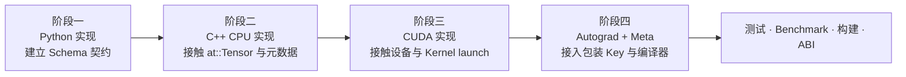
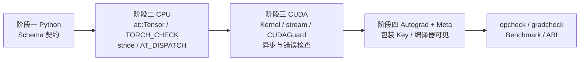

上一篇把算子系统拆成两个维度：开发者在构建时**定义 → 注册 → 实现**，用户在运行时**入口 → 分发 → 执行**，两者通过 Operator Table 交汇。那一篇站在使用者的角度观察原生算子 `add`。

这一篇换到开发者的位置：**自己写一个算子，把它接入 PyTorch 的算子系统**。

这是从“阅读框架”走向“扩展框架”的关键一步。AI-Infra 工作中大量的实际需求都落在这里：一个融合 Kernel、一个新硬件的后端适配、一个推理引擎的定制算子，最终都要经过同样的三步——定义 Schema、注册到 DispatchKey、提供实现。

本文用一个刻意简单的算子贯穿全文：

```text
scale_shift(x, alpha, beta) = alpha * x + beta
```

它简单到不会分散注意力，又足够涉及 Tensor 元数据、dtype、device、Autograd 和构建系统的全部问题。通过这个实际例子，我们可以了解到一个算子是怎么正确完成定义、注册与实现，并能通过 Autograd、Meta、测试和构建检验的完整过程。


## 一、总览：三步、两种接入方式、四个阶段

### 1. 自定义算子要做的三步

第五篇开发态的三步，对自定义算子完全适用：

| 步骤 | 原生算子怎么做 | 自定义算子怎么做 |
|---|---|---|
| 定义 | `native_functions.yaml` | `torch.library.define` / `TORCH_LIBRARY` |
| 注册 | `dispatch:` 字段，Codegen 生成注册代码 | `torch.library.impl` / `TORCH_LIBRARY_IMPL`，手写 |
| 实现 | `aten/src/ATen/native/` | 自己的 Python / C++ / CUDA 函数 |

原生算子有 Codegen 帮忙生成 Binding、注册和 Autograd 代码；自定义算子这些都要自己做，或使用 `torch.library` 提供的辅助 API。

### 2. 两种接入方式

| 方式 | 定义与注册在哪一侧 | 实现语言 | 适用场景 |
|---|---|---|---|
| Python 侧：`torch.library` | Python | Python，或通过扩展调用 C++/CUDA | 原型、胶水、把已有 C++ 函数包装成算子 |
| C++ 侧：`TORCH_LIBRARY` | C++ | C++ / CUDA | 独立的扩展库、多后端、不依赖 Python 的部署 |

两种方式填的是同一张 Operator Table。本文两种都会用到：阶段一用 Python 侧建立契约，后续阶段逐步下沉到 C++ 侧。

### 3. 四个阶段



每个阶段都回到“定义 / 注册 / 实现”三步，只是实现所在的层次逐步下沉。

### 4. 本文的章节安排

```text
二    阶段一：Python 实现——定义 Schema，注册 Python 实现
三    C++ 扩展的构建基础——进入 C++ 之前必须知道的事
四    阶段二：C++ CPU 实现——at::Tensor、元数据检查、dtype 分发
五    阶段三：CUDA 实现——Kernel、launch、stream、错误检查
六    阶段四：Autograd 与 Meta——接入包装 Key 与编译器
七    测试与 Benchmark
八    构建、ABI 与分发
九    Java 对照：JNI
十    小结
```


## 二、阶段一：Python 实现，建立契约

### 1. 先定义，再实现

第一步不是写计算，而是写 Schema：

```python
import torch

@torch.library.custom_op("myops::scale_shift", mutates_args=())
def scale_shift(x: torch.Tensor, alpha: float, beta: float) -> torch.Tensor:
    return alpha * x + beta
```

`torch.library.custom_op`（PyTorch 2.4+）同时完成了三件事：

```text
定义    从类型注解推导 Schema：
        myops::scale_shift(Tensor x, float alpha, float beta) -> Tensor
注册    把这个 Python 函数注册为所有后端 Key 的默认实现
实现    函数体就是实现
```

`mutates_args=()` 是 alias / mutability 声明：这个算子不修改任何输入。第五篇讲过，这条信息是 Autograd 版本检查和编译器安全重排的基础。

### 2. 与直接写 Python 函数的区别

直接写：

```python
def scale_shift_plain(x, alpha, beta):
    return alpha * x + beta
```

也能算出同样的数字。区别在于**它对算子系统不可见**：

| | 普通 Python 函数 | `custom_op` |
|---|---|---|
| Dispatcher 是否知道它 | 否，只看到内部的 `mul`、`add` | 是，作为一个整体算子 |
| `torch.compile` 如何处理 | 追踪进函数内部，看到两个子算子 | 视为一个不透明算子，需要 Meta/Fake 实现 |
| Profiler 中的表现 | 两个 Kernel | 一个算子节点（内部可能仍是两个 Kernel） |
| 能否为 CUDA 单独注册实现 | 不能 | 能 |
| 能否自定义反向 | 需要 `autograd.Function` | 通过 `register_autograd` |

阶段一的价值就在于：**先把边界画出来**，之后替换内部实现时，用户代码和 Schema 都不用变。

### 3. 显式定义与注册

`custom_op` 是便捷写法。展开成显式的定义和注册，能更清楚地看到两步：

```python
lib = torch.library.Library("myops", "DEF")
lib.define("scale_shift(Tensor x, float alpha, float beta) -> Tensor")

def scale_shift_impl(x, alpha, beta):
    return alpha * x + beta

lib.impl("scale_shift", scale_shift_impl, "CompositeExplicitAutograd")
```

这里注册到的 Key 是 `CompositeExplicitAutograd`：表示这个实现用其他算子组合而成，对所有后端都可用，但 Autograd 需要另外提供（第六章）。

### 4. 调用与验证

```python
x = torch.randn(4, 3)
y = torch.ops.myops.scale_shift(x, 2.0, 1.0)
torch.testing.assert_close(y, 2.0 * x + 1.0)
```

`torch.ops.myops.scale_shift` 是运行态的入口：它走的正是第五篇第六章的路径——进入 Dispatcher，查 Operator Table 中 `myops::scale_shift` 那一行。

阶段一结束时，我们有了：一条 Schema、一个所有后端可用的 Python 实现。接下来把实现下沉到 C++。


## 三、进入 C++ 之前：扩展的构建基础

### 1. C++ 扩展是什么

PyTorch C++ 扩展是一个用 PyTorch 的 C++ 库（ATen、c10、torch）编译出来的共享库（`.so` / `.pyd`），Python 通过 `import` 加载它，加载时执行其中的 `TORCH_LIBRARY` 注册代码，把实现填入 Operator Table。

```text
你的 .cpp / .cu
    ↓ 编译，链接 libtorch / libc10 / CUDA
共享库 .so
    ↓ Python import
执行 TORCH_LIBRARY_IMPL → 填 Operator Table
    ↓
torch.ops.myops.scale_shift 可用
```

### 2. 三种构建方式

| 方式 | 命令 / API | 适合 |
|---|---|---|
| JIT 编译 | `torch.utils.cpp_extension.load(...)` / `load_inline(...)` | 实验、教学、快速迭代 |
| setuptools | `setup.py` + `CppExtension` / `CUDAExtension` + `BuildExtension` | 发布为 pip 包 |
| CMake | 使用 `find_package(Torch)`，自行管理构建 | 大型项目、与其他 C++ 代码集成 |

本文用 JIT 编译演示，因为它把关注点留在算子本身：

```python
from torch.utils.cpp_extension import load

myops = load(
    name="myops",
    sources=["scale_shift.cpp"],
    extra_cflags=["-O2"],
    verbose=True,
)
```

第八章再讨论 setuptools 和 ABI 问题。

### 3. 两种暴露给 Python 的方式

C++ 函数暴露给 Python 有两条路，容易混淆：

| 方式 | 机制 | 结果 |
|---|---|---|
| `PYBIND11_MODULE` | pybind11 把 C++ 函数绑定为普通 Python 函数 | `myops.scale_shift(x, ...)` 是普通 Python 函数，**不经过 Dispatcher** |
| `TORCH_LIBRARY` | 注册为 PyTorch 算子 | `torch.ops.myops.scale_shift(x, ...)` 经过 Dispatcher，可按 Key 分发、可接 Autograd、可被 compile 识别 |

pybind11 适合暴露工具函数；**要成为算子，必须走 `TORCH_LIBRARY`**。本文只用后者。

### 4. 最小的 C++ 骨架

```cpp
// scale_shift.cpp
#include <torch/library.h>
#include <ATen/ATen.h>

at::Tensor scale_shift_cpu(const at::Tensor& x, double alpha, double beta);

TORCH_LIBRARY(myops, m) {
  m.def("scale_shift(Tensor x, float alpha, float beta) -> Tensor");   // 定义
}

TORCH_LIBRARY_IMPL(myops, CPU, m) {
  m.impl("scale_shift", scale_shift_cpu);                              // 注册到 CPU Key
}
```

`TORCH_LIBRARY` 对应定义，`TORCH_LIBRARY_IMPL` 对应注册；实现函数 `scale_shift_cpu` 是下一章的内容。

如果 Schema 已经在 Python 侧用 `lib.define` 定义过，C++ 侧应使用 `TORCH_LIBRARY_FRAGMENT(myops, m)` 追加实现，而不是重复 `TORCH_LIBRARY` 定义同一个命名空间。

Schema 字符串中的类型是 PyTorch Schema 语法：`float` 对应 C++ 的 `double`，`int` 对应 `int64_t`，`Tensor` 对应 `at::Tensor`。类型不匹配会在注册时报错。


## 四、阶段二：C++ CPU 实现

### 1. 实现函数的签名

```cpp
at::Tensor scale_shift_cpu(const at::Tensor& x, double alpha, double beta) {
  // ...
}
```

`at::Tensor` 就是第五篇提到的 ATen 核心 Tensor 类型，它是一个引用句柄，拷贝它不会拷贝数据。第二篇的 Tensor 模型——Storage、shape、stride、dtype、device——在这里全部以 C++ API 出现。

### 2. 第一件事：检查输入

在 C++ 里，错误的输入不会像 Python 那样抛出友好的异常，可能直接越界访问。所以实现的第一段永远是检查：

```cpp
TORCH_CHECK(x.device().is_cpu(), "scale_shift_cpu: expected CPU tensor, got ", x.device());
TORCH_CHECK(x.is_floating_point(), "scale_shift_cpu: expected floating dtype, got ", x.dtype());
```

`TORCH_CHECK` 失败时抛出 `c10::Error`，Python 侧会看到 `RuntimeError` 和这条消息。

### 3. 处理 stride：contiguous 还是不 contiguous

第二篇讨论过：Tensor 可能是非连续的。C++ 实现必须做出选择：

**选择 A：先 contiguous，再按一维遍历**

```cpp
auto x_contig = x.contiguous();
auto out = at::empty_like(x_contig);
```

简单，但非连续输入会产生一次拷贝。

**选择 B：使用 TensorIterator，支持任意 stride**

```cpp
#include <ATen/TensorIterator.h>
#include <ATen/native/cpu/Loops.h>

auto out = at::empty_like(x);
auto iter = at::TensorIteratorConfig()
    .add_output(out)
    .add_input(x)
    .build();
```

TensorIterator 会处理广播、stride 和并行划分，Kernel 只写单元素计算。这正是第五篇讲的实现模式之一。

本文选 B，因为它展示了原生算子的写法；对于自定义算子的早期版本，选 A 也完全合理——先正确，再优化。

### 4. 处理 dtype：`AT_DISPATCH`

`at::Tensor` 的 dtype 是运行时信息，而 C++ 模板需要编译期类型。PyTorch 提供 `AT_DISPATCH_*` 宏做这个桥接：

```cpp
AT_DISPATCH_FLOATING_TYPES(x.scalar_type(), "scale_shift_cpu", [&] {
  // 在这个 lambda 里，scalar_t 是具体类型：float 或 double
  at::native::cpu_kernel(iter, [alpha, beta](scalar_t v) -> scalar_t {
    return static_cast<scalar_t>(alpha) * v + static_cast<scalar_t>(beta);
  });
});
```

宏会根据 `x.scalar_type()` 在运行时选择分支，每个分支实例化一份模板。这是“运行时 dtype → 编译期类型”的标准做法；不用它，就得自己写 `switch`。

`AT_DISPATCH_FLOATING_TYPES` 覆盖 `float` 和 `double`；需要 `half`/`bfloat16` 时用 `AT_DISPATCH_FLOATING_TYPES_AND2(at::kHalf, at::kBFloat16, ...)`。

### 5. 完整的 CPU 实现

```cpp
#include <ATen/ATen.h>
#include <ATen/TensorIterator.h>
#include <ATen/native/cpu/Loops.h>
#include <torch/library.h>

at::Tensor scale_shift_cpu(const at::Tensor& x, double alpha, double beta) {
  TORCH_CHECK(x.device().is_cpu(), "expected CPU tensor");
  TORCH_CHECK(x.is_floating_point(), "expected floating dtype");

  auto out = at::empty_like(x);
  auto iter = at::TensorIteratorConfig()
      .add_output(out)
      .add_input(x)
      .build();

  AT_DISPATCH_FLOATING_TYPES(x.scalar_type(), "scale_shift_cpu", [&] {
    at::native::cpu_kernel(iter, [alpha, beta](scalar_t v) -> scalar_t {
      return static_cast<scalar_t>(alpha) * v + static_cast<scalar_t>(beta);
    });
  });
  return out;
}

TORCH_LIBRARY(myops, m) {
  m.def("scale_shift(Tensor x, float alpha, float beta) -> Tensor");
}

TORCH_LIBRARY_IMPL(myops, CPU, m) {
  m.impl("scale_shift", scale_shift_cpu);
}
```

三步在同一个文件里清晰可见：`m.def` 定义，`m.impl` 注册，`scale_shift_cpu` 实现。

### 6. `data_ptr` 的边界

如果不用 TensorIterator，而是直接访问内存：

```cpp
auto x_contig = x.contiguous();
const float* src = x_contig.data_ptr<float>();
float* dst = out.data_ptr<float>();
for (int64_t i = 0; i < x_contig.numel(); ++i) {
  dst[i] = alpha * src[i] + beta;
}
```

需要注意：`data_ptr<T>()` 要求 dtype 与 `T` 匹配，否则抛错；它返回的是 `storage_offset` 之后的起始地址；对非连续 Tensor 直接按一维遍历会得到错误结果——这就是为什么前面先调用了 `contiguous()`。

### 7. Python 侧验证

```python
myops = load(name="myops", sources=["scale_shift.cpp"])

x = torch.randn(4, 3)
y = torch.ops.myops.scale_shift(x, 2.0, 1.0)
torch.testing.assert_close(y, 2.0 * x + 1.0)

xt = x.t()                                    # 非连续
yt = torch.ops.myops.scale_shift(xt, 2.0, 1.0)
torch.testing.assert_close(yt, 2.0 * xt + 1.0)
```

如果此时传入 CUDA Tensor：

```text
NotImplementedError: Could not run 'myops::scale_shift' with arguments from the 'CUDA' backend.
```

这是第五篇第三章讲的“没有注册会怎样”——Operator Table 中 CUDA 槽位为空。下一阶段填它。


## 五、阶段三：CUDA 实现

### 1. CUDA 实现要多做的事

相比 CPU，CUDA 实现要额外处理：

```text
Kernel 的 grid / block 配置
在正确的 CUDA stream 上 launch
设备指针而不是主机指针
launch 后的错误检查
dtype 分发同样需要
```

### 2. Kernel

```cpp
// scale_shift_cuda.cu
#include <ATen/ATen.h>
#include <ATen/cuda/CUDAContext.h>
#include <c10/cuda/CUDAGuard.h>
#include <torch/library.h>

template <typename scalar_t>
__global__ void scale_shift_kernel(
    const scalar_t* __restrict__ x,
    scalar_t* __restrict__ out,
    int64_t n,
    scalar_t alpha,
    scalar_t beta) {
  int64_t i = blockIdx.x * (int64_t)blockDim.x + threadIdx.x;
  if (i < n) {
    out[i] = alpha * x[i] + beta;
  }
}
```

Kernel 本身只表达“对第 `i` 个元素做什么”。它假设输入是连续的一维数组——这个假设由调用方保证。

### 3. Launch 函数

```cpp
at::Tensor scale_shift_cuda(const at::Tensor& x, double alpha, double beta) {
  TORCH_CHECK(x.is_cuda(), "expected CUDA tensor");
  TORCH_CHECK(x.is_floating_point(), "expected floating dtype");

  const c10::cuda::CUDAGuard guard(x.device());   // 切换到 x 所在的 GPU
  auto x_contig = x.contiguous();
  auto out = at::empty_like(x_contig);
  const int64_t n = x_contig.numel();
  if (n == 0) return out;                          // 空 Tensor 直接返回

  const int threads = 256;
  const int blocks = static_cast<int>((n + threads - 1) / threads);
  auto stream = at::cuda::getCurrentCUDAStream();

  AT_DISPATCH_FLOATING_TYPES_AND2(at::kHalf, at::kBFloat16,
      x.scalar_type(), "scale_shift_cuda", [&] {
    scale_shift_kernel<scalar_t><<<blocks, threads, 0, stream>>>(
        x_contig.data_ptr<scalar_t>(),
        out.data_ptr<scalar_t>(),
        n,
        static_cast<scalar_t>(alpha),
        static_cast<scalar_t>(beta));
  });
  C10_CUDA_KERNEL_LAUNCH_CHECK();
  return out;
}

TORCH_LIBRARY_IMPL(myops, CUDA, m) {
  m.impl("scale_shift", scale_shift_cuda);
}
```

几个关键点：

| 代码 | 为什么 |
|---|---|
| `CUDAGuard` | 多卡时确保后续分配和 launch 发生在输入所在的设备 |
| `getCurrentCUDAStream()` | 在 PyTorch 当前 stream 上 launch，才能与其他算子保持顺序；用默认 stream 会破坏 PyTorch 的异步语义 |
| `n == 0` 提前返回 | `blocks` 为 0 时 launch 会报错 |
| `C10_CUDA_KERNEL_LAUNCH_CHECK()` | 捕获 launch 配置错误；注意它不等待 Kernel 完成，运行时错误会在之后某次同步时暴露 |
| `contiguous()` | 这个简单 Kernel 假设一维连续；真实项目中可以改用 CUDA 版 TensorIterator（`gpu_kernel`）支持任意 stride |

### 4. 异步语义

CUDA Kernel launch 是异步的：函数返回时 Kernel 可能还没开始执行。这与第八篇性能分析直接相关——不能在 launch 函数返回后立刻用 CPU 计时器认为计算已完成。

如果 Kernel 内部有越界访问，错误通常在之后某个同步点（`.cpu()`、`.item()`、`torch.cuda.synchronize()`）才报出来，并且报错位置与真正出错的 Kernel 无关。调试时可设置 `CUDA_LAUNCH_BLOCKING=1` 强制同步，让错误在原地暴露。

### 5. 编译

```python
myops = load(
    name="myops",
    sources=["scale_shift.cpp", "scale_shift_cuda.cu"],
    verbose=True,
)
```

`load` 会根据扩展名分别调用 C++ 编译器和 `nvcc`。注意 `TORCH_LIBRARY(myops, m)` 只能出现一次（在 `.cpp` 中）；`.cu` 文件里只放 `TORCH_LIBRARY_IMPL`。

现在 Operator Table 中 `myops::scale_shift` 这一行有了 CPU 和 CUDA 两个槽位。同一个 Python 调用，输入在哪个设备，就走哪条实现——这正是第五篇运行态分发的全部意义。


## 六、阶段四：Autograd 与 Meta

### 1. 现在还缺什么

```python
x = torch.randn(4, 3, requires_grad=True)
y = torch.ops.myops.scale_shift(x, 2.0, 1.0)
y.sum().backward()
```

这段代码会失败或给出错误结果——因为没有人告诉 Autograd 这个算子的反向规则。第三篇讲过 Autograd 需要每个算子提供 backward；第五篇讲过 Autograd 是一个包装 Key。现在要把它填上。

同样，`torch.compile` 需要在不运行真实 Kernel 的情况下推断输出 shape，这需要 Meta / Fake 实现。

### 2. 注册 Autograd：Python 侧

`torch.library` 提供了简洁的方式：

```python
def _backward(ctx, grad_out):
    alpha = ctx.alpha
    grad_x = grad_out * alpha        # d(alpha*x+beta)/dx = alpha
    return grad_x, None, None        # 对应 (x, alpha, beta)；非 Tensor 参数返回 None

def _setup_context(ctx, inputs, output):
    x, alpha, beta = inputs
    ctx.alpha = alpha                # 只保存标量，不保存 Tensor

torch.library.register_autograd(
    "myops::scale_shift", _backward, setup_context=_setup_context
)
```

它做的事等价于第三篇的 `autograd.Function`，但注册到了 Operator Table 的 Autograd Key，因此对 `torch.ops.myops.scale_shift` 的所有调用自动生效，不需要用户改用某个 `Function.apply`。

反向公式本身很简单，但注意 `_backward` 返回值的个数和位置必须与 Schema 的参数一一对应。

### 3. 注册 Autograd：C++ 侧

如果扩展需要独立于 Python 使用（例如在 C++ 推理服务中），Autograd 也可以在 C++ 注册：

```cpp
#include <torch/autograd.h>

class ScaleShiftFunction : public torch::autograd::Function<ScaleShiftFunction> {
 public:
  static at::Tensor forward(torch::autograd::AutogradContext* ctx,
                            const at::Tensor& x, double alpha, double beta) {
    ctx->saved_data["alpha"] = alpha;
    at::AutoDispatchBelowADInplaceOrView guard;   // 去掉 Autograd Key，再次分发到后端
    return torch::ops::myops::scale_shift::call(x, alpha, beta);
  }
  static torch::autograd::tensor_list backward(torch::autograd::AutogradContext* ctx,
                                               torch::autograd::tensor_list grads) {
    double alpha = ctx->saved_data["alpha"].toDouble();
    return {grads[0] * alpha, at::Tensor(), at::Tensor()};
  }
};

at::Tensor scale_shift_autograd(const at::Tensor& x, double alpha, double beta) {
  return ScaleShiftFunction::apply(x, alpha, beta);
}

TORCH_LIBRARY_IMPL(myops, Autograd, m) {
  m.impl("scale_shift", scale_shift_autograd);
}
```

`AutoDispatchBelowADInplaceOrView` 这一行就是第五篇第七章讲的“包装 Key 执行后去掉自身 Key 再次分发”：forward 内部再次调用算子时，不能再进入 Autograd Key，否则会无限递归。

### 4. 注册 Meta / Fake 实现

```python
@torch.library.register_fake("myops::scale_shift")
def _fake(x, alpha, beta):
    return torch.empty_like(x)
```

它只描述输出的 shape、dtype、device 与输入相同，不做计算。有了它：

- `torch.compile` 可以把算子纳入图捕获；
- Meta Tensor 上可以调用这个算子做 shape 推断；
- `torch.library.opcheck` 能检查 Fake 实现与真实实现是否一致。

对 C++ 侧，等价做法是向 `Meta` Key 注册一个只调用 `at::empty_like` 的函数。

### 5. 完成后的 Operator Table

| DispatchKey | 实现 | 阶段 |
|---|---|---|
| CPU | `scale_shift_cpu` | 二 |
| CUDA | `scale_shift_cuda` | 三 |
| Autograd | `register_autograd` 生成的包装 / `scale_shift_autograd` | 四 |
| Meta（Fake） | `_fake` | 四 |

这一行现在与原生算子 `add` 的结构完全相同。用户调用时，分发过程也完全相同。


## 七、测试与 Benchmark

### 1. 一个自定义算子至少要测什么

```text
正确性
├── 与参考实现（alpha * x + beta）数值一致
├── 多种 shape：标量、一维、高维、空 Tensor
├── 多种 dtype：float32 / float64 / float16 / bfloat16
├── CPU 与 CUDA 结果一致
├── contiguous 与 non-contiguous 输入
├── 非法输入：整数 dtype、错误设备
└── 极端数值：inf、nan、极大 alpha

Autograd
├── gradcheck（一阶）
├── gradgradcheck（二阶，如果支持）
└── 与参考实现的梯度一致

系统集成
├── Fake 实现与真实实现的 shape / dtype 一致
├── torch.compile 下能被捕获且结果正确
└── 多 GPU 下在正确设备上执行
```

### 2. `torch.library.opcheck`

PyTorch 提供了一站式检查工具：

```python
from torch.library import opcheck

for device in ["cpu", "cuda"]:
    for dtype in [torch.float32, torch.float64]:
        x = torch.randn(4, 3, device=device, dtype=dtype, requires_grad=True)
        opcheck(torch.ops.myops.scale_shift, (x, 2.0, 1.0))
```

它会检查 Schema 与实现是否一致、Fake 实现是否正确、Autograd 注册是否合法、`mutates_args` 声明是否与实际行为匹配。这些正是自定义算子最容易出错、又最难靠肉眼发现的地方。

### 3. `gradcheck`

```python
from torch.autograd import gradcheck

x = torch.randn(4, 3, dtype=torch.float64, requires_grad=True)
assert gradcheck(lambda t: torch.ops.myops.scale_shift(t, 2.0, 1.0), (x,))
```

`gradcheck` 用有限差分验证反向公式，必须使用 `float64`，否则数值误差会导致误报。

### 4. Benchmark

```python
import torch.utils.benchmark as benchmark

x = torch.randn(1 << 20, device="cuda")
t_custom = benchmark.Timer(
    stmt="torch.ops.myops.scale_shift(x, 2.0, 1.0)",
    globals={"x": x},
)
t_native = benchmark.Timer(
    stmt="2.0 * x + 1.0",
    globals={"x": x},
)
print(t_custom.timeit(100))
print(t_native.timeit(100))
```

`benchmark.Timer` 会自动处理 CUDA 同步和预热。这里的对照有意义：原生写法是两个 Kernel（`mul`、`add`），自定义算子是一个融合 Kernel。是否真的更快，要看数据——对于这个例子，收益主要在减少一次内存读写和一次 launch；第八篇会系统讨论如何解读这类数字。

如果自定义算子没有比原生组合更快，那么它的价值只剩“可被 compile 视为整体”和“可自定义反向”这两点，需要重新评估是否值得维护一份 C++/CUDA 代码。


## 八、构建、ABI 与分发

### 1. 从 JIT `load` 到 `setup.py`

发布给他人使用时，改为 setuptools：

```python
# setup.py
from setuptools import setup
from torch.utils.cpp_extension import CUDAExtension, BuildExtension

setup(
    name="myops",
    ext_modules=[
        CUDAExtension(
            name="myops._C",
            sources=["scale_shift.cpp", "scale_shift_cuda.cu"],
        ),
    ],
    cmdclass={"build_ext": BuildExtension},
)
```

配合一个 Python 包在 `import` 时加载 `_C` 并完成 `register_autograd` / `register_fake`。

### 2. ABI：为什么“在我机器上能跑”经常不成立

C++ 扩展与 PyTorch 之间是二进制接口。以下任何一项不一致，都可能在加载时报符号错误，或在运行时静默崩溃：

| 因素 | 说明 |
|---|---|
| PyTorch 版本 | ATen/c10 的 C++ API 和内部结构在小版本间也可能变化；扩展通常要针对特定版本编译 |
| CUDA 版本 | 扩展编译用的 CUDA Toolkit 要与 PyTorch wheel 对应的 CUDA 版本一致 |
| C++ ABI | `_GLIBCXX_USE_CXX11_ABI` 必须与 PyTorch 编译时一致，`torch.utils.cpp_extension` 会自动读取并传递 |
| 编译器 | GCC 主版本差异可能导致 ABI 不兼容 |
| GPU 架构 | `nvcc` 的 `-gencode` 要覆盖目标 GPU 的 compute capability，否则运行时找不到可用的 Kernel 镜像 |

这些问题的根源与 Python 系列第七篇讨论的 `torch==2.x+cu12x` 本地版本标识是同一个：**PyTorch 的二进制制品绑定了平台、CUDA 和 ABI**，扩展也随之绑定。

### 3. 分发策略

| 策略 | 做法 | 代价 |
|---|---|---|
| 源码分发，用户本地编译 | 发布 sdist，`pip install` 时编译 | 用户需要编译器和 CUDA Toolkit，安装慢 |
| 预编译 wheel | 为每个 PyTorch × CUDA × Python 组合构建 wheel | 组合矩阵大，CI 成本高 |
| 随基础镜像交付 | 在 Docker 镜像中预编译 | 最可控，但只适用于容器化部署 |

对内部 AI-Infra 项目，第三种最常见；对开源库，通常前两种并行。

### 4. 运行时检查

在扩展的 Python 包初始化时做一次版本检查，能把模糊的符号错误变成明确的提示：

```python
import torch
_EXPECTED = "2.4"
if not torch.__version__.startswith(_EXPECTED):
    raise ImportError(
        f"myops was built against torch {_EXPECTED}, got {torch.__version__}"
    )
```


## 九、Java 工程师如何理解 C++ 扩展

### 1. 与 JNI 的相似之处

JNI 和 PyTorch C++ 扩展都在做同一件事：让高层语言调用本地代码。

```text
JNI              Java 声明 native 方法 → C 实现 → System.loadLibrary
PyTorch 扩展     Schema 定义算子 → C++/CUDA 实现 → import 时加载 .so
```

版本绑定、ABI 兼容、崩溃不可捕获，这些 JNI 的痛点在 C++ 扩展里同样存在。

### 2. 关键区别

| 维度 | JNI | PyTorch C++ 扩展 |
|---|---|---|
| 调用是否经过分发 | 直接调用 | 经过 Dispatcher，可按设备/Autograd 分发 |
| 参数 | 任意 Java 对象 | `at::Tensor` 等带元数据的运行时对象 |
| 执行位置 | CPU | CPU 或 GPU，且 GPU 调用是异步的 |
| 自动微分 | 无此概念 | 需要注册反向规则 |
| 与编译器的关系 | JIT 不感知 native 方法内部 | `torch.compile` 需要 Fake 实现才能处理 |

最大的差异是**分发**：JNI 是“Java 调 C”，C++ 扩展是“把 C++ 函数注册为算子的一个后端实现”。前者是函数调用，后者是往注册表填一个槽位。

### 3. `pybind11` vs `TORCH_LIBRARY` 的类比

`PYBIND11_MODULE` 更像 JNI：直接暴露函数。`TORCH_LIBRARY` 更像实现一个框架的 SPI 接口：你提供的是某个契约（Schema）在某个 Key 下的实现，框架决定何时调用它。


## 十、本文小结

### 1. 自定义算子 = 原生算子的三步，手动完成

```text
定义    torch.library.define / TORCH_LIBRARY     ← 对应 native_functions.yaml
注册    torch.library.impl / TORCH_LIBRARY_IMPL  ← 对应 dispatch 字段 + Codegen 注册代码
实现    Python / C++ / CUDA 函数                  ← 对应 aten/src/ATen/native/
Autograd  register_autograd / Autograd Key       ← 对应 derivatives.yaml + Codegen
Meta      register_fake / Meta Key               ← 对应 Structured Kernel 的 meta 函数
```

### 2. 四个阶段的递进



用户代码 `torch.ops.myops.scale_shift(x, 2.0, 1.0)` 在四个阶段中一行都没有改变；变化的只是 Operator Table 里被填上的槽位。

### 3. 实现层必须处理的四件事

```text
device   TORCH_CHECK 设备；CUDA 下用 CUDAGuard 与当前 stream
dtype    AT_DISPATCH 把运行时 dtype 桥接到编译期模板
stride   contiguous() 或 TensorIterator，二选一，不能假装不存在
生命周期  at::Tensor 是句柄；data_ptr 只在 Tensor 存活期间有效
```

### 4. 一个算子完成的标准

```text
定义了 Schema 并声明了 mutability
注册了目标后端的实现
注册了 Autograd
注册了 Fake / Meta
opcheck 与 gradcheck 通过
Benchmark 证明它比原生组合有价值
构建与 ABI 在目标环境可复现
```

下一篇进入编译器：

> **当算子已经是 PyTorch 眼中的一个整体节点后，`torch.compile` 如何捕获包含它的 Python 程序，并把多个算子融合成更少的 Kernel？**


## 下一篇

[编译执行与图优化](/pytorch-compilation-and-graph-optimization.html)
