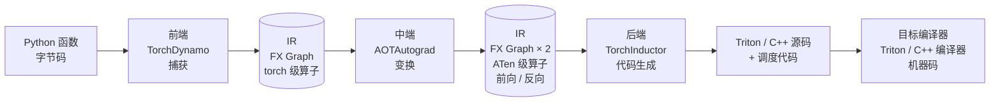
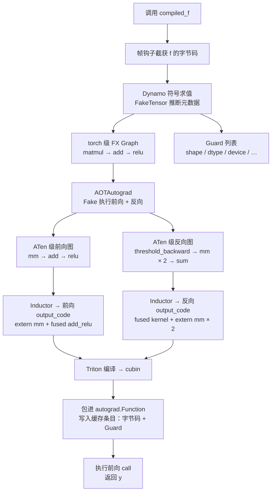
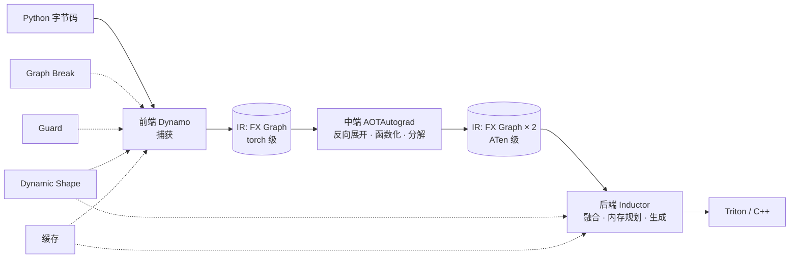

前两篇讨论的是**单个算子**：第五篇解释一次 `torch.add` 调用如何经过入口、分发、执行；第六篇把一个自定义算子接入了同样的路径。无论原生还是自定义，每个算子都是独立走完这条路的。

这一篇把视角从单个算子拉远到**一段程序**。当我们写下：

```python
def f(x, weight, bias):
    return torch.relu(x @ weight + bias)

compiled_f = torch.compile(f)
```

`torch.compile` 到底做了什么？它不是把 Python 翻译成 CUDA——这个说法既不准确，也会让人对它的能力和边界产生错误预期。更准确的描述是：**它尝试从 Python 程序中捕获可分析的 Tensor 计算部分，把它表示成图，经过若干次变换后生成更少、更大的 Kernel，并用一组运行时检查决定这份编译结果何时可以复用。**

本文用上面这个刻意简单的函数贯穿全文。三个算子、两个中间结果、一个前向一个反向，足以让编译器的每一段都有事可做，又不会被模型细节淹没。

> **`torch.compile` 解决的不是“让 Python 变快”，而是“在保留 Eager 编程模型的前提下，把一段 Tensor 程序的执行方式从逐算子分发切换到整图优化”。**

本文示例输出基于 PyTorch 2.x 删减整理，用于说明结构；具体节点名、Kernel 名和日志格式随小版本变化，属于大纲中约定的“版本敏感的实现”，阅读时以对应版本为准。


## 一、总览：一个编译器、一种中间表示、四个横切机制

### 1. Eager 的代价

第五篇建立的模型是：每个算子独立经过 **入口 → 分发 → 执行**。对 `f` 而言，Eager 模式下一次前向是：

```text
x @ weight       → Python 调用 → Dispatcher → matmul Kernel → 中间 Tensor t1
t1 + bias        → Python 调用 → Dispatcher → add Kernel    → 中间 Tensor t2
torch.relu(t2)   → Python 调用 → Dispatcher → relu Kernel   → 输出
```

三次 Python 到 C++ 的往返、三次分发、三次 Kernel launch、两个中间 Tensor 的分配与读写。`add` 和 `relu` 都是逐元素操作，各自把 `t1`、`t2` 从显存读一遍再写一遍——而它们本可以在一个 Kernel 里对每个元素连续完成。

Eager 无法做这种优化，原因是结构性的：**Dispatcher 每次只看到一个算子**。它执行 `add` 时不知道下一个是 `relu`；执行 `relu` 时 `add` 已经完成。要跨算子优化，必须有一个地方能同时看到多个算子——这就是**图**。

### 2. `torch.compile` 是一个编译器：前端、中端、后端

有了图，剩下的问题就是经典编译器的问题。教科书式的编译器分三段：

```text
前端   源语言 → 中间表示（IR）      看懂程序，翻译成统一的内部表示
中端   IR → IR                     与目标无关的变换：降低抽象层级、优化、规范化
后端   IR → 目标代码                针对具体硬件生成代码
```

Java 工程师熟悉的 `javac` 是一个前端（Java 源码 → 字节码），HotSpot 的 C2 是中端加后端（字节码 → 优化后的机器码）。`torch.compile` 的默认路径完全对得上这三段：



| 阶段 | 组件 | 输入 | 输出 | 回答的问题 |
|---|---|---|---|---|
| 前端 | TorchDynamo | Python 字节码 | FX Graph（torch 级）+ Guard | 程序里哪部分是可编译的 Tensor 计算？ |
| 中端 | AOTAutograd | torch 级 FX Graph | ATen 级前向图 + 反向图 | 反向怎么提前得到？抽象层级怎么降低？副作用怎么消除？ |
| 后端 | TorchInductor | ATen 级 FX Graph | Triton / C++ 源码 | 哪些算子合并成一个 Kernel？内存怎么分配？ |
| 目标编译器 | Triton 编译器 / C++ 编译器 | 源码 | 机器码 | 真正的 GPU / CPU 指令 |

目标编译器不属于 PyTorch，本文只在需要时提及。

三个阶段中，**中端最容易被忽视**，因为它不接触 Python 也不接触硬件。但它是唯一改变图的语义内容的阶段：进去一张前向图，出来前向加反向两张图；in-place 操作被改写成纯函数；`torch.*` 级的算子被降到 `aten::` 级并进一步分解。没有这一段，每个后端都得自己处理 Autograd 和副作用；有了它，后端只需面对一张纯函数式的 ATen 级图。

### 3. IR：FX Graph 贯穿三段

三个 PyTorch 组件之间传递的是**同一种数据结构**：`torch.fx.Graph`。前端产出它，中端消费并再次产出它，后端消费它。它是三个组件唯一共享的契约——就像第五篇里 Operator Table 是开发态与运行态的交汇点。

每过一段，IR 的**结构不变，内容的抽象层级下降**。理解 FX Graph 是理解整条流水线的前提，所以第二章先讲它，之后再依次进入前端、中端、后端。

### 4. “backend”一词的两种含义

进入正文前必须澄清一个术语冲突。`torch.compile` 有一个 `backend` 参数：

```python
torch.compile(f)                         # 等价于 backend="inductor"
torch.compile(f, backend="eager")
torch.compile(f, backend="aot_eager")
```

这里的 “backend” 指的**不是**编译器术语里的后端，而是“**Dynamo 之后的一切**”——前端捕获完图，把图交给谁。三个内置选项对应把流水线截断在不同位置：

| `backend=` | Dynamo 之后做什么 | 对应编译器阶段 | 用途 |
|---|---|---|---|
| `"eager"` | 什么都不做，把捕获的图原样逐算子执行 | 只有前端 | 排查前端问题：图捕获得对不对、哪里断了 |
| `"aot_eager"` | 跑 AOTAutograd，得到前后向图后逐算子执行 | 前端 + 中端 | 排查中端问题：反向图、函数化是否正确 |
| `"inductor"`（默认） | 跑 AOTAutograd，再交给 Inductor 生成代码 | 前端 + 中端 + 后端 | 正常使用 |

因此 AOTAutograd 在 PyTorch 的代码组织里被算在 “backend” 一侧，但在编译器结构里它是中端。本文用**前端 / 中端 / 后端**指编译器阶段，用带引号或代码格式的 `backend` 指 `torch.compile` 的参数。

### 5. 横切机制：边界与复用

三段式回答“编译一次做什么”。但还有一组问题不属于任何一段：

```text
编译到哪里停止？                     → Graph Break
编译结果在什么条件下有效？            → Guard
输入 shape 变了怎么办？              → Dynamic Shape
编译结果放在哪、下次怎么复用？        → 编译缓存
```

这四个机制决定的是**编译器何时运行、运行多少次、结果能否重用**。它们贯穿整个编译栈，不是某一段的局部细节。第六章统一讨论。

### 6. 另一个双重身份的名字：FX

“FX”在 PyTorch 文档里指两件相关但不同的事：

| 含义 | 出现时间 | 是什么 |
|---|---|---|
| `torch.fx` 工具包 | 1.8，2021 年 | 一个独立的 Python 到 Python 的图变换工具：`symbolic_trace` 追踪、`Graph` 表示、`GraphModule` 执行 |
| FX Graph 作为 IR | 2.0 编译栈 | 编译栈内部各组件之间传递的中间表示，**数据结构**来自 `torch.fx`，但**追踪器**不是 `symbolic_trace` 而是 Dynamo |

混淆它们会导致一个常见误解：“`torch.compile` 就是先 `symbolic_trace` 再优化”。不是。`symbolic_trace` 无法处理依赖 Tensor 的 Python 控制流，Dynamo 正是为了解决这个问题才在字节码层重新实现了捕获。第二章讲数据结构时会用 `symbolic_trace` 做演示（因为它最简单），第三章用一个带分支的例子展示两者的差别。

### 7. 本文的章节安排

```text
二        IR：FX Graph——所有组件共享的数据结构
三 ~ 五   前端 Dynamo 捕获 → 中端 AOTAutograd 变换 → 后端 Inductor 代码生成
六        横切机制：Graph Break / Guard / Dynamic Shape / 编译缓存
七        串起来：f 的第一次、第二次、第三次调用
八        Java 对照
九        小结
```


## 二、IR：FX Graph

### 1. Graph、Node、GraphModule

`torch.fx` 用三个类表示一段 Tensor 程序：

| 类 | 角色 |
|---|---|
| `Graph` | 节点的有序列表，拓扑序即执行序 |
| `Node` | 一次操作：做什么（`op` + `target`）、输入是什么（`args` / `kwargs`）、附加信息（`meta`） |
| `GraphModule` | 一个 `nn.Module`，持有一个 `Graph`，并把它生成为可执行的 Python `forward` |

`Node.op` 只有六种：

```text
placeholder     函数输入
get_attr        读取 Module 的参数或 Buffer
call_function   调用一个自由函数（torch.relu、operator.add、aten.mm）
call_method     调用 Tensor 方法（x.view）
call_module     调用子 Module（self.linear）
output          函数返回值
```

这个设计刻意极简：FX 只规定“程序是一串对 Tensor 的操作”，不规定操作是什么。这一点在后面很重要。

### 2. 用 `symbolic_trace` 看一眼

用独立工具 `torch.fx.symbolic_trace` 追踪 `f`：

```python
import torch
import torch.fx

def f(x, weight, bias):
    return torch.relu(x @ weight + bias)

gm = torch.fx.symbolic_trace(f)
print(gm.graph)
```

```text
graph():
    %x : [num_users=1] = placeholder[target=x]
    %weight : [num_users=1] = placeholder[target=weight]
    %bias : [num_users=1] = placeholder[target=bias]
    %matmul : [num_users=1] = call_function[target=operator.matmul](args = (%x, %weight), kwargs = {})
    %add : [num_users=1] = call_function[target=operator.add](args = (%matmul, %bias), kwargs = {})
    %relu : [num_users=1] = call_function[target=torch.relu](args = (%add,), kwargs = {})
    return relu
```

`gm.code` 是这张图生成回来的 Python：

```python
def forward(self, x, weight, bias):
    matmul = x @ weight;  x = weight = None
    add = matmul + bias;  matmul = bias = None
    relu = torch.relu(add);  add = None
    return relu
```

`symbolic_trace` 的原理是把输入替换成 `Proxy` 对象，运行一遍函数，`Proxy` 每被操作一次就往 `Graph` 里追加一个 `Node`。它不执行任何 Tensor 计算。

### 3. Graph Rewrite：图是可以改写的

有了显式的图，就可以在执行前改写它。一个最小的 pass：把所有 `torch.relu` 替换为 `torch.nn.functional.gelu`：

```python
for node in gm.graph.nodes:
    if node.op == "call_function" and node.target is torch.relu:
        node.target = torch.nn.functional.gelu
gm.graph.lint()      # 检查图的结构完整性
gm.recompile()       # 重新生成 forward 的 Python 代码
```

编译栈内部大量工作就是这类 pass：算子分解、死代码消除、常量折叠、模式匹配融合。它们的共同形态是**遍历节点、匹配模式、替换子图**。

### 4. 一种结构，多套词汇

`call_function` 的 `target` 可以是任何可调用对象。这意味着同一个 `Graph` 数据结构可以承载不同抽象层级的算子：

| 词汇层级 | 节点 `target` 例子 | 谁产出 |
|---|---|---|
| torch 级 | `torch.relu`、`operator.add`、`torch.nn.functional.linear` | `symbolic_trace`、Dynamo |
| ATen 级 | `torch.ops.aten.relu.default`、`torch.ops.aten.mm.default` | AOTAutograd |
| Core ATen / prims | ATen 的一个较小子集，或更原始的 `prims.*` | 分解（decomposition）后 |

编译器每过一段，图的**结构不变，词汇下降**：从用户写的 Python API，降到第五篇讨论的 `aten::` Schema 层，再分解到更小的核心算子集。后端只需支持核心集就能覆盖所有上层 API——这是 Composite 算子思想在编译器里的延续。

### 5. FX 不是什么

- **不是执行引擎**。`GraphModule.forward` 只是普通 Python 代码，运行时每个节点仍然逐个走 Eager 的分发路径。FX 只是把程序变成了可分析、可改写的数据。
- **不是编译器**。它不做任何优化。优化是 Inductor 的工作。
- **不是唯一的追踪器**。`symbolic_trace` 是它自带的追踪器，但编译栈用 Dynamo。

现在进入编译器的前端：谁来生产这张图。


## 三、前端：TorchDynamo 捕获

### 1. 为什么 `symbolic_trace` 不够

`Proxy` 只能记录对它自身的操作，它不知道自己代表的 Tensor 有什么值、什么 shape。一旦 Python 需要从它身上得到一个具体答案，追踪就中断了：

```python
def g(x):
    if x.shape[0] > 64:   # x.shape[0] 也是 Proxy，bool(Proxy) → TraceError
        return x * 2
    return x - 1
```

无论分支条件依赖的是 Tensor 的**值**（`x.sum() > 0`）还是 **shape**（`x.shape[0] > 64`），`symbolic_trace` 都会报同一个错。而真实模型里到处都是这类代码：根据序列长度选择分支、根据配置决定是否走某一层、在循环中依赖 Tensor 形状。此外 `symbolic_trace` 是全有或全无的——遇到无法追踪的代码只能报错，不能“把能编译的部分编译，剩下的保持 Eager”。

Dynamo 的设计目标正好相反：**尽最大努力捕获，捕获不了的地方交还 Python**。要做到这一点，它必须工作在比 Python 函数调用更底层的位置。

### 2. 工作位置：字节码

Dynamo 通过 CPython 的帧求值钩子（PEP 523）介入：在解释器执行一个函数帧之前，先拿到它的字节码。然后它做的不是运行，而是**符号化地求值**这段字节码：

```text
维护一个模拟的 Python 栈
逐条解释字节码指令
    遇到 Tensor 操作     → 用 FakeTensor 推断输出元数据，往 FX Graph 追加节点
    遇到 Python 值操作   → 直接在模拟栈上计算（常量、列表、属性访问……）
    遇到依赖 Tensor 值的分支 → 无法确定走哪条 → 停止捕获（第六章）
    遇到无法分析的调用   → 停止捕获（第六章）
```

FakeTensor 是第五篇 Meta Tensor 的扩展：只有 shape、stride、dtype 和一个“假装的”device，不持有数据。Dynamo 用它跑一遍程序，得到每个中间结果的元数据，但不做任何真实计算。这也是第六篇强调自定义算子必须注册 Fake 实现的原因：没有它，Dynamo 走到这个算子就无法继续推断。

### 3. 产出三样东西

一次成功的捕获产出：

```text
① FX Graph        torch 级的 Tensor 计算图
② Guard 列表      捕获过程中依赖的所有假设（第六章）
③ 改写的字节码    原帧的替代品：调用编译后的图，加上无法捕获部分的原始 Python
```

第三项常被忽略，但它是 Dynamo 与其他方案的根本区别：它**修改的是 Python 函数的执行方式**，而不是要求用户把模型导出成另一种格式。原函数仍然是 Python 函数，只是帧被替换了。

### 4. 看一眼 Dynamo 的图

第一章说过，`backend` 参数决定 Dynamo 捕获完图之后交给谁。它除了接受 `"inductor"`、`"eager"`、`"aot_eager"` 这些内置名字，也接受任意一个函数：接收捕获到的 `GraphModule` 和示例输入，返回一个可调用对象。传一个只打印不优化的函数，就能直接观察 Dynamo 的图：

```python
def print_backend(gm: torch.fx.GraphModule, example_inputs):
    gm.graph.print_tabular()
    return gm.forward          # 不做优化，原样返回；效果等同于 backend="eager"

x = torch.randn(128, 32, device="cuda", requires_grad=True)
weight = torch.randn(32, 64, device="cuda", requires_grad=True)
bias = torch.randn(64, device="cuda", requires_grad=True)

torch.compile(f, backend=print_backend)(x, weight, bias)
```

```text
opcode         name       target                    args                  kwargs
-------------  ---------  ------------------------  --------------------  --------
placeholder    l_x_       L_x_                      ()                    {}
placeholder    l_weight_  L_weight_                 ()                    {}
placeholder    l_bias_    L_bias_                   ()                    {}
call_function  matmul     <built-in function matmul>  (l_x_, l_weight_)   {}
call_function  add        <built-in function add>   (matmul, l_bias_)     {}
call_function  relu       <built-in method relu ...>  (add,)              {}
output         output     output                    ((relu,),)            {}
```

对 `f` 这个没有控制流的函数，结构与 `symbolic_trace` 的结果几乎相同。表面差别只在 `placeholder` 的命名（`L_x_` 表示“局部变量 x”，来自 Dynamo 对帧的分析）。真正的差别要加一个分支才看得出来。

### 5. 加一个分支：两种追踪器的分歧

给 `f` 加一个依赖 shape 的分支：

```python
def h(x, weight, bias):
    y = x @ weight + bias
    if x.shape[0] > 64:        # 依赖输入 shape 的 Python 分支
        return torch.relu(y)
    return torch.tanh(y)
```

`symbolic_trace(h)` 直接失败：

```text
torch.fx.proxy.TraceError: symbolically traced variables cannot be used as inputs to control flow
```

Dynamo 用 `x: [128, 32]` 捕获则成功，图里**只有被走到的那个分支**：

```text
opcode         name       target                      args                 kwargs
-------------  ---------  --------------------------  -------------------  --------
placeholder    l_x_       L_x_                        ()                   {}
placeholder    l_weight_  L_weight_                   ()                   {}
placeholder    l_bias_    L_bias_                     ()                   {}
call_function  matmul     <built-in function matmul>  (l_x_, l_weight_)    {}
call_function  y          <built-in function add>     (matmul, l_bias_)    {}
call_function  relu       <built-in method relu ...>  (y,)                 {}
output         output     output                      ((relu,),)           {}
```

`tanh` 不在图里，`if` 也不在图里。发生了什么：Dynamo 符号求值到 `x.shape[0] > 64` 时，FakeTensor 告诉它 `x.shape[0]` 是 `128`，于是这个比较在**编译期**被算成 `True`，`POP_JUMP_IF_FALSE` 指令被静态决定，只有 `relu` 分支被继续追踪。

代价是这张图**只对 `x.shape[0] == 128` 正确**（第六章会讲，动态 shape 模式下会放宽为 `x.shape[0] > 64`）。所以 Dynamo 同时记录了一条 Guard：

```text
L['x'].size()[0] == 128
```

下次调用时先检查它，不满足就重新捕获——那一次会走到 `tanh` 分支，得到另一张图。

这就是两种追踪器的根本分歧：

| | `symbolic_trace` | Dynamo |
|---|---|---|
| 分支条件依赖 Tensor 元数据 | 报错 | 用 FakeTensor 算出结果，**特化**到当前分支，记录 Guard |
| 分支条件依赖 Tensor 值（`x.sum() > 0`） | 报错 | 编译期算不出值，在此处**切断图**，条件交给 Python 运行时判断（第六章 Graph Break） |
| 产出 | 一张图，或失败 | 一张或多张图 + Guard + 改写的字节码，不会失败 |

`symbolic_trace` 试图得到一张对所有输入都成立的图，做不到就放弃；Dynamo 只承诺得到一张对**当前输入**成立的图，并用 Guard 记下“当前输入”的范围。后者放弃了通用性，换来了永不失败——这是它能成为 `torch.compile` 默认前端的原因。

### 6. 两个时间点

```python
compiled_f = torch.compile(f)     # 什么都没发生，只是包了一层
y = compiled_f(x, weight, bias)   # 第一次调用：捕获 → 编译 → 执行
```

`torch.compile` 是惰性的：装饰时不编译，第一次调用时才拿到真实输入、开始捕获。这意味着编译依赖于**第一次调用的输入**——它的 shape、dtype、device 都会成为 Guard。这是第六章的伏笔。

### 7. 捕获到此为止

Dynamo 的图只有前向，并且是 torch 级的。它不知道反向长什么样，也不区分 `torch.relu` 和 `torch.nn.functional.relu`。把它变成后端可用的东西，是中端的工作。


## 四、中端：AOTAutograd 变换

前端产出的图是 torch 级、只有前向、可能含有 in-place 操作。后端想要的是 ATen 级、前向反向齐全、没有副作用的图。中端负责这之间的全部变换：**IR 进，IR 出**，不接触 Python 源码，也不接触硬件。

### 1. 问题：反向图从哪里来

第三篇讲过，Eager 的反向图是**运行时动态构建**的：前向每执行一个算子，Autograd 就挂一个 `grad_fn` 节点，`backward()` 时沿着这些节点回溯。

这对编译器是个障碍。编译器希望前向和反向都是提前已知的整图，才能对两者都做融合和内存规划。但 Dynamo 捕获的只是前向的 Python 语义，反向还不存在。

AOTAutograd 的名字就是它的做法：**Ahead-Of-Time** 地运行一遍 Autograd。

### 2. 做法：用 FakeTensor 跑一遍前向加反向

```text
输入：Dynamo 的 torch 级前向图
    ↓
用 FakeTensor 执行这张图，同时让 Autograd 正常记录 grad_fn
    ↓
对输出调用反向，Autograd 引擎沿 grad_fn 回溯，每一步也被追踪成节点
    ↓
得到一张 joint graph：前向 + 反向在同一张 FX Graph 中
    ↓
切分（partition）为两张图：前向图、反向图
```

这里复用的正是第三篇的 Autograd 引擎和第五篇的 Autograd DispatchKey：追踪过程中每个算子仍然经过 Autograd 包装层、记录反向节点，只是底层执行的是 Meta Kernel 而非真实 Kernel。**AOTAutograd 没有重新实现求导规则，它借用了 Eager 的求导规则，只是把过程记录下来。**

### 3. 切分：什么该保存，什么该重算

前向和反向之间需要传递中间值——`relu` 的反向需要知道前向输出哪些位置为正。Eager 里这些值由 `grad_fn` 的 saved tensors 持有（第三篇）。编译后，它们成为前向图的额外输出、反向图的额外输入。

保存哪些中间值不是唯一解。保存得多，反向快但显存占用高；保存得少，反向需要重算部分前向。默认的切分器（min-cut partitioner）在两者之间求一个近似最优：**优先保存体积小的、重算代价高的值；体积大而重算便宜的值（典型如逐元素操作的结果）倾向于重算**。这是第八篇 Activation Checkpointing 的自动化版本。

### 4. 词汇下降与函数化

AOTAutograd 同时完成两件事，让图对后端更友好：

**词汇下降**：torch 级节点在追踪时经过 Dispatcher，被记录为 ATen 级算子。`operator.matmul` 变成 `aten.mm.default`（因为输入是二维），`operator.add` 变成 `aten.add.Tensor`。同时应用一组**分解**（decomposition），把复合算子拆成更基础的算子，减少后端需要支持的算子数量。

**函数化**（functionalization）：把 in-place 操作和 view 上的写入改写成纯函数形式。`x.add_(y)` 变成 `x_new = aten.add(x, y)` 并追踪后续对 `x` 的引用。目的是让图没有副作用，编译器才能安全地重排、融合、复用内存。

函数化依赖 Schema 里的 alias 与 mutability 标注（第五篇的 `Tensor(a!)`）。这解释了第六篇为什么把“修改了输入却不声明”列为最危险的错误：函数化会认为算子是纯的，编译器据此重排，结果静默出错。

### 5. 看一眼前向图与反向图

编译栈的每一段都可以通过环境变量 `TORCH_LOGS` 打开日志，值是逗号分隔的日志类别名。本文后面会多次用到它，各段对应的类别在小结里汇总。查看 AOTAutograd 产出的两张图：

```bash
TORCH_LOGS="aot_graphs" python demo.py
```

前向图（简化）：

```python
def forward(self, primals_1, primals_2, primals_3):
    mm = torch.ops.aten.mm.default(primals_1, primals_2)
    add = torch.ops.aten.add.Tensor(mm, primals_3)
    relu = torch.ops.aten.relu.default(add)
    return (relu, primals_1, primals_2, relu)   # 输出 + 为反向保存的值
```

反向图（简化）：

```python
def forward(self, primals_1, primals_2, relu, tangents_1):
    threshold_backward = torch.ops.aten.threshold_backward.default(tangents_1, relu, 0)
    t = torch.ops.aten.t.default(primals_2)
    mm_1 = torch.ops.aten.mm.default(threshold_backward, t)       # grad_x
    t_1 = torch.ops.aten.t.default(primals_1)
    mm_2 = torch.ops.aten.mm.default(t_1, threshold_backward)     # grad_weight
    sum_1 = torch.ops.aten.sum.dim_IntList(threshold_backward, [0])
    return (mm_1, mm_2, sum_1)                                    # grad_bias
```

三点观察：

- 节点词汇已是 `torch.ops.aten.*`，与第五篇的 Schema 一一对应；
- 反向图就是第三篇手推的链式法则：`relu` 的反向是按掩码传梯度，矩阵乘的反向是与转置相乘，广播加法的反向是求和；
- 前向多返回了 `relu` 和两个输入，它们是切分器决定保存的值。

### 6. 输出如何接回 Eager

两张图编译后，AOTAutograd 把它们包进一个 `torch.autograd.Function`（第三篇讨论过的自定义 Function）：前向调用编译后的前向图，反向调用编译后的反向图。

于是从 Eager Autograd 引擎的角度看，**整个编译区域是一个 `grad_fn` 节点**。用户调用 `loss.backward()` 时，引擎回溯到这个节点，调用它的反向——里面是编译好的 Kernel。编译区域外的算子仍由 Eager Autograd 正常处理。这就是编译与 Eager 能混合工作的机制。


## 五、后端：TorchInductor 代码生成

### 1. 输入与输出

Inductor 是编译器意义上的后端：IR 进，目标代码出。它也是 `torch.compile` 默认 `backend="inductor"` 的最后一段。它接收 ATen 级的 FX Graph（前向图和反向图各处理一次），输出**一个 Python 源文件**，内含：

```text
若干 Triton Kernel（GPU）或 C++ 函数（CPU）
一个 call(args) 函数：按顺序分配内存、调用 Kernel、释放内存、返回结果
```

这个文件可以直接读。这是 Inductor 与许多编译器不同的地方：它的产物是人可读的源码，而不是二进制。

### 2. 内部步骤

```text
ATen 级 FX Graph
    ↓ 进一步分解，降低到 Inductor IR
Inductor IR      每个算子表示为“给定索引，如何计算该位置的值”的函数
    ↓ 调度（Scheduling）
融合决策         哪些节点合并成一个 Kernel
    ↓ 内存规划
Buffer 生命周期  何时分配、何时释放、能否复用
    ↓ 代码生成
Triton / C++ 源码 + call() 调度代码
```

Inductor IR 的核心表示方式是**循环级的**：一个逐元素算子不是“对 Tensor 做 add”，而是“对索引 `i`，输出 `a[i] + b[i]`”。这种表示让融合成为简单的函数组合：`relu(add(a, b))` 在索引 `i` 上就是 `max(a[i] + b[i], 0)`，天然是一个循环体。

### 3. 融合决策

不是所有节点都能融合。基本规则：

| 节点类型 | 例子 | 融合行为 |
|---|---|---|
| Pointwise | add、relu、mul、cast | 与相邻的 pointwise / reduction 融合 |
| Reduction | sum、max、softmax 的归约部分 | 可吸收前面的 pointwise，作为归约的输入 |
| Extern Kernel（外部 Kernel） | mm、conv、attention | 不生成代码，直接调用厂商库（第五篇的 cuBLAS / cuDNN 路径），**不参与融合** |
| 数据搬运 | copy、cat 的某些情形 | 视情况 |

对 `f`：`mm` 是 Extern Kernel，留给 cuBLAS；`add` 和 `relu` 是相邻的 pointwise，融合成一个 Kernel。Eager 的三个 Kernel 变成两个：

```text
Eager     matmul Kernel → add Kernel → relu Kernel        3 launch，2 个中间 Tensor
Inductor  cuBLAS mm     → fused add+relu Kernel           2 launch，中间 Tensor 原地复用
```

### 4. 生成的代码长什么样

```bash
TORCH_LOGS="output_code" python demo.py
```

前向的融合 Kernel（简化，Triton）：

```python
@triton.jit
def triton_poi_fused_add_relu_0(in_out_ptr0, in_ptr0, xnumel, XBLOCK: tl.constexpr):
    xoffset = tl.program_id(0) * XBLOCK
    xindex = xoffset + tl.arange(0, XBLOCK)[:]
    xmask = xindex < xnumel
    x2 = xindex
    x0 = xindex % 64                                  # bias 的广播索引
    tmp0 = tl.load(in_out_ptr0 + (x2), xmask)         # mm 的结果
    tmp1 = tl.load(in_ptr0 + (x0), xmask)             # bias
    tmp2 = tmp0 + tmp1                                # add
    tmp3 = tl.full([1], 0, tl.int32)
    tmp4 = triton_helpers.maximum(tmp3, tmp2)         # relu
    tl.store(in_out_ptr0 + (x2), tmp4, xmask)         # 原地写回
```

调度代码：

```python
def call(args):
    primals_1, primals_2, primals_3 = args
    args.clear()
    buf0 = empty_strided_cuda((128, 64), (64, 1), torch.float32)
    extern_kernels.mm(primals_1, primals_2, out=buf0)             # cuBLAS
    buf1 = buf0; del buf0                                         # 复用
    triton_poi_fused_add_relu_0[grid(8192)](buf1, primals_3, 8192, XBLOCK=256)
    del primals_3
    return (buf1, primals_1, primals_2, buf1)
```

Kernel 名字编码了它的来源：`poi` 是 pointwise（`red` 是 reduction，`per` 是 persistent reduction），`fused_add_relu` 是被融合的算子，`0` 是序号。

几个值得对照前几篇的细节：

- **广播变成了索引算术**。第二篇讲 `bias` 广播到 `(128, 64)` 在 Eager 里靠 stride 为 0 的 view，第五篇讲 TensorIterator 负责按 stride 遍历。这里两者都不存在了：`x0 = xindex % 64` 直接在生成代码里算出 `bias` 的读取位置。编译器把运行时的元数据解释**固化成了编译期的代码**。
- **没有 Dispatcher**。`call()` 里的 Triton Kernel 调用不经过 Operator Table。只有 `extern_kernels.mm` 仍然是一次库调用。
- **内存复用是静态决定的**。`buf1 = buf0` 不是运行时分配器的决定，而是编译器看到 `mm` 的输出在 `add` 之后不再被引用，直接原地写。
- **shape 被烧进了代码**。`128`、`64`、`8192` 都是常量。这是 Guard 存在的原因之一：输入 shape 一变，这份代码就不再正确。

### 5. Triton 是什么，为什么选它

Triton 是一种用 Python 语法编写 GPU Kernel 的语言和编译器。与 CUDA C++ 的差别在抽象层级：CUDA 以**线程**为单位编程，开发者管理线程索引、共享内存、同步；Triton 以**块**（block）为单位，开发者描述一个块处理哪些元素，编译器负责线程映射、内存合并访问、指令调度。

Inductor 选择 Triton 生成 GPU 代码的原因：

- 生成块级代码比生成正确高效的线程级 CUDA 简单得多；
- Triton 源码是 Python，可读、可调试、可手动修改后对照；
- Triton 自带自动调优（autotune），Inductor 的 `mode="max-autotune"` 会为矩阵乘等生成多个候选配置并测速；
- 不需要 nvcc，编译链路可控。

Triton 不是 Inductor 的唯一目标。CPU 路径生成 C++，用 OpenMP 做多线程并行、用 SIMD 内建函数做向量化。第六篇讨论的手写 CUDA Kernel 和 Triton Kernel 是两种不同的“自定义算子实现方式”，前者控制力更强，后者开发效率更高。

### 6. 融合的收益从哪里来

逐元素算子是**访存受限**的：计算一个 `a + b` 只需一次加法，但要读两个数、写一个数。GPU 的算力远高于显存带宽，这类 Kernel 的时间几乎完全由数据搬运量决定。

对 `N` 个元素的 `add` + `relu`：

```text
Eager    add:  读 2N，写 N        relu: 读 N，写 N        合计 5N 次访存，2 次 launch
Fused    读 N + bias，写 N                                合计约 2N 次访存，1 次 launch
```

融合减少的是**中间结果在显存中的往返**，以及每次 launch 的固定开销。融合越长的 pointwise 链，收益越大。这是第八篇“Memory Bandwidth 与 Arithmetic Intensity”的一个具体实例。

### 7. Inductor 不做什么

- 默认不把 `add`/`relu` 融合进 cuBLAS 的 `mm`——库调用是黑盒。`max-autotune` 模式下 Inductor 可以用 Triton 模板生成自己的矩阵乘并把后续 pointwise 作为收尾计算（epilogue）融合进矩阵乘的输出阶段，但这是可选路径。
- 不改变数值语义（浮点结合顺序的差异除外）。融合后的结果与 Eager 应当在浮点误差范围内一致。
- 不消除 Kernel launch 本身。`mode="reduce-overhead"` 会额外使用 CUDA Graphs——CUDA 提供的一种机制，把一串 Kernel launch 录制成一个图，之后整体重放，省掉每次 launch 的 CPU 侧开销。这与本文讨论的图编译是两回事：前者优化的是 launch 方式，后者优化的是 Kernel 本身。第八篇讨论。

到这里，前端、中端、后端已经走完：一段 Python 变成了两个 Kernel。接下来的问题是：这份编译结果什么时候能用，什么时候不能用。


## 六、横切机制：编译的边界与复用

前三站描述的是“编译一次”。但 `torch.compile` 面对的是一个**动态**的 Python 程序：下次调用可能换了 shape、换了 dtype、走了另一个分支、改了一个全局变量。编译产物是**静态**的。四个机制负责处理这个落差：

| 机制 | 回答的问题 | 发生在 |
|---|---|---|
| Graph Break | 捕获到哪里停止？ | 捕获时 |
| Guard | 编译结果在什么条件下可复用？ | 每次调用时 |
| Dynamic Shape | shape 变了是否必须重编？ | 捕获时决定、调用时检查 |
| 编译缓存 | 编译产物存在哪、跨进程能否复用？ | 编译前后 |

### 1. Graph Break：捕获的边界

Dynamo 遇到无法符号化求值的代码时，不报错，而是**在此处切断图**：

```text
图 1（编译）→ 无法捕获的 Python（Eager 执行）→ 图 2（编译）→ …
```

改写后的字节码依次调用图 1、原始 Python 片段、图 2。用户看不到任何差别，程序正常运行，只是编译收益被切碎了：每张子图单独优化，跨越断点的算子无法融合，每个断点处还有一次 Python 与编译代码之间的切换。

常见触发原因：

| 原因 | 例子 | 为什么无法捕获 |
|---|---|---|
| 依赖 Tensor 值的 Python 控制流 | `if x.sum() > 0:` | 编译期不知道值，无法决定分支 |
| 把 Tensor 转成 Python 标量 | `x.item()`、`int(x.shape[0])` 在某些情形 | 值在编译期不存在 |
| 副作用调用 | `print(x)`、日志、写文件 | 无法放进图 |
| 未注册的 Python 自定义算子 | 直接调用一个 C 扩展函数 | 第六篇：不是 `torch.library` 算子，Dynamo 看不进去 |
| 不支持的 Python 特性 | 部分生成器、动态 `__getattr__`、某些第三方库调用 | 符号求值器不支持 |

诊断工具：

```python
explanation = torch._dynamo.explain(f)(x, weight, bias)
print(explanation.graph_count, explanation.graph_break_count)
for reason in explanation.break_reasons:
    print(reason)
```

```bash
TORCH_LOGS="graph_breaks" python demo.py
```

如果希望 graph break 直接报错而非静默降级——例如在性能敏感的推理路径上——用 `torch.compile(f, fullgraph=True)`。

修复思路是把“Python 侧的动态”改成“Tensor 侧的动态”：`if cond: a else: b` 改为 `torch.where(cond, a, b)`（两个分支都算，按掩码选结果）或 `torch.cond`（把两个分支作为子图放进图中，运行时选择）；`.item()` 尽量后移到编译区域之外；自定义算子按第六篇的方式注册。

### 2. Guard：编译结果的有效条件

Dynamo 捕获时做的每一个假设都被记录为 Guard。对 `f` 的第一次调用，Guard 大致包括：

```text
L['x']       是 Tensor，dtype=float32，device=cuda:0，requires_grad=True，size=[128, 32]，stride=[32, 1]
L['weight']  是 Tensor，dtype=float32，device=cuda:0，requires_grad=True，size=[32, 64]，stride=[64, 1]
L['bias']    是 Tensor，dtype=float32，device=cuda:0，requires_grad=True，size=[64]，stride=[1]
torch.relu   仍然是同一个函数对象（没有被 monkey patch）
全局梯度模式 与捕获时一致
```

每次调用改写后的字节码，首先执行 Guard 检查（在 C++ 中实现，开销很小）：

```text
全部通过   → 直接运行编译产物
任一失败   → 触发重新编译，产生新的编译产物和新的 Guard，作为同一个函数的第二个缓存条目
```

一个函数可以积累多个缓存条目（默认上限 8，配置项名称随版本变化）。超过上限，Dynamo 放弃对这个函数的编译，回退 Eager。

```bash
TORCH_LOGS="recompiles" python demo.py
```

```text
Recompiling function f in demo.py:3
    triggered by the following guard failure(s):
    - tensor 'L['x']' size mismatch at index 0. expected 128, actual 256
```

Guard 是编译栈的**正确性基础**：Inductor 之所以能把 `128`、`64` 烧进代码，是因为 Guard 保证这份代码只在 shape 匹配时运行。它也是**性能陷阱**的主要来源：Guard 太严会频繁重编译，太多缓存条目会撞上上限退回 Eager。

### 3. Dynamic Shape：不为每个 shape 重编

如果 batch 大小每次都变，按上面的机制会为每个 batch 重编一次，很快撞上限。Dynamic Shape 机制的目标是让一份编译产物覆盖一族 shape。

默认策略是**自动动态**：

```text
第一次调用   size=[128, 32]     → 静态编译，所有维度都是常量
第二次调用   size=[256, 32]     → 第 0 维 Guard 失败
                                → 重编译，但把第 0 维标记为符号 s0，其他维仍为常量
第三次调用   size=[512, 32]     → Guard 只检查 s0 的约束（如 s0 >= 2），通过，复用
```

也可以显式控制：`torch.compile(f, dynamic=True)` 让所有维度一开始就是符号；`torch._dynamo.mark_dynamic(x, 0)` 标记特定维度；`mark_static` 反之。

代价是生成的代码不能再把 shape 当常量：Kernel 的 `xnumel` 变成运行时参数，索引算术里出现 `s0`，某些依赖具体值的优化（如按 shape 选择最优 tile 大小）不再可用。因此默认从静态开始，只在观察到变化后才动态化。

Dynamic Shape 的实现基础是 **SymInt**：一种可以是具体整数、也可以是符号表达式的整数类型。Tensor 的 `shape` 在编译期以 SymInt 表示，算子的 Meta 实现在 SymInt 上推断输出 shape，产生的约束（如 `s0 * 32 == s1`）成为 Guard。这是第五篇 Meta 实现的又一个用途。

真正困难的是**数据依赖的 shape**：`torch.nonzero(x)` 的输出长度取决于 `x` 的值，编译期无法推断（unbacked SymInt）。这类算子往往导致 graph break，或需要 `torch._check` 显式提供约束。

### 4. 编译缓存：把编译成本摊掉

一次完整的冷编译——捕获、变换、生成、Triton 编译——对小函数是秒级，对大模型可能是分钟级。缓存分几层：

| 层 | 内容 | 作用范围 |
|---|---|---|
| Dynamo 缓存条目 | 改写后的字节码 + Guard，挂在函数的 code 对象上 | 进程内 |
| Inductor FX Graph 缓存 | 以图结构、输入元数据、配置为 key，缓存生成的源码 | 磁盘（默认 `/tmp/torchinductor_<user>`），跨进程 |
| Triton Kernel 缓存 | Triton 源码到 GPU 机器码（PTX / cubin）的编译结果 | 磁盘，跨进程 |
| Autotune 缓存 | `max-autotune` 选出的最优配置 | 磁盘，跨进程 |
| 远程缓存 | 上述内容的 Redis 等共享存储版本 | 跨机器，用于训练集群 |

新版本还在推进把整套产物打包保存、下次启动整体加载的机制，这部分 API 变化较快，此处不展开。

缓存的失效条件与 Guard 同源：PyTorch 版本、Inductor 配置、输入元数据的任何变化都会导致 key 不同。在 AI-Infra 场景中，**编译缓存的命中率直接决定训练任务的启动时间**，是集群侧值得管理的资源。

### 5. 四个机制的共同点

它们都在处理同一个矛盾：**编译产物是针对特定假设生成的静态代码，而 Python 程序是动态的**。Graph Break 缩小假设的范围（只编译能确定的部分），Guard 检查假设是否仍成立，Dynamic Shape 放宽假设（用符号代替常量），缓存让满足假设时不必重做工作。

```text
                 假设成立                        假设不成立
Graph Break      能捕获 → 进图                   不能捕获 → 切断，Eager 执行
Guard            检查通过 → 复用编译产物          检查失败 → 重编译（或超限退回 Eager）
Dynamic Shape    符号约束满足 → 复用              约束不满足 → 重编译，进一步放宽
缓存             key 命中 → 跳过生成与编译         key 不命中 → 冷编译并写入
```


## 七、串起来：`f` 的三次调用

### 1. 第一次调用：冷编译

```python
compiled_f = torch.compile(f)
y = compiled_f(x, weight, bias)       # x: [128, 32]
```



整个过程中，`x`、`weight`、`bias` 的真实数据只在最后一步被读取。之前的所有阶段都在 FakeTensor 上进行。

### 2. 第二次调用：热路径

```python
y = compiled_f(x2, weight, bias)      # x2: [128, 32]，同 shape
```

```text
帧钩子 → 找到缓存条目 → Guard 检查全部通过
    → 运行改写后的字节码
    → 调用 autograd.Function 的前向 → call(args)
    → extern_kernels.mm（cuBLAS）
    → triton_poi_fused_add_relu_0
    → 返回 y，grad_fn 指向 CompiledFunctionBackward
```

Dynamo、AOTAutograd、Inductor 都不再参与。相比 Eager 的三次分发、三次 launch，这里是零次分发、两次 launch。

### 3. 反向

```python
y.sum().backward()
```

`y.sum()` 在编译区域外，由 Eager Autograd 处理。`backward()` 沿 `grad_fn` 回溯：`SumBackward0` 是普通 Eager 节点；下一个是 `CompiledFunctionBackward`，它调用编译后的反向 `call()`，内部是一个融合 Kernel 加两次 cuBLAS。再往前是 `x`、`weight`、`bias` 的叶子节点，梯度累加到 `.grad`。

第三篇的 Autograd 引擎、第四篇的参数与 Optimizer、本篇的编译产物，在这一步汇合：**编译改变的是节点内部的执行方式，没有改变 Autograd 图的拓扑和 Optimizer 看到的接口**。

### 4. 第三次调用：shape 变化

```python
y = compiled_f(x3, weight, bias)      # x3: [256, 32]
```

```text
Guard 检查：L['x'] size[0] 期望 128，实际 256 → 失败
    → 重新走一遍流水线，这次第 0 维为符号 s0
    → 新的编译产物：xnumel 为运行时参数，Guard 变为对 s0 的约束
    → 作为第二个缓存条目写入
    → 执行
```

之后任何 batch 大小（满足约束的）都命中第二个条目。第一个条目仍然保留，`[128, 32]` 的输入可能命中它（也可能命中动态的那个，取决于检查顺序）。

### 5. Eager 与编译的对照

| | Eager | `torch.compile`（热路径） |
|---|---|---|
| Python 层调用 | 3 次进入 C++ | 1 次（进入改写后的字节码） |
| Dispatcher 分发 | 3 次（含 Autograd 包装的再次分发） | 0 次（Extern Kernel 是库调用，不经 Operator Table） |
| 前向 Kernel launch | 3 | 2 |
| 中间 Tensor 分配 | 2 | 0（原地复用） |
| Autograd 节点 | 3 个（`MmBackward0`、`AddBackward0`、`ReluBackward0`） | 1 个（`CompiledFunctionBackward`） |
| 反向 Kernel launch | 4 ~ 5 | 3 |
| 第一次调用成本 | 无额外成本 | 秒级编译 |
| 对 shape 变化的反应 | 无感 | Guard 失败、重编译 |

对这个三算子的小函数，收益有限；对几十层、数百个 pointwise 算子的 Transformer，融合与内存规划的收益会显著放大。第八篇用 Profiler 量化这些差别。

### 6. 这是一条典型路径

以上是默认配置下的路径。前端、中端、后端是可以拆开组合的，同一套组件还能组成其他路径：

| 路径 | 前端 | 中端 | 后端 | 适用场景 |
|---|---|---|---|---|
| `backend="eager"` | Dynamo | — | 图原样逐算子执行 | 排查前端：graph break、捕获是否正确 |
| `backend="aot_eager"` | Dynamo | AOTAutograd | 两张图逐算子执行 | 排查中端：反向图、函数化是否正确 |
| `backend="inductor"`（默认） | Dynamo | AOTAutograd | Inductor | 正常使用 |
| `mode="reduce-overhead"` | 同默认 | 同默认 | Inductor + CUDA Graphs | 小 batch、launch 开销占主导的推理 |
| `mode="max-autotune"` | 同默认 | 同默认 | Inductor + Triton 矩阵乘模板与调优 | 追求峰值性能、可接受更长编译时间 |
| `torch.export` | Dynamo，不允许 graph break | AOTAutograd 的一部分（函数化、分解） | 不生成代码，产出 `ExportedProgram` | 序列化模型、脱离 Python 部署 |
| AOTInductor | 同 `torch.export` | 同 `torch.export` | Inductor 生成 C++ 与 Kernel → 共享库 | C++ 推理服务，无 Python 运行时 |

`mode` 与 `backend` 的关系：`backend` 选择 Dynamo 之后接哪段流水线，`mode` 在 `inductor` 后端内部调整策略。两者可以同时指定。

`torch.compile` 与 `torch.export` 的区别值得单独说明：前者是**带回退的 JIT**——捕获不了就切断，保证程序能跑；后者是**无回退的 AOT**——必须捕获整图，否则报错，换来的是产物不依赖原始 Python 代码。两者共享 Dynamo 和 FX Graph，分歧在对 graph break 的态度。

更早的 TorchScript（`torch.jit.trace` / `torch.jit.script`）是 1.x 时代的图捕获方案，用一套独立的 IR 和解释器。它已不再是主要发展方向，本系列不展开。


## 八、Java 工程师如何理解 `torch.compile`

### 1. 最贴切的类比：HotSpot JIT

对 Java 工程师，`torch.compile` 最自然的参照是 HotSpot 的即时编译。对应关系相当紧密：

| HotSpot | `torch.compile` |
|---|---|
| 解释执行字节码 | Eager 模式逐算子分发 |
| 分层编译，热点方法才编译 | 用户显式标记要编译的函数（不是自动探测） |
| 基于 profile 的**投机优化**：假设某个调用点只见过一种类型，据此内联 | 基于第一次输入的**特化**：假设 shape 是 `[128, 32]`，据此把常量烧进代码 |
| **Deoptimization / uncommon trap**：假设被打破，回到解释器 | **Guard 失败**：假设被打破，重新编译或退回 Eager |
| 内联消除调用开销 | 融合消除 Kernel launch 与中间 Tensor |
| 逃逸分析与标量替换消除对象分配 | 内存规划消除中间 Buffer 分配 |
| Code Cache 存放编译后的机器码 | Dynamo 缓存条目 + Inductor 磁盘缓存 |
| 预热（warmup） | 冷编译 |

理解了 Guard 就是投机优化的假设检查，Dynamic Shape 就是“假设被打破后放宽假设再编译”，编译缓存就是 Code Cache，`torch.compile` 的大部分行为都可以预测。

### 2. 关键差异：编译单元

HotSpot 编译的是**方法**：输入是一个方法的字节码，输出是这个方法的机器码，语义单元没变。

Dynamo 编译的是**从一个函数帧中抽取出的 Tensor 子图**。函数里的 Python 逻辑（列表操作、字典查找、字符串格式化）不进入图，要么在符号求值时被折叠掉，要么留在改写后的字节码里继续由 CPython 执行。这是**部分编译**：编译产物与残余 Python 代码交织在一起。

Graph Break 在 JIT 世界里没有精确对应物。最接近的是“方法太大或含有不可编译结构时整个方法留给解释器”，但 Dynamo 是**在方法内部**切开，前半段编译、中间一段解释、后半段再编译。

### 3. 另一个参照：Truffle 的部分求值

GraalVM Truffle 框架通过**部分求值**（partial evaluation）把解释器与程序特化到一起：把程序当作常量输入，对解释器做符号执行，把能确定的部分折叠掉。Dynamo 对字节码的符号求值本质上是同一件事：Python 值当常量折叠，Tensor 操作作为无法折叠的“残余”留在图中。熟悉 Truffle 的读者可以把 Dynamo 看作“针对 Tensor 操作的部分求值器”。

### 4. 两级编译器

HotSpot 的 C2 直接生成机器码。Inductor 不生成机器码，它生成 Triton 源码，再由 Triton 编译器（内部基于 MLIR 和 LLVM 这两个通用编译器基础设施）生成 NVIDIA GPU 的汇编 PTX。这更像一个编译器把另一种高级语言作为目标，再交给第二个编译器——类似早期把 C 作为目标语言的编译器。理解这一点有助于定位问题：生成代码不对是 Inductor 的问题，生成代码对但 Kernel 慢可能是 Triton 编译或调优的问题。


## 九、本文小结

### 1. 三段式与贯穿的 IR



| 阶段 | 输入 | 输出 | 节点词汇 | 观察手段 |
|---|---|---|---|---|
| 前端 Dynamo | Python 字节码 | FX Graph + Guard + 改写字节码 | `torch.*`、`operator.*` | `backend=` 自定义、`TORCH_LOGS="graph_code"` |
| 中端 AOTAutograd | torch 级图 | 前向图 + 反向图 + `autograd.Function` | `torch.ops.aten.*` | `TORCH_LOGS="aot_graphs"` |
| 后端 Inductor | ATen 级图 | Triton / C++ 源码 + `call()` | 循环级 IR → 源码 | `TORCH_LOGS="output_code"` |

### 2. 四个横切机制

```text
Graph Break     捕获的边界      能捕获的进图，不能的切断交还 Python
Guard           复用的条件      记录假设，每次调用检查，失败则重编译
Dynamic Shape   假设的放宽      从静态开始，观察到变化后用符号代替常量
缓存            成本的摊销      进程内条目 + 磁盘 + 远程，key 与假设同源
```

### 3. 几个容易混淆的名字

| 名字 | 说明 |
|---|---|
| FX | 双重身份：`torch.fx` 是独立的图变换工具包；FX Graph 是编译栈的中间表示。数据结构相同，追踪器不同 |
| `symbolic_trace` vs Dynamo | 前者用 Proxy 在 Python 对象层追踪，遇到依赖 Tensor 的控制流报错；后者在字节码层符号求值，依赖元数据的分支特化并记 Guard，依赖值的分支切断 |
| 后端 vs `backend=` | 前者是编译器术语，指 Inductor 这一段；后者是 `torch.compile` 参数，指 Dynamo 之后的一切（含 AOTAutograd） |
| torch 级 vs ATen 级 | 同一 FX 结构下的两套算子词汇；AOTAutograd 完成下降 |
| Meta Tensor vs FakeTensor | FakeTensor 建立在 Meta 之上，额外记录“假装的”device；Dynamo 与 AOTAutograd 用它推断元数据 |
| Graph Break vs Guard 失败 | 前者是捕获时的边界，决定图有多大；后者是调用时的失效，决定是否重编译 |
| Inductor vs Triton | Inductor 是 PyTorch 的代码生成器，产出 Triton 源码；Triton 是独立的 GPU 语言与编译器，产出 PTX |
| `torch.compile` vs `torch.export` | 带回退的 JIT vs 无回退的 AOT；共享 Dynamo 与 FX Graph |

### 4. 排查问题的顺序

```text
torch._dynamo.explain               有几张图，为什么断
    → TORCH_LOGS="graph_breaks"      每个断点的具体原因
    → TORCH_LOGS="recompiles"        为什么重编译，哪个 Guard 失败
    → backend="eager" / "aot_eager"  定位问题在哪一段
    → TORCH_LOGS="aot_graphs"        前向 / 反向图是否符合预期
    → TORCH_LOGS="output_code"       融合是否发生，Extern Kernel 是哪些
    → Profiler                       实际 launch 了什么，各花多少时间
```

最后一步是下一篇的起点：

> **编译之后到底快了多少，快在哪里——省下的是 Python 开销、分发开销、Kernel launch，还是访存？如何用 Profiler 和 Benchmark 给出可复现的答案？**


## 下一篇

[性能优化与调试](/pytorch-performance-optimization-and-debugging.html)
