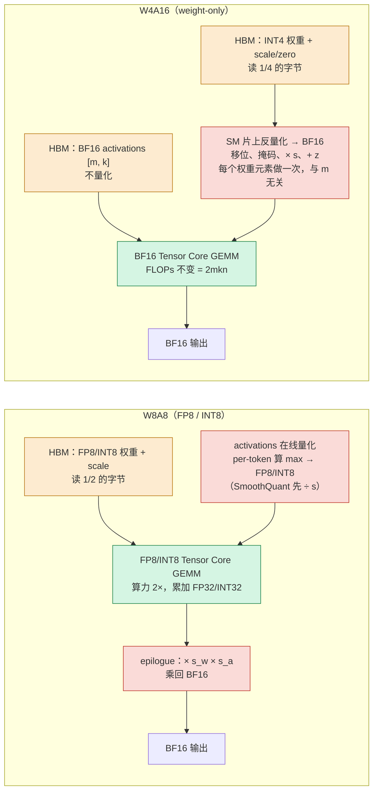

> **本篇在系列中的位置。** 第三段的第三篇，紧接上一篇的数值格式。上一篇讲"一个数用什么格式表示、在哪里丢精度、训练时怎么用低精度算而不发散"；本篇讲量化——把权重、激活和 KV cache 压成更少的位，用 scale 与校准控制误差，换来字节数的下降。完整地图见[总纲](/transformer-and-llm-for-infra-engineers.html)。

第五至十二篇把一个 Transformer 拆成了四组变量：参数量 $$N$$、每 token 的 FLOPs、每步要搬的字节数、每 token 的 KV cache。[《Transformer 与 LLM（13）：浮点格式、数值稳定性与混合精度》](/floating-point-formats-and-mixed-precision.html)又给"字节数"补上了另一半：每个数占几位、这几位怎么分给指数和尾数。

量化与数值格式强相关，但不是一回事：

- **共享的是词汇。** INT8、FP8、E4M3、scale、累加精度，两篇都用；FP8 的位布局与动态范围在上一篇第二、七章已经讲过，本篇直接引用。
- **问的问题不同。** 数值格式问的是"训练和计算该用什么格式算，误差在哪里积累、怎么控制"——它决定一次 GEMM 的输入输出和累加器用几位，目标是**误差可控、训练稳定**；量化问的是"哪些张量（权重、激活、KV cache）可以压到比计算格式更少的位、按什么粒度放 scale、用什么校准补偿误差"——目标是**字节数下降、输出分布尽量不变**，它允许有损。
- **交汇点是细粒度 scale。** DeepSeek-V3 的 FP8 训练给每 $$1 \times 128$$ 激活块、$$128 \times 128$$ 权重块各配一个 scale（本篇第三章第 7 节），用的正是量化的手段；本篇的 group-wise INT4 是同一个思路在推理侧推到 4 位。

本篇要回答的核心问题是：

> **同一个 INT4 模型，为什么 decode 快 3 倍、prefill 反而更慢？[^q0]**

## 一、总览：量化改的是 W_bytes

### 1. 本文的路线

先把 decode 的 Roofline 和一个时间模型写出来（第二章），后面所有估算都用它；再看量化如何改权重字节数 $$W_{bytes}$$：基本形式与粒度、W4A16 的收益区间与交叉点、GPTQ / AWQ / SmoothQuant / LLM.int8() 各自补偿什么误差、FP8 推理量化、W8A8 与 W4A16 的位置、KV cache 量化（第三章）；最后给出一个在 H100 上复现的对照实验设计（第四章）。另一个改变计算形态的方向——用一次前向验证多个 token 的投机解码，以及把训练参数降到千分之几的 LoRA——在下一篇。

### 2. 本文的章节安排

| 章 | 主题 | 内容 |
|---|---|---|
| 二 | 起点：decode 是 memory-bound 的 | 算术强度与 ridge point、一个时间模型 |
| 三 | 量化：改变 `W_bytes` | 基本形式与粒度、W4A16 的收益区间、交叉点 B ≈ ridge/4、GPTQ/AWQ/SmoothQuant、FP8、W8A8、KV cache 量化 |
| 四 | 实践 | BF16 与 INT4 在 batch 1 与 64 下的对照实验设计 |
| 五 | 本文小结 |  |
| 六 | 自测 | 2 道题 |

Table: 本文的章节安排

## 二、起点：decode 是 memory-bound 的

### 1. 算术强度与 ridge point

对一个 $$[m, k] \times [k, n]$$ 的矩阵乘，FLOPs 是 $$2mkn$$；如果权重 $$[k, n]$$ 以 BF16 存放，读一遍要 $$2kn$$ 字节。decode 阶段每步每个请求只有一个 token，$$m$$ 就是 batch 大小 $$B$$，于是权重 GEMM 的算术强度

$$
I = \frac{2Bkn}{2kn} = B \ \text{FLOP/byte}
$$

H100 SXM 的 BF16 dense 算力 989 TFLOPS，HBM 带宽 3.35 TB/s，ridge point

$$
\frac{989 \times 10^{12}}{3.35 \times 10^{12}} \approx 295 \ \text{FLOP/byte}
$$

也就是说 batch 不到大约 300，decode 的权重 GEMM 就在 Roofline 的斜线上——时间由字节数决定，与 FLOPs 无关。$$B = 1$$ 时距离 ridge 两个数量级。

### 2. 一个时间模型

本篇后面所有的估算都用同一个模型：一次前向处理 $$m$$ 个 token 行，时间下界是访存时间与计算时间的较大者

$$
T(m) = \max\left( \frac{W_{\text{bytes}}}{BW},\ \frac{2 N m}{F} \right)
$$

其中 $$W_{\text{bytes}}$$ 是要读的权重字节数，$$N$$ 是参与 GEMM 的参数量（embedding 是查表，不算），$$F$$ 是算力。代入 Llama-3-8B（8.03B 参数，BF16 权重 16.06 GB，每 token 权重 FLOPs 约 15.0 GFLOPs）：

$$
T_{\text{mem}} = \frac{16.06 \ \text{GB}}{3.35 \ \text{TB/s}} \approx 4.8 \ \text{ms}, \qquad
T_{\text{cmp}}(m) = m \times \frac{15.0 \ \text{GFLOPs}}{989 \ \text{TFLOPS}} \approx m \times 15.2 \ \mu\text{s}
$$

两者相等在 $$m \approx 316$$，与 ridge 295 同一量级（差别来自 16.06 GB 包含了 embedding 而 15.0 GFLOPs 不含）。这个模型忽略了 KV cache 读取、activations 与 kernel 效率，是**理论下界**，不是任何实现的实测。

这三个数字——**算术强度 ≈ B、ridge ≈ 295、8B 模型 decode 下界 4.8 ms（约 208 token/s 单请求上限）**——是本篇全部推导的基础。量化改的是 $$W_{\text{bytes}}$$，投机解码改的是 $$m$$，LoRA 改的是训练时的 $$N$$。

## 三、量化：改变 W_bytes

### 1. 基本形式与粒度

均匀量化把一个浮点权重 $$w$$ 映射到 $$b$$ 位整数再映射回来：

$$
q = \text{clamp}\left( \text{round}\left(\frac{w}{s}\right) + z,\ 0,\ 2^b - 1 \right), \qquad
\hat{w} = s \cdot (q - z)
$$

$$s$$ 是 scale（实数），$$z$$ 是 zero point（一个**整数**编码，表示实数 0 落在哪一格）。注意 $$z$$ 是加在整数一侧的，解码时先减 $$z$$ 再乘 $$s$$；有些资料写成 $$\hat w = s \cdot \text{round}(w/s) + z$$，那里的 $$z$$ 就得是实数偏移、量纲是 $$w$$ 而不是格点，两种写法不能混。用一个 3 值例子核对：$$b = 2$$、$$w \in [-1.5, 3]$$，非对称 $$s = 4.5/3 = 1.5$$、$$z = \text{round}(1.5/1.5) = 1$$；$$w = -1.5 \to q = \text{round}(-1) + 1 = 0 \to \hat w = 1.5 \times (0 - 1) = -1.5$$，$$w = 3 \to q = 3 \to \hat w = 1.5 \times 2 = 3$$，端点都还原。**对称量化** $$z = 0$$，$$s = \max\lvert w\rvert  / (2^{b-1} - 1)$$，整数范围以 0 为中心；**非对称量化** $$z \neq 0$$，$$s = (\max w - \min w) / (2^b - 1)$$，把实际的 $$[\min, \max]$$ 区间完整映射到 $$[0, 2^b - 1]$$，对分布偏斜的权重多用掉一个 bit 的表达力。

$$s$$ 与 $$z$$ 按什么范围共享，决定了量化的**粒度**：

- **per-tensor**：整个矩阵一个 $$s$$。元数据可忽略，但一个离群值会把所有权重的步长拉大。
- **per-channel**：每个输出通道（矩阵的一列/一行）一个 $$s$$。$$W_Q$$ 有 4096 个 scale，元数据仍可忽略。这是 INT8 权重量化的常态。
- **per-group**：沿输入维度每 $$g$$ 个权重一个 $$s$$（和 $$z$$），$$g = 128$$ 是 4-bit 的事实标准。粒度越细，每个 group 的范围越紧，量化误差越小，但元数据线性增长。

三种粒度在同一个 $$W \in \mathbb{R}^{d_{out} \times d_{in}}$$ 上的 $$(s, z)$$ 共享范围（行 = 输出通道，横向 = GEMM 的归约维 $$k = d_{in}$$）：

```text title="三种量化粒度的 (s, z) 共享范围"
                 d_in（归约维 k）─────────────────────▶
           ┌────────────────────────────────────────┐
per-tensor │ 整个矩阵共用一个 (s, z)                │ 元数据 1 个
           └────────────────────────────────────────┘

           ┌────────────────────────────────────────┐
per-       │ 行 0 ························ (s0, z0) │ 元数据 d_out 个
channel    │ 行 1 ························ (s1, z1) │ （W_Q: 4096 个）
           │ ...                                    │
           └────────────────────────────────────────┘

           ┌─────────┬─────────┬─────────┬──────────┐
per-group  │ g=128   │ g=128   │ g=128   │ ...      │ 每行 d_in/g 组
g=128      │(s00,z00)│(s01,z01)│(s02,z02)│          │ 元数据 d_out·d_in/g
           ├─────────┼─────────┼─────────┼──────────┤ （W_Q: 4096×32
           │(s10,z10)│(s11,z11)│(s12,z12)│ ...      │  = 131072 个）
           └─────────┴─────────┴─────────┴──────────┘
```

per-channel 的 scale 沿 $$k$$ 不变，可以在 GEMM 累加完之后在 epilogue 一次乘回；per-group 的 scale 沿 $$k$$ 每 $$g$$ 个元素换一次，必须在累加过程中乘——这是 W4A16 kernel 要在片上做反量化、而不能把 scale 留到最后的原因。

per-group 的元数据开销直接算：每个权重 $$b$$ 位，每 $$g$$ 个权重摊一个 scale 和一个 zero，

$$
\text{bit/weight} = b + \frac{b_{\text{scale}} + b_{\text{zero}}}{g}
$$

INT4、$$g = 128$$、FP16 scale + 4-bit zero：$$4 + 20/128 = 4.16$$ bit；FP16 scale + FP16 zero：$$4 + 32/128 = 4.25$$ bit；$$g = 64$$ 时 $$4 + 32/64 = 4.5$$ bit。所以常说的"INT4 模型"实际是 **4.25–4.5 bit/权重**。

代入 Llama-3-70B（70.55B 参数）：

$$
70.55 \times 10^9 \times \frac{4.25}{8} \approx 37.5 \ \text{GB}
$$

如果 embedding 与 lm_head（合计 2.10B）保留 BF16，则 $$68.45 \times 0.531 + 2.10 \times 2 \approx 40.6$$ GB。**约 37–40 GB，能放进一张 80 GB 的 H100**，剩下约 40 GB 给 KV cache（70B 每 token 320 KiB，约 13 万 token）。BF16 的 141 GB 需要至少两张卡——这是 weight-only 量化最直接、也最不需要 Roofline 就能理解的收益：把一个模型从两卡变成一卡。

同样算 Llama-3-8B：$$8.03 \times 4.25 / 8 \approx 4.27$$ GB。

哪些部分通常不量化，也值得用参数量的分布来理解。embedding 是查表，量化它省的是显存而不是 decode 带宽（每步只读一行）；lm_head 在 decode 每步被完整读一遍（1.05 GB），量化它对时间有实际帮助，但它直接决定输出分布，对误差最敏感，多数方案保留 FP16；attention 与 FFN 的 6.98B 是量化的主体。评价量化质量的常用指标是校准集之外文本上的困惑度（perplexity）相对 FP16 的增量，以及下游任务的分数——两者不总是一致，INT4 上"困惑度只涨 0.1"与"某个推理任务掉 3 分"可以同时发生，这是选方案时要一起看的。

### 2. W4A16 的收益区间：decode 与 prefill 符号相反

W4A16 指权重 4 位、activations 保持 16 位（BF16/FP16）。计算时 kernel 从显存读 INT4 权重，在片上反量化成 BF16，再与 BF16 的 activations 在 BF16 Tensor Core 上做乘加。**FLOPs 一个都没少，少的只是权重字节数。**

回到时间模型。decode $$B = 1$$：

$$
T_{\text{mem}}^{\text{INT4}} = \frac{4.0 \sim 4.3 \ \text{GB}}{3.35 \ \text{TB/s}} \approx 1.2 \sim 1.3 \ \text{ms}
$$

从 4.8 ms 降到 1.2 ms（纯 4 bit）或 1.27 ms（4.25 bit）。这个下界成立的前提是：反量化开销可忽略（它在 SM 内部做，不碰 HBM）、activations 仍是 BF16（$$B = 1$$ 时 activations 只有几十 KB，确实可忽略）、KV cache 读取不计。

prefill 是另一回事。8K prompt 的 prefill 处理 $$m = 8192$$ 行，算术强度约 8192 FLOP/byte，远在 ridge 295 之上，时间由 FLOPs 决定：

$$
T_{\text{cmp}} = \frac{8192 \times 15.0 \ \text{GFLOPs}}{989 \ \text{TFLOPS}} \approx 0.12 \ \text{s} \ (\text{100\% MFU})
$$

FLOPs 没变，Tensor Core 还是 BF16 的，权重那 16 GB 本来在 0.12 s 里只占 4.8 ms，省掉 3/4 也只是省了 3.6 ms。而反量化是纯增加的工作：每个权重元素在被用于 8192 行的乘加之前，要先做一次移位、掩码、乘 scale、加 zero，且 W4A16 kernel 在大 $$m$$ 下通常达不到 cuBLAS BF16 GEMM 的效率。结果是 **prefill 可能比 BF16 更慢**。

把反量化的成本放进模型里看得更清楚。一个 W4A16 GEMM kernel 对每个权重元素做的额外工作是常数（几条整数与浮点指令），总量与 $$kn$$ 成正比、与 $$m$$ 无关；而有用的乘加与 $$mkn$$ 成正比。$$m = 1$$ 时两者同量级，但此时 kernel 在等 HBM，反量化藏在访存延迟后面；$$m = 8192$$ 时有用计算是反量化的 8192 倍，反量化本身可忽略，但它占用的寄存器与指令槽、以及为了容纳 INT4 布局而偏离 cuBLAS 最优 tile 形状的代价，让 kernel 的 MFU 低于纯 BF16 GEMM。所以"prefill 更慢"的幅度不是理论能算出来的，取决于 kernel 实现；理论能说的只是**字节数少这一项在 compute-bound 区兑现不了**——它不能证明 W4A16 prefill 一定不比 BF16 快：两边的 FLOPs 下界相同，实际快慢由 kernel 效率决定，权重更小也可能带来 L2 命中率等次级收益。实践中 W4A16 的 prefill 通常持平或略慢，把它当经验事实而不是定理。

同一个 4.25 bit 的权重文件，decode 快约 4 倍（理论），prefill 慢——不是两种现象，是 Roofline 上两个位置：一个在斜线上（字节数决定时间，字节减少直接兑现），一个在平台上（FLOPs 决定时间，字节减少不兑现，反量化的额外指令反而算进去）。

### 3. 从 batch 1 到 256：交叉点在 B ≈ ridge/4

把 batch 扫一遍，用同一个时间模型算 BF16 与 W4A16 各自的下界（Llama-3-8B，H100，纯 4 bit 4.0 GB，忽略反量化开销）：

| batch B | BF16 下界 (ms) | W4A16 下界 (ms) | BF16/W4A16 |
|---|---|---|---|
| 1 | 4.79 | 1.20 | 4.0 |
| 8 | 4.79 | 1.20 | 4.0 |
| 32 | 4.79 | 1.20 | 4.0 |
| 64 | 4.79 | 1.20 | 4.0 |
| 128 | 4.79 | 1.94 | 2.5 |
| 256 | 4.79 | 3.89 | 1.2 |
| 512 | 7.77 | 7.77 | 1.0（实际 W4A16 更慢） |

Table: Llama-3-8B 在 H100 上 BF16 与 W4A16 的 decode 时间下界随 batch 的变化

BF16 在 $$B < 316$$ 时一直被 4.8 ms 的访存时间钉住；W4A16 的访存时间是 1.2 ms，计算时间 $$B \times 15.2 \ \mu s$$ 追上它的位置是

$$
B^* = \frac{1.2 \ \text{ms}}{15.2 \ \mu\text{s}} \approx 79 \approx \frac{\text{ridge}}{4}
$$

一般地，权重压缩 $$k$$ 倍，W4A16 的"转折 batch"就是 $$\text{ridge}/k$$。超过 $$B^*$$ 之后 W4A16 转为 compute-bound，收益按 $$1/B$$ 衰减，到 $$B \approx \text{ridge}$$ 处两者相遇，再往上反量化开销让 W4A16 落到 BF16 下方。

这张表回答了"什么时候该用 W4A16"：**单请求或小 batch 的延迟敏感服务**（本地部署、交互式应用），以及**为了放进一张卡**。高吞吐、大 batch 的服务里，它对 decode 的帮助随 batch 变小，对 prefill 是负的。

实际测到的 decode 加速通常在 3 倍左右而非 4 倍，差在几处：lm_head 常保留 FP16（1.05 GB，占 4.27 GB 的四分之一）、KV cache 读取不随权重量化减少、group 元数据、kernel 效率。这些都能用上面的模型逐项归因。

### 4. GPTQ：用 Hessian 把误差补偿到未量化的列

上面只讲了格式，没讲怎么选 $$s$$ 与 $$\hat{w}$$ 使模型精度损失最小。最简单的 round-to-nearest（RTN）在 INT8 per-channel 下够用，到 INT4 就不够了。

GPTQ（Frantar 等 2022）继承 OBQ（Optimal Brain Quantization）的思路：**逐个量化权重，每量化一个，就调整剩下未量化的权重去补偿它带来的输出误差**。对一个线性层的一行权重 $$w \in \mathbb{R}^{d_{in}}$$，让量化后的输出尽量接近原输出：

$$
\min_{\hat{w}} \ \| w X - \hat{w} X \|_2^2 = \tfrac{1}{2}\,(w - \hat{w}) H (w - \hat{w})^\top, \qquad H = 2 X X^\top
$$

（OBS/GPTQ 沿用 $$H = 2XX^\top$$ 的写法，所以前面带 $$\tfrac12$$；这个常数不影响 $$\arg\min$$，下面的更新公式里也约掉了。）

$$H \in \mathbb{R}^{d_{in} \times d_{in}}$$ 是这个二次目标的 Hessian，由该层的输入 $$X$$ 决定，**对矩阵的所有行相同**。OBQ 的结论是：把第 $$q$$ 个权重量化为 $$\text{quant}(w_q)$$ 后，其余权重的最优更新是

$$
\delta = -\frac{w_q - \text{quant}(w_q)}{[H^{-1}]_{qq}} \cdot H^{-1}_{:, q}
$$

即量化误差按 $$H^{-1}$$ 第 $$q$$ 列的比例分摊到其他权重上，然后把第 $$q$$ 个权重从问题中移除、更新 $$H^{-1}$$ 继续——这一步不是简单删掉一行一列，而是按 Schur 补 $$H^{-1} \leftarrow H^{-1} - H^{-1}_{:,q} H^{-1}_{q,:} / [H^{-1}]_{qq}$$ 更新后再去掉该行列（GPTQ 用 Cholesky 分解一次性得到所有列的这个量）。GPTQ 做了三处工程改造使它能跑到百亿参数：

1. **固定列顺序**：OBQ 每步挑误差最小的权重，各行顺序不同；GPTQ 让所有行按同一列顺序量化，于是 $$H^{-1}$$ 的更新对所有行共享，一列一列推进，每列是一次矩阵向量操作；
2. **lazy batch**：每 128 列为一块，块内更新只作用在块内，块结束时再一次性更新块外的列，减少对 $$d_{out} \times d_{in}$$ 大矩阵的反复读写；
3. **Cholesky**：预先算 $$H^{-1}$$ 的 Cholesky 分解，逐列取用，避免反复求逆时的数值问题。

$$H$$ 从哪里来？从**校准数据**：通常约 128 条、每条 2048 token 的文本，跑一遍前向，在每层收集输入 $$X$$ 累加 $$X X^\top$$。$$W_Q$$ 的 $$H$$ 是 $$4096^2$$ 个 FP32，64 MB；down_proj 的 $$H$$ 是 $$14336^2$$，约 820 MB。整个过程逐层顺序进行，175B 模型在单张 A100 上约几个 GPU 小时。代价是需要校准数据、有过拟合校准集分布的风险、以及对某些层需要"按激活大小排序列顺序"（act-order）的启发式。GPTQ 产出的是标准的 INT4 per-group 权重，推理 kernel 与格式无关。

### 5. AWQ：保护 1% 的显著通道

AWQ（Lin 等 2023）从另一个观察出发：**权重不是同等重要的**。把对应于激活幅度最大的约 1% 输入通道的权重保留 FP16、其余 RTN 到 INT4，困惑度几乎恢复到 FP16 水平；而如果按权重自身幅度挑这 1%，效果远差。也就是说，重要的是 $$\lvert x_j\rvert $$ 大的那些输入通道 $$j$$ 所对应的权重列 $$W_{:, j}$$。

混合精度的权重矩阵对 kernel 不友好。AWQ 改为**逐输入通道缩放**：

$$
Y = W X = (W \cdot \text{diag}(s)) \cdot (\text{diag}(s)^{-1} X)
$$

数学上恒等；量化 $$W \cdot \text{diag}(s)$$ 而不是 $$W$$。对通道 $$j$$ 乘 $$s_j > 1$$，这一列的权重变大，在 group 内占据更多整数级别，量化相对误差约降为 $$1/s_j$$；只要 $$s_j$$ 不大到改变 group 的最大值（少数通道乘 2 通常不会），其他通道的误差不变。$$s_j$$ 按激活统计量搜索：

$$
s_j = \left( \text{mean}|X_j| \right)^{\alpha}, \qquad \alpha \in [0, 1]
$$

在校准集上网格搜索 $$\alpha$$ 使输出误差最小。$$\text{diag}(s)^{-1}$$ 一侧折进前一个算子（RMSNorm 的 $$\gamma$$，或前一个线性层的输出通道），运行时零开销。

与 GPTQ 相比，AWQ 只需要前向收集激活统计与做一次网格搜索，**不需要反向、不需要 Hessian**，校准数据更少也更不容易过拟合。两者产出格式相同，vLLM 中的 W4A16 GEMM kernel（如 Marlin）对两者通用。

### 6. SmoothQuant 与 LLM.int8()：激活的离群通道

到此为止量化的都是权重。要让 GEMM 本身在 INT8 或 FP8 Tensor Core 上跑（W8A8），activations 也得量化——这是完全不同难度的问题。

从大约 6.7B 参数起，LLM 的 activations 在**特定的 hidden 维度**上系统性地出现 20–100 倍于其他维度的值，而且这些维度在不同 token、不同输入上是固定的。per-tensor INT8：$$s = \max\lvert X\rvert  / 127$$ 被离群通道决定，其他通道的值落在 1–2 个整数级别上，信息几乎全丢。per-channel 按 hidden 维度给 activations 不同 scale 也不行——这个维度是 GEMM 的归约维 $$k$$，scale 不能从累加中提出来。per-token（按行）可以，但对离群通道无效，因为每一行都有它们。

SmoothQuant（Xiao 等 2022）把难度**从激活迁移到权重**：

$$
Y = X W = (X \cdot \text{diag}(s)^{-1}) (\text{diag}(s) \cdot W), \qquad
s_j = \frac{\max|X_j|^{\alpha}}{\max|W_j|^{1 - \alpha}}
$$

激活的通道 $$j$$ 除以 $$s_j$$，权重的对应行乘 $$s_j$$。$$\alpha = 0.5$$ 时 $$\max\lvert \hat{X}_j\rvert  = \max\lvert \hat{W}_j\rvert  = \sqrt{\max\lvert X_j\rvert  \cdot \max\lvert W_j\rvert }$$，两边的每通道范围被拉平到几何平均——激活的离群被压下去，权重的对应行被抬上来，两者都变得"可量化"。激活离群越严重的模型 $$\alpha$$ 越大（有的模型用 0.75）。$$\max\lvert X_j\rvert $$ 需要校准数据统计，是静态的；$$\text{diag}(s)^{-1}$$ 同样折进前面的 RMSNorm。

它的形式与 AWQ 惊人地相似——同一个 $$\text{diag}(s)$$ 分解——但方向相反：AWQ 把权重乘大保护权重，SmoothQuant 把激活除小保护激活。迁移的难度在于：权重被抬高后自身的量化也变难，$$\alpha$$ 是两边的折中；对离群极端的模型（Llama 系列某些层的 massive activations 可达数千），INT8 per-tensor 静态量化仍会掉点，实践中常退到 per-token 动态量化。

LLM.int8()（Dettmers 等 2022）选择不迁移而是**分离**：把 $$X$$ 中任一元素绝对值超过阈值（论文用 6.0）的列（hidden 维度）单独抽出来与对应权重行做 FP16 GEMM，其余部分做 INT8 按行/按列 vector-wise 量化 GEMM，最后相加。离群维度约占 0.1%，精度保持得很好，但两个 GEMM 加上 gather/scatter 使它在多数情况下比 FP16 慢，主要价值是省显存而不是提速。

到这里出现的几种方案，量化对象、怎么定 $$s$$、要不要校准数据、运行时有没有额外算子，各不相同：

| 方案 | 量化对象 | 怎么定 $$s$$ / 怎么处理离群 | 校准需求 | 运行时额外开销 | 产出与 kernel |
|---|---|---|---|---|---|
| RTN | W | $$s = \max/(2^{b-1}-1)$$，直接四舍五入 | 无 | 无 | INT8 per-channel 够用，INT4 掉点明显 |
| GPTQ | W（INT4/INT3） | 逐列量化，误差按 $$H^{-1}$$ 分摊到未量化列 | 约 128 条 × 2048 token，收集 $$H = 2XX^\top$$；数 GPU 小时 | 无 | 标准 INT4 per-group，W4A16 kernel（Marlin 等）通用 |
| AWQ | W（INT4） | 按激活统计放大约 1% 显著输入通道（$$s_j = \text{mean}\lvert X_j\rvert^{\alpha}$$）再 RTN | 少量前向统计 + $$\alpha$$ 网格搜索，无反向、无 Hessian | 无（$$\text{diag}(s)^{-1}$$ 折进 RMSNorm） | 同上，与 GPTQ 格式相同 |
| SmoothQuant | W + A（INT8） | 激活通道 ÷ $$s_j$$、权重行 × $$s_j$$，把离群从激活迁到权重 | 静态 $$\max\lvert X_j\rvert$$ 统计 | 静态时无；退到 per-token 动态时每步算一次 max | INT8 GEMM（W8A8） |
| LLM.int8() | W + A（INT8） | 离群列（$$\lvert x\rvert > 6$$）抽出走 FP16，其余 vector-wise INT8 | 无（运行时检测） | 两个 GEMM + gather/scatter，通常比 FP16 慢 | 混合 INT8/FP16，主要省显存 |

Table: 几种量化方案的对象、校准需求与运行时开销

### 7. FP8 推理量化：浮点的相对精度 vs 整数的绝对精度

E4M3 / E5M2 的位布局、FP8 Tensor Core 的累加精度与训练侧的 scaling 见上一篇第二、五、七章；这里只看推理时把 BF16 权重与激活转成 FP8 的那一步。

H100 提供 FP8 Tensor Core（E4M3 与 E5M2，dense 1979 TFLOPS，BF16 的两倍），使 W8A8 有了比 INT8 更宽容的载体。原因在格式本身：

- INT8 的步长是**绝对**的：$$s = \max/127$$，所有值的量化误差都是 $$\pm s/2$$。一个 100 倍于典型值的离群值让 $$s$$ 变大 100 倍，典型值被压到 1 个级别附近。
- E4M3 有 3 位尾数，任何正规数的**相对**误差都约 $$2^{-4} = 6\%$$，与该值本身的大小无关；它的正规数范围 $$2^{-6}$$ 到 448，加上次正规数到 $$2^{-9}$$，动态范围约 $$2.3 \times 10^5$$（约 17.8 位），INT8 只有 127（7 位）。

同一个 per-tensor scale 下，只要典型值仍落在 FP8 的正规数范围内，就能跌到更小的指数段而保留 3 位尾数；超出动态范围后仍会下溢或丢精度。这就是 FP8 比 INT8 对离群值宽容的全部原因；代价是 3 位尾数的相对精度低于 INT8 在满量程附近的相对精度。

scale 的粒度在 FP8 里同样重要：per-tensor 是整张量一个 scale，per-token 是每行一个 scale，per-block 则在归约维上继续分块。常见 per-tensor FP8 GEMM 可以在 epilogue 乘回 scale；若 scale 沿 k 变化，就不能把它提出整段求和。下面用训练侧的 DeepSeek-V3 把这件事展开，推理侧也必须选择与相应粒度匹配的 kernel。

#### DeepSeek-V3：从 FP8 训练看分块量化

per-tensor scaling 的根本问题是**离群值（outlier）**。LLM 的激活中存在少数通道的值比其余大两三个数量级（前面的 SmoothQuant 一节已讨论），如果整个张量共享一个 scale，这个 scale 被离群值决定：离群值被对齐到 448，占据 E4M3 窗口的顶端。E4M3 从最小次正规数 $$2^{-9}$$ 到 448 只有 18 个二进制数量级，其中正规区 15 个；任何比离群值小 $$2^{15} \approx 3 \times 10^4$$ 倍以上的元素就落进次正规区开始丢有效位，小 $$2^{18}$$ 倍以上直接变 0。一个 $$100 \times$$（约 $$2^7$$）的离群值加上激活本身三四个十进制数量级的自然分布，尾部恰好被推进这个区域；更糟的是 delayed scaling 用历史 amax，离群值让 amax 剧烈波动，scale 在"太大溢出"与"太小下溢"之间摇摆。

DeepSeek-V3 的做法是缩小 scale 的作用范围：**激活按 $$1 \times 128$$ 分块**（每个 token 每 128 个通道一个 scale），**权重按 $$128 \times 128$$ 分块**。一个离群值现在只能拖累同一个块里的 127 个邻居，其余所有块的 scale 由各自的正常值决定，不受影响。用数字说：DeepSeek-V3 的 $$d = 7168$$ 激活向量有 56 个块，一个离群通道影响 $$1/56 \approx 1.8\%$$ 的元素；per-tensor 时影响 100%。块大小 128 与[《浮点格式、数值稳定性与混合精度》](/floating-point-formats-and-mixed-precision.html)第五章的累加提升周期 $$N_C = 128$$ 对齐，每 128 个 $$k$$ 元素的部分和搬到 CUDA core 时正好乘上这一块的 $$s_a \cdot s_w$$，反量化没有额外的遍历。沿 $$k$$ 方向把三件事对齐画出来：

| 沿归约维 k 的一块 | 形状 / 周期 | 操作 |
|---|---|---|
| 激活 | 1 × 128 | 每 token 每块一个 scale `s_a[i]` |
| 权重 | 128 × 128 | 每权重块一个 scale `s_w[i]` |
| Tensor Core | k = 128（4 条 k = 32 的 WGMMA） | 计算块内部分和 `P_i`，再清零累加器 |
| CUDA core | 共 56 块（7168 / 128） | FP32 累加 `P_i × s_a[i] × s_w[i]` |

Table: DeepSeek-V3 沿 k 方向对齐的量化块、scale 与累加提升


每一段的边界同时是 scale 的边界与累加器搬运的边界，所以反量化乘法和 promotion 是同一步操作。

这也解释了为什么分块量化必须配合修改 GEMM kernel：标准 FP8 GEMM 假设 per-tensor scale，在 epilogue 乘一次；分块 scale 在 $$k$$ 方向变化，必须在累加中途乘，这正是 promotion 到 CUDA core 那一步顺便做的事。scale 的粒度、累加的分段、kernel 的结构，三者是同一个设计决策。

### 8. W8A8 与 W4A16 各自的位置

两类量化在 kernel 里的数据流不同——差别在**反量化发生在哪一步**、**乘加用哪种 Tensor Core**：



上面（W4A16）省的只有权重字节，乘加与 BF16 完全相同，反量化是加进去的工作；下面（W8A8）权重字节减半、activations 也变成 8 位，乘加本身换到了两倍算力的 Tensor Core 上。现在可以把两类量化放到 Roofline 上：

| 配置 | 权重字节 | GEMM 精度 | decode (memory-bound) | prefill (compute-bound) |
|---|---|---|---|---|
| BF16 | 1× | BF16 Tensor Core | 4.8 ms | 基线 |
| W8A8 (FP8/INT8) | 1/2 | FP8/INT8 TC 2× 算力 | 2.4 ms 下界 | 上限快 2× |
| W4A16 | 1/4 | BF16 TC + 反量化 | 1.2 ms 下界 | 不变或更慢 |
| W4A8 | 1/4 | FP8/INT8 TC | 1.2 ms 下界 | 上限快 2×（反量化到 INT8/FP8） |

Table: 四种精度配置在 Roofline 上的位置

W8A8 让 GEMM 在 FP8 Tensor Core 上跑，ridge 变为 $$1979/3.35 \approx 591$$，prefill 的 FLOPs 上限翻倍；同时权重减半，decode 下界 2.4 ms。8K prefill 的 158 TFLOP 在 60% MFU 下从约 0.27 s 降到约 0.13 s。W4A16 对 prefill 无益，对 decode 的收益是 W8A8 的两倍。两者组合的 W4A8 试图兼得，代价是把 4 位权重反量化到 8 位整数/浮点的精度损失与 kernel 复杂度。

这就是"用哪种量化"的判断依据：**prefill 重（长 prompt、高吞吐）用 W8A8；decode 重（长生成、低延迟、小 batch）用 W4A16；显存装不下先用 W4。**

### 9. KV cache 量化

KV cache 每 token 的字节数是

$$
\text{bytes/token} = 2 \cdot L \cdot n_{kv} \cdot d_{head} \cdot \text{bytes/elem}
$$

Llama-3-8B：$$2 \times 32 \times 8 \times 128 \times 2 = 128$$ KiB。把 K、V 存成 FP8（E4M3，每个 head 或每 token-head 一个 scale）或 INT8，**128 KiB → 64 KiB**；128K 上下文从 16 GiB 变 8 GiB；70B 从 320 KiB 变 160 KiB；DeepSeek-V3 的 MLA 从 68.6 KiB 变 34.3 KiB。

它的意义要和权重一起看。上下文 8K、batch 64 时，Llama-3-8B 每步 decode 要读 $$128 \ \text{KiB} \times 8192 \times 64 = 64$$ GiB 的 KV cache，是权重 16 GB 的四倍。这个区间里，**KV cache 量化对 decode 时间的影响大于权重量化**：权重 INT4 省 12 GB，KV FP8 省 32 GiB。attention 部分的读取在 FP8 KV 下同样减半（attention 与权重 GEMM 不同，读的是 activations 而非权重，但 memory-bound 的性质相同）。vLLM 的 `kv_cache_dtype=fp8` 对应的就是这一项。

## 四、实践：BF16 与 INT4 在 batch 1 与 64 下的对照

本篇没有实测数字，只给设计与预期，读者可以在一张 H100 上复现：

1. **准备**：同一个 Llama-3-8B（或 3.1）的 BF16 权重与它的 AWQ / GPTQ INT4 版本（$$g = 128$$），用 vLLM 分别加载，关闭 prefix caching，固定 `max_num_seqs` 使 batch 恰好为 1 或 64；
2. **decode 测量**：prompt 固定为短序列（如 128 token），生成 512 token，记录 token 间延迟（ITL）与总吞吐；
3. **prefill 测量**：prompt 8192 token，生成 1 token，记录首 token 延迟（TTFT）；
4. **对照量**：decode 用 $$T_{\text{mem}}$$（4.8 ms 与 1.27 ms）；prefill 用 $$8192 \times 15.0 \ \text{GFLOPs} / 989 \ \text{TFLOPS}$$ 除以一个 MFU（0.5–0.7）。

预期现象：

- batch 1 decode：INT4 的 ITL 约为 BF16 的 1/3（不到理论的 1/4，差在 lm_head、KV 读取与 kernel 效率）；
- batch 64 decode：两者差距缩小——INT4 的算术强度已接近其转折 batch，BF16 仍在斜线上；如果上下文长，KV cache 读取成为共同的主项，差距进一步缩小；
- prefill 8K：INT4 与 BF16 的 TTFT 接近，INT4 通常略慢，与 W4A16 kernel 在大 $$m$$ 下的效率有关。

若再加投机解码（vLLM 的 `speculative_config`，用 n-gram 或一个小草稿模型），预期 batch 1 下 ITL 明显下降，batch 64 下不变或上升，与第四章表格一致。**任何实测与下界的差距都应该能归因到本文模型忽略的某一项**——这比数字本身重要。

## 五、本文小结

量化不改结构，只改每个张量占几位：

| 方法 | 改的量 | 机制 | 收益区间 |
|---|---|---|---|
| W4A16 | 权重字节约降 4 倍 | INT4 存储，片上反量化到 BF16 | memory-bound decode；prefill 不一定更快 |
| W8A8 | 权重字节减半、低精度峰值算力提高 | FP8 / INT8 Tensor Core | decode 和 prefill 都可能获益 |
| KV cache 量化 | KV 数据字节减半 | FP8 / INT8 存 K、V | 长上下文、大 batch 的 decode |

Table: 三类量化改变的成本项与收益条件

本篇的数字：

|  | Llama-3-8B | Llama-3-70B | DeepSeek-V3 |
|---|---|---|---|
| INT4 g128 等效位宽 | 4.25 bit | 4.25 bit | 4.25 bit |
| INT4 权重字节 | 4.27 GB | 37.5 GB | 356 GB |
| decode 下界 BF16 → W4A16 | 4.8 → 1.27 ms | — → 11.2 ms | — |
| W4A16 转折 batch（ridge/4） | ~79 | ~79 | — |
| KV cache/token BF16 → FP8 | 128 → 64 KiB | 320 → 160 KiB | 68.6 → 34.3 KiB |

Table: 本篇的数字：量化在三个模型上的账

它的收益只在 memory-bound 区间兑现：省下的字节换成时间，工作点过了 ridge 之后收益消失。下一篇[《Transformer 与 LLM（15）：投机解码与 LoRA》](/speculative-decoding-and-lora.html)在同一个时间模型上看另外两种方法。

配套代码：[`transformer-and-llm/llm_cost_07_quant_specdec_lora.py`](https://github.com/arganzheng/ai-learning-labs/blob/main/transformer-and-llm/llm_cost_07_quant_specdec_lora.py)（量化、投机解码与 LoRA 三组函数在同一个脚本里，下一篇第四章逐段讲解）。

## 六、自测

1. Llama-3-8B 量化到 INT4、group size 128（每组一个 FP16 scale 与一个 INT4 零点）：等效每权重多少位？权重多少字节？decode 下界从 4.8 ms 变成多少？

   <details markdown="1"><summary>答案</summary>

   $$4 + (16 + 4)/128 \approx 4.16$$，算上对齐约 4.25 bit；$$8.03 \times 10^9 \times 4.25 / 8 = 4.27$$ GB；$$4.27 / 3.35 \text{ TB/s} \approx 1.27$$ ms。

   </details>

2. W4A16 量化在 batch 多大时不再有收益？为什么 prefill 反而可能更慢？

   <details markdown="1"><summary>答案</summary>

   两个不同的转折点要分开：W4A16 自己在 $$B \approx 75$$ 越过 ridge 变成 compute-bound（强度 $$4B$$）；但"相对 BF16 没有收益"要到 BF16 也 compute-bound、两者时间都由同样的 FLOPs 决定，即 $$B \approx 295$$——中间那段（75–295）W4A16 仍快，只是加速比从 4 倍逐渐降到 1（第三章的表里 $$B = 128$$ 仍有 2.5 倍）。prefill 本来就在 295 之外，字节省了兑现不了，还多了片上反量化的开销，所以持平或略慢。

   </details>


[^q0]: decode 每步每个请求只有一个 token，权重 GEMM 的算术强度约等于 batch 大小，远低于 H100 的 ridge point 295，是 memory-bound 的：时间由读权重的字节数决定，INT4 把 16 GB 压到 4.27 GB，decode 下界从 4.8 ms 降到 1.27 ms。prefill 一次处理成千上万个 token，早已 compute-bound，时间由 FLOPs 决定；W4A16 仍用 BF16 算，FLOPs 不变，还多了片上反量化的开销，所以不快反慢。详见[第二章](#二起点decode-是-memory-bound-的)、[第三章第 2 节](#2-w4a16-的收益区间decode-与-prefill-符号相反)。
