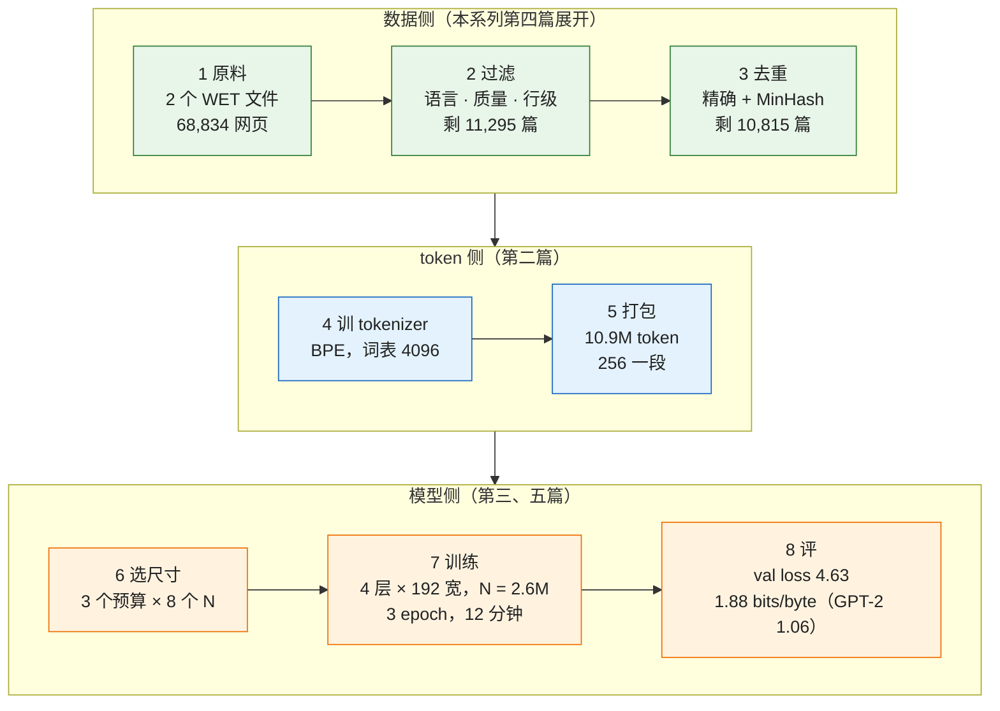

后面四篇各讲预训练的一个环节——分词、scaling law、数据、配方——每篇都会把公式代进 Llama 3 和 DeepSeek-V3 的数字。但如果你从来没有见过一次预训练从头到尾是什么样，那些数字就没有地方放。所以这一篇先**走一遍**：在一台 MacBook 上，从两个 Common Crawl 的原始网页文件出发，过滤、去重、训 tokenizer、打包、选模型大小、定配方、训练、评测，最后得到一个会续写英文的小模型。每一步都回答三个问题：**做什么、为什么要做、做完之后剩下多少**——文档数、字节数、token 数、参数量、loss。每一步末尾指向后面展开它的那一篇。

它与《Transformer 与 LLM》第四篇（nanoGPT 训莎士比亚）的区别：那一篇的数据是一份现成的 1 MB 文本、词表是 65 个字符、模型大小是拍脑袋定的；这一篇的数据是真正的网页——多语言、满是导航栏和垃圾、有重复——**预训练里 80% 的工程量在数据**，跳过它就看不到预训练的样子。全部代码在 [`transformer-and-llm/pretrain_e2e/`](https://github.com/arganzheng/ai-learning-labs/tree/main/transformer-and-llm/pretrain_e2e)，八个脚本对应八步，`run_all.sh` 一键跑完（下载约 215 MB；MPS 上约两小时，其中选尺寸的扫描占大半，`--quick` 可缩到二十分钟）。

全篇的核心问题是：

> **从「一堆网页」到「一个语言模型」中间到底有几步？每一步扔掉了什么、留下了什么？[^q0] 一台笔记本训出来的模型，和 GPT-2 差多远，差在哪？[^q1]**

## 一、总览：八步流水线



| 步 | 输入 → 输出 | 本文实跑的数字 | 为什么要这一步 | 展开它的篇 |
|---|---|---|---|---|
| 1 原料 | Common Crawl WET → 文档 | 68,834 篇，486 MB 文本，46% 英文 | 网页是唯一够大的免费语料 | 第四篇 |
| 2 过滤 | 文档 → 英文、像正文的文档 | 剩 11,295 篇（16%） | 导航栏、SEO 垃圾、表格页训不出语言 | 第四篇 |
| 3 去重 | 文档 → 不重复的文档 | 删 480 篇 | 重复让模型背书、浪费算力 | 第四篇 |
| 4 tokenizer | 文本 → 词表 | 4096 个 token，3.46 字符/token | 模型只认整数；词表决定 token 效率 | 第二篇 |
| 5 打包 | 文档 → 定长 token 序列 | 10.9M token，42,503 条 256 长的序列 | GPU 要吃形状一致的批 | 第四篇 |
| 6 选尺寸 | 算力预算 → N 与 D | 三个预算下最优 N = 0.15M → 0.24M → 0.33M，随预算右移 | 太小学不动、太大喂不饱 | 第三篇 |
| 7 训练 | token + 配方 → 权重 | 4 层 × 192 宽（2.6M），1,992 步，12 分钟 | 配方里每个数都有依据 | 第五篇 |
| 8 评 | 权重 → 数字与样本 | val loss 4.63，1.88 bits/byte（GPT-2 small：1.06） | 跨 tokenizer 只能比 bits/byte | 第三、五篇 |

Table: 八步流水线：每步的输入输出、本文实跑的规模与它在系列里展开的位置

## 二、原料：网页长什么样

### 1. 为什么是 Common Crawl

训练一个语言模型需要的文本量以万亿 token 计（Llama 3 是 15T），世界上只有一个地方有这么多公开文本：**网页**。Common Crawl 是一个非营利组织，每个月抓一次全网，把结果公开放在 Amazon S3 上——每月约 30 亿个网页、几百 TB。几乎所有开源模型的预训练数据都从它开始（GPT-3 的 60%、Llama、FineWeb、DCLM）。

它提供三种格式：**WARC**（原始 HTTP 响应，含完整 HTML）、**WAT**（元数据）、**WET**（从 HTML 里抽出来的纯文本）。本文用 WET——正文抽取这一步 Common Crawl 已经做了，虽然做得粗（第四篇会讲为什么 FineWeb 宁愿从 WARC 重新抽）。一个月的抓取被切成 9 万个文件，每个文件约 100 MB 压缩、3 万个网页。我们取两个（`step1_raw.py`）。

### 2. 打开看看

`step1_raw.py` 读两个文件：

| | 数字 |
|---|---:|
| 网页数 | 68,834 |
| 文本量 | 4.86 亿字符（486 MB） |
| 每篇长度 | 中位数 3,654 字符，均值 7,053；10% 不到 759 字符，10% 超过 13,262；最长 927,123 |
| Common Crawl 标的语言 | 英文 46%，俄 6%，德 6%，日 5%，西 5%，法 4%，中 4%，其余 24% |

Table: 两个 WET 文件里的原始网页


随机抽三篇看看（脚本会打印，各取前 300 字符）：

| URL | 语言 | 前 300 字符 |
|---|---|---|
| `featherandquill.co/products/love-you-mean-it-…` | eng | LOVE YOU MEAN IT Crewneck Long Sleeve Sweatshirt – Feather & Quill Boutique ⏎ Scroll down to see more. We offer Sezzle! ⏎ Shop by Price ⏎ Under $25 ⏎ Under $50 ⏎ Clothes ⏎ Tops ⏎ Tank Tops ⏎ Sweaters ⏎ All Tops ⏎ Bottoms ⏎ Jeans ⏎ Shorts … |
| `images.google.az/url?q=…` | eng | Redirect Notice ⏎ Redirect Notice ⏎ The previous page is sending you to https://wonderfulios.com/. ⏎ If you do not want to visit that page, you can return to the previous page. |
| `crescentharbor.com/framburg-9125.html` | eng | Framburg 9125 Jamestown 5-Light Dining Chandelier ⏎ Home ⏎ About Us ⏎ Contact Us ⏎ Shipping Policy ⏎ Testimonials ⏎ Customer Service ⏎ 1.888.355.9525 ⏎ Chandeliers ⏎ Miniature Chandeliers ⏎ Small Chandeliers … |

Table: 随机抽的三篇网页正文（⏎ 是换行）

三个观察，决定了后面三步要做什么：

- **大部分不是英文**：Common Crawl 标出的英文只有 46%。训一个英文模型，第一步是挑出英文——这不是歧视其他语言，而是模型容量有限，语料混在一起每种语言都学不好（Llama 3 的 15T 里 8% 是非英文，是**有意**配的比例，第四篇）。
- **大部分不是"文章"**：导航栏（Home / About / Contact）、商品列表、论坛的登录提示、SEO 关键词堆砌。这些文本在语法上是英文，但没有"下一个词是什么"可学——模型从"Home Products Contact Login"里学不到任何东西。
- **有很多重复**：同一个网站的不同页面共享页眉页脚，同一篇文章被转载多次，论坛的每一页都有同样的模板文字。

## 三、过滤：把"像正文的英文"挑出来

### 1. 四道筛子

过滤是一串**规则**，每条规则删掉一类垃圾。我们用的是公开管线里最经典的四道（`step2_filter.py`），阈值直接取论文原值：

| 筛子 | 规则 | 删的是什么 | 来源 |
|---|---|---|---|
| 语言 | 英文功能词（the / of / and / to …）占词数 ≥ 12% | 非英文页 | 最简单的语言识别；生产上用 fastText 的 lid 模型（同一个思路的高级版） |
| Gopher 文档级质量 | 词数 50–100K；平均词长 3–10；含字母的词 ≥ 80%；至少 2 个停用词；#/… 符号比例 < 0.1；列表符开头的行 < 90% | 太短的、乱码、表格页、纯列表页 | Rae 等 2021（Gopher） |
| C4 行级 | 只保留以句末标点结尾、至少 3 个词、不含 `{` / javascript / lorem ipsum 的行 | 导航、按钮、页脚、版权行 | Raffel 等 2020（C4） |
| Gopher 重复度 | 重复行 ≤ 30%；最高频 2/3/4-gram 占字符 ≤ 20/18/16%；重复 5/10-gram ≤ 15/10% | 关键词堆砌、模板文字、同一句话反复出现 | Rae 等 2021 |

Table: 本文用的四道过滤规则

顺序有讲究：行级清理放在重复度规则**之前**——先把导航栏页脚这些跨文档重复的行删掉，再看正文本身重不重复；反过来会把很多正文正常、只是页脚重复的页整篇误删。

### 2. 每道筛子删了多少、删的长什么样

`step2_filter.py` 在 68,834 篇上跑完只要半分钟：

| 筛子 | 进 → 出 | 删掉 | 删得最多的规则与一个被删的例子 |
|---|---|---|---|
| 语言 | 68,834 → 20,792 | 70% | 与 Common Crawl 自己标的语言一致率 93%——20 个功能词就够判断英文 |
| Gopher 文档级 | 20,792 → 17,960 | 14% | "含字母的词 ≥ 80%"删 1,865 篇（例：一个博客的侧边栏，一半是日期和符号）；"词数 ≥ 50"删 633 篇（例：22 个词的 Redirecting 页）；"平均词长 3–10"删 272 篇（例：中英混排、平均词长 10.9） |
| C4 行级 | 17,960 → 15,264（字符 122.9M → 61.5M） | **50% 的字符** | 删得最多的行：`Home` 13,396 次、`Search` 9,362、`Contact Us` 8,635、`About Us` 6,597、`Privacy Policy` 5,538——全是导航与页脚 |
| Gopher 重复度 | 15,264 → 11,295 | 26% | "重复 5-gram 占字符 ≤ 15%"删 1,962 篇（例：一篇文章的开头段在页面里重复了三遍）；"重复行 ≤ 30%"删 1,445 篇（例：屋顶公司主页，每个服务项一句相同的话） |

Table: 四道筛子各自的进出数与删掉的例子


最终剩 11,295 篇、3,950 万字符（39.5 MB）——**原始网页的 16%、原始字符的 8%**。两个数字值得记住：一半以上的字符是导航栏、页脚、按钮（C4 行级规则删的 50%）；语言这一道删得最多（70%），但那不是"垃圾"，只是不是我们要的语言。

**为什么过滤这么狠还是对的**：模型的每一步梯度都在学"这种文本的下一个 token 是什么"。喂它导航栏，它学会预测导航栏；喂它关键词堆砌，它学会堆砌。数据里垃圾的比例就是模型输出里垃圾的比例——过滤不是节省算力（虽然也节省），是决定模型学什么。FineWeb 论文用同一个模型在过滤前后的数据上各训一遍、比下游评测，证明每一道规则都有正收益；第四篇有那些数字。

## 四、去重：一样的内容留一份

### 1. 两种重复

- **逐字相同**：同一篇文章转载、同一个页面不同 URL（`?sid=…`）。整篇算一个哈希，哈希相同就是重复——一秒钟的事。
- **近似相同**：改了几个词、加了一段页脚、日期不同。要算两篇文档有多像——**Jaccard 相似度**：两篇的 5-gram（连续 5 个词）集合，交集大小除以并集大小。但 1.1 万 篇文档两两比较是 6,200 万 对，每对要比几百个 5-gram，算不起。

### 2. MinHash + LSH：不比较也能找到相似的

MinHash 的想法（《LLM 时代的经典机器学习》第九篇有完整推导）：对每篇文档的 5-gram 集合用 128 个不同的哈希函数各取一个最小值，得到一个 128 维的**签名**。两篇文档某个位置的签名相等的概率，恰好等于它们的 Jaccard 相似度。于是：

1. 把 128 维签名切成 16 段、每段 8 个数；
2. 任何一段完全相同的两篇文档扔进同一个桶——只有同桶的才需要真正比较；
3. 数学保证：Jaccard 0.9 的两篇有 99.9% 的概率至少一段相同，Jaccard 0.5 的只有 3%——**相似的几乎都被抓到，不相似的几乎都不用比**。

`step3_dedup.py`（`numpy` 向量化，1.1 万篇 5 秒）：

| 步 | 结果 | 例子 |
|---|---|---|
| 精确去重 | 11,295 → 11,126，删 169 篇 | 同一个页面带不同 `jsessionid=`；同一商品页两个 URL |
| MinHash 签名 | 11,126 篇 × 128 个哈希；平均每篇 587 个 5-gram | |
| LSH 分桶 | **2,515 个候选对**（暴力要比 6,189 万对，少了 2.5 万倍） | |
| 验证候选对 | Jaccard ≥ 0.7 的 **1,782 对**，涉及 311 篇 → 11,126 → 10,815 | Jaccard 1.00：两个不同网站的 cookie 提示页一字不差；0.99：同一个网站两个页面只差标题；0.99：同一个体育数据站两个球员页，正文是同一段名词解释 |

Table: 去重的两步与找到的重复


三个近重复的例子都很典型：**模板文字**（cookie 提示）、**同站不同页**（只换了标题）、**动态页面**（同一段解释配不同的数据）。它们过了四道过滤——每一篇单看都是像样的英文正文——只有放在一起比较才能发现。这就是去重不能省的原因：过滤看的是"这篇像不像正文"，去重看的是"这篇是不是已经有了"。

最终语料 **10,815 篇、3,845 万字符（38 MB）**。从 486 MB 的原始网页到这里，留下了 8%。Llama 3 的漏斗是 240T token → 15T，也是约 6%——比例惊人地一致，虽然规模差六个数量级（第四篇）。

## 五、tokenizer：模型只认整数

### 1. 为什么要训一个

模型的输入是整数序列，不是字符串。最简单的办法是每个字符一个整数——《Transformer 与 LLM》第四篇的莎士比亚模型就是这么做的，65 个字符。但一句英文按字符切要几百个整数，模型每一步只能看 256 个整数就意味着只能看 256 个字符，一段话都装不下；而且模型要从字符开始学"t-h-e 是一个词"，浪费容量。反过来按单词切，词表要几十万、生僻词和拼写错误都成了"未知"。

**BPE**（byte-pair encoding）走中间路线：从 256 个字节开始，反复把语料里**最常一起出现的相邻两个 token 合并成一个新 token**，合并到词表够大为止。常见词（`the`、`and`）几步就合成了一个 token，生僻词拆成几段，任何字符串都能表示（最差退回字节）。词表大小是我们定的：4096——对 38 MB 语料够用，第二篇讨论为什么 Llama 3 用 128K。

### 2. 训出来是什么样

`step4_tokenizer.py` 用 Hugging Face `tokenizers` 在 38 MB 语料上训 byte-level BPE，词表 4096，**2 秒**（从零实现的 BPE 在第二篇）。

最早学到的合并全是英文最高频的碎片（`Ġt`、`Ġa`、`in`、`he`、`Ġthe`——`Ġ` 表示前面有空格）；最长的词表项是 `opportunities`、`International` 这类长而常见的词。一段样本的切分：

```text
The | ␣board | ␣requires | ␣you | ␣to | ␣be | ␣registered | ␣and | ␣log | ged | ␣in | ␣to | ␣view | ␣prof | iles | .
␣Res | idential | ␣and | ␣commercial | ␣roof | ing | ␣contract | ors | ␣in | ␣P | enn | sy | l | v | an | ia | ␣offer | ␣free | ␣est | im | ates | .
de | f | ␣to | ken | ize | ( | text | ) | :  ⏎  ␣ | ␣ | ␣ | ␣return | ␣text | . | s | pl | it | ( | )
北京是中华人民共和国的首都。 → 36 个 token（每个字 3 个字节，各自一个 token）
```

215 个字符切成 103 个 token，2.09 字符/token。常见词一个 token（`requires`、`registered`、`commercial`），不常见的拆开（`Penn|sy|l|v|an|ia`），代码里的 `def` 被拆成 `de|f`——语料里几乎没有代码。

中文部分的每个字被切成 3 个 token（3 个字节）——这个 tokenizer 是在英文网页上训的，词表里没有任何中文合并。**词表是训练语料的化石**：一个 tokenizer 对哪种语言、哪种代码省 token，完全取决于它见过什么。这是第二篇"多语言的价格差"一节的来源。

### 3. 词表大小换压缩率


| 词表大小 $$V$$ | 264 | 512 | 1024 | 2048 | **4096** | 8192 | 16384 | GPT-2 的 50257 |
|---|---:|---:|---:|---:|---:|---:|---:|---:|
| 字符/token | 1.10 | 2.02 | 2.53 | 3.00 | **3.46** | 3.90 | 4.27 | 4.53 |
| 语料子集的 token 数 | 6.81M | 3.72M | 2.97M | 2.50M | **2.17M** | 1.92M | 1.76M | — |

Table: 词表大小与压缩率（同一批 750 万字符的文本）

词表每翻一倍，每个 token 多代表约 0.4–0.5 个字符，**边际收益递减**；而词表带来的成本（embedding 参数 $$2Vd$$、输出层 softmax 的开销）是线性的。所以词表大小是一个最优化问题——第二篇算这笔账。

## 六、打包：把文档变成定长的批

GPU 要吃**形状一致**的批：每次 32 条、每条 256 个 token。但文档长短不一——本文的语料里中位数 607 个 token，最短几十、最长几万。标准做法（`step5_pack.py`）：

1. 每篇文档 tokenize，末尾加一个特殊 token `<|endoftext|>`（文档边界）；
2. 所有文档首尾相接成一条长流；
3. 每 256 个 token 切一段，就是一条训练序列。

| | 数字 |
|---|---|
| token 总数 | 11,104,216（3.46 字符/token） |
| 每篇文档 | 中位数 607 个 token，均值 1,027，最短 60，最长 52,253；22% 的文档不到 256 |
| 训练集 / 验证集 | 按文档 98/2 切：10,599 篇 → **10,880,981 个 token**（21.8 MB 的 uint16）；216 篇 → 234,050 |
| 训练序列 | 42,503 条不重叠的 256 长序列；平均每条含 0.25 个文档边界——77% 的序列在一篇文档内部，21% 含一个边界，2% 含两个以上 |

Table: 打包后的数字


代价：一条序列常常跨过文档边界，模型在预测下一篇文档的开头时能"看到"上一篇无关的内容。Llama 3 用**文档掩码**让 attention 不跨过 `<|endoftext|>`，DeepSeek-V3 不管它——第五篇讨论这个取舍。我们不管它（与 nanoGPT 一致）。

把 10,815 篇文档按 98/2 切成训练集与验证集（**按文档切**，不是按 token 切——否则同一篇文章的前半在训练集、后半在验证集，验证 loss 会虚低），训练集 10.9M 个 token。这就是 Llama 3 的 15T token 在本文里的对应物——**小了六个数量级**，流水线一样。

## 七、选模型大小：固定算力，多大合适

### 1. 问题

现在有 10.9 M 个 token，MacBook 愿意花 10 分钟。模型多大？直觉是"越大越好"，但算力固定时大模型意味着**少看数据**：训练算力约为 $$6ND$$（$$N$$ 参数量、$$D$$ 训练 token 数，《Transformer 与 LLM》第十篇），$$C$$ 定了，$$N$$ 翻倍 $$D$$ 就减半。太小的模型学不动，太大的模型没喂饱——中间有一个最优点。

### 2. 迷你版的 Chinchilla 实验

Chinchilla 论文（Hoffmann 等 2022）找这个最优点的方法之一叫 **iso-FLOP**：固定几个算力预算，每个预算下训一排不同大小的模型（大模型少训、小模型多训），画 loss 对 $$N$$ 的曲线，最低点就是这个预算下的最优 $$N$$。我们照做（`step6_isoflop.py`）：三个预算 $$10^{13}$$、$$3 \times 10^{13}$$、$$10^{14}$$ FLOPs，八个尺寸从 1 层 × 32 宽到 6 层 × 256 宽，$$N$$ 从 0.15M 到 5.84M。$$N$$ **含 embedding 与输出层**——小模型里这两块占大头（1 层 × 32 宽的 0.15M 里 0.13M 是 embedding），Chinchilla 也是这么数的。batch 固定 64 × 256 = 16K token，每个尺寸的训练步数 $$= C / (6N \cdot 16\text{K})$$；学习率按宽度取 $$10^{-3} \times \sqrt{256 / d}$$，warmup 5%，cosine 衰减。24 次训练，MPS 上一个多小时。

| $$N$$ | 结构 | $$C = 10^{13}$$ | $$C = 3 \times 10^{13}$$ | $$C = 10^{14}$$ |
|---:|---|---|---|---|
| 0.15M | 1 层 × 32 宽 | **5.722**（11.0M tok，1.0 epoch） | 5.305（33M，3.0 epoch） | 5.144（110M，10.1 epoch） |
| 0.24M | 1 层 × 48 宽 | 6.033（7.0M） | **5.240**（21M，1.9 epoch） | 5.001（70M，6.5 epoch） |
| 0.33M | 1 层 × 64 宽 | 6.158（5.1M） | 5.323（15M） | **4.916**（51M，4.7 epoch） |
| 0.64M | 2 层 × 96 宽 | 6.209（2.6M） | 5.624（7.8M） | 4.966（26M，2.4 epoch） |
| 0.95M | 2 层 × 128 宽 | 6.456（1.8M） | 5.774（5.3M） | 5.039（18M，1.6 epoch） |
| 1.62M | 3 层 × 160 宽 | 6.691（1.0M） | 6.078（3.1M） | 5.335（10M，0.9 epoch） |
| 2.61M | 4 层 × 192 宽 | 6.806（0.6M） | 6.338（1.9M） | 5.631（6.4M，0.6 epoch） |
| 5.84M | 6 层 × 256 宽 | 7.013（0.3M） | 6.677（0.9M） | 6.004（2.9M，0.3 epoch） |
| | **最优** | 0.15M，$$D/N = 72$$ | 0.24M，$$D/N = 89$$ | 0.33M，$$D/N = 155$$ |

Table: 迷你 iso-FLOP：每格是 val loss（括号里是这个尺寸在这个预算下训了多少 token），每列的最低点加粗


怎么读这张图：

- **每条曲线都有最低点，而且预算越大最低点越靠右**：$$10^{13}$$ 下最优是 0.15M，$$3 \times 10^{13}$$ 下 0.24M，$$10^{14}$$ 下 0.33M。这就是 Chinchilla 的核心结论"$$N_{\text{opt}}$$ 随 $$C$$ 增长"在玩具规模上的样子。最低点右边的上坡很陡：同样 $$10^{14}$$ FLOPs，6 层 × 256 宽的模型只训了 0.3 个 epoch，loss 6.0，比最优点差 1.1——**大模型没喂饱**。最低点左边的上坡很缓、甚至看不到（$$10^{13}$$ 下最小的模型就是最优）：**小模型多训一会儿损失不大**，这一点后面会用到。
- **最优点的 $$D/N$$ 是 72、89、155，不是 Chinchilla 的 20**。两个原因。一是尺度：Chinchilla 的 $$D/N \approx 20$$ 是在 70M 到 16B 参数上拟合的，幂律在极小模型上会弯——我们的模型比它最小的还小 200 倍，embedding 占了参数的一半以上却几乎不贡献"智力"，按总参数算的 $$N$$ 高估了模型能力，$$D/N$$ 自然偏大。二是**数据不够**：$$10^{14}$$ 那一行，最小的模型把 10.9M token 看了 10 遍，第二小的 6.5 遍——重复的数据不如新数据（第三篇：4 个 epoch 内几乎无损，之后递减），这拖累了小模型、把最优点往右推。真实实验里每个尺寸都用新数据，我们没有这么多。
- **迷你实验能告诉我们什么、不能告诉什么**。能：曲线的形状（U 形、右移）、$$N$$ 与 $$C$$ 的大致关系（三个最优点连起来，$$N_{\text{opt}} \propto C^{0.34}$$——Chinchilla 是 0.5，Kaplan 是 0.73，我们的指数低是因为数据重复在惩罚大预算下的小模型）。不能：把最优点直接外推到 GPT 的规模——常数、指数、甚至最优 $$D/N$$ 都随规模变（数学系列第八篇讲拟合的不确定性）。这也是为什么 Llama 3 用了几百次小模型实验、跨了四个数量级来外推 405B，而不是像我们这样三个预算。

**这张图给正式训练的决定**：我们愿意花 10 分钟，约 $$5 \times 10^{14}$$ FLOPs。按三个最优点的趋势外推，这个预算下最优 $$N \approx 0.6$$M、$$D \approx 140$$M token——但我们只有 10.9M token，140M 意味着 13 个 epoch，数据早就重复到没有新信息了。所以**数据才是硬约束**：先定 $$D$$ = 3 个 epoch（32.6M token，在"4 个以内几乎无损"的范围里），再选模型——数据固定时，大一点的模型还能多学一点（曲线左边的坡很缓），我们在同样 3 epoch 下对比了 2 层 × 128 宽与 4 层 × 192 宽，val loss 4.788 对 4.625，大的赢 0.16。取 4 层 × 192 宽。这个"数据受限时怎么选"的问题，Muennighoff 等 2023 有完整的答案，第三篇讲。

真实的 Chinchilla 实验是这张图的放大版：9 个预算、每个预算十几个尺寸、共 400 多次训练，$$N$$ 跨三个数量级，得出"最优 $$D/N \approx 20$$"与"$$N_{\text{opt}} \propto C^{0.5}$$"。第三篇讲它的三种方法、之后"过训练"的转向、以及怎么从小模型外推大模型。

## 八、配方与训练

### 1. 配方：每个数从哪来

| 项 | 取值 | 为什么 |
|---|---|---|
| 模型 | 4 层 × 192 宽 × 3 头，上下文 256，词表 4096；$$N$$ = 2.61M（其中 embedding 0.84M，非 embedding 1.77M） | 第七章：数据固定 3 epoch 时，比 2 × 128 好 0.16 |
| 数据 | 10.9M token × 3 epoch = 32.6M token | 4 epoch 以内重复几乎无损（第三篇） |
| batch | 64 × 256 = 16K token/步，共 1,992 步 | 与 iso-FLOP 扫描一致；小模型的"临界 batch"小，再大浪费样本（第五篇） |
| 优化器 | AdamW，$$\beta = (0.9, 0.95)$$，weight decay 0.1，梯度裁剪 1.0 | GPT-3 以来几乎所有公开配方的默认值 |
| 峰值学习率 | $$1.15 \times 10^{-3} = 10^{-3} \times \sqrt{256 / 192}$$ | 随宽度降（Llama 3 从 7B 的 $$3 \times 10^{-4}$$ 降到 405B 的 $$8 \times 10^{-5}$$，第五篇讲 $$\mu$$P 为什么是这个方向） |
| warmup | 59 步（3%）线性升到峰值 | 大模型通常 < 1%；小模型步数少，比例大一点无妨 |
| 调度 | cosine 衰减到峰值的 10% | 2023 年前的标准形状；WSD 是新的选项（第五篇） |
| 精度 | FP32（MPS 上小模型无所谓） | 真实训练是 BF16 + FP32 主权重，DeepSeek-V3 是 FP8——每降一档，稳定性开关就多一个（第五篇） |
| 算力 | $$6ND = 6 \times 2.61\text{M} \times 32.6\text{M} \approx 5 \times 10^{14}$$ FLOPs | Llama 3 405B 是 $$3.8 \times 10^{25}$$，差 11 个数量级 |
| 时间 | MPS 上 11.5 分钟，55K token/s | |

Table: 本文的训练配方，每一项的取值与理由

这些数不是拍脑袋的：$$\beta_2 = 0.95$$、weight decay 0.1、裁剪 1.0 是几乎所有公开配方的默认值；峰值 lr 按模型宽度取（模型越宽 lr 越小）；warmup 与 cosine 是 2023 年前的标准形状。它们和《Transformer 与 LLM》第四篇 nanoGPT 训莎士比亚用的那组几乎一样——因为那组就是抄 GPT-3 的。**每一个都有它防的事故**：没有 warmup 第一步就可能走飞，没有裁剪一个坏 batch 能把参数打乱，lr 不衰减最后收不住——第五篇逐个讲，并在小模型上把每种事故复现一遍。

### 2. 七条曲线

训练时看什么？不只是 loss。`step7_train.py` 每隔几十步记录七个量（`trainer.py`），训完画在一张图上：


`step7_train.py` 的日志节选（完整版在 `expected/step7_train.txt`）：

```text
配方：4 层 × 192 宽，N = 1.77M（含 embedding 2.61M）
      数据 10,880,981 token × 3.0 epoch = 32,636,928 token；batch 64 × 256 = 16,384 token/步；1992 步
      AdamW β=(0.9, 0.95) wd 0.1 clip 1.0；峰值 lr 1.15e-03，warmup 59 步（3%），cosine 衰减到 10%

    step     0  tok   0.02M  train 8.353  val 8.340  lr 1.95e-05  |g|  1.36  |θ|   50.1  max qk   0.4   18.1K tok/s      1s
    step    49  tok   0.82M  train 6.898  val 6.785  lr 9.75e-04  |g|  0.53  |θ|   51.3  max qk   3.0   34.5K tok/s     24s
    step   343  tok   5.64M  train 4.755  val 5.470  lr 1.10e-03  |g|  2.03  |θ|   64.0  max qk   5.5   34.7K tok/s    162s
    step   784  tok  12.86M  train 5.053  val 5.016  lr 8.30e-04  |g|  0.51  |θ|   75.4  max qk  41.4   55.0K tok/s    340s
    step   833  tok  13.66M  train 5.645  val 5.017  lr 7.92e-04  |g|  6.99  |θ|   76.4  max qk  23.6   56.0K tok/s    354s
    step   882  tok  14.47M  train 5.060  val 4.936  lr 7.52e-04  |g|  0.54  |θ|   76.9  max qk  45.1   55.9K tok/s    369s
    step  1992  tok  32.65M  train 4.609  val 4.625  lr 1.15e-04  |g|  0.69  |θ|   82.7  max qk  77.6   55.7K tok/s    693s

最终 train loss 4.609，val loss 4.625（PPL 102.0）；ln V = 8.32
```

逐条读：

| 曲线 | 本次实跑 | 它在告诉你什么 | 出事时长什么样 |
|---|---|---|---|
| train / val loss | 首步 8.35 ≈ ln 4096 = 8.32 ✓；50 步降到 6.8，500 步 5.3，最终 4.63；step 833 train loss 从 5.05 跳到 5.65，下一次记录就回来了 | 从 $$\ln V = 8.32$$（均匀乱猜）开始，先快后慢——数学系列第五篇讲过为什么从 $$\ln V$$ 开始 | 首步远离 $$\ln V$$：初始化或 loss 算错；突然上跳：spike |
| 学习率 | 59 步升到 1.15e-3，然后 cosine 降到 1.15e-4；loss 在 1,200 步后的缓慢下降有一半是 lr 变小带来的 | warmup 线性升、cosine 降到峰值的 10% | 不看它就不知道 loss 的平台是 lr 太小还是学完了 |
| 梯度范数 | 平时 0.4–0.8，**step 833 冲到 6.99**（阈值 1.0 的 7 倍）——一次小 spike，裁剪把它压回 1.0，val loss 没有受影响；step 343 与 1862 各有一次 2 左右的小尖峰 | 训练初期大、之后稳定；被裁剪到 1.0 的比例是稳定性的温度计 | 持续 > 裁剪阈值、或突然飙升几十倍：坏 batch / 即将 spike |
| 参数范数 | 从 50 单调涨到 82.7，后期变平——weight decay 0.1 与 lr 衰减一起把它稳住了 | weight decay 在把它往下拉、梯度在把它往上推，两者平衡 | 单调飙升：wd 太小或 lr 太大 |
| attention logit 最大值 | 从 0.4 涨到 77.6，600–900 步涨得最快，spike 那一步反而掉到 23.6；77 还在安全范围，但它一直在涨——训练再长十倍就该开 QK-norm 了 | $$\max \lvert q \cdot k \rvert / \sqrt d$$，几十以内正常 | 涨到几百上千：softmax 饱和成 one-hot、这一头梯度归零——第五篇的第一个不稳定机制，QK-norm 防它 |
| 吞吐 | 前 280 秒只有 35K token/s，之后跳到 56K——那段时间机器上另一个进程在抢资源。真实训练里这条曲线掉一半就要查是谁 | 每秒处理多少 token；乘上 $$6N$$ 就是实际 FLOP/s，除以硬件峰值是 MFU | 掉一半：数据加载卡住、显存交换、别的进程抢卡 |
| train − val | 在 ±0.3 之间抖，均值略负（train 每步只用一个 batch 估，噪声大；val 用 8 个 batch）；3 个 epoch 没有过拟合迹象——如果训 10 个 epoch，这条线会持续往下走 | 训练集与验证集的差距 | 差距持续拉大：过拟合（多 epoch 时会看到） |

Table: 七条曲线各自的含义与异常形态

## 九、评：训出来的模型有多好

### 1. 三个数字

`step8_eval.py` 在 val 的 40 篇文档上算（`expected/step8_eval.txt`）：

```text
我们的模型：4.514 nats/token（PPL 91.3），1.879 bits/byte，共 37,739 token
  参照：随机猜 = ln 4096 = 8.32 nats/token；训练前的 val loss 就是它
GPT-2 small（124M，WebText 40 GB 训的）：3.362 nats/token（PPL 28.8，它的 token 更长所以 PPL 不可直接比），1.062 bits/byte，共 28,643 token
  同一批文本，bits/byte 才可比：我们 1.879 vs GPT-2 1.062——每个字节多花 0.82 bit；参数少 48 倍、数据少约 1034 倍
```

- **val loss 4.51 nats/token**（训练日志里的 4.63 是随机抽 batch 估的，这里按整篇文档算，略有出入）：从 8.32 降下来的。困惑度 $$e^{4.51} = 91$$——模型在每个位置"像是在 91 个等可能的 token 里猜"，训练前是 4096 个。
- **bits/byte 1.88**：loss 除以 $$\ln 2$$ 再乘上 token 数 / 字节数：$$4.514 / 0.693 \times 37{,}739 / 130{,}810 = 1.88$$。**这是唯一能跨 tokenizer 比较的数**：同一批文本我们切成 37.7K 个 token，GPT-2 切成 28.6K 个，每个 token 承担的信息量不同，nats/token 与困惑度都不可比（第二篇）。
- **GPT-2 small 在同一批文本上 1.06 bits/byte**。它有 1.24 亿参数（我们的 48 倍）、训了 40 GB 文本（我们的 1,000 倍）。我们每个字节多花 0.82 bit——差距大，但方向对："乱猜"是 $$\log_2 4096 / 3.46 = 3.47$$ bits/byte，我们走到 1.88，走了三分之二的路。剩下的三分之一要靠更多的数据与参数，不靠别的。

### 2. 它会写什么

`step8_eval.py` 用温度 0.8、top-k 40 续写三个开头（数学系列第五篇讲这两个参数）：

```text
'The city council announced' → ' that one and the MSFBE with the National PMS is the PCMA, and it has the only the
  NFLAABS to be an international GPI and the CRS. The company is the first towap the next step in'
'In this tutorial we will' → ' be able to make a clear one.\nSince we have a lot of dyzzer thank. The other handp are
  also good of psychic and tooth the blue at the last few people are not soiled. The dusty of the two c'
'The best way to' → ' connect in the Hubi Microso.\nThe Full of Goroatthemiant is a significant part of the
  Menojo Monday and the Gelonana Raenom. The Aestona Linkednament T'
```

读这三段，能看到模型**学会了什么、还没学会什么**：

- 学会了**英文的形状**：单词几乎都拼对（`announced`、`significant`、`international`），短语搭配对（`is a significant part of the`、`be able to make a`、`the last few people`），标点与大小写对，句子长度像网页。这是 32M token 能教会一个 1.77M 参数模型的东西——**局部统计**。
- 没学会**意思**：`The company is the first towap the next step in`——语法上像句子，但没有一个"公司"、没有一个"步"。大写缩写乱造（`MSFBE`、`NFLAABS`）——语料里满是公司名与缩写，模型知道"这里该有一个大写的词"，但不知道是哪一个。
- 没学会**连贯**：上下文只有 256 个 token，模型能看的太短；参数太少，记不住"上一句在说什么"。

对比《Transformer 与 LLM》第四篇训莎士比亚的模型（0.8M 参数、1 MB 文本、val loss 1.66 但那是字符级）：那个模型的输出"像莎士比亚"，因为语料风格单一；这个模型的输出"像网页"，因为它就是网页——什么风格都有一点，所以什么都不像。**模型输出的风格就是训练数据的风格**，这是数据工程存在的另一个理由。

### 3. 它为什么还不是一个助手

```text
'Q: What is the capital of France?\nA:'
    → ' "Sureror a festic, Specialiskar Sweettech?\nSimal: Theme: The Octimulation and Mette Laser, is a grandmenial that'
'Write a short poem about the sea.\n'
    → 'This will come up with the most length. Duar the Topla for Toper, the folder is a hurt and the most unlamic pandemic that has been the highest quality of the C'
```

问它"法国的首都是什么"，它接着写"网页上这句话后面通常是什么"——它学的是**网页文本的下一个 token 的分布**，不是"怎么回答问题"。哪怕换成 GPT-2、换成一个 15T token 训出来的 405B 模型，预训练结束时它也是一个"续写器"：给它一个问题，它可能续写出答案，也可能续写出另外三个问题。把续写器变成助手是**后训练**的事——SFT 教格式、RLHF 教偏好——后训练系列第一篇从这里接过去。

## 十、从 MacBook 到 15T token：同一条流水线放大

本文的每一步在 Llama 3 405B 的训练里都有对应物，只是规模差六到七个数量级：

| 步 | 本文 | Llama 3 405B | 放大后多出来的工程 |
|---|---|---|---|
| 原料 | 2 个 WET 文件，68,834 网页 | 全部 Common Crawl 快照，约 240T token 的原始文本 | 从 WARC 重新抽正文（比 WET 干净）；PB 级存储与吞吐 |
| 过滤 | 4 道规则，单进程几秒 | 规则 + 模型打分（用 Llama 2 给每篇文档打"教育价值"分）| 几万 CPU 核跑几天；每条规则的阈值用小模型消融定 |
| 去重 | MinHash，1.1 万 篇 | URL 级、文档级 MinHash、行级三层去重 | 分布式 LSH；决定"去重到什么程度"（第四篇：FineWeb 发现跨快照去重反而更差） |
| tokenizer | BPE 4096，一秒 | BPE 128K | 多语言配比决定每种语言的"价格"；数字怎么切 |
| 打包 | 256 token 一段 | 8K → 128K 一段，文档掩码 | 长文档采样、attention 的变长 kernel |
| 选尺寸 | 8 个尺寸 × 3 个预算 = 24 次训练，一个多小时 | 几百次小模型训练拟 scaling law，外推到 405B | 拟合的不确定性（数学系列第八篇）；推理成本纳入后的"过训练" |
| 训练 | 1 台 MacBook，12 分钟 | 16,384 张 H100，54 天 | 4D 并行、每 4 分钟一次 checkpoint、平均 3 小时一次硬件故障、spike 回滚——第五篇与大规模训练系列 |
| 评 | val loss、bits/byte、几条样本 | 几十个 benchmark、多种子、置信区间 | 污染检测；评测本身的噪声（数学系列第八篇） |

Table: 同一条流水线在两个规模上

读后面四篇时，把每个数字放回这张表的对应行——它就是本文那一步的放大版。

## 十一、本文小结

- **预训练 = 数据侧四步 + 模型侧四步**：原料 → 过滤 → 去重 → tokenizer → 打包 → 选尺寸 → 训练 → 评。数据侧决定模型学什么，模型侧决定学得多好。
- **原料是网页，大部分是垃圾**：两个 WET 文件 68,834 篇，英文 46%；过滤后剩 16%；每一道规则删的都是"没有下一个词可学"的文本。数据里垃圾的比例就是模型输出里垃圾的比例。
- **去重靠 MinHash + LSH**：不两两比较也能把 Jaccard ≥ 0.7 的对几乎全找出来。
- **tokenizer 是语料的化石**：在英文网页上训的 BPE 对英文 3.46 字符/token、对中文每字 3 个 token；词表翻倍压缩率只涨一点。
- **固定算力下模型大小有最优点**：太小学不动、太大喂不饱；迷你 iso-FLOP 实验里最优 $$N$$ 随预算从 0.15M 移到 0.33M；但数据只有 10.9M token 时，硬约束是数据不是算力——定 3 epoch，再在同样数据下选大一点的模型。
- **配方的每个数都有依据、都有它防的事故**；训练时看七条曲线，不只看 loss——我们这次 12 分钟的训练里就出了一次梯度范数 7 倍的小 spike，裁剪把它挡住了。
- **评只能比 bits/byte**：1.88 vs GPT-2 的 1.06，差在参数（48 倍）与数据（1,000 倍），不在方法。预训练结束的模型是续写器，不是助手。

## 十二、自测

1. 一篇网页的正文是 "Home | Products | About | Contact | © 2024 All rights reserved"。四道筛子里哪几道会删它？为什么这样的文本不值得学？

   <details markdown="1"><summary>答案</summary>

   Gopher 文档级（词数 < 50、停用词不足 2 个）会整篇删掉；就算它混在一篇长文里，C4 行级规则也会删掉这些行（不以句末标点结尾、不足 3 个词）。它没有"下一个词是什么"的规律可学——模型学到的只会是"网页上常有这些词"，输出时就会吐出导航栏。

   </details>

2. 两篇文档 Jaccard 相似度 0.8，16 段 × 8 行的 LSH 把它们分到同一桶的概率是多少？0.3 呢？

   <details markdown="1"><summary>答案</summary>

   $$1 - (1 - J^8)^{16}$$：$$J = 0.8$$ 时 $$0.8^8 = 0.168$$，$$1 - 0.832^{16} = 0.947$$；$$J = 0.3$$ 时 $$0.3^8 = 6.6 \times 10^{-5}$$，$$1 - (1 - 6.6 \times 10^{-5})^{16} \approx 0.001$$。相似的 95% 被抓到、不相似的千分之一才需要比。

   </details>

3. 词表从 4096 扩到 16384，本文的语料上字符/token 从 3.46 涨到 4.27。同样 38 MB 的文本，token 数少了多少？embedding 参数（$$d = 256$$，tied）多了多少？

   <details markdown="1"><summary>答案</summary>

   token 数与字符/token 成反比：少了 $$1 - 3.46 / 4.27 \approx 19\%$$。embedding 从 $$4096 \times 256 = 1.05$$M 涨到 $$16384 \times 256 = 4.2$$M，多了 3.1M——比本文整个模型的非 embedding 参数还多。小模型配大词表不划算，这是第二篇"最优词表随模型变大"的直觉。

   </details>

4. 固定算力 $$C = 3 \times 10^{13}$$，把模型从 0.24M 换成 5.84M 参数，训练 token 数变成多少？为什么它的 loss 反而更差？

   <details markdown="1"><summary>答案</summary>

   $$D = C / 6N$$，从 21M 降到 0.86M token——训练集的 8%，52 步就结束了。参数多了 24 倍但见到的数据少了 24 倍，模型还在"刚开始学"的阶段（表里 val loss 6.68 对 5.24）。这就是"太大喂不饱"。反过来把 0.24M 换成 0.15M，$$D$$ 变成 33M（3 个 epoch），loss 5.31 只差 0.07——小模型多训一会儿损失不大，因为它已经接近自己能学到的上限。

   </details>

5. 训练日志里 attention logit 最大值从 5 涨到 400，loss 还没变。要不要管？

   <details markdown="1"><summary>答案</summary>

   要。400 意味着 softmax 已经饱和成 one-hot，那一头的梯度接近 0，loss 变差通常在几百步之后；这是 spike 的前兆之一。对策是 QK-norm（对 q、k 各做一次归一化）或降 lr——第五篇。

   </details>

6. 我们的模型 1.88 bits/byte，GPT-2 1.06。有人说"我们的困惑度 91 比 GPT-2 的 29 差 3.2 倍"——这个比较对吗？

   <details markdown="1"><summary>答案</summary>

   不对。困惑度是每 token 的，两个 tokenizer 的 token 长度不同（同一批文本我们切成 37.7K 个 token，GPT-2 切成 28.6K 个——它的每个 token 更长、承担更多不确定性，困惑度天然更高），每 token 的不确定度不可比。要比就比 bits/byte：每个字节多花 0.82 bit，折成比例是 1.77 倍，不是 3.2 倍。

   </details>

7. 训完的模型对 "Q: What is the capital of France?\nA:" 续写出一段无关的文字。这说明预训练失败了吗？

   <details markdown="1"><summary>答案</summary>

   没有。预训练的目标是网页文本的下一个 token 分布，它做到了（val loss 从 8.32 降到 4.6）。"看到问题就回答"是一种特定的文本格式，训练语料里几乎没有，要靶向地教——SFT。哪怕是 405B 的预训练模型也一样是续写器。

   </details>

下一篇从流水线的第四步——tokenizer——开始展开：BPE 到底怎么合并、词表大小怎么定、Llama 3 为什么用 128K、同一句中文在不同词表下为什么差两倍 token。

配套代码：[`transformer-and-llm/pretrain_e2e/`](https://github.com/arganzheng/ai-learning-labs/tree/main/transformer-and-llm/pretrain_e2e)——`step1_raw.py` 到 `step8_eval.py` 八步各一个脚本，`trainer.py` 是带七条曲线的训练循环，`run_all.sh` 一键跑完；数据第一次运行时自动下载（两个 Common Crawl WET 文件，约 215 MB）；每步的完整输出在 `expected/`，其中 `step7_train_2x128.txt` 是第七章里的对照训练。

[^q0]: 八步：原料（网页）→ 过滤（语言、质量、行级、重复度四道规则，剩 16%）→ 去重（精确 + MinHash/LSH）→ 训 tokenizer（BPE）→ 打包（定长序列）→ 选尺寸（固定算力扫 N）→ 训练（配方 + 七条曲线）→ 评（bits/byte）。扔掉的是非英文、导航栏、模板、垃圾与重复；留下的是"有下一个词可学"的英文正文。详见[第一章](#一总览八步流水线)。
[^q1]: bits/byte 1.88 对 GPT-2 small 的 1.06，每字节多花 0.82 bit；差在参数（少 48 倍）与数据（少 1,000 倍），不在方法——流水线是同一条。详见[第九章](#九评训出来的模型有多好)。
