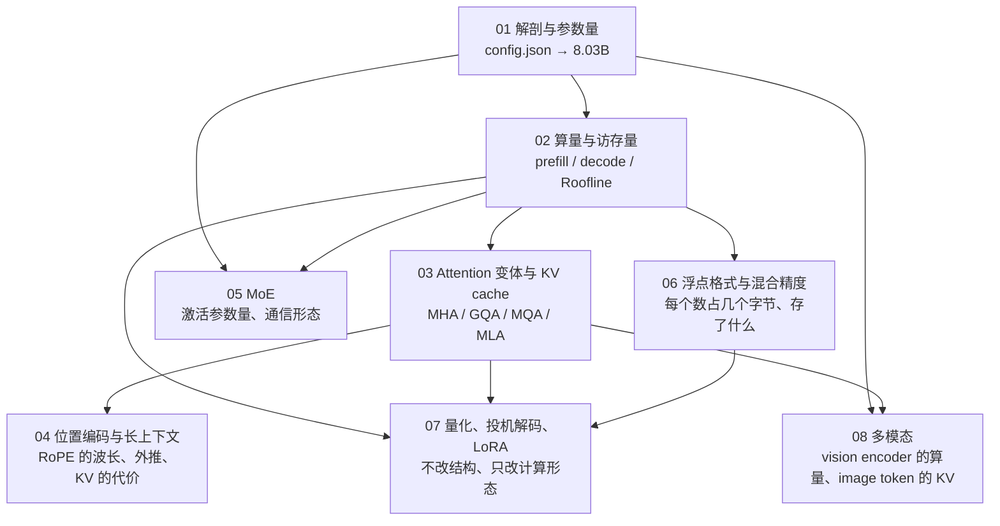
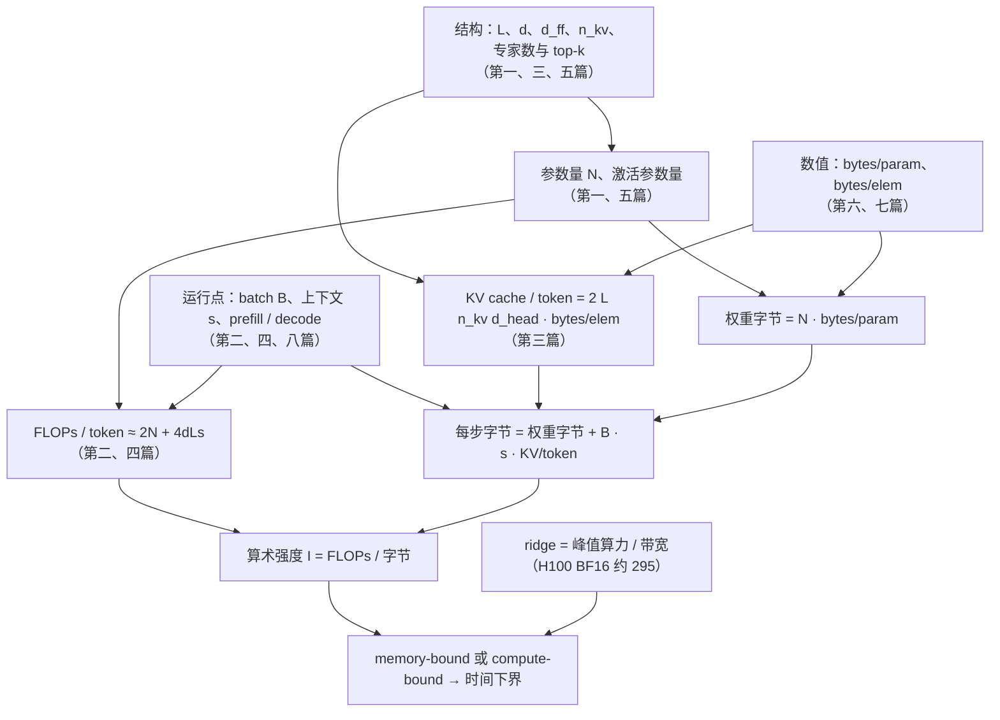

八篇正文回答了一个问题：**把一个 LLM 当作计算对象，它的每一步算多少、读多少、存多少、传多少**。前两篇从 `config.json` 算出参数量、FLOPs 与字节数，建立 Roofline 上的成本模型；第三到五篇看三种结构改动（GQA / MLA、RoPE 与长上下文、MoE）各改了成本表的哪一格；第六、七篇看数值与方法（浮点格式、量化、投机解码、LoRA）如何改变每个数占几个字节、每步产出几个 token；第八篇把输入换成图片，看 token 数不再由 tokenizer 决定时账怎么变。八篇合起来，是[《Transformer 与 LLM：结构、算量与数值》](/transformer-and-llm-for-infra-engineers.html)那张成本表的推理侧与结构侧。

本文不讲新内容，做三件事：把八篇压成一张表与八段回顾，把贯穿八篇的几条线拎出来，然后给一套三段式的通关自测——判断与计算、跨篇综合、面试题。各篇末尾的自测检验的是"这一篇读懂了没有"，这里检验的是"八篇能不能连起来用"。

> **读完这八篇，你应该能回答哪些问题？[^q0] 哪些数字与结论必须能脱口而出？[^q1] 怎么判断自己是"读过"还是"掌握"了？[^q2]**

先把整个系列放在一张图上——箭头是**推导或前置上的依赖**（箭头尾端的结论被箭头头端当作前提），不是阅读顺序：

## 一、总览：系列回答的问题与主线

系列的一句话主张是：**一个 LLM 的成本由四组变量决定——结构、运行点、数值、方法——多模态加第五组；每一格都有公式，代入 `config.json` 就能算出数字，不必等 benchmark**。八篇用同一种方法（写出公式 → 代入真实模型的超参 → 算出数字 → 解释对系统的意义）、同三个模型（Llama-3-8B / 70B 代表 dense + GQA，DeepSeek-V3 代表 MLA + 细粒度 MoE + FP8；Mixtral 8x7B 与四个多模态模型作对照）、同一张卡（H100 SXM：80 GB、3.35 TB/s、BF16 989 TFLOPS），把这张表逐格填满。

| 篇 | 回答的问题 | 一句话结论 | 必记的数字 / 公式 |
|---|---|---|---|
| [第一篇：Transformer 解剖与参数量](/transformer-anatomy-and-parameter-count.html) | 给一个 `config.json`，五分钟内算出参数量与分布，误差 1% 以内？ | dense Transformer 没有隐藏参数：每层四个 attention 矩阵 + 三个 SwiGLU 矩阵，乘层数加词表，精确到个位 | $$N = L[d(2d + 2d_{kv}) + 3d \cdot d_{ff} + 2d] + 2Vd + d$$；8B = 8,030,261,248；层内 FFN 约 80%；词表 8B 占 13%、70B 占 3% |
| [第二篇：前向的算量与访存量](/transformer-flops-bytes-and-roofline.html) | batch 多大 decode 才 compute-bound？考虑 KV 后达得到吗？ | decode 权重 GEMM 的算术强度等于 $$B$$，ridge 295；8K 下 KV 读取把总强度压在 18 以下，单卡任何 batch 都 memory-bound | 每参数每 token 2 FLOPs；attention 每层每 token $$4ds$$；训练 $$6ND$$；16.06 GB / 3.35 TB/s = 4.8 ms、208 token/s；$$I_{weight} = B$$、$$I_{KV} = g$$；64 GB 放 52 万 token 的 KV |
| [第三篇：Attention 变体与 KV cache](/attention-variants-and-kv-cache.html) | V3 128 头 61 层，KV cache 为什么比 32 头 32 层的 8B 小？代价？ | KV 只与 $$n_{kv}$$ 有关；MLA 缓存 512 + 64 维 latent，decode 吸收后等价于 128 头共享一个 KV 头的 MQA，用 3.4 倍 attention FLOPs 换 57 倍字节 | $$\text{bytes/token} = 2 L n_{kv} d_{head} \cdot \text{bytes/elem}$$；8B 128 KiB（MHA 512 KiB）、70B 320 KiB、V3 68.6 KiB（MHA 3.81 MiB）；decode attention 强度 4 / 8 / 242 |
| [第四篇：位置编码与长上下文](/positional-encoding-and-long-context.html) | 8K 训练的 RoPE 模型为什么不能直接推 32K？base 改到 500000 解决了什么？ | 每个维度对是一个有波长的旋转；8K 时 14 对低频维度没转完一圈，外推出现从未见过的相位；改 base 让 128K 可区分，但"见过"只能靠训 | $$\lambda_i = 2\pi \cdot \text{base}^{2i/d_{head}}$$，6.28 到 5.4 万（base 10000）、256 万（500000）；交叉点 8B 28.6K、70B 53.8K；8B 128K prefill 6.5 PFLOP、约 11 s |
| [第五篇：MoE 的路由、激活参数量与通信形态](/moe-compute-and-communication.html) | V3 每 token 只算 37B，为什么比 dense 70B 难部署得多？ | 三个"参数量"分开：总参数定显存、激活参数定 FLOPs、每步实际读取的参数定 decode 带宽——中等 batch 下几乎读全部专家 | $$E[1 - (1 - k/E)^B]$$：$$B = 32$$ 时 163 个、读 434B；FP8 671 GB 放不进 640 GB；每 token 每层 dispatch 56 KiB + combine 112 KiB；每专家 GEMM $$Tk/E$$ 行 |
| [第六篇：浮点格式、数值稳定性与混合精度](/floating-point-formats-and-mixed-precision.html) | BF16 相对精度只有 FP16 的 1/8，为什么成了默认？用在权重更新上会怎样？ | 指数位定范围、尾数位定精度；前向反向要范围，更新要精度——所以 BF16 计算 + FP32 master weights | BF16 1/8/7、单位舍入 $$2^{-8} \approx 0.004$$；FP16 最大 65504、$$e^x$$ 在 $$x > 11.09$$ 溢出；E4M3 最大 448 无 inf；$$k = 4096$$ BF16 累加噪声 25%；16 B/参数、8B 训练状态 128 GB |
| [第七篇：量化、投机解码与 LoRA](/quantization-speculative-decoding-and-lora.html) | INT4 decode 快 prefill 慢、投机 batch 1 有效 batch 64 无效，为什么是同一条 Roofline？ | 两者都在兑现 memory-bound 区间里空转的算力：量化改 $$W_{bytes}$$，投机改每步的 $$m$$；过 ridge 收益同时消失；LoRA 省的是训练状态 | INT4 g128 = 4.25 bit，8B 4.27 GB、4.8 → 1.27 ms，转折 $$\text{ridge}/4 \approx 79$$；$$\mathbb{E}[\text{tokens}] = (1 - \alpha^{\gamma+1})/(1 - \alpha) = 3.36$$、加速 2.4 倍、转折 $$\text{ridge}/(\gamma + 1) \approx 60$$；LoRA 41.9M（0.52%），128 GB → 16.7 GB |
| [第八篇：多模态：vision encoder 的算量与 image token 的 KV 代价](/multimodal-vision-encoder-cost-and-image-token-kv.html) | 一张 1024² 的图在 Qwen2-VL 里等于多少 token？代价在哪？ | 图片贵的不是 encoder（一次性、compute-bound），是它变成的 token 在 decoder 里占的 KV——与同长文本同价，活到请求结束 | $$n_{img} = \lceil H/28 \rceil \lceil W/28 \rceil$$，1024² → 1369；encoder 11.8 TFLOP；70B 规格 KV 428 MiB 是 encoder 输出 21 MiB 的 20 倍；同一张图 576 到 6404 token |

Table: 八篇的核心问题、结论与必记公式

### 1. 本文的章节安排

| 章 | 内容 |
|---|---|
| 二 | 逐篇回顾：核心问题、结论、必记、常见误解 |
| 三 | 贯穿八篇的四条线：一条 Roofline、KV cache 与上下文长度、"参数量"拆成几个数、字节里存了什么 |
| 四 | 常见误区表 |
| 五 | 通关自测：A 判断与计算 10 题、B 跨篇综合 5 题、C 面试题 7 题、D 掌握判据 |
| 六 | 下一步 |

Table: 本文的章节安排

## 二、逐篇回顾

### 1. 第一篇：Transformer 解剖与参数量：从 config.json 算出 8.03B

**核心问题**：给任意一个模型的 `config.json`，不运行代码，能不能在五分钟内算出参数量，并说出它在 attention、FFN、embedding 之间怎么分配？误差要在 1% 以内。

**结论**：能，而且精确。每层是 attention 四个矩阵（$$W_K, W_V$$ 的列数是 $$n_{kv} d_{head}$$，GQA 只是 $$n_{kv} < n_h$$）加 SwiGLU 三个矩阵 $$3 d \cdot d_{ff}$$，Llama 的 14336 来自 $$\frac{2}{3} \cdot 4d \times 1.3$$ 向上对齐到 1024 的倍数；乘层数、加词表，Llama-3-8B 得 8,030,261,248，70B 与 405B 也与公布值一致——RoPE、softmax 都没有参数。DeepSeek-V3 骨架相同，只是 attention 换成 MLA 的六个矩阵、FFN 换成 257 个专家：总参数 671B、每 token 激活 37B，"参数量"第一次不再单独对应成本。

**必记**：

- $$N = L[d(2d + 2d_{kv}) + 3d \cdot d_{ff} + 2d] + 2Vd + d$$，$$d_{kv} = n_{kv} d_{head}$$；tied 时词表只算一份。
- 8B：attention 每层 41.94M、FFN 176.16M，32 层 6.98B，embedding 与 lm_head 各 525.3M。
- 层内 FFN 约 80%；词表 8B 占 13%、70B 3%、405B 约 1%。
- 参与 GEMM 的是 7.5B（embedding 只查表）——下一篇 15.0 GFLOPs 的来源。

**常见误解**：用 $$4d$$ 当 $$d_{ff}$$、按两矩阵算 SwiGLU、漏掉不共享的 lm_head、把 K/V 当 MHA 算，各造成 5% 到 30% 的偏差；把 embedding 也乘 2 算进 FLOPs，多算约 7%。

### 2. 第二篇：前向的算量与访存量：prefill、decode 与 Roofline

**核心问题**：Llama-3-8B 在一张 H100 上，batch 多大时 decode 从 memory-bound 变成 compute-bound？考虑 KV cache 之后，这个 batch 还能达到吗？

**结论**：每参数每 token 2 FLOPs，attention 上下文项每层每 token $$4ds$$；decode 每步把参与 GEMM 的权重读一遍（约 15.0 GB，驻留 16.06 GB；与 batch 无关）加全部 KV，于是 BF16 decode 权重 GEMM 的算术强度在数值上就等于 $$B$$，而 ridge 是 $$989 / 3.35 \approx 295$$——这就是"decode 是 memory-bound 的"的全部含义。要 compute-bound 需 $$B \approx 295$$，但 8K 上下文下这些请求的 KV 要 295 GiB，放不进剩下的 64 GB；且 KV 读取的强度是常数 $$g = 4$$、不随 batch 摊薄，总强度趋于 18——单卡 8B 在任何可行 batch 下都 memory-bound，真正的约束是 $$B \times s \le 52$$ 万 token。prefill 在 ridge 右侧很远，8K 峰值下 0.14–0.16 s 是物理下限，按 60% 经验 MFU 约 0.24–0.27 s。

**必记**：

- $$T \ge \max(\text{FLOPs}/P_{peak},\ \text{Bytes}/BW)$$；ridge H100 295、A100 156、FP8 590。
- 8B 每 token 权重 FLOPs 15.0 G，attention 8K 4.3 G、128K 68.7 G；decode 理想下界约 4.5 ms、220 token/s（按全部 16.06 GB 粗算是 4.8 ms / 208）；70B 141 GB → 42 ms。
- $$I_{weight} = B$$、$$I_{KV} = n_h / n_{kv} = g$$；8K、$$B = 64$$ 时读 84.8 GB、25.3 ms、有效 batch 约 15。
- 训练 $$6ND$$（重算 $$8N$$）；激活 $$sbh(34 + 5as/h)$$，8K 时每层 11 GiB 其中 10 GiB 是 $$s^2$$ 项；MFU 40–50% 已是好成绩。

**常见误解**："模型多大"对 decode 的度量是字节，不是 FLOPs：FFN 砍一半下界不变，INT4 让下界降到约 1.3 ms。kernel 写得再好也不能让 $$B = 1$$ 的 decode compute-bound。

### 3. 第三篇：Attention 变体与 KV cache：MHA、GQA、MQA 与 MLA 的推导

**核心问题**：DeepSeek-V3 有 128 个 attention head、61 层，KV cache 却比 32 头 32 层的 Llama-3-8B 小。这是怎么做到的？代价是什么？

**结论**：KV cache 每 token $$2 L n_{kv} d_{head} \cdot \text{bytes/elem}$$，公式里没有 $$n_h$$。GQA 直接减 $$n_{kv}$$，$$g = n_h / n_{kv}$$ 同时把字节缩 $$g$$ 倍、把 decode attention 强度从 1 提到 $$g$$。MLA 把 K、V 压成 512 维 latent 加 64 维解耦 RoPE key（位置相关的旋转吸不进与位置无关的升维矩阵），每层 576 个数、61 层 BF16 共 68.6 KiB，比自己用 MHA 的 3.81 MiB 小 57 倍；decode 时把升维矩阵吸收进 $$W_Q$$、$$W_O$$，等价于 128 头共享一个 576/512 维 KV 头的 MQA，强度约 242，代价是 attention FLOPs 约 3.4 倍，所以 prefill 走非吸收路径。物化的 $$S = QK^\top$$ 在 8K、32 头下每层 4 GiB，FlashAttention 分块 + online softmax 把 HBM 流量降到 $$O(s^2 d^2 / M)$$。

**必记**：

- 8B GQA 128 KiB/token（MHA 512 KiB）、70B 320 KiB、V3 68.6 KiB；128K 上下文 16 / 40 / 8.6 GiB。
- decode attention 强度：MHA 1、8B 4、70B 8、MLA 吸收后 242；不随 $$B$$、$$s$$ 变。
- 判断 MLA 看 `kv_lora_rank`；`num_key_value_heads: 128` 不能套 GQA 公式。
- 容量四乘子：结构定元素个数、量化定 bytes/elem（FP8 KV 8B 64 KiB、V3 34.3 KiB）、分页定碎片率、prefix 共享定复用倍数；8B 单卡 8K 最大并发约 59、128K 只有 3。

**常见误解**："head 多 KV 就大"——KV 只看 $$n_{kv}$$。"MLA 是免费的压缩"——它多算 3.4 倍 attention FLOPs、要维护两条等价路径与专用 kernel，且不能从 MHA checkpoint 直接转换。

### 4. 第四篇：位置编码与长上下文：RoPE 的波长、外推与代价

**核心问题**：一个用 8K 上下文训练的 RoPE 模型，为什么不能直接推理 32K？把 base 从 10000 改到 500000 解决了什么，没解决什么？

**结论**：RoPE 把 $$d_{head}$$ 维向量看成 $$d_{head}/2$$ 个复数，第 $$i$$ 对以 $$\theta_i = \text{base}^{-2i/d_{head}}$$ 旋转，$$q_m^\top k_n$$ 只依赖 $$m - n$$。每一对的波长 $$\lambda_i = 2\pi \cdot \text{base}^{2i/d_{head}}$$ 是钥匙：base 10000、$$d_{head} = 128$$ 时从 6.28 到 5.4 万，训练长度 8K 时 $$i \ge 50$$ 的 14 对没转完一圈，推到 32K 这些维度出现从未见过的相位——不是装不下，是没见过。PI 把所有 $$\theta_i$$ 除以 factor，NTK-aware 改 base 让最低频恰好插值、最高频不动，YaRN 按转过的圈数分三段再修正温度 $$\sqrt{1/t} = 0.1 \ln(\text{factor}) + 1$$。base 500000 把最低频波长拉到 256 万、让 128K 内的位置可区分，但"见过"仍要靠长序列训练，成本也一分不省：KV 的线性项、prefill attention 的二次项、不能物化的 $$s \times s$$ logits。

**必记**：

- 交叉点（attention = 权重）：8B 约 28.6K、70B 约 53.8K；128K 时 8B attention 68.7 G 是权重的 4.6 倍，70B 344 G 对 141 G。
- 8B 128K prefill $$2.0 + 4.5 = 6.5$$ PFLOP、60% MFU 约 11 s；70B 约 41 PFLOP、69 s；128K KV 8B 16 GiB、70B 40 GiB。
- 滑窗把 KV 与算量从 $$O(s)$$ 变 $$O(W)$$（Mistral $$W = 4096$$）但丢信息；交错把系数变 $$1/k$$；sink + 滑窗保留开头 4 个 token 并用 cache 内相对位置；MLA 减系数不减阶。
- 对 Infra：KV 定并发、二次项定 TTFT、chunked prefill 防止 128K 请求独占 GPU 11 s、序列并行把单请求切到多卡。

**常见误解**："上下文长度是显存问题"——首先是位置问题。"改 base 就能免费扩上下文"——它只让长距离可区分，不替代长序列训练，也不减少二次项。

### 5. 第五篇：MoE：路由、激活参数量与通信形态

**核心问题**：DeepSeek-V3 每 token 只算 37B 参数，为什么部署它比部署一个 dense 70B 难得多？把"参数量"、"激活参数量"、"每步实际读取的参数量"三个数分开算。

**结论**：总参数 671B 决定显存——FP8 下也是 671 GB，一台 8 卡 H100（640 GB）放不下；激活参数 37B 决定 FLOPs——74 GFLOPs，是 70B 的一半；每步实际读取的参数决定 decode 带宽——期望激活专家数 $$E[1 - (1 - k/E)^B]$$ 在 $$B = 32$$ 时 163 个、读 434B，$$B = 128$$ 时 252 个，"稀疏"节省了算量但没有节省访存。出路是专家并行（简化模型下 EP32 每卡约 37 GB，EP320 每卡 19.6 GB；真实部署 attention 另做 TP4 × DP、共享专家也走路由，数字会不同），代价是每层两次 all-to-all（每 token 每层 dispatch FP8 56 KiB + combine BF16 112 KiB，是 TP-8 all-reduce 的 6.7 倍）、每专家 GEMM 只有 $$Tk/E$$ 行、最慢的卡决定全层时间；节点受限路由（每 token 最多 4 个节点）、aux-loss-free 均衡、冗余专家都围绕这些代价。TP-8 会把 $$d_{ff} = 2048$$ 的专家切成 256 列，GEMM 太瘦，且不减少每卡读的专家数。

**必记**：

- Mixtral 8x7B：8 × 14336 取 top-2，总 46.7B、激活 12.9B；V3：256 × 2048 取 top-8 + 1 共享，每专家 44.04M，58 个 MoE 层。
- 期望激活专家数：V3 $$B = 1/32/128$$ → 8 / 163 / 252；Mixtral $$B = 8$$ 就几乎读全部；V3 $$B = 32$$ 每步读 434 GB（FP8），是 70B 141 GB 的 3 倍。
- all-to-all 每 token 每层 168 KiB；4096 token 的 prompt 每层 672 MiB、58 层 38 GiB。
- 专家 GEMM 强度是 $$Tk/E$$，比 dense 低 $$E/k = 32$$ 倍；过 ridge 需一层里约 9600 个 token。

**常见误解**："激活 37B 就像 37B 的 dense 一样部署"——显存 9.5 倍、中等 batch 下每步访存 6–9 倍。"MoE 的通信也是 all-reduce"——EP 是 all-to-all，量与 $$k \cdot d$$ 成正比、与专家参数量无关。

### 6. 第六篇：浮点格式、数值稳定性与混合精度

**核心问题**：BF16 的相对精度只有 FP16 的 1/8，为什么它反而成了训练的默认格式？把它同时用在权重更新上会出什么问题？

**结论**：指数位决定范围、尾数位决定精度；前向反向需要范围，权重更新需要精度。BF16 用 3 位尾数换 3 位指数，范围与 FP32 相同，不需要 FP16 那套 loss scaling；但每步更新 $$\Delta w / w$$ 在 $$10^{-4}$$ 到 $$10^{-3}$$，低于 BF16 的单位舍入 $$2^{-8} \approx 0.004$$，$$1.0 + 0.001$$ 被舍回 1.0——所以必须留 FP32 master weights，这是每参数 16 字节里的 4 字节。同一个道理管着累加：$$k = 4096$$ 的点积在 BF16 中累加噪声约 $$\varepsilon \sqrt{k} = 25\%$$；FP8 Tensor Core 约 14 位的累加精度迫使 DeepSeek-V3 每 128 项提升到 FP32，与激活 $$1 \times 128$$、权重 $$128 \times 128$$ 的分块 scale 对齐。两个 kernel 的差异在 $$\varepsilon$$ 到 $$\varepsilon \sqrt{k}$$ 之间是噪声，大几个数量级或有系统性符号才是 bug。

**必记**：

- FP32 1/8/23、FP16 1/5/10、BF16 1/8/7、E4M3 1/4/3（最大 448，无 inf）、E5M2 1/5/2；FP16 最大 65504、最小正规数 $$6.1 \times 10^{-5}$$、$$e^x$$ 在 $$x > 11.09$$ 溢出，BF16 / FP32 阈值 88.7。
- 训练状态 16 B/参数（2 + 2 + 4 + 4 + 4）：8B 128 GB、70B 1129 GB、671B 10.7 TB；V3 配方 13 B/参数（master 与累积梯度仍 FP32、m/v BF16）约 8.7 TB。
- FP8 分工：E4M3 存权重与激活，E5M2 存梯度；分块 128 让一个离群值只影响 1/56 的元素。
- 数值丢失的四个位置：大数吃小数、长求和、指数溢出（softmax 减最大值）、相消（Welford）；QK-norm 把 logit 上界压到 $$\sqrt{d_{head}} \cdot g_q g_k \approx 11.3 g_q g_k$$。

**常见误解**："BF16 精度差所以不如 FP16"——深度学习选范围不选精度。"两个 kernel 结果逐位不同就是 bug"——BF16 GEMM 相对 FP32 参考在 $$10^{-3}$$ 到 $$10^{-2}$$ 是正常的。

### 7. 第七篇：量化、投机解码与 LoRA：改变计算形态的三种方法

**核心问题**：同一个 INT4 量化模型，decode 快 3 倍，prefill 反而慢；同一套投机解码，batch 1 时加速 2 倍，batch 64 时没有收益。为什么背后是同一条 Roofline？

**结论**：三种方法不改结构，各改一个变量。时间模型 $$T(m) = \max(W_{bytes}/BW,\ 2Nm/F)$$，8B 上访存 4.8 ms、算力每行 15.2 μs。量化改 $$W_{bytes}$$：INT4 + group 128 约 4.25 bit，8B 4.27 GB、下界 1.27 ms，算力时间不变，追上访存的位置是 $$B^* \approx 79 \approx \text{ridge}/4$$；prefill 本就 compute-bound 还多了反量化。投机解码改每步的 $$m$$：小模型起草 $$\gamma$$ 个，大模型一次前向验证 $$\gamma + 1$$ 个，输出分布严格不变；$$\alpha = 0.8$$、$$\gamma = 4$$ 时期望 3.36 个 token，$$c = 0.1$$ 时加速 2.4 倍，前提是 $$B \lesssim \text{ridge}/(\gamma + 1) \approx 60$$。LoRA 改训练时的 $$N$$：冻结 $$W$$ 训 $$BA$$，权重侧从 128 GB 降到 16.7 GB，但激活值不变、反向仍要穿过每一层（约 $$4N$$ 而非 $$6N$$）。

**必记**：

- INT4 g128 4.25 bit：8B 4.27 GB、70B 37.5 GB（单卡放下）；W4A16 转折 $$B \approx 79$$；W8A8 字节减半且算力翻倍，对 prefill 也有效；实测 decode 约 3 倍而非 4 倍（lm_head 保留 FP16、KV 读取不减）。
- GPTQ 用 Hessian 把误差补偿到未量化的列；AWQ 保护激活幅度最大的约 1% 通道；SmoothQuant $$s_j = \max\lvert X_j\rvert^{\alpha} / \max\lvert W_j\rvert^{1-\alpha}$$ 把激活的离群迁到权重；FP8 比 INT8 对离群值宽容。
- $$\mathbb{E}[\text{tokens}] = (1 - \alpha^{\gamma+1})/(1 - \alpha)$$，加速 $$\approx \mathbb{E}[\text{tokens}] / (\gamma c + 1)$$；V3 的 MTP 接受率 85–90%，约 1.8 倍。
- LoRA：attention 四矩阵 13.6M（0.17%），七矩阵 41.9M（0.52%）；70B 207M（0.29%）；额外 FLOPs $$r(d_{in} + d_{out}) / (d_{in} d_{out})$$，$$W_Q$$ 上 0.78%；QLoRA 底座约 4.5 GB，用时间换显存。

**常见误解**："量化就是加速"——只在 decode 且 $$B \lesssim \text{ridge}/k$$ 时兑现。"LoRA 省算力"——它省的是每参数 16 字节的状态，长序列仍要激活重算。

### 8. 第八篇：多模态：vision encoder 的算量与 image token 的 KV 代价

**核心问题**：一张 1024×1024 的图片在 Qwen2-VL 里等于多少个 token？它的代价花在 encoder、connector 还是 decoder 的 KV 上？为什么"encoder 输出只有二十来 MB"与"这张图占 400 MB 显存"同时成立？

**结论**：一张图经过三段，每段一笔账。vision encoder 把图切成 $$p = 14$$ 的 patch，ViT 每层 $$12 d_{vit}^2$$ 参数，一张图 $$2 N_{vit} n_p + 4 L_{vit} n_p^2 d_{vit}$$ FLOPs，Qwen2-VL 的 0.63B ViT 处理 1024² 的 5476 个 patch 要 11.8 TFLOP——一次性、compute-bound、与 batch 无关。connector 决定 token 数：MLP 不压缩（LLaVA 576）、2×2 merge 除 4（Qwen2-VL 1024² → 1369）、resampler 定长，同一张图从 576 到 6404 差 11 倍。image token 进入 decoder 后与文本没有任何区别：70B 规格下 1369 个 token 的 encoder 输出 21 MiB 用完即弃，KV 428 MiB 活到请求结束，比值 $$2 L n_{kv} d_{head} / d_{model} = 20$$。cross-attention 注入（Llama 3.2 Vision）用 0.5B 参数换序列长度，图片 KV 从 800 MiB 降到 200 MiB。

**必记**：

- ViT：CLIP-L/14-336 0.3B、576 patch、0.38 TFLOP；Qwen2-VL 0.63B、5476 patch、11.8 TFLOP，attention 二次项占 42%；encoder 参数只是 decoder 的 4–10%。
- $$n_{img} = \lceil H/28 \rceil \lceil W/28 \rceil$$：336² → 144、1024² → 1369、1920×1080 → 2691。
- 70B 规格 1369 token：prefill 193 TFLOP、KV 428 MiB、encoder 输出 21 MiB；比值 20（8B 是 16，Qwen2-VL-7B 是 8）；一分钟 720p 1 fps 视频 35880 token；Whisper 50 token/秒。
- 训练侧：冻结 encoder 两样都省，主项是激活值（10 GB 量级），状态是小头（9 GB 对 LLM 的 122 GB）；图片解码把数据管线瓶颈搬到 CPU。

**常见误解**："多模态贵在 vision encoder"——encoder 12 ms 对 prefill 195 ms，且输出用完即弃；一张 1024² 图就是一段 1369 token、无法被 tokenizer 压短的 system prompt。"按图片张数预算"——原生动态分辨率下 $$n_p$$ 相差三个数量级，必须按像素预算。

## 三、贯穿全系列的几条线

### 1. 一条 Roofline，八篇都在它上面

第二篇建立的坐标系被之后每一篇复用：ridge $$= P_{peak} / BW \approx 295$$，BF16 decode 权重 GEMM 的强度恰好是 $$B$$，KV 读取的强度是 $$g$$。第三篇把 MLA 的价值说成"把这个常数从 4 抬到 242"；第四篇指出 prefill 的二次项无法靠 batch 摊薄，因为它本来就在 ridge 右侧；第五篇发现 $$I = B$$ 在 MoE 上不成立——每个专家只分到 $$Tk/E$$ 行，强度比 dense 低 32 倍，要过 ridge 需要一层里同时有约 9600 个 token，这是 EP320 在 decode 上汇聚全部请求的另一个理由；第七篇把三种方法放回同一条线：量化把转折点移到 $$\text{ridge}/4$$，投机解码移到 $$\text{ridge}/(\gamma + 1)$$，两者都只在斜线段上兑现；第八篇指出 encoder 的 5476 行 GEMM 在 ridge 右侧很远，用 batch 摊不掉。

一个附带结论贯穿始终：ridge 从 A100 的 156 涨到 H100 的 295、FP8 下 590，算力增长快于带宽，同一个模型同一个 batch 在新一代 GPU 上更容易 memory-bound。

### 2. KV cache 与上下文长度：从一个给定的数到最大的优化空间

第二篇把 128 KiB/token 当给定值用，算出 8K、$$B = 64$$ 时 KV 读取是权重的四倍、有效 batch 只有 15。第三篇打开这个数：结构（GQA 的 $$n_{kv}$$、MLA 的 $$d_c + d_h^R$$）定元素个数，量化定 bytes/elem，分页定碎片率，prefix 共享定复用倍数，四个乘子独立叠加可差两三个数量级。第四篇加上 $$s$$ 这个维度：KV 是线性项定并发（70B 128K 一条请求 40 GiB），attention 是二次项定 TTFT（8B 128K 11 s），滑窗改阶、交错改系数、MLA 只改系数；位置编码决定 $$s$$ 能不能变大，成本决定它该不该。第七篇的 KV 量化把 bytes/elem 从 2 减到 1；第八篇揭示多模态请求的 KV 由分辨率而非文本长度决定，一张图等于 1369 个 token 的 KV，比 encoder 输出大 20 倍，且方差远大于文本。

这条线的落点是容量规划：$$B \times s \le$$ 显存预算 / 每 token KV，显存填满时吞吐与上下文长度成反比，长上下文贵的原因不在调度，在 HBM 字节数。

### 3. "参数量"被拆成几个数

第一篇算出精确的 $$N$$，同时埋下第一个分裂：embedding 有参数但不进 GEMM，参与算量的是 $$N_{gemm} = 7.5$$B。第二篇由此得到 FLOPs/token $$= 2N_{gemm}$$、字节 $$= N \cdot \text{bytes/param}$$，并指出对 decode 而言"多大"的正确度量是字节。第五篇拆成三个数：总参数定显存、激活参数定 FLOPs、每步实际读取的参数定带宽——V3 是 671B / 37B / 随 batch 从 37B 到 671B。第六篇把 bytes/param 从推理的 2 扩展到训练的 16，8B 的 128 GB 训练状态是 ZeRO 与 FSDP 存在的理由。第七篇再拆两次：INT4 让 bytes/param 变成 4.25 bit，LoRA 让可训练参数变成 $$N$$ 的 0.52%。第八篇加进 encoder 的 0.3–0.8B，并说明它在显存账里不是主角。

### 4. 字节里存了什么：数值贯穿结构与方法

前五篇默认每个数 2 字节，但 FP8 早已出现：第二篇给出 FP8 decode 强度 $$2B$$、ridge 590，第三篇 V3 的 KV 可用 FP8 存成 34.3 KiB，第五篇 dispatch 用 FP8、combine 用 BF16。第六篇解释这些选择：指数位定范围、尾数位定精度；E4M3 存权重与激活、E5M2 存梯度；scale 的粒度决定一个离群值拖累多少邻居，V3 的 128 分块与每 128 项提升 FP32 累加是同一个设计。第七篇把同样的原理用到推理量化：FP8 比 INT8 对离群值宽容，因为步长是相对的；SmoothQuant 与 AWQ 是同一个 $$\text{diag}(s)$$ 分解的两个方向；KV 量化时 K 比 V 更敏感。第六篇的 QK-norm、第四篇的 attention 温度、第三篇 MLA 的 nope / rope 两段范围不同，都是"数值决定结构细节"的例子。

把四条线合在一张依赖图上，就是八篇共用的成本模型——结构与数值决定三组量，运行点决定工作点，相除后与 ridge 比较：

| 概念 | 出现的篇 | 关系 |
|---|---|---|
| ridge point、算术强度 | 二、三、五、七、八 | 二定义；三用 MLA 抬高 KV 读取的强度；五指出专家 GEMM 强度是 $$Tk/E$$；七给量化与投机的转折点；八说明 encoder 在右侧 |
| KV cache / token | 二、三、四、七、八 | 二当给定值；三给公式与四乘子；四加上 $$s$$ 与并发；七量化减半；八 image token 同价 |
| 上下文长度 $$s$$ | 二、三、四、八 | 二给 $$4ds$$ 与 $$s^2$$；三给 $$s \times s$$ 的 logits 与 FlashAttention；四给波长、外推与 11 s；八让 $$s$$ 由分辨率决定 |
| 参数量 / 激活参数 / 每步读取 | 一、二、五、七 | 一算 $$N$$；二分出 $$N_{gemm}$$；五拆成三个数；七改 bytes/param 与可训练比例 |
| bytes/elem 与 FP8 | 二、三、五、六、七 | 二给 FP8 的 ridge 590；三给 FP8 KV；五给 FP8 dispatch；六解释格式与累加；七给 FP8 对离群值的宽容 |
| 训练状态 16 B/参数 | 六、七、八 | 六推导；七用 LoRA 降到冻结权重 + 可忽略；八说明冻结 encoder 省的主要是激活、状态是小头 |
| RoPE | 三、四、八 | 三解释 MLA 为什么必须解耦 RoPE；四推导波长与外推；八的 M-RoPE 把维度分给 $$(t, h, w)$$ |

Table: 贯穿八篇的概念及其关系

## 四、常见误区

| 误区 | 为什么错 | 正确的说法 | 出处 |
|---|---|---|---|
| FFN 中间维度就是 $$4d$$ | Llama 用 SwiGLU 三矩阵，14336 = $$\frac{2}{3} \cdot 4d \times 1.3$$ 对齐到 1024 | 以 `intermediate_size` 为准，且数三个矩阵 | [第一篇](/transformer-anatomy-and-parameter-count.html) |
| 每 token FLOPs 就是 $$2 \times$$ 全部参数 | embedding 是查表，FLOPs 为零 | $$2 N_{gemm}$$，8B 是 $$2 \times 7.5$$B = 15 GFLOPs | [第一篇](/transformer-anatomy-and-parameter-count.html)、[第二篇](/transformer-flops-bytes-and-roofline.html) |
| decode 慢是因为算力不够 | $$B = 1$$ 时算力时间 0.02 ms，访存 4.8 ms | 强度等于 $$B$$，距 ridge 295 两个数量级，是 memory-bound | [第二篇](/transformer-flops-bytes-and-roofline.html) |
| batch 开到 300 就能把 H100 用满 | 8K 下 295 个请求的 KV 要 295 GiB，且 KV 读取的强度是常数 $$g$$ | 总强度趋于 18，单卡任何可行 batch 都 memory-bound；约束是 $$B \times s \le 52$$ 万 | [第二篇](/transformer-flops-bytes-and-roofline.html) |
| head 越多 KV cache 越大 | KV 公式里只有 $$n_{kv}$$，没有 $$n_h$$ | V3 128 头 68.6 KiB 比 8B 的 128 KiB 还小；看 `kv_lora_rank` | [第三篇](/attention-variants-and-kv-cache.html) |
| 把 base 改成 500000 就能免费用 128K | 改 base 只让长距离可区分，没见过的相位仍要训 | "见过"靠长序列训练；高频维度不变；二次项不减 | [第四篇](/positional-encoding-and-long-context.html) |
| 滑窗与 MLA 都是"减 KV"，作用一样 | 滑窗改阶但丢信息；MLA 改系数（57 倍）不改阶 | 两者正交，可以叠加 | [第四篇](/positional-encoding-and-long-context.html) |
| MoE 激活 37B，部署像 dense 37B | 显存按 671B 算，中等 batch 下每步几乎读全部专家 | 三个数分开：671B / 37B / 随 batch 从 37B 到 671B | [第五篇](/moe-compute-and-communication.html) |
| MoE 用 TP 切就行 | TP-8 把 2048 宽的专家切成 256 列，GEMM 太瘦，且不减少每卡读的专家数 | 大规模 EP 加 all-to-all；Mixtral 的 14336 宽专家单机 TP 才可行 | [第五篇](/moe-compute-and-communication.html) |
| BF16 精度低，训练应该用 FP16 | FP16 范围窄，小梯度下溢，要 loss scaling | 深度学习选范围不选精度；BF16 + FP32 master weights | [第六篇](/floating-point-formats-and-mixed-precision.html) |
| 权重量化让模型全面加速 | prefill 是 compute-bound，反量化是纯开销 | W4A16 只在 decode 且 $$B \lesssim \text{ridge}/4$$ 时兑现；W8A8 才对 prefill 有效 | [第七篇](/quantization-speculative-decoding-and-lora.html) |
| 多模态的成本在 vision encoder | encoder 一次性 12 ms、输出用完即弃 | 贵的是 image token 的 KV，是 encoder 输出的 20 倍且活到请求结束 | [第八篇](/multimodal-vision-encoder-cost-and-image-token-kv.html) |

Table: 常见误区与正确说法

## 五、通关自测

### A. 判断与计算（10 题）

1. 一个 dense 模型：$$L = 48$$、$$d = 6144$$、$$d_{ff} = 16384$$、$$n_h = 48$$、$$n_{kv} = 8$$、$$d_{head} = 128$$、$$V = 128256$$、不共享。参数量约多少？词表占比？

   

答案

   每层 attention $$6144 \times (2 \times 6144 + 2 \times 1024) = 88.1$$M，FFN $$3 \times 6144 \times 16384 = 302$$M，一层约 390M，48 层 18.7B；词表 $$2 \times 128256 \times 6144 = 1.58$$B；合计约 20.3B，词表占 7.8%——落在 8B 的 13% 与 70B 的 3% 之间。

   

2. Qwen2-VL 处理一张 1920×1080 的截图：多少个 image token？进入 Llama-3-8B 规格的 decoder（每 token KV 128 KiB、$$d_{model} = 4096$$）后 KV 多大、encoder 输出多大、比值多少？

   

答案

   $$\lceil 1920/28 \rceil \times \lceil 1080/28 \rceil = 69 \times 39 = 2691$$；KV $$2691 \times 128$$ KiB $$\approx 336$$ MiB；encoder 输出 $$2691 \times 4096 \times 2 \approx 21$$ MiB；比值 $$2 L n_{kv} d_{head} / d_{model} = 2 \times 32 \times 1024 / 4096 = 16$$。

   

3. Llama-3-8B、单卡 H100、BF16 KV：能同时服务 32 条 32K 上下文的 decode 请求吗？若不能，32K 下最多几条，那一步的下界与算术强度约多少？

   

答案

   $$32 \times 32768 \approx 105$$ 万 token，超过 64 GiB 预算的 52 万，放不下；最多 16 条（恰好用满，实际留余量是 15）。那一步读 KV 64 GiB + 权重 16.06 GB ≈ 84.8 GB，下界约 25 ms；每 token 的 attention 项在 32K 上下文是 $$0.524\text{M} \times 32768 \approx 17.2$$ G（不是 8K 的 4.3 G），FLOPs 约 $$16 \times (15.0 + 17.2)$$ G = 0.52 TFLOP，强度约 6——比 8K、$$B = 64$$ 的 15 还低，同样 25 ms 只产出 16 个 token。

   

4. 一个 decoder：$$L = 28$$、$$n_h = 28$$、$$n_{kv} = 4$$、$$d_{head} = 128$$、BF16。每 token KV 多少？若为 MHA 呢？decode 读 KV 的算术强度各是多少？一条 32K 请求的 KV 多大？

   

答案

   $$2 \times 28 \times 4 \times 128 \times 2 = 56$$ KiB（Qwen2-VL-7B 的 decoder）；MHA 时 $$n_{kv} = 28$$，392 KiB；强度 $$g = 7$$ 对 1；32K 请求 $$56 \times 32768 = 1.75$$ GiB。

   

5. 如果 DeepSeek-V3 把 `kv_lora_rank` 从 512 改成 1024（解耦 RoPE 仍 64 维），每 token 的 KV cache 多少？相对 MHA 的压缩比变成多少？

   

答案

   每层 $$1024 + 64 = 1088$$ 个数，$$61 \times 1088 \times 2 \approx 129.6$$ KiB；MHA 是 3.81 MiB，压缩比从 57 倍降到约 30 倍（$$3.81 \times 1024 / 129.6 = 30.1$$）——与 Llama-3-8B 的 128 KiB 相当。

   

6. Llama-3-8B 在 64K 上下文下，每 token 的 attention FLOPs 与权重 FLOPs 各多少？attention 占比多少？

   

答案

   attention $$0.524 \times 10^6 \times 65536 \approx 34.3$$ GFLOPs，权重 15.0 GFLOPs，占比约 70%——介于 32K 的 53% 与 128K 的 82% 之间，已过 28.6K 的交叉点。

   

7. Mixtral 8x7B 在 $$B = 4$$、DeepSeek-V3 在 $$B = 16$$ 时，一层里期望被激活的路由专家数各约多少？

   

答案

   Mixtral $$8 \times [1 - 0.75^4] \approx 5.5$$ 个（占 68%）；V3 $$256 \times [1 - 0.96875^{16}] \approx 102$$ 个（占 40%）——在 $$B = 8$$ 的 57 与 $$B = 32$$ 的 163 之间。

   

8. DeepSeek-V3 在 EP 下 prefill 一条 2048 token 的 prompt：每层 dispatch + combine 共多少字节？58 个 MoE 层合计多少？

   

答案

   每 token 每层 56 + 112 = 168 KiB，$$2048 \times 168$$ KiB = 336 MiB 每层；58 层约 19 GiB——4096 token 时的 38 GiB 减半，与序列长度成正比、与专家参数量无关。

   

9. 一行 attention logit 的最大值是 12，FP16 下不减最大值直接算 $$e^x$$ 会怎样？减掉最大值后呢？BF16 下呢？

   

答案

   $$e^{12} > 65504$$（阈值 $$\ln 65504 \approx 11.09$$），FP16 溢出成 inf、softmax 变 NaN；减最大值后指数最大为 $$e^0 = 1$$，安全；BF16 与 FP32 的阈值是 88.7，12 不溢出，但减最大值仍是标准做法。

   

10. 投机解码 $$\alpha = 0.6$$、$$\gamma = 3$$、$$c = 0.1$$：一轮期望产出几个 token？加速比多少？在 H100 上转折 batch 约多少？

    

答案

    $$\mathbb{E} = (1 - 0.6^4)/(1 - 0.6) \approx 2.18$$；加速 $$2.18 / (3 \times 0.1 + 1) \approx 1.67$$ 倍；验证 $$\gamma + 1 = 4$$ 个 token，转折 $$295 / 4 \approx 74$$——接受率低时收益远不如 $$\alpha = 0.8$$ 的 2.4 倍。

    

### B. 跨篇综合（5 题）

1. Llama-3-8B 用 INT4 g128 部署在一张 H100 上：给 KV cache 剩多少显存、能放多少 token？换成 FP8 KV 呢？128K 上下文各能放几条请求？

   

答案

   第七篇：权重 4.27 GB（若 embedding / lm_head 保留 BF16，第一篇算过约 5.6 GB），剩约 75 GB；第三篇：BF16 KV 128 KiB/token，约 58 万 token，128K 可放 4 条；FP8 KV 64 KiB，约 115 万 token，8 条。对照第二篇 BF16 权重下的 52 万——量化权重只把 KV 容量提高约 10%，量化 KV 才是翻倍。

   

2. Llama-3-70B 服务一条 128K 的请求：prefill 至少多久？这条请求的 KV 多大？decode 一步至少读多少字节？

   

答案

   第四篇：prefill 约 41 PFLOP（权重 18.5 + attention 22.5），单卡 60% MFU 69 s，8 卡 TP 完美线性也接近 9 s；第三篇：KV 320 KiB × 131072 = 40 GiB，单张 H100 一半显存；第二篇：每步读权重 141 GB + KV 43 GB ≈ 184 GB，按 3.35 TB/s 约 55 ms（单卡等效，实际必须多卡切分）。

   

3. 在 Llama-3-8B、$$B = 1$$ 上同时开 W4A16 与投机解码（$$\alpha = 0.8$$、$$\gamma = 4$$、$$c = 0.1$$）：理论上每 token 多快？两者的转折 batch 叠加后变成多少？

   

答案

   第七篇：INT4 让每次前向下界 1.27 ms，投机让一轮产出 3.36 个 token、成本 1.4 次前向；每 token 约 $$1.27 \times 1.4 / 3.36 \approx 0.53$$ ms、约 1900 token/s。第二篇的 Roofline：验证的 $$\gamma + 1 = 5$$ 行乘 INT4 的 4 倍强度，权重 GEMM 过 ridge 的 batch 是 $$295 / (4 \times 5) \approx 15$$——两个方法兑现的是同一份空转算力，叠加后收益区间缩得更窄。

   

4. DeepSeek-V3 里 FP8 出现在权重、KV cache、dispatch 三处，每处改变了什么、没改变什么？

   

答案

   第五篇：FP8 权重 671 GB 仍放不进 8 卡 640 GB，只是让 EP16 成为放得下的最小规模；第三篇：FP8 KV 让 68.6 KiB 变 34.3 KiB，128K 上下文 4.3 GiB；第五篇：dispatch 用 FP8 56 KiB、combine 用 BF16 112 KiB。第二篇：FP8 让 decode 权重强度变 $$2B$$、ridge 变 590，距离没变，仍需 $$B \approx 295$$；第六篇：E4M3 无 inf、范围只有 5 个十进制数量级，所以要 $$1 \times 128$$ / $$128 \times 128$$ 的分块 scale 与每 128 项提升 FP32 累加——字节减半的前提是这些开关全开。

   

5. 用 LoRA 微调 Qwen2-VL-7B（ViT 0.63B、connector 45M、LLM 7.6B），冻结 ViT：权重侧显存大约多少？冻结 ViT 省的主要是什么？一张 1024² 图的样本比纯文本样本多占什么？

   

答案

   第七篇：冻结 BF16 底座 15.2 GB + LoRA 状态（16 B/参数只作用在几十 M 上）不到 1 GB；第八篇：冻结 ViT 只省 9 GB 状态，主要省的是 ViT 前向 5476 个 patch × 32 层约 10 GB 的激活值，反向到 connector 就停；第六篇：全量 16 B/参数是 122 GB 的对照。这张图变成 1369 个 token，进入 decoder 后与文本同价——激活值随序列长度线性增长，且同一 batch 里 144 与 5476 并存，打包要按 token 数装箱。

   

### C. 面试题（7 题）

1. 给你一个新模型的 `config.json` 和一张 H100 的规格表，五分钟内你会算哪几个数来判断它能不能单卡部署、能开多大 batch、单请求最快多少？

   

答案

   **答案要点**：(1) 参数量：逐矩阵公式代入，盯住 `num_key_value_heads`、`intermediate_size`、`tie_word_embeddings`、有没有 `kv_lora_rank` 与专家字段；(2) 权重字节 $$N \times$$ bytes/param，与 80 GB 比，剩余给 KV；(3) 每 token KV $$2 L n_{kv} d_{head} \times 2$$，剩余显存 / KV 得 $$B \times s$$ 上限；(4) decode 下界 = 权重字节 / 3.35 TB/s，倒数是单流 token/s 上限；(5) prefill 下界 = $$(2 N_{gemm} s + 4dL s^2/2)$$ / (989 TFLOPS × MFU)；(6) MoE 要再算期望激活专家数决定每步读多少。
   **追问方向**：为什么 $$B \approx 295$$ 达不到；GQA 组数对 decode attention 强度的影响；实测与下界差在哪。
   **好答案与一般答案的区别**：一般答案只算参数量和权重字节；好答案把 KV、两个阶段的下界与 Roofline 位置一起给出，并说清哪些是理论下界、差距怎么归因。

   

2. 为什么 decode 是 memory-bound 的？工程上有哪几条出路，各改了成本模型里的哪个变量？

   

答案

   **答案要点**：(1) 权重每步读一遍 $$2N_{gemm}$$ 字节，只做 $$2 N_{gemm} B$$ FLOPs，强度 $$= B$$，$$B = 1$$ 距 ridge 295 两个数量级；(2) 提 $$B$$——continuous batching，但 KV 读取强度是常数 $$g$$、不随 batch 摊薄，8K 下总强度封顶 18；(3) 减字节——权重量化改 $$W_{bytes}$$（转折 $$\text{ridge}/4$$）、GQA / MLA / KV 量化改每 token KV；(4) 一步多出 token——投机解码改 $$m$$（转折 $$\text{ridge}/(\gamma + 1)$$）；(5) 多卡 TP 让每卡读 $$1/n$$ 权重，ridge 不变。
   **追问方向**：新一代 GPU 上为什么更容易 memory-bound（ridge 156 → 295 → 590）；MoE 上 $$I = B$$ 为什么不成立。
   **好答案与一般答案的区别**：一般答案说"带宽瓶颈"；好答案写出 $$I = B$$ 与 $$I_{KV} = g$$ 两个式子，并把每条出路对应到改哪个变量、在哪个区间有效。

   

3. 设计一个新模型要选 attention 变体：GQA 组数怎么定，什么情况下值得上 MLA？从系统角度给判据。

   

答案

   **答案要点**：(1) KV/token $$= 2 L n_{kv} d_{head} \times$$ bytes 直接决定并发与长上下文成本，8B 的 8 个 KV 头把 512 KiB 压到 128 KiB；(2) $$g = n_h / n_{kv}$$ 同时是 decode attention 的算术强度；(3) GQA 可从 MHA 均值池化 uptrain，kernel 是标准 FlashAttention；(4) MLA 用 512 + 64 维 latent 再压 57 倍、强度 242，但 attention FLOPs 3.4 倍、要吸收 / 非吸收两条路径与专用 kernel、必须解耦 RoPE、不能从 MHA 转换；(5) 同等 KV 预算下 GQA 只能给 2 个 KV 头，MLA 是"头很多但共享低秩底座"，DeepSeek-V2 消融显示 MLA 更优。
   **追问方向**：为什么 RoPE 与低秩压缩不兼容；MLA 的 prefill 为什么走非吸收路径。
   **好答案与一般答案的区别**：一般答案说"MLA 更省显存"；好答案把 KV 字节、算术强度、FLOPs、kernel 复杂度四项放在同一把尺子上给出取舍条件。

   

4. DeepSeek-V3 为什么部署时要用几百卡的专家并行，而不是像 dense 70B 那样单机 TP？

   

答案

   **答案要点**：(1) 三个参数量分开：671B 定显存（FP8 也放不进 640 GB）、37B 定 FLOPs、每步读取随 batch 趋近 671B（$$B = 32$$ 读 434B）；(2) TP-8 不减少每卡读的专家数，且把 $$d_{ff} = 2048$$ 切成 256 列，GEMM 太瘦；(3) EP 让每卡只读自己的专家，EP32 每卡约 37 GB、EP320 每卡 19.6 GB（均为均匀分布的简化模型，报告的真实部署见第五篇第四章）；(4) 代价是每层两次 all-to-all（每 token 每层 168 KiB，TP-8 all-reduce 的 6.7 倍）、专家 GEMM 只有 $$Tk/E$$ 行、最慢的卡定全层时间；(5) 节点受限路由（最多 4 个节点）、aux-loss-free 均衡、冗余专家是围绕这些代价的设计，且节点受限路由是训练时定的。
   **追问方向**：EP 下 prefill 的通信为什么可能是计算的 3 倍；Mixtral 为什么单机 TP 可行；grouped GEMM 过 ridge 需要多少 token。
   **好答案与一般答案的区别**：一般答案说"参数太多放不下"；好答案算出访存那一行——中等 batch 下 MoE 每步读的字节是 dense 70B 的 3–5 倍，并说明 EP 与 TP 在 GEMM 形状上的差别。

   

5. 训练 loss 变成 NaN，或者你写的 kernel 与参考实现对不上，排查的顺序与判据是什么？

   

答案

   **答案要点**：(1) 先定位数值丢失的四类位置：softmax 指数溢出（FP16 阈值 11.09，是否减了最大值）、大数吃小数、长求和的累加精度（是否低精度累加或 split-K 以 BF16 交换）、方差的相消（Welford、RMSNorm 在 FP32 算均方并加 $$\epsilon$$）；(2) 混合精度三要素是否齐：低精度计算、FP32 master weights、FP32 累加；FP16 还要 loss scaling；(3) FP8 看 scale 粒度与 E4M3 饱和；(4) 对不上时用 FP32 / FP64 参考值分别度量误差：在 $$\varepsilon$$ 到 $$\varepsilon \sqrt{k}$$ 之间是噪声，大几个数量级是低精度累加或丢 scale，有系统性符号是算法差异（$$\epsilon$$、RoPE 频率精度、softmax scale 位置）；(5) 非确定性来自 atomicAdd 与 split-K，同一 prompt 两次 greedy 不同通常是正常噪声翻转了接近的 top-1 / top-2。
   **追问方向**：attention logit 增长与 QK-norm 的上界；`torch.testing.assert_close` 的容差为什么按 dtype 设；确定性模式的代价。
   **好答案与一般答案的区别**：一般答案说"降 lr、开 FP32"；好答案先分类丢失位置，再用格式决定的理论量级判断差异是噪声还是 bug。

   

6. 服务要从 8K 上下文升到 128K，Infra 上要准备什么、成本会怎么变？

   

答案

   **答案要点**：(1) 位置编码：模型是否在长序列上训过，`rope_scaling` 的分段规则要在 inv_freq 里实现对，解析错误是 32K 后 perplexity 发散的常见根源；(2) KV 线性项：8B 一条 128K 请求 16 GiB、70B 40 GiB，单卡 8B 从 8K 的约 59 并发降到 3；显存填满时吞吐与上下文成反比；(3) prefill 二次项：8B 128K 6.5 PFLOP、11 s，是 TTFT 下界，chunked prefill 防止它独占 GPU 让 decode 请求停顿 11 s；(4) 序列并行 / Ring Attention 把单请求的 KV、激活与 TTFT 切到多卡，引入每层传一遍 K、V 的通信；(5) 结构侧可选滑窗、交错、MLA、FP8 KV 与 prefix 共享，各自改系数或阶。
   **追问方向**：交叉点 28.6K 意味着什么；PagedAttention 与 prefix caching 对容量的乘数作用；sink + 滑窗的位置怎么编号。
   **好答案与一般答案的区别**：一般答案只说"显存要更多"；好答案把位置编码、线性项、二次项、调度四个层面分开，并给出 128K 下的具体数字。

   

7. 一个 VLM 服务的容量规划与纯文本服务有什么不同？该按什么预算？

   

答案

   **答案要点**：(1) token 数由分辨率与 connector 决定而不是 tokenizer：Qwen2-VL 一张图 $$\lceil H/28 \rceil \lceil W/28 \rceil$$，144 到 16384 相差两个数量级，同一张 1024² 图在不同模型里 576 到 6404；(2) image token 进 decoder 后与文本同价：prefill $$2N n_{img}$$、KV $$n_{img} \times$$ 每 token 字节，70B 规格一张图 428 MiB、活到请求结束，是 encoder 输出的 20 倍；(3) encoder 是一次性、compute-bound、串行前置的 12 ms，可单独预算与重叠，但缩短不了；(4) 请求 KV 需求的方差远大于文本，要按像素而不是张数预算，多图与视频线性叠加（一分钟 720p 约 36K token）；(5) decoder 的 attention 变体把图片代价放大 4–9 倍（MHA 512 KiB 对 GQA 56 KiB），cross-attention 注入把图片 KV 降到四分之一但需要单独的 KV 管理。
   **追问方向**：为什么 encoder 输出 21 MiB 与 KV 428 MiB 同时成立；tile 方案与原生动态分辨率对 batch 的影响；训练侧图片解码为什么先撑爆 CPU。
   **好答案与一般答案的区别**：一般答案强调 encoder 的算量；好答案说出"一张图等于一段 1369 token、无法被压短的 system prompt"，并按 KV 与方差做容量规划。

   

### D. 掌握判据

| 水平 | 表现 |
|---|---|
| 读过 | 能说出八篇各讲什么；知道 $$2N$$、ridge、KV cache、GQA / MLA、RoPE、MoE、BF16、W4A16、image token 这些名词与它们大致的数量级 |
| 掌握 | A 组能不翻书算出 8 题以上；B 组能说出每题用了哪几篇的什么；拿到一个 `config.json` 和一张 GPU 规格表能在动手前给出参数量、权重字节、KV/token、decode 与 prefill 下界、Roofline 位置 |
| 能教人 | C 组每题能给出全部要点并预判追问；能解释八篇里每个反直觉结论（MoE 稀疏在访存上不成立、128 头 KV 更小、改 base 不省训练、INT4 让 prefill 变慢、图片贵在 KV 不在 encoder）为什么成立，并说出它在哪个区间失效 |

Table: 掌握程度的判据

通关标准：A 组至少 8 题、B 组至少 4 题、C 组每题能说出一半以上要点。没过的部分回到第二章对应篇的"必记"，再回该篇正文。

## 六、下一步

八篇算的是"模型作为计算对象"的账，三个方向紧邻但不在范围内：

- **这个模型怎么训出来**——tokenizer 与词表、算力怎么分给参数与数据、15T token 从哪来、超参表里的数字从哪来，是同一张成本表的训练侧，在紧接着的[《预训练：从 tokenizer 到训练配方》](/pretraining-from-tokenizer-to-training-recipe.html)，用同样的方法算。
- **多模态的训练与对齐方法、扩散模型**——第八篇只把 vision encoder、connector 与 image token 当作计算对象算账；视觉-语言对齐怎么训、数据怎么配、扩散模型完全不同的成本结构，在[《多模态：从视觉编码器到扩散模型》](/multimodal-from-vision-encoders-to-diffusion.html)。
- **kernel 实现、推理引擎的调度与内存管理、分布式并行的实现**——FlashAttention 的分块怎么写、PagedAttention 的 block 怎么管、TP / PP / EP 怎么切分与同步。本系列给出这些机制所依据的数字（IO 复杂度、KV 字节数、all-to-all 的量），不讲机制本身。

回到总纲：[《Transformer 与 LLM：结构、算量与数值》](/transformer-and-llm-for-infra-engineers.html)。

## 七、延伸阅读

本系列只讨论模型作为一个**计算对象**的结构与成本。以下内容与它紧邻，但不在范围内：

- **预训练**：tokenizer 与词表、scaling law、数据工程、训练配方与稳定性——这个模型**怎么训出来**的账，在紧接着的[《预训练：从 tokenizer 到训练配方》](/pretraining-from-tokenizer-to-training-recipe.html)。
- **后训练**：SFT、RLHF / DPO、蒸馏、评测。把一个基座模型变成对话模型的方法不在本系列。
- **深度学习基础的推导**：反向传播、初始化与归一化、优化器、正则化的公式。推导在算法地图的 L3 系列。
- **kernel 实现**：FlashAttention 的分块与 online softmax 如何写、量化 GEMM 如何反量化、MoE 的 permute 与 grouped GEMM 如何实现。本系列只推导它们的 IO 复杂度与收益区间，把实现当作黑盒。
- **推理引擎的调度与内存管理**：continuous batching、PagedAttention 的 block 管理、prefix caching、PD 分离。本系列给出这些机制所依据的数字，不讲机制本身。
- **分布式并行的实现**：TP / PP / EP / 序列并行如何切分与同步、集合通信的算法。本系列在 MoE 一篇讨论 EP 的通信**量**，不讨论通信**怎么做**。
- **框架 API**：`transformers`、PyTorch、vLLM 的使用方式。实践部分会调用它们做验证，但不解释它们。
- **非 Transformer 结构**：状态空间模型（Mamba 一类）、线性 attention、扩散模型。它们改变了成本结构的基本形态，值得单独讨论，不进入本系列。
- **多模态的训练与对齐方法**：第八篇只把 vision encoder、connector 与 image token 当作计算对象来算账，不讨论视觉-语言对齐怎么训、数据怎么配；扩散模型（图像 / 视频生成）的成本结构与自回归 LLM 完全不同，不进入本系列。这两部分在算法地图的 L7 系列[《多模态：从视觉编码器到扩散模型》](/multimodal-from-vision-encoders-to-diffusion.html)里展开。

[^q0]: 八个：给一个 `config.json` 算出参数量与分布（逐矩阵公式）；每 token 算多少、每步读多少、batch 多大才 compute-bound（$$2N$$、$$I = B$$、ridge 295、KV 读取封顶）；KV cache 由什么决定、GQA 与 MLA 各改了什么（$$2 L n_{kv} d_{head}$$、576 维 latent、吸收）；上下文能多长、代价在哪（波长、交叉点、二次项）；MoE 的三个"参数量"与 all-to-all（期望激活专家数、$$Tk/E$$）；每个数占几个字节、数值在哪丢失（范围对精度、master weights、累加）；量化、投机、LoRA 各改哪个变量、在哪个区间有效（$$W_{bytes}$$、$$m$$、训练状态）；一张图等于多少 token、贵在哪（$$\lceil H/28 \rceil \lceil W/28 \rceil$$、KV 是 encoder 输出的 20 倍）。详见[第二章](#二逐篇回顾)。
[^q1]: 8B = 8.03B、16.06 GB、15 GFLOPs/token、128 KiB/token；ridge 295、$$I_{weight} = B$$、$$I_{KV} = g$$；decode 下界 4.8 ms / 208 token/s；64 GB 放 52 万 token 的 KV；$$\text{bytes/token} = 2 L n_{kv} d_{head} \cdot \text{bytes/elem}$$，V3 68.6 KiB 对 MHA 3.81 MiB（57 倍）；$$\lambda_i = 2\pi \cdot \text{base}^{2i/d_{head}}$$，8K 训练 14 对没转完一圈；交叉点 28.6K，128K prefill 11 s；$$E[1 - (1 - k/E)^B]$$，$$B = 32$$ 时 163 个专家；BF16 单位舍入 $$2^{-8}$$、FP16 溢出 11.09、E4M3 最大 448、16 B/参数；INT4 4.25 bit、转折 $$\text{ridge}/4$$；$$\mathbb{E}[\text{tokens}] = (1 - \alpha^{\gamma+1})/(1 - \alpha) = 3.36$$、转折 $$\text{ridge}/(\gamma + 1)$$；LoRA 128 GB → 16.7 GB；1024² → 1369 token，KV 是 encoder 输出的 20 倍。详见[第一章](#一总览系列回答的问题与主线)、[第三章](#三贯穿全系列的几条线)。
[^q2]: 用第五章的三段自测：A 组 10 题判断与计算（至少 8 题）、B 组 5 题跨篇综合（至少 4 题）、C 组 7 道面试题（每题说出一半以上要点）；D 组的表给出"读过 / 掌握 / 能教人"三级的表现。详见[第五章](#五通关自测)。
