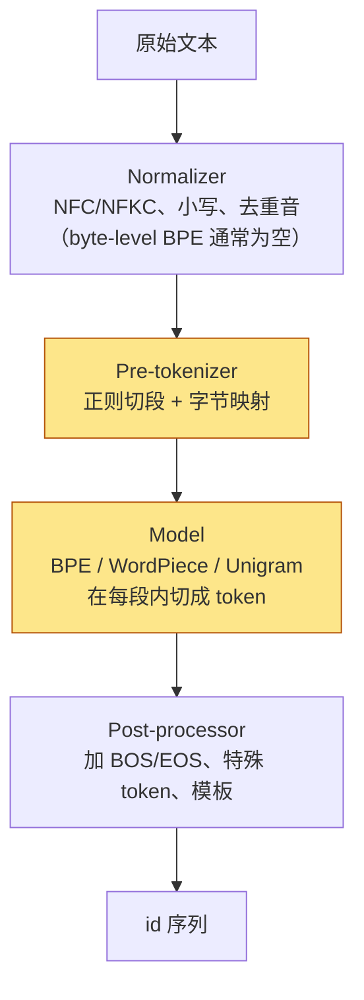

[《Transformer 与 LLM：结构、算量与数值》](/transformer-and-llm-for-infra-engineers.html)把一个 LLM 的成本算成了 token 的函数：每个 token 多少 FLOPs、多少字节 KV、prefill 多长、decode 多久。"token 数"在所有公式里都是自变量——它从哪来，那八篇一直没有问。它来自 tokenizer。

本系列是那张成本表的**训练侧**：对象从"模型作为一个计算对象的结构"转到"这个模型是怎么训出来的"——分词与词表、scaling law、数据工程、训练配方。方法不变：写出公式，代入真实模型的数字，解释数字对系统意味着什么。tokenizer 是四篇的第一篇，因为它同时决定成本表的两端：词表大小 $$V$$ 直接进参数量与 lm_head 的 FLOPs，压缩率决定一段文字要付多少个 token 的钱。

本篇要回答的核心问题是：

> **Llama 3 把词表从 Llama 2 的 32K 扩到 128K，参数多了 0.79B、每个 token 贵了 5.6%，为什么反而是省钱的？同一句中文在 Llama 3 和 DeepSeek-V3 的 tokenizer 下相差 2.1 倍的 token 数——这个差距在成本表上是什么？**


## 一、总览：成本表里最后一个外生变量

### 1. 先说答案

tokenizer 对成本的影响走两条相反的路：

| 路 | 变量 | 影响 | Llama 2 → Llama 3 的数字 |
|---|---|---|---|
| 词表大小 $$V$$ | embedding 与 lm_head 各 $$V \times d$$ 个参数；lm_head 每 token $$2Vd$$ FLOPs、decode 每步读 $$2Vd$$ 字节；训练时 logits 占 $$\text{tokens} \times V \times 4$$ 字节 | $$V$$ 越大，每个 token 越贵 | 32K → 128K：8B 骨架的参数 7.24B → 8.03B，每 token FLOPs 14.2 → 15.0 G（+5.6%） |
| 压缩率 | 每个 token 平均对应多少字符（或字节） | 压缩率越高，同一段文字的 token 越少 | 英文 3.17 → 3.94 字符/token（+24%） |

两条路合在一起，成本应该按**每个字符**而不是每个 token 算：

$$
\text{FLOPs/字符} = \frac{\text{FLOPs/token}}{\text{字符/token}}
$$

Llama-3-8B 的骨架配 32K 词表是 $$14.2 / 3.17 = 4.49$$ GFLOPs/字符，配 128K 词表是 $$15.0 / 3.94 = 3.81$$ GFLOPs/字符——**每个字符便宜 15%，每个字符的 KV 少 20%**。更大的词表让每个 token 贵了一点，让每段文字的 token 少了很多，后者赢。这是 Llama 3、Qwen、Gemma、DeepSeek 都把词表做到 128K–256K 的原因。

但这个结论有一个前提：词表要**针对目标语言训练**。同一段中文在 cl100k（Llama 3 词表的英文部分）下每个汉字要 1.46 个 token，在 DeepSeek-V3 下是 0.69 个；用 8B 规格的模型算，一个汉字的成本是 21.9 GFLOPs 对 10.4 GFLOPs。词表大小相近，效率差 2.1 倍——差距不在 $$V$$，在词表是用什么语料训出来的。

### 2. 本文的路线

先讲 tokenizer 是什么、BPE 为什么成为默认；再算词表大小这一侧的账；再算压缩率那一侧的账并把两侧合到"每字符成本"；然后讲 tokenizer 对模型行为的几个副作用，以及换词表、扩词表和绕开 tokenizer 的几种做法。数字来自五个可以公开下载的 tokenizer：

| tokenizer | 词表 | 用在 | 类型 |
|---|---|---|---|
| GPT-2 | 50 257 | GPT-2 / GPT-3 | byte-level BPE，第一个主流的字节级词表 |
| cl100k_base | 100 277 | GPT-4；Llama 3 的 128K 词表以它为基础再加 28K 非英语 token | tiktoken |
| o200k_base | 200 019 | GPT-4o | tiktoken |
| Qwen2.5 | 151 665 | Qwen2 / 2.5 / 3 | byte-level BPE，中英双语料 |
| DeepSeek-V3 | 128 815（`config.json` 里 `vocab_size` 为 129 280） | DeepSeek-V3 / R1 | byte-level BPE，中英双语料 |

Llama 3 自己的 tokenizer 需要授权下载，本文用 cl100k_base 近似它的英文行为；两者在英文上的切分几乎相同，中文上 Llama 3 多出的 28K token 会比 cl100k 好一些，但仍远不及双语料训练的 Qwen 与 DeepSeek。

一个提醒：表里"词表"一列是 tokenizer 实际拥有的 token 数，模型 `config.json` 里的 `vocab_size` 往往比它大——Qwen2.5-7B 是 152 064 对 151 665，DeepSeek-V3 是 129 280 对 128 815。多出来的几百个是**填充位**，第三章会解释它为什么存在、为什么恰好都是 128 的倍数。

### 3. 本文的章节安排

| 章 | 主题 | 内容 |
|---|---|---|
| 二 | 从词到子词 | 词级与字符级两端各失败在哪；BPE 算法与玩具例子；byte-level 与预分词；WordPiece 与 Unigram 的准则；tokenizer 的四段流水线 |
| 三 | 词表大小的账 | $$2Vd$$ 参数、tied 与 untied、填充到 128 的倍数、lm_head 的 FLOPs 与字节、logits 显存与 vocab-parallel 交叉熵、训练状态、采样成本；六个模型的数字 |
| 四 | token 效率的账 | 字符/token、每字符成本、跨 tokenizer 怎么比 loss、词表大小的边际收益与词表的 scaling law、中文 / 代码 / 数字三个特例、上下文窗口"有多长" |
| 五 | tokenizer 与模型行为 | 词表是语料的化石、欠训练 token 的检测、数字与算术、多语言的价格差、token 边界偏差与 token healing、特殊 token |
| 六 | 换词表 | 扩词表继续预训练、词表裁剪、tokenizer 移植、无 tokenizer 的字节模型 |
| 七 | 实践 | 从零实现 BPE、真实 tokenizer 对比、`llm_cost.py` 第九版 |
| 八 | 本文小结 | |
| 九 | 自测 | 5 道题 |


## 二、从词到子词：为什么是 BPE

### 1. 两端都不行

模型的输入必须是一串来自有限集合的 id。这个集合怎么定，有两个极端：

- **词级**：每个单词一个 id。英文常用词几十万，加上变形、专名、拼写错误、其他语言，词表无上限；训练中没见过的词（OOV）只能映射到一个 `<unk>`，信息全丢。而且 $$V$$ 是 embedding 参数的一个因子，百万级的词表在 $$d = 4096$$ 下是 4B 参数——比 Llama-3-8B 的一半还多。
- **字符级**（或字节级）：$$V = 256$$，永远没有 OOV。但一段英文平均每个字符一个 token，序列长度是词级的四五倍：attention 的二次项、KV cache 的一次项、生成时的 decode 步数全部按比例上升。《Transformer 与 LLM》第二篇算过 Llama-3-8B 在 128K 上下文下 attention 项已超过权重项；序列长 4 倍，同样的文本量 attention 算量长 16 倍。

**子词**（subword）是中间解：常见词整个是一个 token，罕见词拆成几段有意义的碎片，任何字符串都能表示，词表大小可以自己定。BPE 是得到子词词表最常用的算法。

用一个数字看两端的差距。《Transformer 与 LLM》第二篇的 prefill 账：Llama-3-8B 处理 $$s$$ 个 token 的权重项是 $$2Ns$$，attention 项是 $$4 d L s^2 = 4 \times 4096 \times 32 \times s^2$$。一段 100 万字符的英文，词级切分约 20 万 token，字节级 100 万 token：

| 切分 | token 数 | 权重项 | attention 项 | 合计 |
|---|---|---|---|---|
| 词级（≈5 字符/token） | 200K | 3.0 PFLOP | 21 PFLOP | 24 PFLOP |
| 子词（3.94 字符/token） | 254K | 3.8 PFLOP | 34 PFLOP | 38 PFLOP |
| 字节级 | 1M | 15 PFLOP | 524 PFLOP | 539 PFLOP |

字节级比子词贵 14 倍，其中 attention 项贵 15 倍——序列每长 $$k$$ 倍，attention 项长 $$k^2$$ 倍。（这是一整段当作一条序列的极端算法；实际按 8K 分块后 attention 项会小得多，但字节级的 decode 步数仍是 4 倍，KV 也是 4 倍。）字节级模型不是没人做，第六章会看到它们要另想办法把序列压回去。

### 2. 一页史：从 n-gram 到上下文表示

tokenizer 之前的 NLP 用另一套方法表示文本，其中三个概念在今天的 LLM 里仍然在用：

- **n-gram 语言模型与困惑度**：用前 $$n-1$$ 个词预测下一个词的计数模型，是 next-token prediction 的祖先。它的评价指标**困惑度**（perplexity）$$\text{PPL} = \exp(\text{平均每 token 的交叉熵})$$，今天仍是预训练 loss 的另一种写法：loss 2.0 nats 对应 PPL 7.4。注意困惑度依赖 tokenizer——同一段文字切成更多 token，每个 token 更好预测，PPL 更低，但这不代表模型更好。跨 tokenizer 比较要换算到**每字节**，第四章第 3 节专门讲这件事。
- **词向量**：Word2Vec（Mikolov 等 2013，CBOW 与 Skip-gram）与 GloVe（Pennington 等 2014）把每个词映射到一个几百维的向量，相近的词向量相近。LLM 的 embedding 表就是这个思想的直接后代，区别是它与模型一起训练、以子词而非词为单位，且不再是静态的——同一个 token 经过几层 attention 之后的表示随上下文变化，这是 ELMo（Peters 等 2018）与 BERT（Devlin 等 2018）确立的"上下文相关表示"。
- **one-hot、词袋、TF-IDF**：稀疏的、词序无关的文本表示，今天在 LLM 里没有位置，但在检索（BM25）与数据过滤（第三篇的分类器）里还活着。

### 3. BPE 算法

Byte Pair Encoding 最初是一种压缩算法（Gage 1994），Sennrich 等 2016 把它用到机器翻译的词表构建上。训练过程只有一个循环：

```text
初始词表 = 全部单字符（或 256 个字节）
把语料切成"词"，每个词表示为字符序列
重复 (V - 初始大小) 次：
    统计所有相邻 token 对的出现次数
    把最频繁的一对合并成一个新 token，加入词表
    在语料里把这一对替换为新 token
```

用经典的玩具语料 `low ×5, lower ×2, newest ×6, widest ×3` 跑八次合并（配套脚本 `bpe_from_scratch.py` 的输出）：

```text
merge 1:  'e'  + 's'    -> 'es'    (9 次)     newest ×6 + widest ×3
merge 2:  'es' + 't'    -> 'est'   (9 次)
merge 3:  'l'  + 'o'    -> 'lo'    (7 次)     low ×5 + lower ×2
merge 4:  'lo' + 'w'    -> 'low'   (7 次)
merge 5:  ' '  + 'low'  -> ' low'  (6 次)
merge 6:  ' '  + 'n'    -> ' n'    (6 次)
merge 7:  ' n' + 'e'    -> ' ne'   (6 次)
merge 8:  ' ne'+ 'w'    -> ' new'  (6 次)

encode('lowest') -> ['low', 'est']         两个都学过，虽然 'lowest' 本身没出现过
encode('newer')  -> ['n','e','w','e','r']  'new' 只学了带前导空格的版本
encode('wide')   -> ['w','i','d','e']      'wid' 从没成为高频对
```

三个观察在真实词表上同样成立：

1. **合并顺序就是词表**。训练的产物不是一个词的集合，而是一个有序的 merge 列表；编码时对每个词按同样顺序反复合并。所以 BPE 的编码是确定的、贪心的、不需要搜索。tiktoken 把这个列表存成"token 字节串 → rank"的字典，编码时每次找 rank 最小的相邻对合并，是同一件事的另一种写法。
2. **子词是统计的产物，不是语言学的**。`est` 被学出来是因为 `newest` 和 `widest` 都有它，不是因为它是后缀；同理 GPT-2 的词表里有 ` the` 也有 `the`（不带空格，出现在行首或引号后）——两个 id，模型要各学一遍。大小写也是如此：`The`、` The`、`the`、` the`、`THE` 是五个 token，词表里有相当一部分位置花在同一个词的变体上。
3. **没见过的组合退回到碎片**。`newer` 退成五个字符，因为语料里 `new` 只出现在带空格的位置。真实词表上这就是"罕见词被切碎"——一个专有名词或一段 base64 可能占几十个 token。

编码的复杂度值得一提。朴素实现对一个长度 $$n$$ 的词每次合并要扫一遍，最多合并 $$n - 1$$ 次，$$O(n^2)$$；由于预分词把词切得很短（英文词平均 5 个字符），这不成问题。真正的成本在**训练**：每合并一次要重新统计全部相邻对的频次，语料 $$T$$ 个字节、合并 $$V$$ 次是 $$O(TV)$$——1 MB 语料训 16K 词表在配套脚本的朴素实现里要两分钟；工业实现（Hugging Face `tokenizers`、SentencePiece）用增量更新（只更新受本次合并影响的对）加多线程，几十 GB 语料训 100K 词表以小时计。

### 4. byte-level 与预分词

Sennrich 的 BPE 以字符为初始词表，遇到训练语料里没有的字符仍会 OOV。GPT-2（Radford 等 2019）把初始词表改成 **256 个字节**：任何 Unicode 字符先编成 UTF-8，再在字节序列上做 BPE。词表 50 257 = 256 个字节 + 50 000 次合并 + 1 个 `<|endoftext|>`。代价是非 ASCII 字符从一开始就是多个字节：一个汉字 3 字节，一个 emoji 4 字节，如果语料里没有足够多的这种字符让它们合并起来，它们就以 3–4 个 token 的价格留在那里（第五章会看到这正是发生在中文上的事）。

byte-level 还带来一个不那么显眼的性质：**任何 token 序列都能解码成字节串，但不一定是合法的 UTF-8**。模型可以生成一个汉字的前两个字节然后停下，或者生成两个不属于同一个字符的字节相邻。这在流式输出里是真实问题——推理服务器必须缓冲到能凑成完整字符再发出去，Hugging Face 的 `decode` 与 vLLM 的 detokenizer 都有这一层处理，也是为什么 tokenizer 对比表里会出现 `��` 这样的占位符。

第二个设计是**预分词**（pre-tokenization）：BPE 不在整个语料上合并，而是先用正则把文本切成"词"，合并只在词内进行。GPT-2 的正则：

```text
's|'t|'re|'ve|'m|'ll|'d| ?\p{L}+| ?\p{N}+| ?[^\s\p{L}\p{N}]+|\s+(?!\S)|\s+
```

它规定：英文缩写的后缀单独成段；字母串（可带一个前导空格）、数字串、标点串各成段；空白单独处理。作用是给合并加边界——`of the` 永远不会成为一个 token，因为它跨了两个预分词段；数字与字母不混。后来的 tokenizer 改的主要就是这条正则：

- cl100k / Llama 3 把数字限制为**最多 3 位一段**（`\p{N}{1,3}`），于是 `15000000000000` 切成 `150|000|000|000|00`，任何数字都由 1–3 位的块组成，词表里不会出现 `00000000` 这样的 token（GPT-2 里有）；
- cl100k 允许空格串合并（GPT-2 的 `\s+(?!\S)` 让连续空格逐个成 token），8 个空格的缩进从 8 个 token 变成 1 个，这对代码影响很大——第四章有数字；
- cl100k 对缩写后缀加了大小写不敏感（`(?i:'s|'t|'re|…)`），`IT'S` 与 `it's` 切法一致；
- Qwen 把数字拆成**单个数字**，`15000000000000` 是 14 个 token。这是一个刻意的取舍：算术更容易（每一位对齐），但数字更长；
- DeepSeek-V3 的预分词允许**标点与换行合并成一个 token**（V3 技术报告 3.4 节），多行文本更省，但带来一个副作用：一段以标点结尾、没有换行的 prompt，最后一个 token 与训练时见到的"标点 + 换行"不同——他们的对策是训练时随机拆开一部分这类 token。这是第五章"token 边界偏差"的一个实例。

预分词正则是 tokenizer 里最容易被忽视、又最难改的部分：它决定词表里**可能**出现什么。一旦模型训好，改正则就等于换词表。

### 5. WordPiece 与 Unigram

另外两种得到子词词表的方法，结果与 BPE 相近，区别在选择合并（或删除）的准则。

**WordPiece**（Schuster & Nakajima 2012，BERT 用它）和 BPE 一样自底向上合并，但打分不是频次而是**合并后语言模型似然的增量**。把语料看成 unigram 模型，合并 $$a, b$$ 为 $$ab$$ 后对数似然的变化近似为

$$
\Delta \log \mathcal{L} \approx \text{freq}(ab) \cdot \log \frac{\text{freq}(ab)}{\text{freq}(a)\,\text{freq}(b)}
$$

实现上取 $$\frac{\text{freq}(ab)}{\text{freq}(a)\,\text{freq}(b)}$$ 作分数：分母惩罚"各自很常见、碰巧相邻"的对（如 `e` 与 `s`），偏向"各自不常见但总是一起出现"的对。编码时不按 merge 顺序而是**最长匹配**：从词首开始找词表里最长的前缀，切下，重复；词内非首段加 `##` 前缀。

**Unigram**（Kudo 2018，T5 与 ALBERT 用它）反过来：从一个很大的候选词表出发（比如所有出现过的子串中频次最高的百万个），假定每个 token 独立出现、概率 $$p(x_i)$$，一个词 $$w$$ 的概率是它所有切分方式的概率之和

$$
P(w) = \sum_{\mathbf{x} \in S(w)} \prod_i p(x_i)
$$

用 EM 迭代：E 步在每个词的切分格（lattice）上做前向–后向，算出每个 token 的期望出现次数；M 步用期望次数重新估计 $$p(x_i)$$。然后计算删掉每个 token 会让语料对数似然下降多少，删掉损失最小的 10–20%，重复直到词表缩到目标大小。编码用 Viterbi 找概率最大的切分；因为有概率模型，也可以**按概率采样**一种非最优切分——这就是 subword regularization，训练时给同一个词不同的切法作数据增强。

| 方法 | 训练方向 | 准则 | 编码 | 用在 |
|---|---|---|---|---|
| BPE | 自底向上合并 | 频次 | 按 merge 顺序贪心 | GPT 系列、Llama 3、Qwen、DeepSeek |
| WordPiece | 自底向上合并 | 似然增量 $$\frac{f(ab)}{f(a) f(b)}$$ | 最长匹配 | BERT |
| Unigram | 自顶向下删除 | 删除后的似然损失 | Viterbi（可采样） | T5、ALBERT |

**SentencePiece**（Kudo & Richardson 2018）是一个实现，同时支持 BPE 与 Unigram；它的特点是把空格当成普通字符 `▁` 处理，不依赖语言相关的预分词，且默认做 NFKC 归一化。Llama 1 / 2 用 SentencePiece BPE（32K，字符级初始词表加 byte fallback：没见过的字符退回到字节）；Llama 3 换成了 tiktoken 风格的 byte-level BPE。工程上今天的主流是 byte-level BPE + 一条精心设计的预分词正则，三种方法在压缩率上的差异远小于词表大小与训练语料带来的差异。

### 6. tokenizer 的四段流水线

把上面的部件按 Hugging Face `tokenizers` 库的组织方式排一下，一个 tokenizer 是四段可替换的流水线：



黄色两段决定压缩率与词表内容；第一段决定"同一个字符串的不同 Unicode 写法算不算一个 token"（全角 `Ａ` 与半角 `A`、组合重音与预组合字符），第四段决定第五章的特殊 token 与后训练的 chat template 怎么进入序列。`tokenizer.json` 里就是这四个键。


## 三、词表大小的账

### 1. 参数：2Vd，tied 与 untied

词表进入模型的地方有两个：输入端的 embedding 表 $$V \times d$$，输出端的 lm_head $$d \times V$$。两者不共享（untied）时词表参数是 $$2Vd$$，共享（tied）时是 $$Vd$$。《Transformer 与 LLM》第一篇的参数量公式里这一项写成 $$2 V d$$；代入六个模型（`llm_cost_09_vocab.py` 的输出）：

| 模型 | $$V$$ | $$d$$ | 总参数 | 词表参数 | 占比 | lm_head FLOPs/token | 占 FLOPs | lm_head 字节（BF16） |
|---|---|---|---|---|---|---|---|---|
| Llama-2-7B | 32 000 | 4096 | 6.74B | 262M | 3.9% | 0.26 G | 2.0% | 262 MB |
| Llama-3-8B | 128 256 | 4096 | 8.03B | 1.05B | 13.1% | 1.05 G | 7.0% | 1.05 GB |
| Llama-3-70B | 128 256 | 8192 | 70.6B | 2.10B | 3.0% | 2.10 G | 1.5% | 2.10 GB |
| Qwen2.5-7B | 152 064 | 3584 | 7.62B | 1.09B | 14.3% | 1.09 G | 7.7% | 1.09 GB |
| Qwen2.5-0.5B（tied） | 151 936 | 896 | 494M | 136M | 27.6% | 0.27 G | 38.0% | 272 MB |
| Gemma-2-2B（tied） | 256 000 | 2304 | 2.61B | 590M | 22.6% | 1.18 G | 29.1% | 1.18 GB |

Llama 2 到 Llama 3 的 7B/8B 规格，骨架几乎一样（都是 32 层、$$d = 4096$$，Llama 3 的 FFN 略宽并换了 GQA），参数从 6.74B 到 8.03B 里有 0.79B 是词表扩大带来的——**"8B"比"7B"多出来的那 1B 主要是词表**。

要不要 tie，是一个随模型大小变化的取舍。tie 的理由是省参数：0.5B 模型 untie 要多 136M，占 27%。不 tie 的理由是两张表干的不是一件事——embedding 把 id 映射到输入空间，lm_head 把最后一层的表示投影到 logits，两者的几何结构不同（输出侧的向量范数与 token 频率强相关，输入侧不必如此），共享一张表要模型在两种用途间妥协。经验上小模型（≤ 2B）tie，大模型 untie：Qwen2.5 从 0.5B 到 1.5B tie、3B 起 untie；Gemma 全系 tie（它的词表 256K，untie 的代价太大）；Llama 全系 untie。在参数量的公式里，这是"$$Vd$$ 还是 $$2Vd$$"的一个开关，读 `config.json` 里的 `tie_word_embeddings` 即知。

### 2. 为什么 vocab_size 是 128 的倍数

第一章留的问题：Qwen2.5-7B 的 tokenizer 有 151 665 个 token，`vocab_size` 却是 152 064；DeepSeek-V3 是 128 815 对 129 280；Llama 3 的 128 256 = 128 000 + 256 个特殊 token 位。三个数除以 128 分别是 1188、1010、1002，都是整数。

这是训练框架的要求。Megatron-LM 的 `--make-vocab-size-divisible-by` 默认 128，理由有两个：

- **GEMM 对齐**。lm_head 的输出维度 $$V$$ 是矩阵乘的 $$N$$ 维，Tensor Core 在 $$N$$ 是 64 或 128 的倍数时才走最快的 tile 形状；
- **张量并行整除**。lm_head 与 embedding 沿 $$V$$ 切到 TP 组的各卡上（下一节），$$V$$ 必须能被 TP 度整除，且每卡的分片也要对齐。128 的倍数在 TP = 8 时每卡 16 的倍数——刚好够。

多出来的填充位在 tokenizer 里没有对应的字符串，模型永远不会输出它们（训练时它们从不作为目标出现，logits 会被压到极低），但它们**占参数、占 FLOPs、占显存**——Qwen2.5-7B 的 399 个填充位是 $$2 \times 399 \times 3584 = 2.9$$M 参数，不多，但推理时如果 top-k 采样不把它们排除，理论上仍可能被采到。vLLM 与 HF 的 generate 都按 tokenizer 的实际大小截断 logits，这是那个 `vocab_size ≠ len(tokenizer)` 差异在推理框架里的落点。

### 3. FLOPs：lm_head 是一个 d × V 的 GEMM

embedding 是查表，不算 FLOPs；lm_head 是每个 token 一次 $$[1, d] \times [d, V]$$ 的矩阵乘，$$2Vd$$ FLOPs。Llama-3-8B 每 token 1.05 GFLOPs，占 15.0 GFLOPs 的 7%；这是一层 Transformer 的两倍多（每层 $$2 \times 218\text{M} = 0.44$$ GFLOPs）——**lm_head 是模型里最贵的单个矩阵**。

在小模型里它的占比失控：Qwen2.5-0.5B 的 lm_head 占每 token FLOPs 的 38%，Gemma-2-2B 占 29%。这两个模型都 tie 了 embedding，参数上只算一份，但 FLOPs 上 lm_head 一分不少。小模型选大词表，是为了和同系列的大模型共用 tokenizer（数据只需 tokenize 一次、蒸馏时 logits 可对齐——第二篇与后训练系列会用到），代价是三分之一的算力花在输出层。

训练时这一项更重。反向传播对 lm_head 要算两个梯度（对权重、对输入），《Transformer 与 LLM》第二篇的"训练 = 3 × 前向"对它同样成立：Llama-3-8B 每 token 训练 FLOPs 约 $$6N = 48$$ GFLOPs，其中 lm_head 贡献 $$6 \times 0.525\text{B} = 3.15$$ GFLOPs，仍是 7%。但 15T token 乘下来，Llama-3-8B 全部预训练里有约 $$4.7 \times 10^{22}$$ FLOPs 花在输出层——按 H100 40% MFU 算约 33 000 GPU·小时。

### 4. 字节：decode 每步读一遍 lm_head，训练时 logits 要放得下

decode 是 memory-bound 的（《Transformer 与 LLM》第二篇），每步读一遍全部权重，lm_head 也在其中：Llama-3-8B 的 1.05 GB 占 16.06 GB 的 6.5%，H100 上 0.31 ms。词表从 32K 到 256K 时这一项从 0.08 ms 到 0.63 ms——不致命，但它是权重里唯一随 $$V$$ 线性增长的部分。embedding 的读取则可以忽略：每 token 只 gather 一行 $$d$$ 个数，是随机访存但总量极小。

更大的问题在训练侧。交叉熵要在 FP32 下算 softmax，logits 张量是 $$\text{tokens} \times V \times 4$$ 字节：一条 8K 的序列在 128K 词表下是 3.9 GiB，Llama 3 405B 训练时 16K 序列的 logits 是 7.8 GiB **每条序列**——比模型任何一层的激活值都大（一层的主要激活是 $$\text{tokens} \times d \times 2$$ 字节，$$d = 16384$$ 时 16K 序列只 0.5 GiB）。而且 logits 在反向时还要留一份梯度，同样大小。

两种标准解法，都是"永远不把整个 logits 张量放进显存"：

**vocab-parallel 交叉熵**（Megatron）。lm_head 沿 $$V$$ 切到 TP 组的 $$t$$ 张卡上，每卡算自己那 $$V/t$$ 列的 logits $$z^{(k)}$$，logits 的分片自然就是 $$1/t$$。交叉熵 $$\ell = \log \sum_j e^{z_j} - z_y$$ 需要全局的 logsumexp 与目标 token 的 logit，两者都能用两次标量 all-reduce 拼出来：

$$
m = \max_k m^{(k)}, \quad m^{(k)} = \max_{j \in \text{shard } k} z_j
\qquad
S = \sum_k S^{(k)}, \quad S^{(k)} = \sum_{j \in \text{shard } k} e^{z_j - m}
$$

$$
\ell = m + \log S - z_y
$$

其中 $$z_y$$ 只在持有目标 id 的那张卡上非零，其余卡填 0，一次 all-reduce sum 取得。每个 token 三个标量的通信，logits 显存降为 $$1/t$$：TP = 8 时 8K 序列 3.9 GiB → 0.49 GiB。梯度 $$\partial \ell / \partial z_j = \text{softmax}_j - \mathbb{1}[j = y]$$ 每卡在自己的分片上就地算出，不需要再通信。

**分块融合**（Liger Kernel、Apex 的 fused cross entropy、Unsloth）。不切卡而是切 token：把 $$\text{tokens}$$ 分成 $$c$$ 个块，每块算 $$[\text{chunk}, d] \times [d, V]$$ 得到一小块 logits，立刻算 loss 与梯度 $$\partial \ell / \partial h$$（$$[\text{chunk}, d]$$，很小）并把对 lm_head 权重的梯度累加进去，然后丢掉这块 logits。峰值显存从 $$\text{tokens} \times V \times 4$$ 降到 $$\text{chunk} \times V \times 4$$：chunk = 1024 时 128K 词表只需 0.5 GiB，与序列长度无关。代价是 lm_head 的 GEMM 被切成 $$c$$ 个小 GEMM，$$\text{chunk}$$ 太小会掉出 Tensor Core 的高效区，所以 chunk 通常取 1K–4K。

同一个 8B 骨架换四种词表的全套数字：

| $$V$$ | 参数 | 词表占比 | FLOPs/token | lm_head 占比 | decode 读 lm_head（H100） | 8K 序列 logits（FP32） |
|---|---|---|---|---|---|---|
| 32 000 | 7.24B | 3.6% | 14.22 G | 1.8% | 0.08 ms | 1.0 GiB |
| 64 000 | 7.50B | 7.0% | 14.48 G | 3.6% | 0.16 ms | 2.0 GiB |
| 128 256 | 8.03B | 13.1% | 15.01 G | 7.0% | 0.31 ms | 3.9 GiB |
| 256 000 | 9.08B | 23.1% | 16.06 G | 13.1% | 0.63 ms | 7.8 GiB |

这一侧的结论：词表每翻一倍，8B 模型每个 token 贵约 3.5%，训练时 logits 显存翻倍。

### 5. 训练状态：词表参数按 16 字节算

《Transformer 与 LLM》第七篇算 LoRA 时用过训练状态的账：混合精度 + Adam 下每个参数 BF16 权重 2 B + FP32 主权重 4 B + Adam 一阶、二阶矩各 4 B + BF16 梯度 2 B = **16 字节**。词表参数也在其中：Llama-3-8B 的 1.05B 词表参数是 16.8 GB 训练状态，比 lm_head 权重本身（1.05 GB）大一个数量级；Llama-3-70B 的 2.1B 是 33.6 GB。这部分状态在 TP 里沿 $$V$$ 切、在 ZeRO 里按参数切，不构成单卡瓶颈，但它提醒一件事：**扩词表的成本在训练时是 16 倍于推理时**——Llama 3 从 32K 到 128K 多出的 0.79B 参数，训练时是 12.6 GB 的状态。

另有一个更细的问题：embedding 的梯度是**稀疏**的——一个 batch 里没出现的 token，它的 embedding 行梯度为零。但 Adam 的状态是稠密的，$$m$$、$$v$$ 每步都要按全表更新（衰减），所以 embedding 的优化器开销与它的更新频率无关。这也是为什么有的框架给 embedding 单独用 SparseAdam 或不同的权重衰减：一个 15T token 的训练里，一个只出现过一万次的罕见 token，它的 embedding 行接受了一万次有效梯度和几百万次纯衰减。

### 6. 采样：每步对 V 个 logits 做 softmax 与排序

推理侧还有一项与 $$V$$ 成正比、常被忽略的成本：**采样**。每一步 decode，每条序列要对 $$V$$ 个 logits 做温度缩放、softmax、top-k 或 top-p 截断再采样。top-p 需要排序（或至少部分排序），$$O(V \log V)$$；128K 个 FP32 的排序在 GPU 上是微秒级，但 batch 256 就是 256 次，加上 repetition penalty、logit bias、grammar 约束（结构化输出要对 $$V$$ 个 token 逐个判断是否合法）等每个 token 的处理，采样器在高并发下可以占到 decode 步时间的 5–10%。vLLM 把采样器写成一个独立的融合 kernel，SGLang 的约束解码把语法状态编译成对词表的位掩码——都是为了把这一步压到与 $$V$$ 无关的量级。这是词表大小在推理路径上除 lm_head 之外的第二个落点。


## 四、token 效率的账

### 1. 度量：字符/token 与 fertility

压缩率有两种写法：**每 token 多少字符**（或字节；越大越省）和 **fertility**——每个词平均切成多少 token（越小越省）。前者跨语言可比，后者只对有空格分词的语言有意义。本文用字符/token 与它的倒数 token/字符。

五个 tokenizer 在四段样本上的数字（`tokenizer_compare.py`）：

| tokenizer | 词表 | 英文（174 字符） | 中文（63 字符） | Python（189 字符） | 数字混排（113 字符） |
|---|---|---|---|---|---|
| GPT-2 | 50K | 33 tok · 5.27 c/t | 97 tok · 0.65 c/t | 95 tok · 1.99 c/t | 34 tok · 3.32 c/t |
| cl100k_base | 100K | 32 tok · 5.44 c/t | 57 tok · 1.11 c/t | 52 tok · 3.63 c/t | 41 tok · 2.76 c/t |
| o200k_base | 200K | 32 tok · 5.44 c/t | 39 tok · 1.62 c/t | 52 tok · 3.63 c/t | 40 tok · 2.83 c/t |
| Qwen2.5 | 152K | 32 tok · 5.44 c/t | 31 tok · 2.03 c/t | 52 tok · 3.63 c/t | 58 tok · 1.95 c/t |
| DeepSeek-V3 | 129K | 33 tok · 5.27 c/t | 27 tok · 2.33 c/t | 58 tok · 3.26 c/t | 41 tok · 2.76 c/t |

英文一列几乎没有差别：从 50K 到 200K 词表，同一句话 33 → 32 个 token。**英文早已饱和**——常用词在 50K 词表里就已经各是一个 token，再扩词表加进来的是罕见词与其他语言。差别全在另外三列。

这一句英文样本 5.44 字符/token 比 Llama 3 报告的 3.94 高，是因为样本是通顺的散文；真实预训练语料里有代码、表格、URL、拼写错误，平均值会低得多。**压缩率是语料的性质，不只是 tokenizer 的性质**，比较两个 tokenizer 要在同一份足够大、足够杂的样本上比。

### 2. 每字符成本：Llama 2 → Llama 3

Llama 3 论文给出它的 tokenizer 在英文上把压缩率从 Llama 2 的 3.17 字符/token 提到 3.94。把第三章的 FLOPs/token 除进去：

| | FLOPs/token | 字符/token | FLOPs/字符 | KV/字符 |
|---|---|---|---|---|
| 8B 骨架 + 32K 词表 | 14.22 G | 3.17 | 4.49 G | 40.4 KiB |
| Llama-3-8B（128K） | 15.01 G | 3.94 | **3.81 G（−15%）** | **32.5 KiB（−20%）** |

每个 token 贵 5.6%，每段英文的 token 少 20%，净效果每字符便宜 15%。KV 的收益更大（20%），因为 KV/token 不随 $$V$$ 变。对推理系统这意味着：同样的显存放下多 25% 的上下文字符、同样的 prompt 少 20% 的 prefill 时间、生成同一段回答少 20% 的 decode 步——**tokenizer 的改进是少数对 prefill、decode、KV 三项同时有效的优化**，而且是零运行时开销的。

从训练侧看同一件事：Llama 3 报告 15T token 的预训练。如果换回 32K 词表，同样的文本量要 $$15 \times 3.94 / 3.17 = 18.6$$T token，每 token 少 5.6% 的 FLOPs 也追不回 24% 的 token 数——训练算力多 17%。第二篇的 scaling law 里 $$D$$ 是 token 数，但**决定模型见过多少信息的是字符数**；tokenizer 的压缩率是 $$D$$ 与"数据量"之间的汇率。

### 3. 跨 tokenizer 怎么比 loss

第二章留下的问题：困惑度依赖 tokenizer，那 Llama 2 的预训练 loss 与 Llama 3 的能不能比？直接比不能。一段文本 $$B$$ 个字节，切成 $$T$$ 个 token，模型对它的总负对数似然是 $$T \cdot L$$（$$L$$ 是每 token 的平均 loss，nats）。这个总量是**文本的性质**，不随切法变——不管切成多少段，模型给整段文字分配的概率是同一个数。所以：

$$
\text{bits/byte} = \frac{T \cdot L}{B \cdot \ln 2} = \frac{L}{\ln 2} \cdot \frac{T}{B}
$$

即每 token 的 loss 乘上 token/字节，再换到以 2 为底。Llama 2 的 tokenizer 每 token 3.17 字符（英文约 1 字节/字符），Llama 3 是 3.94：若两个模型的 bits/byte 相同，Llama 3 的每 token loss 应比 Llama 2 **高** $$3.94 / 3.17 = 1.24$$ 倍。看到 Llama 3 的训练曲线收在比 Llama 2 更高的 loss 值，不说明它更差——它每个 token 装了更多的字符，每个 token 更难预测。

反过来这也解释了一个常见的错误结论"大词表让 loss 变高"或"中文 loss 比英文高"：一个汉字在 Qwen 词表下约 0.8 个 token、信息量约 10 bits，每 token 的 loss 天然高于每 token 装 5 个英文字母的英文。第二篇画 scaling law 曲线时默认所有模型共用一个 tokenizer，正是为了避开这个换算；比较不同 tokenizer 的模型只能用 bits/byte 或下游任务。

### 4. 词表大小的边际收益递减

在 1 MB Python 标准库源码上从零训 BPE，词表从 256 扫到 16 384（`bpe_from_scratch.py`）：

| 词表 | 训练集 bytes/token | 英文句 | Python 片段 | 中文句 |
|---|---|---|---|---|
| 256 | 1.00 | 1.00 | 1.00 | 1.00 |
| 512 | 2.21 | 1.63 | 2.17 | 1.00 |
| 1 024 | 2.81 | 1.79 | 2.32 | 1.00 |
| 2 048 | 3.35 | 2.42 | 2.41 | 1.00 |
| 4 096 | 3.85 | 2.68 | 2.41 | 1.00 |
| 8 192 | 4.27 | 2.68 | 2.41 | 1.00 |
| 16 384 | 4.57 | 3.00 | 2.50 | 1.00 |

词表每翻一倍，训练集的压缩率大约加 0.4–0.5 字节/token——**近似对数增长**。前几次翻倍收益最大（256 → 2048 从 1.0 到 3.35），之后每翻一倍只多 10% 左右。这与词频的 Zipf 分布一致：第 $$r$$ 常见的 token 频率约 $$\propto 1/r$$，词表从 $$V$$ 扩到 $$2V$$ 新增的那些 token 合计只覆盖语料的 $$\ln 2 / \ln V$$ 左右——$$V = 64\text{K}$$ 时约 6%。

而第三章算过每翻一倍 lm_head 的成本翻一倍。两条曲线一条对数一条线性，交点就是"最优词表"；它在哪取决于模型多大——lm_head 在 70B 模型里只占 1.5%，翻倍几乎免费，在 0.5B 模型里占 38%，翻倍要付真金白银。

Tao 等 2024 把这件事做成了 scaling law：在固定训练算力下，最优词表大小随非词表参数量 $$N_{nv}$$ 呈幂律增长（他们拟合的指数约 0.4–0.5——词表应比参数长得慢，但要一起长），且当前多数模型的词表**偏小**——他们估计 Llama-2-70B 的最优词表应在 216K 以上而不是 32K。论文的另一个结论对系统更有用：**训练数据越多，最优词表越大**。理由是 embedding 要靠出现次数训练，罕见 token 在数据少时训不好，拖累整体；数据多了这个约束放松。这与业界的走向一致：Llama 3 128K、Qwen 152K、Gemma 256K、GPT-4o 200K。

中文一列在这个实验里始终是 1.00——语料里没有中文，BPE 学不到任何跨字节的合并，每个汉字保持 3 个字节 token。这是下一节的主题。

### 5. 三个特例：中文、代码、数字

**中文**。第一节的表里，中文一列从 0.65 到 2.33 字符/token 相差 3.6 倍，按每个汉字算：

| tokenizer | token/汉字 | 8B 规格下每个汉字 | 切分示例 |
|---|---|---|---|
| GPT-2 | 2.49 | — | 全部是字节碎片 `� � �` |
| cl100k（≈ Llama 3 英文部分） | 1.46 | 21.9 GFLOPs · 187 KiB KV | `分 · �� · 器 · �� · 定 · 一` |
| o200k | 1.00 | 15.0 GFLOPs · 128 KiB KV | `分 · 词 · 器 · 决定 · 一句 · 话` |
| Qwen2.5 | 0.79 | 11.9 GFLOPs · 101 KiB KV | `分 · 词 · 器 · 决定 · 一句话 · 变成` |
| DeepSeek-V3 | 0.69 | 10.4 GFLOPs · 88 KiB KV | `分词 · 器 · 决定 · 一句话 · 变成 · 多少个` |

cl100k 里"词"和"决"各是两个不完整的字节 token（`��`），说明这两个字在它的训练语料里不够频繁，没有合并成整字。GB2312 常用汉字 6763 个，若要每个字至少是一个 token，词表里要留至少这么多位；要让常用双字词成为一个 token，还要再几万位——Qwen 与 DeepSeek 的词表里中文 token 估计占三到四成。它们的词表大小和 cl100k 在同一量级，但训练语料里有大量中文，常用词组（一句话、多少个）都成了单个 token。**同一段中文，用 cl100k 系的模型服务比用 DeepSeek 贵 2.1 倍**——prefill、decode 步数、KV 全部按这个比例。对多语言服务的容量规划，"每请求多少 token"必须按语言分别估。

**代码**。GPT-2 与 cl100k 在 Python 上差 1.8 倍（1.99 vs 3.63 字符/token），几乎全部来自空白处理：GPT-2 把每个空格切成一个 token，8 个空格的缩进是 8 个 token；cl100k 起的 tokenizer 把连续空格合成一个。四层缩进的代码有四分之一的 token 是空格——这是 GPT-2 时代"代码模型要单独训 tokenizer"的原因，现在已经不是问题。代码还有第二个特点：标识符是驼峰或下划线拼接的多词（`getUserById`、`max_seq_len`），预分词正则把 `\p{L}+` 当一段，于是 `getUserById` 在词表里没有整体只能切成 `get|User|By|Id`——碎片有语义，反而是好事；而 `max_seq_len` 会在下划线处被正则切开，是三段字母加两个下划线标点。

**数字**。同一个 13 位数 `15000000000000`：

```text
GPT-2        ['15', '00000000', '0000']                     3 个 token，切法依赖词表里碰巧有哪些数字串
cl100k       ['150', '000', '000', '000', '00']             5 个，固定 1–3 位一段
DeepSeek-V3  ['150', '000', '000', '000', '00']             同 cl100k
Qwen2.5      ['1','5','0','0','0','0','0','0','0','0','0','0','0','0']   14 个，逐位
```

GPT-2 的切法对算术是灾难：`1000` 和 `1001` 可能被切成完全不同的段，模型看不到位值。3 位一段是"块对齐"，逐位是"位对齐"；Qwen 为算术精度付出数字长 3 倍的代价，在数字密集的表格与日志上 token 效率明显低（第一节的数字混排列：58 对 41）。

### 6. 上下文窗口"有多长"

一个 128K token 的上下文窗口，装得下多少文字，取决于装什么、用哪个 tokenizer。用第 1 节与第 5 节的压缩率换算：

| 内容 | tokenizer | 字符/token | 128K token 装下 |
|---|---|---|---|
| 英文散文 | 任何主流 | ≈ 4–5 | 50–65 万字符 ≈ 10–13 万词，一本长篇小说 |
| 中文 | cl100k 系 | 0.68 | 8.9 万字，一部中篇 |
| 中文 | DeepSeek-V3 | 1.45 | 19 万字，一部长篇 |
| Python 代码 | cl100k 系 | 3.6 | 46 万字符 ≈ 1.2 万行 |
| Python 代码 | GPT-2 | 2.0 | 26 万字符 ≈ 6 500 行 |
| base64 / 哈希 / 随机串 | 任何 | ≈ 1.5–2.5 | 20–30 万字符 |

同一个"128K"对中文用户可能只有英文用户的五分之一到三分之一。RAG 系统的 chunk 预算、长文档摘要的分段策略、agent 的上下文管理，如果按"一个 token 约等于 0.75 个英文词"的经验规则设计，在非英文流量上会系统性地超预算。


## 五、tokenizer 与模型行为

### 1. 词表是训练语料的化石

BPE 的词表完全由训练 tokenizer 用的语料决定，与模型训练语料无关——两者常常不同。GPT-2 的词表在 WebText 上训练，其中包含大量 Reddit 用户名与日志垃圾，于是 ` SolidGoldMagikarp`、` petertodd` 一类字符串成了单个 token；模型预训练语料里几乎没有它们，这些 token 的 embedding 基本没被更新，输入时模型行为异常（Rumbelow & Watkins 2023 的"glitch token"）。同类问题在每个词表里都存在：**任何在 tokenizer 语料里频繁、在模型语料里罕见的 token，都是欠训练的**。

Land & Bartolo 2024 给出了系统的检测方法，思路是看**输出侧**：一个从未作为预测目标出现过的 token，它在 lm_head 里那一行只受到过 softmax 的"推低"梯度（$$\partial \ell / \partial z_j = p_j$$，永远为正），没有过"拉高"的梯度（目标 token 的 $$p_y - 1 < 0$$），于是它的 lm_head 向量会朝着一个共同的方向收缩，与其他欠训练 token 聚在一起，范数偏小。计算每个 token 的 lm_head 行与这个"欠训练方向"的余弦或范数，排序，尾部就是候选；再用 prompt 让模型复述这些 token 验证。他们在几乎每个开源模型里都找到了几十到几千个这样的 token——tied embedding 的模型更多，因为输入侧的 embedding 同样没被训练，两个问题叠在一行上。

反过来，tokenizer 语料里没有的东西永远是碎片。第四章的实验里用纯英文代码语料训出的词表把中文全部退回字节；Llama 2 的 32K SentencePiece 词表包含约 700 个汉字，其余全走 byte fallback。**要服务一种语言，先看它在词表里的压缩率**，这比模型大小更直接地决定成本。

### 2. 数字与算术

第四章的三种切法对应三种算术表现。位对齐（Qwen）让加法的每一列在 token 序列上对齐，进位是局部操作；3 位一段（Llama 3 / GPT-4）介于两者之间；GPT-2 式的任意切分让模型必须先"记住"每个数字串 token 是几位、值多少。研究普遍发现从右向左按 3 位分组（与人类的千分位一致）比从左向右好，但主流 tokenizer 的正则是从左向右匹配的——`1234567` 被切成 `123|456|7` 而不是 `1|234|567`。这是一个已知的、与 tokenizer 正则绑定的缺陷，改它意味着换词表重训。

一个更隐蔽的例子是**小数与单位**。`3.14` 在 3 位一段的正则下是 `3|.|14`，`3.140` 是 `3|.|140`，两者数值几乎相等却是不同的 token 序列；`10kg` 与 `10 kg` 也是。模型要在训练中学会这些等价关系，而不是从表示里免费得到。评测里"模型算不对多位数乘法"有一部分要归到这里——不是推理能力，是表示。

### 3. 多语言的价格差

第四章的中文数字换个角度看：**同一个 API 按 token 计费，同样一段内容，中文用户付的钱可以是英文用户的两倍以上**。cl100k 下中文 1.11 字符/token 对英文 5.44；按信息量折算——一个英文单词约相当于 1.5–2 个汉字——中文每"词"约 2.6 个 token，英文约 1.05 个，差 2.4 倍。Petrov 等 2023 在 17 个 tokenizer 上比较了同一段平行语料的 token 数，最大差距**超过 15 倍**（缅甸文、阿姆哈拉文等在英文为主的词表下每个字符 4–6 个 token）；Ahia 等 2023 把它换算成 API 价格，同样的内容低资源语言用户付的钱可以是英文的十倍以上。这既是公平性问题也是容量问题——"平均每请求 N 个 token"的假设在多语言流量下不成立；同样的上下文窗口对不同语言"长度"不同（第四章第 6 节）；同样的 max_tokens 限制在不同语言下截断的位置不同。

对做模型的人这也是一个训练问题：预训练语料里中文占 10%，但如果 tokenizer 对中文的压缩率只有英文的一半，那么按 token 数算中文占了 20% 的训练步、按信息量算却只有 10%——**语料配比要按什么单位算**（第三篇）与 tokenizer 直接相关。

### 4. token 边界偏差与 token healing

BPE 是贪心的，一段文字的切法依赖它后面跟着什么。`http://` 后面接 `www` 时，词表里可能有 `://www` 这个 token；如果 prompt 恰好以 `http://` 结尾，tokenizer 只能切出 `://`，而模型在训练中很少见到 `://` 后面紧接一个新 token 的情形——它见到的都是 `://www`、`://github` 这样的整体。于是模型在这个位置的预测分布是**偏的**：它会低估 `www` 的概率，因为训练时这个组合几乎从未以"两个 token"的形式出现。

这就是 **token 边界偏差**（token boundary bias），在代码补全（光标停在标识符中间）、结构化输出（prompt 以 `{"name": "` 结尾）与 few-shot 模板（示例以标点结尾无换行——DeepSeek-V3 报告的那个问题）里最常见。**token healing**（Microsoft 的 guidance 库提出，vLLM、llama.cpp 等已实现）的修法是：把 prompt 的最后一个 token 回退掉，生成时把词表限制在以被回退的字符串为前缀的 token 上，让模型自己"重新切"最后一段。代价是第一步的采样要加一个前缀掩码，收益是消除了一类不好解释的输出退化。DeepSeek-V3 的做法是从训练侧解决：随机拆开一部分合并 token，让模型见过"拆开的"版本。两种方法说明同一件事——**tokenizer 的贪心性会漏到模型行为里**，不是纯预处理。

### 5. 特殊 token 与 chat template

词表里除了子词还有一组**特殊 token**：`<|begin_of_text|>`、`<|eot_id|>`、`<|start_header_id|>` 这类控制符，对话格式（chat template）用它们标记角色与轮次边界。它们在预训练时通常不出现（或只作为文档分隔符），在后训练阶段才被赋予含义；embedding 在预训练结束时是欠训练的，SFT 的一部分工作就是把它们训出来。Llama 3 预留了 256 个特殊 token 位（128 000–128 255），这就是 128 256 这个数字的来源：100K（cl100k）+ 28K（非英语）+ 256（特殊）。

特殊 token 与普通 token 的另一个区别是**它们不能从文本里切出来**：用户输入里若出现字面的 `<|eot_id|>` 字符串，tokenizer 默认把它当普通文本切成几个碎片，而不是那一个控制 id——否则用户就能在输入里伪造"助手回合结束"。这个开关在 HF 里叫 `split_special_tokens`，在推理服务器里对应"是否信任输入中的特殊 token"；把它设错是一类真实的注入漏洞。后训练系列的第一篇会回到特殊 token 与模板的细节。


## 六、换词表：扩展、裁剪、移植与不用 tokenizer

### 1. 扩词表继续预训练

一个英文为主的模型要服务中文，最直接的办法是**往词表里加 token**然后继续预训练。Chinese-LLaMA（Cui 等 2023）给 Llama 的 32K 词表加了约 20K 中文 token 到 49 953，中文压缩率提高约一倍。工程上有三个问题：

- **新 embedding 怎么初始化**。随机初始化的新行会让模型在见到新 token 时输出乱码，且要很多数据才能追上。常见做法是把新 token 按旧词表切成碎片，取碎片 embedding 的**均值**作初始值——一个由 `分 + 词` 合成的新 token，初始向量是两个字的平均。lm_head 的新行同样处理。
- **要多少数据**。新 token 的 embedding 每出现一次才更新一次。按 Zipf 估计，词表末尾的 token 在语料中的频率约 $$1/(V \ln V)$$，$$V = 50\text{K}$$ 时约 $$2 \times 10^{-6}$$；要让它累积 1 万次有效更新，需要约 50 亿 token 的目标语言语料——Chinese-LLaMA 用了 200 亿。数据不足时新 token 就是第五章的欠训练 token。
- **旧能力怎么保**。继续预训练用的语料如果全是目标语言，英文能力会退化（第四篇会讲课程与回放）。Chinese-LLaMA 的做法是先只训 embedding 与 lm_head、再放开 LoRA、最后全量。

一个反面的账：扩词表让每个 token 贵了（$$V$$ 从 32K 到 50K，7B 模型每 token +2%），如果目标语言在流量里只占一小部分，这 2% 是所有请求都要付的税。所以商业模型倾向于一开始就用大的多语言词表，而不是事后扩。

### 2. 词表裁剪

反方向：一个 256K 词表的模型部署到只服务英文的场景，词表里七成的 token 永远用不到，但 lm_head 的每一行都要读、都要算。**裁剪**（vocabulary pruning / trimming）把从未在目标语料中出现的 token 从 embedding 与 lm_head 里删掉，tokenizer 同步移除对应的 merge。Gemma-2-2B 的 lm_head 是 1.18 GB、占 FLOPs 的 29%，裁到 64K 后是 0.29 GB、占 9%——每 token 省 22% 的 FLOPs，模型对保留的 token 行为完全不变（softmax 的分母少了一些几乎为零的项，微小的分布变化）。代价是被删的 token 对应的文本从此只能走碎片，跟第五章说的"永远是碎片"一样。这在边缘部署与小模型上是真实收益，在大模型上不值得——70B 的 lm_head 只占 1.5%。

### 3. tokenizer 移植

蒸馏（后训练系列第七篇）需要教师与学生的 logits 逐位对齐，前提是共用词表。当两个模型词表不同时有两条路：**把学生换到教师的 tokenizer**（相当于第 1 节的扩词表 + 裁剪一起做，然后用一段继续预训练恢复），或者在两个词表之间建一张**映射**——对每个学生 token 找教师词表里字符串相同或最接近的 token，只在对齐上的位置算 KL，其余退化成序列级蒸馏。前者代价大但干净，后者便宜但损失一部分信号。同系列大小模型共用 tokenizer（Qwen、Llama、Gemma 都是这样）正是为了让这一步不存在——这是第三章"小模型为什么背一个大词表"的另一半理由。

### 4. 不用 tokenizer：字节级模型

既然 tokenizer 带来这么多副作用——多语言不公平、数字切分、边界偏差、欠训练 token——为什么不直接在字节上建模？ByT5（Xue 等 2022）做了：$$V = 256$$，没有任何上述问题，但序列长 4–5 倍，按第二章的账 attention 项贵 16–25 倍，同等算力下质量落后。

之后的字节级工作都在解决"怎么把序列压回去"。MegaByte（Yu 等 2023）把字节按固定长度分块，一个大模型处理块级表示、一个小模型在块内逐字节生成。**Byte Latent Transformer**（Pagnoni 等 2024，Meta）把固定分块换成**动态分块**：用一个小的字节级语言模型算每个位置的下一字节熵，熵高的地方（新词开头、不可预测处）切一个 patch 边界，熵低的地方（词的后半、常见搭配）延长 patch——平均 patch 长度可以调到 6–8 个字节，比 BPE 的 4–5 字符/token 还长。主模型在 patch 上运行，参数量与 FLOPs 都不再与词表挂钩（没有 $$2Vd$$），局部编解码器负责字节与 patch 的转换。论文报告在同等训练 FLOPs 下能追平 Llama 3 的 BPE 模型，并且在噪声输入、字符级任务与低资源语言上更好。

它还没有成为主流，原因是工程栈：推理框架、KV cache、投机解码、结构化输出全部围绕"token"设计，patch 长度可变让 batch 调度复杂；而 BPE 的问题虽多，都已经有了补丁。但它指出了一个方向：**tokenizer 本质上是一个不学习的、固定的压缩器**，用学习的压缩器替代它是自然的一步。第二篇讨论 scaling law 时会看到，"每 FLOP 学到多少"的比较里 tokenizer 是一个被固定住的变量，而它未必应该被固定。


## 七、实践：三个脚本

### 1. `bpe_from_scratch.py`：从零实现 byte-level BPE

纯标准库，150 行。核心是训练循环（下面是去掉打印后的骨架）：

```python
def train_bpe(text, vocab_size):
    words = Counter(tuple(w.encode("utf-8")) for w in pretokenize(text))  # 每个词是字节序列
    merges = []
    for step in range(vocab_size - 256):
        pairs = Counter()
        for word, freq in words.items():
            for a, b in zip(word, word[1:]):
                pairs[(a, b)] += freq
        (a, b), _ = pairs.most_common(1)[0]           # 最频繁的相邻对
        merges.append((a, b))                          # 新 token 的 id 是 256 + step
        words = merge_pair(words, a, b, 256 + step)    # 语料里替换
    return merges
```

编码是同一件事的镜像——对每个预分词后的词，反复找 merge 顺序最早的相邻对合并，直到没有可合并的：

```python
def encode_word(word_bytes, rank):                    # rank: (a, b) -> merge 序号
    ids = list(word_bytes)
    while len(ids) > 1:
        pairs = [(rank.get((x, y), INF), i) for i, (x, y) in enumerate(zip(ids, ids[1:]))]
        r, i = min(pairs)
        if r == INF: break                             # 没有可合并的对
        ids[i:i + 2] = [256 + r]
    return ids
```

脚本跑三件事：玩具例子逐步打印合并；在 Python 标准库源码上扫词表大小 256 → 16 384 并报告训练集与三段样本的 bytes/token（第四章第 4 节的表）；把中文句子喂给这个词表看它退回字节级。1 MB 语料到 16K 词表约两分钟——朴素实现每次合并都重新统计全部对；`--quick` 只跑玩具例子与两个词表大小。

### 2. `tokenizer_compare.py`：五个真实 tokenizer

依赖 `tiktoken` 与 `tokenizers`，输出第四章的全部对比表：四段样本的 token 数与字符/token、中文的 token/汉字与切分示例、13 位数字的切法、8 个空格缩进的 token 数。换成自己的样本只需改 `SAMPLES`。想加 Llama 3 自己的 tokenizer，用 `Tokenizer.from_pretrained("meta-llama/Meta-Llama-3-8B")`（需要 Hugging Face 授权）。一个实用的扩展：把你线上真实的 prompt 抽样几千条喂进去，按语言分组算字符/token——这比任何论文里的数字都更接近你的容量规划需要的汇率。

### 3. `llm_cost_09_vocab.py`：成本表加上词表这一列

沿用第七版的 `ModelConfig` 与 `param_count`，新增四个模型（Llama-2-7B、Qwen2.5-7B、Qwen2.5-0.5B、Gemma-2-2B）和三个函数：

```python
def vocab_account(cfg):             # 词表参数与占比、lm_head 的 FLOPs 与占比、lm_head 字节
def logits_bytes(cfg, tokens):      # 训练时 logits 张量：tokens × V × 4 B
def per_char_cost(cfg, chars_per_token):   # FLOPs/字符、KV/字符
```

输出第三章的两张表和第四章的每字符成本。`per_char_cost` 是这一版最重要的一个函数：它把成本表的单位从 token 换成字符，让不同 tokenizer 的模型可以直接比价。`ModelConfig` 新增了 `tie_embeddings` 字段，`param_count` 据此决定词表项是 $$Vd$$ 还是 $$2Vd$$。


## 八、本文小结

tokenizer 决定成本表的两端：

| 项 | 公式 | Llama-3-8B 的数字 |
|---|---|---|
| 词表参数 | $$2Vd$$（tied 为 $$Vd$$） | 1.05B，占 13.1%；训练状态 16.8 GB |
| lm_head FLOPs | $$2Vd$$ /token | 1.05 G，占 7.0%；0.5B 模型里占 38% |
| lm_head 字节 | $$2Vd$$ B（BF16） | 1.05 GB，decode 每步 0.31 ms |
| 训练 logits | $$\text{tokens} \times V \times 4$$ B | 8K 序列 3.9 GiB，vocab-parallel 或分块融合 |
| 压缩率 | 字符/token | 英文 3.94（Llama 2 为 3.17）；中文视词表 0.4–1.5 |
| 每字符成本 | FLOPs/token ÷ 字符/token | 3.81 GFLOPs，比 32K 词表低 15%；KV 低 20% |
| 跨 tokenizer 比 loss | $$\text{bits/byte} = \frac{L}{\ln 2} \cdot \frac{T}{B}$$ | 同等 bits/byte 下 Llama 3 每 token loss 应比 Llama 2 高 24% |


几条对系统的含义：

- 词表每翻倍，8B 模型每 token 贵 3.5%、训练 logits 显存翻倍，小模型的 lm_head 占比会失控；最优词表随模型与数据一起增长，当前的 128K–256K 是这条曲线上的一段而不是终点。
- 多语言服务的 token 预算、上下文窗口"有多长"、API 计费的公平性，都要按语言分别估；"1 token ≈ 0.75 个英文词"的经验规则只对英文成立。
- tokenizer 的贪心性会漏到模型行为里：欠训练 token、数字切分、token 边界偏差都不是纯预处理问题，各有训练侧与推理侧的补丁。
- 换 tokenizer 是少数对全部三个成本项同时有效、且零运行时开销的优化——代价是要从头预训练，或者付一段继续预训练的钱去扩词表。

配套代码：[`transformer-and-llm/bpe_from_scratch.py`](https://github.com/arganzheng/ai-learning-labs/blob/main/transformer-and-llm/bpe_from_scratch.py)（从零实现、词表扫描）、[`tokenizer_compare.py`](https://github.com/arganzheng/ai-learning-labs/blob/main/transformer-and-llm/tokenizer_compare.py)（五个真实 tokenizer 的对比，需 `tiktoken` 与 `tokenizers`）、[`llm_cost_09_vocab.py`](https://github.com/arganzheng/ai-learning-labs/blob/main/transformer-and-llm/llm_cost_09_vocab.py)（词表的账）；运行输出在 `expected/`。

<details markdown="1">
<summary><b>核心问题的答案</b></summary>

**为什么扩词表反而省钱**：词表从 32K 到 128K，embedding + lm_head 多 $$2 \times 96\text{K} \times 4096 = 0.79$$B 参数、lm_head 的 FLOPs 让每 token 贵 5.6%；但更大的词表让同一段文本切成更少的 token——英文压缩率从 3.17 字符/token 到 3.94，每字符成本 3.81 GFLOPs 比 32K 词表低 15%、KV 低 20%，训练同样多字符的数据、推理同样长的回答都更便宜（第三、四章）。成本要按字符算而不是按 token 算。**2.1 倍是什么**：同一句中文在两个 tokenizer 下 token 数差 2.1 倍，意味着 KV cache、prefill FLOPs、decode 步数、API 计费全部差 2.1 倍，上下文窗口"能装多少字"也差 2.1 倍——tokenizer 是成本表里最后一个外生变量，且跨 tokenizer 比 loss 必须换算成 bits/byte 才可比（第四章）。

</details>


## 九、自测

1. Llama-3-8B 的 lm_head 每 token 多少 FLOPs、占总 FLOPs 多少？0.5B 的模型（$$d = 896$$、$$V = 152$$K）呢？

   <details markdown="1"><summary>答案</summary>

   $$2Vd = 2 \times 128256 \times 4096 = 1.05$$ GFLOPs，占 16 G 的 7%；0.5B：$$2 \times 152\text{K} \times 896 = 0.27$$ G，占约 1 GFLOPs 的 38%——小模型的词表开销失控。

   </details>

2. 训练时一个 8K 序列的 logits（FP32、$$V = 128$$K）占多少显存？为什么这是词表翻倍最先撞上的墙？

   <details markdown="1"><summary>答案</summary>

   $$8192 \times 128256 \times 4 = 3.9$$ GiB，每个序列；词表翻倍它翻倍，而且 softmax 前后要两份——所以要 vocab-parallel 或分块融合的交叉熵。

   </details>

3. 英文压缩率从 3.17 到 3.94 字符/token，同一篇 10 万字符的文章 token 数各多少？每字符 FLOPs 相差多少？

   <details markdown="1"><summary>答案</summary>

   31.5K vs 25.4K token，少 19%；每 token 贵 5.6%，每字符 $$1.056 / 1.243 = 0.85$$，低 15%。

   </details>

4. 两个 tokenizer 不同的模型，A 的 loss 是 2.0 nats/token、B 是 2.4 nats/token，能说 A 更好吗？还需要什么？

   <details markdown="1"><summary>答案</summary>

   不能。换算成 bits/byte：$$L / \ln 2 \times (T / B)$$，需要各自在同一段文本上的 token 数 $$T$$ 与字节数 $$B$$。B 的 tokenizer 更细（token 多）时每 token loss 低是自然的，反之亦然。

   </details>

5. "1 token ≈ 0.75 个英文词"对中文成立吗？对一个多语言 API 的计费意味着什么？

   <details markdown="1"><summary>答案</summary>

   不成立：中文视词表 0.4–1.5 字符/token，同一段意思的 token 数可能是英文的 1.5–3 倍；按 token 计费对不同语言的用户价格不同，上下文窗口对不同语言"有多长"也不同——预算要按语言分别估。

   </details>


## 下一篇

[Scaling law：从 Chinchilla 到"过训练"，算力怎么分给参数与数据](/scaling-laws-and-compute-optimal-training.html)
