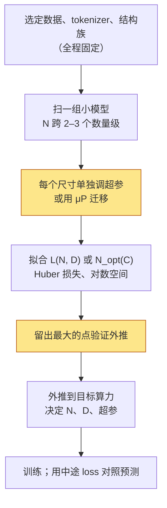

《Transformer 与 LLM》第二篇给出了训练一个模型的算力：$$C \approx 6ND$$，参数量乘 token 数再乘 6。这个公式把一次预训练的成本压成两个变量的乘积，但没有说**怎么分**——同样 $$10^{24}$$ FLOPs，是 100B 参数训 1.7T token，还是 10B 参数训 17T token？两者的 loss 差多少？训完之后哪个更便宜？

Scaling law 回答的就是这个问题。它是过去五年里预训练最重要的一组经验规律：loss 随参数量、数据量、算力各呈幂律下降，幂律的指数决定算力该怎么分，而分法在 2020、2022、2024 各改了一次——Kaplan 说模型要大，Chinchilla 说数据要多，Llama 3 之后的所有模型都在 Chinchilla 认为"太多"的数据上训练。

本篇要回答的核心问题是：

> **Llama-3 8B 用 15T token 训练，是 Chinchilla 最优数据量的 10 倍，loss 比同算力的最优模型（约 80B 参数、1.5T token）高 0.05 nats。为什么放弃这 0.05 反而是正确的？[^q0] "最优"这个词在 2022 和 2024 各指什么？[^q1]**

## 一、总览：三个时代的同一条公式

### 1. 先说答案

预训练的 loss 可以写成参数量 $$N$$ 与 token 数 $$D$$ 的函数（Hoffmann 等 2022，Chinchilla）：

$$
L(N, D) = E + \frac{A}{N^{\alpha}} + \frac{B}{D^{\beta}}
$$

三项分别是：不可约的 $$E$$（数据本身的熵）、参数不够带来的 $$A / N^\alpha$$、数据不够带来的 $$B / D^\beta$$。在 $$C = 6ND$$ 固定时最小化它，得到 $$N_{opt} \propto C^{0.5}$$、$$D_{opt} \propto C^{0.5}$$——**算力翻 10 倍，参数与数据各翻约 3 倍**，且最优的 $$D / N \approx 20$$。这是 Chinchilla 的结论，它推翻了两年前 Kaplan 等 2020 的 $$N \propto C^{0.73}$$（算力翻 10 倍，参数翻 5.4 倍、数据只翻 1.9 倍）。

但"最优"只在**训练算力**这一个约束下成立。模型训完是要跑推理的，推理成本每 token $$2N$$ FLOPs，与 $$D$$ 无关，与 $$N$$ 成正比。把推理量算进总成本，最优点就向小模型、多数据移动；预期服务的 token 越多，移得越远。Llama-3 8B 用 15T token（$$D/N = 1875$$）就是这个逻辑：在 7.2e23 FLOPs 的训练算力下，Chinchilla 最优是 81B 参数训 1.5T token；8B 模型 loss 高 0.054 nats，但**每个推理 token 便宜 10 倍**。

这三个时代可以放进同一张表：

| 时代 | 规则 | 依据 | 代表 |
|---|---|---|---|
| 2020 Kaplan | $$N \propto C^{0.73}$$，模型优先，数据 $$D / N \approx 1.7$$ 就够 | 小模型实验 + 固定的学习率调度 | GPT-3 175B / 300B token |
| 2022 Chinchilla | $$N \propto C^{0.5}$$，$$D / N \approx 20$$ | 400 多个 70M–16B 模型，三种拟合方法一致 | Chinchilla 70B / 1.4T，Llama-1 65B / 1.4T |
| 2024– 过训练 | 固定 $$N$$ 后 $$D$$ 尽量大，$$D / N$$ 200–2000 | 推理成本纳入总账；loss 随 $$D$$ 仍在对数线性下降 | Llama-3 8B / 15T，Qwen2.5 7B / 18T，Llama-4 Scout 17B 激活 / 40T |

### 2. 本文的路线

先讲幂律本身、它为什么会出现、两组指数为什么不同；再推导 Chinchilla 的最优分配，代入十几个真实模型看它们落在哪；再讲推理成本如何改写最优点，以及数据不够时怎么算、MoE 与长上下文怎么修正 $$6ND$$；最后讲 scaling law 作为一种**实验方法**——怎么用小模型的几个点预测大模型，超参数怎么跟着规模走，哪些地方容易做错。配套脚本在 CPU 上训 7 个字符级小模型，拟合一条幂律并外推最大的那个。

### 3. 本文的章节安排

| 章 | 主题 | 内容 |
|---|---|---|
| 二 | 幂律 | Kaplan 的三条幂律、为什么是幂律、Chinchilla 的参数化与三种方法、两者为什么不同、常数的可靠性 |
| 三 | 算力怎么分 | 拉格朗日推导 $$N_{opt}(C)$$、$$D/N \approx 20$$、$$L_{opt}(C)$$ 的指数、真实模型的 $$D/N$$ 与 GPU 小时、集群规模换算 |
| 四 | Chinchilla 之后 | 推理成本、过训练的代价表、推理感知最优点的推导、数据受限的有效 token、数据质量改变常数、MoE 与长上下文对 $$N$$ 和 $$6ND$$ 的修正 |
| 五 | 用小模型预测大模型 | IsoFLOP 与固定 $$D$$ 两种扫法、拟合的数值细节、超参数的 scaling、从 loss 到 benchmark、常见错误 |
| 六 | 实践 | `scaling_law_fit.py`、`llm_cost_10_scaling.py` |
| 七 | 本文小结 | |
| 八 | 自测 | 5 道题 |

## 二、幂律：loss 是 N 与 D 的函数

### 1. Kaplan 等 2020：三条幂律

OpenAI 在 2020 年的观察是：把语言模型的 loss（交叉熵，nats/token）对参数量、数据量、算力分别作图，只要另外两个不成为瓶颈，每一条都是**直线在双对数坐标下**——幂律：

$$
L(N) = \left(\frac{N_c}{N}\right)^{\alpha_N},\ \alpha_N = 0.076;\qquad
L(D) = \left(\frac{D_c}{D}\right)^{\alpha_D},\ \alpha_D = 0.095;\qquad
L(C) = \left(\frac{C_c}{C}\right)^{\alpha_C},\ \alpha_C = 0.050
$$

$$N_c = 8.8 \times 10^{13}$$、$$D_c = 5.4 \times 10^{13}$$ 是拟合常数（$$N$$ 不含 embedding 参数）。指数很小——参数翻 10 倍 loss 只降 $$10^{-0.076} = 16\%$$——但在 $$N$$ 横跨 7 个数量级（768 到 1.5B）的范围内没有弯曲。三条曲线的第一个用处是**可预测性**：训一组小模型就能画出直线，大模型的 loss 在直线的延长线上。

第二个用处是**分配**。Kaplan 把两条单变量幂律合成一条联合公式

$$
L(N, D) = \left[\left(\frac{N_c}{N}\right)^{\alpha_N / \alpha_D} + \frac{D_c}{D}\right]^{\alpha_D}
$$

并推出：在固定算力下最优的 $$N \propto C^{0.73}$$、$$D \propto C^{0.27}$$。也就是算力增加时绝大部分应该花在更大的模型上，数据只需要略微增加；GPT-3 的 175B 参数 / 300B token（$$D / N = 1.7$$）就是按这个规则训的。

论文还有一个当时被忽略、后来很重要的观察：**大模型的样本效率更高**——同样的 token 数，大模型的 loss 更低，而且到达同一 loss 用的 token 更少。这一点本身没错，但它导出的"训大模型、别训太久"在两年后被证明是学习率调度造成的假象（第 4 节）。

### 2. 为什么是幂律

幂律不是 Transformer 特有的，也不是语言特有的：图像、语音、强化学习的模型在同样的坐标下也画出直线。几种解释从不同角度得到同一个形状，值得知道，因为它们决定了哪些因素能改变指数：

- **分辨率受限**（Bahri 等 2021、Sharma & Kaplan 2020）：把数据看成一个 $$d$$ 维流形上的分布，模型用 $$N$$ 个参数分段近似它；每个参数负责流形上一块区域，区域的直径 $$\propto N^{-1/d}$$，光滑函数的近似误差随直径的幂次下降，于是 $$L - E \propto N^{-\alpha}$$，$$\alpha \approx 4 / d$$（对平方损失与二阶光滑）。数据侧同理：$$D$$ 个样本覆盖流形，最近邻距离 $$\propto D^{-1/d}$$。**指数由数据的内在维度决定**，与结构无关——这是为什么换结构（MHA → GQA、加 MoE）主要改常数不改指数。
- **技能是 Zipf 分布的**（Michaud 等 2023 的"量子化"模型）：假设语言由许多离散的"技能"组成，第 $$k$$ 常用的技能出现频率 $$\propto k^{-\zeta}$$，模型按频率顺序学会它们，参数越多学会的越多；把学不会的技能带来的 loss 加起来就得到幂律，指数 $$\alpha = \zeta - 1$$。这个解释多了一层含义：loss 的平滑下降背后是一个个离散能力的开启，与第五章"涌现"的讨论相通。
- **随机特征 / 核回归的谱衰减**：把网络近似为核方法，核的特征值按幂律衰减，泛化误差随样本与特征数按幂律下降，指数由谱衰减率决定。

三种解释都说：$$E$$ 是数据的熵，$$\alpha$$、$$\beta$$ 是数据的性质，$$A$$、$$B$$ 才是模型和优化能动的。**数据换了，一切都要重拟；结构换了，通常只是常数变**。第四章第 5 节会看到数据质量确实改变了拟出来的最优分配。

### 3. Chinchilla：加一个不可约项，三种方法重做

DeepMind 在 2022 年训了 400 多个模型（70M 到 16B，$$5 \times 10^{18}$$ 到 $$5 \times 10^{21}$$ FLOPs）重新拟合，用三种独立方法：

1. **固定 $$N$$ 扫 $$D$$**：对每个模型大小画 loss 随 token 数的曲线（每个 $$D$$ 用与它匹配的完整学习率调度），对每个算力预算取所有曲线中最低的点，得到一组 $$(C, N_{opt}, D_{opt})$$，再对它们拟合幂律；
2. **IsoFLOP**：固定算力 $$C$$，改变 $$N$$（相应地 $$D = C / 6N$$），画 loss 随 $$N$$ 的 U 形曲线，用抛物线拟合谷底——本文右图就是这条曲线；
3. **参数化拟合**：把所有点拟到 $$L(N, D) = E + A/N^\alpha + B/D^\beta$$，用 Huber 损失在对数空间做最小化，然后解析地解出最优分配。

三种方法给出几乎相同的结论：$$N_{opt} \propto C^{0.5}$$，$$D_{opt} \propto C^{0.5}$$，最优 $$D/N$$ 约 20。验证是 Chinchilla 模型本身：与 Gopher（280B / 300B）同算力，改成 70B / 1.4T，在几乎所有 benchmark 上更好。

参数化形式比 Kaplan 的多一个 $$E$$：语言有不可约的熵，loss 不会趋向 0。这一项让曲线在双对数图上**不是直线而是渐近线**——$$\log(L)$$ 对 $$\log N$$ 在小 $$N$$ 处近似直线，接近 $$E$$ 时弯平。Kaplan 的数据范围里 $$L \gg E$$，直线拟得很好；范围一旦扩大，没有 $$E$$ 的形式会系统性地高估大模型的收益。这也是拟合结果对数据范围敏感的原因（第 5 节）。

### 4. 为什么 2020 与 2022 差这么多

$$N \propto C^{0.73}$$ 与 $$N \propto C^{0.5}$$ 的差距不是噪声——外推到 $$10^{25}$$ FLOPs，两个规则给出的最优模型大小差一个数量级。事后分析（Hoffmann 等 2022 自己的讨论，以及 Pearce & Song 2024、Porian 等 2024 的复现）归结为三件事：

| 差异 | Kaplan 的做法 | 影响 |
|---|---|---|
| 学习率调度 | 所有运行用同一个固定长度的 cosine 调度，不随训练 token 数变；训得短的运行在调度中途被截断 | 中途截断的 loss 偏高（还没退火），系统性高估了"少数据"的代价，于是偏向多参数 |
| 参数怎么数 | $$N$$ 不含 embedding | 小模型里 embedding 占比大（第一篇：0.5B 模型 28%），不数它让小模型看起来比实际"便宜"，斜率被抬高 |
| 规模 | 最大 1.5B，最多 $$10^{21}$$ FLOPs 量级 | 小规模下 $$A / N^\alpha$$ 项主导，$$B / D^\beta$$ 项被低估 |

Porian 等 2024 把这三个因素逐个开关，复现了从 0.73 到 0.5 的全部差距：只修学习率调度（让 warmup 与衰减随 $$D$$ 变）指数从 0.73 降到约 0.6；再把 embedding 算进 $$N$$ 降到约 0.55；再把每个尺寸的学习率与 batch 单独调优（Kaplan 用同一组超参数）降到 0.5。**三个因素里没有一个是"发现了新物理"，全是实验设计。**

第一条最重要，也是配套实验里专门处理的一点：**用 cosine 调度训练时，中途的 loss 不能当作 $$L(D)$$ 的点**，因为它包含"学习率还没降下来"的成分。要画 $$L(D)$$ 曲线，要么每个 $$D$$ 单独跑一次完整调度，要么用常数学习率（或第四篇的 WSD 调度——它的"稳定"段就是常数学习率，随时可以分叉出一段退火拿到一个干净的 $$L(D)$$ 点，这是 WSD 在 2024 年被广泛采用的直接原因之一）。

### 5. 常数有多可靠

Chinchilla 论文给出的参数化常数是 $$E = 1.69$$、$$A = 406.4$$、$$B = 410.7$$、$$\alpha = 0.34$$、$$\beta = 0.28$$。Besiroglu 等 2024 用论文发布的数据（从图中提取的 240 个点）重新拟合，发现这组常数与论文自己的方法 1、2 不一致（它给出的最优 $$D/N$$ 约 90，而不是 20），原因是原文的优化没有收敛到全局最优（Huber 损失的 $$\delta$$ 取得过小，加上初值网格的限制）；重拟合得到 $$E = 1.82$$、$$A = 482$$、$$B = 2085$$、$$\alpha = 0.348$$、$$\beta = 0.366$$，与方法 1、2 一致（Gopher 算力下最优 72B / 1.33T，$$D/N = 18$$）。本文与配套脚本用重拟合的这组；两组常数在 Gopher 算力下的最优点：

```text
Hoffmann 2022 Approach 3    N_opt = 32.2B   D_opt = 2.98T   D/N = 93   N ∝ C^0.45
Besiroglu 2024 重拟合        N_opt = 72.2B   D_opt = 1.33T   D/N = 18   N ∝ C^0.51
```

注意 $$\alpha$$ 几乎没变，变的是 $$\beta$$（0.28 → 0.37）与 $$B$$（411 → 2085）：数据项的形状被原文拟错了，而 $$D/N$$ 恰好由 $$\alpha$$ 与 $$\beta$$ 的比值决定（第三章）。一个被引用了两年的常数表，最优分配差了 5 倍，是这个领域"数字要自己验"的最好例子。

两点提醒。第一，scaling law 的**指数**比**常数**可靠：$$\alpha \approx \beta \approx 0.35$$、$$N \propto C^{0.5}$$ 在多个独立复现里稳定，而 $$E$$、$$A$$、$$B$$ 依赖 tokenizer、数据、模型结构，换一个就要重新拟合。第二，所有这些常数只对"标准 dense Transformer + 该实验室的数据"成立，loss 的绝对值不能跨 tokenizer 比较（第一篇第四章第 3 节：同一段文字切成不同数量的 token，每 token 的 loss 不同；比较只能换算到 bits/byte）。

## 三、算力怎么分：Chinchilla 最优

### 1. 推导

在 $$6ND = C$$ 的约束下最小化 $$L(N, D)$$。把约束代入消去 $$D$$：

$$
L(N) = E + A N^{-\alpha} + B \left(\frac{C}{6N}\right)^{-\beta} = E + A N^{-\alpha} + B \left(\frac{6}{C}\right)^{\beta} N^{\beta}
$$

对 $$N$$ 求导置零：

$$
-\alpha A N^{-\alpha - 1} + \beta B \left(\frac{6}{C}\right)^{\beta} N^{\beta - 1} = 0
\quad \Longrightarrow \quad
\alpha \frac{A}{N^\alpha} = \beta \frac{B}{D^\beta}
$$

右边那个形式是拉格朗日条件的另一种写法：两项对各自变量的**弹性**（$$\partial L / \partial \log N$$ 与 $$\partial L / \partial \log D$$）相等——在最优点，多花 1% 的参数与多花 1% 的数据带来的 loss 下降相同，否则就应该把算力从收益低的一侧挪到高的一侧。解出：

$$
N_{opt}(C) = G \left(\frac{C}{6}\right)^{a},\quad D_{opt}(C) = \frac{1}{G}\left(\frac{C}{6}\right)^{b},\quad
a = \frac{\beta}{\alpha + \beta},\ b = \frac{\alpha}{\alpha + \beta},\ G = \left(\frac{\alpha A}{\beta B}\right)^{\frac{1}{\alpha + \beta}}
$$

$$\alpha \approx \beta$$ 给出 $$a \approx b \approx 0.5$$：**参数与数据应该同步增长**。直觉是：loss 的两项衰减速度差不多，把算力偏向任何一边都让另一项成为瓶颈。重拟合的常数下 $$G = 0.12$$，$$a = 0.51$$；Kaplan 的 0.73 对应 $$\beta / \alpha \approx 2.7$$——数据项衰减得比参数项快得多，所以数据可以少给。

### 2. D/N ≈ 20 从哪来

$$D_{opt} / N_{opt} = (C/6)^{b - a} / G^2$$，在 $$a \approx b$$ 时几乎是常数 $$1 / G^2 \approx 70$$——这是理论值，实际拟合出来在 $$10^{21}$$ 到 $$10^{26}$$ 之间从 22 缓慢降到 16（`llm_cost_10_scaling.py`），因为 $$b - a = -0.02$$ 不是零：

| 算力 $$C$$（FLOPs） | $$N_{opt}$$ | $$D_{opt}$$ | $$D/N$$ | $$L_{opt}$$ | H100 GPU 小时（MFU 40%） |
|---|---|---|---|---|---|
| $$10^{21}$$ | 2.78B | 60B | 22 | 2.306 | 702 |
| $$10^{22}$$ | 9.05B | 184B | 20 | 2.141 | 7 022 |
| $$10^{23}$$ | 29.4B | 566B | 19 | 2.032 | 70 217 |
| $$5.76 \times 10^{23}$$（Gopher / Chinchilla） | 72.2B | 1.33T | 18 | 1.974 | 404 449 |
| $$10^{24}$$ | 95.9B | 1.74T | 18 | 1.960 | 702 168 |
| $$3.8 \times 10^{25}$$（Llama 3.1 405B） | 619B | 10.2T | 17 | 1.892 | 26 682 395 |
| $$10^{26}$$ | 1.02T | 16.4T | 16 | 1.880 | 70 216 830 |

"20 个 token 每参数"是这张表的口诀版。

### 3. 最优 loss 随算力怎么降

把 $$N_{opt}$$、$$D_{opt}$$ 代回 $$L$$，两个幂律项在最优点同阶，都是 $$\propto C^{-\alpha\beta / (\alpha + \beta)}$$：

$$
L_{opt}(C) - E \propto C^{-\frac{\alpha \beta}{\alpha + \beta}},\qquad \frac{\alpha\beta}{\alpha + \beta} = \frac{0.348 \times 0.366}{0.714} = 0.178
$$

即**算力翻 10 倍，可约 loss 乘 0.66**。用上表验算：$$10^{21}$$ 处可约 loss $$2.306 - 1.82 = 0.486$$，$$10^{22}$$ 处 0.321，比值 0.66。这个指数是 Kaplan 的 $$\alpha_C = 0.05$$ 的 3.5 倍——不是因为 2022 年的模型学得更快，而是 Kaplan 的公式没有 $$E$$：把 $$E = 1.82$$ 加进 $$L$$ 再取对数，同一组数据的斜率会平缓得多。两个指数描述的是不同的量（$$L$$ 对 $$L - E$$），不能直接比。

对预算规划这条公式的用法是反过来：要把可约 loss 再降一半（比如从 0.15 到 0.075），算力要乘 $$2^{1/0.178} = 49$$ 倍。**loss 的每一次"减半"要五十倍的算力**，这是幂律指数小于 1 的直接后果，也是为什么 2024 年之后前沿模型的改进越来越多来自数据、后训练与推理时算力而不是预训练规模。

### 4. 从 FLOPs 到 GPU 小时与集群

表的最后一列把 FLOPs 换成钱：$$\text{GPU 小时} = C / (\text{峰值算力} \times \text{MFU} \times 3600)$$，按 H100 BF16 989 TFLOPS、MFU 40% 算，Llama 3.1 405B 的 $$3.8 \times 10^{25}$$ 是 2670 万 GPU 小时；Meta 公布的实际数字是 3084 万——反推 MFU 约 35%，与论文报告的 38–41% 量级一致（差额是 checkpoint、重启、评测等非训练时间，第四篇算这笔账）。

再换成集群规模：Llama 3 用 16 384 张 H100 训 405B，$$2670 \text{ 万} / 16384 = 1629$$ 小时 ≈ 68 天（按 40% MFU）；按实际的 3084 万是 78 天。这个换算在项目规划里反着用：**给定 $$N$$ 张卡与 $$T$$ 天，能训的算力是 $$N \times T \times 24 \times 989\text{T} \times \text{MFU}$$**，代入第 2 节的表就是"这个集群该训多大的模型、用多少数据"。一个 1024 卡的 H100 集群跑 30 天、MFU 40%：$$C = 1024 \times 720 \times 3600 \times 989 \times 10^{12} \times 0.4 = 1.05 \times 10^{24}$$，Chinchilla 最优约 96B / 1.7T；若按 2024 年的做法固定训一个 8B，可以喂 $$C / (6 \times 8\text{B}) = 22$$T token。

### 5. 真实模型落在哪

把十几个公开模型的 $$(N, D)$$ 代入，算出算力、Chinchilla 预测的 loss、同算力最优点的 loss，以及两者的差：

| 模型 | $$N$$ | $$D$$ | $$D/N$$ | $$C = 6ND$$ | GPU 小时 | $$L(N, D)$$ | 同算力 $$N_{opt}$$ | $$\Delta L$$ |
|---|---|---|---|---|---|---|---|---|
| GPT-3 175B（2020） | 175B | 300B | 2 | $$3.2 \times 10^{23}$$ | 221K | 2.009 | 53B | +0.016 |
| Gopher 280B（2021） | 280B | 300B | 1 | $$5.0 \times 10^{23}$$ | 354K | 2.000 | 68B | +0.021 |
| Chinchilla 70B（2022） | 70B | 1.4T | 20 | $$5.9 \times 10^{23}$$ | 413K | 1.974 | 73B | +0.000 |
| Llama-1 65B（2023） | 65B | 1.4T | 22 | $$5.5 \times 10^{23}$$ | 383K | 1.976 | 70B | +0.000 |
| Llama-2 7B（2023） | 7B | 2T | 286 | $$8.4 \times 10^{22}$$ | 59K | 2.065 | 27B | +0.026 |
| Llama-2 70B | 70B | 2T | 29 | $$8.4 \times 10^{23}$$ | 590K | 1.965 | 88B | +0.000 |
| Llama-3 8B（2024） | 8B | 15T | 1875 | $$7.2 \times 10^{23}$$ | 506K | 2.022 | 81B | +0.054 |
| Llama-3 70B | 70B | 15T | 214 | $$6.3 \times 10^{24}$$ | 4.4M | 1.930 | 246B | +0.010 |
| Llama-3.1 405B | 405B | 15.6T | 39 | $$3.8 \times 10^{25}$$ | 26.6M | 1.893 | 618B | +0.001 |
| Qwen2.5 7B（2024） | 7.6B | 18T | 2368 | $$8.2 \times 10^{23}$$ | 576K | 2.023 | 87B | +0.058 |
| DeepSeek-V3（2024，37B 激活） | 37B | 14.8T | 400 | $$3.3 \times 10^{24}$$ | 2.3M | 1.951 | 176B | +0.018 |
| Llama-4 Scout（2025，17B 激活） | 17B | 40T | 2353 | $$4.1 \times 10^{24}$$ | 2.9M | 1.973 | 197B | +0.044 |
| Qwen3 32B（2025） | 32B | 36T | 1125 | $$6.9 \times 10^{24}$$ | 4.9M | 1.947 | 258B | +0.029 |
| Kimi K2（2025，32B 激活） | 32B | 15.5T | 484 | $$3.0 \times 10^{24}$$ | 2.1M | 1.955 | 168B | +0.021 |

（loss 是 Chinchilla 公式在这些 $$(N, D)$$ 上的**预测值**，用于相互比较，不是这些模型的实测 loss——它们的数据与 tokenizer 各不相同。MoE 的 $$N$$ 取激活参数，见第四章第 6 节。）

三个时代在 $$D/N$$ 一列上一目了然：2020–2021 是 1–2，2022–2023 的旗舰是 20–30，2024 之后的中小模型是 200–2400。$$\Delta L$$ 一列显示"偏离最优"的代价其实很小——最过训练的 Qwen2.5 7B 也只比同算力最优高 0.058 nats。这是第四章的起点：**IsoFLOP 曲线的谷底很平**，向小模型方向偏离几倍，loss 只涨百分之几，而推理成本按比例下降。

同一列反过来看 2020–2021：GPT-3 与 Gopher 偏向大模型的代价（+0.016、+0.021）也不大——U 形曲线在两侧都平。Chinchilla 相对 Gopher 的收益不是 loss 降了多少，而是**同样 loss 的模型小了 4 倍**，推理便宜 4 倍；这已经是 2024 年逻辑的雏形。

DeepSeek-V3 与 Kimi K2 的算力不到 Llama 3.1 405B 的十分之一，预测 loss 差 0.06。这解释了 2024 年之后 MoE 成为旗舰模型默认结构的经济学：同样的 loss 用五分之一的算力，或者同样的算力多训好几倍的 token。

## 四、Chinchilla 之后：为什么都在"过训练"

### 1. 推理成本不在 6ND 里

Chinchilla 的目标函数只有训练算力。一个被服务的模型，生命周期里的总 FLOPs 是：

$$
C_{total} = \underbrace{6 N D}_{\text{训练}} + \underbrace{2 N \cdot D_{inf}}_{\text{推理}} = 6N \left(D + \frac{D_{inf}}{3}\right)
$$

$$D_{inf}$$ 是预期服务的 token 总数。第二个写法说明一件事：**在总成本的账上，每个推理 token 相当于三分之一个训练 token**——训练一个 token 要前向加反向（$$6N$$），推理只要前向（$$2N$$）。一个被广泛使用的模型，$$D_{inf}$$ 可以远大于 $$D$$：Llama-3 8B 训练 15T token，如果它的所有部署实例合计每天生成 1T token，一年就是 365T——推理 FLOPs $$2 \times 8\text{B} \times 365\text{T} = 5.8 \times 10^{24}$$，是训练的 8 倍。这时"训练算力最优"的模型显然不是"总成本最优"的。

FLOPs 还低估了推理这一项。训练跑在 40% MFU，而 decode 是 memory-bound 的（《Transformer 与 LLM》第二篇），小 batch 下 MFU 常在 10–30%；同一个 FLOP 在推理时的 GPU 时间是训练时的 2–4 倍。再加上 KV cache（随层数与 $$n_{kv} d_{head}$$ 增长，与 $$N$$ 大致同向）决定了并发上限——**用 GPU 小时而不是 FLOPs 算，推理项的权重比 $$1/3$$ 更大**，最优点向小模型偏得更远。下面的表按 FLOPs 算，是保守的。

### 2. 固定算力缩小模型的代价

在 Llama-3 8B 的训练算力 $$C = 7.2 \times 10^{23}$$ 下，把模型从最优的 81B 缩小 $$k$$ 倍、数据放大 $$k$$ 倍（算力不变）：

| $$k$$ | $$N$$ | $$D$$ | $$D/N$$ | 预测 loss | $$\Delta L$$ | 推理 FLOPs/token |
|---|---|---|---|---|---|---|
| 1 | 81B | 1.48T | 18 | 1.968 | — | 162 G |
| 2 | 40.5B | 2.96T | 73 | 1.973 | +0.005 | 81 G |
| 4 | 20.3B | 5.93T | 293 | 1.987 | +0.019 | 40.5 G |
| 8 | 10.1B | 11.9T | 1170 | 2.011 | +0.043 | 20.3 G |
| 10 | 8.1B | 14.8T | 1829 | 2.021 | +0.053 | 16.2 G |


右图是这张表的曲线：谷底附近极平，$$k = 2$$ 几乎免费，$$k = 10$$ 付 0.053 nats 换推理成本降到十分之一。谷底为什么平？在最优点两项弹性相等，偏离 $$k$$ 倍时一项乘 $$k^\alpha$$、另一项乘 $$k^{-\beta}$$，一阶变化抵消，只剩二阶——$$\Delta L \approx \frac{1}{2}(\alpha + \beta)\alpha \frac{A}{N^\alpha} (\ln k)^2$$ 量级，$$k = 2$$ 时 $$(\ln 2)^2 = 0.48$$，$$k = 10$$ 时 5.3，与表里 0.005 → 0.053 的比例一致。

0.053 nats 是多少？按第三章第 3 节的公式，它相当于把算力砍掉约三分之二再训一个最优模型的差距——不小，但对一个要被服务几百 T token 的模型来说，用 3 倍训练算力换 10 倍推理成本是清楚的交易。Llama 3 论文的原话是 8B 与 70B 在 15T token 上"仍在对数线性地提升"，即 $$B / D^\beta$$ 项到 15T 还没有耗尽。

### 3. 推理感知的最优点

Sardana & Frankle 2023 把 $$C_{total}$$ 作为目标：给定要达到的 loss $$L^*$$ 与预期推理量 $$D_{inf}$$，在等 loss 线 $$L(N, D) = L^*$$ 上选总成本最低的 $$(N, D)$$。拉格朗日条件是 $$\nabla C_{total} \parallel \nabla L$$：

$$
\frac{\partial C_{total} / \partial N}{\partial C_{total} / \partial D} = \frac{6D + 2D_{inf}}{6N} = \frac{\partial L / \partial N}{\partial L / \partial D} = \frac{\alpha A N^{-\alpha - 1}}{\beta B D^{-\beta - 1}}
$$

整理成与第三章相同的形式：

$$
\alpha \frac{A}{N^\alpha} = \beta \frac{B}{D^\beta} \left(1 + \frac{D_{inf}}{3D}\right)
$$

与 Chinchilla 条件唯一的区别是数据项多了一个因子 $$1 + D_{inf} / 3D$$：预期推理量越大，等式右边越大，要维持平衡 $$N$$ 就要更小、$$D$$ 更大。$$D_{inf} = 0$$ 退回 Chinchilla；$$D_{inf} = 3D$$ 时数据项的权重翻倍。代入 $$L^* = 1.968$$（上表 $$k = 1$$ 的 loss）：

| 预期推理 token | $$N^*$$ | $$D^*$$ | $$D/N$$ | 训练 FLOPs | 推理 FLOPs | 合计 |
|---|---|---|---|---|---|---|
| 0 | 81B | 1.48T | 18 | $$7.2 \times 10^{23}$$ | 0 | $$7.2 \times 10^{23}$$ |
| 1T | 65B | 1.88T | 29 | $$7.3 \times 10^{23}$$ | $$1.3 \times 10^{23}$$ | $$8.6 \times 10^{23}$$ |
| 10T | 39B | 3.97T | 101 | $$9.3 \times 10^{23}$$ | $$7.8 \times 10^{23}$$ | $$1.7 \times 10^{24}$$ |
| 100T | 24B | 13.8T | 581 | $$2.0 \times 10^{24}$$ | $$4.8 \times 10^{24}$$ | $$6.7 \times 10^{24}$$ |
| 1000T | 17.5B | 59.3T | 3392 | $$6.2 \times 10^{24}$$ | $$3.5 \times 10^{25}$$ | $$4.1 \times 10^{25}$$ |

预期服务 100T token 时，达到同一 loss 的最省方案是 24B 参数训 13.8T——训练算力是 Chinchilla 方案的 2.7 倍，总成本是它的三分之一（对比 81B 模型服务 100T token 的 $$7.2 \times 10^{23} + 1.6 \times 10^{25}$$）。这张表就是 2024 年之后 $$D/N$$ 跑到几百上千的定量解释；它也说明**没有一个通用的最优 $$D/N$$**，答案取决于模型要服务多少 token。

表里还藏着一个上限：$$D^*$$ 随 $$D_{inf}$$ 增长得比 $$N^*$$ 缩小得快，1000T 那一行要 59T token——公开可得的高质量文本没有这么多。下一节算数据不够时怎么办。

### 4. 数据不够怎么办：重复的有效 token

过训练需要数据。公开可得的高质量文本有上限（第三篇会算：Common Crawl 过滤后约 15T token 量级），$$D/N$$ 上千的小模型很快撞到它。Muennighoff 等 2023 训了 400 多个模型测量重复数据的价值，把 Chinchilla 公式里的 $$D$$ 换成**有效 token 数**：

$$
D' = U + U R^* \left(1 - e^{-R / R^*}\right),\quad R^*_D \approx 15.4
$$

$$U$$ 是唯一 token 数，$$R = D / U - 1$$ 是重复的 epoch 数。形状是：第一遍全额计入，之后每一遍的价值按 $$e^{-R/R^*}$$ 衰减，总的有效 token 不超过 $$U(1 + R^*) \approx 16U$$——**无论重复多少遍，一份数据最多值 16 份**。代入 1T 唯一 token：

| epoch 数 | 名义 token | 有效 token | 折算率 |
|---|---|---|---|
| 1 | 1T | 1T | 100% |
| 2 | 2T | 1.97T | 98% |
| 4 | 4T | 3.73T | 93% |
| 8 | 8T | 6.62T | 83% |
| 16 | 16T | 10.6T | 66% |
| 40 | 40T | 15.2T | 38% |

**4 个 epoch 以内几乎无损，之后收益快速衰减，40 个 epoch 只值 15 个的量。**这给数据工程一个明确的预算：目标 $$D$$ 除以 4 是需要的最少唯一 token 数；再往上，每一份新数据比重复旧数据值钱得多。Llama 3 的 15T、Qwen3 的 36T 都以扩大唯一数据（多语言、代码、合成数据）为主，而不是多跑 epoch。

论文对参数侧做了对称的处理：数据重复时多余的参数也会"饱和"（$$N' $$ 用同样形式、$$R^*_N \approx 5.3$$），并给出一个实用结论——**数据受限时，把多出来的算力花在多跑几个 epoch 上，比花在更大的模型上好**，直到 4 epoch 左右两者持平。这与"数据重复导致过拟合"的直觉相反，原因是预训练的数据量远大于模型能记住的量，前几遍重复接近于新数据。

### 5. 数据质量改变常数，也改变分配

第二章第 2 节说指数由数据决定。这在实践中有一个具体的表现：**换一份更好的数据，拟出来的最优 $$D/N$$ 会变**。DeepSeek 2024 年的 scaling 论文（DeepSeek LLM）在三份质量递增的数据上分别拟合，发现数据质量越高，最优分配越偏向**模型**——高质量数据每个 token 的信息更多，同样的算力应该配一个更大的模型去吸收它，$$D/N$$ 下降。他们在自己的数据上拟出 $$N_{opt} \propto C^{0.524}$$、$$D_{opt} \propto C^{0.476}$$，与 Chinchilla 的 0.5 / 0.5 略有偏离，方向就是"模型多一点"。

反过来的例子是 FineWeb-Edu、DCLM 这类过滤后的高质量集（第三篇）：同样 $$N$$、$$D$$ 下 benchmark 明显更好，等于把整条 $$L(N, D)$$ 曲线向下平移——$$E$$ 与 $$A$$、$$B$$ 都变了。所以**scaling law 的拟合结果附着在一份数据上**，数据管线一变（换过滤器、换配比、加合成数据），最优点要重新算；一个团队的 $$D/N$$ 经验值不能直接搬到另一份数据上。

### 6. MoE 与长上下文：N 用哪个，6ND 差多少

**MoE**。MoE 模型有两个参数量：总参数 $$N_{total}$$（决定显存）与激活参数 $$N_{act}$$（决定每 token 的 FLOPs，《Transformer 与 LLM》第五篇）。$$6ND$$ 里的 $$N$$ 是 $$N_{act}$$——算力只花在激活的专家上。但 loss 的 $$A / N^\alpha$$ 项介于两者之间：在同样激活参数下，更多的专家（更大的 $$N_{total}$$）loss 更低，收益随专家数递减。Clark 等 2022 把它写成 $$L(N_{act}, \text{experts})$$ 的双幂律并发现专家数的收益在 256–512 个之后趋平；Krajewski 等 2024 加进**专家粒度**（把一个专家切成几个更小的）作第三个变量，给出的形式是

$$
L(N, D, G) = E + \left(\frac{g}{G^\gamma} + a\right)\frac{1}{N^\alpha} + \frac{b}{D^\beta}
$$

结论是在同算力下 MoE 总能比 dense 更低，且**训练 token 越多 MoE 的优势越大**——因为 MoE 的等效 $$N$$ 更大，把同样的 $$D$$ 用得更充分。第三章的表用 $$N_{act}$$ 是保守的：DeepSeek-V3 的真实 loss 应低于 37B dense 模型的预测值。对 Infra 的含义反过来：MoE 的算力账按 37B 算，显存与通信账按 671B 算，两者相差 18 倍，这是《Transformer 与 LLM》第五篇"部署 MoE 比部署 dense 70B 难"的另一种说法。

**长上下文**。$$6ND$$ 只数了权重项，忽略了 attention 的 $$s$$ 依赖项（《Transformer 与 LLM》第二篇）。DeepSeek LLM 论文因此不用 $$N$$ 而用**每 token 的非 embedding FLOPs** $$M$$ 作变量：

$$
M = 72\, n_{layer}\, d^2 + 12\, n_{layer}\, d\, s
$$

第一项是权重项（每层 $$12 d^2$$ 个参数 × 6），第二项是 attention 项。两者的比是 $$s / 6d$$：Llama-3-8B（$$d = 4096$$）在 $$s = 8192$$ 时 attention 项是权重项的 33%，$$s = 4096$$ 时 17%，$$s = 128\text{K}$$ 时 5.3 倍。**用 $$6ND$$ 算长上下文训练的算力会严重偏低**；而且这部分 FLOPs 不带来"参数"意义上的容量，把它算进 $$N$$ 会让拟合失真。这是为什么长上下文扩展通常放在预训练最后一小段（第四篇）：用 8K 训完绝大部分 token，最后几百 B token 换到 128K——否则 attention 项会吃掉一半以上的预算。同一篇论文的另一个发现放在第五章：超参数也应随 $$C$$ 按幂律走。

## 五、用小模型预测大模型

### 1. 实验设计：两种扫法

Scaling law 首先是一种实验方法：用几个便宜的点决定一个昂贵的点。整个流程是：



黄色两步是最常被省掉、也最常导致外推失败的两步。两种扫法：

- **固定 $$D$$ 扫 $$N$$**：训 5–7 个尺寸的模型，每个用同样的 token 数，拟合 $$L(N) = E + A / N^\alpha$$，外推目标尺寸。便宜，但拟出来的曲线只在这个 $$D$$ 下成立；$$D$$ 相对最大模型偏小时，外推会**偏乐观**（大模型数据不够，实际 loss 高于曲线）。配套实验的最大模型正是这样：外推 1.317，实测 1.342。
- **IsoFLOP**：固定几个算力预算，每个预算下扫 $$N$$，取谷底，再对谷底点拟合 $$N_{opt}(C)$$ 与 $$L_{opt}(C)$$。贵一个数量级（每个预算 5–8 个点），但直接给出"给定算力该多大"，且不受单一 $$D$$ 的偏差影响。Chinchilla 与 Llama 3 用的都是它。

Llama 3 的做法值得细看：在 $$6 \times 10^{18}$$ 到 $$10^{22}$$ FLOPs 之间做 IsoFLOP（模型 40M–16B），拟出 $$N_{opt}(C) \propto C^{0.53}$$，外推到 $$3.8 \times 10^{25}$$ 得到最优 402B 参数 / 16.55T token——于是训了 405B / 15.6T。**用不到万分之一的算力决定了万分之九千九百九十九怎么花。**

### 2. 拟合的数值细节

参数化拟合有五个参数、几十到几百个点，直接对 $$L$$ 做最小二乘会被大 loss 的小模型主导。Chinchilla 与后来的复现都在**对数空间**拟：

$$
\min_{a, b, e, \alpha, \beta} \sum_i \text{Huber}_\delta\Big(\text{LSE}\big(a - \alpha \log N_i,\ b - \beta \log D_i,\ e\big) - \log L_i\Big)
$$

其中 $$A = e^a$$、$$B = e^b$$、$$E = e^e$$，LSE 是 logsumexp（三项之和的对数）。Huber 损失让个别失败的运行（loss spike 没恢复、调度出错）不主导拟合；$$\delta$$ 太小会退化成 L1，优化变得非光滑——Besiroglu 等指出的原文问题就在这里。初值要网格化（$$\alpha, \beta$$ 在 0–1，$$E$$ 在 0.5–2 之间取几十个起点），用 L-BFGS 从每个起点出发取最优；置信区间用 bootstrap（对点重采样几百次）给出——Chinchilla 报告的 $$a = 0.46$$ 有 $$[0.45, 0.48]$$ 的区间，外推到 $$10^{25}$$ 时 $$N_{opt}$$ 的区间已经差一倍。

配套脚本用的是简化版：$$E$$ 一维网格，每个 $$E$$ 下对 $$\log(L - E)$$ 做线性回归；只有一个自变量时它与完整方法等价，且不需要非线性优化器。

### 3. 超参数也要 scaling

小模型的最优学习率和 batch 大小不是大模型的最优值。Kaplan 的 0.73 里有一部分正是这个原因（第二章第 4 节）。两条路：

- **拟合超参数的 scaling law**。DeepSeek LLM 在扫 $$N$$ 的同时对每个尺寸做学习率与 batch 的网格，发现最优值随算力按幂律走：$$\eta_{opt} = 0.3118\, C^{-0.125}$$，$$B_{opt} = 0.292\, C^{0.3271}$$（$$B$$ 以 token 计）。算力翻 10 倍，学习率降 25%、batch 增 2.1 倍。他们还发现最优区间很宽——在最优值附近一个 2–3 倍的范围内 loss 几乎不变——所以幂律不必很准，落在区间里就行。
- **参数化让最优超参与宽度无关**。$$\mu$$P（Yang 等 2022）通过按宽度缩放初始化与每层的学习率，让"在小模型上调好的学习率直接用在大模型上"成立（第四篇详述）。Cerebras、OLMo 等用它做 scaling 实验，好处是扫 $$N$$ 时不必对每个尺寸重调，坏处是要改训练代码的初始化与优化器分组。

无论哪条路，要点是一样的：**每个尺寸的点必须是"调好的"**，否则拟出的斜率里混着"小模型调得好、大模型调得差"的偏差。

### 4. 从 loss 到 benchmark

loss 是可预测的，benchmark 准确率不一定：它随规模的变化常是 S 形，小模型上接近随机、某个规模后陡升，被称为"涌现"。Schaeffer 等 2023 指出这很大程度上是**度量的产物**——准确率是不连续的（对/错），换成连续度量（如正确答案的对数概率、或按字符算的编辑距离）曲线就平滑了；多选题的"随机猜对 25%"地板也让小模型的分数堆在一起。Llama 3 用一个两步法绕过它：先拟合"benchmark 上正确答案的 NLL 随算力的幂律"，再拟合"准确率随 NLL 的 S 形曲线"，两步都平滑、都可外推，用 Llama 2 系列的点验证后再预测 405B 在 ARC Challenge 上的分数。Gadre 等 2024 把这条路做成通用流程，用 100 多个模型验证"loss → 一组下游任务平均分"的映射在 20 倍算力外推下仍准。

**对 Infra 有直接用处的推论**：训练中途的 loss 与预测曲线的偏差是最早的故障信号。Llama 3 与 OLMo 都报告用 scaling 曲线做"训练健康检查"——实测 loss 高于预测 0.01–0.02 就要查数据管线或数值问题（第四篇的 loss spike）。

### 5. 常见错误

| 错误 | 后果 | 对策 |
|---|---|---|
| 所有运行共用一个固定长度的学习率调度 | 少数据的点 loss 偏高（Kaplan 的问题） | 每个点用完整调度；或用常数 / WSD 调度取中途点 |
| 不同点用不同 tokenizer 或数据 | loss 不可比 | 全部固定，只变 $$N$$、$$D$$ |
| 只扫一个数量级就外推三个 | 幂律的小偏差被放大 | 至少两个数量级；报告置信区间；留出最大点验证 |
| 小模型的超参数直接沿用到大模型 | 大模型欠调，曲线弯曲 | 每个尺寸调学习率，或用 $$\mu$$P |
| 用没有 $$E$$ 的纯幂律 | 大模型收益被高估 | 用 $$E + A/N^\alpha$$；$$E$$ 用网格或联合拟合 |
| 用验证 loss 预测下游任务 | S 形与度量问题 | Llama 3 的两步法；换连续度量 |
| 把 MoE 的 $$N$$ 当 dense | 高估或低估 | 明确用 $$N_{act}$$ 算 FLOPs、用专门的 MoE 拟合算 loss |
| 用 $$6ND$$ 算长上下文的算力 | 低估 $$s / 6d$$ 倍 | 用 $$M = 72 L d^2 + 12 L d s$$ |
| 验证集与训练分布不同 | 拟合出的 $$E$$ 是验证集的熵，和训练目标不一致 | 用训练分布的留出集拟 scaling，下游集另测 |

## 六、实践：两个脚本

### 1. `scaling_law_fit.py`：在 CPU 上拟一条幂律

用 Python 标准库源码做字符级语料（3.8M 字符，164 个字符），训 7 个 2 层 Transformer，宽度 24 到 192，非 embedding 参数 14K 到 889K，每个训同样的 10.2M token（cosine 调度）：

```text
    d   N(非embedding)   FLOPs(6ND)  final loss
   24          14,304     8.79e+11      2.0025
   32          25,216     1.55e+12      1.8828
   48          56,256     3.46e+12      1.7204
   64          99,584     6.12e+12      1.6186
   96         223,104     1.37e+13      1.5027
  128         395,776     2.43e+13      1.4142
  192         888,576     5.46e+13      1.3415
```

用前 6 个点拟合 $$L = E + A / N^\alpha$$（对 $$E$$ 网格搜索，每个 $$E$$ 下 $$\log(L - E)$$ 对 $$\log N$$ 线性回归）得 $$E = 0.618$$、$$\alpha = 0.166$$，6 个点的残差都在 0.006 以内；外推第 7 个得 1.317，实测 1.342——偏乐观 0.025，原因如第五章所说：10M token 对 889K 参数的模型偏少（$$D/N = 11$$），$$B / D^\beta$$ 项开始显现。指数 0.166 与 Chinchilla 的 0.35 不可比（字符级、两层、语料极小），**形状**可比：双对数下的近似直线加一个渐近的 $$E$$。

第二个实验用**常数学习率**重训中等尺寸的模型，把 loss 随 token 数的曲线拟成 $$L(D) = E + B / D^\beta$$，8 个 log 点的残差在 0.03 以内。脚本里注明了为什么不能用 cosine 运行的中途点做这件事。完整运行约 10 分钟（8 线程 CPU），`--quick` 一分半。

拟合函数本身只有十几行：

```python
def fit_power_law(xs, ys):
    """L = E + A / x^alpha：对 E 做一维网格，每个 E 下 log(L - E) 对 log x 线性回归。"""
    best = None
    for E in torch.linspace(0.0, ys.min() * 0.999, 2000):
        z, lx = torch.log(ys - E), torch.log(xs)
        X = torch.stack([torch.ones_like(lx), -lx], 1)        # z = logA - alpha * lx
        coef = torch.linalg.lstsq(X, z.unsqueeze(1)).solution.squeeze(1)
        pred = E + torch.exp(coef[0]) * xs ** (-coef[1])
        err = ((pred - ys) ** 2).sum()
        if best is None or err < best[0]:
            best = (err, E, torch.exp(coef[0]), coef[1])
    return best[1:]                                            # E, A, alpha
```

想把它变成一个真正的 scaling 实验，要改三件事：每个尺寸单独扫学习率（或者接入 $$\mu$$P）、用 IsoFLOP 而不是固定 $$D$$、留出最大的点做验证——脚本的结构已经按这三步留了位置。

### 2. `llm_cost_10_scaling.py`：scaling law 的账

纯标准库，实现本文的全部公式：

```python
def chinchilla_loss(N, D)                      # E + A/N^α + B/D^β（Besiroglu 2024 常数）
def compute_optimal(C, consts=None)            # 拉格朗日闭式解 N_opt, D_opt
def gpu_hours(C, peak, mfu)                    # FLOPs → GPU 小时
def tokens_for_loss(N, target)                 # 等 loss 线：N 需要多少 D
def inference_aware_optimum(target, D_inf)     # 最小化 6ND + 2N·D_inf
def effective_tokens(unique, epochs)           # Muennighoff 的 D'
```

输出第三章的两张表、第四章的三张表，以及两组 Chinchilla 常数与 Kaplan 规则的对比。改 `RUNS` 列表可以把新模型放进对照表；`compute_optimal(C, consts=HOFFMANN)` 换成原文的常数看最优点怎么动——是体会"常数不可靠"最快的方法。

## 七、本文小结

| 项 | 公式 / 规则 | 数字 |
|---|---|---|
| 参数化 loss | $$L = E + A/N^\alpha + B/D^\beta$$ | $$E = 1.82$$、$$\alpha = 0.35$$、$$\beta = 0.37$$（重拟合） |
| 训练算力 | $$C = 6ND$$（长上下文用 $$M = 72Ld^2 + 12Lds$$） | Llama-3 8B：$$7.2 \times 10^{23}$$；405B：$$3.8 \times 10^{25}$$ = 2670 万 H100 小时 @ 40% MFU（实际 3084 万） |
| Chinchilla 最优 | $$\alpha A/N^\alpha = \beta B/D^\beta$$；$$N_{opt} \propto C^{0.5}$$，$$D/N \approx 20$$ | $$5.76 \times 10^{23}$$ → 72B / 1.33T |
| 最优 loss 随算力 | $$L_{opt} - E \propto C^{-\alpha\beta/(\alpha+\beta)}$$ | 指数 0.178：算力 ×10，可约 loss ×0.66；减半要 ×49 |
| Kaplan 规则 | $$N \propto C^{0.73}$$ | 差异来自固定长度的 lr 调度、不数 embedding、规模小 |
| 过训练的代价 | 固定 $$C$$，$$N$$ 缩 $$k$$ 倍，$$\Delta L \propto (\ln k)^2$$ | $$k = 10$$：loss +0.053，推理成本 1/10 |
| 推理感知最优 | $$\alpha A/N^\alpha = \beta B/D^\beta (1 + D_{inf}/3D)$$ | 服务 100T token：24B / 13.8T 而非 81B / 1.5T |
| 数据重复 | $$D' = U + U R^*(1 - e^{-R/R^*})$$ | 4 epoch 值 93%，16 epoch 值 66%，上限 16 倍 |
| 超参数 | $$\eta_{opt} \propto C^{-0.125}$$，$$B_{opt} \propto C^{0.33}$$ | 算力 ×10：lr −25%，batch ×2.1 |


对 Infra 的含义有三条。训练侧，$$6ND$$ 与 MFU 直接给出 GPU 小时预算，本文的表是"一个 $$10^{24}$$ 的项目要多少卡多少天"的起点；过训练意味着数据管线（第三篇）要供应 $$D/N$$ 上千的 token 量，且唯一 token 数至少是目标的四分之一。推理侧，模型越小越省，这是 2024 年后 7–30B 级别模型质量跃升的原因，也是推理系统容量规划时"同一 loss 的模型正在变小"这一趋势的来源。方法侧，scaling law 是决定大项目配置的标准流程——用万分之一的算力扫一组小模型，拟合、外推、再验证——而它最常见的失败来自实验设计：学习率调度不匹配、tokenizer 不一致、超参数没随尺寸调、外推太远。

配套代码：[`transformer-and-llm/scaling_law_fit.py`](https://github.com/arganzheng/ai-learning-labs/blob/main/transformer-and-llm/scaling_law_fit.py)（CPU 上训 7 个模型、拟合、外推，PyTorch）、[`llm_cost_10_scaling.py`](https://github.com/arganzheng/ai-learning-labs/blob/main/transformer-and-llm/llm_cost_10_scaling.py)（本文全部表格的数字，纯标准库）、[`tools/gen_scaling_svg.py`](https://github.com/arganzheng/ai-learning-labs/blob/main/transformer-and-llm/tools/gen_scaling_svg.py)（本文的图）；运行输出在 `expected/`。

## 八、自测

1. Llama-3 8B 训 15T token 的训练算力多少 FLOPs？按 Chinchilla 这笔算力该训多大的模型、多少数据？

   <details markdown="1"><summary>答案</summary>

   $$6 \times 8 \times 10^9 \times 1.5 \times 10^{13} = 7.2 \times 10^{23}$$；Chinchilla 最优约 72–80B 参数、1.3–1.5T token（$$D/N \approx 20$$）。

   </details>

2. $$L = E + A/N^\alpha + B/D^\beta$$，$$\alpha = 0.35$$、$$\beta = 0.37$$。固定算力翻 10 倍，可约 loss（$$L - E$$）变成原来的多少？

   <details markdown="1"><summary>答案</summary>

   $$L_{opt} - E \propto C^{-\alpha\beta/(\alpha+\beta)}$$，指数 $$0.35 \times 0.37 / 0.72 = 0.18$$；$$10^{-0.18} = 0.66$$。可约 loss 减半要算力 $$\times 49$$。

   </details>

3. 同样算力下把 $$N$$ 缩小 10 倍、$$D$$ 放大 10 倍，loss 高多少？推理成本降多少？

   <details markdown="1"><summary>答案</summary>

   $$\Delta L \propto (\ln 10)^2$$，实际约 +0.053 nats；推理每 token FLOPs 与字节都降 10 倍。

   </details>

4. Kaplan（2020）得出 $$N \propto C^{0.73}$$（模型优先），Chinchilla 得出 $$N \propto C^{0.5}$$（数据同步增长）。差异从哪来？

   <details markdown="1"><summary>答案</summary>

   Kaplan 用固定长度的学习率调度（小数据量的模型没充分衰减）、不数 embedding 参数、规模较小；修正后两者一致。

   </details>

5. 数据只有 1T token 但想按 Chinchilla 训一个 200B 模型（需要 4T），重复 4 个 epoch 的效果如何？16 个 epoch 呢？

   <details markdown="1"><summary>答案</summary>

   Muennighoff 等 2023 的公式 $$D' = U + U R^*(1 - e^{-R/R^*})$$：4 epoch 的有效数据约等于 93% 的新数据，几乎无损；16 epoch 只值 66%，收益递减，上限约 16 倍。

   </details>

## 下一篇

[预训练数据工程：从 Common Crawl 到 15T token，去重、过滤与配比的账](/pretraining-data-pipeline-dedup-filtering-and-mixture.html)

[^q0]: Chinchilla 的「最优」只最小化训练算力 $$C = 6ND$$ 下的 loss——同样 $$7.2 \times 10^{23}$$ FLOPs，最优是约 80B 参数训 1.5T token；Llama-3 8B 训 15T 是把 $$N$$ 缩 10 倍、$$D$$ 放 10 倍，loss 高 0.053 nats，但推理成本是 1/10。把推理算进去，最优条件变成 $$\alpha A/N^\alpha = \beta B/D^\beta (1 + D_{inf}/3D)$$：一个要服务 100T token 的模型，最优点从 81B / 1.5T 移到 24B / 13.8T——小模型、多数据。0.05 nats 换十倍的推理成本与部署便利，对一个要被下载几亿次的模型是划算的。详见[第三章](#三算力怎么分chinchilla-最优)、[第四章](#四chinchilla-之后为什么都在过训练)。
[^q1]: 2022 年（Chinchilla）指**训练算力最优**——固定 $$C$$ 让 loss 最低，$$D/N \approx 20$$；2024 年指**全生命周期最优**——训练 + 推理总成本，「过训练」成为常态，$$D/N$$ 到 100–2000。两个词的公式差一项 $$D_{inf}/3D$$。详见[第三章](#三算力怎么分chinchilla-最优)、[第四章](#四chinchilla-之后为什么都在过训练)。
