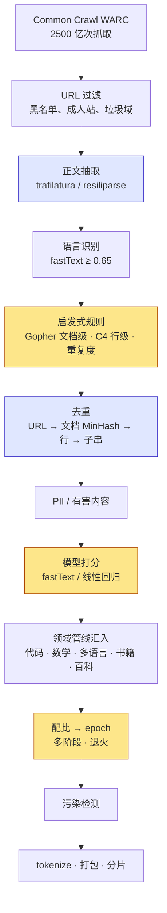

第十篇的结论是：算力固定时模型应该更小、数据应该更多，而且唯一 token 至少要有目标数据量的四分之一。Llama 3 的 15T、Qwen3 的 36T 不是从哪里"下载"来的——公开网页抽出正文后约有 240T token，其中能进训练集的只有百分之几，再经过模型打分留下的"高质量"部分不到 1%。从 240T 到 15T 之间是一条几十个步骤的管线：URL 过滤、正文抽取、语言识别、启发式规则、模型打分、三个粒度的去重、配比、多阶段课程、污染检测。

这一篇讲这条管线。它是预训练里唯一不在 GPU 上跑的大工程，成本以 CPU 核·小时与工程师月计；它的每个决定——去重的阈值、过滤的严格程度、各来源的配比——都直接改变 loss，且改变的幅度常常大于结构上的任何改动。方法仍然是算账：每一步留下多少、花多少、为什么。

本篇要回答的核心问题是：

> **Common Crawl 有 240T token 的文本，为什么 Llama 3 只用了 15T？被丢掉的 94% 是什么、怎么判定的？15T 里 25% 是"数学与推理"，但公开的数学语料只有几千亿 token——这 3.75T 从哪来？**


## 一、总览：一条漏斗与三个决定

### 1. 先说答案

预训练数据管线是一条漏斗，公开数据集给出了每一级的刻度：

```text
                                                      token 数     占抽出正文的
Common Crawl 全部快照的原始网页（WARC，约 100 个快照）    —          约 30+ PB 压缩
  │ 正文抽取（去掉 HTML、导航、广告、脚本）
  ▼
抽出正文后的文本（DCLM-Pool，2023 前的全部快照）        240T        100%
  │ URL 黑名单 · 语言识别 · 启发式规则 · MinHash 去重
  ▼
通用网页语料（FineWeb，96 个快照）                      15T         6.2%
  │ 模型打分："教育价值" / "像高质量回答"
  ▼
FineWeb-Edu（分类器打分 >= 2）                          5.4T        2.2%
DCLM-baseline（fastText 取前 10%）                     3.8T        1.6%
FineWeb-Edu 高分子集（>= 3）                            1.3T        0.5%
```

漏斗之后是三个决定：**去重到什么粒度**（URL、文档、行、子串，各自清掉不同的重复）、**过滤到多严**（启发式规则零成本但只清明显垃圾，模型打分留下的少但 loss 更低）、**怎么配**（各来源的比例换算成每个来源要跑多少 epoch）。Llama 3 的 15T 是 50% 通用知识、25% 数学与推理、17% 代码、8% 多语言；其中 3.75T 的数学推理远超公开数学语料的几千亿 token，靠的是从网页里用分类器筛出推理密集的文本、多跑 epoch（第十篇：4 个以内几乎无损）、以及合成与改写。

### 2. 本文的路线

按管线顺序走：先算原料有多少、抽取花多少、网页之外还有什么；再讲过滤的两层（规则与模型）与领域专用管线；再讲去重的四个粒度与 MinHash 的数学；再讲配比、多阶段与合成数据；最后是污染检测、数据消融的成本与整条管线的 CPU / 存储 / I/O 账。贯穿的例子是 FineWeb（Penedo 等 2024，Hugging Face 公开了完整管线与消融）、DCLM（Li 等 2024）、Dolma（Soldaini 等 2024）与 Llama 3 论文的数据章节。

管线的全貌先放一张图，后面各章按它的顺序展开：



蓝色是 CPU 成本最重的两步，黄色是三个需要消融来定的决定。

### 3. 本文的章节安排

| 章 | 主题 | 内容 |
|---|---|---|
| 二 | 原料 | Common Crawl 的规模与格式、URL 过滤、正文抽取、语言识别；网页之外的来源；每步留下多少 |
| 三 | 过滤 | Gopher / C4 的启发式规则；困惑度过滤；FineWeb-Edu 与 DCLM 的模型打分；PII 与有害内容；代码与数学的专用管线 |
| 四 | 去重 | 精确去重与布隆过滤器；文档级 MinHash + LSH 的数学与规模化实现；FineWeb"跨快照去重反而更差"；行级、子串级、语义级；去重与记忆 |
| 五 | 配比与课程 | 配比换算成 epoch、代理模型与自动化方法定权重、多阶段与退火、合成数据的算术动机与风险 |
| 六 | 污染、消融与管线的账 | n-gram 污染检测；一次数据消融多少钱；抽取 / 去重 / tokenize 的 CPU 小时、存储、训练时的读带宽与加载器 |
| 七 | 实践 | `minhash_lsh.py`、`quality_filters.py`、`llm_cost_11_data.py` |
| 八 | 本文小结 | |


## 二、原料：网页有多少

### 1. Common Crawl

几乎所有开源预训练语料的主体来自 Common Crawl（CC）：一个非营利组织从 2008 年起定期抓取网页，2013 年后大致每月一次，每次 2–3.5B 个页面，原始 WARC 文件每个快照 250–450 TiB（压缩）。快照之间大量重复（同一个站点每次都抓），96 个快照合计约 2500 亿次抓取，去重后的唯一页面远少于此。

每个快照（命名如 `CC-MAIN-2024-10`）提供三种文件：**WARC**（完整的 HTTP 响应，含 HTML）、**WAT**（元数据：链接、头部）、**WET**（CC 自己做的纯文本抽取）。WET 是最省事的入口，也是早期语料（C4、CCNet、RedPajama v1）的选择；2023 年后的语料几乎都回到 WARC 自己抽正文，原因在第 3 节。

### 2. URL 过滤

在抽正文之前先按 URL 过滤是最便宜的一层：不解析任何内容，只看域名与路径。三类规则：黑名单（UT1 的成人站列表等，几百万个域名）、域名启发式（URL 里含大量数字或 `xxx`、`porn`、`casino` 等词）、以及**污染源**——FineWeb 明确把 benchmark 数据集常见的托管站点（如 Hugging Face、GitHub 上的评测仓库）排除，避免测试题进入训练集（第六章）。这一步去掉的页面比例不大（个位数百分比），但它去掉的是最不该进训练集的那一部分，且几乎零成本。

### 3. 正文抽取

从 WARC 到文本有两条路：CC 自己提供的 WET 文件（简单的 HTML 去标签，保留导航与样板文字），或用正文抽取器（trafilatura、resiliparse、jusText）从 WARC 重新抽正文。FineWeb 的消融显示**用 trafilatura 从 WARC 抽取比直接用 WET 好得多**——WET 里的导航栏、cookie 提示、页脚版权在训练中是纯噪声，同算力下用 WET 训出的模型在多数 benchmark 上落后。DCLM 比较了几种抽取器，选择 resiliparse 的原因是质量与 trafilatura 相当而速度快约一个数量级——在 2500 亿个页面上，抽取器的速度直接决定管线要多少 CPU（第六章）。DCLM 把全部 2023 年前的快照用 resiliparse 抽取，得到 240T token 的 DCLM-Pool，这是本文漏斗的 100%。

抽取器做的事比"去标签"多：判断哪个 `<div>` 是正文、哪些是评论区、侧栏、相关阅读；保留段落与列表结构（换行）；丢掉脚本与样式；处理编码。它的错误有两个方向——把正文当样板删掉（长尾的非标准网页），或把样板当正文留下（新的页面模板）——都不能靠单篇检查，只能靠训练消融或第四章的行级去重兜底。

### 4. 语言识别

fastText 的语言分类器（lid.176，176 种语言，每秒几万篇）给每篇文档打分；FineWeb 只保留英文得分 ≥ 0.65 的。这一步把多语言内容全部去掉，是"英文语料"最大的一次减量——CC 里英文约占 45%，其余是几十种语言的长尾。多语言模型（Qwen3 支持 119 种语言）要为每种目标语言单独走这条管线，而每种语言可得的数据量相差几个数量级：中文、德文、法文各有数 T token 可用，多数非洲与南亚语言不到几十 B——第九篇的 tokenizer 问题在这里再出现一次：低资源语言不仅 token 贵，数据也少。语言识别本身对短文本和混合文本（中英夹杂的技术文章、代码注释）不可靠，阈值放宽会漏进错误语言，收紧会丢掉双语内容，多语言语料通常按语言分别调阈值。

### 5. 网页之外

CC 是主体但不是全部。几个公开语料的构成给出了"精选来源"各有多少：

| 来源 | RedPajama v1（2023） | Dolma v1.6（2024） | 性质 |
|---|---|---|---|
| Common Crawl 网页 | 878B | 2.28T | 主体；质量靠过滤 |
| C4（过滤后的 CC 子集） | 175B | 198B | 2019 年的一个快照 |
| GitHub / The Stack | 59B | 411B | 代码；许可证过滤后 |
| 书籍 | 26B | 6B | 版权问题使公开量急剧缩小 |
| arXiv | 28B | — | 论文 LaTeX 源 |
| Wikipedia | 24B | 4.3B（仅英文） | 每 token 质量最高，但只有几 B |
| StackExchange | 20B | — | 问答 |
| Reddit | — | 89B | 对话；2023 年后 API 关闭 |
| 学术论文（peS2o） | — | 70B | 开放获取全文 |
| 合计 | 1.2T | 3.1T | |

两个观察。第一，**精选来源加起来只有几百 B**，与网页的几十 T 差两个数量级——想训 15T 就必须以网页为主，"数据质量"的战场只能是网页过滤。第二，书籍一栏从 26B 缩到 6B：Books3 因版权下架后，公开可得的书籍只剩 Project Gutenberg 一类公有领域文本。商业模型的书籍数据来自授权与其他渠道，这是开源与闭源语料之间最大的一块不透明。

### 6. 每篇文档多大

网页正文平均约 1000 token（长尾很长：论坛帖子几十 token，长文几万），15T token 约 150 亿篇文档。这个数字决定去重与过滤的工作量单位——**管线的成本按文档数算，训练的成本按 token 数算**。


## 三、过滤：两层，各清掉不同的东西

### 1. 启发式规则

Gopher（Rae 等 2021）定义的一组文档级规则成了事实标准，FineWeb、Dolma、RefinedWeb 都在用（配套脚本 `quality_filters.py` 完整实现）：

| 规则 | 阈值 | 清掉什么 |
|---|---|---|
| 词数 | 50–100 000 | 太短的碎片；太长的日志 / 数据文件 |
| 平均词长 | 3–10 字符 | 乱码、连字符堆、非文本 |
| `#` 与省略号占比 | < 10% | 标签云、社交媒体转储 |
| 以列表符开头的行 | < 90% | 纯列表页、导航 |
| 以省略号结尾的行 | < 30% | 摘要列表页（"阅读更多…"） |
| 含字母的词 | ≥ 80% | 表格、数字页、代码碎片 |
| 停用词 | ≥ 2 个（the, be, to, of, and, that, have, with） | 非英语、关键词堆砌 |

加一组**重复度**规则：重复的行 / 段落占比 ≤ 30%、它们的字符占比 ≤ 20%、最高频 2/3/4-gram 的字符占比 ≤ 20/18/16%、重复的 5 到 10-gram 的字符占比 ≤ 15% 到 10%。它们针对的是 SEO 页面——同一个关键词短语重复几十遍。

C4（Raffel 等 2020）的规则在**行级**：只保留以句末标点结尾、至少 3 个词、不含 `lorem ipsum`、`{`、`javascript` 的行；再丢掉少于 5 句的页面和含脏词表词的页面。这一层清掉的是正文里夹着的"分享到 Twitter"、"Copyright 2024"、cookie 提示。C4 的脏词表规则后来被证明代价很高：它按词表删整页，系统性地删掉了医学、性教育、LGBTQ 相关的正常内容以及非裔与拉丁裔英语方言的文本（Dodge 等 2021）——过滤规则的偏差是第 2 节模型打分同样要面对的问题。

FineWeb 在两者之上加了三条自己的规则（消融证明有效）：以标点结尾的行 ≤ 12% 的文档丢弃、重复行的字符占比 ≥ 10% 的丢弃、少于 2 个词的行占比 ≥ 30% 的丢弃。每条都是看数据发现的一类垃圾——他们的方法是把"被全局去重删掉的文档"与"留下的文档"各抽样，找出两组之间统计量差异最大的指标，再把它做成规则。

脚本对五段样本的判定，正是这些规则想做的事：正常文章与"带页眉页脚的正文"通过 Gopher（后者由 C4 的行级规则去掉页眉页脚）；导航栏页、SEO 堆砌、数字表格分别被 3–7 条规则拦下。

规则的性质：**可解释、零成本（每篇文档微秒级）、只清明显垃圾**。它分不出"正确的百科条目"与"流畅的胡说"，也分不出"教科书式的解释"与"论坛闲聊"——那是第二层的事。

### 2. 困惑度过滤：模型打分的前身

在分类器之前，"用模型判断质量"的第一种形式是**困惑度**：用一个在 Wikipedia 上训的 n-gram 语言模型（CCNet，Wenzek 等 2020，KenLM 5-gram）给每篇文档算困惑度，低困惑度 = "像 Wikipedia"。CCNet 按困惑度把文档分成头、中、尾三档，Llama 1 只用头与中。它便宜（n-gram 模型每秒几十万篇）但偏差明显：它偏好与 Wikipedia 文风相似的文本，会压低口语、诗歌、代码、非百科式的高质量内容；同时低困惑度也可能是重复或模板（第四章）。困惑度过滤今天仍在多语言语料里用（每种语言训一个 KenLM 比标注一个分类器便宜），英文语料基本已被下一节的分类器取代。

### 3. 模型打分

2024 年数据工作最大的变化是用模型给文档打"质量分"，只留高分：

| 数据集 | 打分器 | 训练信号 | 阈值 | 留下 |
|---|---|---|---|---|
| FineWeb-Edu | 在 Snowflake-arctic-embed 向量上训的线性回归 | Llama-3-70B-Instruct 给 46 万篇样本的"教育价值"打 0–5 分 | ≥ 3（或宽松的 ≥ 2） | 15T → 1.3T（5.4T） |
| DCLM-baseline | fastText 二分类器 | 正例：OpenHermes-2.5 的指令数据 + r/ExplainLikeImFive 的高赞回答；负例：随机 CC 文档 | 取前 10% | 池 → 3.8T |
| Llama 3 | fastText + 基于 Llama 2 的 RoBERTa 分类器 | Llama 2 判断文档是否"像 Wikipedia 会引用的" | 未公开 | 未公开 |

三种打分器的共同点：**打分的模型不需要大**（fastText 是词袋 + 线性层，第九篇"一页史"里的 TF-IDF 时代的技术），大模型只用来给几十万篇样本标注，标注再蒸馏到小模型上跑 150 亿篇。这是唯一让"用 LLM 判断质量"在 240T token 上可行的算术：用 70B 模型直接给 150 亿篇、15T token 打分，是 $$2 \times 70\text{B} \times 15\text{T} = 2.1 \times 10^{24}$$ FLOPs——比训练 Llama-3 8B 本身还贵 3 倍；标注 46 万篇（约 5 亿 token）只要 $$7 \times 10^{19}$$，是万分之一。

效果：FineWeb-Edu 1.3T 训出的模型在 MMLU、ARC 这类知识与推理 benchmark 上明显超过 15T 的 FineWeb 同算力模型，且用更少的 token 达到同样的分数；DCLM 的消融把 fastText 打分列为所有过滤手段中收益最大的一项，超过任何一种去重或启发式规则的组合，DCLM-baseline 7B 用 2.6T token 在 MMLU 上追平了用了更多数据的同期开源模型。代价是**留下的太少**——1.3T 不够训一个 $$D/N$$ 上千的 8B 模型，所以实际配方是高分子集多跑几个 epoch（第十篇：4 个以内折损 7%）、或作为退火阶段的数据（第五章）。

阈值是一个"质量 vs 数量"的连续旋钮。FineWeb-Edu 给出了三档（≥ 2 留 5.4T，≥ 3 留 1.3T），DCLM 试了前 10% / 20% / 30%：**阈值越严，同 token 数下 benchmark 越高，但总量越少**，最优阈值取决于要训多少 token——小模型、少 token 时用最严的档，大模型、多 token 时放宽以避免多跑 epoch。这是第十篇的数据受限公式在过滤上的直接应用。

打分器的偏差是它的风险：以"教育价值"为标准会系统性压低小说、对话、代码注释、非主流观点；以"像 ELI5 高赞回答"为标准会偏向英语互联网的某一种文风。模型的知识面与语气在这里被塑形，且这一步在训练之前、几乎不可逆。实践中的缓解是**多个打分器取并集或按领域分别打分**，以及在退火阶段（第五章）补回被压低的类别。

### 4. PII 与有害内容

第三层过滤不是为了 loss，是为了合规与安全。**PII**：用正则找邮箱、IP 地址、电话号码，替换为占位符（Dolma 的做法：`|||EMAIL_ADDRESS|||`）或删掉含大量 PII 的文档；Llama 3 报告删除了含大量 PII 的域名整体。**有害内容**：在 URL 黑名单之上再用 fastText 分类器（Dolma 用 Jigsaw 数据训的毒性分类器）按文档过滤。这一层的量不大（个位数百分比），但它决定模型会不会背出某个人的电话——第四章会看到，重复次数多的字符串最容易被逐字记住，而电话与邮箱恰好经常重复出现在页脚里。

### 5. 领域专用管线：代码与数学

通用网页管线之外，代码与数学各有一条自己的管线，因为它们的"质量"标准不同，也因为它们正是核心问题里"3.75T 从哪来"的答案。

**代码**（The Stack v2，Lozhkov 等 2024）：从 Software Heritage 的归档出发，原始 67.5 TB；按许可证过滤（只留宽松许可证）；文件级去重（精确 + MinHash）；文件级启发式——平均行长 < 100、最长行 < 1000、字母数字字符占比 > 25%、去掉自动生成文件（minified JS、protobuf 生成代码、数据文件）、去掉过大与过小的文件；按语言配比（限制 HTML、JSON 等低信息密度语言的比例）。去重后约 900B token。

**数学**：网页里的数学内容在正文抽取时最容易被破坏——LaTeX 公式在 HTML 里是 MathJax 脚本或图片，通用抽取器直接丢掉。OpenWebMath（Paster 等 2023）写了一个保留 LaTeX 的抽取器，加一个数学内容分类器，从 CC 里筛出 14.7B token。DeepSeekMath（Shao 等 2024）把它放大：用 OpenWebMath 做正例训 fastText，在 CC 上召回，把召回结果里数学域名下的其他页面加入正例，**迭代四轮**，最终从 CC 里筛出 120B 数学 token——是 OpenWebMath 的 8 倍，且消融显示每一轮迭代都在提升。Llama 3 描述了同样的思路："从网页中筛出数学与推理密集的文本"，加上有验证的合成数据（第五章第 4 节），才凑出 3.75T 的规模。**领域数据不是找来的，是从通用网页里用越来越准的分类器一轮轮捞出来的**——这是 2024 年数学与代码能力普遍跃升的数据侧原因。


## 四、去重：四个粒度

### 1. 为什么去重

网页重复得厉害：同一篇新闻被几十个站转载，同一个模板生成几百万个页面，同一个快照里同一 URL 抓了多次。Lee 等 2021 在 C4 上发现约 1% 的 token 属于重复 50 次以上的子串，去掉它们后困惑度更低、且模型逐字背出训练数据的概率降低一个数量级。重复的代价有两面：训练上等价于给这些文本多跑几个 epoch（第十篇：收益递减），行为上让模型学会背诵而不是泛化。

**记忆**这一面有定量结果。Carlini 等 2022 测量了模型能逐字复现多少训练数据，发现记忆率随三个量对数线性增长：模型参数量、训练数据中该序列的重复次数、以及提示的上下文长度。一段在训练集里出现 10 次的文本，被 6B 模型复现的概率是出现 1 次的几倍；出现上百次的（许可证文本、名言、热门代码）几乎必然被记住。去重的第二个理由就是它：**训练集里重复的东西，是模型最可能原样吐出来的东西**——版权文本、PII、测试题（第六章）都在其中。

去重分四个粒度，各清掉不同的东西，实际管线全用：

| 粒度 | 方法 | 清掉什么 | Llama 3 的做法 |
|---|---|---|---|
| URL | 同一 URL 只留最新一次抓取 | 跨快照的重复抓取 | 是 |
| 文档（精确） | 归一化文本的哈希 | 完全相同的转载、镜像 | 是（MinHash 之前） |
| 文档（近似） | MinHash + LSH 找近重复 | 只改了几个词的复制、模板页 | 全局 MinHash |
| 行 / 段落 | 出现次数过多的行删掉 | 导航、版权、cookie 提示——不删整篇，只删这一行 | 每 3000 万篇文档为一桶，出现 > 6 次的行删掉 |
| 子串 | 后缀数组找 ≥ 50 token 的重复片段 | 引用块、许可证文本、代码里的模板 | RefinedWeb、DCLM 部分用 |

### 2. 精确去重与布隆过滤器

近似去重之前先做精确去重：把文档（或段落）做归一化（小写、压缩空白、去标点）后取哈希，相同哈希只留一份。150 亿篇文档的 64 位哈希是 120 GB，放得进一台大内存机器的集合里；但段落级（每篇几十段）就是几千亿个哈希，Dolma 用**布隆过滤器**：一个几十 GB 的位数组加 $$k$$ 个哈希函数，插入时置 $$k$$ 位，查询时 $$k$$ 位全为 1 即"可能见过"。假阳性率 $$\approx (1 - e^{-kn/m})^k$$，$$n$$ 个元素、$$m$$ 位，Dolma 把它调到 $$10^{-15}$$ 量级——误删一段的概率可以忽略，而内存是精确集合的十分之一。布隆过滤器不能删除、不能列出内容，只回答"见过没有"，恰好是去重需要的全部。

### 3. MinHash 与 LSH 的数学

文档级近似去重的难点是规模：150 亿篇文档两两比较是 $$10^{20}$$ 次。MinHash（Broder 1997）把它变成一次分桶。

**第一步：文档 → 集合。** 把文档切成词级 5-gram（FineWeb 的配置）的集合 $$S$$。两篇文档的相似度用 Jaccard 度量：$$J(A, B) = \lvert A \cap B \rvert / \lvert A \cup B \rvert$$。

**第二步：集合 → 签名。** 取 $$k$$ 个随机哈希函数 $$h_1 \dots h_k$$，对每个 $$h_i$$ 记录集合里的最小哈希值 $$\min_{x \in S} h_i(x)$$。关键性质：

$$
P\left[\min_{x \in A} h(x) = \min_{x \in B} h(x)\right] = J(A, B)
$$

证明只有一句：$$h$$ 是随机的，$$A \cup B$$ 里每个元素成为最小值的概率相等；两边最小值相同当且仅当那个元素在 $$A \cap B$$ 里；所以概率是 $$\lvert A \cap B \rvert / \lvert A \cup B \rvert$$。于是 $$k$$ 个最小值组成的签名里相同位置的比例是 $$J$$ 的无偏估计，方差 $$J(1 - J) / k$$——$$k = 112$$ 时在 $$J = 0.7$$ 处的标准差是 0.043。一篇几千词的文档压成 112 个整数，仍能估相似度到 ±0.04。

**第三步：签名 → 桶。** 把 112 个值切成 $$b = 14$$ 段（band）、每段 $$r = 8$$ 个；每段的 8 个值拼成一个 key，两篇文档只要**任何一段完全相同**就成为候选对，再对候选对精确算 Jaccard。两篇 Jaccard 为 $$J$$ 的文档成为候选的概率：

$$
P(\text{候选}) = 1 - \left(1 - J^{r}\right)^{b}
$$

```text
签名（112 个 minhash）         band 0          band 1   ...  band 13
文档 A  [17 903 44 ...]  ->  (17,903,44,..)  (…)      ...  (…)
文档 B  [17 903 44 ...]  ->  (17,903,44,..)  (…)      ...  (…)   band 0 相同 → 同桶 → 候选对
文档 C  [61 120  9 ...]  ->  (61,120,9,..)   (…)      ...  (…)   没有任何 band 相同 → 永不比较

P(某一段 8 个全同) = J^8        P(14 段里至少一段全同) = 1 - (1 - J^8)^14
```

这是一条 S 曲线，拐点在 $$J^* \approx (1/b)^{1/r} = (1/14)^{1/8} = 0.72$$（配套脚本的理论与实测）：

| Jaccard | 0.30 | 0.50 | 0.60 | 0.70 | 0.75 | 0.80 | 0.85 | 0.90 |
|---|---|---|---|---|---|---|---|---|
| $$P(\text{候选})$$ 理论 | 0.001 | 0.053 | 0.211 | 0.565 | 0.772 | 0.924 | 0.988 | 1.000 |
| 实测（200 对） | 0.00 | 0.10 | 0.28 | 0.57 | 0.82 | 0.95 | 1.00 | 1.00 |

$$J < 0.5$$ 的文档对几乎永不比较，$$J > 0.85$$ 的几乎必然比较。$$b$$ 与 $$r$$ 是两个旋钮：总哈希数 $$k = br$$ 固定时，$$r$$ 越大曲线越陡（更接近理想的阶跃）但拐点越高，$$b$$ 越大拐点越低。给定目标阈值 $$t$$，选 $$r$$ 后 $$b = t^{-r}$$；FineWeb 的 14 × 8 对应"改了 25% 以上就当不同文档"，RefinedWeb 用 20 × 450（9000 个哈希，阈值 0.8，曲线极陡），Dolma 与 Llama 3 用类似 FineWeb 的量级。曲线两侧的面积是两种错误：拐点以下被选为候选的是**误报**（多花一次精确比较，不损失数据），拐点以上漏掉的是**漏报**（近重复留在训练集里），所以工程上宁可 $$b$$ 大一点。

一个容易忽略的性质：**灵敏度依赖文档长度**。5-gram 的每处改动打掉 5 个 n-gram，42 个词的短文改 3 个词 Jaccard 就掉到 0.57，加个导航栏掉到 0.68，两者都过不了 0.72 的阈值；同样的改动放到 866 个词的长文上，Jaccard 是 0.96 和 0.98。网页正文通常几百到几千词，这个配置是为它们调的；短文本（评论、消息）要用更小的 $$n$$ 或更低的阈值。

### 4. 规模化实现

150 亿篇文档的 MinHash 在一台机器上跑不完，实现是一个分布式作业（Spark、Ray，或 datatrove 这类专用框架），分四个阶段：

1. **签名**：每篇文档独立算 112 个 minhash，完全并行；输出 150 亿 × 112 × 4 字节 = 6.7 TB 的签名。
2. **分桶**：对每个 band，以 8 个值的拼接为 key 做 shuffle + group，同 key 的文档 id 成为一个桶；14 个 band 各做一次。这是唯一需要跨机器通信的阶段，数据量是签名的量级。
3. **聚类**：把所有候选边（同桶的文档对）做并查集（union-find），得到近重复的连通分量；一个转载了一千次的新闻是一个含一千个节点的分量。
4. **选择**：每个分量留一篇（最长的、最早的、或来自最可信域名的），其余删掉。

阶段 2 的 shuffle 是瓶颈——每个 band 一次全量 shuffle，14 次。FineWeb 用 datatrove 在几千核上把一个快照的去重跑在小时级。MinHash 的哈希算量本身（第六章的表）只有几千核·小时，**贵的不是算哈希，是 shuffle 与聚类的 I/O**。

### 5. FineWeb 的发现：跨快照去重反而更差

直觉是去重越彻底越好。FineWeb 做了两种：把 96 个快照合在一起做一次全局 MinHash，或每个快照内部各自去重。**全局去重训出的模型更差**——它把 240T 中的绝大多数删掉，留下的 token 里"只在一个快照出现过"的低质量页面（垃圾站、一次性生成的页面）比例上升；而被反复抓到的页面本来就是更稳定、更有价值的站点。每个快照内部去重保留了这种"被多次抓取"的隐式质量信号。这个结果和 Muennighoff 的"4 epoch 以内几乎无损"（第十篇）是同一件事的两面：适度重复不伤害训练，而为了消灭它付出的代价（丢掉隐式的质量信号）反而更大。数据工程里这类反直觉结论只能靠消融发现，这也是 FineWeb 公开全部消融的价值。

### 6. 行级、子串级与语义级

文档级 MinHash 认为"带导航栏的正文"与"不带的"是近重复（长文上 $$J = 0.98$$），会留一篇删一篇——但留下的那篇仍然带着导航栏。**行级去重**解决这个：在一大批文档里统计每一行的出现次数，出现太多次的行（Llama 3：3000 万篇里 > 6 次）就是样板文字，从每篇文档里删掉这一行。它要分桶做（不能全局统计——"Thank you."这样的行全局出现千万次但不是样板），Llama 3 的 3000 万篇一桶就是这个平衡点。

**子串级去重**（后缀数组，Lee 等 2021）再清掉跨文档的长重复片段：把整个语料拼成一个串建后缀数组（$$O(n)$$ 空间但常数大——1T token 的后缀数组约 8 TB），找出所有长度 ≥ 50 token、出现 ≥ 2 次的子串，从除一处外的所有位置删掉。它清掉的是许可证全文、被广泛引用的段落、代码模板——这些片段所在的文档彼此并不相似，MinHash 抓不到。这两步不减文档数，减的是每篇文档里的噪声。

**语义级去重**（SemDeDup，Abbas 等 2023）走另一个方向：用一个 embedding 模型给每篇文档算向量，聚类，在每个簇内删掉余弦相似度极高的文档——它们讲的是同一件事的不同写法（同一新闻的不同报道、同一算法的不同教程）。字面上 Jaccard 可能只有 0.2，语义上是重复。论文报告在 LAION 上删掉 50% 数据不损失下游性能，在文本上收益较小但仍为正。代价是要对全部文档跑一遍 embedding 模型——比 MinHash 贵两个数量级，通常只在过滤后的几 T token 上做。

### 7. 去重要不要做到底

四个粒度加起来，去重是管线里对最终数据量影响最大的一步：FineWeb 的 MinHash 在每个快照内删掉约一半到三分之二的文档。但第 5 节说明"删得越多越好"不成立，第十篇说明适度重复接近无损——**去重的目标不是"没有重复"，是"没有过度重复"**。实践中的均衡点：URL 与精确去重全做（零争议），文档级 MinHash 按快照或按桶做而不做全局，行级去重按桶做，子串级只对代码与许可证类文本做，语义级只在小规模高质量集上做。


## 五、配比与课程

### 1. 配比换算成 epoch

过滤和去重之后，各来源的语料各有一个**唯一 token 数** $$U_i$$；配方给每个来源一个**权重** $$w_i$$；训练总量 $$D$$。每个来源实际要跑的 epoch 数是

$$
\text{epoch}_i = \frac{w_i D}{U_i}
$$

代入 Llama 3 的配比（50% 通用、25% 数学推理、17% 代码、8% 多语言）与公开数据集给出的量级（`llm_cost_11_data.py`）：

| 来源 | 权重 | 目标 token | 唯一 token（估） | epoch | Muennighoff 折算 |
|---|---|---|---|---|---|
| 通用网页（FineWeb 级） | 50% | 7.5T | 15T | 0.5 | 100% |
| 数学与推理 | 25% | 3.75T | ~0.5T | 7.5 | 84% |
| 代码（The Stack v2 去重后） | 17% | 2.55T | ~0.9T | 2.8 | 96% |
| 多语言 | 8% | 1.2T | 3T | 0.4 | 100% |

通用网页只用了一半，数学推理却要跑 7 个多 epoch。这是核心问题的答案的一半：**配比不是"有什么用什么"，而是先决定比例，再看每个来源够不够**；不够的来源要么多跑 epoch（折损可算），要么想办法扩充——从通用网页里用分类器筛出推理密集的文本（第三章第 5 节的 DeepSeekMath 路线），要么合成（第 4 节）。

这张表还有一个隐含的问题：**权重按什么单位算**。按 token 算，中文的 8% 多语言在 Llama 3 的 tokenizer 下（第九篇：中文 1.46 token/字）对应的字符数比同样 token 的英文少一半；按字符或按信息量算，多语言的实际占比更低。DeepSeek、Qwen 这类中英双语模型报告的配比如果按 token 算，中文的"有效占比"要按 tokenizer 效率折算才能与英文为主的模型比。

### 2. 用小模型定权重

权重怎么定？三种方法，成本递增、自动化程度递增。

**代理模型消融**：训一组小模型（第十篇的方法），每组换一种配比，比 benchmark。Llama 3 用"知识分类"把网页按主题分类后调整比例（压低艺术与娱乐），并用小模型消融验证。它的问题是组合爆炸——$$n$$ 个来源的配比空间是 $$n - 1$$ 维，每个点一次训练。

**DoReMi**（Xie 等 2023）：先训一个小的**参考模型**（均匀配比），再训一个同尺寸的**代理模型**，训练时用 group DRO——每步计算每个领域上代理模型相对参考模型的**超额 loss**，把权重向超额 loss 大的领域倾斜（乘法更新），代理模型在新权重下继续训。收敛时得到的权重让"最难追上参考模型的领域"得到最多数据。论文用 280M 的代理模型定出的权重训 8B 模型，比 Pile 的默认配比在下游任务上快 2.6 倍达到同样分数。它的一个结论是**压低 Wikipedia、抬高网页与对话**——与"高质量优先"的直觉相反，因为 Wikipedia 的 loss 本来就低、超额 loss 小。

**RegMix**（Liu 等 2024）：训几百个 1M 参数的模型，每个用随机采样的配比，训很少的 token；拟合一个回归模型（LightGBM）从配比预测每个领域的验证 loss；在回归模型上求使目标 loss 最小的配比。1M 参数模型的全部训练成本只有最终 1B 模型的 2%，且论文验证了 1M 上拟出的排序在 1B 上保持。Ye 等 2024 的"data mixing laws"给了回归模型一个函数形式——loss 是配比的指数函数之和——让外推更有依据。

三种方法的共同前提是**小模型上的配比结论能外推到大模型**。目前的证据是"大致能"：排序保持，最优点的位置略有漂移，且大模型对配比更不敏感（大模型的容量足够，对哪个领域多一点少一点的容忍度更高）。这与 scaling law 的可外推性同源，也共享它的失败模式——小模型上看不出差别的两种配比，大模型上未必一样。

### 3. 多阶段与退火

配比不必全程不变。2024 年后几乎所有公开配方都是**多阶段**的，Llama 3 分三段，OLMo 2、MiniCPM、DeepSeek-V3 各有类似的结构：

| 阶段 | 数据 | 占 token | 目的 |
|---|---|---|---|
| 主预训练 | 全量配比，8K 上下文 | 90% 以上 | 学语言、知识、代码 |
| 中期 / 退火 | 最高质量子集 + 数学 + 代码 + 指令风格文本；学习率衰减到 0 | 几百 B（Llama 3 8B：最后 40B；OLMo 2 7B：50–300B） | 把 benchmark 分数"收"出来 |
| 长上下文 | 长文档为主，上下文分几步扩到 128K | 800B（Llama 3） | 位置外推（第四篇）；attention 项贵，只能放最后 |

**退火**（annealing）阶段的效果被反复验证：Llama 3 报告对 8B 模型在最后 40B token 上退火高质量的数学与代码数据，GSM8K 提高 24%、MATH 提高 6.4%——但对 405B 几乎没有帮助（大模型已经从主预训练里学到了）。OLMo 2 把中期阶段命名为独立的一步，专门构造了一份混合（Dolmino），并发现**用几个不同随机种子跑退火再把权重平均**（model souping）比单次退火更好。MiniCPM 把这做成了 WSD 调度的标准用法（第十二篇）：稳定阶段用常数学习率跑全量数据，衰减阶段换高质量数据——衰减阶段的 loss 骤降有一半来自学习率、一半来自数据。

退火还有第二个用途：**评估一份新数据值不值**。Llama 3 的做法是拿一个训到一半的 8B checkpoint，在 40B token 上以 30% 新数据 + 70% 默认配比退火，看 benchmark 变化——比从头训一个小模型便宜且更接近真实模型。这是数据消融的另一种协议，第六章算它的成本。

### 4. 合成数据的算术动机

上表里数学推理要跑 7.5 个 epoch，是 2024 年后合成数据兴起最直接的算术原因：**高质量的专门领域文本就是不够**。三类做法：

| 做法 | 例子 | 规模 |
|---|---|---|
| 从头生成 | Phi 系列的"教科书"（GPT-3.5/4 生成）；Cosmopedia（Mixtral 8x7B 按主题大纲生成）；Phi-4 的 50 类合成任务 | Phi-1 约 7B；Cosmopedia 25B；Phi-4 约 400B，占其 10T 训练量的四成 |
| 改写网页 | WRAP（Maini 等 2024）：让模型把网页改写成"维基风格"或"问答风格"；Nemotron-CC 对低质量网页做改写 | 与原始语料同量级，可与原文混用 |
| 有验证的生成 | 数学题的解答用答案校验，代码用测试校验后保留 | DeepSeek、Qwen 的数学 / 代码数据 |

合成数据的成本是推理 FLOPs：用 70B 模型生成 100B token 是 $$2 \times 70\text{B} \times 100\text{B} = 1.4 \times 10^{22}$$ FLOPs，约 4000 H100 小时——与训练相比很便宜；生成 Phi-4 量级的 400B 是 1.6 万 GPU 小时，仍只是训练算力的百分之一。**合成数据把"数据"变成了可以用算力换的东西**，这是它对数据受限的 scaling（第十篇第四章）的意义。

风险是**分布坍缩**：Shumailov 等 2024 证明，如果每一代模型都在上一代的输出上训练，分布的尾部会逐代消失，几代之后模型只会生成最常见的模式。工程上的对策是合成只占一部分、与真实数据混合（Gerstgrasser 等 2024 表明"累积"而非"替换"真实数据时坍缩不发生）、生成时强制主题多样性（Cosmopedia 的大纲树、Phi-4 的种子多样性）、以及用验证器过滤（只留答案正确的解答、能通过测试的代码——这也是后训练系列"可验证奖励"的前身）。

第二个风险更隐蔽：**合成数据会把生成它的模型的偏好写进预训练**。用 GPT-4 生成的教科书带着 GPT-4 的文风、知识截止日期与错误；改写网页会抹掉原文的口语、方言与非主流表达。这一点与第三章打分器的偏差叠加——两者都用一个模型的判断塑形下一个模型的分布。


## 六、污染、消融与管线的账

### 1. 污染检测

benchmark 的题目本身在网上，会被抓进训练集；训过题目的模型在 benchmark 上的分数没有意义。标准做法是 **n-gram 重叠**：把每个 benchmark 的题目切成 n-gram，与训练文档比对，重叠比例超过阈值的文档标记为污染。GPT-3 用 13-gram，Llama 3 用 8-gram 并按 benchmark 分别调阈值（对每个 benchmark 找"去掉污染文档后分数变化最大"的阈值）。它的局限是只能抓字面重叠——改写过的题目、翻译过的题目、题目的解答都抓不到；更严的方法（在训练集上做 embedding 近邻）成本高得多，通常只对少数关键 benchmark 做。

两个方向都要查。**训练集里有测试题**是上面说的；**测试集本身来自训练集的分布**（比如 benchmark 的题目从网上摘的，网上同一段话被训过）是另一回事——它不是"作弊"，但同样让分数高估泛化能力。反过来，污染检测也是"评测集自建"的理由：只有自己没发布过的题才确定没被训过（后训练系列第八篇）。

### 2. 一次数据消融多少钱

本文反复说"消融决定"。它值多少钱？FineWeb 的标准协议是 1.82B 参数、350B token、比较十几个 benchmark 的平均分：

$$
C = 6 \times 1.82 \times 10^9 \times 350 \times 10^9 = 3.8 \times 10^{21} \text{ FLOPs} \approx 2700 \text{ H100 小时 @ 40\% MFU}
$$

一次消融约 2700 GPU 小时（64 卡跑不到两天），FineWeb 报告了几十次，合计十几万 GPU 小时——与 Llama-3 8B 的 146 万相比是十分之一。DCLM 定义了三档协议（400M / 8B token、1B / 28B、7B / 138B 或 276B），最小一档只要 60 GPU 小时，让"换一个过滤器看效果"成为日常操作。Llama 3 的退火协议（8B checkpoint 上 40B token）约 $$6 \times 8\text{B} \times 40\text{B} = 1.9 \times 10^{21}$$，与 FineWeb 的小模型消融同量级，但直接在目标模型上测。

**数据工程的实验预算是可以列出来的**：一个 $$10^{24}$$ 的项目，拿 1–3% 的算力做几十次数据消融，是所有公开配方都在做的事。而两个决定之间的差距——比如加不加模型打分——在 benchmark 上常是 3–5 分，比结构上任何单项改动（GQA、SwiGLU、RoPE base）都大。

### 3. 管线的 CPU 账

把假设写明（每核每秒抽取 100 页、tokenize 25 万 token、1e8 次哈希），15T token 的最终语料对应：

| 步骤 | 工作量 | 核·小时 | 1000 核需要 |
|---|---|---|---|
| 正文抽取 | 2500 亿次抓取 | 约 69 万 | 29 天 |
| MinHash 签名 | 去重前约 30T token | 约 7 千 | 0.3 天 |
| tokenize | 15T token | 约 1.7 万 | 0.7 天 |

**贵在抽取**：它要处理漏斗最上游的全部页面，而且 HTML 解析本身慢；去重与 tokenize 处理的是已经缩小几十倍的文本。DCLM 选 resiliparse 而不是 trafilatura 的理由就在这一行——抽取器快 8 倍，69 万核·小时就变成 9 万。表里没有的两项是模型打分（fastText 每核每秒几千篇，150 亿篇约 1 千核·小时，可忽略；但 FineWeb-Edu 的 embedding 模型要 GPU，几千 GPU 小时）与去重的 shuffle（I/O 而非 CPU，第四章第 4 节）。对照 Llama 3 8B 的 146 万 GPU 小时，数据管线的成本是另一种货币（CPU 核·小时），量级上不小，但工程上最贵的其实是人：FineWeb 的价值不在那 15T token，在几十次消融告诉你每个决定值多少。

### 4. 存储与训练时的带宽

15T token 的 id 以 uint32 存是 60 TB（128K 词表放不进 uint16；有些框架用 17 位打包省 47%）。FineWeb 的文本 parquet 是 44 TB。这些数字看着大，但训练时读它们的带宽极小：Llama 3 405B 用约 78 天（3084 万 GPU 小时 ÷ 16K 张卡）读完 15.6T token，平均 9 MB/s；8B 模型即便两周训完也只要 46 MB/s——一块硬盘的速度。**预训练不是 I/O 密集型任务**，数据加载的复杂性在于打乱、分片、断点续训的确定性，不在带宽；真正的 I/O 压力在 checkpoint（405B 的一个 checkpoint 是 TB 级，第十二篇算）而不在数据。

### 5. 加载器要做的事

带宽不是问题，加载器的难点在另外四件事上：

- **打包**（packing）。文档长短不一（几十到几万 token），训练序列固定 8K。标准做法是把文档首尾相接、用 EOS 分隔，切成 8K 的块——一个块里有几篇文档的尾巴与头。这带来一个问题：块内 attention 默认能跨文档看，前一篇文档的内容成为后一篇的"上下文"。Llama 3 在预训练里用了**文档掩码**（每篇文档只 attend 到自己），并报告对长上下文阶段尤为重要；实现上是 FlashAttention 的变长（varlen）接口。
- **确定性**。任何一步（第 $$s$$ 步）的 batch 必须能由随机种子与步数唯一确定，否则断点续训后数据顺序变了，等于换了一份数据；Megatron 的 `.bin/.idx` 内存映射索引与按 epoch 生成的打乱索引就是为此。
- **按来源加权采样**。第五章的配比要求加载器在每个 batch 里按 $$w_i$$ 从各来源抽，且某些来源要跑多个 epoch、某些不到一个——每个来源维护独立的游标与打乱。
- **中途切换配比**。多阶段训练要在第 $$s$$ 步换一套 $$w_i$$（甚至换数据集），且不破坏确定性。

这四件事决定了训练框架数据侧的结构，它们都与吞吐无关。


## 七、实践：三个脚本

### 1. `minhash_lsh.py`：MinHash + LSH 从零实现

纯标准库，100 行，用 FineWeb 的配置（5-gram、112 个哈希、14 × 8）。核心三个函数：

```python
def shingles(text, n=5):            # 词级 n-gram → 64 位整数集合
def MinHasher.signature(sh):        # 112 个 (a·x + b) mod p 的最小值
def lsh_candidates(sigs, b=14, r=8): # 签名切段作 key 分桶，同桶即候选对
```

跑三件事：构造 Jaccard 从 0.3 到 0.95 的集合对，验证 $$P(\text{候选}) = 1 - (1 - J^8)^{14}$$ 的 S 曲线（第四章的表）；五篇人造文档（原文、改三个词、加导航栏、同主题另写、无关）的 Jaccard、签名估计与 LSH 判定；同样的改动放到 866 词的长文上看灵敏度如何随长度变化。把 `b, r` 改成 `(20, 450)` 可以看 RefinedWeb 配置下 S 曲线有多陡。

### 2. `quality_filters.py`：Gopher 与 C4 规则

实现第三章表里的全部 Gopher 文档级规则、重复度规则与 C4 行级规则，对五段典型网页文本逐条打印判定。规则函数返回 `{规则: (通过?, 观测值)}`，方便换阈值或加自己的规则；重复 n-gram 的字符占比按"被任何重复 n-gram 覆盖的字符"计（不重复计数）。想体会规则的偏差，把一段正常的诗歌或一段代码注释喂进去，看它被哪几条拦下。

### 3. `llm_cost_11_data.py`：数据的账

漏斗刻度、管线各步的 CPU 小时（假设写在文件顶部，换机器改常数）、存储与训练时读带宽、配比 → epoch 的换算（带 Muennighoff 折算）、LSH 的 S 曲线。改 `mix` 字典就能算自己的配比；把抽取速度从 100 页/秒改成 800 看 resiliparse 对总账的影响。


## 八、本文小结

| 项 | 公式 / 事实 | 数字 |
|---|---|---|
| 漏斗 | 正文 → 过滤去重 → 模型打分 | 240T → 15T（6%）→ 1.3–5.4T（0.5–2%） |
| 精选来源 | 百科、书、论文、代码、问答 | 合计几百 B，比网页少两个数量级 |
| 启发式规则 | Gopher 7 条文档规则 + 重复度；C4 行级 | 零成本；只清明显垃圾 |
| 模型打分 | 大模型标几十万篇 → 小分类器跑全量 | 标注 $$7 \times 10^{19}$$ FLOPs 对全量打分 $$2 \times 10^{24}$$；FineWeb-Edu ≥ 3 留 8.7%；DCLM 取前 10% |
| 领域数据 | 分类器迭代召回 | DeepSeekMath 四轮：14.7B → 120B |
| MinHash | $$P[\min h(A) = \min h(B)] = J$$，方差 $$J(1-J)/k$$ | 112 个哈希估 Jaccard 到 ±0.04 |
| LSH | $$P(\text{候选}) = 1 - (1 - J^r)^b$$，阈值 $$(1/b)^{1/r}$$ | 14 × 8 → 0.72；$$J = 0.6$$ 时 21%，$$0.8$$ 时 92% |
| 去重粒度 | URL / 精确 / MinHash / 行 / 子串 / 语义 | 跨快照全局去重反而更差 |
| 配比 → epoch | $$w_i D / U_i$$ | 数学推理 25% × 15T ÷ 0.5T ≈ 7.5 epoch |
| 一次消融 | 1.8B × 350B token | 2700 H100 小时；差距常达 3–5 分 |
| 管线成本 | 抽取 ≫ 去重 ≈ tokenize | 约 70 万 核·小时抽取；训练读带宽 9–46 MB/s |

核心问题的答案：240T 里被丢掉的 94% 是导航栏、样板文字、SEO 垃圾、非英语、跨快照的重复抓取和近重复转载——由 URL 黑名单、语言识别、Gopher / C4 规则与 MinHash 判定，每一步都是可解释的阈值或一个概率公式；再往下的"高质量"子集由小分类器按大模型的标注打分，留下不到 2%。3.75T 的数学推理不是从哪里找来的，是**配比先定、来源后补**：公开数学语料的几千亿 token 跑 7 个多 epoch（有效 84%），加上从通用网页里用分类器一轮轮召回的推理密集文本（DeepSeekMath 的 8 倍放大），加上有校验的合成数据。数据工程的每个决定都能算账，而算不出来的部分——哪条规则、哪个阈值、哪种配比更好——只能靠小模型消融，一次 2700 GPU 小时，这是它与 scaling law 共用的方法论。

对 Infra 的含义：数据管线是预训练里唯一的 CPU 大工程，成本按文档数而非 token 数增长，贵在最上游的抽取，去重贵在 shuffle 而非哈希；训练时的数据 I/O 只有几十 MB/s，加载器的难点是打包时的文档掩码、确定性与断点续训、按来源加权采样和中途切换配比，而不是吞吐；数据消融是预算里应当预留的一项（1–3% 的算力），它的回报常常大于任何结构改动。

配套代码：[`transformer-and-llm/minhash_lsh.py`](https://github.com/arganzheng/ai-learning-labs/blob/main/transformer-and-llm/minhash_lsh.py)、[`quality_filters.py`](https://github.com/arganzheng/ai-learning-labs/blob/main/transformer-and-llm/quality_filters.py)、[`llm_cost_11_data.py`](https://github.com/arganzheng/ai-learning-labs/blob/main/transformer-and-llm/llm_cost_11_data.py)，全部纯标准库；运行输出在 `expected/`。


## 下一篇

[训练配方与稳定性：学习率、batch、调度与 loss spike](/pretraining-recipe-and-training-stability.html)
