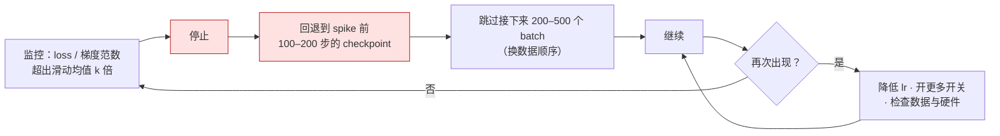

前三篇定了 tokenizer、模型多大、数据多少与怎么配。剩下的是**怎么训**：一张十几行的超参表——峰值学习率、warmup 步数、batch 大小与它的增长计划、调度曲线的形状、AdamW 的两个 β、weight decay、梯度裁剪阈值、初始化标准差——外加几个防止训练崩掉的开关。这张表决定了几千万 GPU 小时是训出一个模型还是训出一条发散的 loss 曲线。

这些数字大多来自 L3 层的深度学习基础（方差传播、Adam 的二阶矩、warmup 的必要性），本篇不重推它们，只做两件事：把公开配方里的每个数字放到同一张表上比较，算出它们隐含的步数、每步时间、checkpoint 大小、一次 spike 的代价；再把"训练不稳定"拆成三个可以单独度量、单独修的机制。

本篇要回答的核心问题是：

> **Llama 3 405B 的峰值学习率是 8e-5，DeepSeek-V3 是 2.2e-4，GPT-3 是 6e-5；batch 分别是 16M、63M、3.2M token。这些数字怎么定的？DeepSeek-V3 在 FP8 下训了 14.8T token"没有一次不可恢复的 loss spike"——它开了哪些开关，每个开关在防什么？**


## 一、总览：一张超参表与三个机制

### 1. 先说答案

配方可以分成三组决定：

| 组 | 决定 | 公开配方的取值范围 | 依据 |
|---|---|---|---|
| 目标 | next-token 交叉熵；是否加 MTP；代码是否加 FIM；文档打包时是否跨文档 attention | MTP 权重 0.3 → 0.1（DeepSeek-V3）；代码 FIM 率 50%；Llama 3 掩码跨文档，DeepSeek 不掩 | 第二章 |
| 优化 | AdamW $$\beta = (0.9, 0.95)$$、wd 0.1、clip 1.0；峰值 lr；batch 与其增长；warmup；调度形状 | lr 6e-5 到 3e-4，随模型变大而变小；batch 3M 到 63M token，训练中增大；warmup 0.4–0.9% 的步数；cosine → 10% 或 WSD | 第三、四章 |
| 稳定 | QK-norm、z-loss、初始化、weight decay 的排除项、Adam 的 $$\epsilon$$、spike 的处理流程 | 2024 年后 QK-norm 成为默认；z-loss $$10^{-4}$$ | 第五章 |

稳定性归结为三个机制，各有一个可以监控的量和一个开关：

| 机制 | 监控什么 | 现象 | 开关 |
|---|---|---|---|
| attention logit 增长 | $$\max \lvert q \cdot k \rvert / \sqrt{d_{head}}$$ | logit 到几十上百，softmax 饱和成 one-hot，这一头的梯度归零，loss 先变差再尖峰 | QK-norm（Q、K 各过一个 norm）；Gemma 2 的 soft-cap；Kimi K2 的 QK-Clip |
| 输出 logit 漂移 | $$\lvert \log Z \rvert$$（lm_head 的 logsumexp） | 归一化常数自由漂移，logits 整体变大，低精度下溢出 | z-loss $$10^{-4} \log^2 Z$$ |
| 单步更新过大 | 梯度范数、参数范数 | 一个坏 batch 或 Adam 二阶矩的瞬时失配让一步走得太远 | 梯度裁剪；warmup；较小的 $$\beta_2$$；回滚并跳过 batch |

DeepSeek-V3 的"零不可恢复 spike"来自这些开关的组合，加上 FP8 训练里的分块量化与高精度累加（《Transformer 与 LLM》第六篇）；Kimi K2 在 15.5T token 上零 spike 靠的是 QK-Clip。**稳定性在 2024 年后从"运气"变成了"配置"**。

### 2. 本文的路线

先讲目标函数与它的几个变体；再讲优化器超参——batch、lr、warmup、weight decay 各自的依据，以及它们随规模的经验律与 $$\mu$$P；再讲调度曲线的三种形状与为什么 2024 年转向 WSD；再讲稳定性的三个机制与六个开关，spike 发生后的处理流程、硬件故障与 checkpoint 频率的账；再讲长上下文继续预训练这个附加阶段；最后是训练时该看哪几条曲线。配套实验在 CPU 上复现四件事：三种调度的对比、batch 与最优 lr 的关系、attention logit 随 lr 的增长与 QK-norm 的作用、z-loss 对 $$\log Z$$ 的抑制。

### 3. 本文的章节安排

| 章 | 主题 | 内容 |
|---|---|---|
| 二 | 目标函数 | 交叉熵与它的单位和梯度；MTP；FIM；文档打包与跨文档 attention |
| 三 | 优化器与超参 | AdamW 的四个数与 Muon；batch 与梯度噪声尺度、硬件给的下界；峰值 lr 随规模；DeepSeek 的经验律；$$\mu$$P 的规则表；weight decay 的时间尺度；warmup |
| 四 | 调度 | cosine、WSD、DeepSeek-V3 的四段；衰减段的形状与长度；为什么中途的 loss 不可比；退火 |
| 五 | 稳定性 | 三个机制、六个开关、norm 的位置、spike 的处理与代价、硬件故障与 checkpoint 间隔、低精度 |
| 六 | 长上下文继续预训练 | Llama 3 的六步与 DeepSeek-V3 的两步；attention 占比与并行 |
| 七 | 监控 | 该看的七条曲线与它们的含义 |
| 八 | 实践 | `training_recipe_lab.py`、`llm_cost_12_recipe.py` |
| 九 | 本文小结与系列总结 | |
| 十 | 自测 | 5 道题 |


## 二、目标函数

### 1. 交叉熵与它的单位

预训练的目标是 next-token prediction：对每个位置，模型输出词表上的分布 $$p_\theta(\cdot \mid x_{<t})$$，loss 是真实 token 的负对数概率的平均：

$$
\mathcal{L} = -\frac{1}{T} \sum_{t=1}^{T} \log p_\theta(x_t \mid x_{<t})
$$

单位是 nats/token（用自然对数）。三种等价写法在报告里都会出现：困惑度 $$\text{PPL} = e^{\mathcal{L}}$$；bits/token $$= \mathcal{L} / \ln 2$$；bits/byte $$= \mathcal{L} / \ln 2 \times (\text{tokens} / \text{bytes})$$——最后一个才能跨 tokenizer 比较（第一篇）。Chinchilla 曲线上的 1.9–2.0 nats 对应 PPL 约 7，对英文约 0.7 bits/byte。

它对 logits $$z$$ 的梯度是全篇稳定性讨论的起点：

$$
\frac{\partial \ell_t}{\partial z_j} = p_j - \mathbb{1}[j = x_t]
$$

目标 token 的 logit 被拉高 $$1 - p_{x_t}$$，其余全部被压低 $$p_j$$。两个后果在后面反复出现：从未作为目标出现过的 token 只受"压低"（第一篇的欠训练 token）；logits 整体加一个常数不改变 $$p$$，所以这个方向上没有梯度、$$\log Z$$ 可以自由漂移（第五章的 z-loss）。

平均的分母也是一个决定。按 token 平均（上式）时，一个 batch 里长文档的 token 与短文档的 token 权重相同；按序列平均再按 batch 平均时，短文档的每个 token 权重更大。预训练一律按 token 平均——打包后的序列长度固定，两者相同；后训练里两者不同，后训练系列第一篇会回到这个问题。

### 2. 多 token 预测（MTP）

标准目标每个位置只预测下一个 token。MTP（Gloeckle 等 2024）在主干之上加 $$n$$ 个并行的输出头，同时预测 $$t+1, t+2, \dots, t+n$$，训练信号更密；论文在代码任务上 $$n = 4$$ 时 13B 模型的收益明显，且模型越大收益越大。DeepSeek-V3 用了一个**串行**的变体：一个额外的 Transformer 块接在主干后面，输入是主干在位置 $$t$$ 的表示与 token $$x_{t+1}$$ 的 embedding（拼接后过一个线性层），预测 $$x_{t+2}$$；这样第二个预测仍然保持完整的因果链，而不是并行头那种"跳过中间 token 直接猜"。总 loss 是

$$
\mathcal{L} = \mathcal{L}_{main} + \lambda \, \mathcal{L}_{MTP},\qquad \lambda = 0.3 \ (\text{前 10T token}),\ 0.1 \ (\text{之后})
$$

它的收益有两面：训练时作为辅助目标改善主目标的表现（DeepSeek 的消融显示多数 benchmark 提升）；推理时这个头可以当投机解码的草稿（《Transformer 与 LLM》第七篇，接受率约 85–90%，decode 加速约 1.8 倍）。成本是一个额外的层加一个额外的 lm_head 前向——lm_head 是最贵的单个矩阵（第一篇），所以 MTP 头的 FLOPs 不可忽略——DeepSeek-V3 上一个块约占 1/61，额外的 lm_head 约占每 token FLOPs 的 2.5%，合计约 4%。MTP 模块在推理时可以直接丢掉，不改变主模型。

### 3. 代码的 FIM

代码补全的使用场景是"光标在中间"：模型要根据前文**和后文**填中间。纯自回归训练不会学到这件事。Fill-in-the-Middle（Bavarian 等 2022）把一部分训练文档随机切成三段，重排成 `<PRE> 前段 <SUF> 后段 <MID> 中段`，仍然用标准的 next-token loss——中段在序列末尾，模型在预测它时已经"看到了"后段。论文的结论是 **FIM 免费**：把 50% 的文档做这个变换，模型的左到右能力不下降，同时获得填中间的能力。StarCoder、DeepSeek-Coder、Qwen2.5-Coder 都用 50% 的 FIM 率；它只改数据格式，不改模型与 loss。这是一个"目标函数由数据排列决定"的例子，后训练系列里的 chat template 是同一个思路。

### 4. 文档打包与跨文档 attention

训练序列是固定长度（4K、8K）的，文档长短不一，标准做法是把文档首尾相接打包进序列，用 `<eos>` 分隔（第三篇第六章）。问题是 attention 会跨过 `<eos>` 看到上一篇无关文档。两种处理：Llama 3 用**文档级掩码**，每个 token 只能 attend 到同一文档内的位置（论文称对短序列影响不大，但对长上下文阶段重要——否则模型会学到"很远的位置是无关的"这一在长文档上错误的先验）；DeepSeek-V3 **不掩**，让模型自己学会忽略前一篇。前者需要 attention kernel 支持可变长度的块对角掩码（FlashAttention 的 varlen 接口），后者更简单、GEMM 更规整。这是一个"算法上更干净"与"系统上更快"之间的取舍，两种选择都训出了好模型。掩码还有一个副作用：块对角掩码下 attention 的有效长度是文档长度而非序列长度，平均文档 1000 token 时 8K 序列的 attention FLOPs 只有满掩码的八分之一——第二篇的 $$M = 72Ld^2 + 12Lds$$ 里第二项要按文档长度算。


## 三、优化器与超参

### 1. AdamW 的四个数

几乎所有公开配方都是 AdamW，$$\beta_1 = 0.9$$、$$\beta_2 = 0.95$$、weight decay 0.1、梯度裁剪 1.0。写出更新式以便后面引用：

$$
m_t = \beta_1 m_{t-1} + (1 - \beta_1) g_t,\quad
v_t = \beta_2 v_{t-1} + (1 - \beta_2) g_t^2,\quad
\theta_{t+1} = \theta_t - \eta_t \left( \frac{\hat m_t}{\sqrt{\hat v_t} + \epsilon} + \lambda \theta_t \right)
$$

（$$\hat m, \hat v$$ 是偏差修正后的值。）三个值得说的点：

- **$$\beta_2 = 0.95$$ 而不是默认的 0.999**：二阶矩的窗口从约 1000 步缩到约 20 步（$$1 / (1 - \beta_2)$$），对梯度尺度的突变反应更快——一个坏 batch 让 $$v$$ 迅速变大、更新迅速变小。代价是 $$v$$ 的估计噪声更大。这是稳定性开关之一（第五章）。
- **weight decay 0.1 是"解耦"的**：每步参数乘 $$(1 - \eta \lambda)$$，$$\eta = 3 \times 10^{-4}$$ 时每步收缩 $$3 \times 10^{-5}$$，50 万步累计效果显著。它不作用于 norm 的增益与 bias；OLMo 2 与多数 2024 年后的配方也**不对 embedding 做 weight decay**——embedding 的每一行只在该 token 出现时才有梯度，罕见 token 的行会被 decay 单向拉向 0。第 6 节算它的时间尺度。
- **$$\epsilon$$**：默认 $$10^{-8}$$，Llama 2 用 $$10^{-5}$$。Wortsman 等 2023 指出模型变大时梯度变小，当 $$\sqrt{v}$$ 落到 $$\epsilon$$ 量级以下，更新 $$m / (\sqrt{v} + \epsilon)$$ 被 $$\epsilon$$ 压没——这是一种"参数不再更新"的不稳定，对策是随规模减小 $$\epsilon$$。

Kimi K2 是显著的例外：用 **Muon**（Jordan 等 2024）替代 AdamW。Muon 只对二维的矩阵参数（各个 $$W$$）工作：取动量 $$M_t$$，用几步 Newton–Schulz 迭代把它近似**正交化**——把 $$M_t = U \Sigma V^\top$$ 换成 $$U V^\top$$，所有奇异值拉成 1——再乘 $$0.2 \sqrt{\max(d_{in}, d_{out})}$$ 使更新的 RMS 与 Adam 相当。直觉是：Adam 按元素归一化，Muon 按**矩阵的方向**归一化，让更新在所有奇异方向上等量前进，而不是被几个主方向主导。它的 token 效率比 AdamW 高（Kimi 报告约 1.15 倍，在 Moonlight 的 scaling 实验里更高），优化器状态只有动量一份（Adam 的一半）。但正交化的更新让 $$W_Q$$、$$W_K$$ 的谱范数增长更快，attention logit 更容易爆——因此 K2 配套了 QK-Clip（第五章），合称 MuonClip。embedding、lm_head 与一维参数仍用 AdamW。

### 2. batch：梯度噪声尺度与 ramp

batch 以 token 计（《Transformer 与 LLM》第二篇：GEMM 的 $$m$$ 维是 batch × seq）。太小，每步的梯度噪声大、单卡利用率低；太大，同样的 token 数下更新次数少。McCandlish 等 2018 的**梯度噪声尺度**给出临界 batch：

$$
B_{crit} \approx \frac{\text{tr}(\Sigma)}{\lvert G \rvert^2}
$$

即梯度的方差之和与梯度范数平方之比——噪声相对于信号越大，值得用更大的 batch 去平均。论文的另一个结果把"batch 换步数"的交易写成了公式：达到某个 loss 所需的步数 $$S$$ 与样本数 $$E$$ 满足

$$
S = S_{min}\left(1 + \frac{B_{noise}}{B}\right),\qquad E = E_{min}\left(1 + \frac{B}{B_{noise}}\right)
$$

$$B \ll B_{noise}$$ 时每翻倍 batch 步数几乎减半（完美并行）、样本数几乎不变；$$B \gg B_{noise}$$ 时步数不再减少、样本数线性浪费。$$B = B_{noise}$$ 是"步数多一倍、样本多一倍"的折中点。**关键性质：$$B_{crit}$$ 随训练进行而增大**，因为 loss 降低后梯度信号 $$\lvert G \rvert$$ 变小而噪声不变。这就是 batch ramp 的依据：


Llama 3 405B 从 4M token（序列 4K）开始，252M token 后到 8M（序列 8K），2.87T 后到 16M；DeepSeek-V3 在前 469B token 里从 3072 条序列线性增到 15360 条（12.6M → 63M token）。ramp 的另一个作用是**训练早期用小 batch 多走步**——loss 下降最快的阶段每一步都值钱。

batch 还有一个来自硬件的**下界**。16 384 张卡训 405B，TP 8 × PP 16 = 128 张卡放一份模型，于是有 128 个数据并行副本；每个副本每步至少处理一条 8K 序列（实际为了流水线效率要几条），batch 的下界就是 $$128 \times 8\text{K} = 1$$M token，实际 16M 对应每副本 16 条序列。DeepSeek-V3 的 63M 在 2048 张卡上是每卡 7.5 条 4K 序列，配它的 MoE 专家并行（每个专家要有足够的 token 才不闲着，《Transformer 与 LLM》第五篇）。**核心问题里 3.2M 到 63M 的差距，一半是梯度噪声尺度，一半是"几千张卡上每步至少要有这么多 token 才能并行"**。

配套实验（`batch_lr` 子实验）在同样 token 总量下扫 batch × lr：batch 越大最优 lr 越大，且同样 token 数下大 batch 的最好 loss 更差（8 → 64 时 1.83 → 2.28）——每个 token 的更新次数少了，这个玩具模型的 $$B_{noise}$$ 很小。lr 随 batch 怎么变？SGD 是线性（batch 翻倍 lr 翻倍），Adam 的理论与实验（Malladi 等 2022）都指向**平方根**——batch 翻倍 lr 乘 $$\sqrt 2$$，实验里 4 种 batch 的最优 lr 大致符合。

### 3. 峰值学习率随规模

公开配方的峰值 lr（`llm_cost_12_recipe.py`）：

| 模型 | $$N$$ | batch | seq | 峰值 lr | warmup | 总步数 | 每步（MFU 40%） |
|---|---|---|---|---|---|---|---|
| GPT-3 175B | 175B | 3.2M | 2048 | 6e-5 | 375M token（≈ 117 步） | 94K | — |
| Llama-2 7B | 7B | 4M | 4096 | 3e-4 | 2000 步 | 500K | 0.2 s（2048 卡） |
| Llama-2 70B | 70B | 4M | 4096 | 1.5e-4 | 2000 步 | 500K | 2.1 s（2048 卡） |
| Llama-3 405B | 405B | 16M | 8192 | 8e-5 | 8000 步 | 975K | 6.0 s（16K 卡） |
| DeepSeek-V3 | 37B 激活 | 63M | 4096 | 2.2e-4 | 2000 步 | 235K | 17 s（2048 卡） |

**模型越大，峰值 lr 越小**：7B 3e-4，70B 1.5e-4，175–405B 6–8e-5。原因在 L3 层：宽度 $$d$$ 变大时，同样的 lr 让每层输出的变化随 $$d$$ 增长。没用 $$\mu$$P 的配方靠经验律：DeepSeek LLM（2024）在自家数据上拟合

$$
\eta_{opt} = 0.3118 \cdot C^{-0.125},\qquad B_{opt} = 0.2920 \cdot C^{0.3271}
$$

（$$C$$ 为训练 FLOPs，$$B$$ 以 token 计）。代入 Llama-2 7B 的 $$8.4 \times 10^{22}$$ 得 lr 4.2e-4、batch 9.2M（实际 3e-4、4M）；405B 的 $$3.8 \times 10^{25}$$ 得 2.0e-4、68M（实际 8e-5、16M）。量级对，常数只对拟合它的数据与结构成立；但"lr 随算力缓慢下降、batch 随算力上升"这两条趋势是稳定的，且论文强调最优区间很宽——lr 在最优值的 0.5–2 倍内 loss 几乎不变。

DeepSeek-V3 的 2.2e-4 比 405B 高近 3 倍，因为它按 37B 激活参数的宽度设计（$$d = 7168$$ 对 16384）。

### 4. μP：让 lr 不随宽度变

$$\mu$$P（Maximal Update Parametrization，Yang 等 2022）从"每层输出的变化在宽度 $$\to \infty$$ 时应保持 $$O(1)$$"出发，给出一组随宽度的缩放规则。设基础模型宽度 $$d_0$$，目标模型宽度 $$d$$，宽度倍数 $$m = d / d_0$$：

| 参数 | 初始化方差 | Adam 学习率 | 前向乘子 |
|---|---|---|---|
| 输入 embedding | $$\sigma^2$$（不变） | $$\eta$$（不变） | 1 |
| 隐藏层矩阵（attention、FFN） | $$\sigma^2 / m$$ | $$\eta / m$$ | 1 |
| 输出层 lm_head | $$\sigma^2 / m^2$$ | $$\eta / m$$ | $$1 / m$$（logits 乘 $$1/m$$） |
| attention logit 缩放 | — | — | $$1 / d_{head}$$ 而非 $$1 / \sqrt{d_{head}}$$ |

在这组规则下，**基础模型上扫出的最优 lr 直接用在大模型上仍是最优**（$$\mu$$Transfer），扫一组小模型就够。代价是要改初始化、给参数分组设 lr、改 attention 的缩放。用了 $$\mu$$P 的配方（Cerebras-GPT、MiniCPM、以及 OLMo 的部分实验）不必在大模型上再扫 lr；没用的靠上一节的经验律。两者的关系：经验律 $$\eta \propto C^{-0.125}$$ 里，$$C \propto N^2$$（Chinchilla 下 $$D \propto N$$）、$$N \propto d^2$$，于是 $$\eta \propto d^{-0.5}$$——比 $$\mu$$P 的 $$1/d$$ 平缓，因为经验律拟的是全局一个 lr（embedding 与 lm_head 没有单独缩放），是两种参数化的折中。

### 5. weight decay 的时间尺度

$$\lambda = 0.1$$ 是一个几乎所有配方都照抄的数，它的含义要和 lr 一起看。解耦 weight decay 每步把参数乘 $$1 - \eta\lambda$$，等价于一个指数遗忘，时间常数

$$
\tau = \frac{1}{\eta \lambda} \text{ 步}
$$

$$\eta = 3 \times 10^{-4}$$、$$\lambda = 0.1$$ 时 $$\tau = 33\text{K}$$ 步——Llama-2 7B 的 50 万步里，权重"记住"最近约 7% 的训练；405B 的 $$\eta = 8 \times 10^{-5}$$ 给 $$\tau = 125\text{K}$$，占 975K 步的 13%。Wang & Aitchison 2024 指出应该固定的是 **$$\tau$$ 占总步数的比例**而不是 $$\lambda$$：lr 随规模减小时，要维持同样的遗忘比例，$$\lambda$$ 应相应增大；而 batch 变大、总步数变少时，$$\lambda$$ 应减小。照抄 0.1 在不同配方间隐含了 3–10 倍的 $$\tau / \text{总步数}$$ 差异——这是超参表里最少被调、最值得调的一个数。

### 6. warmup

lr 从 0 线性升到峰值。Adam 的二阶矩 $$v$$ 在前几十步还是几个样本的平均，估计很差，直接用峰值 lr 的更新方向是噪声——这是 warmup 的必要性（L3 第三篇）。公开配方的 warmup 占总步数不到 1%：Llama 3 405B 8000 / 975K = 0.8%，Llama 2 2000 / 500K = 0.4%，DeepSeek-V3 2000 / 235K = 0.9%。它以步数而不是 token 数定，因为它服务的是优化器状态而不是数据。warmup 的第二个作用是让第五章的三个机制在训练最脆弱的阶段（初始化附近，attention 还没学会分散、logit 范数还小但梯度大）不被大 lr 触发；OLMo 与 Wortsman 的消融都显示更长的 warmup 能容忍更大的峰值 lr。


## 四、调度

### 1. 三种形状

| 调度 | 形状 | 用在 | 性质 |
|---|---|---|---|
| cosine → 10% | warmup 后按余弦从峰值降到 10%（Llama 3 405B 降到 1%） | GPT-3、Llama 1/2/3、Chinchilla | 必须事先定总步数；中途的 loss 不代表"这么多 token 能训到多好" |
| WSD（Warmup-Stable-Decay） | 常数到 80–90%，最后 10–20% 快速衰减到 0 | MiniCPM、DeepSeek 系列的变体、OLMo 2 | 可以在任意时刻"停下来衰减"得到一个可用模型；常数段的 checkpoint 相互可比 |
| 多段 | DeepSeek-V3：常数到 10T → cosine 到 2.2e-5（4.3T）→ 常数 333B → 7.3e-6（167B） | DeepSeek-V3 | 分段对应数据阶段（末段配合高质量数据） |

cosine 的公式是 $$\eta_t = \eta_{min} + \frac{1}{2}(\eta_{max} - \eta_{min})(1 + \cos(\pi t / T))$$，$$T$$ 是总步数——它必须事先知道。上一节的图把三种形状画在一起。cosine 与 WSD 的终点接近，但过程完全不同：cosine 从第一步就在降 lr，WSD 在衰减前一直是峰值。

### 2. 衰减段的形状与长度

WSD 的衰减段有两个自由度。**长度**：Hägele 等 2024 的系统比较发现 10–20% 的总步数足够，再长收益很小；MiniCPM 用 10%，OLMo 2 用约 15%。**形状**：线性衰减到 0 与 cosine 差不多，$$1 - \sqrt{t / T_{decay}}$$（先快后慢）略好——它在衰减初期快速降低 lr、让 loss 迅速"收"下来，后期慢慢磨。同一篇论文的另一个结论对 Infra 更实用：**随机权重平均**（SWA，把常数段最后若干个 checkpoint 的权重平均）能拿到与衰减相近的一大部分收益而完全不需要额外训练——常数段的 checkpoint 平均相当于隐式的 lr 衰减。OLMo 2 的 model souping（第三篇）是同一现象的另一种用法。

### 3. 为什么中途的 loss 不可比

这是第二篇 Kaplan 与 Chinchilla 分歧的根源，值得再说一次。cosine 调度下，训到 50% 的 checkpoint 的 lr 仍是峰值的 55%，它的 loss 里包含"还没退火"的成分——同样的 token 数如果单独跑一个完整的 cosine，loss 会低得多。所以 cosine 下的中途 checkpoint **不能**用来画 $$L(D)$$ 曲线、不能用来比较数据配比、不能作为"训一半的模型"发布。WSD 解决了这三件事：常数段的任何 checkpoint 拿出来衰减 10–20% 就是一个完整训练的等价物。MiniCPM 报告 WSD 的终点不差于 cosine，且用这个性质在同一次训练里得到了多个 $$D$$ 的 scaling law 数据点；Hägele 等把它做成了"一次训练画一条 scaling 曲线"的标准方法，把第二篇的实验成本降了一个数量级。

配套实验（`schedule` 子实验，1500 步）：cosine 终点 1.578，WSD 1.464，常数 1.536；WSD 在前 80% 与常数完全同一条轨迹，最后 20% 的衰减把它拉到三者最低。常数比 cosine 好是这个玩具设置的特例（步数少、lr 偏低，cosine 大部分时间 lr 太小）——真实规模下两者终点接近；但 WSD 的衰减段带来的骤降是普遍现象。

### 4. 退火与数据

衰减段是换数据配比的时机（第三篇第五章）：Llama 3 在最后 40B token 退火数学与代码，MiniCPM 在 WSD 的衰减段混入高质量与指令数据，DeepSeek-V3 的最后两段常数 lr 对应它的后期数据。原理上，lr 小的时候模型对数据的"记忆"更精细而"遗忘"更少，高质量数据放在这里效率最高；反过来，退火段之前的常数段可以承受更"脏"的数据。第三篇说退火段 loss 的骤降"一半来自 lr、一半来自数据"，两者在配方里是同一个决定。


## 五、稳定性

### 1. spike 是什么

训练 loss 曲线突然上跳（几个百分点到几倍），然后要么回落、要么继续上升直到发散。PaLM 540B 报告了约 20 次；同样的 batch 单独重跑不出问题，说明**不是数据本身坏，而是数据与当时参数状态的组合**。一次 spike 的直接代价（`llm_cost_12_recipe.py`）：按 PaLM 的处理——回退到约 100 步前的 checkpoint、跳过 200–500 个 batch——在 405B 规格上是重算 300–600 步、约 30–60 分钟 × 16K 卡 = 8 千到 1.6 万 GPU 小时，外加人盯曲线的时间。DeepSeek-V3 与 Kimi K2 报告的"零 spike"就是省掉了这些。

spike 在小模型上很难复现，这是它长期被当作"玄学"的原因。Wortsman 等 2023 的贡献是找到一组**小规模代理**：把 lr 调到远超最优的范围、去掉 warmup 或裁剪、用低精度、加深层数，小模型就会表现出大模型的两种主要不稳定，而且开关在小模型上有效就在大模型上有效。下面的三个机制与配套实验都建立在这个方法上。

### 2. 三个机制

**attention logit 增长。** $$q \cdot k / \sqrt{d_{head}}$$ 没有上界；训练中 $$W_Q$$、$$W_K$$ 的范数增长，logit 涨到几十上百，softmax 输出接近 one-hot，这一头对几乎所有位置的梯度归零（softmax 在饱和处的导数 $$p(1-p) \to 0$$），模型的一部分停止学习；再往后一个坏 batch 让饱和的 head 突然翻转，loss 尖峰。Zhai 等 2023 从另一个角度描述同一件事：**attention 熵坍缩**——每个 head 的注意力分布熵急剧下降、集中到一两个位置，是 spike 的前兆，且熵下降与 $$\lVert W_Q^\top W_K \rVert$$ 的谱范数增长同步。配套实验（`spike` 子实验，$$d = 128$$、4 层、300 步、不裁剪）：

| 峰值 lr | 2e-3 | 8e-3 | 3e-2 | 1e-1 |
|---|---|---|---|---|
| 无 QK-norm：末 loss / 最大 attention logit | 2.23 / 36 | 2.40 / 291 | 2.57 / 1256 | 2.75 / 12592 |
| QK-norm：末 loss / 最大 logit | 2.19 / 7 | 2.26 / 9 | 2.28 / 13 | 2.45 / 22 |

没有约束时 logit 随 lr 涨四个数量级，loss 随之变差——训练"能跑但越来越差"，这是大模型 spike 前的状态（fp32 的两百万参数模型不会真的发散，spike 本身要在低精度、大 batch、深层上才容易复现）。**QK-norm**（Q 与 K 在点积前各过一个 LayerNorm / RMSNorm，Henry 等 2020；Dehghani 等 2023 在 ViT-22B 上确立）把 logit 钉在 $$O(\sqrt{d_{head}})$$——归一化后 $$\lvert q \rvert, \lvert k \rvert \approx \sqrt{d_{head}}$$（乘上可学的增益），点积最大 $$d_{head}$$，除以 $$\sqrt{d_{head}}$$ 后上界是 $$\sqrt{d_{head}} \times$$ 增益——loss 对 lr 的敏感度大幅下降：同样的 lr 范围内 loss 只从 2.19 到 2.45。这也是 Wortsman 论文的核心图：有 QK-norm 时"loss 随 lr"的曲线在大范围内是平的，没有时是一个窄谷。**平的曲线意味着 lr 不必调得很准**——这是 QK-norm 在 2024 年成为默认的实际原因，比"防 spike"更日常。

**输出 logit 漂移。** 第二章的梯度说明 lm_head 的 logits 有一个自由度：整体加一个常数不改变 softmax，交叉熵对这个方向没有梯度。训练中这个常数（$$\log Z$$，logsumexp）会漂移，logits 整体变大，BF16 / FP8 下更容易溢出，也让 softmax 对微小扰动更敏感。**z-loss**（PaLM）加一项 $$10^{-4} \cdot \log^2 Z$$，它对 logits 的梯度是 $$2 \times 10^{-4} \log Z \cdot p_j$$——把 $$\log Z$$ 按在 0 附近，且系数极小时对主 loss 几乎无影响。配套实验（`zloss` 子实验）：无 z-loss 时 $$\lvert \log Z \rvert$$ 从 5.1 漂到 6.3；$$10^{-4}$$ 的系数在 600 步内影响很小（5.1 → 6.1，loss 差 0.001）；$$10^{-2}$$ 的夸张系数把它压到 0.4，loss 差 0.02。$$10^{-4}$$ 几乎无代价，所以能默认开着。

**单步更新过大。** 一个梯度异常大的 batch，或 Adam 的 $$v$$ 还没跟上梯度尺度的突变，让某一步的参数移动远超正常——这是 spike 最直接的触发。Takase 等 2023 追到一个具体来源：embedding 的梯度是稀疏的，罕见 token 的行长期没有梯度，$$v$$ 衰减到极小，该 token 一出现，$$g / \sqrt{v}$$ 就是一个巨大的更新；紧接着的 LayerNorm 把这个异常放大到后面所有层。他们的对策是把 embedding 按 $$\sqrt d$$ 缩放并用小初始化（Gemma 系列对 embedding 乘 $$\sqrt d$$ 也是这个理由）。更一般的开关：**梯度裁剪** 1.0 把梯度范数封顶；较小的 $$\beta_2$$ 让 $$v$$ 更快跟上；warmup 覆盖了 $$v$$ 最不准的阶段。

### 3. 六个开关

| 开关 | 防什么 | 2024–25 年的默认 |
|---|---|---|
| QK-norm | attention logit 增长 | OLMo 2、Gemma 3、Qwen3 都开；Gemma 2 曾用 tanh soft-cap（attention 50、输出 30），Gemma 3 换回 QK-norm |
| z-loss $$10^{-4}$$ | 输出 logit 漂移 | PaLM、OLMo 2、多数开源配方 |
| 梯度裁剪 1.0 | 单步过大 | 几乎全部 |
| 初始化 $$\mathcal{N}(0, 0.02)$$，残差分支缩放 | 前向 / 反向方差随深度爆炸（L3 第二篇） | GPT-2 的 $$1 / \sqrt{2L}$$；OLMo 2 全部 0.02 且不缩放，靠 norm 位置 |
| weight decay 排除 embedding 与 norm | 罕见 token 的 embedding 被单向拉向 0 | OLMo 2 明确排除 |
| Adam $$\epsilon$$ 随规模减小 | 更新被 $$\epsilon$$ 淹没 | Llama 2 $$10^{-5}$$；Wortsman 建议更小 |

**norm 的位置**是第七个、结构层面的开关。Pre-norm（norm 在子层输入，GPT-2 起的默认）比 post-norm 稳定得多，但残差流的范数随深度单调增长，深层的子层输出相对残差流越来越小（"深层不干活"）。OLMo 2 与 Swin-v2 的做法是**对子层的输出做 norm 再加回残差**（$$x + \text{Norm}(f(x))$$），保留 pre-norm 的稳定性，同时约束每层往残差里加的量；Gemma 2 / 3 两头都做（输入与输出各一个 norm）。OLMo 2（2024 年末）把这些整理成一份"稳定性配方"并逐项消融：QK-norm、z-loss、重排 norm、不 decay embedding、全部 0.02 初始化——每项单独看收益不大，合起来让 7B 模型在 4T token 上 loss 曲线里的尖峰几乎消失。

Kimi K2 加了一个新开关 **QK-Clip**：训练中监控每个 head 的最大 attention logit，超过阈值 $$\tau = 100$$ 时按 $$\sqrt{\tau / \max}$$ 直接缩小该 head 的 $$W_Q$$、$$W_K$$——比 QK-norm 更"外科手术"，只在需要时干预，且不改变前向结构（推理时不多一个 norm）。K2 报告触发 QK-Clip 的 head 只在训练早期出现，几万步后不再触发——它是一个自动关闭的保险。

### 4. spike 发生后

开关能大幅减少 spike，不能保证为零。处理流程（PaLM、OLMo 等都描述过类似的）：



回退要求 checkpoint 要密——下一节算多密。自动化版本：检测到梯度范数超过滑动均值若干倍就跳过这一步（skip-step），一些训练框架内置了它。它以"每一步都可能被跳过"为代价换来无人值守；代价的另一面是要区分"梯度尖峰"与"loss 尖峰"，前者常是后者的先导（第七章）。

### 5. 硬件故障与 checkpoint 间隔

spike 不是训练中断的主因，硬件才是。Llama 3 报告在 405B 训练的 54 天快照期里发生了 466 次中断，419 次是意外的，其中 78% 与硬件有关（GPU 故障占 58.7%，其次是网络、HBM、主机）——**平均每 3 小时一次**。每次中断的代价是"上一个 checkpoint 之后的所有工作"加"重启时间"，所以 checkpoint 间隔是一个优化问题。Young–Daly 公式给出最优间隔：

$$
T_{opt} \approx \sqrt{2\, \delta\, \text{MTBF}}
$$

$$\delta$$ 是写一次 checkpoint 的时间。405B 的完整训练状态是 14 字节/参数（BF16 权重 2 + FP32 主权重 4 + Adam 两个状态 8）= 5.7 TB；Llama 3 的存储系统峰值 7 TB/s、持续 2 TB/s，$$\delta$$ 约 3 秒（16K 张卡并行写，每卡只写自己那一片）；MTBF 3.1 小时。代入：$$T_{opt} = \sqrt{2 \times 3 \times 11160} \approx 260$$ 秒——**每四五分钟一次**。每次故障平均丢一半间隔（2 分钟）加重启（Llama 3 把它压到几分钟），一天 7.8 次故障合计不到一小时，有效训练时间 90% 以上——与论文报告的一致。如果只能每小时写一次（`llm_cost_12_recipe.py` 的默认假设，平均写带宽 1.6 GB/s），每次故障平均丢 30 分钟，一天丢 4 小时，有效时间掉到 80% 左右。**checkpoint 带宽直接换训练效率**，这是训练集群里存储系统的设计目标，而数据读带宽只有 9 MB/s（第三篇）。

写 checkpoint 时训练要停（否则参数在变），$$\delta$$ 是纯开销；异步 checkpoint（先拷到主机内存再后台写盘）把停顿压到拷贝的时间。此外还有一类"不报错的故障"：静默数据损坏（SDC）让某张卡算出错误的数值而不崩溃，表现为一次没有任何数据原因的 loss 尖峰——Llama 3 与 OLMo 都报告过。区分它与真正的 spike 的办法是回退重跑同一批数据：spike 会复现（参数状态相同），SDC 不会。

### 6. 低精度与稳定性

FP8 训练（DeepSeek-V3）把稳定性的门槛提高了：E4M3 的最大值 448，attention logit 到几百就出界，激活里的离群值让 per-tensor 缩放失效。DeepSeek-V3 的对策在《Transformer 与 LLM》第六篇讲过——激活按 $$1 \times 128$$、权重按 $$128 \times 128$$ 分块量化，累加每 128 个元素提升到 FP32，且 embedding、lm_head、norm、attention 的 softmax 与 MoE 路由保持高精度。这些让 FP8 下的 14.8T token 没有出现不可恢复的 spike。低精度不是稳定性的敌人，但它把上面每个开关的必要性都放大了一档：BF16 训练里 logit 到 1000 只是"学得差"，FP8 里是溢出成 inf。


## 六、长上下文继续预训练

主阶段用 4K–8K 序列（长序列的 attention 二次项让主阶段用长序列不划算），上下文长度靠一个附加阶段扩展：

| | Llama 3 405B | DeepSeek-V3 |
|---|---|---|
| 起点 → 终点 | 8K → 128K | 4K → 32K → 128K |
| 分几步 | 6 步 | 2 步，每步 1000 步训练 |
| token 量 | 800B（占 15.6T 的 5%） | 2 × 1000 步（batch 1920 / 480 条序列） |
| 位置编码 | RoPE base 500K，分段缩放 | YaRN（《Transformer 与 LLM》第四篇） |
| 进入下一步的标准 | 短上下文评测完全恢复，且 needle-in-a-haystack 满分 | — |
| lr | 延续主阶段末尾 | 7.3e-6 |

"分步"的原因是 RoPE 外推（《Transformer 与 LLM》第四篇）：每一步只把上下文扩 2–4 倍，让模型在"略超训练长度"的区间适应，比一次跳到 128K 稳定。数据换成长文档为主（书、长网页、代码仓库），且要保留一部分短数据防止短上下文能力退化——Llama 3 的"短评测完全恢复"就是这个门槛。

按 FLOPs 算这个阶段比 5% 多：405B 在 128K 上 attention 占每 token FLOPs 的 40%（8K 时 4%，第二篇的 $$s / 6d$$），所以 800B token 的长上下文阶段约相当于主阶段 8% 的算力。系统上它需要**序列并行 / context parallel**——一条 128K 序列的激活（《Transformer 与 LLM》第二篇：每层 $$s \times d \times$$ 若干字节）单卡放不下，要把序列切到多张卡上，attention 通过 ring 或 all-to-all 交换 K、V。这是长上下文阶段与主阶段在 Infra 上最大的不同，也是它被放在最后、只跑 5% token 的第二个原因。


## 七、监控：该看的七条曲线

| 曲线 | 正常形态 | 异常与含义 |
|---|---|---|
| 训练 loss | 平滑下降，对数坐标下近似直线 | 尖峰：spike；平台：lr 太小或数据重复；周期性波动：数据顺序有结构 |
| loss 与 scaling 预测的差 | 在预测曲线 ±0.01 内 | 持续偏高：数据管线或数值问题（第二篇第五章） |
| 梯度范数 | warmup 后下降，然后缓慢平稳 | 持续上升：预警，通常先于 loss spike；突然的尖峰：坏 batch 或 SDC |
| 参数范数 | 缓慢增长后被 weight decay 平衡 | 持续增长：wd 太小或没作用在该组参数上 |
| 最大 attention logit / 注意力熵 | logit $$O(10)$$；熵平稳 | logit 涨到 100+ 或熵骤降：logit 增长，QK-norm 缺失或失效 |
| $$\lvert \log Z \rvert$$ | 接近 0（有 z-loss）或缓慢漂移 | 快速增长：输出 logit 漂移 |
| 各领域验证 loss | 同步下降 | 某领域不降：配比或数据问题；某领域突然下降：可能污染 |

前三条每步都有；后四条要额外记录，成本可忽略。经验规律是**梯度范数先于 loss 报警**——spike 前几百步梯度范数常已开始爬升；注意力熵再早一些。把这些量按层、按 head 记录（而不只是全局最大值），能直接指出是哪一层出的问题——QK-Clip 就是把这种监控做成了自动干预。


## 八、实践：两个脚本

### 1. `training_recipe_lab.py`：四个子实验

PyTorch CPU，复用第二篇的语料与训练循环，attention 自己写（为了加 QK-norm 与读出最大 logit）：

```python
class Attention(nn.Module):
    def forward(self, x, mask):
        q, k, v = ...                                  # [B, h, T, d_head]
        if self.qk_norm:
            q, k = self.qn(q), self.kn(k)              # 各过一个 LayerNorm
        logits = q @ k.transpose(-1, -2) / math.sqrt(self.dh)
        self.max_logit = logits.detach().abs().max().item()   # 监控量
        ...

# 训练循环里的 z-loss
log_z = torch.logsumexp(logits, -1)
total = loss + z_loss * (log_z ** 2).mean()
```

四个子实验各对应本文一节：`schedule`（cosine / WSD / 常数，1500 步）、`batch_lr`（4 种 batch × 6 种 lr，同样 token 总量）、`spike`（4 种 lr × 有无 QK-norm，记录最大 attention logit）、`zloss`（三种系数下 $$\lvert \log Z \rvert$$ 的轨迹）。完整运行约 7 分钟，`--quick` 一分钟，可以按名字只跑其中几个。数字都在第三到五章里引用了。两个容易做的扩展：给 `spike` 加一个"注意力熵"的监控量，看它是否先于 logit 报警；给 `schedule` 加常数段末尾几个 checkpoint 的权重平均，看它能拿到衰减段收益的几成。

### 2. `llm_cost_12_recipe.py`：配方的账

纯标准库：五个公开配方的超参表与推出的步数、每步时间；DeepSeek 的 lr / batch 经验律在六个算力点上的值与真实配方的对照；四个模型的 checkpoint 字节数与每小时一次的写带宽；PaLM 式回滚在 405B 规格上的 GPU 小时；长上下文阶段 attention 的 FLOPs 占比。`RECIPES` 列表可以加新模型。`tools/gen_schedule_svg.py` 画本文的图。


## 九、本文小结与系列总结

### 1. 本文小结

| 项 | 规则 / 公式 | 数字 |
|---|---|---|
| AdamW | $$\beta = (0.9, 0.95)$$，wd 0.1，clip 1.0，$$\epsilon$$ 随规模减小 | 几乎全部公开配方；Kimi K2 用 Muon + QK-Clip |
| 峰值 lr | 随宽度减小（$$\mu$$P：$$\propto 1/d$$）；DeepSeek 经验律 $$0.31 C^{-0.125}$$ | 7B 3e-4 → 70B 1.5e-4 → 405B 8e-5 |
| batch | 临界 batch $$\text{tr}(\Sigma) / \lvert G \rvert^2$$ 随训练增大 → ramp；硬件下界 = 副本数 × 序列长 | 405B：4M → 8M → 16M；DeepSeek-V3：12.6M → 63M |
| weight decay | 时间尺度 $$\tau = 1/(\eta\lambda)$$ | 7B：33K 步（7%）；405B：125K 步（13%） |
| warmup | 服务 Adam 的 $$v$$，按步数定 | 总步数的 0.4–0.9% |
| 调度 | cosine → 10%；WSD 常数 + 末段 10–20% 衰减 | 实验：WSD 1.464 < 常数 1.536 < cosine 1.578 |
| 稳定性 | attention logit（QK-norm）、$$\log Z$$（z-loss）、单步过大（裁剪） | 无 QK-norm 时 logit 随 lr 涨到 12592，loss 2.23 → 2.75；有时 22，2.19 → 2.45 |
| spike 代价 | 回退 100 步 + 跳 200–500 batch | 405B：8 千–1.6 万 GPU 小时 |
| 硬件故障 | 每 3 小时一次；$$T_{opt} = \sqrt{2\delta \cdot \text{MTBF}}$$ | 405B checkpoint 5.7 TB；每 4–5 分钟一次 → 有效时间 > 90% |
| 长上下文阶段 | 分步扩，attention 占比 4% → 40% | 405B：800B token，6 步到 128K |


### 2. 系列总结（四篇）

四篇把[《Transformer 与 LLM》](/transformer-and-llm-for-infra-engineers.html)的成本表从"模型作为计算对象"扩展到"模型怎么训出来"，每篇留下几个数字：

```text
第一篇   tokenizer    词表参数 2Vd（Llama-3-8B 1.05B，13%）；lm_head 占 FLOPs 7%（0.5B 模型 38%）
                      3.17 → 3.94 字符/token：每字符便宜 15%、KV 少 20%；中文在不同词表下差 2.1 倍
第二篇   scaling law  L = E + A/N^α + B/D^β；D/N ≈ 20；固定 C 缩小 10 倍：loss +0.053、推理 1/10
                      服务 100T token 时最优 24B / 13.8T 而非 81B / 1.5T；4 epoch 值 93%
第三篇 数据         240T → 15T（6%）→ 1.3–5.4T；MinHash 14×8 阈值 0.72；全局去重反而更差
                      25% 数学推理 = 7.5 epoch；抽取 70 万核·小时；训练读带宽 9–46 MB/s
第四篇 配方         lr 3e-4 → 8e-5 随宽度；batch 4M → 63M；warmup < 1%；WSD ≥ cosine
                      QK-norm：logit 12592 → 22；spike 一次约 1 万 GPU 小时；故障每 3 小时一次
```

贯穿四篇的是同一个视角：**预训练的每个决定都能算账**——词表大小换压缩率、参数换数据、过滤的严格程度换 token 量、lr 与 batch 换稳定性——而算不出来的那部分（哪个阈值、哪种配比、哪组超参更好）都靠同一种方法：用小模型的消融外推，这是第二篇的 scaling law 作为方法论的全部内容。

### 3. 两个系列合起来

《Transformer 与 LLM》的八篇回答"这个模型每一步算多少、读多少、存多少"，给 Infra 工程师一张可以从 `config.json` 算出的成本表；本系列的四篇回答"这个模型是怎么训出来的、每个训练决定花多少"，给算法工程师同一张表的训练侧。两个系列共用的东西是**推导、代入真实模型、解释数字**这套方法，以及 Llama 3 与 DeepSeek-V3 这两个贯穿始终的对象。

《Transformer 与 LLM》第八篇末尾的能力清单在这里加四行：

```text
换一个 tokenizer 会怎样？                       → 第一篇：2Vd 与每字符成本
给定算力，模型多大、数据多少？训完要服务多少？     → 第二篇：Chinchilla 与推理感知的最优点
15T token 从哪来、丢掉的是什么、够不够？          → 第三篇：漏斗、MinHash、配比 → epoch
超参表里的每个数字从哪来？训练为什么会崩？        → 第四篇：μP、梯度噪声尺度、三个机制与六个开关
```

系列的边界仍在：kernel 怎么写、引擎怎么调度、并行怎么切、后训练（SFT、RLHF、蒸馏、评测）怎么做，各是另一个系列。回到总纲：[《预训练：从 tokenizer 到训练配方》](/pretraining-from-tokenizer-to-training-recipe.html)；成本表本身在[《Transformer 与 LLM：结构、算量与数值》](/transformer-and-llm-for-infra-engineers.html)。

配套代码：[`transformer-and-llm/training_recipe_lab.py`](https://github.com/arganzheng/ai-learning-labs/blob/main/transformer-and-llm/training_recipe_lab.py)（四个子实验，PyTorch CPU）、[`llm_cost_12_recipe.py`](https://github.com/arganzheng/ai-learning-labs/blob/main/transformer-and-llm/llm_cost_12_recipe.py)（配方的账）、[`tools/gen_schedule_svg.py`](https://github.com/arganzheng/ai-learning-labs/blob/main/transformer-and-llm/tools/gen_schedule_svg.py)（本文的图）。两个系列共十二版 `llm_cost.py` 与各篇实验的脚本、运行输出都在 [ai-learning-labs/transformer-and-llm](https://github.com/arganzheng/ai-learning-labs/tree/main/transformer-and-llm)。

<details markdown="1">
<summary><b>核心问题的答案</b></summary>

**数字怎么定**：峰值学习率随宽度减小——$$\mu$$P 给 $$\propto 1/d$$、DeepSeek 的经验律 $$0.31 C^{-0.125}$$，7B 3e-4 → 70B 1.5e-4 → 405B 8e-5，GPT-3 175B 的 6e-5 在同一条线上；DeepSeek-V3 的 2.2e-4 高是因为 MoE 的激活参数只有 37B、且用了更大的 batch。batch 由临界 batch 定：梯度噪声尺度 $$\text{tr}(\Sigma)/\lvert G \rvert^2$$ 随训练增大，所以 ramp——405B 从 4M 到 8M 到 16M，V3 从 12.6M 到 63M；硬件下界是数据并行副本数 × 序列长度（第三章）。warmup 按步数定（总步数的 0.4–0.9%），weight decay 0.1 对应时间尺度 $$1/(\eta\lambda)$$ 约 7–13% 的训练（第三、四章）。**V3 开了哪些开关、各防什么**：FP8 分块量化 + 每 128 项提升到 FP32 累加（防低精度累加的噪声）；梯度裁剪 1.0（防单步过大）；$$\beta_2 = 0.95$$（让 $$v$$ 跟上尺度变化）；无辅助 loss 的负载均衡（防专家坍缩）；MTP 多 token 预测；对 attention logit 的控制——QK-norm 一类防 logit 随学习率涨到上万（实验：无 QK-norm 时 logit 到 12592、loss 2.23 → 2.75）；z-loss 防 $$\log Z$$ 漂移；加上每 4–5 分钟一次的 checkpoint 让 spike 回退便宜（第五章）。

</details>


## 十、自测

1. 按 DeepSeek 的经验律 $$\eta = 0.31 C^{-0.125}$$，$$C = 10^{22}$$ 与 $$10^{25}$$ 的峰值学习率各约多少？

   <details markdown="1"><summary>答案</summary>

   $$0.31 \times 10^{-2.75} \approx 5.5 \times 10^{-4}$$；$$0.31 \times 10^{-3.125} \approx 2.3 \times 10^{-4}$$——算力涨 1000 倍学习率只降到 40%。

   </details>

2. batch 16M token、序列长 8192、数据并行 512 路：每个副本每步几条序列？为什么 batch 不能更小？

   <details markdown="1"><summary>答案</summary>

   $$16\text{M} / 8192 = 2048$$ 条，每副本 4 条；硬件下界是副本数 × 序列长 = 4M，再小就有副本空转。

   </details>

3. weight decay 0.1、学习率 $$3 \times 10^{-4}$$：参数"遗忘"的时间尺度是多少步？占 7B 模型 50 万步训练的多少？

   <details markdown="1"><summary>答案</summary>

   $$\tau = 1/(\eta\lambda) = 1/(3 \times 10^{-4} \times 0.1) = 33$$K 步，约 7%——weight decay 让参数只记住最近 7% 的梯度历史。

   </details>

4. QK-norm 在防什么？没有它会看到什么现象？

   <details markdown="1"><summary>答案</summary>

   attention logit $$q^T k / \sqrt{d}$$ 随训练涨到上万，softmax 饱和成 one-hot、梯度消失、loss 突然上升；实验里无 QK-norm 时 logit 到 12592、loss 从 2.23 恶化到 2.75，有则 logit 22、loss 2.45。

   </details>

5. 405B 的 checkpoint 5.7 TB、硬件故障每 3 小时一次，每 4–5 分钟存一次 checkpoint 划得来吗？用什么公式定间隔？

   <details markdown="1"><summary>答案</summary>

   $$T_{opt} = \sqrt{2\delta \cdot \text{MTBF}}$$（$$\delta$$ 是一次保存的开销）；异步保存让 $$\delta$$ 很小，间隔可以短到几分钟，故障平均只丢 2–3 分钟，有效训练时间 > 90%。

   </details>
