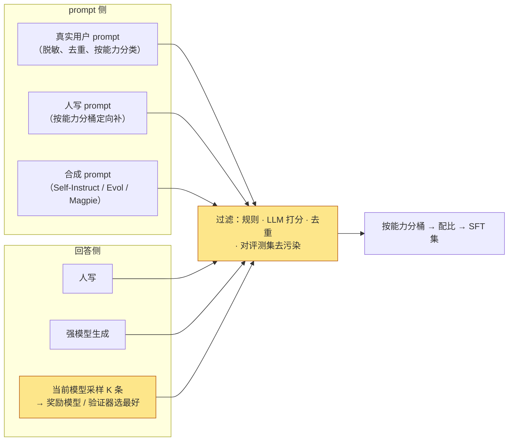

预训练结束时的模型是一个续写器：给它一段文字，它给出最可能的下一段文字。问它"法国的首都是哪里"，它可能回答"巴黎"，也可能续写成一道选择题的另外三个选项，或者一篇关于欧洲首都的文章。它有知识，没有**格式**——不知道什么时候该停、谁在说话、什么算"回答"。

监督微调（Supervised Fine-Tuning，SFT）解决的就是格式问题：用几千到几百万条"对话 → 回答"的示范继续训练，交叉熵 loss 不变，只是数据变成了对话。它是后训练流水线的第一步，也是三件套（策略、奖励、参考）里最简单的一步——只有策略，奖励就是标注好的目标序列。但它的每个工程细节都会传给后面每一步：模板一旦定下，奖励模型、DPO、RL 的数据都要用它；loss mask 的做法在多轮 Agent 训练里会以"mask 掉工具输出"的形态再出现；LoRA 的账决定后面几个模型能不能同时放进显存。

本篇要回答的核心问题是：

> **同一批 10K 条指令数据，loss 算不算 prompt、packing 掩不掩跨样本、LoRA 的秩取 8 还是 64、训 1 个 epoch 还是 5 个——每个选择各让模型变成什么样？[^q0] 怎么在训完之前就知道它会不会忘掉预训练学到的东西？[^q1]**

## 一、总览：SFT 在三件套上的位置

### 1. 先说答案

SFT 的目标函数与预训练完全相同——对目标 token 的交叉熵——只有四处不同，每一处都是本篇的一节：

| 不同点 | 预训练 | SFT | 本篇 |
|---|---|---|---|
| 数据 | 网页、书、代码，无结构 | 对话，有角色 | 第二章：从哪来、要多少、质量怎么控 |
| 格式 | 文档首尾相接 | chat template 加特殊 token 标出角色与边界 | 第三章 |
| loss 算在哪些 token 上 | 全部 | 只算回复（loss mask） | 第四章 |
| 数据量与 epoch | 15T token，1 个 epoch | 几百万到几十亿 token，2–3 个 epoch | 第五、六章：全量 vs LoRA，遗忘 |

四个先给出的数字：SFT 的数据量是预训练的万分之一到千分之一（Llama 3 的 SFT 约几百万条，Tülu 3 是 94 万条，LIMA 只用 1000 条）；学习率比预训练小一个量级（$$10^{-5}$$ 对 $$10^{-4}$$）；8B 模型全量 SFT 的训练状态与预训练相同（128 GB），LoRA 把可训练部分压到 2% 以下；一次 8B 的 SFT 只要几十到几百 GPU 小时——预训练的万分之一。**SFT 便宜、快、决定格式；典型配方下它主要不是在加知识**：模型回答里的内容大多来自预训练，SFT 教它用什么形式把内容拿出来——这是 LIMA 提出的"表面对齐**假说**"，有 URIAL 的分布对照支持，但它描述的是几千到几十万条对话数据的典型 SFT；同样的目标函数配上大量新领域数据，就是继续预训练，当然能注入知识（第五章的全量 vs LoRA 讨论正是这条边界）。

### 2. 本文的路线

按一条 SFT 流水线的顺序走：数据从哪来 → 怎么变成 token 序列（模板）→ loss 算在哪 → 用什么方式更新参数（全量 / LoRA）→ 训完之后丢了什么（遗忘）→ 整条流水线的账与公开配方。配套脚本在 Qwen2.5-0.5B 上用 `trl` 跑五个实验：模板渲染、padding 的账、loss mask 的对照、全量与 LoRA 的对照、三种配置下的遗忘。

### 3. 本文的章节安排

| 章 | 主题 | 内容 |
|---|---|---|
| 二 | 数据 | 三种来源；prompt 与回答各怎么造；LIMA 的 1K 与 Tülu 3 的 94 万各在什么条件下成立；表面对齐假说的证据；质量过滤与去污染；多轮与配比 |
| 三 | 格式 | chat template 做了什么；三家模板对照；特殊 token 的 embedding 是欠训练的；BOS 与边界的坑；训练与推理必须同一模板 |
| 四 | 目标 | loss mask 与它的梯度；多轮的 mask；packing 与跨样本 attention；padding 浪费的账；mean 与 sum；NEFTune |
| 五 | 全量与 LoRA | 全量的状态账与 lr；LoRA 的 $$W + BA$$、梯度、秩、alpha、目标矩阵、超参表；QLoRA、DoRA、rsLoRA、PiSSA；合并与多 LoRA；LoRA 学得少、忘得少 |
| 六 | 遗忘 | 度量、机制、四种对策 |
| 七 | 成本与配方 | 一次 SFT 的 GPU 小时与数据成本；七个公开配方的 SFT 对照；推理 SFT 的"少即是多" |
| 八 | 实践 | `01_sft.py` 的五个实验 |
| 九 | 本文小结 | |
| 十 | 自测 | 5 道题 |

## 二、数据：从哪来、要多少

### 1. 三种来源

| 来源 | 做法 | 代表 | 量级与成本 |
|---|---|---|---|
| 人工编写 | 标注员按 prompt 写出理想回答 | InstructGPT 的 13K 条示范；LIMA 的 1000 条精选；no_robots 的 1 万条（本篇实验用）；OpenAssistant 的众包对话树 | 每条几分钟到几十分钟的人时；质量最高，量最少 |
| 自举 | 用模型自己生成 prompt 与回答，再过滤 | Self-Instruct（Wang 等 2022）从 175 条种子生成 5.2 万条；Evol-Instruct（WizardLM）让模型把简单指令逐步"进化"成复杂指令；Magpie 只给模板的前缀让模型"自问自答" | 几乎零人工，多样性与正确性靠过滤 |
| 从更强模型蒸馏 | 用 GPT-4 一类的模型对 prompt 生成回答 | Alpaca（52K，text-davinci-003）、ShareGPT / Vicuna（真实用户对话）、UltraChat（150 万条）、OpenHermes 2.5（100 万条） | 按 API 价格计，每条几厘到几分钱；是开源社区 2023–24 年的主要来源 |

2024 年后的旗舰配方三者都用，且第三种的"更强模型"越来越多是**自己的上一版**：Llama 3 的 SFT 数据主要来自拒绝采样（用当前模型对人写的 prompt 生成多个回答、用奖励模型选最好的），加上针对代码、数学、多语言、长上下文、工具调用的合成数据，六轮迭代；DeepSeek-R1 的第三阶段用 RL 后的模型生成 60 万条推理样本再 SFT。**SFT 数据的生产者从人变成了模型 + 筛选器**，第二篇的奖励模型与第四篇的拒绝采样在这里已经出场。

### 2. prompt 与回答各怎么造

一条 SFT 样本有两半，两半的来源与质量标准不同：



**prompt 侧**决定覆盖面：真实用户 prompt（WildChat、LMSYS-Chat 这类公开集，或自己产品的日志）最贴近使用分布但长尾脏、且要脱敏；人写 prompt 用来定向补短板（某种语言、某类工具、安全边界）；合成 prompt 用来放量。Magpie 的方法值得一说：只把模板渲染到 `<|im_start|>user\n` 就让对齐后的模型续写，模型会"以为"自己在生成用户的话，于是免费得到与该模型训练分布同分布的 prompt——这是自举里最便宜的一招。

**回答侧**决定质量上限。黄色的那条路——**当前模型采样 $$K$$ 条、用奖励模型或验证器选最好**——是 2024 年后的主路：它不依赖外部强模型、回答的风格与模型自己一致（避免学 GPT-4 的口癖）、且随着模型变强数据自动变好。它的名字是拒绝采样（rejection sampling），第四篇把它作为最简单的"离线 RL"讲。

**过滤**是两侧共用的一步：规则（长度、语言、重复、拒答模板）、LLM 打分（让一个强模型按 1–5 给"有帮助 / 正确 / 安全"打分，只留高分——与 L4 第十一篇的数据打分同一思路）、去重（prompt 的 MinHash）、以及**对评测集去污染**——Tülu 3 对全部 SFT 来源与一组 benchmark 做 8-gram 重叠检查，发现若干公开 SFT 集含有测试题，去掉了它们。SFT 数据比预训练小几个量级，去污染的成本可以忽略，不做是没有理由的。

### 3. 数量与质量

两个极端各有代表：LIMA（Zhou 等 2023）用 1000 条精选示范在 65B 模型上 SFT 15 个 epoch，人评与当时的 GPT-4 / Bard 不相上下，由此提出"表面对齐假说"——知识全在预训练里，SFT 只教格式与风格，所以少量高质量数据就够；Tülu 3（Lambert 等 2024）用 93.9 万条 prompt 的混合数据 SFT 2 个 epoch，并做了大量数据消融。

表面对齐假说有一个更直接的证据。URIAL（Lin 等 2023）把一个**没做任何后训练的基座**用 3 条 in-context 示范加一段系统提示，在对话评测上接近 SFT 后的模型；他们还比较了基座与对齐模型在同一段回答上的逐 token 分布，发现**分布差异集中在极少数 token 上**——回答开头的礼貌语、过渡词、格式符号——而承载内容的 token 几乎不变。这就是"SFT 改的是表面"的字面含义，也解释了为什么 LoRA 的低秩更新（第五章）足以完成大部分 SFT。

但两个极端不矛盾，条件不同：

- LIMA 评的是**开放式对话的偏好**，这确实主要是风格；Tülu 3 评的是**数学、代码、指令遵循、知识、安全**一组 benchmark，这些能力需要对应领域的大量示范才能"拿出来"——不是教新知识，是教"在这类问题上怎么组织回答"，而这类问题有很多种。
- LIMA 的基座是 65B，大模型从少量数据里泛化更好；1–8B 的小模型需要更多数据才能学会同样的格式。
- 数据的**多样性**比数量重要：Tülu 3 的消融显示去掉任何一个领域的数据，该领域的分数就掉，其他领域几乎不变——数据是按能力"投票"的。

质量过滤是两者的共同点：AlpaGasus 用 GPT-4 给 Alpaca 的 52K 条打分，只留 9K 条高分，效果反超全量；InstructGPT 的 SFT 验证 loss 在 1 个 epoch 后就过拟合，但奖励模型分数与人类偏好继续提升到 16 个 epoch——**SFT 的验证 loss 不是好的停止信号**，这一点在第六章与第八篇会再讨论。

### 4. 蒸馏数据的两个副作用

从更强模型蒸馏的回答带着那个模型的**风格**：GPT-4 生成的 Alpaca 类数据让一代开源模型都学会了"As an AI language model"与列表化的长回答。风格本身不是错，问题是它与评测纠缠——LLM-as-judge 偏好长回答与列表（第八篇），于是蒸馏 GPT-4 的模型在 AlpacaEval 上分高，在人评上未必。第二个副作用是**正确性**：强模型也会错，蒸馏数据里的错误答案被当成标准答案学进去；数学与代码数据因此几乎都加验证器过滤（答案对、测试过），这是第五篇"可验证奖励"在 SFT 阶段的雏形。

### 5. 多轮与配比

多轮对话数据（ShareGPT 一类）让模型学会跟踪上下文与轮次边界；单轮数据便宜但训出的模型在第三轮开始"忘记"角色。配比上，2024 年后的配方把 SFT 数据按能力分桶（对话、推理、代码、多语言、工具、安全、长上下文），每桶的比例靠消融定——与预训练数据配比（L4 第十一篇）同一套方法论，只是每桶的量从 T 级降到 K–M 级。Tülu 3 公开了它的桶：通用对话与知识约三成，数学与推理约三成，代码一成多，其余是指令遵循、安全（含"该拒绝的"与"不该拒绝的"两类）、多语言、精确指令遵循。**安全桶的两面都要有**：只放拒答样本会训出过度拒绝的模型。

## 三、格式：chat template 与特殊 token

### 1. 模板做了什么

chat template 是一段 Jinja 模板，把 `[{role, content}, ...]` 的消息列表渲染成一个字符串，再由 tokenizer 切成 token。Qwen2.5 用 ChatML 格式（配套脚本 `template` 实验的输出）：

```text
<|im_start|>system
You are a helpful assistant.<|im_end|>
<|im_start|>user
What is 2+2?<|im_end|>
<|im_start|>assistant
4.<|im_end|>
<|im_start|>user
And 3+3?<|im_end|>
<|im_start|>assistant
                                      ← add_generation_prompt=True 在这里停，等模型生成
```

44 个 token，其中 9 个是特殊 token（`<|im_start|>` id 151644、`<|im_end|>` id 151645）。它们做三件事：标出**谁在说**（角色名紧跟 `<|im_start|>`）、标出**一轮在哪结束**（`<|im_end|>`，推理时生成到它就停）、标出**该模型说了**（末尾的 `<|im_start|>assistant\n`）。

三家的模板结构相同、符号不同：

| | Qwen（ChatML） | Llama 3 | Gemma |
|---|---|---|---|
| 轮次开始 | `<|im_start|>role\n` | `<|start_header_id|>role<|end_header_id|>\n\n` | `<start_of_turn>role\n` |
| 轮次结束 | `<|im_end|>\n` | `<|eot_id|>` | `<end_of_turn>\n` |
| 序列开始 | 无 | `<|begin_of_text|>` | `<bos>` |
| system 角色 | 有；无 system 时自动插默认文案 | 有 | 无（并入第一条 user） |
| 停止 token | `<|im_end|>`（及 `<|endoftext|>`） | `<|eot_id|>`（及 `<|eom_id|>` 用于工具调用） | `<end_of_turn>` |

同一段对话不用模板、手拼成 `User: ... Assistant: ...` 是 32 个 token、零特殊 token。两种格式对模型是两个没见过对方的分布：**训练用一种、推理用另一种，是 SFT 最常见的静默错误**——loss 正常下降，模型却在推理时不知道该停、或把 `User:` 当成普通文本续写。`trl` 的 `SFTTrainer` 对消息格式的数据自动调用 `apply_chat_template`，推理时 `transformers` 的 `generate` 也走同一个模板；出问题的地方通常是自己拼字符串的数据处理脚本。

### 2. 边界上的三个坑

模板与 tokenizer 的交界处有几个反复出现的错误，每个都是"loss 正常、行为不对"：

- **双 BOS**。Llama 系的模板自带 `<|begin_of_text|>`，而 `tokenizer(text)` 默认也加 BOS；把模板渲染的字符串再过一次 tokenizer 就得到两个 BOS。模型在两个 BOS 上训练、推理时只有一个（或反过来），第一个 token 的分布就偏了。正确的做法是渲染时 `tokenize=True` 一步到位，或 `add_special_tokens=False`。
- **末尾的换行**。ChatML 的 `<|im_end|>\n`——那个 `\n` 属于模板还是回答？训练时如果把它算进 completion、推理时又在 `<|im_end|>` 处停，模型学到的"结束"比实际的停止位置多一个 token。L4 第九篇讲的 token 边界偏差在这里是同一件事：模板的每个字符都要在训练与推理里以同样的方式切分。
- **停止 token 没注册**。推理框架按 `eos_token_id` 停；如果模板的结束符是 `<|im_end|>` 而 `generation_config.json` 里的 eos 只有 `<|endoftext|>`，模型会在说完后继续生成下一轮的 `<|im_start|>user`。Qwen 的 `generation_config` 里因此登记了两个 eos。

### 3. 特殊 token 的 embedding 是欠训练的

L4 第九篇留了一个伏笔：Llama 3 的 128 256 里有 256 个预留位，Qwen2.5 的 tokenizer 有 151 665 个 token 而模型 embedding 有 151 936 行。这些特殊 token 在预训练语料里几乎不出现（或只作为文档分隔符），它们的 embedding 在预训练结束时接近初始化值。SFT 的一部分工作就是把它们训出来——模型要学会"看到 `<|im_start|>assistant` 之后进入回答模式、生成 `<|im_end|>` 表示说完"。这也是为什么几千条 SFT 数据就能让模型"学会停"：它要学的只是几个 token 的 embedding 与它们在 lm_head 里的那几行，参数很少、出现很密（每条样本都有）。

这带来一个 LoRA 的陷阱：LoRA 只加在线性层上，**embedding 与 lm_head 不在其中**。如果 SFT 引入了基座没见过的特殊 token（比如给一个只有 `<|endoftext|>` 的基座加 ChatML），LoRA 训练根本更新不到这些 token 的 embedding，模型永远学不会停。对策是把 `embed_tokens` 与 `lm_head` 加进 `modules_to_save`（全量训练这两个矩阵，其余 LoRA），或者用基座已经预留并在预训练里见过的 token（Qwen2.5 的 `<|im_start|>` / `<|im_end|>` 就是这样，所以本篇的 LoRA 实验不需要额外处理）。新加的 token 还有初始化问题：随机初始化的 embedding 范数与已训练的 token 不在一个量级，常见做法是用现有 token embedding 的均值初始化（L4 第九篇扩词表的做法）。

### 4. 模板的其他内容

真实的模板比上面长得多：默认 system prompt（Qwen2.5 在没有 system 消息时自动插入一条）、工具 schema 的渲染（第六篇：把函数签名的 JSON 塞进 system 段，把工具调用渲染成 `<tool_call>` 块、工具返回渲染成 `tool` 角色）、思考模式的 `<think>` 标记（Qwen3 在非思考模式下渲染一对空的 `<think>\n\n</think>`，让模型学到"没有思考内容"也是一种合法格式）、日期等变量（Llama 3.1 的 `Cutting Knowledge Date`）。每一项都是训练分布的一部分——推理时改了 system prompt 的默认文案，模型的行为就会漂。模板随模型发布、写在 `tokenizer_config.json` 里，是模型权重之外最重要的一份"配置"。

## 四、目标：loss mask、packing 与归约

### 1. 只算回复

SFT 的序列由 prompt（system + user + 历史）与 completion（本轮回答）拼成。loss 可以算在全部 token 上，也可以只算 completion（**loss mask**：prompt 位置的 label 设为 −100，交叉熵忽略）。主流做法是只算回复，理由有三：

- prompt 是人写的、或从别处采来的，模型不需要学会生成它；
- prompt 占的比例因数据而异：本篇数据集里 34% 的 loss 位置落在 prompt 上（prompt 中位数 56 token，其中一半是模板与默认 system prompt；回复中位数约 200），带长文档的任务（摘要、阅读理解、RAG）里能到 80% 以上——不 mask 时梯度的大部分花在"预测输入文档"上，稀释了有效信号；
- 不 mask 会让模型学会续写用户的话——推理时它可能在回答完之后自己接着"扮演用户"。

从梯度看，mask 改变的是**每个参数更新里各 token 的权重**：按 token 平均时，$$\nabla \mathcal{L} = \frac{1}{T_{loss}} \sum_{t \in \text{loss 位置}} \nabla \ell_t$$，mask 让 $$T_{loss}$$ 从全部 token 变成回复 token，每个回复 token 的权重从 $$1/T$$ 涨到 $$1/T_{compl}$$——prompt 占 34% 时涨 1.5 倍，占 80% 时涨 5 倍。所以"不 mask"不只是多学了 prompt，还等价于给回复 token 降了学习率；比较两种设置时 lr 严格说应该按这个比例调。

配套实验（`mask`，80 步、lr $$10^{-5}$$、全量）的对照：

```text
训练前 base 模型在验证集回复上的 loss：2.494（PPL 12.1）
completion_only_loss=True    训练 loss 2.409 → 2.182    验证回复 loss 2.4936 → 2.3924
completion_only_loss=False   训练 loss 2.814 → 2.397    验证回复 loss 2.4936 → 2.3869
```

两点。第一，**训练 loss 不能直接比**：不 mask 的训练 loss 混进了 prompt 的 token，数值高出 0.2–0.4，这不代表训得差——比较只能在同样只算回复的验证集上做。第二，在这份数据上不 mask 反而略好（2.3869 对 2.3924，差 0.006）：prompt 只占 34% 且很短，它的文字是一点额外的语言建模信号，起了"回放"的作用（第六章）。这与 Shi 等 2024 的发现一致——**mask 的收益取决于 prompt 占多大比例**：prompt 是长文档时 mask 明显更好，prompt 是一两句话时差别很小甚至反过来。默认 mask，但它是一个值得用一次消融决定的开关，而不是不可动的规则。

### 2. 多轮

多轮对话里 mask 有两种：只算最后一轮回复，或算每一轮的 assistant 回复（用户轮次全部 mask）。后者让一条 N 轮对话贡献 N 份监督信号，是主流做法；`trl` 用 `assistant_only_loss=True`（需要模板带 `` 标记，渲染时同时产出一个"哪些字符属于 assistant"的掩码）实现。没有这个标记时，常见的替代是渲染两次（到第 $$k$$ 轮末尾、到第 $$k$$ 轮 assistant 开头）取差集——脆弱且慢，能用标记就用标记。同一个机制在第六篇的 Agent 训练里变成"mask 掉工具返回的内容"，那里没有争议：模型绝不该学会生成环境的输出。

### 3. packing 与 padding 的账

SFT 样本长短不一（中位数 256、p90 548、最大 2134 token），一个 batch 要对齐到最长的那条，其余位置是 padding，白算。配套实验对 800 条样本算了这笔账：

| `max_length` | batch 8、动态 padding 后实际算的位置 | 有效比例 | packing 需要的序列数 |
|---|---|---|---|
| 512 | 393 016 | 56% | 434 条 × 512（100%） |
| 1024 | 510 208 | 47% | 234 条 × 1024（100%） |
| 2048 | 540 048 | 45% | 119 条 × 2048（100%） |

**不 packing、随机组 batch 时一半的算力花在 padding 上。**两种修法：按长度相近分组（length grouping，把浪费降到 10% 以内，不改变样本边界）；或 packing——把多条样本首尾相接填满一条 `max_length` 的序列（L4 第十二篇的预训练做法）。packing 怎么装是一个装箱问题：`trl` 的 `packing_strategy="bfd"`（best-fit decreasing：样本按长度降序，每条放进剩余空间最合适的那个箱）比朴素的首尾相接少切断样本；"wrapped"策略把样本切开填满每一箱，吞吐最高但样本被截断。

packing 的问题也和预训练一样：标准的因果 attention 会让后一条样本看到前一条，需要块对角的 attention 掩码，或 FlashAttention 的变长接口（`trl` 的 `padding_free=True`，把每条样本的位置 id 重置并让 kernel 按样本边界做 attention）。不加掩码的 packing 在预训练里影响不大（DeepSeek-V3 就不掩），在 SFT 里影响更明显——样本短、跨样本的干扰比例高，且不同样本的 system prompt 与角色标记会互相混淆。

### 4. mean 还是 sum

交叉熵在一个 batch 里怎么归约也是一个开关：按 token 求平均（每个 token 权重相同，长回复权重大），还是先按样本平均再按 batch 平均（每条样本权重相同）。两者在长短样本混合的数据上差别明显：一条 2000 token 的长回答与一条 20 token 的短回答，按 token 平均时前者的权重是后者的 100 倍，按样本平均时相等——后者让短回答里的每个 token 权重是长回答的 100 倍。Tülu 3 的消融发现按 token **求和**（等价于按 token 平均但学习率随 batch 的 token 数缩放）比默认的按样本平均更好，理由是短回答（"好的"、"4."）的 token 不该被放大 100 倍；`trl` 与 `transformers` 的默认是按 token 平均。梯度累积时还有一个实现细节：把大 batch 拆成几个 micro-batch 各自按 token 平均再相加，等于给 token 数少的 micro-batch 更大权重——`transformers` 在 2024 年末修了这个问题，之前的版本要自己按总 token 数归一。

### 5. NEFTune

一个几乎免费的正则化：训练时给输入 embedding 加均匀噪声（NEFTune，Jain 等 2023），噪声幅度按 $$\alpha / \sqrt{L d}$$ 缩放。它在 Alpaca 类小数据上把 AlpacaEval 胜率提高了十几个点，在大数据、多 epoch 的配方上收益小得多。机制上它防止模型逐字记住少量 SFT 数据（LIMA 那种 15 个 epoch 的设置正是最容易过拟合的），代价为零，所以很多训练框架把它做成了一个开关。

## 五、全量与参数高效

### 1. 全量微调的账

全量 SFT 与预训练的状态账相同：混合精度 + AdamW 下每参数 16 字节（L4 第六篇），8B 模型 128 GB，不算激活值就要两张 80 GB 的卡加 ZeRO / FSDP。学习率取预训练峰值的十分之一量级——Llama 3 用 $$10^{-5}$$，Tülu 3 对 8B 用 $$5 \times 10^{-6}$$、70B 用 $$2 \times 10^{-6}$$，Qwen2.5 从 $$7 \times 10^{-6}$$ 衰减到 $$7 \times 10^{-7}$$。原因是 SFT 的数据量小、epoch 多，大 lr 会在几百步里把预训练的权重推得太远（第六章的遗忘）。与预训练相比 warmup 更短（几十到几百步或 3% 的步数）、调度多为线性或 cosine 到 0、weight decay 常设为 0（数据少、步数少，decay 来不及起作用，反而干扰）。

激活值在 SFT 里比预训练更容易成为瓶颈：序列长（Qwen2.5 的 SFT 用 32K）、batch 小，每层激活 $$\propto$$ 序列长 × $$d$$，加上 attention 的中间量；梯度检查点（重算激活）几乎是默认开着的，代价是多约三分之一的前向 FLOPs。

### 2. LoRA

LoRA（Hu 等 2021）把每个目标矩阵的更新约束为低秩：$$W' = W + \frac{\alpha}{r} BA$$，$$A \in \mathbb{R}^{r \times d_{in}}$$ 随机初始化、$$B \in \mathbb{R}^{d_{out} \times r}$$ 初始化为 0（所以训练开始时 $$W' = W$$），只训 $$A$$、$$B$$，$$W$$ 冻结。梯度是

$$
\frac{\partial \mathcal{L}}{\partial B} = \frac{\alpha}{r} \, \frac{\partial \mathcal{L}}{\partial W'} A^\top,\qquad
\frac{\partial \mathcal{L}}{\partial A} = \frac{\alpha}{r} \, B^\top \frac{\partial \mathcal{L}}{\partial W'}
$$

$$B = 0$$ 让第一步 $$A$$ 没有梯度、只有 $$B$$ 动；从第二步起两者每步都一起更新（不是交替），$$A$$ 的梯度随 $$B$$ 长大而变大——这是 LoRA 头几步 loss 动得慢的原因之一，也是它常用比全量大的 lr 的原因。还要纠正一个常见说法：LoRA **不需要**算 $$d_{out} \times d_{in}$$ 的完整 $$\partial\mathcal{L}/\partial W'$$。设上游梯度 $$G = \partial\mathcal{L}/\partial y$$（$$d_{out} \times$$ batch），则 $$\partial\mathcal{L}/\partial B = G (A x)^\top$$、$$\partial\mathcal{L}/\partial A = B^\top G\, x^\top$$，两个都是小矩阵乘，autograd 走的就是这条路（CPU 验证：`W.grad is None`，`A.grad`/`B.grad` 与公式逐元素相等）。所以 LoRA 省的不只是**存储**（不存 $$W$$ 的梯度与 Adam 状态），反向对权重那一半的算量也省了；没省的是对输入的梯度 $$\partial\mathcal{L}/\partial x = W^\top G + A^\top B^\top G$$——它要穿过冻结的 $$W$$ 传到前一层，与全量一样。L4 第七篇算过它的参数量：$$r (d_{in} + d_{out})$$ 每个矩阵。配套实验在 0.5B 上的账：

```text
配置                      可训练参数     占比    训练状态(混合精度)   8B 规格同比例
全量                        494.0M   100.00%        7.36 GiB        120 GiB
LoRA r=16 attention           2.2M     0.44%        0.95 GiB         15 GiB
LoRA r=16 全部线性层            8.8M     1.78%        1.03 GiB         17 GiB
LoRA r=64 全部线性层           35.2M     7.12%        1.38 GiB         22 GiB
（训练状态 = 冻结权重 BF16 2 B + 可训练参数的 FP32 主权重 4 B + Adam 8 B + 梯度 2 B；不含激活值）
```

三个旋钮：

- **秩 $$r$$**：8–64 常见。QLoRA 论文与后续消融的共同结论是 $$r$$ 的影响远小于目标矩阵的选择；Biderman 等 2024 在代码与数学的继续预训练上发现 $$r = 256$$ 仍追不上全量，但在指令微调上 $$r = 16$$ 已接近。
- **目标矩阵**：只做 attention 的 q/k/v/o（最早的做法）明显不如**全部线性层**（加 FFN 的 gate/up/down）——FFN 占了 80% 的参数（L4 第一篇），只动 attention 是在 20% 的参数里找低秩子空间。上表里从 attention 到全部线性层参数翻 4 倍，效果差别远大于 $$r$$ 从 16 到 64。
- **$$\alpha$$**：缩放因子，$$\alpha / r$$ 是有效学习率的一部分；常取 $$\alpha = 2r$$。rsLoRA（Kalajdzievski 2023）指出 $$\alpha / r$$ 的缩放让 $$r$$ 增大时更新幅度按 $$1/r$$ 塌缩（$$BA$$ 的每个元素是 $$r$$ 项之和、量级 $$\sqrt r$$，除以 $$r$$ 后是 $$1/\sqrt r$$），建议改用 $$\alpha / \sqrt r$$，这样大 $$r$$ 才真的学得更多。

一张常用的起点表（QLoRA 与后续工作的经验值）：

| 模型规模 | $$r$$ | $$\alpha$$ | dropout | lr | 目标 |
|---|---|---|---|---|---|
| ≤ 13B | 16–64 | $$2r$$ | 0.05–0.1 | 1e-4 到 2e-4 | 全部线性层 |
| 33–70B | 16–64 | $$2r$$ | 0.05 | 5e-5 到 1e-4 | 全部线性层 |

学习率要比全量大一个量级（$$10^{-4}$$ 到 $$2 \times 10^{-4}$$）：$$B$$ 从 0 出发，低秩结构下同样的 lr 对 $$W'$$ 的改变小得多。LoRA+（Hayou 等 2024）进一步指出 $$A$$ 与 $$B$$ 应该用不同的 lr（$$B$$ 大几倍），因为两者的梯度量级不同。

配套实验（`lora`，80 步）的对照：

```text
全量 lr 1e-5                    训练 loss 2.182    验证回复 loss 2.3924    7.0 s/步
LoRA r=16 全部线性层 lr 1e-4       训练 loss 2.183    验证回复 loss 2.3936    5.7 s/步
```

80 步后两者的验证 loss 差 0.001——在"学格式"这类任务上 1.8% 的可训练参数就够了。LoRA 每步快 20%（反向不用算冻结权重的梯度，优化器只更新 8.8M 个参数），训练状态是全量的七分之一；在 8B 规格上这是 120 GiB 与 17 GiB 的区别，后者一张 24 GB 的卡就能放下（激活值另算）。注意 lr：LoRA 用了全量的 10 倍才达到同样的训练 loss。

### 3. QLoRA、DoRA 与其他

- **QLoRA**（Dettmers 等 2023）：冻结的底座量化到 NF4（4 位，正态分布友好的量化格点）、量化常数再量化一次（double quantization）、优化器状态用分页内存防止峰值 OOM；65B 模型的 SFT 放进一张 48 GB 的卡。前向时反量化到 BF16 计算，所以比 BF16 LoRA 慢 30% 左右；精度上接近 BF16 LoRA。8B 模型的账：底座 NF4 约 4.5 GB，LoRA 状态几百 MB，剩下的显存全给激活。
- **DoRA**（Liu 等 2024）：把 $$W$$ 分解成幅度（每列的范数）与方向，LoRA 只更新方向、幅度单独训一个向量；同样参数量下更接近全量的学习动态，尤其在小 $$r$$ 下。
- **PiSSA**（Meng 等 2024）：不从 $$B = 0$$ 出发，而是对 $$W$$ 做 SVD，用前 $$r$$ 个奇异向量初始化 $$A$$、$$B$$，残差部分冻结——LoRA 从一开始就在 $$W$$ 最重要的子空间里动，收敛更快。
- **Prefix-Tuning / P-Tuning / Adapter**：分别在每层的 KV 前加可训练的虚拟 token、在输入前加可训练 embedding、在层间插小 MLP。它们改变了前向的结构（Adapter 加延迟，Prefix 占上下文），LoRA 推理时可以合并回 $$W$$ 零开销，所以 LoRA 成了默认。

### 4. 合并与多 LoRA 服务

训完后 $$W' = W + \frac{\alpha}{r} BA$$ 可以算出来存成一个普通模型，推理零开销。两个注意点：合并后再量化（GPTQ / AWQ）与先量化底座再挂 LoRA 不等价——QLoRA 训出的 adapter 是对着 NF4 底座学的，合并进 BF16 底座会有微小的失配，多数情况可忽略但值得知道；合并后模型文件与底座一样大，几十个 adapter 就是几十份 16 GB。

不合并时一个底座可以同时挂几十个 LoRA 按请求切换（L4 第七篇的 batched GEMV：把不同请求的 $$A$$、$$B$$ 作为一个批次的小 GEMM 算，S-LoRA、vLLM 的多 LoRA 支持），每个 adapter 只占几十 MB——这是 LoRA 在产品侧的另一个价值：一个模型服务上百个客户的定制版本。

### 5. LoRA 学得少、忘得少

Biderman 等 2024 的标题就是结论。LoRA 的低秩约束是一种正则化：它在需要大幅改变权重的任务上（新领域的继续预训练、大量新知识）追不上全量；在主要学格式与风格的任务上（多数 SFT）几乎不差，而且对基座能力的破坏更小（第六章的实验）。全量微调的谱分析显示它的权重更新是高秩的（前 10 个奇异值解释不了大部分能量，秩要到几百才能重建），所以 LoRA 追不上不是秩太小，而是任务本身需要高秩更新——这与 URIAL 的"SFT 只改少数 token 的分布"合起来看就一致了：**格式是低秩的，知识是高秩的**。

选择规则：SFT 学格式、数据几万条以内、显存紧 → LoRA（全部线性层，$$r$$ 16–64）；要注入大量知识或能力、数据几十万条以上、有卡 → 全量。旗舰配方（Llama 3、Qwen、Tülu）的 SFT 全是全量；LoRA 的主场是资源受限的定制与多租户服务。

## 六、遗忘

### 1. 现象与度量

SFT 之后模型在预训练学到的能力上退步：MMLU 掉几个点、代码能力下降、多语言变差、普通文本的困惑度上升。度量方式就是最后一条：**在一份与 SFT 数据无关的普通文本上算 loss，训练前后对比**。配套实验用 wikitext-2 的测试段落（训练前普通文本 loss 2.875、PPL 17.7）：

```text
配置                          普通文本 loss     变化      验证回复 loss
训练前                            2.8749       —          2.4936
全量 lr 1e-5                      2.8961    +0.0213        2.3924
全量 lr 1e-4                      3.4918    +0.6170        2.7951
LoRA r=16 全部线性层 lr 1e-4         2.8844    +0.0096        2.3936
```

三行是三种命运。lr $$10^{-5}$$ 的全量微调 80 步，普通文本 loss 只涨 0.02——几乎没忘。lr 放大 10 倍到 $$10^{-4}$$，普通文本 loss 涨 0.62（PPL 从 17.7 到 32.8），**连 SFT 自己的验证 loss 都变差了**（2.795，比训练前还高）：对 0.5B 的全量参数这个 lr 已经在破坏权重而不是微调它。同样 $$10^{-4}$$ 的 lr 放在 LoRA 上，普通文本 loss 只涨 0.01，比 $$10^{-5}$$ 的全量还少，回复 loss 与全量 $$10^{-5}$$ 相同——低秩约束让同样大的 lr 只能在 1.8% 参数张成的子空间里动。这是"LoRA 学得少、忘得少"最直接的一次观察，也说明遗忘的度量要在训完之前就准备好：一份与 SFT 无关的文本，训前训后各算一次 loss，几十秒。

普通文本 loss 是最便宜的度量，不是最全的。旗舰配方在每轮 SFT 后跑一组基座 benchmark（MMLU、GSM8K、HumanEval、多语言）与训前对比；InstructGPT 报告 SFT / RLHF 后在公开 NLP benchmark 上的退步——他们称为"alignment tax"——并用混入预训练梯度把它补回大部分。

### 2. 机制

SFT 数据量小、分布窄（对话格式、几种任务）、epoch 多，梯度反复把参数推向这个窄分布的方向；预训练的分布没有梯度来"拉回"。lr 越大、步数越多、更新越是高秩（全量），推得越远。遗忘不均匀：与 SFT 数据分布最远的能力（SFT 全是英文对话时的多语言、全是短回答时的长文生成、全是文本时的代码）最先掉，因为它们的参数子空间没有任何梯度维持。

### 3. 四种对策

| 对策 | 做法 | 用在 |
|---|---|---|
| 小 lr、少 epoch | $$10^{-5}$$ 量级，2–3 个 epoch，看下游指标而非 loss 决定停 | 所有配方的默认 |
| 数据回放 | SFT 数据里混入一定比例的预训练数据（或通用指令数据），让通用分布也有梯度 | InstructGPT 的 RLHF 阶段混入预训练梯度（"PPO-ptx"）；Tülu 的通用数据桶；本篇 mask 实验里"不 mask 略好"是同一效应 |
| 模型平均 | 对同一阶段不同数据 / 超参训出的多个 checkpoint 取权重平均；或在微调前后的权重间插值（WiSE-FT） | Llama 3 在 RM、SFT、DPO 每一阶段都做；OLMo 2 的 model souping |
| 低秩约束 | LoRA 一类，限制更新的子空间 | 资源受限的 SFT；定制模型 |

四种可以叠加。模型平均值得多说一句：同一个基座出发、用不同数据或种子微调出的模型，权重落在同一个"盆地"里，线性插值不会穿过高 loss 区域，平均后往往比任何一个单模型都好——这是 Llama 3 每个阶段都平均的依据，也是它对遗忘的缓解：平均把各模型"各自忘掉的部分"互相补上。

## 七、成本与公开配方

### 1. 一次 SFT 的账

用 L4 第二篇的 $$6ND$$：Llama 3 8B 规格、100 万条样本、平均 1000 token、2 个 epoch，$$D = 2 \times 10^9$$，$$C = 6 \times 8 \times 10^9 \times 2 \times 10^9 = 9.6 \times 10^{19}$$ FLOPs，H100 上 40% MFU 约 **67 GPU 小时**——预训练 146 万 GPU 小时的两万分之一。padding 的浪费（第四章：不 packing 时一半）与梯度检查点（多三分之一前向）会把它翻到 150–200 小时，仍然微不足道。

SFT 便宜到成本几乎全在数据上：100 万条样本如果由人写，按每条 10 分钟算是 17 万人时；由 GPT-4 级模型生成，按每条 1000 token 输出算是 10 亿输出 token 的 API 费用；由自己的模型拒绝采样生成，是 $$K$$ 倍的推理 FLOPs 加奖励模型打分——$$K = 8$$、8B 模型、100 万条 × 1000 token 是 $$2 \times 8\text{B} \times 8 \times 10^9 = 1.3 \times 10^{20}$$ FLOPs，与 SFT 训练本身同量级。**后训练的成本结构与预训练相反：算力便宜，数据贵**；而数据的成本正在从人时变成推理 FLOPs。

### 2. 公开配方对照

| 配方 | 数据 | 规模 | lr | epoch | 特点 |
|---|---|---|---|---|---|
| InstructGPT（2022） | 人写示范 | 13K prompt | — | 16 | 验证 loss 1 epoch 后过拟合但人评继续提升 |
| LIMA（2023） | 精选人写 | 1K | — | 15 | 表面对齐假说；65B |
| Alpaca（2023） | text-davinci-003 生成 | 52K | 2e-5 | 3 | 开源社区的起点；AlpaGasus 筛到 9K 更好 |
| Llama 3（2024） | 拒绝采样 + 合成，按能力分桶 | 数百万 | 1e-5 | 8.5–9K 步 | 六轮 SFT + DPO 迭代；checkpoint 平均 |
| Tülu 3（2024） | 混合，公开 | 939K prompt | 5e-6（8B）/ 2e-6（70B） | 2 | 数据消融公开；sum loss；去污染 |
| Qwen2.5（2024） | 合成为主 | > 1M | 7e-6 → 7e-7 | 2 | 序列 32K；长回复与结构化输出 |
| DeepSeek-R1（2025） | 冷启动：几千条长思维链；第三阶段：60 万推理 + 20 万非推理 | 见左 | — | 2（第三阶段） | SFT 只是 RL 的起点与整理器 |

趋势清楚：数据从人写到模型生成加筛选，从万级到百万级；lr 从 $$2 \times 10^{-5}$$ 到 $$5 \times 10^{-6}$$；SFT 从终点变成了 RL 之前的起点。

### 3. 推理 SFT 的"少即是多"

2025 年 LIMA 的故事在推理模型上重演了一次。s1（Muennighoff 等 2025）用 **1000 条**精选的数学题加 Gemini 生成的长思维链，在 Qwen2.5-32B 上 SFT，AIME 与 MATH 上接近 o1-preview；LIMO 用 817 条得到类似结果。条件与 LIMA 相同：基座强（Qwen2.5-32B 的预训练里已有大量数学与推理数据）、数据精选（难度、多样性、思维链质量三重筛选）、评测的是"能不能把已有能力以长思维链的形式拿出来"。它再次说明 SFT 教的是**形式**——这里的形式是"先想很久再答"——而形式是低秩的、少量数据就够；第五篇会讲当形式不够、需要 RL 才能提升的边界在哪。

## 八、实践：`01_sft.py` 的五个实验

配套脚本用 `trl` 的 `SFTTrainer`，模型 Qwen2.5-0.5B（base），数据 no_robots（1 万条人写指令数据）取 800 条训练、100 条验证；Apple Silicon（MPS）或 CUDA 上完整运行约一小时（三个训练实验各 2–3 次 80 步的训练，每步 6–14 s），五个实验可以按名字单独跑。

`template` 与 `padding` 不训练，几秒出结果，是第三、四章的数字。三个训练实验共用一个封装，核心就是 `SFTConfig` 的几个开关：

```python
cfg = SFTConfig(
    max_steps=steps, per_device_train_batch_size=4, learning_rate=lr,
    lr_scheduler_type="cosine", warmup_steps=steps // 10,
    max_length=512,
    completion_only_loss=completion_only,   # 第四章的 loss mask：只算 completion
    packing=False,                          # 打开后要配 padding_free / packing_strategy="bfd"
)
trainer = SFTTrainer(model=model, args=cfg, train_dataset=train, processing_class=tok)
trainer.train()
```

数据是 prompt-completion 的消息格式（`{"prompt": [...], "completion": [...]}`），`SFTTrainer` 自动套模板并按 `completion_only_loss` 生成 mask。LoRA 只多两行：

```python
peft_cfg = LoraConfig(
    r=16, lora_alpha=32, task_type="CAUSAL_LM",
    target_modules=["q_proj", "k_proj", "v_proj", "o_proj",      # attention
                    "gate_proj", "up_proj", "down_proj"])        # FFN：不加它们效果差很多

model = get_peft_model(model, peft_cfg)
```

验证用两个自己写的函数（`ptlab.py`）：`completion_loss` 只在回复 token 上算交叉熵（label 里 prompt 位置设 −100，与训练的 mask 一致），`text_loss` 在普通文本上算——后者是遗忘的度量。这两个函数会在后面几篇里反复用到。

值得自己动手的扩展：把 `packing=True, padding_free=True` 打开看吞吐与验证 loss 的变化（需要 CUDA 与 FlashAttention）；在 `mask` 实验里把数据换成回复极短的子集，看不 mask 是否反而更好；给 LoRA 加上 `modules_to_save=["embed_tokens", "lm_head"]`，对比特殊 token 上的 loss；把 `lora_alpha` 改成 `use_rslora=True` 在 $$r = 64$$ 下对比。

## 九、本文小结

| 项 | 规则 / 事实 | 数字 |
|---|---|---|
| 数据 | 人写 → 自举 → 强模型 / 自己的上一版生成 + 筛选；对评测集去污染 | 1K（LIMA、s1）到 94 万（Tülu 3）；质量与多样性 > 数量 |
| 表面对齐 | SFT 改的是少数格式 token 的分布 | URIAL：3 条 in-context 示范接近 SFT |
| 模板 | 特殊 token 标角色与边界；训练与推理必须同一模板；双 BOS、末尾换行、eos 注册三个坑 | ChatML 一段 4 轮对话 44 token，9 个特殊 token |
| 特殊 token | 基座里欠训练；LoRA 不更新 embedding | 需要 `modules_to_save` 或用基座预留的 token |
| loss mask | 只算回复；多轮算每轮 assistant；mask 等价于给回复 token 提 lr | 80 步：mask 2.3924，不 mask 2.3869（prompt 短时差别可忽略） |
| padding | 随机组 batch 一半算力在 padding 上 | 有效 45–56%；packing 100% 但要掩码 |
| 归约 | 按 token 平均 vs 按样本平均 | Tülu 3：sum 更好；梯度累积要按总 token 归一 |
| 全量 | 16 B/参数，lr $$10^{-5}$$ 量级，wd 0 | 8B：128 GB |
| LoRA | $$W + \frac{\alpha}{r} BA$$，全部线性层，$$r$$ 16–64，lr $$10^{-4}$$ | r=16 全部线性层 1.78% 参数，验证 loss 与全量差 0.001，状态 1/7，每步快 20% |
| 遗忘 | 普通文本 loss 的变化；四种对策 | 全量 1e-5 +0.02；全量 1e-4 +0.62（且回复 loss 变差）；LoRA 1e-4 +0.01 |
| 成本 | $$6ND$$ | 8B、2B token：67 GPU 小时；成本在数据，数据成本正变成推理 FLOPs |


SFT 训出的模型会按格式回答，但"好回答"与"坏回答"它分不出来——它只见过标注好的正例。下一篇造出能分好坏的东西：偏好数据与奖励模型。

配套代码：[`post-training/01_sft.py`](https://github.com/arganzheng/ai-learning-labs/blob/main/post-training/01_sft.py)、[`ptlab.py`](https://github.com/arganzheng/ai-learning-labs/blob/main/post-training/ptlab.py)；运行输出在 `expected/01_sft.txt`。

## 十、自测

1. 一段 4 轮对话用 ChatML 模板编码后 44 个 token、其中 9 个是特殊 token。只对 assistant 的回复算 loss，大约多少比例的 token 参与了梯度？如果不 mask 呢？

   <details markdown="1"><summary>答案</summary>

   只有 assistant 回复的 token（内容加各自的结束符，具体几个要数模板输出，题干给的数不够精确到个位）参与 loss，通常一半以下；不 mask 则 44 个全算，模型在花一半梯度学“怎么提问”。注意 mask 掉的只是这些位置的 CE 目标——prompt token 仍参与前向、后面的回复 token 通过 attention 依赖它们，梯度照样穿过它们回传到参数。prompt 很短时两者 loss 差别可忽略（80 步：2.3924 vs 2.3869），prompt 长时差别大。

   </details>

2. 随机组 batch 时有效 token 只有 45–56%，剩下是什么？packing 到 100% 之后为什么还要加掩码？

   <details markdown="1"><summary>答案</summary>

   剩下是 padding——batch 里最长的样本决定长度，其他样本补零。packing 把多条样本首尾相接填满序列，但普通的 causal 掩码只挡"看后面"，挡不住后一条样本 attend 到前一条的内容——要的是按样本边界重置的块对角掩码（或 varlen attention 传 `cu_seqlens`，第三章 §2），否则跨样本泄漏。

   </details>

3. 8B 模型全量 SFT 与 $$r = 16$$、全部线性层的 LoRA SFT，训练状态各多少？验证 loss 差多少？

   <details markdown="1"><summary>答案</summary>

   全量 16 字节 / 参数，128 GB；LoRA 可训练 1.78%，状态约全量的 1/7（十几 GB），每步快 20%；验证 loss 差 0.001——这个规模的 SFT 上 LoRA 几乎无损。

   </details>

4. LoRA 训练时新加的特殊 token（比如工具调用标签）为什么学不会？怎么修？

   <details markdown="1"><summary>答案</summary>

   LoRA 默认不更新 embedding 与 lm_head，新 token 的向量停在随机初始化上；`modules_to_save` 把 embedding / lm_head 加进可训练集合，或者复用基座预留的未用 token。

   </details>

5. SFT 训 5 个 epoch 与 1 个 epoch，哪个更容易“忘掉预训练学到的东西”？训完之前怎么看到？

   <details markdown="1"><summary>答案</summary>

   5 个 epoch——1 万条指令对 8B 模型是极度过参数化体制（L3 第四篇），多 epoch 会背下数据、推开预训练分布。看 held-out 的通用 loss（不是 SFT 验证 loss）随 epoch 的变化，以及几个通用 benchmark 的早期抽检；拐点出现就停。

   </details>

## 下一篇

[偏好数据与奖励模型：Bradley-Terry、pairwise loss 与 reward hacking](/preference-data-and-reward-models.html)

[^q0]: **loss 算不算 prompt** 决定梯度花在「学回答」还是「学提问」上——prompt 占大头（长文档任务）时必须 mask，prompt 只有一两句话时差别可忽略、甚至不 mask 略好，本篇实验里两者只差 0.006；**packing 不掩跨样本 attention** 在 SFT 里比预训练更伤，因为样本短（[第四章](#四目标loss-maskpacking-与归约)）；**LoRA 的秩**远不如「加不加 FFN」重要，$$r = 16$$ 全部线性层就接近全量，而且忘得更少（[第五章](#五全量与参数高效)）；**epoch 数**不该由验证 loss 决定——InstructGPT 的验证 loss 1 个 epoch 就过拟合、人评却涨到 16 个（[第二章](#二数据从哪来要多少)、[第七章](#七成本与公开配方)）。
[^q1]: 训完之前看 lr 与更新的秩：$$10^{-4}$$ 的全量比 $$10^{-5}$$ 忘得多得多，LoRA 最少；训完之后用一份无关的普通文本算 loss——本篇实验里三种配置的差别是 +0.02、+0.62、+0.01。详见[第六章](#六遗忘)、[第八章](#八实践01_sftpy-的五个实验)。
