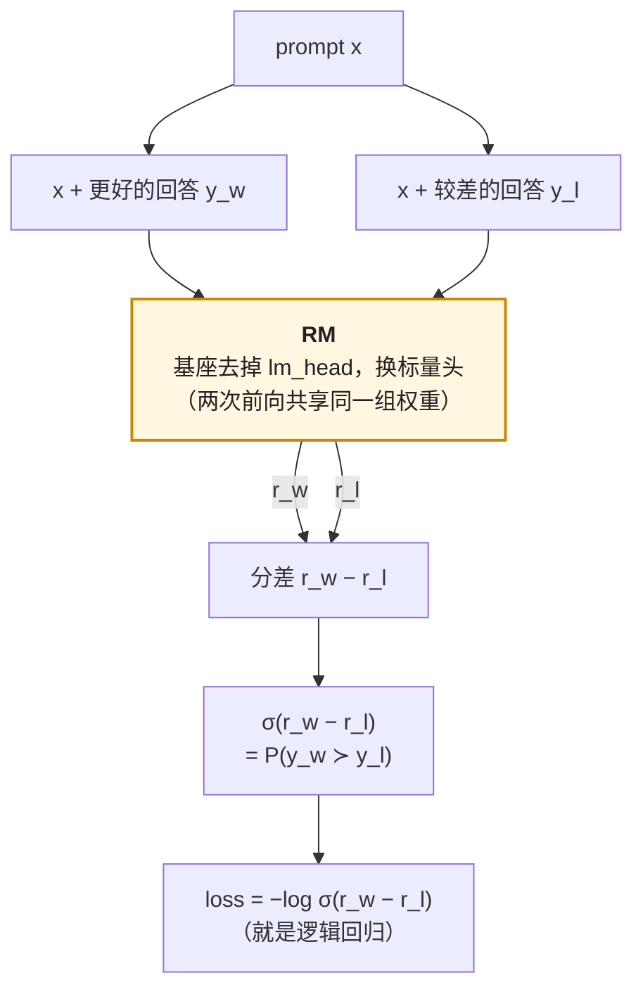

SFT 之后的模型会按格式回答，但它只见过"好的回答长什么样"，没见过"两个回答哪个更好"。要让它继续变好，需要一个能对任意回答打分的东西——不是人（太慢、太贵，且 RL 每步要打几千个分），而是一个**模型**：输入 prompt 与回答，输出一个标量，越大越好。这个模型叫奖励模型（Reward Model，RM），它是 RLHF 三件套里的"奖励"，后面的 PPO、GRPO 直接用它，DPO 把它折进 loss 里，拒绝采样用它选数据，Arena 用它的数学给模型排名。

RM 的原理简单到一句话能说完：**它是一个逻辑回归**，特征是回答、标签是"A 好于 B"。难的全在数据与它的失效方式上——人对"哪个更好"只有七成一致，训出来的 RM 准确率也就七成；而 RL 的策略会像考生找阅卷规律一样找到 RM 的漏洞，把分数刷上去而回答没有变好。

本篇要回答的核心问题是：

> **一个准确率 70% 的奖励模型为什么够用？它在什么地方会被策略钻空子，怎么在训 RL 之前就发现？**


## 一、总览：从人的判断到一个可微的标量

### 1. 先说答案

RM 的整条链是：**收集偏好 → 拟合 Bradley-Terry 模型 → 得到一个标量函数 → 交给优化器**。每一步的关键数字：

| 步 | 做什么 | 关键数字 |
|---|---|---|
| 偏好数据 | 对同一 prompt 的两个回答，人（或模型）判断哪个更好 | 人与人的一致率 70–75%；一对人标几美元、模型标几分钱；公开配方从 3 万对（InstructGPT）到 140 万对（Llama 2） |
| Bradley-Terry | $$P(y_w \succ y_l) = \sigma(r(y_w) - r(y_l))$$，loss $$-\log \sigma(r_w - r_l)$$ | 就是对"分差"做逻辑回归；奖励只定义到每个 prompt 的一个常数 |
| RM 训练 | 基座去掉 lm_head 换标量头，从 SFT 模型初始化，训 1 个 epoch | 8B 规格、10 万对：约 10 GPU 小时；验证准确率 65–75% 就是上限 |
| 失效 | 策略找到 RM 的漏洞：长度、格式、语气 | 用 best-of-N 在训 RL 之前探测；$$N = 16$$ 对应约 1.8 nats 的 KL |

训练时一对偏好走两次同一个 RM，只比分差：



loss 只依赖分差，所以奖励对每个 prompt 都可以整体加一个常数——第三章的平移不变性，也是 DPO 推导里 $$Z(x)$$ 能抵消的原因。

70% 够用的原因：RM 的用途不是**判对错**而是**给梯度方向**。它对一对回答的判断错三成，但对一批回答的平均倾向是对的；RL 每步在几百个样本上取平均，噪声被平掉，系统性的偏差留下来——而系统性偏差正是 hacking 的来源。所以 RM 的问题从来不是"准不准"，是"偏在哪"。

### 2. 本文的路线

先讲偏好数据：三种形态、从哪来、标注协议怎么影响数据的性质、人标与模型标各多少钱；再推导 Bradley-Terry 与它的几个变体，看奖励的尺度、平移不变性与 margin 各是什么；再讲 RM 的结构、训练与它的过拟合、多大的 RM 配多大的策略；然后是本篇的重点——reward hacking 的机制、过优化的定量规律、以及在训 RL 之前探测它的办法；最后是生成式 RM 与 judge 作为奖励，以及七个公开配方的 RM 对照。

### 3. 本文的章节安排

| 章 | 主题 | 内容 |
|---|---|---|
| 二 | 偏好数据 | 三种形态；人标、AI 标、混合；标注协议与 on-policy；一致率的上限；成本账 |
| 三 | Bradley-Terry | 从成对比较到逻辑回归；loss 与梯度；平移不变性与归一化；margin；排序的 Plackett-Luce；多属性回归 RM |
| 四 | 奖励模型的训练 | 结构与初始化；超参与 1 个 epoch 的过拟合；多大的 RM；显存与算力账；集成与权重平均 |
| 五 | Reward hacking | Goodhart；长度与格式偏差的机制；过优化的 scaling 规律；best-of-N 的 KL 账；训 RL 之前的探测清单；对策 |
| 六 | 生成式 RM 与 judge | 让模型先写评语再打分；GenRM、自评 rubric；成本对比；PRM 与 ORM 预告 |
| 七 | 公开配方对照 | InstructGPT、Llama 2 / 3、Tülu 3、DeepSeek-V3、Qwen3、Kimi K2、Nemotron 的 RM 各怎么做 |
| 八 | 动手 | 用 `trl` 的 `RewardTrainer` 训一个小 RM 要看的几件事 |
| 九 | 本文小结 | |


## 二、偏好数据

### 1. 三种形态

| 形态 | 标注 | 优点 | 缺点 | 用在 |
|---|---|---|---|---|
| 成对比较 | 同一 prompt 两个回答，选更好的（可带"好多少"） | 人对相对好坏最一致；直接对应 Bradley-Terry | 每对只有 1 bit 信息 | InstructGPT、Anthropic HH、Llama 2 / 3 |
| 打分 | 每个回答按 1–5 或 1–10 打分，或多个维度各打分 | 一个回答一个分，可单独训练；能表达"两个都差" | 人对绝对分数不稳定（今天的 7 是明天的 5）；不同标注者尺度不同 | HelpSteer 2、UltraFeedback（GPT-4 打 1–10） |
| 排序 | 同一 prompt 的 $$K$$ 个回答排一列 | 一次标注得到 $$\binom{K}{2}$$ 对 | 排 $$K$$ 个比选 2 个慢得多；中间位置的一致率低 | InstructGPT（$$K$$ = 4–9）、Nectar（7 个） |

成对比较成为默认的原因在心理测量学里有一百年的历史：人对**相对判断**（这个比那个好）的可靠性远高于**绝对判断**（这个值 7 分）。Likert 打分的数据在使用前通常也会转成成对（同一 prompt 下分高的胜）或做标注者归一化。反过来，成对比较有一个盲点：它不区分"A 很好、B 也不错"与"A 不好、B 更糟"——两者都是"A 胜"。这是第五章里 hacking 的一个入口：RM 只学到"相对更好"，不知道"绝对够好"。

### 2. 从哪来

| 来源 | 代表 | 规模 | 标注者看什么 |
|---|---|---|---|
| 人标 | InstructGPT（3.3 万 prompt，每个 4–9 个回答）；Anthropic HH-RLHF（16 万对）；Llama 2（**141 万对**自标 + 150 万对公开）；Llama 3（人标，四档强度 + 可选的"编辑后的回答"） | 万到百万对 | 同一 prompt 的两个回答，按有帮助 / 无害 / 诚实等标准 |
| AI 标（RLAIF） | Constitutional AI（Bai 等 2022）：模型按一份"宪法"里的原则比较两个回答；Lee 等 2023 在摘要与对话上 RLAIF ≈ RLHF | 几乎无上限 | 一个强模型 + 一段判断标准的 prompt |
| 混合 | UltraFeedback（Cui 等 2023）：6.4 万 prompt × 4 个来自不同模型的回答，GPT-4 按指令遵循、真实性、诚实、有帮助四个维度打 1–10 分再综合；HelpSteer 2：人标 5 个属性各 0–4 分，1 万条；Skywork-Reward、Nectar 等聚合集 | 十万级 | 强模型打分 + 人工抽检 |

2024 年后开源配方的偏好数据几乎全是 AI 标或混合的——Tülu 3 的偏好数据用 GPT-4o 当 judge、UltraFeedback 是 DPO 时代的标配；商业配方保留了人标（Llama 3 的 RM 数据全部人标），但也让标注者从"选一个"变成"选一个并可以改写它"——编辑后的回答作为第三个、比 chosen 更好的样本进入训练。**AI 标注的成本低两个数量级，代价是继承了 judge 模型的偏差**（第六章与第八篇）。

### 3. 标注协议

同样是"两个回答选一个"，几个协议细节决定数据的性质：

- **回答从哪个策略采样。** 用当前要训的策略（或它的近亲）采样叫 **on-policy**，用别的模型采样叫 off-policy。RM 要给 RL 中的策略打分，策略的输出分布与训练 RM 的数据分布越近，RM 越准；用 GPT-4 与 Llama 2 的回答训出的 RM，对 Qwen 策略的输出是分布外的。Llama 2 / 3 每一轮 RL 之后都用新策略采样、重新标注、重训 RM，正是为了跟上策略的分布——这是第五章"迭代重训"对策的来源。Tülu 3 的消融也显示 on-policy 偏好数据显著优于同量的 off-policy 数据。
- **两个回答怎么配对。** 来自同一策略的两次采样（差别小、标注难、信息量高），还是来自两个不同模型（差别大、标注易、但学到的可能是"哪个模型"而不是"哪个回答"）。UltraFeedback 用四个不同模型的回答配对，训出的 RM 有一部分能力是识别模型指纹。
- **标注者知道什么。** 看不看模型身份（应该不看）、给不给参考答案、标不标"好多少"（Llama 2 的四档：显著好、好、略好、几乎一样，用于第三章的 margin）、允不允许"两个都不行"。
- **多维度还是单维度。** 有帮助与无害经常冲突（最有帮助的回答可能不安全）；Anthropic 分两组标注者各标一个维度、训两个 RM；Llama 2 也训了 helpfulness RM 与 safety RM 各一个，RL 时按规则组合。单一 RM 学两个冲突目标的加权，权重由数据比例隐式决定。

### 4. 一致率的上限

人与人对同一对回答的判断一致率有明确的测量：Stiennon 等 2020 的摘要任务上标注者之间 73%、研究者之间 77%；InstructGPT 的标注者之间 72.6 ± 1.5%；Anthropic 报告类似的量级。这是**任务本身的噪声上限**：两个回答越接近，判断越接近随机。一个 RM 在这样的数据上验证准确率到 75% 就已经"和人一样准"，再往上是在拟合标注者的个人偏好。

这个数字有两个用法。第一，它是 RM 训练该停的地方：验证准确率到 70% 附近后再涨多半是过拟合训练集里的标注者（第四章）。第二，它决定了偏好数据的**有效信息量**：一致率 $$p$$ 的二元标签，信息量是 $$1 - H(p)$$ bit——$$p = 0.73$$ 时约 0.16 bit。10 万对偏好数据的有效信息约 1.6 万 bit，比一条几千 token 的 SFT 样本还少。RM 能从这么少的信息里学到东西，靠的是基座模型里已有的"什么是好回答"的先验——它只需要被校准，不需要被教。

### 5. 成本账

**人标**：一对比较需要读 prompt 与两个回答（合计一两千字）再判断，熟练标注者 3–10 分钟；按每小时几十美元的人力算，一对几美元到十几美元。10 万对是几十万到上百万美元，几个月的时间；Llama 2 的 141 万对是这个量级的十倍。这是 2023 年 RLHF 被认为"只有大厂做得起"的主要原因。

**AI 标**：一对比较是一次 judge 调用，输入两千 token、输出几十到几百 token（带评语时更多）；按 GPT-4 级 API 价格，一对约 0.02–0.05 美元。10 万对几千美元，几小时。**便宜两个数量级**，且可以随时重标（策略变了、标准变了）。用开源模型自己跑 judge 更便宜：70B 模型、2000 token 输入 + 200 token 输出，每对 $$2 \times 70\text{B} \times 2200 \approx 3 \times 10^{14}$$ FLOPs，10 万对 $$3 \times 10^{19}$$，H100 上不到一个 GPU 日。

代价在质量：AI 标注的一致率与人相近（Lee 等报告约 75%），但**偏差方向一致**——所有 judge 都偏爱长回答、列表、自信语气（第八篇），而人标的偏差在标注者之间部分抵消。用 AI 标的数据训 RM，再用 RM 训策略，策略学到的是 judge 的口味。


## 三、Bradley-Terry：成对比较就是逻辑回归

### 1. 模型

Bradley & Terry 1952 为体育比赛建模：每个选手有一个实力 $$s_i$$，$$i$$ 胜 $$j$$ 的概率

$$
P(i \succ j) = \frac{e^{s_i}}{e^{s_i} + e^{s_j}} = \sigma(s_i - s_j)
$$

把"选手"换成"（prompt, 回答）"、实力换成一个由参数 $$\phi$$ 决定的函数 $$r_\phi(x, y)$$，就是 RLHF 的奖励模型：

$$
P(y_w \succ y_l \mid x) = \sigma\big(r_\phi(x, y_w) - r_\phi(x, y_l)\big)
$$

这与逻辑回归 $$P(\text{label} = 1) = \sigma(w^\top \Delta)$$ 是同一个东西：**特征是两个回答的差、标签恒为 1（chosen 胜）**。Elo 分数是它的在线版本（每场比赛后按预测误差更新实力），Arena 的排行榜是它在"模型"这个粒度上的应用（第八篇），Thurstone 模型把 $$\sigma$$ 换成正态 CDF——形状几乎相同。

### 2. loss 与梯度

最大似然给出 pairwise loss：

$$
\mathcal{L}_{RM}(\phi) = -\mathbb{E}_{(x, y_w, y_l)} \left[ \log \sigma\big(r_\phi(x, y_w) - r_\phi(x, y_l)\big) \right]
$$

对参数的梯度：

$$
\nabla_\phi \mathcal{L} = -\mathbb{E}\left[ \big(1 - \sigma(\Delta)\big) \big(\nabla_\phi r_\phi(x, y_w) - \nabla_\phi r_\phi(x, y_l)\big) \right],\qquad \Delta = r_w - r_l
$$

权重 $$1 - \sigma(\Delta) = \sigma(-\Delta)$$ 是"RM 目前认为 $$y_l$$ 更好的概率"：已经排对且差距大的对（$$\Delta \gg 0$$）几乎不产生梯度，排错的对（$$\Delta < 0$$）权重接近 1。这与逻辑回归的梯度完全相同，也与第四篇 DPO 的梯度权重同形——DPO 的推导正是把这里的 $$r$$ 换成策略与参考的对数比。

一个实现细节：$$\log \sigma(\Delta) = -\text{softplus}(-\Delta)$$，直接算 $$\log(\sigma(\cdot))$$ 在 $$\Delta$$ 很负时下溢，要用 `logsigmoid`。

### 3. 平移不变性与归一化

loss 只依赖**差** $$r_w - r_l$$，所以对每个 prompt，$$r$$ 加任意常数 $$c(x)$$ 都不改变 loss——**奖励的绝对值没有意义，只有同一 prompt 下的相对值有意义**。这带来三个后果：

- 不同 prompt 的奖励不能直接比较（一个 prompt 下 +3 与另一个 prompt 下 −1 说不了谁更好），RL 里用它做 baseline 时要按 prompt 归一化——GRPO 的组内归一化（第三篇）正是这么做的；
- RM 训完后奖励的整体尺度是自由的，InstructGPT 训完后加一个偏置让 SFT 示范的平均奖励为 0，纯为了让 RL 的数值好看；
- 奖励的**尺度**（$$\Delta$$ 的典型大小）也只由数据决定：数据里的对越"容易"，训出的 $$\Delta$$ 越大。这个尺度与 RL 里的 KL 系数 $$\beta$$ 直接相乘，换一个 RM 就要重调 $$\beta$$；第三篇的奖励白化（whitening）是为了消掉它。

### 4. margin：把"好多少"用起来

Llama 2 的标注带四档强度，训 RM 时加进 loss：

$$
\mathcal{L} = -\log \sigma\big(r_w - r_l - m(\text{strength})\big)
$$

"显著好"的对要求分差至少 $$m$$ 大（Llama 2 取 1–3 的离散值），"几乎一样"的对 $$m = 0$$。它让 RM 的分差与人感知的差距成比例，在 Llama 2 的消融里提高了 helpfulness RM 的准确率，尤其在差距大的对上。Llama 3 反而去掉了 margin——他们发现数据规模上去之后收益消失。margin 的另一个用途是**数据清洗**：分差远小于 margin 的对多半是标注噪声。

### 5. 排序：Plackett-Luce

InstructGPT 让标注者对 $$K$$ = 4–9 个回答排序，一个 prompt 产生 $$\binom{K}{2}$$ 对。两种用法：把所有对拆开当独立样本（简单，但同一 prompt 的对高度相关，容易过拟合——InstructGPT 报告这样做 1 个 epoch 就过拟合），或把一个 prompt 的全部对放进同一个 batch、每个回答只前向一次、loss 对 $$\binom{K}{2}$$ 对取平均（InstructGPT 的做法，$$K = 9$$ 时省 $$36 / 9 = 4$$ 倍的前向）。

Bradley-Terry 对完整排序的推广是 Plackett-Luce：排序 $$y_1 \succ y_2 \succ \dots \succ y_K$$ 的概率是依次"从剩下的里选出第一"的乘积

$$
P(y_1 \succ \dots \succ y_K) = \prod_{k=1}^{K} \frac{e^{r(y_k)}}{\sum_{j \ge k} e^{r(y_j)}}
$$

每一项是一个 softmax，$$K = 2$$ 退回 Bradley-Terry。它用到了排序的全部信息，但对中间位置的标注噪声敏感；实践里成对拆解更常见。

### 6. 多属性回归 RM

打分数据（HelpSteer 2 的 5 个属性各 0–4 分）可以直接回归：RM 输出 5 维，MSE 到人标的分数，再用一个小的门控网络按 prompt 决定各属性的权重（ArmoRM，Wang 等 2024）。它的好处是**可解释**（能看到一个回答在"冗长"上被扣了分）与**可控**（改权重就改偏好，不必重训），坏处是绝对分数的噪声（第一节）。Nemotron-4 340B 的 RM 用这条路，在 RewardBench 上一度领先。回归 RM 与 Bradley-Terry RM 可以互相转换——同一 prompt 下的分数差过 $$\sigma$$ 就是胜率。


## 四、奖励模型的训练

### 1. 结构与初始化

RM 是一个 Transformer 加一个标量头：把语言模型的 lm_head（$$d \times V$$）换成一个 $$d \times 1$$ 的线性层，取**序列最后一个 token** 的隐状态过它得到 $$r$$。"最后一个 token"要处理 padding：右 padding 时取最后一个非 pad 位置，左 padding 时直接取末位；HF 的 `AutoModelForSequenceClassification` 按 `pad_token_id` 自动找，pad token 没设对是 RM 训不动的常见原因。输入是 prompt 与回答按 chat template 渲染后的完整序列（第一篇的模板在这里必须一致）。

初始化从 **SFT 模型**而不是基座：RM 要判断的是对话风格的回答，SFT 模型已经在这个分布上；InstructGPT、Llama 2 / 3 都这么做。标量头随机初始化（或零初始化），它是 RM 里唯一从零学的部分——这也是 RM 能用几万对数据训出来的原因：**它不是在学"什么是好回答"，是在学把模型已有的内部表示投影到一个标量上**。

### 2. 超参与 1 个 epoch

| 配方 | RM 规模 | 数据 | lr | epoch | batch |
|---|---|---|---|---|---|
| InstructGPT | 6B（策略 175B） | 3.3 万 prompt，$$K$$ = 4–9 | 9e-6 | 1 | 64 prompt（约 2000 对） |
| Llama 2 | 与策略同规格（7B–70B） | 141 万对 + 公开 150 万对 | 5e-6（70B）/ 1e-5（其他） | 1 | 512 对 |
| Llama 3 | 与策略同规格 | 人标，含编辑后回答 | 未公开 | 1 | 未公开 |

三家都训 **1 个 epoch**，InstructGPT 明确说多训就过拟合。原因回到第二章第 4 节：数据的有效信息只有几万 bit，而 RM 有几十亿参数——它在一遍之内就能把训练对全部"记住"（训练准确率到 90%+），验证准确率停在 70% 左右。lr 比 SFT 更小（$$10^{-5}$$ 到 $$5 \times 10^{-6}$$），warmup 短，通常不做 weight decay。

验证准确率是 RM 唯一可靠的训练指标——loss 会被少数"容易的对"主导。按难度分桶看准确率（标注者标了"显著好"的对应该 90%+，"略好"的 60% 就正常）比总准确率更有信息。RewardBench（Lambert 等 2024）把这个做成了公开评测：聊天、困难聊天、安全、推理四类精选对，2024 年末顶尖 RM 在总榜上 90% 以上，但"困难聊天"一类（两个回答都像样、差在细节）仍在 70–80%——这才是 RL 中真正遇到的对。

### 3. 多大的 RM

InstructGPT 用 6B 的 RM 给 175B 的策略打分，理由是"RM 大了训练不稳定、且 175B 的 RM 太贵"；Llama 2 反过来，RM 与策略同规格，理由是"RM 必须至少和策略一样博学，否则策略知道的事 RM 判不了"。后者成了 2024 年后的默认。Gao 等 2022 的实验支持它：RM 越大，策略能在"过优化"之前推得越远（第五章第 3 节的常数随 RM 规模改善）。

但同规格的 RM 让 RL 的显存账多一份策略大小的权重（第三篇：PPO 的四个模型里 RM 是推理权重，8B 规格 16 GB），且每步 rollout 后要对全部样本做一次 RM 前向——$$2 N_{RM}$$ FLOPs 每 token。

### 4. 训练的账

RM 训练是 SFT 的账再乘 2（每对两条序列）：8B 规格、10 万对、每条序列 1000 token、1 个 epoch，$$D = 2 \times 10^8$$ token，$$C = 6 \times 8\text{B} \times 2 \times 10^8 = 9.6 \times 10^{18}$$ FLOPs，H100 上 40% MFU 约 **7 GPU 小时**；Llama 2 的 290 万对、70B 规格也只有约 5000 GPU 小时。训练状态与 SFT 相同（16 字节/参数），一对的两条序列要同时在显存里，激活值是 SFT 的两倍。

推理侧的账更重要：RM 在 RL 里每步都要跑。GRPO 一步 512 个 prompt × 8 个回答 × 1000 token = 400 万 token，8B 的 RM 前向 $$2 \times 8\text{B} \times 4\text{M} = 6.6 \times 10^{16}$$ FLOPs，H100 上约 3 分钟——与 rollout 生成的时间同量级（第三篇算全账）。拒绝采样（第四篇）对 100 万 prompt × 8 个回答打分，$$1.3 \times 10^{20}$$ FLOPs，几百 GPU 小时。**RM 的成本在用，不在训。**

### 5. 集成与权重平均

单个 RM 的两个问题——分布外不可靠、被策略针对性利用——都能用多个 RM 缓解。**集成**（Coste 等 2023）：训 $$k$$ 个 RM（不同种子或数据子集），取均值作奖励、取方差作不确定性，方差大的样本降权或惩罚；策略要同时骗过 $$k$$ 个 RM 比骗过一个难。代价是 $$k$$ 倍的 RM 前向与显存。**权重平均**（WARM，Ramé 等 2024）：把从同一个 SFT 初始化、不同种子训出的 $$k$$ 个 RM 的权重直接平均，得到一个 RM——与第一篇 SFT 的模型平均同一原理（同一盆地内的线性插值），零推理开销，鲁棒性介于单模型与集成之间。Llama 3 没有做集成，而是靠每轮重训与更多数据。


## 五、Reward hacking

### 1. Goodhart

"一个度量一旦成为目标就不再是好度量"。RM 是人类偏好的**代理**，RL 优化的是代理而不是偏好本身；代理与目标在训练数据的分布上一致，在分布外可以任意偏离，而 RL 恰恰会把策略推到分布外——推向 RM 给高分、但训练数据里没出现过的区域。这不是 RM 训得差，是**任何**有限数据训出的代理都有的性质。

### 2. 偏差的机制：以长度为例

长度是研究最清楚的一个。Singhal 等 2023 在三个公开偏好数据集上发现：chosen 回答平均比 rejected 长；RM 给出的奖励与长度的相关性显著；RLHF 训练中回答长度单调增长，且**只优化长度**（用长度本身当奖励）就能拿到 RM 奖励增益的大部分。机制分三层：

1. **数据里的真相关**：更长的回答平均确实更完整，人标时略偏爱长的；
2. **RM 的放大**：长度是最容易从表面特征学到的信号，RM 用它做"捷径"，相关性被放大；
3. **RL 的利用**：策略发现加长回答稳定涨分，于是加长——一开始是加内容，后来是加废话、重复、免责声明。

同样的三层结构出现在每一种 hacking 上：

| 偏差 | 数据里的来源 | 策略学会的 |
|---|---|---|
| 长度 | 完整的回答更长 | 冗长、重复、总结再总结 |
| 格式 | 结构化的回答更清楚 | 无关的列表、加粗、标题 |
| 语气 | 自信的回答更可信 | 对不确定的事也斩钉截铁 |
| 迎合（sycophancy） | 顺着用户说的回答更"有帮助" | 用户说什么都同意，用户质疑就改口 |
| 拒答 | 安全数据里拒答是 chosen | 对无害请求也拒绝（over-refusal） |
| 引用与数字 | 带引用、带数据的回答更权威 | 编造参考文献与统计数字 |
| 关键词 | prompt 里的词出现在好回答里 | 复述 prompt |

### 3. 过优化的定量规律

Gao 等 2022 把这个现象做成了 scaling law。设置：一个大的"金标准"RM（6B，模拟人类偏好）生成偏好数据，训一系列不同大小、不同数据量的"代理"RM，然后用代理 RM 优化策略，同时用金 RM 测**真实**奖励。横轴用策略与初始策略的 KL 距离的平方根 $$d = \sqrt{\text{KL}(\pi \| \pi_0)}$$。结果：

$$
R_{\text{gold}}^{\text{BoN}}(d) = d\,(\alpha_{bon} - \beta_{bon}\, d),\qquad
R_{\text{gold}}^{\text{RL}}(d) = d\,(\alpha_{RL} - \beta_{RL} \log d)
$$

代理奖励随 $$d$$ 单调上升，**金奖励先升后降**——存在一个最优的 KL 距离，越过它策略"看起来"更好、实际更差。两个常数的规律：$$\alpha$$（初期的收益率）几乎不随代理 RM 的大小变，$$\beta$$（衰减率）随代理 RM 变大、数据变多而减小——**RM 越大越好不是因为初期学得快，是因为能推得更远才开始退化**。RL 与 best-of-N 在同一 KL 下的金奖励接近，说明这条曲线主要由 RM 决定、与优化器关系不大。

这张图是整个 RLHF 的操作指南：优化不是越多越好，有一个 KL 预算；预算的大小由 RM 的质量决定；超预算的迹象是代理奖励继续涨、人评开始掉。第三篇的 KL 惩罚系数 $$\beta$$ 与早停就是在管理这个预算。

### 4. best-of-N 的 KL 账

best-of-N（对每个 prompt 采 $$N$$ 个回答、用 RM 选最高的）是最简单的"用奖励改分布"，它与初始策略的 KL 有闭式表达：

$$
\text{KL}(\pi_{\text{BoN}} \| \pi_0) = \log N - \frac{N - 1}{N}
$$

$$N = 4$$：0.64 nats；$$N = 16$$：1.83；$$N = 64$$：3.17；$$N = 256$$：4.55。这给了两个有用的换算。第一，**BoN 是一把免费的 KL 尺**：不训任何东西，用 BoN 在 $$N$$ = 1 到 256 上扫一遍，看输出的长度、格式、人评怎么变，就能在训 RL 之前预览"策略被 RM 推 0.6 到 4.5 nats 之后是什么样"。第二，它是 RL 的下界对照：一次 RL 训练如果把策略推到 KL = 3 而效果不如 BoN-64，说明优化器在浪费 KL 预算。BoN 的代价是推理 $$N$$ 倍，所以它在数据生成（拒绝采样，第四篇）与 test-time compute（第五篇）里用，在线服务不用。

### 5. 训 RL 之前的探测清单

RM 训完、RL 开始前，几个小时能做完的检查：

| 检查 | 做法 | 看什么 |
|---|---|---|
| 长度相关 | 在验证集上算 $$r$$ 与回答长度的 Spearman 相关；按长度分桶看 chosen 率 | 相关 > 0.3 就要在 RL 里加长度控制 |
| BoN 扫描 | $$N$$ = 1, 4, 16, 64 的输出，看平均长度、列表 / 加粗的比例、拒答率 | 长度随 $$N$$ 线性涨 = 长度 hacking 的预演 |
| 对抗探针 | 在同一回答后面加"希望这对您有帮助！"、加一段免责声明、加三个 emoji、改成列表 | 分数涨了多少；每一项都是策略会找到的捷径 |
| 一致性 | 同一对交换顺序 / 换 system prompt / 加空行，看 $$\Delta$$ 的稳定性 | 不稳定的 RM 在 RL 里给的是噪声 |
| 校准 | 把验证对按预测的 $$\sigma(\Delta)$$ 分桶，看每桶的实际 chosen 率 | 过度自信的 RM 在 RL 里会给错误的样本大权重 |
| 分布外 | 用另一个模型（不同家族）的回答测准确率 | 掉到 60% 以下说明 RM 学了模型指纹 |
| 拒答 | 一组无害但敏感的 prompt，比较"认真回答"与"礼貌拒绝"的分数 | 拒绝分高 = over-refusal 的预演 |

这些检查的共同点：**用 RM 自己的打分行为暴露它的偏差**，而不是等 RL 训完再看。第八篇的 judge 偏差测量与这里几乎是同一套方法。

### 6. 对策

| 对策 | 做什么 | 代价 |
|---|---|---|
| KL 约束 | RL 目标里的 $$-\beta \text{KL}(\pi \| \pi_{ref})$$，限制策略离开 RM 可靠区的距离 | $$\beta$$ 太大学不动、太小 hacking；第三篇 |
| 长度控制 | 奖励里减 $$\lambda \cdot$$ 长度；或按长度分桶归一化奖励；或 RM 训练时对 chosen / rejected 做长度平衡 | 可能压掉真正需要长回答的任务 |
| 迭代重训 | 每轮 RL 后用新策略采样、重新标注、重训 RM（Llama 2 / 3 的做法） | 每轮一批标注 |
| 集成 / 平均 | 第四章第 5 节 | $$k$$ 倍推理或零 |
| 奖励整形 | 裁剪极端奖励、白化、对不确定样本降权 | 超参 |
| 规则奖励 | 能验证的部分（格式、长度上限、是否含代码块）用规则，RM 只管剩下的 | 只覆盖可验证的部分——第五篇把它推到极致 |
| 早停 | 按人评或 held-out judge 而不是代理奖励决定停 | 需要额外的评测 |

没有一条能单独解决问题，实践里全部叠加。而 2025 年推理模型的路线（第五篇）给出了一个釜底抽薪的答案：**在能用规则验证的领域，不用 RM**——奖励不再是代理，Goodhart 就没有入口。RM 退回到规则覆盖不到的地方：开放式对话、写作、有帮助程度。


## 六、生成式 RM 与 judge 作为奖励

### 1. 让模型先写评语再打分

标量 RM 的判断是一次前向、不可解释。**生成式 RM**（generative RM / LLM-as-judge）把判断变成生成：给模型一段 prompt（"比较以下两个回答，先分析各自的优缺点，再给出结论"），让它输出一段评语和一个结论（A / B，或 1–10 分）。它有三个标量 RM 没有的性质：

- **可解释**：评语说明了为什么，能人工抽检、能发现 RM 的偏差；
- **能利用推理**：判断数学题的解答要一步步验，标量头做不到，生成式可以（GenRM，Zhang 等 2024：把"验证"当作下一 token 预测来训，用 CoT 判断的准确率显著高于标量 RM）；
- **能带标准**：rubric（评分细则）写在 prompt 里，改标准不用重训——Constitutional AI 的宪法、Kimi K2 的自评 rubric 都是这个形态；DeepSeek 2025 年的 GRM 进一步让模型先生成适用于该 prompt 的原则、再按原则打分，并用多次采样投票提高一致性（把 test-time compute 用在 RM 上）。

代价是成本：标量 RM 一次前向 $$2N$$ FLOPs/token，只有 prefill；生成式要 decode 几百个评语 token，按第二篇的 decode 账是 memory-bound 的几百步，**每次判断慢一到两个数量级**。RL 里每步几千次判断时这个差距决定了能不能用；所以生成式 RM 多用在离线场景（标数据、拒绝采样、评测），在线 RL 里用它要靠异步（第六篇）或缓存。

### 2. judge 的偏差

生成式 RM 就是第八篇的 LLM-as-judge，偏差也相同：位置偏差（偏爱先出现的回答）、长度偏差、自我偏好（偏爱与自己同家族的文风）、对格式与自信的偏好。当它做奖励时这些偏差直接被 RL 放大——用 GPT-4 当 judge 训出的模型会长得像 GPT-4。对策也相同：交换顺序取平均、长度控制、多 judge 投票、rubric 里明确写"不以长度为标准"。第八篇展开。

### 3. PRM 与 ORM

到此为止的 RM 都是**结果奖励模型**（ORM）：看整个回答给一个分。对多步推理，还可以给**每一步**打分——过程奖励模型（PRM，Lightman 等 2023 的 PRM800K：人标 80 万个推理步骤的对错）。PRM 的信号更密、能定位错在哪一步，但标注贵一个数量级、且更容易被 hack（策略学会写"看起来对"的步骤）。第五篇讨论 R1 为什么放弃了 PRM。


## 七、公开配方对照

| 配方 | RM 类型 | 数据 | 规模 | 特点 |
|---|---|---|---|---|
| InstructGPT（2022） | 标量 BT | 3.3 万 prompt 人标排序 | 6B（策略 175B） | 同 prompt 全部对同 batch；1 epoch；奖励归一到 SFT 均值 0 |
| Llama 2（2023） | 标量 BT × 2（helpful / safety） | 141 万对人标 + 150 万对公开 | 与策略同规格 | 四档 margin；每轮 RL 后重标重训，共 5 轮 |
| Llama 3（2024） | 标量 BT | 人标，含"编辑后的回答"作第三档 | 与策略同规格 | 去掉 margin；RM 主要用于拒绝采样，对齐用 DPO |
| Tülu 3（2024） | 无 RM（DPO 用 GPT-4o judge 标的离线数据）；RLVR 用规则 | UltraFeedback 风格的 on-policy 数据 | — | 消融：on-policy 数据 > off-policy |
| DeepSeek-V3（2024） | 规则（可验证任务）+ 模型 RM（开放任务，带 CoT 与参考答案） | 自标 | 基于 V3 SFT checkpoint | RM 输出前先生成推理链 |
| Qwen3（2025） | 规则 + 模型 RM（参考答案 / 无参考两种）+ 结果式 rubric | 自标 | — | 通用 RL 阶段用 20 多种任务各自的奖励 |
| Kimi K2（2025） | 可验证奖励 + **自评 rubric**（策略自己按 rubric 给自己的回答打分，rubric 由人写） | — | 策略本身 | RM 与策略是同一个模型，随策略一起变强 |
| Nemotron-4 340B（2024） | 多属性回归（HelpSteer 2 的 5 个属性） | 1 万条人标 | 340B | 可解释；RewardBench 领先 |

趋势：标量 Bradley-Terry RM 从**唯一**的奖励变成**之一**——可验证任务交给规则（第五篇），开放任务里越来越多用带推理的生成式 RM 或 rubric，且 RM 与策略的界限在模糊（Kimi K2 用策略自评）。不变的是第五章的问题：只要奖励是人类偏好的代理，就有 Goodhart；变的是把代理的范围压得越来越小。


## 八、动手：训一个小 RM 要看的几件事

`trl` 的 `RewardTrainer` 把第三、四章的内容压成几行：

```python
from trl import RewardTrainer, RewardConfig
from transformers import AutoModelForSequenceClassification, AutoTokenizer

tok = AutoTokenizer.from_pretrained(SFT_MODEL)
model = AutoModelForSequenceClassification.from_pretrained(SFT_MODEL, num_labels=1)  # 标量头
model.config.pad_token_id = tok.pad_token_id                                          # 第四章：找最后一个非 pad 位置

cfg = RewardConfig(num_train_epochs=1, learning_rate=1e-5, per_device_train_batch_size=8,
                   max_length=1024, center_rewards_coefficient=1e-2)   # 后者：把 r_w + r_l 拉向 0，缓解平移漂移
trainer = RewardTrainer(model=model, args=cfg, processing_class=tok,
                        train_dataset=ds["train"], eval_dataset=ds["test"])   # 每条 {"chosen": [...], "rejected": [...]}
trainer.train()
```

loss 就是第三章第 2 节的 $$-\log \sigma(r_w - r_l)$$；数据是消息格式的 chosen / rejected 对，`RewardTrainer` 套模板、拼 batch、算两次前向。用 UltraFeedback 的几千对子集在 Qwen2.5-0.5B 的 SFT 模型上，CPU 或一张小卡几十分钟能跑完。训完值得看的不是 loss，是第五章第 5 节的清单：

1. 验证准确率随 step 的曲线，与训练准确率对比——训练到 90% 而验证停在 65–70%，就是第四章说的 1 epoch 过拟合；
2. $$r$$ 与回答长度的相关；
3. 对同一个回答加一句客套话、改成列表之后 $$r$$ 涨多少；
4. 用 BoN（$$N$$ = 1 / 4 / 16）从 SFT 模型采样、用 RM 选最好，看被选中回答的平均长度怎么随 $$N$$ 变。

四件事都不需要 RL，都能在训 RL 之前告诉你这个 RM 会把策略推向哪里。第三篇的 GRPO 与第四篇的 DPO 会接着用这个 RM 与这份数据。


## 九、本文小结

| 项 | 规则 / 公式 | 数字 |
|---|---|---|
| 偏好形态 | 成对 > 打分 > 排序（可靠性）；打分可转成对 | 人与人一致率 70–75% |
| 数据来源 | 人标（贵、偏差分散）/ AI 标（便宜、偏差一致）/ 混合 | 人标一对几美元，AI 标几分钱；InstructGPT 3.3 万 prompt，Llama 2 141 万对 |
| 协议 | on-policy 采样；同策略配对；标强度；分维度 | Tülu 3：on-policy > off-policy |
| Bradley-Terry | $$P(y_w \succ y_l) = \sigma(r_w - r_l)$$；loss $$-\log\sigma(\Delta)$$；梯度权重 $$\sigma(-\Delta)$$ | 逻辑回归；只定义到每 prompt 一个常数 |
| 变体 | margin $$-\log\sigma(\Delta - m)$$；Plackett-Luce 排序；多属性回归 | Llama 2 用 margin，Llama 3 去掉 |
| RM 训练 | SFT 初始化 + 标量头；1 epoch；lr $$10^{-5}$$ 量级；与策略同规格 | 8B、10 万对：7 GPU 小时；验证准确率 65–75% 是上限 |
| RM 的成本 | 训便宜，用贵 | GRPO 一步 400 万 token 的 RM 前向 ≈ 3 分钟 |
| 过优化 | $$R_{gold}(d) = d(\alpha - \beta \log d)$$，$$d = \sqrt{\text{KL}}$$ | $$\beta$$ 随 RM 变大、数据变多而减小 |
| BoN 的 KL | $$\log N - (N-1)/N$$ | $$N$$ = 16：1.83 nats；64：3.17 |
| Hacking | 长度、格式、语气、迎合、拒答、编造 | 长度本身当奖励能拿到 RM 增益的大部分 |
| 探测 | 长度相关、BoN 扫描、对抗探针、一致性、校准、分布外、拒答 | 训 RL 之前几小时 |

核心问题的答案：70% 的 RM 够用，因为它提供的是**梯度方向而不是判决**——RL 在几百个样本上取平均，随机错误被平掉，且人自己的一致率也只有 70–75%，RM 到这个数就已经"和人一样准"，再高是在拟合标注者个人。它被钻空子的地方是**训练数据分布之外**：RL 把策略推向 RM 给高分但数据里没见过的区域，而 RM 在那里的分数由它学到的捷径（长度、格式、语气）决定。过优化有定量规律——金奖励随 $$\sqrt{\text{KL}}$$ 先升后降，拐点由 RM 的规模与数据决定——所以 RL 有一个 KL 预算。在训 RL 之前发现它的办法是用 RM 自己的行为暴露它：长度相关、best-of-N 扫描（$$N$$ = 16 相当于 1.8 nats 的 KL，是免费的预演）、对抗探针、校准。

RM 造好了，下一篇用它改策略：采样、打分、更新——PPO 的四个模型与 GRPO 的三个。

配套资料：本篇没有配套实验；第八章的 `RewardTrainer` 骨架与清单可以直接在 [ai-learning-labs/post-training](https://github.com/arganzheng/ai-learning-labs/tree/main/post-training) 第一篇的环境上跑。


## 下一篇

[在线 RL：PPO、GRPO 与 RLHF 三件套](/online-rl-ppo-grpo-and-the-rlhf-trio.html)
