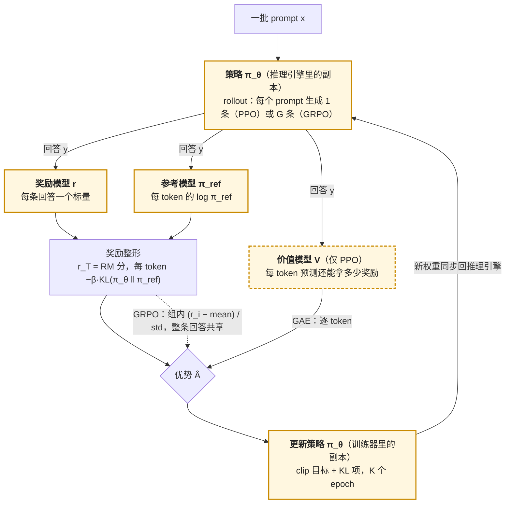

前两篇准备好了两样东西：一个会按格式回答的策略（SFT），一个能给回答打分的奖励（RM）。这一篇把它们接起来：让策略生成回答、让 RM 打分、用分数更新策略，循环。因为每一轮都从**当前**策略采样，这叫在线（on-policy）RL；因为奖励来自人类偏好的代理，整条流水线叫 RLHF。

这是本系列推导最重的一篇。它要从"如何对一个不可微的采样过程求梯度"讲起，走到 PPO——四个模型、GAE、clip——再看 GRPO 怎么去掉其中一个模型、2025 年的一族修正各改了目标函数的哪一项。它也是"三件套"这张表第一次完整出现的地方：策略、奖励、参考，加上 PPO 特有的第四个——价值。

本篇要回答的核心问题是：

> **PPO 为什么要四个模型？[^q0] GRPO 去掉价值模型之后，用什么代替它、代价是什么？[^q1] 一次 GRPO 训练的算力里推理与反向各占多少？[^q2]**

## 一、总览：采样、打分、更新

### 1. 先说答案

RLHF 的目标只有一行：

$$
\max_\theta\ \mathbb{E}_{x \sim \mathcal{D},\ y \sim \pi_\theta(\cdot \mid x)}\big[r(x, y)\big] - \beta\, \mathbb{E}_{x}\big[\text{KL}\big(\pi_\theta(\cdot \mid x)\ \|\ \pi_{ref}(\cdot \mid x)\big)\big]
$$

让期望奖励最大，同时不要离参考策略太远。所有在线方法都在解这个问题，区别在于**怎么估计它的梯度**：

| 方法 | 模型数 | 优势（baseline）怎么来 | 每个 prompt 生成几条 | 年份 |
|---|---|---|---|---|
| REINFORCE | 3（策略、参考、奖励） | 无或全局均值 | 1 | 1992 / 2022 |
| PPO | **4**（+ 价值模型） | 价值网络逐 token 估计，GAE | 1 | 2017 / InstructGPT 2022 |
| RLOO | 3 | 同 prompt 其余 $$G - 1$$ 条的均值 | $$G$$ | 2024 |
| GRPO | 3 | 同 prompt 的组内均值与标准差 | $$G$$ | 2024 |
| REINFORCE++ | 3 | 全局 batch 均值 + PPO 的 clip | 1 | 2025 |
| DAPO / Dr. GRPO / GSPO | 3 | GRPO 的组内 baseline，各改一项 | $$G$$ | 2025 |

一步在线 RL 里四个模型各站的位置——虚线框里的价值模型只有 PPO 有，GRPO 用同一 prompt 的 $$G$$ 条回答的组内均值代替它：



PPO 的四个模型里，价值模型是为了**降低策略梯度的方差**——它逐 token 预测"从这里开始还能拿多少奖励"，作为 baseline。GRPO 用同一 prompt 的 $$G$$ 个回答的平均分代替它：不需要第四个模型，代价是每个 prompt 要生成 $$G$$ 倍的 token。8B 规格下这是 250 GB 与 150 GB 训练显存的差别，也是"8 张卡起步"与"4 张卡能跑"的差别。

算力上，一步 GRPO 的 FLOPs 大约三分之二在训练（策略的前向反向 + 参考与 RM 的前向），三分之一在生成；但**时间**上生成常占一半以上——decode 是 memory-bound 的，MFU 只有训练的几分之一，加上同一 batch 里最长的回答拖住所有人。这是 RL 后训练在系统上与预训练最大的不同：**训练循环里有一个推理引擎**。

### 2. 本文的路线

先写出目标函数，解释 KL 项防什么、$$\beta$$ 多大、KL 怎么估；再从策略梯度定理推到 REINFORCE，说明方差从哪来、baseline 为什么不改变期望；再讲 PPO 的每个部件——价值、GAE、clip、多 epoch——与它的四模型显存账；然后是 GRPO 及其一族，每个变体对应目标函数里的一项；再算一步训练的 token、FLOPs 与时间，讲 on-policy 对权重同步的要求；最后是三件套对照表的第一版与公开配方。

### 3. 本文的章节安排

| 章 | 主题 | 内容 |
|---|---|---|
| 二 | 目标函数 | 期望奖励与 KL 惩罚；$$\beta$$ 的量级；三种 KL 估计量；token 级与序列级 KL |
| 三 | 策略梯度 | log-derivative 技巧；REINFORCE；方差；baseline 不改变期望的证明；LLM 是只有终末奖励的 bandit |
| 四 | PPO | 价值模型与优势；GAE 的 $$\gamma$$、$$\lambda$$；clip 的重要性比与信任域；多 epoch；LLM 上的实现细节；四模型显存账 |
| 五 | GRPO 一族 | GRPO 的组内归一化与 k3 KL；RLOO；REINFORCE++；DAPO、Dr. GRPO、GSPO 各改哪一项；方差与偏差 |
| 六 | 成本与系统 | 一步生成多少 token；FLOPs 与时间的拆分；KV cache；权重同步；on-policy 与异步 |
| 七 | 三件套对照表（第一版） | |
| 八 | 公开配方 | InstructGPT、Llama 2、DeepSeekMath / R1、Tülu 3、DAPO、Qwen3、Kimi K2 |
| 九 | 动手 | `GRPOTrainer` 的骨架与该看的曲线 |
| 十 | 本文小结 | |
| 十一 | 自测 | 5 道题 |

## 二、目标函数

### 1. 期望奖励与 KL 惩罚

目标的第一项让策略生成 RM 喜欢的回答。如果只有这一项，第二篇第五章的 Goodhart 会立刻发生：策略找到 RM 的捷径（长、列表、自信），奖励飙升，回答退化，且输出分布坍缩——所有 prompt 都生成同一种"高分模板"。第二项是对这件事的约束：策略在每个 prompt 上的输出分布不得离参考策略（通常是 SFT 模型）太远。

KL 项的三个作用，按重要性：

1. **限制 RM 被探索的范围**——第二篇的过优化曲线以 KL 为横轴，KL 惩罚就是在管理那条曲线上的位置；
2. **保持多样性**——KL 对"把概率集中到少数序列"的惩罚随集中程度增长；
3. **防止遗忘**——参考策略携带着 SFT 与预训练学到的一切，不离它太远就不会全丢。

它也是三件套里"参考"这一格的定义：**参考不参与生成、不被更新，只在每个 token 上提供一个对数概率**，用来算 KL。

### 2. β 的量级

$$\beta$$ 是奖励与 KL 的汇率：$$\beta = 0.1$$ 表示"离参考策略 1 nat 的 KL 抵 0.1 分奖励"。它的合理值取决于奖励的尺度（第二篇：RM 的分差尺度由数据决定），所以公开配方里的数字要连同它们的 RM 一起看：InstructGPT 0.02，Llama 2 0.01，DeepSeekMath 的 GRPO 0.04，DeepSeek-R1 用 GRPO 默认，Tülu 3 的 RLVR 0.05，DAPO 干脆 **去掉 KL 项**（可验证奖励下 Goodhart 没有入口，KL 只剩限制探索的副作用）。规律是：奖励越不可 hack（规则奖励），$$\beta$$ 越小甚至为零；奖励越是学出来的代理，$$\beta$$ 越大。

$$\beta$$ 也可以自适应：InstructGPT 沿用 Ziegler 等 2019 的做法，设一个目标 KL，实测超过就放大 $$\beta$$、不足就缩小。这把"选 $$\beta$$"变成了"选 KL 预算"——后者更容易从第二篇的过优化曲线里读出来。

### 3. 三种 KL 估计量

$$\text{KL}(\pi_\theta \| \pi_{ref}) = \mathbb{E}_{y \sim \pi_\theta}[\log \pi_\theta(y) - \log \pi_{ref}(y)]$$ 对整个序列空间求期望，算不出来，只能用采到的样本估。记 $$\rho = \pi_{ref}(y) / \pi_\theta(y)$$（在每个 token 上算），Schulman 2020 给出三个估计量：

| 估计量 | 公式 | 无偏？ | 方差 | 用在 |
|---|---|---|---|---|
| $$k_1$$ | $$-\log \rho = \log \pi_\theta - \log \pi_{ref}$$ | 是 | 大（可正可负，单样本上没有意义） | PPO 把它当每 token 的惩罚加进奖励 |
| $$k_2$$ | $$\frac{1}{2}(\log \rho)^2$$ | 否（但偏差小） | 小 | 少用 |
| $$k_3$$ | $$\rho - 1 - \log \rho$$ | 是 | 小（恒非负） | GRPO 把它直接写进 loss |

$$k_3$$ 是 $$k_1$$ 加上一个期望为零的控制变量 $$\rho - 1$$（因为 $$\mathbb{E}_{\pi_\theta}[\pi_{ref} / \pi_\theta] = 1$$），恒为非负、单样本上就是一个有意义的距离。GRPO 用它有一个实现上的理由：$$k_3$$ 对 $$\theta$$ 可微且梯度形式简单，能作为 loss 的一项直接反传，不必像 PPO 那样先折进奖励再经过价值网络。要说清一点：表里的"无偏"说的是 **KL 值**的估计（样本从当前 $$\pi_\theta$$ 采）；把 $$k_3$$ 对固定样本直接求梯度、拿它当 $$\nabla_\theta \text{KL}$$ 却**不是**无偏的——真正的 KL 梯度还含采样分布随 $$\theta$$ 变化那一项（CPU 小例：Bernoulli $$p = 0.8$$、$$q = 0.5$$，对 logit 的真实 $$\partial\text{KL} = 0.222$$，$$\mathbb{E}[\partial k_3]$$ = 0.300）。GRPO 用的是一个方便的替代目标（surrogate），效果上起 KL 正则的作用，不等于精确的 KL 梯度；rollout 来自旧策略、多个 epoch 复用时离得更远。两种做法的效果不同——PPO 的 KL 惩罚通过优势影响每个 token 的权重，GRPO 的 KL 是一个独立的正则项——但目标相同。

### 4. token 级与序列级

KL 在序列上是各 token 之和：$$\log \pi_\theta(y) - \log \pi_{ref}(y) = \sum_t [\log \pi_\theta(y_t \mid y_{<t}) - \log \pi_{ref}(y_t \mid y_{<t})]$$。所以 KL 惩罚天然是 **token 级**的：每个 token 有自己的一份。PPO 把它加进每个 token 的即时奖励（$$r_t = -\beta k_1^{(t)}$$，最后一个 token 再加 RM 的分数），这让价值网络有了逐 token 的学习信号——否则整条序列只有最后一步有奖励，中间全是零。这是 KL 项除了约束之外的第二个作用：**给稀疏奖励问题加了稠密的部分**。

## 三、策略梯度

### 1. 问题：采样不可微

目标 $$J(\theta) = \mathbb{E}_{y \sim \pi_\theta}[R(y)]$$（暂时把 KL 折进 $$R$$，把 prompt 省略）。$$R$$ 是一个黑箱（RM 的输出、或规则），$$y$$ 是从 $$\pi_\theta$$ 采样出来的离散序列，两者都不能对 $$\theta$$ 求导。**log-derivative 技巧**绕过它：

$$
\nabla_\theta J = \nabla_\theta \sum_y \pi_\theta(y) R(y) = \sum_y \pi_\theta(y) \nabla_\theta \log \pi_\theta(y)\, R(y) = \mathbb{E}_{y \sim \pi_\theta}\big[\nabla_\theta \log \pi_\theta(y)\, R(y)\big]
$$

第二个等号用了 $$\nabla \pi = \pi \nabla \log \pi$$。右边是一个期望，可以采样估计：采 $$y$$，算它的对数概率对 $$\theta$$ 的梯度（这是可微的——就是语言模型的交叉熵梯度乘以 −1），乘上它的奖励。**奖励高的序列，提高它的概率；奖励低的，降低。**这就是 REINFORCE（Williams 1992），也是所有策略梯度方法的起点。

对 LLM，$$\log \pi_\theta(y) = \sum_t \log \pi_\theta(y_t \mid x, y_{<t})$$，梯度是每个 token 的交叉熵梯度之和。所以 REINFORCE 的一步更新等价于：**对采样出的序列做一步 SFT，学习率乘以它的奖励**。奖励为负时是"反 SFT"——压低这个序列的概率。

### 2. 方差

这个估计量无偏但方差极大。原因有二。第一，$$R(y)$$ 的绝对值：如果所有序列的奖励都在 100 附近，每个采到的序列都被推高，只是推的力度略有不同——梯度里大部分是"把采到的东西都推高"的公共成分，有用的差异信号被淹没。第二，序列长：$$\nabla \log \pi_\theta(y)$$ 是几百个 token 梯度之和，每个 token 都对整条序列的奖励负责，而其中大多数 token 对奖励并无影响——**信用分配**问题。

### 3. baseline 不改变期望

对第一个问题的标准修法是减去一个与 $$y$$ 无关的 baseline $$b$$：

$$
\nabla_\theta J = \mathbb{E}_{y \sim \pi_\theta}\big[\nabla_\theta \log \pi_\theta(y)\, (R(y) - b)\big]
$$

它仍然无偏，因为

$$
\mathbb{E}_{y \sim \pi_\theta}\big[\nabla_\theta \log \pi_\theta(y)\, b\big] = b\, \nabla_\theta \sum_y \pi_\theta(y) = b\, \nabla_\theta 1 = 0
$$

概率之和恒为 1，它的梯度是零。$$b$$ 可以是任何不依赖当前样本 $$y$$ 的量——一个常数、batch 里其他样本的均值、一个依赖 prompt 的函数 $$b(x)$$，甚至一个依赖前缀 $$y_{<t}$$ 的函数（这就是价值函数）。方差最小的 $$b$$ 接近 $$\mathbb{E}[R]$$：减掉之后，好于平均的序列被推高、差于平均的被压低，"把一切都推高"的公共成分消失。$$R(y) - b$$ 叫**优势**（advantage）。

后面每种方法的差别，几乎全在 $$b$$ 怎么取：

```text
REINFORCE        b = 0 或全局常数
PPO              b = V_ψ(x, y_<t)        一个学出来的、逐 token 的价值网络
RLOO             b = 同 prompt 其余 G−1 个回答的平均奖励
GRPO             b = 同 prompt G 个回答的平均奖励，再除以标准差
REINFORCE++      b = 整个 batch 的平均奖励
```

### 4. LLM 是只有终末奖励的 bandit

标准 RL 里每一步有奖励、状态在变、要考虑未来。LLM 的 RLHF 简化得多：一个 prompt 是一个 episode，模型生成整条回答，**只在最后一个 token 拿到一个奖励**（RM 的分数）；中间 token 的"奖励"只有 KL 惩罚。如果把整条回答当作一个动作，这是一个 contextual bandit——没有状态转移，没有"未来"。如果把每个 token 当作一个动作（PPO 的视角），就是一个折扣因子 $$\gamma = 1$$、奖励稀疏的 MDP，价值函数的任务是把最后那个奖励**分摊回**前面的 token。两种视角在数学上相容，工程上决定了要不要价值模型。

## 四、PPO

### 1. 价值模型与优势

PPO（Schulman 等 2017）在 LLM 上的形态来自 InstructGPT。它取 token 级视角：状态 $$s_t = (x, y_{<t})$$，动作 $$a_t = y_t$$，训一个**价值网络** $$V_\psi(s_t)$$ 预测"从 $$s_t$$ 出发的期望总奖励"。价值网络与 RM 结构相同（Transformer + 标量头），但对**每个 token 位置**都输出一个值，从 RM 或 SFT 模型初始化。

有了 $$V$$，最简单的优势是 $$A_t = R - V(s_t)$$（终末奖励减去当前位置的预测）：在一个"看起来要写出好回答"的前缀上，$$V$$ 高，后面的 token 只有超出预期才有正优势。这就是价值网络做 baseline 的含义：**它把"这个 prompt 本来就容易"与"这一步走得好"分开**。

### 2. GAE

用 TD 误差 $$\delta_t = r_t + \gamma V(s_{t+1}) - V(s_t)$$（$$r_t$$ 是即时奖励——中间 token 的 KL 惩罚、最后 token 加 RM 分）构造优势有两个极端：一步 TD $$A_t = \delta_t$$（偏差大、方差小——全靠 $$V$$ 准）与蒙特卡洛 $$A_t = \sum_{l} \gamma^l r_{t+l} - V(s_t)$$（无偏、方差大——全靠采样）。GAE（Schulman 等 2015）用 $$\lambda$$ 在两者间插值：

$$
A_t^{GAE(\gamma, \lambda)} = \sum_{l=0}^{T - t} (\gamma \lambda)^l\, \delta_{t+l}
$$

$$\lambda = 0$$ 是一步 TD，$$\lambda = 1$$ 是蒙特卡洛。RLHF 的默认是 $$\gamma = 1$$（不折扣：回答末尾的奖励对开头的 token 同样重要）、$$\lambda = 0.95$$（几乎蒙特卡洛，但让远处的 TD 误差略衰减以压方差）。价值网络自己用 $$\big(V_\psi(s_t) - \hat R_t\big)^2$$ 训练，$$\hat R_t = A_t + V_{old}(s_t)$$ 是回报的估计。

### 3. clip：信任域的廉价版

策略梯度的一步用当前策略 $$\pi_{\theta_{old}}$$ 采的样本；更新一次后策略变了，样本就"过期"了——按第三章的推导它们的梯度不再无偏。要重用样本（做多个 epoch 的更新），要用重要性采样修正：

$$
\nabla_\theta J \approx \mathbb{E}_{y \sim \pi_{old}}\left[ \frac{\pi_\theta(a_t \mid s_t)}{\pi_{old}(a_t \mid s_t)}\, \nabla_\theta \log \pi_\theta(a_t \mid s_t)\, A_t \right]
$$

比值 $$\rho_t(\theta) = \pi_\theta / \pi_{old}$$ 离 1 越远，修正的方差越大，且策略一步走太远会崩（RL 的经典问题）。TRPO 用一个 KL 约束限制每步的移动，PPO 用一个更便宜的替代——**裁剪比值**：

$$
\mathcal{L}^{CLIP}(\theta) = \mathbb{E}_t\Big[\min\big(\rho_t A_t,\ \text{clip}(\rho_t, 1 - \epsilon, 1 + \epsilon)\, A_t\big)\Big],\qquad \epsilon = 0.2
$$

读法：$$A_t > 0$$（这一步走得好，想提高 $$\pi_\theta(a_t)$$）时，比值涨到 $$1 + \epsilon$$ 之后目标不再增加——继续提高没有收益，梯度为零；$$A_t < 0$$ 时，比值降到 $$1 - \epsilon$$ 之后停止。直觉上是"每个 token 的概率一次最多变 20%"，但这不是硬界：clip 只让**这一项**在越界后梯度归零，参数是共享的，同一 batch 里其他 token、其他样本的梯度仍可能把这个 token 的概率推过 $$1 \pm \epsilon$$，多步之后更是如此——PPO 论文自己也报告实际比值会越界。取 $$\min$$ 让裁剪只在"对目标有利"的方向起作用（悲观下界）。这就是 PPO 名字里的"proximal"。

### 4. 一步 PPO 的全部动作

```text
1. rollout      用 π_old 对 B 个 prompt 各生成一条回答（推理引擎）
2. 打分         RM 对 B 条回答各给一个分；参考模型算每 token 的 log π_ref
3. 奖励整形     r_t = −β·k1_t（每 token）；r_T += RM 分（可白化、裁剪）
4. 价值与优势   V_old(s_t)；GAE 算 A_t；优势白化（减均值除标准差）
5. 更新         对这批样本做 K 个 epoch（通常 1–4）、每 epoch 若干 minibatch：
                  策略：L^CLIP + 熵奖励（可选）
                  价值：(V_ψ − R̂)²，常也做 clip
6. 同步         把新策略权重送回推理引擎，回到 1
```

第 5 步里的价值 loss 与策略 loss 可以合在一个模型上（共享主干、两个头）或分开（两个模型）。InstructGPT 分开；分开时价值模型可以从 RM 初始化——它已经"知道"什么是好回答。

### 5. LLM 上的实现细节

Huang 等 2024 复现 InstructGPT 时列出了几十个影响结果的细节，其中几个决定成败：

- **奖励白化**：RM 的分数按 batch 减均值除标准差，让 $$\beta$$ 与 $$\epsilon$$ 的含义不随 RM 的尺度变（第二篇：奖励尺度由数据决定）；
- **优势白化**：GAE 之后再对整个 batch 的 $$A_t$$ 白化，这是 PPO 在所有领域的默认；
- **EOS 处理**：没有生成 EOS 就被截断的回答给一个固定的负奖励（否则策略学会"永不结束"来避免被 RM 打分）；
- **价值模型的初始化与预热**：从 RM 初始化，且在策略更新前先只训价值几步——一个随机的 $$V$$ 给出的优势是噪声；
- **只在回答 token 上算 loss**：prompt 部分的 $$\log \pi$$ 不进目标（第一篇的 mask 在这里同样存在）；
- **温度与采样**：rollout 用温度 1.0（或略低）采样而非贪心——策略梯度需要探索；采样温度与 $$\log \pi$$ 的计算必须一致。

这些细节说明了 PPO 的一个性质：**它有效但脆弱**——十几个超参与实现选择互相耦合，换一个 RM 或模型规模常要重调。这是 GRPO 一族出现的动机之一。

### 6. 四个模型的显存账

以 7B / 8B dense、H100 80 GB 为基线（L4 第六篇的 16 字节/参数）：

| 模型 | 状态 | 8B 规格 |
|---|---|---|
| 策略 $$\pi_\theta$$ | 训练：权重 + 梯度 + Adam + 主权重，16 B/参数 | 128 GB |
| 价值 $$V_\psi$$ | 训练，同上 | 128 GB |
| 参考 $$\pi_{ref}$$ | 推理：BF16 权重，2 B/参数 | 16 GB |
| 奖励 $$r_\phi$$ | 推理，同上 | 16 GB |
| 合计 | | **288 GB**（7B 约 250 GB） |

再加上 rollout 时策略的 KV cache（第六章）与训练时四个模型的激活值。288 GB 至少要 4 张 80 GB 的卡只放状态；实践中 8 张起步，用 ZeRO / FSDP 切策略与价值的状态，参考与 RM 各占一份推理权重（也可以量化到 INT8 / FP8 省一半）。**四个模型里两个要训、两个只推理，前者是显存的主体**——去掉价值模型省的是 128 GB 里的一半。

## 五、GRPO 一族

### 1. GRPO：用组内平均代替价值网络

GRPO（Group Relative Policy Optimization，Shao 等 2024，DeepSeekMath）的想法回到第三章第 3 节：baseline 只要不依赖当前样本就行。对同一个 prompt $$x$$ 采 $$G$$ 条回答 $$\{y_1, \dots, y_G\}$$，用它们的奖励 $$\{r_1, \dots, r_G\}$$ 的均值当 baseline、标准差当尺度：

$$
\hat A_i = \frac{r_i - \text{mean}(r_1, \dots, r_G)}{\text{std}(r_1, \dots, r_G)}
$$

同一条回答的所有 token 共享这个优势（序列级，不再逐 token）。目标函数保留 PPO 的 clip，把 KL 用 $$k_3$$ 估计量作为独立项加进去：

$$
\mathcal{L}_{GRPO} = \frac{1}{G} \sum_{i=1}^{G} \frac{1}{|y_i|} \sum_{t=1}^{|y_i|} \Big[ \min\big(\rho_{i,t} \hat A_i,\ \text{clip}(\rho_{i,t}, 1 - \epsilon, 1 + \epsilon) \hat A_i\big) - \beta\, k_3\big(\pi_\theta, \pi_{ref}\big)_{i,t} \Big]
$$

它做了三件事：**去掉价值模型**（baseline 来自采样而非学习）、**按 prompt 归一化**（第二篇说过奖励只在同一 prompt 下可比，组内归一化正好只比同 prompt 的）、**KL 从奖励移到 loss**。代价：每个 prompt 生成 $$G$$ 条（DeepSeekMath 用 64，R1 与多数复现用 8–16），rollout 的 token 数是 PPO 的 $$G$$ 倍——但 PPO 为了同样的 batch 大小也要生成同样多的序列，差别在于 GRPO 把它们集中在更少的 prompt 上。

组内归一化有一个副作用：当一组 $$G$$ 条回答奖励全相同（全对或全错，规则奖励下常见），std 为零、优势全为零，这个 prompt 对这一步没有贡献——DAPO 的动态采样（第 4 节）就是针对它。

### 2. RLOO 与 REINFORCE++

**RLOO**（REINFORCE Leave-One-Out，Ahmadian 等 2024）与 GRPO 同时提出、想法相同、细节更保守：baseline 用同 prompt **其余** $$G - 1$$ 条回答的均值

$$
\hat A_i = r_i - \frac{1}{G - 1} \sum_{j \ne i} r_j
$$

不除标准差、不用 clip、不用重要性比（纯 on-policy，每批样本只更新一次）。留一法让 baseline 严格不依赖 $$y_i$$，是无偏的；GRPO 的均值包含 $$r_i$$ 本身（引入 $$1/G$$ 的偏差，$$G$$ 大时可忽略）。论文的论点是：LLM 的 RLHF 从 SFT 初始化、策略变化慢，PPO 那套为了从零学控制任务设计的机制（价值、GAE、clip）大多是不必要的复杂度，REINFORCE + 好的 baseline 就够。

**REINFORCE++**（Hu 2025）取另一个中间点：baseline 用整个 batch 的均值（跨 prompt，所以每个 prompt 只需生成 1 条），保留 PPO 的 clip 与 token 级的 KL 惩罚，做优势白化。它比 GRPO 便宜（不用 $$G$$ 条），比 PPO 简单（无价值网络），代价是跨 prompt 的 baseline 没有消掉"prompt 本身难易"的差异。

### 3. Dr. GRPO：两个归一化各引入一个偏差

Liu 等 2025 指出 GRPO 目标里两处"看起来无害"的归一化各有偏差：

- **除以标准差**：一组回答分数接近的 prompt（全对或全错附近，std 小）被放大权重，分数分散的 prompt（一半对一半错，std 大）被压低——而后者正是模型"正在学"的题。这让训练偏向太易或太难的题。
- **除以 $$\lvert y_i \rvert$$（按序列长度平均）**：一条**错误**的长回答，负优势被长度稀释，每个 token 受的惩罚小；一条**正确**的短回答，正优势集中。于是策略学到"答错时写长一点"——这解释了 R1 类训练中回答长度增长的一部分不是"思考更多"而是这个偏差。

Dr. GRPO 去掉两个归一化：优势用 $$r_i - \text{mean}$$，loss 对所有 token 求和再除以一个**常数**（最大长度）。结果是同样的准确率下回答短得多。

### 4. DAPO：四个修正

DAPO（Yu 等 2025）在 Qwen2.5-32B 上用可验证奖励复现并超过了 R1 的数学结果，公开了四个对 GRPO 的修正，每个针对训练中观察到的一个现象：

| 修正 | 针对的现象 | 改了哪一项 |
|---|---|---|
| clip-higher | 熵快速下降、输出趋同：低概率 token 想涨概率时被 $$1 + \epsilon$$ 卡住（从 0.01 涨到 0.012 就停），高概率 token 想降时 $$1 - \epsilon$$ 却给了很大空间 | 上下界不对称：$$\epsilon_{low} = 0.2$$，$$\epsilon_{high} = 0.28$$ |
| 动态采样 | 全对 / 全错的组优势为零，有效 batch 随训练缩小 | 采样时丢掉这些组、补采，直到 batch 里全是"有梯度"的 prompt |
| token 级 loss | GRPO 按序列平均再按组平均，长回答的每个 token 权重小；长而低质的回答（重复、废话）惩罚不够 | 对 batch 内**全部 token** 求和再除以总 token 数（与 Dr. GRPO 的方向一致） |
| 超长奖励整形 | 被截断的回答给固定负奖励，噪声大（好的推理也可能只是长了点） | 软惩罚：接近长度上限时线性递减，超过才给最低分 |

外加去掉 KL 项。四个修正没有一个改变"组内 baseline"这个核心，改的都是目标函数里 clip 的边界、样本的筛选、token 的权重、奖励的形状。

### 5. GSPO：序列级的重要性比

GRPO 的重要性比 $$\rho_{i,t}$$ 是 token 级的，而它的优势是序列级的——一个序列一个 $$\hat A_i$$，却在每个 token 上单独裁剪。Zheng 等 2025（Qwen3）指出这在 MoE 模型上尤其糟糕：同一个 token 在 $$\pi_{old}$$ 与 $$\pi_\theta$$ 下可能被路由到不同专家，token 级比值噪声极大，训练不稳定。GSPO 把比值换到**序列级**并按长度几何平均：

$$
s_i(\theta) = \left(\frac{\pi_\theta(y_i \mid x)}{\pi_{old}(y_i \mid x)}\right)^{1 / |y_i|},\qquad
\mathcal{L}_{GSPO} = \frac{1}{G} \sum_i \min\big(s_i \hat A_i,\ \text{clip}(s_i, 1 - \epsilon, 1 + \epsilon) \hat A_i\big)
$$

裁剪以整条序列为单位（一条序列要么全部参与梯度要么全部被裁），$$\epsilon$$ 相应小得多（$$10^{-3}$$ 量级，因为几何平均后的比值很接近 1）。它让优势与比值在同一粒度上，也让 MoE 的 RL 训练稳定。MiniMax-M1 的 CISPO 走另一条路：不裁梯度、只裁重要性权重本身，让被裁的 token 仍贡献（缩小后的）梯度。

### 6. 一张表：每个名字改了哪一项

把 GRPO 的目标函数拆成六个部件，每个变体对应一处：

| 部件 | GRPO（2024） | RLOO | REINFORCE++ | Dr. GRPO | DAPO | GSPO |
|---|---|---|---|---|---|---|
| baseline | 组内均值 | 组内留一均值 | batch 均值 | 组内均值 | 组内均值 | 组内均值 |
| 尺度归一化 | ÷ 组内 std | 无 | 白化 | **无** | ÷ std | ÷ std |
| 长度归一化 | ÷ $$\lvert y_i \rvert$$ | — | — | **常数** | **token 级求和** | 序列级 |
| 重要性比 | token 级 | 无（纯 on-policy） | token 级 | token 级 | token 级 | **序列级几何平均** |
| clip | $$\pm 0.2$$ | 无 | $$\pm 0.2$$ | $$\pm 0.2$$ | **0.2 / 0.28** | $$\pm 10^{-3}$$ 量级 |
| KL | $$k_3$$ 进 loss | 进奖励 | $$k_1$$ 进奖励 | 可去 | **去掉** | 可去 |
| 采样 | 全部 | 全部 | 全部 | 全部 | **丢零优势组** | 全部 |

粗体是该方法的核心改动。看完这张表，2025 年每隔几周出现的新名字大多能放进某一格。

## 六、成本与系统

### 1. 一步生成多少 token

GRPO 一步：$$B$$ 个 prompt × $$G$$ 条回答 × 平均长度 $$\bar L$$。对话 RLHF 的典型配置 $$B = 512$$、$$G = 8$$、$$\bar L = 1000$$：**410 万个回答 token**，加上 prompt（每条回答都带一份 prompt 的 KV，prompt 平均 300 token 就再加 120 万）。推理模型（第五篇）$$\bar L$$ 到 8K–32K，一步几千万 token。

### 2. FLOPs 的拆分

8B 策略、8B 参考、8B RM，一步 410 万回答 token（忽略 prompt）：

| 部分 | FLOPs/token | 合计 |
|---|---|---|
| 生成（策略前向） | $$2N$$ | $$6.6 \times 10^{16}$$ |
| 参考前向（算 $$\log \pi_{ref}$$） | $$2N$$ | $$6.6 \times 10^{16}$$ |
| RM 前向 | $$2N_{RM}$$ | $$6.6 \times 10^{16}$$ |
| 旧策略前向（算 $$\log \pi_{old}$$；可与生成合并） | $$2N$$ | $$0$$ 或 $$6.6 \times 10^{16}$$ |
| 策略训练（前向 + 反向） | $$6N$$ | $$2.0 \times 10^{17}$$ |
| 合计 | $$\approx 12N$$ | $$\approx 4 \times 10^{17}$$ |

**FLOPs 上训练占一半，三个前向各占六分之一**；生成只占六分之一。PPO 再加价值网络的前向与训练（$$8N$$），合计约 $$20N$$。

### 3. 时间的拆分：为什么生成常占一半以上

FLOPs 相同，时间不同。训练的前向反向是大矩阵乘，MFU 40%；参考与 RM 的前向是 prefill 形态（整条序列一次算），MFU 也高。**生成是 decode**：每步一个 token，memory-bound（L4 第二篇），即便 4096 条序列一起 decode，MFU 也只有 10–25%，且有三个额外的拖累：

- **长尾**：同一 batch 里最长的回答决定这一步何时结束，其余序列在等——回答长度的方差越大（推理模型尤甚），浪费越多；连续批处理能缓解但不能消除，因为下一步训练要等全部 rollout 完成；
- **KV cache**：4096 条 × 1300 token × 128 KiB（Llama-3-8B 规格）= **650 GiB**（约 698 GB），一张卡放不下，8 张 80 GB 卡的 596 GiB 也放不下（还没算权重），要分几波生成、开 prefix 共享（同一 prompt 的 $$G$$ 条回答共用 prompt 部分的 KV），或用更大的推理集群；
- **引擎切换**：训练框架与推理引擎（vLLM / SGLang）共置时，每步要把显存从训练状态切到 KV cache 再切回，加权重同步。

把 MFU 差别代进去：生成 $$6.6 \times 10^{16}$$ FLOPs 在 15% MFU 下约 450 GPU·秒，训练 $$2 \times 10^{17}$$ 在 40% 下约 500 GPU·秒，两个前向约 330 GPU·秒——生成已占三分之一，再加长尾与切换，**一半以上的墙钟时间在生成**是常态。verl、OpenRLHF 的论文都报告 rollout 占 60–80%。这是 Infra 地图 09 [《RL 后训练基础设施》](/rl-post-training-infrastructure.html)的全部由来：优化 RL 后训练 = 优化训练循环里的推理引擎。

### 4. on-policy 与权重同步

严格 on-policy 要求生成用的权重就是当前要更新的权重：每步训练后，新权重要**送进推理引擎**再生成下一批。8B 是 16 GB，NVLink 内几秒，跨机器几十秒；405B 是 810 GB。同步频率就是训练步频，每步都同步。

放松这个要求可以省时间：**异步 / off-policy**——生成用 $$k$$ 步之前的权重，训练与生成并行。代价是样本"过期"，重要性比 $$\rho$$ 离 1 更远、clip 裁掉更多、梯度有偏。$$k = 1$$（生成滞后一步）在多数报告里几乎无损，是 2025 年后大规模 RL 的默认；第六篇的 Agent 训练里轨迹耗时方差极大，异步成为必需。三件套对照表里"在线 / 离线"那一列其实是一个连续谱：$$k = 0$$ 严格在线，$$k = \infty$$ 就是第四篇的离线方法。

### 5. 一次训练的总账

DeepSeekMath 的 GRPO：$$B = 1024$$、$$G = 64$$、$$\bar L$$ 约 1000、7B 模型，一步 6500 万 token，按 $$12N$$ 算 $$5.5 \times 10^{18}$$ FLOPs；几百步的训练约 $$10^{21}$$——8B 预训练的千分之一，SFT 的十倍。对话 RLHF 的一轮（几千步）量级相近。**RL 后训练比 SFT 贵一个数量级，仍比预训练便宜三个数量级**；它贵的地方不在 FLOPs，在需要一个推理引擎、四个（或三个）模型同时在显存、以及每步之间的同步。

## 七、三件套对照表（第一版）

| 方法 | 策略 | 奖励从哪来 | 参考怎么约束 | 价值模型 | 从当前策略采样？ | 每 prompt 生成 |
|---|---|---|---|---|---|---|
| SFT | 训 | 标注的目标序列（隐式） | 无 | 无 | 否 | 0 |
| RM 训练 | 不训（训的是 RM） | 人 / AI 的成对偏好 | 无 | 无 | 否 | 0 |
| REINFORCE | 训 | RM 或规则 | $$k_1$$ 进奖励 | 无 | 是 | 1 |
| PPO | 训 | RM | $$k_1$$ 进每 token 奖励，$$\beta$$ 自适应 | **有**（训） | 是 | 1 |
| RLOO | 训 | RM 或规则 | 进奖励 | 无 | 是 | $$G$$ |
| GRPO | 训 | RM 或规则 | $$k_3$$ 进 loss | 无 | 是 | $$G$$ |
| REINFORCE++ | 训 | RM 或规则 | $$k_1$$ 进奖励 | 无 | 是 | 1 |
| DAPO | 训 | 规则 | **无** | 无 | 是 | $$G$$（动态） |
| GSPO | 训 | 规则 / RM | 可选 | 无 | 是（序列级比值） | $$G$$ |

第四篇加上离线的一族之后，"从当前策略采样"一列会出现"否"与"半"。

## 八、公开配方

| 配方 | 算法 | 关键数字 | 特点 |
|---|---|---|---|
| InstructGPT（2022） | PPO | 策略 175B、RM 6B、$$\beta = 0.02$$（自适应）、$$\gamma = 1$$、$$\lambda = 0.95$$、每批 4 个 epoch | 混入预训练梯度（PPO-ptx）抵消 alignment tax |
| Llama 2（2023） | 拒绝采样 4 轮 → PPO 1 轮 | $$\beta = 0.01$$、奖励白化、两个 RM 按规则组合 | RLHF-v5 才用 PPO；前几轮全是拒绝采样 + SFT |
| DeepSeekMath（2024） | GRPO | $$G = 64$$、$$\beta = 0.04$$、lr $$10^{-6}$$、batch 1024 | GRPO 首发；奖励来自一个在 DeepSeekMath-Base 7B 上训练的 RM（报告 4.2），不是规则匹配——规则奖励是后来 R1-Zero 的做法 |
| DeepSeek-R1（2025） | GRPO | 规则奖励（准确 + 格式）+ 语言一致性 | 第五篇展开 |
| Tülu 3（2024） | PPO（RLVR） | $$\beta = 0.05$$、价值从 RM 初始化 | 可验证奖励下仍用 PPO，报告价值模型有帮助 |
| DAPO（2025） | GRPO 改 | 32B、$$G = 16$$、$$\epsilon$$ 0.2 / 0.28、无 KL、token 级 loss | AIME 50 分；完整开源配方与代码 |
| Qwen3（2025） | GSPO | 序列级比值 | MoE 上稳定 |
| Kimi K2（2025） | 策略优化变体 + 自评奖励 | 大规模 Agent 环境 | 第六篇 |

趋势：从 PPO 到 GRPO 一族（去掉价值模型），从 KL 惩罚到无 KL（奖励越可验证越不需要参考），从 token 级到序列级（优势与比值粒度对齐），从严格 on-policy 到一步异步。

## 九、动手：`GRPOTrainer` 的骨架与该看的曲线

`trl` 的 `GRPOTrainer` 把第五章第 1 节的目标函数封装成一个 trainer，用户只需要提供奖励函数：

```python
from trl import GRPOTrainer, GRPOConfig

def rm_reward(prompts, completions, **kw):          # 第二篇的 RM：返回每条回答一个分
    return [score(p, c) for p, c in zip(prompts, completions)]

def length_penalty(completions, completion_ids, **kw):   # 第二篇第五章的长度控制
    # 对话式数据里 completions 是消息列表（len 恒为 1），字符串时 len 是字符数：
    # 两者都不是 token 数，要用 trainer 传入的 completion_ids 计真实长度
    return [-0.001 * len(ids) for ids in completion_ids]

cfg = GRPOConfig(
    num_generations=8,          # G
    beta=0.04,                  # KL 系数（k3 进 loss）；0 即去掉参考模型
    epsilon=0.2,                # clip；epsilon_high 可单独设（DAPO 的 clip-higher）
    loss_type="grpo",           # 或 "dr_grpo" / "bnpo"：第五章第 3–4 节的长度归一化
    learning_rate=1e-6, max_completion_length=1024,
    use_vllm=True,              # 第六章：生成交给推理引擎
)
trainer = GRPOTrainer(model=SFT_MODEL, reward_funcs=[rm_reward, length_penalty],
                      args=cfg, train_dataset=prompts)
trainer.train()
```

多个奖励函数按权重相加；`beta=0` 时不加载参考模型，显存少一份权重。训起来之后该盯的曲线，按第二篇与本篇的顺序：

1. **奖励均值**——涨是应该的，但它是代理奖励；
2. **KL**（对参考）——第二篇的过优化横轴；配合第二篇的 BoN 尺子，KL 到 2–3 nats 时该用 held-out judge 或人评核对；
3. **回答长度**——随步数单调涨且奖励涨主要来自它 = 长度 hacking；
4. **clip 比例**（被裁的 token 占比）——持续 > 20–30% 说明每步走太远（lr 太大或 $$k$$ 太多）；
5. **熵**——快速降到接近 0 是输出趋同的信号（DAPO 的 clip-higher 针对它）；
6. **零优势组的比例**——全对 / 全错的 prompt 占比，高了就是 DAPO 动态采样的场景。

这六条比 loss 本身有信息——RL 的 loss 数值几乎不可解读。

## 十、本文小结

| 项 | 公式 / 规则 | 数字 |
|---|---|---|
| 目标 | $$\max \mathbb{E}[r] - \beta\, \text{KL}(\pi \| \pi_{ref})$$ | $$\beta$$：RM 奖励 0.01–0.05，规则奖励 0 |
| KL 估计 | $$k_1 = \log\frac{\pi}{\pi_{ref}}$$，$$k_3 = \rho - 1 - \log\rho$$ | PPO 用 $$k_1$$ 进奖励，GRPO 用 $$k_3$$ 进 loss |
| 策略梯度 | $$\mathbb{E}[\nabla \log \pi(y)\,(R - b)]$$；$$b$$ 不依赖 $$y$$ 则无偏 | 一步 = 按奖励加权的 SFT |
| PPO | $$V_\psi$$ 逐 token baseline；GAE $$\gamma = 1, \lambda = 0.95$$；clip $$\epsilon = 0.2$$ | 四模型，8B 规格 288 GB 状态 |
| GRPO | $$\hat A_i = (r_i - \text{mean}) / \text{std}$$；组内 $$G$$ 条 | 三模型，160 GB；$$G$$ = 8–64 |
| 变体 | Dr. GRPO 去两个归一化；DAPO clip-higher / 动态采样 / token 级 / 无 KL；GSPO 序列级比值 | 一张六部件表 |
| 一步的 token | $$B \times G \times \bar L$$ | 512 × 8 × 1000 = 410 万 |
| FLOPs | $$\approx 12N$$/token（PPO $$20N$$） | 训练一半，三个前向各六分之一 |
| 时间 | 生成 MFU 10–25%，长尾，引擎切换 | 生成占 50–80% 墙钟 |
| 显存 | 状态 + KV cache | 4096 条 × 1300 token = 680 GiB KV |
| 同步 | 每步把策略权重送进推理引擎 | 8B 16 GB；一步异步几乎无损 |


这一篇的方法全部从当前策略采样。下一篇不采样：从一份固定的偏好数据直接推出 loss——DPO 及其一族。

配套资料：本篇没有配套实验；第九章的骨架可在 [ai-learning-labs/post-training](https://github.com/arganzheng/ai-learning-labs/tree/main/post-training) 第一篇的环境上配一张 16–24 GB 的 GPU 运行。

## 十一、自测

1. PPO 的四个模型各是什么、各在一步里做什么？哪几个要反向？

   <details markdown="1"><summary>答案</summary>

   策略（生成 + 反向）、参考（前向算 log π_ref 给 KL）、奖励模型（前向打分）、价值模型（前向估 baseline + 反向训自己）。要反向的是策略与价值两个；8B 规格四模型训练状态约 288 GB。

   </details>

2. GRPO 一组 $$G = 8$$ 条回答的奖励是 $$(1, 1, 1, 1, 1, 1, 1, 1)$$，优势各是多少？这一步这个 prompt 贡献了什么？

   <details markdown="1"><summary>答案</summary>

   均值 1、标准差 0，优势全为 0（或除零保护后为 0）——全对（或全错）的组对梯度没有贡献。DAPO 的动态采样就是把这类组过滤掉、补采到 batch 满。

   </details>

3. 一步 GRPO：$$B = 512$$ 个 prompt、$$G = 8$$、平均长度 1000 token。生成了多少 token？FLOPs 大约是每 token 的几倍 $$N$$？训练与生成各占多少？

   <details markdown="1"><summary>答案</summary>

   $$512 \times 8 \times 1000 = 410$$ 万 token；约 $$12N$$ / token——策略前向反向 $$6N$$、参考 $$2N$$、RM $$2N$$、生成 $$2N$$；训练约一半，三个前向各六分之一。时间上生成常占 50–80%，因为 decode 的 MFU 只有 10–25%。

   </details>

4. 为什么 baseline 可以任意选而不改变策略梯度的期望？什么样的 baseline 不行？

   <details markdown="1"><summary>答案</summary>

   $$\mathbb{E}_{y \sim \pi}[\nabla \log \pi(y)] = \nabla \sum_y \pi(y) = \nabla 1 = 0$$，所以减去任何不依赖 $$y$$ 的量期望不变；依赖当前样本 $$y$$ 的 baseline（比如用自己的奖励）会引入偏差。GRPO 的组内均值包含了自己那一项，Dr. GRPO 指出了这个小偏差。

   </details>

5. PPO 的 clip $$\epsilon = 0.2$$ 在限制什么？为什么 GRPO 一族里 DAPO 要把上界改成 0.28（clip-higher）？

   <details markdown="1"><summary>答案</summary>

   限制重要性比 $$\rho = \pi_\theta / \pi_{old}$$ 离 1 的距离，防止一步走太远（信任域的廉价版）。对称的 clip 让低概率 token 的概率很难涨上去（$$\rho$$ 到 1.2 就被截），探索受限、熵坍缩；抬高上界让好的低概率 token 能被更快提升。

   </details>

## 下一篇

[离线 RL：从 RLHF 目标推出 DPO 及其变体](/offline-rl-dpo-and-its-family.html)

[^q0]: 因为它选择了 token 级的 MDP 视角——要一个价值网络把终末奖励分摊回每个 token 作 baseline，加上算 KL 的参考模型与打分的 RM，再加策略本身；四个里两个要训，显存的主体是它们的 16 字节/参数。详见[第三章](#三策略梯度)、[第四章](#四ppo)。
[^q1]: 用同一 prompt 的 $$G$$ 条回答的均值与标准差代替价值网络，顺带做了按 prompt 的归一化。严格说组内均值**含本条回答自己**，不满足"baseline 不依赖当前样本"，会把梯度期望缩成 $$(1 - 1/G)$$ 倍（第五章 §3 的推导；$$G$$ 大时可忽略，留一法 RLOO 才严格无偏）；除以组内标准差再引入一个偏差——Dr. GRPO 与 DAPO 修的就是这两个。代价还有每个 prompt 生成 $$G$$ 倍的 token、优势降到序列级。详见[第五章](#五grpo-一族)。
[^q2]: FLOPs 里训练占一半、生成只占六分之一，但生成是 memory-bound 的 decode 且有长尾，墙钟时间反而占一半以上——RL 后训练的系统问题本质上是训练循环里的推理引擎问题。详见[第六章](#六成本与系统)。
