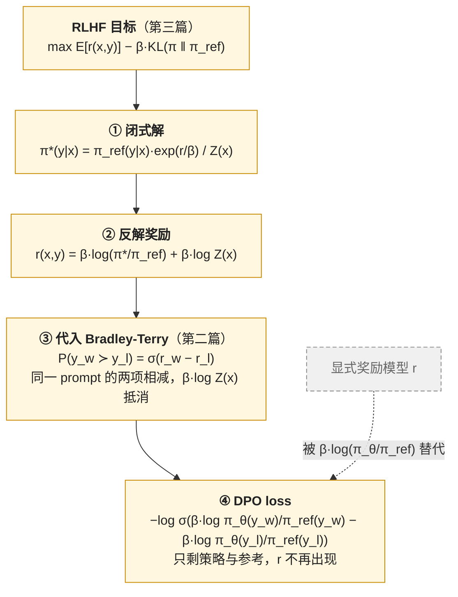

第三篇的方法都在做一件贵的事：每一步从当前策略采样、打分、再更新。采样要一个推理引擎，打分要一个奖励模型，更新要四个（或三个）模型在显存里。DPO（Direct Preference Optimization，Rafailov 等 2023）问的问题是：**同一个目标，能不能不采样、不打分，直接从一份现成的偏好数据推出一个 loss？[^q0]**

答案是能，而且推导只有几行——RLHF 的目标在 KL 约束下有闭式最优解，把它反解成奖励、代入 Bradley-Terry，奖励模型就消失了，剩下策略与参考的对数比。这一篇先把这几行推清楚，再看它付出了什么代价（隐式奖励只在数据分布上有定义），再把 2024 年冒出来的十几个变体——IPO、KTO、ORPO、SimPO、cDPO——放回三件套的表上，每个各改了一项。

先说清"离线"这个词。本篇的"离线"指**不与当前策略交互、只用一份事先收集好的偏好数据**训练，即文献里的 offline preference optimization / direct alignment algorithms；它与 RL 文献的 offline RL 共享"不与环境交互"这层含义，但没有价值函数，偏好数据也不必来自参考策略。介于在线与离线之间的半在线形态——迭代 DPO、在线 DPO、拒绝采样 + SFT——也在本篇。

本篇要回答的核心问题是：

> **DPO 真的"不需要奖励模型"吗？[^q1] 它的隐式奖励在哪里会失效？[^q2] 同一份偏好数据，DPO 与 PPO 训出的模型差在什么地方？[^q3]**

## 一、总览：把奖励折进策略

### 1. 先说答案

第三篇的目标 $$\max_\pi \mathbb{E}[r(x, y)] - \beta\, \text{KL}(\pi \| \pi_{ref})$$ 对每个 prompt 有闭式解：

$$
\pi^*(y \mid x) = \frac{1}{Z(x)}\, \pi_{ref}(y \mid x)\, \exp\!\left(\frac{r(x, y)}{\beta}\right)
$$

反解出 $$r(x, y) = \beta \log \frac{\pi^*(y \mid x)}{\pi_{ref}(y \mid x)} + \beta \log Z(x)$$。把它代入第二篇的 Bradley-Terry，$$Z(x)$$ 在同一 prompt 的两个回答相减时抵消，得到 DPO 的 loss：

$$
\mathcal{L}_{DPO} = -\mathbb{E}_{(x, y_w, y_l)} \left[ \log \sigma\!\left( \beta \log \frac{\pi_\theta(y_w \mid x)}{\pi_{ref}(y_w \mid x)} - \beta \log \frac{\pi_\theta(y_l \mid x)}{\pi_{ref}(y_l \mid x)} \right) \right]
$$

推导只有四步，奖励模型在第三步消失：



**DPO 不是没有奖励，而是把奖励用策略与参考的对数比隐式表达了**：$$\hat r_\theta(x, y) = \beta \log \frac{\pi_\theta(y \mid x)}{\pi_{ref}(y \mid x)}$$。训练 DPO 就是在训练一个参数化为"策略 / 参考"的奖励模型，同时策略本身就是这个奖励下的最优策略。

代价在于 **这个隐式奖励只在偏好数据的分布上被约束**。RM 对任意输入都给一个分（虽然分布外不可靠），DPO 的隐式奖励在没见过的回答上可以是任何值——策略在数据之外的行为不受偏好数据控制，只受参考策略控制。这是 DPO 比 PPO 更容易过拟合、以及"chosen 与 rejected 的概率同时下降"这一现象的根源。

| | PPO / GRPO | DPO |
|---|---|---|
| 模型数 | 4 / 3 | **2**（参考的对数概率可离线预计算 → 1） |
| 采样 | 每步从当前策略 | 不采样 |
| 奖励 | 显式 RM | 隐式：$$\beta \log(\pi_\theta / \pi_{ref})$$ |
| 数据 | prompt | (prompt, chosen, rejected) |
| 8B 规格显存 | 288 / 160 GB | 128 GB（LoRA：约 20 GB） |
| 一轮 10 万对的算力 | 数百到千 GPU 小时 | 约 10 GPU 小时 |
| 上限 | 高（能用 on-policy 探索） | 受数据分布限制 |

Table: PPO / GRPO 与 DPO 的对比

### 2. 本文的路线

先推闭式解与 DPO 的 loss、看它的梯度；再讲它的失效方式——似然同降、过优化、长度、分布外；再把变体按"改了哪一项"排开；然后是半在线的三种形态与"on-policy 数据"这个 2024 年的共识；再对照 DPO 与 PPO 的实证比较、算 DPO 的成本；最后是三件套对照表第二版与公开配方。

### 3. 本文的章节安排

| 章 | 主题 | 内容 |
|---|---|---|
| 二 | 推导 | 变分问题的闭式解；反解奖励；$$Z(x)$$ 抵消；DPO 的 loss 与梯度；$$\beta$$ 的含义 |
| 三 | 隐式奖励的失效 | 似然同降；过优化随 KL 的规律；长度；参考的选择；分布外 |
| 四 | 一族变体 | IPO、KTO、ORPO、SimPO、cDPO / rDPO、RPO、TDPO 各改哪一项；一张表 |
| 五 | 半在线 | 拒绝采样 + SFT；迭代 DPO；在线 DPO；为什么 on-policy 数据重要 |
| 六 | DPO 与 PPO | 实证比较；数据效率与上限；什么时候选哪个 |
| 七 | 成本 | 一轮 DPO 的 FLOPs 与显存；预计算参考对数概率；LoRA 下的参考 |
| 八 | 三件套对照表（第二版） | |
| 九 | 公开配方 | Zephyr、Tülu 2 / 3、Llama 3、Qwen2.5、Nemotron |
| 十 | 动手 | `DPOTrainer` 的骨架与该看的曲线 |
| 十一 | 本文小结 | |
| 十二 | 自测 | 5 道题 |

Table: 本文的章节安排

## 二、推导

### 1. KL 约束下的最优策略

固定一个 prompt $$x$$，在所有分布 $$\pi(\cdot \mid x)$$ 上最大化

$$
J(\pi) = \sum_y \pi(y) r(y) - \beta \sum_y \pi(y) \log \frac{\pi(y)}{\pi_{ref}(y)}
$$

约束 $$\sum_y \pi(y) = 1$$。拉格朗日函数 $$J - \lambda(\sum_y \pi(y) - 1)$$ 对 $$\pi(y)$$ 求导置零：

$$
r(y) - \beta \log \frac{\pi(y)}{\pi_{ref}(y)} - \beta - \lambda = 0
\quad\Longrightarrow\quad
\pi(y) = \pi_{ref}(y) \exp\!\left(\frac{r(y)}{\beta}\right) \exp\!\left(-1 - \frac{\lambda}{\beta}\right)
$$

最后一个因子由归一化定，记作 $$1 / Z(x)$$：

$$
\pi^*(y \mid x) = \frac{\pi_{ref}(y \mid x) \exp(r(x, y) / \beta)}{Z(x)},\qquad Z(x) = \sum_y \pi_{ref}(y \mid x) \exp\!\left(\frac{r(x, y)}{\beta}\right)
$$

这个解有一个直观读法：**最优策略 = 参考策略按 $$e^{r / \beta}$$ 重新加权**。$$\beta \to \infty$$ 时权重趋于 1，$$\pi^* = \pi_{ref}$$（不敢动）；$$\beta \to 0$$ 时权重集中到奖励最高的 $$y$$（贪心）。它在统计物理里是 Gibbs 分布，$$\beta$$ 是温度，$$Z$$ 是配分函数——$$Z(x)$$ 对整个序列空间求和，算不出来，这是它不能直接用的原因，也是 DPO 要绕的东西。

### 2. 反解奖励

对上式取对数、移项：

$$
r(x, y) = \beta \log \frac{\pi^*(y \mid x)}{\pi_{ref}(y \mid x)} + \beta \log Z(x)
$$

**任何奖励函数都可以用它的最优策略与参考策略的对数比表示**，只差一个与 $$y$$ 无关的项 $$\beta \log Z(x)$$。而第二篇说过，Bradley-Terry 的奖励本来就只定义到每个 prompt 的一个常数——$$\beta \log Z(x)$$ 正是那个常数。

### 3. 代入 Bradley-Terry

第二篇的偏好概率 $$P(y_w \succ y_l \mid x) = \sigma(r(x, y_w) - r(x, y_l))$$，代入上式，$$\beta \log Z(x)$$ 相减抵消：

$$
P(y_w \succ y_l \mid x) = \sigma\!\left( \beta \log \frac{\pi^*(y_w \mid x)}{\pi_{ref}(y_w \mid x)} - \beta \log \frac{\pi^*(y_l \mid x)}{\pi_{ref}(y_l \mid x)} \right)
$$

现在偏好概率**只由策略与参考决定**。把 $$\pi^*$$ 换成待训练的 $$\pi_\theta$$，对偏好数据做最大似然，就是第一章的 $$\mathcal{L}_{DPO}$$。RM 训练与 DPO 是同一个逻辑回归——只是 RM 用一个独立的网络参数化 $$r$$，DPO 用 $$\beta \log(\pi_\theta / \pi_{ref})$$ 参数化它。

第二篇的 RM 训练 + 第三篇的 RL 两步，被 DPO 合成了一步，且**这一步的最优解与两步的最优解相同**（在 Bradley-Terry 假设成立、且策略族足够大的前提下）。这是 DPO 论文的核心定理。

### 4. 梯度

记 $$\hat r_\theta(x, y) = \beta \log \frac{\pi_\theta(y \mid x)}{\pi_{ref}(y \mid x)}$$，

$$
\nabla_\theta \mathcal{L}_{DPO} = -\beta\, \mathbb{E}\Big[ \underbrace{\sigma\big(\hat r_\theta(x, y_l) - \hat r_\theta(x, y_w)\big)}_{\text{权重：隐式奖励排错的程度}} \Big( \underbrace{\nabla_\theta \log \pi_\theta(y_w \mid x)}_{\text{提高 chosen}} - \underbrace{\nabla_\theta \log \pi_\theta(y_l \mid x)}_{\text{压低 rejected}} \Big) \Big]
$$

三个部分各有含义。**方向**：提高 chosen 的对数概率、压低 rejected 的——与第三篇 REINFORCE 的"按奖励加权的 SFT / 反 SFT"同形。**权重**：$$\sigma(\hat r_l - \hat r_w)$$ 是隐式奖励目前认为 rejected 更好的概率，与第二篇 RM 梯度的权重 $$\sigma(-\Delta)$$ 完全对应——排对且差距大的对不再产生梯度，排错的对权重接近 1。**$$\beta$$**：既是整体的梯度尺度，又在权重的 $$\sigma$$ 里决定"多大的对数比差距算排好了"：$$\beta$$ 小时 $$\sigma$$ 的输入小、权重长期接近 0.5、策略可以走得远；$$\beta$$ 大时对数比稍有差距权重就归零，策略被钉在参考附近。默认 0.1；Zephyr 用 0.01，Llama 3 用 0.1。

### 5. DPO 是什么

综合起来，DPO 的一步做三件事：算 chosen 与 rejected 在策略与参考下的对数概率（四次前向，其中参考的两次可以预计算）、算隐式奖励的差、按 $$\sigma$$ 加权做一步"提高 chosen 压低 rejected"。它没有采样、没有价值函数、没有重要性比、没有 clip。**它把 RL 变成了一个分类问题**——这既是它便宜的原因，也是下一章问题的原因。

## 三、隐式奖励的失效

### 1. 似然同降

DPO 训练中最常被观察到的现象：**chosen 与 rejected 的对数概率一起下降**，只是 rejected 降得更快，差距在拉开。loss 在降、隐式奖励的准确率在涨，但模型对偏好数据里"好的回答"的概率也在降——概率跑到了别处。

原因在梯度里：DPO 的目标只约束**差**，loss 只要差距拉开就满意，不管两者绝对值。至于概率为什么会往下跑，要小心一个直觉上的错误解释："chosen 与 rejected 共享前缀，压 rejected 顺带压了 chosen"——对**完全相同**的前缀 token（同一 prompt 下同一位置同一 token），两条序列的 logprob 项与梯度是精确抵消的，差里根本没有它们。真正起作用的是参数耦合：模型学的是表征，chosen 与 rejected 的 embedding 越相似，压低后者的参数更新就越会连带压低前者；被挤出去的概率质量流向偏好数据里没出现的序列——Razin 等 2024 把它命名为 likelihood displacement，并证明当 chosen 与 rejected 在 embedding 上相似时最严重（Pal 等 2024 也在数学推理数据上观察到同样现象，那里 chosen 与 rejected 常只差一步）。后果可以很实际：安全对齐时 chosen 是"礼貌拒绝"、rejected 是"照做"，两者相似，训练后概率流向"不礼貌地照做"。

对策有三类：给 loss 加一项 chosen 的 SFT 项（下一章的 RPO），让 chosen 的绝对概率有梯度维持；挑数据，去掉 chosen 与 rejected 过于相似的对；或换用不只约束差的 loss（IPO、KTO）。

### 2. 过优化：与 PPO 同一条曲线

DPO 没有显式 RM，是否就没有第二篇的 Goodhart？Rafailov 等 2024 对 DPO、IPO、SLiC 三种直接对齐方法做了与 Gao 等 2022 同样的实验：横轴 KL（对参考），纵轴金标准 RM 的分数。**曲线形状相同**——先升后降，且 $$\beta$$ 越小（允许的 KL 越大）峰越早过。隐式奖励在数据分布外不受约束，策略一旦走出去，隐式奖励可以给任何序列高分，效果就是 hacking 一个不存在的 RM。差别只在过优化的"内容"：PPO 利用的是 RM 的捷径，DPO 利用的是数据没覆盖到的地方。

这给了 DPO 一个与 PPO 相同的操作规则：**有 KL 预算，按 KL 而不是按 loss 决定停**。DPO 的 KL 不像 PPO 那样每步有监控值——它要额外算。注意**不能**用训练集 chosen 上的隐式奖励均值 $$\mathbb{E}[\hat r_\theta]/\beta$$ 当 KL：KL 的期望要对**当前策略采样的** $$y$$ 取，chosen 是固定数据，两者可以差很远甚至符号相反（CPU 小例：$$\pi = (0.2, 0.8)$$、$$\pi_{ref} = (0.5, 0.5)$$，只看第一项的对数比是 $$-0.92$$，真实 KL 是 $$+0.19$$）。要算就对一组 prompt 用当前策略采样、算 $$\log\pi_\theta - \log\pi_{ref}$$ 的均值。很多 DPO 训练就这样在没有 KL 监控的情况下过优化了。

### 3. 长度

DPO 与 PPO 一样会拉长回答，机制略不同：偏好数据里 chosen 平均更长（第二篇），DPO 的隐式奖励是整条序列的对数比之和——**长度越长，对数比的绝对值越容易大**，策略发现"变长"是拉开差距最容易的方向。Park 等 2024（R-DPO）加一个与长度差成比例的正则项；SimPO（第四章）把隐式奖励换成按长度归一化的平均对数概率，直接消掉这个偏差；Tülu 3 也报告长度归一化的 DPO 优于标准 DPO。

### 4. 参考的选择

$$\pi_{ref}$$ 通常是 SFT 模型。DPO 的推导本身不要求偏好数据从 $$\pi_{ref}$$ 采样（第二章说过它是离线方法），要求的是 $$\pi_{ref}$$ 在这些回答上有非零概率、且数据覆盖了要区分的区域；论文用 SFT 模型作参考、并建议偏好对来自它附近，是为了让对数比有意义、噪声可控。实践里偏好数据常来自别的模型（UltraFeedback 的四个模型），参考在这些回答上的概率很低、对数比噪声大。两个补救：先用偏好数据的 chosen 做一轮 SFT 再当参考（DPO 论文自己的做法），或直接用当前策略采样重造偏好数据（第五章）。参考也可以在训练中更新（每隔若干步把参考换成当前策略），这让策略走得更远，也更容易过优化。

### 5. 分布外的一句话

以上四个问题的共同根源：**DPO 的一切约束都在偏好对上，对上没有的地方由参考策略说了算**。这不是缺陷而是设计——它就是用这个换掉了采样与 RM。理解了这一句，下一章每个变体在改什么就清楚了。

## 四、一族变体：各改了哪一项

把 DPO 的 loss 拆成四个部件：（一）**隐式奖励**怎么定义（对数比 / 不带参考 / 长度归一化），（二）**成对还是单样本**，（三）**loss 的形状**（$$-\log\sigma$$ / 平方 / hinge / 效用函数），（四）**要不要参考模型**。每个变体改其中一到两项：

| 方法 | 改了什么 | loss | 解决的问题 |
|---|---|---|---|
| **DPO**（2023） | 基线 | $$-\log\sigma(\hat r_w - \hat r_l)$$ | — |
| **IPO**（Azar 等 2023） | loss 形状：平方；不假设 Bradley-Terry | $$\big(\hat r_w - \hat r_l - \frac{1}{2\tau}\big)^2$$，$$\hat r$$ 为不带 $$\beta$$ 的对数比 | DPO 在确定性偏好（同一对总是 chosen 胜）下会把对数比推到无穷、过拟合；IPO 把它推到一个固定的 margin $$1 / 2\tau$$ 就停 |
| **KTO**（Ethayarajh 等 2024） | 不要成对：每个样本一个"好 / 坏"标签；loss 用前景理论的效用函数 | 好样本 $$\lambda_D\big(1 - \sigma(\beta(\hat r - z_0))\big)$$，坏样本 $$\lambda_U\big(1 - \sigma(\beta(z_0 - \hat r))\big)$$，$$z_0$$ 是当前 KL 的估计 | 成对数据贵；单样本数据（点赞 / 点踩）多得多；$$\lambda_D / \lambda_U$$ 可处理好坏样本不平衡 |
| **ORPO**（Hong 等 2024） | 去掉参考；把 SFT 与偏好合成一步 | $$\mathcal{L}_{SFT}(y_w) - \lambda \log\sigma\big(\log\frac{\text{odds}(y_w)}{\text{odds}(y_l)}\big)$$，$$\text{odds}(y) = \frac{\pi(y)}{1 - \pi(y)}$$（长度归一化的概率） | 少一个模型；不必先 SFT 再 DPO；SFT 项防止似然同降 |
| **SimPO**（Meng 等 2024） | 去掉参考；隐式奖励换成长度归一化的平均对数概率；加 margin | $$-\log\sigma\big(\frac{\beta}{\lvert y_w \rvert}\log\pi(y_w) - \frac{\beta}{\lvert y_l \rvert}\log\pi(y_l) - \gamma\big)$$ | 隐式奖励与生成时的度量（平均对数概率）一致；消长度偏差；少一个模型 |
| **cDPO / rDPO**（2023–24） | loss 对标签噪声鲁棒 | cDPO：标签平滑 $$(1 - \epsilon)\mathcal{L}(w, l) + \epsilon \mathcal{L}(l, w)$$；rDPO：无偏的噪声修正 | 偏好数据有可观的标签噪声（第二篇：人际一致率 70–75% 是它的线索，但不等于 25–30% 的错标率） |
| **RPO**（Llama 3、Pang 等 2024） | 加 chosen 的 NLL 项 | $$\mathcal{L}_{DPO} + \alpha \cdot \mathcal{L}_{SFT}(y_w)$$（Llama 3 取 $$\alpha = 0.2$$，且按长度归一化） | 似然同降；保持 chosen 的绝对概率 |
| **TDPO**（Zeng 等 2024） | token 级：每个 token 的 KL 单独约束 | DPO 加逐 token 的前向 KL 差项 | 序列级 KL 让少数 token 承担全部偏移 |
| **SLiC-HF**（Zhao 等 2023） | loss 形状：hinge；不用参考的对数比 | $$\max(0, \delta - \log\pi(y_w) + \log\pi(y_l)) + \lambda \mathcal{L}_{SFT}$$ | DPO 之前的排序 loss 做法 |
| **Step-DPO / 迭代推理 DPO** | 数据粒度：偏好对是"同一前缀的下一步" | DPO loss 不变 | 长推理链上整条序列的 DPO 信号太弱 |

Table: DPO 一族变体各改了哪一项

几个观察：

- **去掉参考模型的方法（ORPO、SimPO）都用了长度归一化**——没有参考做锚，绝对对数概率对长度极敏感，不归一化就全是长度偏差。
- **加 SFT 项的方法（ORPO、RPO、SLiC）都在防似然同降**——给 chosen 的绝对概率一个正梯度。Llama 3 与 Nemotron 都选了这条，说明它在大规模数据上是真实问题。
- **KTO 是唯一改数据形态的**——它的价值不在 loss 形状，在能用点赞 / 点踩这种廉价信号。
- 消融上，这些变体在标准 benchmark（AlpacaEval、Arena-Hard、MT-Bench）上互有胜负，差距通常小于**数据的差距**——同一方法换一份更 on-policy 的数据，收益比换方法大（第五章）。

## 五、半在线：把采样加回来一点

### 1. 拒绝采样 + SFT

最简单的"用奖励改策略"：对每个 prompt 用当前策略采 $$K$$ 条，用 RM 选分最高的，把 (prompt, 最佳回答) 当 SFT 数据训。Llama 2 的 RLHF 前四轮全是它（$$K$$ 到 10–100），Llama 3 的 SFT 数据主要也来自它（$$K$$ = 10–30）。它在三件套上的位置：奖励是 RM，参考是隐式的（SFT 的小 lr 让策略不会离太远），采样来自当前策略（在线），但更新是 SFT（没有负样本、没有 KL 项）。

它与第二篇 best-of-N 的关系：拒绝采样 + SFT 就是**把 BoN 的分布蒸馏进策略**——BoN 每次推理要采 $$K$$ 条，蒸馏后一次生成就得到近似 BoN 的输出。第二篇的公式 $$\text{KL}(\pi_{BoN} \| \pi) = \log K - (K-1)/K$$ 给出这一步走了多远：$$K = 30$$ 约 2.4 nats。BOND（Sessa 等 2024，Gemma）把这个思路做成了显式的分布匹配目标。

它与投机解码里的"拒绝采样"（L4 第七篇）同名不同物：那里是按概率比接受草稿 token 的精确采样算法，这里是"采 $$K$$ 个选最好"的启发式。

### 2. 迭代 DPO

Llama 3 的六轮：每轮用**最新的策略**对 prompt 采样多条 → RM（或人）标偏好 → 在这份新数据上做 DPO（参考也换成最新策略）→ 下一轮。每一轮内部是离线 DPO，轮与轮之间是在线的采样与标注。它把 DPO 的"数据分布外不受约束"问题用最直接的办法修了——**让数据就来自策略自己**，策略要走去的地方正是新一轮采样覆盖的地方。代价是每轮一批标注（Llama 3 用 RM 标，人只标一部分）与每轮一次 rollout。

### 3. 在线 DPO

把迭代压到每一步：每步对 batch 里的 prompt 用当前策略采两条，用 RM 或 judge 判哪条好，立刻做一步 DPO（Guo 等 2024 的 OAIF；`trl` 的 `OnlineDPOTrainer`）。这已经是在线 RL 了——有采样、有打分、每步更新——只是更新规则用 DPO 的 loss 而不是策略梯度。它与 GRPO 的差别只在 loss 的形状（成对的 $$\log\sigma$$ 对 组内归一化的优势），成本与系统需求（推理引擎、RM 在线打分）与第三篇相同。这说明"在线 / 离线"与"DPO / PPO"是两个独立的轴：**DPO 是一个 loss，不是一种训练范式**。

### 4. 为什么 on-policy 数据重要

2024 年多篇工作从不同角度得到同一结论：Tajwar 等 2024 用受控实验说明，让偏好优化有效的两个要素是 **on-policy 采样**与**负梯度**（压低坏样本）——有这两样，具体用哪个 loss 差别不大；Tülu 3 的消融显示同量的偏好数据，on-policy 的（用自家模型池采样）显著优于 off-policy 的（UltraFeedback）；Llama 3 与 Nemotron 都用迭代形态。原因回到第三章第 5 节：DPO 只约束数据覆盖的地方，数据越接近策略要去的地方，约束越有效。**离线 DPO 的上限由数据与策略的距离决定，而不是由 loss 决定。**

## 六、DPO 与 PPO

### 1. 实证比较

| 研究 | 设置 | 结论 |
|---|---|---|
| Rafailov 等 2023（DPO 原文） | 摘要、对话，1–6B | DPO ≥ PPO，且更稳、更省 |
| Ivison 等 2024（Tülu 2.5） | 7–70B，多份偏好数据，多 benchmark | PPO 在多数任务上略优（尤其推理与代码）；**RM 的质量与数据的 on-policy 程度比算法选择影响更大** |
| Xu 等 2024 | 对话与代码 | PPO 在代码竞赛上明显优；DPO 对分布外数据敏感 |
| Rafailov 等 2024 | 过优化 | 两者随 KL 的过优化曲线形状相同 |
| Llama 3 | 8B–405B | 选 DPO：在同等算力下更稳定、更好调，且 PPO 在 405B 上的显存与工程成本过高 |

Table: DPO 与 PPO 的实证比较

综合：**PPO 的上限略高，DPO 的性价比更高**；在 on-policy 数据充足（迭代形态）时差距缩小；在需要探索的任务（推理、代码——正确答案在参考策略下概率很低，要靠采样才能碰到）上 PPO / GRPO 明显占优，这是第五篇 RLVR 全部用在线方法的原因。

### 2. 什么时候选哪个

| 场景 | 选 | 理由 |
|---|---|---|
| 通用对话对齐，有现成偏好数据 | DPO（迭代） | 便宜、稳、够用 |
| 可验证奖励的推理 / 代码 | GRPO / PPO | 要探索；规则奖励下没有 hacking，KL 可去 |
| 只有点赞 / 点踩信号 | KTO | 单样本 |
| 显存只够一个模型 + LoRA | DPO / ORPO / SimPO | 两个或一个模型 |
| 已有强 RM 且要压到极限 | PPO / GRPO + 迭代重训 RM | 上限 |
| 安全对齐（chosen / rejected 相似） | DPO + NLL 项，或 PPO | 似然同降的高发区 |

Table: DPO 与在线 RL 什么时候选哪个

### 3. 数据效率

DPO 用每对数据一次（几个 epoch），PPO 用每个 prompt 生成新样本无限次——PPO 的"数据"是 prompt，DPO 的是 (prompt, chosen, rejected)。同样 10 万个 prompt，DPO 需要 10 万对标注，PPO 需要 0 对标注但要一个 RM（它需要几万对）。标注成本上两者接近，差别在 RM 训好后 PPO 可以无限采样、DPO 每轮迭代都要重新标。

## 七、成本

### 1. 一轮 DPO 的 FLOPs

每对两条序列；每条要算策略的前向反向（$$6N$$）与参考的前向（$$2N$$）：每 token $$8N$$，每对 $$16N \bar L$$。8B 模型、10 万对、每条 1000 token：$$8 \times 8\text{B} \times 2 \times 10^8 = 1.3 \times 10^{19}$$ FLOPs，H100 40% MFU 约 **9 GPU 小时**。Llama 3 的每轮 DPO 在这个量级乘上它的数据量与规模；与第三篇 GRPO 一轮的几百到上千 GPU 小时相比差一到两个数量级——差的正是采样与 $$G$$ 倍的 rollout。

### 2. 显存：两个模型，或一个

策略是训练状态（8B：128 GB），参考只需推理权重（16 GB）。参考在整个训练中不变，它对每对数据的对数概率只要算一次——**预计算**（`trl` 的 `precompute_ref_log_probs`）：训前对全部数据跑一遍参考前向，存两个标量（chosen 与 rejected 的对数概率之和），训练时参考模型不再加载。显存降到一个模型，且每步少两次前向。

用 LoRA 训 DPO 时还有一个免费的参考：**关掉 adapter 的底座就是参考**（策略 = 底座 + LoRA，参考 = 底座），一份权重两个用途，`peft` 的 `disable_adapter()` 上下文就是干这个的。8B + LoRA 的 DPO 训练状态约 17 GB（第一篇的账）加激活值，一张 24 GB 的卡能跑。这是 DPO 在 2024 年成为开源社区默认对齐方法的现实原因。

### 3. 迭代形态的成本

迭代 DPO 每轮加一次 rollout（$$K$$ 条 × prompt 数 × $$2N$$）与一次 RM 打分，与第三篇 GRPO 一步的生成账相同，只是轮数少（6 轮对几百步）。Llama 3 六轮的总 rollout 量与一次中等规模的 GRPO 训练相当，但可以离线、批量、用最优化的推理引擎跑——不需要训练循环里的推理引擎，这是它在系统上比在线 RL 简单的地方。

## 八、三件套对照表（第二版）

在第三篇的表上加离线的一族；"从当前策略采样"一列现在有三种值：

| 方法 | 奖励从哪来 | 参考怎么约束 | 价值模型 | 采样 | 每 prompt 生成 | 模型数 |
|---|---|---|---|---|---|---|
| SFT | 标注序列（隐式） | 无 | 无 | 否 | 0 | 1 |
| PPO | 显式 RM | $$k_1$$ 进奖励 | 有 | **在线** | 1 | 4 |
| GRPO | RM / 规则 | $$k_3$$ 进 loss | 无 | 在线 | $$G$$ | 3 |
| 拒绝采样 + SFT | 显式 RM 选最佳 | 隐式（SFT 小 lr） | 无 | 在线（采样）+ 离线（更新） | $$K$$ | 2（RM + 策略） |
| 在线 DPO | RM / judge 判对 | 对数比 | 无 | 在线 | 2 | 3 |
| 迭代 DPO | RM 标偏好 | 对数比，参考每轮更新 | 无 | **半在线** | 若干 | 2–3 |
| DPO | 偏好对（隐式奖励 $$\beta\log\frac{\pi}{\pi_{ref}}$$） | 对数比折进 loss | 无 | **离线** | 0 | 2（参考可预计算 → 1） |
| IPO | 同 DPO | 同 DPO，平方 loss 到固定 margin | 无 | 离线 | 0 | 2 |
| KTO | 单样本好 / 坏标签 | 对数比，$$z_0$$ 为 KL 估计 | 无 | 离线 | 0 | 2 |
| ORPO | 偏好对 | **无参考**；SFT 项 + odds ratio | 无 | 离线 | 0 | **1** |
| SimPO | 偏好对 | **无参考**；长度归一化对数概率 + margin | 无 | 离线 | 0 | **1** |
| RPO | 偏好对 + chosen NLL | 对数比 | 无 | 离线（Llama 3 迭代） | 0 | 2 |

Table: 三件套对照表（第二版）

读这张表的方法：从右往左，模型数与采样方式决定成本；从左往右，奖励与参考的形态决定上限与失效方式。

## 九、公开配方

| 配方 | 方法 | 关键数字 | 特点 |
|---|---|---|---|
| Zephyr-7B（2023） | SFT（UltraChat）→ DPO（UltraFeedback） | $$\beta = 0.01$$，3 epoch | 开源 DPO 的起点；证明蒸馏数据 + DPO 能追上 RLHF 的对话模型 |
| Tülu 2（2023） | DPO | $$\beta = 0.1$$ | 首个 70B 规模的开源 DPO |
| Tülu 3（2024） | **长度归一化 DPO**，on-policy 偏好数据 | 8B：lr 5e-7；数据来自自家模型池 + GPT-4o judge | 消融：on-policy > off-policy；长度归一化 > 标准 |
| Llama 3（2024） | 六轮 拒绝采样 → SFT → **DPO + NLL**（RPO） | $$\beta = 0.1$$，lr 1e-5，NLL 权重 0.2；DPO loss 中 **mask 掉特殊 token**（模板与 EOS） | 每轮参考换最新；checkpoint 平均；不用 PPO 的理由是稳定性与工程成本 |
| Qwen2.5（2024） | 离线 DPO → 在线 GRPO | 15 万对偏好 → GRPO | 两阶段：先离线拉大方向，再在线精调 |
| Nemotron-4 340B（2024） | DPO → RPO 多轮 | RPO 的 NLL 项 | 用自家 RM 迭代 |
| Gemma 2 / 3 | RLHF（未公开细节）+ BOND 式蒸馏 | — | 把 BoN 分布蒸进策略 |
| DeepSeek-V3 / R1 | 不用 DPO，GRPO | — | 推理与通用都在线 |

Table: 公开 DPO 配方

Llama 3 那条"mask 掉特殊 token"值得单独记：模板的 `<|eot_id|>` 等 token 在 chosen 与 rejected 里都出现，它们的对数比差是纯噪声，却因为每条都有而占了不小的梯度；去掉之后 DPO 更稳。这是第一篇的模板问题在 DPO 里的形态。

## 十、动手：`DPOTrainer` 的骨架与该看的曲线

```python
from trl import DPOTrainer, DPOConfig

cfg = DPOConfig(
    beta=0.1,                          # 第二章第 4 节：既是梯度尺度也是"多大差距算排好"
    loss_type="sigmoid",               # 或 "ipo" / "hinge" / "robust"…（列表随版本变，按你 pin 的 trl 查 DPOConfig）；
                                       # SimPO、KTO 不是这里的一个字符串：前者要 CPOTrainer(loss_type="simpo")，后者要 KTOTrainer 与不同的数据格式
    rpo_alpha=None,                    # 设 0.2 即 Llama 3 的 DPO + NLL
    precompute_ref_log_probs=True,     # 第七章：参考只跑一遍，训练时不加载
    learning_rate=5e-7, num_train_epochs=2, max_length=1024,
)
trainer = DPOTrainer(model=SFT_MODEL, ref_model=None,      # None：LoRA 下用关掉 adapter 的模型作参考——所以 SFT_MODEL 必须是已 merge 的 SFT 权重，
                                                          # 若第一篇的 SFT 本身是 LoRA 且未 merge，关掉 adapter 得到的是裸 base，不是 SFT 参考
                     args=cfg, train_dataset=pairs,        # 每条 {"prompt": ..., "chosen": ..., "rejected": ...}
                     processing_class=tok, peft_config=lora_cfg)
trainer.train()
```

`loss_type` 一个参数切换第四章表里的一部分变体（哪些在 `DPOConfig` 里、哪些要换 trainer 与数据格式，按 pin 的版本查），是体会"它们只差一个 loss 形状"最直接的方法。该看的曲线，按第三章的失效方式：

1. **`rewards/chosen` 与 `rewards/rejected`**——两条隐式奖励的均值。正常是 chosen 涨、rejected 降；**两条都降**就是第三章第 1 节的似然同降，加 `rpo_alpha`；
2. **`rewards/margins`** 与 **`rewards/accuracies`**——隐式奖励的差与排对的比例。这是训练集上的数，涨到 90%+ 说明在记数据；要看的是留出对上的准确率有没有一起涨（第二篇 §二.4：人的一致率不是上限，不要拿它当停止线）；
3. **`logps/chosen`**——chosen 的绝对对数概率。它比隐式奖励更早暴露问题；
4. **KL**——`trl` 不默认记录；对一组固定 prompt 用当前策略采样、算 $$\log\pi_\theta - \log\pi_{ref}$$ 的均值（不能用 chosen 上的隐式奖励代替，第三章 §2）；到 2–3 nats 时用 judge 核对；
5. **生成长度**——训后采样一批与 SFT 模型对比，涨 30% 以上要换长度归一化的变体。

同一份数据把 `loss_type` 换成 `"ipo"` 再跑一遍（SimPO 用 `CPOTrainer`），对比 1 与 5——是第四章那张表最便宜的验证。

## 十一、本文小结

| 项 | 公式 / 规则 | 备注 |
|---|---|---|
| 闭式解 | $$\pi^* \propto \pi_{ref} \exp(r / \beta)$$ | Gibbs 分布；$$Z(x)$$ 算不出来 |
| 反解 | $$r = \beta\log\frac{\pi^*}{\pi_{ref}} + \beta\log Z$$ | 常数项在成对比较里抵消 |
| DPO | $$-\log\sigma\big(\beta\log\frac{\pi(y_w)}{\pi_{ref}(y_w)} - \beta\log\frac{\pi(y_l)}{\pi_{ref}(y_l)}\big)$$ | RM 训练 + RL 合成一步；同一个逻辑回归 |
| 梯度 | 权重 $$\sigma(\hat r_l - \hat r_w)$$ × (提高 chosen − 压低 rejected) | 与 RM 梯度同形 |
| 失效 | 似然同降；过优化随 KL；长度；参考不匹配 | 根源：只约束数据覆盖的地方 |
| 变体 | IPO 平方 loss；KTO 单样本；ORPO / SimPO 去参考 + 长度归一化；RPO 加 NLL；cDPO 噪声 | 换方法的收益 < 换数据 |
| 半在线 | 拒绝采样 + SFT（= 蒸馏 BoN）；迭代 DPO（Llama 3 六轮）；在线 DPO（= 用 DPO loss 的在线 RL） | on-policy 数据是关键 |
| DPO vs PPO | PPO 上限略高（探索），DPO 性价比高；推理 / 代码用在线 | RM 质量与数据 > 算法 |
| 成本 | $$8N$$/token；10 万对 8B 约 9 GPU 小时 | 参考可预计算；LoRA 下参考免费 |

Table: DPO 的公式与规则小结


到此，用**学出来的**奖励改策略的两条路都讲完了。下一篇换奖励的来源：不学，直接验——规则奖励下的 RL 如何训出长思维链。

配套资料：本篇没有配套实验；第十章的骨架可在 [ai-learning-labs/post-training](https://github.com/arganzheng/ai-learning-labs/tree/main/post-training) 第一篇的环境上用 LoRA 在单卡运行。

## 十二、自测

1. DPO 的隐式奖励是什么？给它加一个只依赖 prompt 的常数，loss 变不变？

   <details markdown="1"><summary>答案</summary>

   $$\hat r_\theta(x, y) = \beta \log \frac{\pi_\theta(y \mid x)}{\pi_{ref}(y \mid x)}$$；不变——loss 只看同一 prompt 下两个回答的分差，常数抵消（$$Z(x)$$ 就是这样消掉的）。

   </details>

2. DPO 训练中 chosen 与 rejected 的对数概率同时下降，loss 却在降——发生了什么？

   <details markdown="1"><summary>答案</summary>

   loss 只要求两者的差拉开，不要求 chosen 的概率上升；概率质量流向了数据里没有的序列（分布外）。这是隐式奖励只在数据分布上受约束的直接表现；RPO 加一项 chosen 的 NLL 就是防它。

   </details>

3. 同一份 10 万对偏好数据，8B 模型跑一轮 DPO 与一轮 PPO，GPU 小时各是什么量级？为什么差这么多？

   <details markdown="1"><summary>答案</summary>

   DPO 约 10 GPU 小时（每对两次前向反向 $$\approx 8N$$ / token，参考的对数概率可预计算）；PPO 数百到上千——每步要采样、打分、四个模型，且要很多步。

   </details>

4. ORPO / SimPO 去掉了参考模型，用什么代替它约束策略？代价是什么？

   <details markdown="1"><summary>答案</summary>

   用长度归一化的对数概率本身当奖励（SimPO）或加一个 odds ratio 项（ORPO），不再相对参考；省一个模型的显存与前向，但失去“离参考多远”的锚，更依赖数据与早停。

   </details>

5. Llama 3 的后训练做了六轮“拒绝采样 + SFT + DPO”，每一轮为什么要重新采样？这在 DPO 与 PPO 之间的哪个位置？

   <details markdown="1"><summary>答案</summary>

   偏好数据要来自当前策略（on-policy）——用旧策略的数据训新策略，DPO 的隐式奖励在新策略会去的地方没有约束；迭代 DPO 是半在线：每轮采样一次、离线训一轮，介于纯离线 DPO 与每步采样的 PPO 之间。

   </details>

## 下一篇

[推理模型与可验证奖励：R1 的配方、PRM 与 test-time compute](/reasoning-models-and-verifiable-rewards.html)

[^q0]: 能。KL 约束下的最优策略有闭式解 $$\pi^* \propto \pi_{ref}\, e^{r/\beta}$$，反解出奖励、代入 Bradley-Terry，配分函数在同一 prompt 下抵消，得到只含策略与参考对数比的 loss——不用采样、不用打分。详见[第二章](#二推导)。
[^q1]: 不是不需要，而是把奖励模型**参数化为策略与参考的对数比**——$$\hat r = \beta \log(\pi_\theta / \pi_{ref})$$ 就是它的 RM，只是与策略共享参数、且训完即弃。详见[第二章](#二推导)。
[^q2]: 在偏好数据覆盖的地方它与显式 RM 等价，在数据之外没有任何约束——所以失效的地方是分布外：似然同降（概率流向数据里没有的序列）、过优化（走出数据范围后隐式奖励任意）、长度（拉开对数比最容易的方向）。变体各修其中一项。详见[第三章](#三隐式奖励的失效)、[第四章](#四一族变体各改了哪一项)。
[^q3]: 差在**能不能探索**：PPO 从当前策略采样，能发现参考策略下概率很低但奖励高的回答（推理、代码），DPO 只能在给定的对上拉开差距——所以对话对齐两者接近，推理任务 PPO / GRPO 明显占优。修 DPO 的办法都是往在线走一步：迭代、在线 DPO、拒绝采样——on-policy 数据比任何 loss 变体都重要。详见[第五章](#五半在线把采样加回来一点)、[第六章](#六dpo-与-ppo)。
